# Sweep Analysis: `lorenz_additive_joint_gennmse__lc_x_obsnoise__cleantarget`

**Project**: [Lorenz_INDall_N1_D1_NormTrue_T3__JacobianODE](https://wandb.ai/JacobianODE/Lorenz_INDall_N1_D1_NormTrue_T3__JacobianODE/groups/lorenz_additive_joint_gennmse__lc_x_obsnoise__cleantarget)  
**Launched**: 2026-04-13T15:04:51Z  
**Completed**: 2026-04-13T18:05:43Z  
**Outcome**: `complete_clean`  
**Git**: `latent-JacobianODE` @ `a5d7529`  
**Expected runs**: 27

## Experiment Context

### `lorenz_additive_joint_gennmse`

**Description**

Fully observed Lorenz-63 (all 3 dims, no delay embedding). Additive
coupling encoder with zero_init (starts at identity-permutation),
trained jointly with the Jacobian dynamics using gennMSE. Sweeps
loop_closure_weight × obs_noise_scale (9 × 3 = 27).

**Hypothesis**

With a well-conditioned additive encoder and gennMSE's stable loss
scaling, the latent JacobianODE learns Lorenz's attractor and
recovers its Lyapunov spectrum (λ ≈ [0.91, 0, -14.57], λ₁ > 0).
Optimal LC should sit in the 1e-5 – 1e-3 range with a broad basin.

**Success criteria**

- Best run's leading Lyapunov exponent > 0 (chaos recovered)
- Best run's predicted Lyapunov spectrum within ~20% of empirical
- val/trajectory_r2_score > 0.95 at the best configuration
- Loop closure bounded and monotonically improving at low LC

## Results

**Overall best MASE**: 0.4702 (LC weight = 1.0e-04, obs_noise_scale = 0.00)
**Overall best traj loss**: 0.00261 at epoch 121.0
**Runs analyzed**: 27

### Best run per `obs_noise_scale`

| obs_noise_scale | Best LC weight | Best traj loss | MASE at best | R² | LC loss | epoch |
|---|---|---|---|---|---|---|
| 0.0 | 1.0e-04 | 0.00261 | 0.4702 | 0.9997 | 0.066 | 121.0 |
| 0.01 | 1.0e-02 | 0.08491 | 1.9335 | 0.9892 | 1.046 | 27.0 |
| 0.05 | 1.0e-02 | 0.68282 | 6.7773 | 0.9131 | 1.379 | 48.0 |

## Success-criteria verdicts (automated)

| Criterion | Verdict | Note |
|---|---|---|
| Best run's leading Lyapunov exponent > 0 (chaos recovered) | **Unknown** |  |
| Best run's predicted Lyapunov spectrum within ~20% of empirical | **Unknown** |  |
| val/trajectory_r2_score > 0.95 at the best configuration | **Pass** | Best R² = 0.9997; threshold > 0.95 |
| Loop closure bounded and monotonically improving at low LC | **Unknown** |  |

_Automated verdicts use simple numeric-threshold parsing and may mis-classify qualitative criteria. The Discussion section below takes precedence._

## Figures

### sweep_overview

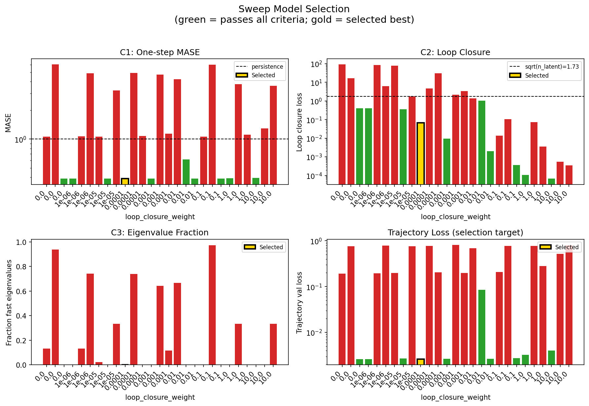

### sweep_pareto

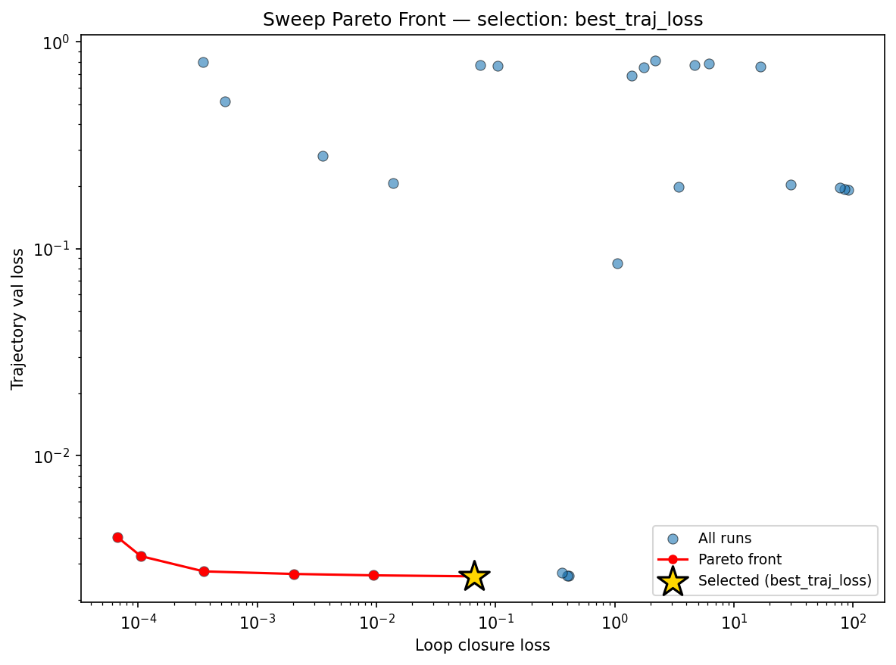

### prediction_windows

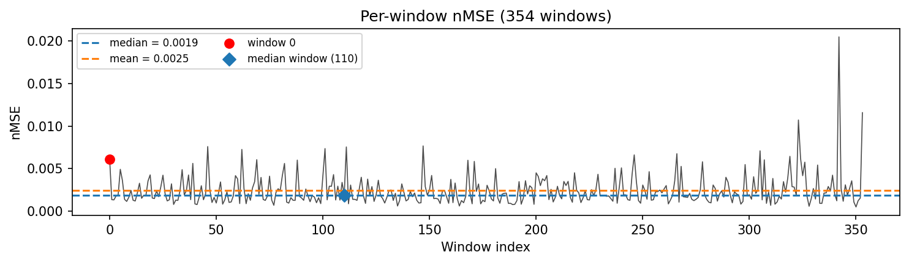

### long_trajectory

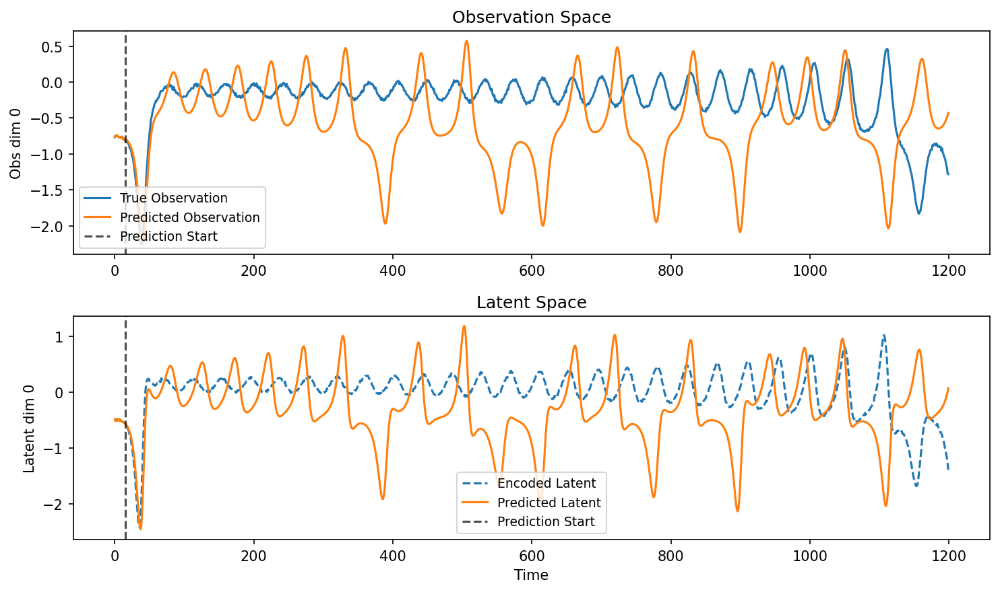

### mase

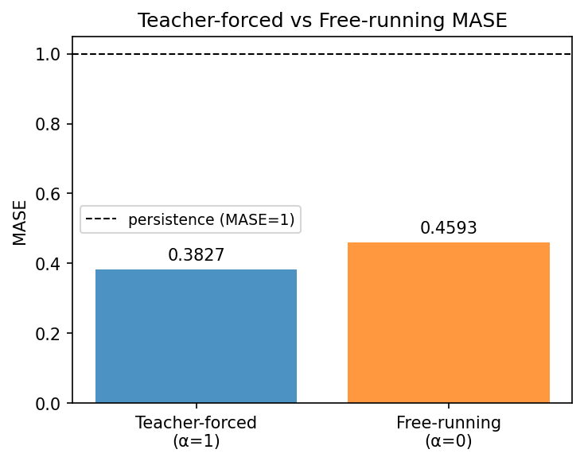

### lyapunov


### per_run_lyapunov

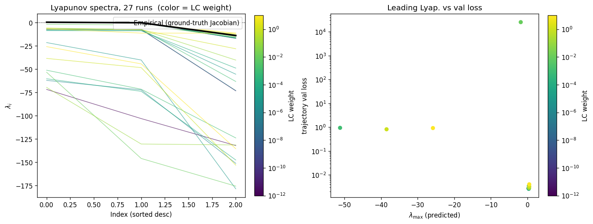

### per_run_lyapunov_vs_true

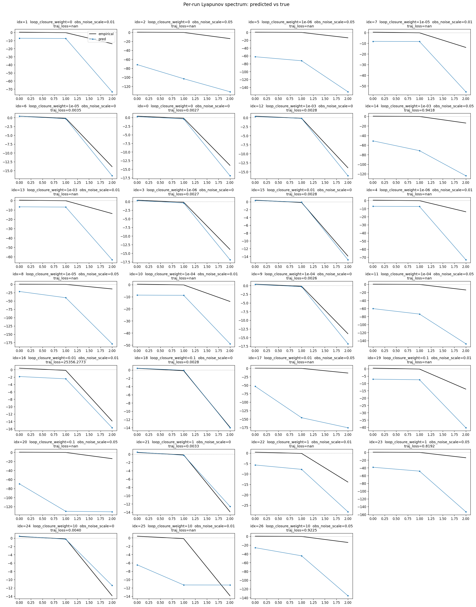

### per_run_lyapunov_relerr

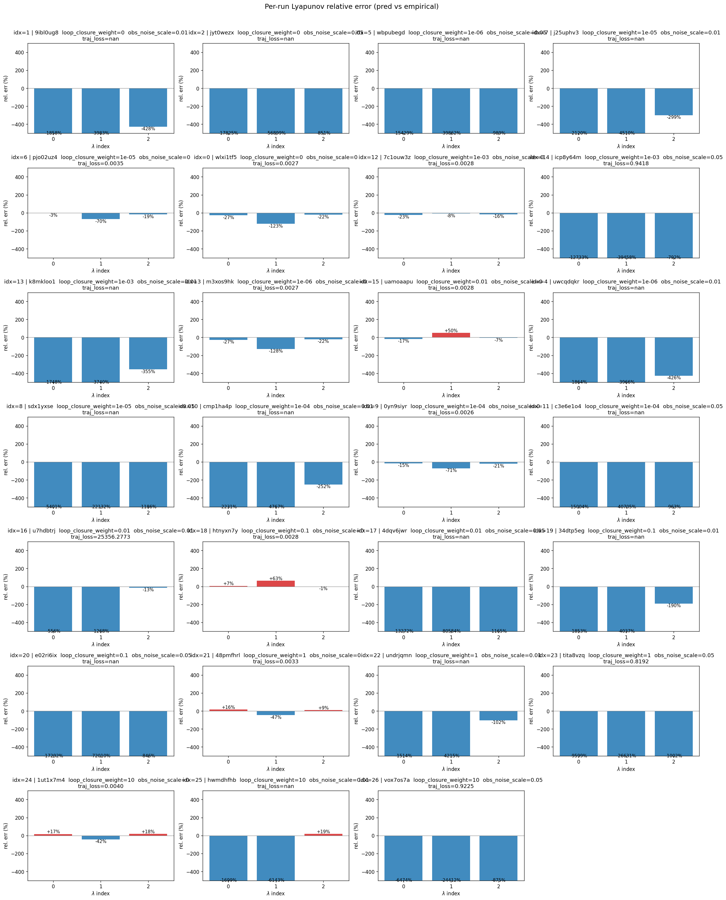

### lyapunov_spectrum_mse_vs_val_loss

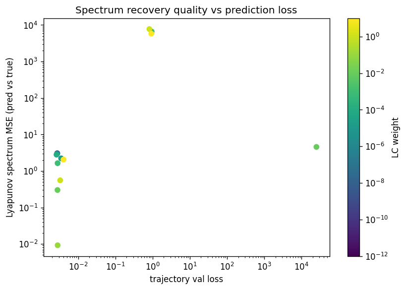

### reconstruction

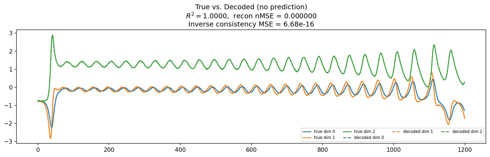

### latent_utilization

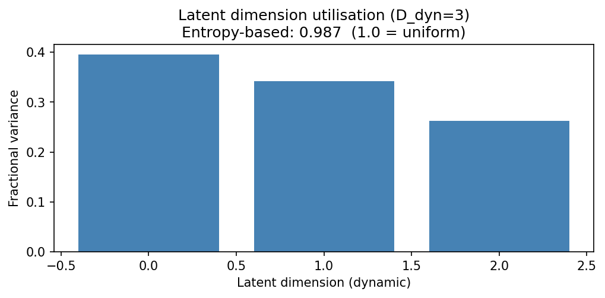

### kaplan_yorke

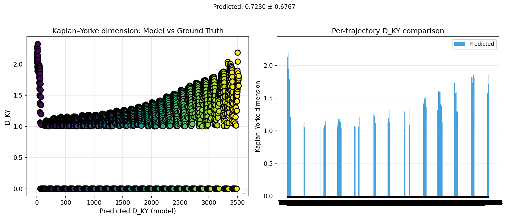

### kaplan_yorke_pca

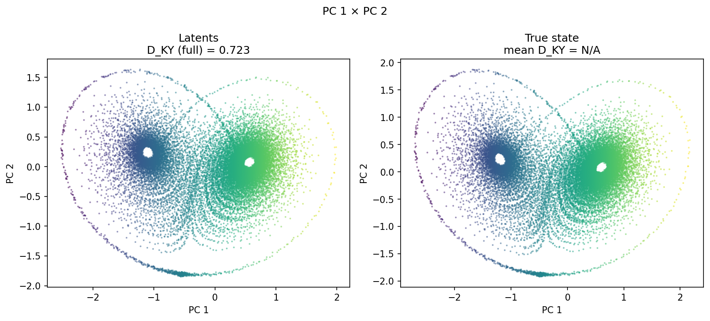

### prediction_detail_latent

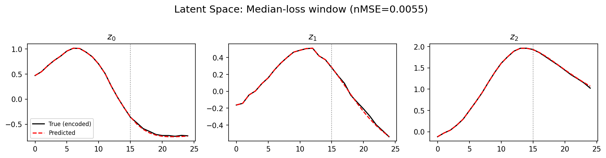

### prediction_detail_obs

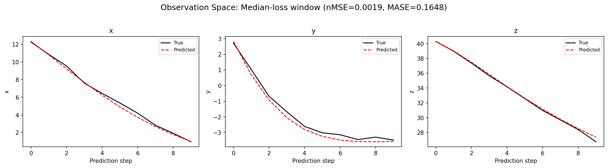

### encoder_decoder_jacobians

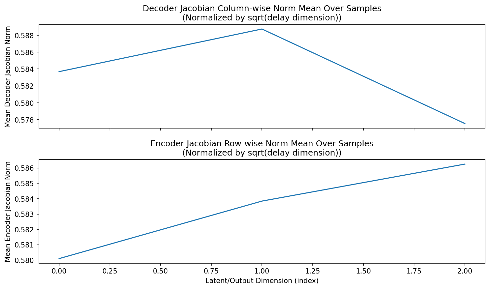

### amplification

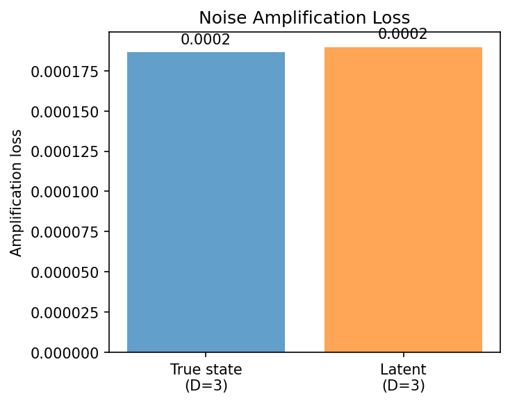

## Discussion

<!--
This section is intentionally left as a placeholder. A human reviewer
or Claude Code agent should fill it in based on the tables and figures
above, explicitly addressing each success criterion and comparing the
outcome to the stated hypothesis. Write the Discussion to
`discussion.md` in this directory and re-run `render_report`.
-->

_(to be written)_

## `run_analytics` stdout

<details><summary>Click to expand — full diagnostic output from <code>run_analytics</code></summary>

```
No run_id provided — selecting best run from group 'lorenz_additive_joint_gennmse__lc_x_obsnoise__cleantarget' ...
Found 27 total runs in JacobianODE/Lorenz_INDall_N1_D1_NormTrue_T3__JacobianODE (group=lorenz_additive_joint_gennmse__lc_x_obsnoise__cleantarget)
All runs (state, loop_closure_weight, tangent_entropy_weight, kl_dyn_weight):
  9ibl0ug8: state=finished, lc=0.0, te=0.0, kl_dyn=0.0
  jyt0wezx: state=finished, lc=0.0, te=0.0, kl_dyn=0.0
  wbpubegd: state=finished, lc=1e-06, te=0.0, kl_dyn=0.0
  j25uphv3: state=finished, lc=1e-05, te=0.0, kl_dyn=0.0
  pjo02uz4: state=finished, lc=1e-05, te=0.0, kl_dyn=0.0
  wlxi1tf5: state=finished, lc=0.0, te=0.0, kl_dyn=0.0
  7c1ouw3z: state=finished, lc=0.001, te=0.0, kl_dyn=0.0
  icp8y64m: state=finished, lc=0.001, te=0.0, kl_dyn=0.0
  k8mkloo1: state=finished, lc=0.001, te=0.0, kl_dyn=0.0
  m3xos9hk: state=finished, lc=1e-06, te=0.0, kl_dyn=0.0
  uamoaapu: state=finished, lc=0.01, te=0.0, kl_dyn=0.0
  uwcqdqkr: state=finished, lc=1e-06, te=0.0, kl_dyn=0.0
  sdx1yxse: state=finished, lc=1e-05, te=0.0, kl_dyn=0.0
  cmp1ha4p: state=finished, lc=0.0001, te=0.0, kl_dyn=0.0
  0yn9siyr: state=finished, lc=0.0001, te=0.0, kl_dyn=0.0
  c3e6e1o4: state=finished, lc=0.0001, te=0.0, kl_dyn=0.0
  u7hdbtrj: state=finished, lc=0.01, te=0.0, kl_dyn=0.0
  htnyxn7y: state=finished, lc=0.1, te=0.0, kl_dyn=0.0
  4dqv6jwr: state=finished, lc=0.01, te=0.0, kl_dyn=0.0
  34dtp5eg: state=finished, lc=0.1, te=0.0, kl_dyn=0.0
  e02ri6ix: state=finished, lc=0.1, te=0.0, kl_dyn=0.0
  48pmfhrl: state=finished, lc=1.0, te=0.0, kl_dyn=0.0
  undrjqmn: state=finished, lc=1.0, te=0.0, kl_dyn=0.0
  tita8vzq: state=finished, lc=1.0, te=0.0, kl_dyn=0.0
  1ut1x7m4: state=finished, lc=10.0, te=0.0, kl_dyn=0.0
  hwmdhfhb: state=finished, lc=10.0, te=0.0, kl_dyn=0.0
  vox7os7a: state=finished, lc=10.0, te=0.0, kl_dyn=0.0

slurm_timeout_min not found in any run config — falling back to 180 min
  Including 9ibl0ug8 (lc=0.0): use_all_runs=True (state=finished)
  Including jyt0wezx (lc=0.0): use_all_runs=True (state=finished)
  Including wbpubegd (lc=1e-06): use_all_runs=True (state=finished)
  Including j25uphv3 (lc=1e-05): use_all_runs=True (state=finished)
  Including pjo02uz4 (lc=1e-05): use_all_runs=True (state=finished)
  Including wlxi1tf5 (lc=0.0): use_all_runs=True (state=finished)
  Including 7c1ouw3z (lc=0.001): use_all_runs=True (state=finished)
  Including icp8y64m (lc=0.001): use_all_runs=True (state=finished)
  Including k8mkloo1 (lc=0.001): use_all_runs=True (state=finished)
  Including m3xos9hk (lc=1e-06): use_all_runs=True (state=finished)
  Including uamoaapu (lc=0.01): use_all_runs=True (state=finished)
  Including uwcqdqkr (lc=1e-06): use_all_runs=True (state=finished)
  Including sdx1yxse (lc=1e-05): use_all_runs=True (state=finished)
  Including cmp1ha4p (lc=0.0001): use_all_runs=True (state=finished)
  Including 0yn9siyr (lc=0.0001): use_all_runs=True (state=finished)
  Including c3e6e1o4 (lc=0.0001): use_all_runs=True (state=finished)
  Including u7hdbtrj (lc=0.01): use_all_runs=True (state=finished)
  Including htnyxn7y (lc=0.1): use_all_runs=True (state=finished)
  Including 4dqv6jwr (lc=0.01): use_all_runs=True (state=finished)
  Including 34dtp5eg (lc=0.1): use_all_runs=True (state=finished)
  Including e02ri6ix (lc=0.1): use_all_runs=True (state=finished)
  Including 48pmfhrl (lc=1.0): use_all_runs=True (state=finished)
  Including undrjqmn (lc=1.0): use_all_runs=True (state=finished)
  Including tita8vzq (lc=1.0): use_all_runs=True (state=finished)
  Including 1ut1x7m4 (lc=10.0): use_all_runs=True (state=finished)
  Including hwmdhfhb (lc=10.0): use_all_runs=True (state=finished)
  Including vox7os7a (lc=10.0): use_all_runs=True (state=finished)
Found 27 effectively-done sweep runs:
  loop_closure_weight=0.0, tangent_entropy_weight=0.0, kl_dyn_weight=0.0 -> run_id=9ibl0ug8
  loop_closure_weight=0.0, tangent_entropy_weight=0.0, kl_dyn_weight=0.0 -> run_id=jyt0wezx
  loop_closure_weight=0.0, tangent_entropy_weight=0.0, kl_dyn_weight=0.0 -> run_id=wlxi1tf5
  loop_closure_weight=1e-06, tangent_entropy_weight=0.0, kl_dyn_weight=0.0 -> run_id=m3xos9hk
  loop_closure_weight=1e-06, tangent_entropy_weight=0.0, kl_dyn_weight=0.0 -> run_id=uwcqdqkr
  loop_closure_weight=1e-06, tangent_entropy_weight=0.0, kl_dyn_weight=0.0 -> run_id=wbpubegd
  loop_closure_weight=1e-05, tangent_entropy_weight=0.0, kl_dyn_weight=0.0 -> run_id=j25uphv3
  loop_closure_weight=1e-05, tangent_entropy_weight=0.0, kl_dyn_weight=0.0 -> run_id=pjo02uz4
  loop_closure_weight=1e-05, tangent_entropy_weight=0.0, kl_dyn_weight=0.0 -> run_id=sdx1yxse
  loop_closure_weight=0.0001, tangent_entropy_weight=0.0, kl_dyn_weight=0.0 -> run_id=0yn9siyr
  loop_closure_weight=0.0001, tangent_entropy_weight=0.0, kl_dyn_weight=0.0 -> run_id=c3e6e1o4
  loop_closure_weight=0.0001, tangent_entropy_weight=0.0, kl_dyn_weight=0.0 -> run_id=cmp1ha4p
  loop_closure_weight=0.001, tangent_entropy_weight=0.0, kl_dyn_weight=0.0 -> run_id=7c1ouw3z
  loop_closure_weight=0.001, tangent_entropy_weight=0.0, kl_dyn_weight=0.0 -> run_id=icp8y64m
  loop_closure_weight=0.001, tangent_entropy_weight=0.0, kl_dyn_weight=0.0 -> run_id=k8mkloo1
  loop_closure_weight=0.01, tangent_entropy_weight=0.0, kl_dyn_weight=0.0 -> run_id=4dqv6jwr
  loop_closure_weight=0.01, tangent_entropy_weight=0.0, kl_dyn_weight=0.0 -> run_id=u7hdbtrj
  loop_closure_weight=0.01, tangent_entropy_weight=0.0, kl_dyn_weight=0.0 -> run_id=uamoaapu
  loop_closure_weight=0.1, tangent_entropy_weight=0.0, kl_dyn_weight=0.0 -> run_id=34dtp5eg
  loop_closure_weight=0.1, tangent_entropy_weight=0.0, kl_dyn_weight=0.0 -> run_id=e02ri6ix
  loop_closure_weight=0.1, tangent_entropy_weight=0.0, kl_dyn_weight=0.0 -> run_id=htnyxn7y
  loop_closure_weight=1.0, tangent_entropy_weight=0.0, kl_dyn_weight=0.0 -> run_id=48pmfhrl
  loop_closure_weight=1.0, tangent_entropy_weight=0.0, kl_dyn_weight=0.0 -> run_id=tita8vzq
  loop_closure_weight=1.0, tangent_entropy_weight=0.0, kl_dyn_weight=0.0 -> run_id=undrjqmn
  loop_closure_weight=10.0, tangent_entropy_weight=0.0, kl_dyn_weight=0.0 -> run_id=1ut1x7m4
  loop_closure_weight=10.0, tangent_entropy_weight=0.0, kl_dyn_weight=0.0 -> run_id=hwmdhfhb
  loop_closure_weight=10.0, tangent_entropy_weight=0.0, kl_dyn_weight=0.0 -> run_id=vox7os7a
n_dims=3, n_latent=3, n_dyn=3, dt=0.0150
  run=9ibl0ug8: DiagnosticMetrics(one_step_mase=1.0651307106018066, loop_closure_loss=90.93658447265625, fast_eigenvalue_fraction=0.13249999284744263, trajectory_val_loss=0.19215597212314606) (from cache, n_batches=100)
  run=jyt0wezx: DiagnosticMetrics(one_step_mase=6.027887344360352, loop_closure_loss=16.63743019104004, fast_eigenvalue_fraction=0.9383333325386047, trajectory_val_loss=0.7573795318603516) (from cache, n_batches=100)
  run=wlxi1tf5: DiagnosticMetrics(one_step_mase=0.38569697737693787, loop_closure_loss=0.4127780795097351, fast_eigenvalue_fraction=0.0, trajectory_val_loss=0.0026140741538256407) (from cache, n_batches=100)
  run=m3xos9hk: DiagnosticMetrics(one_step_mase=0.38570183515548706, loop_closure_loss=0.39761778712272644, fast_eigenvalue_fraction=0.0, trajectory_val_loss=0.0026140923146158457) (from cache, n_batches=100)
  run=uwcqdqkr: DiagnosticMetrics(one_step_mase=1.069530963897705, loop_closure_loss=84.79707336425781, fast_eigenvalue_fraction=0.13249999284744263, trajectory_val_loss=0.19342124462127686) (from cache, n_batches=100)
  run=wbpubegd: DiagnosticMetrics(one_step_mase=4.8932905197143555, loop_closure_loss=6.14670467376709, fast_eigenvalue_fraction=0.7416666746139526, trajectory_val_loss=0.7831818461418152) (from cache, n_batches=100)
  run=j25uphv3: DiagnosticMetrics(one_step_mase=1.0588536262512207, loop_closure_loss=77.45386505126953, fast_eigenvalue_fraction=0.021666666492819786, trajectory_val_loss=0.1965263932943344) (from cache, n_batches=100)
  run=pjo02uz4: DiagnosticMetrics(one_step_mase=0.38644102215766907, loop_closure_loss=0.36026421189308167, fast_eigenvalue_fraction=0.0, trajectory_val_loss=0.0027024121955037117) (from cache, n_batches=100)
  run=sdx1yxse: DiagnosticMetrics(one_step_mase=3.2372870445251465, loop_closure_loss=1.7632685899734497, fast_eigenvalue_fraction=0.3333333432674408, trajectory_val_loss=0.752845048904419) (from cache, n_batches=100)
  run=0yn9siyr: DiagnosticMetrics(one_step_mase=0.3857693374156952, loop_closure_loss=0.06590361893177032, fast_eigenvalue_fraction=0.0, trajectory_val_loss=0.0026056210044771433) (from cache, n_batches=100)
  run=c3e6e1o4: DiagnosticMetrics(one_step_mase=4.9247822761535645, loop_closure_loss=4.6947808265686035, fast_eigenvalue_fraction=0.7383333444595337, trajectory_val_loss=0.7722802758216858) (from cache, n_batches=100)
  run=cmp1ha4p: DiagnosticMetrics(one_step_mase=1.08023202419281, loop_closure_loss=30.074682235717773, fast_eigenvalue_fraction=0.0008333333535119891, trajectory_val_loss=0.20421241223812103) (from cache, n_batches=100)
  run=7c1ouw3z: DiagnosticMetrics(one_step_mase=0.38626959919929504, loop_closure_loss=0.009351909160614014, fast_eigenvalue_fraction=0.0, trajectory_val_loss=0.0026351045817136765) (from cache, n_batches=100)
  run=icp8y64m: DiagnosticMetrics(one_step_mase=4.723846435546875, loop_closure_loss=2.192906141281128, fast_eigenvalue_fraction=0.6416666507720947, trajectory_val_loss=0.8095353841781616) (from cache, n_batches=100)
  run=k8mkloo1: DiagnosticMetrics(one_step_mase=1.1353875398635864, loop_closure_loss=3.4373867511749268, fast_eigenvalue_fraction=0.1158333346247673, trajectory_val_loss=0.19829224050045013) (from cache, n_batches=100)
  run=4dqv6jwr: DiagnosticMetrics(one_step_mase=4.220814228057861, loop_closure_loss=1.3792450428009033, fast_eigenvalue_fraction=0.6658333539962769, trajectory_val_loss=0.6828168630599976) (from cache, n_batches=100)
  run=u7hdbtrj: DiagnosticMetrics(one_step_mase=0.6131028532981873, loop_closure_loss=1.045515537261963, fast_eigenvalue_fraction=0.0, trajectory_val_loss=0.0849056988954544) (from cache, n_batches=100)
  run=uamoaapu: DiagnosticMetrics(one_step_mase=0.387043833732605, loop_closure_loss=0.002027137205004692, fast_eigenvalue_fraction=0.0, trajectory_val_loss=0.0026756832376122475) (from cache, n_batches=100)
  run=34dtp5eg: DiagnosticMetrics(one_step_mase=1.0588513612747192, loop_closure_loss=0.01372811570763588, fast_eigenvalue_fraction=0.0, trajectory_val_loss=0.20743732154369354) (from cache, n_batches=100)
  run=e02ri6ix: DiagnosticMetrics(one_step_mase=6.019204139709473, loop_closure_loss=0.10422506928443909, fast_eigenvalue_fraction=0.9733333587646484, trajectory_val_loss=0.7670859694480896) (from cache, n_batches=100)
  run=htnyxn7y: DiagnosticMetrics(one_step_mase=0.3878791332244873, loop_closure_loss=0.00035506815765984356, fast_eigenvalue_fraction=0.0, trajectory_val_loss=0.0027531906962394714) (from cache, n_batches=100)
  run=48pmfhrl: DiagnosticMetrics(one_step_mase=0.39128631353378296, loop_closure_loss=0.00010528202255954966, fast_eigenvalue_fraction=0.0, trajectory_val_loss=0.00326258665882051) (from cache, n_batches=100)
  run=tita8vzq: DiagnosticMetrics(one_step_mase=3.740466833114624, loop_closure_loss=0.07375776022672653, fast_eigenvalue_fraction=0.3333333432674408, trajectory_val_loss=0.7696455121040344) (from cache, n_batches=100)
  run=undrjqmn: DiagnosticMetrics(one_step_mase=1.1150180101394653, loop_closure_loss=0.003546919208019972, fast_eigenvalue_fraction=0.0, trajectory_val_loss=0.28169238567352295) (from cache, n_batches=100)
  run=1ut1x7m4: DiagnosticMetrics(one_step_mase=0.39455413818359375, loop_closure_loss=6.692414171993732e-05, fast_eigenvalue_fraction=0.0, trajectory_val_loss=0.004028536844998598) (from cache, n_batches=100)
  run=hwmdhfhb: DiagnosticMetrics(one_step_mase=1.298148512840271, loop_closure_loss=0.0005337774637155235, fast_eigenvalue_fraction=0.0, trajectory_val_loss=0.5151311755180359) (from cache, n_batches=100)
  run=vox7os7a: DiagnosticMetrics(one_step_mase=3.6108975410461426, loop_closure_loss=0.0003476125421002507, fast_eigenvalue_fraction=0.3333333432674408, trajectory_val_loss=0.7966532111167908) (from cache, n_batches=100)

Ranking method:           best_traj_loss
Best run ID:              0yn9siyr
Best loop_closure_weight: 0.0001
Best tangent_entropy_weight: 0.0
Best kl_dyn_weight:       0.0
Best traj loss:           0.002606
Criteria applied: ['C1', 'C2', 'C3']
Surviving: 10 / 27
Auto-selected run_id: 0yn9siyr

======================================================================
PARETO FRONTIER RUNS (6 runs)
======================================================================
  Run ID               LC Loss   Traj Val Loss
  ------------  --------------  --------------
  1ut1x7m4            0.000067        0.004029
  48pmfhrl            0.000105        0.003263
  htnyxn7y            0.000355        0.002753
  uamoaapu            0.002027        0.002676
  7c1ouw3z            0.009352        0.002635
  0yn9siyr            0.065904        0.002606 <-- selected

======================================================================
RANKING METHOD COMPARISON (over 10 survivors)
======================================================================
  Method                  Run ID               LC Loss   Traj Val Loss
  ----------------------  ------------  --------------  --------------
  best_traj_loss          0yn9siyr            0.065904        0.002606 <-- active
  pareto_knee             htnyxn7y            0.000355        0.002753
  geo_rank                0yn9siyr            0.065904        0.002606
  minimax_rank            7c1ouw3z            0.009352        0.002635
  geo_log_score           0yn9siyr            0.065904        0.002606
  minimax_log_score       48pmfhrl            0.000105        0.003263
======================================================================

Loading run 0yn9siyr from JacobianODE/Lorenz_INDall_N1_D1_NormTrue_T3__JacobianODE ...
Train dataset shape: torch.Size([25850, 25, 3])
Validation dataset shape: torch.Size([8225, 25, 3])
Test dataset shape: torch.Size([3525, 25, 3])
Train trajectories dataset shape: torch.Size([22, 1200, 3])
Validation trajectories dataset shape: torch.Size([7, 1200, 3])
Test trajectories dataset shape: torch.Size([3, 1200, 3])
Loading checkpoint epoch=121-step=24400.ckpt...
Computing reconstruction ...
Computing latent utilization ...
Entropy-based utilization: 0.987
Computing Lyapunov exponents for KY dimension (full-length, chunk-batched) ...
Mean KY dim (predicted): 0.723 ± 0.677
Computing prediction windows ...
Windows: 354 — nMSE min=0.0005, median=0.0019, mean=0.0025, max=0.0205
Computing long trajectory prediction ...
Computing encoder/decoder Jacobians ...
encoder_jacobian: (128, 3, 3)
decoder_jacobian: (128, 3, 3)
Computing amplification loss ...
Amplification loss — True state: 0.000186
Amplification loss — Latent:     0.000190


--- backfill 2026-04-16T04:07:54Z sections=['reconstruction', 'latent_utilization', 'kaplan_yorke', 'prediction_detail', 'long_trajectory', 'encoder_decoder_jacobians', 'amplification'] ---
No run_id provided — selecting best run from group 'lorenz_additive_joint_gennmse__lc_x_obsnoise__cleantarget' ...
Found 27 total runs in JacobianODE/Lorenz_INDall_N1_D1_NormTrue_T3__JacobianODE (group=lorenz_additive_joint_gennmse__lc_x_obsnoise__cleantarget)
All runs (state, loop_closure_weight, tangent_entropy_weight, kl_dyn_weight):
  9ibl0ug8: state=finished, lc=0.0, te=0.0, kl_dyn=0.0
  jyt0wezx: state=finished, lc=0.0, te=0.0, kl_dyn=0.0
  wbpubegd: state=finished, lc=1e-06, te=0.0, kl_dyn=0.0
  j25uphv3: state=finished, lc=1e-05, te=0.0, kl_dyn=0.0
  pjo02uz4: state=finished, lc=1e-05, te=0.0, kl_dyn=0.0
  wlxi1tf5: state=finished, lc=0.0, te=0.0, kl_dyn=0.0
  7c1ouw3z: state=finished, lc=0.001, te=0.0, kl_dyn=0.0
  icp8y64m: state=finished, lc=0.001, te=0.0, kl_dyn=0.0
  k8mkloo1: state=finished, lc=0.001, te=0.0, kl_dyn=0.0
  m3xos9hk: state=finished, lc=1e-06, te=0.0, kl_dyn=0.0
  uamoaapu: state=finished, lc=0.01, te=0.0, kl_dyn=0.0
  uwcqdqkr: state=finished, lc=1e-06, te=0.0, kl_dyn=0.0
  sdx1yxse: state=finished, lc=1e-05, te=0.0, kl_dyn=0.0
  cmp1ha4p: state=finished, lc=0.0001, te=0.0, kl_dyn=0.0
  0yn9siyr: state=finished, lc=0.0001, te=0.0, kl_dyn=0.0
  c3e6e1o4: state=finished, lc=0.0001, te=0.0, kl_dyn=0.0
  u7hdbtrj: state=finished, lc=0.01, te=0.0, kl_dyn=0.0
  htnyxn7y: state=finished, lc=0.1, te=0.0, kl_dyn=0.0
  4dqv6jwr: state=finished, lc=0.01, te=0.0, kl_dyn=0.0
  34dtp5eg: state=finished, lc=0.1, te=0.0, kl_dyn=0.0
  e02ri6ix: state=finished, lc=0.1, te=0.0, kl_dyn=0.0
  48pmfhrl: state=finished, lc=1.0, te=0.0, kl_dyn=0.0
  undrjqmn: state=finished, lc=1.0, te=0.0, kl_dyn=0.0
  tita8vzq: state=finished, lc=1.0, te=0.0, kl_dyn=0.0
  1ut1x7m4: state=finished, lc=10.0, te=0.0, kl_dyn=0.0
  hwmdhfhb: state=finished, lc=10.0, te=0.0, kl_dyn=0.0
  vox7os7a: state=finished, lc=10.0, te=0.0, kl_dyn=0.0

slurm_timeout_min not found in any run config — falling back to 180 min
  Including 9ibl0ug8 (lc=0.0): use_all_runs=True (state=finished)
  Including jyt0wezx (lc=0.0): use_all_runs=True (state=finished)
  Including wbpubegd (lc=1e-06): use_all_runs=True (state=finished)
  Including j25uphv3 (lc=1e-05): use_all_runs=True (state=finished)
  Including pjo02uz4 (lc=1e-05): use_all_runs=True (state=finished)
  Including wlxi1tf5 (lc=0.0): use_all_runs=True (state=finished)
  Including 7c1ouw3z (lc=0.001): use_all_runs=True (state=finished)
  Including icp8y64m (lc=0.001): use_all_runs=True (state=finished)
  Including k8mkloo1 (lc=0.001): use_all_runs=True (state=finished)
  Including m3xos9hk (lc=1e-06): use_all_runs=True (state=finished)
  Including uamoaapu (lc=0.01): use_all_runs=True (state=finished)
  Including uwcqdqkr (lc=1e-06): use_all_runs=True (state=finished)
  Including sdx1yxse (lc=1e-05): use_all_runs=True (state=finished)
  Including cmp1ha4p (lc=0.0001): use_all_runs=True (state=finished)
  Including 0yn9siyr (lc=0.0001): use_all_runs=True (state=finished)
  Including c3e6e1o4 (lc=0.0001): use_all_runs=True (state=finished)
  Including u7hdbtrj (lc=0.01): use_all_runs=True (state=finished)
  Including htnyxn7y (lc=0.1): use_all_runs=True (state=finished)
  Including 4dqv6jwr (lc=0.01): use_all_runs=True (state=finished)
  Including 34dtp5eg (lc=0.1): use_all_runs=True (state=finished)
  Including e02ri6ix (lc=0.1): use_all_runs=True (state=finished)
  Including 48pmfhrl (lc=1.0): use_all_runs=True (state=finished)
  Including undrjqmn (lc=1.0): use_all_runs=True (state=finished)
  Including tita8vzq (lc=1.0): use_all_runs=True (state=finished)
  Including 1ut1x7m4 (lc=10.0): use_all_runs=True (state=finished)
  Including hwmdhfhb (lc=10.0): use_all_runs=True (state=finished)
  Including vox7os7a (lc=10.0): use_all_runs=True (state=finished)
Found 27 effectively-done sweep runs:
  loop_closure_weight=0.0, tangent_entropy_weight=0.0, kl_dyn_weight=0.0 -> run_id=9ibl0ug8
  loop_closure_weight=0.0, tangent_entropy_weight=0.0, kl_dyn_weight=0.0 -> run_id=jyt0wezx
  loop_closure_weight=0.0, tangent_entropy_weight=0.0, kl_dyn_weight=0.0 -> run_id=wlxi1tf5
  loop_closure_weight=1e-06, tangent_entropy_weight=0.0, kl_dyn_weight=0.0 -> run_id=m3xos9hk
  loop_closure_weight=1e-06, tangent_entropy_weight=0.0, kl_dyn_weight=0.0 -> run_id=uwcqdqkr
  loop_closure_weight=1e-06, tangent_entropy_weight=0.0, kl_dyn_weight=0.0 -> run_id=wbpubegd
  loop_closure_weight=1e-05, tangent_entropy_weight=0.0, kl_dyn_weight=0.0 -> run_id=j25uphv3
  loop_closure_weight=1e-05, tangent_entropy_weight=0.0, kl_dyn_weight=0.0 -> run_id=pjo02uz4
  loop_closure_weight=1e-05, tangent_entropy_weight=0.0, kl_dyn_weight=0.0 -> run_id=sdx1yxse
  loop_closure_weight=0.0001, tangent_entropy_weight=0.0, kl_dyn_weight=0.0 -> run_id=0yn9siyr
  loop_closure_weight=0.0001, tangent_entropy_weight=0.0, kl_dyn_weight=0.0 -> run_id=c3e6e1o4
  loop_closure_weight=0.0001, tangent_entropy_weight=0.0, kl_dyn_weight=0.0 -> run_id=cmp1ha4p
  loop_closure_weight=0.001, tangent_entropy_weight=0.0, kl_dyn_weight=0.0 -> run_id=7c1ouw3z
  loop_closure_weight=0.001, tangent_entropy_weight=0.0, kl_dyn_weight=0.0 -> run_id=icp8y64m
  loop_closure_weight=0.001, tangent_entropy_weight=0.0, kl_dyn_weight=0.0 -> run_id=k8mkloo1
  loop_closure_weight=0.01, tangent_entropy_weight=0.0, kl_dyn_weight=0.0 -> run_id=4dqv6jwr
  loop_closure_weight=0.01, tangent_entropy_weight=0.0, kl_dyn_weight=0.0 -> run_id=u7hdbtrj
  loop_closure_weight=0.01, tangent_entropy_weight=0.0, kl_dyn_weight=0.0 -> run_id=uamoaapu
  loop_closure_weight=0.1, tangent_entropy_weight=0.0, kl_dyn_weight=0.0 -> run_id=34dtp5eg
  loop_closure_weight=0.1, tangent_entropy_weight=0.0, kl_dyn_weight=0.0 -> run_id=e02ri6ix
  loop_closure_weight=0.1, tangent_entropy_weight=0.0, kl_dyn_weight=0.0 -> run_id=htnyxn7y
  loop_closure_weight=1.0, tangent_entropy_weight=0.0, kl_dyn_weight=0.0 -> run_id=48pmfhrl
  loop_closure_weight=1.0, tangent_entropy_weight=0.0, kl_dyn_weight=0.0 -> run_id=tita8vzq
  loop_closure_weight=1.0, tangent_entropy_weight=0.0, kl_dyn_weight=0.0 -> run_id=undrjqmn
  loop_closure_weight=10.0, tangent_entropy_weight=0.0, kl_dyn_weight=0.0 -> run_id=1ut1x7m4
  loop_closure_weight=10.0, tangent_entropy_weight=0.0, kl_dyn_weight=0.0 -> run_id=hwmdhfhb
  loop_closure_weight=10.0, tangent_entropy_weight=0.0, kl_dyn_weight=0.0 -> run_id=vox7os7a
n_dims=3, n_latent=3, n_dyn=3, dt=0.0150
  run=9ibl0ug8: DiagnosticMetrics(one_step_mase=1.0651307106018066, loop_closure_loss=90.93658447265625, fast_eigenvalue_fraction=0.13249999284744263, trajectory_val_loss=0.19215597212314606) (from cache, n_batches=100)
  run=jyt0wezx: DiagnosticMetrics(one_step_mase=6.027887344360352, loop_closure_loss=16.63743019104004, fast_eigenvalue_fraction=0.9383333325386047, trajectory_val_loss=0.7573795318603516) (from cache, n_batches=100)
  run=wlxi1tf5: DiagnosticMetrics(one_step_mase=0.38569697737693787, loop_closure_loss=0.4127780795097351, fast_eigenvalue_fraction=0.0, trajectory_val_loss=0.0026140741538256407) (from cache, n_batches=100)
  run=m3xos9hk: DiagnosticMetrics(one_step_mase=0.38570183515548706, loop_closure_loss=0.39761778712272644, fast_eigenvalue_fraction=0.0, trajectory_val_loss=0.0026140923146158457) (from cache, n_batches=100)
  run=uwcqdqkr: DiagnosticMetrics(one_step_mase=1.069530963897705, loop_closure_loss=84.79707336425781, fast_eigenvalue_fraction=0.13249999284744263, trajectory_val_loss=0.19342124462127686) (from cache, n_batches=100)
  run=wbpubegd: DiagnosticMetrics(one_step_mase=4.8932905197143555, loop_closure_loss=6.14670467376709, fast_eigenvalue_fraction=0.7416666746139526, trajectory_val_loss=0.7831818461418152) (from cache, n_batches=100)
  run=j25uphv3: DiagnosticMetrics(one_step_mase=1.0588536262512207, loop_closure_loss=77.45386505126953, fast_eigenvalue_fraction=0.021666666492819786, trajectory_val_loss=0.1965263932943344) (from cache, n_batches=100)
  run=pjo02uz4: DiagnosticMetrics(one_step_mase=0.38644102215766907, loop_closure_loss=0.36026421189308167, fast_eigenvalue_fraction=0.0, trajectory_val_loss=0.0027024121955037117) (from cache, n_batches=100)
  run=sdx1yxse: DiagnosticMetrics(one_step_mase=3.2372870445251465, loop_closure_loss=1.7632685899734497, fast_eigenvalue_fraction=0.3333333432674408, trajectory_val_loss=0.752845048904419) (from cache, n_batches=100)
  run=0yn9siyr: DiagnosticMetrics(one_step_mase=0.3857693374156952, loop_closure_loss=0.06590361893177032, fast_eigenvalue_fraction=0.0, trajectory_val_loss=0.0026056210044771433) (from cache, n_batches=100)
  run=c3e6e1o4: DiagnosticMetrics(one_step_mase=4.9247822761535645, loop_closure_loss=4.6947808265686035, fast_eigenvalue_fraction=0.7383333444595337, trajectory_val_loss=0.7722802758216858) (from cache, n_batches=100)
  run=cmp1ha4p: DiagnosticMetrics(one_step_mase=1.08023202419281, loop_closure_loss=30.074682235717773, fast_eigenvalue_fraction=0.0008333333535119891, trajectory_val_loss=0.20421241223812103) (from cache, n_batches=100)
  run=7c1ouw3z: DiagnosticMetrics(one_step_mase=0.38626959919929504, loop_closure_loss=0.009351909160614014, fast_eigenvalue_fraction=0.0, trajectory_val_loss=0.0026351045817136765) (from cache, n_batches=100)
  run=icp8y64m: DiagnosticMetrics(one_step_mase=4.723846435546875, loop_closure_loss=2.192906141281128, fast_eigenvalue_fraction=0.6416666507720947, trajectory_val_loss=0.8095353841781616) (from cache, n_batches=100)
  run=k8mkloo1: DiagnosticMetrics(one_step_mase=1.1353875398635864, loop_closure_loss=3.4373867511749268, fast_eigenvalue_fraction=0.1158333346247673, trajectory_val_loss=0.19829224050045013) (from cache, n_batches=100)
  run=4dqv6jwr: DiagnosticMetrics(one_step_mase=4.220814228057861, loop_closure_loss=1.3792450428009033, fast_eigenvalue_fraction=0.6658333539962769, trajectory_val_loss=0.6828168630599976) (from cache, n_batches=100)
  run=u7hdbtrj: DiagnosticMetrics(one_step_mase=0.6131028532981873, loop_closure_loss=1.045515537261963, fast_eigenvalue_fraction=0.0, trajectory_val_loss=0.0849056988954544) (from cache, n_batches=100)
  run=uamoaapu: DiagnosticMetrics(one_step_mase=0.387043833732605, loop_closure_loss=0.002027137205004692, fast_eigenvalue_fraction=0.0, trajectory_val_loss=0.0026756832376122475) (from cache, n_batches=100)
  run=34dtp5eg: DiagnosticMetrics(one_step_mase=1.0588513612747192, loop_closure_loss=0.01372811570763588, fast_eigenvalue_fraction=0.0, trajectory_val_loss=0.20743732154369354) (from cache, n_batches=100)
  run=e02ri6ix: DiagnosticMetrics(one_step_mase=6.019204139709473, loop_closure_loss=0.10422506928443909, fast_eigenvalue_fraction=0.9733333587646484, trajectory_val_loss=0.7670859694480896) (from cache, n_batches=100)
  run=htnyxn7y: DiagnosticMetrics(one_step_mase=0.3878791332244873, loop_closure_loss=0.00035506815765984356, fast_eigenvalue_fraction=0.0, trajectory_val_loss=0.0027531906962394714) (from cache, n_batches=100)
  run=48pmfhrl: DiagnosticMetrics(one_step_mase=0.39128631353378296, loop_closure_loss=0.00010528202255954966, fast_eigenvalue_fraction=0.0, trajectory_val_loss=0.00326258665882051) (from cache, n_batches=100)
  run=tita8vzq: DiagnosticMetrics(one_step_mase=3.740466833114624, loop_closure_loss=0.07375776022672653, fast_eigenvalue_fraction=0.3333333432674408, trajectory_val_loss=0.7696455121040344) (from cache, n_batches=100)
  run=undrjqmn: DiagnosticMetrics(one_step_mase=1.1150180101394653, loop_closure_loss=0.003546919208019972, fast_eigenvalue_fraction=0.0, trajectory_val_loss=0.28169238567352295) (from cache, n_batches=100)
  run=1ut1x7m4: DiagnosticMetrics(one_step_mase=0.39455413818359375, loop_closure_loss=6.692414171993732e-05, fast_eigenvalue_fraction=0.0, trajectory_val_loss=0.004028536844998598) (from cache, n_batches=100)
  run=hwmdhfhb: DiagnosticMetrics(one_step_mase=1.298148512840271, loop_closure_loss=0.0005337774637155235, fast_eigenvalue_fraction=0.0, trajectory_val_loss=0.5151311755180359) (from cache, n_batches=100)
  run=vox7os7a: DiagnosticMetrics(one_step_mase=3.6108975410461426, loop_closure_loss=0.0003476125421002507, fast_eigenvalue_fraction=0.3333333432674408, trajectory_val_loss=0.7966532111167908) (from cache, n_batches=100)

Ranking method:           best_traj_loss
Best run ID:              0yn9siyr
Best loop_closure_weight: 0.0001
Best tangent_entropy_weight: 0.0
Best kl_dyn_weight:       0.0
Best traj loss:           0.002606
Criteria applied: ['C1', 'C2', 'C3']
Surviving: 10 / 27
Auto-selected run_id: 0yn9siyr

======================================================================
PARETO FRONTIER RUNS (6 runs)
======================================================================
  Run ID               LC Loss   Traj Val Loss
  ------------  --------------  --------------
  1ut1x7m4            0.000067        0.004029
  48pmfhrl            0.000105        0.003263
  htnyxn7y            0.000355        0.002753
  uamoaapu            0.002027        0.002676
  7c1ouw3z            0.009352        0.002635
  0yn9siyr            0.065904        0.002606 <-- selected

======================================================================
RANKING METHOD COMPARISON (over 10 survivors)
======================================================================
  Method                  Run ID               LC Loss   Traj Val Loss
  ----------------------  ------------  --------------  --------------
  best_traj_loss          0yn9siyr            0.065904        0.002606 <-- active
  pareto_knee             htnyxn7y            0.000355        0.002753
  geo_rank                0yn9siyr            0.065904        0.002606
  minimax_rank            7c1ouw3z            0.009352        0.002635
  geo_log_score           0yn9siyr            0.065904        0.002606
  minimax_log_score       48pmfhrl            0.000105        0.003263
======================================================================

Loading run 0yn9siyr from JacobianODE/Lorenz_INDall_N1_D1_NormTrue_T3__JacobianODE ...
Train dataset shape: torch.Size([25850, 25, 3])
Validation dataset shape: torch.Size([8225, 25, 3])
Test dataset shape: torch.Size([3525, 25, 3])
Train trajectories dataset shape: torch.Size([22, 1200, 3])
Validation trajectories dataset shape: torch.Size([7, 1200, 3])
Test trajectories dataset shape: torch.Size([3, 1200, 3])
Loading checkpoint epoch=121-step=24400.ckpt...
Computing reconstruction ...
Computing latent utilization ...
Entropy-based utilization: 0.987
Computing Lyapunov exponents for KY dimension (full-length, chunk-batched) ...
Mean KY dim (predicted): 0.723 ± 0.677
Computing prediction windows ...
Windows: 354 — nMSE min=0.0005, median=0.0019, mean=0.0025, max=0.0205
Computing long trajectory prediction ...
Computing encoder/decoder Jacobians ...
encoder_jacobian: (128, 3, 3)
decoder_jacobian: (128, 3, 3)
Computing amplification loss ...
Amplification loss — True state: 0.000186
Amplification loss — Latent:     0.000190
```

</details>
