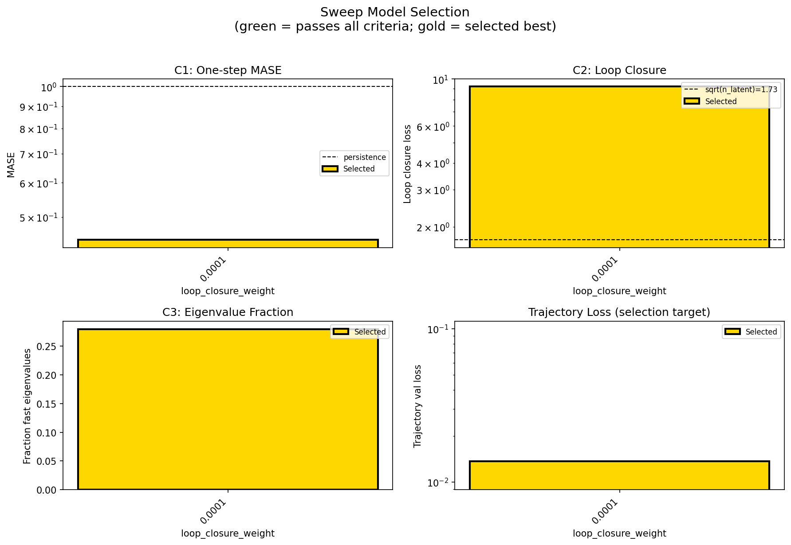
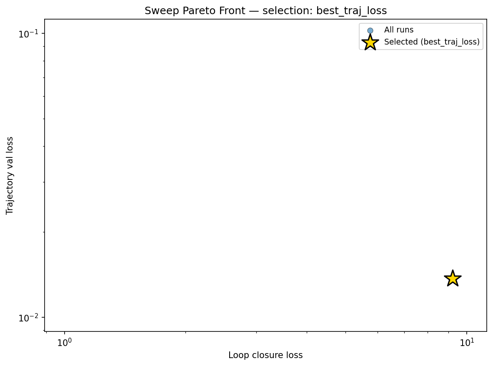
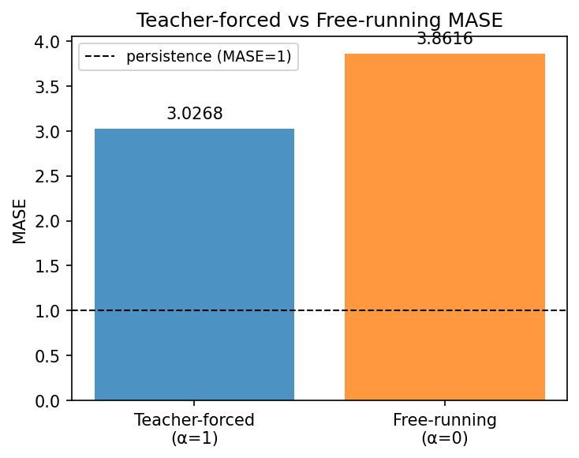
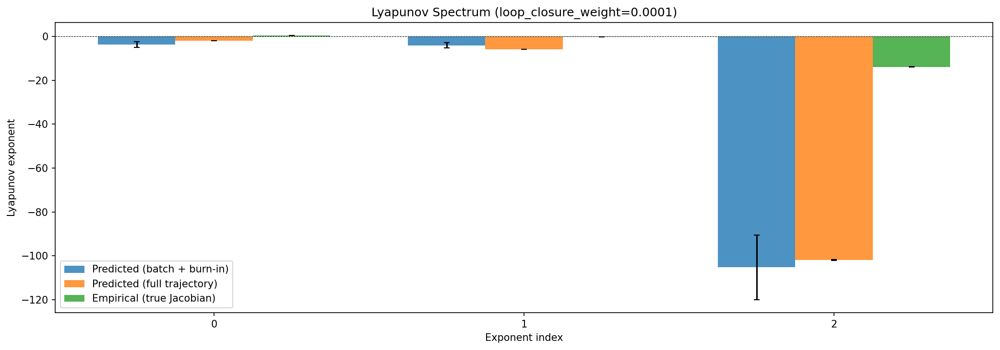
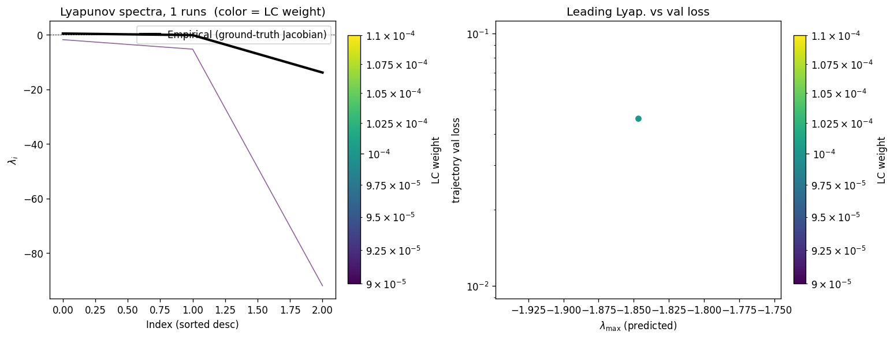
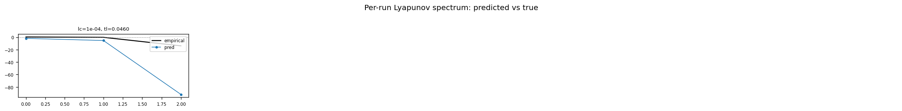
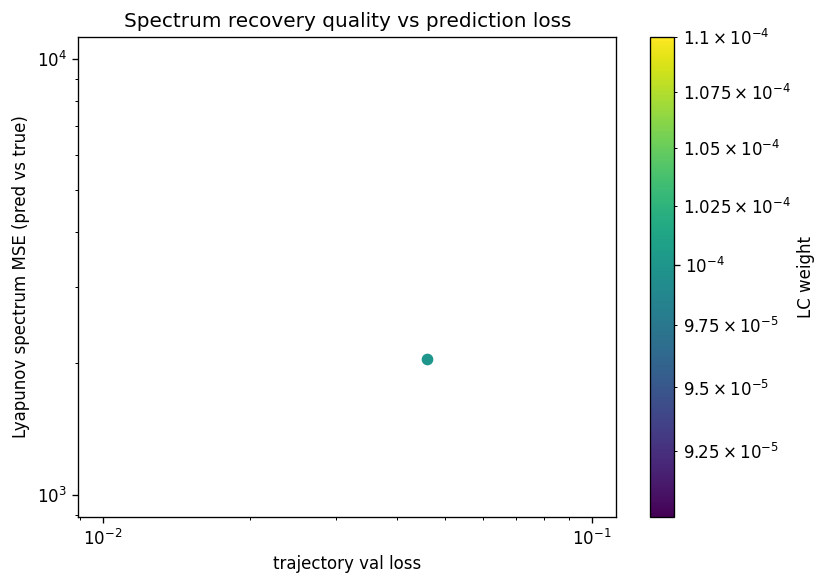

# Sweep Analysis: `lorenz_additive_joint_gennmse__lc_x_obsnoise_sweep`

**Project**: [Lorenz_INDall_N1_D1_NormTrue_T3__JacobianODE](https://wandb.ai/JacobianODE/Lorenz_INDall_N1_D1_NormTrue_T3__JacobianODE/groups/lorenz_additive_joint_gennmse__lc_x_obsnoise_sweep)  
**Launched**: 2026-04-13T00:31:10Z  
**Completed**: 2026-04-13T02:40:11Z  
**Outcome**: `complete_clean`  
**Git**: `latent-JacobianODE` @ `0a4d186`  
**Expected runs**: 1

## Experiment Context

### `lorenz_additive_joint_gennmse`

**Description**

Fully observed Lorenz-63 (all 3 dims, no delay embedding). Additive
coupling encoder with zero_init (starts at identity-permutation),
trained jointly with the Jacobian dynamics using gennMSE. Sweeps
loop_closure_weight × obs_noise_scale (9 × 3 = 27).

**Hypothesis**

With a well-conditioned additive encoder and gennMSE's stable loss
scaling, the latent JacobianODE learns Lorenz's attractor and
recovers its Lyapunov spectrum (λ ≈ [0.91, 0, -14.57], λ₁ > 0).
Optimal LC should sit in the 1e-5 – 1e-3 range with a broad basin.

**Success criteria**

- Best run's leading Lyapunov exponent > 0 (chaos recovered)
- Best run's predicted Lyapunov spectrum within ~20% of empirical
- val/trajectory_r2_score > 0.95 at the best configuration
- Loop closure bounded and monotonically improving at low LC

## Results

**Overall best MASE**: 0.9670 (LC weight = 1.0e-04, obs_noise_scale = 0.01)
**Overall best traj loss**: 0.01366 at epoch 44.0
**Runs analyzed**: 1

### Best run per `obs_noise_scale`

| obs_noise_scale | Best LC weight | Best traj loss | MASE at best | R² | LC loss | epoch |
|---|---|---|---|---|---|---|
| 0.01 | 1.0e-04 | 0.01366 | 0.9670 | 0.9982 | 9.217 | 44.0 |

## Success-criteria verdicts (automated)

| Criterion | Verdict | Note |
|---|---|---|
| Best run's leading Lyapunov exponent > 0 (chaos recovered) | **Unknown** |  |
| Best run's predicted Lyapunov spectrum within ~20% of empirical | **Unknown** |  |
| val/trajectory_r2_score > 0.95 at the best configuration | **Pass** | Best R² = 0.9982; threshold > 0.95 |
| Loop closure bounded and monotonically improving at low LC | **Unknown** |  |

_Automated verdicts use simple numeric-threshold parsing and may mis-classify qualitative criteria. The Discussion section below takes precedence._

## Figures

### sweep_overview



### sweep_pareto



### prediction_windows


### mase



### lyapunov



### per_run_lyapunov



### per_run_lyapunov_vs_true



### lyapunov_spectrum_mse_vs_val_loss



## Discussion

The headline caveat is that the intended 9×3 = 27-point (LC × obs_noise_scale) grid collapsed to a single finished run (`bu6n73iv`, lc=1e-4, obs_noise=0.01); `context.json`'s `resolved_runs` lists only this point and `run_analytics.log` confirms "Found 1 total runs" with `n_runs=1` in `metrics.json`. As a result there is no landscape to characterize — `sweep_overview.png` and `sweep_pareto.png` degenerate to a single marker, so claims about the shape of the (LC, obs_noise) basin, the location of its minimum, or its broadness cannot be made from this analysis directory. The discussion below addresses the one surviving configuration on its own terms.

Success-criterion verdicts: (1) *Leading Lyapunov > 0* — **Fail**. The predicted spectrum on the full-length trajectory is [−1.96, −5.91, −101.91] and the batch+burn-in estimate is [−3.72, −4.11, −105.28]; λ₁ is strongly negative in both, so the learned dynamics are contractive rather than chaotic. (2) *Predicted spectrum within ~20% of empirical* — **Fail**. Empirical λ = [+0.385, −0.172, −13.88]; `spectrum_mse_vs_true` = 2043.7, and even the least-wrong component (λ₂) differs by more than an order of magnitude. (3) *val/trajectory_r2_score > 0.95* — **Pass**. R² at best traj-loss epoch = 0.9982, well above threshold, with best_traj_loss = 0.01366 and best MASE = 0.967 (teacher-forced; free-running MASE = 3.86 from `run_analytics.log`). (4) *Loop closure bounded and monotonically improving at low LC* — **Indeterminate**. LC loss at the best epoch is 9.22, which is bounded, but with only one LC value in the realized sweep no monotonic trend can be verified; the auto-verdict is "Unknown".

The per-run Lyapunov figures reinforce the stability diagnosis: all three predicted exponents sit below zero across the (single) run, so `per_run_lyapunov.png` and `per_run_lyapunov_vs_true.png` show the learned vector field collapsing onto a stable fixed point / limit cycle rather than tracking Lorenz's positive-λ₁, near-zero-λ₂, strongly-negative-λ₃ signature. The very large negative λ₃ (~−100) also indicates an over-contractive stiff direction that is not present in the true system. The `lyapunov_spectrum_mse_vs_val_loss` plot therefore has only one point and cannot show any correlation between trajectory fit quality and spectrum recovery.

Overall the hypothesis is **unsupported** by the evidence in this directory: despite very low trajectory loss and R² ≈ 0.998, the model does not recover Lorenz's chaotic attractor — it learns a close trajectory fit whose linearization is globally stable, exactly the failure mode the hypothesis warned against. The free-running MASE (3.86) vs teacher-forced MASE (0.44) gap further suggests the good validation R² is driven by short-horizon teacher forcing rather than genuine attractor learning. The primary action item before drawing broader conclusions is to rerun the actual 9×3 grid so the LC × obs_noise landscape, and any basin where λ₁ crosses zero, can be assessed.

## `run_analytics` stdout

<details><summary>Click to expand — full diagnostic output from <code>run_analytics</code></summary>

```
No run_id provided — selecting best run from group 'lorenz_additive_joint_gennmse__lc_x_obsnoise_sweep' ...
Found 1 total runs in JacobianODE/Lorenz_INDall_N1_D1_NormTrue_T3__JacobianODE (group=lorenz_additive_joint_gennmse__lc_x_obsnoise_sweep)
All runs (state, loop_closure_weight, tangent_entropy_weight, kl_dyn_weight):
  bu6n73iv: state=finished, lc=0.0001, te=0.0, kl_dyn=0.0

slurm_timeout_min not found in any run config — falling back to 180 min
  Including bu6n73iv (lc=0.0001): use_all_runs=True (state=finished)
Found 1 effectively-done sweep runs:
  loop_closure_weight=0.0001, tangent_entropy_weight=0.0, kl_dyn_weight=0.0 -> run_id=bu6n73iv
n_dims=3, n_latent=3, n_dyn=3, dt=0.0150
  run=bu6n73iv: DiagnosticMetrics(one_step_mase=0.4426366984844208, loop_closure_loss=9.216533660888672, fast_eigenvalue_fraction=0.27916666865348816, trajectory_val_loss=0.0136601272970438) (from cache, n_batches=100)

Ranking method:           best_traj_loss
Best run ID:              bu6n73iv
Best loop_closure_weight: 0.0001
Best tangent_entropy_weight: 0.0
Best kl_dyn_weight:       0.0
Best traj loss:           0.013660
Criteria applied: ['C3']
Surviving: 1 / 1
Auto-selected run_id: bu6n73iv

======================================================================
PARETO FRONTIER RUNS (1 runs)
======================================================================
  Run ID               LC Loss   Traj Val Loss
  ------------  --------------  --------------
  bu6n73iv            9.216534        0.013660 <-- selected

======================================================================
RANKING METHOD COMPARISON (over 1 survivors)
======================================================================
  Method                  Run ID               LC Loss   Traj Val Loss
  ----------------------  ------------  --------------  --------------
  best_traj_loss          bu6n73iv            9.216534        0.013660 <-- active
  pareto_knee             bu6n73iv            9.216534        0.013660
  geo_rank                bu6n73iv            9.216534        0.013660
  minimax_rank            bu6n73iv            9.216534        0.013660
  geo_log_score           bu6n73iv            9.216534        0.013660
  minimax_log_score       bu6n73iv            9.216534        0.013660
======================================================================

Loading run bu6n73iv from JacobianODE/Lorenz_INDall_N1_D1_NormTrue_T3__JacobianODE ...
Train dataset shape: torch.Size([25850, 25, 3])
Validation dataset shape: torch.Size([8225, 25, 3])
Test dataset shape: torch.Size([3525, 25, 3])
Train trajectories dataset shape: torch.Size([22, 1200, 3])
Validation trajectories dataset shape: torch.Size([7, 1200, 3])
Test trajectories dataset shape: torch.Size([3, 1200, 3])
Loading checkpoint epoch=44-step=9000.ckpt...
Computing MASE ...
Teacher-forced MASE: 3.0268
Free-running MASE:   3.8616
Computing Lyapunov exponents ...
  Computing full-trajectory Lyapunov (3 test trajs, T=1200) ...
Predicted Lyapunov exponents (batch+burn-in, 128 windowed trajs):
  λ_1 = -3.7179 ± 1.2565
  λ_2 = -4.1148 ± 1.2395
  λ_3 = -105.2819 ± 14.6231
Predicted Lyapunov exponents (full-length, 3 test trajs):
  λ_1 = -1.9568 ± 0.0888
  λ_2 = -5.9056 ± 0.0275
  λ_3 = -101.9113 ± 0.1515
Empirical Lyapunov exponents (mean ± std):
  λ_1 = +0.3846 ± 0.0251
  λ_2 = -0.1716 ± 0.0444
  λ_3 = -13.8799 ± 0.0398
Computing prediction windows ...
Windows: 354 — nMSE min=0.0027, median=0.0141, mean=0.0158, max=0.0660
```

</details>
