# Sweep Analysis: `lorenz_full3_additive_p30_nearid_tf__lc_x_obsnoisescale_sweep_20260429T163249Z__stage_a`

**Project**: [Lorenz_INDall_N1_D1_NormTrue_T3__JacobianODE](https://wandb.ai/JacobianODE/Lorenz_INDall_N1_D1_NormTrue_T3__JacobianODE/groups/lorenz_full3_additive_p30_nearid_tf__lc_x_obsnoisescale_sweep_20260429T163249Z__stage_a)  
**Launched**: 2026-04-29T16:35:26Z  
**Completed**: 2026-04-29T19:15:26Z  
**Outcome**: `complete_clean`  
**Git**: `latent-JacobianODE` @ `3195286`  
**Expected runs**: 21

## Experiment Context

### `lorenz_full3_additive_p30_nearid_tf__lc_x_obsnoisescale_sweep`

**Description**

Fully-observed Lorenz (3 dims, no delay embedding). Monolithic
CouplingEncoder (additive coupling, 8 layers, hidden_dim=128),
near_identity_std=1e-3, final_perm_identity=true. 21-cell sweep
over 7 LC x 3 obs_noise_scale. TF-coupled LR schedule (k_scale=1).
Two-stage protocol with dual-checkpoint (primary ES patience=5,
shadow-freeze patience=2). Same recipe as the matched WMTask
128->128 sweep.

**Hypothesis**

If the orig recipe (TF-coupled LR, mean ~5e-5 effective in the
high-LR phase) is portable, Lorenz 3->3 should hit good Lyapunov
spectrum recovery across the LC x obs_noise grid without
spectrum compression in Stage B. Recovery of all three Lyapunov
exponents (positive, zero, negative) within ~30% of empirical
is the success bar — same standard the existing
lorenz_full_additive_mse_p30 sweep was held to. This sweep is
the matched-recipe Lorenz control for the WMTask sweep.

**Success criteria**

- All 21 cells train without divergence
- es2-best.ckpt and es5-best.ckpt both saved per cell
- Best run's predicted Lyapunov spectrum within ~30% of empirical
- Lyapunov spectrum NOT compressed in Stage B vs Stage A
- Result shape is consistent with the matched WMTask sweep (LC dependence, init effect)

## Results

**Swept axes** (3): `data.postprocessing.generalized_variance`, `training.lightning.loop_closure_weight`, `training.lightning.obs_noise_scale`

**Chosen run** (by `best_traj_loss`): `q47ycjpr` — traj_loss=0.00014, MASE=0.1317, R²=0.9998, LC loss=0.003, epoch=18.0

Swept-axis values at chosen run: `data.postprocessing.generalized_variance`=0.160068 · `training.lightning.loop_closure_weight`=1.0e-04 · `training.lightning.obs_noise_scale`=0

**Runs analyzed**: 21 (expected 21)

### Per-run results

| run_idx | run_id | `data.postprocessing.generalized_variance` | `training.lightning.loop_closure_weight` | `training.lightning.obs_noise_scale` | best_traj_loss | best_MASE | R² | LC loss | epoch |
|---|---|---|---|---|---|---|---|---|---|
| 9 | `q47ycjpr` | 0.160068 | 1.0e-04 | 0 | 0.00014 | 0.1317 | 0.9998 | 0.003 | 18.0 |
| 0 | `qn6p2c1m` | 0.160068 | 0 | 0 | 0.00017 | 0.1185 | 0.9998 | 0.063 | 18.0 |
| 3 | `osqi3hmt` | 0.160068 | 1.0e-06 | 0 | 0.00017 | 0.1148 | 0.9998 | 0.047 | 18.0 |
| 6 | `r7z6oydd` | 0.160068 | 1.0e-05 | 0 | 0.00021 | 0.1566 | 0.9998 | 0.016 | 16.0 |
| 12 | `aab3qrqb` | 0.160068 | 0.001 | 0 | 0.00022 | 0.1547 | 0.9998 | 0.001 | 17.0 |
| 10 | `s2ypfbt9` | 0.160068 | 1.0e-04 | 0.01 | 0.00038 | 0.2460 | 0.9996 | 0.005 | 19.0 |
| 4 | `8pm7q5ep` | 0.160068 | 1.0e-06 | 0.01 | 0.00051 | 0.2966 | 0.9994 | 0.057 | 17.0 |
| 13 | `6qx5sc65` | 0.160068 | 0.001 | 0.01 | 0.00051 | 0.2881 | 0.9994 | 0.004 | 18.0 |
| 1 | `ce88xynz` | 0.160068 | 0 | 0.01 | 0.00061 | 0.3337 | 0.9993 | 0.063 | 17.0 |
| 7 | `y18ij9b8` | 0.160068 | 1.0e-05 | 0.01 | 0.00063 | 0.2893 | 0.9993 | 0.027 | 17.0 |
| 17 | `z6pczr73` | 0.160068 | 0.01 | 0.05 | 0.00096 | 0.4225 | 0.9990 | 0.001 | 17.0 |
| 15 | `ifvbqk6b` | 0.160068 | 0.01 | 0 | 0.00117 | 0.3600 | 0.9987 | 0.001 | 18.0 |
| 5 | `c5n2zx92` | 0.160068 | 1.0e-06 | 0.05 | 0.00147 | 0.5803 | 0.9984 | 0.542 | 18.0 |
| 11 | `v0ztlqn8` | 0.160068 | 1.0e-04 | 0.05 | 0.00209 | 0.7910 | 0.9978 | 0.157 | 7.0 |
| 8 | `kftmy39d` | 0.160068 | 1.0e-05 | 0.05 | 0.00249 | 1.0155 | 0.9973 | 0.532 | 10.0 |
| 14 | `wx2c9gou` | 0.160068 | 0.001 | 0.05 | 0.00276 | 0.9607 | 0.9970 | 0.041 | 5.0 |
| 2 | `9job0lly` | 0.160068 | 0 | 0.05 | 0.00281 | 0.6887 | 0.9969 | 0.944 | 12.0 |
| 16 | `5fhrbrqg` | 0.160068 | 0.01 | 0.01 | 0.00312 | 0.7810 | 0.9967 | 0.001 | 10.0 |
| 18 | `laawv52d` | 0.160068 | 0.1 | 0 | 0.00767 | 0.9516 | 0.9917 | 0.000 | 19.0 |
| 19 | `qfvo518m` | 0.160068 | 0.1 | 0.01 | 0.02891 | 3.0270 | 0.9689 | 0.008 | 19.0 |
| 20 | `gbjo0xqk` | 0.160068 | 0.1 | 0.05 | 0.10588 | 5.4800 | 0.8888 | 0.010 | 2.0 |

### Best run per `obs_noise_scale`

| obs_noise_scale | Best LC weight | Best traj loss | MASE at best | R² | LC loss | epoch |
|---|---|---|---|---|---|---|
| 0.0 | 1.0e-04 | 0.00014 | 0.1317 | 0.9998 | 0.003 | 18.0 |
| 0.01 | 1.0e-04 | 0.00038 | 0.2460 | 0.9996 | 0.005 | 19.0 |
| 0.05 | 1.0e-02 | 0.00096 | 0.4225 | 0.9990 | 0.001 | 17.0 |

## Success-criteria verdicts (automated)

| Criterion | Verdict | Note |
|---|---|---|
| All 21 cells train without divergence | **Unknown** |  |
| es2-best.ckpt and es5-best.ckpt both saved per cell | **Unknown** |  |
| Best run's predicted Lyapunov spectrum within ~30% of empirical | **Unknown** |  |
| Lyapunov spectrum NOT compressed in Stage B vs Stage A | **Unknown** |  |
| Result shape is consistent with the matched WMTask sweep (LC dependence, init effect) | **Unknown** |  |

_Automated verdicts use simple numeric-threshold parsing and may mis-classify qualitative criteria. The Discussion section below takes precedence._

## Figures

### sweep_overview

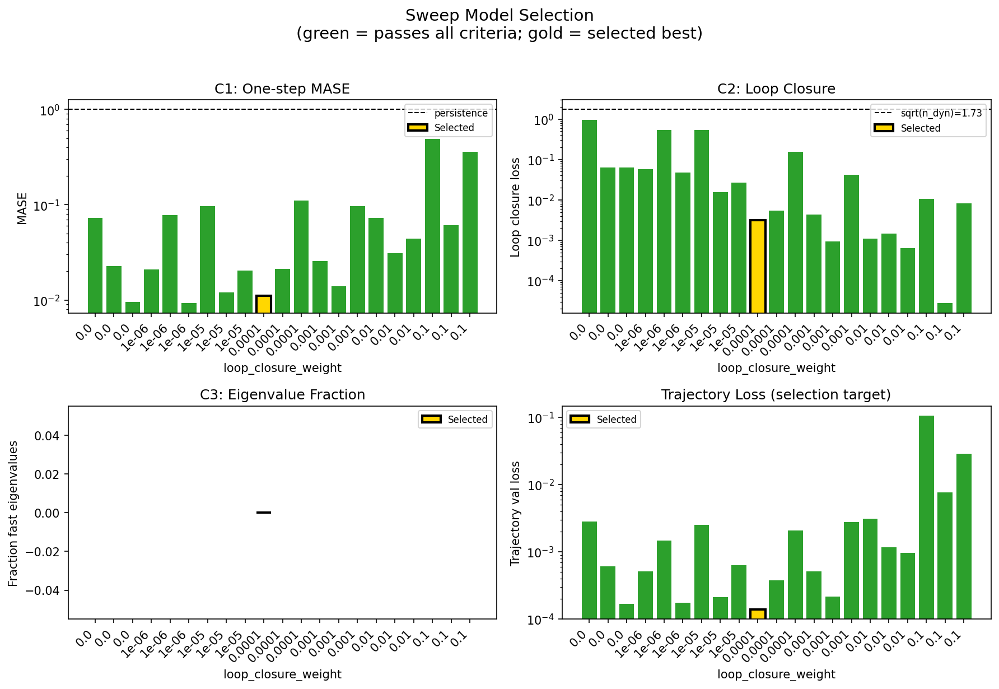

### sweep_pareto

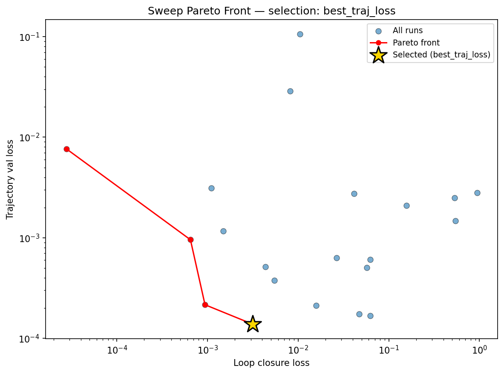

### reconstruction

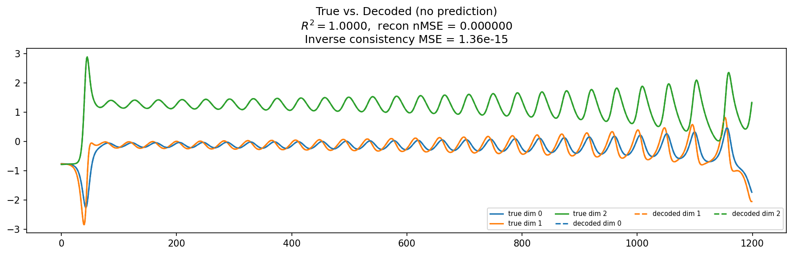

### prediction_windows

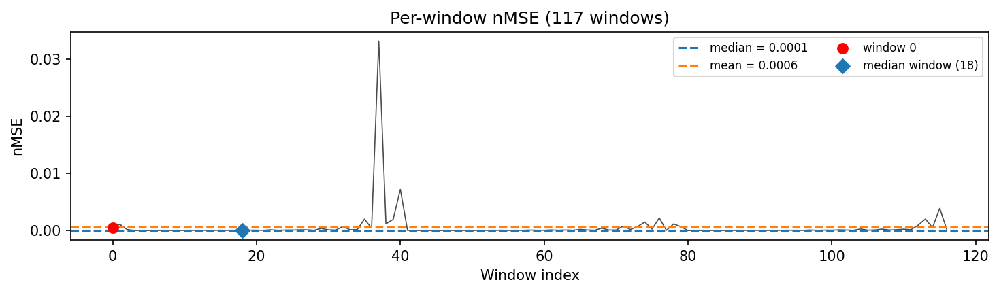

### long_trajectory

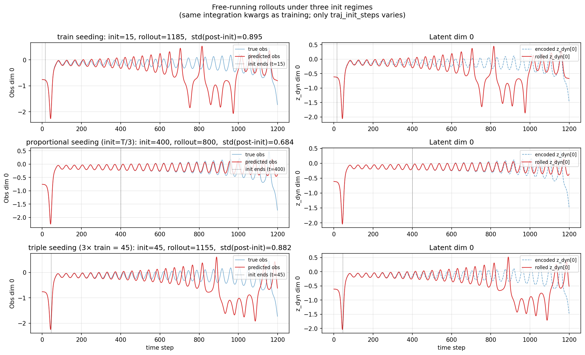

### mase

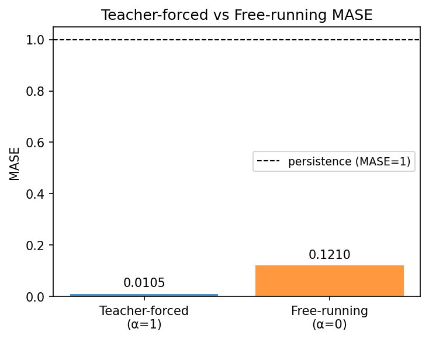

### latent_utilization

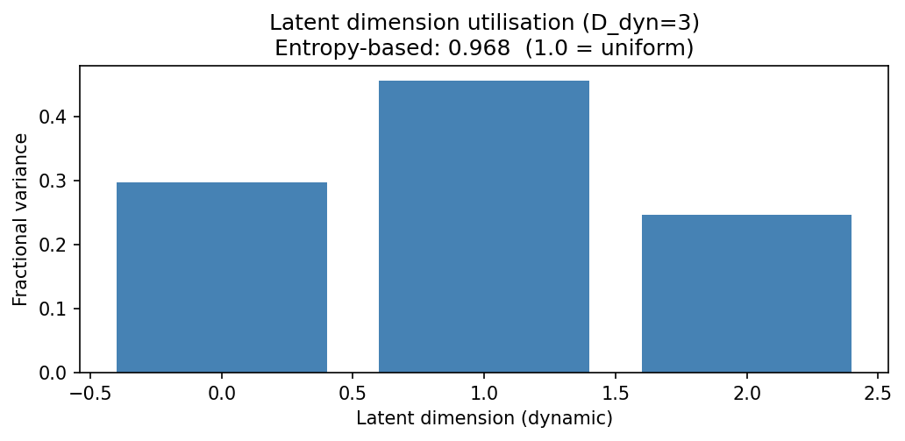

### lyapunov

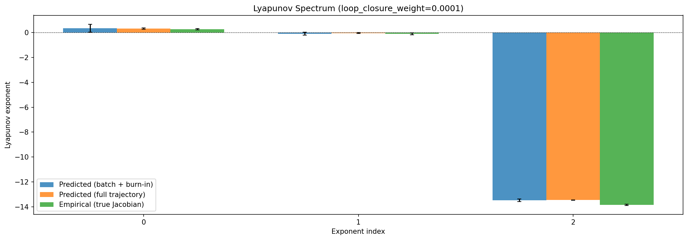

### kaplan_yorke

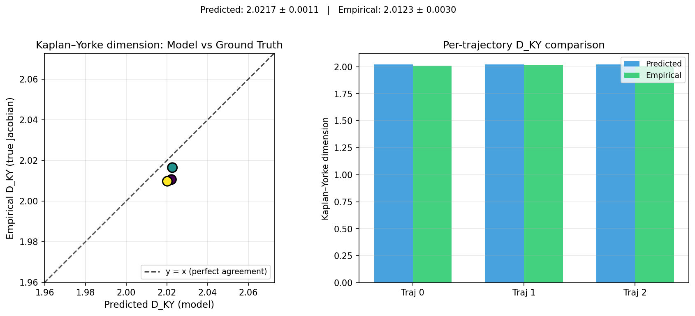

### per_run_lyapunov

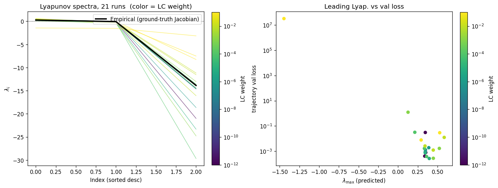

### per_run_lyapunov_vs_true

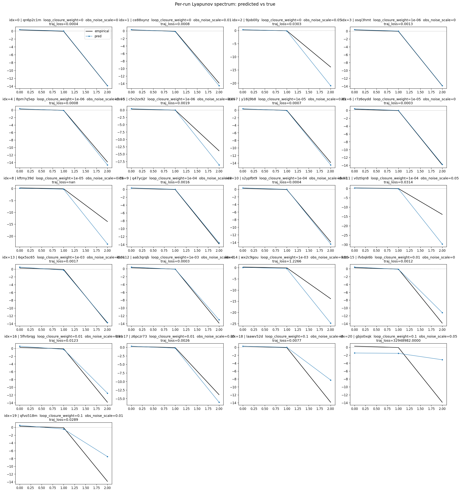

### per_run_lyapunov_relerr

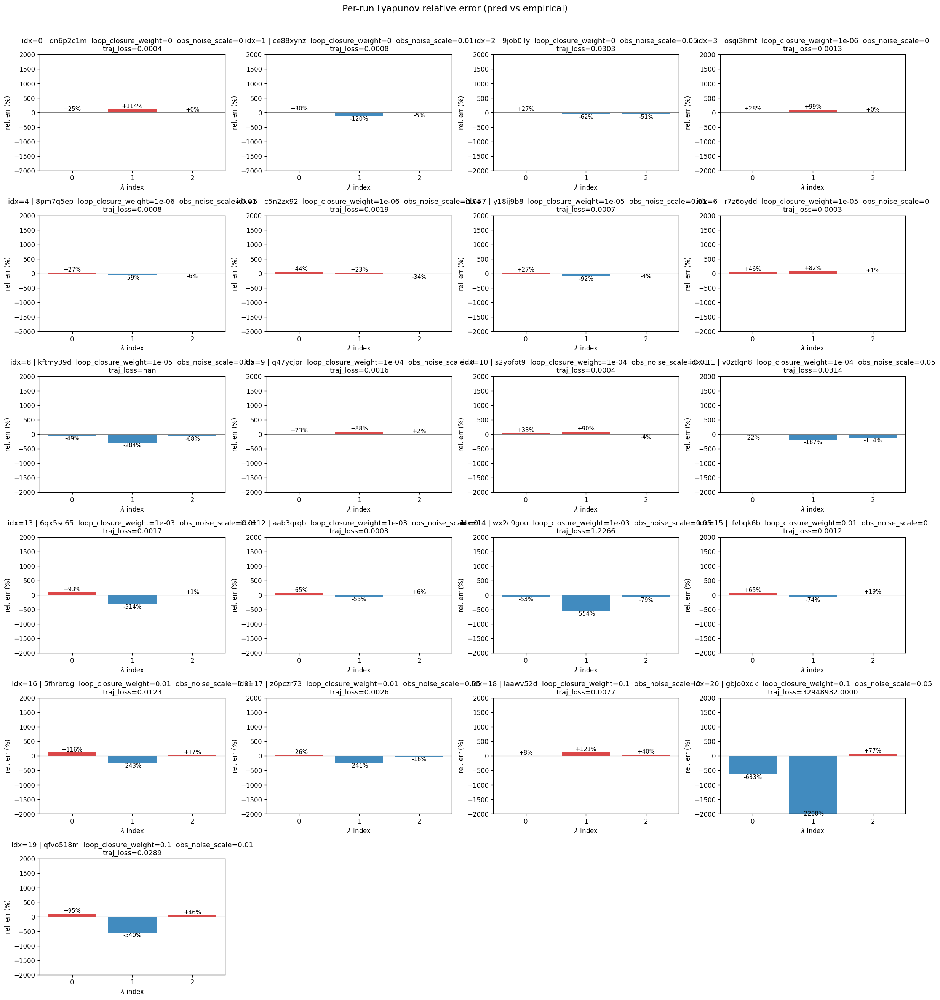

### encoder_decoder_jacobians

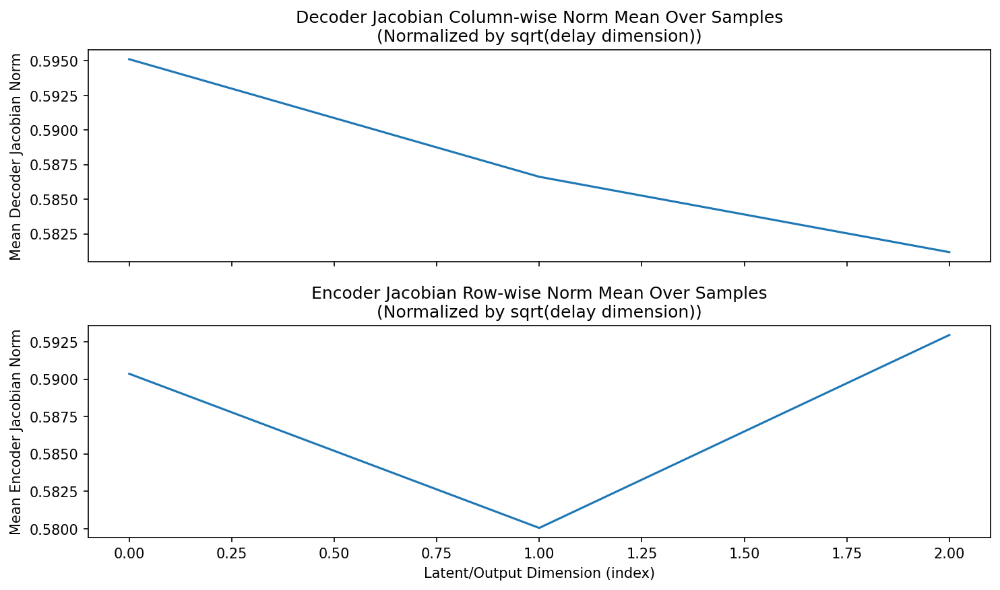

### amplification

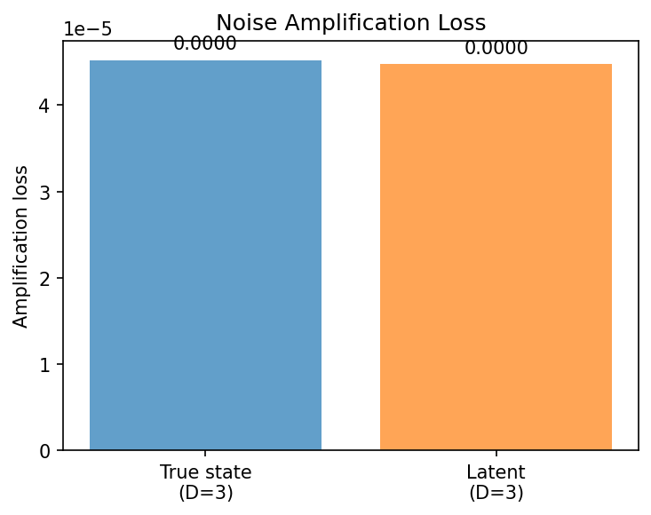

### kaplan_yorke_pca

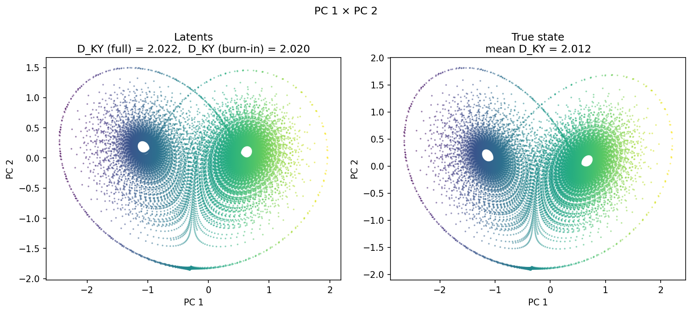

### prediction_detail_latent

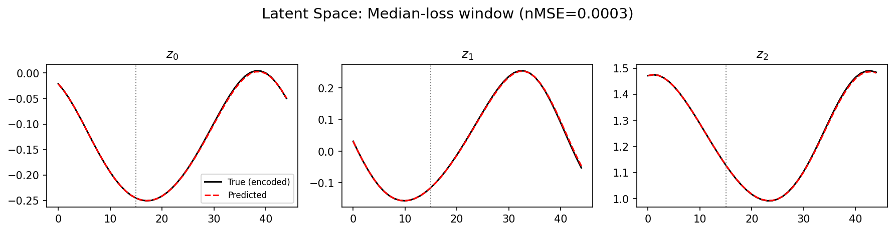

### prediction_detail_obs

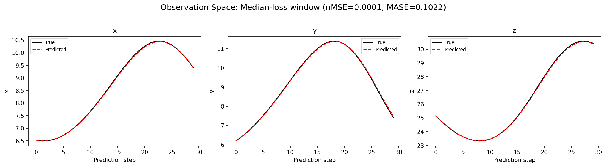

### tangent_spectrum

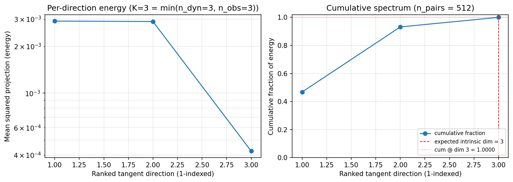

### per_run_tangent_spectrum

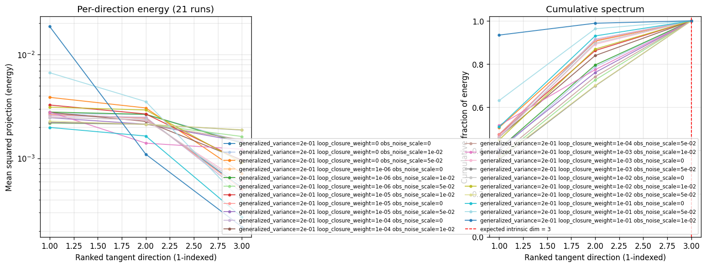

## Discussion

<!--
This section is intentionally left as a placeholder. A human reviewer
or Claude Code agent should fill it in based on the tables and figures
above, explicitly addressing each success criterion and comparing the
outcome to the stated hypothesis. Write the Discussion to
`discussion.md` in this directory and re-run `render_report`.
-->

_(to be written)_

## `run_analytics` stdout

<details><summary>Click to expand — full diagnostic output from <code>run_analytics</code></summary>

```
No run_id provided — selecting best run from group 'lorenz_full3_additive_p30_nearid_tf__lc_x_obsnoisescale_sweep_20260429T163249Z__stage_a' ...
Found 21 total runs in JacobianODE/Lorenz_INDall_N1_D1_NormTrue_T3__JacobianODE (group=lorenz_full3_additive_p30_nearid_tf__lc_x_obsnoisescale_sweep_20260429T163249Z__stage_a)
All runs (state, loop_closure_weight, tangent_entropy_weight, kl_dyn_weight):
  qn6p2c1m: state=finished, lc=0.0, te=0.0, kl_dyn=0.0
  ce88xynz: state=finished, lc=0.0, te=0.0, kl_dyn=0.0
  9job0lly: state=finished, lc=0.0, te=0.0, kl_dyn=0.0
  osqi3hmt: state=finished, lc=1e-06, te=0.0, kl_dyn=0.0
  8pm7q5ep: state=finished, lc=1e-06, te=0.0, kl_dyn=0.0
  c5n2zx92: state=finished, lc=1e-06, te=0.0, kl_dyn=0.0
  y18ij9b8: state=finished, lc=1e-05, te=0.0, kl_dyn=0.0
  r7z6oydd: state=finished, lc=1e-05, te=0.0, kl_dyn=0.0
  kftmy39d: state=finished, lc=1e-05, te=0.0, kl_dyn=0.0
  q47ycjpr: state=finished, lc=0.0001, te=0.0, kl_dyn=0.0
  s2ypfbt9: state=finished, lc=0.0001, te=0.0, kl_dyn=0.0
  v0ztlqn8: state=finished, lc=0.0001, te=0.0, kl_dyn=0.0
  6qx5sc65: state=finished, lc=0.001, te=0.0, kl_dyn=0.0
  aab3qrqb: state=finished, lc=0.001, te=0.0, kl_dyn=0.0
  wx2c9gou: state=finished, lc=0.001, te=0.0, kl_dyn=0.0
  ifvbqk6b: state=finished, lc=0.01, te=0.0, kl_dyn=0.0
  5fhrbrqg: state=finished, lc=0.01, te=0.0, kl_dyn=0.0
  z6pczr73: state=finished, lc=0.01, te=0.0, kl_dyn=0.0
  laawv52d: state=finished, lc=0.1, te=0.0, kl_dyn=0.0
  gbjo0xqk: state=finished, lc=0.1, te=0.0, kl_dyn=0.0
  qfvo518m: state=finished, lc=0.1, te=0.0, kl_dyn=0.0

slurm_timeout_min not found in any run config — falling back to 180 min
  Including qn6p2c1m (lc=0.0): use_all_runs=True (state=finished)
  Including ce88xynz (lc=0.0): use_all_runs=True (state=finished)
  Including 9job0lly (lc=0.0): use_all_runs=True (state=finished)
  Including osqi3hmt (lc=1e-06): use_all_runs=True (state=finished)
  Including 8pm7q5ep (lc=1e-06): use_all_runs=True (state=finished)
  Including c5n2zx92 (lc=1e-06): use_all_runs=True (state=finished)
  Including y18ij9b8 (lc=1e-05): use_all_runs=True (state=finished)
  Including r7z6oydd (lc=1e-05): use_all_runs=True (state=finished)
  Including kftmy39d (lc=1e-05): use_all_runs=True (state=finished)
  Including q47ycjpr (lc=0.0001): use_all_runs=True (state=finished)
  Including s2ypfbt9 (lc=0.0001): use_all_runs=True (state=finished)
  Including v0ztlqn8 (lc=0.0001): use_all_runs=True (state=finished)
  Including 6qx5sc65 (lc=0.001): use_all_runs=True (state=finished)
  Including aab3qrqb (lc=0.001): use_all_runs=True (state=finished)
  Including wx2c9gou (lc=0.001): use_all_runs=True (state=finished)
  Including ifvbqk6b (lc=0.01): use_all_runs=True (state=finished)
  Including 5fhrbrqg (lc=0.01): use_all_runs=True (state=finished)
  Including z6pczr73 (lc=0.01): use_all_runs=True (state=finished)
  Including laawv52d (lc=0.1): use_all_runs=True (state=finished)
  Including gbjo0xqk (lc=0.1): use_all_runs=True (state=finished)
  Including qfvo518m (lc=0.1): use_all_runs=True (state=finished)
Found 21 effectively-done sweep runs:
  loop_closure_weight=0.0, tangent_entropy_weight=0.0, kl_dyn_weight=0.0 -> run_id=9job0lly
  loop_closure_weight=0.0, tangent_entropy_weight=0.0, kl_dyn_weight=0.0 -> run_id=ce88xynz
  loop_closure_weight=0.0, tangent_entropy_weight=0.0, kl_dyn_weight=0.0 -> run_id=qn6p2c1m
  loop_closure_weight=1e-06, tangent_entropy_weight=0.0, kl_dyn_weight=0.0 -> run_id=8pm7q5ep
  loop_closure_weight=1e-06, tangent_entropy_weight=0.0, kl_dyn_weight=0.0 -> run_id=c5n2zx92
  loop_closure_weight=1e-06, tangent_entropy_weight=0.0, kl_dyn_weight=0.0 -> run_id=osqi3hmt
  loop_closure_weight=1e-05, tangent_entropy_weight=0.0, kl_dyn_weight=0.0 -> run_id=kftmy39d
  loop_closure_weight=1e-05, tangent_entropy_weight=0.0, kl_dyn_weight=0.0 -> run_id=r7z6oydd
  loop_closure_weight=1e-05, tangent_entropy_weight=0.0, kl_dyn_weight=0.0 -> run_id=y18ij9b8
  loop_closure_weight=0.0001, tangent_entropy_weight=0.0, kl_dyn_weight=0.0 -> run_id=q47ycjpr
  loop_closure_weight=0.0001, tangent_entropy_weight=0.0, kl_dyn_weight=0.0 -> run_id=s2ypfbt9
  loop_closure_weight=0.0001, tangent_entropy_weight=0.0, kl_dyn_weight=0.0 -> run_id=v0ztlqn8
  loop_closure_weight=0.001, tangent_entropy_weight=0.0, kl_dyn_weight=0.0 -> run_id=6qx5sc65
  loop_closure_weight=0.001, tangent_entropy_weight=0.0, kl_dyn_weight=0.0 -> run_id=aab3qrqb
  loop_closure_weight=0.001, tangent_entropy_weight=0.0, kl_dyn_weight=0.0 -> run_id=wx2c9gou
  loop_closure_weight=0.01, tangent_entropy_weight=0.0, kl_dyn_weight=0.0 -> run_id=5fhrbrqg
  loop_closure_weight=0.01, tangent_entropy_weight=0.0, kl_dyn_weight=0.0 -> run_id=ifvbqk6b
  loop_closure_weight=0.01, tangent_entropy_weight=0.0, kl_dyn_weight=0.0 -> run_id=z6pczr73
  loop_closure_weight=0.1, tangent_entropy_weight=0.0, kl_dyn_weight=0.0 -> run_id=gbjo0xqk
  loop_closure_weight=0.1, tangent_entropy_weight=0.0, kl_dyn_weight=0.0 -> run_id=laawv52d
  loop_closure_weight=0.1, tangent_entropy_weight=0.0, kl_dyn_weight=0.0 -> run_id=qfvo518m
n_dims=3, n_latent=3, n_dyn=3, dt=0.0150
  run=9job0lly: DiagnosticMetrics(one_step_mase=0.0728202611207962, loop_closure_loss=0.94355309009552, fast_eigenvalue_fraction=0.0, trajectory_val_loss=0.002811076585203409) (from W&B history)
  run=ce88xynz: DiagnosticMetrics(one_step_mase=0.022798094898462296, loop_closure_loss=0.06262003630399704, fast_eigenvalue_fraction=0.0, trajectory_val_loss=0.000607253925409168) (from W&B history)
  run=qn6p2c1m: DiagnosticMetrics(one_step_mase=0.00954161211848259, loop_closure_loss=0.06267660856246948, fast_eigenvalue_fraction=0.0, trajectory_val_loss=0.00016792197129689157) (from W&B history)
  run=8pm7q5ep: DiagnosticMetrics(one_step_mase=0.02095170132815838, loop_closure_loss=0.05696834623813629, fast_eigenvalue_fraction=0.0, trajectory_val_loss=0.0005070432089269161) (from W&B history)
  run=c5n2zx92: DiagnosticMetrics(one_step_mase=0.07726263254880905, loop_closure_loss=0.5424937605857849, fast_eigenvalue_fraction=0.0, trajectory_val_loss=0.0014674313133582473) (from W&B history)
  run=osqi3hmt: DiagnosticMetrics(one_step_mase=0.009239597246050835, loop_closure_loss=0.047156915068626404, fast_eigenvalue_fraction=0.0, trajectory_val_loss=0.0001744173641782254) (from W&B history)
  run=kftmy39d: DiagnosticMetrics(one_step_mase=0.09635493159294128, loop_closure_loss=0.5323993563652039, fast_eigenvalue_fraction=0.0, trajectory_val_loss=0.002490880200639367) (from W&B history)
  run=r7z6oydd: DiagnosticMetrics(one_step_mase=0.011947923339903355, loop_closure_loss=0.015795456245541573, fast_eigenvalue_fraction=0.0, trajectory_val_loss=0.00021297768398653716) (from W&B history)
  run=y18ij9b8: DiagnosticMetrics(one_step_mase=0.020458443090319633, loop_closure_loss=0.02657948061823845, fast_eigenvalue_fraction=0.0, trajectory_val_loss=0.0006309924065135419) (from W&B history)
  run=q47ycjpr: DiagnosticMetrics(one_step_mase=0.011098829098045826, loop_closure_loss=0.0031410125084221363, fast_eigenvalue_fraction=0.0, trajectory_val_loss=0.0001383699127472937) (from W&B history)
  run=s2ypfbt9: DiagnosticMetrics(one_step_mase=0.021325746551156044, loop_closure_loss=0.005470857489854097, fast_eigenvalue_fraction=0.0, trajectory_val_loss=0.00037638709181919694) (from W&B history)
  run=v0ztlqn8: DiagnosticMetrics(one_step_mase=0.11005331575870514, loop_closure_loss=0.15686123073101044, fast_eigenvalue_fraction=0.0, trajectory_val_loss=0.00208758981898427) (from W&B history)
  run=6qx5sc65: DiagnosticMetrics(one_step_mase=0.025487076491117477, loop_closure_loss=0.0043603722006082535, fast_eigenvalue_fraction=0.0, trajectory_val_loss=0.0005141532747074962) (from W&B history)
  run=aab3qrqb: DiagnosticMetrics(one_step_mase=0.014027087949216366, loop_closure_loss=0.000938237237278372, fast_eigenvalue_fraction=0.0, trajectory_val_loss=0.00021569330419879407) (from W&B history)
  run=wx2c9gou: DiagnosticMetrics(one_step_mase=0.0972466915845871, loop_closure_loss=0.04140852019190788, fast_eigenvalue_fraction=0.0, trajectory_val_loss=0.0027585888747125864) (from W&B history)
  run=5fhrbrqg: DiagnosticMetrics(one_step_mase=0.07255454361438751, loop_closure_loss=0.0011047219159081578, fast_eigenvalue_fraction=0.0, trajectory_val_loss=0.0031213113106787205) (from W&B history)
  run=ifvbqk6b: DiagnosticMetrics(one_step_mase=0.030803469941020012, loop_closure_loss=0.0014869256410747766, fast_eigenvalue_fraction=0.0, trajectory_val_loss=0.0011679537128657103) (from W&B history)
  run=z6pczr73: DiagnosticMetrics(one_step_mase=0.04408523067831993, loop_closure_loss=0.0006477378192357719, fast_eigenvalue_fraction=0.0, trajectory_val_loss=0.0009560990147292614) (from W&B history)
  run=gbjo0xqk: DiagnosticMetrics(one_step_mase=0.49270308017730713, loop_closure_loss=0.010451525449752808, fast_eigenvalue_fraction=0.0, trajectory_val_loss=0.10588298738002777) (from W&B history)
  run=laawv52d: DiagnosticMetrics(one_step_mase=0.06106758117675781, loop_closure_loss=2.7636218874249607e-05, fast_eigenvalue_fraction=0.0, trajectory_val_loss=0.007672740146517754) (from W&B history)
  run=qfvo518m: DiagnosticMetrics(one_step_mase=0.3610649108886719, loop_closure_loss=0.008142434060573578, fast_eigenvalue_fraction=0.0, trajectory_val_loss=0.02890561893582344) (from W&B history)

Ranking method:           best_traj_loss
Best run ID:              q47ycjpr
Best loop_closure_weight: 0.0001
Best tangent_entropy_weight: 0.0
Best kl_dyn_weight:       0.0
Best traj loss:           0.000138
Criteria applied: ['C1', 'C2', 'C3']
Surviving: 21 / 21
Auto-selected run_id: q47ycjpr

======================================================================
PARETO FRONTIER RUNS (4 runs)
======================================================================
  Run ID               LC Loss   Traj Val Loss
  ------------  --------------  --------------
  laawv52d            0.000028        0.007673
  z6pczr73            0.000648        0.000956
  aab3qrqb            0.000938        0.000216
  q47ycjpr            0.003141        0.000138 <-- selected

======================================================================
RANKING METHOD COMPARISON (over 21 survivors)
======================================================================
  Method                  Run ID               LC Loss   Traj Val Loss
  ----------------------  ------------  --------------  --------------
  best_traj_loss          q47ycjpr            0.003141        0.000138 <-- active
  pareto_knee             aab3qrqb            0.000938        0.000216
  geo_rank                q47ycjpr            0.003141        0.000138
  minimax_rank            aab3qrqb            0.000938        0.000216
  geo_log_score           q47ycjpr            0.003141        0.000138
  minimax_log_score       z6pczr73            0.000648        0.000956
======================================================================

Loading run q47ycjpr from JacobianODE/Lorenz_INDall_N1_D1_NormTrue_T3__JacobianODE ...
Loading checkpoint epoch=18-step=3800.ckpt...
Train dataset shape: torch.Size([25410, 45, 3])
Validation dataset shape: torch.Size([8085, 45, 3])
Test dataset shape: torch.Size([3465, 45, 3])
Train trajectories dataset shape: torch.Size([22, 1200, 3])
Validation trajectories dataset shape: torch.Size([7, 1200, 3])
Test trajectories dataset shape: torch.Size([3, 1200, 3])
Loading checkpoint epoch=18-step=3800.ckpt...
Computing reconstruction ...
Computing MASE ...
Teacher-forced MASE: 0.0105
Free-running MASE:   0.1210
Computing latent utilization ...
Entropy-based utilization: 0.968
Computing Lyapunov exponents ...
  Computing full-trajectory Lyapunov (3 test trajs, T=1200) ...
Predicted Lyapunov exponents (batch+burn-in, 128 windowed trajs):
  λ_1 = +0.3561 ± 0.3099
  λ_2 = -0.0870 ± 0.1249
  λ_3 = -13.4710 ± 0.1012
Predicted Lyapunov exponents (full-length, 3 test trajs):
  λ_1 = +0.3256 ± 0.0593
  λ_2 = -0.0329 ± 0.0448
  λ_3 = -13.4645 ± 0.0045
Empirical Lyapunov exponents (mean ± std):
  λ_1 = +0.2716 ± 0.0605
  λ_2 = -0.1016 ± 0.0797
  λ_3 = -13.8370 ± 0.0514
Mean KY dim (predicted): 2.022 ± 0.001
Mean KY dim (empirical): 2.012 ± 0.003
Mean KY dim (burn-in):   2.020 ± 0.019
Computing prediction windows ...
Windows: 117 — nMSE min=0.0000, median=0.0001, mean=0.0006, max=0.0331
Computing long-trajectory free-running rollouts ...
Computing encoder/decoder Jacobians ...
encoder_jacobian: (128, 3, 3)
decoder_jacobian: (128, 3, 3)
Computing amplification loss ...
Amplification loss — True state: 0.000045
Amplification loss — Latent:     0.000045
Computing tangent space spectrum ...
```

</details>
