# Sweep Analysis: `lorenz_full_additive_mse__lc_sweep`

**Project**: [Lorenz_INDall_N1_D1_NormTrue_T3__JacobianODE](https://wandb.ai/JacobianODE/Lorenz_INDall_N1_D1_NormTrue_T3__JacobianODE/groups/lorenz_full_additive_mse__lc_sweep)  
**Launched**: 2026-04-14T19:25:13Z  
**Completed**: 2026-04-15T01:14:09Z  
**Outcome**: `complete_clean`  
**Git**: `latent-JacobianODE` @ `40b08d5`  
**Expected runs**: 9

## Experiment Context

### `lorenz_full_additive_mse`

**Description**

Fully observed Lorenz-63 (all 3 dims, no delay embedding). Additive
coupling encoder with zero_init (identity-at-init modulo
permutations), trained jointly with the Jacobian dynamics using
plain MSE (not gennMSE). obs_noise_scale=0 fixed; LC weight swept.
Matches the clean-target LPL fix used in recent runs.

**Hypothesis**

On fully observed Lorenz with clean data, plain MSE and gennMSE
should produce broadly similar results — the gennMSE denominator's
consistency benefit is more of a per-term scaling fix that matters
most when loss terms span very different subspaces (e.g.
partial-obs with delay embedding). Expectation: MSE's optimal LC
and Lyapunov recovery track gennMSE's closely, maybe with slightly
different loss magnitudes. If they diverge significantly on this
clean problem, that's diagnostic of how gennMSE is actually acting.

**Success criteria**

- Best run's leading Lyapunov exponent > 0 (chaos recovered)
- Best run's predicted Lyapunov spectrum within ~30% of empirical
- Optimal LC weight within 1 order of magnitude of gennMSE optimum
- val/trajectory_r2_score > 0.95 at the best configuration

## Results

**Swept axes** (1): `training.lightning.loop_closure_weight`

**Chosen run** (by `best_traj_loss`): `12vyzpd8` — traj_loss=0.00000, MASE=0.0097, R²=1.0000, LC loss=0.241, epoch=149.0

Swept-axis values at chosen run: `training.lightning.loop_closure_weight`=1.0e-06

### Integrity checks

⚠️ **7 run_idx slot(s) had multiple matching wandb runs** — the best by `best_traj_loss` was kept; the others are listed below for audit:
  - run_idx=**0**: chose `vux9y0wq`, dropped `briwoaio`
  - run_idx=**1**: chose `12vyzpd8`, dropped `sdha70hj`
  - run_idx=**2**: chose `18evo6x8`, dropped `x54ta2yw`
  - run_idx=**3**: chose `4fv8wije`, dropped `gh1g512k`
  - run_idx=**4**: chose `i0uf84y3`, dropped `igz6wl29`
  - run_idx=**5**: chose `yl43fo1k`, dropped `lq5kni9m`
  - run_idx=**6**: chose `wbjv6ag5`, dropped `4794pjz4`

**Runs analyzed**: 9 (expected 9)

### Per-run results

| run_idx | run_id | `training.lightning.loop_closure_weight` | best_traj_loss | best_MASE | R² | LC loss | epoch |
|---|---|---|---|---|---|---|---|
| 1 | `12vyzpd8` | 1.0e-06 | 0.00000 | 0.0097 | 1.0000 | 0.241 | 149.0 |
| 2 | `18evo6x8` | 1.0e-05 | 0.00000 | 0.0106 | 1.0000 | 0.032 | 149.0 |
| 3 | `4fv8wije` | 1.0e-04 | 0.00000 | 0.0115 | 1.0000 | 0.003 | 149.0 |
| 4 | `i0uf84y3` | 0.001 | 0.00000 | 0.0121 | 1.0000 | 0.000 | 143.0 |
| 5 | `yl43fo1k` | 0.01 | 0.00000 | 0.0231 | 1.0000 | 0.000 | 148.0 |
| 0 | `vux9y0wq` | 0 | 0.00000 | 0.0292 | 1.0000 | 0.358 | 47.0 |
| 6 | `wbjv6ag5` | 0.1 | 0.00001 | 0.0414 | 1.0000 | 0.000 | 148.0 |
| 7 | `seg1qstd` | 1 | 0.00009 | 0.1241 | 0.9999 | 0.000 | 149.0 |
| 8 | `y1szp7dd` | 10 | 0.00034 | 0.2055 | 0.9996 | 0.000 | 141.0 |

## Success-criteria verdicts (automated)

| Criterion | Verdict | Note |
|---|---|---|
| Best run's leading Lyapunov exponent > 0 (chaos recovered) | **Unknown** |  |
| Best run's predicted Lyapunov spectrum within ~30% of empirical | **Unknown** |  |
| Optimal LC weight within 1 order of magnitude of gennMSE optimum | **Unknown** |  |
| val/trajectory_r2_score > 0.95 at the best configuration | **Pass** | Best R² = 1.0000; threshold > 0.95 |

_Automated verdicts use simple numeric-threshold parsing and may mis-classify qualitative criteria. The Discussion section below takes precedence._

## Figures

### sweep_overview

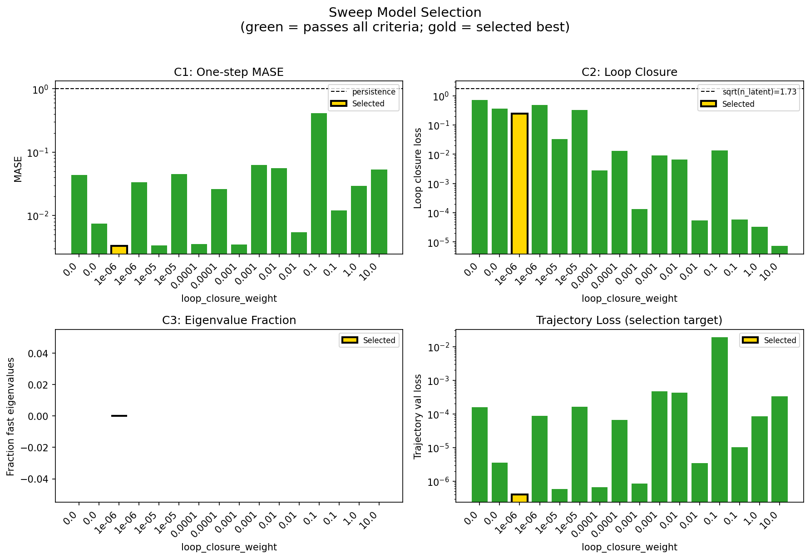

### sweep_pareto

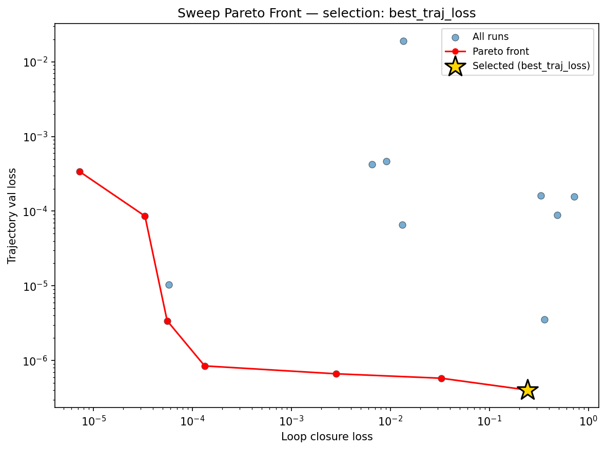

### reconstruction

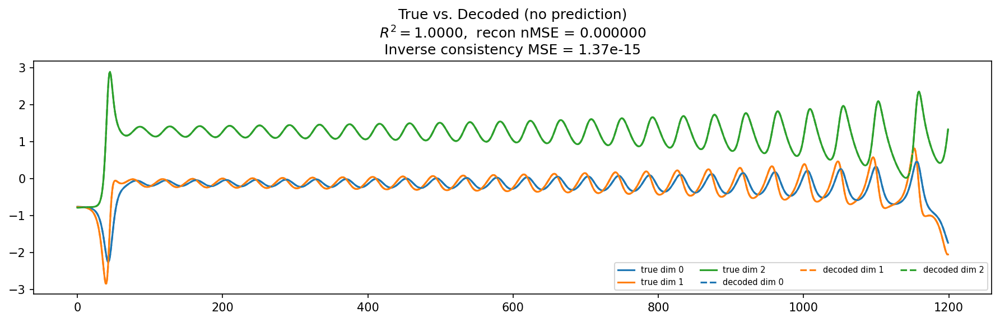

### prediction_windows

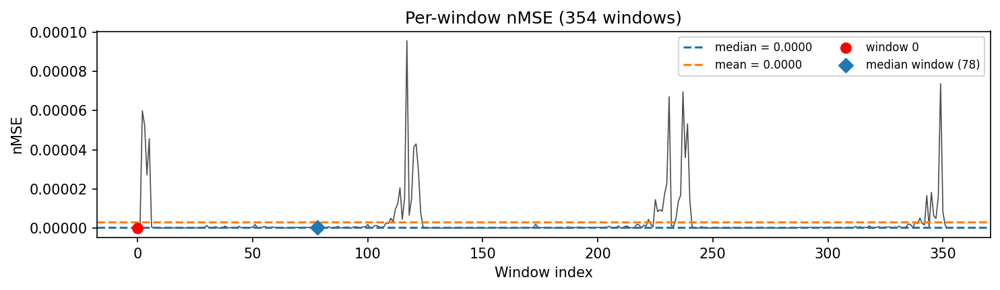

### long_trajectory

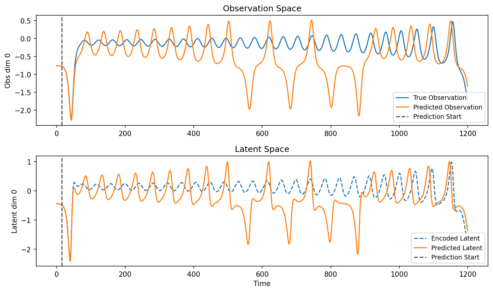

### mase

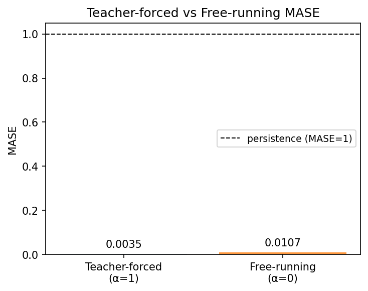

### latent_utilization

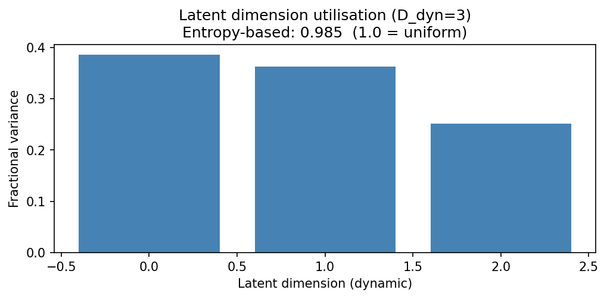

### lyapunov

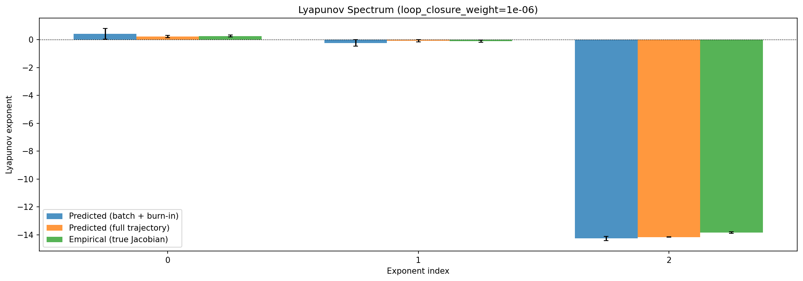

### kaplan_yorke

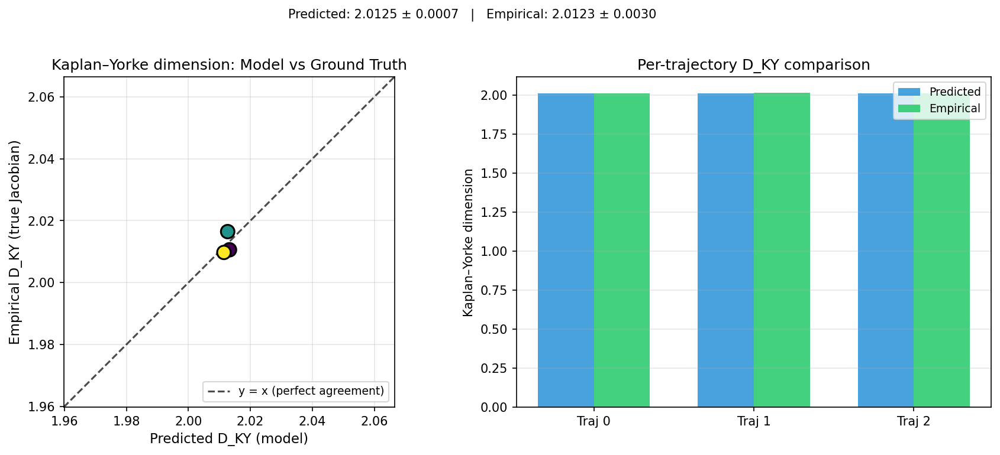

### per_run_lyapunov

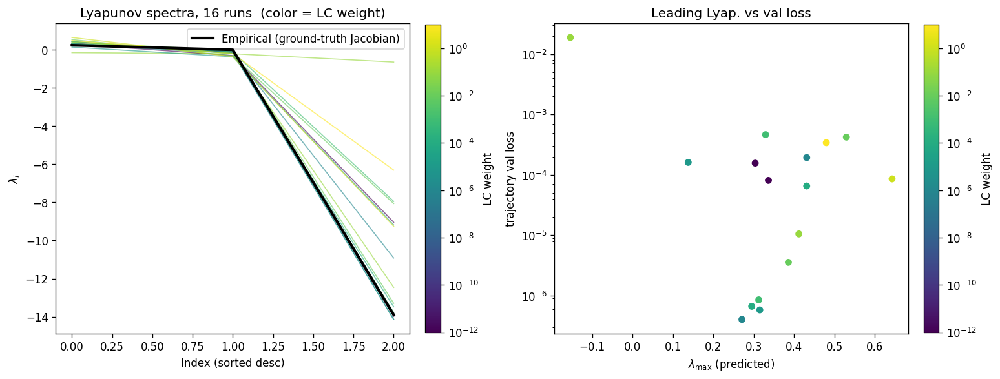

### per_run_lyapunov_vs_true

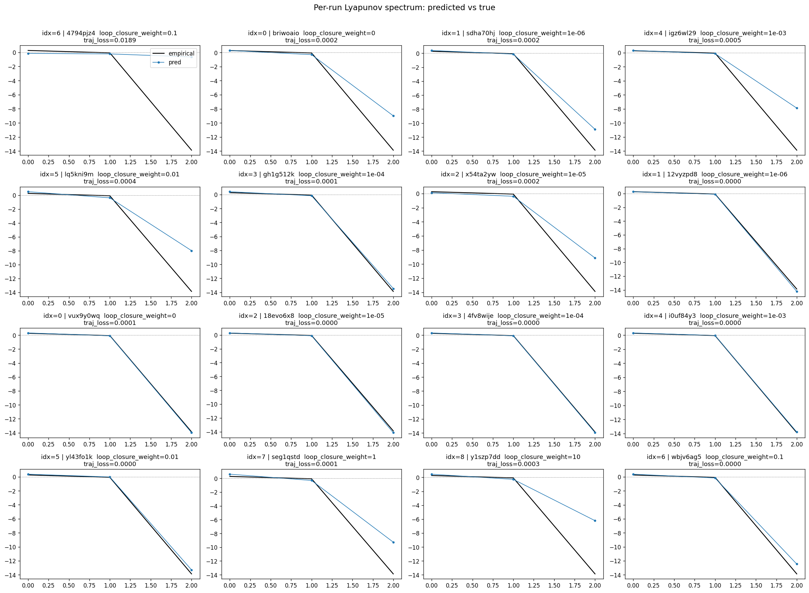

### per_run_lyapunov_relerr

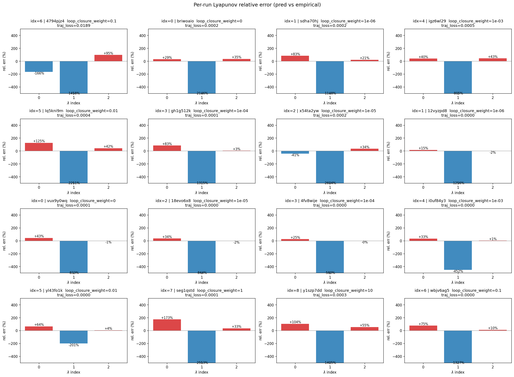

### lyapunov_spectrum_mse_vs_val_loss

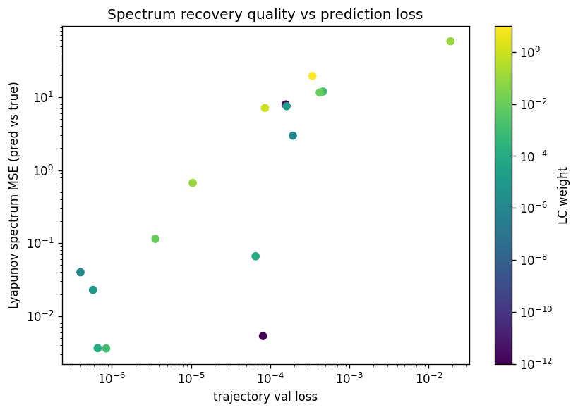

### encoder_decoder_jacobians

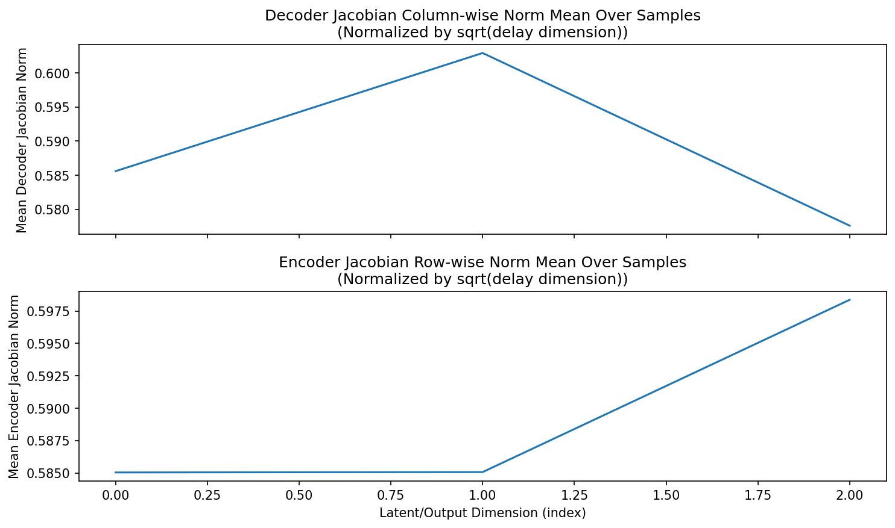

### amplification

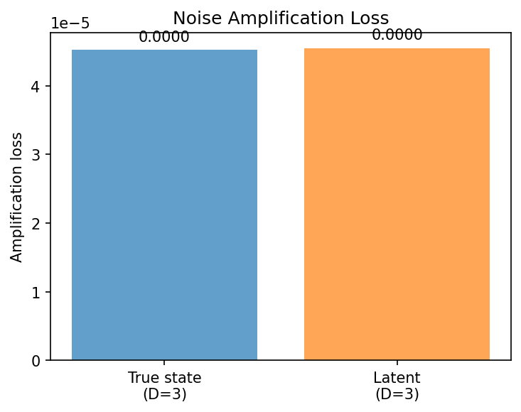

### kaplan_yorke_pca

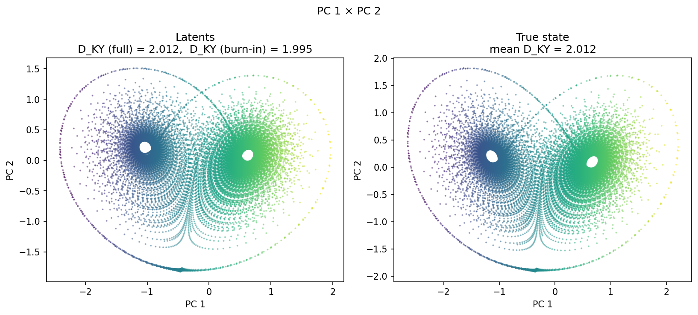

### prediction_detail_latent

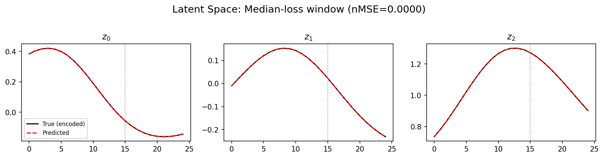

### prediction_detail_obs

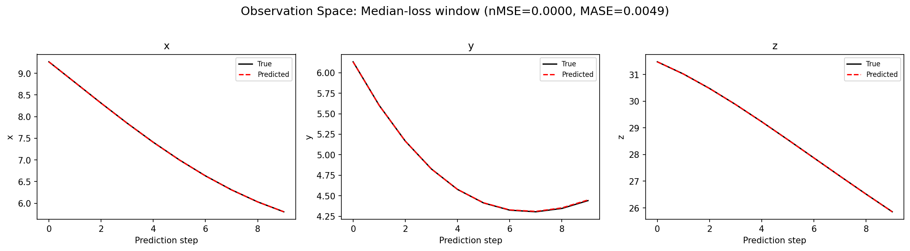

## Discussion

<!--
This section is intentionally left as a placeholder. A human reviewer
or Claude Code agent should fill it in based on the tables and figures
above, explicitly addressing each success criterion and comparing the
outcome to the stated hypothesis. Write the Discussion to
`discussion.md` in this directory and re-run `render_report`.
-->

_(to be written)_

## `run_analytics` stdout

<details><summary>Click to expand — full diagnostic output from <code>run_analytics</code></summary>

```
No run_id provided — selecting best run from group 'lorenz_full_additive_mse__lc_sweep' ...
Found 16 total runs in JacobianODE/Lorenz_INDall_N1_D1_NormTrue_T3__JacobianODE (group=lorenz_full_additive_mse__lc_sweep)
All runs (state, loop_closure_weight, tangent_entropy_weight, kl_dyn_weight):
  4794pjz4: state=finished, lc=0.1, te=0.0, kl_dyn=0.0
  briwoaio: state=finished, lc=0.0, te=0.0, kl_dyn=0.0
  sdha70hj: state=finished, lc=1e-06, te=0.0, kl_dyn=0.0
  igz6wl29: state=finished, lc=0.001, te=0.0, kl_dyn=0.0
  lq5kni9m: state=finished, lc=0.01, te=0.0, kl_dyn=0.0
  gh1g512k: state=finished, lc=0.0001, te=0.0, kl_dyn=0.0
  x54ta2yw: state=finished, lc=1e-05, te=0.0, kl_dyn=0.0
  12vyzpd8: state=finished, lc=1e-06, te=0.0, kl_dyn=0.0
  vux9y0wq: state=finished, lc=0.0, te=0.0, kl_dyn=0.0
  18evo6x8: state=finished, lc=1e-05, te=0.0, kl_dyn=0.0
  4fv8wije: state=finished, lc=0.0001, te=0.0, kl_dyn=0.0
  i0uf84y3: state=finished, lc=0.001, te=0.0, kl_dyn=0.0
  yl43fo1k: state=finished, lc=0.01, te=0.0, kl_dyn=0.0
  seg1qstd: state=finished, lc=1.0, te=0.0, kl_dyn=0.0
  y1szp7dd: state=finished, lc=10.0, te=0.0, kl_dyn=0.0
  wbjv6ag5: state=finished, lc=0.1, te=0.0, kl_dyn=0.0

slurm_timeout_min not found in any run config — falling back to 180 min
  Including 4794pjz4 (lc=0.1): use_all_runs=True (state=finished)
  Including briwoaio (lc=0.0): use_all_runs=True (state=finished)
  Including sdha70hj (lc=1e-06): use_all_runs=True (state=finished)
  Including igz6wl29 (lc=0.001): use_all_runs=True (state=finished)
  Including lq5kni9m (lc=0.01): use_all_runs=True (state=finished)
  Including gh1g512k (lc=0.0001): use_all_runs=True (state=finished)
  Including x54ta2yw (lc=1e-05): use_all_runs=True (state=finished)
  Including 12vyzpd8 (lc=1e-06): use_all_runs=True (state=finished)
  Including vux9y0wq (lc=0.0): use_all_runs=True (state=finished)
  Including 18evo6x8 (lc=1e-05): use_all_runs=True (state=finished)
  Including 4fv8wije (lc=0.0001): use_all_runs=True (state=finished)
  Including i0uf84y3 (lc=0.001): use_all_runs=True (state=finished)
  Including yl43fo1k (lc=0.01): use_all_runs=True (state=finished)
  Including seg1qstd (lc=1.0): use_all_runs=True (state=finished)
  Including y1szp7dd (lc=10.0): use_all_runs=True (state=finished)
  Including wbjv6ag5 (lc=0.1): use_all_runs=True (state=finished)
Found 16 effectively-done sweep runs:
  loop_closure_weight=0.0, tangent_entropy_weight=0.0, kl_dyn_weight=0.0 -> run_id=briwoaio
  loop_closure_weight=0.0, tangent_entropy_weight=0.0, kl_dyn_weight=0.0 -> run_id=vux9y0wq
  loop_closure_weight=1e-06, tangent_entropy_weight=0.0, kl_dyn_weight=0.0 -> run_id=12vyzpd8
  loop_closure_weight=1e-06, tangent_entropy_weight=0.0, kl_dyn_weight=0.0 -> run_id=sdha70hj
  loop_closure_weight=1e-05, tangent_entropy_weight=0.0, kl_dyn_weight=0.0 -> run_id=18evo6x8
  loop_closure_weight=1e-05, tangent_entropy_weight=0.0, kl_dyn_weight=0.0 -> run_id=x54ta2yw
  loop_closure_weight=0.0001, tangent_entropy_weight=0.0, kl_dyn_weight=0.0 -> run_id=4fv8wije
  loop_closure_weight=0.0001, tangent_entropy_weight=0.0, kl_dyn_weight=0.0 -> run_id=gh1g512k
  loop_closure_weight=0.001, tangent_entropy_weight=0.0, kl_dyn_weight=0.0 -> run_id=i0uf84y3
  loop_closure_weight=0.001, tangent_entropy_weight=0.0, kl_dyn_weight=0.0 -> run_id=igz6wl29
  loop_closure_weight=0.01, tangent_entropy_weight=0.0, kl_dyn_weight=0.0 -> run_id=lq5kni9m
  loop_closure_weight=0.01, tangent_entropy_weight=0.0, kl_dyn_weight=0.0 -> run_id=yl43fo1k
  loop_closure_weight=0.1, tangent_entropy_weight=0.0, kl_dyn_weight=0.0 -> run_id=4794pjz4
  loop_closure_weight=0.1, tangent_entropy_weight=0.0, kl_dyn_weight=0.0 -> run_id=wbjv6ag5
  loop_closure_weight=1.0, tangent_entropy_weight=0.0, kl_dyn_weight=0.0 -> run_id=seg1qstd
  loop_closure_weight=10.0, tangent_entropy_weight=0.0, kl_dyn_weight=0.0 -> run_id=y1szp7dd
n_dims=3, n_latent=3, n_dyn=3, dt=0.0150
  run=briwoaio: DiagnosticMetrics(one_step_mase=0.0433034710586071, loop_closure_loss=0.714962899684906, fast_eigenvalue_fraction=0.0, trajectory_val_loss=0.00015689674182794988) (from cache, n_batches=100)
  run=vux9y0wq: DiagnosticMetrics(one_step_mase=0.007485276088118553, loop_closure_loss=0.35813894867897034, fast_eigenvalue_fraction=0.0, trajectory_val_loss=3.575584287318634e-06) (from cache, n_batches=100)
  run=12vyzpd8: DiagnosticMetrics(one_step_mase=0.0032885863911360502, loop_closure_loss=0.24107687175273895, fast_eigenvalue_fraction=0.0, trajectory_val_loss=4.0336985307476425e-07) (from cache, n_batches=100)
  run=sdha70hj: DiagnosticMetrics(one_step_mase=0.033488549292087555, loop_closure_loss=0.4837041199207306, fast_eigenvalue_fraction=0.0, trajectory_val_loss=8.829953731037676e-05) (from cache, n_batches=100)
  run=18evo6x8: DiagnosticMetrics(one_step_mase=0.0033399811945855618, loop_closure_loss=0.03248908370733261, fast_eigenvalue_fraction=0.0, trajectory_val_loss=5.802632472295954e-07) (from cache, n_batches=100)
  run=x54ta2yw: DiagnosticMetrics(one_step_mase=0.04496261849999428, loop_closure_loss=0.3294839859008789, fast_eigenvalue_fraction=0.0, trajectory_val_loss=0.00016147670976351947) (from cache, n_batches=100)
  run=4fv8wije: DiagnosticMetrics(one_step_mase=0.0035616548266261816, loop_closure_loss=0.0028183385729789734, fast_eigenvalue_fraction=0.0, trajectory_val_loss=6.65205959649029e-07) (from cache, n_batches=100)
  run=gh1g512k: DiagnosticMetrics(one_step_mase=0.025911808013916016, loop_closure_loss=0.013250784948468208, fast_eigenvalue_fraction=0.0, trajectory_val_loss=6.561147893080488e-05) (from cache, n_batches=100)
  run=i0uf84y3: DiagnosticMetrics(one_step_mase=0.003492274321615696, loop_closure_loss=0.00013283819134812802, fast_eigenvalue_fraction=0.0, trajectory_val_loss=8.478995709992887e-07) (from cache, n_batches=100)
  run=igz6wl29: DiagnosticMetrics(one_step_mase=0.06293715536594391, loop_closure_loss=0.009099569171667099, fast_eigenvalue_fraction=0.0, trajectory_val_loss=0.00046450720401480794) (from cache, n_batches=100)
  run=lq5kni9m: DiagnosticMetrics(one_step_mase=0.0554855540394783, loop_closure_loss=0.006520162336528301, fast_eigenvalue_fraction=0.0, trajectory_val_loss=0.0004229488258715719) (from cache, n_batches=100)
  run=yl43fo1k: DiagnosticMetrics(one_step_mase=0.005437232553958893, loop_closure_loss=5.5527696531498805e-05, fast_eigenvalue_fraction=0.0, trajectory_val_loss=3.4114518712158315e-06) (from cache, n_batches=100)
  run=4794pjz4: DiagnosticMetrics(one_step_mase=0.41381359100341797, loop_closure_loss=0.013485577888786793, fast_eigenvalue_fraction=0.0, trajectory_val_loss=0.018920596688985825) (from cache, n_batches=100)
  run=wbjv6ag5: DiagnosticMetrics(one_step_mase=0.011920252814888954, loop_closure_loss=5.795228207716718e-05, fast_eigenvalue_fraction=0.0, trajectory_val_loss=1.0381900210632011e-05) (from cache, n_batches=100)
  run=seg1qstd: DiagnosticMetrics(one_step_mase=0.029331577941775322, loop_closure_loss=3.313846900709905e-05, fast_eigenvalue_fraction=0.0, trajectory_val_loss=8.601737499702722e-05) (from cache, n_batches=100)
  run=y1szp7dd: DiagnosticMetrics(one_step_mase=0.0532628558576107, loop_closure_loss=7.279139936144929e-06, fast_eigenvalue_fraction=0.0, trajectory_val_loss=0.0003375392116140574) (from cache, n_batches=100)

Ranking method:           best_traj_loss
Best run ID:              12vyzpd8
Best loop_closure_weight: 1e-06
Best tangent_entropy_weight: 0.0
Best kl_dyn_weight:       0.0
Best traj loss:           0.000000
Criteria applied: ['C1', 'C2', 'C3']
Surviving: 16 / 16
Auto-selected run_id: 12vyzpd8

======================================================================
PARETO FRONTIER RUNS (7 runs)
======================================================================
  Run ID               LC Loss   Traj Val Loss
  ------------  --------------  --------------
  y1szp7dd            0.000007        0.000338
  seg1qstd            0.000033        0.000086
  yl43fo1k            0.000056        0.000003
  i0uf84y3            0.000133        0.000001
  4fv8wije            0.002818        0.000001
  18evo6x8            0.032489        0.000001
  12vyzpd8            0.241077        0.000000 <-- selected

======================================================================
RANKING METHOD COMPARISON (over 16 survivors)
======================================================================
  Method                  Run ID               LC Loss   Traj Val Loss
  ----------------------  ------------  --------------  --------------
  best_traj_loss          12vyzpd8            0.241077        0.000000 <-- active
  pareto_knee             i0uf84y3            0.000133        0.000001
  geo_rank                12vyzpd8            0.241077        0.000000
  minimax_rank            i0uf84y3            0.000133        0.000001
  geo_log_score           12vyzpd8            0.241077        0.000000
  minimax_log_score       yl43fo1k            0.000056        0.000003
======================================================================

Loading run 12vyzpd8 from JacobianODE/Lorenz_INDall_N1_D1_NormTrue_T3__JacobianODE ...
Train dataset shape: torch.Size([25850, 25, 3])
Validation dataset shape: torch.Size([8225, 25, 3])
Test dataset shape: torch.Size([3525, 25, 3])
Train trajectories dataset shape: torch.Size([22, 1200, 3])
Validation trajectories dataset shape: torch.Size([7, 1200, 3])
Test trajectories dataset shape: torch.Size([3, 1200, 3])
Loading checkpoint epoch=149-step=30000.ckpt...
Computing reconstruction ...
Computing MASE ...
Teacher-forced MASE: 0.0035
Free-running MASE:   0.0107
Computing latent utilization ...
Entropy-based utilization: 0.985
Computing Lyapunov exponents ...
  Computing full-trajectory Lyapunov (3 test trajs, T=1200) ...
Predicted Lyapunov exponents (batch+burn-in, 128 windowed trajs):
  λ_1 = +0.4259 ± 0.3859
  λ_2 = -0.2305 ± 0.2347
  λ_3 = -14.2669 ± 0.1442
Predicted Lyapunov exponents (full-length, 3 test trajs):
  λ_1 = +0.2422 ± 0.0842
  λ_2 = -0.0656 ± 0.0731
  λ_3 = -14.1630 ± 0.0100
Empirical Lyapunov exponents (mean ± std):
  λ_1 = +0.2716 ± 0.0605
  λ_2 = -0.1016 ± 0.0797
  λ_3 = -13.8370 ± 0.0514
Mean KY dim (predicted): 2.012 ± 0.001
Mean KY dim (empirical): 2.012 ± 0.003
Mean KY dim (burn-in):   1.995 ± 0.183
Computing prediction windows ...
Windows: 354 — nMSE min=0.0000, median=0.0000, mean=0.0000, max=0.0001
Computing long trajectory prediction ...
Computing encoder/decoder Jacobians ...
encoder_jacobian: (128, 3, 3)
decoder_jacobian: (128, 3, 3)
Computing amplification loss ...
Amplification loss — True state: 0.000045
Amplification loss — Latent:     0.000046
```

</details>
