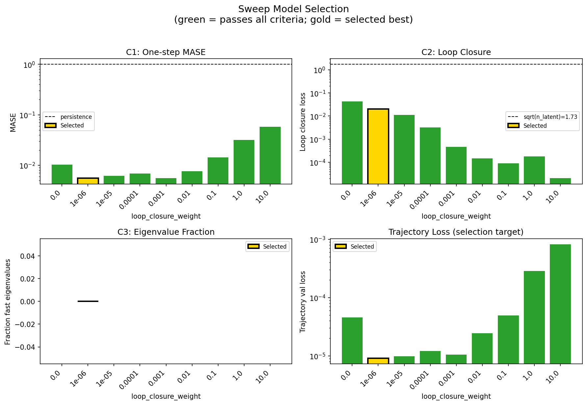
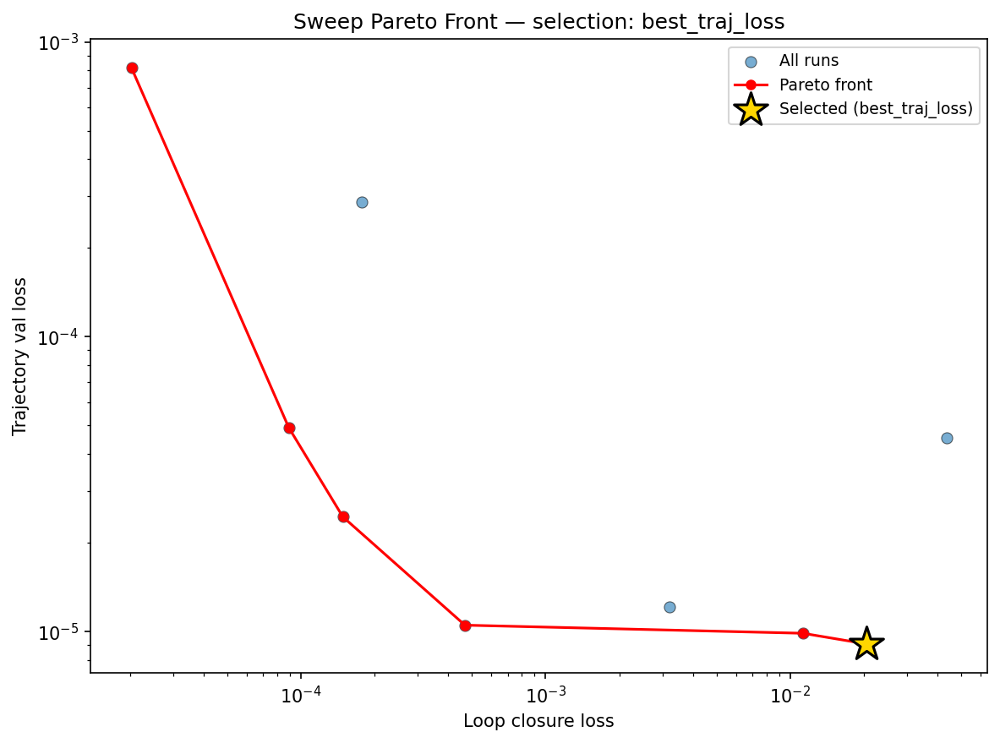
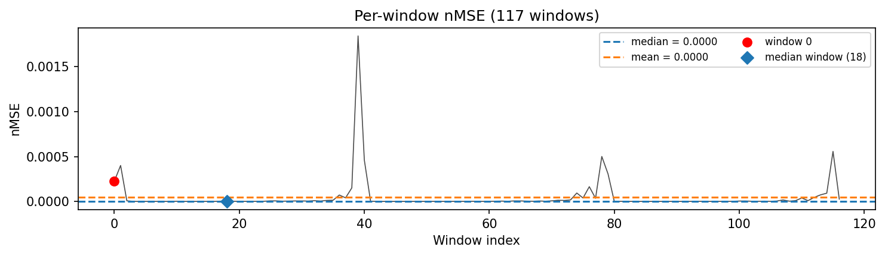
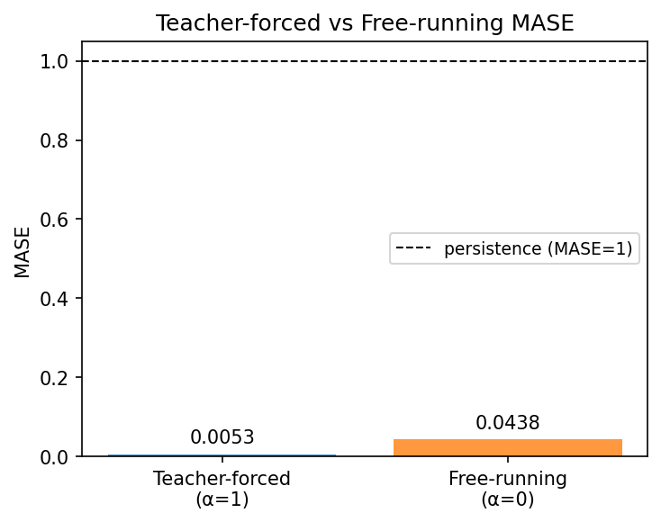
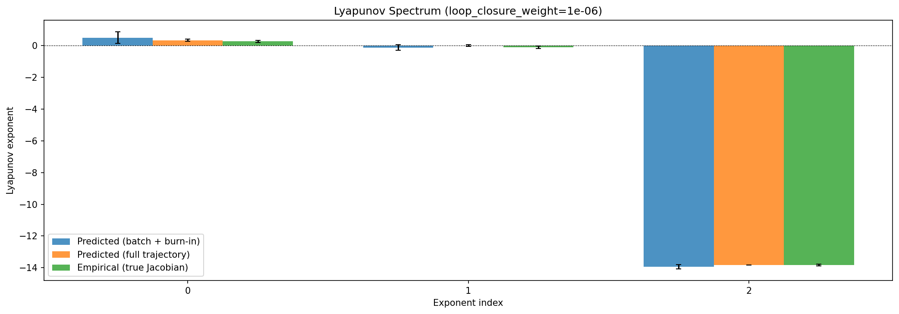
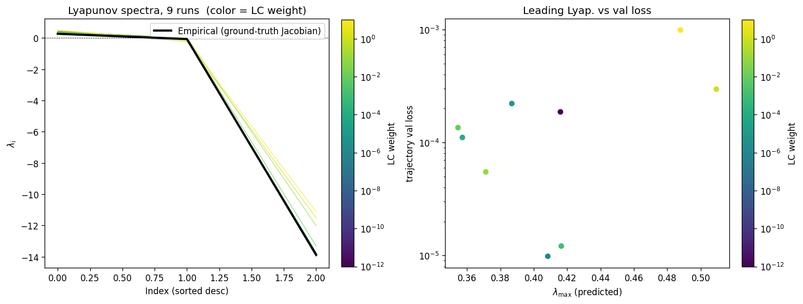
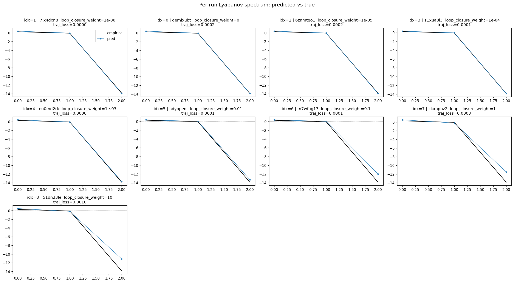
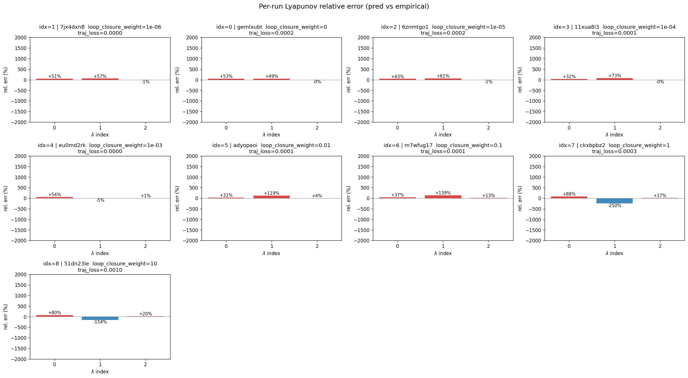
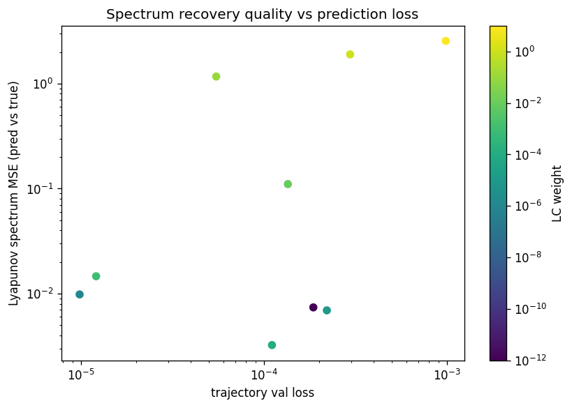

# Sweep Analysis: `lorenz_full_additive_mse_p30__lc_sweep`

**Project**: [Lorenz_INDall_N1_D1_NormTrue_T3__JacobianODE](https://wandb.ai/JacobianODE/Lorenz_INDall_N1_D1_NormTrue_T3__JacobianODE/groups/lorenz_full_additive_mse_p30__lc_sweep)  
**Launched**: 2026-04-15T07:20:50Z  
**Completed**: 2026-04-15T10:40:12Z  
**Outcome**: `complete_clean`  
**Git**: `latent-JacobianODE` @ `c35dd72`  
**Expected runs**: 9

## Experiment Context

### `lorenz_full_additive_mse_p30`

**Description**

Fully-observed Lorenz (all 3 dims, no delay embedding). Additive
coupling encoder (zero_init, volume-preserving), joint training
with LPL + reconstruction + loop closure. Plain MSE loss.
Identical to lorenz_full_additive_mse except prediction_steps=30
and seq_length=45 (traj_init 15 + pred 30). obs_noise_scale=0.

**Hypothesis**

A longer prediction horizon (30 vs 10 steps) gives the model
training signal over more Lyapunov times, which should tighten
both the leading-λ recovery and the dissipation-structure
(most-negative λ) relative to the 10-step baseline.

**Success criteria**

- Best run's predicted Lyapunov spectrum within ~30% of empirical
- Noticeable tightening of λ₃ recovery vs 10-step baseline
- val/trajectory_r2_score > 0.95 at best configuration

## Results

**Overall best MASE**: 0.0385 (LC weight = 1.0e-06, obs_noise_scale = 0.00)
**Overall best traj loss**: 0.00001 at epoch 118.0
**Runs analyzed**: 9

### Best run per `obs_noise_scale`

| obs_noise_scale | Best LC weight | Best traj loss | MASE at best | R² | LC loss | epoch |
|---|---|---|---|---|---|---|
| 0.0 | 1.0e-06 | 0.00001 | 0.0385 | 1.0000 | 0.020 | 118.0 |

## Success-criteria verdicts (automated)

| Criterion | Verdict | Note |
|---|---|---|
| Best run's predicted Lyapunov spectrum within ~30% of empirical | **Unknown** |  |
| Noticeable tightening of λ₃ recovery vs 10-step baseline | **Unknown** |  |
| val/trajectory_r2_score > 0.95 at best configuration | **Pass** | Best R² = 1.0000; threshold > 0.95 |

_Automated verdicts use simple numeric-threshold parsing and may mis-classify qualitative criteria. The Discussion section below takes precedence._

## Figures

### sweep_overview



### sweep_pareto



### prediction_windows



### mase



### lyapunov



### per_run_lyapunov



### per_run_lyapunov_vs_true



### per_run_lyapunov_relerr



### lyapunov_spectrum_mse_vs_val_loss



## Discussion

<!--
This section is intentionally left as a placeholder. A human reviewer
or Claude Code agent should fill it in based on the tables and figures
above, explicitly addressing each success criterion and comparing the
outcome to the stated hypothesis. Write the Discussion to
`discussion.md` in this directory and re-run `render_report`.
-->

_(to be written)_

## `run_analytics` stdout

<details><summary>Click to expand — full diagnostic output from <code>run_analytics</code></summary>

```
No run_id provided — selecting best run from group 'lorenz_full_additive_mse_p30__lc_sweep' ...
Found 9 total runs in JacobianODE/Lorenz_INDall_N1_D1_NormTrue_T3__JacobianODE (group=lorenz_full_additive_mse_p30__lc_sweep)
All runs (state, loop_closure_weight, tangent_entropy_weight, kl_dyn_weight):
  7jx4dxn8: state=finished, lc=1e-06, te=0.0, kl_dyn=0.0
  gemlxubt: state=finished, lc=0.0, te=0.0, kl_dyn=0.0
  6znmtgo1: state=finished, lc=1e-05, te=0.0, kl_dyn=0.0
  11xua8i3: state=finished, lc=0.0001, te=0.0, kl_dyn=0.0
  eu0md2rk: state=finished, lc=0.001, te=0.0, kl_dyn=0.0
  adyopeoi: state=finished, lc=0.01, te=0.0, kl_dyn=0.0
  m7wfug17: state=finished, lc=0.1, te=0.0, kl_dyn=0.0
  ckxbpbz2: state=finished, lc=1.0, te=0.0, kl_dyn=0.0
  51dn23le: state=finished, lc=10.0, te=0.0, kl_dyn=0.0

slurm_timeout_min not found in any run config — falling back to 180 min
  Including 7jx4dxn8 (lc=1e-06): use_all_runs=True (state=finished)
  Including gemlxubt (lc=0.0): use_all_runs=True (state=finished)
  Including 6znmtgo1 (lc=1e-05): use_all_runs=True (state=finished)
  Including 11xua8i3 (lc=0.0001): use_all_runs=True (state=finished)
  Including eu0md2rk (lc=0.001): use_all_runs=True (state=finished)
  Including adyopeoi (lc=0.01): use_all_runs=True (state=finished)
  Including m7wfug17 (lc=0.1): use_all_runs=True (state=finished)
  Including ckxbpbz2 (lc=1.0): use_all_runs=True (state=finished)
  Including 51dn23le (lc=10.0): use_all_runs=True (state=finished)
Found 9 effectively-done sweep runs:
  loop_closure_weight=0.0, tangent_entropy_weight=0.0, kl_dyn_weight=0.0 -> run_id=gemlxubt
  loop_closure_weight=1e-06, tangent_entropy_weight=0.0, kl_dyn_weight=0.0 -> run_id=7jx4dxn8
  loop_closure_weight=1e-05, tangent_entropy_weight=0.0, kl_dyn_weight=0.0 -> run_id=6znmtgo1
  loop_closure_weight=0.0001, tangent_entropy_weight=0.0, kl_dyn_weight=0.0 -> run_id=11xua8i3
  loop_closure_weight=0.001, tangent_entropy_weight=0.0, kl_dyn_weight=0.0 -> run_id=eu0md2rk
  loop_closure_weight=0.01, tangent_entropy_weight=0.0, kl_dyn_weight=0.0 -> run_id=adyopeoi
  loop_closure_weight=0.1, tangent_entropy_weight=0.0, kl_dyn_weight=0.0 -> run_id=m7wfug17
  loop_closure_weight=1.0, tangent_entropy_weight=0.0, kl_dyn_weight=0.0 -> run_id=ckxbpbz2
  loop_closure_weight=10.0, tangent_entropy_weight=0.0, kl_dyn_weight=0.0 -> run_id=51dn23le
n_dims=3, n_latent=3, n_dyn=3, dt=0.0150
  run=gemlxubt: DiagnosticMetrics(one_step_mase=0.010231555439531803, loop_closure_loss=0.04356348142027855, fast_eigenvalue_fraction=0.0, trajectory_val_loss=4.55151021014899e-05) (from W&B history)
  run=7jx4dxn8: DiagnosticMetrics(one_step_mase=0.00552747119218111, loop_closure_loss=0.02045062556862831, fast_eigenvalue_fraction=0.0, trajectory_val_loss=9.082507858693134e-06) (from W&B history)
  run=6znmtgo1: DiagnosticMetrics(one_step_mase=0.00614751735702157, loop_closure_loss=0.011251590214669704, fast_eigenvalue_fraction=0.0, trajectory_val_loss=9.872650480247103e-06) (from W&B history)
  run=11xua8i3: DiagnosticMetrics(one_step_mase=0.006853693164885044, loop_closure_loss=0.0031997852493077517, fast_eigenvalue_fraction=0.0, trajectory_val_loss=1.2093997611373197e-05) (from W&B history)
  run=eu0md2rk: DiagnosticMetrics(one_step_mase=0.005514476913958788, loop_closure_loss=0.00046817719703540206, fast_eigenvalue_fraction=0.0, trajectory_val_loss=1.0516860129428096e-05) (from W&B history)
  run=adyopeoi: DiagnosticMetrics(one_step_mase=0.0075835855677723885, loop_closure_loss=0.00014839980576653033, fast_eigenvalue_fraction=0.0, trajectory_val_loss=2.4505752662662417e-05) (from W&B history)
  run=m7wfug17: DiagnosticMetrics(one_step_mase=0.014194482006132603, loop_closure_loss=8.920263644540682e-05, fast_eigenvalue_fraction=0.0, trajectory_val_loss=4.920248829876073e-05) (from W&B history)
  run=ckxbpbz2: DiagnosticMetrics(one_step_mase=0.03175117447972298, loop_closure_loss=0.00017668936925474554, fast_eigenvalue_fraction=0.0, trajectory_val_loss=0.00028604496037587523) (from W&B history)
  run=51dn23le: DiagnosticMetrics(one_step_mase=0.05776446685194969, loop_closure_loss=2.0309547835495323e-05, fast_eigenvalue_fraction=0.0, trajectory_val_loss=0.000816618965473026) (from W&B history)

Ranking method:           best_traj_loss
Best run ID:              7jx4dxn8
Best loop_closure_weight: 1e-06
Best tangent_entropy_weight: 0.0
Best kl_dyn_weight:       0.0
Best traj loss:           0.000009
Criteria applied: ['C1', 'C2', 'C3']
Surviving: 9 / 9
Auto-selected run_id: 7jx4dxn8

======================================================================
PARETO FRONTIER RUNS (6 runs)
======================================================================
  Run ID               LC Loss   Traj Val Loss
  ------------  --------------  --------------
  51dn23le            0.000020        0.000817
  m7wfug17            0.000089        0.000049
  adyopeoi            0.000148        0.000025
  eu0md2rk            0.000468        0.000011
  6znmtgo1            0.011252        0.000010
  7jx4dxn8            0.020451        0.000009 <-- selected

======================================================================
RANKING METHOD COMPARISON (over 9 survivors)
======================================================================
  Method                  Run ID               LC Loss   Traj Val Loss
  ----------------------  ------------  --------------  --------------
  best_traj_loss          7jx4dxn8            0.020451        0.000009 <-- active
  pareto_knee             eu0md2rk            0.000468        0.000011
  geo_rank                7jx4dxn8            0.020451        0.000009
  minimax_rank            eu0md2rk            0.000468        0.000011
  geo_log_score           7jx4dxn8            0.020451        0.000009
  minimax_log_score       adyopeoi            0.000148        0.000025
======================================================================

Loading run 7jx4dxn8 from JacobianODE/Lorenz_INDall_N1_D1_NormTrue_T3__JacobianODE ...
Train dataset shape: torch.Size([25410, 45, 3])
Validation dataset shape: torch.Size([8085, 45, 3])
Test dataset shape: torch.Size([3465, 45, 3])
Train trajectories dataset shape: torch.Size([22, 1200, 3])
Validation trajectories dataset shape: torch.Size([7, 1200, 3])
Test trajectories dataset shape: torch.Size([3, 1200, 3])
Loading checkpoint epoch=118-step=23800.ckpt...
Computing MASE ...
Teacher-forced MASE: 0.0053
Free-running MASE:   0.0438
Computing Lyapunov exponents ...
  Computing full-trajectory Lyapunov (3 test trajs, T=1200) ...
Predicted Lyapunov exponents (batch+burn-in, 128 windowed trajs):
  λ_1 = +0.5099 ± 0.3647
  λ_2 = -0.1144 ± 0.1677
  λ_3 = -13.9290 ± 0.1327
Predicted Lyapunov exponents (full-length, 3 test trajs):
  λ_1 = +0.3471 ± 0.0664
  λ_2 = +0.0106 ± 0.0515
  λ_3 = -13.8324 ± 0.0117
Empirical Lyapunov exponents (mean ± std):
  λ_1 = +0.2716 ± 0.0605
  λ_2 = -0.1016 ± 0.0797
  λ_3 = -13.8370 ± 0.0514
Computing prediction windows ...
Windows: 117 — nMSE min=0.0000, median=0.0000, mean=0.0000, max=0.0018
```

</details>
