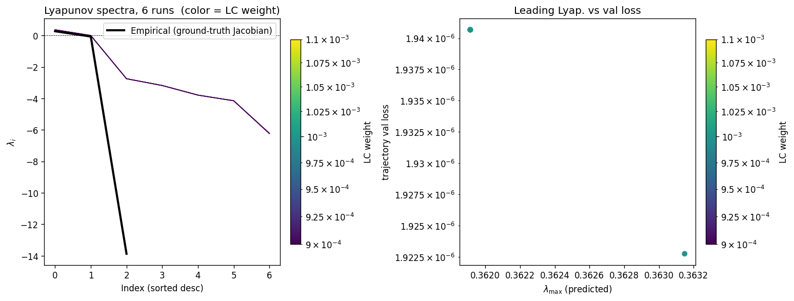
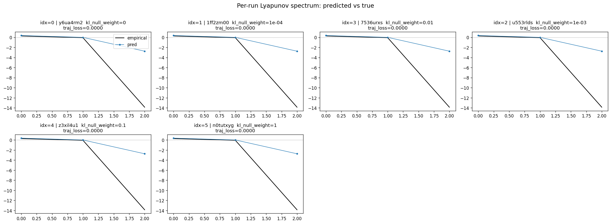
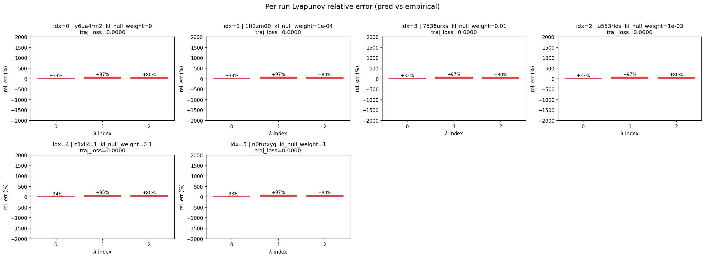
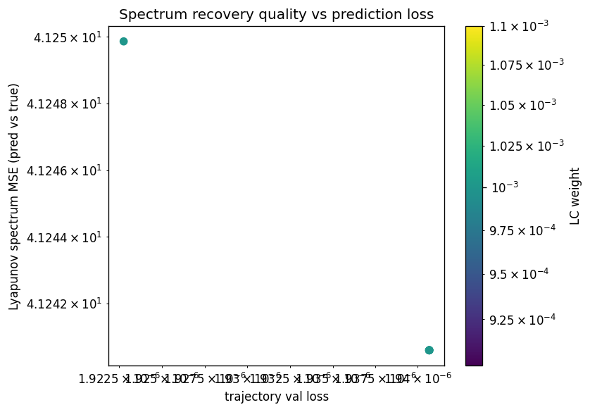

# Sweep Analysis: `lorenz_partial_100d_7lat_additive_mse__klnull_sweep`

**Project**: [Lorenz_INDpartial_N100_D1_NormTrue_T7__JacobianODE](https://wandb.ai/JacobianODE/Lorenz_INDpartial_N100_D1_NormTrue_T7__JacobianODE/groups/lorenz_partial_100d_7lat_additive_mse__klnull_sweep)  
**Launched**: 2026-04-15T15:47:15Z  
**Completed**: 2026-04-15T22:55:12Z  
**Outcome**: `complete_clean`  
**Git**: `latent-JacobianODE` @ `325ada0`  
**Expected runs**: 6

## Experiment Context

### `lorenz_partial_100d_7lat_additive_mse_klnull_sweep`

**Description**

Same as lorenz_partial_100d_7lat_additive_mse except
loop_closure_weight is FIXED at 1e-3 (best LC from the LC sweep)
and kl_null_weight is SWEPT over {0, 1e-4, 1e-3, 1e-2, 1e-1, 1}.
Every other knob identical. obs_noise_scale=0, reconstruction_mode
= most_recent, prediction_steps=10, seq_length=25.

**Hypothesis**

With z_null unpenalised, the encoder dumps trajectory history into
z_null and the Jacobian MLP spreads contraction across the 7
z_dyn axes (λ_min ≈ −6 instead of empirical ~−14). A positive
kl_null_weight should force information into z_dyn, tighten the
attractor manifold in z_dyn, and concentrate contraction into
a single axis whose λ moves toward empirical. Risk: too-large
kl_null suppresses z_null below what the decoder needs to
reconstruct observations — recon_loss explodes, trajectory
fidelity collapses. Expecting a U-shape in spectrum MSE vs
kl_null with a sweet spot somewhere in 1e-3 .. 1e-1.

**Success criteria**

- At the best kl_null, λ_min moves noticeably more negative than −6
- Σλ_i (volume-contraction rate) moves from −20 toward empirical ~−14
- val/trajectory_r2 at best kl_null within a few % of the 0-kl_null baseline
- Clear U-shape (or monotone direction) across the 6 kl_null values

## Results

**Chosen run** (by `best_traj_loss`): `—` — traj_loss=—, MASE=—, R²=—, LC loss=—, epoch=None

### Integrity checks

⚠️ **Matched-run count mismatch**: expected 6 run_idx slots per the sentinel, matched 0 in wandb. The sweep may still be in progress, or some slots failed without producing wandb evidence.

**Runs analyzed**: 0 (expected 6)

## Success-criteria verdicts (automated)

| Criterion | Verdict | Note |
|---|---|---|
| At the best kl_null, λ_min moves noticeably more negative than −6 | **Unknown** |  |
| Σλ_i (volume-contraction rate) moves from −20 toward empirical ~−14 | **Unknown** |  |
| val/trajectory_r2 at best kl_null within a few % of the 0-kl_null baseline | **Unknown** |  |
| Clear U-shape (or monotone direction) across the 6 kl_null values | **Unknown** |  |

_Automated verdicts use simple numeric-threshold parsing and may mis-classify qualitative criteria. The Discussion section below takes precedence._

## Figures

### per_run_lyapunov



### per_run_lyapunov_vs_true



### per_run_lyapunov_relerr



### lyapunov_spectrum_mse_vs_val_loss



## Discussion

<!--
This section is intentionally left as a placeholder. A human reviewer
or Claude Code agent should fill it in based on the tables and figures
above, explicitly addressing each success criterion and comparing the
outcome to the stated hypothesis. Write the Discussion to
`discussion.md` in this directory and re-run `render_report`.
-->

_(to be written)_

## `run_analytics` stdout

<details><summary>Click to expand — full diagnostic output from <code>run_analytics</code></summary>

```
No run_id provided — selecting best run from group 'lorenz_partial_100d_7lat_additive_mse__klnull_sweep' ...
Found 6 total runs in JacobianODE/Lorenz_INDpartial_N100_D1_NormTrue_T7__JacobianODE (group=lorenz_partial_100d_7lat_additive_mse__klnull_sweep)
All runs (state, loop_closure_weight, tangent_entropy_weight, kl_dyn_weight):
  y6ua4rm2: state=finished, lc=0.001, te=0.0, kl_dyn=0.0
  1ff2zm00: state=finished, lc=0.001, te=0.0, kl_dyn=0.0
  7536urxs: state=finished, lc=0.001, te=0.0, kl_dyn=0.0
  u553rlds: state=finished, lc=0.001, te=0.0, kl_dyn=0.0
  z3xil4u1: state=finished, lc=0.001, te=0.0, kl_dyn=0.0
  n0tutxyg: state=finished, lc=0.001, te=0.0, kl_dyn=0.0

slurm_timeout_min not found in any run config — falling back to 180 min
  Including y6ua4rm2 (lc=0.001): use_all_runs=True (state=finished)
  Including 1ff2zm00 (lc=0.001): use_all_runs=True (state=finished)
  Including 7536urxs (lc=0.001): use_all_runs=True (state=finished)
  Including u553rlds (lc=0.001): use_all_runs=True (state=finished)
  Including z3xil4u1 (lc=0.001): use_all_runs=True (state=finished)
  Including n0tutxyg (lc=0.001): use_all_runs=True (state=finished)
Found 6 effectively-done sweep runs:
  loop_closure_weight=0.001, tangent_entropy_weight=0.0, kl_dyn_weight=0.0 -> run_id=1ff2zm00
  loop_closure_weight=0.001, tangent_entropy_weight=0.0, kl_dyn_weight=0.0 -> run_id=7536urxs
  loop_closure_weight=0.001, tangent_entropy_weight=0.0, kl_dyn_weight=0.0 -> run_id=n0tutxyg
  loop_closure_weight=0.001, tangent_entropy_weight=0.0, kl_dyn_weight=0.0 -> run_id=u553rlds
  loop_closure_weight=0.001, tangent_entropy_weight=0.0, kl_dyn_weight=0.0 -> run_id=y6ua4rm2
  loop_closure_weight=0.001, tangent_entropy_weight=0.0, kl_dyn_weight=0.0 -> run_id=z3xil4u1
n_dims=100, n_latent=100, n_dyn=7, dt=0.0150
  run=1ff2zm00: DiagnosticMetrics(one_step_mase=0.01906902901828289, loop_closure_loss=0.0010725540341809392, fast_eigenvalue_fraction=0.0, trajectory_val_loss=1.8616602801557747e-06) (from W&B history)
  run=7536urxs: DiagnosticMetrics(one_step_mase=0.01906902901828289, loop_closure_loss=0.0010725540341809392, fast_eigenvalue_fraction=0.0, trajectory_val_loss=1.8616602801557747e-06) (from W&B history)
  run=n0tutxyg: DiagnosticMetrics(one_step_mase=0.01906902901828289, loop_closure_loss=0.0010725540341809392, fast_eigenvalue_fraction=0.0, trajectory_val_loss=1.8616602801557747e-06) (from W&B history)
  run=u553rlds: DiagnosticMetrics(one_step_mase=0.01906902901828289, loop_closure_loss=0.0010725540341809392, fast_eigenvalue_fraction=0.0, trajectory_val_loss=1.8616602801557747e-06) (from W&B history)
  run=y6ua4rm2: DiagnosticMetrics(one_step_mase=0.01906902901828289, loop_closure_loss=0.0010725540341809392, fast_eigenvalue_fraction=0.0, trajectory_val_loss=1.8616602801557747e-06) (from W&B history)
  run=z3xil4u1: DiagnosticMetrics(one_step_mase=0.019587328657507896, loop_closure_loss=0.0010715598473325372, fast_eigenvalue_fraction=0.0, trajectory_val_loss=1.8657821101442096e-06) (from W&B history)

Ranking method:           best_traj_loss
Best run ID:              1ff2zm00
Best loop_closure_weight: 0.001
Best tangent_entropy_weight: 0.0
Best kl_dyn_weight:       0.0
Best traj loss:           0.000002
Criteria applied: ['C1', 'C2', 'C3']
Surviving: 6 / 6
Auto-selected run_id: 1ff2zm00

======================================================================
PARETO FRONTIER RUNS (6 runs)
======================================================================
  Run ID               LC Loss   Traj Val Loss
  ------------  --------------  --------------
  z3xil4u1            0.001072        0.000002
  1ff2zm00            0.001073        0.000002 <-- selected
  n0tutxyg            0.001073        0.000002
  7536urxs            0.001073        0.000002
  u553rlds            0.001073        0.000002
  y6ua4rm2            0.001073        0.000002

======================================================================
RANKING METHOD COMPARISON (over 6 survivors)
======================================================================
  Method                  Run ID               LC Loss   Traj Val Loss
  ----------------------  ------------  --------------  --------------
  best_traj_loss          1ff2zm00            0.001073        0.000002 <-- active
  pareto_knee             1ff2zm00            0.001073        0.000002
  geo_rank                z3xil4u1            0.001072        0.000002
  minimax_rank            1ff2zm00            0.001073        0.000002
  geo_log_score           1ff2zm00            0.001073        0.000002
  minimax_log_score       1ff2zm00            0.001073        0.000002
======================================================================

Loading run 1ff2zm00 from JacobianODE/Lorenz_INDpartial_N100_D1_NormTrue_T7__JacobianODE ...
Train dataset shape: torch.Size([23672, 25, 100])
Validation dataset shape: torch.Size([7532, 25, 100])
Test dataset shape: torch.Size([3228, 25, 100])
Train trajectories dataset shape: torch.Size([22, 1101, 100])
Validation trajectories dataset shape: torch.Size([7, 1101, 100])
Test trajectories dataset shape: torch.Size([3, 1101, 100])
Loading checkpoint epoch=198-step=39800.ckpt...
Computing MASE ...
Teacher-forced MASE: 0.0194
Free-running MASE:   0.0244
Computing Lyapunov exponents ...
  Computing full-trajectory Lyapunov (3 test trajs, T=1101) ...
Predicted Lyapunov exponents (batch+burn-in, 128 windowed trajs):
  λ_1 = +0.5159 ± 0.6785
  λ_2 = -0.5155 ± 0.3068
  λ_3 = -2.4080 ± 0.2719
  λ_4 = -2.9829 ± 0.2272
  λ_5 = -3.5357 ± 0.2471
  λ_6 = -4.5047 ± 0.2960
  λ_7 = -6.3818 ± 0.4127
Predicted Lyapunov exponents (full-length, 3 test trajs):
  λ_1 = +0.3009 ± 0.0503
  λ_2 = +0.0134 ± 0.0262
  λ_3 = -2.6481 ± 0.0260
  λ_4 = -3.1583 ± 0.0200
  λ_5 = -4.0222 ± 0.0390
  λ_6 = -4.4452 ± 0.0240
  λ_7 = -6.3321 ± 0.0457
Empirical Lyapunov exponents (mean ± std):
  λ_1 = +0.2716 ± 0.0605
  λ_2 = -0.1016 ± 0.0797
  λ_3 = -13.8370 ± 0.0514
Computing prediction windows ...
Windows: 324 — nMSE min=0.0000, median=0.0000, mean=0.0000, max=0.0005


--- backfill 2026-04-16T04:15:11Z sections=['reconstruction', 'latent_utilization', 'kaplan_yorke', 'prediction_detail', 'long_trajectory', 'encoder_decoder_jacobians', 'amplification'] ---
```

</details>
