# Sweep Analysis: `lorenz_partial_100d_7lat_additive_mse__lc_sweep`

**Project**: [Lorenz_INDpartial_N100_D1_NormTrue_T7__JacobianODE](https://wandb.ai/JacobianODE/Lorenz_INDpartial_N100_D1_NormTrue_T7__JacobianODE/groups/lorenz_partial_100d_7lat_additive_mse__lc_sweep)  
**Launched**: 2026-04-15T03:49:00Z  
**Completed**: 2026-04-15T06:50:11Z  
**Outcome**: `complete_clean`  
**Git**: `latent-JacobianODE` @ `838ba26`  
**Expected runs**: 9

## Experiment Context

### `lorenz_partial_100d_7lat_additive_mse`

**Description**

Partial-obs Lorenz (x-coordinate only, observed_indices=[0]),
n_delays=100, delay_spacing=1. Encoder input 100-D, z_dyn 7-D,
z_null 93-D with kl_null_weight=0. Additive coupling encoder
(zero_init, volume-preserving), joint training with LPL +
reconstruction + loop closure. Plain MSE loss (not gennMSE).
Reconstruction mode = most_recent. obs_noise_scale = 0.
Sweeps loop_closure_weight only (9 runs).

**Hypothesis**

Both the 25d_gennmse and 25d_mse partial-obs sweeps underperformed
the full-obs sweeps on Lyapunov recovery and MASE. Two plausible
causes:
  (a) 25-delay window too short — by Takens, a 3-D attractor needs
      at least 2*3+1 = 7 delays for generic embedding, but true
      fidelity can require substantially more, especially since the
      observation is a single coordinate and the flow mixes
      timescales.
  (b) Null subspace absorbs history that z_dyn needs — the
      sufficient-statistic hypothesis.
This sweep isolates (a): 100 delays (4x the previous) plus 7 latent
dims (vs 3) for modelling headroom. If performance jumps noticeably,
the 25d window was the bottleneck. If it still underperforms, the
kl_null hypothesis (b) becomes the stronger candidate — motivating
a follow-up sweep with a non-zero null penalty.

**Success criteria**

- Best run's leading Lyapunov exponent > 0 (chaos recovered)
- Best run's predicted Lyapunov spectrum within ~30% of empirical
- Best-LC val/trajectory_r2 noticeably beats the 25d sweeps
- Either this sweep beats 25d by a clear margin (n_delays bottleneck) or it doesn't (motivating a kl_null sweep)

## Results

**Swept axes** (1): `training.lightning.loop_closure_weight`

**Chosen run** (by `best_traj_loss`): `au3g4drn` — traj_loss=0.00000, MASE=0.0253, R²=1.0000, LC loss=0.001, epoch=198.0

Swept-axis values at chosen run: `training.lightning.loop_closure_weight`=0.001

**Runs analyzed**: 9 (expected 9)

### Per-run results

| run_idx | run_id | `training.lightning.loop_closure_weight` | best_traj_loss | best_MASE | R² | LC loss | epoch |
|---|---|---|---|---|---|---|---|
| 4 | `au3g4drn` | 0.001 | 0.00000 | 0.0253 | 1.0000 | 0.001 | 198.0 |
| 0 | `c298q1ql` | 0 | 0.00000 | 0.0254 | 1.0000 | 7.286 | 187.0 |
| 1 | `7lisffbx` | 1.0e-06 | 0.00000 | 0.0242 | 1.0000 | 0.629 | 187.0 |
| 2 | `nf98ywkc` | 1.0e-05 | 0.00000 | 0.0249 | 1.0000 | 0.116 | 198.0 |
| 3 | `5e7er73b` | 1.0e-04 | 0.00000 | 0.0250 | 1.0000 | 0.011 | 187.0 |
| 5 | `3mf5lbdk` | 0.01 | 0.00001 | 0.0402 | 1.0000 | 0.000 | 197.0 |
| 6 | `q22g51rj` | 0.1 | 0.00001 | 0.0584 | 1.0000 | 0.000 | 197.0 |
| 7 | `xmuw8ps6` | 1 | 0.00002 | 0.0745 | 0.9999 | 0.000 | 198.0 |
| 8 | `eyo7g55k` | 10 | 0.00003 | 0.0896 | 0.9999 | 0.000 | 197.0 |

## Success-criteria verdicts (automated)

| Criterion | Verdict | Note |
|---|---|---|
| Best run's leading Lyapunov exponent > 0 (chaos recovered) | **Unknown** |  |
| Best run's predicted Lyapunov spectrum within ~30% of empirical | **Unknown** |  |
| Best-LC val/trajectory_r2 noticeably beats the 25d sweeps | **Unknown** |  |
| Either this sweep beats 25d by a clear margin (n_delays bottleneck) or it doesn't (motivating a kl_null sweep) | **Unknown** |  |

_Automated verdicts use simple numeric-threshold parsing and may mis-classify qualitative criteria. The Discussion section below takes precedence._

## Figures

### sweep_overview

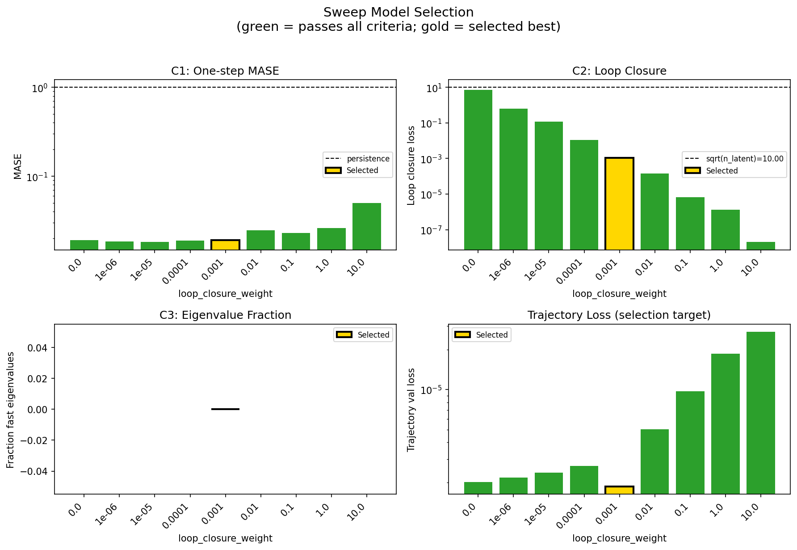

### sweep_pareto

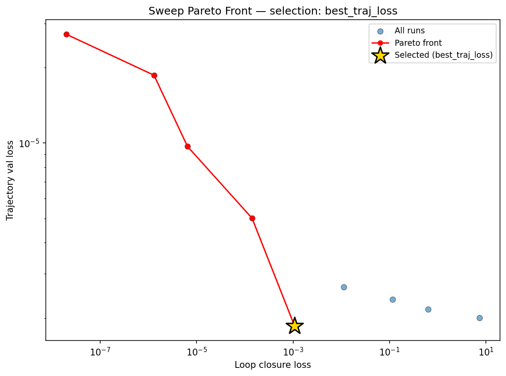

### reconstruction

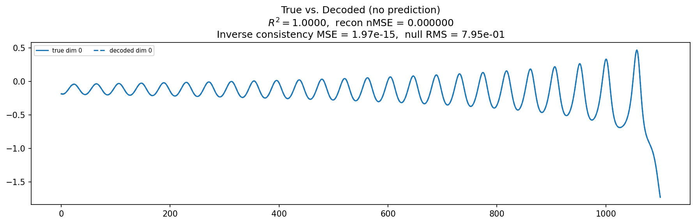

### prediction_windows

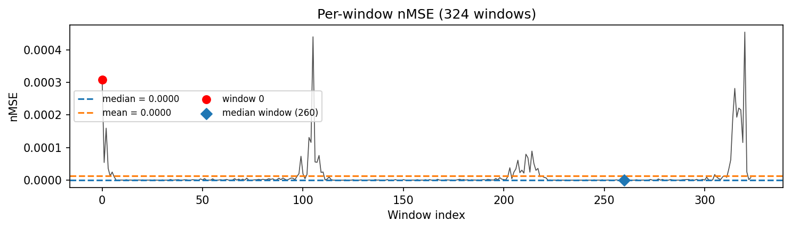

### long_trajectory

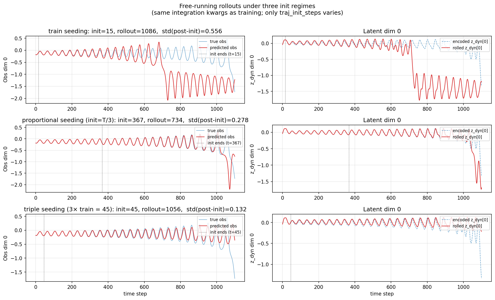

### mase


### latent_utilization

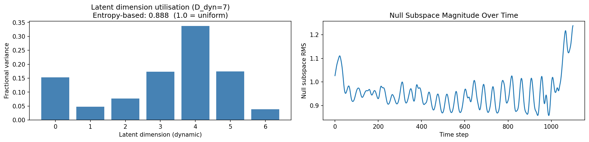

### lyapunov


### kaplan_yorke

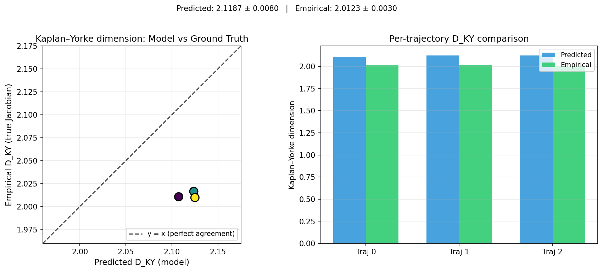

### per_run_lyapunov

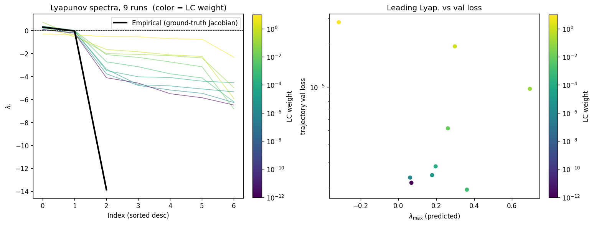

### per_run_lyapunov_vs_true

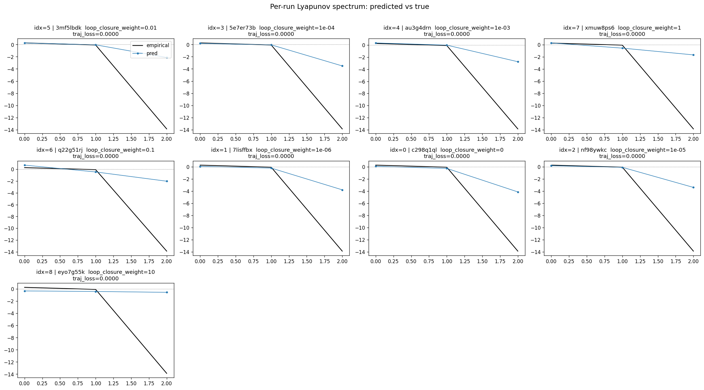

### per_run_lyapunov_relerr

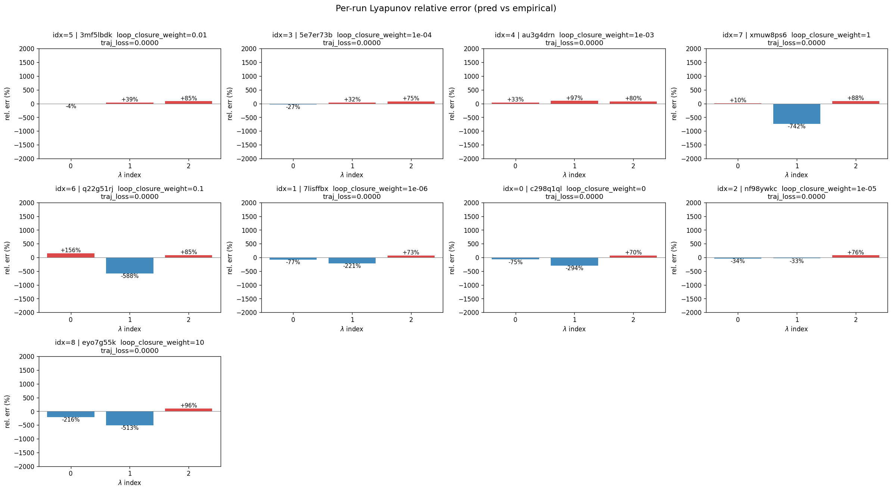

### lyapunov_spectrum_mse_vs_val_loss

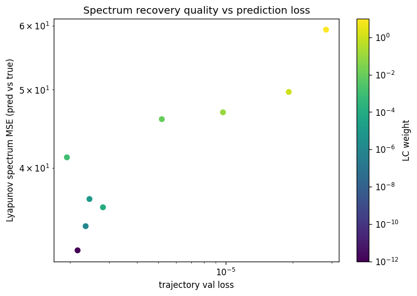

### encoder_decoder_jacobians

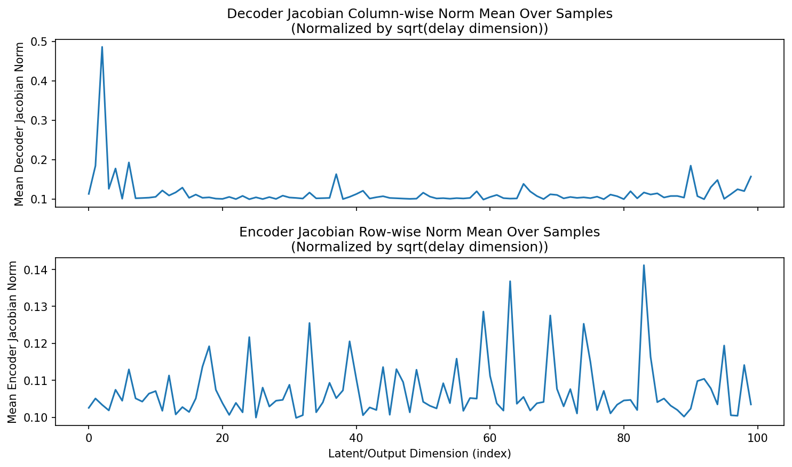

### amplification

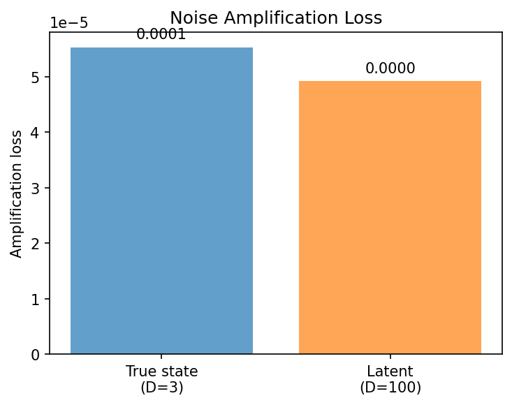

### kaplan_yorke_pca

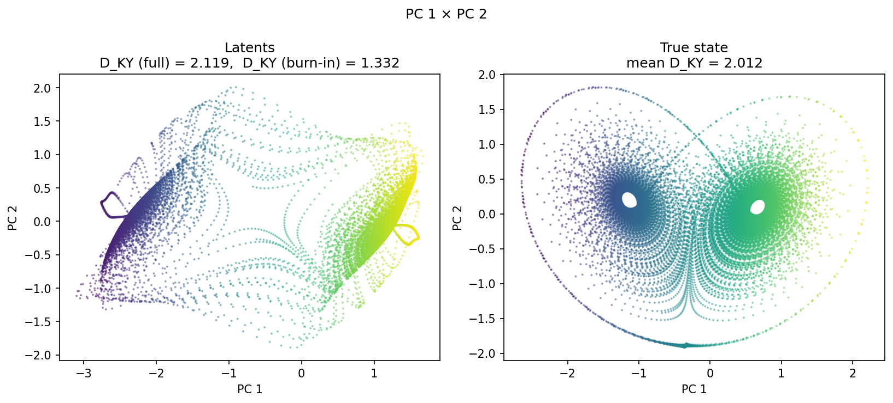

### prediction_detail_latent

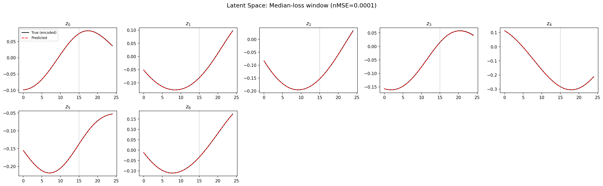

### prediction_detail_obs

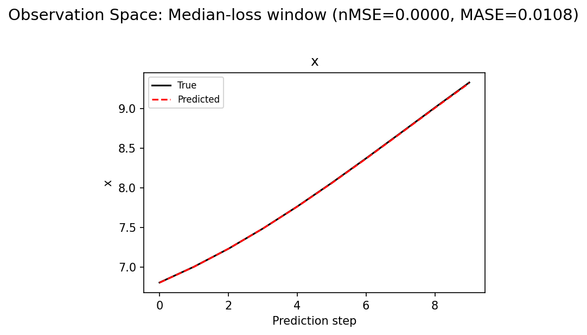

## Discussion

<!--
This section is intentionally left as a placeholder. A human reviewer
or Claude Code agent should fill it in based on the tables and figures
above, explicitly addressing each success criterion and comparing the
outcome to the stated hypothesis. Write the Discussion to
`discussion.md` in this directory and re-run `render_report`.
-->

_(to be written)_

## `run_analytics` stdout

<details><summary>Click to expand — full diagnostic output from <code>run_analytics</code></summary>

```
No run_id provided — selecting best run from group 'lorenz_partial_100d_7lat_additive_mse__lc_sweep' ...
Found 9 total runs in JacobianODE/Lorenz_INDpartial_N100_D1_NormTrue_T7__JacobianODE (group=lorenz_partial_100d_7lat_additive_mse__lc_sweep)
All runs (state, loop_closure_weight, tangent_entropy_weight, kl_dyn_weight):
  3mf5lbdk: state=finished, lc=0.01, te=0.0, kl_dyn=0.0
  5e7er73b: state=finished, lc=0.0001, te=0.0, kl_dyn=0.0
  au3g4drn: state=finished, lc=0.001, te=0.0, kl_dyn=0.0
  xmuw8ps6: state=finished, lc=1.0, te=0.0, kl_dyn=0.0
  q22g51rj: state=finished, lc=0.1, te=0.0, kl_dyn=0.0
  7lisffbx: state=finished, lc=1e-06, te=0.0, kl_dyn=0.0
  c298q1ql: state=finished, lc=0.0, te=0.0, kl_dyn=0.0
  nf98ywkc: state=finished, lc=1e-05, te=0.0, kl_dyn=0.0
  eyo7g55k: state=finished, lc=10.0, te=0.0, kl_dyn=0.0

slurm_timeout_min not found in any run config — falling back to 180 min
  Including 3mf5lbdk (lc=0.01): use_all_runs=True (state=finished)
  Including 5e7er73b (lc=0.0001): use_all_runs=True (state=finished)
  Including au3g4drn (lc=0.001): use_all_runs=True (state=finished)
  Including xmuw8ps6 (lc=1.0): use_all_runs=True (state=finished)
  Including q22g51rj (lc=0.1): use_all_runs=True (state=finished)
  Including 7lisffbx (lc=1e-06): use_all_runs=True (state=finished)
  Including c298q1ql (lc=0.0): use_all_runs=True (state=finished)
  Including nf98ywkc (lc=1e-05): use_all_runs=True (state=finished)
  Including eyo7g55k (lc=10.0): use_all_runs=True (state=finished)
Found 9 effectively-done sweep runs:
  loop_closure_weight=0.0, tangent_entropy_weight=0.0, kl_dyn_weight=0.0 -> run_id=c298q1ql
  loop_closure_weight=1e-06, tangent_entropy_weight=0.0, kl_dyn_weight=0.0 -> run_id=7lisffbx
  loop_closure_weight=1e-05, tangent_entropy_weight=0.0, kl_dyn_weight=0.0 -> run_id=nf98ywkc
  loop_closure_weight=0.0001, tangent_entropy_weight=0.0, kl_dyn_weight=0.0 -> run_id=5e7er73b
  loop_closure_weight=0.001, tangent_entropy_weight=0.0, kl_dyn_weight=0.0 -> run_id=au3g4drn
  loop_closure_weight=0.01, tangent_entropy_weight=0.0, kl_dyn_weight=0.0 -> run_id=3mf5lbdk
  loop_closure_weight=0.1, tangent_entropy_weight=0.0, kl_dyn_weight=0.0 -> run_id=q22g51rj
  loop_closure_weight=1.0, tangent_entropy_weight=0.0, kl_dyn_weight=0.0 -> run_id=xmuw8ps6
  loop_closure_weight=10.0, tangent_entropy_weight=0.0, kl_dyn_weight=0.0 -> run_id=eyo7g55k
n_dims=100, n_latent=100, n_dyn=7, dt=0.0150
  run=c298q1ql: DiagnosticMetrics(one_step_mase=0.01902610808610916, loop_closure_loss=7.285726547241211, fast_eigenvalue_fraction=0.0, trajectory_val_loss=2.005813485084218e-06) (from cache, n_batches=100)
  run=7lisffbx: DiagnosticMetrics(one_step_mase=0.01849205046892166, loop_closure_loss=0.6294549703598022, fast_eigenvalue_fraction=0.0, trajectory_val_loss=2.1704354367102496e-06) (from cache, n_batches=100)
  run=nf98ywkc: DiagnosticMetrics(one_step_mase=0.018185092136263847, loop_closure_loss=0.11640094965696335, fast_eigenvalue_fraction=0.0, trajectory_val_loss=2.3759848772897385e-06) (from cache, n_batches=100)
  run=5e7er73b: DiagnosticMetrics(one_step_mase=0.018947875127196312, loop_closure_loss=0.011254142969846725, fast_eigenvalue_fraction=0.0, trajectory_val_loss=2.662514816620387e-06) (from cache, n_batches=100)
  run=au3g4drn: DiagnosticMetrics(one_step_mase=0.01906902901828289, loop_closure_loss=0.0010725540341809392, fast_eigenvalue_fraction=0.0, trajectory_val_loss=1.8616602801557747e-06) (from cache, n_batches=100)
  run=3mf5lbdk: DiagnosticMetrics(one_step_mase=0.024641312658786774, loop_closure_loss=0.00014135209494270384, fast_eigenvalue_fraction=0.0, trajectory_val_loss=5.010381755710114e-06) (from cache, n_batches=100)
  run=q22g51rj: DiagnosticMetrics(one_step_mase=0.022889820858836174, loop_closure_loss=6.498147740785498e-06, fast_eigenvalue_fraction=0.0, trajectory_val_loss=9.684760698291939e-06) (from cache, n_batches=100)
  run=xmuw8ps6: DiagnosticMetrics(one_step_mase=0.026089906692504883, loop_closure_loss=1.309115646108694e-06, fast_eigenvalue_fraction=0.0, trajectory_val_loss=1.8657865439308807e-05) (from cache, n_batches=100)
  run=eyo7g55k: DiagnosticMetrics(one_step_mase=0.04986768588423729, loop_closure_loss=2.005633170654164e-08, fast_eigenvalue_fraction=0.0, trajectory_val_loss=2.7161015168530867e-05) (from cache, n_batches=100)

Ranking method:           best_traj_loss
Best run ID:              au3g4drn
Best loop_closure_weight: 0.001
Best tangent_entropy_weight: 0.0
Best kl_dyn_weight:       0.0
Best traj loss:           0.000002
Criteria applied: ['C1', 'C2', 'C3']
Surviving: 9 / 9
Auto-selected run_id: au3g4drn

======================================================================
PARETO FRONTIER RUNS (5 runs)
======================================================================
  Run ID               LC Loss   Traj Val Loss
  ------------  --------------  --------------
  eyo7g55k            0.000000        0.000027
  xmuw8ps6            0.000001        0.000019
  q22g51rj            0.000006        0.000010
  3mf5lbdk            0.000141        0.000005
  au3g4drn            0.001073        0.000002 <-- selected

======================================================================
RANKING METHOD COMPARISON (over 9 survivors)
======================================================================
  Method                  Run ID               LC Loss   Traj Val Loss
  ----------------------  ------------  --------------  --------------
  best_traj_loss          au3g4drn            0.001073        0.000002 <-- active
  pareto_knee             xmuw8ps6            0.000001        0.000019
  geo_rank                au3g4drn            0.001073        0.000002
  minimax_rank            au3g4drn            0.001073        0.000002
  geo_log_score           au3g4drn            0.001073        0.000002
  minimax_log_score       3mf5lbdk            0.000141        0.000005
======================================================================

Loading run au3g4drn from JacobianODE/Lorenz_INDpartial_N100_D1_NormTrue_T7__JacobianODE ...
Train dataset shape: torch.Size([23672, 25, 100])
Validation dataset shape: torch.Size([7532, 25, 100])
Test dataset shape: torch.Size([3228, 25, 100])
Train trajectories dataset shape: torch.Size([22, 1101, 100])
Validation trajectories dataset shape: torch.Size([7, 1101, 100])
Test trajectories dataset shape: torch.Size([3, 1101, 100])
Loading checkpoint epoch=198-step=39800.ckpt...
Computing reconstruction ...
Computing MASE ...
Teacher-forced MASE: 0.0194
Free-running MASE:   0.0244
Computing latent utilization ...
Entropy-based utilization: 0.888
Null subspace mean RMS: 9.550717e-01
Computing Lyapunov exponents ...
  Computing full-trajectory Lyapunov (3 test trajs, T=1101) ...
Predicted Lyapunov exponents (batch+burn-in, 128 windowed trajs):
  λ_1 = +0.5159 ± 0.6785
  λ_2 = -0.5155 ± 0.3068
  λ_3 = -2.4080 ± 0.2719
  λ_4 = -2.9829 ± 0.2272
  λ_5 = -3.5357 ± 0.2471
  λ_6 = -4.5047 ± 0.2960
  λ_7 = -6.3818 ± 0.4127
Predicted Lyapunov exponents (full-length, 3 test trajs):
  λ_1 = +0.3009 ± 0.0503
  λ_2 = +0.0134 ± 0.0262
  λ_3 = -2.6481 ± 0.0260
  λ_4 = -3.1583 ± 0.0200
  λ_5 = -4.0222 ± 0.0390
  λ_6 = -4.4452 ± 0.0240
  λ_7 = -6.3321 ± 0.0457
Empirical Lyapunov exponents (mean ± std):
  λ_1 = +0.2716 ± 0.0605
  λ_2 = -0.1016 ± 0.0797
  λ_3 = -13.8370 ± 0.0514
Mean KY dim (predicted): 2.119 ± 0.008
Mean KY dim (empirical): 2.012 ± 0.003
Mean KY dim (burn-in):   1.332 ± 1.005
Computing prediction windows ...
Windows: 324 — nMSE min=0.0000, median=0.0000, mean=0.0000, max=0.0005
Computing long-trajectory free-running rollouts ...
Computing encoder/decoder Jacobians ...
encoder_jacobian: (128, 100, 100)
decoder_jacobian: (128, 100, 100)
Computing amplification loss ...
Amplification loss — True state: 0.000055
Amplification loss — Latent:     0.000049
```

</details>
