# Sweep Analysis: `lorenz_partial_100d_7lat_additive_mse_p30__lc_sweep`

**Project**: [Lorenz_INDpartial_N100_D1_NormTrue_T7__JacobianODE](https://wandb.ai/JacobianODE/Lorenz_INDpartial_N100_D1_NormTrue_T7__JacobianODE/groups/lorenz_partial_100d_7lat_additive_mse_p30__lc_sweep)  
**Launched**: 2026-04-15T15:47:18Z  
**Completed**: 2026-04-16T01:35:13Z  
**Outcome**: `complete_clean`  
**Git**: `latent-JacobianODE` @ `325ada0`  
**Expected runs**: 9

## Experiment Context

### `lorenz_partial_100d_7lat_additive_mse_p30`

**Description**

Extends lorenz_partial_100d_7lat_additive_mse (p10) to
prediction_steps=30, seq_length=45. Still most_recent recon,
kl_null=0. LC weight swept.

**Hypothesis**

The p10 100-delay / 7-latent sweep under-represented strong
contraction (λ_min ≈ −6 vs empirical ~−14). A longer rollout
gives the dynamics MLP stronger pressure to learn correct
integration over multiple Lyapunov times, which may pull the
contraction spectrum closer to the empirical.

**Success criteria**

- λ_min moves noticeably more negative than p10 baseline (~-6)
- val/trajectory_r2 > 0.9 at best LC
- Σλ_i moves from ~-20 toward empirical ~-14

## Results

**Overall best MASE**: 0.1626 (LC weight = 0.0e+00, obs_noise_scale = 0.00)
**Overall best traj loss**: 0.00006 at epoch 110.0
**Runs analyzed**: 9

### Best run per `obs_noise_scale`

| obs_noise_scale | Best LC weight | Best traj loss | MASE at best | R² | LC loss | epoch |
|---|---|---|---|---|---|---|
| 0.0 | 0.0e+00 | 0.00006 | 0.1626 | 0.9998 | 1.412 | 110.0 |

## Success-criteria verdicts (automated)

| Criterion | Verdict | Note |
|---|---|---|
| λ_min moves noticeably more negative than p10 baseline (~-6) | **Unknown** |  |
| val/trajectory_r2 > 0.9 at best LC | **Pass** | Best R² = 0.9998; threshold > 0.9 |
| Σλ_i moves from ~-20 toward empirical ~-14 | **Unknown** |  |

_Automated verdicts use simple numeric-threshold parsing and may mis-classify qualitative criteria. The Discussion section below takes precedence._

## Figures

### sweep_overview

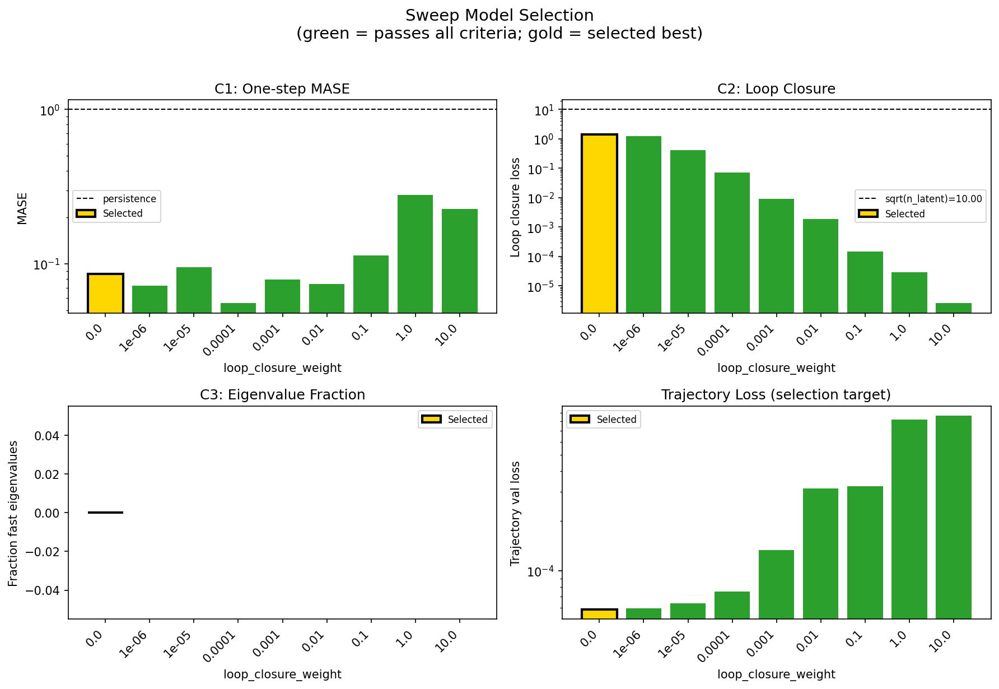

### sweep_pareto

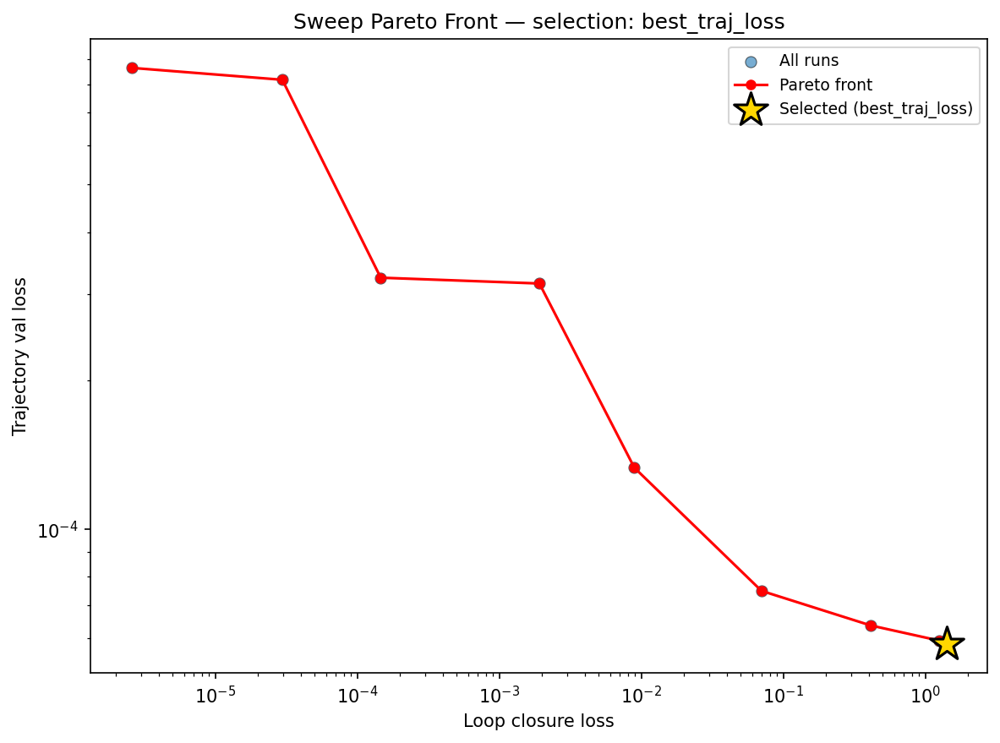

### prediction_windows

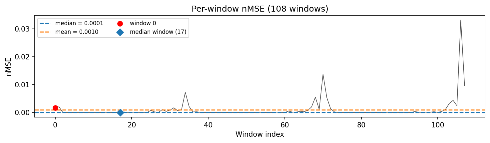

### long_trajectory

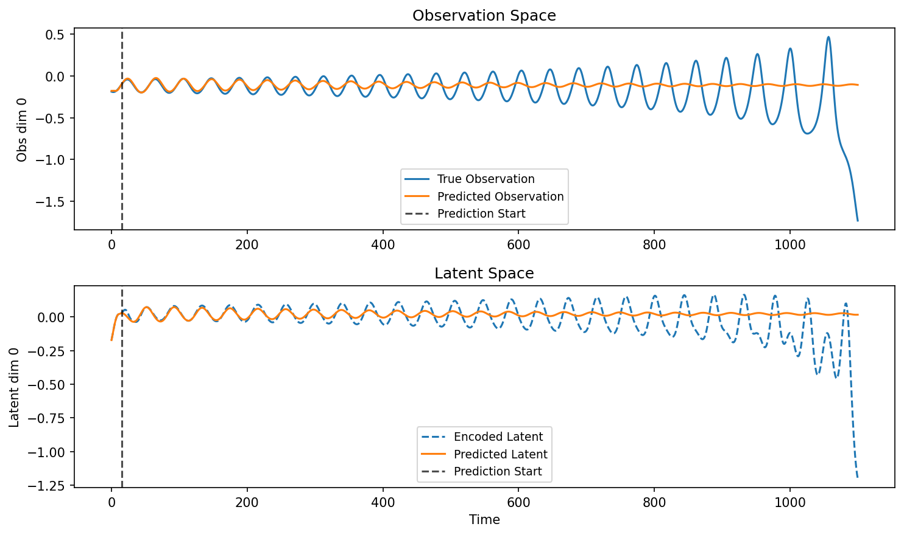

### mase

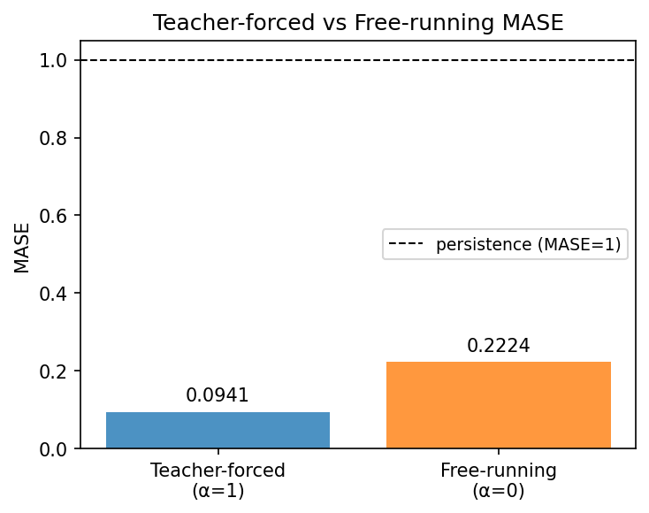

### lyapunov

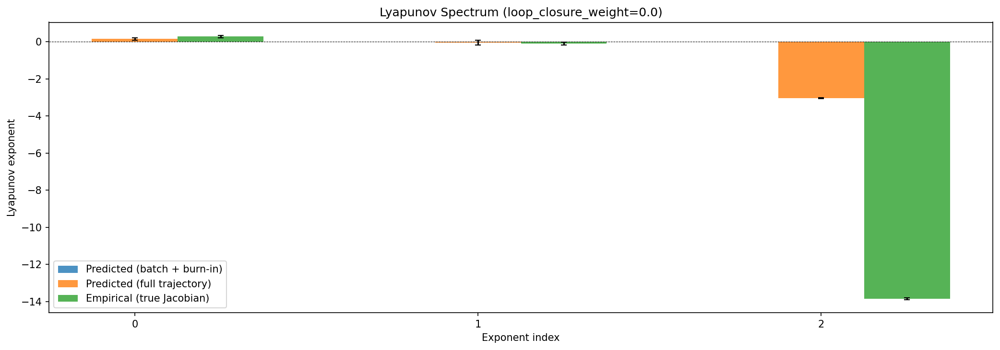

### per_run_lyapunov

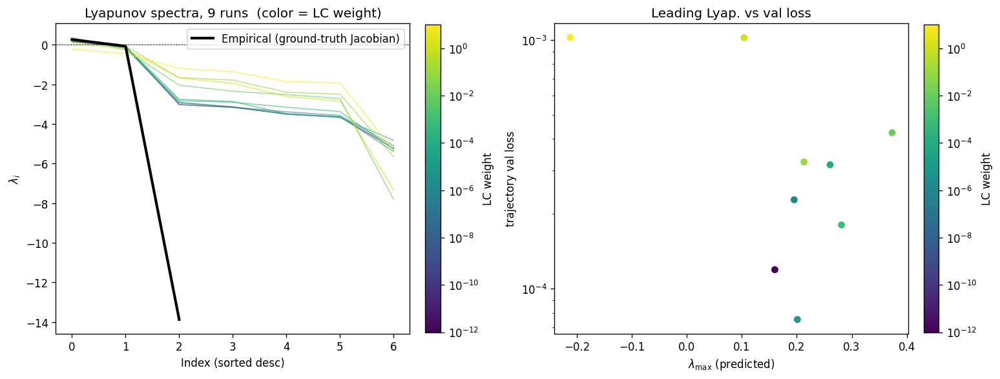

### per_run_lyapunov_vs_true

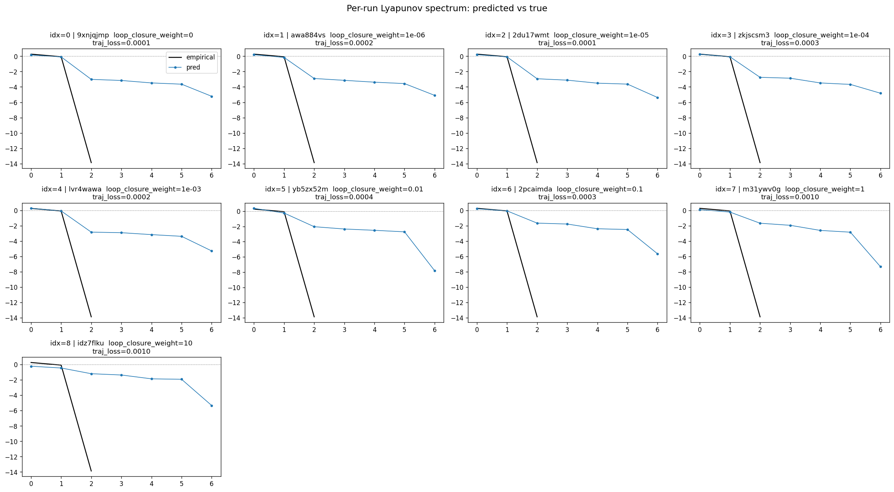

### per_run_lyapunov_relerr

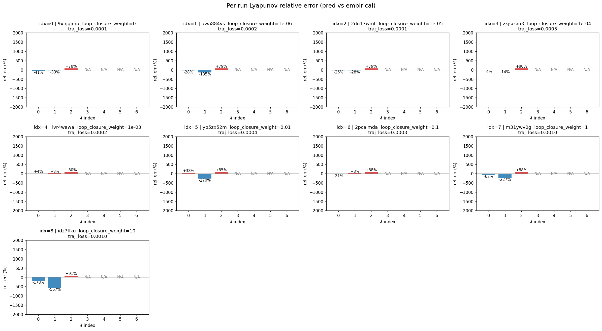

### lyapunov_spectrum_mse_vs_val_loss

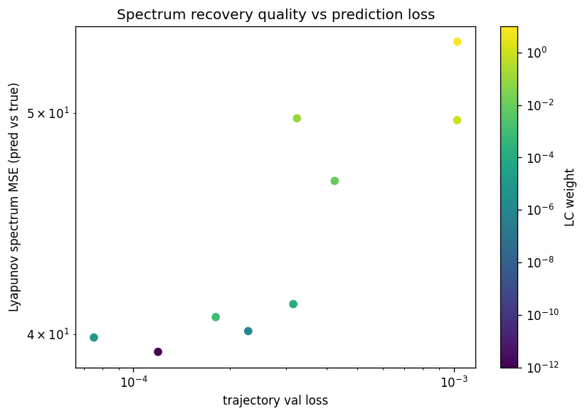

### reconstruction

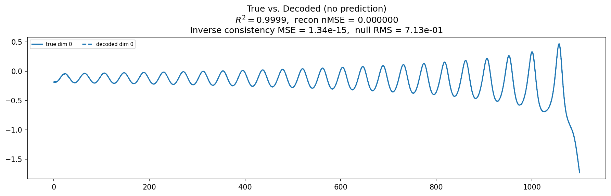

### latent_utilization

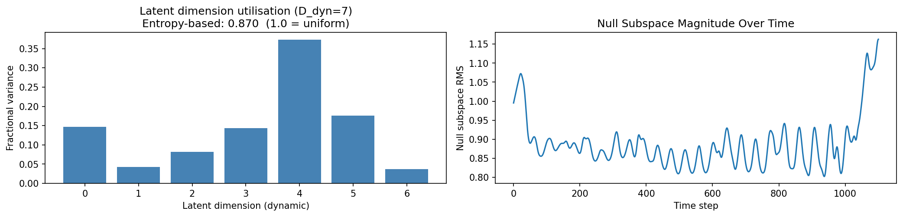

### kaplan_yorke

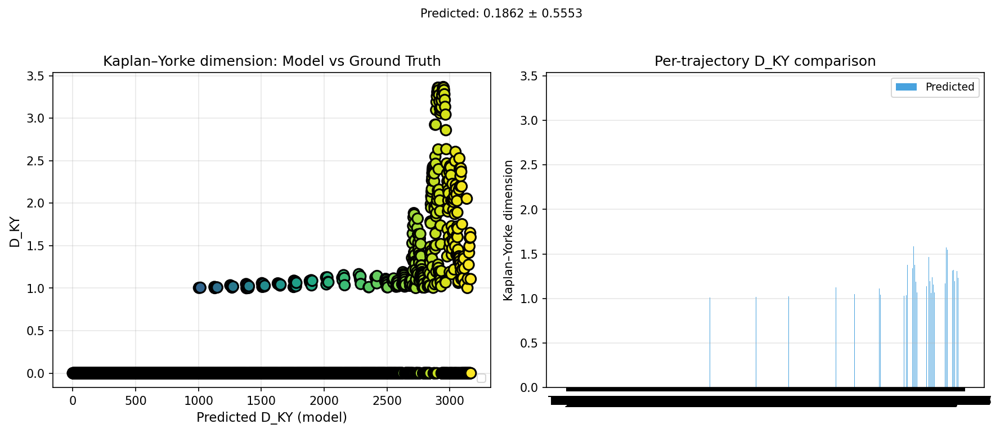

### kaplan_yorke_pca

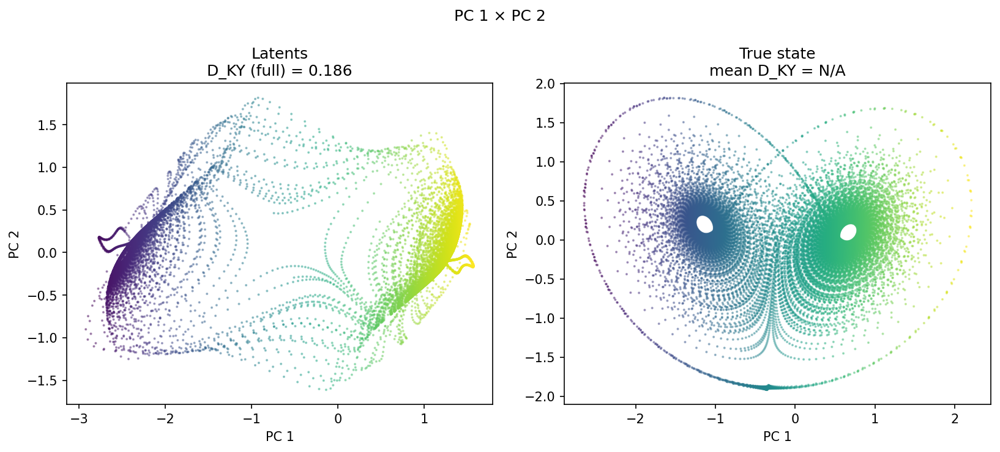

### prediction_detail_latent

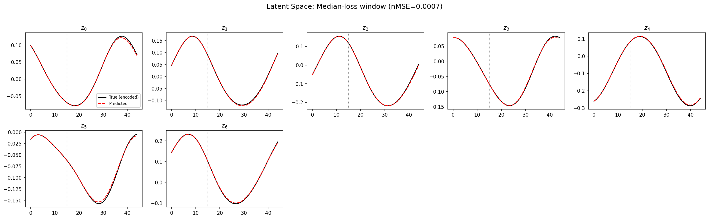

### prediction_detail_obs

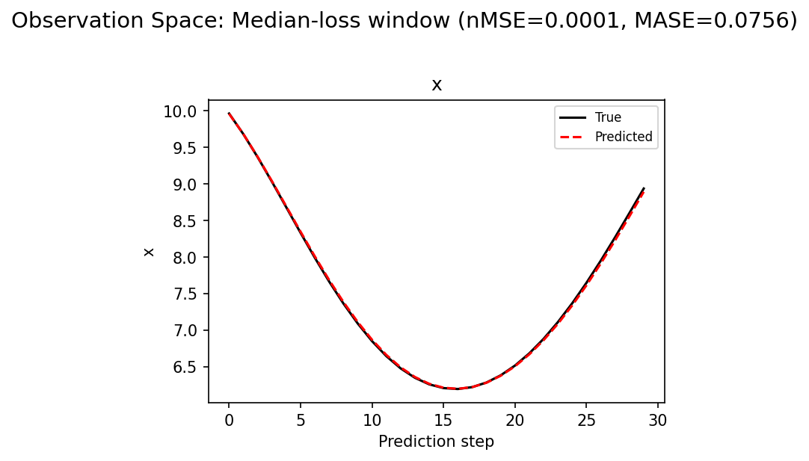

### encoder_decoder_jacobians

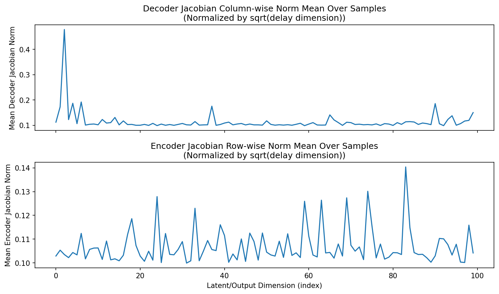

### amplification

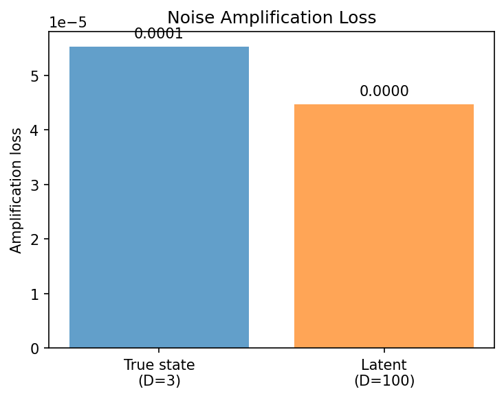

## Discussion

<!--
This section is intentionally left as a placeholder. A human reviewer
or Claude Code agent should fill it in based on the tables and figures
above, explicitly addressing each success criterion and comparing the
outcome to the stated hypothesis. Write the Discussion to
`discussion.md` in this directory and re-run `render_report`.
-->

_(to be written)_

## `run_analytics` stdout

<details><summary>Click to expand — full diagnostic output from <code>run_analytics</code></summary>

```
No run_id provided — selecting best run from group 'lorenz_partial_100d_7lat_additive_mse_p30__lc_sweep' ...
Found 9 total runs in JacobianODE/Lorenz_INDpartial_N100_D1_NormTrue_T7__JacobianODE (group=lorenz_partial_100d_7lat_additive_mse_p30__lc_sweep)
All runs (state, loop_closure_weight, tangent_entropy_weight, kl_dyn_weight):
  9xnjqjmp: state=finished, lc=0.0, te=0.0, kl_dyn=0.0
  awa884vs: state=finished, lc=1e-06, te=0.0, kl_dyn=0.0
  2du17wmt: state=finished, lc=1e-05, te=0.0, kl_dyn=0.0
  zkjscsm3: state=finished, lc=0.0001, te=0.0, kl_dyn=0.0
  lvr4wawa: state=finished, lc=0.001, te=0.0, kl_dyn=0.0
  yb5zx52m: state=finished, lc=0.01, te=0.0, kl_dyn=0.0
  2pcaimda: state=finished, lc=0.1, te=0.0, kl_dyn=0.0
  m31ywv0g: state=finished, lc=1.0, te=0.0, kl_dyn=0.0
  idz7flku: state=finished, lc=10.0, te=0.0, kl_dyn=0.0

slurm_timeout_min not found in any run config — falling back to 180 min
  Including 9xnjqjmp (lc=0.0): use_all_runs=True (state=finished)
  Including awa884vs (lc=1e-06): use_all_runs=True (state=finished)
  Including 2du17wmt (lc=1e-05): use_all_runs=True (state=finished)
  Including zkjscsm3 (lc=0.0001): use_all_runs=True (state=finished)
  Including lvr4wawa (lc=0.001): use_all_runs=True (state=finished)
  Including yb5zx52m (lc=0.01): use_all_runs=True (state=finished)
  Including 2pcaimda (lc=0.1): use_all_runs=True (state=finished)
  Including m31ywv0g (lc=1.0): use_all_runs=True (state=finished)
  Including idz7flku (lc=10.0): use_all_runs=True (state=finished)
Found 9 effectively-done sweep runs:
  loop_closure_weight=0.0, tangent_entropy_weight=0.0, kl_dyn_weight=0.0 -> run_id=9xnjqjmp
  loop_closure_weight=1e-06, tangent_entropy_weight=0.0, kl_dyn_weight=0.0 -> run_id=awa884vs
  loop_closure_weight=1e-05, tangent_entropy_weight=0.0, kl_dyn_weight=0.0 -> run_id=2du17wmt
  loop_closure_weight=0.0001, tangent_entropy_weight=0.0, kl_dyn_weight=0.0 -> run_id=zkjscsm3
  loop_closure_weight=0.001, tangent_entropy_weight=0.0, kl_dyn_weight=0.0 -> run_id=lvr4wawa
  loop_closure_weight=0.01, tangent_entropy_weight=0.0, kl_dyn_weight=0.0 -> run_id=yb5zx52m
  loop_closure_weight=0.1, tangent_entropy_weight=0.0, kl_dyn_weight=0.0 -> run_id=2pcaimda
  loop_closure_weight=1.0, tangent_entropy_weight=0.0, kl_dyn_weight=0.0 -> run_id=m31ywv0g
  loop_closure_weight=10.0, tangent_entropy_weight=0.0, kl_dyn_weight=0.0 -> run_id=idz7flku
n_dims=100, n_latent=100, n_dyn=7, dt=0.0150
  run=9xnjqjmp: DiagnosticMetrics(one_step_mase=0.08590328693389893, loop_closure_loss=1.4116860628128052, fast_eigenvalue_fraction=0.0, trajectory_val_loss=5.843710096087307e-05) (from cache, n_batches=100)
  run=awa884vs: DiagnosticMetrics(one_step_mase=0.07256656140089035, loop_closure_loss=1.245060682296753, fast_eigenvalue_fraction=0.0, trajectory_val_loss=5.9367011999711394e-05) (from cache, n_batches=100)
  run=2du17wmt: DiagnosticMetrics(one_step_mase=0.09526988118886948, loop_closure_loss=0.412641704082489, fast_eigenvalue_fraction=0.0, trajectory_val_loss=6.370167102431878e-05) (from cache, n_batches=100)
  run=zkjscsm3: DiagnosticMetrics(one_step_mase=0.055645253509283066, loop_closure_loss=0.07005464285612106, fast_eigenvalue_fraction=0.0, trajectory_val_loss=7.488905248465016e-05) (from cache, n_batches=100)
  run=lvr4wawa: DiagnosticMetrics(one_step_mase=0.07911882549524307, loop_closure_loss=0.008914769627153873, fast_eigenvalue_fraction=0.0, trajectory_val_loss=0.00013317209959495813) (from cache, n_batches=100)
  run=yb5zx52m: DiagnosticMetrics(one_step_mase=0.07385517656803131, loop_closure_loss=0.00191215006634593, fast_eigenvalue_fraction=0.0, trajectory_val_loss=0.0003150587435811758) (from cache, n_batches=100)
  run=2pcaimda: DiagnosticMetrics(one_step_mase=0.1133987307548523, loop_closure_loss=0.0001458602346247062, fast_eigenvalue_fraction=0.0, trajectory_val_loss=0.0003237242344766855) (from cache, n_batches=100)
  run=m31ywv0g: DiagnosticMetrics(one_step_mase=0.2804737985134125, loop_closure_loss=2.9577699024230242e-05, fast_eigenvalue_fraction=0.0, trajectory_val_loss=0.0008164768805727363) (from cache, n_batches=100)
  run=idz7flku: DiagnosticMetrics(one_step_mase=0.22761313617229462, loop_closure_loss=2.5641359115979867e-06, fast_eigenvalue_fraction=0.0, trajectory_val_loss=0.0008632524404674768) (from cache, n_batches=100)

Ranking method:           best_traj_loss
Best run ID:              9xnjqjmp
Best loop_closure_weight: 0.0
Best tangent_entropy_weight: 0.0
Best kl_dyn_weight:       0.0
Best traj loss:           0.000058
Criteria applied: ['C1', 'C2', 'C3']
Surviving: 9 / 9
Auto-selected run_id: 9xnjqjmp

======================================================================
PARETO FRONTIER RUNS (9 runs)
======================================================================
  Run ID               LC Loss   Traj Val Loss
  ------------  --------------  --------------
  idz7flku            0.000003        0.000863
  m31ywv0g            0.000030        0.000816
  2pcaimda            0.000146        0.000324
  yb5zx52m            0.001912        0.000315
  lvr4wawa            0.008915        0.000133
  zkjscsm3            0.070055        0.000075
  2du17wmt            0.412642        0.000064
  awa884vs            1.245061        0.000059
  9xnjqjmp            1.411686        0.000058 <-- selected

======================================================================
RANKING METHOD COMPARISON (over 9 survivors)
======================================================================
  Method                  Run ID               LC Loss   Traj Val Loss
  ----------------------  ------------  --------------  --------------
  best_traj_loss          9xnjqjmp            1.411686        0.000058 <-- active
  pareto_knee             2pcaimda            0.000146        0.000324
  geo_rank                9xnjqjmp            1.411686        0.000058
  minimax_rank            lvr4wawa            0.008915        0.000133
  geo_log_score           9xnjqjmp            1.411686        0.000058
  minimax_log_score       lvr4wawa            0.008915        0.000133
======================================================================

Loading run 9xnjqjmp from JacobianODE/Lorenz_INDpartial_N100_D1_NormTrue_T7__JacobianODE ...
Train dataset shape: torch.Size([23232, 45, 100])
Validation dataset shape: torch.Size([7392, 45, 100])
Test dataset shape: torch.Size([3168, 45, 100])
Train trajectories dataset shape: torch.Size([22, 1101, 100])
Validation trajectories dataset shape: torch.Size([7, 1101, 100])
Test trajectories dataset shape: torch.Size([3, 1101, 100])
Loading checkpoint epoch=110-step=22200.ckpt...
Computing reconstruction ...
Computing latent utilization ...
Entropy-based utilization: 0.870
Null subspace mean RMS: 8.887034e-01
Computing Lyapunov exponents for KY dimension (full-length, chunk-batched) ...
Mean KY dim (predicted): 0.186 ± 0.555
Computing prediction windows ...
Windows: 108 — nMSE min=0.0000, median=0.0001, mean=0.0010, max=0.0331
Computing long trajectory prediction ...
Computing encoder/decoder Jacobians ...
encoder_jacobian: (128, 100, 100)
decoder_jacobian: (128, 100, 100)
Computing amplification loss ...
Amplification loss — True state: 0.000055
Amplification loss — Latent:     0.000045


--- backfill 2026-04-16T04:19:49Z sections=['reconstruction', 'latent_utilization', 'kaplan_yorke', 'prediction_detail', 'long_trajectory', 'encoder_decoder_jacobians', 'amplification'] ---
No run_id provided — selecting best run from group 'lorenz_partial_100d_7lat_additive_mse_p30__lc_sweep' ...
Found 9 total runs in JacobianODE/Lorenz_INDpartial_N100_D1_NormTrue_T7__JacobianODE (group=lorenz_partial_100d_7lat_additive_mse_p30__lc_sweep)
All runs (state, loop_closure_weight, tangent_entropy_weight, kl_dyn_weight):
  9xnjqjmp: state=finished, lc=0.0, te=0.0, kl_dyn=0.0
  awa884vs: state=finished, lc=1e-06, te=0.0, kl_dyn=0.0
  2du17wmt: state=finished, lc=1e-05, te=0.0, kl_dyn=0.0
  zkjscsm3: state=finished, lc=0.0001, te=0.0, kl_dyn=0.0
  lvr4wawa: state=finished, lc=0.001, te=0.0, kl_dyn=0.0
  yb5zx52m: state=finished, lc=0.01, te=0.0, kl_dyn=0.0
  2pcaimda: state=finished, lc=0.1, te=0.0, kl_dyn=0.0
  m31ywv0g: state=finished, lc=1.0, te=0.0, kl_dyn=0.0
  idz7flku: state=finished, lc=10.0, te=0.0, kl_dyn=0.0

slurm_timeout_min not found in any run config — falling back to 180 min
  Including 9xnjqjmp (lc=0.0): use_all_runs=True (state=finished)
  Including awa884vs (lc=1e-06): use_all_runs=True (state=finished)
  Including 2du17wmt (lc=1e-05): use_all_runs=True (state=finished)
  Including zkjscsm3 (lc=0.0001): use_all_runs=True (state=finished)
  Including lvr4wawa (lc=0.001): use_all_runs=True (state=finished)
  Including yb5zx52m (lc=0.01): use_all_runs=True (state=finished)
  Including 2pcaimda (lc=0.1): use_all_runs=True (state=finished)
  Including m31ywv0g (lc=1.0): use_all_runs=True (state=finished)
  Including idz7flku (lc=10.0): use_all_runs=True (state=finished)
Found 9 effectively-done sweep runs:
  loop_closure_weight=0.0, tangent_entropy_weight=0.0, kl_dyn_weight=0.0 -> run_id=9xnjqjmp
  loop_closure_weight=1e-06, tangent_entropy_weight=0.0, kl_dyn_weight=0.0 -> run_id=awa884vs
  loop_closure_weight=1e-05, tangent_entropy_weight=0.0, kl_dyn_weight=0.0 -> run_id=2du17wmt
  loop_closure_weight=0.0001, tangent_entropy_weight=0.0, kl_dyn_weight=0.0 -> run_id=zkjscsm3
  loop_closure_weight=0.001, tangent_entropy_weight=0.0, kl_dyn_weight=0.0 -> run_id=lvr4wawa
  loop_closure_weight=0.01, tangent_entropy_weight=0.0, kl_dyn_weight=0.0 -> run_id=yb5zx52m
  loop_closure_weight=0.1, tangent_entropy_weight=0.0, kl_dyn_weight=0.0 -> run_id=2pcaimda
  loop_closure_weight=1.0, tangent_entropy_weight=0.0, kl_dyn_weight=0.0 -> run_id=m31ywv0g
  loop_closure_weight=10.0, tangent_entropy_weight=0.0, kl_dyn_weight=0.0 -> run_id=idz7flku
n_dims=100, n_latent=100, n_dyn=7, dt=0.0150
  run=9xnjqjmp: DiagnosticMetrics(one_step_mase=0.08590328693389893, loop_closure_loss=1.4116860628128052, fast_eigenvalue_fraction=0.0, trajectory_val_loss=5.843710096087307e-05) (from cache, n_batches=100)
  run=awa884vs: DiagnosticMetrics(one_step_mase=0.07256656140089035, loop_closure_loss=1.245060682296753, fast_eigenvalue_fraction=0.0, trajectory_val_loss=5.9367011999711394e-05) (from cache, n_batches=100)
  run=2du17wmt: DiagnosticMetrics(one_step_mase=0.09526988118886948, loop_closure_loss=0.412641704082489, fast_eigenvalue_fraction=0.0, trajectory_val_loss=6.370167102431878e-05) (from cache, n_batches=100)
  run=zkjscsm3: DiagnosticMetrics(one_step_mase=0.055645253509283066, loop_closure_loss=0.07005464285612106, fast_eigenvalue_fraction=0.0, trajectory_val_loss=7.488905248465016e-05) (from cache, n_batches=100)
  run=lvr4wawa: DiagnosticMetrics(one_step_mase=0.07911882549524307, loop_closure_loss=0.008914769627153873, fast_eigenvalue_fraction=0.0, trajectory_val_loss=0.00013317209959495813) (from cache, n_batches=100)
  run=yb5zx52m: DiagnosticMetrics(one_step_mase=0.07385517656803131, loop_closure_loss=0.00191215006634593, fast_eigenvalue_fraction=0.0, trajectory_val_loss=0.0003150587435811758) (from cache, n_batches=100)
  run=2pcaimda: DiagnosticMetrics(one_step_mase=0.1133987307548523, loop_closure_loss=0.0001458602346247062, fast_eigenvalue_fraction=0.0, trajectory_val_loss=0.0003237242344766855) (from cache, n_batches=100)
  run=m31ywv0g: DiagnosticMetrics(one_step_mase=0.2804737985134125, loop_closure_loss=2.9577699024230242e-05, fast_eigenvalue_fraction=0.0, trajectory_val_loss=0.0008164768805727363) (from cache, n_batches=100)
  run=idz7flku: DiagnosticMetrics(one_step_mase=0.22761313617229462, loop_closure_loss=2.5641359115979867e-06, fast_eigenvalue_fraction=0.0, trajectory_val_loss=0.0008632524404674768) (from cache, n_batches=100)

Ranking method:           best_traj_loss
Best run ID:              9xnjqjmp
Best loop_closure_weight: 0.0
Best tangent_entropy_weight: 0.0
Best kl_dyn_weight:       0.0
Best traj loss:           0.000058
Criteria applied: ['C1', 'C2', 'C3']
Surviving: 9 / 9
Auto-selected run_id: 9xnjqjmp

======================================================================
PARETO FRONTIER RUNS (9 runs)
======================================================================
  Run ID               LC Loss   Traj Val Loss
  ------------  --------------  --------------
  idz7flku            0.000003        0.000863
  m31ywv0g            0.000030        0.000816
  2pcaimda            0.000146        0.000324
  yb5zx52m            0.001912        0.000315
  lvr4wawa            0.008915        0.000133
  zkjscsm3            0.070055        0.000075
  2du17wmt            0.412642        0.000064
  awa884vs            1.245061        0.000059
  9xnjqjmp            1.411686        0.000058 <-- selected

======================================================================
RANKING METHOD COMPARISON (over 9 survivors)
======================================================================
  Method                  Run ID               LC Loss   Traj Val Loss
  ----------------------  ------------  --------------  --------------
  best_traj_loss          9xnjqjmp            1.411686        0.000058 <-- active
  pareto_knee             2pcaimda            0.000146        0.000324
  geo_rank                9xnjqjmp            1.411686        0.000058
  minimax_rank            lvr4wawa            0.008915        0.000133
  geo_log_score           9xnjqjmp            1.411686        0.000058
  minimax_log_score       lvr4wawa            0.008915        0.000133
======================================================================

Loading run 9xnjqjmp from JacobianODE/Lorenz_INDpartial_N100_D1_NormTrue_T7__JacobianODE ...
Train dataset shape: torch.Size([23232, 45, 100])
Validation dataset shape: torch.Size([7392, 45, 100])
Test dataset shape: torch.Size([3168, 45, 100])
Train trajectories dataset shape: torch.Size([22, 1101, 100])
Validation trajectories dataset shape: torch.Size([7, 1101, 100])
Test trajectories dataset shape: torch.Size([3, 1101, 100])
Loading checkpoint epoch=110-step=22200.ckpt...
Computing reconstruction ...
Computing latent utilization ...
Entropy-based utilization: 0.870
Null subspace mean RMS: 8.887034e-01
Computing Lyapunov exponents for KY dimension (full-length, chunk-batched) ...
Mean KY dim (predicted): 0.186 ± 0.555
Computing prediction windows ...
Windows: 108 — nMSE min=0.0000, median=0.0001, mean=0.0010, max=0.0331
Computing long trajectory prediction ...
Computing encoder/decoder Jacobians ...
encoder_jacobian: (128, 100, 100)
decoder_jacobian: (128, 100, 100)
Computing amplification loss ...
Amplification loss — True state: 0.000055
Amplification loss — Latent:     0.000045
```

</details>
