# Sweep Analysis: `lorenz_partial_100d_7lat_additive_mse_p30_obsnoise001__lc_sweep`

**Project**: [Lorenz_INDpartial_N100_D1_NormTrue_T7__JacobianODE](https://wandb.ai/JacobianODE/Lorenz_INDpartial_N100_D1_NormTrue_T7__JacobianODE/groups/lorenz_partial_100d_7lat_additive_mse_p30_obsnoise001__lc_sweep)  
**Launched**: 2026-04-17T01:50:38Z  
**Completed**: 2026-04-17T04:00:18Z  
**Outcome**: `complete_with_failures`  
**Git**: `latent-JacobianODE` @ `f05d2ea`  
**Expected runs**: 9

## Experiment Context

### `lorenz_partial_100d_7lat_additive_mse_p30`

**Description**

Extends lorenz_partial_100d_7lat_additive_mse (p10) to
prediction_steps=30, seq_length=45. Still most_recent recon,
kl_null=0. LC weight swept.

**Hypothesis**

The p10 100-delay / 7-latent sweep under-represented strong
contraction (λ_min ≈ −6 vs empirical ~−14). A longer rollout
gives the dynamics MLP stronger pressure to learn correct
integration over multiple Lyapunov times, which may pull the
contraction spectrum closer to the empirical.

**Success criteria**

- λ_min moves noticeably more negative than p10 baseline (~-6)
- val/trajectory_r2 > 0.9 at best LC
- Σλ_i moves from ~-20 toward empirical ~-14

## Results

**Swept axes** (1): `training.lightning.loop_closure_weight`

**Chosen run** (by `best_traj_loss`): `5ona41iw` — traj_loss=0.00079, MASE=0.6976, R²=0.9978, LC loss=3.421, epoch=101.0

Swept-axis values at chosen run: `training.lightning.loop_closure_weight`=0

### Integrity checks

⚠️ **3 run_idx slot(s) had multiple matching wandb runs** — the best by `best_traj_loss` was kept; the others are listed below for audit:
  - run_idx=**0**: chose `5ona41iw`, dropped `qxlwn990`
  - run_idx=**4**: chose `ub7bqcft`, dropped `jrndl5j0`
  - run_idx=**5**: chose `8p5gxwdn`, dropped `wq8wfyxy`

**Runs analyzed**: 9 (expected 9)

### Per-run results

| run_idx | run_id | `training.lightning.loop_closure_weight` | best_traj_loss | best_MASE | R² | LC loss | epoch |
|---|---|---|---|---|---|---|---|
| 0 | `5ona41iw` | 0 | 0.00079 | 0.6976 | 0.9978 | 3.421 | 101.0 |
| 1 | `i8nq6c39` | 1.0e-06 | 0.00112 | 0.7749 | 0.9969 | 1.812 | 65.0 |
| 2 | `rd78e3p1` | 1.0e-05 | nan | nan | nan | 4.470 | — |
| 3 | `o0lmk9do` | 1.0e-04 | nan | nan | nan | 0.542 | — |
| 4 | `ub7bqcft` | 0.001 | 0.00084 | 0.7295 | 0.9977 | 0.035 | 101.0 |
| 5 | `8p5gxwdn` | 0.01 | 0.00117 | 0.7739 | 0.9968 | 0.005 | 101.0 |
| 7 | `f94958hz` | 1 | 0.00212 | 1.0654 | 0.9943 | 0.000 | 123.0 |
| 6 | `x8gguowy` | 0.1 | 0.00240 | 1.0517 | 0.9935 | 0.000 | 102.0 |
| 8 | `rav3nrkr` | 10 | 0.03357 | 4.0534 | 0.9092 | 0.000 | 67.0 |

## Success-criteria verdicts (automated)

| Criterion | Verdict | Note |
|---|---|---|
| λ_min moves noticeably more negative than p10 baseline (~-6) | **Unknown** |  |
| val/trajectory_r2 > 0.9 at best LC | **Pass** | Best R² = 0.9978; threshold > 0.9 |
| Σλ_i moves from ~-20 toward empirical ~-14 | **Unknown** |  |

_Automated verdicts use simple numeric-threshold parsing and may mis-classify qualitative criteria. The Discussion section below takes precedence._

## Figures

### sweep_overview

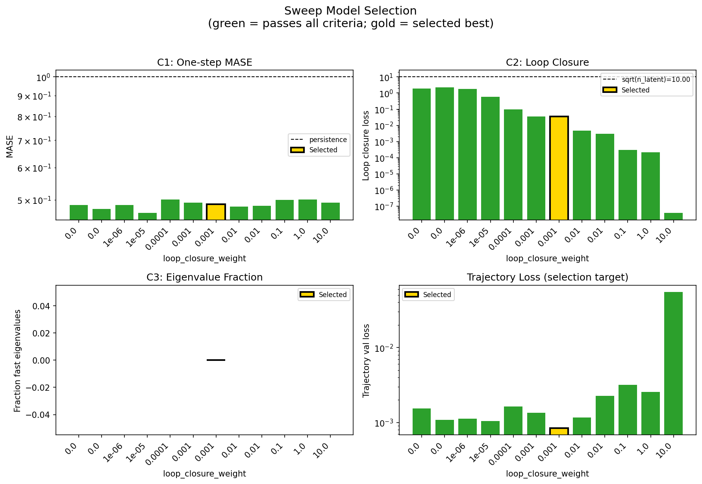

### sweep_pareto

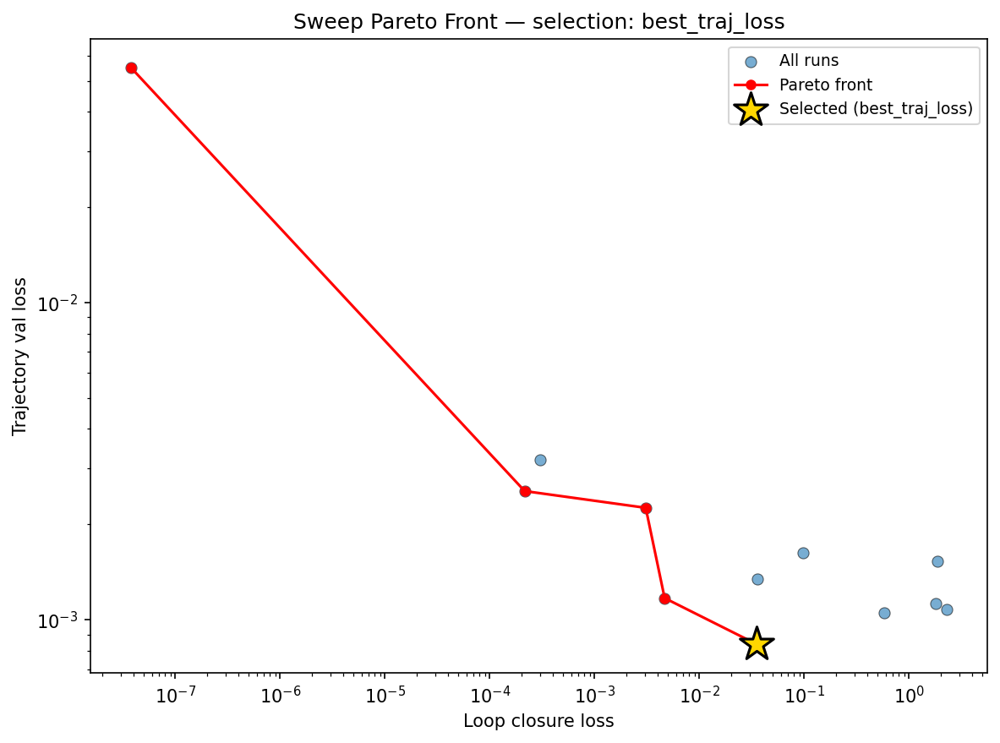

### reconstruction

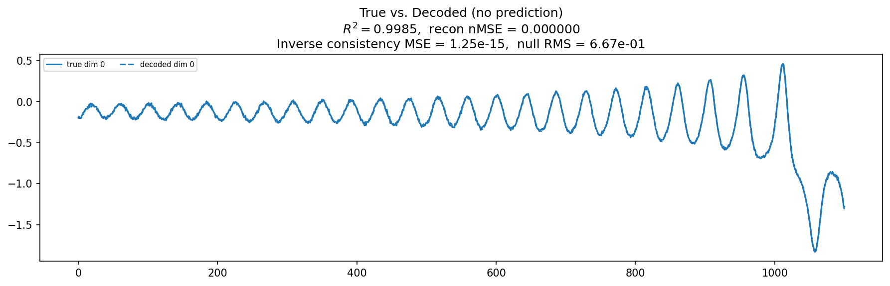

### prediction_windows

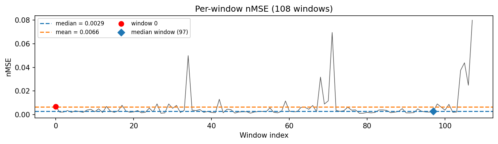

### long_trajectory

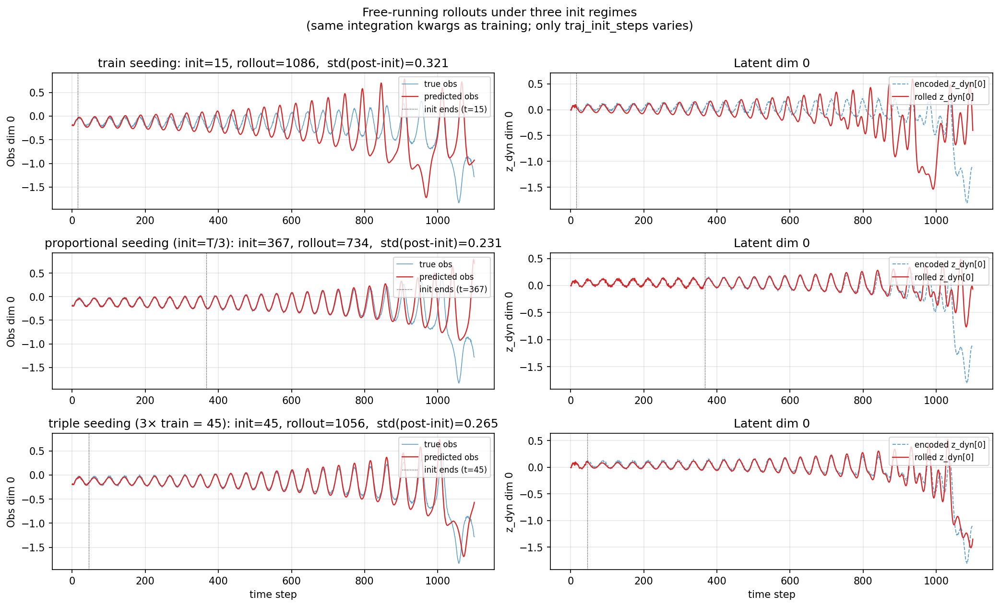

### mase

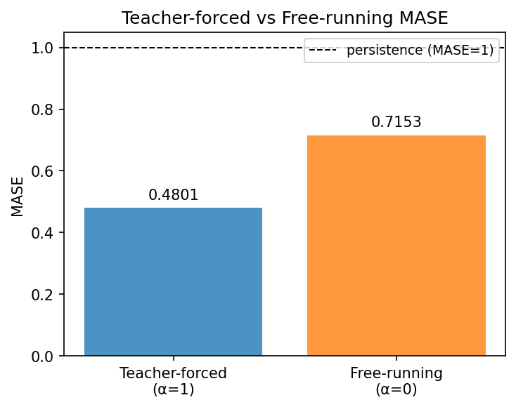

### latent_utilization

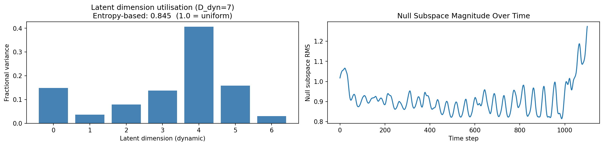

### lyapunov

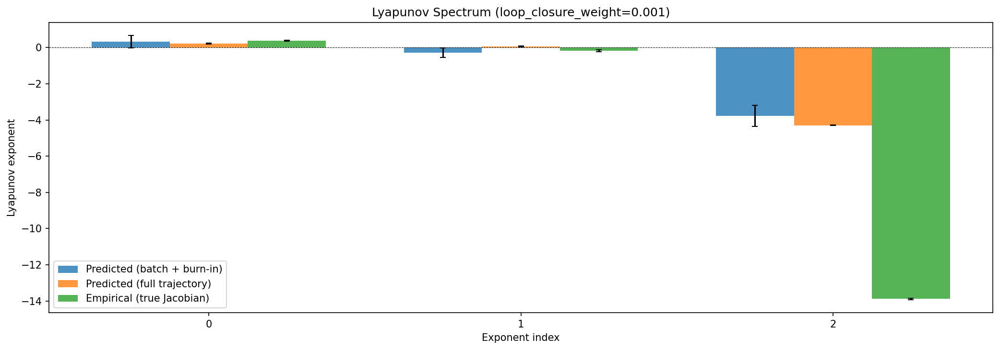

### kaplan_yorke

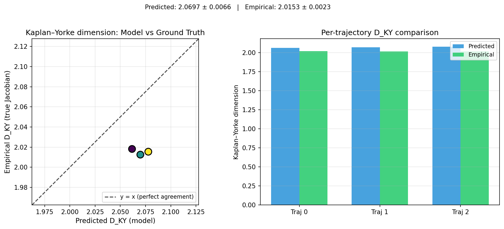

### per_run_lyapunov


### per_run_lyapunov_vs_true


### per_run_lyapunov_relerr


### encoder_decoder_jacobians

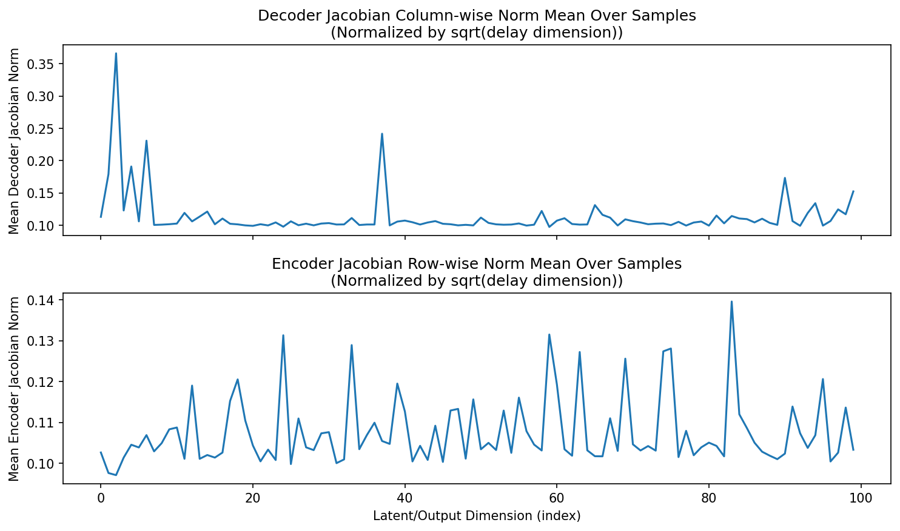

### amplification

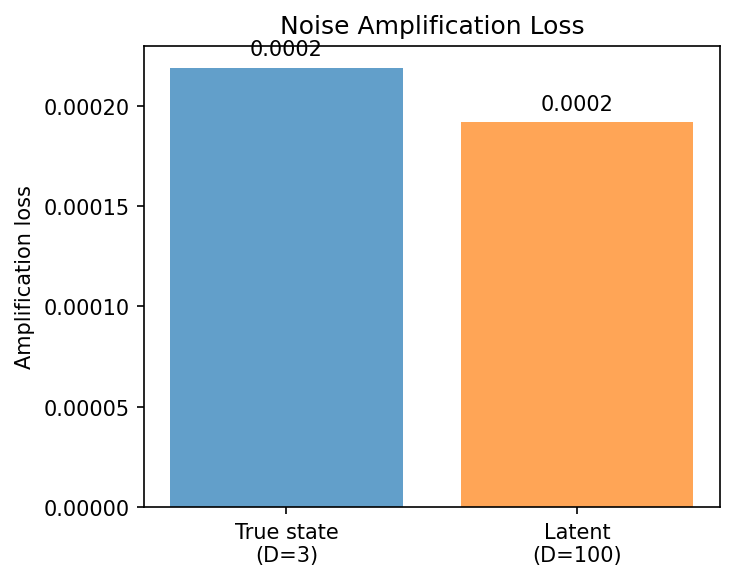

### kaplan_yorke_pca

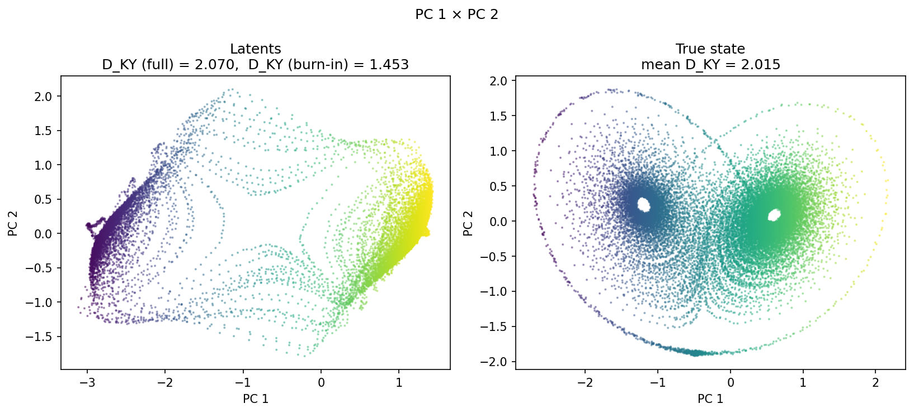

### prediction_detail_latent

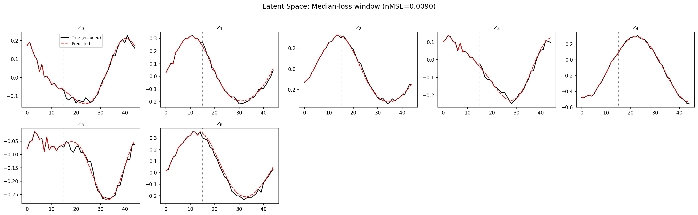

### prediction_detail_obs

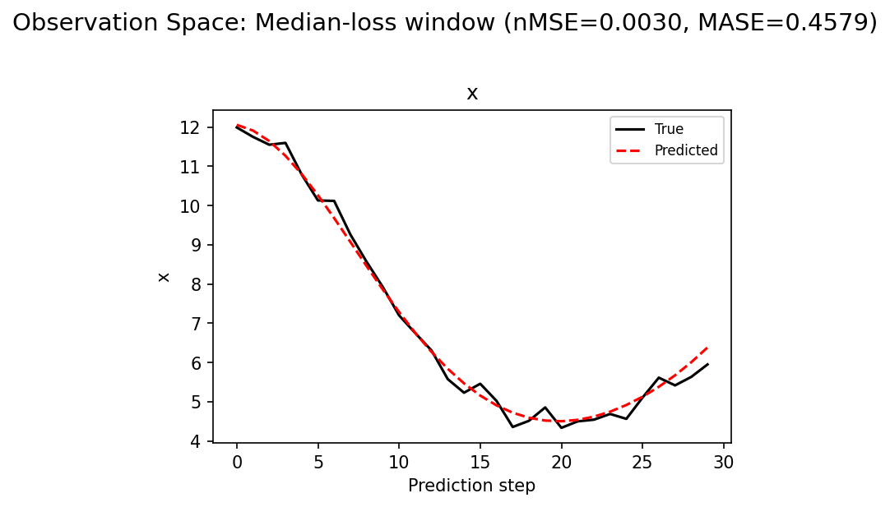

## Discussion

<!--
This section is intentionally left as a placeholder. A human reviewer
or Claude Code agent should fill it in based on the tables and figures
above, explicitly addressing each success criterion and comparing the
outcome to the stated hypothesis. Write the Discussion to
`discussion.md` in this directory and re-run `render_report`.
-->

_(to be written)_

## `run_analytics` stdout

<details><summary>Click to expand — full diagnostic output from <code>run_analytics</code></summary>

```
No run_id provided — selecting best run from group 'lorenz_partial_100d_7lat_additive_mse_p30_obsnoise001__lc_sweep' ...
Found 12 total runs in JacobianODE/Lorenz_INDpartial_N100_D1_NormTrue_T7__JacobianODE (group=lorenz_partial_100d_7lat_additive_mse_p30_obsnoise001__lc_sweep)
All runs (state, loop_closure_weight, tangent_entropy_weight, kl_dyn_weight):
  i8nq6c39: state=finished, lc=1e-06, te=0.0, kl_dyn=0.0
  o0lmk9do: state=finished, lc=0.0001, te=0.0, kl_dyn=0.0
  rd78e3p1: state=finished, lc=1e-05, te=0.0, kl_dyn=0.0
  f94958hz: state=finished, lc=1.0, te=0.0, kl_dyn=0.0
  wq8wfyxy: state=finished, lc=0.01, te=0.0, kl_dyn=0.0
  x8gguowy: state=finished, lc=0.1, te=0.0, kl_dyn=0.0
  rav3nrkr: state=finished, lc=10.0, te=0.0, kl_dyn=0.0
  5ona41iw: state=crashed, lc=0.0, te=0.0, kl_dyn=0.0
  qxlwn990: state=finished, lc=0.0, te=0.0, kl_dyn=0.0
  8p5gxwdn: state=crashed, lc=0.01, te=0.0, kl_dyn=0.0
  ub7bqcft: state=crashed, lc=0.001, te=0.0, kl_dyn=0.0
  jrndl5j0: state=finished, lc=0.001, te=0.0, kl_dyn=0.0

slurm_timeout_min not found in any run config — falling back to 180 min
  Including i8nq6c39 (lc=1e-06): use_all_runs=True (state=finished)
  Including o0lmk9do (lc=0.0001): use_all_runs=True (state=finished)
  Including rd78e3p1 (lc=1e-05): use_all_runs=True (state=finished)
  Including f94958hz (lc=1.0): use_all_runs=True (state=finished)
  Including wq8wfyxy (lc=0.01): use_all_runs=True (state=finished)
  Including x8gguowy (lc=0.1): use_all_runs=True (state=finished)
  Including rav3nrkr (lc=10.0): use_all_runs=True (state=finished)
  Including 5ona41iw (lc=0.0): use_all_runs=True (state=crashed)
  Including qxlwn990 (lc=0.0): use_all_runs=True (state=finished)
  Including 8p5gxwdn (lc=0.01): use_all_runs=True (state=crashed)
  Including ub7bqcft (lc=0.001): use_all_runs=True (state=crashed)
  Including jrndl5j0 (lc=0.001): use_all_runs=True (state=finished)
Found 12 effectively-done sweep runs:
  loop_closure_weight=0.0, tangent_entropy_weight=0.0, kl_dyn_weight=0.0 -> run_id=5ona41iw
  loop_closure_weight=0.0, tangent_entropy_weight=0.0, kl_dyn_weight=0.0 -> run_id=qxlwn990
  loop_closure_weight=1e-06, tangent_entropy_weight=0.0, kl_dyn_weight=0.0 -> run_id=i8nq6c39
  loop_closure_weight=1e-05, tangent_entropy_weight=0.0, kl_dyn_weight=0.0 -> run_id=rd78e3p1
  loop_closure_weight=0.0001, tangent_entropy_weight=0.0, kl_dyn_weight=0.0 -> run_id=o0lmk9do
  loop_closure_weight=0.001, tangent_entropy_weight=0.0, kl_dyn_weight=0.0 -> run_id=jrndl5j0
  loop_closure_weight=0.001, tangent_entropy_weight=0.0, kl_dyn_weight=0.0 -> run_id=ub7bqcft
  loop_closure_weight=0.01, tangent_entropy_weight=0.0, kl_dyn_weight=0.0 -> run_id=8p5gxwdn
  loop_closure_weight=0.01, tangent_entropy_weight=0.0, kl_dyn_weight=0.0 -> run_id=wq8wfyxy
  loop_closure_weight=0.1, tangent_entropy_weight=0.0, kl_dyn_weight=0.0 -> run_id=x8gguowy
  loop_closure_weight=1.0, tangent_entropy_weight=0.0, kl_dyn_weight=0.0 -> run_id=f94958hz
  loop_closure_weight=10.0, tangent_entropy_weight=0.0, kl_dyn_weight=0.0 -> run_id=rav3nrkr
n_dims=100, n_latent=100, n_dyn=7, dt=0.0150
  run=5ona41iw: DiagnosticMetrics(one_step_mase=0.48544707894325256, loop_closure_loss=1.8584074974060059, fast_eigenvalue_fraction=0.0, trajectory_val_loss=0.0015311388997361064) (from cache, n_batches=100)
  run=qxlwn990: DiagnosticMetrics(one_step_mase=0.47509074211120605, loop_closure_loss=2.2841503620147705, fast_eigenvalue_fraction=0.0, trajectory_val_loss=0.0010818451410159469) (from cache, n_batches=100)
  run=i8nq6c39: DiagnosticMetrics(one_step_mase=0.48617541790008545, loop_closure_loss=1.8115429878234863, fast_eigenvalue_fraction=0.0, trajectory_val_loss=0.0011247723596170545) (from cache, n_batches=100)
  run=rd78e3p1: DiagnosticMetrics(one_step_mase=0.464398592710495, loop_closure_loss=0.5756409168243408, fast_eigenvalue_fraction=0.0, trajectory_val_loss=0.0010503451339900494) (from cache, n_batches=100)
  run=o0lmk9do: DiagnosticMetrics(one_step_mase=0.5012394189834595, loop_closure_loss=0.09735587239265442, fast_eigenvalue_fraction=0.0, trajectory_val_loss=0.0016264350851997733) (from cache, n_batches=100)
  run=jrndl5j0: DiagnosticMetrics(one_step_mase=0.49195191264152527, loop_closure_loss=0.03575555980205536, fast_eigenvalue_fraction=0.0, trajectory_val_loss=0.0013427409576252103) (from cache, n_batches=100)
  run=ub7bqcft: DiagnosticMetrics(one_step_mase=0.48754647374153137, loop_closure_loss=0.03483300283551216, fast_eigenvalue_fraction=0.0, trajectory_val_loss=0.0008400846272706985) (from cache, n_batches=100)
  run=8p5gxwdn: DiagnosticMetrics(one_step_mase=0.4820827543735504, loop_closure_loss=0.004660323262214661, fast_eigenvalue_fraction=0.0, trajectory_val_loss=0.0011718646856024861) (from cache, n_batches=100)
  run=wq8wfyxy: DiagnosticMetrics(one_step_mase=0.4840472936630249, loop_closure_loss=0.0030754271429032087, fast_eigenvalue_fraction=0.0, trajectory_val_loss=0.0022566604893654585) (from cache, n_batches=100)
  run=x8gguowy: DiagnosticMetrics(one_step_mase=0.499728262424469, loop_closure_loss=0.0003040399169549346, fast_eigenvalue_fraction=0.0, trajectory_val_loss=0.003197801997885108) (from cache, n_batches=100)
  run=f94958hz: DiagnosticMetrics(one_step_mase=0.5014160871505737, loop_closure_loss=0.00021532965183723718, fast_eigenvalue_fraction=0.0, trajectory_val_loss=0.0025481125339865685) (from cache, n_batches=100)
  run=rav3nrkr: DiagnosticMetrics(one_step_mase=0.4928510785102844, loop_closure_loss=3.789822500266382e-08, fast_eigenvalue_fraction=0.0, trajectory_val_loss=0.05500970780849457) (from cache, n_batches=100)

Ranking method:           best_traj_loss
Best run ID:              ub7bqcft
Best loop_closure_weight: 0.001
Best tangent_entropy_weight: 0.0
Best kl_dyn_weight:       0.0
Best traj loss:           0.000840
Criteria applied: ['C1', 'C2', 'C3']
Surviving: 12 / 12
Auto-selected run_id: ub7bqcft

======================================================================
PARETO FRONTIER RUNS (5 runs)
======================================================================
  Run ID               LC Loss   Traj Val Loss
  ------------  --------------  --------------
  rav3nrkr            0.000000        0.055010
  f94958hz            0.000215        0.002548
  wq8wfyxy            0.003075        0.002257
  8p5gxwdn            0.004660        0.001172
  ub7bqcft            0.034833        0.000840 <-- selected

======================================================================
RANKING METHOD COMPARISON (over 12 survivors)
======================================================================
  Method                  Run ID               LC Loss   Traj Val Loss
  ----------------------  ------------  --------------  --------------
  best_traj_loss          ub7bqcft            0.034833        0.000840 <-- active
  pareto_knee             wq8wfyxy            0.003075        0.002257
  geo_rank                ub7bqcft            0.034833        0.000840
  minimax_rank            8p5gxwdn            0.004660        0.001172
  geo_log_score           ub7bqcft            0.034833        0.000840
  minimax_log_score       f94958hz            0.000215        0.002548
======================================================================

Loading run ub7bqcft from JacobianODE/Lorenz_INDpartial_N100_D1_NormTrue_T7__JacobianODE ...
Train dataset shape: torch.Size([23232, 45, 100])
Validation dataset shape: torch.Size([7392, 45, 100])
Test dataset shape: torch.Size([3168, 45, 100])
Train trajectories dataset shape: torch.Size([22, 1101, 100])
Validation trajectories dataset shape: torch.Size([7, 1101, 100])
Test trajectories dataset shape: torch.Size([3, 1101, 100])
Loading checkpoint epoch=101-step=20400.ckpt...
Computing reconstruction ...
Computing MASE ...
Teacher-forced MASE: 0.4801
Free-running MASE:   0.7153
Computing latent utilization ...
Entropy-based utilization: 0.845
Null subspace mean RMS: 9.137816e-01
Computing Lyapunov exponents ...
  Computing full-trajectory Lyapunov (3 test trajs, T=1101) ...
Predicted Lyapunov exponents (batch+burn-in, 128 windowed trajs):
  λ_1 = +0.3200 ± 0.3485
  λ_2 = -0.2881 ± 0.2710
  λ_3 = -3.7681 ± 0.5893
  λ_4 = -4.1964 ± 0.3426
  λ_5 = -4.4282 ± 0.2769
  λ_6 = -4.9783 ± 0.2616
  λ_7 = -6.2073 ± 0.3518
Predicted Lyapunov exponents (full-length, 3 test trajs):
  λ_1 = +0.2304 ± 0.0288
  λ_2 = +0.0691 ± 0.0236
  λ_3 = -4.2961 ± 0.0181
  λ_4 = -4.4794 ± 0.0264
  λ_5 = -4.6260 ± 0.0160
  λ_6 = -4.8610 ± 0.0355
  λ_7 = -6.6961 ± 0.0070
Empirical Lyapunov exponents (mean ± std):
  λ_1 = +0.3846 ± 0.0251
  λ_2 = -0.1716 ± 0.0444
  λ_3 = -13.8799 ± 0.0398
Mean KY dim (predicted): 2.070 ± 0.007
Mean KY dim (empirical): 2.015 ± 0.002
Mean KY dim (burn-in):   1.453 ± 0.834
Computing prediction windows ...
Windows: 108 — nMSE min=0.0011, median=0.0029, mean=0.0066, max=0.0800
Computing long trajectory prediction ...
Computing encoder/decoder Jacobians ...
encoder_jacobian: (128, 100, 100)
decoder_jacobian: (128, 100, 100)
Computing amplification loss ...
Amplification loss — True state: 0.000219
Amplification loss — Latent:     0.000192
```

</details>
