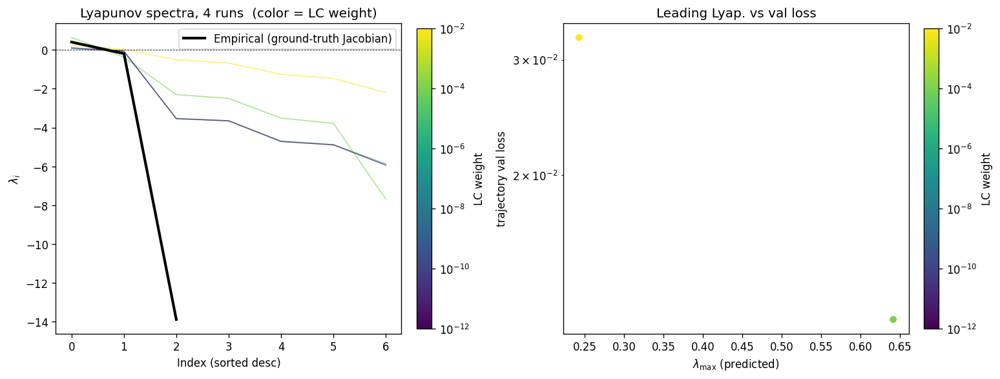
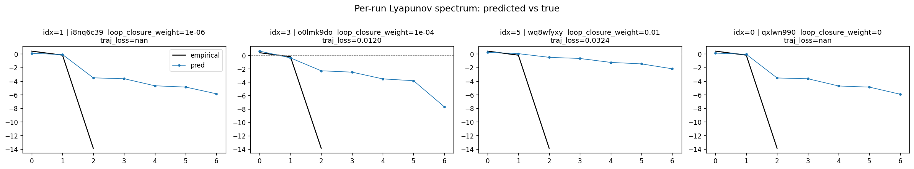
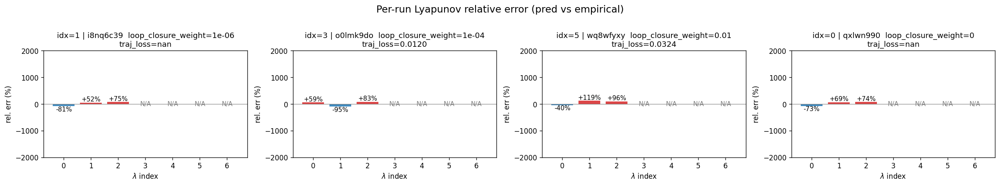

# Sweep Analysis: `lorenz_partial_100d_7lat_additive_mse_p30_obsnoise001__lc_sweep`

**Project**: [Lorenz_INDpartial_N100_D1_NormTrue_T7__JacobianODE](https://wandb.ai/JacobianODE/Lorenz_INDpartial_N100_D1_NormTrue_T7__JacobianODE/groups/lorenz_partial_100d_7lat_additive_mse_p30_obsnoise001__lc_sweep)  
**Launched**: 2026-04-17T01:50:38Z  
**Completed**: 2026-04-17T04:00:18Z  
**Outcome**: `complete_with_failures`  
**Git**: `latent-JacobianODE` @ `f05d2ea`  
**Expected runs**: 9

## Experiment Context

### `lorenz_partial_100d_7lat_additive_mse_p30`

**Description**

Extends lorenz_partial_100d_7lat_additive_mse (p10) to
prediction_steps=30, seq_length=45. Still most_recent recon,
kl_null=0. LC weight swept.

**Hypothesis**

The p10 100-delay / 7-latent sweep under-represented strong
contraction (λ_min ≈ −6 vs empirical ~−14). A longer rollout
gives the dynamics MLP stronger pressure to learn correct
integration over multiple Lyapunov times, which may pull the
contraction spectrum closer to the empirical.

**Success criteria**

- λ_min moves noticeably more negative than p10 baseline (~-6)
- val/trajectory_r2 > 0.9 at best LC
- Σλ_i moves from ~-20 toward empirical ~-14

## Results

**Overall best MASE**: 0.7749 (LC weight = 1.0e-06, obs_noise_scale = 0.00)
**Overall best traj loss**: 0.00112 at epoch 65.0
**Runs analyzed**: 12

### Best run per `obs_noise_scale`

| obs_noise_scale | Best LC weight | Best traj loss | MASE at best | R² | LC loss | epoch |
|---|---|---|---|---|---|---|
| 0.0 | 0.0e+00 | 0.00108 | 0.7774 | 0.9970 | 2.284 | 65.0 |

## Success-criteria verdicts (automated)

| Criterion | Verdict | Note |
|---|---|---|
| λ_min moves noticeably more negative than p10 baseline (~-6) | **Unknown** |  |
| val/trajectory_r2 > 0.9 at best LC | **Pass** | Best R² = 0.9969; threshold > 0.9 |
| Σλ_i moves from ~-20 toward empirical ~-14 | **Unknown** |  |

_Automated verdicts use simple numeric-threshold parsing and may mis-classify qualitative criteria. The Discussion section below takes precedence._

## Figures

### per_run_lyapunov

### per_run_lyapunov_vs_true

### per_run_lyapunov_relerr

## Discussion

<!--
This section is intentionally left as a placeholder. A human reviewer
or Claude Code agent should fill it in based on the tables and figures
above, explicitly addressing each success criterion and comparing the
outcome to the stated hypothesis. Write the Discussion to
`discussion.md` in this directory and re-run `render_report`.
-->

_(to be written)_
