# Sweep Analysis: `lorenz_partial_100d_7lat_additive_mse_uniform_obsnoise005__lc_sweep`

**Project**: [Lorenz_INDpartial_N100_D1_NormTrue_T7__JacobianODE](https://wandb.ai/JacobianODE/Lorenz_INDpartial_N100_D1_NormTrue_T7__JacobianODE/groups/lorenz_partial_100d_7lat_additive_mse_uniform_obsnoise005__lc_sweep)  
**Launched**: 2026-04-16T05:56:04Z  
**Completed**: 2026-04-16T11:50:14Z  
**Outcome**: `complete_clean`  
**Git**: `latent-JacobianODE` @ `4b6bc1f`  
**Expected runs**: 9

## Experiment Context

### `lorenz_partial_100d_7lat_additive_mse_uniform`

**Description**

Same as lorenz_partial_100d_7lat_additive_mse except
reconstruction_mode='uniform' so training loss is scored on the
full 100-D delay-embedded state at every step of the
prediction_steps=10 horizon (val monitor still most_recent).
obs_noise_scale=0 fixed; LC weight swept.

**Hypothesis**

100→7 with most_recent recon under-contracted the spectrum at the
non-p30 horizon. Uniform recon at the same horizon forces z_dyn
to be a proper Takens chart of the attractor rather than just
enough to reconstruct the current frame, which should concentrate
the real contraction into a single axis (λ closer to empirical
~-14) and make the extra transverse directions contract rapidly.
Serves as a p10 reference to compare against the p30 version.

**Success criteria**

- λ_min near empirical ~-14 at some LC
- Σλ_i within ~30% of empirical ~-13.7
- val/trajectory_r2 > 0.9 at best LC
- No loop-closure explosion under uniform training

## Results

**Swept axes** (1): `training.lightning.loop_closure_weight`

**Chosen run** (by `best_traj_loss`): `4h82lv4v` — traj_loss=0.00525, MASE=0.7783, R²=0.9858, LC loss=1.557, epoch=127.0

Swept-axis values at chosen run: `training.lightning.loop_closure_weight`=1.0e-05

**Runs analyzed**: 9 (expected 9)

### Per-run results

| run_idx | run_id | `training.lightning.loop_closure_weight` | best_traj_loss | best_MASE | R² | LC loss | epoch |
|---|---|---|---|---|---|---|---|
| 2 | `4h82lv4v` | 1.0e-05 | 0.00525 | 0.7783 | 0.9858 | 1.557 | 127.0 |
| 1 | `hcai47of` | 1.0e-06 | 0.00525 | 0.7786 | 0.9858 | 8.980 | 127.0 |
| 0 | `1dc6pbmm` | 0 | 0.00538 | 0.7852 | 0.9854 | 375.966 | 102.0 |
| 5 | `tthjlvoy` | 0.01 | 0.00544 | 0.7881 | 0.9852 | 0.002 | 150.0 |
| 4 | `xit7r44p` | 0.001 | 0.00544 | 0.7896 | 0.9853 | 0.025 | 133.0 |
| 3 | `hp642zyz` | 1.0e-04 | 0.00565 | 0.7958 | 0.9846 | 0.258 | 93.0 |
| 6 | `4i62yjy8` | 0.1 | 0.00601 | 0.8145 | 0.9837 | 0.000 | 139.0 |
| 7 | `9yyrp800` | 1 | 0.00660 | 0.8426 | 0.9821 | 0.000 | 174.0 |
| 8 | `nnhboy20` | 10 | 0.00763 | 0.8987 | 0.9793 | 0.000 | 140.0 |

## Success-criteria verdicts (automated)

| Criterion | Verdict | Note |
|---|---|---|
| λ_min near empirical ~-14 at some LC | **Unknown** |  |
| Σλ_i within ~30% of empirical ~-13.7 | **Unknown** |  |
| val/trajectory_r2 > 0.9 at best LC | **Pass** | Best R² = 0.9858; threshold > 0.9 |
| No loop-closure explosion under uniform training | **Unknown** |  |

_Automated verdicts use simple numeric-threshold parsing and may mis-classify qualitative criteria. The Discussion section below takes precedence._

## Figures

### sweep_overview

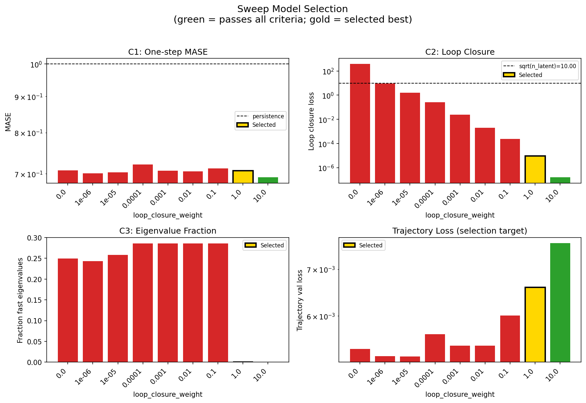

### sweep_pareto

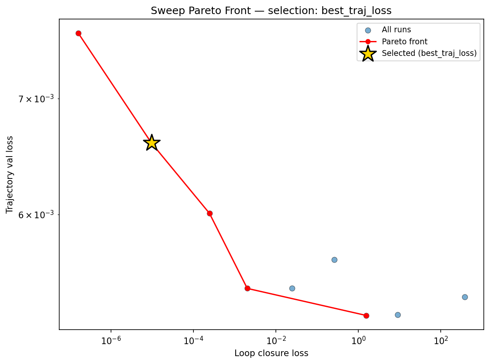

### reconstruction

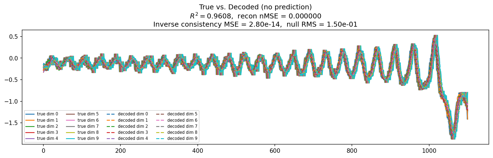

### prediction_windows

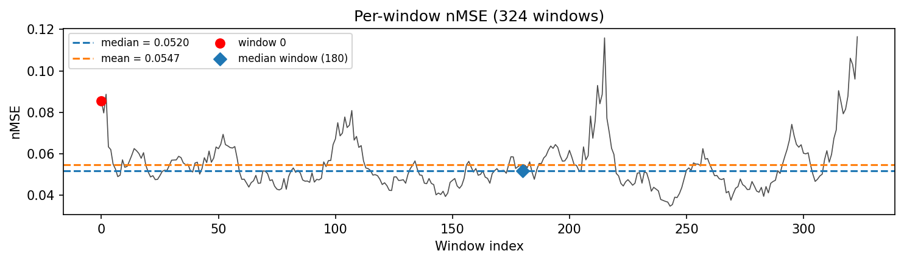

### long_trajectory

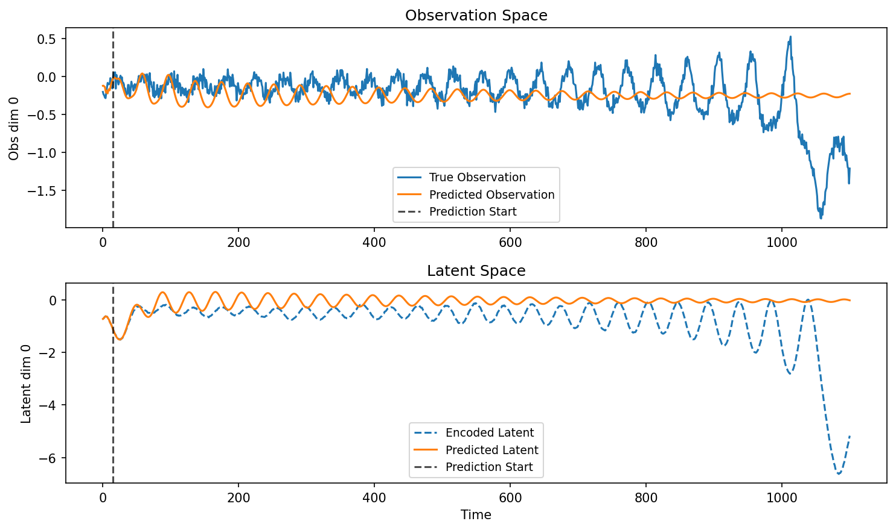

### mase

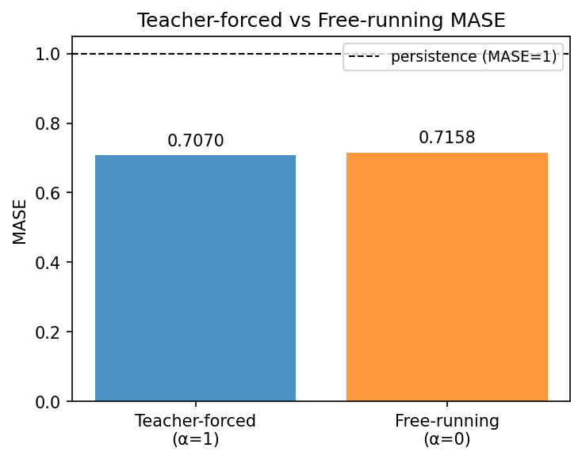

### latent_utilization

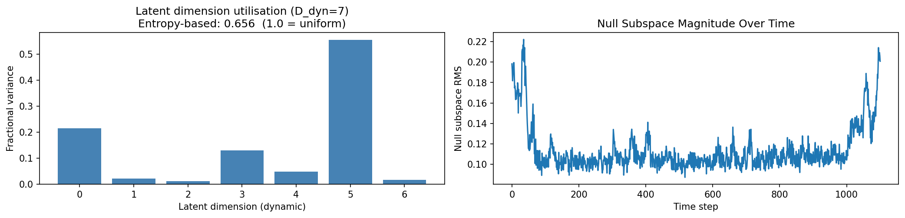

### lyapunov

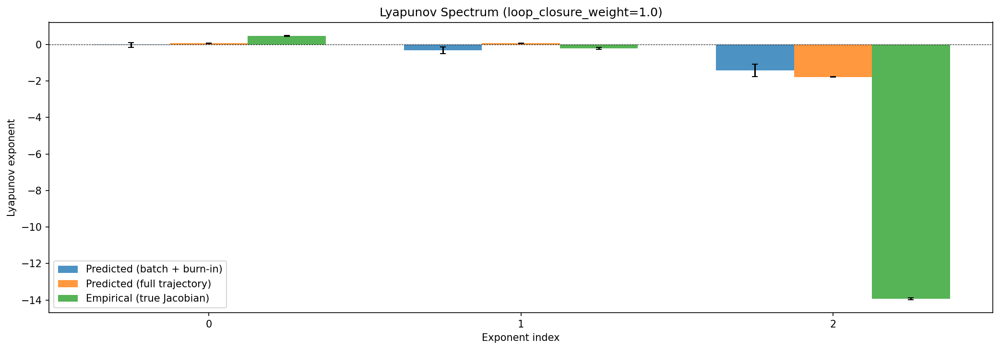

### kaplan_yorke

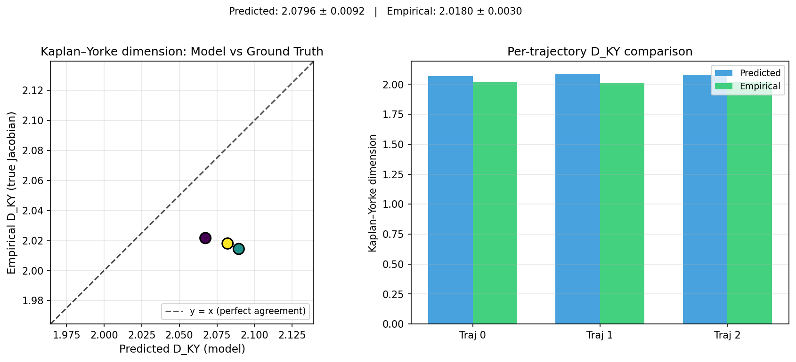

### per_run_lyapunov

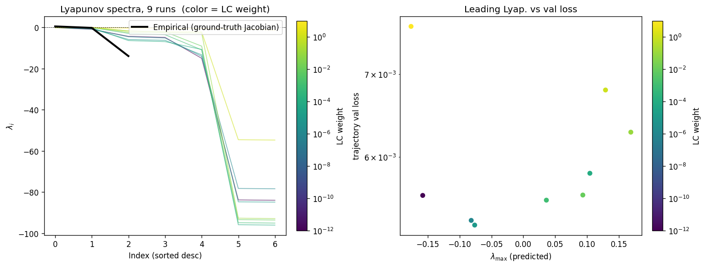

### per_run_lyapunov_vs_true

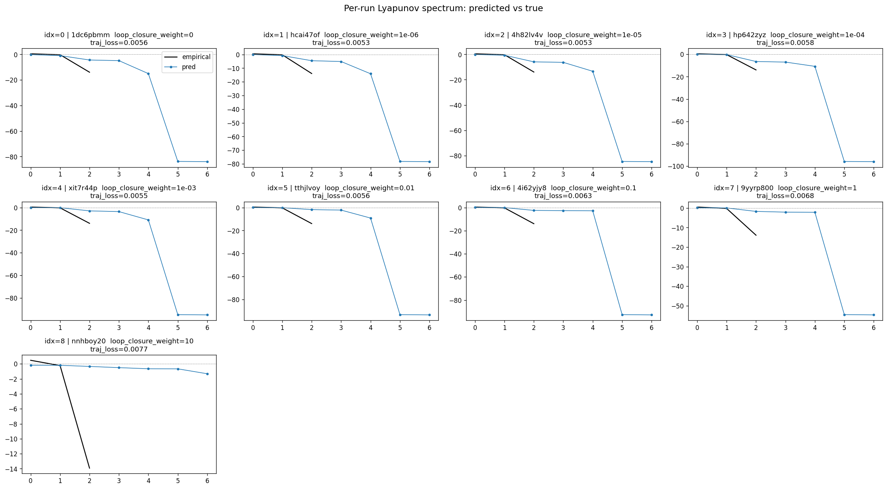

### per_run_lyapunov_relerr

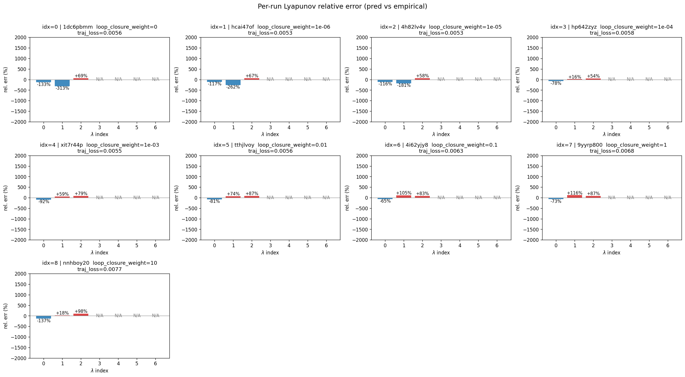

### lyapunov_spectrum_mse_vs_val_loss

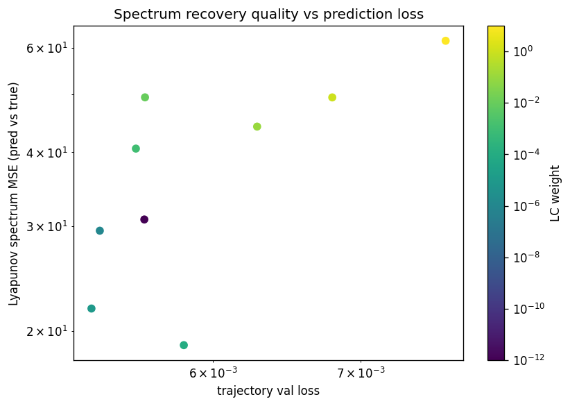

### encoder_decoder_jacobians

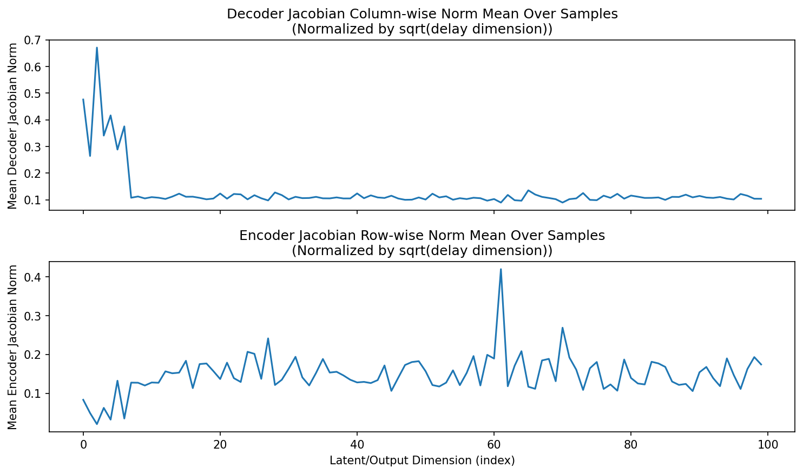

### amplification

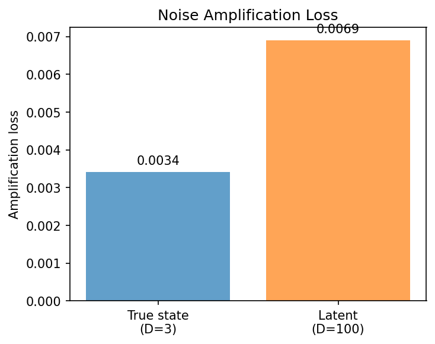

### kaplan_yorke_pca

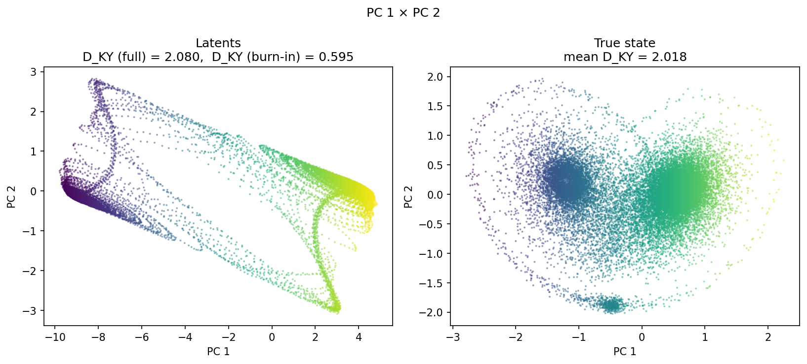

### prediction_detail_latent

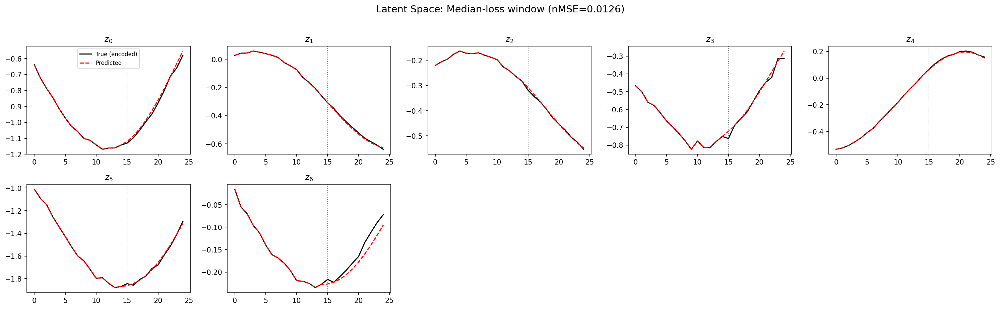

### prediction_detail_obs

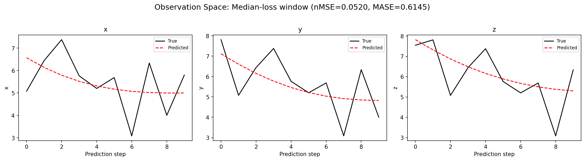

## Discussion

<!--
This section is intentionally left as a placeholder. A human reviewer
or Claude Code agent should fill it in based on the tables and figures
above, explicitly addressing each success criterion and comparing the
outcome to the stated hypothesis. Write the Discussion to
`discussion.md` in this directory and re-run `render_report`.
-->

_(to be written)_

## `run_analytics` stdout

<details><summary>Click to expand — full diagnostic output from <code>run_analytics</code></summary>

```
No run_id provided — selecting best run from group 'lorenz_partial_100d_7lat_additive_mse_uniform_obsnoise005__lc_sweep' ...
Found 9 total runs in JacobianODE/Lorenz_INDpartial_N100_D1_NormTrue_T7__JacobianODE (group=lorenz_partial_100d_7lat_additive_mse_uniform_obsnoise005__lc_sweep)
All runs (state, loop_closure_weight, tangent_entropy_weight, kl_dyn_weight):
  1dc6pbmm: state=finished, lc=0.0, te=0.0, kl_dyn=0.0
  hcai47of: state=finished, lc=1e-06, te=0.0, kl_dyn=0.0
  4h82lv4v: state=finished, lc=1e-05, te=0.0, kl_dyn=0.0
  hp642zyz: state=finished, lc=0.0001, te=0.0, kl_dyn=0.0
  xit7r44p: state=finished, lc=0.001, te=0.0, kl_dyn=0.0
  tthjlvoy: state=finished, lc=0.01, te=0.0, kl_dyn=0.0
  4i62yjy8: state=finished, lc=0.1, te=0.0, kl_dyn=0.0
  9yyrp800: state=finished, lc=1.0, te=0.0, kl_dyn=0.0
  nnhboy20: state=finished, lc=10.0, te=0.0, kl_dyn=0.0

slurm_timeout_min not found in any run config — falling back to 180 min
  Including 1dc6pbmm (lc=0.0): use_all_runs=True (state=finished)
  Including hcai47of (lc=1e-06): use_all_runs=True (state=finished)
  Including 4h82lv4v (lc=1e-05): use_all_runs=True (state=finished)
  Including hp642zyz (lc=0.0001): use_all_runs=True (state=finished)
  Including xit7r44p (lc=0.001): use_all_runs=True (state=finished)
  Including tthjlvoy (lc=0.01): use_all_runs=True (state=finished)
  Including 4i62yjy8 (lc=0.1): use_all_runs=True (state=finished)
  Including 9yyrp800 (lc=1.0): use_all_runs=True (state=finished)
  Including nnhboy20 (lc=10.0): use_all_runs=True (state=finished)
Found 9 effectively-done sweep runs:
  loop_closure_weight=0.0, tangent_entropy_weight=0.0, kl_dyn_weight=0.0 -> run_id=1dc6pbmm
  loop_closure_weight=1e-06, tangent_entropy_weight=0.0, kl_dyn_weight=0.0 -> run_id=hcai47of
  loop_closure_weight=1e-05, tangent_entropy_weight=0.0, kl_dyn_weight=0.0 -> run_id=4h82lv4v
  loop_closure_weight=0.0001, tangent_entropy_weight=0.0, kl_dyn_weight=0.0 -> run_id=hp642zyz
  loop_closure_weight=0.001, tangent_entropy_weight=0.0, kl_dyn_weight=0.0 -> run_id=xit7r44p
  loop_closure_weight=0.01, tangent_entropy_weight=0.0, kl_dyn_weight=0.0 -> run_id=tthjlvoy
  loop_closure_weight=0.1, tangent_entropy_weight=0.0, kl_dyn_weight=0.0 -> run_id=4i62yjy8
  loop_closure_weight=1.0, tangent_entropy_weight=0.0, kl_dyn_weight=0.0 -> run_id=9yyrp800
  loop_closure_weight=10.0, tangent_entropy_weight=0.0, kl_dyn_weight=0.0 -> run_id=nnhboy20
n_dims=100, n_latent=100, n_dyn=7, dt=0.0150
  run=1dc6pbmm: DiagnosticMetrics(one_step_mase=0.707763135433197, loop_closure_loss=375.9659118652344, fast_eigenvalue_fraction=0.2492857128381729, trajectory_val_loss=0.005376506596803665) (from cache, n_batches=100)
  run=hcai47of: DiagnosticMetrics(one_step_mase=0.7009849548339844, loop_closure_loss=8.979778289794922, fast_eigenvalue_fraction=0.24285714328289032, trajectory_val_loss=0.005251006688922644) (from cache, n_batches=100)
  run=4h82lv4v: DiagnosticMetrics(one_step_mase=0.7029179334640503, loop_closure_loss=1.5565879344940186, fast_eigenvalue_fraction=0.25785714387893677, trajectory_val_loss=0.005246102809906006) (from cache, n_batches=100)
  run=hp642zyz: DiagnosticMetrics(one_step_mase=0.7210924625396729, loop_closure_loss=0.25814926624298096, fast_eigenvalue_fraction=0.2857142984867096, trajectory_val_loss=0.005649568047374487) (from cache, n_batches=100)
  run=xit7r44p: DiagnosticMetrics(one_step_mase=0.7073301076889038, loop_closure_loss=0.02472049556672573, fast_eigenvalue_fraction=0.2857142984867096, trajectory_val_loss=0.005440260283648968) (from cache, n_batches=100)
  run=tthjlvoy: DiagnosticMetrics(one_step_mase=0.7055831551551819, loop_closure_loss=0.0020117268431931734, fast_eigenvalue_fraction=0.2857142984867096, trajectory_val_loss=0.005438248626887798) (from cache, n_batches=100)
  run=4i62yjy8: DiagnosticMetrics(one_step_mase=0.712566077709198, loop_closure_loss=0.00024421935086138546, fast_eigenvalue_fraction=0.2857142984867096, trajectory_val_loss=0.006008225027471781) (from cache, n_batches=100)
  run=9yyrp800: DiagnosticMetrics(one_step_mase=0.7070409059524536, loop_closure_loss=9.579030120221432e-06, fast_eigenvalue_fraction=0.0, trajectory_val_loss=0.006596482824534178) (from cache, n_batches=100)
  run=nnhboy20: DiagnosticMetrics(one_step_mase=0.691860556602478, loop_closure_loss=1.608309929679308e-07, fast_eigenvalue_fraction=0.0, trajectory_val_loss=0.007632751949131489) (from cache, n_batches=100)

Ranking method:           best_traj_loss
Best run ID:              9yyrp800
Best loop_closure_weight: 1.0
Best tangent_entropy_weight: 0.0
Best kl_dyn_weight:       0.0
Best traj loss:           0.006596
Criteria applied: ['C1', 'C2', 'C3']
Surviving: 2 / 9
Auto-selected run_id: 9yyrp800

======================================================================
PARETO FRONTIER RUNS (5 runs)
======================================================================
  Run ID               LC Loss   Traj Val Loss
  ------------  --------------  --------------
  nnhboy20            0.000000        0.007633
  9yyrp800            0.000010        0.006596 <-- selected
  4i62yjy8            0.000244        0.006008
  tthjlvoy            0.002012        0.005438
  4h82lv4v            1.556588        0.005246

======================================================================
RANKING METHOD COMPARISON (over 2 survivors)
======================================================================
  Method                  Run ID               LC Loss   Traj Val Loss
  ----------------------  ------------  --------------  --------------
  best_traj_loss          9yyrp800            0.000010        0.006596 <-- active
  pareto_knee             nnhboy20            0.000000        0.007633
  geo_rank                9yyrp800            0.000010        0.006596
  minimax_rank            9yyrp800            0.000010        0.006596
  geo_log_score           9yyrp800            0.000010        0.006596
  minimax_log_score       nnhboy20            0.000000        0.007633
======================================================================

Loading run 9yyrp800 from JacobianODE/Lorenz_INDpartial_N100_D1_NormTrue_T7__JacobianODE ...
Train dataset shape: torch.Size([23672, 25, 100])
Validation dataset shape: torch.Size([7532, 25, 100])
Test dataset shape: torch.Size([3228, 25, 100])
Train trajectories dataset shape: torch.Size([22, 1101, 100])
Validation trajectories dataset shape: torch.Size([7, 1101, 100])
Test trajectories dataset shape: torch.Size([3, 1101, 100])
Loading checkpoint epoch=174-step=35000.ckpt...
Computing reconstruction ...
Computing MASE ...
Teacher-forced MASE: 0.7070
Free-running MASE:   0.7158
Computing latent utilization ...
Entropy-based utilization: 0.656
Null subspace mean RMS: 1.154294e-01
Computing Lyapunov exponents ...
  Computing full-trajectory Lyapunov (3 test trajs, T=1101) ...
Predicted Lyapunov exponents (batch+burn-in, 128 windowed trajs):
  λ_1 = -0.0337 ± 0.1365
  λ_2 = -0.3224 ± 0.1874
  λ_3 = -1.4201 ± 0.3514
  λ_4 = -2.1043 ± 0.1968
  λ_5 = -2.4601 ± 0.1867
  λ_6 = -54.2316 ± 0.0161
  λ_7 = -54.6804 ± 0.0166
Predicted Lyapunov exponents (full-length, 3 test trajs):
  λ_1 = +0.0726 ± 0.0105
  λ_2 = +0.0690 ± 0.0107
  λ_3 = -1.7770 ± 0.0182
  λ_4 = -2.1376 ± 0.0324
  λ_5 = -2.2404 ± 0.0285
  λ_6 = -54.5470 ± 0.0011
  λ_7 = -54.6819 ± 0.0008
Empirical Lyapunov exponents (mean ± std):
  λ_1 = +0.4677 ± 0.0259
  λ_2 = -0.2173 ± 0.0549
  λ_3 = -13.9174 ± 0.0513
Mean KY dim (predicted): 2.080 ± 0.009
Mean KY dim (empirical): 2.018 ± 0.003
Mean KY dim (burn-in):   0.595 ± 0.715
Computing prediction windows ...
Windows: 324 — nMSE min=0.0348, median=0.0520, mean=0.0547, max=0.1164
Computing long trajectory prediction ...
Computing encoder/decoder Jacobians ...
encoder_jacobian: (128, 100, 100)
decoder_jacobian: (128, 100, 100)
Computing amplification loss ...
Amplification loss — True state: 0.003415
Amplification loss — Latent:     0.006906
```

</details>
