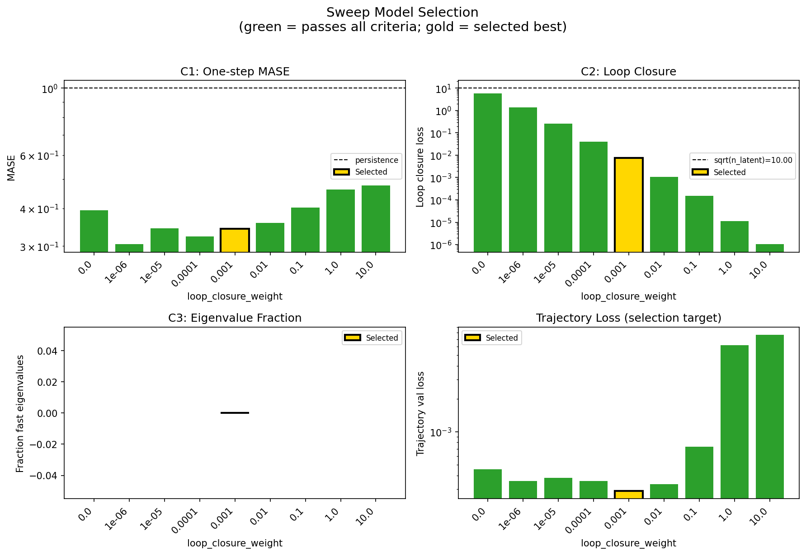
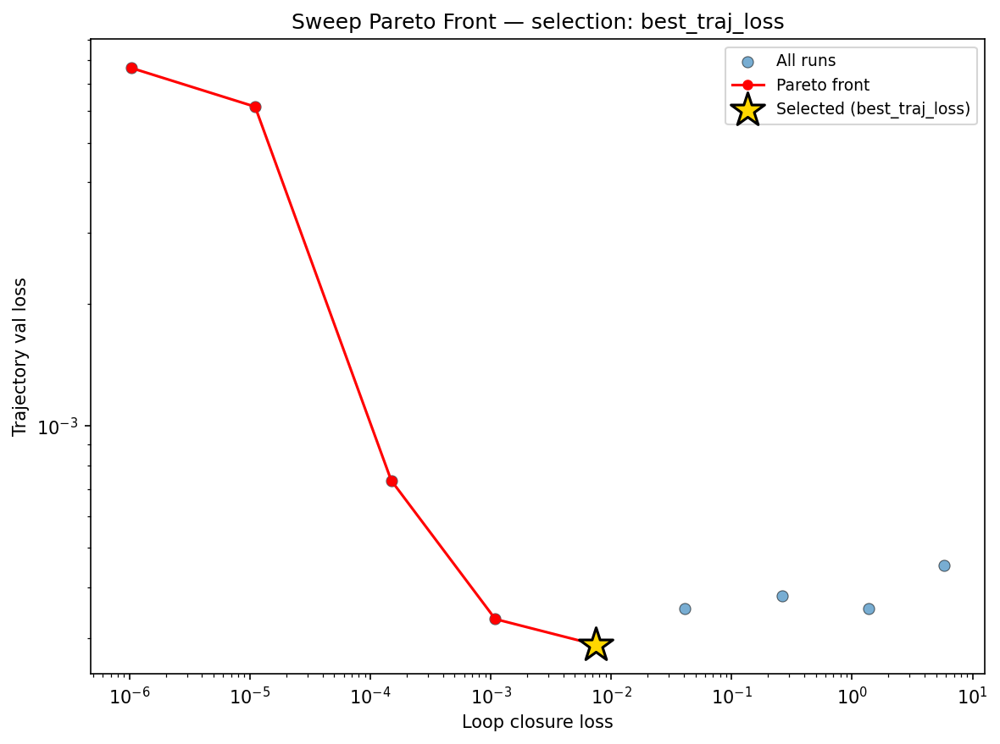
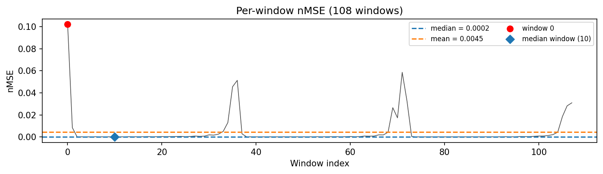
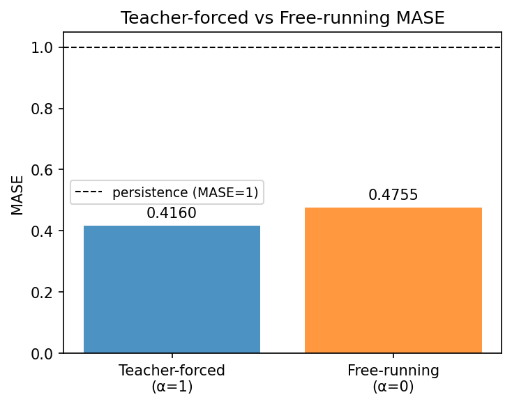
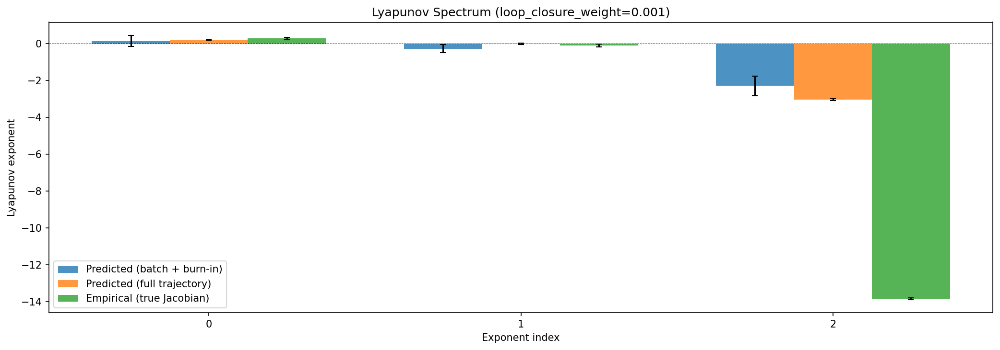
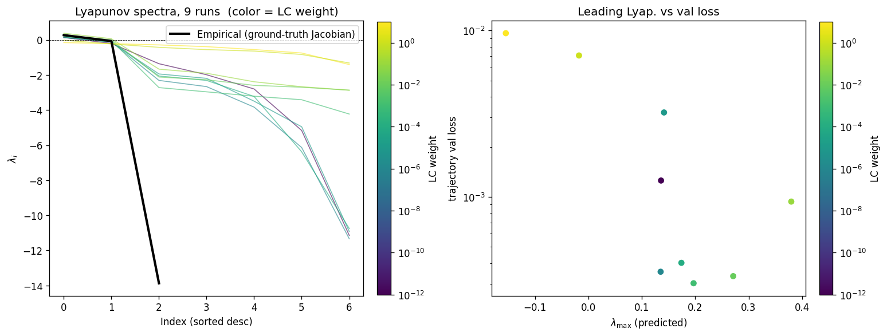
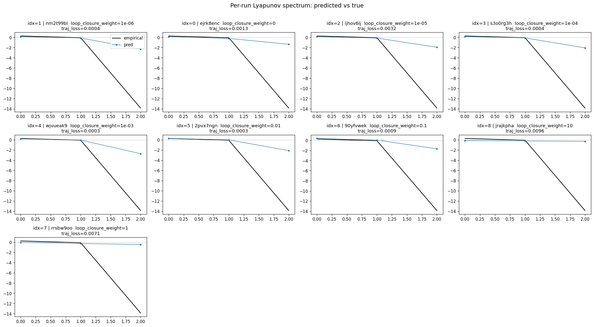
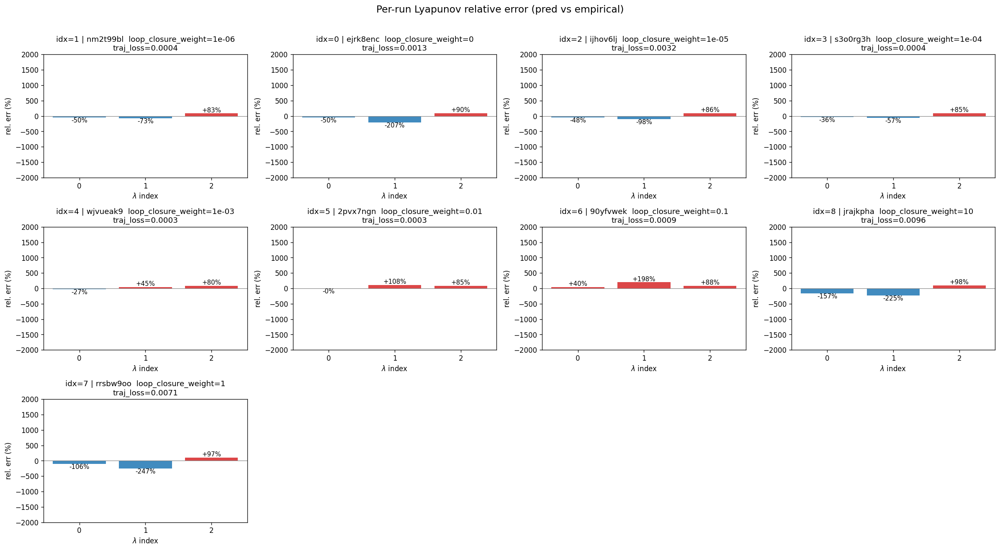
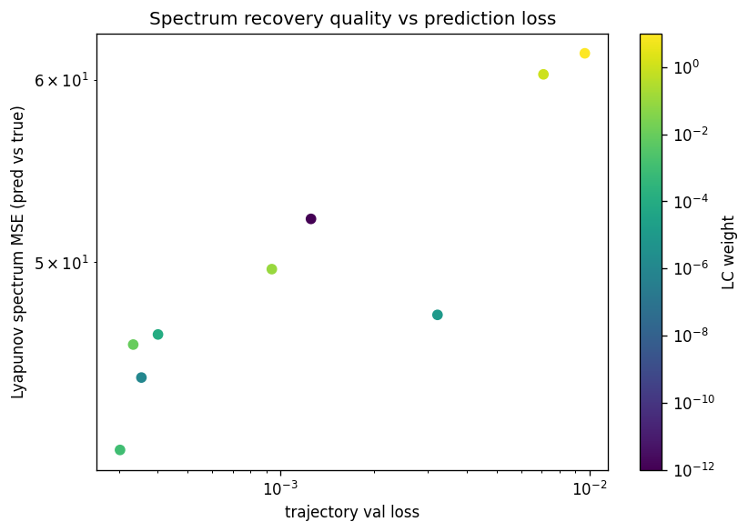

# Sweep Analysis: `lorenz_partial_100d_7lat_additive_mse_uniform_p30__lc_sweep`

**Project**: [Lorenz_INDpartial_N100_D1_NormTrue_T7__JacobianODE](https://wandb.ai/JacobianODE/Lorenz_INDpartial_N100_D1_NormTrue_T7__JacobianODE/groups/lorenz_partial_100d_7lat_additive_mse_uniform_p30__lc_sweep)  
**Launched**: 2026-04-15T15:47:20Z  
**Completed**: 2026-04-16T02:20:13Z  
**Outcome**: `complete_clean`  
**Git**: `latent-JacobianODE` @ `325ada0`  
**Expected runs**: 9

## Experiment Context

### `lorenz_partial_100d_7lat_additive_mse_uniform_p30`

**Description**

Same as lorenz_partial_100d_7lat_additive_mse_p30 except
reconstruction_mode='uniform' so training loss is scored on the
full 100-D delay-embedded state (val monitor still most_recent).

**Hypothesis**

100→7 with most_recent recon under-contracted the spectrum
(λ_min ≈ −6). Uniform recon forces z_dyn to be a proper Takens
chart of the attractor rather than just enough to reconstruct the
current frame, which should concentrate the real contraction into
a single axis (λ closer to empirical ~−14) and make the extra
transverse directions contract rapidly. Expected: best recovery
of the stable spectrum across all Lorenz partial sweeps to date.

**Success criteria**

- λ_min near empirical ~-14 at some LC
- Σλ_i within ~30% of empirical ~-13.7
- val/trajectory_r2 > 0.9 at best LC
- No loop-closure explosion under uniform training

## Results

**Overall best MASE**: 0.3847 (LC weight = 1.0e-06, obs_noise_scale = 0.00)
**Overall best traj loss**: 0.00035 at epoch 115.0
**Runs analyzed**: 9

### Best run per `obs_noise_scale`

| obs_noise_scale | Best LC weight | Best traj loss | MASE at best | R² | LC loss | epoch |
|---|---|---|---|---|---|---|
| 0.0 | 1.0e-03 | 0.00029 | 0.4231 | 0.9991 | 0.007 | 105.0 |

## Success-criteria verdicts (automated)

| Criterion | Verdict | Note |
|---|---|---|
| λ_min near empirical ~-14 at some LC | **Unknown** |  |
| Σλ_i within ~30% of empirical ~-13.7 | **Unknown** |  |
| val/trajectory_r2 > 0.9 at best LC | **Pass** | Best R² = 0.9989; threshold > 0.9 |
| No loop-closure explosion under uniform training | **Unknown** |  |

_Automated verdicts use simple numeric-threshold parsing and may mis-classify qualitative criteria. The Discussion section below takes precedence._

## Figures

### sweep_overview



### sweep_pareto



### prediction_windows



### mase



### lyapunov



### per_run_lyapunov



### per_run_lyapunov_vs_true



### per_run_lyapunov_relerr



### lyapunov_spectrum_mse_vs_val_loss



## Discussion

<!--
This section is intentionally left as a placeholder. A human reviewer
or Claude Code agent should fill it in based on the tables and figures
above, explicitly addressing each success criterion and comparing the
outcome to the stated hypothesis. Write the Discussion to
`discussion.md` in this directory and re-run `render_report`.
-->

_(to be written)_

## `run_analytics` stdout

<details><summary>Click to expand — full diagnostic output from <code>run_analytics</code></summary>

```
No run_id provided — selecting best run from group 'lorenz_partial_100d_7lat_additive_mse_uniform_p30__lc_sweep' ...
Found 9 total runs in JacobianODE/Lorenz_INDpartial_N100_D1_NormTrue_T7__JacobianODE (group=lorenz_partial_100d_7lat_additive_mse_uniform_p30__lc_sweep)
All runs (state, loop_closure_weight, tangent_entropy_weight, kl_dyn_weight):
  nm2t99bl: state=finished, lc=1e-06, te=0.0, kl_dyn=0.0
  ejrk8enc: state=finished, lc=0.0, te=0.0, kl_dyn=0.0
  ijhov6lj: state=finished, lc=1e-05, te=0.0, kl_dyn=0.0
  s3o0rg3h: state=finished, lc=0.0001, te=0.0, kl_dyn=0.0
  wjvueak9: state=finished, lc=0.001, te=0.0, kl_dyn=0.0
  2pvx7ngn: state=finished, lc=0.01, te=0.0, kl_dyn=0.0
  90yfvwek: state=finished, lc=0.1, te=0.0, kl_dyn=0.0
  jrajkpha: state=finished, lc=10.0, te=0.0, kl_dyn=0.0
  rrsbw9oo: state=finished, lc=1.0, te=0.0, kl_dyn=0.0

slurm_timeout_min not found in any run config — falling back to 180 min
  Including nm2t99bl (lc=1e-06): use_all_runs=True (state=finished)
  Including ejrk8enc (lc=0.0): use_all_runs=True (state=finished)
  Including ijhov6lj (lc=1e-05): use_all_runs=True (state=finished)
  Including s3o0rg3h (lc=0.0001): use_all_runs=True (state=finished)
  Including wjvueak9 (lc=0.001): use_all_runs=True (state=finished)
  Including 2pvx7ngn (lc=0.01): use_all_runs=True (state=finished)
  Including 90yfvwek (lc=0.1): use_all_runs=True (state=finished)
  Including jrajkpha (lc=10.0): use_all_runs=True (state=finished)
  Including rrsbw9oo (lc=1.0): use_all_runs=True (state=finished)
Found 9 effectively-done sweep runs:
  loop_closure_weight=0.0, tangent_entropy_weight=0.0, kl_dyn_weight=0.0 -> run_id=ejrk8enc
  loop_closure_weight=1e-06, tangent_entropy_weight=0.0, kl_dyn_weight=0.0 -> run_id=nm2t99bl
  loop_closure_weight=1e-05, tangent_entropy_weight=0.0, kl_dyn_weight=0.0 -> run_id=ijhov6lj
  loop_closure_weight=0.0001, tangent_entropy_weight=0.0, kl_dyn_weight=0.0 -> run_id=s3o0rg3h
  loop_closure_weight=0.001, tangent_entropy_weight=0.0, kl_dyn_weight=0.0 -> run_id=wjvueak9
  loop_closure_weight=0.01, tangent_entropy_weight=0.0, kl_dyn_weight=0.0 -> run_id=2pvx7ngn
  loop_closure_weight=0.1, tangent_entropy_weight=0.0, kl_dyn_weight=0.0 -> run_id=90yfvwek
  loop_closure_weight=1.0, tangent_entropy_weight=0.0, kl_dyn_weight=0.0 -> run_id=rrsbw9oo
  loop_closure_weight=10.0, tangent_entropy_weight=0.0, kl_dyn_weight=0.0 -> run_id=jrajkpha
n_dims=100, n_latent=100, n_dyn=7, dt=0.0150
  run=ejrk8enc: DiagnosticMetrics(one_step_mase=0.3939891755580902, loop_closure_loss=5.8523736000061035, fast_eigenvalue_fraction=0.0, trajectory_val_loss=0.00045378616778180003) (from W&B history)
  run=nm2t99bl: DiagnosticMetrics(one_step_mase=0.30418330430984497, loop_closure_loss=1.3726403713226318, fast_eigenvalue_fraction=0.0, trajectory_val_loss=0.0003549623943399638) (from W&B history)
  run=ijhov6lj: DiagnosticMetrics(one_step_mase=0.34294891357421875, loop_closure_loss=0.2624385356903076, fast_eigenvalue_fraction=0.0, trajectory_val_loss=0.00038046736153773963) (from W&B history)
  run=s3o0rg3h: DiagnosticMetrics(one_step_mase=0.3234316408634186, loop_closure_loss=0.040838275104761124, fast_eigenvalue_fraction=0.0, trajectory_val_loss=0.00035408249823376536) (from W&B history)
  run=wjvueak9: DiagnosticMetrics(one_step_mase=0.3427216708660126, loop_closure_loss=0.007480884902179241, fast_eigenvalue_fraction=0.0, trajectory_val_loss=0.0002885080757550895) (from W&B history)
  run=2pvx7ngn: DiagnosticMetrics(one_step_mase=0.3579673171043396, loop_closure_loss=0.0010897256433963776, fast_eigenvalue_fraction=0.0, trajectory_val_loss=0.0003339405229780823) (from W&B history)
  run=90yfvwek: DiagnosticMetrics(one_step_mase=0.40262487530708313, loop_closure_loss=0.0001488796842750162, fast_eigenvalue_fraction=0.0, trajectory_val_loss=0.0007343303877860308) (from W&B history)
  run=rrsbw9oo: DiagnosticMetrics(one_step_mase=0.4614239037036896, loop_closure_loss=1.1032963811885566e-05, fast_eigenvalue_fraction=0.0, trajectory_val_loss=0.006140285171568394) (from W&B history)
  run=jrajkpha: DiagnosticMetrics(one_step_mase=0.4762880504131317, loop_closure_loss=1.0337299727325444e-06, fast_eigenvalue_fraction=0.0, trajectory_val_loss=0.007653485983610153) (from W&B history)

Ranking method:           best_traj_loss
Best run ID:              wjvueak9
Best loop_closure_weight: 0.001
Best tangent_entropy_weight: 0.0
Best kl_dyn_weight:       0.0
Best traj loss:           0.000289
Criteria applied: ['C1', 'C2', 'C3']
Surviving: 9 / 9
Auto-selected run_id: wjvueak9

======================================================================
PARETO FRONTIER RUNS (5 runs)
======================================================================
  Run ID               LC Loss   Traj Val Loss
  ------------  --------------  --------------
  jrajkpha            0.000001        0.007653
  rrsbw9oo            0.000011        0.006140
  90yfvwek            0.000149        0.000734
  2pvx7ngn            0.001090        0.000334
  wjvueak9            0.007481        0.000289 <-- selected

======================================================================
RANKING METHOD COMPARISON (over 9 survivors)
======================================================================
  Method                  Run ID               LC Loss   Traj Val Loss
  ----------------------  ------------  --------------  --------------
  best_traj_loss          wjvueak9            0.007481        0.000289 <-- active
  pareto_knee             rrsbw9oo            0.000011        0.006140
  geo_rank                wjvueak9            0.007481        0.000289
  minimax_rank            2pvx7ngn            0.001090        0.000334
  geo_log_score           wjvueak9            0.007481        0.000289
  minimax_log_score       90yfvwek            0.000149        0.000734
======================================================================

Loading run wjvueak9 from JacobianODE/Lorenz_INDpartial_N100_D1_NormTrue_T7__JacobianODE ...
Train dataset shape: torch.Size([23232, 45, 100])
Validation dataset shape: torch.Size([7392, 45, 100])
Test dataset shape: torch.Size([3168, 45, 100])
Train trajectories dataset shape: torch.Size([22, 1101, 100])
Validation trajectories dataset shape: torch.Size([7, 1101, 100])
Test trajectories dataset shape: torch.Size([3, 1101, 100])
Loading checkpoint epoch=105-step=21200.ckpt...
Computing MASE ...
Teacher-forced MASE: 0.4160
Free-running MASE:   0.4755
Computing Lyapunov exponents ...
  Computing full-trajectory Lyapunov (3 test trajs, T=1101) ...
Predicted Lyapunov exponents (batch+burn-in, 128 windowed trajs):
  λ_1 = +0.1325 ± 0.3017
  λ_2 = -0.2804 ± 0.2243
  λ_3 = -2.3010 ± 0.5323
  λ_4 = -2.8840 ± 0.5599
  λ_5 = -3.0698 ± 0.4903
  λ_6 = -3.4350 ± 0.4706
  λ_7 = -4.7732 ± 0.7812
Predicted Lyapunov exponents (full-length, 3 test trajs):
  λ_1 = +0.1929 ± 0.0212
  λ_2 = -0.0227 ± 0.0424
  λ_3 = -3.0398 ± 0.0548
  λ_4 = -3.2985 ± 0.0663
  λ_5 = -3.3589 ± 0.0396
  λ_6 = -3.5051 ± 0.0178
  λ_7 = -4.6699 ± 0.1099
Empirical Lyapunov exponents (mean ± std):
  λ_1 = +0.2716 ± 0.0605
  λ_2 = -0.1016 ± 0.0797
  λ_3 = -13.8370 ± 0.0514
Computing prediction windows ...
Windows: 108 — nMSE min=0.0001, median=0.0002, mean=0.0045, max=0.1021
```

</details>
