# Sweep Analysis: `lorenz_partial_100d_7lat_additive_mse_uniform_p30_obsnoise001__lc_sweep`

**Project**: [Lorenz_INDpartial_N100_D1_NormTrue_T7__JacobianODE](https://wandb.ai/JacobianODE/Lorenz_INDpartial_N100_D1_NormTrue_T7__JacobianODE/groups/lorenz_partial_100d_7lat_additive_mse_uniform_p30_obsnoise001__lc_sweep)  
**Launched**: 2026-04-16T14:35:39Z  
**Completed**: 2026-04-16T21:30:17Z  
**Outcome**: `complete_clean`  
**Git**: `latent-JacobianODE` @ `aefbe37`  
**Expected runs**: 9

## Experiment Context

### `lorenz_partial_100d_7lat_additive_mse_uniform_p30`

**Description**

Same as lorenz_partial_100d_7lat_additive_mse_p30 except
reconstruction_mode='uniform' so training loss is scored on the
full 100-D delay-embedded state (val monitor still most_recent).

**Hypothesis**

100→7 with most_recent recon under-contracted the spectrum
(λ_min ≈ −6). Uniform recon forces z_dyn to be a proper Takens
chart of the attractor rather than just enough to reconstruct the
current frame, which should concentrate the real contraction into
a single axis (λ closer to empirical ~−14) and make the extra
transverse directions contract rapidly. Expected: best recovery
of the stable spectrum across all Lorenz partial sweeps to date.

**Success criteria**

- λ_min near empirical ~-14 at some LC
- Σλ_i within ~30% of empirical ~-13.7
- val/trajectory_r2 > 0.9 at best LC
- No loop-closure explosion under uniform training

## Results

**Swept axes** (1): `training.lightning.loop_closure_weight`

**Chosen run** (by `best_traj_loss`): `0s9x4c7x` — traj_loss=0.00124, MASE=0.7696, R²=0.9966, LC loss=0.125, epoch=113.0

Swept-axis values at chosen run: `training.lightning.loop_closure_weight`=1.0e-04

**Runs analyzed**: 9 (expected 9)

### Per-run results

| run_idx | run_id | `training.lightning.loop_closure_weight` | best_traj_loss | best_MASE | R² | LC loss | epoch |
|---|---|---|---|---|---|---|---|
| 3 | `0s9x4c7x` | 1.0e-04 | 0.00124 | 0.7696 | 0.9966 | 0.125 | 113.0 |
| 2 | `yeik8qyi` | 1.0e-05 | 0.00129 | 0.8237 | 0.9965 | 0.702 | 96.0 |
| 4 | `if4guozf` | 0.001 | 0.00129 | 0.7606 | 0.9964 | 0.021 | 89.0 |
| 0 | `e67bpprk` | 0 | 0.00132 | 0.8151 | 0.9964 | 7.458 | 104.0 |
| 1 | `uhv7bm3m` | 1.0e-06 | 0.00133 | 0.8254 | 0.9964 | 2.760 | 104.0 |
| 5 | `lkqxvwes` | 0.01 | 0.00145 | 0.8095 | 0.9959 | 0.004 | 113.0 |
| 6 | `nx14pp22` | 0.1 | 0.00228 | 0.9426 | 0.9937 | 0.001 | 113.0 |
| 7 | `p59phq8k` | 1 | 0.00866 | 1.7345 | 0.9766 | 0.000 | 102.0 |
| 8 | `4qnc6ffg` | 10 | 0.00888 | 1.6733 | 0.9759 | 0.000 | 148.0 |

## Success-criteria verdicts (automated)

| Criterion | Verdict | Note |
|---|---|---|
| λ_min near empirical ~-14 at some LC | **Unknown** |  |
| Σλ_i within ~30% of empirical ~-13.7 | **Unknown** |  |
| val/trajectory_r2 > 0.9 at best LC | **Pass** | Best R² = 0.9966; threshold > 0.9 |
| No loop-closure explosion under uniform training | **Unknown** |  |

_Automated verdicts use simple numeric-threshold parsing and may mis-classify qualitative criteria. The Discussion section below takes precedence._

## Figures

### sweep_overview

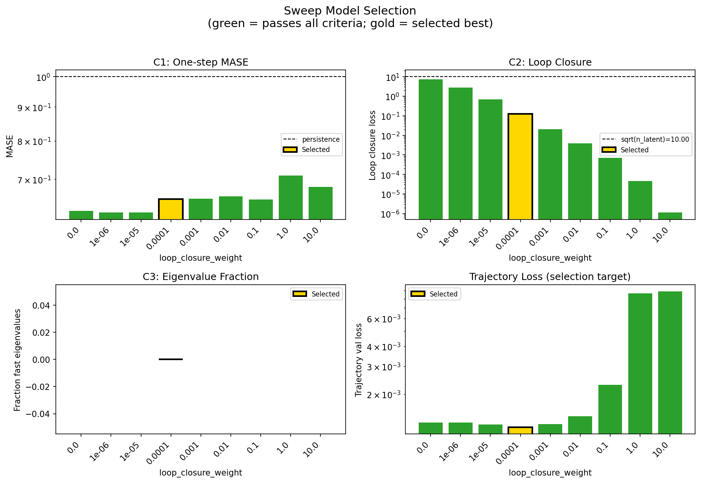

### sweep_pareto

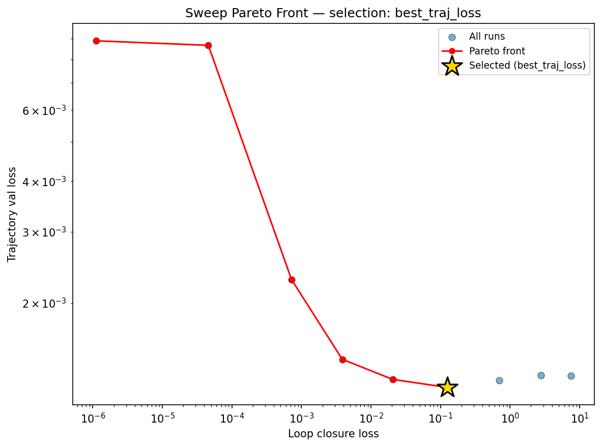

### reconstruction

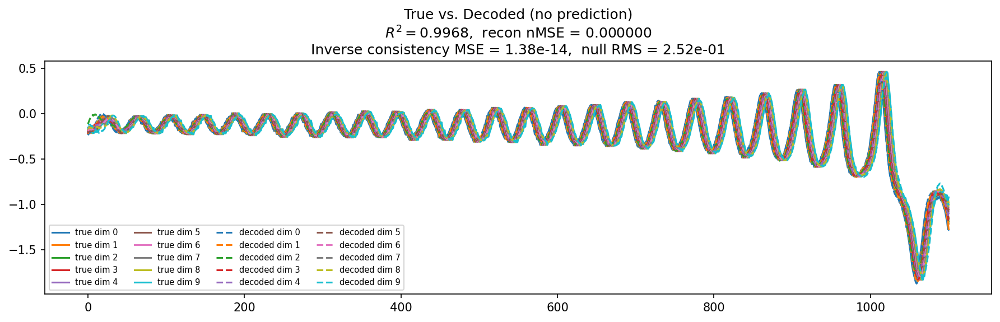

### prediction_windows

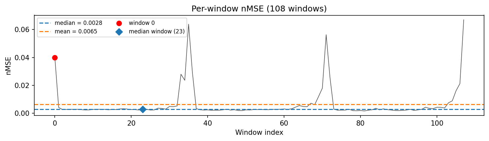

### long_trajectory

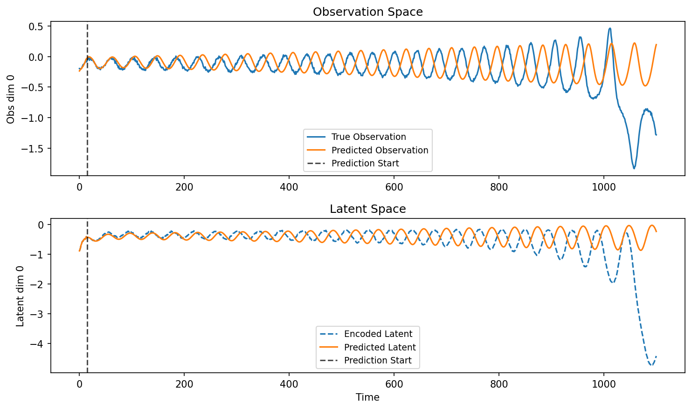

### mase

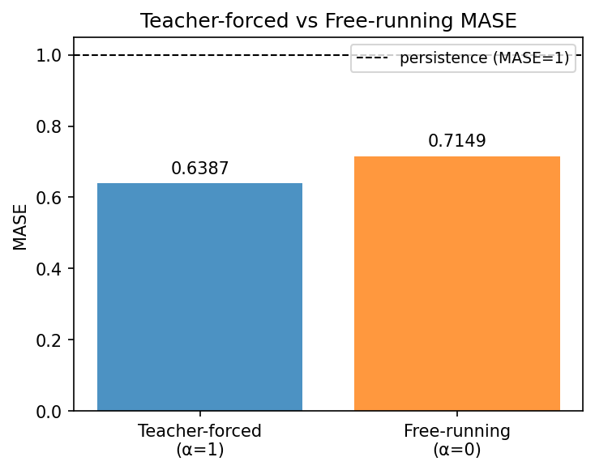

### latent_utilization

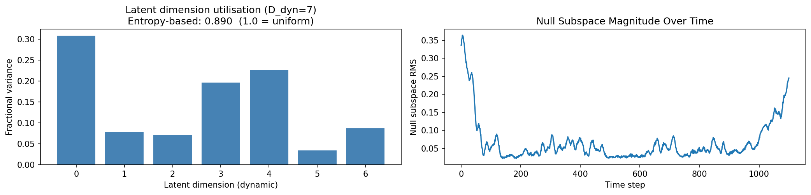

### lyapunov

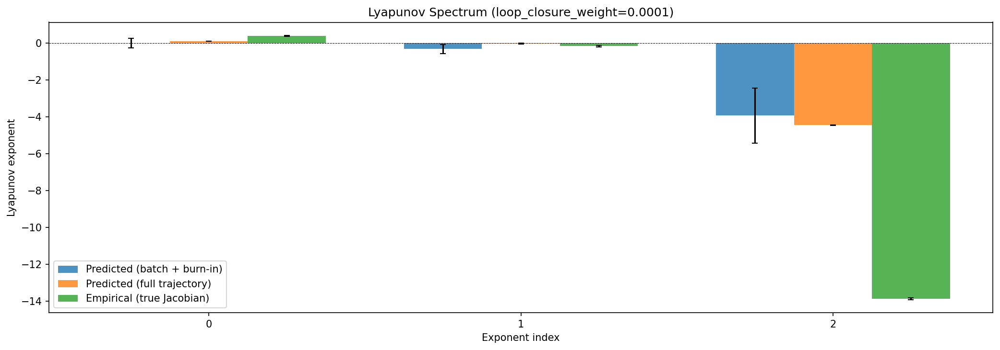

### kaplan_yorke

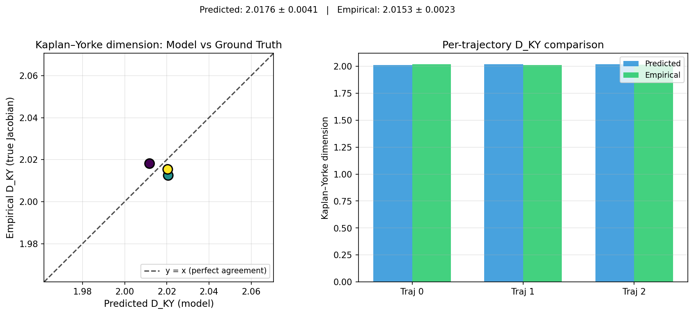

### per_run_lyapunov

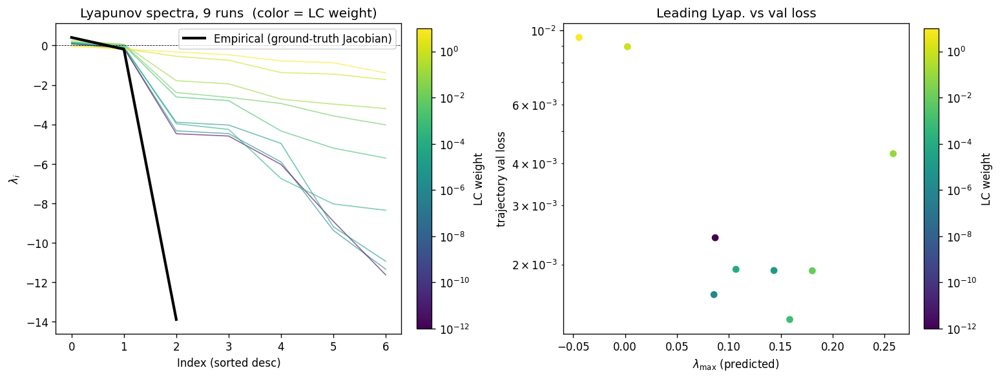

### per_run_lyapunov_vs_true

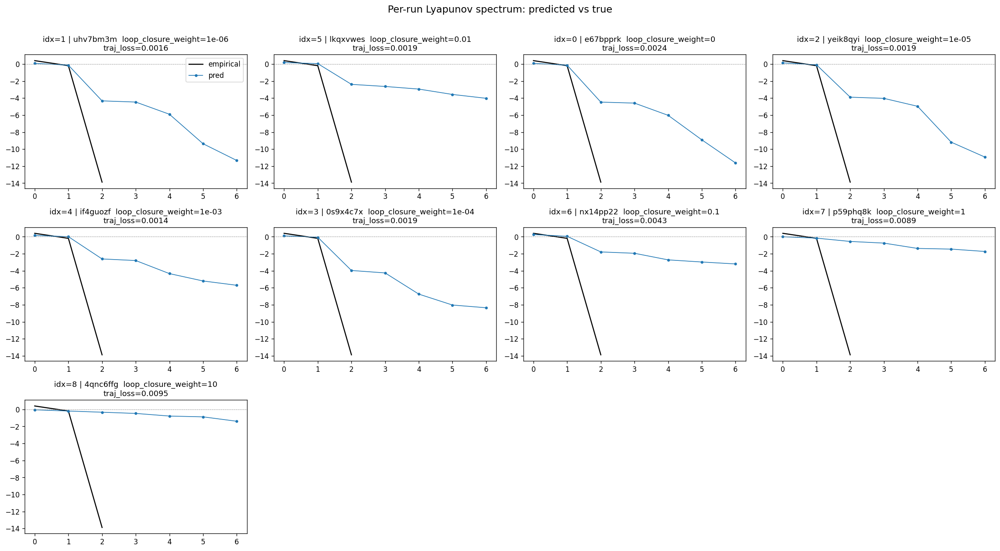

### per_run_lyapunov_relerr

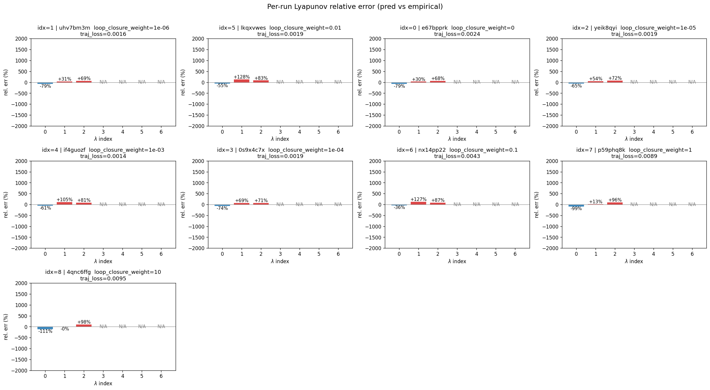

### encoder_decoder_jacobians

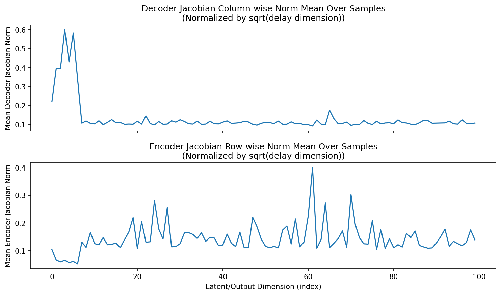

### amplification

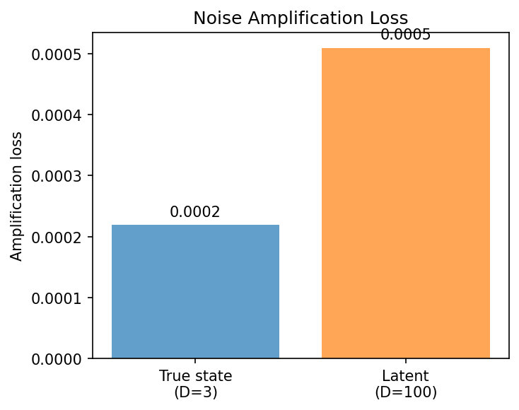

### kaplan_yorke_pca

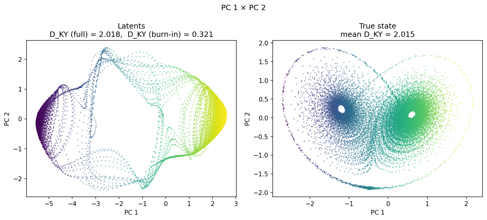

### prediction_detail_latent

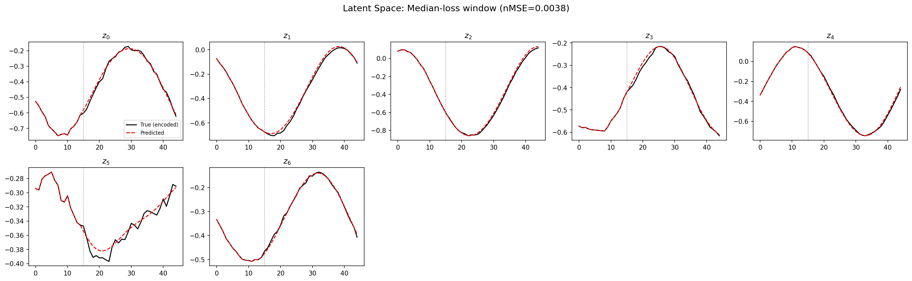

### prediction_detail_obs

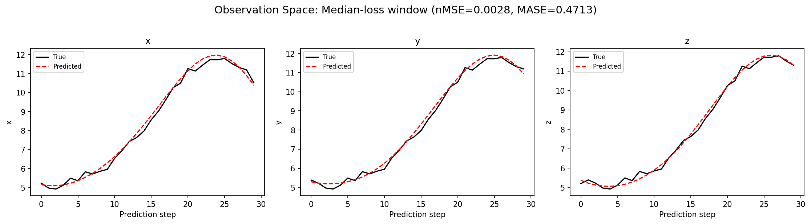

## Discussion

<!--
This section is intentionally left as a placeholder. A human reviewer
or Claude Code agent should fill it in based on the tables and figures
above, explicitly addressing each success criterion and comparing the
outcome to the stated hypothesis. Write the Discussion to
`discussion.md` in this directory and re-run `render_report`.
-->

_(to be written)_

## `run_analytics` stdout

<details><summary>Click to expand — full diagnostic output from <code>run_analytics</code></summary>

```
No run_id provided — selecting best run from group 'lorenz_partial_100d_7lat_additive_mse_uniform_p30_obsnoise001__lc_sweep' ...
Found 9 total runs in JacobianODE/Lorenz_INDpartial_N100_D1_NormTrue_T7__JacobianODE (group=lorenz_partial_100d_7lat_additive_mse_uniform_p30_obsnoise001__lc_sweep)
All runs (state, loop_closure_weight, tangent_entropy_weight, kl_dyn_weight):
  uhv7bm3m: state=finished, lc=1e-06, te=0.0, kl_dyn=0.0
  lkqxvwes: state=finished, lc=0.01, te=0.0, kl_dyn=0.0
  e67bpprk: state=finished, lc=0.0, te=0.0, kl_dyn=0.0
  yeik8qyi: state=finished, lc=1e-05, te=0.0, kl_dyn=0.0
  if4guozf: state=finished, lc=0.001, te=0.0, kl_dyn=0.0
  0s9x4c7x: state=finished, lc=0.0001, te=0.0, kl_dyn=0.0
  nx14pp22: state=finished, lc=0.1, te=0.0, kl_dyn=0.0
  p59phq8k: state=finished, lc=1.0, te=0.0, kl_dyn=0.0
  4qnc6ffg: state=finished, lc=10.0, te=0.0, kl_dyn=0.0

slurm_timeout_min not found in any run config — falling back to 180 min
  Including uhv7bm3m (lc=1e-06): use_all_runs=True (state=finished)
  Including lkqxvwes (lc=0.01): use_all_runs=True (state=finished)
  Including e67bpprk (lc=0.0): use_all_runs=True (state=finished)
  Including yeik8qyi (lc=1e-05): use_all_runs=True (state=finished)
  Including if4guozf (lc=0.001): use_all_runs=True (state=finished)
  Including 0s9x4c7x (lc=0.0001): use_all_runs=True (state=finished)
  Including nx14pp22 (lc=0.1): use_all_runs=True (state=finished)
  Including p59phq8k (lc=1.0): use_all_runs=True (state=finished)
  Including 4qnc6ffg (lc=10.0): use_all_runs=True (state=finished)
Found 9 effectively-done sweep runs:
  loop_closure_weight=0.0, tangent_entropy_weight=0.0, kl_dyn_weight=0.0 -> run_id=e67bpprk
  loop_closure_weight=1e-06, tangent_entropy_weight=0.0, kl_dyn_weight=0.0 -> run_id=uhv7bm3m
  loop_closure_weight=1e-05, tangent_entropy_weight=0.0, kl_dyn_weight=0.0 -> run_id=yeik8qyi
  loop_closure_weight=0.0001, tangent_entropy_weight=0.0, kl_dyn_weight=0.0 -> run_id=0s9x4c7x
  loop_closure_weight=0.001, tangent_entropy_weight=0.0, kl_dyn_weight=0.0 -> run_id=if4guozf
  loop_closure_weight=0.01, tangent_entropy_weight=0.0, kl_dyn_weight=0.0 -> run_id=lkqxvwes
  loop_closure_weight=0.1, tangent_entropy_weight=0.0, kl_dyn_weight=0.0 -> run_id=nx14pp22
  loop_closure_weight=1.0, tangent_entropy_weight=0.0, kl_dyn_weight=0.0 -> run_id=p59phq8k
  loop_closure_weight=10.0, tangent_entropy_weight=0.0, kl_dyn_weight=0.0 -> run_id=4qnc6ffg
n_dims=100, n_latent=100, n_dyn=7, dt=0.0150
  run=e67bpprk: DiagnosticMetrics(one_step_mase=0.6273157596588135, loop_closure_loss=7.45751953125, fast_eigenvalue_fraction=0.0, trajectory_val_loss=0.00132189248688519) (from cache, n_batches=100)
  run=uhv7bm3m: DiagnosticMetrics(one_step_mase=0.6239482164382935, loop_closure_loss=2.760481357574463, fast_eigenvalue_fraction=0.0, trajectory_val_loss=0.0013255274388939142) (from cache, n_batches=100)
  run=yeik8qyi: DiagnosticMetrics(one_step_mase=0.6232653856277466, loop_closure_loss=0.7018495202064514, fast_eigenvalue_fraction=0.0, trajectory_val_loss=0.0012855890672653913) (from cache, n_batches=100)
  run=0s9x4c7x: DiagnosticMetrics(one_step_mase=0.6532276272773743, loop_closure_loss=0.1253618746995926, fast_eigenvalue_fraction=0.0, trajectory_val_loss=0.0012366055743768811) (from cache, n_batches=100)
  run=if4guozf: DiagnosticMetrics(one_step_mase=0.6544821858406067, loop_closure_loss=0.020569054409861565, fast_eigenvalue_fraction=0.0, trajectory_val_loss=0.0012942408211529255) (from cache, n_batches=100)
  run=lkqxvwes: DiagnosticMetrics(one_step_mase=0.6592742800712585, loop_closure_loss=0.0038593243807554245, fast_eigenvalue_fraction=0.0, trajectory_val_loss=0.0014511931221932173) (from cache, n_batches=100)
  run=nx14pp22: DiagnosticMetrics(one_step_mase=0.6523944139480591, loop_closure_loss=0.000719482428394258, fast_eigenvalue_fraction=0.0, trajectory_val_loss=0.002284906804561615) (from cache, n_batches=100)
  run=p59phq8k: DiagnosticMetrics(one_step_mase=0.7089461088180542, loop_closure_loss=4.580683526000939e-05, fast_eigenvalue_fraction=0.0, trajectory_val_loss=0.008659649640321732) (from cache, n_batches=100)
  run=4qnc6ffg: DiagnosticMetrics(one_step_mase=0.6812399625778198, loop_closure_loss=1.119154148909729e-06, fast_eigenvalue_fraction=0.0, trajectory_val_loss=0.008884234353899956) (from cache, n_batches=100)

Ranking method:           best_traj_loss
Best run ID:              0s9x4c7x
Best loop_closure_weight: 0.0001
Best tangent_entropy_weight: 0.0
Best kl_dyn_weight:       0.0
Best traj loss:           0.001237
Criteria applied: ['C1', 'C2', 'C3']
Surviving: 9 / 9
Auto-selected run_id: 0s9x4c7x

======================================================================
PARETO FRONTIER RUNS (6 runs)
======================================================================
  Run ID               LC Loss   Traj Val Loss
  ------------  --------------  --------------
  4qnc6ffg            0.000001        0.008884
  p59phq8k            0.000046        0.008660
  nx14pp22            0.000719        0.002285
  lkqxvwes            0.003859        0.001451
  if4guozf            0.020569        0.001294
  0s9x4c7x            0.125362        0.001237 <-- selected

======================================================================
RANKING METHOD COMPARISON (over 9 survivors)
======================================================================
  Method                  Run ID               LC Loss   Traj Val Loss
  ----------------------  ------------  --------------  --------------
  best_traj_loss          0s9x4c7x            0.125362        0.001237 <-- active
  pareto_knee             p59phq8k            0.000046        0.008660
  geo_rank                0s9x4c7x            0.125362        0.001237
  minimax_rank            if4guozf            0.020569        0.001294
  geo_log_score           0s9x4c7x            0.125362        0.001237
  minimax_log_score       nx14pp22            0.000719        0.002285
======================================================================

Loading run 0s9x4c7x from JacobianODE/Lorenz_INDpartial_N100_D1_NormTrue_T7__JacobianODE ...
Train dataset shape: torch.Size([23232, 45, 100])
Validation dataset shape: torch.Size([7392, 45, 100])
Test dataset shape: torch.Size([3168, 45, 100])
Train trajectories dataset shape: torch.Size([22, 1101, 100])
Validation trajectories dataset shape: torch.Size([7, 1101, 100])
Test trajectories dataset shape: torch.Size([3, 1101, 100])
Loading checkpoint epoch=113-step=22800.ckpt...
Computing reconstruction ...
Computing MASE ...
Teacher-forced MASE: 0.6387
Free-running MASE:   0.7149
Computing latent utilization ...
Entropy-based utilization: 0.890
Null subspace mean RMS: 8.696616e-02
Computing Lyapunov exponents ...
  Computing full-trajectory Lyapunov (3 test trajs, T=1101) ...
Predicted Lyapunov exponents (batch+burn-in, 128 windowed trajs):
  λ_1 = -0.0061 ± 0.2686
  λ_2 = -0.3277 ± 0.2473
  λ_3 = -3.9406 ± 1.4892
  λ_4 = -4.4484 ± 1.3738
  λ_5 = -6.4211 ± 2.4525
  λ_6 = -7.5671 ± 2.0262
  λ_7 = -8.7322 ± 1.8105
Predicted Lyapunov exponents (full-length, 3 test trajs):
  λ_1 = +0.1041 ± 0.0037
  λ_2 = -0.0255 ± 0.0192
  λ_3 = -4.4541 ± 0.0184
  λ_4 = -4.7296 ± 0.0189
  λ_5 = -7.3714 ± 0.0637
  λ_6 = -8.4354 ± 0.0942
  λ_7 = -8.8136 ± 0.1120
Empirical Lyapunov exponents (mean ± std):
  λ_1 = +0.3846 ± 0.0251
  λ_2 = -0.1716 ± 0.0444
  λ_3 = -13.8799 ± 0.0398
Mean KY dim (predicted): 2.018 ± 0.004
Mean KY dim (empirical): 2.015 ± 0.002
Mean KY dim (burn-in):   0.321 ± 0.665
Computing prediction windows ...
Windows: 108 — nMSE min=0.0017, median=0.0028, mean=0.0065, max=0.0670
Computing long trajectory prediction ...
Computing encoder/decoder Jacobians ...
encoder_jacobian: (128, 100, 100)
decoder_jacobian: (128, 100, 100)
Computing amplification loss ...
Amplification loss — True state: 0.000219
Amplification loss — Latent:     0.000510
```

</details>
