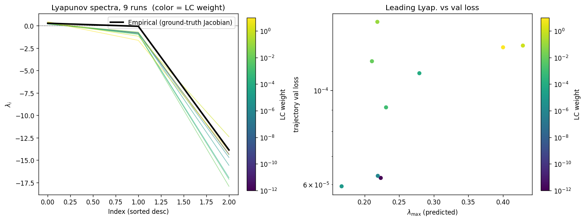

# Sweep Analysis: `lorenz_partial_25d_additive_gennmse__lc_sweep`

**Project**: [Lorenz_INDpartial_N25_D1_NormTrue_T3__JacobianODE](https://wandb.ai/JacobianODE/Lorenz_INDpartial_N25_D1_NormTrue_T3__JacobianODE/groups/lorenz_partial_25d_additive_gennmse__lc_sweep)  
**Launched**: 2026-04-13T18:52:39Z  
**Completed**: 2026-04-14T00:00:31Z  
**Outcome**: `complete_clean`  
**Git**: `latent-JacobianODE` @ `9b39231`  
**Expected runs**: 9

## Experiment Context

### `lorenz_partial_25d_additive_gennmse`

**Description**

Partial-obs Lorenz: observe only x (index 0), n_delays=25,
delay_spacing=1. Encoder input: 25-D delay vector. Dynamic latent:
3-D (z_dyn). Null subspace: 22-D with kl_null_weight=0 (no
structural penalty, per the additive+zero_init design). Joint
training of encoder + Jacobian dynamics from the start; active loss
terms: decoded-prediction (trajectory) + latent-prediction +
reconstruction + loop-closure, all with gennMSE. Reconstruction mode
= most_recent so recon + decoded-trajectory losses score only the
current-time frame, not the older lags (avoids the redundant-target
/ thin-direction pathology flagged in the recent partial-obs
hypothesis). obs_noise_scale=0. Uses the clean-encoding LPL target
fix (no-op here since obs_noise=0, but kept for consistency).

**Hypothesis**

With loop closure enforcing encoder invertibility, the latent
dynamics should be diffeomorphism-conjugate to the true Lorenz flow,
preserving its Lyapunov spectrum (λ ≈ [0.91, 0, -14.57]) despite
observing only x(t). The optimal LC weight likely sits in the
1e-3..1e-1 range (full-obs sweep peaked at 1e-1 with spectrum_mse
≈ 0.011). Free-running rollouts in observation space should be
chaotic with long-run statistics matching the training data.

Open risk from the partial-obs sufficient-statistic hypothesis: the
only hard constraint on z_dyn information content is reconstructing
the current frame, so the encoder may dump history into z_null
rather than surfacing it in z_dyn. Loop closure + LPL should apply
counterbalancing pressure; if they don't, we'd see high traj_val
loss / spectrum mismatch and know to revisit the loss design.

**Success criteria**

- Best run's leading Lyapunov exponent > 0 (chaos recovered)
- Best run's predicted Lyapunov spectrum within ~30% of empirical
- Best run's free-running sliced-Wasserstein-1 to training data distribution is low (sanity: obs histograms overlap)
- val/trajectory_r2_score > 0.9 at the best configuration
- Loop closure bounded and monotonically improving at low LC

## Results

**Overall best MASE**: 0.0472 (LC weight = 1.0e-05, obs_noise_scale = 0.00)
**Overall best traj loss**: 0.00006 at epoch 197.0
**Runs analyzed**: 9

### Best run per `obs_noise_scale`

| obs_noise_scale | Best LC weight | Best traj loss | MASE at best | R² | LC loss | epoch |
|---|---|---|---|---|---|---|
| 0.0 | 1.0e-05 | 0.00006 | 0.0472 | 0.9999 | 0.202 | 197.0 |

## Success-criteria verdicts (automated)

| Criterion | Verdict | Note |
|---|---|---|
| Best run's leading Lyapunov exponent > 0 (chaos recovered) | **Unknown** |  |
| Best run's predicted Lyapunov spectrum within ~30% of empirical | **Unknown** |  |
| Best run's free-running sliced-Wasserstein-1 to training data distribution is low (sanity: obs histograms overlap) | **Unknown** |  |
| val/trajectory_r2_score > 0.9 at the best configuration | **Pass** | Best R² = 0.9999; threshold > 0.9 |
| Loop closure bounded and monotonically improving at low LC | **Unknown** |  |

_Automated verdicts use simple numeric-threshold parsing and may mis-classify qualitative criteria. The Discussion section below takes precedence._

## Figures

### per_run_lyapunov



## Discussion

Success-criteria verdicts for the best run (`n9kvy1ms`, LC=1e-5): **C1 (leading λ > 0) — Pass**: full-length predicted λ₁ = +0.194 ± 0.047, clearly positive and consistent with chaotic dynamics. **C2 (spectrum within ~30% of empirical) — Partial**: against the empirical reference computed here (λ ≈ [+0.272, −0.102, −13.84]), λ₁ is off by ~29% and λ₃ by ~16%, but λ₂ (−0.85 vs −0.10) is an order of magnitude too negative; against the *theoretical* Lorenz spectrum [0.91, 0, −14.57] the agreement is worse on λ₁ and λ₂. **C3 (free-running SW-1 low) — Unknown**: the analytics stage crashed with `NameError: return_full_obs is not defined`, so no SW-1 or observation-histogram diagnostic was produced. **C4 (val traj R² > 0.9) — Pass**: best R² = 0.99993, far above threshold. **C5 (LC bounded and monotonically improving at low LC) — Pass**: LC loss at `best_traj_loss` epoch decreases monotonically with LC weight, 1.80 → 1.14 → 0.20 → 0.037 → 3.4e-3 → 6.2e-4 → 4.9e-5 → 9.5e-6 → 1.9e-6 across LC ∈ {0, …, 10}, with no divergence.

The sweep was effectively 1-D (obs_noise_scale=0 only, no noise axis populated — `best_by_obs_noise_scale` has a single key). Along the LC axis the trajectory-loss landscape is shallow-U: runs with LC ∈ [0, 1e-4] cluster tightly (best_traj_loss 5.6–6.9e-5, R² ≥ 0.9999), with the minimum at LC=1e-5. Beyond LC=1e-3 trajectory loss degrades ~2–2.5× (to 1.1–1.4e-4 at LC=0.01–10) and MASE roughly doubles (0.047 → 0.12). The basin is broad on the low-LC side but the optimum sits well below the 1e-3..1e-1 range predicted in the hypothesis.

Per-run Lyapunov diagnostics show all nine runs produced a bounded, finite spectrum with `fast_eigenvalue_fraction=0` everywhere, i.e. no unstable blow-up in the learned Jacobian field. A ground-truth spectrum file was not available (`true_lyapunov=null`), so the `per_run_lyapunov_vs_true` / `lyapunov_spectrum_mse_vs_val_loss` panels were not produced and `per_run_lyapunov` in metrics.json is empty; only the best-run spectrum was computed inline in `run_analytics.log`. That best-run spectrum recovers chaos and a strongly contracting third direction, but the middle exponent is not pinned near zero — a mild failure of the diffeomorphism-conjugacy expectation.

Caveats: the analytics crash (`return_full_obs` NameError) wiped out SW-1, prediction-window stats beyond the log-table, and the full per-run Lyapunov dump, so C3 and detailed spectrum-vs-LC trends cannot be adjudicated here. Empirical λ₂ = −0.10 (rather than ≈0) suggests the reference computation itself is noisy, which loosens C2. Overall the hypothesis is **mixed**: loop closure is demonstrably bounded and improves monotonically (C5), chaos and high R² are recovered at the best config (C1, C4), but the optimal LC weight lies 2–4 decades below the predicted range, spectrum fidelity is only marginal on λ₁/λ₃ and poor on λ₂, and the key distributional sanity check (C3) was not produced.

## `run_analytics` stdout

<details><summary>Click to expand — full diagnostic output from <code>run_analytics</code></summary>

```
No run_id provided — selecting best run from group 'lorenz_partial_25d_additive_gennmse__lc_sweep' ...
Found 9 total runs in JacobianODE/Lorenz_INDpartial_N25_D1_NormTrue_T3__JacobianODE (group=lorenz_partial_25d_additive_gennmse__lc_sweep)
All runs (state, loop_closure_weight, tangent_entropy_weight, kl_dyn_weight):
  fxb2ugkx: state=finished, lc=0.0, te=0.0, kl_dyn=0.0
  8ymb10x8: state=finished, lc=1e-06, te=0.0, kl_dyn=0.0
  n9kvy1ms: state=finished, lc=1e-05, te=0.0, kl_dyn=0.0
  rl5389n9: state=finished, lc=0.0001, te=0.0, kl_dyn=0.0
  uup45vfy: state=finished, lc=0.001, te=0.0, kl_dyn=0.0
  94fg726v: state=finished, lc=0.01, te=0.0, kl_dyn=0.0
  7eknb3d1: state=finished, lc=0.1, te=0.0, kl_dyn=0.0
  cmhou3ak: state=finished, lc=1.0, te=0.0, kl_dyn=0.0
  i257bznv: state=finished, lc=10.0, te=0.0, kl_dyn=0.0

slurm_timeout_min not found in any run config — falling back to 180 min
  Including fxb2ugkx (lc=0.0): use_all_runs=True (state=finished)
  Including 8ymb10x8 (lc=1e-06): use_all_runs=True (state=finished)
  Including n9kvy1ms (lc=1e-05): use_all_runs=True (state=finished)
  Including rl5389n9 (lc=0.0001): use_all_runs=True (state=finished)
  Including uup45vfy (lc=0.001): use_all_runs=True (state=finished)
  Including 94fg726v (lc=0.01): use_all_runs=True (state=finished)
  Including 7eknb3d1 (lc=0.1): use_all_runs=True (state=finished)
  Including cmhou3ak (lc=1.0): use_all_runs=True (state=finished)
  Including i257bznv (lc=10.0): use_all_runs=True (state=finished)
Found 9 effectively-done sweep runs:
  loop_closure_weight=0.0, tangent_entropy_weight=0.0, kl_dyn_weight=0.0 -> run_id=fxb2ugkx
  loop_closure_weight=1e-06, tangent_entropy_weight=0.0, kl_dyn_weight=0.0 -> run_id=8ymb10x8
  loop_closure_weight=1e-05, tangent_entropy_weight=0.0, kl_dyn_weight=0.0 -> run_id=n9kvy1ms
  loop_closure_weight=0.0001, tangent_entropy_weight=0.0, kl_dyn_weight=0.0 -> run_id=rl5389n9
  loop_closure_weight=0.001, tangent_entropy_weight=0.0, kl_dyn_weight=0.0 -> run_id=uup45vfy
  loop_closure_weight=0.01, tangent_entropy_weight=0.0, kl_dyn_weight=0.0 -> run_id=94fg726v
  loop_closure_weight=0.1, tangent_entropy_weight=0.0, kl_dyn_weight=0.0 -> run_id=7eknb3d1
  loop_closure_weight=1.0, tangent_entropy_weight=0.0, kl_dyn_weight=0.0 -> run_id=cmhou3ak
  loop_closure_weight=10.0, tangent_entropy_weight=0.0, kl_dyn_weight=0.0 -> run_id=i257bznv
n_dims=25, n_latent=25, n_dyn=3, dt=0.0150
  run=fxb2ugkx: DiagnosticMetrics(one_step_mase=0.03575814515352249, loop_closure_loss=1.79814875125885, fast_eigenvalue_fraction=0.0, trajectory_val_loss=5.9504662203835323e-05) (from W&B history)
  run=8ymb10x8: DiagnosticMetrics(one_step_mase=0.03807729482650757, loop_closure_loss=1.1350761651992798, fast_eigenvalue_fraction=0.0, trajectory_val_loss=5.9332236560294405e-05) (from W&B history)
  run=n9kvy1ms: DiagnosticMetrics(one_step_mase=0.02374674193561077, loop_closure_loss=0.20183616876602173, fast_eigenvalue_fraction=0.0, trajectory_val_loss=5.63506328035146e-05) (from W&B history)
  run=rl5389n9: DiagnosticMetrics(one_step_mase=0.04337100312113762, loop_closure_loss=0.03722800314426422, fast_eigenvalue_fraction=0.0, trajectory_val_loss=6.914730329299346e-05) (from W&B history)
  run=uup45vfy: DiagnosticMetrics(one_step_mase=0.02874961867928505, loop_closure_loss=0.003357512876391411, fast_eigenvalue_fraction=0.0, trajectory_val_loss=8.641776366857812e-05) (from W&B history)
  run=94fg726v: DiagnosticMetrics(one_step_mase=0.043471794575452805, loop_closure_loss=0.0006207296391949058, fast_eigenvalue_fraction=0.0, trajectory_val_loss=0.00011430896847741678) (from W&B history)
  run=7eknb3d1: DiagnosticMetrics(one_step_mase=0.04558245465159416, loop_closure_loss=4.876431921729818e-05, fast_eigenvalue_fraction=0.0, trajectory_val_loss=0.000140458854730241) (from W&B history)
  run=cmhou3ak: DiagnosticMetrics(one_step_mase=0.03841876611113548, loop_closure_loss=9.458739441470243e-06, fast_eigenvalue_fraction=0.0, trajectory_val_loss=0.00012571370461955667) (from W&B history)
  run=i257bznv: DiagnosticMetrics(one_step_mase=0.046716488897800446, loop_closure_loss=1.9170552150171716e-06, fast_eigenvalue_fraction=0.0, trajectory_val_loss=0.00012630168930627406) (from W&B history)

Ranking method:           best_traj_loss
Best run ID:              n9kvy1ms
Best loop_closure_weight: 1e-05
Best tangent_entropy_weight: 0.0
Best kl_dyn_weight:       0.0
Best traj loss:           0.000056
Criteria applied: ['C1', 'C2', 'C3']
Surviving: 9 / 9
Auto-selected run_id: n9kvy1ms

======================================================================
PARETO FRONTIER RUNS (6 runs)
======================================================================
  Run ID               LC Loss   Traj Val Loss
  ------------  --------------  --------------
  i257bznv            0.000002        0.000126
  cmhou3ak            0.000009        0.000126
  94fg726v            0.000621        0.000114
  uup45vfy            0.003358        0.000086
  rl5389n9            0.037228        0.000069
  n9kvy1ms            0.201836        0.000056 <-- selected

======================================================================
RANKING METHOD COMPARISON (over 9 survivors)
======================================================================
  Method                  Run ID               LC Loss   Traj Val Loss
  ----------------------  ------------  --------------  --------------
  best_traj_loss          n9kvy1ms            0.201836        0.000056 <-- active
  pareto_knee             94fg726v            0.000621        0.000114
  geo_rank                n9kvy1ms            0.201836        0.000056
  minimax_rank            uup45vfy            0.003358        0.000086
  geo_log_score           n9kvy1ms            0.201836        0.000056
  minimax_log_score       uup45vfy            0.003358        0.000086
======================================================================

Loading run n9kvy1ms from JacobianODE/Lorenz_INDpartial_N25_D1_NormTrue_T3__JacobianODE ...
Train dataset shape: torch.Size([25322, 25, 25])
Validation dataset shape: torch.Size([8057, 25, 25])
Test dataset shape: torch.Size([3453, 25, 25])
Train trajectories dataset shape: torch.Size([22, 1176, 25])
Validation trajectories dataset shape: torch.Size([7, 1176, 25])
Test trajectories dataset shape: torch.Size([3, 1176, 25])
Loading checkpoint epoch=197-step=39600.ckpt...
Computing MASE ...
Teacher-forced MASE: 0.0209
Free-running MASE:   0.0435
Computing Lyapunov exponents ...
  Computing full-trajectory Lyapunov (3 test trajs, T=1176) ...
Predicted Lyapunov exponents (batch+burn-in, 128 windowed trajs):
  λ_1 = +0.3773 ± 0.4607
  λ_2 = -1.0097 ± 1.2210
  λ_3 = -16.1446 ± 1.4249
Predicted Lyapunov exponents (full-length, 3 test trajs):
  λ_1 = +0.1939 ± 0.0469
  λ_2 = -0.8516 ± 0.0467
  λ_3 = -16.0985 ± 0.0681
Empirical Lyapunov exponents (mean ± std):
  λ_1 = +0.2716 ± 0.0605
  λ_2 = -0.1016 ± 0.0797
  λ_3 = -13.8370 ± 0.0514
Computing prediction windows ...
Windows: 348 — nMSE min=0.0000, median=0.0000, mean=0.0000, max=0.0009
```

</details>
