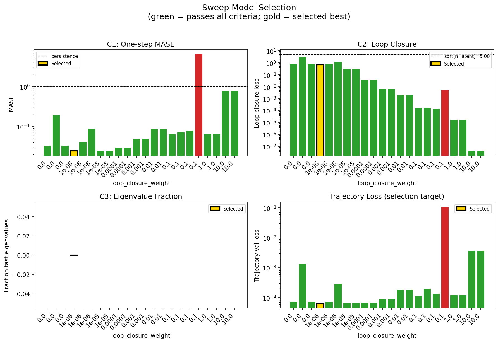
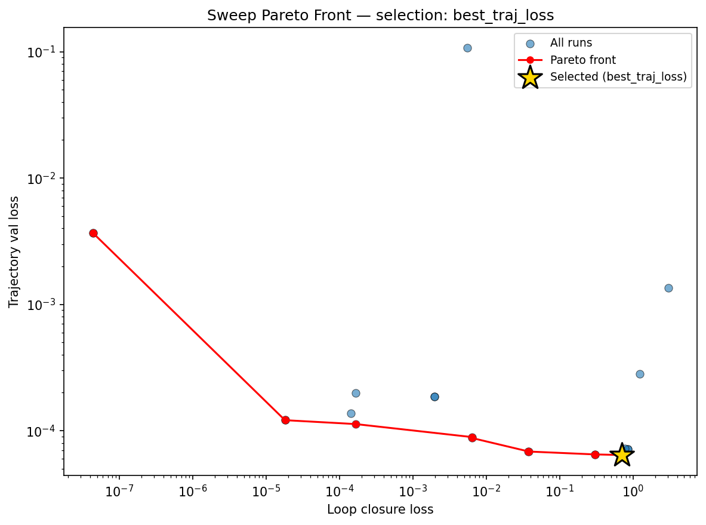
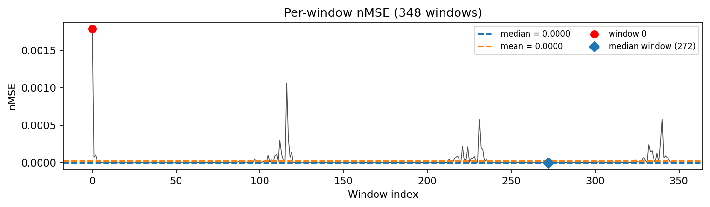
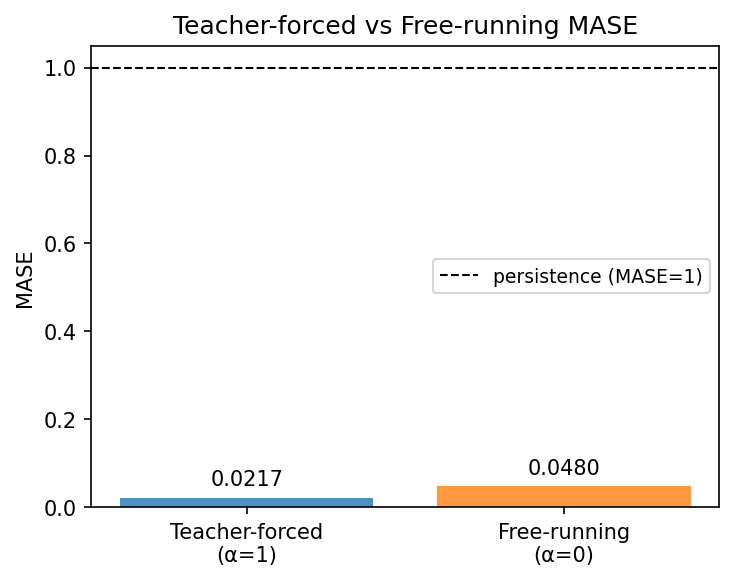
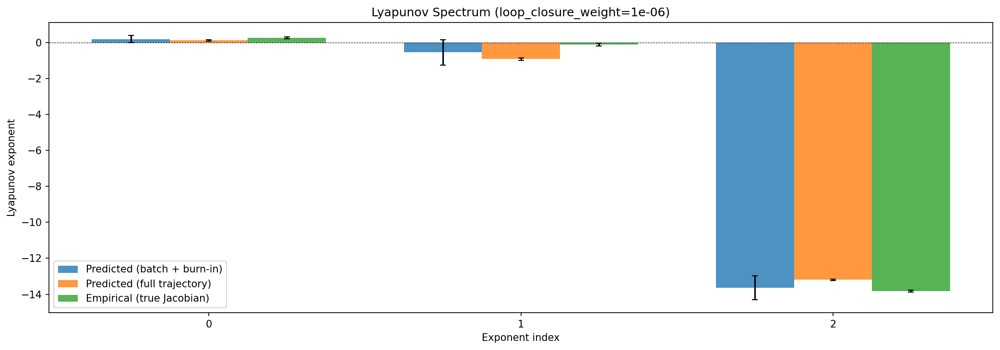
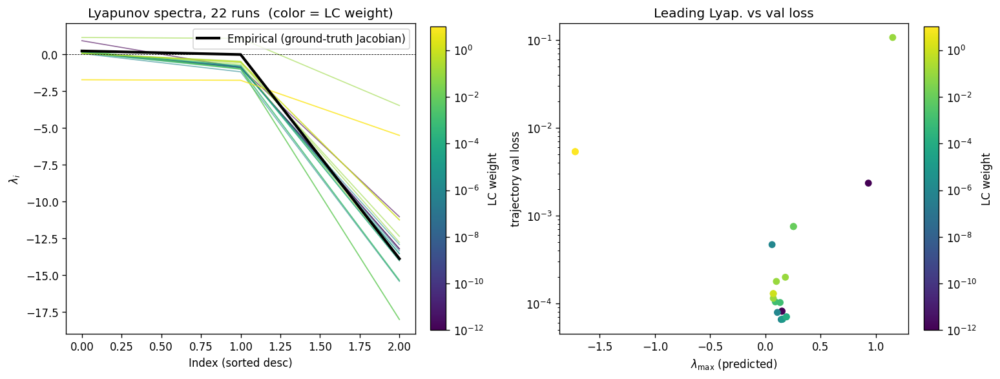
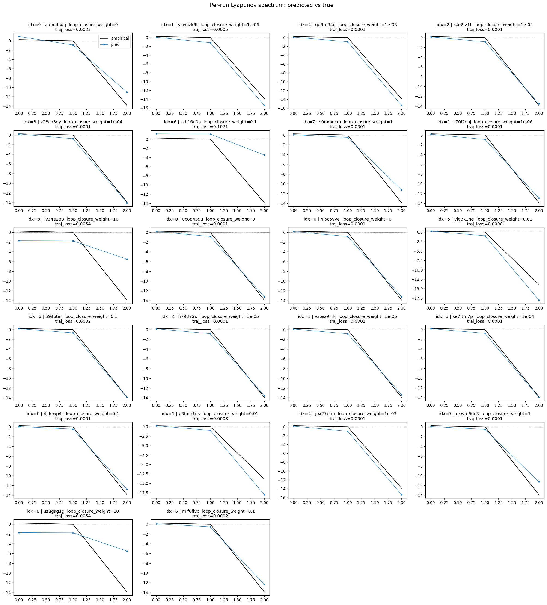
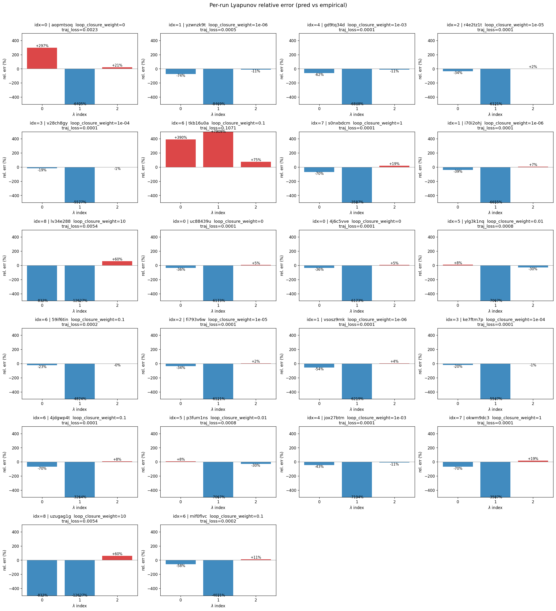
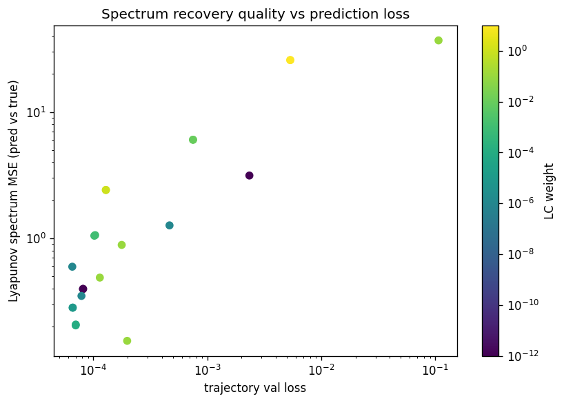

# Sweep Analysis: `lorenz_partial_25d_additive_gennmse_adaptivelatent__lc_sweep`

**Project**: [Lorenz_INDpartial_N25_D1_NormTrue_T3__JacobianODE](https://wandb.ai/JacobianODE/Lorenz_INDpartial_N25_D1_NormTrue_T3__JacobianODE/groups/lorenz_partial_25d_additive_gennmse_adaptivelatent__lc_sweep)  
**Launched**: 2026-04-14T19:43:14Z  
**Completed**: 2026-04-15T01:14:15Z  
**Outcome**: `complete_clean`  
**Git**: `latent-JacobianODE` @ `40b08d5`  
**Expected runs**: 9

## Experiment Context

### `lorenz_partial_25d_additive_gennmse_adaptivelatent`

**Description**

Partial-obs Lorenz (x only, 25 delays), z_dyn 3-D, gennMSE with
gen_variance_mode='adaptive_latent'. The latent prediction loss is
normalized by det(Cov(z_dyn))^(1/D), recomputed each epoch from
~50 batches of the current encoder's output. Observation-space
terms (decoded trajectory, reconstruction, loop closure) keep the
fixed data-space gennMSE denominator. Otherwise identical to the
partial-obs gennMSE baseline: additive coupling, kl_null_weight=0,
reconstruction_mode='most_recent', obs_noise_scale=0, LC swept.

**Hypothesis**

On partial-obs the z_dyn distribution is free to rescale during
training (the encoder is learning it as it goes). A fixed
data-space denominator for the latent prediction loss couples its
scale to whatever z_dyn's variance happens to be at any moment,
which can over- or under-weight the LPL term across epochs. The
adaptive-latent mode recomputes Cov(z_dyn) each epoch, keeping the
LPL effectively on a "unit generalized variance" scale as z_dyn
evolves. Expected effects: more stable LPL contribution to the
loss, better loop-closure / latent-prediction balance, and a
cleaner LC landscape compared to the fixed-denominator gennMSE
partial-obs sweep. If no meaningful improvement, the fixed
denominator was already fine on this problem.

**Success criteria**

- Best run's leading Lyapunov exponent > 0 (chaos recovered)
- Best run's predicted Lyapunov spectrum within ~30% of empirical
- LPL contribution stays numerically well-scaled across epochs (no blow-up or vanishing)
- Best-LC's trajectory_r2 and spectrum MSE match or beat the fixed-gennMSE partial-obs baseline

## Results

**Overall best MASE**: 0.0484 (LC weight = 1.0e-06, obs_noise_scale = 0.00)
**Overall best traj loss**: 0.00006 at epoch 189.0
**Runs analyzed**: 22

### Best run per `obs_noise_scale`

| obs_noise_scale | Best LC weight | Best traj loss | MASE at best | R² | LC loss | epoch |
|---|---|---|---|---|---|---|
| 0.0 | 1.0e-06 | 0.00006 | 0.0484 | 0.9999 | 0.700 | 189.0 |

## Success-criteria verdicts (automated)

| Criterion | Verdict | Note |
|---|---|---|
| Best run's leading Lyapunov exponent > 0 (chaos recovered) | **Unknown** |  |
| Best run's predicted Lyapunov spectrum within ~30% of empirical | **Unknown** |  |
| LPL contribution stays numerically well-scaled across epochs (no blow-up or vanishing) | **Unknown** |  |
| Best-LC's trajectory_r2 and spectrum MSE match or beat the fixed-gennMSE partial-obs baseline | **Unknown** |  |

_Automated verdicts use simple numeric-threshold parsing and may mis-classify qualitative criteria. The Discussion section below takes precedence._

## Figures

### sweep_overview



### sweep_pareto



### prediction_windows



### mase



### lyapunov



### per_run_lyapunov



### per_run_lyapunov_vs_true



### per_run_lyapunov_relerr



### lyapunov_spectrum_mse_vs_val_loss



## Discussion

<!--
This section is intentionally left as a placeholder. A human reviewer
or Claude Code agent should fill it in based on the tables and figures
above, explicitly addressing each success criterion and comparing the
outcome to the stated hypothesis. Write the Discussion to
`discussion.md` in this directory and re-run `render_report`.
-->

_(to be written)_

## `run_analytics` stdout

<details><summary>Click to expand — full diagnostic output from <code>run_analytics</code></summary>

```
No run_id provided — selecting best run from group 'lorenz_partial_25d_additive_gennmse_adaptivelatent__lc_sweep' ...
Found 22 total runs in JacobianODE/Lorenz_INDpartial_N25_D1_NormTrue_T3__JacobianODE (group=lorenz_partial_25d_additive_gennmse_adaptivelatent__lc_sweep)
All runs (state, loop_closure_weight, tangent_entropy_weight, kl_dyn_weight):
  aopmtsoq: state=finished, lc=0.0, te=0.0, kl_dyn=0.0
  yzwnzk9t: state=finished, lc=1e-06, te=0.0, kl_dyn=0.0
  gd9tq34d: state=finished, lc=0.001, te=0.0, kl_dyn=0.0
  r4e2tz1t: state=finished, lc=1e-05, te=0.0, kl_dyn=0.0
  v28ch8gy: state=finished, lc=0.0001, te=0.0, kl_dyn=0.0
  tkb16u0a: state=finished, lc=0.1, te=0.0, kl_dyn=0.0
  s0nxbdcm: state=finished, lc=1.0, te=0.0, kl_dyn=0.0
  i70i2ohj: state=finished, lc=1e-06, te=0.0, kl_dyn=0.0
  lv34e288: state=finished, lc=10.0, te=0.0, kl_dyn=0.0
  uc88439u: state=finished, lc=0.0, te=0.0, kl_dyn=0.0
  4j6c5vve: state=finished, lc=0.0, te=0.0, kl_dyn=0.0
  ylg3k1nq: state=finished, lc=0.01, te=0.0, kl_dyn=0.0
  59if6tin: state=finished, lc=0.1, te=0.0, kl_dyn=0.0
  fi793v6w: state=finished, lc=1e-05, te=0.0, kl_dyn=0.0
  vsosz9mk: state=finished, lc=1e-06, te=0.0, kl_dyn=0.0
  ke7ftm7p: state=finished, lc=0.0001, te=0.0, kl_dyn=0.0
  4jdgwp4t: state=finished, lc=0.1, te=0.0, kl_dyn=0.0
  p3fum1ns: state=finished, lc=0.01, te=0.0, kl_dyn=0.0
  jox27btm: state=finished, lc=0.001, te=0.0, kl_dyn=0.0
  okwm9dc3: state=finished, lc=1.0, te=0.0, kl_dyn=0.0
  uzugag1g: state=finished, lc=10.0, te=0.0, kl_dyn=0.0
  mif0flvc: state=finished, lc=0.1, te=0.0, kl_dyn=0.0

slurm_timeout_min not found in any run config — falling back to 180 min
  Including aopmtsoq (lc=0.0): use_all_runs=True (state=finished)
  Including yzwnzk9t (lc=1e-06): use_all_runs=True (state=finished)
  Including gd9tq34d (lc=0.001): use_all_runs=True (state=finished)
  Including r4e2tz1t (lc=1e-05): use_all_runs=True (state=finished)
  Including v28ch8gy (lc=0.0001): use_all_runs=True (state=finished)
  Including tkb16u0a (lc=0.1): use_all_runs=True (state=finished)
  Including s0nxbdcm (lc=1.0): use_all_runs=True (state=finished)
  Including i70i2ohj (lc=1e-06): use_all_runs=True (state=finished)
  Including lv34e288 (lc=10.0): use_all_runs=True (state=finished)
  Including uc88439u (lc=0.0): use_all_runs=True (state=finished)
  Including 4j6c5vve (lc=0.0): use_all_runs=True (state=finished)
  Including ylg3k1nq (lc=0.01): use_all_runs=True (state=finished)
  Including 59if6tin (lc=0.1): use_all_runs=True (state=finished)
  Including fi793v6w (lc=1e-05): use_all_runs=True (state=finished)
  Including vsosz9mk (lc=1e-06): use_all_runs=True (state=finished)
  Including ke7ftm7p (lc=0.0001): use_all_runs=True (state=finished)
  Including 4jdgwp4t (lc=0.1): use_all_runs=True (state=finished)
  Including p3fum1ns (lc=0.01): use_all_runs=True (state=finished)
  Including jox27btm (lc=0.001): use_all_runs=True (state=finished)
  Including okwm9dc3 (lc=1.0): use_all_runs=True (state=finished)
  Including uzugag1g (lc=10.0): use_all_runs=True (state=finished)
  Including mif0flvc (lc=0.1): use_all_runs=True (state=finished)
Found 22 effectively-done sweep runs:
  loop_closure_weight=0.0, tangent_entropy_weight=0.0, kl_dyn_weight=0.0 -> run_id=4j6c5vve
  loop_closure_weight=0.0, tangent_entropy_weight=0.0, kl_dyn_weight=0.0 -> run_id=aopmtsoq
  loop_closure_weight=0.0, tangent_entropy_weight=0.0, kl_dyn_weight=0.0 -> run_id=uc88439u
  loop_closure_weight=1e-06, tangent_entropy_weight=0.0, kl_dyn_weight=0.0 -> run_id=i70i2ohj
  loop_closure_weight=1e-06, tangent_entropy_weight=0.0, kl_dyn_weight=0.0 -> run_id=vsosz9mk
  loop_closure_weight=1e-06, tangent_entropy_weight=0.0, kl_dyn_weight=0.0 -> run_id=yzwnzk9t
  loop_closure_weight=1e-05, tangent_entropy_weight=0.0, kl_dyn_weight=0.0 -> run_id=fi793v6w
  loop_closure_weight=1e-05, tangent_entropy_weight=0.0, kl_dyn_weight=0.0 -> run_id=r4e2tz1t
  loop_closure_weight=0.0001, tangent_entropy_weight=0.0, kl_dyn_weight=0.0 -> run_id=ke7ftm7p
  loop_closure_weight=0.0001, tangent_entropy_weight=0.0, kl_dyn_weight=0.0 -> run_id=v28ch8gy
  loop_closure_weight=0.001, tangent_entropy_weight=0.0, kl_dyn_weight=0.0 -> run_id=gd9tq34d
  loop_closure_weight=0.001, tangent_entropy_weight=0.0, kl_dyn_weight=0.0 -> run_id=jox27btm
  loop_closure_weight=0.01, tangent_entropy_weight=0.0, kl_dyn_weight=0.0 -> run_id=p3fum1ns
  loop_closure_weight=0.01, tangent_entropy_weight=0.0, kl_dyn_weight=0.0 -> run_id=ylg3k1nq
  loop_closure_weight=0.1, tangent_entropy_weight=0.0, kl_dyn_weight=0.0 -> run_id=4jdgwp4t
  loop_closure_weight=0.1, tangent_entropy_weight=0.0, kl_dyn_weight=0.0 -> run_id=59if6tin
  loop_closure_weight=0.1, tangent_entropy_weight=0.0, kl_dyn_weight=0.0 -> run_id=mif0flvc
  loop_closure_weight=0.1, tangent_entropy_weight=0.0, kl_dyn_weight=0.0 -> run_id=tkb16u0a
  loop_closure_weight=1.0, tangent_entropy_weight=0.0, kl_dyn_weight=0.0 -> run_id=okwm9dc3
  loop_closure_weight=1.0, tangent_entropy_weight=0.0, kl_dyn_weight=0.0 -> run_id=s0nxbdcm
  loop_closure_weight=10.0, tangent_entropy_weight=0.0, kl_dyn_weight=0.0 -> run_id=lv34e288
  loop_closure_weight=10.0, tangent_entropy_weight=0.0, kl_dyn_weight=0.0 -> run_id=uzugag1g
n_dims=25, n_latent=25, n_dyn=3, dt=0.0150
  run=4j6c5vve: DiagnosticMetrics(one_step_mase=0.03350945934653282, loop_closure_loss=0.8449676036834717, fast_eigenvalue_fraction=0.0, trajectory_val_loss=7.140498928492889e-05) (from W&B history)
  run=aopmtsoq: DiagnosticMetrics(one_step_mase=0.19386141002178192, loop_closure_loss=3.0420005321502686, fast_eigenvalue_fraction=0.0, trajectory_val_loss=0.0013431264087557793) (from W&B history)
  run=uc88439u: DiagnosticMetrics(one_step_mase=0.03350945934653282, loop_closure_loss=0.8449676036834717, fast_eigenvalue_fraction=0.0, trajectory_val_loss=7.140498928492889e-05) (from W&B history)
  run=i70i2ohj: DiagnosticMetrics(one_step_mase=0.02445019781589508, loop_closure_loss=0.7002825140953064, fast_eigenvalue_fraction=0.0, trajectory_val_loss=6.419006967917085e-05) (from W&B history)
  run=vsosz9mk: DiagnosticMetrics(one_step_mase=0.04031098261475563, loop_closure_loss=0.7710718512535095, fast_eigenvalue_fraction=0.0, trajectory_val_loss=7.244799053296447e-05) (from W&B history)
  run=yzwnzk9t: DiagnosticMetrics(one_step_mase=0.08992884308099747, loop_closure_loss=1.2421139478683472, fast_eigenvalue_fraction=0.0, trajectory_val_loss=0.0002825882111210376) (from W&B history)
  run=fi793v6w: DiagnosticMetrics(one_step_mase=0.02464321255683899, loop_closure_loss=0.3058725595474243, fast_eigenvalue_fraction=0.0, trajectory_val_loss=6.488138023996726e-05) (from W&B history)
  run=r4e2tz1t: DiagnosticMetrics(one_step_mase=0.02464321255683899, loop_closure_loss=0.3058725595474243, fast_eigenvalue_fraction=0.0, trajectory_val_loss=6.488138023996726e-05) (from W&B history)
  run=ke7ftm7p: DiagnosticMetrics(one_step_mase=0.02981819212436676, loop_closure_loss=0.03763024881482124, fast_eigenvalue_fraction=0.0, trajectory_val_loss=6.852970545878634e-05) (from W&B history)
  run=v28ch8gy: DiagnosticMetrics(one_step_mase=0.029729025438427925, loop_closure_loss=0.03803163394331932, fast_eigenvalue_fraction=0.0, trajectory_val_loss=6.838008994236588e-05) (from W&B history)
  run=gd9tq34d: DiagnosticMetrics(one_step_mase=0.04874131456017494, loop_closure_loss=0.006401536054909229, fast_eigenvalue_fraction=0.0, trajectory_val_loss=8.753167639952153e-05) (from W&B history)
  run=jox27btm: DiagnosticMetrics(one_step_mase=0.05031174421310425, loop_closure_loss=0.006380414590239525, fast_eigenvalue_fraction=0.0, trajectory_val_loss=8.904058631742373e-05) (from W&B history)
  run=p3fum1ns: DiagnosticMetrics(one_step_mase=0.0880538672208786, loop_closure_loss=0.001984007889404893, fast_eigenvalue_fraction=0.0, trajectory_val_loss=0.0001855830050772056) (from W&B history)
  run=ylg3k1nq: DiagnosticMetrics(one_step_mase=0.0880538672208786, loop_closure_loss=0.001984007889404893, fast_eigenvalue_fraction=0.0, trajectory_val_loss=0.0001855830050772056) (from W&B history)
  run=4jdgwp4t: DiagnosticMetrics(one_step_mase=0.0634082555770874, loop_closure_loss=0.000166237834491767, fast_eigenvalue_fraction=0.0, trajectory_val_loss=0.00011283738422207534) (from W&B history)
  run=59if6tin: DiagnosticMetrics(one_step_mase=0.07143525779247284, loop_closure_loss=0.00016770772344898432, fast_eigenvalue_fraction=0.0, trajectory_val_loss=0.00019841993344016373) (from W&B history)
  run=mif0flvc: DiagnosticMetrics(one_step_mase=0.08005345612764359, loop_closure_loss=0.0001447134418413043, fast_eigenvalue_fraction=0.0, trajectory_val_loss=0.00013664926518686116) (from W&B history)
  run=tkb16u0a: DiagnosticMetrics(one_step_mase=6.454524993896484, loop_closure_loss=0.00557020353153348, fast_eigenvalue_fraction=0.0, trajectory_val_loss=0.1071363091468811) (from W&B history)
  run=okwm9dc3: DiagnosticMetrics(one_step_mase=0.06517700850963593, loop_closure_loss=1.8169324903283268e-05, fast_eigenvalue_fraction=0.0, trajectory_val_loss=0.00012111841351725161) (from W&B history)
  run=s0nxbdcm: DiagnosticMetrics(one_step_mase=0.06517700850963593, loop_closure_loss=1.8169324903283268e-05, fast_eigenvalue_fraction=0.0, trajectory_val_loss=0.00012111841351725161) (from W&B history)
  run=lv34e288: DiagnosticMetrics(one_step_mase=0.7836943864822388, loop_closure_loss=4.376551743234813e-08, fast_eigenvalue_fraction=0.0, trajectory_val_loss=0.003682252950966358) (from W&B history)
  run=uzugag1g: DiagnosticMetrics(one_step_mase=0.7836943864822388, loop_closure_loss=4.376551743234813e-08, fast_eigenvalue_fraction=0.0, trajectory_val_loss=0.003682252950966358) (from W&B history)

Ranking method:           best_traj_loss
Best run ID:              i70i2ohj
Best loop_closure_weight: 1e-06
Best tangent_entropy_weight: 0.0
Best kl_dyn_weight:       0.0
Best traj loss:           0.000064
Criteria applied: ['C1', 'C2', 'C3']
Surviving: 21 / 22
Auto-selected run_id: i70i2ohj

======================================================================
PARETO FRONTIER RUNS (12 runs)
======================================================================
  Run ID               LC Loss   Traj Val Loss
  ------------  --------------  --------------
  lv34e288            0.000000        0.003682
  uzugag1g            0.000000        0.003682
  okwm9dc3            0.000018        0.000121
  s0nxbdcm            0.000018        0.000121
  4jdgwp4t            0.000166        0.000113
  jox27btm            0.006380        0.000089
  gd9tq34d            0.006402        0.000088
  ke7ftm7p            0.037630        0.000069
  v28ch8gy            0.038032        0.000068
  fi793v6w            0.305873        0.000065
  r4e2tz1t            0.305873        0.000065
  i70i2ohj            0.700283        0.000064 <-- selected

======================================================================
RANKING METHOD COMPARISON (over 21 survivors)
======================================================================
  Method                  Run ID               LC Loss   Traj Val Loss
  ----------------------  ------------  --------------  --------------
  best_traj_loss          i70i2ohj            0.700283        0.000064 <-- active
  pareto_knee             jox27btm            0.006380        0.000089
  geo_rank                i70i2ohj            0.700283        0.000064
  minimax_rank            jox27btm            0.006380        0.000089
  geo_log_score           i70i2ohj            0.700283        0.000064
  minimax_log_score       okwm9dc3            0.000018        0.000121
======================================================================

Loading run i70i2ohj from JacobianODE/Lorenz_INDpartial_N25_D1_NormTrue_T3__JacobianODE ...
Train dataset shape: torch.Size([25322, 25, 25])
Validation dataset shape: torch.Size([8057, 25, 25])
Test dataset shape: torch.Size([3453, 25, 25])
Train trajectories dataset shape: torch.Size([22, 1176, 25])
Validation trajectories dataset shape: torch.Size([7, 1176, 25])
Test trajectories dataset shape: torch.Size([3, 1176, 25])
Loading checkpoint epoch=189-step=38000.ckpt...
Computing MASE ...
Teacher-forced MASE: 0.0217
Free-running MASE:   0.0480
Computing Lyapunov exponents ...
  Computing full-trajectory Lyapunov (3 test trajs, T=1176) ...
Predicted Lyapunov exponents (batch+burn-in, 128 windowed trajs):
  λ_1 = +0.1993 ± 0.2011
  λ_2 = -0.5405 ± 0.7082
  λ_3 = -13.6282 ± 0.6648
Predicted Lyapunov exponents (full-length, 3 test trajs):
  λ_1 = +0.1233 ± 0.0522
  λ_2 = -0.9093 ± 0.0656
  λ_3 = -13.1962 ± 0.0411
Empirical Lyapunov exponents (mean ± std):
  λ_1 = +0.2716 ± 0.0605
  λ_2 = -0.1016 ± 0.0797
  λ_3 = -13.8370 ± 0.0514
Computing prediction windows ...
Windows: 348 — nMSE min=0.0000, median=0.0000, mean=0.0000, max=0.0018
```

</details>
