# Sweep Analysis: `lorenz_partial_25d_additive_gennmse_obsnoise001__lc_sweep`

**Project**: [Lorenz_INDpartial_N25_D1_NormTrue_T3__JacobianODE](https://wandb.ai/JacobianODE/Lorenz_INDpartial_N25_D1_NormTrue_T3__JacobianODE/groups/lorenz_partial_25d_additive_gennmse_obsnoise001__lc_sweep)  
**Launched**: 2026-04-17T15:20:10Z  
**Completed**: 2026-04-17T18:50:13Z  
**Outcome**: `complete_clean`  
**Git**: `latent-JacobianODE` @ `fd26c55`  
**Expected runs**: 9

## Experiment Context

### `lorenz_partial_25d_additive_gennmse`

**Description**

Partial-obs Lorenz: observe only x (index 0), n_delays=25,
delay_spacing=1. Encoder input: 25-D delay vector. Dynamic latent:
3-D (z_dyn). Null subspace: 22-D with kl_null_weight=0 (no
structural penalty, per the additive+zero_init design). Joint
training of encoder + Jacobian dynamics from the start; active loss
terms: decoded-prediction (trajectory) + latent-prediction +
reconstruction + loop-closure, all with gennMSE. Reconstruction mode
= most_recent so recon + decoded-trajectory losses score only the
current-time frame, not the older lags (avoids the redundant-target
/ thin-direction pathology flagged in the recent partial-obs
hypothesis). obs_noise_scale=0. Uses the clean-encoding LPL target
fix (no-op here since obs_noise=0, but kept for consistency).

**Hypothesis**

With loop closure enforcing encoder invertibility, the latent
dynamics should be diffeomorphism-conjugate to the true Lorenz flow,
preserving its Lyapunov spectrum (λ ≈ [0.91, 0, -14.57]) despite
observing only x(t). The optimal LC weight likely sits in the
1e-3..1e-1 range (full-obs sweep peaked at 1e-1 with spectrum_mse
≈ 0.011). Free-running rollouts in observation space should be
chaotic with long-run statistics matching the training data.

Open risk from the partial-obs sufficient-statistic hypothesis: the
only hard constraint on z_dyn information content is reconstructing
the current frame, so the encoder may dump history into z_null
rather than surfacing it in z_dyn. Loop closure + LPL should apply
counterbalancing pressure; if they don't, we'd see high traj_val
loss / spectrum mismatch and know to revisit the loss design.

**Success criteria**

- Best run's leading Lyapunov exponent > 0 (chaos recovered)
- Best run's predicted Lyapunov spectrum within ~30% of empirical
- Best run's free-running sliced-Wasserstein-1 to training data distribution is low (sanity: obs histograms overlap)
- val/trajectory_r2_score > 0.9 at the best configuration
- Loop closure bounded and monotonically improving at low LC

## Results

**Swept axes** (1): `training.lightning.loop_closure_weight`

**Chosen run** (by `best_traj_loss`): `o14xwnle` — traj_loss=0.00086, MASE=0.5354, R²=0.9992, LC loss=7.134, epoch=169.0

Swept-axis values at chosen run: `training.lightning.loop_closure_weight`=0

**Runs analyzed**: 9 (expected 9)

### Per-run results

| run_idx | run_id | `training.lightning.loop_closure_weight` | best_traj_loss | best_MASE | R² | LC loss | epoch |
|---|---|---|---|---|---|---|---|
| 0 | `o14xwnle` | 0 | 0.00086 | 0.5354 | 0.9992 | 7.134 | 169.0 |
| 1 | `rnh0mo3j` | 1.0e-06 | 0.00089 | 0.5412 | 0.9991 | 4.685 | 160.0 |
| 3 | `d8ireow1` | 1.0e-04 | 0.00096 | 0.5626 | 0.9991 | 0.172 | 177.0 |
| 2 | `7hgswub6` | 1.0e-05 | 0.00098 | 0.5695 | 0.9990 | 0.858 | 152.0 |
| 4 | `z8a1jmbf` | 0.001 | 0.00121 | 0.6155 | 0.9988 | 0.035 | 116.0 |
| 5 | `3xgzru7u` | 0.01 | 0.00124 | 0.6175 | 0.9988 | 0.001 | 177.0 |
| 6 | `cj1fzag0` | 0.1 | 0.00144 | 0.6643 | 0.9986 | 0.000 | 151.0 |
| 7 | `0xhvd2y7` | 1 | 0.00151 | 0.6875 | 0.9985 | 0.000 | 189.0 |
| 8 | `qhg02flb` | 10 | 0.00202 | 0.8029 | 0.9980 | 0.000 | 100.0 |

## Success-criteria verdicts (automated)

| Criterion | Verdict | Note |
|---|---|---|
| Best run's leading Lyapunov exponent > 0 (chaos recovered) | **Unknown** |  |
| Best run's predicted Lyapunov spectrum within ~30% of empirical | **Unknown** |  |
| Best run's free-running sliced-Wasserstein-1 to training data distribution is low (sanity: obs histograms overlap) | **Unknown** |  |
| val/trajectory_r2_score > 0.9 at the best configuration | **Pass** | Best R² = 0.9992; threshold > 0.9 |
| Loop closure bounded and monotonically improving at low LC | **Unknown** |  |

_Automated verdicts use simple numeric-threshold parsing and may mis-classify qualitative criteria. The Discussion section below takes precedence._

## Figures

### sweep_overview

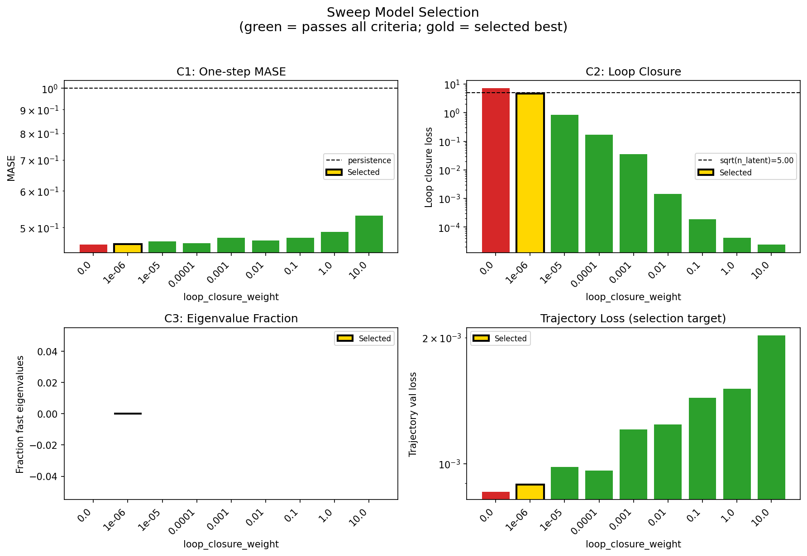

### sweep_pareto

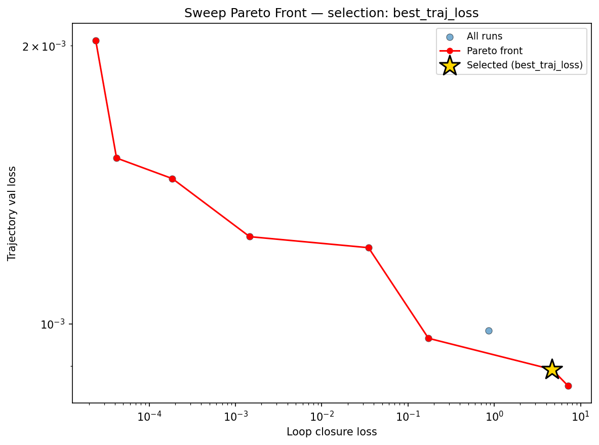

### reconstruction

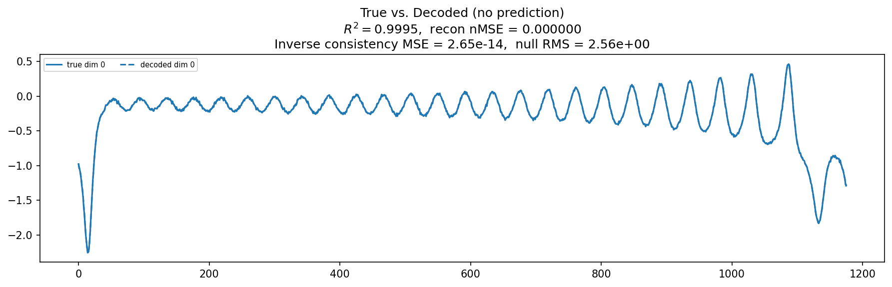

### prediction_windows

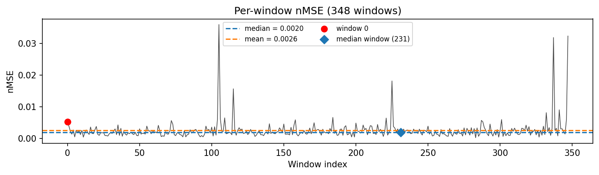

### long_trajectory

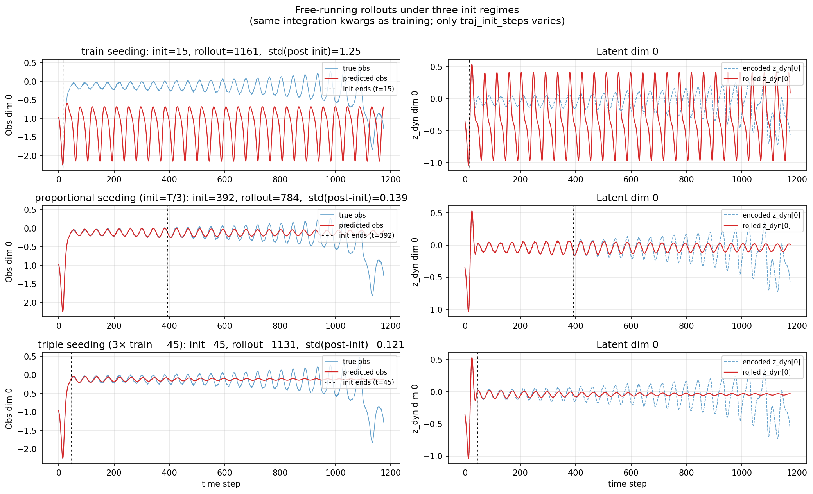

### mase

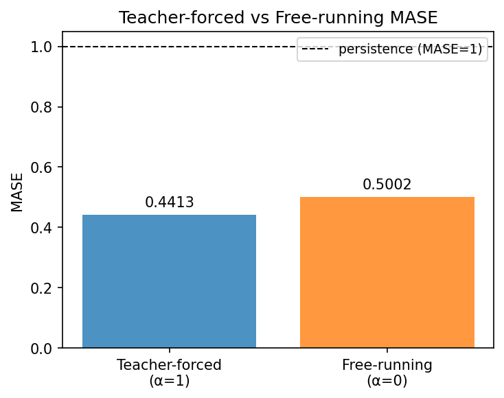

### latent_utilization

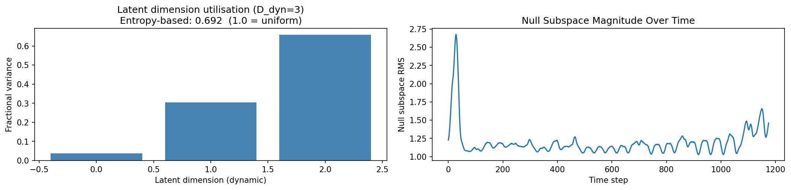

### lyapunov

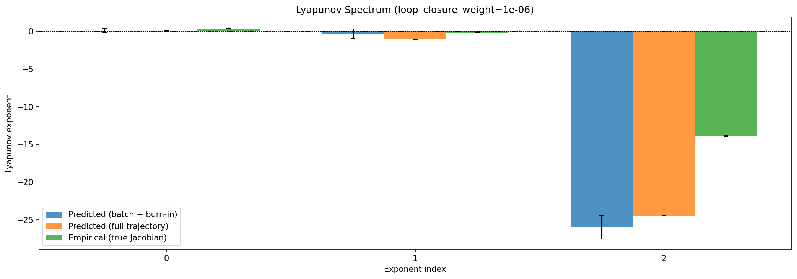

### kaplan_yorke

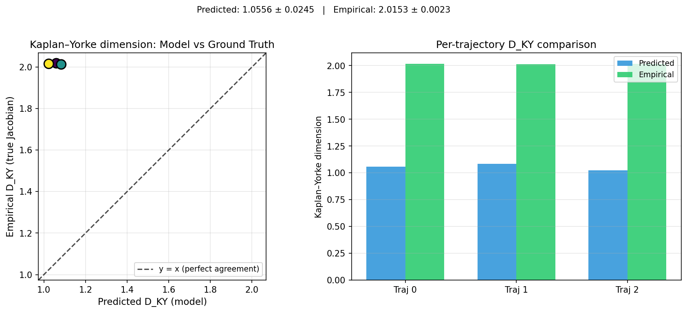

### per_run_lyapunov

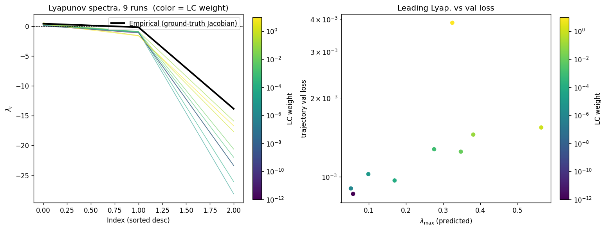

### per_run_lyapunov_vs_true

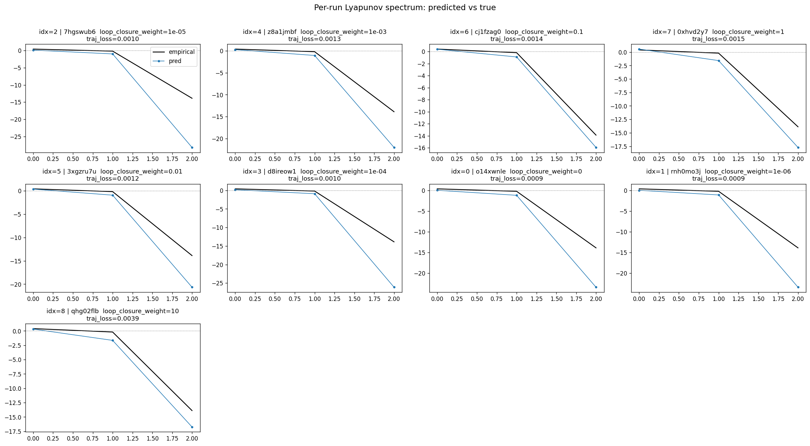

### per_run_lyapunov_relerr

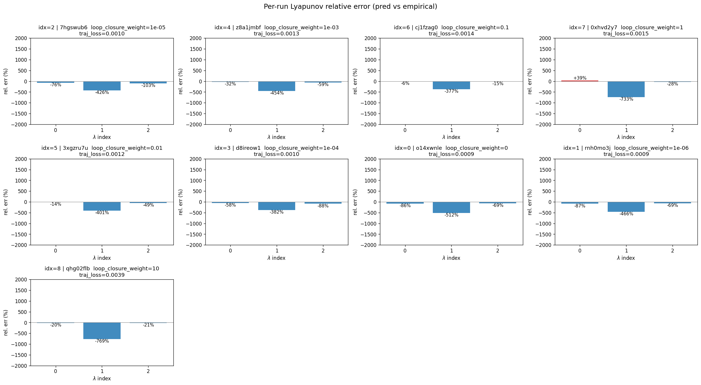

### encoder_decoder_jacobians

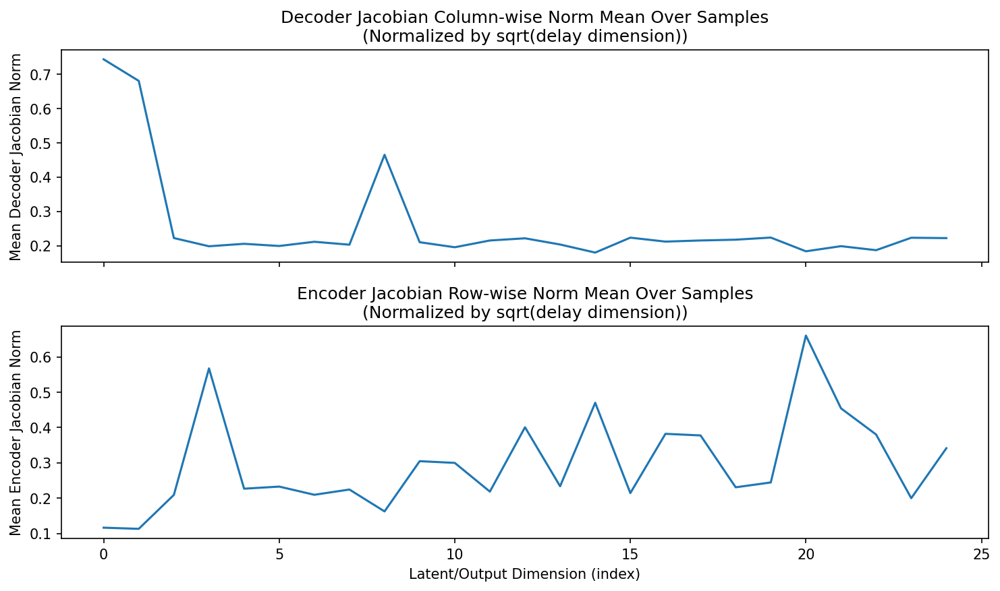

### amplification

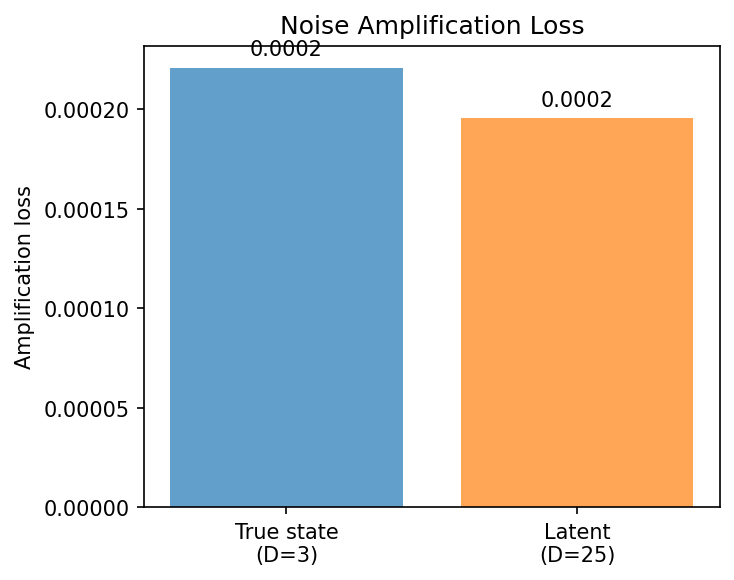

### kaplan_yorke_pca

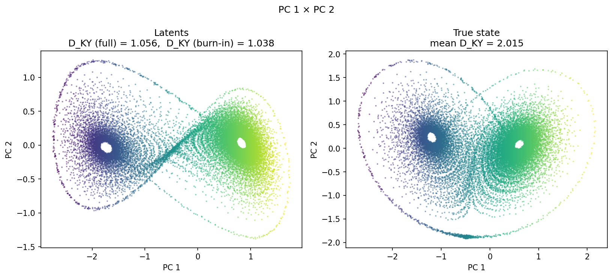

### prediction_detail_latent

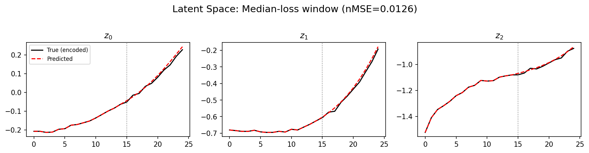

### prediction_detail_obs

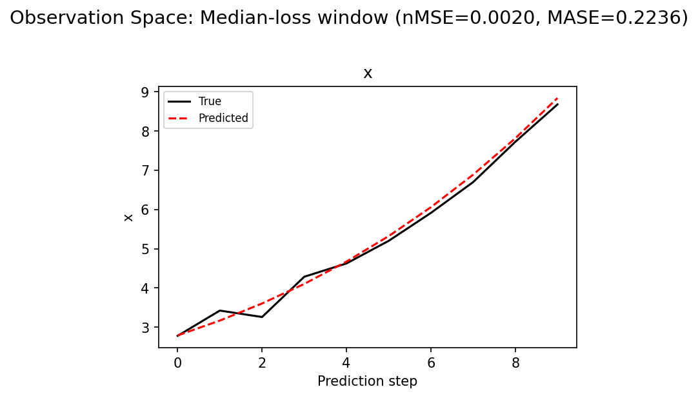

## Discussion

<!--
This section is intentionally left as a placeholder. A human reviewer
or Claude Code agent should fill it in based on the tables and figures
above, explicitly addressing each success criterion and comparing the
outcome to the stated hypothesis. Write the Discussion to
`discussion.md` in this directory and re-run `render_report`.
-->

_(to be written)_

## `run_analytics` stdout

<details><summary>Click to expand — full diagnostic output from <code>run_analytics</code></summary>

```
No run_id provided — selecting best run from group 'lorenz_partial_25d_additive_gennmse_obsnoise001__lc_sweep' ...
Found 11 total runs in JacobianODE/Lorenz_INDpartial_N25_D1_NormTrue_T3__JacobianODE (group=lorenz_partial_25d_additive_gennmse_obsnoise001__lc_sweep)
All runs (state, loop_closure_weight, tangent_entropy_weight, kl_dyn_weight):
  9vror9rv: state=finished, lc=0.0, te=0.0, kl_dyn=0.0
  7hgswub6: state=finished, lc=1e-05, te=0.0, kl_dyn=0.0
  z8a1jmbf: state=finished, lc=0.001, te=0.0, kl_dyn=0.0
  c31v88rb: state=finished, lc=0.01, te=0.0, kl_dyn=0.0
  cj1fzag0: state=finished, lc=0.1, te=0.0, kl_dyn=0.0
  0xhvd2y7: state=finished, lc=1.0, te=0.0, kl_dyn=0.0
  3xgzru7u: state=finished, lc=0.01, te=0.0, kl_dyn=0.0
  d8ireow1: state=finished, lc=0.0001, te=0.0, kl_dyn=0.0
  o14xwnle: state=finished, lc=0.0, te=0.0, kl_dyn=0.0
  rnh0mo3j: state=finished, lc=1e-06, te=0.0, kl_dyn=0.0
  qhg02flb: state=finished, lc=10.0, te=0.0, kl_dyn=0.0

slurm_timeout_min not found in any run config — falling back to 180 min
  Including 9vror9rv (lc=0.0): use_all_runs=True (state=finished)
  Including 7hgswub6 (lc=1e-05): use_all_runs=True (state=finished)
  Including z8a1jmbf (lc=0.001): use_all_runs=True (state=finished)
  Including c31v88rb (lc=0.01): use_all_runs=True (state=finished)
  Including cj1fzag0 (lc=0.1): use_all_runs=True (state=finished)
  Including 0xhvd2y7 (lc=1.0): use_all_runs=True (state=finished)
  Including 3xgzru7u (lc=0.01): use_all_runs=True (state=finished)
  Including d8ireow1 (lc=0.0001): use_all_runs=True (state=finished)
  Including o14xwnle (lc=0.0): use_all_runs=True (state=finished)
  Including rnh0mo3j (lc=1e-06): use_all_runs=True (state=finished)
  Including qhg02flb (lc=10.0): use_all_runs=True (state=finished)
Found 11 effectively-done sweep runs:
  loop_closure_weight=0.0, tangent_entropy_weight=0.0, kl_dyn_weight=0.0 -> run_id=9vror9rv
  loop_closure_weight=0.0, tangent_entropy_weight=0.0, kl_dyn_weight=0.0 -> run_id=o14xwnle
  loop_closure_weight=1e-06, tangent_entropy_weight=0.0, kl_dyn_weight=0.0 -> run_id=rnh0mo3j
  loop_closure_weight=1e-05, tangent_entropy_weight=0.0, kl_dyn_weight=0.0 -> run_id=7hgswub6
  loop_closure_weight=0.0001, tangent_entropy_weight=0.0, kl_dyn_weight=0.0 -> run_id=d8ireow1
  loop_closure_weight=0.001, tangent_entropy_weight=0.0, kl_dyn_weight=0.0 -> run_id=z8a1jmbf
  loop_closure_weight=0.01, tangent_entropy_weight=0.0, kl_dyn_weight=0.0 -> run_id=3xgzru7u
  loop_closure_weight=0.01, tangent_entropy_weight=0.0, kl_dyn_weight=0.0 -> run_id=c31v88rb
  loop_closure_weight=0.1, tangent_entropy_weight=0.0, kl_dyn_weight=0.0 -> run_id=cj1fzag0
  loop_closure_weight=1.0, tangent_entropy_weight=0.0, kl_dyn_weight=0.0 -> run_id=0xhvd2y7
  loop_closure_weight=10.0, tangent_entropy_weight=0.0, kl_dyn_weight=0.0 -> run_id=qhg02flb
  Dropping 2 run(s) with no checkpoint dir: ['9vror9rv', 'c31v88rb']
n_dims=25, n_latent=25, n_dyn=3, dt=0.0150
  run=o14xwnle: DiagnosticMetrics(one_step_mase=0.4591344892978668, loop_closure_loss=7.134218692779541, fast_eigenvalue_fraction=0.0, trajectory_val_loss=0.0008574000676162541) (from cache, n_batches=100)
  run=rnh0mo3j: DiagnosticMetrics(one_step_mase=0.46033379435539246, loop_closure_loss=4.6850104331970215, fast_eigenvalue_fraction=0.0, trajectory_val_loss=0.0008926484733819962) (from cache, n_batches=100)
  run=7hgswub6: DiagnosticMetrics(one_step_mase=0.46712175011634827, loop_closure_loss=0.8583828210830688, fast_eigenvalue_fraction=0.0, trajectory_val_loss=0.0009832428768277168) (from cache, n_batches=100)
  run=d8ireow1: DiagnosticMetrics(one_step_mase=0.46212300658226013, loop_closure_loss=0.17248038947582245, fast_eigenvalue_fraction=0.0, trajectory_val_loss=0.0009647952974773943) (from cache, n_batches=100)
  run=z8a1jmbf: DiagnosticMetrics(one_step_mase=0.4749892055988312, loop_closure_loss=0.03484678640961647, fast_eigenvalue_fraction=0.0, trajectory_val_loss=0.0012089101364836097) (from cache, n_batches=100)
  run=3xgzru7u: DiagnosticMetrics(one_step_mase=0.4691356122493744, loop_closure_loss=0.0014590458013117313, fast_eigenvalue_fraction=0.0, trajectory_val_loss=0.001242600497789681) (from cache, n_batches=100)
  run=cj1fzag0: DiagnosticMetrics(one_step_mase=0.47547024488449097, loop_closure_loss=0.00018559489399194717, fast_eigenvalue_fraction=0.0, trajectory_val_loss=0.001435752841643989) (from cache, n_batches=100)
  run=0xhvd2y7: DiagnosticMetrics(one_step_mase=0.48966339230537415, loop_closure_loss=4.1786850488279015e-05, fast_eigenvalue_fraction=0.0, trajectory_val_loss=0.0015112519031390548) (from cache, n_batches=100)
  run=qhg02flb: DiagnosticMetrics(one_step_mase=0.5301817655563354, loop_closure_loss=2.3997810785658658e-05, fast_eigenvalue_fraction=0.0, trajectory_val_loss=0.0020244133193045855) (from cache, n_batches=100)

Ranking method:           best_traj_loss
Best run ID:              rnh0mo3j
Best loop_closure_weight: 1e-06
Best tangent_entropy_weight: 0.0
Best kl_dyn_weight:       0.0
Best traj loss:           0.000893
Criteria applied: ['C1', 'C2', 'C3']
Surviving: 8 / 9
Auto-selected run_id: rnh0mo3j

======================================================================
PARETO FRONTIER RUNS (8 runs)
======================================================================
  Run ID               LC Loss   Traj Val Loss
  ------------  --------------  --------------
  qhg02flb            0.000024        0.002024
  0xhvd2y7            0.000042        0.001511
  cj1fzag0            0.000186        0.001436
  3xgzru7u            0.001459        0.001243
  z8a1jmbf            0.034847        0.001209
  d8ireow1            0.172480        0.000965
  rnh0mo3j            4.685010        0.000893 <-- selected
  o14xwnle            7.134219        0.000857

======================================================================
RANKING METHOD COMPARISON (over 8 survivors)
======================================================================
  Method                  Run ID               LC Loss   Traj Val Loss
  ----------------------  ------------  --------------  --------------
  best_traj_loss          rnh0mo3j            4.685010        0.000893 <-- active
  pareto_knee             z8a1jmbf            0.034847        0.001209
  geo_rank                rnh0mo3j            4.685010        0.000893
  minimax_rank            z8a1jmbf            0.034847        0.001209
  geo_log_score           rnh0mo3j            4.685010        0.000893
  minimax_log_score       3xgzru7u            0.001459        0.001243
======================================================================

Loading run rnh0mo3j from JacobianODE/Lorenz_INDpartial_N25_D1_NormTrue_T3__JacobianODE ...
Train dataset shape: torch.Size([25322, 25, 25])
Validation dataset shape: torch.Size([8057, 25, 25])
Test dataset shape: torch.Size([3453, 25, 25])
Train trajectories dataset shape: torch.Size([22, 1176, 25])
Validation trajectories dataset shape: torch.Size([7, 1176, 25])
Test trajectories dataset shape: torch.Size([3, 1176, 25])
Loading checkpoint epoch=160-step=32200.ckpt...
Computing reconstruction ...
Computing MASE ...
Teacher-forced MASE: 0.4413
Free-running MASE:   0.5002
Computing latent utilization ...
Entropy-based utilization: 0.692
Null subspace mean RMS: 1.213063e+00
Computing Lyapunov exponents ...
  Computing full-trajectory Lyapunov (3 test trajs, T=1176) ...
Predicted Lyapunov exponents (batch+burn-in, 128 windowed trajs):
  λ_1 = +0.0951 ± 0.2488
  λ_2 = -0.3388 ± 0.6322
  λ_3 = -25.9748 ± 1.5448
Predicted Lyapunov exponents (full-length, 3 test trajs):
  λ_1 = +0.0603 ± 0.0346
  λ_2 = -1.0688 ± 0.0463
  λ_3 = -24.4703 ± 0.0082
Empirical Lyapunov exponents (mean ± std):
  λ_1 = +0.3846 ± 0.0251
  λ_2 = -0.1716 ± 0.0444
  λ_3 = -13.8799 ± 0.0398
Mean KY dim (predicted): 1.056 ± 0.025
Mean KY dim (empirical): 2.015 ± 0.002
Mean KY dim (burn-in):   1.038 ± 0.731
Computing prediction windows ...
Windows: 348 — nMSE min=0.0003, median=0.0020, mean=0.0026, max=0.0360
Computing long-trajectory free-running rollouts ...
Computing encoder/decoder Jacobians ...
encoder_jacobian: (128, 25, 25)
decoder_jacobian: (128, 25, 25)
Computing amplification loss ...
Amplification loss — True state: 0.000221
Amplification loss — Latent:     0.000196
```

</details>
