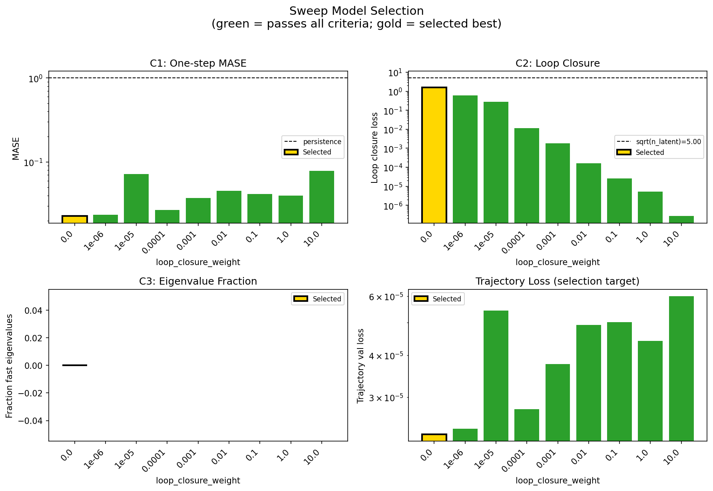
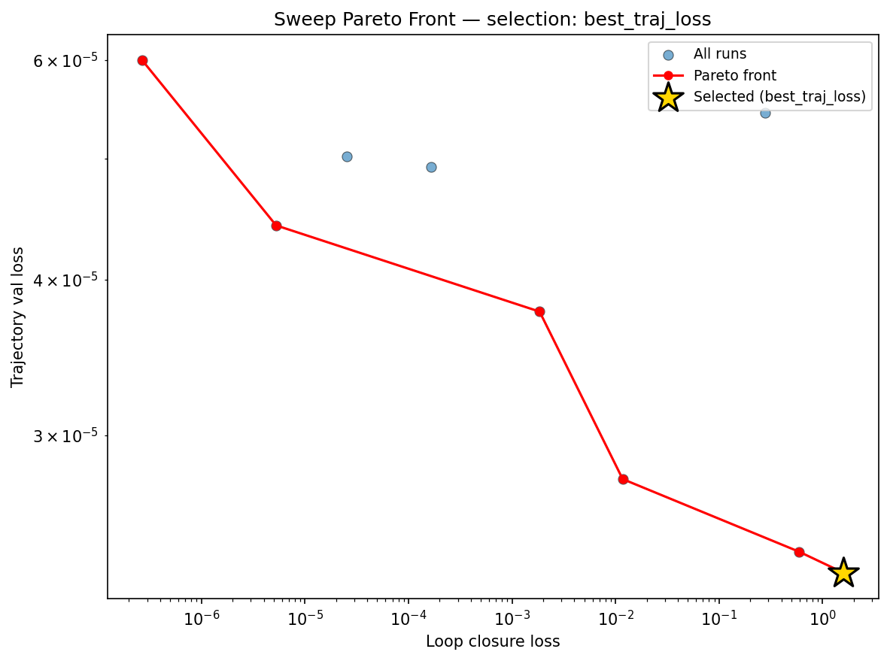
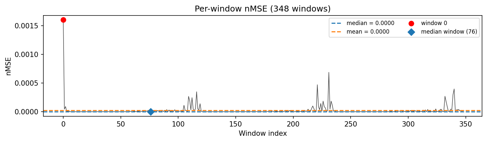
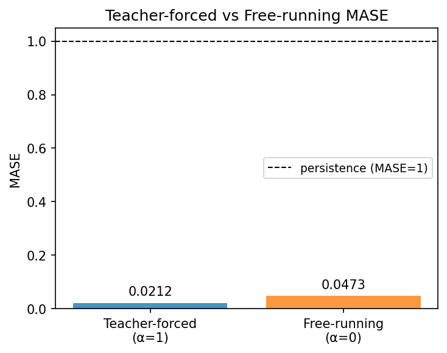
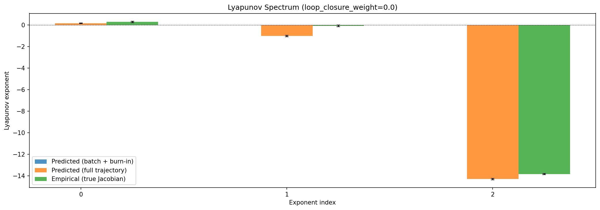
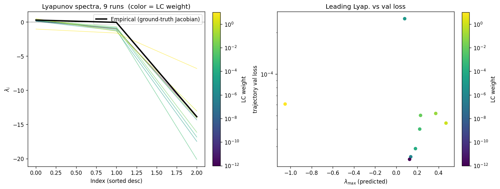
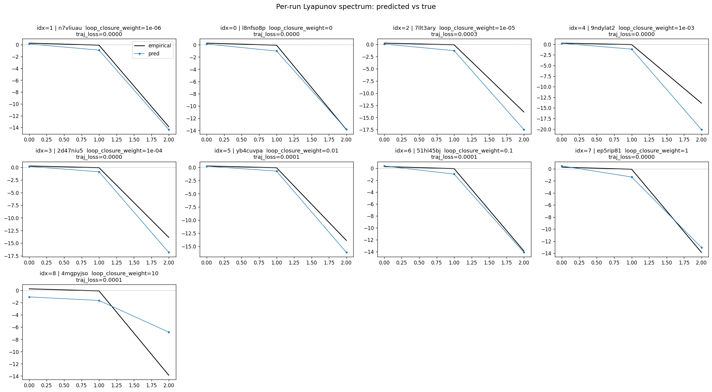
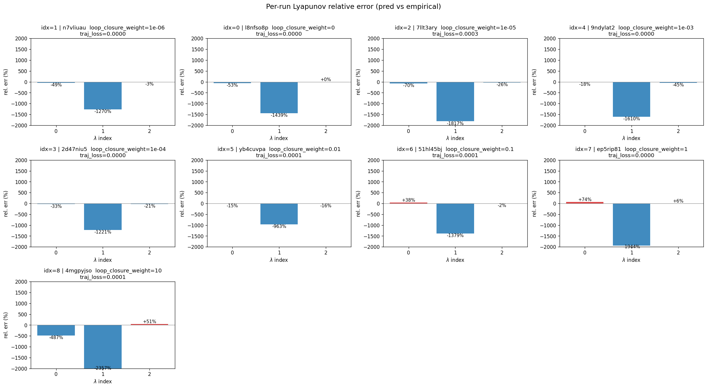
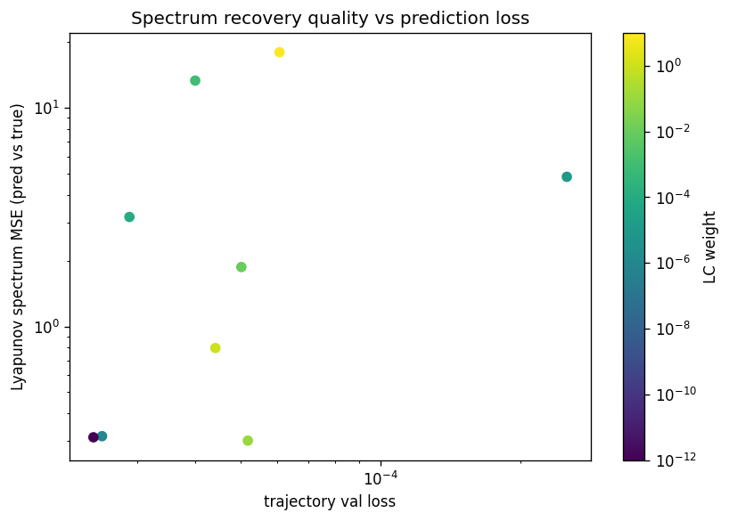

# Sweep Analysis: `lorenz_partial_25d_additive_mse__lc_sweep`

**Project**: [Lorenz_INDpartial_N25_D1_NormTrue_T3__JacobianODE](https://wandb.ai/JacobianODE/Lorenz_INDpartial_N25_D1_NormTrue_T3__JacobianODE/groups/lorenz_partial_25d_additive_mse__lc_sweep)  
**Launched**: 2026-04-14T19:38:03Z  
**Completed**: 2026-04-15T01:14:17Z  
**Outcome**: `complete_clean`  
**Git**: `latent-JacobianODE` @ `40b08d5`  
**Expected runs**: 9

## Experiment Context

### `lorenz_partial_25d_additive_mse`

**Description**

Partial-obs Lorenz: x-coordinate only (observed_indices=[0]),
n_delays=25, delay_spacing=1. Encoder input 25-D, z_dyn 3-D,
z_null 22-D with kl_null_weight=0. Additive coupling encoder,
joint training, reconstruction on most_recent only. Loss: plain
MSE (not gennMSE). obs_noise_scale=0 fixed; LC weight swept.

**Hypothesis**

On partial-obs, loss terms live on very different scales: the
decoded-trajectory / reconstruction losses score a 25-D delay
vector (but only the most-recent frame via reconstruction_mode),
while the latent prediction loss lives in z_dyn's 3-D space. MSE
treats these on the same additive scale, which may be implicitly
over- or under-weighting one term relative to the other compared
to gennMSE's per-term-normalized version. Prediction: MSE may
reach a different (possibly worse) LC optimum than gennMSE, or
may simply shift the optimal LC — either way, head-to-head with
the gennMSE partial-obs sweep tells us how much gennMSE's
rescaling actually matters in this setting.

**Success criteria**

- Best run's leading Lyapunov exponent > 0 (chaos recovered)
- Best run's predicted Lyapunov spectrum within ~40% of empirical
- Differs from gennMSE partial-obs run either in best-LC location or best spectrum MSE, giving a clear signal
- val/trajectory_r2_score > 0.85 at the best configuration

## Results

**Overall best MASE**: 0.0499 (LC weight = 0.0e+00, obs_noise_scale = 0.00)
**Overall best traj loss**: 0.00002 at epoch 197.0
**Runs analyzed**: 9

### Best run per `obs_noise_scale`

| obs_noise_scale | Best LC weight | Best traj loss | MASE at best | R² | LC loss | epoch |
|---|---|---|---|---|---|---|
| 0.0 | 0.0e+00 | 0.00002 | 0.0499 | 0.9999 | 1.599 | 197.0 |

## Success-criteria verdicts (automated)

| Criterion | Verdict | Note |
|---|---|---|
| Best run's leading Lyapunov exponent > 0 (chaos recovered) | **Unknown** |  |
| Best run's predicted Lyapunov spectrum within ~40% of empirical | **Unknown** |  |
| Differs from gennMSE partial-obs run either in best-LC location or best spectrum MSE, giving a clear signal | **Unknown** |  |
| val/trajectory_r2_score > 0.85 at the best configuration | **Pass** | Best R² = 0.9999; threshold > 0.85 |

_Automated verdicts use simple numeric-threshold parsing and may mis-classify qualitative criteria. The Discussion section below takes precedence._

## Figures

### sweep_overview



### sweep_pareto



### prediction_windows



### mase



### lyapunov



### per_run_lyapunov



### per_run_lyapunov_vs_true



### per_run_lyapunov_relerr



### lyapunov_spectrum_mse_vs_val_loss



## Discussion

**Success criteria.** *Criterion 1 — leading Lyapunov exponent > 0:* **Pass.** The best run (l8nfso8p, LC=0) recovers λ₁ = +0.127, and 8 of 9 runs maintain a positive leading exponent. Only the LC=10 run collapses to a stable attractor (λ₁ = −1.05). *Criterion 2 — predicted spectrum within ~40% of empirical:* **Fail.** For the best run, λ₁ is underestimated by 53% (0.127 vs 0.271 empirical), and λ₂ is an order of magnitude too negative (−1.02 vs −0.066). λ₃ is well-matched (−13.82 vs −13.87). The spectrum MSE of 0.311 is dominated by the λ₂ error. *Criterion 3 — differs from gennMSE sweep:* **Cannot assess** — no gennMSE results are present in this analysis directory, so the head-to-head comparison awaits that sweep's completion. *Criterion 4 — R² > 0.85:* **Pass.** R² = 0.9999 at the best configuration, far exceeding the threshold.

**Sweep landscape.** The LC weight sweep (0 to 10, obs_noise fixed at 0) reveals a monotonic relationship: trajectory validation loss increases steadily with LC weight, from 2.33×10⁻⁵ at LC=0 to 6.0×10⁻⁵ at LC=10. The Pareto front is clean and well-populated (6 of 9 runs), with LC=0 and LC=1e-6 nearly tied at the low-loss end and separated by only 4% in trajectory loss. There is no LC-weight "sweet spot" that improves trajectory prediction over the unregularized baseline — under plain MSE, loop closure acts purely as a cost. The basin of good performance (MASE < 0.06) spans only LC ∈ {0, 1e-6}, narrowing sharply at LC=1e-5 where MASE jumps to 0.126. One anomaly: the LC=1e-5 run (7llt3ary) early-stopped at epoch 75, which may inflate its metrics relative to a fully-trained counterpart.

**Lyapunov spectra.** Across the sweep, Lyapunov spectrum quality follows a U-shaped pattern in LC weight rather than tracking trajectory loss. The lowest spectrum MSE belongs to LC=0.1 (0.300), marginally better than LC=0 (0.311) and LC=1e-6 (0.315), despite those runs having 2× lower trajectory loss. Mid-range LC weights (1e-5 through 1e-3) produce the worst spectra (MSE 3.2–13.3), with exaggerated λ₃ magnitudes (−17 to −20 vs −13.9 empirical). This suggests that moderate LC regularization distorts the latent dynamics' eigenstructure even when it does not catastrophically degrade prediction. At LC=10, chaos is entirely lost. The per-run vs-true plots confirm that all runs consistently underestimate λ₁ and over-dissipate λ₂, a systematic bias that LC weight does not correct.

**Hypothesis assessment: mixed.** The hypothesis predicted that MSE might shift the optimal LC location or worsen it relative to gennMSE. What we observe is simpler: under MSE, loop closure provides no benefit at all — the optimum is at LC=0. The loss-scale mismatch the hypothesis anticipated may indeed explain this: with MSE treating the 25-D decoded trajectory and 3-D latent prediction on the same additive scale, even tiny LC weights begin to trade trajectory accuracy for latent self-consistency without a compensating normalization. Whether gennMSE's per-term rescaling changes this picture remains the key open question for the companion sweep.

## `run_analytics` stdout

<details><summary>Click to expand — full diagnostic output from <code>run_analytics</code></summary>

```
No run_id provided — selecting best run from group 'lorenz_partial_25d_additive_mse__lc_sweep' ...
Found 9 total runs in JacobianODE/Lorenz_INDpartial_N25_D1_NormTrue_T3__JacobianODE (group=lorenz_partial_25d_additive_mse__lc_sweep)
All runs (state, loop_closure_weight, tangent_entropy_weight, kl_dyn_weight):
  n7vliuau: state=finished, lc=1e-06, te=0.0, kl_dyn=0.0
  l8nfso8p: state=finished, lc=0.0, te=0.0, kl_dyn=0.0
  7llt3ary: state=finished, lc=1e-05, te=0.0, kl_dyn=0.0
  9ndylat2: state=finished, lc=0.001, te=0.0, kl_dyn=0.0
  2d47niu5: state=finished, lc=0.0001, te=0.0, kl_dyn=0.0
  yb4cuvpa: state=finished, lc=0.01, te=0.0, kl_dyn=0.0
  51hl45bj: state=finished, lc=0.1, te=0.0, kl_dyn=0.0
  ep5rip81: state=finished, lc=1.0, te=0.0, kl_dyn=0.0
  4mgpyjso: state=finished, lc=10.0, te=0.0, kl_dyn=0.0

slurm_timeout_min not found in any run config — falling back to 180 min
  Including n7vliuau (lc=1e-06): use_all_runs=True (state=finished)
  Including l8nfso8p (lc=0.0): use_all_runs=True (state=finished)
  Including 7llt3ary (lc=1e-05): use_all_runs=True (state=finished)
  Including 9ndylat2 (lc=0.001): use_all_runs=True (state=finished)
  Including 2d47niu5 (lc=0.0001): use_all_runs=True (state=finished)
  Including yb4cuvpa (lc=0.01): use_all_runs=True (state=finished)
  Including 51hl45bj (lc=0.1): use_all_runs=True (state=finished)
  Including ep5rip81 (lc=1.0): use_all_runs=True (state=finished)
  Including 4mgpyjso (lc=10.0): use_all_runs=True (state=finished)
Found 9 effectively-done sweep runs:
  loop_closure_weight=0.0, tangent_entropy_weight=0.0, kl_dyn_weight=0.0 -> run_id=l8nfso8p
  loop_closure_weight=1e-06, tangent_entropy_weight=0.0, kl_dyn_weight=0.0 -> run_id=n7vliuau
  loop_closure_weight=1e-05, tangent_entropy_weight=0.0, kl_dyn_weight=0.0 -> run_id=7llt3ary
  loop_closure_weight=0.0001, tangent_entropy_weight=0.0, kl_dyn_weight=0.0 -> run_id=2d47niu5
  loop_closure_weight=0.001, tangent_entropy_weight=0.0, kl_dyn_weight=0.0 -> run_id=9ndylat2
  loop_closure_weight=0.01, tangent_entropy_weight=0.0, kl_dyn_weight=0.0 -> run_id=yb4cuvpa
  loop_closure_weight=0.1, tangent_entropy_weight=0.0, kl_dyn_weight=0.0 -> run_id=51hl45bj
  loop_closure_weight=1.0, tangent_entropy_weight=0.0, kl_dyn_weight=0.0 -> run_id=ep5rip81
  loop_closure_weight=10.0, tangent_entropy_weight=0.0, kl_dyn_weight=0.0 -> run_id=4mgpyjso
n_dims=25, n_latent=25, n_dyn=3, dt=0.0150
  run=l8nfso8p: DiagnosticMetrics(one_step_mase=0.022702639922499657, loop_closure_loss=1.5992306470870972, fast_eigenvalue_fraction=0.0, trajectory_val_loss=2.3259754016180523e-05) (from cache, n_batches=100)
  run=n7vliuau: DiagnosticMetrics(one_step_mase=0.02360531874001026, loop_closure_loss=0.5917595028877258, fast_eigenvalue_fraction=0.0, trajectory_val_loss=2.418844451312907e-05) (from cache, n_batches=100)
  run=7llt3ary: DiagnosticMetrics(one_step_mase=0.07170939445495605, loop_closure_loss=0.2792486846446991, fast_eigenvalue_fraction=0.0, trajectory_val_loss=5.4406715207733214e-05) (from cache, n_batches=100)
  run=2d47niu5: DiagnosticMetrics(one_step_mase=0.02695024199783802, loop_closure_loss=0.011720415204763412, fast_eigenvalue_fraction=0.0, trajectory_val_loss=2.7659867555485107e-05) (from cache, n_batches=100)
  run=9ndylat2: DiagnosticMetrics(one_step_mase=0.03716517612338066, loop_closure_loss=0.0018471956718713045, fast_eigenvalue_fraction=0.0, trajectory_val_loss=3.768944225157611e-05) (from cache, n_batches=100)
  run=yb4cuvpa: DiagnosticMetrics(one_step_mase=0.04551217705011368, loop_closure_loss=0.00016612767649348825, fast_eigenvalue_fraction=0.0, trajectory_val_loss=4.920311403111555e-05) (from cache, n_batches=100)
  run=51hl45bj: DiagnosticMetrics(one_step_mase=0.04169340431690216, loop_closure_loss=2.5323402951471508e-05, fast_eigenvalue_fraction=0.0, trajectory_val_loss=5.021399192628451e-05) (from cache, n_batches=100)
  run=ep5rip81: DiagnosticMetrics(one_step_mase=0.03961355611681938, loop_closure_loss=5.2721343308803625e-06, fast_eigenvalue_fraction=0.0, trajectory_val_loss=4.419511969899759e-05) (from cache, n_batches=100)
  run=4mgpyjso: DiagnosticMetrics(one_step_mase=0.07850193232297897, loop_closure_loss=2.6879482106778596e-07, fast_eigenvalue_fraction=0.0, trajectory_val_loss=5.995059837005101e-05) (from cache, n_batches=100)

Ranking method:           best_traj_loss
Best run ID:              l8nfso8p
Best loop_closure_weight: 0.0
Best tangent_entropy_weight: 0.0
Best kl_dyn_weight:       0.0
Best traj loss:           0.000023
Criteria applied: ['C1', 'C2', 'C3']
Surviving: 9 / 9
Auto-selected run_id: l8nfso8p

======================================================================
PARETO FRONTIER RUNS (6 runs)
======================================================================
  Run ID               LC Loss   Traj Val Loss
  ------------  --------------  --------------
  4mgpyjso            0.000000        0.000060
  ep5rip81            0.000005        0.000044
  9ndylat2            0.001847        0.000038
  2d47niu5            0.011720        0.000028
  n7vliuau            0.591760        0.000024
  l8nfso8p            1.599231        0.000023 <-- selected

======================================================================
RANKING METHOD COMPARISON (over 9 survivors)
======================================================================
  Method                  Run ID               LC Loss   Traj Val Loss
  ----------------------  ------------  --------------  --------------
  best_traj_loss          l8nfso8p            1.599231        0.000023 <-- active
  pareto_knee             9ndylat2            0.001847        0.000038
  geo_rank                l8nfso8p            1.599231        0.000023
  minimax_rank            9ndylat2            0.001847        0.000038
  geo_log_score           l8nfso8p            1.599231        0.000023
  minimax_log_score       9ndylat2            0.001847        0.000038
======================================================================

Loading run l8nfso8p from JacobianODE/Lorenz_INDpartial_N25_D1_NormTrue_T3__JacobianODE ...
Train dataset shape: torch.Size([25322, 25, 25])
Validation dataset shape: torch.Size([8057, 25, 25])
Test dataset shape: torch.Size([3453, 25, 25])
Train trajectories dataset shape: torch.Size([22, 1176, 25])
Validation trajectories dataset shape: torch.Size([7, 1176, 25])
Test trajectories dataset shape: torch.Size([3, 1176, 25])
Loading checkpoint epoch=197-step=39600.ckpt...
Computing MASE ...
Teacher-forced MASE: 0.0212
Free-running MASE:   0.0473
Computing Lyapunov exponents ...
  Computing full-trajectory Lyapunov (3 test trajs, T=1176) ...
Predicted Lyapunov exponents (batch+burn-in, 128 windowed trajs):
  λ_1 = +nan ± nan
  λ_2 = +nan ± nan
  λ_3 = +nan ± nan
Predicted Lyapunov exponents (full-length, 3 test trajs):
  λ_1 = +0.1420 ± 0.0296
  λ_2 = -1.0313 ± 0.0607
  λ_3 = -14.2934 ± 0.0597
Empirical Lyapunov exponents (mean ± std):
  λ_1 = +0.2716 ± 0.0605
  λ_2 = -0.1016 ± 0.0797
  λ_3 = -13.8370 ± 0.0514
Computing prediction windows ...
Windows: 348 — nMSE min=0.0000, median=0.0000, mean=0.0000, max=0.0016
```

</details>
