# Sweep Analysis: `lorenz_partial_25d_additive_mse_obsnoise001__lc_sweep`

**Project**: [Lorenz_INDpartial_N25_D1_NormTrue_T3__JacobianODE](https://wandb.ai/JacobianODE/Lorenz_INDpartial_N25_D1_NormTrue_T3__JacobianODE/groups/lorenz_partial_25d_additive_mse_obsnoise001__lc_sweep)  
**Launched**: 2026-04-16T05:55:10Z  
**Completed**: 2026-04-16T09:20:14Z  
**Outcome**: `complete_clean`  
**Git**: `latent-JacobianODE` @ `4b6bc1f`  
**Expected runs**: 9

## Experiment Context

### `lorenz_partial_25d_additive_mse`

**Description**

Partial-obs Lorenz: x-coordinate only (observed_indices=[0]),
n_delays=25, delay_spacing=1. Encoder input 25-D, z_dyn 3-D,
z_null 22-D with kl_null_weight=0. Additive coupling encoder,
joint training, reconstruction on most_recent only. Loss: plain
MSE (not gennMSE). obs_noise_scale=0 fixed; LC weight swept.

**Hypothesis**

On partial-obs, loss terms live on very different scales: the
decoded-trajectory / reconstruction losses score a 25-D delay
vector (but only the most-recent frame via reconstruction_mode),
while the latent prediction loss lives in z_dyn's 3-D space. MSE
treats these on the same additive scale, which may be implicitly
over- or under-weighting one term relative to the other compared
to gennMSE's per-term-normalized version. Prediction: MSE may
reach a different (possibly worse) LC optimum than gennMSE, or
may simply shift the optimal LC — either way, head-to-head with
the gennMSE partial-obs sweep tells us how much gennMSE's
rescaling actually matters in this setting.

**Success criteria**

- Best run's leading Lyapunov exponent > 0 (chaos recovered)
- Best run's predicted Lyapunov spectrum within ~40% of empirical
- Differs from gennMSE partial-obs run either in best-LC location or best spectrum MSE, giving a clear signal
- val/trajectory_r2_score > 0.85 at the best configuration

## Results

**Swept axes** (1): `training.lightning.loop_closure_weight`

**Chosen run** (by `best_traj_loss`): `ngghq4z1` — traj_loss=0.00031, MASE=0.5376, R²=0.9991, LC loss=7.620, epoch=169.0

Swept-axis values at chosen run: `training.lightning.loop_closure_weight`=0

**Runs analyzed**: 9 (expected 9)

### Per-run results

| run_idx | run_id | `training.lightning.loop_closure_weight` | best_traj_loss | best_MASE | R² | LC loss | epoch |
|---|---|---|---|---|---|---|---|
| 0 | `ngghq4z1` | 0 | 0.00031 | 0.5376 | 0.9991 | 7.620 | 169.0 |
| 1 | `sv6d27lt` | 1.0e-06 | 0.00032 | 0.5450 | 0.9991 | 3.359 | 169.0 |
| 2 | `y7vh7mh3` | 1.0e-05 | 0.00034 | 0.5626 | 0.9991 | 0.657 | 169.0 |
| 3 | `n39bpmdc` | 1.0e-04 | 0.00036 | 0.5787 | 0.9990 | 0.073 | 169.0 |
| 4 | `37u3yaye` | 0.001 | 0.00042 | 0.6082 | 0.9988 | 0.006 | 166.0 |
| 5 | `prxsbac5` | 0.01 | 0.00050 | 0.6503 | 0.9986 | 0.001 | 150.0 |
| 8 | `zslbniwo` | 10 | 0.00055 | 0.7012 | 0.9985 | 0.000 | 156.0 |
| 7 | `2b98rsxt` | 1 | 0.00057 | 0.7121 | 0.9984 | 0.000 | 141.0 |
| 6 | `s6wapklo` | 0.1 | 0.00060 | 0.7188 | 0.9983 | 0.000 | 119.0 |

## Success-criteria verdicts (automated)

| Criterion | Verdict | Note |
|---|---|---|
| Best run's leading Lyapunov exponent > 0 (chaos recovered) | **Unknown** |  |
| Best run's predicted Lyapunov spectrum within ~40% of empirical | **Unknown** |  |
| Differs from gennMSE partial-obs run either in best-LC location or best spectrum MSE, giving a clear signal | **Unknown** |  |
| val/trajectory_r2_score > 0.85 at the best configuration | **Pass** | Best R² = 0.9991; threshold > 0.85 |

_Automated verdicts use simple numeric-threshold parsing and may mis-classify qualitative criteria. The Discussion section below takes precedence._

## Figures

### sweep_overview

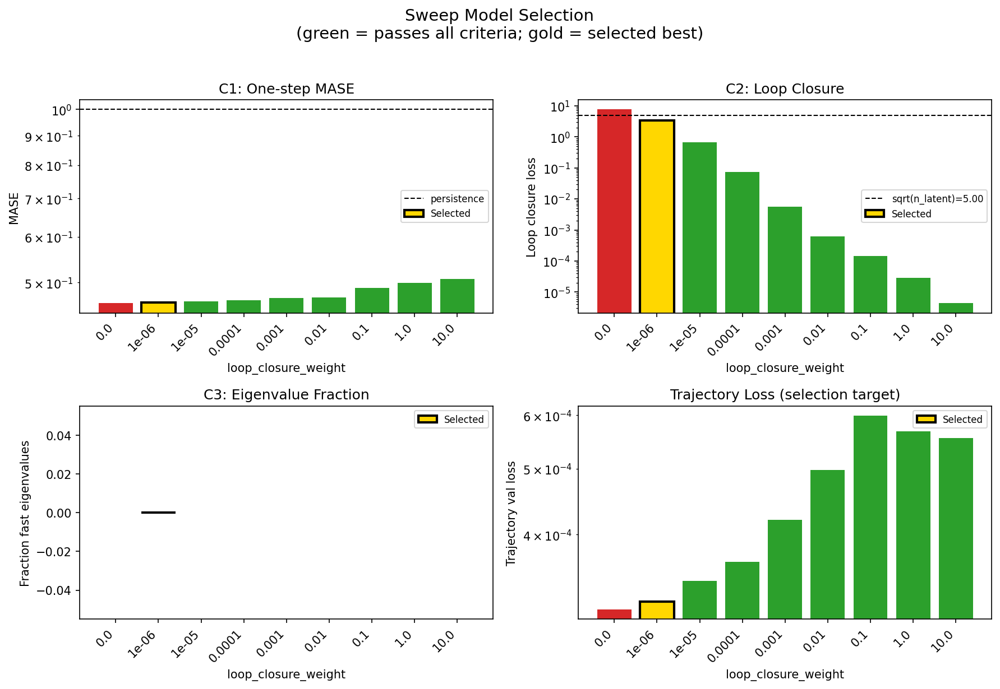

### sweep_pareto

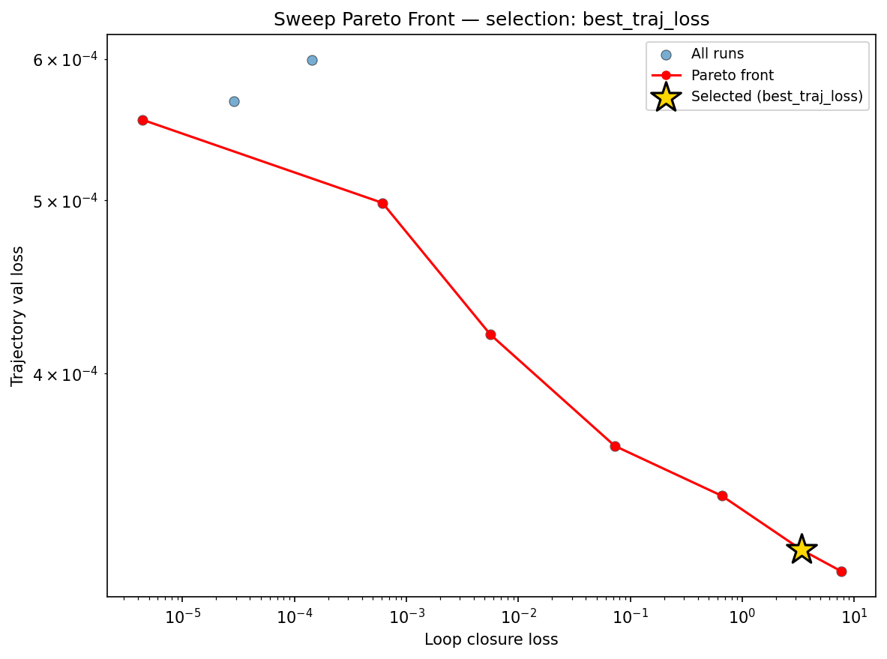

### reconstruction

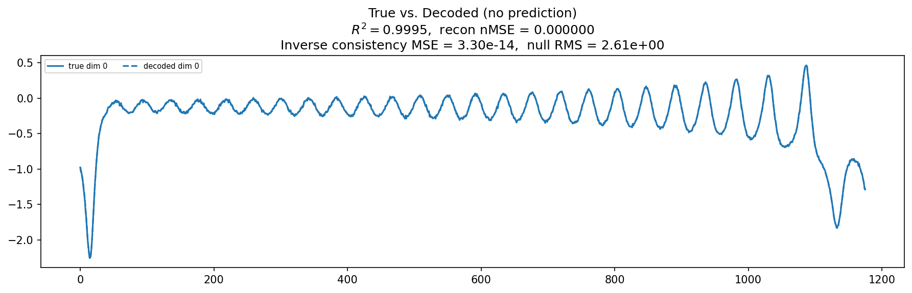

### prediction_windows

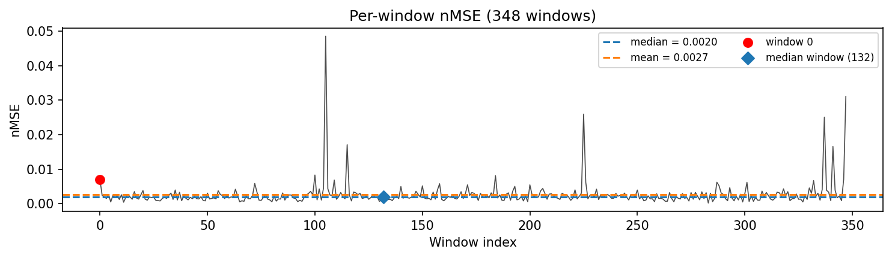

### long_trajectory

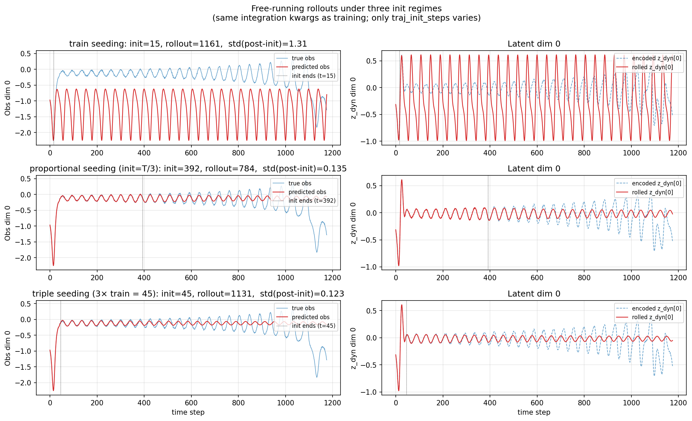

### mase

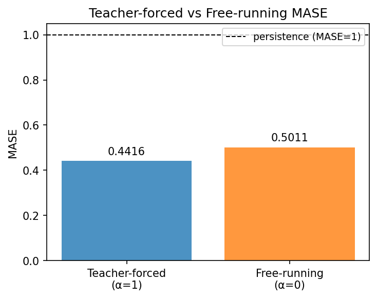

### latent_utilization

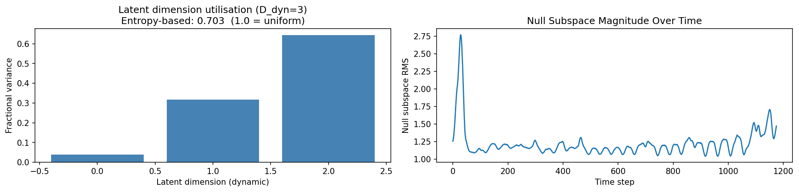

### lyapunov

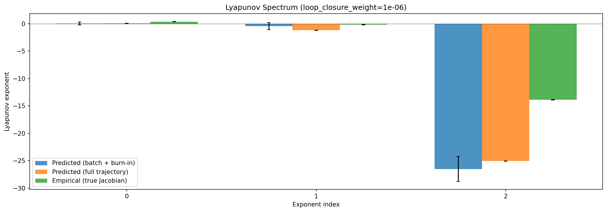

### kaplan_yorke

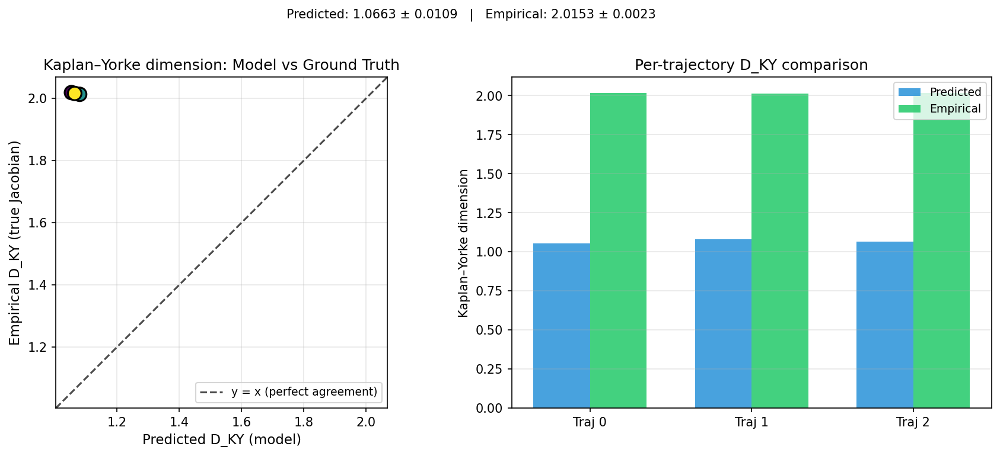

### per_run_lyapunov

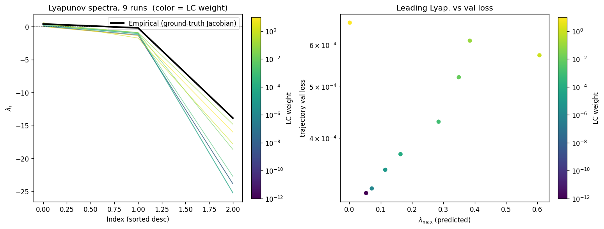

### per_run_lyapunov_vs_true

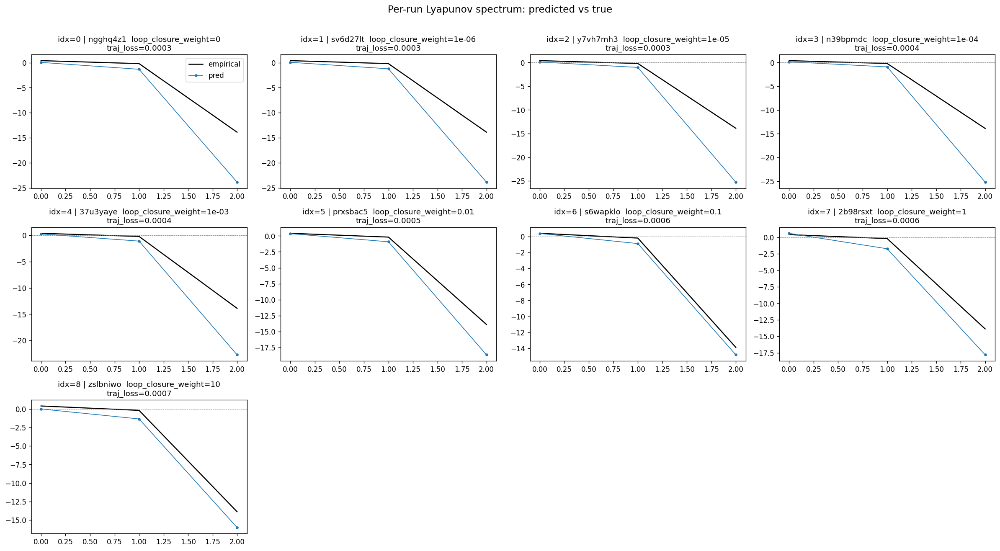

### per_run_lyapunov_relerr

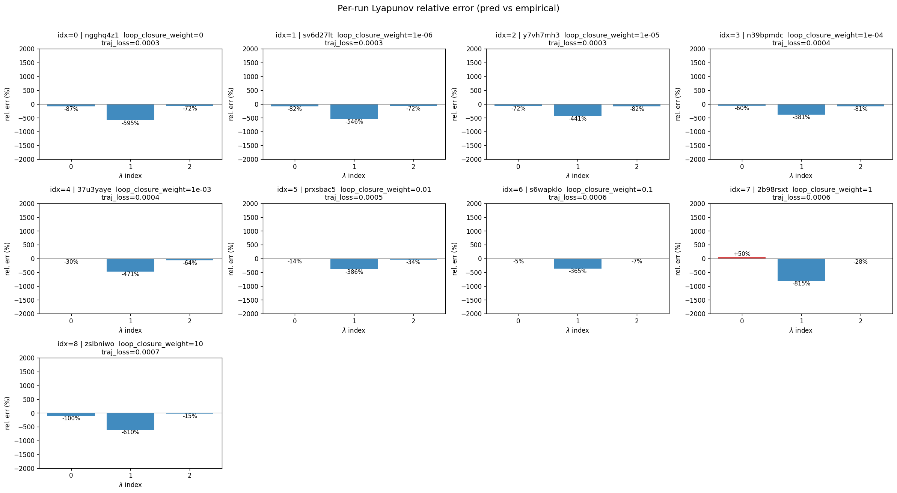

### lyapunov_spectrum_mse_vs_val_loss

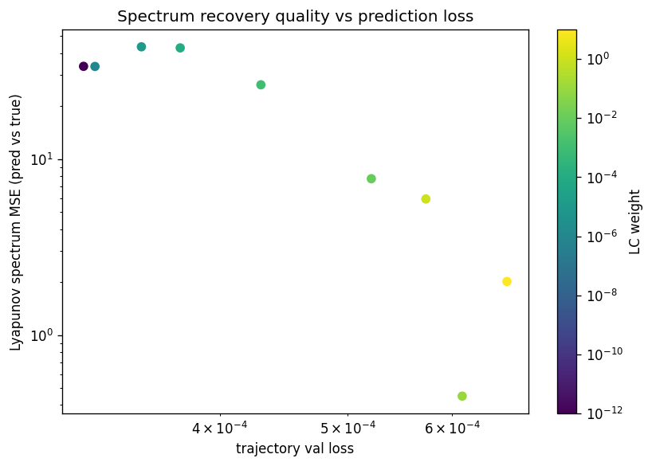

### encoder_decoder_jacobians

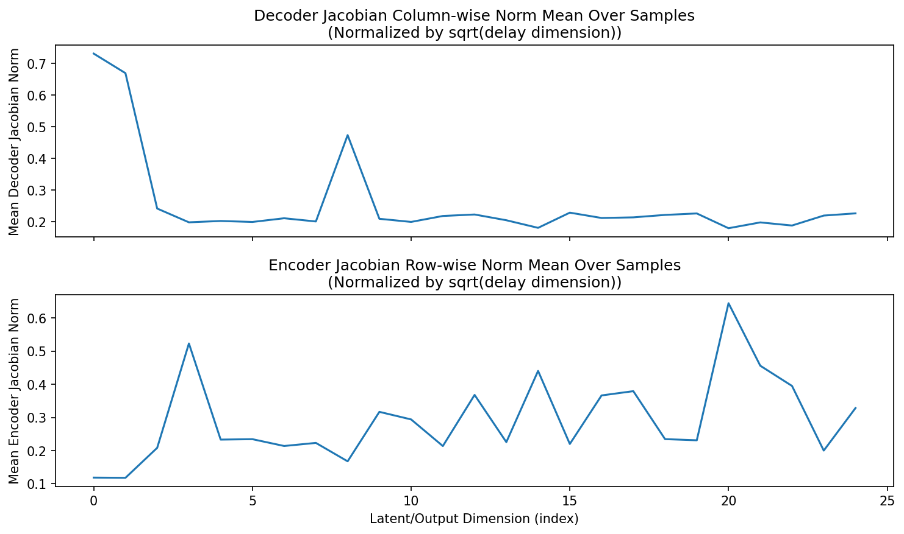

### amplification

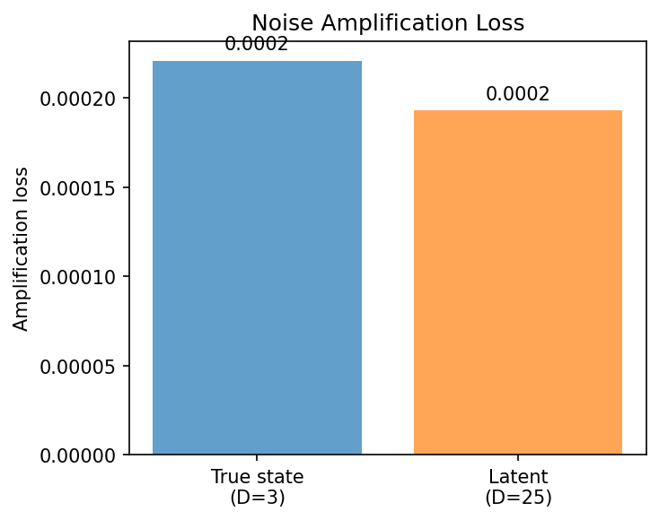

### kaplan_yorke_pca

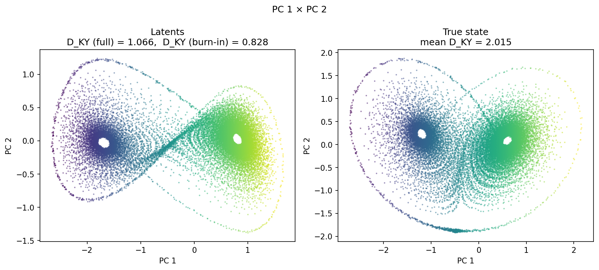

### prediction_detail_latent

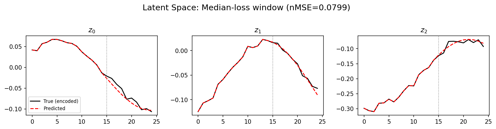

### prediction_detail_obs

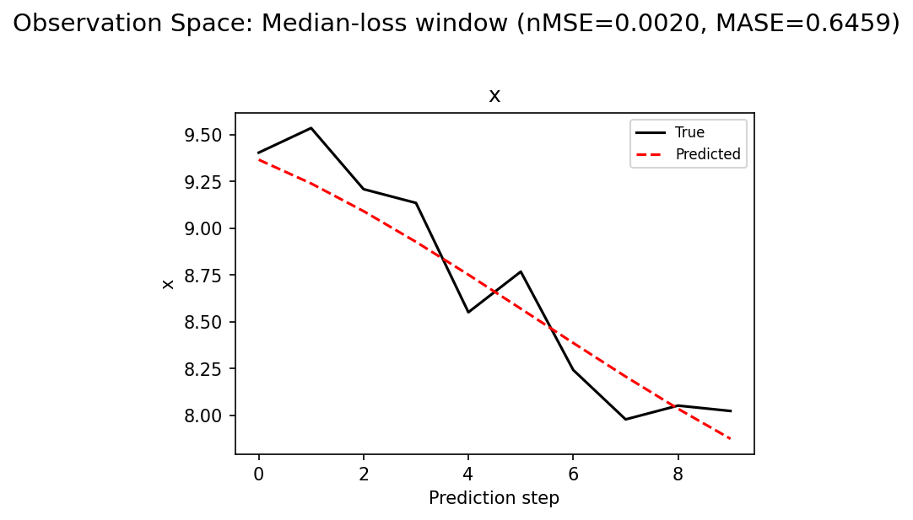

## Discussion

<!--
This section is intentionally left as a placeholder. A human reviewer
or Claude Code agent should fill it in based on the tables and figures
above, explicitly addressing each success criterion and comparing the
outcome to the stated hypothesis. Write the Discussion to
`discussion.md` in this directory and re-run `render_report`.
-->

_(to be written)_

## `run_analytics` stdout

<details><summary>Click to expand — full diagnostic output from <code>run_analytics</code></summary>

```
No run_id provided — selecting best run from group 'lorenz_partial_25d_additive_mse_obsnoise001__lc_sweep' ...
Found 9 total runs in JacobianODE/Lorenz_INDpartial_N25_D1_NormTrue_T3__JacobianODE (group=lorenz_partial_25d_additive_mse_obsnoise001__lc_sweep)
All runs (state, loop_closure_weight, tangent_entropy_weight, kl_dyn_weight):
  ngghq4z1: state=finished, lc=0.0, te=0.0, kl_dyn=0.0
  sv6d27lt: state=finished, lc=1e-06, te=0.0, kl_dyn=0.0
  y7vh7mh3: state=finished, lc=1e-05, te=0.0, kl_dyn=0.0
  n39bpmdc: state=finished, lc=0.0001, te=0.0, kl_dyn=0.0
  37u3yaye: state=finished, lc=0.001, te=0.0, kl_dyn=0.0
  prxsbac5: state=finished, lc=0.01, te=0.0, kl_dyn=0.0
  s6wapklo: state=finished, lc=0.1, te=0.0, kl_dyn=0.0
  2b98rsxt: state=finished, lc=1.0, te=0.0, kl_dyn=0.0
  zslbniwo: state=finished, lc=10.0, te=0.0, kl_dyn=0.0

slurm_timeout_min not found in any run config — falling back to 180 min
  Including ngghq4z1 (lc=0.0): use_all_runs=True (state=finished)
  Including sv6d27lt (lc=1e-06): use_all_runs=True (state=finished)
  Including y7vh7mh3 (lc=1e-05): use_all_runs=True (state=finished)
  Including n39bpmdc (lc=0.0001): use_all_runs=True (state=finished)
  Including 37u3yaye (lc=0.001): use_all_runs=True (state=finished)
  Including prxsbac5 (lc=0.01): use_all_runs=True (state=finished)
  Including s6wapklo (lc=0.1): use_all_runs=True (state=finished)
  Including 2b98rsxt (lc=1.0): use_all_runs=True (state=finished)
  Including zslbniwo (lc=10.0): use_all_runs=True (state=finished)
Found 9 effectively-done sweep runs:
  loop_closure_weight=0.0, tangent_entropy_weight=0.0, kl_dyn_weight=0.0 -> run_id=ngghq4z1
  loop_closure_weight=1e-06, tangent_entropy_weight=0.0, kl_dyn_weight=0.0 -> run_id=sv6d27lt
  loop_closure_weight=1e-05, tangent_entropy_weight=0.0, kl_dyn_weight=0.0 -> run_id=y7vh7mh3
  loop_closure_weight=0.0001, tangent_entropy_weight=0.0, kl_dyn_weight=0.0 -> run_id=n39bpmdc
  loop_closure_weight=0.001, tangent_entropy_weight=0.0, kl_dyn_weight=0.0 -> run_id=37u3yaye
  loop_closure_weight=0.01, tangent_entropy_weight=0.0, kl_dyn_weight=0.0 -> run_id=prxsbac5
  loop_closure_weight=0.1, tangent_entropy_weight=0.0, kl_dyn_weight=0.0 -> run_id=s6wapklo
  loop_closure_weight=1.0, tangent_entropy_weight=0.0, kl_dyn_weight=0.0 -> run_id=2b98rsxt
  loop_closure_weight=10.0, tangent_entropy_weight=0.0, kl_dyn_weight=0.0 -> run_id=zslbniwo
n_dims=25, n_latent=25, n_dyn=3, dt=0.0150
  run=ngghq4z1: DiagnosticMetrics(one_step_mase=0.46019017696380615, loop_closure_loss=7.620031356811523, fast_eigenvalue_fraction=0.0, trajectory_val_loss=0.0003101699985563755) (from cache, n_batches=100)
  run=sv6d27lt: DiagnosticMetrics(one_step_mase=0.46126407384872437, loop_closure_loss=3.3585357666015625, fast_eigenvalue_fraction=0.0, trajectory_val_loss=0.0003188869741279632) (from cache, n_batches=100)
  run=y7vh7mh3: DiagnosticMetrics(one_step_mase=0.4635782241821289, loop_closure_loss=0.656792163848877, fast_eigenvalue_fraction=0.0, trajectory_val_loss=0.00034177646739408374) (from cache, n_batches=100)
  run=n39bpmdc: DiagnosticMetrics(one_step_mase=0.4653404951095581, loop_closure_loss=0.07261452823877335, fast_eigenvalue_fraction=0.0, trajectory_val_loss=0.00036445766454562545) (from cache, n_batches=100)
  run=37u3yaye: DiagnosticMetrics(one_step_mase=0.4694344103336334, loop_closure_loss=0.005616755690425634, fast_eigenvalue_fraction=0.0, trajectory_val_loss=0.0004207075689919293) (from cache, n_batches=100)
  run=prxsbac5: DiagnosticMetrics(one_step_mase=0.471291720867157, loop_closure_loss=0.000610381830483675, fast_eigenvalue_fraction=0.0, trajectory_val_loss=0.0004984594997949898) (from cache, n_batches=100)
  run=s6wapklo: DiagnosticMetrics(one_step_mase=0.4895893335342407, loop_closure_loss=0.00014221546007320285, fast_eigenvalue_fraction=0.0, trajectory_val_loss=0.0005990432109683752) (from cache, n_batches=100)
  run=2b98rsxt: DiagnosticMetrics(one_step_mase=0.49968740344047546, loop_closure_loss=2.8875105272163637e-05, fast_eigenvalue_fraction=0.0, trajectory_val_loss=0.0005684752832166851) (from cache, n_batches=100)
  run=zslbniwo: DiagnosticMetrics(one_step_mase=0.506904661655426, loop_closure_loss=4.352719315647846e-06, fast_eigenvalue_fraction=0.0, trajectory_val_loss=0.000554867961909622) (from cache, n_batches=100)

Ranking method:           best_traj_loss
Best run ID:              sv6d27lt
Best loop_closure_weight: 1e-06
Best tangent_entropy_weight: 0.0
Best kl_dyn_weight:       0.0
Best traj loss:           0.000319
Criteria applied: ['C1', 'C2', 'C3']
Surviving: 8 / 9
Auto-selected run_id: sv6d27lt

======================================================================
PARETO FRONTIER RUNS (7 runs)
======================================================================
  Run ID               LC Loss   Traj Val Loss
  ------------  --------------  --------------
  zslbniwo            0.000004        0.000555
  prxsbac5            0.000610        0.000498
  37u3yaye            0.005617        0.000421
  n39bpmdc            0.072615        0.000364
  y7vh7mh3            0.656792        0.000342
  sv6d27lt            3.358536        0.000319 <-- selected
  ngghq4z1            7.620031        0.000310

======================================================================
RANKING METHOD COMPARISON (over 8 survivors)
======================================================================
  Method                  Run ID               LC Loss   Traj Val Loss
  ----------------------  ------------  --------------  --------------
  best_traj_loss          sv6d27lt            3.358536        0.000319 <-- active
  pareto_knee             prxsbac5            0.000610        0.000498
  geo_rank                zslbniwo            0.000004        0.000555
  minimax_rank            37u3yaye            0.005617        0.000421
  geo_log_score           sv6d27lt            3.358536        0.000319
  minimax_log_score       37u3yaye            0.005617        0.000421
======================================================================

Loading run sv6d27lt from JacobianODE/Lorenz_INDpartial_N25_D1_NormTrue_T3__JacobianODE ...
Train dataset shape: torch.Size([25322, 25, 25])
Validation dataset shape: torch.Size([8057, 25, 25])
Test dataset shape: torch.Size([3453, 25, 25])
Train trajectories dataset shape: torch.Size([22, 1176, 25])
Validation trajectories dataset shape: torch.Size([7, 1176, 25])
Test trajectories dataset shape: torch.Size([3, 1176, 25])
Loading checkpoint epoch=169-step=34000.ckpt...
Computing reconstruction ...
Computing MASE ...
Teacher-forced MASE: 0.4416
Free-running MASE:   0.5011
Computing latent utilization ...
Entropy-based utilization: 0.703
Null subspace mean RMS: 1.239336e+00
Computing Lyapunov exponents ...
  Computing full-trajectory Lyapunov (3 test trajs, T=1176) ...
Predicted Lyapunov exponents (batch+burn-in, 128 windowed trajs):
  λ_1 = +0.0450 ± 0.2670
  λ_2 = -0.4431 ± 0.6440
  λ_3 = -26.5091 ± 2.2571
Predicted Lyapunov exponents (full-length, 3 test trajs):
  λ_1 = +0.0797 ± 0.0166
  λ_2 = -1.2001 ± 0.0166
  λ_3 = -25.0504 ± 0.0329
Empirical Lyapunov exponents (mean ± std):
  λ_1 = +0.3846 ± 0.0251
  λ_2 = -0.1716 ± 0.0444
  λ_3 = -13.8799 ± 0.0398
Mean KY dim (predicted): 1.066 ± 0.011
Mean KY dim (empirical): 2.015 ± 0.002
Mean KY dim (burn-in):   0.828 ± 0.672
Computing prediction windows ...
Windows: 348 — nMSE min=0.0002, median=0.0020, mean=0.0027, max=0.0486
Computing long trajectory prediction ...
Computing encoder/decoder Jacobians ...
encoder_jacobian: (128, 25, 25)
decoder_jacobian: (128, 25, 25)
Computing amplification loss ...
Amplification loss — True state: 0.000221
Amplification loss — Latent:     0.000193
```

</details>
