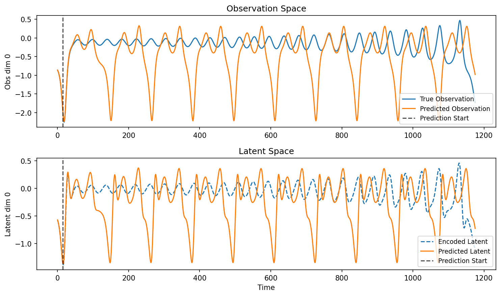
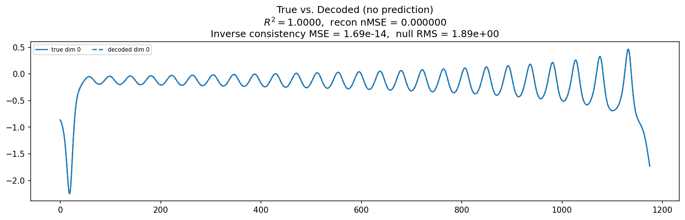
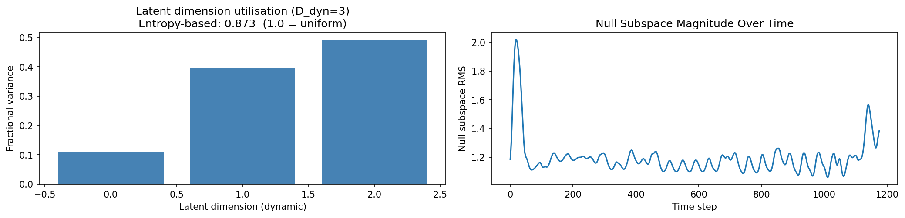
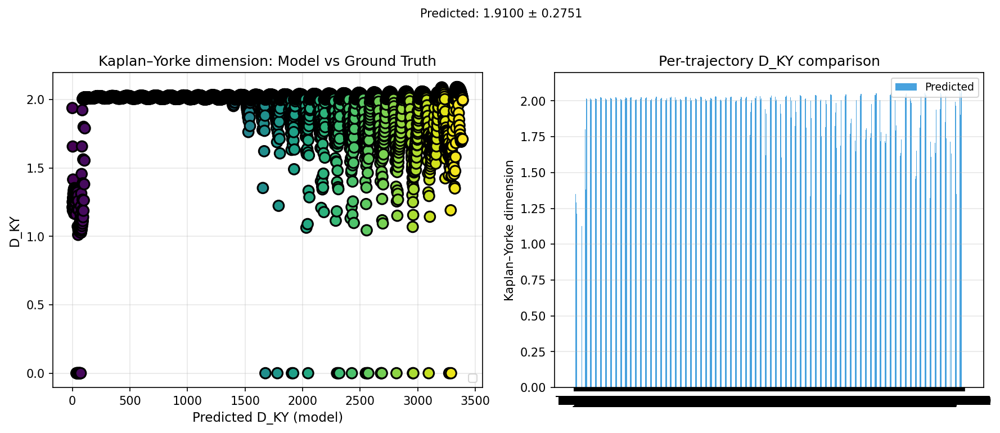
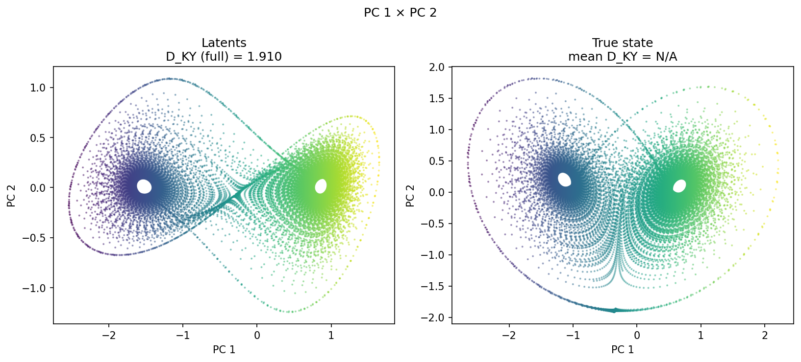
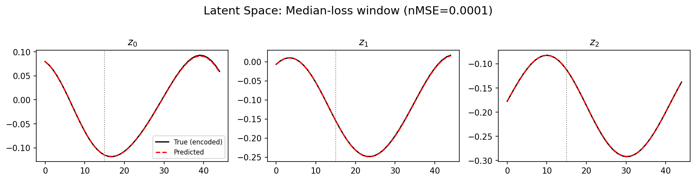
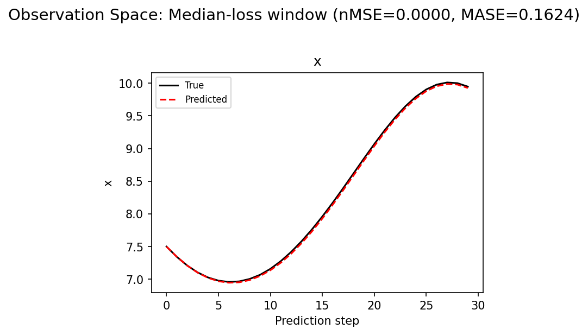
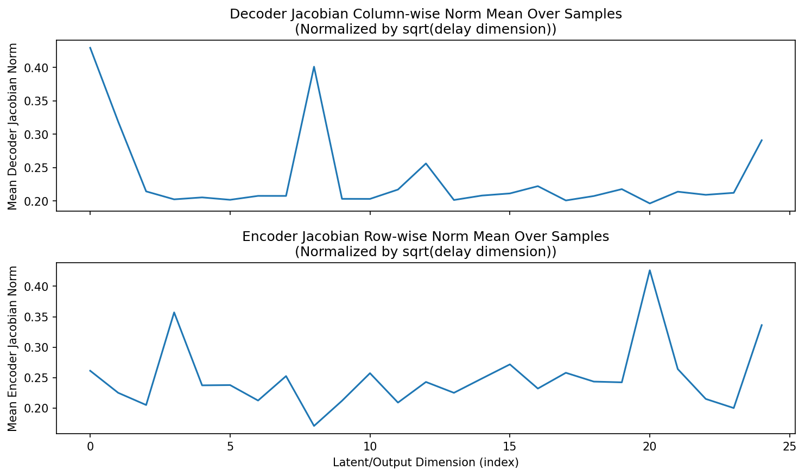
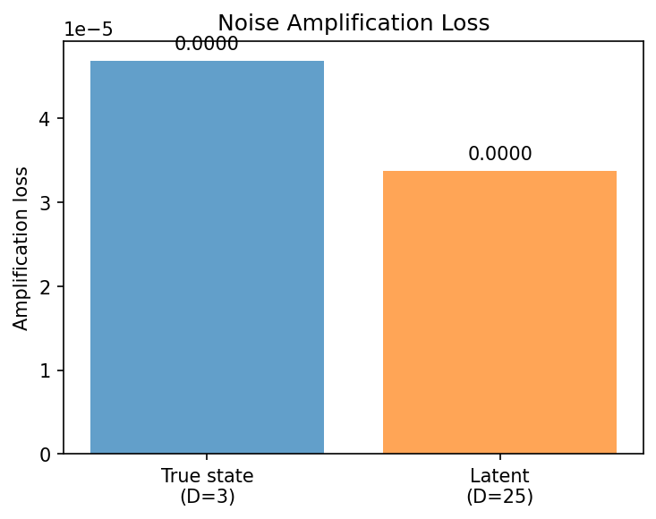

# Sweep Analysis: `lorenz_partial_25d_additive_mse_p30__lc_sweep`

**Project**: [Lorenz_INDpartial_N25_D1_NormTrue_T3__JacobianODE](https://wandb.ai/JacobianODE/Lorenz_INDpartial_N25_D1_NormTrue_T3__JacobianODE/groups/lorenz_partial_25d_additive_mse_p30__lc_sweep)  
**Launched**: 2026-04-15T10:36:39Z  
**Completed**: 2026-04-15T14:40:12Z  
**Outcome**: `complete_clean`  
**Git**: `latent-JacobianODE` @ `c35dd72`  
**Expected runs**: 9

## Experiment Context

### `lorenz_partial_25d_additive_mse_p30`

**Description**

Partial-obs Lorenz: x-coordinate only (observed_indices=[0]),
n_delays=25, delay_spacing=1. Encoder input 25-D, z_dyn 3-D,
z_null 22-D with kl_null_weight=0. Additive coupling encoder,
joint training, reconstruction_mode='most_recent'. Plain MSE loss.
prediction_steps=30, seq_length=45. obs_noise_scale=0.

**Hypothesis**

A longer prediction horizon sharpens the forward-rollout training
signal, which in partial-obs has been the main limiter of spectrum
recovery. Expecting tighter λ_min (less under-contracted than the
10-step baseline) and improved trajectory_r2.

**Success criteria**

- Best run's leading Lyapunov exponent > 0
- Best run's predicted Lyapunov spectrum within ~40% of empirical
- Noticeable improvement in λ_min recovery vs p10 partial_25d_mse

## Results

**Overall best MASE**: 0.1526 (LC weight = 0.0e+00, obs_noise_scale = 0.00)
**Overall best traj loss**: 0.00004 at epoch 157.0
**Runs analyzed**: 9

### Best run per `obs_noise_scale`

| obs_noise_scale | Best LC weight | Best traj loss | MASE at best | R² | LC loss | epoch |
|---|---|---|---|---|---|---|
| 0.0 | 0.0e+00 | 0.00004 | 0.1526 | 0.9999 | 0.229 | 157.0 |

## Success-criteria verdicts (automated)

| Criterion | Verdict | Note |
|---|---|---|
| Best run's leading Lyapunov exponent > 0 | **Unknown** |  |
| Best run's predicted Lyapunov spectrum within ~40% of empirical | **Unknown** |  |
| Noticeable improvement in λ_min recovery vs p10 partial_25d_mse | **Unknown** |  |

_Automated verdicts use simple numeric-threshold parsing and may mis-classify qualitative criteria. The Discussion section below takes precedence._

## Figures

### sweep_overview


### sweep_pareto


### prediction_windows


### long_trajectory



### mase


### lyapunov


### per_run_lyapunov


### per_run_lyapunov_vs_true


### per_run_lyapunov_relerr


### lyapunov_spectrum_mse_vs_val_loss


### reconstruction



### latent_utilization



### kaplan_yorke



### kaplan_yorke_pca



### prediction_detail_latent



### prediction_detail_obs



### encoder_decoder_jacobians



### amplification



## Discussion

<!--
This section is intentionally left as a placeholder. A human reviewer
or Claude Code agent should fill it in based on the tables and figures
above, explicitly addressing each success criterion and comparing the
outcome to the stated hypothesis. Write the Discussion to
`discussion.md` in this directory and re-run `render_report`.
-->

_(to be written)_

## `run_analytics` stdout

<details><summary>Click to expand — full diagnostic output from <code>run_analytics</code></summary>

```
No run_id provided — selecting best run from group 'lorenz_partial_25d_additive_mse_p30__lc_sweep' ...
Found 9 total runs in JacobianODE/Lorenz_INDpartial_N25_D1_NormTrue_T3__JacobianODE (group=lorenz_partial_25d_additive_mse_p30__lc_sweep)
All runs (state, loop_closure_weight, tangent_entropy_weight, kl_dyn_weight):
  14bedd98: state=finished, lc=1e-05, te=0.0, kl_dyn=0.0
  1sd1oshk: state=finished, lc=1e-06, te=0.0, kl_dyn=0.0
  mrlaz23p: state=finished, lc=0.0, te=0.0, kl_dyn=0.0
  mvgj4an1: state=finished, lc=0.0001, te=0.0, kl_dyn=0.0
  2kjpo3wj: state=finished, lc=0.1, te=0.0, kl_dyn=0.0
  qfgsuu0y: state=finished, lc=1.0, te=0.0, kl_dyn=0.0
  zrdflw7j: state=finished, lc=10.0, te=0.0, kl_dyn=0.0
  8limhocw: state=finished, lc=0.001, te=0.0, kl_dyn=0.0
  vnaouu4h: state=finished, lc=0.01, te=0.0, kl_dyn=0.0

slurm_timeout_min not found in any run config — falling back to 180 min
  Including 14bedd98 (lc=1e-05): use_all_runs=True (state=finished)
  Including 1sd1oshk (lc=1e-06): use_all_runs=True (state=finished)
  Including mrlaz23p (lc=0.0): use_all_runs=True (state=finished)
  Including mvgj4an1 (lc=0.0001): use_all_runs=True (state=finished)
  Including 2kjpo3wj (lc=0.1): use_all_runs=True (state=finished)
  Including qfgsuu0y (lc=1.0): use_all_runs=True (state=finished)
  Including zrdflw7j (lc=10.0): use_all_runs=True (state=finished)
  Including 8limhocw (lc=0.001): use_all_runs=True (state=finished)
  Including vnaouu4h (lc=0.01): use_all_runs=True (state=finished)
Found 9 effectively-done sweep runs:
  loop_closure_weight=0.0, tangent_entropy_weight=0.0, kl_dyn_weight=0.0 -> run_id=mrlaz23p
  loop_closure_weight=1e-06, tangent_entropy_weight=0.0, kl_dyn_weight=0.0 -> run_id=1sd1oshk
  loop_closure_weight=1e-05, tangent_entropy_weight=0.0, kl_dyn_weight=0.0 -> run_id=14bedd98
  loop_closure_weight=0.0001, tangent_entropy_weight=0.0, kl_dyn_weight=0.0 -> run_id=mvgj4an1
  loop_closure_weight=0.001, tangent_entropy_weight=0.0, kl_dyn_weight=0.0 -> run_id=8limhocw
  loop_closure_weight=0.01, tangent_entropy_weight=0.0, kl_dyn_weight=0.0 -> run_id=vnaouu4h
  loop_closure_weight=0.1, tangent_entropy_weight=0.0, kl_dyn_weight=0.0 -> run_id=2kjpo3wj
  loop_closure_weight=1.0, tangent_entropy_weight=0.0, kl_dyn_weight=0.0 -> run_id=qfgsuu0y
  loop_closure_weight=10.0, tangent_entropy_weight=0.0, kl_dyn_weight=0.0 -> run_id=zrdflw7j
n_dims=25, n_latent=25, n_dyn=3, dt=0.0150
  run=mrlaz23p: DiagnosticMetrics(one_step_mase=0.05323868617415428, loop_closure_loss=0.22897323966026306, fast_eigenvalue_fraction=0.0, trajectory_val_loss=4.298223211662844e-05) (from cache, n_batches=100)
  run=1sd1oshk: DiagnosticMetrics(one_step_mase=0.07847961038351059, loop_closure_loss=0.3126348555088043, fast_eigenvalue_fraction=0.0, trajectory_val_loss=0.002675914205610752) (from cache, n_batches=100)
  run=14bedd98: DiagnosticMetrics(one_step_mase=0.07729717344045639, loop_closure_loss=0.24837779998779297, fast_eigenvalue_fraction=0.0, trajectory_val_loss=0.00012468814384192228) (from cache, n_batches=100)
  run=mvgj4an1: DiagnosticMetrics(one_step_mase=0.05887477099895477, loop_closure_loss=0.04615406692028046, fast_eigenvalue_fraction=0.0, trajectory_val_loss=5.3177991503616795e-05) (from cache, n_batches=100)
  run=8limhocw: DiagnosticMetrics(one_step_mase=0.15273365378379822, loop_closure_loss=0.009837581776082516, fast_eigenvalue_fraction=0.0, trajectory_val_loss=0.0001729045616229996) (from cache, n_batches=100)
  run=vnaouu4h: DiagnosticMetrics(one_step_mase=0.16946785151958466, loop_closure_loss=0.0020310941617935896, fast_eigenvalue_fraction=0.0, trajectory_val_loss=0.0004997099749743938) (from cache, n_batches=100)
  run=2kjpo3wj: DiagnosticMetrics(one_step_mase=0.10682576894760132, loop_closure_loss=8.54705722304061e-05, fast_eigenvalue_fraction=0.0, trajectory_val_loss=0.0006208796985447407) (from cache, n_batches=100)
  run=qfgsuu0y: DiagnosticMetrics(one_step_mase=0.09887446463108063, loop_closure_loss=2.1261592337395996e-05, fast_eigenvalue_fraction=0.0, trajectory_val_loss=0.0008999327546916902) (from cache, n_batches=100)
  run=zrdflw7j: DiagnosticMetrics(one_step_mase=0.2357090413570404, loop_closure_loss=1.1918265045096632e-05, fast_eigenvalue_fraction=0.0, trajectory_val_loss=0.0010838722810149193) (from cache, n_batches=100)

Ranking method:           best_traj_loss
Best run ID:              mrlaz23p
Best loop_closure_weight: 0.0
Best tangent_entropy_weight: 0.0
Best kl_dyn_weight:       0.0
Best traj loss:           0.000043
Criteria applied: ['C1', 'C2', 'C3']
Surviving: 9 / 9
Auto-selected run_id: mrlaz23p

======================================================================
PARETO FRONTIER RUNS (7 runs)
======================================================================
  Run ID               LC Loss   Traj Val Loss
  ------------  --------------  --------------
  zrdflw7j            0.000012        0.001084
  qfgsuu0y            0.000021        0.000900
  2kjpo3wj            0.000085        0.000621
  vnaouu4h            0.002031        0.000500
  8limhocw            0.009838        0.000173
  mvgj4an1            0.046154        0.000053
  mrlaz23p            0.228973        0.000043 <-- selected

======================================================================
RANKING METHOD COMPARISON (over 9 survivors)
======================================================================
  Method                  Run ID               LC Loss   Traj Val Loss
  ----------------------  ------------  --------------  --------------
  best_traj_loss          mrlaz23p            0.228973        0.000043 <-- active
  pareto_knee             vnaouu4h            0.002031        0.000500
  geo_rank                mrlaz23p            0.228973        0.000043
  minimax_rank            8limhocw            0.009838        0.000173
  geo_log_score           mrlaz23p            0.228973        0.000043
  minimax_log_score       vnaouu4h            0.002031        0.000500
======================================================================

Loading run mrlaz23p from JacobianODE/Lorenz_INDpartial_N25_D1_NormTrue_T3__JacobianODE ...
Train dataset shape: torch.Size([24882, 45, 25])
Validation dataset shape: torch.Size([7917, 45, 25])
Test dataset shape: torch.Size([3393, 45, 25])
Train trajectories dataset shape: torch.Size([22, 1176, 25])
Validation trajectories dataset shape: torch.Size([7, 1176, 25])
Test trajectories dataset shape: torch.Size([3, 1176, 25])
Loading checkpoint epoch=157-step=31600.ckpt...
Computing reconstruction ...
Computing latent utilization ...
Entropy-based utilization: 0.873
Null subspace mean RMS: 1.203049e+00
Computing Lyapunov exponents for KY dimension (full-length, chunk-batched) ...
Mean KY dim (predicted): 1.910 ± 0.275
Computing prediction windows ...
Windows: 114 — nMSE min=0.0000, median=0.0000, mean=0.0006, max=0.0134
Computing long trajectory prediction ...
Computing encoder/decoder Jacobians ...
encoder_jacobian: (128, 25, 25)
decoder_jacobian: (128, 25, 25)
Computing amplification loss ...
Amplification loss — True state: 0.000047
Amplification loss — Latent:     0.000034


--- backfill 2026-04-16T04:30:04Z sections=['reconstruction', 'latent_utilization', 'kaplan_yorke', 'prediction_detail', 'long_trajectory', 'encoder_decoder_jacobians', 'amplification'] ---
No run_id provided — selecting best run from group 'lorenz_partial_25d_additive_mse_p30__lc_sweep' ...
Found 9 total runs in JacobianODE/Lorenz_INDpartial_N25_D1_NormTrue_T3__JacobianODE (group=lorenz_partial_25d_additive_mse_p30__lc_sweep)
All runs (state, loop_closure_weight, tangent_entropy_weight, kl_dyn_weight):
  14bedd98: state=finished, lc=1e-05, te=0.0, kl_dyn=0.0
  1sd1oshk: state=finished, lc=1e-06, te=0.0, kl_dyn=0.0
  mrlaz23p: state=finished, lc=0.0, te=0.0, kl_dyn=0.0
  mvgj4an1: state=finished, lc=0.0001, te=0.0, kl_dyn=0.0
  2kjpo3wj: state=finished, lc=0.1, te=0.0, kl_dyn=0.0
  qfgsuu0y: state=finished, lc=1.0, te=0.0, kl_dyn=0.0
  zrdflw7j: state=finished, lc=10.0, te=0.0, kl_dyn=0.0
  8limhocw: state=finished, lc=0.001, te=0.0, kl_dyn=0.0
  vnaouu4h: state=finished, lc=0.01, te=0.0, kl_dyn=0.0

slurm_timeout_min not found in any run config — falling back to 180 min
  Including 14bedd98 (lc=1e-05): use_all_runs=True (state=finished)
  Including 1sd1oshk (lc=1e-06): use_all_runs=True (state=finished)
  Including mrlaz23p (lc=0.0): use_all_runs=True (state=finished)
  Including mvgj4an1 (lc=0.0001): use_all_runs=True (state=finished)
  Including 2kjpo3wj (lc=0.1): use_all_runs=True (state=finished)
  Including qfgsuu0y (lc=1.0): use_all_runs=True (state=finished)
  Including zrdflw7j (lc=10.0): use_all_runs=True (state=finished)
  Including 8limhocw (lc=0.001): use_all_runs=True (state=finished)
  Including vnaouu4h (lc=0.01): use_all_runs=True (state=finished)
Found 9 effectively-done sweep runs:
  loop_closure_weight=0.0, tangent_entropy_weight=0.0, kl_dyn_weight=0.0 -> run_id=mrlaz23p
  loop_closure_weight=1e-06, tangent_entropy_weight=0.0, kl_dyn_weight=0.0 -> run_id=1sd1oshk
  loop_closure_weight=1e-05, tangent_entropy_weight=0.0, kl_dyn_weight=0.0 -> run_id=14bedd98
  loop_closure_weight=0.0001, tangent_entropy_weight=0.0, kl_dyn_weight=0.0 -> run_id=mvgj4an1
  loop_closure_weight=0.001, tangent_entropy_weight=0.0, kl_dyn_weight=0.0 -> run_id=8limhocw
  loop_closure_weight=0.01, tangent_entropy_weight=0.0, kl_dyn_weight=0.0 -> run_id=vnaouu4h
  loop_closure_weight=0.1, tangent_entropy_weight=0.0, kl_dyn_weight=0.0 -> run_id=2kjpo3wj
  loop_closure_weight=1.0, tangent_entropy_weight=0.0, kl_dyn_weight=0.0 -> run_id=qfgsuu0y
  loop_closure_weight=10.0, tangent_entropy_weight=0.0, kl_dyn_weight=0.0 -> run_id=zrdflw7j
n_dims=25, n_latent=25, n_dyn=3, dt=0.0150
  run=mrlaz23p: DiagnosticMetrics(one_step_mase=0.05323868617415428, loop_closure_loss=0.22897323966026306, fast_eigenvalue_fraction=0.0, trajectory_val_loss=4.298223211662844e-05) (from cache, n_batches=100)
  run=1sd1oshk: DiagnosticMetrics(one_step_mase=0.07847961038351059, loop_closure_loss=0.3126348555088043, fast_eigenvalue_fraction=0.0, trajectory_val_loss=0.002675914205610752) (from cache, n_batches=100)
  run=14bedd98: DiagnosticMetrics(one_step_mase=0.07729717344045639, loop_closure_loss=0.24837779998779297, fast_eigenvalue_fraction=0.0, trajectory_val_loss=0.00012468814384192228) (from cache, n_batches=100)
  run=mvgj4an1: DiagnosticMetrics(one_step_mase=0.05887477099895477, loop_closure_loss=0.04615406692028046, fast_eigenvalue_fraction=0.0, trajectory_val_loss=5.3177991503616795e-05) (from cache, n_batches=100)
  run=8limhocw: DiagnosticMetrics(one_step_mase=0.15273365378379822, loop_closure_loss=0.009837581776082516, fast_eigenvalue_fraction=0.0, trajectory_val_loss=0.0001729045616229996) (from cache, n_batches=100)
  run=vnaouu4h: DiagnosticMetrics(one_step_mase=0.16946785151958466, loop_closure_loss=0.0020310941617935896, fast_eigenvalue_fraction=0.0, trajectory_val_loss=0.0004997099749743938) (from cache, n_batches=100)
  run=2kjpo3wj: DiagnosticMetrics(one_step_mase=0.10682576894760132, loop_closure_loss=8.54705722304061e-05, fast_eigenvalue_fraction=0.0, trajectory_val_loss=0.0006208796985447407) (from cache, n_batches=100)
  run=qfgsuu0y: DiagnosticMetrics(one_step_mase=0.09887446463108063, loop_closure_loss=2.1261592337395996e-05, fast_eigenvalue_fraction=0.0, trajectory_val_loss=0.0008999327546916902) (from cache, n_batches=100)
  run=zrdflw7j: DiagnosticMetrics(one_step_mase=0.2357090413570404, loop_closure_loss=1.1918265045096632e-05, fast_eigenvalue_fraction=0.0, trajectory_val_loss=0.0010838722810149193) (from cache, n_batches=100)

Ranking method:           best_traj_loss
Best run ID:              mrlaz23p
Best loop_closure_weight: 0.0
Best tangent_entropy_weight: 0.0
Best kl_dyn_weight:       0.0
Best traj loss:           0.000043
Criteria applied: ['C1', 'C2', 'C3']
Surviving: 9 / 9
Auto-selected run_id: mrlaz23p

======================================================================
PARETO FRONTIER RUNS (7 runs)
======================================================================
  Run ID               LC Loss   Traj Val Loss
  ------------  --------------  --------------
  zrdflw7j            0.000012        0.001084
  qfgsuu0y            0.000021        0.000900
  2kjpo3wj            0.000085        0.000621
  vnaouu4h            0.002031        0.000500
  8limhocw            0.009838        0.000173
  mvgj4an1            0.046154        0.000053
  mrlaz23p            0.228973        0.000043 <-- selected

======================================================================
RANKING METHOD COMPARISON (over 9 survivors)
======================================================================
  Method                  Run ID               LC Loss   Traj Val Loss
  ----------------------  ------------  --------------  --------------
  best_traj_loss          mrlaz23p            0.228973        0.000043 <-- active
  pareto_knee             vnaouu4h            0.002031        0.000500
  geo_rank                mrlaz23p            0.228973        0.000043
  minimax_rank            8limhocw            0.009838        0.000173
  geo_log_score           mrlaz23p            0.228973        0.000043
  minimax_log_score       vnaouu4h            0.002031        0.000500
======================================================================

Loading run mrlaz23p from JacobianODE/Lorenz_INDpartial_N25_D1_NormTrue_T3__JacobianODE ...
Train dataset shape: torch.Size([24882, 45, 25])
Validation dataset shape: torch.Size([7917, 45, 25])
Test dataset shape: torch.Size([3393, 45, 25])
Train trajectories dataset shape: torch.Size([22, 1176, 25])
Validation trajectories dataset shape: torch.Size([7, 1176, 25])
Test trajectories dataset shape: torch.Size([3, 1176, 25])
Loading checkpoint epoch=157-step=31600.ckpt...
Computing reconstruction ...
Computing latent utilization ...
Entropy-based utilization: 0.873
Null subspace mean RMS: 1.203049e+00
Computing Lyapunov exponents for KY dimension (full-length, chunk-batched) ...
Mean KY dim (predicted): 1.910 ± 0.275
Computing prediction windows ...
Windows: 114 — nMSE min=0.0000, median=0.0000, mean=0.0006, max=0.0134
Computing long trajectory prediction ...
Computing encoder/decoder Jacobians ...
encoder_jacobian: (128, 25, 25)
decoder_jacobian: (128, 25, 25)
Computing amplification loss ...
Amplification loss — True state: 0.000047
Amplification loss — Latent:     0.000034
```

</details>
