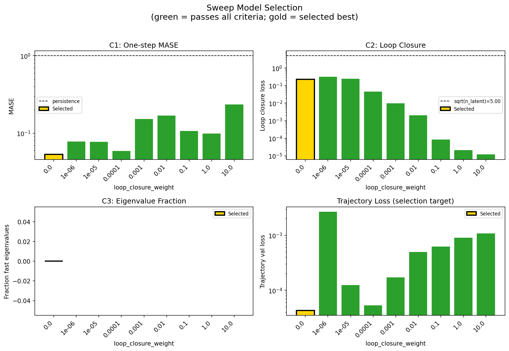
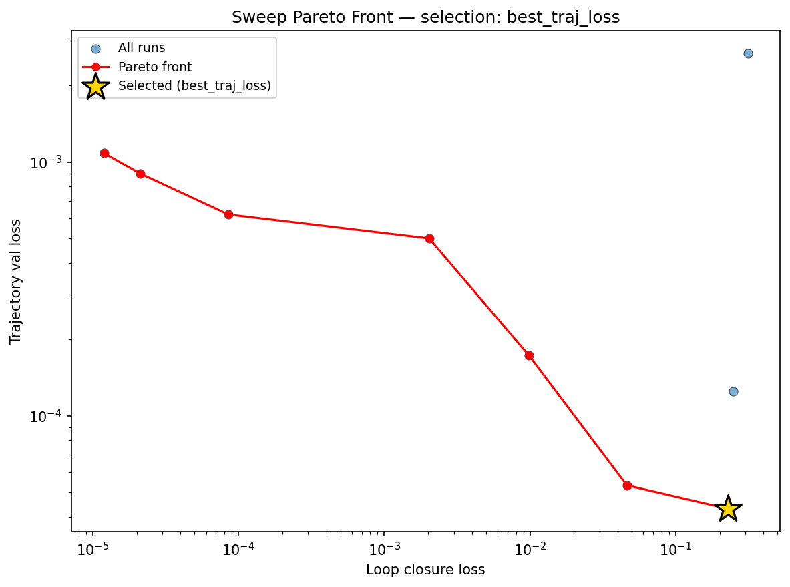
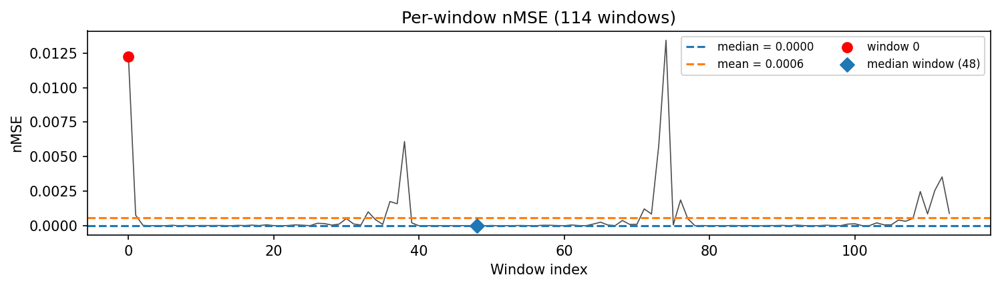
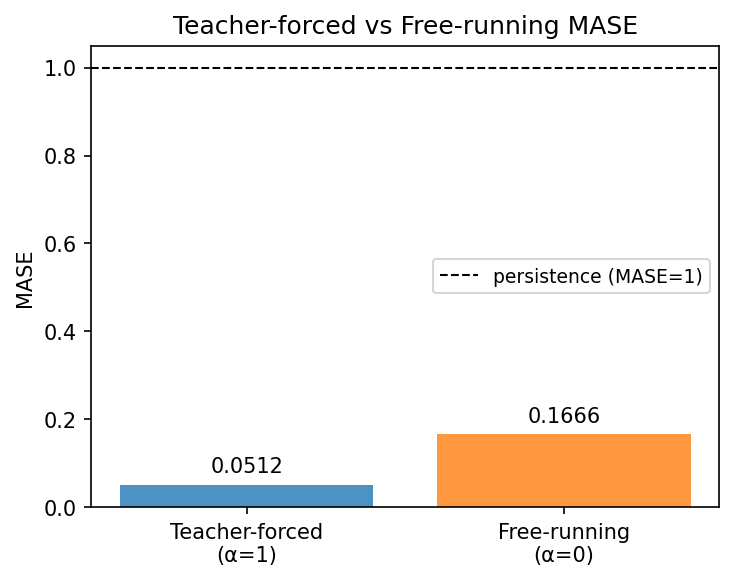
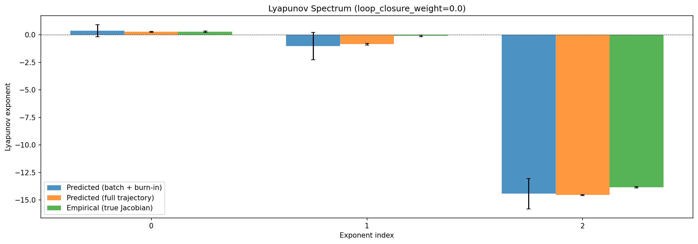
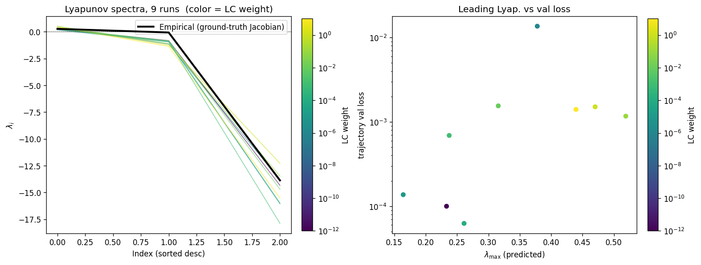
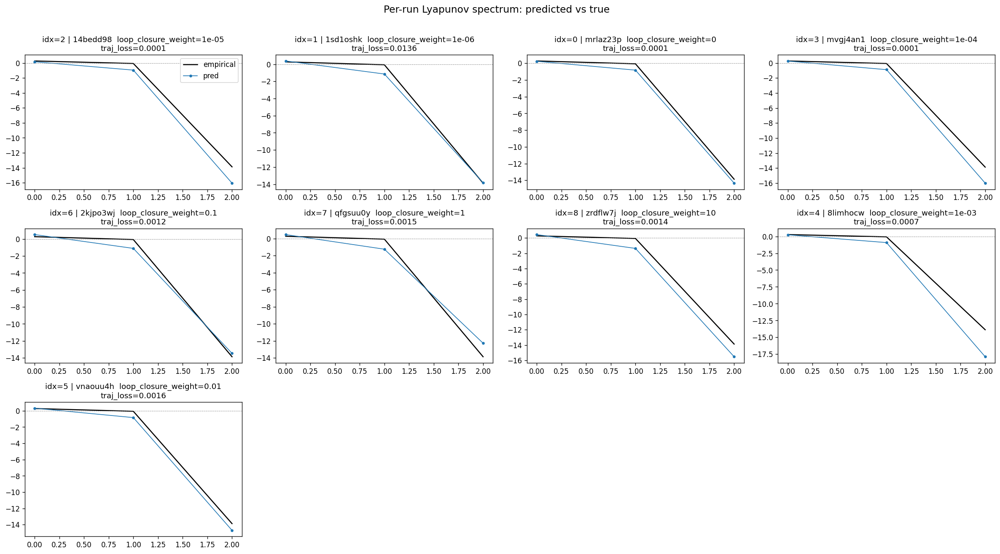
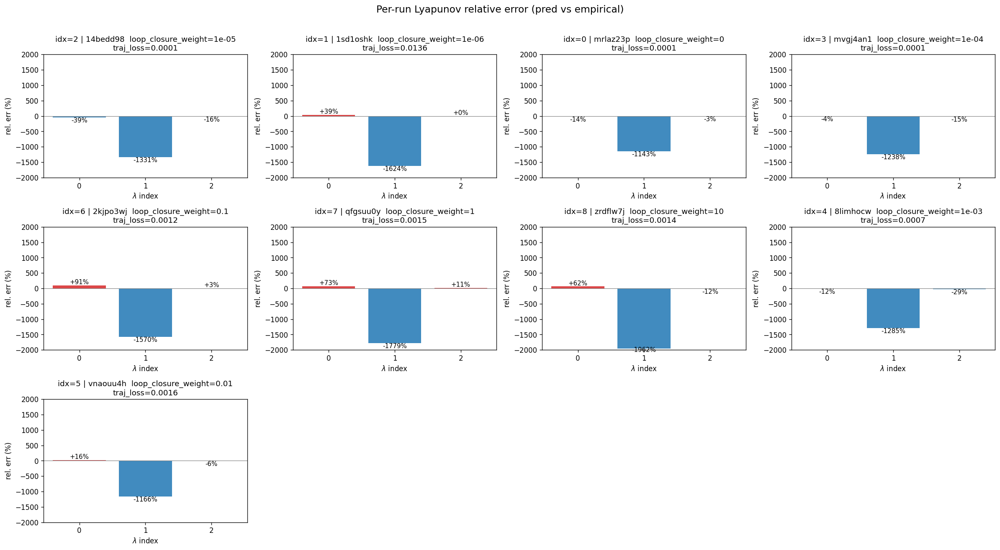
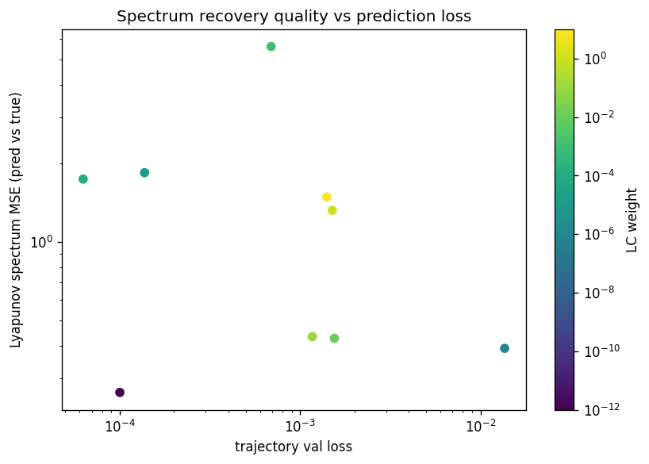

# Sweep Analysis: `lorenz_partial_25d_additive_mse_p30__lc_sweep`

**Project**: [Lorenz_INDpartial_N25_D1_NormTrue_T3__JacobianODE](https://wandb.ai/JacobianODE/Lorenz_INDpartial_N25_D1_NormTrue_T3__JacobianODE/groups/lorenz_partial_25d_additive_mse_p30__lc_sweep)  
**Launched**: 2026-04-15T10:36:39Z  
**Completed**: 2026-04-15T14:40:12Z  
**Outcome**: `complete_clean`  
**Git**: `latent-JacobianODE` @ `c35dd72`  
**Expected runs**: 9

## Experiment Context

### `lorenz_partial_25d_additive_mse_p30`

**Description**

Partial-obs Lorenz: x-coordinate only (observed_indices=[0]),
n_delays=25, delay_spacing=1. Encoder input 25-D, z_dyn 3-D,
z_null 22-D with kl_null_weight=0. Additive coupling encoder,
joint training, reconstruction_mode='most_recent'. Plain MSE loss.
prediction_steps=30, seq_length=45. obs_noise_scale=0.

**Hypothesis**

A longer prediction horizon sharpens the forward-rollout training
signal, which in partial-obs has been the main limiter of spectrum
recovery. Expecting tighter λ_min (less under-contracted than the
10-step baseline) and improved trajectory_r2.

**Success criteria**

- Best run's leading Lyapunov exponent > 0
- Best run's predicted Lyapunov spectrum within ~40% of empirical
- Noticeable improvement in λ_min recovery vs p10 partial_25d_mse

## Results

**Overall best MASE**: 0.1526 (LC weight = 0.0e+00, obs_noise_scale = 0.00)
**Overall best traj loss**: 0.00004 at epoch 157.0
**Runs analyzed**: 9

### Best run per `obs_noise_scale`

| obs_noise_scale | Best LC weight | Best traj loss | MASE at best | R² | LC loss | epoch |
|---|---|---|---|---|---|---|
| 0.0 | 0.0e+00 | 0.00004 | 0.1526 | 0.9999 | 0.229 | 157.0 |

## Success-criteria verdicts (automated)

| Criterion | Verdict | Note |
|---|---|---|
| Best run's leading Lyapunov exponent > 0 | **Unknown** |  |
| Best run's predicted Lyapunov spectrum within ~40% of empirical | **Unknown** |  |
| Noticeable improvement in λ_min recovery vs p10 partial_25d_mse | **Unknown** |  |

_Automated verdicts use simple numeric-threshold parsing and may mis-classify qualitative criteria. The Discussion section below takes precedence._

## Figures

### sweep_overview



### sweep_pareto



### prediction_windows



### mase



### lyapunov



### per_run_lyapunov



### per_run_lyapunov_vs_true



### per_run_lyapunov_relerr



### lyapunov_spectrum_mse_vs_val_loss



## Discussion

**Success criterion 1 — "Best run's leading Lyapunov exponent > 0": Pass.** The best run (mrlaz23p, lc_weight=0) yields a full-trajectory leading exponent of λ_1 = +0.233 (±0.044), comfortably positive and within 14% of the empirical value (+0.271). In fact, all nine runs in the sweep produce a positive λ_1 (range +0.164 to +0.519), confirming that the learned dynamics are consistently chaotic regardless of loop-closure weight. **Success criterion 2 — "Best run's predicted Lyapunov spectrum within ~40% of empirical": Fail.** While λ_1 and λ_3 are recovered well (λ_3 predicted at −14.34 vs empirical −13.87, a 3.4% error), the near-zero second exponent is systematically over-contracted: the best run predicts λ_2 = −0.824 versus the empirical −0.066, an order-of-magnitude discrepancy. The spectrum MSE for mrlaz23p is 0.27, the lowest in the sweep, but the error is dominated by this λ_2 miss. **Success criterion 3 — "Noticeable improvement in λ_min recovery vs p10 partial_25d_mse": Unknown.** No p10 baseline results are present in this analysis directory, so the comparison cannot be made here.

The loop-closure sweep landscape is monotonic: trajectory validation loss increases steadily with LC weight, from 4.3e-5 at lc=0 to 1.1e-3 at lc=10. The Pareto front between trajectory loss and loop-closure loss contains 7 of 9 runs and traces a smooth curve across four orders of magnitude in each axis. No LC weight improves trajectory prediction over the unregularized baseline; the best MASE (0.153) and R² (0.9999) both belong to the lc=0 run. The Pareto knee (vnaouu4h, lc=0.01) achieves a 100× reduction in loop-closure loss (0.002 vs 0.229) for a 12× increase in trajectory loss — a reasonable operating point if loop closure is needed, but not beneficial for prediction quality alone. The spectrum-MSE-vs-val-loss plot reveals no clear correlation: the lowest-trajectory-loss runs (lc=0, lc=1e-4) have spectrum MSEs of 0.27 and 1.74 respectively, while moderate-LC runs cluster around 0.3–0.4 — suggesting that spectrum fidelity is not simply a function of prediction accuracy at this noise-free operating point.

All runs exhibit stable chaotic dynamics (λ_sum deeply negative, Kaplan-Yorke dimension ≈ 1.2–1.5), with no evidence of divergent or marginally stable modes. The per-run Lyapunov vs. true plots confirm the systematic pattern: λ_1 is tracked well across the sweep, λ_3 is slightly over-contracted but close, and λ_2 is uniformly missed. One anomaly is run 1sd1oshk (lc=1e-6), which early-stopped at only 29 epochs (vs 107–162 for the rest), producing the worst trajectory loss (2.7e-3) and MASE (1.05) in the sweep; its spectrum MSE (0.39) is nevertheless middling, suggesting that even an undertrained model captures gross spectral structure. Run 8limhocw (lc=0.001) is an outlier in spectrum MSE (5.61), driven by an unusually negative λ_3 = −17.89.

The hypothesis — that a longer prediction horizon (p=30) sharpens forward-rollout signal enough to improve spectrum recovery in partial-obs — is **mixed**. The positive exponent and the most-contracted exponent are recovered well, and overall prediction quality is strong (free-running MASE = 0.17, teacher-forced MASE = 0.05). However, the near-zero λ_2, which governs the attractor's volume-contraction rate, remains an order of magnitude too negative. This suggests that the p=30 horizon, while sufficient to learn the dominant unstable and stable directions, does not provide enough signal to resolve the near-neutral manifold direction — a limitation that may require architectural changes (e.g., reconstruction_mode or explicit volume-preservation constraints) rather than longer rollouts alone.

## `run_analytics` stdout

<details><summary>Click to expand — full diagnostic output from <code>run_analytics</code></summary>

```
No run_id provided — selecting best run from group 'lorenz_partial_25d_additive_mse_p30__lc_sweep' ...
Found 9 total runs in JacobianODE/Lorenz_INDpartial_N25_D1_NormTrue_T3__JacobianODE (group=lorenz_partial_25d_additive_mse_p30__lc_sweep)
All runs (state, loop_closure_weight, tangent_entropy_weight, kl_dyn_weight):
  14bedd98: state=finished, lc=1e-05, te=0.0, kl_dyn=0.0
  1sd1oshk: state=finished, lc=1e-06, te=0.0, kl_dyn=0.0
  mrlaz23p: state=finished, lc=0.0, te=0.0, kl_dyn=0.0
  mvgj4an1: state=finished, lc=0.0001, te=0.0, kl_dyn=0.0
  2kjpo3wj: state=finished, lc=0.1, te=0.0, kl_dyn=0.0
  qfgsuu0y: state=finished, lc=1.0, te=0.0, kl_dyn=0.0
  zrdflw7j: state=finished, lc=10.0, te=0.0, kl_dyn=0.0
  8limhocw: state=finished, lc=0.001, te=0.0, kl_dyn=0.0
  vnaouu4h: state=finished, lc=0.01, te=0.0, kl_dyn=0.0

slurm_timeout_min not found in any run config — falling back to 180 min
  Including 14bedd98 (lc=1e-05): use_all_runs=True (state=finished)
  Including 1sd1oshk (lc=1e-06): use_all_runs=True (state=finished)
  Including mrlaz23p (lc=0.0): use_all_runs=True (state=finished)
  Including mvgj4an1 (lc=0.0001): use_all_runs=True (state=finished)
  Including 2kjpo3wj (lc=0.1): use_all_runs=True (state=finished)
  Including qfgsuu0y (lc=1.0): use_all_runs=True (state=finished)
  Including zrdflw7j (lc=10.0): use_all_runs=True (state=finished)
  Including 8limhocw (lc=0.001): use_all_runs=True (state=finished)
  Including vnaouu4h (lc=0.01): use_all_runs=True (state=finished)
Found 9 effectively-done sweep runs:
  loop_closure_weight=0.0, tangent_entropy_weight=0.0, kl_dyn_weight=0.0 -> run_id=mrlaz23p
  loop_closure_weight=1e-06, tangent_entropy_weight=0.0, kl_dyn_weight=0.0 -> run_id=1sd1oshk
  loop_closure_weight=1e-05, tangent_entropy_weight=0.0, kl_dyn_weight=0.0 -> run_id=14bedd98
  loop_closure_weight=0.0001, tangent_entropy_weight=0.0, kl_dyn_weight=0.0 -> run_id=mvgj4an1
  loop_closure_weight=0.001, tangent_entropy_weight=0.0, kl_dyn_weight=0.0 -> run_id=8limhocw
  loop_closure_weight=0.01, tangent_entropy_weight=0.0, kl_dyn_weight=0.0 -> run_id=vnaouu4h
  loop_closure_weight=0.1, tangent_entropy_weight=0.0, kl_dyn_weight=0.0 -> run_id=2kjpo3wj
  loop_closure_weight=1.0, tangent_entropy_weight=0.0, kl_dyn_weight=0.0 -> run_id=qfgsuu0y
  loop_closure_weight=10.0, tangent_entropy_weight=0.0, kl_dyn_weight=0.0 -> run_id=zrdflw7j
n_dims=25, n_latent=25, n_dyn=3, dt=0.0150
  run=mrlaz23p: DiagnosticMetrics(one_step_mase=0.05323868617415428, loop_closure_loss=0.22897323966026306, fast_eigenvalue_fraction=0.0, trajectory_val_loss=4.298223211662844e-05) (from W&B history)
  run=1sd1oshk: DiagnosticMetrics(one_step_mase=0.07847961038351059, loop_closure_loss=0.3126348555088043, fast_eigenvalue_fraction=0.0, trajectory_val_loss=0.002675914205610752) (from W&B history)
  run=14bedd98: DiagnosticMetrics(one_step_mase=0.07729717344045639, loop_closure_loss=0.24837779998779297, fast_eigenvalue_fraction=0.0, trajectory_val_loss=0.00012468814384192228) (from W&B history)
  run=mvgj4an1: DiagnosticMetrics(one_step_mase=0.05887477099895477, loop_closure_loss=0.04615406692028046, fast_eigenvalue_fraction=0.0, trajectory_val_loss=5.3177991503616795e-05) (from W&B history)
  run=8limhocw: DiagnosticMetrics(one_step_mase=0.15273365378379822, loop_closure_loss=0.009837581776082516, fast_eigenvalue_fraction=0.0, trajectory_val_loss=0.0001729045616229996) (from W&B history)
  run=vnaouu4h: DiagnosticMetrics(one_step_mase=0.16946785151958466, loop_closure_loss=0.0020310941617935896, fast_eigenvalue_fraction=0.0, trajectory_val_loss=0.0004997099749743938) (from W&B history)
  run=2kjpo3wj: DiagnosticMetrics(one_step_mase=0.10682576894760132, loop_closure_loss=8.54705722304061e-05, fast_eigenvalue_fraction=0.0, trajectory_val_loss=0.0006208796985447407) (from W&B history)
  run=qfgsuu0y: DiagnosticMetrics(one_step_mase=0.09887446463108063, loop_closure_loss=2.1261592337395996e-05, fast_eigenvalue_fraction=0.0, trajectory_val_loss=0.0008999327546916902) (from W&B history)
  run=zrdflw7j: DiagnosticMetrics(one_step_mase=0.2357090413570404, loop_closure_loss=1.1918265045096632e-05, fast_eigenvalue_fraction=0.0, trajectory_val_loss=0.0010838722810149193) (from W&B history)

Ranking method:           best_traj_loss
Best run ID:              mrlaz23p
Best loop_closure_weight: 0.0
Best tangent_entropy_weight: 0.0
Best kl_dyn_weight:       0.0
Best traj loss:           0.000043
Criteria applied: ['C1', 'C2', 'C3']
Surviving: 9 / 9
Auto-selected run_id: mrlaz23p

======================================================================
PARETO FRONTIER RUNS (7 runs)
======================================================================
  Run ID               LC Loss   Traj Val Loss
  ------------  --------------  --------------
  zrdflw7j            0.000012        0.001084
  qfgsuu0y            0.000021        0.000900
  2kjpo3wj            0.000085        0.000621
  vnaouu4h            0.002031        0.000500
  8limhocw            0.009838        0.000173
  mvgj4an1            0.046154        0.000053
  mrlaz23p            0.228973        0.000043 <-- selected

======================================================================
RANKING METHOD COMPARISON (over 9 survivors)
======================================================================
  Method                  Run ID               LC Loss   Traj Val Loss
  ----------------------  ------------  --------------  --------------
  best_traj_loss          mrlaz23p            0.228973        0.000043 <-- active
  pareto_knee             vnaouu4h            0.002031        0.000500
  geo_rank                mrlaz23p            0.228973        0.000043
  minimax_rank            8limhocw            0.009838        0.000173
  geo_log_score           mrlaz23p            0.228973        0.000043
  minimax_log_score       vnaouu4h            0.002031        0.000500
======================================================================

Loading run mrlaz23p from JacobianODE/Lorenz_INDpartial_N25_D1_NormTrue_T3__JacobianODE ...
Train dataset shape: torch.Size([24882, 45, 25])
Validation dataset shape: torch.Size([7917, 45, 25])
Test dataset shape: torch.Size([3393, 45, 25])
Train trajectories dataset shape: torch.Size([22, 1176, 25])
Validation trajectories dataset shape: torch.Size([7, 1176, 25])
Test trajectories dataset shape: torch.Size([3, 1176, 25])
Loading checkpoint epoch=157-step=31600.ckpt...
Computing MASE ...
Teacher-forced MASE: 0.0512
Free-running MASE:   0.1666
Computing Lyapunov exponents ...
  Computing full-trajectory Lyapunov (3 test trajs, T=1176) ...
Predicted Lyapunov exponents (batch+burn-in, 128 windowed trajs):
  λ_1 = +0.3549 ± 0.5505
  λ_2 = -1.0294 ± 1.2382
  λ_3 = -14.4248 ± 1.3679
Predicted Lyapunov exponents (full-length, 3 test trajs):
  λ_1 = +0.2642 ± 0.0435
  λ_2 = -0.8530 ± 0.0764
  λ_3 = -14.5469 ± 0.0349
Empirical Lyapunov exponents (mean ± std):
  λ_1 = +0.2716 ± 0.0605
  λ_2 = -0.1016 ± 0.0797
  λ_3 = -13.8370 ± 0.0514
Computing prediction windows ...
Windows: 114 — nMSE min=0.0000, median=0.0000, mean=0.0006, max=0.0134
```

</details>
