# Sweep Analysis: `lorenz_partial_25d_additive_mse_p30_obsnoise001__lc_sweep`

**Project**: [Lorenz_INDpartial_N25_D1_NormTrue_T3__JacobianODE](https://wandb.ai/JacobianODE/Lorenz_INDpartial_N25_D1_NormTrue_T3__JacobianODE/groups/lorenz_partial_25d_additive_mse_p30_obsnoise001__lc_sweep)  
**Launched**: 2026-04-17T01:50:10Z  
**Completed**: 2026-04-17T06:05:17Z  
**Outcome**: `complete_clean`  
**Git**: `latent-JacobianODE` @ `f05d2ea`  
**Expected runs**: 9

## Experiment Context

### `lorenz_partial_25d_additive_mse_p30`

**Description**

Partial-obs Lorenz: x-coordinate only (observed_indices=[0]),
n_delays=25, delay_spacing=1. Encoder input 25-D, z_dyn 3-D,
z_null 22-D with kl_null_weight=0. Additive coupling encoder,
joint training, reconstruction_mode='most_recent'. Plain MSE loss.
prediction_steps=30, seq_length=45. obs_noise_scale=0.

**Hypothesis**

A longer prediction horizon sharpens the forward-rollout training
signal, which in partial-obs has been the main limiter of spectrum
recovery. Expecting tighter λ_min (less under-contracted than the
10-step baseline) and improved trajectory_r2.

**Success criteria**

- Best run's leading Lyapunov exponent > 0
- Best run's predicted Lyapunov spectrum within ~40% of empirical
- Noticeable improvement in λ_min recovery vs p10 partial_25d_mse

## Results

**Swept axes** (1): `training.lightning.loop_closure_weight`

**Chosen run** (by `best_traj_loss`): `3gce9ryf` — traj_loss=0.00180, MASE=0.8514, R²=0.9952, LC loss=0.578, epoch=131.0

Swept-axis values at chosen run: `training.lightning.loop_closure_weight`=1.0e-06

### Integrity checks

⚠️ **1 run_idx slot(s) had multiple matching wandb runs** — the best by `best_traj_loss` was kept; the others are listed below for audit:
  - run_idx=**4**: chose `5lqf1gme`, dropped `21w6wh3x`

**Runs analyzed**: 9 (expected 9)

### Per-run results

| run_idx | run_id | `training.lightning.loop_closure_weight` | best_traj_loss | best_MASE | R² | LC loss | epoch |
|---|---|---|---|---|---|---|---|
| 1 | `3gce9ryf` | 1.0e-06 | 0.00180 | 0.8514 | 0.9952 | 0.578 | 131.0 |
| 2 | `dowi8tde` | 1.0e-05 | 0.00216 | 0.9057 | 0.9942 | 0.358 | 119.0 |
| 4 | `5lqf1gme` | 0.001 | 0.00238 | 0.9599 | 0.9936 | 0.035 | 129.0 |
| 0 | `9rd7jg07` | 0 | 0.00402 | 1.2571 | 0.9892 | 0.659 | 48.0 |
| 3 | `7c7e0p4v` | 1.0e-04 | nan | nan | nan | 1.590 | — |
| 7 | `i2b4ofgn` | 1 | 0.00464 | 1.4678 | 0.9875 | 0.000 | 102.0 |
| 8 | `sxk2jqcn` | 10 | 0.00512 | 1.6694 | 0.9863 | 0.000 | 109.0 |
| 5 | `2u74lfxy` | 0.01 | 0.00540 | 1.4151 | 0.9854 | 0.000 | 117.0 |
| 6 | `ae26uqz2` | 0.1 | 0.00729 | 1.7264 | 0.9803 | 0.000 | 49.0 |

## Success-criteria verdicts (automated)

| Criterion | Verdict | Note |
|---|---|---|
| Best run's leading Lyapunov exponent > 0 | **Unknown** |  |
| Best run's predicted Lyapunov spectrum within ~40% of empirical | **Unknown** |  |
| Noticeable improvement in λ_min recovery vs p10 partial_25d_mse | **Unknown** |  |

_Automated verdicts use simple numeric-threshold parsing and may mis-classify qualitative criteria. The Discussion section below takes precedence._

## Figures

### sweep_overview

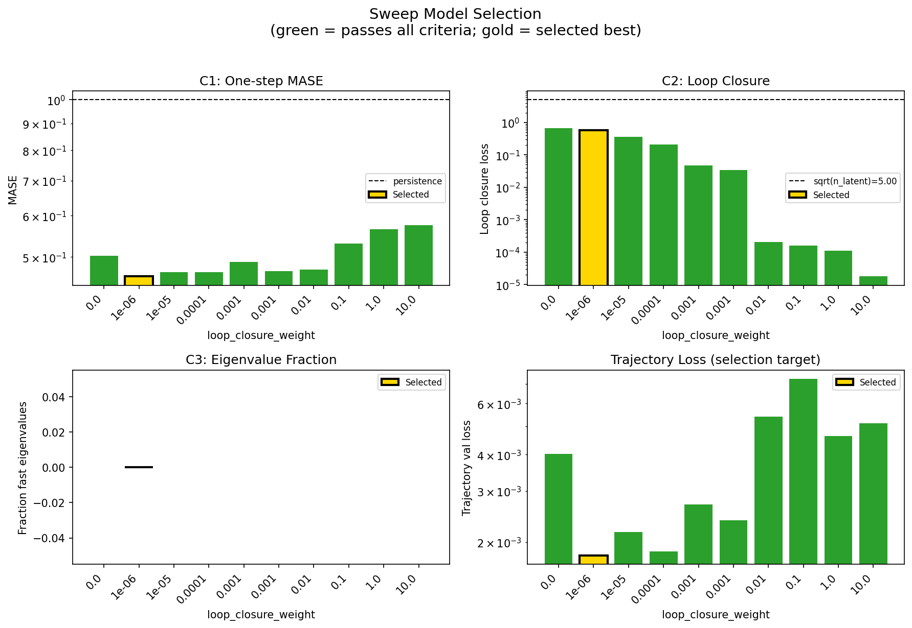

### sweep_pareto

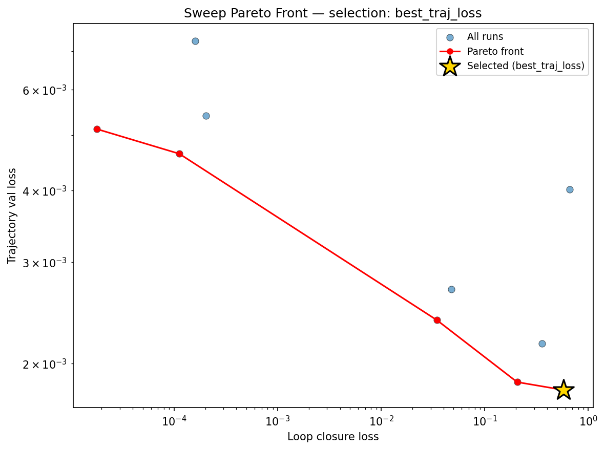

### reconstruction

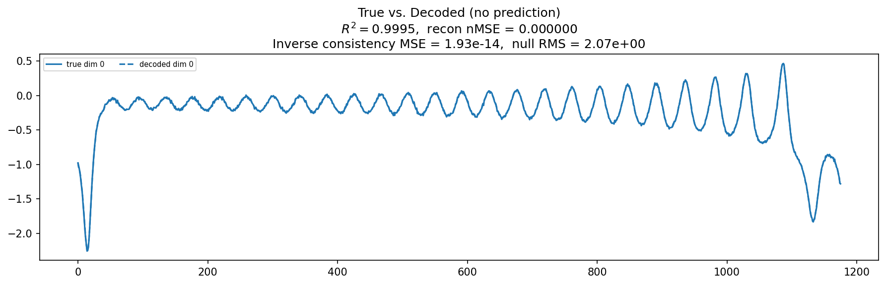

### prediction_windows

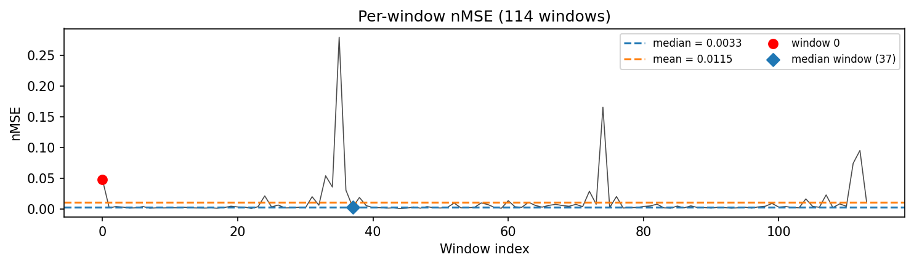

### long_trajectory

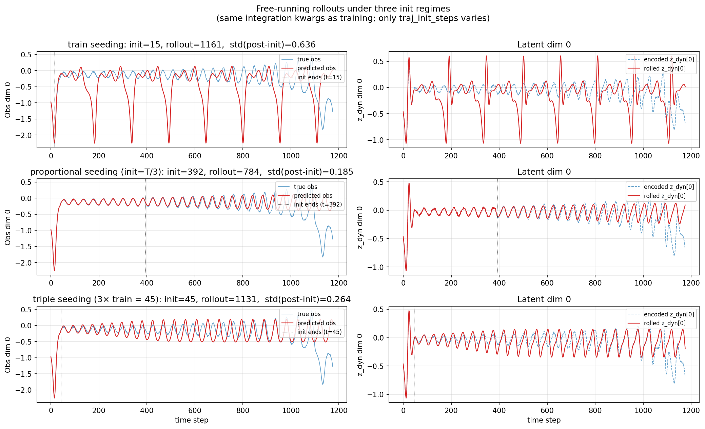

### mase

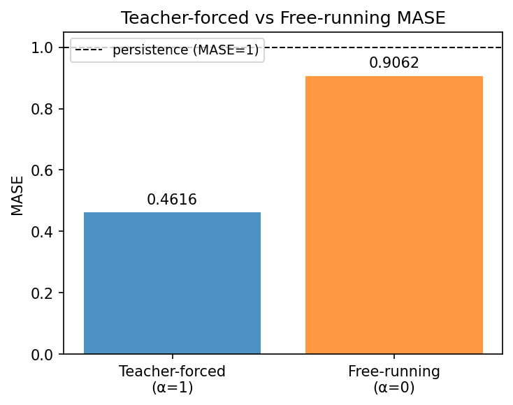

### latent_utilization

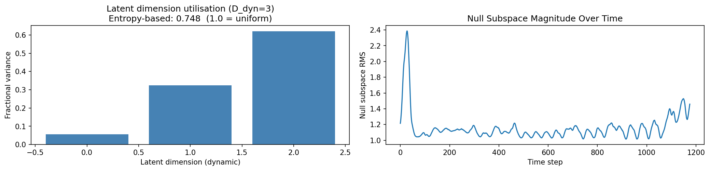

### lyapunov

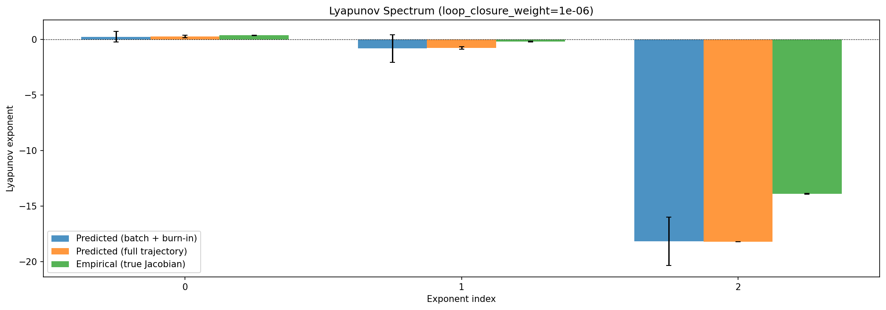

### kaplan_yorke

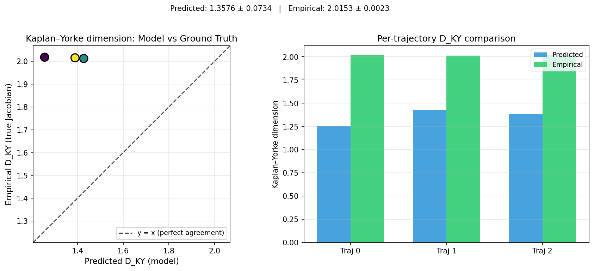

### per_run_lyapunov


### per_run_lyapunov_vs_true


### per_run_lyapunov_relerr


### encoder_decoder_jacobians

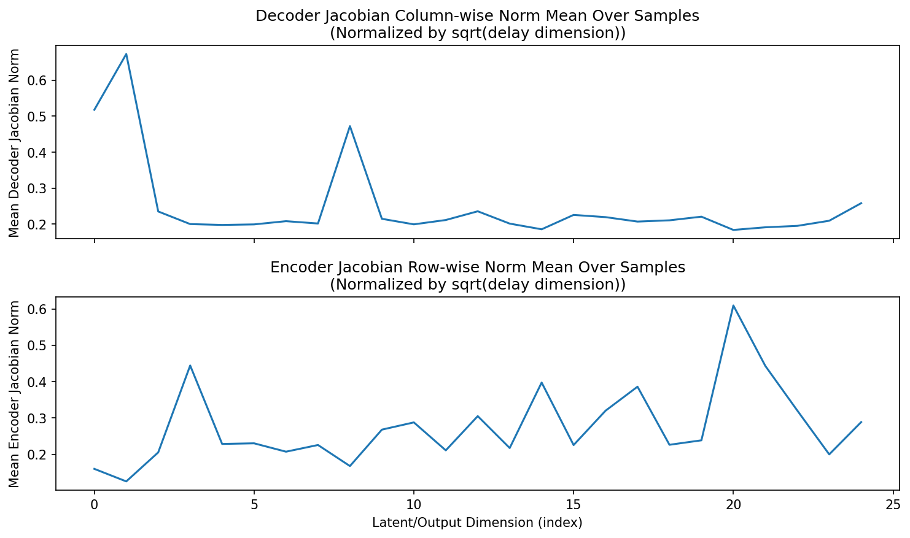

### amplification

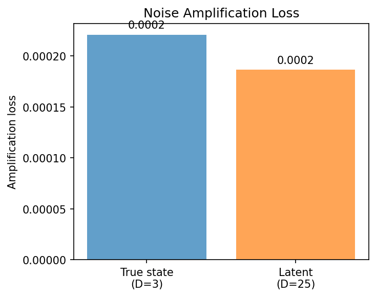

### kaplan_yorke_pca

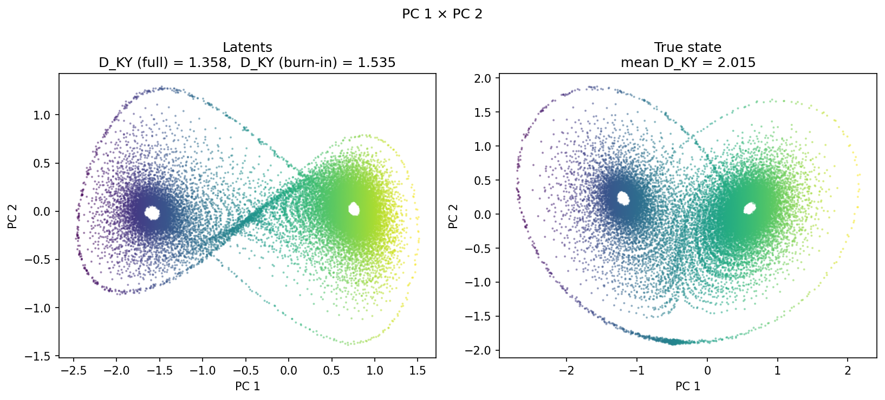

### prediction_detail_latent

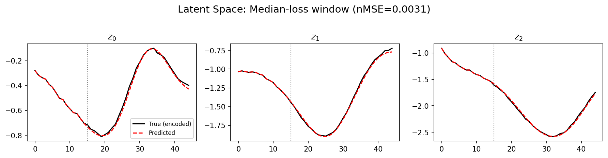

### prediction_detail_obs

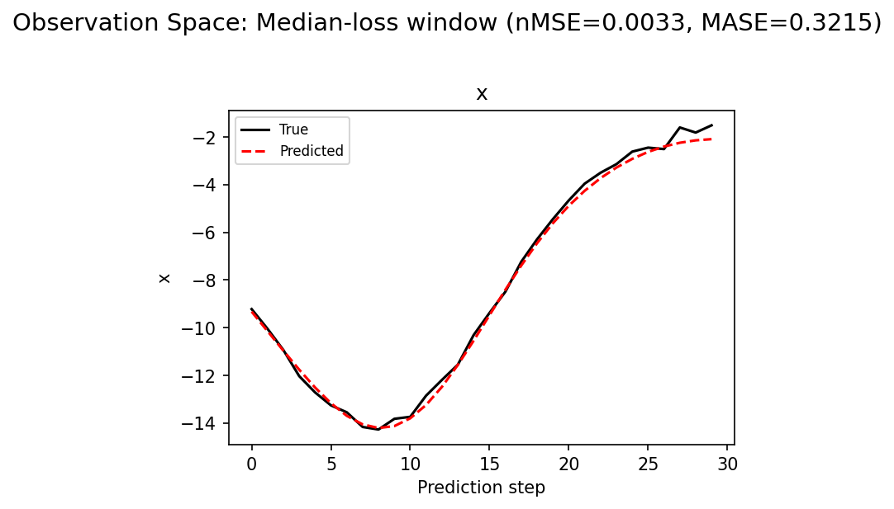

## Discussion

<!--
This section is intentionally left as a placeholder. A human reviewer
or Claude Code agent should fill it in based on the tables and figures
above, explicitly addressing each success criterion and comparing the
outcome to the stated hypothesis. Write the Discussion to
`discussion.md` in this directory and re-run `render_report`.
-->

_(to be written)_

## `run_analytics` stdout

<details><summary>Click to expand — full diagnostic output from <code>run_analytics</code></summary>

```
No run_id provided — selecting best run from group 'lorenz_partial_25d_additive_mse_p30_obsnoise001__lc_sweep' ...
Found 10 total runs in JacobianODE/Lorenz_INDpartial_N25_D1_NormTrue_T3__JacobianODE (group=lorenz_partial_25d_additive_mse_p30_obsnoise001__lc_sweep)
All runs (state, loop_closure_weight, tangent_entropy_weight, kl_dyn_weight):
  9rd7jg07: state=finished, lc=0.0, te=0.0, kl_dyn=0.0
  5lqf1gme: state=finished, lc=0.001, te=0.0, kl_dyn=0.0
  dowi8tde: state=finished, lc=1e-05, te=0.0, kl_dyn=0.0
  2u74lfxy: state=finished, lc=0.01, te=0.0, kl_dyn=0.0
  3gce9ryf: state=finished, lc=1e-06, te=0.0, kl_dyn=0.0
  7c7e0p4v: state=finished, lc=0.0001, te=0.0, kl_dyn=0.0
  ae26uqz2: state=finished, lc=0.1, te=0.0, kl_dyn=0.0
  i2b4ofgn: state=finished, lc=1.0, te=0.0, kl_dyn=0.0
  sxk2jqcn: state=finished, lc=10.0, te=0.0, kl_dyn=0.0
  21w6wh3x: state=crashed, lc=0.001, te=0.0, kl_dyn=0.0

slurm_timeout_min not found in any run config — falling back to 180 min
  Including 9rd7jg07 (lc=0.0): use_all_runs=True (state=finished)
  Including 5lqf1gme (lc=0.001): use_all_runs=True (state=finished)
  Including dowi8tde (lc=1e-05): use_all_runs=True (state=finished)
  Including 2u74lfxy (lc=0.01): use_all_runs=True (state=finished)
  Including 3gce9ryf (lc=1e-06): use_all_runs=True (state=finished)
  Including 7c7e0p4v (lc=0.0001): use_all_runs=True (state=finished)
  Including ae26uqz2 (lc=0.1): use_all_runs=True (state=finished)
  Including i2b4ofgn (lc=1.0): use_all_runs=True (state=finished)
  Including sxk2jqcn (lc=10.0): use_all_runs=True (state=finished)
  Including 21w6wh3x (lc=0.001): use_all_runs=True (state=crashed)
Found 10 effectively-done sweep runs:
  loop_closure_weight=0.0, tangent_entropy_weight=0.0, kl_dyn_weight=0.0 -> run_id=9rd7jg07
  loop_closure_weight=1e-06, tangent_entropy_weight=0.0, kl_dyn_weight=0.0 -> run_id=3gce9ryf
  loop_closure_weight=1e-05, tangent_entropy_weight=0.0, kl_dyn_weight=0.0 -> run_id=dowi8tde
  loop_closure_weight=0.0001, tangent_entropy_weight=0.0, kl_dyn_weight=0.0 -> run_id=7c7e0p4v
  loop_closure_weight=0.001, tangent_entropy_weight=0.0, kl_dyn_weight=0.0 -> run_id=21w6wh3x
  loop_closure_weight=0.001, tangent_entropy_weight=0.0, kl_dyn_weight=0.0 -> run_id=5lqf1gme
  loop_closure_weight=0.01, tangent_entropy_weight=0.0, kl_dyn_weight=0.0 -> run_id=2u74lfxy
  loop_closure_weight=0.1, tangent_entropy_weight=0.0, kl_dyn_weight=0.0 -> run_id=ae26uqz2
  loop_closure_weight=1.0, tangent_entropy_weight=0.0, kl_dyn_weight=0.0 -> run_id=i2b4ofgn
  loop_closure_weight=10.0, tangent_entropy_weight=0.0, kl_dyn_weight=0.0 -> run_id=sxk2jqcn
n_dims=25, n_latent=25, n_dyn=3, dt=0.0150
  run=9rd7jg07: DiagnosticMetrics(one_step_mase=0.502865195274353, loop_closure_loss=0.6588351726531982, fast_eigenvalue_fraction=0.0, trajectory_val_loss=0.004016640596091747) (from cache, n_batches=100)
  run=3gce9ryf: DiagnosticMetrics(one_step_mase=0.4588523805141449, loop_closure_loss=0.5778968930244446, fast_eigenvalue_fraction=0.0, trajectory_val_loss=0.001797847799025476) (from cache, n_batches=100)
  run=dowi8tde: DiagnosticMetrics(one_step_mase=0.46745723485946655, loop_closure_loss=0.3575687110424042, fast_eigenvalue_fraction=0.0, trajectory_val_loss=0.0021641782950609922) (from cache, n_batches=100)
  run=7c7e0p4v: DiagnosticMetrics(one_step_mase=0.4676908254623413, loop_closure_loss=0.20563267171382904, fast_eigenvalue_fraction=0.0, trajectory_val_loss=0.0018558551091700792) (from cache, n_batches=100)
  run=21w6wh3x: DiagnosticMetrics(one_step_mase=0.48890572786331177, loop_closure_loss=0.047417934983968735, fast_eigenvalue_fraction=0.0, trajectory_val_loss=0.002692507579922676) (from cache, n_batches=100)
  run=5lqf1gme: DiagnosticMetrics(one_step_mase=0.4701458811759949, loop_closure_loss=0.034531936049461365, fast_eigenvalue_fraction=0.0, trajectory_val_loss=0.0023794735316187143) (from cache, n_batches=100)
  run=2u74lfxy: DiagnosticMetrics(one_step_mase=0.47277960181236267, loop_closure_loss=0.0002024095447268337, fast_eigenvalue_fraction=0.0, trajectory_val_loss=0.0054045263677835464) (from cache, n_batches=100)
  run=ae26uqz2: DiagnosticMetrics(one_step_mase=0.5309656858444214, loop_closure_loss=0.00016030512051656842, fast_eigenvalue_fraction=0.0, trajectory_val_loss=0.007287317421287298) (from cache, n_batches=100)
  run=i2b4ofgn: DiagnosticMetrics(one_step_mase=0.5645317435264587, loop_closure_loss=0.00011249783710809425, fast_eigenvalue_fraction=0.0, trajectory_val_loss=0.0046378192491829395) (from cache, n_batches=100)
  run=sxk2jqcn: DiagnosticMetrics(one_step_mase=0.5746452212333679, loop_closure_loss=1.7918246157933027e-05, fast_eigenvalue_fraction=0.0, trajectory_val_loss=0.005122203379869461) (from cache, n_batches=100)

Ranking method:           best_traj_loss
Best run ID:              3gce9ryf
Best loop_closure_weight: 1e-06
Best tangent_entropy_weight: 0.0
Best kl_dyn_weight:       0.0
Best traj loss:           0.001798
Criteria applied: ['C1', 'C2', 'C3']
Surviving: 10 / 10
Auto-selected run_id: 3gce9ryf

======================================================================
PARETO FRONTIER RUNS (5 runs)
======================================================================
  Run ID               LC Loss   Traj Val Loss
  ------------  --------------  --------------
  sxk2jqcn            0.000018        0.005122
  i2b4ofgn            0.000112        0.004638
  5lqf1gme            0.034532        0.002379
  7c7e0p4v            0.205633        0.001856
  3gce9ryf            0.577897        0.001798 <-- selected

======================================================================
RANKING METHOD COMPARISON (over 10 survivors)
======================================================================
  Method                  Run ID               LC Loss   Traj Val Loss
  ----------------------  ------------  --------------  --------------
  best_traj_loss          3gce9ryf            0.577897        0.001798 <-- active
  pareto_knee             7c7e0p4v            0.205633        0.001856
  geo_rank                sxk2jqcn            0.000018        0.005122
  minimax_rank            5lqf1gme            0.034532        0.002379
  geo_log_score           3gce9ryf            0.577897        0.001798
  minimax_log_score       i2b4ofgn            0.000112        0.004638
======================================================================

Loading run 3gce9ryf from JacobianODE/Lorenz_INDpartial_N25_D1_NormTrue_T3__JacobianODE ...
Train dataset shape: torch.Size([24882, 45, 25])
Validation dataset shape: torch.Size([7917, 45, 25])
Test dataset shape: torch.Size([3393, 45, 25])
Train trajectories dataset shape: torch.Size([22, 1176, 25])
Validation trajectories dataset shape: torch.Size([7, 1176, 25])
Test trajectories dataset shape: torch.Size([3, 1176, 25])
Loading checkpoint epoch=131-step=26400.ckpt...
Computing reconstruction ...
Computing MASE ...
Teacher-forced MASE: 0.4616
Free-running MASE:   0.9062
Computing latent utilization ...
Entropy-based utilization: 0.748
Null subspace mean RMS: 1.173312e+00
Computing Lyapunov exponents ...
  Computing full-trajectory Lyapunov (3 test trajs, T=1176) ...
Predicted Lyapunov exponents (batch+burn-in, 128 windowed trajs):
  λ_1 = +0.2552 ± 0.4822
  λ_2 = -0.8049 ± 1.2276
  λ_3 = -18.1423 ± 2.1730
Predicted Lyapunov exponents (full-length, 3 test trajs):
  λ_1 = +0.2753 ± 0.1055
  λ_2 = -0.7500 ± 0.1188
  λ_3 = -18.2049 ± 0.0064
Empirical Lyapunov exponents (mean ± std):
  λ_1 = +0.3846 ± 0.0251
  λ_2 = -0.1716 ± 0.0444
  λ_3 = -13.8799 ± 0.0398
Mean KY dim (predicted): 1.358 ± 0.073
Mean KY dim (empirical): 2.015 ± 0.002
Mean KY dim (burn-in):   1.535 ± 0.566
Computing prediction windows ...
Windows: 114 — nMSE min=0.0010, median=0.0033, mean=0.0115, max=0.2798
Computing long-trajectory free-running rollouts ...
Computing encoder/decoder Jacobians ...
encoder_jacobian: (128, 25, 25)
decoder_jacobian: (128, 25, 25)
Computing amplification loss ...
Amplification loss — True state: 0.000221
Amplification loss — Latent:     0.000186
```

</details>
