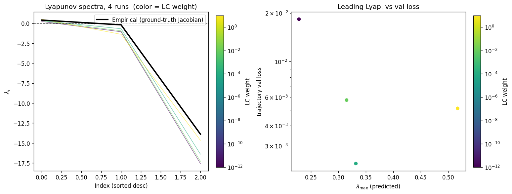
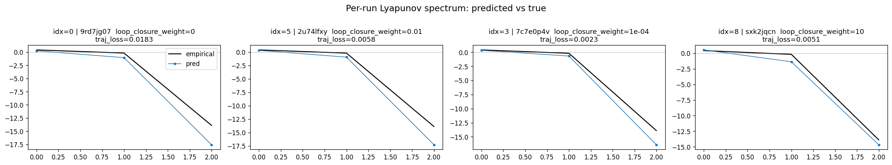
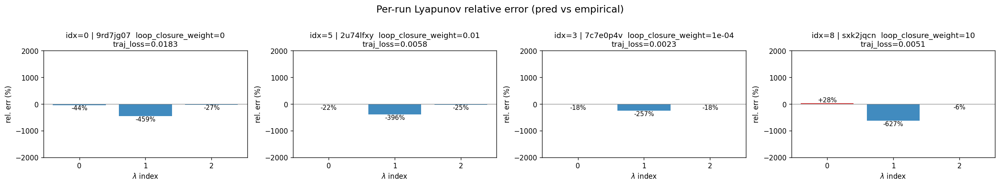

# Sweep Analysis: `lorenz_partial_25d_additive_mse_p30_obsnoise001__lc_sweep`

**Project**: [Lorenz_INDpartial_N25_D1_NormTrue_T3__JacobianODE](https://wandb.ai/JacobianODE/Lorenz_INDpartial_N25_D1_NormTrue_T3__JacobianODE/groups/lorenz_partial_25d_additive_mse_p30_obsnoise001__lc_sweep)  
**Launched**: 2026-04-17T01:50:10Z  
**Completed**: 2026-04-17T06:05:17Z  
**Outcome**: `complete_clean`  
**Git**: `latent-JacobianODE` @ `f05d2ea`  
**Expected runs**: 9

## Experiment Context

### `lorenz_partial_25d_additive_mse_p30`

**Description**

Partial-obs Lorenz: x-coordinate only (observed_indices=[0]),
n_delays=25, delay_spacing=1. Encoder input 25-D, z_dyn 3-D,
z_null 22-D with kl_null_weight=0. Additive coupling encoder,
joint training, reconstruction_mode='most_recent'. Plain MSE loss.
prediction_steps=30, seq_length=45. obs_noise_scale=0.

**Hypothesis**

A longer prediction horizon sharpens the forward-rollout training
signal, which in partial-obs has been the main limiter of spectrum
recovery. Expecting tighter λ_min (less under-contracted than the
10-step baseline) and improved trajectory_r2.

**Success criteria**

- Best run's leading Lyapunov exponent > 0
- Best run's predicted Lyapunov spectrum within ~40% of empirical
- Noticeable improvement in λ_min recovery vs p10 partial_25d_mse

## Results

**Overall best MASE**: 0.8514 (LC weight = 1.0e-06, obs_noise_scale = 0.00)
**Overall best traj loss**: 0.00180 at epoch 131.0
**Runs analyzed**: 10

### Best run per `obs_noise_scale`

| obs_noise_scale | Best LC weight | Best traj loss | MASE at best | R² | LC loss | epoch |
|---|---|---|---|---|---|---|
| 0.0 | 1.0e-06 | 0.00180 | 0.8514 | 0.9952 | 0.578 | 131.0 |

## Success-criteria verdicts (automated)

| Criterion | Verdict | Note |
|---|---|---|
| Best run's leading Lyapunov exponent > 0 | **Unknown** |  |
| Best run's predicted Lyapunov spectrum within ~40% of empirical | **Unknown** |  |
| Noticeable improvement in λ_min recovery vs p10 partial_25d_mse | **Unknown** |  |

_Automated verdicts use simple numeric-threshold parsing and may mis-classify qualitative criteria. The Discussion section below takes precedence._

## Figures

### per_run_lyapunov

### per_run_lyapunov_vs_true

### per_run_lyapunov_relerr

## Discussion

<!--
This section is intentionally left as a placeholder. A human reviewer
or Claude Code agent should fill it in based on the tables and figures
above, explicitly addressing each success criterion and comparing the
outcome to the stated hypothesis. Write the Discussion to
`discussion.md` in this directory and re-run `render_report`.
-->

_(to be written)_
