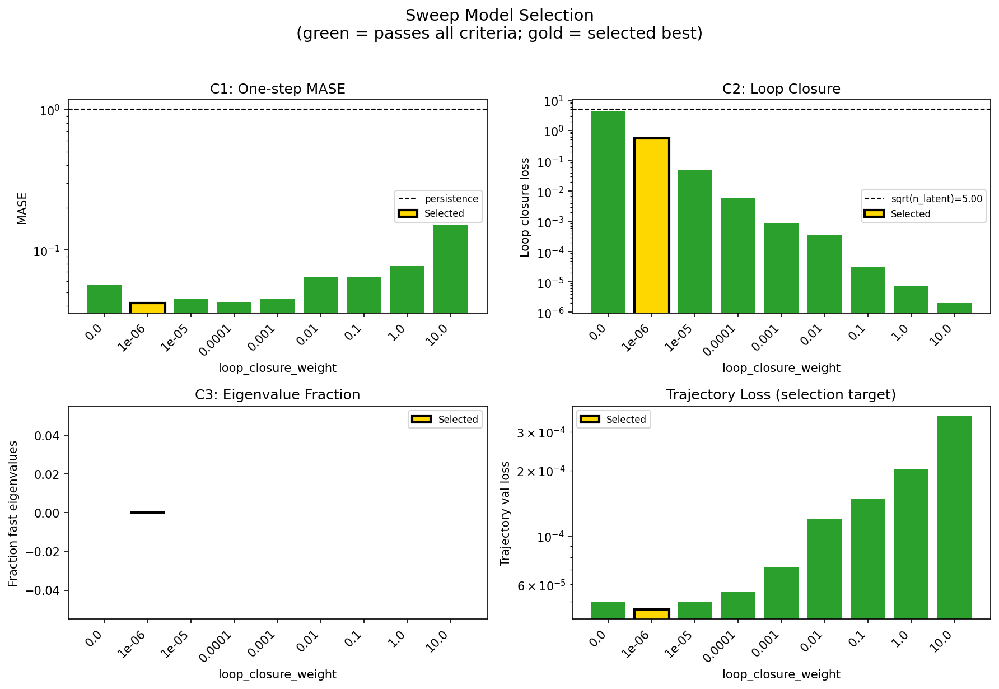
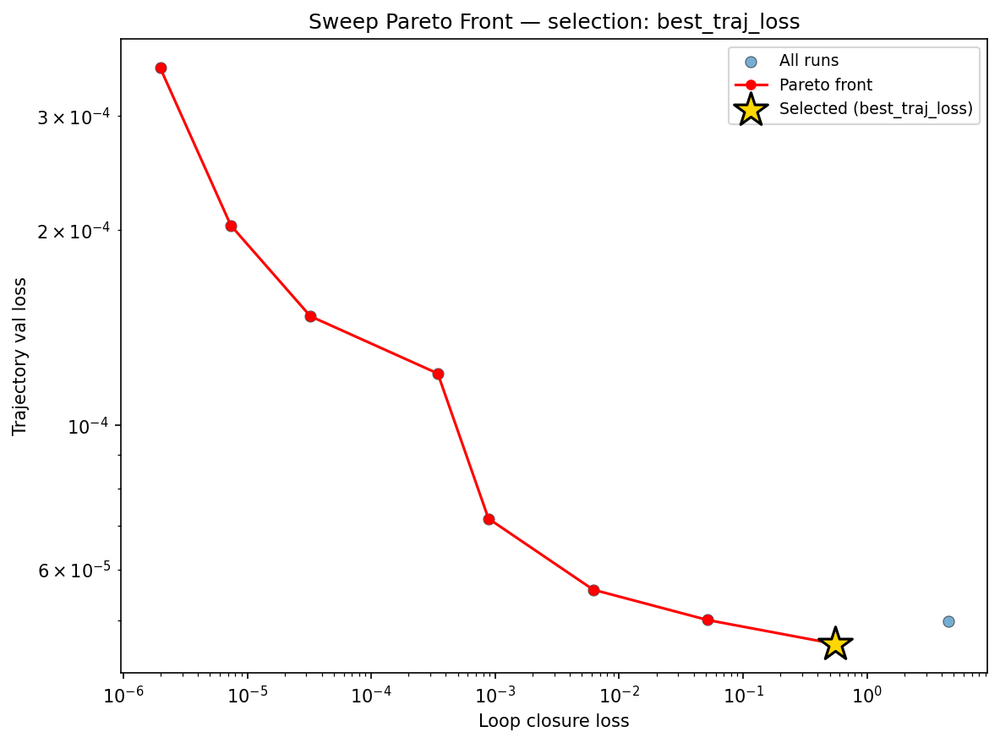
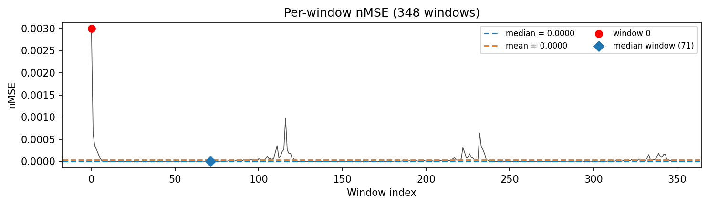
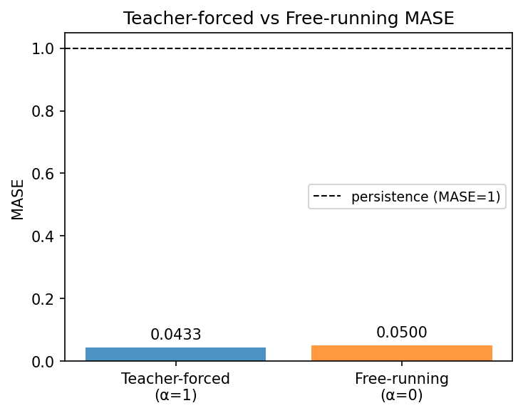
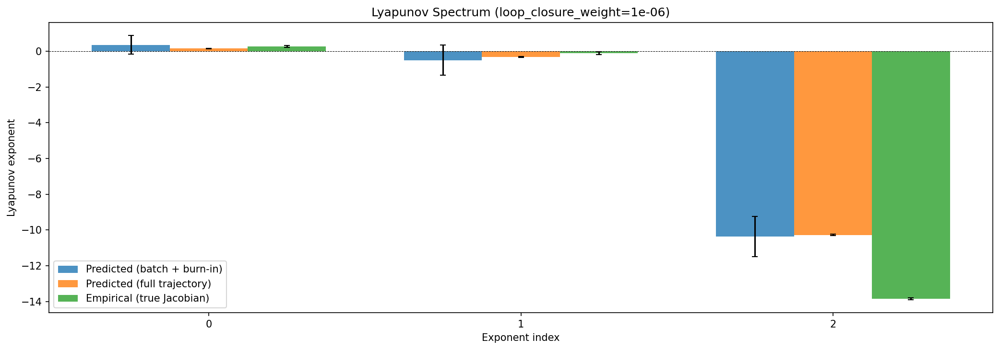
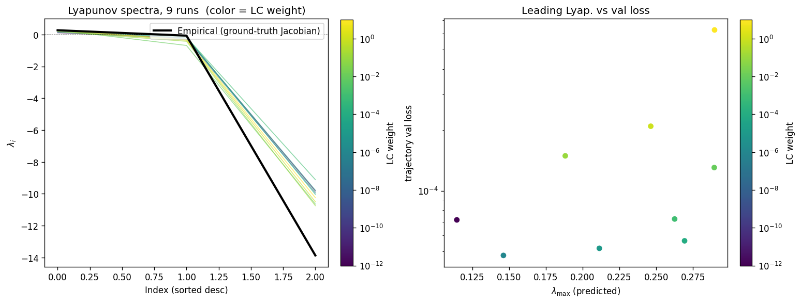
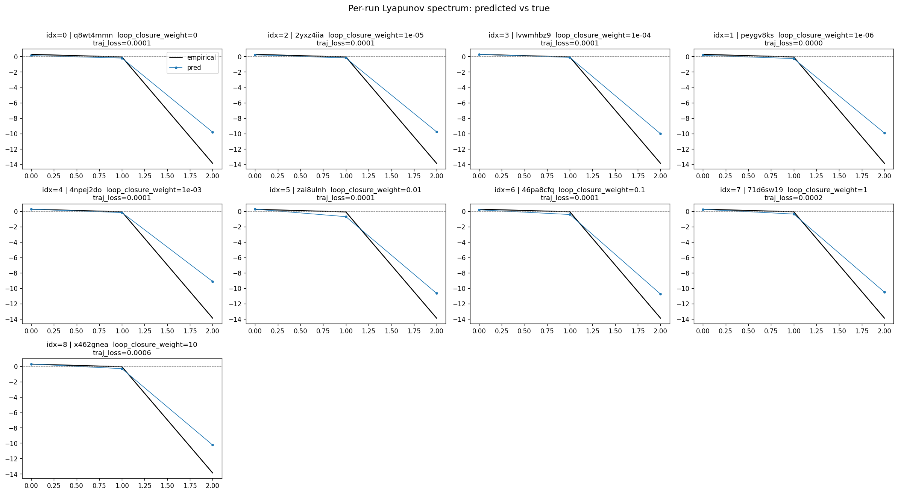
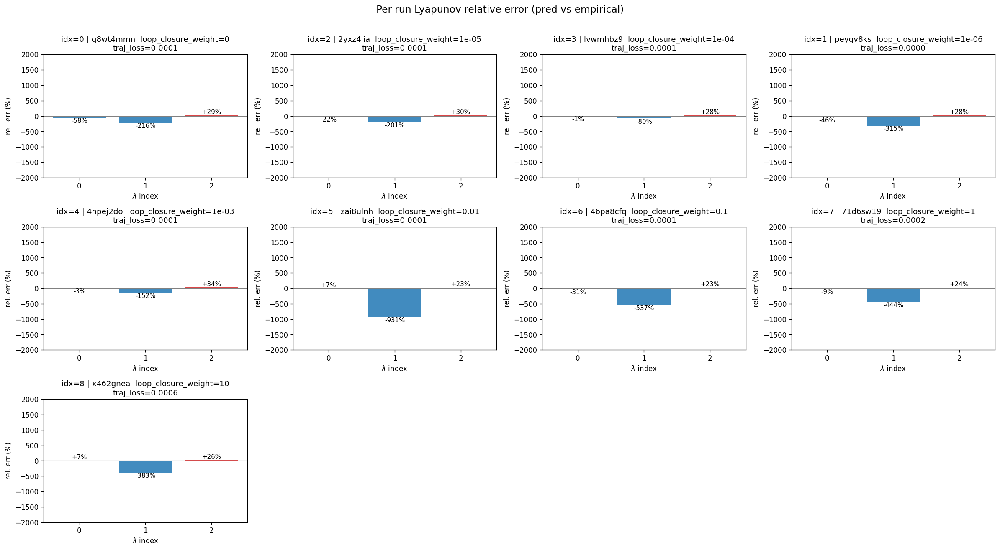
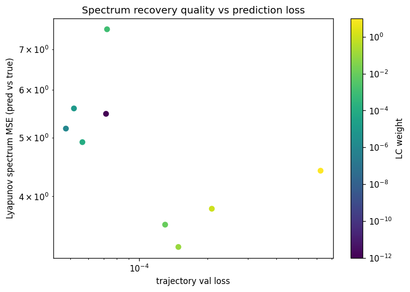

# Sweep Analysis: `lorenz_partial_25d_additive_mse_uniform__lc_sweep`

**Project**: [Lorenz_INDpartial_N25_D1_NormTrue_T3__JacobianODE](https://wandb.ai/JacobianODE/Lorenz_INDpartial_N25_D1_NormTrue_T3__JacobianODE/groups/lorenz_partial_25d_additive_mse_uniform__lc_sweep)  
**Launched**: 2026-04-15T03:55:01Z  
**Completed**: 2026-04-15T08:50:13Z  
**Outcome**: `complete_clean`  
**Git**: `latent-JacobianODE` @ `40ef3c7`  
**Expected runs**: 9

## Experiment Context

### `lorenz_partial_25d_additive_mse_uniform`

**Description**

Partial-obs Lorenz, x-coordinate only, n_delays=25, z_dyn=3. Plain
MSE, additive coupling. reconstruction_mode='uniform' — training
loss (decoded prediction + reconstruction) scored on the full
25-D delay-embedded state. Validation monitor automatically uses
'most_recent' (see validation_step), so checkpoint selection is
unchanged. kl_null_weight still 0. obs_noise_scale 0.
LC weight swept.

**Hypothesis**

The sufficient-statistic hypothesis for partial-obs: the encoder
has no incentive to surface trajectory history into z_dyn when
training loss only requires reconstructing the current frame.
Training on the full delay-embedded state should force z_dyn to
encode a more complete summary of the window — because
reconstructing older lags directly constrains what information the
encoder maps where. Expected: better Lyapunov spectrum recovery
and val/trajectory_r2 on the live-frame monitor than the
most_recent-trained partial_25d_mse sweep, with similar or lower
LC optima. If this moves the needle, partial-obs training should
default to uniform going forward; if it doesn't, n_delays or
kl_null is the real bottleneck.

**Success criteria**

- Best run's leading Lyapunov exponent > 0
- Best run's predicted Lyapunov spectrum within ~30% of empirical
- val/trajectory_r2 at best-LC improves over partial_25d_mse most_recent baseline
- No blow-up of loop closure during training (uniform loss doesn't break the encoder-decoder cycle)

## Results

**Overall best MASE**: 0.0971 (LC weight = 1.0e-06, obs_noise_scale = 0.00)
**Overall best traj loss**: 0.00005 at epoch 161.0
**Runs analyzed**: 9

### Best run per `obs_noise_scale`

| obs_noise_scale | Best LC weight | Best traj loss | MASE at best | R² | LC loss | epoch |
|---|---|---|---|---|---|---|
| 0.0 | 1.0e-06 | 0.00005 | 0.0971 | 0.9999 | 0.553 | 161.0 |

## Success-criteria verdicts (automated)

| Criterion | Verdict | Note |
|---|---|---|
| Best run's leading Lyapunov exponent > 0 | **Unknown** |  |
| Best run's predicted Lyapunov spectrum within ~30% of empirical | **Unknown** |  |
| val/trajectory_r2 at best-LC improves over partial_25d_mse most_recent baseline | **Unknown** |  |
| No blow-up of loop closure during training (uniform loss doesn't break the encoder-decoder cycle) | **Unknown** |  |

_Automated verdicts use simple numeric-threshold parsing and may mis-classify qualitative criteria. The Discussion section below takes precedence._

## Figures

### sweep_overview



### sweep_pareto



### prediction_windows



### mase



### lyapunov



### per_run_lyapunov



### per_run_lyapunov_vs_true



### per_run_lyapunov_relerr



### lyapunov_spectrum_mse_vs_val_loss



## Discussion

<!--
This section is intentionally left as a placeholder. A human reviewer
or Claude Code agent should fill it in based on the tables and figures
above, explicitly addressing each success criterion and comparing the
outcome to the stated hypothesis. Write the Discussion to
`discussion.md` in this directory and re-run `render_report`.
-->

_(to be written)_

## `run_analytics` stdout

<details><summary>Click to expand — full diagnostic output from <code>run_analytics</code></summary>

```
No run_id provided — selecting best run from group 'lorenz_partial_25d_additive_mse_uniform__lc_sweep' ...
Found 9 total runs in JacobianODE/Lorenz_INDpartial_N25_D1_NormTrue_T3__JacobianODE (group=lorenz_partial_25d_additive_mse_uniform__lc_sweep)
All runs (state, loop_closure_weight, tangent_entropy_weight, kl_dyn_weight):
  q8wt4mmn: state=finished, lc=0.0, te=0.0, kl_dyn=0.0
  2yxz4iia: state=finished, lc=1e-05, te=0.0, kl_dyn=0.0
  lvwmhbz9: state=finished, lc=0.0001, te=0.0, kl_dyn=0.0
  peygv8ks: state=finished, lc=1e-06, te=0.0, kl_dyn=0.0
  4npej2do: state=finished, lc=0.001, te=0.0, kl_dyn=0.0
  zai8ulnh: state=finished, lc=0.01, te=0.0, kl_dyn=0.0
  46pa8cfq: state=finished, lc=0.1, te=0.0, kl_dyn=0.0
  71d6sw19: state=finished, lc=1.0, te=0.0, kl_dyn=0.0
  x462gnea: state=finished, lc=10.0, te=0.0, kl_dyn=0.0

slurm_timeout_min not found in any run config — falling back to 180 min
  Including q8wt4mmn (lc=0.0): use_all_runs=True (state=finished)
  Including 2yxz4iia (lc=1e-05): use_all_runs=True (state=finished)
  Including lvwmhbz9 (lc=0.0001): use_all_runs=True (state=finished)
  Including peygv8ks (lc=1e-06): use_all_runs=True (state=finished)
  Including 4npej2do (lc=0.001): use_all_runs=True (state=finished)
  Including zai8ulnh (lc=0.01): use_all_runs=True (state=finished)
  Including 46pa8cfq (lc=0.1): use_all_runs=True (state=finished)
  Including 71d6sw19 (lc=1.0): use_all_runs=True (state=finished)
  Including x462gnea (lc=10.0): use_all_runs=True (state=finished)
Found 9 effectively-done sweep runs:
  loop_closure_weight=0.0, tangent_entropy_weight=0.0, kl_dyn_weight=0.0 -> run_id=q8wt4mmn
  loop_closure_weight=1e-06, tangent_entropy_weight=0.0, kl_dyn_weight=0.0 -> run_id=peygv8ks
  loop_closure_weight=1e-05, tangent_entropy_weight=0.0, kl_dyn_weight=0.0 -> run_id=2yxz4iia
  loop_closure_weight=0.0001, tangent_entropy_weight=0.0, kl_dyn_weight=0.0 -> run_id=lvwmhbz9
  loop_closure_weight=0.001, tangent_entropy_weight=0.0, kl_dyn_weight=0.0 -> run_id=4npej2do
  loop_closure_weight=0.01, tangent_entropy_weight=0.0, kl_dyn_weight=0.0 -> run_id=zai8ulnh
  loop_closure_weight=0.1, tangent_entropy_weight=0.0, kl_dyn_weight=0.0 -> run_id=46pa8cfq
  loop_closure_weight=1.0, tangent_entropy_weight=0.0, kl_dyn_weight=0.0 -> run_id=71d6sw19
  loop_closure_weight=10.0, tangent_entropy_weight=0.0, kl_dyn_weight=0.0 -> run_id=x462gnea
n_dims=25, n_latent=25, n_dyn=3, dt=0.0150
  run=q8wt4mmn: DiagnosticMetrics(one_step_mase=0.05621497705578804, loop_closure_loss=4.516508102416992, fast_eigenvalue_fraction=0.0, trajectory_val_loss=4.9841626605484635e-05) (from W&B history)
  run=peygv8ks: DiagnosticMetrics(one_step_mase=0.0418035164475441, loop_closure_loss=0.5532177686691284, fast_eigenvalue_fraction=0.0, trajectory_val_loss=4.6048731746850535e-05) (from W&B history)
  run=2yxz4iia: DiagnosticMetrics(one_step_mase=0.04504145309329033, loop_closure_loss=0.05161266028881073, fast_eigenvalue_fraction=0.0, trajectory_val_loss=5.013464033254422e-05) (from W&B history)
  run=lvwmhbz9: DiagnosticMetrics(one_step_mase=0.042499057948589325, loop_closure_loss=0.0061804926954209805, fast_eigenvalue_fraction=0.0, trajectory_val_loss=5.583069287240505e-05) (from W&B history)
  run=4npej2do: DiagnosticMetrics(one_step_mase=0.045318394899368286, loop_closure_loss=0.0008834288455545902, fast_eigenvalue_fraction=0.0, trajectory_val_loss=7.184726564446464e-05) (from W&B history)
  run=zai8ulnh: DiagnosticMetrics(one_step_mase=0.06424910575151443, loop_closure_loss=0.000344433676218614, fast_eigenvalue_fraction=0.0, trajectory_val_loss=0.00012025572505081072) (from W&B history)
  run=46pa8cfq: DiagnosticMetrics(one_step_mase=0.06423916667699814, loop_closure_loss=3.228276182198897e-05, fast_eigenvalue_fraction=0.0, trajectory_val_loss=0.00014737430319655687) (from W&B history)
  run=71d6sw19: DiagnosticMetrics(one_step_mase=0.07779721170663834, loop_closure_loss=7.372317668341566e-06, fast_eigenvalue_fraction=0.0, trajectory_val_loss=0.0002033840137301013) (from W&B history)
  run=x462gnea: DiagnosticMetrics(one_step_mase=0.15039539337158203, loop_closure_loss=1.9846668237732956e-06, fast_eigenvalue_fraction=0.0, trajectory_val_loss=0.0003558300086297095) (from W&B history)

Ranking method:           best_traj_loss
Best run ID:              peygv8ks
Best loop_closure_weight: 1e-06
Best tangent_entropy_weight: 0.0
Best kl_dyn_weight:       0.0
Best traj loss:           0.000046
Criteria applied: ['C1', 'C2', 'C3']
Surviving: 9 / 9
Auto-selected run_id: peygv8ks

======================================================================
PARETO FRONTIER RUNS (8 runs)
======================================================================
  Run ID               LC Loss   Traj Val Loss
  ------------  --------------  --------------
  x462gnea            0.000002        0.000356
  71d6sw19            0.000007        0.000203
  46pa8cfq            0.000032        0.000147
  zai8ulnh            0.000344        0.000120
  4npej2do            0.000883        0.000072
  lvwmhbz9            0.006180        0.000056
  2yxz4iia            0.051613        0.000050
  peygv8ks            0.553218        0.000046 <-- selected

======================================================================
RANKING METHOD COMPARISON (over 9 survivors)
======================================================================
  Method                  Run ID               LC Loss   Traj Val Loss
  ----------------------  ------------  --------------  --------------
  best_traj_loss          peygv8ks            0.553218        0.000046 <-- active
  pareto_knee             zai8ulnh            0.000344        0.000120
  geo_rank                peygv8ks            0.553218        0.000046
  minimax_rank            4npej2do            0.000883        0.000072
  geo_log_score           peygv8ks            0.553218        0.000046
  minimax_log_score       4npej2do            0.000883        0.000072
======================================================================

Loading run peygv8ks from JacobianODE/Lorenz_INDpartial_N25_D1_NormTrue_T3__JacobianODE ...
Train dataset shape: torch.Size([25322, 25, 25])
Validation dataset shape: torch.Size([8057, 25, 25])
Test dataset shape: torch.Size([3453, 25, 25])
Train trajectories dataset shape: torch.Size([22, 1176, 25])
Validation trajectories dataset shape: torch.Size([7, 1176, 25])
Test trajectories dataset shape: torch.Size([3, 1176, 25])
Loading checkpoint epoch=161-step=32400.ckpt...
Computing MASE ...
Teacher-forced MASE: 0.0433
Free-running MASE:   0.0500
Computing Lyapunov exponents ...
  Computing full-trajectory Lyapunov (3 test trajs, T=1176) ...
Predicted Lyapunov exponents (batch+burn-in, 128 windowed trajs):
  λ_1 = +0.3551 ± 0.5255
  λ_2 = -0.5030 ± 0.8453
  λ_3 = -10.3751 ± 1.1271
Predicted Lyapunov exponents (full-length, 3 test trajs):
  λ_1 = +0.1501 ± 0.0194
  λ_2 = -0.3148 ± 0.0260
  λ_3 = -10.2746 ± 0.0342
Empirical Lyapunov exponents (mean ± std):
  λ_1 = +0.2716 ± 0.0605
  λ_2 = -0.1016 ± 0.0797
  λ_3 = -13.8370 ± 0.0514
Computing prediction windows ...
Windows: 348 — nMSE min=0.0000, median=0.0000, mean=0.0000, max=0.0030
```

</details>
