# Sweep Analysis: `lorenz_partial_25d_additive_mse_uniform_obsnoise005__lc_sweep`

**Project**: [Lorenz_INDpartial_N25_D1_NormTrue_T3__JacobianODE](https://wandb.ai/JacobianODE/Lorenz_INDpartial_N25_D1_NormTrue_T3__JacobianODE/groups/lorenz_partial_25d_additive_mse_uniform_obsnoise005__lc_sweep)  
**Launched**: 2026-04-16T05:55:37Z  
**Completed**: 2026-04-16T10:50:15Z  
**Outcome**: `complete_clean`  
**Git**: `latent-JacobianODE` @ `4b6bc1f`  
**Expected runs**: 9

## Experiment Context

### `lorenz_partial_25d_additive_mse_uniform`

**Description**

Partial-obs Lorenz, x-coordinate only, n_delays=25, z_dyn=3. Plain
MSE, additive coupling. reconstruction_mode='uniform' — training
loss (decoded prediction + reconstruction) scored on the full
25-D delay-embedded state. Validation monitor automatically uses
'most_recent' (see validation_step), so checkpoint selection is
unchanged. kl_null_weight still 0. obs_noise_scale 0.
LC weight swept.

**Hypothesis**

The sufficient-statistic hypothesis for partial-obs: the encoder
has no incentive to surface trajectory history into z_dyn when
training loss only requires reconstructing the current frame.
Training on the full delay-embedded state should force z_dyn to
encode a more complete summary of the window — because
reconstructing older lags directly constrains what information the
encoder maps where. Expected: better Lyapunov spectrum recovery
and val/trajectory_r2 on the live-frame monitor than the
most_recent-trained partial_25d_mse sweep, with similar or lower
LC optima. If this moves the needle, partial-obs training should
default to uniform going forward; if it doesn't, n_delays or
kl_null is the real bottleneck.

**Success criteria**

- Best run's leading Lyapunov exponent > 0
- Best run's predicted Lyapunov spectrum within ~30% of empirical
- val/trajectory_r2 at best-LC improves over partial_25d_mse most_recent baseline
- No blow-up of loop closure during training (uniform loss doesn't break the encoder-decoder cycle)

## Results

**Overall best MASE**: 0.7642 (LC weight = 1.0e-06, obs_noise_scale = 0.00)
**Overall best traj loss**: 0.00481 at epoch 87.0
**Runs analyzed**: 9

### Best run per `obs_noise_scale`

| obs_noise_scale | Best LC weight | Best traj loss | MASE at best | R² | LC loss | epoch |
|---|---|---|---|---|---|---|
| 0.0 | 1.0e-06 | 0.00481 | 0.7642 | 0.9868 | 11.129 | 87.0 |

## Success-criteria verdicts (automated)

| Criterion | Verdict | Note |
|---|---|---|
| Best run's leading Lyapunov exponent > 0 | **Unknown** |  |
| Best run's predicted Lyapunov spectrum within ~30% of empirical | **Unknown** |  |
| val/trajectory_r2 at best-LC improves over partial_25d_mse most_recent baseline | **Unknown** |  |
| No blow-up of loop closure during training (uniform loss doesn't break the encoder-decoder cycle) | **Unknown** |  |

_Automated verdicts use simple numeric-threshold parsing and may mis-classify qualitative criteria. The Discussion section below takes precedence._

## Figures

### sweep_overview

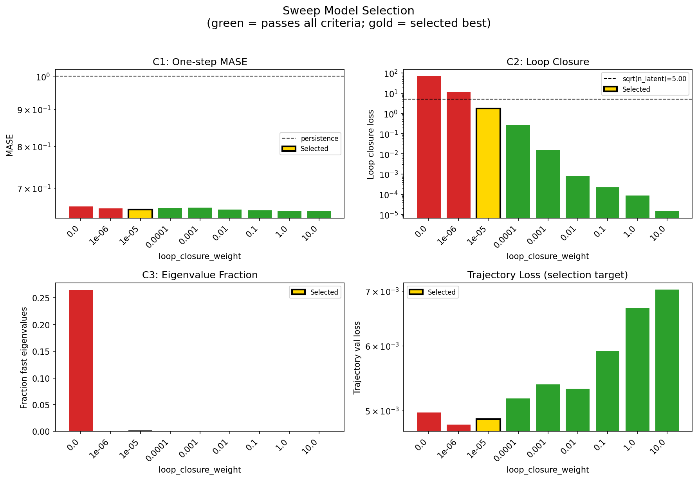

### sweep_pareto

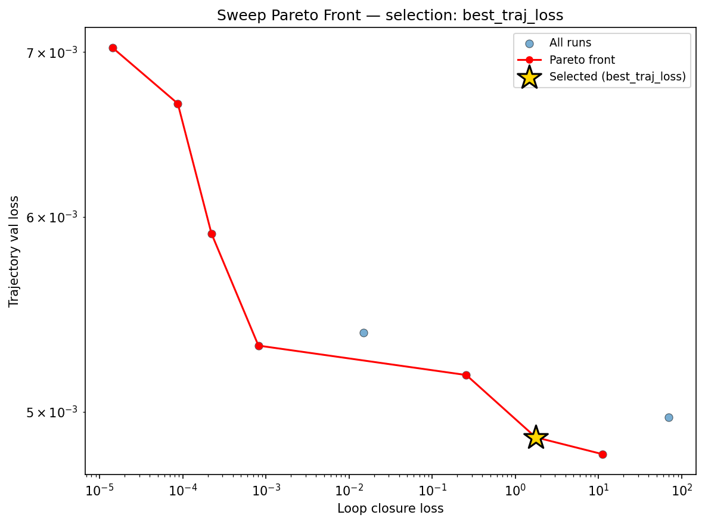

### prediction_windows

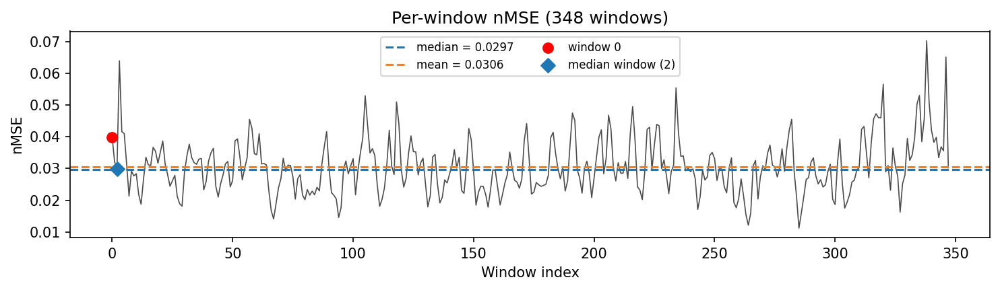

### long_trajectory

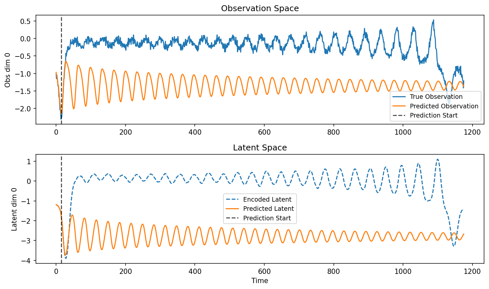

### mase

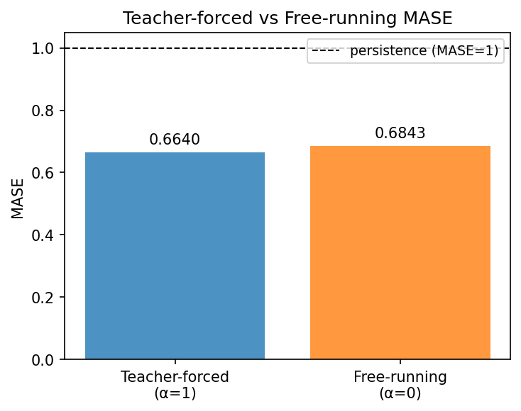

### lyapunov

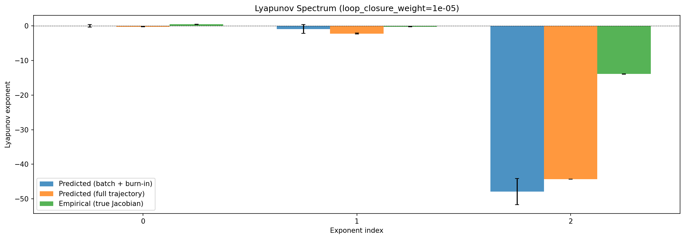

### per_run_lyapunov

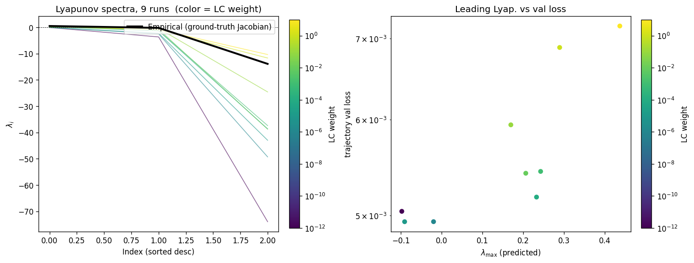

### per_run_lyapunov_vs_true

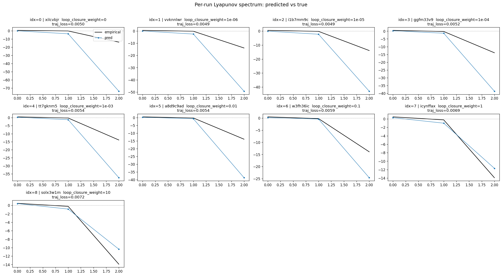

### per_run_lyapunov_relerr

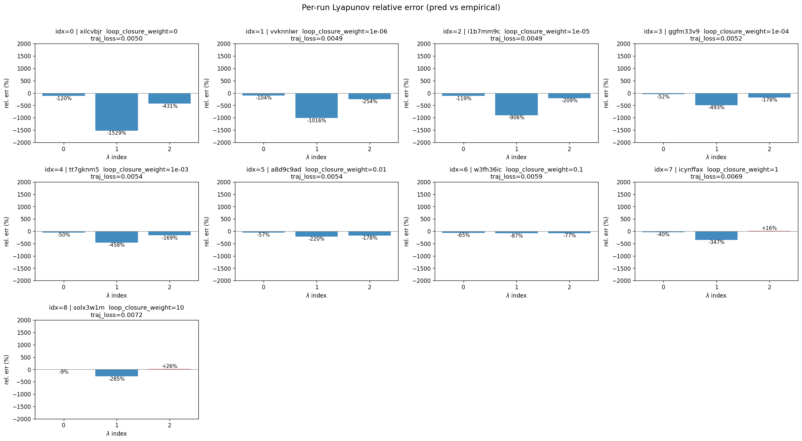

### lyapunov_spectrum_mse_vs_val_loss

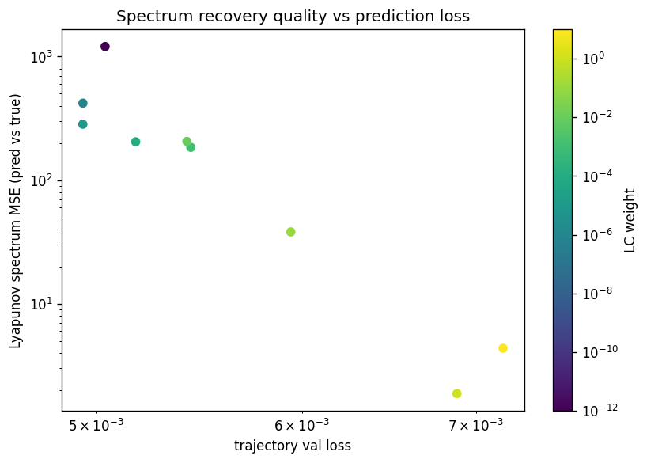

### reconstruction

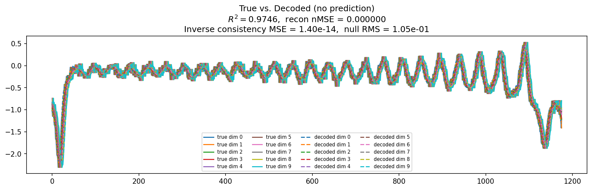

### latent_utilization

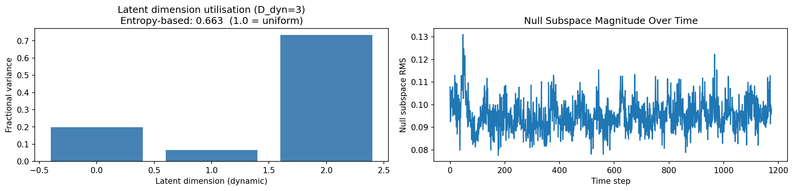

### kaplan_yorke

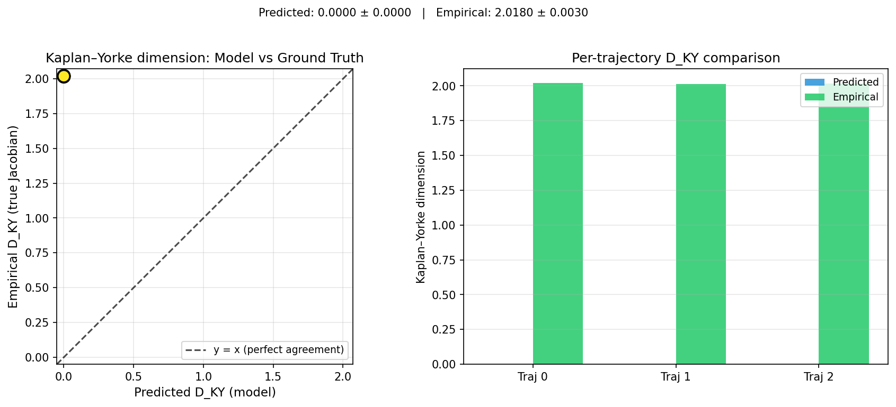

### kaplan_yorke_pca

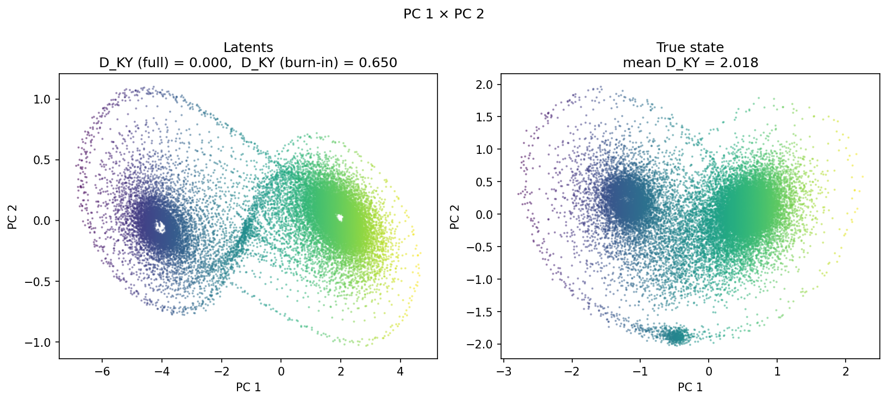

### prediction_detail_latent

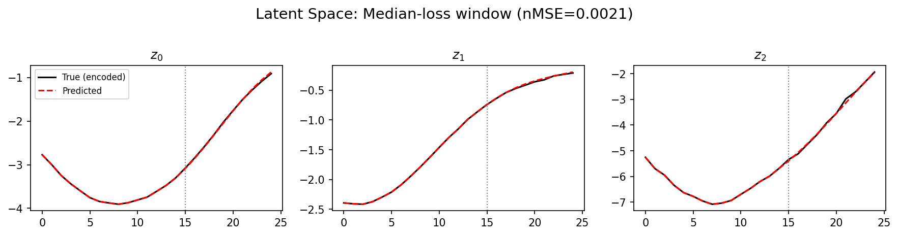

### prediction_detail_obs

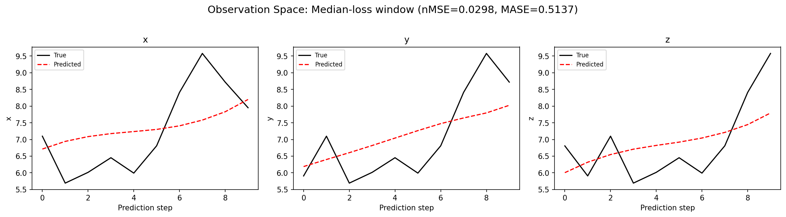

### encoder_decoder_jacobians

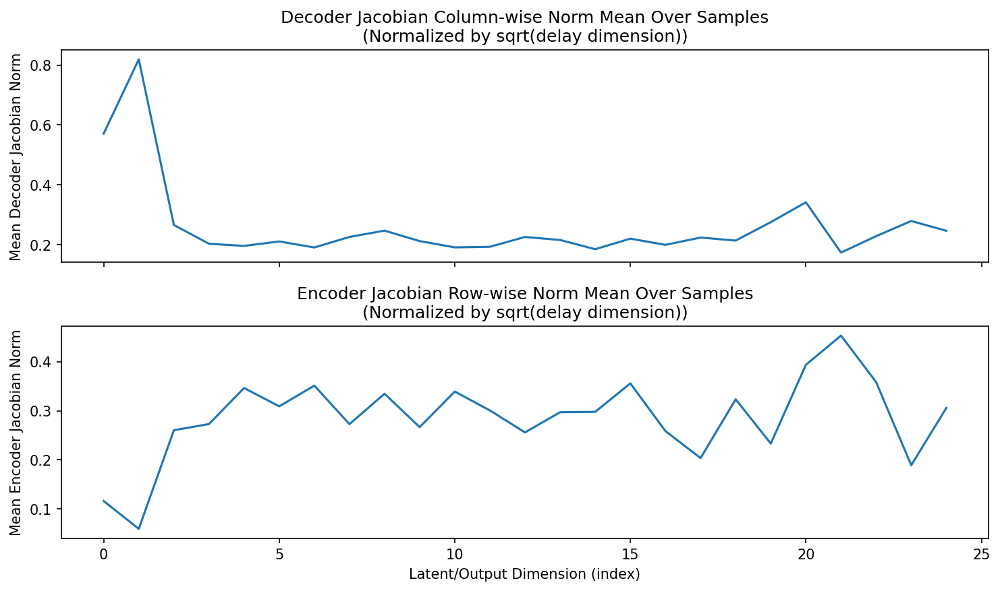

### amplification

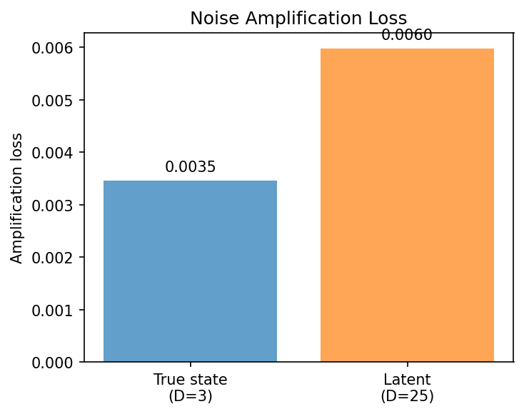

## Discussion

<!--
This section is intentionally left as a placeholder. A human reviewer
or Claude Code agent should fill it in based on the tables and figures
above, explicitly addressing each success criterion and comparing the
outcome to the stated hypothesis. Write the Discussion to
`discussion.md` in this directory and re-run `render_report`.
-->

_(to be written)_

## `run_analytics` stdout

<details><summary>Click to expand — full diagnostic output from <code>run_analytics</code></summary>

```
No run_id provided — selecting best run from group 'lorenz_partial_25d_additive_mse_uniform_obsnoise005__lc_sweep' ...
Found 9 total runs in JacobianODE/Lorenz_INDpartial_N25_D1_NormTrue_T3__JacobianODE (group=lorenz_partial_25d_additive_mse_uniform_obsnoise005__lc_sweep)
All runs (state, loop_closure_weight, tangent_entropy_weight, kl_dyn_weight):
  xilcvbjr: state=finished, lc=0.0, te=0.0, kl_dyn=0.0
  vvknnlwr: state=finished, lc=1e-06, te=0.0, kl_dyn=0.0
  i1b7mm9c: state=finished, lc=1e-05, te=0.0, kl_dyn=0.0
  ggfm33v9: state=finished, lc=0.0001, te=0.0, kl_dyn=0.0
  tt7gknm5: state=finished, lc=0.001, te=0.0, kl_dyn=0.0
  a8d9c9ad: state=finished, lc=0.01, te=0.0, kl_dyn=0.0
  w3fh36ic: state=finished, lc=0.1, te=0.0, kl_dyn=0.0
  icynffax: state=finished, lc=1.0, te=0.0, kl_dyn=0.0
  solx3w1m: state=finished, lc=10.0, te=0.0, kl_dyn=0.0

slurm_timeout_min not found in any run config — falling back to 180 min
  Including xilcvbjr (lc=0.0): use_all_runs=True (state=finished)
  Including vvknnlwr (lc=1e-06): use_all_runs=True (state=finished)
  Including i1b7mm9c (lc=1e-05): use_all_runs=True (state=finished)
  Including ggfm33v9 (lc=0.0001): use_all_runs=True (state=finished)
  Including tt7gknm5 (lc=0.001): use_all_runs=True (state=finished)
  Including a8d9c9ad (lc=0.01): use_all_runs=True (state=finished)
  Including w3fh36ic (lc=0.1): use_all_runs=True (state=finished)
  Including icynffax (lc=1.0): use_all_runs=True (state=finished)
  Including solx3w1m (lc=10.0): use_all_runs=True (state=finished)
Found 9 effectively-done sweep runs:
  loop_closure_weight=0.0, tangent_entropy_weight=0.0, kl_dyn_weight=0.0 -> run_id=xilcvbjr
  loop_closure_weight=1e-06, tangent_entropy_weight=0.0, kl_dyn_weight=0.0 -> run_id=vvknnlwr
  loop_closure_weight=1e-05, tangent_entropy_weight=0.0, kl_dyn_weight=0.0 -> run_id=i1b7mm9c
  loop_closure_weight=0.0001, tangent_entropy_weight=0.0, kl_dyn_weight=0.0 -> run_id=ggfm33v9
  loop_closure_weight=0.001, tangent_entropy_weight=0.0, kl_dyn_weight=0.0 -> run_id=tt7gknm5
  loop_closure_weight=0.01, tangent_entropy_weight=0.0, kl_dyn_weight=0.0 -> run_id=a8d9c9ad
  loop_closure_weight=0.1, tangent_entropy_weight=0.0, kl_dyn_weight=0.0 -> run_id=w3fh36ic
  loop_closure_weight=1.0, tangent_entropy_weight=0.0, kl_dyn_weight=0.0 -> run_id=icynffax
  loop_closure_weight=10.0, tangent_entropy_weight=0.0, kl_dyn_weight=0.0 -> run_id=solx3w1m
n_dims=25, n_latent=25, n_dyn=3, dt=0.0150
  run=xilcvbjr: DiagnosticMetrics(one_step_mase=0.660169780254364, loop_closure_loss=69.05728912353516, fast_eigenvalue_fraction=0.26499998569488525, trajectory_val_loss=0.004973705857992172) (from W&B history)
  run=vvknnlwr: DiagnosticMetrics(one_step_mase=0.6563029885292053, loop_closure_loss=11.128815650939941, fast_eigenvalue_fraction=0.0, trajectory_val_loss=0.004805532284080982) (from W&B history)
  run=i1b7mm9c: DiagnosticMetrics(one_step_mase=0.6536190509796143, loop_closure_loss=1.749255657196045, fast_eigenvalue_fraction=0.0, trajectory_val_loss=0.0048819719813764095) (from W&B history)
  run=ggfm33v9: DiagnosticMetrics(one_step_mase=0.6570034027099609, loop_closure_loss=0.25676262378692627, fast_eigenvalue_fraction=0.0, trajectory_val_loss=0.005174558609724045) (from W&B history)
  run=tt7gknm5: DiagnosticMetrics(one_step_mase=0.6581518054008484, loop_closure_loss=0.014998852275311947, fast_eigenvalue_fraction=0.0, trajectory_val_loss=0.0053831422701478004) (from W&B history)
  run=a8d9c9ad: DiagnosticMetrics(one_step_mase=0.6540114879608154, loop_closure_loss=0.0008134416420944035, fast_eigenvalue_fraction=0.0008333333535119891, trajectory_val_loss=0.005318970885127783) (from W&B history)
  run=w3fh36ic: DiagnosticMetrics(one_step_mase=0.6525664329528809, loop_closure_loss=0.00022182425891514868, fast_eigenvalue_fraction=0.0, trajectory_val_loss=0.005906539503484964) (from W&B history)
  run=icynffax: DiagnosticMetrics(one_step_mase=0.6502817869186401, loop_closure_loss=8.734814036870375e-05, fast_eigenvalue_fraction=0.0, trajectory_val_loss=0.006669881287962198) (from W&B history)
  run=solx3w1m: DiagnosticMetrics(one_step_mase=0.6511616706848145, loop_closure_loss=1.4412994460144546e-05, fast_eigenvalue_fraction=0.0, trajectory_val_loss=0.007026792969554663) (from W&B history)

Ranking method:           best_traj_loss
Best run ID:              i1b7mm9c
Best loop_closure_weight: 1e-05
Best tangent_entropy_weight: 0.0
Best kl_dyn_weight:       0.0
Best traj loss:           0.004882
Criteria applied: ['C1', 'C2', 'C3']
Surviving: 7 / 9
Auto-selected run_id: i1b7mm9c

======================================================================
PARETO FRONTIER RUNS (7 runs)
======================================================================
  Run ID               LC Loss   Traj Val Loss
  ------------  --------------  --------------
  solx3w1m            0.000014        0.007027
  icynffax            0.000087        0.006670
  w3fh36ic            0.000222        0.005907
  a8d9c9ad            0.000813        0.005319
  ggfm33v9            0.256763        0.005175
  i1b7mm9c            1.749256        0.004882 <-- selected
  vvknnlwr           11.128816        0.004806

======================================================================
RANKING METHOD COMPARISON (over 7 survivors)
======================================================================
  Method                  Run ID               LC Loss   Traj Val Loss
  ----------------------  ------------  --------------  --------------
  best_traj_loss          i1b7mm9c            1.749256        0.004882 <-- active
  pareto_knee             a8d9c9ad            0.000813        0.005319
  geo_rank                i1b7mm9c            1.749256        0.004882
  minimax_rank            a8d9c9ad            0.000813        0.005319
  geo_log_score           i1b7mm9c            1.749256        0.004882
  minimax_log_score       a8d9c9ad            0.000813        0.005319
======================================================================

Loading run i1b7mm9c from JacobianODE/Lorenz_INDpartial_N25_D1_NormTrue_T3__JacobianODE ...
Train dataset shape: torch.Size([25322, 25, 25])
Validation dataset shape: torch.Size([8057, 25, 25])
Test dataset shape: torch.Size([3453, 25, 25])
Train trajectories dataset shape: torch.Size([22, 1176, 25])
Validation trajectories dataset shape: torch.Size([7, 1176, 25])
Test trajectories dataset shape: torch.Size([3, 1176, 25])
Loading checkpoint epoch=100-step=20200.ckpt...
Computing reconstruction ...
Computing MASE ...
Teacher-forced MASE: 0.6640
Free-running MASE:   0.6843
Computing latent utilization ...
Entropy-based utilization: 0.663
Null subspace mean RMS: 9.542231e-02
Computing Lyapunov exponents ...
  Computing full-trajectory Lyapunov (3 test trajs, T=1176) ...
Predicted Lyapunov exponents (batch+burn-in, 128 windowed trajs):
  λ_1 = +0.0377 ± 0.4060
  λ_2 = -0.9036 ± 1.2838
  λ_3 = -47.9098 ± 3.7466
Predicted Lyapunov exponents (full-length, 3 test trajs):
  λ_1 = -0.2151 ± 0.0428
  λ_2 = -2.2043 ± 0.1042
  λ_3 = -44.3217 ± 0.0256
Empirical Lyapunov exponents (mean ± std):
  λ_1 = +0.4677 ± 0.0259
  λ_2 = -0.2173 ± 0.0549
  λ_3 = -13.9174 ± 0.0513
Mean KY dim (predicted): 0.000 ± 0.000
Mean KY dim (empirical): 2.018 ± 0.003
Mean KY dim (burn-in):   0.650 ± 0.641
Computing prediction windows ...
Windows: 348 — nMSE min=0.0112, median=0.0297, mean=0.0306, max=0.0704
Computing long trajectory prediction ...
Computing encoder/decoder Jacobians ...
encoder_jacobian: (128, 25, 25)
decoder_jacobian: (128, 25, 25)
Computing amplification loss ...
Amplification loss — True state: 0.003459
Amplification loss — Latent:     0.005980
```

</details>
