# Sweep Analysis: `lorenz_partial_25d_additive_mse_uniform_p30__lc_sweep`

**Project**: [Lorenz_INDpartial_N25_D1_NormTrue_T3__JacobianODE](https://wandb.ai/JacobianODE/Lorenz_INDpartial_N25_D1_NormTrue_T3__JacobianODE/groups/lorenz_partial_25d_additive_mse_uniform_p30__lc_sweep)  
**Launched**: 2026-04-15T15:38:00Z  
**Completed**: 2026-04-15T19:50:13Z  
**Outcome**: `complete_clean`  
**Git**: `latent-JacobianODE` @ `325ada0`  
**Expected runs**: 9

## Experiment Context

### `lorenz_partial_25d_additive_mse_uniform_p30`

**Description**

Identical to lorenz_partial_25d_additive_mse_uniform but with
prediction_steps=30 (seq_length=45) for a stronger multi-step
training signal.

**Hypothesis**

The p30 + most_recent partial_25d sweep still underestimated the
strong-contraction Lyapunov exponent. Adding uniform recon on top
of p30 should close the gap further: uniform forces z_dyn to
reconstruct the full delay window, tightening it onto a proper
diffeomorphic chart of the attractor; p30 strengthens the forward
rollout constraint. Expecting λ_min closer to empirical ~-14 than
either fix alone achieved.

**Success criteria**

- λ_min noticeably more negative than the p30+most_recent baseline
- val/trajectory_r2 at best LC within a few % of the most_recent p30 baseline
- No loop-closure explosion under uniform training

## Results

**Swept axes** (1): `training.lightning.loop_closure_weight`

**Chosen run** (by `best_traj_loss`): `z4l1eazh` — traj_loss=0.00008, MASE=0.1914, R²=0.9998, LC loss=0.208, epoch=107.0

Swept-axis values at chosen run: `training.lightning.loop_closure_weight`=1.0e-05

**Runs analyzed**: 9 (expected 9)

### Per-run results

| run_idx | run_id | `training.lightning.loop_closure_weight` | best_traj_loss | best_MASE | R² | LC loss | epoch |
|---|---|---|---|---|---|---|---|
| 2 | `z4l1eazh` | 1.0e-05 | 0.00008 | 0.1914 | 0.9998 | 0.208 | 107.0 |
| 3 | `brnsc37d` | 1.0e-04 | 0.00010 | 0.2067 | 0.9997 | 0.048 | 102.0 |
| 1 | `btaured2` | 1.0e-06 | 0.00012 | 0.2531 | 0.9996 | 0.279 | 70.0 |
| 4 | `pd8hhmyv` | 0.001 | 0.00013 | 0.2736 | 0.9996 | 0.006 | 102.0 |
| 0 | `7fdqopax` | 0 | 0.00017 | 0.2797 | 0.9995 | 0.313 | 64.0 |
| 5 | `kla2hl9w` | 0.01 | 0.00027 | 0.3648 | 0.9992 | 0.001 | 109.0 |
| 6 | `vemccm07` | 0.1 | 0.00073 | 0.5963 | 0.9977 | 0.000 | 112.0 |
| 7 | `4dzm6954` | 1 | 0.00126 | 0.8026 | 0.9961 | 0.000 | 112.0 |
| 8 | `37nbvfaw` | 10 | 0.00215 | 1.0895 | 0.9933 | 0.000 | 105.0 |

## Success-criteria verdicts (automated)

| Criterion | Verdict | Note |
|---|---|---|
| λ_min noticeably more negative than the p30+most_recent baseline | **Unknown** |  |
| val/trajectory_r2 at best LC within a few % of the most_recent p30 baseline | **Unknown** |  |
| No loop-closure explosion under uniform training | **Unknown** |  |

_Automated verdicts use simple numeric-threshold parsing and may mis-classify qualitative criteria. The Discussion section below takes precedence._

## Figures

### sweep_overview

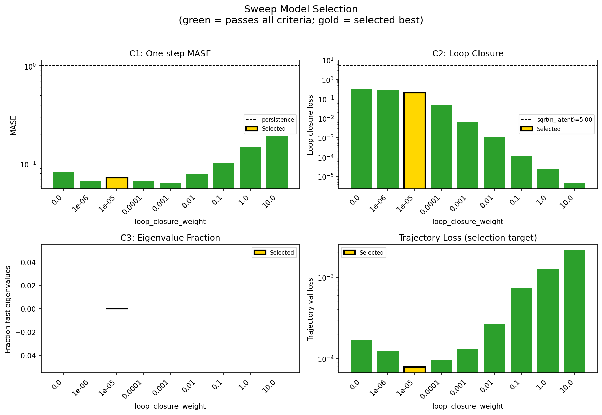

### sweep_pareto

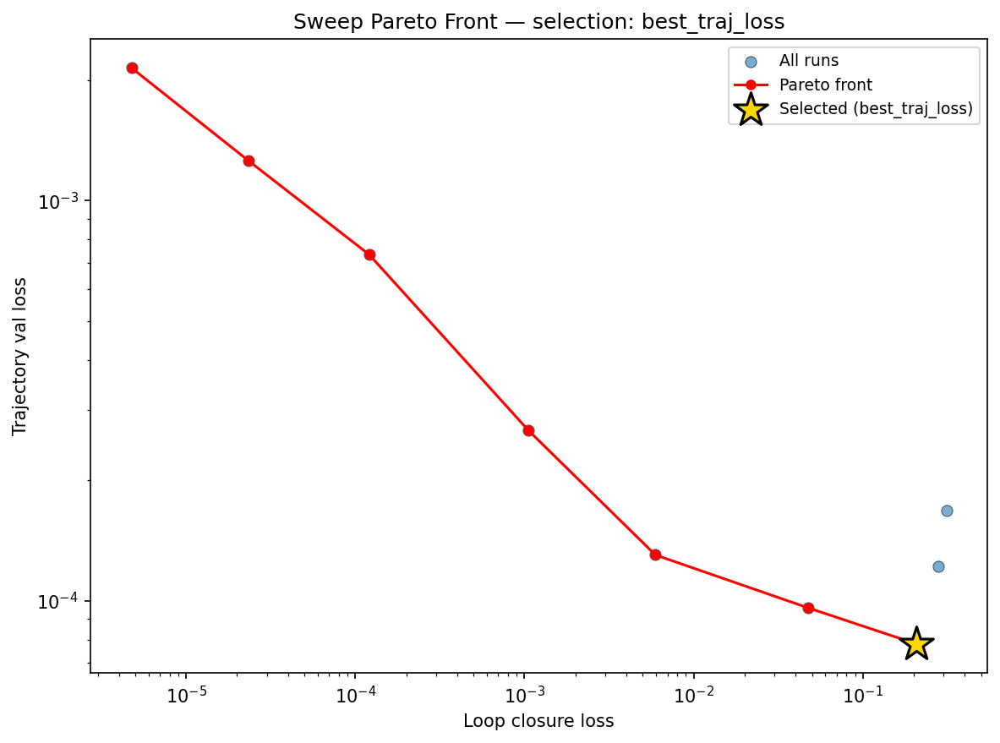

### reconstruction

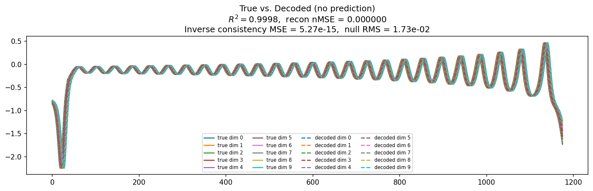

### prediction_windows

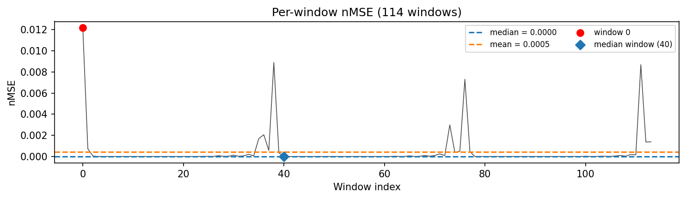

### long_trajectory

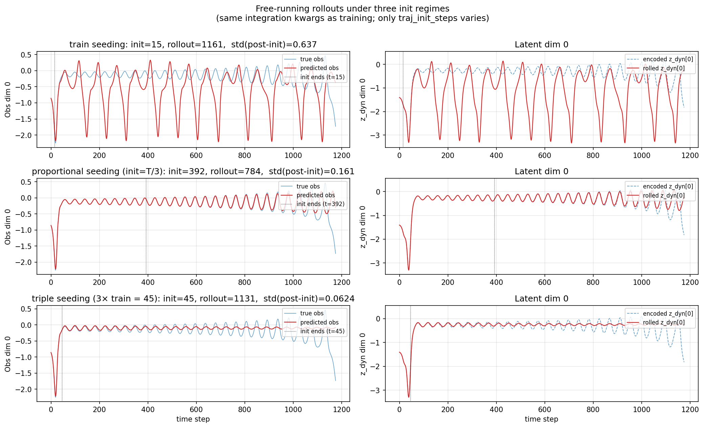

### mase

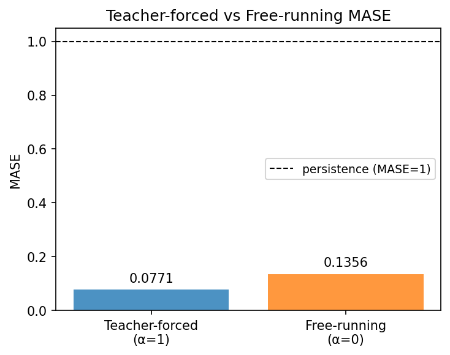

### latent_utilization

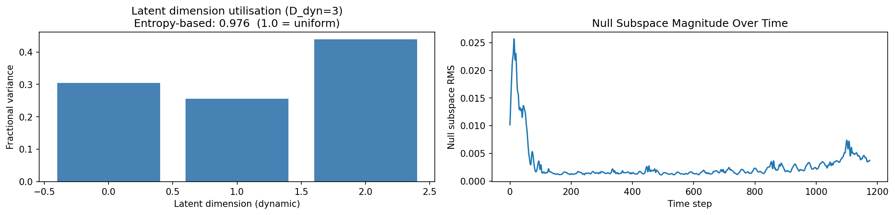

### lyapunov

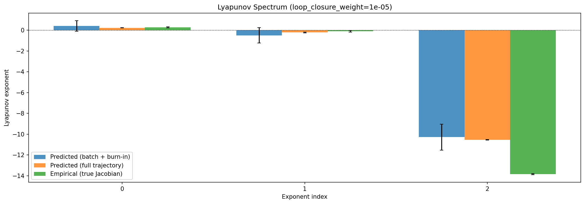

### kaplan_yorke

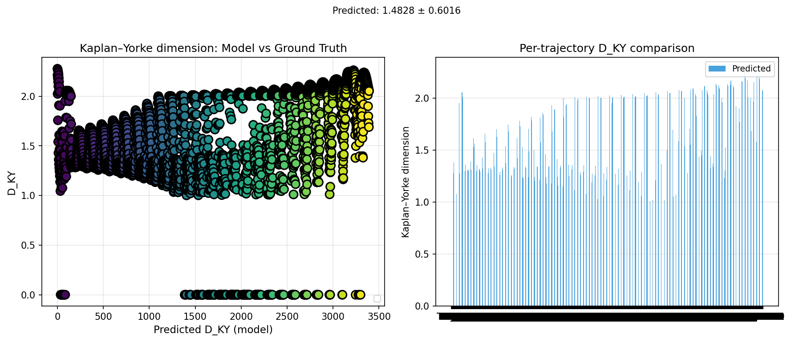

### per_run_lyapunov

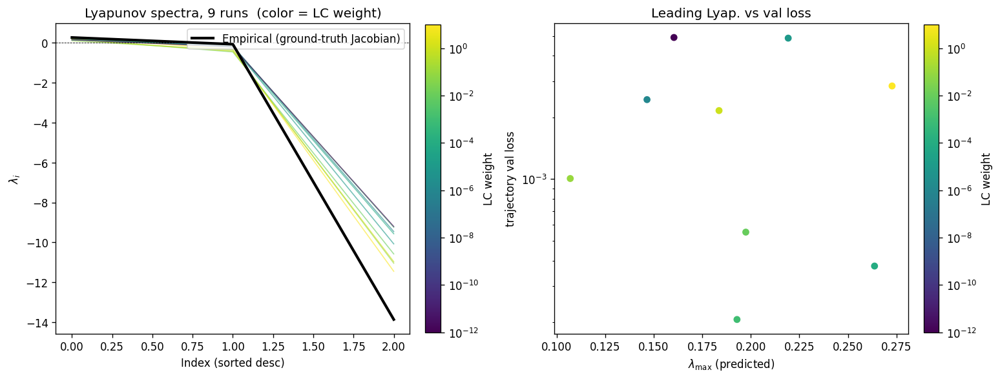

### per_run_lyapunov_vs_true

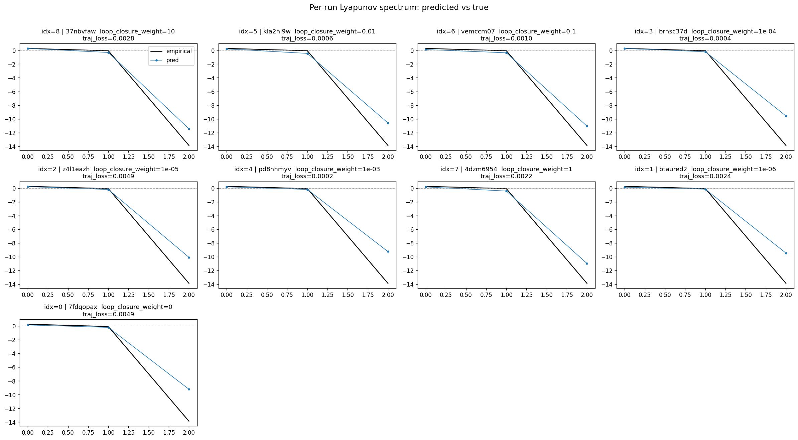

### per_run_lyapunov_relerr

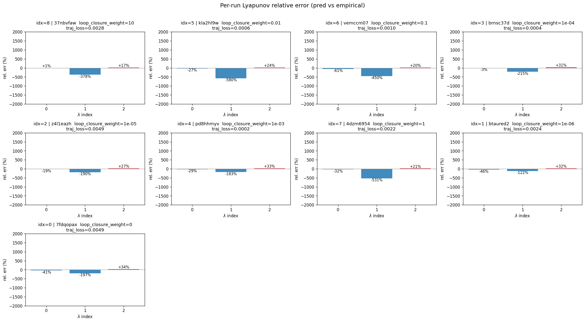

### lyapunov_spectrum_mse_vs_val_loss

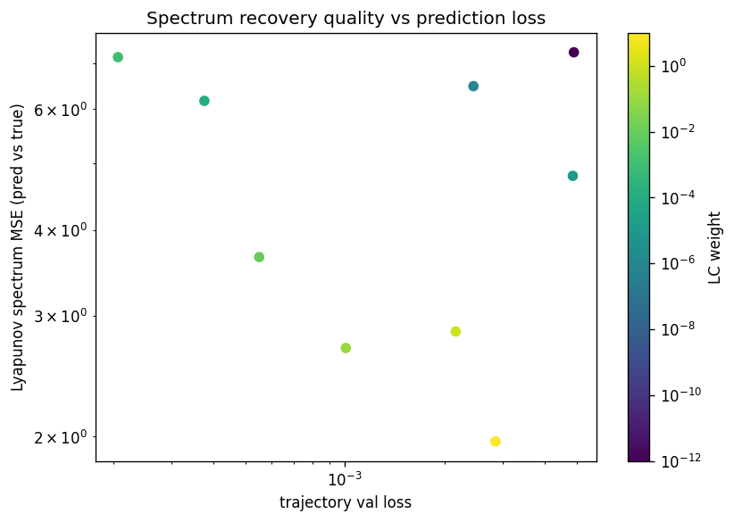

### encoder_decoder_jacobians

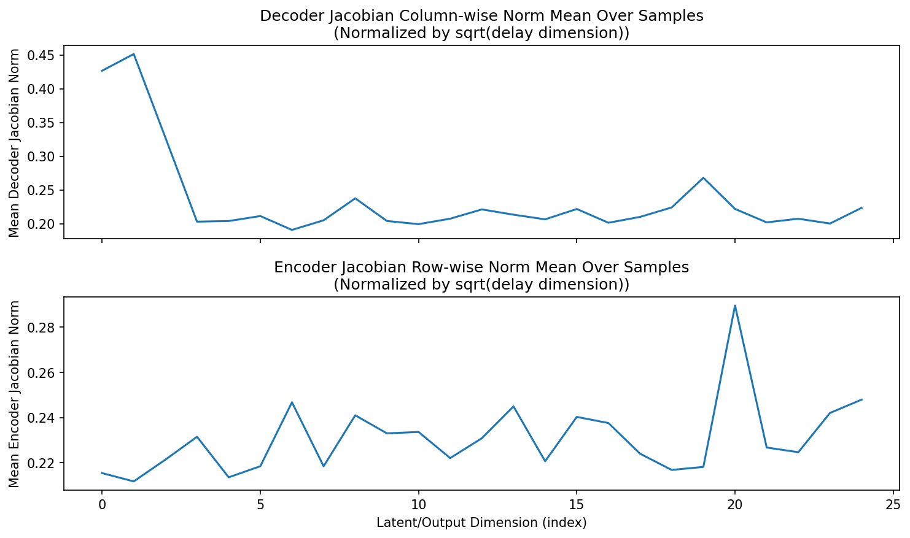

### amplification

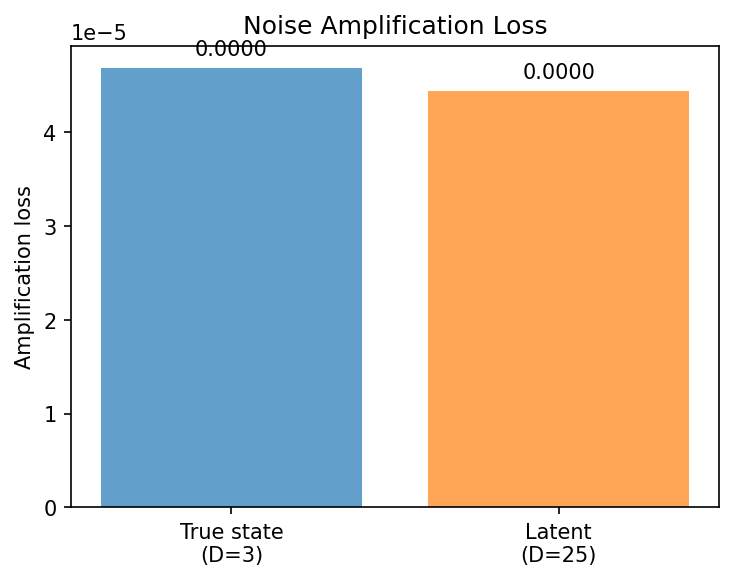

### kaplan_yorke_pca

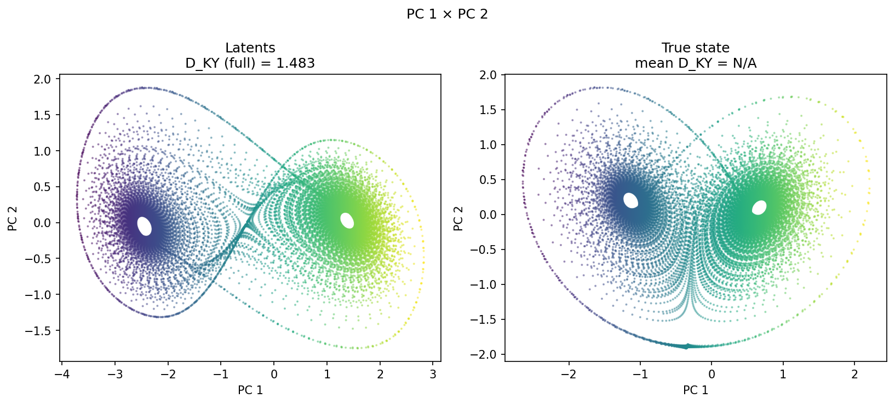

### prediction_detail_latent

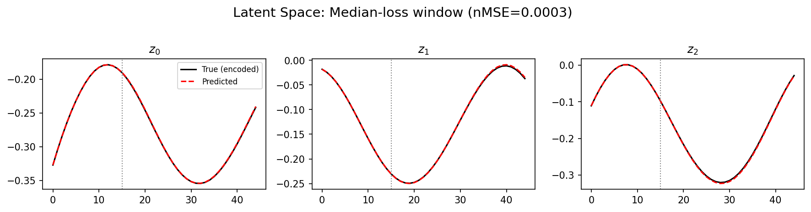

### prediction_detail_obs

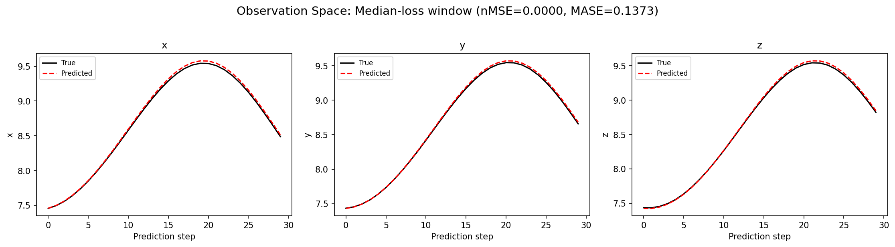

## Discussion

<!--
This section is intentionally left as a placeholder. A human reviewer
or Claude Code agent should fill it in based on the tables and figures
above, explicitly addressing each success criterion and comparing the
outcome to the stated hypothesis. Write the Discussion to
`discussion.md` in this directory and re-run `render_report`.
-->

_(to be written)_

## `run_analytics` stdout

<details><summary>Click to expand — full diagnostic output from <code>run_analytics</code></summary>

```
No run_id provided — selecting best run from group 'lorenz_partial_25d_additive_mse_uniform_p30__lc_sweep' ...
Found 9 total runs in JacobianODE/Lorenz_INDpartial_N25_D1_NormTrue_T3__JacobianODE (group=lorenz_partial_25d_additive_mse_uniform_p30__lc_sweep)
All runs (state, loop_closure_weight, tangent_entropy_weight, kl_dyn_weight):
  37nbvfaw: state=finished, lc=10.0, te=0.0, kl_dyn=0.0
  kla2hl9w: state=finished, lc=0.01, te=0.0, kl_dyn=0.0
  vemccm07: state=finished, lc=0.1, te=0.0, kl_dyn=0.0
  brnsc37d: state=finished, lc=0.0001, te=0.0, kl_dyn=0.0
  z4l1eazh: state=finished, lc=1e-05, te=0.0, kl_dyn=0.0
  pd8hhmyv: state=finished, lc=0.001, te=0.0, kl_dyn=0.0
  4dzm6954: state=finished, lc=1.0, te=0.0, kl_dyn=0.0
  btaured2: state=finished, lc=1e-06, te=0.0, kl_dyn=0.0
  7fdqopax: state=finished, lc=0.0, te=0.0, kl_dyn=0.0

slurm_timeout_min not found in any run config — falling back to 180 min
  Including 37nbvfaw (lc=10.0): use_all_runs=True (state=finished)
  Including kla2hl9w (lc=0.01): use_all_runs=True (state=finished)
  Including vemccm07 (lc=0.1): use_all_runs=True (state=finished)
  Including brnsc37d (lc=0.0001): use_all_runs=True (state=finished)
  Including z4l1eazh (lc=1e-05): use_all_runs=True (state=finished)
  Including pd8hhmyv (lc=0.001): use_all_runs=True (state=finished)
  Including 4dzm6954 (lc=1.0): use_all_runs=True (state=finished)
  Including btaured2 (lc=1e-06): use_all_runs=True (state=finished)
  Including 7fdqopax (lc=0.0): use_all_runs=True (state=finished)
Found 9 effectively-done sweep runs:
  loop_closure_weight=0.0, tangent_entropy_weight=0.0, kl_dyn_weight=0.0 -> run_id=7fdqopax
  loop_closure_weight=1e-06, tangent_entropy_weight=0.0, kl_dyn_weight=0.0 -> run_id=btaured2
  loop_closure_weight=1e-05, tangent_entropy_weight=0.0, kl_dyn_weight=0.0 -> run_id=z4l1eazh
  loop_closure_weight=0.0001, tangent_entropy_weight=0.0, kl_dyn_weight=0.0 -> run_id=brnsc37d
  loop_closure_weight=0.001, tangent_entropy_weight=0.0, kl_dyn_weight=0.0 -> run_id=pd8hhmyv
  loop_closure_weight=0.01, tangent_entropy_weight=0.0, kl_dyn_weight=0.0 -> run_id=kla2hl9w
  loop_closure_weight=0.1, tangent_entropy_weight=0.0, kl_dyn_weight=0.0 -> run_id=vemccm07
  loop_closure_weight=1.0, tangent_entropy_weight=0.0, kl_dyn_weight=0.0 -> run_id=4dzm6954
  loop_closure_weight=10.0, tangent_entropy_weight=0.0, kl_dyn_weight=0.0 -> run_id=37nbvfaw
n_dims=25, n_latent=25, n_dyn=3, dt=0.0150
  run=7fdqopax: DiagnosticMetrics(one_step_mase=0.08204861730337143, loop_closure_loss=0.3130567967891693, fast_eigenvalue_fraction=0.0, trajectory_val_loss=0.00016815440903883427) (from cache, n_batches=100)
  run=btaured2: DiagnosticMetrics(one_step_mase=0.0669427439570427, loop_closure_loss=0.2788337469100952, fast_eigenvalue_fraction=0.0, trajectory_val_loss=0.000122126642963849) (from cache, n_batches=100)
  run=z4l1eazh: DiagnosticMetrics(one_step_mase=0.0720352977514267, loop_closure_loss=0.20773859322071075, fast_eigenvalue_fraction=0.0, trajectory_val_loss=7.800250023137778e-05) (from cache, n_batches=100)
  run=brnsc37d: DiagnosticMetrics(one_step_mase=0.06765209883451462, loop_closure_loss=0.04772041365504265, fast_eigenvalue_fraction=0.0, trajectory_val_loss=9.592675633030012e-05) (from cache, n_batches=100)
  run=pd8hhmyv: DiagnosticMetrics(one_step_mase=0.06450694054365158, loop_closure_loss=0.00593948969617486, fast_eigenvalue_fraction=0.0, trajectory_val_loss=0.00013018916069995612) (from cache, n_batches=100)
  run=kla2hl9w: DiagnosticMetrics(one_step_mase=0.07938936352729797, loop_closure_loss=0.001057978835888207, fast_eigenvalue_fraction=0.0, trajectory_val_loss=0.0002661558100953698) (from cache, n_batches=100)
  run=vemccm07: DiagnosticMetrics(one_step_mase=0.10327590256929398, loop_closure_loss=0.00012065684131812304, fast_eigenvalue_fraction=0.0, trajectory_val_loss=0.0007330727530643344) (from cache, n_batches=100)
  run=4dzm6954: DiagnosticMetrics(one_step_mase=0.14817920327186584, loop_closure_loss=2.3442826204700395e-05, fast_eigenvalue_fraction=0.0, trajectory_val_loss=0.0012563723139464855) (from cache, n_batches=100)
  run=37nbvfaw: DiagnosticMetrics(one_step_mase=0.19463568925857544, loop_closure_loss=4.752790118800476e-06, fast_eigenvalue_fraction=0.0, trajectory_val_loss=0.0021460826974362135) (from cache, n_batches=100)

Ranking method:           best_traj_loss
Best run ID:              z4l1eazh
Best loop_closure_weight: 1e-05
Best tangent_entropy_weight: 0.0
Best kl_dyn_weight:       0.0
Best traj loss:           0.000078
Criteria applied: ['C1', 'C2', 'C3']
Surviving: 9 / 9
Auto-selected run_id: z4l1eazh

======================================================================
PARETO FRONTIER RUNS (7 runs)
======================================================================
  Run ID               LC Loss   Traj Val Loss
  ------------  --------------  --------------
  37nbvfaw            0.000005        0.002146
  4dzm6954            0.000023        0.001256
  vemccm07            0.000121        0.000733
  kla2hl9w            0.001058        0.000266
  pd8hhmyv            0.005939        0.000130
  brnsc37d            0.047720        0.000096
  z4l1eazh            0.207739        0.000078 <-- selected

======================================================================
RANKING METHOD COMPARISON (over 9 survivors)
======================================================================
  Method                  Run ID               LC Loss   Traj Val Loss
  ----------------------  ------------  --------------  --------------
  best_traj_loss          z4l1eazh            0.207739        0.000078 <-- active
  pareto_knee             pd8hhmyv            0.005939        0.000130
  geo_rank                z4l1eazh            0.207739        0.000078
  minimax_rank            pd8hhmyv            0.005939        0.000130
  geo_log_score           z4l1eazh            0.207739        0.000078
  minimax_log_score       kla2hl9w            0.001058        0.000266
======================================================================

Loading run z4l1eazh from JacobianODE/Lorenz_INDpartial_N25_D1_NormTrue_T3__JacobianODE ...
Train dataset shape: torch.Size([24882, 45, 25])
Validation dataset shape: torch.Size([7917, 45, 25])
Test dataset shape: torch.Size([3393, 45, 25])
Train trajectories dataset shape: torch.Size([22, 1176, 25])
Validation trajectories dataset shape: torch.Size([7, 1176, 25])
Test trajectories dataset shape: torch.Size([3, 1176, 25])
Loading checkpoint epoch=107-step=21600.ckpt...
Computing reconstruction ...
Computing MASE ...
Teacher-forced MASE: 0.0771
Free-running MASE:   0.1356
Computing latent utilization ...
Entropy-based utilization: 0.976
Null subspace mean RMS: 4.370893e-03
Computing Lyapunov exponents ...
  Computing full-trajectory Lyapunov (3 test trajs, T=1176) ...
Predicted Lyapunov exponents (batch+burn-in, 128 windowed trajs):
  λ_1 = +0.4059 ± 0.5081
  λ_2 = -0.4962 ± 0.7303
  λ_3 = -10.2888 ± 1.2405
Predicted Lyapunov exponents (full-length, 3 test trajs):
  λ_1 = +0.2285 ± 0.0059
  λ_2 = -0.2195 ± 0.0412
  λ_3 = -10.5484 ± 0.0300
Empirical Lyapunov exponents (mean ± std):
  λ_1 = +0.2716 ± 0.0605
  λ_2 = -0.1016 ± 0.0797
  λ_3 = -13.8370 ± 0.0514
Mean KY dim (predicted): 1.962 ± 0.057
Mean KY dim (empirical): 2.012 ± 0.003
Mean KY dim (burn-in):   1.878 ± 0.315
Computing prediction windows ...
Windows: 114 — nMSE min=0.0000, median=0.0000, mean=0.0005, max=0.0122
Computing long-trajectory free-running rollouts ...
Computing encoder/decoder Jacobians ...
encoder_jacobian: (128, 25, 25)
decoder_jacobian: (128, 25, 25)
Computing amplification loss ...
Amplification loss — True state: 0.000047
Amplification loss — Latent:     0.000044
```

</details>
