# Sweep Analysis: `lorenz_partial_25d_additive_mse_uniform_p30__recon100_obcslow`

**Project**: [Lorenz_INDpartial_N25_D1_NormTrue_T3__JacobianODE](https://wandb.ai/JacobianODE/Lorenz_INDpartial_N25_D1_NormTrue_T3__JacobianODE/groups/lorenz_partial_25d_additive_mse_uniform_p30__recon100_obcslow)  
**Launched**: 2026-04-16T18:50:11Z  
**Completed**: 2026-04-16T22:50:12Z  
**Outcome**: `complete_clean`  
**Git**: `latent-JacobianODE` @ `2d785ee`  
**Expected runs**: 1

## Experiment Context

### `lorenz_partial_25d_additive_mse_uniform_p30_recon100`

**Description**

Single-run companion of lorenz_partial_25d_additive_mse_uniform_p30_recon_sweep
restricted to the largest reconstruction_loss_weight (100). Submitted
on ou_bcs_low so it doesn't wait the 21h mit_normal_gpu backlog. The
other two recon weights (1, 10) are running concurrently on
mit_normal_gpu under the original wandb group. Together they let us
test the bottleneck-residual → trace-gap hypothesis.

**Hypothesis**

If tighter dyn-only reconstruction anchors the latent Jacobian trace,
<tr(dg/dz)> should be visibly closer to the Lorenz divergence -13.67
at recon_weight=100 than at 1 or 10.

**Success criteria**

- dyn-only reconstruction loss smaller than at recon_weight=1
- <tr(dg/dz)> closer to -13.67 than the recon_weight=1 run

## Results

**Chosen run** (by `best_traj_loss`): `m4zejlel` — traj_loss=0.00004, MASE=0.1243, R²=0.9999, LC loss=0.231, epoch=167.0

**Runs analyzed**: 1 (expected 1)

### Per-run results

| run_idx | run_id | best_traj_loss | best_MASE | R² | LC loss | epoch |
|---|---|---|---|---|---|---|
| 0 | `m4zejlel` | 0.00004 | 0.1243 | 0.9999 | 0.231 | 167.0 |

## Success-criteria verdicts (automated)

| Criterion | Verdict | Note |
|---|---|---|
| dyn-only reconstruction loss smaller than at recon_weight=1 | **Unknown** |  |
| <tr(dg/dz)> closer to -13.67 than the recon_weight=1 run | **Unknown** |  |

_Automated verdicts use simple numeric-threshold parsing and may mis-classify qualitative criteria. The Discussion section below takes precedence._

## Figures

### sweep_overview

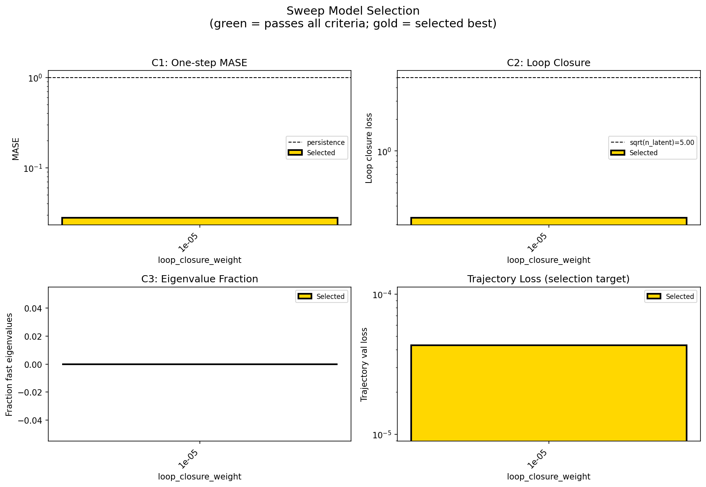

### sweep_pareto

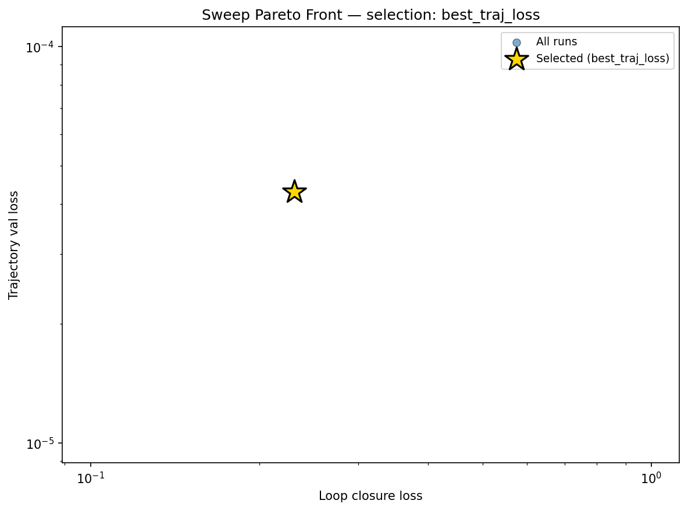

### reconstruction

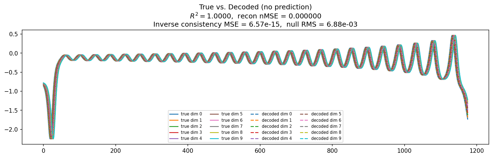

### prediction_windows

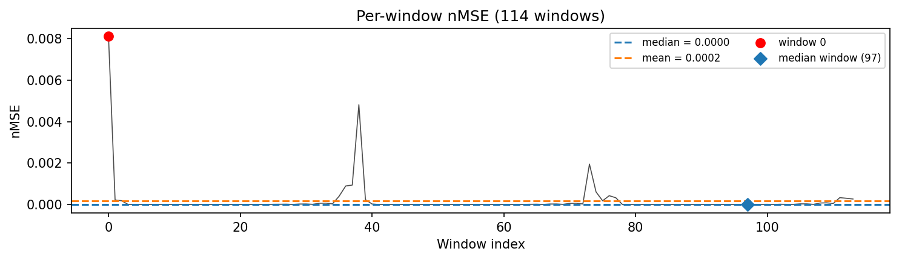

### long_trajectory

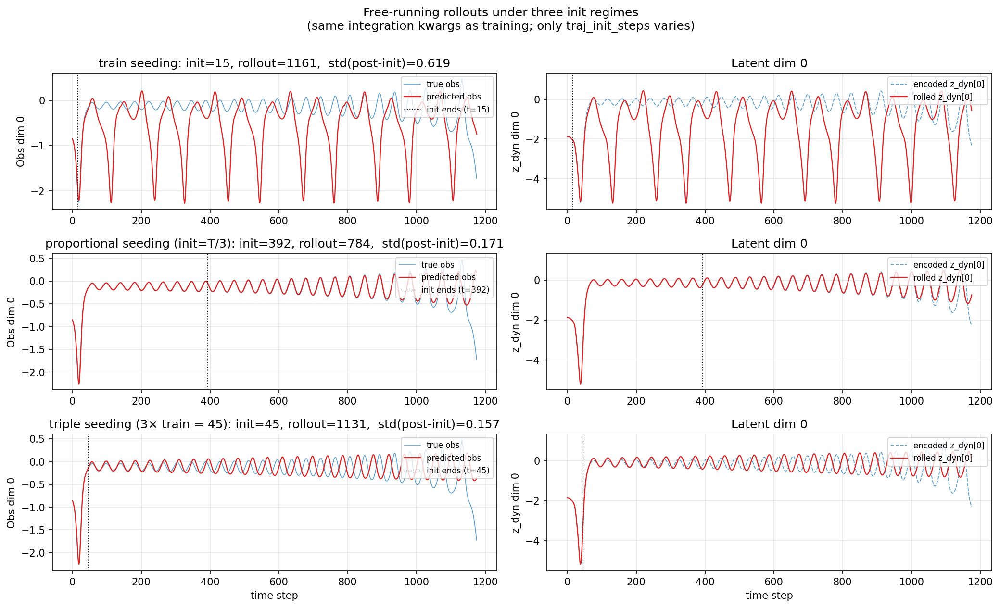

### mase

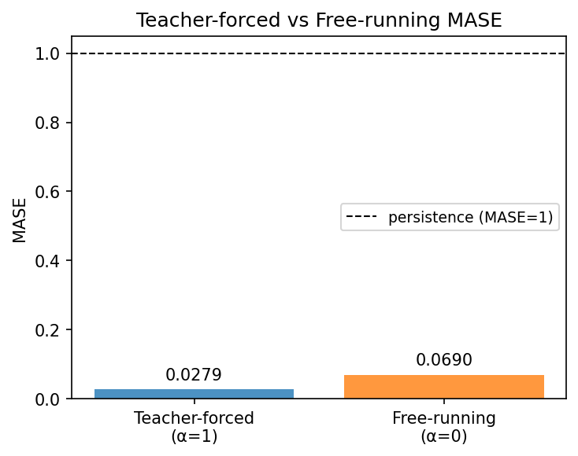

### latent_utilization

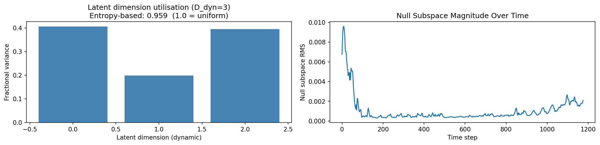

### lyapunov

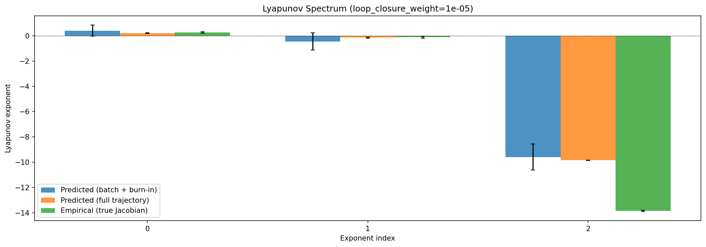

### kaplan_yorke

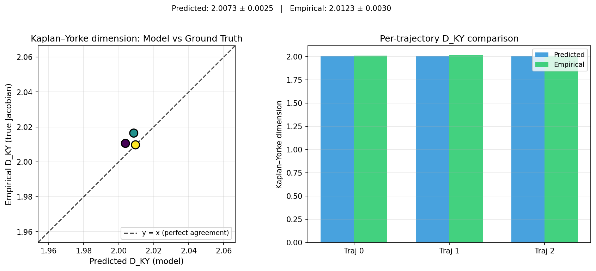

### per_run_lyapunov

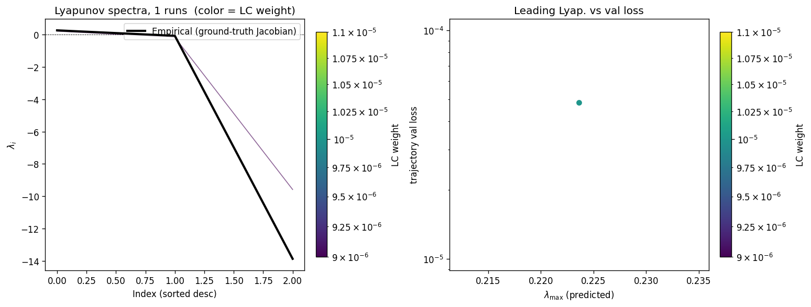

### per_run_lyapunov_vs_true

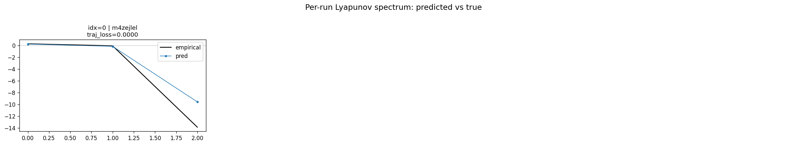

### per_run_lyapunov_relerr

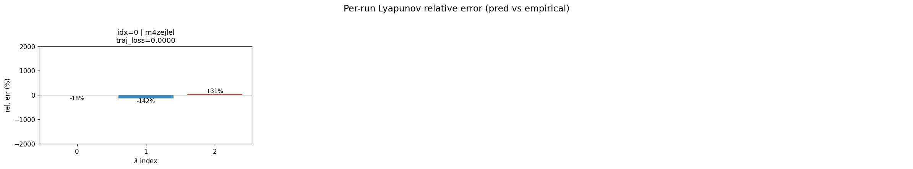

### encoder_decoder_jacobians

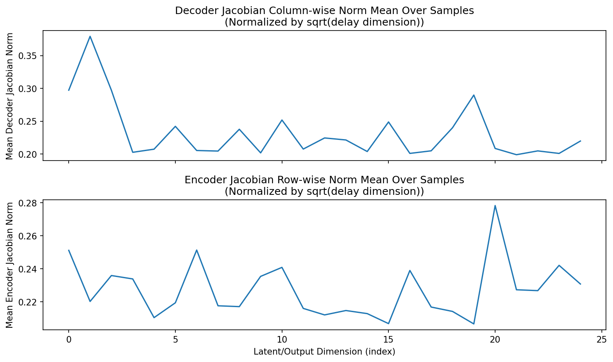

### amplification

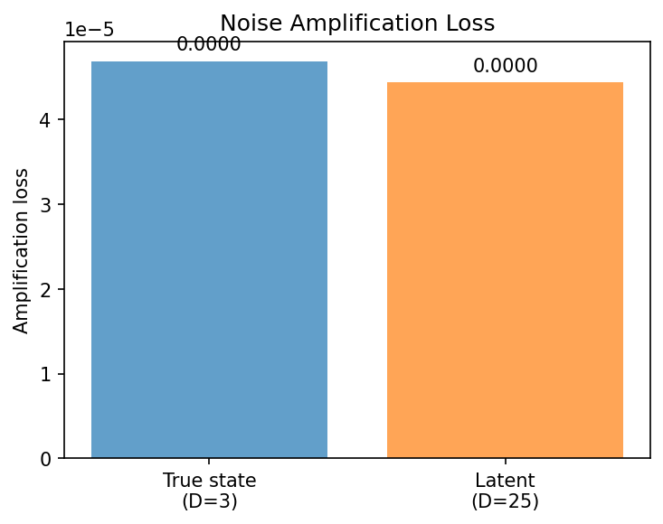

### kaplan_yorke_pca

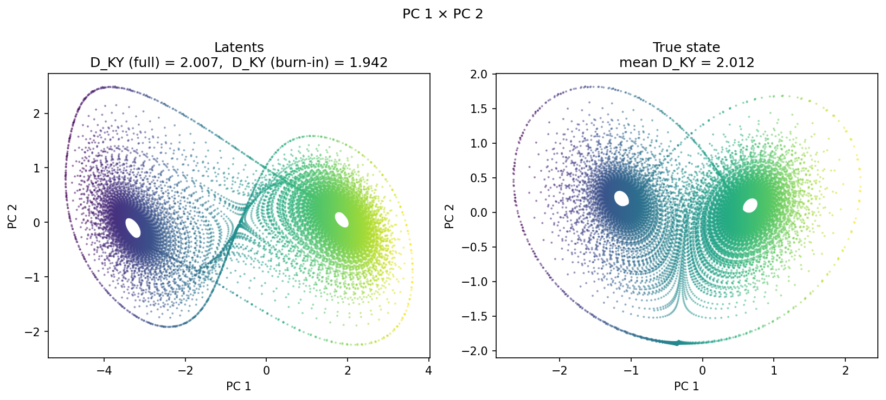

### prediction_detail_latent

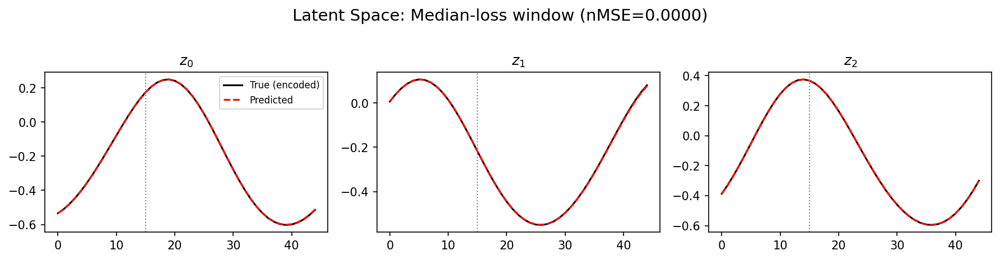

### prediction_detail_obs

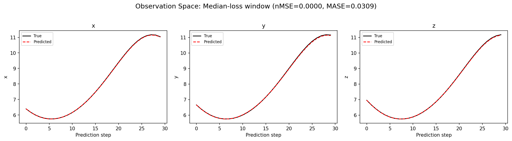

## Discussion

<!--
This section is intentionally left as a placeholder. A human reviewer
or Claude Code agent should fill it in based on the tables and figures
above, explicitly addressing each success criterion and comparing the
outcome to the stated hypothesis. Write the Discussion to
`discussion.md` in this directory and re-run `render_report`.
-->

_(to be written)_

## `run_analytics` stdout

<details><summary>Click to expand — full diagnostic output from <code>run_analytics</code></summary>

```
No run_id provided — selecting best run from group 'lorenz_partial_25d_additive_mse_uniform_p30__recon100_obcslow' ...
Found 1 total runs in JacobianODE/Lorenz_INDpartial_N25_D1_NormTrue_T3__JacobianODE (group=lorenz_partial_25d_additive_mse_uniform_p30__recon100_obcslow)
All runs (state, loop_closure_weight, tangent_entropy_weight, kl_dyn_weight):
  m4zejlel: state=finished, lc=1e-05, te=0.0, kl_dyn=0.0

slurm_timeout_min not found in any run config — falling back to 180 min
  Including m4zejlel (lc=1e-05): use_all_runs=True (state=finished)
Found 1 effectively-done sweep runs:
  loop_closure_weight=1e-05, tangent_entropy_weight=0.0, kl_dyn_weight=0.0 -> run_id=m4zejlel
n_dims=25, n_latent=25, n_dyn=3, dt=0.0150
  run=m4zejlel: DiagnosticMetrics(one_step_mase=0.027904605492949486, loop_closure_loss=0.2311270534992218, fast_eigenvalue_fraction=0.0, trajectory_val_loss=4.304070898797363e-05) (from cache, n_batches=100)

Ranking method:           best_traj_loss
Best run ID:              m4zejlel
Best loop_closure_weight: 1e-05
Best tangent_entropy_weight: 0.0
Best kl_dyn_weight:       0.0
Best traj loss:           0.000043
Criteria applied: ['C1', 'C2', 'C3']
Surviving: 1 / 1
Auto-selected run_id: m4zejlel

======================================================================
PARETO FRONTIER RUNS (1 runs)
======================================================================
  Run ID               LC Loss   Traj Val Loss
  ------------  --------------  --------------
  m4zejlel            0.231127        0.000043 <-- selected

======================================================================
RANKING METHOD COMPARISON (over 1 survivors)
======================================================================
  Method                  Run ID               LC Loss   Traj Val Loss
  ----------------------  ------------  --------------  --------------
  best_traj_loss          m4zejlel            0.231127        0.000043 <-- active
  pareto_knee             m4zejlel            0.231127        0.000043
  geo_rank                m4zejlel            0.231127        0.000043
  minimax_rank            m4zejlel            0.231127        0.000043
  geo_log_score           m4zejlel            0.231127        0.000043
  minimax_log_score       m4zejlel            0.231127        0.000043
======================================================================

Loading run m4zejlel from JacobianODE/Lorenz_INDpartial_N25_D1_NormTrue_T3__JacobianODE ...
Train dataset shape: torch.Size([24882, 45, 25])
Validation dataset shape: torch.Size([7917, 45, 25])
Test dataset shape: torch.Size([3393, 45, 25])
Train trajectories dataset shape: torch.Size([22, 1176, 25])
Validation trajectories dataset shape: torch.Size([7, 1176, 25])
Test trajectories dataset shape: torch.Size([3, 1176, 25])
Loading checkpoint epoch=167-step=33600.ckpt...
Computing reconstruction ...
Computing MASE ...
Teacher-forced MASE: 0.0279
Free-running MASE:   0.0690
Computing latent utilization ...
Entropy-based utilization: 0.959
Null subspace mean RMS: 1.678522e-03
Computing Lyapunov exponents ...
  Computing full-trajectory Lyapunov (3 test trajs, T=1176) ...
Predicted Lyapunov exponents (batch+burn-in, 128 windowed trajs):
  λ_1 = +0.4138 ± 0.4405
  λ_2 = -0.4478 ± 0.6770
  λ_3 = -9.5907 ± 1.0342
Predicted Lyapunov exponents (full-length, 3 test trajs):
  λ_1 = +0.2157 ± 0.0278
  λ_2 = -0.1437 ± 0.0483
  λ_3 = -9.8416 ± 0.0173
Empirical Lyapunov exponents (mean ± std):
  λ_1 = +0.2716 ± 0.0605
  λ_2 = -0.1016 ± 0.0797
  λ_3 = -13.8370 ± 0.0514
Mean KY dim (predicted): 2.007 ± 0.003
Mean KY dim (empirical): 2.012 ± 0.003
Mean KY dim (burn-in):   1.942 ± 0.142
Computing prediction windows ...
Windows: 114 — nMSE min=0.0000, median=0.0000, mean=0.0002, max=0.0081
Computing long-trajectory free-running rollouts ...
Computing encoder/decoder Jacobians ...
encoder_jacobian: (128, 25, 25)
decoder_jacobian: (128, 25, 25)
Computing amplification loss ...
Amplification loss — True state: 0.000047
Amplification loss — Latent:     0.000044
```

</details>
