# Sweep Analysis: `lorenz_partial_25d_additive_mse_uniform_p30__recon_sweep`

**Project**: [Lorenz_INDpartial_N25_D1_NormTrue_T3__JacobianODE](https://wandb.ai/JacobianODE/Lorenz_INDpartial_N25_D1_NormTrue_T3__JacobianODE/groups/lorenz_partial_25d_additive_mse_uniform_p30__recon_sweep)  
**Launched**: 2026-04-16T16:35:10Z  
**Completed**: 2026-04-16T21:10:15Z  
**Outcome**: `complete_with_failures`  
**Git**: `latent-JacobianODE` @ `1bb0d97`  
**Expected runs**: 3

## Experiment Context

### `lorenz_partial_25d_additive_mse_uniform_p30_recon_sweep`

**Description**

Same base as lorenz_partial_25d_additive_mse_uniform_p30. Fixes
loop_closure_weight=1e-5 (best from the prior LC sweep, run
z4l1eazh). Sweeps training.lightning.reconstruction_loss_weight
over {1, 10, 100} to test whether pushing the dyn-only bottleneck
residual smaller drags <tr(dg/dz)> toward the Lorenz divergence
-13.67 and hence λ₃ toward -14.57.

**Hypothesis**

For z4l1eazh, the full-latent cycle D(E(x))=x held at ~1e-8 but
the dyn-only cycle D([E(x)_dyn, 0]) had ~0.7% RMS residual — so
training data x_de does not lie exactly on the model's 3-D image
manifold M = {D([z_dyn, 0])}. <tr(dg/dz)> came out at -10.05
instead of -13.67, with non-constant trace including locally
positive regions. The story: off-M slippage concentrates in the
stable direction (loss-invisible) and softens λ₃.
If increasing reconstruction_loss_weight genuinely pushes x_de
onto M, we should see:
  - dyn-only reconstruction loss shrink with weight
  - <tr(dg/dz)> track toward -13.67
  - λ₃ approach -14.57
If the trace gap is insensitive to reconstruction weight, the
bottleneck-residual hypothesis is wrong and we need to look
elsewhere (e.g. z_null regularization, Jacobian-net capacity,
optimization dynamics).

**Success criteria**

- dyn-only reconstruction loss monotonically decreases with weight
- <tr(dg/dz)> at recon_weight=100 is within 20% of -13.67
- λ₃ at recon_weight=100 is more negative than at recon_weight=1

## Results

**Swept axes** (1): `training.lightning.reconstruction_loss_weight`

**Chosen run** (by `best_traj_loss`): `0efqqxfe` — traj_loss=0.00004, MASE=0.1258, R²=0.9999, LC loss=0.164, epoch=197.0

Swept-axis values at chosen run: `training.lightning.reconstruction_loss_weight`=10

### Integrity checks

⚠️ **Matched-run count mismatch**: expected 3 run_idx slots per the sentinel, matched 2 in wandb. The sweep may still be in progress, or some slots failed without producing wandb evidence.

**Runs analyzed**: 2 (expected 3)

### Per-run results

| run_idx | run_id | `training.lightning.reconstruction_loss_weight` | best_traj_loss | best_MASE | R² | LC loss | epoch |
|---|---|---|---|---|---|---|---|
| 1 | `0efqqxfe` | 10 | 0.00004 | 0.1258 | 0.9999 | 0.164 | 197.0 |
| 0 | `ez55lpde` | 1 | 0.00005 | 0.1379 | 0.9999 | 0.125 | 197.0 |

## Success-criteria verdicts (automated)

| Criterion | Verdict | Note |
|---|---|---|
| dyn-only reconstruction loss monotonically decreases with weight | **Unknown** |  |
| <tr(dg/dz)> at recon_weight=100 is within 20% of -13.67 | **Unknown** |  |
| λ₃ at recon_weight=100 is more negative than at recon_weight=1 | **Unknown** |  |

_Automated verdicts use simple numeric-threshold parsing and may mis-classify qualitative criteria. The Discussion section below takes precedence._

## Figures

### sweep_overview

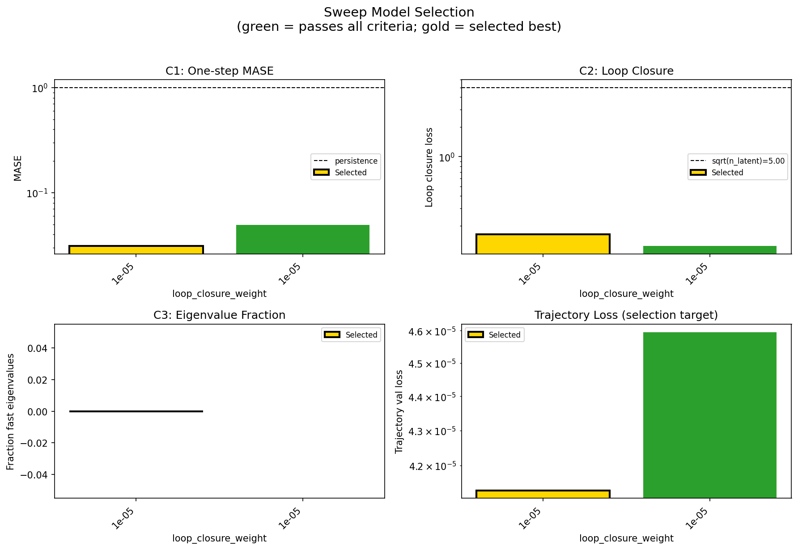

### sweep_pareto

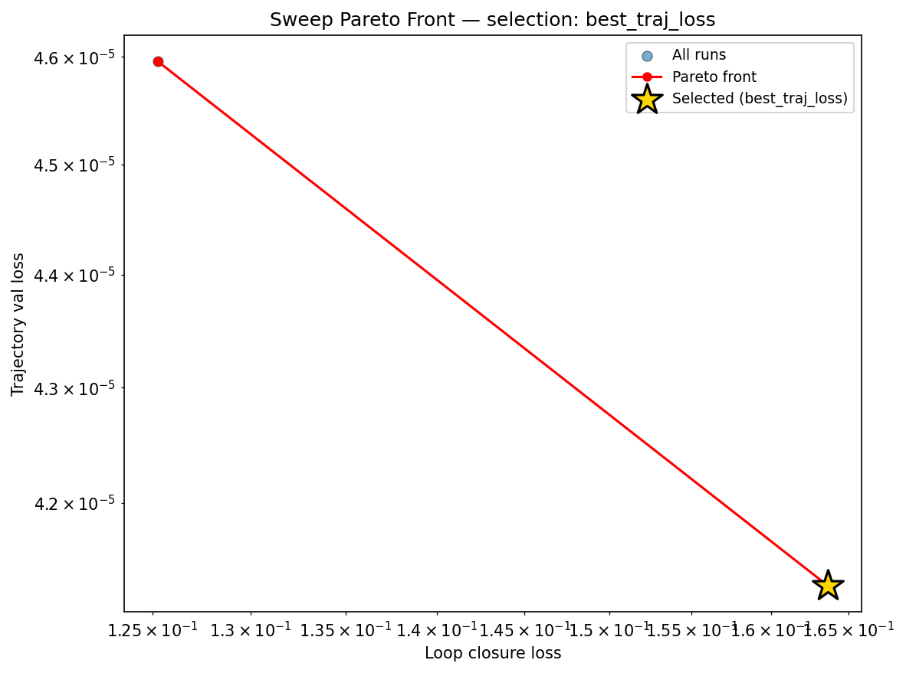

### reconstruction

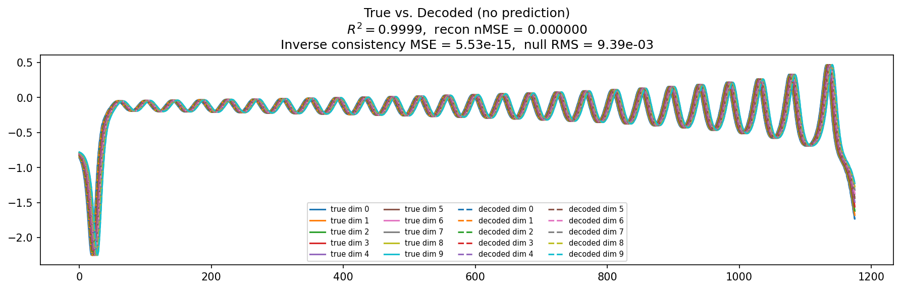

### prediction_windows

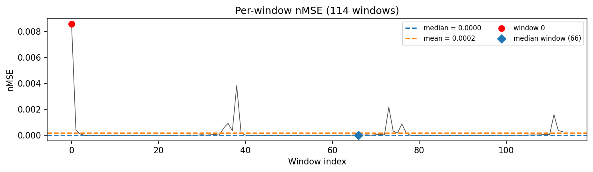

### long_trajectory

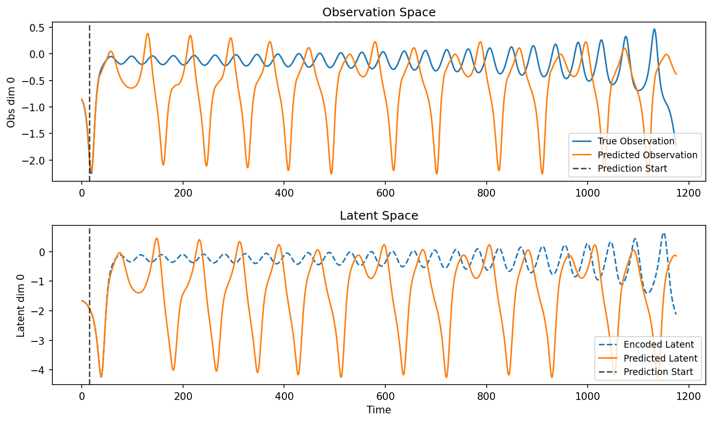

### mase

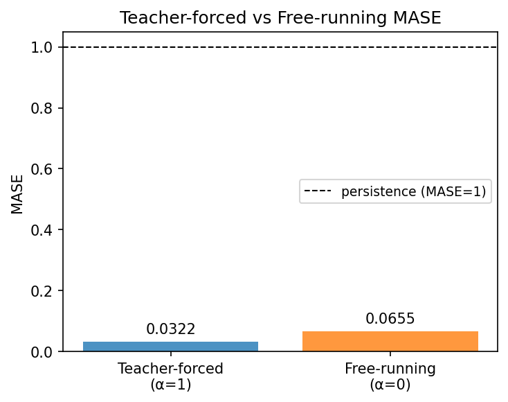

### latent_utilization

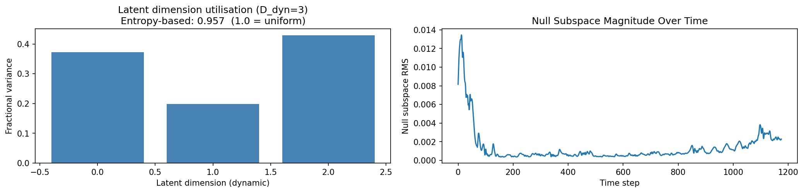

### lyapunov

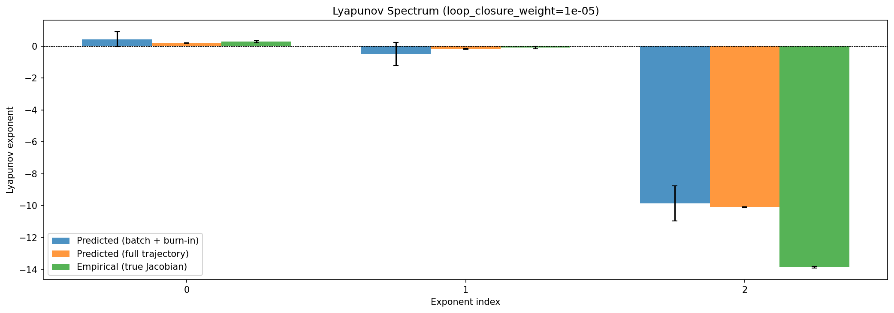

### kaplan_yorke

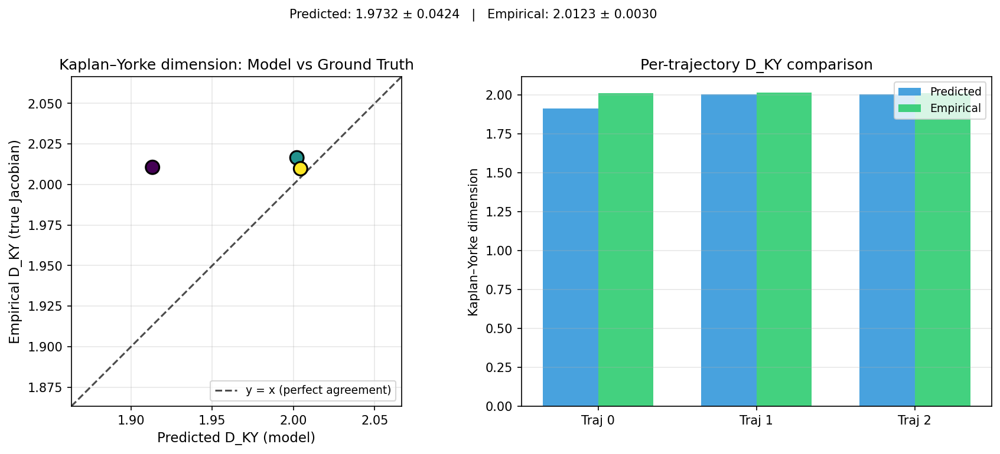

### per_run_lyapunov

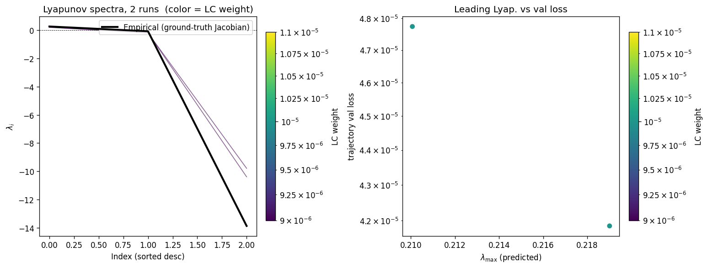

### per_run_lyapunov_vs_true

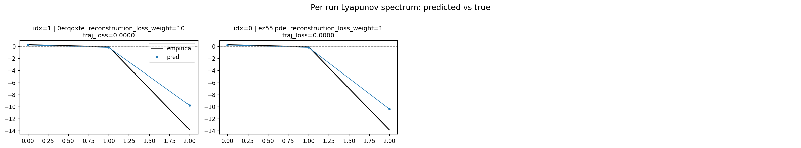

### per_run_lyapunov_relerr

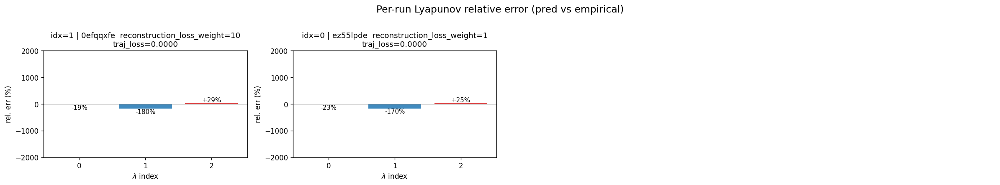

### encoder_decoder_jacobians

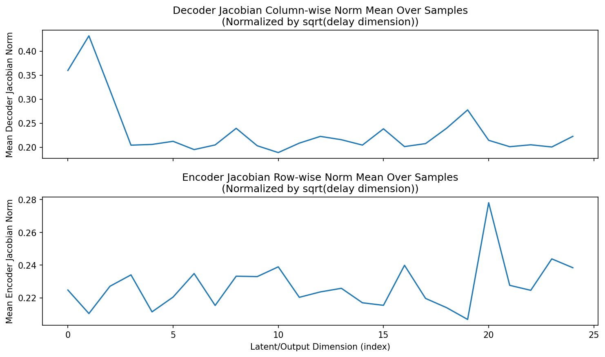

### amplification

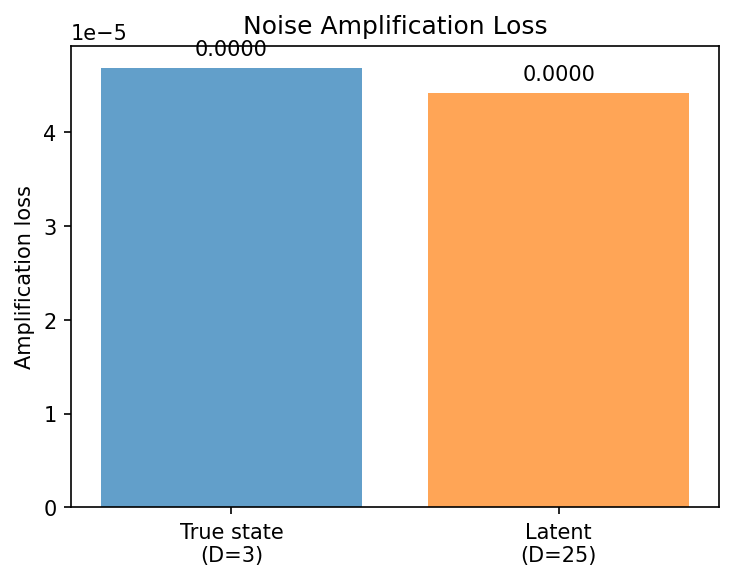

### kaplan_yorke_pca

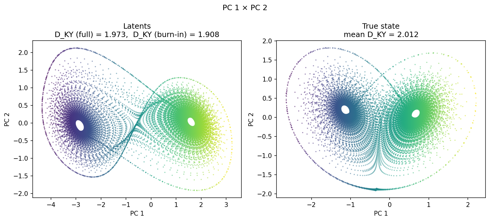

### prediction_detail_latent

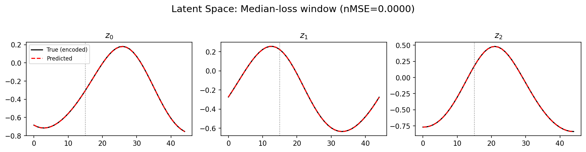

### prediction_detail_obs

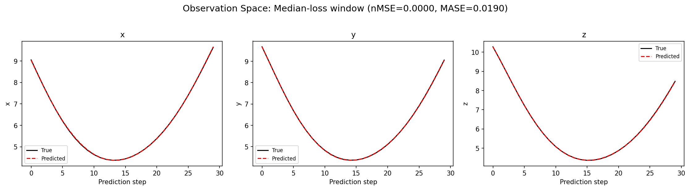

## Discussion

<!--
This section is intentionally left as a placeholder. A human reviewer
or Claude Code agent should fill it in based on the tables and figures
above, explicitly addressing each success criterion and comparing the
outcome to the stated hypothesis. Write the Discussion to
`discussion.md` in this directory and re-run `render_report`.
-->

_(to be written)_

## `run_analytics` stdout

<details><summary>Click to expand — full diagnostic output from <code>run_analytics</code></summary>

```
No run_id provided — selecting best run from group 'lorenz_partial_25d_additive_mse_uniform_p30__recon_sweep' ...
Found 2 total runs in JacobianODE/Lorenz_INDpartial_N25_D1_NormTrue_T3__JacobianODE (group=lorenz_partial_25d_additive_mse_uniform_p30__recon_sweep)
All runs (state, loop_closure_weight, tangent_entropy_weight, kl_dyn_weight):
  0efqqxfe: state=finished, lc=1e-05, te=0.0, kl_dyn=0.0
  ez55lpde: state=finished, lc=1e-05, te=0.0, kl_dyn=0.0

slurm_timeout_min not found in any run config — falling back to 180 min
  Including 0efqqxfe (lc=1e-05): use_all_runs=True (state=finished)
  Including ez55lpde (lc=1e-05): use_all_runs=True (state=finished)
Found 2 effectively-done sweep runs:
  loop_closure_weight=1e-05, tangent_entropy_weight=0.0, kl_dyn_weight=0.0 -> run_id=0efqqxfe
  loop_closure_weight=1e-05, tangent_entropy_weight=0.0, kl_dyn_weight=0.0 -> run_id=ez55lpde
n_dims=25, n_latent=25, n_dyn=3, dt=0.0150
  run=0efqqxfe: DiagnosticMetrics(one_step_mase=0.0311412550508976, loop_closure_loss=0.16365577280521393, fast_eigenvalue_fraction=0.0, trajectory_val_loss=4.1294744733022526e-05) (from cache, n_batches=100)
  run=ez55lpde: DiagnosticMetrics(one_step_mase=0.04930305853486061, loop_closure_loss=0.12527205049991608, fast_eigenvalue_fraction=0.0, trajectory_val_loss=4.595398058881983e-05) (from cache, n_batches=100)

Ranking method:           best_traj_loss
Best run ID:              0efqqxfe
Best loop_closure_weight: 1e-05
Best tangent_entropy_weight: 0.0
Best kl_dyn_weight:       0.0
Best traj loss:           0.000041
Criteria applied: ['C1', 'C2', 'C3']
Surviving: 2 / 2
Auto-selected run_id: 0efqqxfe

======================================================================
PARETO FRONTIER RUNS (2 runs)
======================================================================
  Run ID               LC Loss   Traj Val Loss
  ------------  --------------  --------------
  ez55lpde            0.125272        0.000046
  0efqqxfe            0.163656        0.000041 <-- selected

======================================================================
RANKING METHOD COMPARISON (over 2 survivors)
======================================================================
  Method                  Run ID               LC Loss   Traj Val Loss
  ----------------------  ------------  --------------  --------------
  best_traj_loss          0efqqxfe            0.163656        0.000041 <-- active
  pareto_knee             ez55lpde            0.125272        0.000046
  geo_rank                0efqqxfe            0.163656        0.000041
  minimax_rank            0efqqxfe            0.163656        0.000041
  geo_log_score           0efqqxfe            0.163656        0.000041
  minimax_log_score       ez55lpde            0.125272        0.000046
======================================================================

Loading run 0efqqxfe from JacobianODE/Lorenz_INDpartial_N25_D1_NormTrue_T3__JacobianODE ...
Train dataset shape: torch.Size([24882, 45, 25])
Validation dataset shape: torch.Size([7917, 45, 25])
Test dataset shape: torch.Size([3393, 45, 25])
Train trajectories dataset shape: torch.Size([22, 1176, 25])
Validation trajectories dataset shape: torch.Size([7, 1176, 25])
Test trajectories dataset shape: torch.Size([3, 1176, 25])
Loading checkpoint epoch=197-step=39600.ckpt...
Computing reconstruction ...
Computing MASE ...
Teacher-forced MASE: 0.0322
Free-running MASE:   0.0655
Computing latent utilization ...
Entropy-based utilization: 0.957
Null subspace mean RMS: 2.304416e-03
Computing Lyapunov exponents ...
  Computing full-trajectory Lyapunov (3 test trajs, T=1176) ...
Predicted Lyapunov exponents (batch+burn-in, 128 windowed trajs):
  λ_1 = +0.4259 ± 0.4706
  λ_2 = -0.4991 ± 0.7318
  λ_3 = -9.8526 ± 1.1002
Predicted Lyapunov exponents (full-length, 3 test trajs):
  λ_1 = +0.1913 ± 0.0203
  λ_2 = -0.1753 ± 0.0339
  λ_3 = -10.0892 ± 0.0227
Empirical Lyapunov exponents (mean ± std):
  λ_1 = +0.2716 ± 0.0605
  λ_2 = -0.1016 ± 0.0797
  λ_3 = -13.8370 ± 0.0514
Mean KY dim (predicted): 1.973 ± 0.042
Mean KY dim (empirical): 2.012 ± 0.003
Mean KY dim (burn-in):   1.908 ± 0.172
Computing prediction windows ...
Windows: 114 — nMSE min=0.0000, median=0.0000, mean=0.0002, max=0.0086
Computing long trajectory prediction ...
Computing encoder/decoder Jacobians ...
encoder_jacobian: (128, 25, 25)
decoder_jacobian: (128, 25, 25)
Computing amplification loss ...
Amplification loss — True state: 0.000047
Amplification loss — Latent:     0.000044
```

</details>
