# Sweep Analysis: `lorenz_partial_25d_additive_mse_uniform_p30_obsnoise001__enchd_lc_sweep`

**Project**: [Lorenz_INDpartial_N25_D1_NormTrue_T3__JacobianODE](https://wandb.ai/JacobianODE/Lorenz_INDpartial_N25_D1_NormTrue_T3__JacobianODE/groups/lorenz_partial_25d_additive_mse_uniform_p30_obsnoise001__enchd_lc_sweep)  
**Launched**: 2026-04-17T21:05:11Z  
**Completed**: 2026-04-18T11:45:21Z  
**Outcome**: `complete_clean`  
**Git**: `latent-JacobianODE` @ `5051646`  
**Expected runs**: 40

## Experiment Context

### `lorenz_partial_25d_additive_mse_uniform_p30_obsnoise001__enchd_lc_sweep`

**Description**

Same base as lorenz_partial_25d_additive_mse_uniform_p30 with
obs_noise=0.01. Sweeps model.encoder.hidden_dim over
{32, 64, 128, 256, 512} × the standard 9-value loop_closure_weight
grid (2-D sweep, 45 runs).

**Hypothesis**

The encoder's per-coupling-layer MLP width (default 128) may be
capacity-limited in expressing the diffeomorphism between the 25-D
delay-embedded obs and the 3-D dyn latent subspace. If so, larger
hidden_dim should improve reconstruction, dyn-only cycle
consistency, and λ_min accuracy up to some plateau; smaller
hidden_dim (32, 64) should underfit and produce looser
diffeomorphisms. If capacity is not the bottleneck, results should
be flat across hidden_dim.

**Success criteria**

- Val traj_loss non-increasing from hidden_dim=32 up to some plateau
- λ_min accuracy (vs empirical ~-13.9) improves monotonically with hidden_dim up to the same plateau
- Best LC location is roughly stable across hidden_dim (no capacity × LC reversal)

## Results

**Swept axes** (2): `model.encoder.hidden_dim`, `training.lightning.loop_closure_weight`

**Chosen run** (by `best_traj_loss`): `1wwirh60` — traj_loss=0.00089, MASE=0.6698, R²=0.9976, LC loss=1.610, epoch=165.0

Swept-axis values at chosen run: `model.encoder.hidden_dim`=64 · `training.lightning.loop_closure_weight`=0

### Integrity checks

⚠️ **1 run_idx slot(s) had multiple matching wandb runs** — the best by `best_traj_loss` was kept; the others are listed below for audit:
  - run_idx=**20**: chose `j8xqwvh5`, dropped `z5zzf7v3`

**Runs analyzed**: 40 (expected 40)

### Per-run results

| run_idx | run_id | `model.encoder.hidden_dim` | `training.lightning.loop_closure_weight` | best_traj_loss | best_MASE | R² | LC loss | epoch |
|---|---|---|---|---|---|---|---|---|
| 1 | `1wwirh60` | 64 | 0 | 0.00089 | 0.6698 | 0.9976 | 1.610 | 165.0 |
| 18 | `ll5xx3rc` | 256 | 1.0e-04 | 0.00090 | 0.6545 | 0.9976 | 0.120 | 157.0 |
| 14 | `r2lznj4b` | 512 | 1.0e-05 | 0.00097 | 0.6413 | 0.9974 | 0.207 | 180.0 |
| 8 | `96wzp7ax` | 256 | 1.0e-06 | 0.00114 | 0.7041 | 0.9970 | 0.769 | 105.0 |
| 3 | `lsg9vpxt` | 256 | 0 | 0.00114 | 0.6714 | 0.9970 | 0.615 | 138.0 |
| 12 | `xotytukg` | 128 | 1.0e-05 | 0.00115 | 0.6816 | 0.9969 | 0.305 | 152.0 |
| 6 | `vxsqq8n3` | 64 | 1.0e-06 | 0.00123 | 0.7193 | 0.9967 | 1.122 | 109.0 |
| 4 | `fyzhn6mb` | 512 | 0 | 0.00128 | 0.7394 | 0.9966 | 1.165 | 106.0 |
| 7 | `rha3kf0k` | 128 | 1.0e-06 | 0.00128 | 0.7177 | 0.9966 | 1.076 | 110.0 |
| 16 | `ftu91y8t` | 64 | 1.0e-04 | 0.00130 | 0.7183 | 0.9966 | 0.163 | 130.0 |
| 19 | `joj7z0t2` | 512 | 1.0e-04 | 0.00132 | 0.7608 | 0.9965 | 0.123 | 104.0 |
| 17 | `5px1rlbp` | 128 | 1.0e-04 | 0.00132 | 0.7287 | 0.9965 | 0.181 | 110.0 |
| 11 | `njrxgz11` | 64 | 1.0e-05 | 0.00133 | 0.7311 | 0.9965 | 0.879 | 107.0 |
| 10 | `6cp0rz4y` | 32 | 1.0e-05 | 0.00157 | 0.7948 | 0.9958 | 0.478 | 193.0 |
| 22 | `bx4cgk4y` | 128 | 0.001 | 0.00166 | 0.7891 | 0.9956 | 0.022 | 111.0 |
| 29 | `ufx598w7` | 512 | 0.01 | 0.00225 | 0.9313 | 0.9940 | 0.002 | 88.0 |
| 26 | `idpmocmw` | 64 | 0.01 | 0.00234 | 0.9395 | 0.9938 | 0.005 | 102.0 |
| 28 | `50nbcet4` | 256 | 0.01 | 0.00236 | 0.9256 | 0.9937 | 0.009 | 103.0 |
| 0 | `0mpwbqk7` | 32 | 0 | 0.00242 | 1.0772 | 0.9936 | 1.624 | 167.0 |
| 27 | `maqs3088` | 128 | 0.01 | 0.00245 | 0.9229 | 0.9935 | 0.002 | 102.0 |
| 9 | `bhrkc679` | 512 | 1.0e-06 | 0.00252 | 0.8623 | 0.9932 | 0.243 | 57.0 |
| 33 | `mjx53oh9` | 256 | 0.1 | 0.00281 | 1.0286 | 0.9925 | 0.000 | 143.0 |
| 23 | `jy9nxbxe` | 256 | 0.001 | 0.00285 | 0.9935 | 0.9924 | 0.008 | 55.0 |
| 13 | `7t07kkzf` | 256 | 1.0e-05 | 0.00302 | 0.9317 | 0.9919 | 0.122 | 47.0 |
| 5 | `lv4lufoq` | 32 | 1.0e-06 | 0.00303 | 1.1477 | 0.9919 | 1.609 | 107.0 |
| 32 | `wsy55cmp` | 128 | 0.1 | 0.00312 | 1.0479 | 0.9916 | 0.000 | 163.0 |
| 34 | `i9qfgypj` | 512 | 0.1 | 0.00322 | 1.1309 | 0.9914 | 0.000 | 100.0 |
| 2 | `4nz0p544` | 128 | 0 | 0.00380 | 1.1892 | 0.9898 | 0.846 | 28.0 |
| 15 | `2d48iu8o` | 32 | 1.0e-04 | nan | nan | nan | 1.126 | — |
| 20 | `j8xqwvh5` | 32 | 0.001 | nan | nan | nan | 0.228 | — |
| 38 | `syjwl5ic` | 256 | 1 | 0.00409 | 1.2506 | 0.9890 | 0.000 | 105.0 |
| 31 | `o9aszdui` | 64 | 0.1 | 0.00440 | 1.2301 | 0.9882 | 0.001 | 99.0 |
| 37 | `x2te15ug` | 128 | 1 | 0.00536 | 1.4571 | 0.9856 | 0.000 | 90.0 |
| 36 | `5w7bdslv` | 64 | 1 | 0.00644 | 1.5314 | 0.9828 | 0.000 | 92.0 |
| 39 | `ueimwt6w` | 512 | 1 | 0.00954 | 1.8943 | 0.9744 | 0.000 | 44.0 |
| 25 | `33f4ymvo` | 32 | 0.01 | 0.01323 | 2.1832 | 0.9647 | 0.004 | 30.0 |
| 30 | `x4p8zlr9` | 32 | 0.1 | 0.01798 | 2.7755 | 0.9521 | 0.000 | 26.0 |
| 21 | `cat8nkrd` | 64 | 0.001 | 0.01985 | 2.8201 | 0.9471 | 0.016 | 12.0 |
| 35 | `ilucchni` | 32 | 1 | 0.07856 | 6.4587 | 0.7905 | 0.000 | 17.0 |
| 24 | `uuso2tr7` | 512 | 0.001 | 0.09673 | 6.9480 | 0.7421 | 0.005 | 2.0 |

## Success-criteria verdicts (automated)

| Criterion | Verdict | Note |
|---|---|---|
| Val traj_loss non-increasing from hidden_dim=32 up to some plateau | **Unknown** |  |
| λ_min accuracy (vs empirical ~-13.9) improves monotonically with hidden_dim up to the same plateau | **Unknown** |  |
| Best LC location is roughly stable across hidden_dim (no capacity × LC reversal) | **Unknown** |  |

_Automated verdicts use simple numeric-threshold parsing and may mis-classify qualitative criteria. The Discussion section below takes precedence._

## Figures

### sweep_overview

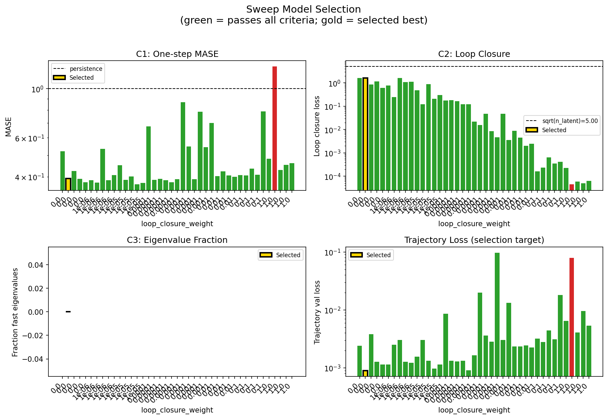

### sweep_pareto

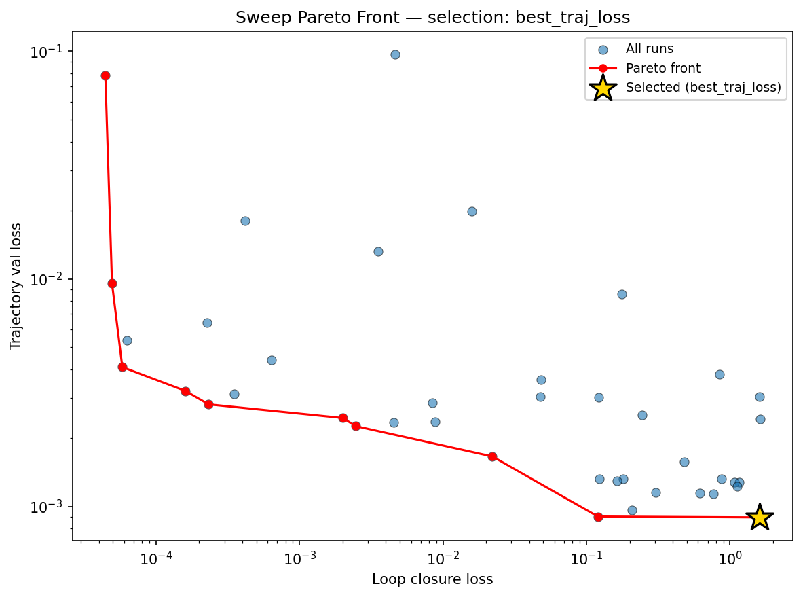

### reconstruction

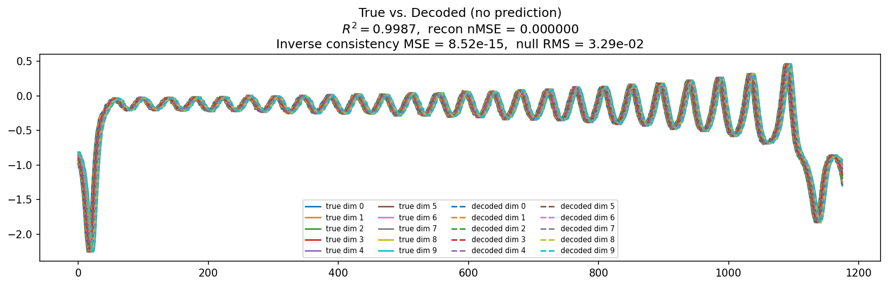

### prediction_windows

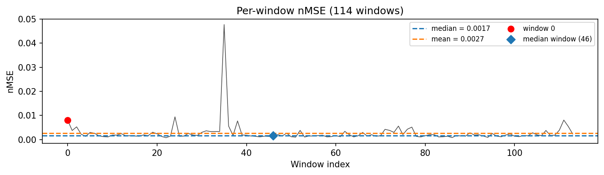

### long_trajectory

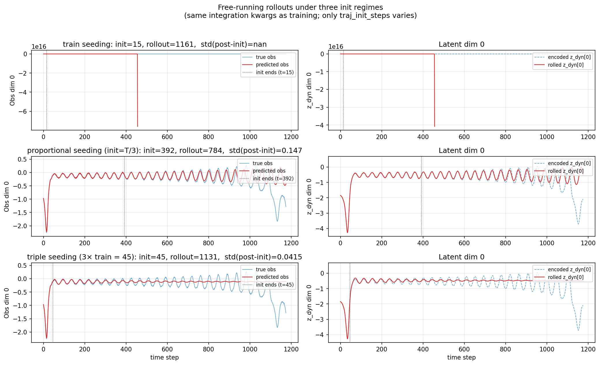

### mase

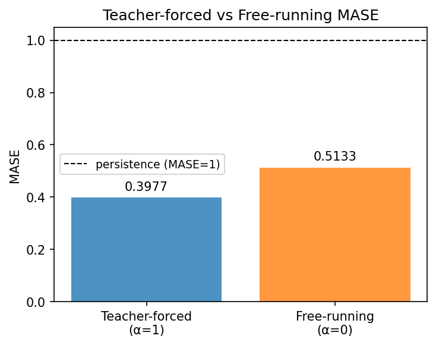

### latent_utilization

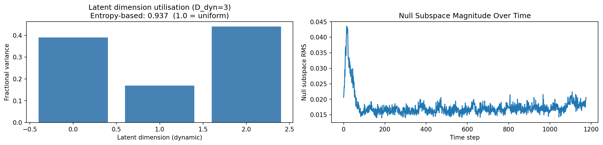

### lyapunov

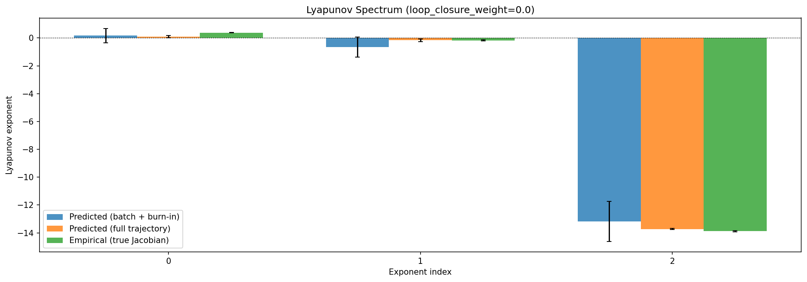

### kaplan_yorke

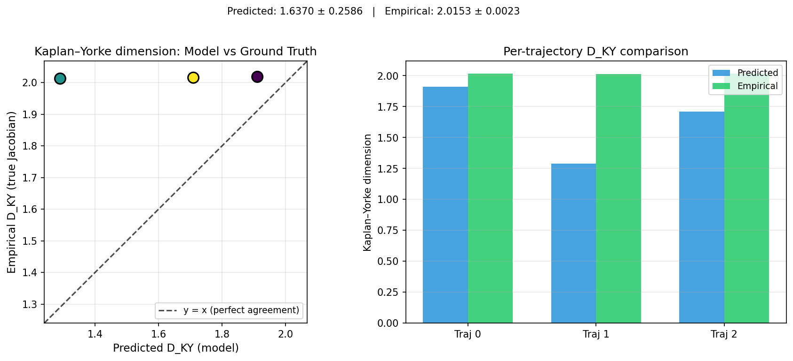

### per_run_lyapunov

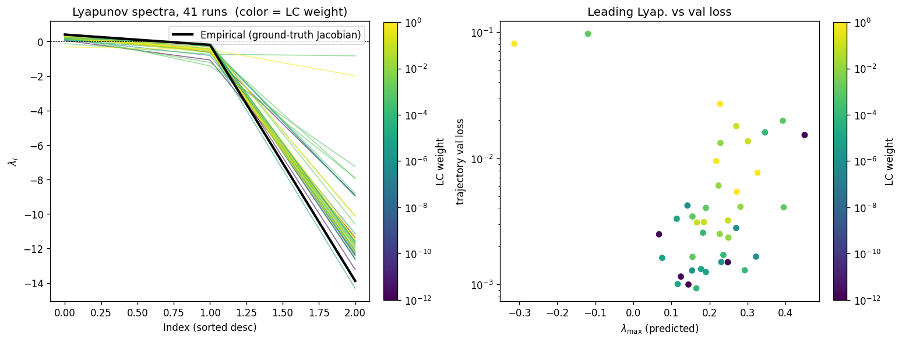

### per_run_lyapunov_vs_true

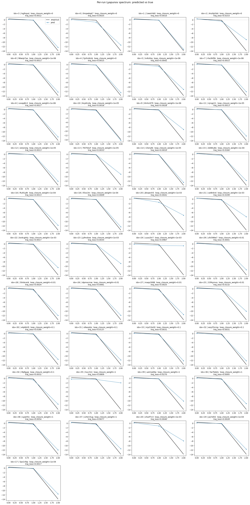

### per_run_lyapunov_relerr

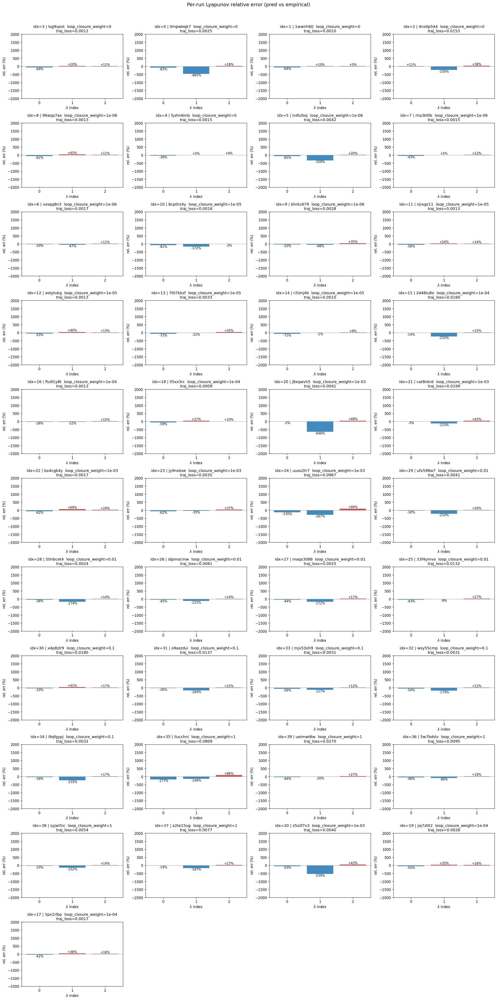

### encoder_decoder_jacobians

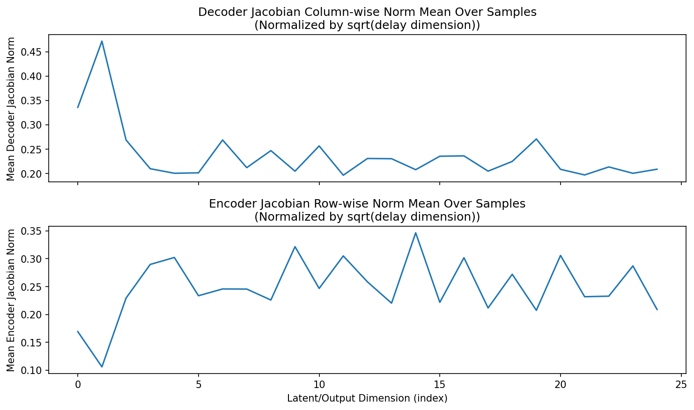

### amplification

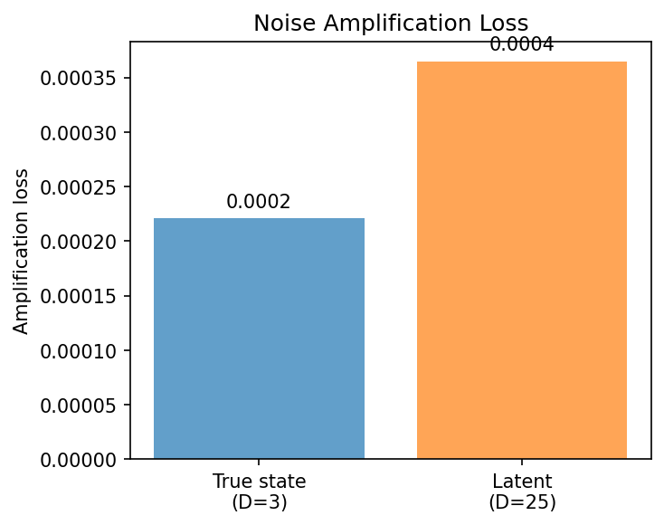

### kaplan_yorke_pca

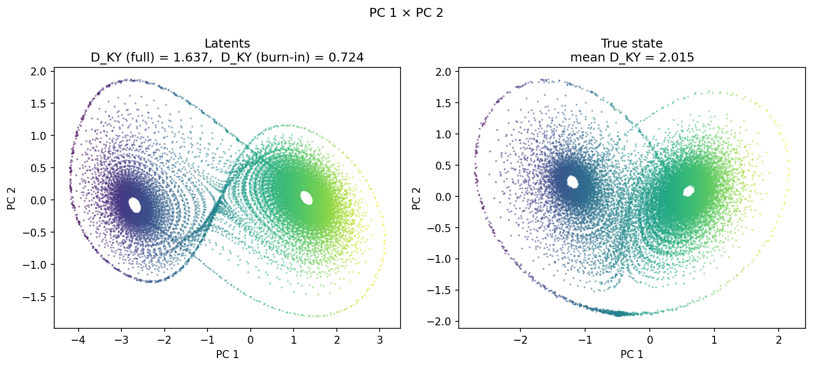

### prediction_detail_latent

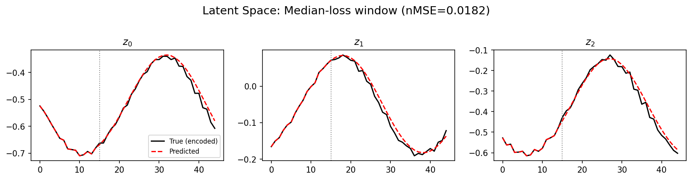

### prediction_detail_obs

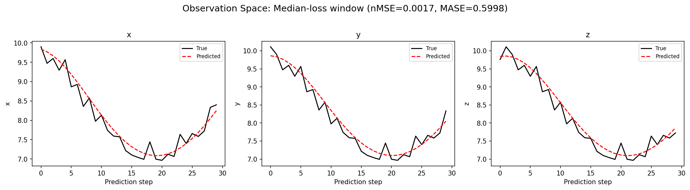

## Discussion

<!--
This section is intentionally left as a placeholder. A human reviewer
or Claude Code agent should fill it in based on the tables and figures
above, explicitly addressing each success criterion and comparing the
outcome to the stated hypothesis. Write the Discussion to
`discussion.md` in this directory and re-run `render_report`.
-->

_(to be written)_

## `run_analytics` stdout

<details><summary>Click to expand — full diagnostic output from <code>run_analytics</code></summary>

```
No run_id provided — selecting best run from group 'lorenz_partial_25d_additive_mse_uniform_p30_obsnoise001__enchd_lc_sweep' ...
Found 43 total runs in JacobianODE/Lorenz_INDpartial_N25_D1_NormTrue_T3__JacobianODE (group=lorenz_partial_25d_additive_mse_uniform_p30_obsnoise001__enchd_lc_sweep)
All runs (state, loop_closure_weight, tangent_entropy_weight, kl_dyn_weight):
  lsg9vpxt: state=finished, lc=0.0, te=0.0, kl_dyn=0.0
  0mpwbqk7: state=finished, lc=0.0, te=0.0, kl_dyn=0.0
  1wwirh60: state=finished, lc=0.0, te=0.0, kl_dyn=0.0
  4nz0p544: state=finished, lc=0.0, te=0.0, kl_dyn=0.0
  96wzp7ax: state=finished, lc=1e-06, te=0.0, kl_dyn=0.0
  fyzhn6mb: state=finished, lc=0.0, te=0.0, kl_dyn=0.0
  lv4lufoq: state=finished, lc=1e-06, te=0.0, kl_dyn=0.0
  rha3kf0k: state=finished, lc=1e-06, te=0.0, kl_dyn=0.0
  vxsqq8n3: state=finished, lc=1e-06, te=0.0, kl_dyn=0.0
  6cp0rz4y: state=finished, lc=1e-05, te=0.0, kl_dyn=0.0
  bhrkc679: state=crashed, lc=1e-06, te=0.0, kl_dyn=0.0
  njrxgz11: state=finished, lc=1e-05, te=0.0, kl_dyn=0.0
  xotytukg: state=finished, lc=1e-05, te=0.0, kl_dyn=0.0
  7t07kkzf: state=finished, lc=1e-05, te=0.0, kl_dyn=0.0
  r2lznj4b: state=finished, lc=1e-05, te=0.0, kl_dyn=0.0
  2d48iu8o: state=finished, lc=0.0001, te=0.0, kl_dyn=0.0
  ftu91y8t: state=finished, lc=0.0001, te=0.0, kl_dyn=0.0
  ll5xx3rc: state=finished, lc=0.0001, te=0.0, kl_dyn=0.0
  sh9njr1h: state=finished, lc=0.0001, te=0.0, kl_dyn=0.0
  gbm9ds5t: state=crashed, lc=0.001, te=0.0, kl_dyn=0.0
  j8xqwvh5: state=crashed, lc=0.001, te=0.0, kl_dyn=0.0
  cat8nkrd: state=finished, lc=0.001, te=0.0, kl_dyn=0.0
  bx4cgk4y: state=finished, lc=0.001, te=0.0, kl_dyn=0.0
  jy9nxbxe: state=finished, lc=0.001, te=0.0, kl_dyn=0.0
  uuso2tr7: state=finished, lc=0.001, te=0.0, kl_dyn=0.0
  ufx598w7: state=finished, lc=0.01, te=0.0, kl_dyn=0.0
  50nbcet4: state=finished, lc=0.01, te=0.0, kl_dyn=0.0
  idpmocmw: state=finished, lc=0.01, te=0.0, kl_dyn=0.0
  maqs3088: state=finished, lc=0.01, te=0.0, kl_dyn=0.0
  33f4ymvo: state=finished, lc=0.01, te=0.0, kl_dyn=0.0
  x4p8zlr9: state=finished, lc=0.1, te=0.0, kl_dyn=0.0
  o9aszdui: state=finished, lc=0.1, te=0.0, kl_dyn=0.0
  mjx53oh9: state=finished, lc=0.1, te=0.0, kl_dyn=0.0
  wsy55cmp: state=finished, lc=0.1, te=0.0, kl_dyn=0.0
  i9qfgypj: state=finished, lc=0.1, te=0.0, kl_dyn=0.0
  ilucchni: state=finished, lc=1.0, te=0.0, kl_dyn=0.0
  ueimwt6w: state=finished, lc=1.0, te=0.0, kl_dyn=0.0
  5w7bdslv: state=finished, lc=1.0, te=0.0, kl_dyn=0.0
  syjwl5ic: state=finished, lc=1.0, te=0.0, kl_dyn=0.0
  x2te15ug: state=finished, lc=1.0, te=0.0, kl_dyn=0.0
  z5zzf7v3: state=crashed, lc=0.001, te=0.0, kl_dyn=0.0
  joj7z0t2: state=finished, lc=0.0001, te=0.0, kl_dyn=0.0
  5px1rlbp: state=finished, lc=0.0001, te=0.0, kl_dyn=0.0

slurm_timeout_min not found in any run config — falling back to 180 min
  Including lsg9vpxt (lc=0.0): use_all_runs=True (state=finished)
  Including 0mpwbqk7 (lc=0.0): use_all_runs=True (state=finished)
  Including 1wwirh60 (lc=0.0): use_all_runs=True (state=finished)
  Including 4nz0p544 (lc=0.0): use_all_runs=True (state=finished)
  Including 96wzp7ax (lc=1e-06): use_all_runs=True (state=finished)
  Including fyzhn6mb (lc=0.0): use_all_runs=True (state=finished)
  Including lv4lufoq (lc=1e-06): use_all_runs=True (state=finished)
  Including rha3kf0k (lc=1e-06): use_all_runs=True (state=finished)
  Including vxsqq8n3 (lc=1e-06): use_all_runs=True (state=finished)
  Including 6cp0rz4y (lc=1e-05): use_all_runs=True (state=finished)
  Including bhrkc679 (lc=1e-06): use_all_runs=True (state=crashed)
  Including njrxgz11 (lc=1e-05): use_all_runs=True (state=finished)
  Including xotytukg (lc=1e-05): use_all_runs=True (state=finished)
  Including 7t07kkzf (lc=1e-05): use_all_runs=True (state=finished)
  Including r2lznj4b (lc=1e-05): use_all_runs=True (state=finished)
  Including 2d48iu8o (lc=0.0001): use_all_runs=True (state=finished)
  Including ftu91y8t (lc=0.0001): use_all_runs=True (state=finished)
  Including ll5xx3rc (lc=0.0001): use_all_runs=True (state=finished)
  Including sh9njr1h (lc=0.0001): use_all_runs=True (state=finished)
  Including gbm9ds5t (lc=0.001): use_all_runs=True (state=crashed)
  Including j8xqwvh5 (lc=0.001): use_all_runs=True (state=crashed)
  Including cat8nkrd (lc=0.001): use_all_runs=True (state=finished)
  Including bx4cgk4y (lc=0.001): use_all_runs=True (state=finished)
  Including jy9nxbxe (lc=0.001): use_all_runs=True (state=finished)
  Including uuso2tr7 (lc=0.001): use_all_runs=True (state=finished)
  Including ufx598w7 (lc=0.01): use_all_runs=True (state=finished)
  Including 50nbcet4 (lc=0.01): use_all_runs=True (state=finished)
  Including idpmocmw (lc=0.01): use_all_runs=True (state=finished)
  Including maqs3088 (lc=0.01): use_all_runs=True (state=finished)
  Including 33f4ymvo (lc=0.01): use_all_runs=True (state=finished)
  Including x4p8zlr9 (lc=0.1): use_all_runs=True (state=finished)
  Including o9aszdui (lc=0.1): use_all_runs=True (state=finished)
  Including mjx53oh9 (lc=0.1): use_all_runs=True (state=finished)
  Including wsy55cmp (lc=0.1): use_all_runs=True (state=finished)
  Including i9qfgypj (lc=0.1): use_all_runs=True (state=finished)
  Including ilucchni (lc=1.0): use_all_runs=True (state=finished)
  Including ueimwt6w (lc=1.0): use_all_runs=True (state=finished)
  Including 5w7bdslv (lc=1.0): use_all_runs=True (state=finished)
  Including syjwl5ic (lc=1.0): use_all_runs=True (state=finished)
  Including x2te15ug (lc=1.0): use_all_runs=True (state=finished)
  Including z5zzf7v3 (lc=0.001): use_all_runs=True (state=crashed)
  Including joj7z0t2 (lc=0.0001): use_all_runs=True (state=finished)
  Including 5px1rlbp (lc=0.0001): use_all_runs=True (state=finished)
Found 43 effectively-done sweep runs:
  loop_closure_weight=0.0, tangent_entropy_weight=0.0, kl_dyn_weight=0.0 -> run_id=0mpwbqk7
  loop_closure_weight=0.0, tangent_entropy_weight=0.0, kl_dyn_weight=0.0 -> run_id=1wwirh60
  loop_closure_weight=0.0, tangent_entropy_weight=0.0, kl_dyn_weight=0.0 -> run_id=4nz0p544
  loop_closure_weight=0.0, tangent_entropy_weight=0.0, kl_dyn_weight=0.0 -> run_id=fyzhn6mb
  loop_closure_weight=0.0, tangent_entropy_weight=0.0, kl_dyn_weight=0.0 -> run_id=lsg9vpxt
  loop_closure_weight=1e-06, tangent_entropy_weight=0.0, kl_dyn_weight=0.0 -> run_id=96wzp7ax
  loop_closure_weight=1e-06, tangent_entropy_weight=0.0, kl_dyn_weight=0.0 -> run_id=bhrkc679
  loop_closure_weight=1e-06, tangent_entropy_weight=0.0, kl_dyn_weight=0.0 -> run_id=lv4lufoq
  loop_closure_weight=1e-06, tangent_entropy_weight=0.0, kl_dyn_weight=0.0 -> run_id=rha3kf0k
  loop_closure_weight=1e-06, tangent_entropy_weight=0.0, kl_dyn_weight=0.0 -> run_id=vxsqq8n3
  loop_closure_weight=1e-05, tangent_entropy_weight=0.0, kl_dyn_weight=0.0 -> run_id=6cp0rz4y
  loop_closure_weight=1e-05, tangent_entropy_weight=0.0, kl_dyn_weight=0.0 -> run_id=7t07kkzf
  loop_closure_weight=1e-05, tangent_entropy_weight=0.0, kl_dyn_weight=0.0 -> run_id=njrxgz11
  loop_closure_weight=1e-05, tangent_entropy_weight=0.0, kl_dyn_weight=0.0 -> run_id=r2lznj4b
  loop_closure_weight=1e-05, tangent_entropy_weight=0.0, kl_dyn_weight=0.0 -> run_id=xotytukg
  loop_closure_weight=0.0001, tangent_entropy_weight=0.0, kl_dyn_weight=0.0 -> run_id=2d48iu8o
  loop_closure_weight=0.0001, tangent_entropy_weight=0.0, kl_dyn_weight=0.0 -> run_id=5px1rlbp
  loop_closure_weight=0.0001, tangent_entropy_weight=0.0, kl_dyn_weight=0.0 -> run_id=ftu91y8t
  loop_closure_weight=0.0001, tangent_entropy_weight=0.0, kl_dyn_weight=0.0 -> run_id=joj7z0t2
  loop_closure_weight=0.0001, tangent_entropy_weight=0.0, kl_dyn_weight=0.0 -> run_id=ll5xx3rc
  loop_closure_weight=0.0001, tangent_entropy_weight=0.0, kl_dyn_weight=0.0 -> run_id=sh9njr1h
  loop_closure_weight=0.001, tangent_entropy_weight=0.0, kl_dyn_weight=0.0 -> run_id=bx4cgk4y
  loop_closure_weight=0.001, tangent_entropy_weight=0.0, kl_dyn_weight=0.0 -> run_id=cat8nkrd
  loop_closure_weight=0.001, tangent_entropy_weight=0.0, kl_dyn_weight=0.0 -> run_id=gbm9ds5t
  loop_closure_weight=0.001, tangent_entropy_weight=0.0, kl_dyn_weight=0.0 -> run_id=j8xqwvh5
  loop_closure_weight=0.001, tangent_entropy_weight=0.0, kl_dyn_weight=0.0 -> run_id=jy9nxbxe
  loop_closure_weight=0.001, tangent_entropy_weight=0.0, kl_dyn_weight=0.0 -> run_id=uuso2tr7
  loop_closure_weight=0.001, tangent_entropy_weight=0.0, kl_dyn_weight=0.0 -> run_id=z5zzf7v3
  loop_closure_weight=0.01, tangent_entropy_weight=0.0, kl_dyn_weight=0.0 -> run_id=33f4ymvo
  loop_closure_weight=0.01, tangent_entropy_weight=0.0, kl_dyn_weight=0.0 -> run_id=50nbcet4
  loop_closure_weight=0.01, tangent_entropy_weight=0.0, kl_dyn_weight=0.0 -> run_id=idpmocmw
  loop_closure_weight=0.01, tangent_entropy_weight=0.0, kl_dyn_weight=0.0 -> run_id=maqs3088
  loop_closure_weight=0.01, tangent_entropy_weight=0.0, kl_dyn_weight=0.0 -> run_id=ufx598w7
  loop_closure_weight=0.1, tangent_entropy_weight=0.0, kl_dyn_weight=0.0 -> run_id=i9qfgypj
  loop_closure_weight=0.1, tangent_entropy_weight=0.0, kl_dyn_weight=0.0 -> run_id=mjx53oh9
  loop_closure_weight=0.1, tangent_entropy_weight=0.0, kl_dyn_weight=0.0 -> run_id=o9aszdui
  loop_closure_weight=0.1, tangent_entropy_weight=0.0, kl_dyn_weight=0.0 -> run_id=wsy55cmp
  loop_closure_weight=0.1, tangent_entropy_weight=0.0, kl_dyn_weight=0.0 -> run_id=x4p8zlr9
  loop_closure_weight=1.0, tangent_entropy_weight=0.0, kl_dyn_weight=0.0 -> run_id=5w7bdslv
  loop_closure_weight=1.0, tangent_entropy_weight=0.0, kl_dyn_weight=0.0 -> run_id=ilucchni
  loop_closure_weight=1.0, tangent_entropy_weight=0.0, kl_dyn_weight=0.0 -> run_id=syjwl5ic
  loop_closure_weight=1.0, tangent_entropy_weight=0.0, kl_dyn_weight=0.0 -> run_id=ueimwt6w
  loop_closure_weight=1.0, tangent_entropy_weight=0.0, kl_dyn_weight=0.0 -> run_id=x2te15ug
  Dropping 2 run(s) with no checkpoint dir: ['sh9njr1h', 'gbm9ds5t']
n_dims=25, n_latent=25, n_dyn=3, dt=0.0150
  run=0mpwbqk7: DiagnosticMetrics(one_step_mase=0.5217545628547668, loop_closure_loss=1.6241657733917236, fast_eigenvalue_fraction=0.0, trajectory_val_loss=0.002422568155452609) (from cache, n_batches=100)
  run=1wwirh60: DiagnosticMetrics(one_step_mase=0.3935339152812958, loop_closure_loss=1.6100541353225708, fast_eigenvalue_fraction=0.0, trajectory_val_loss=0.0008947824826464057) (from cache, n_batches=100)
  run=4nz0p544: DiagnosticMetrics(one_step_mase=0.42501354217529297, loop_closure_loss=0.8458001017570496, fast_eigenvalue_fraction=0.0, trajectory_val_loss=0.0038001942448318005) (from cache, n_batches=100)
  run=fyzhn6mb: DiagnosticMetrics(one_step_mase=0.39095765352249146, loop_closure_loss=1.1645786762237549, fast_eigenvalue_fraction=0.0, trajectory_val_loss=0.0012772853951901197) (from cache, n_batches=100)
  run=lsg9vpxt: DiagnosticMetrics(one_step_mase=0.37728819251060486, loop_closure_loss=0.6147653460502625, fast_eigenvalue_fraction=0.0, trajectory_val_loss=0.0011408667778596282) (from cache, n_batches=100)
  run=96wzp7ax: DiagnosticMetrics(one_step_mase=0.3854735493659973, loop_closure_loss=0.7688683867454529, fast_eigenvalue_fraction=0.0, trajectory_val_loss=0.001138719148002565) (from cache, n_batches=100)
  run=bhrkc679: DiagnosticMetrics(one_step_mase=0.37712517380714417, loop_closure_loss=0.24316950142383575, fast_eigenvalue_fraction=0.0, trajectory_val_loss=0.002518994268029928) (from cache, n_batches=100)
  run=lv4lufoq: DiagnosticMetrics(one_step_mase=0.5356078743934631, loop_closure_loss=1.6094849109649658, fast_eigenvalue_fraction=0.0, trajectory_val_loss=0.003028406761586666) (from cache, n_batches=100)
  run=rha3kf0k: DiagnosticMetrics(one_step_mase=0.38616660237312317, loop_closure_loss=1.0760879516601562, fast_eigenvalue_fraction=0.0, trajectory_val_loss=0.001280559110455215) (from cache, n_batches=100)
  run=vxsqq8n3: DiagnosticMetrics(one_step_mase=0.4073794484138489, loop_closure_loss=1.1216003894805908, fast_eigenvalue_fraction=0.0, trajectory_val_loss=0.0012266903650015593) (from cache, n_batches=100)
  run=6cp0rz4y: DiagnosticMetrics(one_step_mase=0.4516511559486389, loop_closure_loss=0.47845402359962463, fast_eigenvalue_fraction=0.0, trajectory_val_loss=0.0015676736366003752) (from cache, n_batches=100)
  run=7t07kkzf: DiagnosticMetrics(one_step_mase=0.3877793252468109, loop_closure_loss=0.12204135209321976, fast_eigenvalue_fraction=0.0, trajectory_val_loss=0.003024458885192871) (from cache, n_batches=100)
  run=njrxgz11: DiagnosticMetrics(one_step_mase=0.40118566155433655, loop_closure_loss=0.878781795501709, fast_eigenvalue_fraction=0.0, trajectory_val_loss=0.001326276338659227) (from cache, n_batches=100)
  run=r2lznj4b: DiagnosticMetrics(one_step_mase=0.3694973289966583, loop_closure_loss=0.20710216462612152, fast_eigenvalue_fraction=0.0, trajectory_val_loss=0.0009654525201767683) (from cache, n_batches=100)
  run=xotytukg: DiagnosticMetrics(one_step_mase=0.37520235776901245, loop_closure_loss=0.3053646385669708, fast_eigenvalue_fraction=0.0, trajectory_val_loss=0.0011509821051731706) (from cache, n_batches=100)
  run=2d48iu8o: DiagnosticMetrics(one_step_mase=0.6747350096702576, loop_closure_loss=0.1755295991897583, fast_eigenvalue_fraction=0.0, trajectory_val_loss=0.008546104654669762) (from cache, n_batches=100)
  run=5px1rlbp: DiagnosticMetrics(one_step_mase=0.38711661100387573, loop_closure_loss=0.18072062730789185, fast_eigenvalue_fraction=0.0, trajectory_val_loss=0.0013222586130723357) (from cache, n_batches=100)
  run=ftu91y8t: DiagnosticMetrics(one_step_mase=0.391697496175766, loop_closure_loss=0.1629897654056549, fast_eigenvalue_fraction=0.0, trajectory_val_loss=0.00129707099404186) (from cache, n_batches=100)
  run=joj7z0t2: DiagnosticMetrics(one_step_mase=0.386638879776001, loop_closure_loss=0.12302810698747635, fast_eigenvalue_fraction=0.0, trajectory_val_loss=0.0013190156314522028) (from cache, n_batches=100)
  run=ll5xx3rc: DiagnosticMetrics(one_step_mase=0.37820422649383545, loop_closure_loss=0.12034718692302704, fast_eigenvalue_fraction=0.0, trajectory_val_loss=0.0009027845226228237) (from cache, n_batches=100)
  run=bx4cgk4y: DiagnosticMetrics(one_step_mase=0.3897989094257355, loop_closure_loss=0.022098904475569725, fast_eigenvalue_fraction=0.0, trajectory_val_loss=0.0016580949304625392) (from cache, n_batches=100)
  run=cat8nkrd: DiagnosticMetrics(one_step_mase=0.8682265877723694, loop_closure_loss=0.015850931406021118, fast_eigenvalue_fraction=0.0, trajectory_val_loss=0.019851338118314743) (from cache, n_batches=100)
  run=j8xqwvh5: DiagnosticMetrics(one_step_mase=0.5480572581291199, loop_closure_loss=0.04801424965262413, fast_eigenvalue_fraction=0.0, trajectory_val_loss=0.0035981156397610903) (from cache, n_batches=100)
  run=jy9nxbxe: DiagnosticMetrics(one_step_mase=0.38951653242111206, loop_closure_loss=0.008470424450933933, fast_eigenvalue_fraction=0.0, trajectory_val_loss=0.0028486058581620455) (from cache, n_batches=100)
  run=uuso2tr7: DiagnosticMetrics(one_step_mase=0.7862730622291565, loop_closure_loss=0.004632106516510248, fast_eigenvalue_fraction=0.0, trajectory_val_loss=0.09673088043928146) (from cache, n_batches=100)
  run=z5zzf7v3: DiagnosticMetrics(one_step_mase=0.5452226996421814, loop_closure_loss=0.04756515473127365, fast_eigenvalue_fraction=0.0, trajectory_val_loss=0.0030430322512984276) (from cache, n_batches=100)
  run=33f4ymvo: DiagnosticMetrics(one_step_mase=0.6988587379455566, loop_closure_loss=0.0035228740889579058, fast_eigenvalue_fraction=0.0, trajectory_val_loss=0.013225925154983997) (from cache, n_batches=100)
  run=50nbcet4: DiagnosticMetrics(one_step_mase=0.40340498089790344, loop_closure_loss=0.008795131929218769, fast_eigenvalue_fraction=0.0, trajectory_val_loss=0.002356510842218995) (from cache, n_batches=100)
  run=idpmocmw: DiagnosticMetrics(one_step_mase=0.42371314764022827, loop_closure_loss=0.0045555345714092255, fast_eigenvalue_fraction=0.0, trajectory_val_loss=0.002340043894946575) (from cache, n_batches=100)
  run=maqs3088: DiagnosticMetrics(one_step_mase=0.40615275502204895, loop_closure_loss=0.0020099254325032234, fast_eigenvalue_fraction=0.0, trajectory_val_loss=0.0024464766029268503) (from cache, n_batches=100)
  run=ufx598w7: DiagnosticMetrics(one_step_mase=0.3992995619773865, loop_closure_loss=0.0024546498898416758, fast_eigenvalue_fraction=0.0, trajectory_val_loss=0.002254910534247756) (from cache, n_batches=100)
  run=i9qfgypj: DiagnosticMetrics(one_step_mase=0.406982421875, loop_closure_loss=0.00016031588893383741, fast_eigenvalue_fraction=0.0, trajectory_val_loss=0.0032183644361793995) (from cache, n_batches=100)
  run=mjx53oh9: DiagnosticMetrics(one_step_mase=0.40514156222343445, loop_closure_loss=0.00023292795231100172, fast_eigenvalue_fraction=0.0, trajectory_val_loss=0.0028087878599762917) (from cache, n_batches=100)
  run=o9aszdui: DiagnosticMetrics(one_step_mase=0.43560975790023804, loop_closure_loss=0.0006371282506734133, fast_eigenvalue_fraction=0.0, trajectory_val_loss=0.004404474049806595) (from cache, n_batches=100)
  run=wsy55cmp: DiagnosticMetrics(one_step_mase=0.4078247547149658, loop_closure_loss=0.0003494429693091661, fast_eigenvalue_fraction=0.0, trajectory_val_loss=0.0031193182803690434) (from cache, n_batches=100)
  run=x4p8zlr9: DiagnosticMetrics(one_step_mase=0.7893850207328796, loop_closure_loss=0.00041640247218310833, fast_eigenvalue_fraction=0.0, trajectory_val_loss=0.01798124983906746) (from cache, n_batches=100)
  run=5w7bdslv: DiagnosticMetrics(one_step_mase=0.4823963940143585, loop_closure_loss=0.00022746999457012862, fast_eigenvalue_fraction=0.0, trajectory_val_loss=0.006437171250581741) (from cache, n_batches=100)
  run=ilucchni: DiagnosticMetrics(one_step_mase=1.25845468044281, loop_closure_loss=4.4378630263963714e-05, fast_eigenvalue_fraction=0.0, trajectory_val_loss=0.07855549454689026) (from cache, n_batches=100)
  run=syjwl5ic: DiagnosticMetrics(one_step_mase=0.4292369782924652, loop_closure_loss=5.8287045249016955e-05, fast_eigenvalue_fraction=0.0, trajectory_val_loss=0.004094111267477274) (from cache, n_batches=100)
  run=ueimwt6w: DiagnosticMetrics(one_step_mase=0.45281505584716797, loop_closure_loss=4.939811697113328e-05, fast_eigenvalue_fraction=0.0, trajectory_val_loss=0.009544222615659237) (from cache, n_batches=100)
  run=x2te15ug: DiagnosticMetrics(one_step_mase=0.4604220986366272, loop_closure_loss=6.245687836781144e-05, fast_eigenvalue_fraction=0.0, trajectory_val_loss=0.005356785841286182) (from cache, n_batches=100)

Ranking method:           best_traj_loss
Best run ID:              1wwirh60
Best loop_closure_weight: 0.0
Best tangent_entropy_weight: 0.0
Best kl_dyn_weight:       0.0
Best traj loss:           0.000895
Criteria applied: ['C1', 'C2', 'C3']
Surviving: 40 / 41
Auto-selected run_id: 1wwirh60

======================================================================
PARETO FRONTIER RUNS (10 runs)
======================================================================
  Run ID               LC Loss   Traj Val Loss
  ------------  --------------  --------------
  ilucchni            0.000044        0.078555
  ueimwt6w            0.000049        0.009544
  syjwl5ic            0.000058        0.004094
  i9qfgypj            0.000160        0.003218
  mjx53oh9            0.000233        0.002809
  maqs3088            0.002010        0.002446
  ufx598w7            0.002455        0.002255
  bx4cgk4y            0.022099        0.001658
  ll5xx3rc            0.120347        0.000903
  1wwirh60            1.610054        0.000895 <-- selected

======================================================================
RANKING METHOD COMPARISON (over 40 survivors)
======================================================================
  Method                  Run ID               LC Loss   Traj Val Loss
  ----------------------  ------------  --------------  --------------
  best_traj_loss          1wwirh60            1.610054        0.000895 <-- active
  pareto_knee             ll5xx3rc            0.120347        0.000903
  geo_rank                ueimwt6w            0.000049        0.009544
  minimax_rank            ufx598w7            0.002455        0.002255
  geo_log_score           1wwirh60            1.610054        0.000895
  minimax_log_score       mjx53oh9            0.000233        0.002809
======================================================================

Loading run 1wwirh60 from JacobianODE/Lorenz_INDpartial_N25_D1_NormTrue_T3__JacobianODE ...
Train dataset shape: torch.Size([24882, 45, 25])
Validation dataset shape: torch.Size([7917, 45, 25])
Test dataset shape: torch.Size([3393, 45, 25])
Train trajectories dataset shape: torch.Size([22, 1176, 25])
Validation trajectories dataset shape: torch.Size([7, 1176, 25])
Test trajectories dataset shape: torch.Size([3, 1176, 25])
Loading checkpoint epoch=165-step=33200.ckpt...
Computing reconstruction ...
Computing MASE ...
Teacher-forced MASE: 0.3977
Free-running MASE:   0.5133
Computing latent utilization ...
Entropy-based utilization: 0.937
Null subspace mean RMS: 1.789580e-02
Computing Lyapunov exponents ...
  Computing full-trajectory Lyapunov (3 test trajs, T=1176) ...
Predicted Lyapunov exponents (batch+burn-in, 128 windowed trajs):
  λ_1 = +0.1693 ± 0.5056
  λ_2 = -0.6494 ± 0.7181
  λ_3 = -13.1816 ± 1.4280
Predicted Lyapunov exponents (full-length, 3 test trajs):
  λ_1 = +0.1050 ± 0.0830
  λ_2 = -0.1683 ± 0.1016
  λ_3 = -13.7312 ± 0.0455
Empirical Lyapunov exponents (mean ± std):
  λ_1 = +0.3846 ± 0.0251
  λ_2 = -0.1716 ± 0.0444
  λ_3 = -13.8799 ± 0.0398
Mean KY dim (predicted): 1.637 ± 0.259
Mean KY dim (empirical): 2.015 ± 0.002
Mean KY dim (burn-in):   0.724 ± 0.753
Computing prediction windows ...
Windows: 114 — nMSE min=0.0008, median=0.0017, mean=0.0027, max=0.0477
Computing long-trajectory free-running rollouts ...
Computing encoder/decoder Jacobians ...
encoder_jacobian: (128, 25, 25)
decoder_jacobian: (128, 25, 25)
Computing amplification loss ...
Amplification loss — True state: 0.000221
Amplification loss — Latent:     0.000365
```

</details>
