# Sweep Analysis: `lorenz_partial_25d_additive_mse_uniform_p30_obsnoise001__lc_sweep`

**Project**: [Lorenz_INDpartial_N25_D1_NormTrue_T3__JacobianODE](https://wandb.ai/JacobianODE/Lorenz_INDpartial_N25_D1_NormTrue_T3__JacobianODE/groups/lorenz_partial_25d_additive_mse_uniform_p30_obsnoise001__lc_sweep)  
**Launched**: 2026-04-16T14:35:10Z  
**Completed**: 2026-04-16T19:55:17Z  
**Outcome**: `complete_clean`  
**Git**: `latent-JacobianODE` @ `aefbe37`  
**Expected runs**: 9

## Experiment Context

### `lorenz_partial_25d_additive_mse_uniform_p30`

**Description**

Identical to lorenz_partial_25d_additive_mse_uniform but with
prediction_steps=30 (seq_length=45) for a stronger multi-step
training signal.

**Hypothesis**

The p30 + most_recent partial_25d sweep still underestimated the
strong-contraction Lyapunov exponent. Adding uniform recon on top
of p30 should close the gap further: uniform forces z_dyn to
reconstruct the full delay window, tightening it onto a proper
diffeomorphic chart of the attractor; p30 strengthens the forward
rollout constraint. Expecting λ_min closer to empirical ~-14 than
either fix alone achieved.

**Success criteria**

- λ_min noticeably more negative than the p30+most_recent baseline
- val/trajectory_r2 at best LC within a few % of the most_recent p30 baseline
- No loop-closure explosion under uniform training

## Results

**Overall best MASE**: 0.7177 (LC weight = 1.0e-06, obs_noise_scale = 0.00)
**Overall best traj loss**: 0.00128 at epoch 110.0
**Runs analyzed**: 9

### Best run per `obs_noise_scale`

| obs_noise_scale | Best LC weight | Best traj loss | MASE at best | R² | LC loss | epoch |
|---|---|---|---|---|---|---|
| 0.0 | 1.0e-05 | 0.00127 | 0.7177 | 0.9966 | 0.688 | 110.0 |

## Success-criteria verdicts (automated)

| Criterion | Verdict | Note |
|---|---|---|
| λ_min noticeably more negative than the p30+most_recent baseline | **Unknown** |  |
| val/trajectory_r2 at best LC within a few % of the most_recent p30 baseline | **Unknown** |  |
| No loop-closure explosion under uniform training | **Unknown** |  |

_Automated verdicts use simple numeric-threshold parsing and may mis-classify qualitative criteria. The Discussion section below takes precedence._

## Figures

### sweep_overview

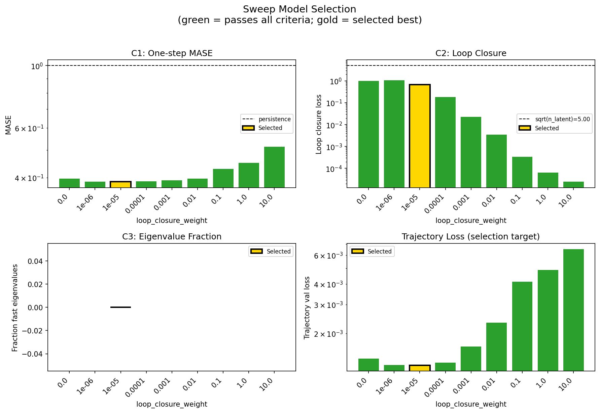

### sweep_pareto

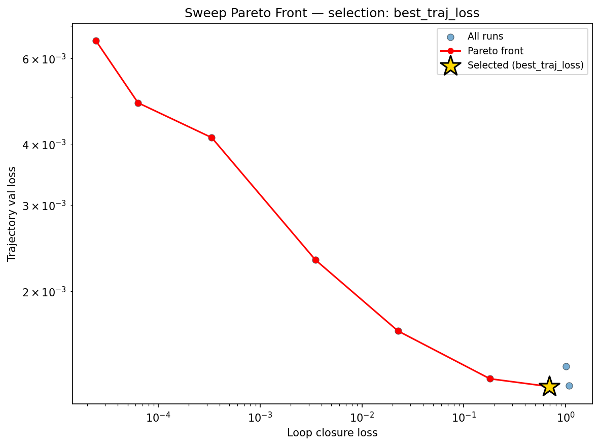

### prediction_windows

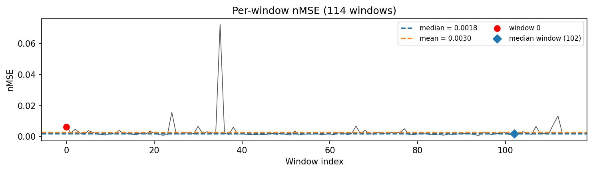

### long_trajectory

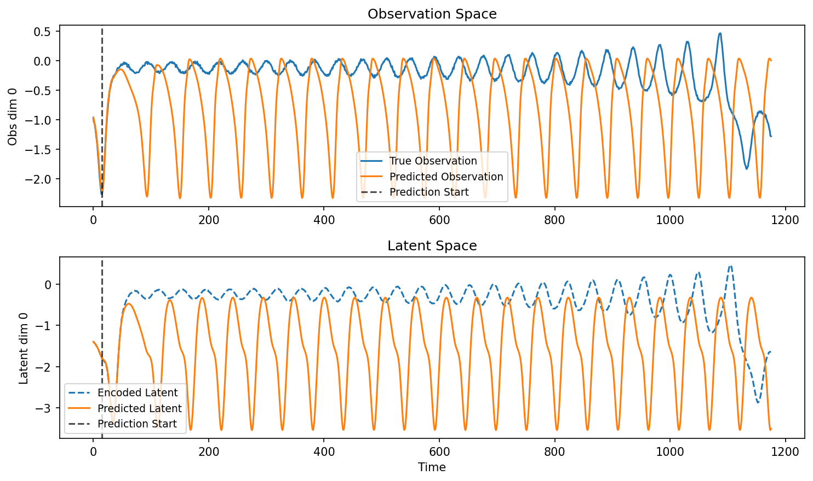

### mase

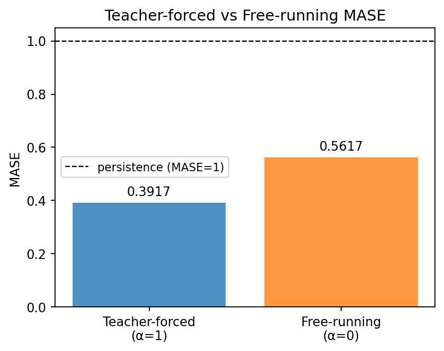

### lyapunov

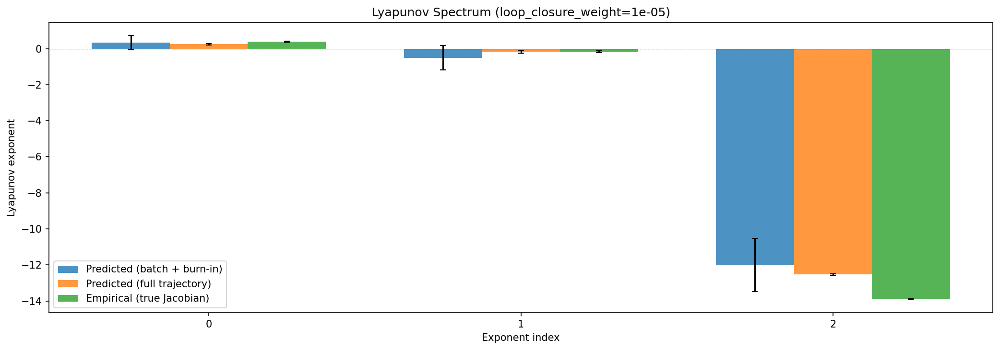

### per_run_lyapunov

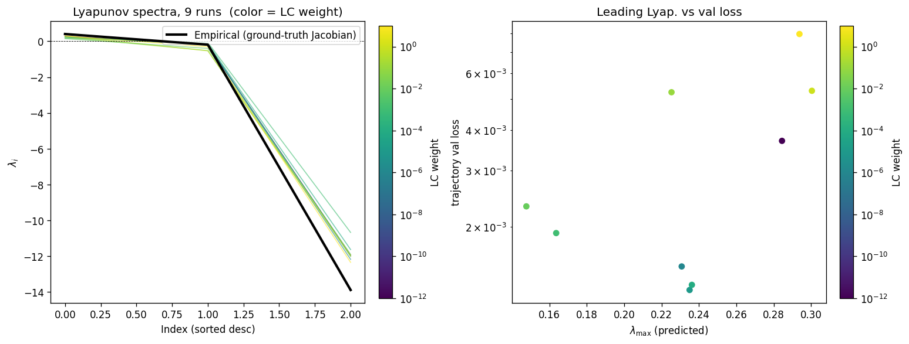

### per_run_lyapunov_vs_true

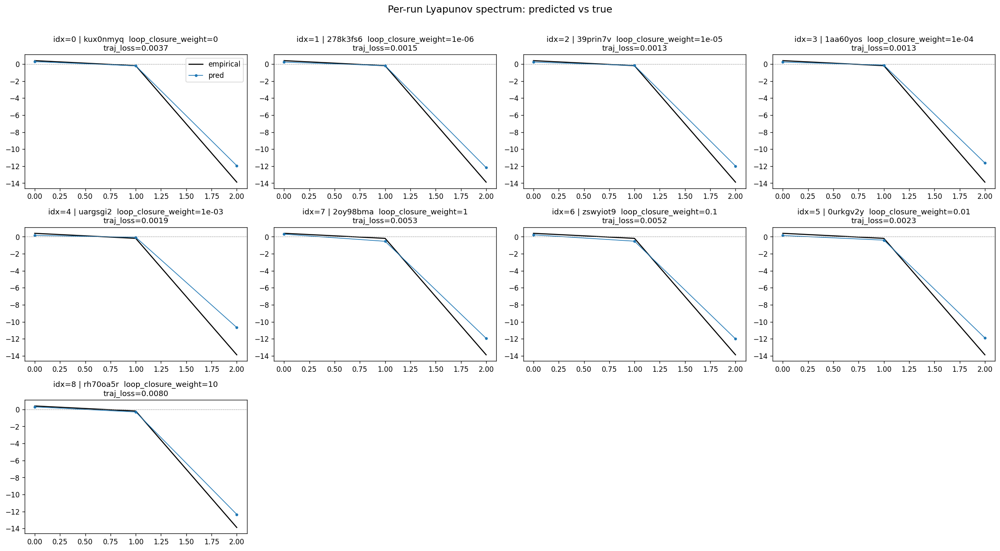

### per_run_lyapunov_relerr

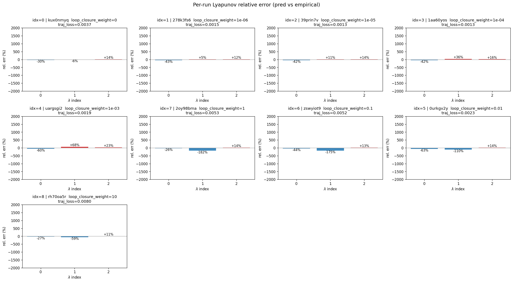

### reconstruction

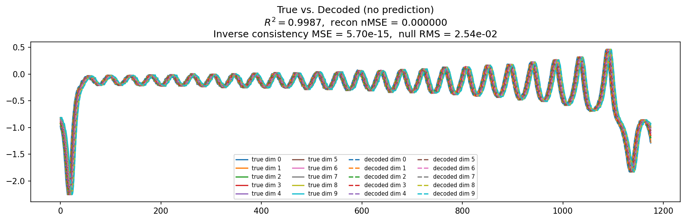

### latent_utilization

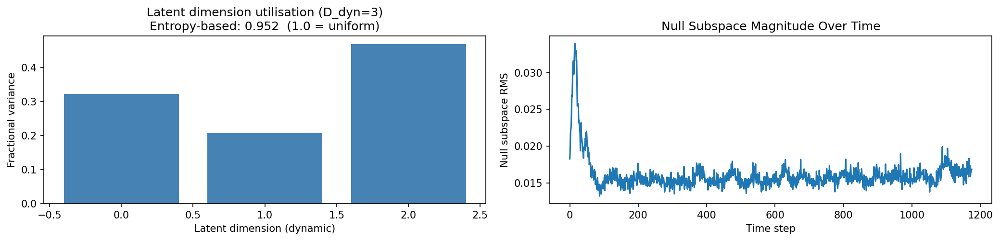

### kaplan_yorke

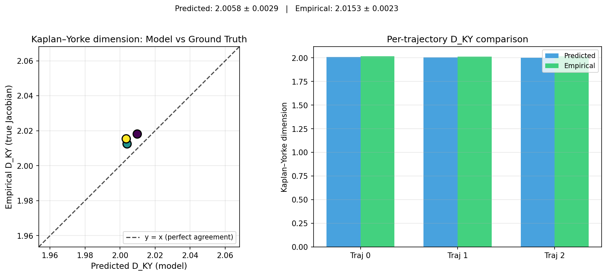

### kaplan_yorke_pca

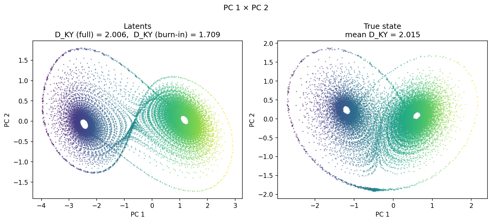

### prediction_detail_latent

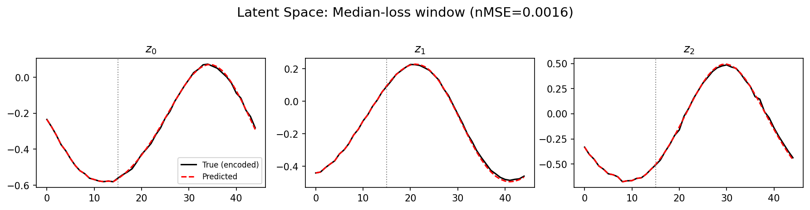

### prediction_detail_obs

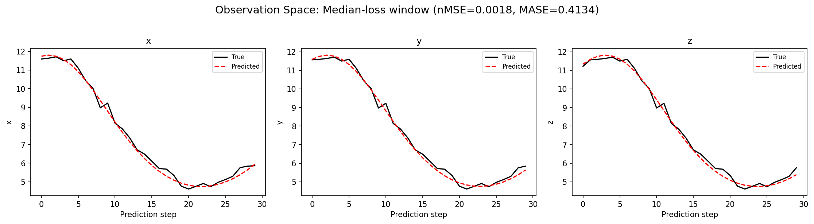

### encoder_decoder_jacobians

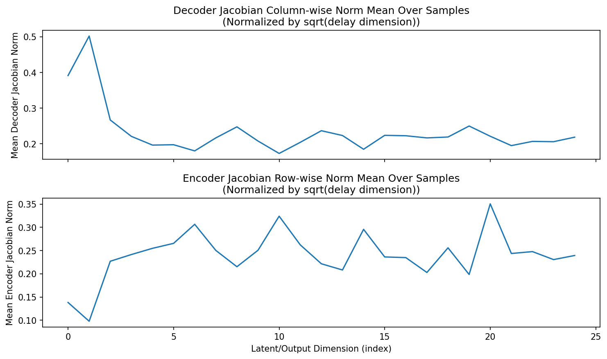

### amplification

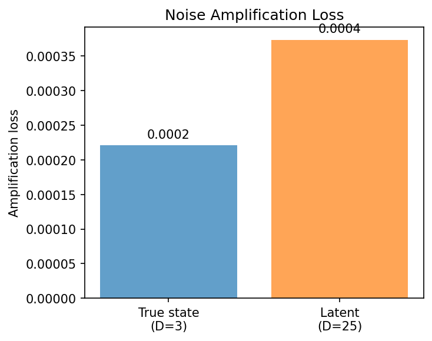

## Discussion

<!--
This section is intentionally left as a placeholder. A human reviewer
or Claude Code agent should fill it in based on the tables and figures
above, explicitly addressing each success criterion and comparing the
outcome to the stated hypothesis. Write the Discussion to
`discussion.md` in this directory and re-run `render_report`.
-->

_(to be written)_

## `run_analytics` stdout

<details><summary>Click to expand — full diagnostic output from <code>run_analytics</code></summary>

```
No run_id provided — selecting best run from group 'lorenz_partial_25d_additive_mse_uniform_p30_obsnoise001__lc_sweep' ...
Found 9 total runs in JacobianODE/Lorenz_INDpartial_N25_D1_NormTrue_T3__JacobianODE (group=lorenz_partial_25d_additive_mse_uniform_p30_obsnoise001__lc_sweep)
All runs (state, loop_closure_weight, tangent_entropy_weight, kl_dyn_weight):
  kux0nmyq: state=finished, lc=0.0, te=0.0, kl_dyn=0.0
  278k3fs6: state=finished, lc=1e-06, te=0.0, kl_dyn=0.0
  39prin7v: state=finished, lc=1e-05, te=0.0, kl_dyn=0.0
  1aa60yos: state=finished, lc=0.0001, te=0.0, kl_dyn=0.0
  uargsgi2: state=finished, lc=0.001, te=0.0, kl_dyn=0.0
  2oy98bma: state=finished, lc=1.0, te=0.0, kl_dyn=0.0
  zswyiot9: state=finished, lc=0.1, te=0.0, kl_dyn=0.0
  0urkgv2y: state=finished, lc=0.01, te=0.0, kl_dyn=0.0
  rh70oa5r: state=finished, lc=10.0, te=0.0, kl_dyn=0.0

slurm_timeout_min not found in any run config — falling back to 180 min
  Including kux0nmyq (lc=0.0): use_all_runs=True (state=finished)
  Including 278k3fs6 (lc=1e-06): use_all_runs=True (state=finished)
  Including 39prin7v (lc=1e-05): use_all_runs=True (state=finished)
  Including 1aa60yos (lc=0.0001): use_all_runs=True (state=finished)
  Including uargsgi2 (lc=0.001): use_all_runs=True (state=finished)
  Including 2oy98bma (lc=1.0): use_all_runs=True (state=finished)
  Including zswyiot9 (lc=0.1): use_all_runs=True (state=finished)
  Including 0urkgv2y (lc=0.01): use_all_runs=True (state=finished)
  Including rh70oa5r (lc=10.0): use_all_runs=True (state=finished)
Found 9 effectively-done sweep runs:
  loop_closure_weight=0.0, tangent_entropy_weight=0.0, kl_dyn_weight=0.0 -> run_id=kux0nmyq
  loop_closure_weight=1e-06, tangent_entropy_weight=0.0, kl_dyn_weight=0.0 -> run_id=278k3fs6
  loop_closure_weight=1e-05, tangent_entropy_weight=0.0, kl_dyn_weight=0.0 -> run_id=39prin7v
  loop_closure_weight=0.0001, tangent_entropy_weight=0.0, kl_dyn_weight=0.0 -> run_id=1aa60yos
  loop_closure_weight=0.001, tangent_entropy_weight=0.0, kl_dyn_weight=0.0 -> run_id=uargsgi2
  loop_closure_weight=0.01, tangent_entropy_weight=0.0, kl_dyn_weight=0.0 -> run_id=0urkgv2y
  loop_closure_weight=0.1, tangent_entropy_weight=0.0, kl_dyn_weight=0.0 -> run_id=zswyiot9
  loop_closure_weight=1.0, tangent_entropy_weight=0.0, kl_dyn_weight=0.0 -> run_id=2oy98bma
  loop_closure_weight=10.0, tangent_entropy_weight=0.0, kl_dyn_weight=0.0 -> run_id=rh70oa5r
n_dims=25, n_latent=25, n_dyn=3, dt=0.0150
  run=kux0nmyq: DiagnosticMetrics(one_step_mase=0.3967251479625702, loop_closure_loss=1.007042646408081, fast_eigenvalue_fraction=0.0, trajectory_val_loss=0.0014023068360984325) (from W&B history)
  run=278k3fs6: DiagnosticMetrics(one_step_mase=0.38616660237312317, loop_closure_loss=1.0760879516601562, fast_eigenvalue_fraction=0.0, trajectory_val_loss=0.001280559110455215) (from W&B history)
  run=39prin7v: DiagnosticMetrics(one_step_mase=0.3864278197288513, loop_closure_loss=0.6875606775283813, fast_eigenvalue_fraction=0.0, trajectory_val_loss=0.0012745351996272802) (from W&B history)
  run=1aa60yos: DiagnosticMetrics(one_step_mase=0.38711661100387573, loop_closure_loss=0.18072062730789185, fast_eigenvalue_fraction=0.0, trajectory_val_loss=0.0013222586130723357) (from W&B history)
  run=uargsgi2: DiagnosticMetrics(one_step_mase=0.39031723141670227, loop_closure_loss=0.022606942802667618, fast_eigenvalue_fraction=0.0, trajectory_val_loss=0.0016571917803958058) (from W&B history)
  run=0urkgv2y: DiagnosticMetrics(one_step_mase=0.3962181806564331, loop_closure_loss=0.0034890449605882168, fast_eigenvalue_fraction=0.0, trajectory_val_loss=0.002318850252777338) (from W&B history)
  run=zswyiot9: DiagnosticMetrics(one_step_mase=0.42967891693115234, loop_closure_loss=0.0003351893974468112, fast_eigenvalue_fraction=0.0, trajectory_val_loss=0.004130178596824408) (from W&B history)
  run=2oy98bma: DiagnosticMetrics(one_step_mase=0.4507633447647095, loop_closure_loss=6.332118209684268e-05, fast_eigenvalue_fraction=0.0, trajectory_val_loss=0.004868514370173216) (from W&B history)
  run=rh70oa5r: DiagnosticMetrics(one_step_mase=0.5145372152328491, loop_closure_loss=2.4442675567115657e-05, fast_eigenvalue_fraction=0.0, trajectory_val_loss=0.006527189631015062) (from W&B history)

Ranking method:           best_traj_loss
Best run ID:              39prin7v
Best loop_closure_weight: 1e-05
Best tangent_entropy_weight: 0.0
Best kl_dyn_weight:       0.0
Best traj loss:           0.001275
Criteria applied: ['C1', 'C2', 'C3']
Surviving: 9 / 9
Auto-selected run_id: 39prin7v

======================================================================
PARETO FRONTIER RUNS (7 runs)
======================================================================
  Run ID               LC Loss   Traj Val Loss
  ------------  --------------  --------------
  rh70oa5r            0.000024        0.006527
  2oy98bma            0.000063        0.004869
  zswyiot9            0.000335        0.004130
  0urkgv2y            0.003489        0.002319
  uargsgi2            0.022607        0.001657
  1aa60yos            0.180721        0.001322
  39prin7v            0.687561        0.001275 <-- selected

======================================================================
RANKING METHOD COMPARISON (over 9 survivors)
======================================================================
  Method                  Run ID               LC Loss   Traj Val Loss
  ----------------------  ------------  --------------  --------------
  best_traj_loss          39prin7v            0.687561        0.001275 <-- active
  pareto_knee             2oy98bma            0.000063        0.004869
  geo_rank                39prin7v            0.687561        0.001275
  minimax_rank            uargsgi2            0.022607        0.001657
  geo_log_score           39prin7v            0.687561        0.001275
  minimax_log_score       0urkgv2y            0.003489        0.002319
======================================================================

Loading run 39prin7v from JacobianODE/Lorenz_INDpartial_N25_D1_NormTrue_T3__JacobianODE ...
Train dataset shape: torch.Size([24882, 45, 25])
Validation dataset shape: torch.Size([7917, 45, 25])
Test dataset shape: torch.Size([3393, 45, 25])
Train trajectories dataset shape: torch.Size([22, 1176, 25])
Validation trajectories dataset shape: torch.Size([7, 1176, 25])
Test trajectories dataset shape: torch.Size([3, 1176, 25])
Loading checkpoint epoch=110-step=22200.ckpt...
Computing reconstruction ...
Computing MASE ...
Teacher-forced MASE: 0.3917
Free-running MASE:   0.5617
Computing latent utilization ...
Entropy-based utilization: 0.952
Null subspace mean RMS: 1.622876e-02
Computing Lyapunov exponents ...
  Computing full-trajectory Lyapunov (3 test trajs, T=1176) ...
Predicted Lyapunov exponents (batch+burn-in, 128 windowed trajs):
  λ_1 = +0.3412 ± 0.3928
  λ_2 = -0.5006 ± 0.6775
  λ_3 = -12.0120 ± 1.4703
Predicted Lyapunov exponents (full-length, 3 test trajs):
  λ_1 = +0.2488 ± 0.0366
  λ_2 = -0.1763 ± 0.0745
  λ_3 = -12.5331 ± 0.0397
Empirical Lyapunov exponents (mean ± std):
  λ_1 = +0.3846 ± 0.0251
  λ_2 = -0.1716 ± 0.0444
  λ_3 = -13.8799 ± 0.0398
Mean KY dim (predicted): 2.006 ± 0.003
Mean KY dim (empirical): 2.015 ± 0.002
Mean KY dim (burn-in):   1.709 ± 0.399
Computing prediction windows ...
Windows: 114 — nMSE min=0.0008, median=0.0018, mean=0.0030, max=0.0726
Computing long trajectory prediction ...
Computing encoder/decoder Jacobians ...
encoder_jacobian: (128, 25, 25)
decoder_jacobian: (128, 25, 25)
Computing amplification loss ...
Amplification loss — True state: 0.000221
Amplification loss — Latent:     0.000374
```

</details>
