# Sweep Analysis: `lorenz_partial_25d_additive_mse_uniform_p30_obsnoise001__nolpl_lc_sweep`

**Project**: [Lorenz_INDpartial_N25_D1_NormTrue_T3__JacobianODE](https://wandb.ai/JacobianODE/Lorenz_INDpartial_N25_D1_NormTrue_T3__JacobianODE/groups/lorenz_partial_25d_additive_mse_uniform_p30_obsnoise001__nolpl_lc_sweep)  
**Launched**: 2026-04-17T21:05:44Z  
**Completed**: 2026-04-18T10:45:23Z  
**Outcome**: `complete_clean`  
**Git**: `latent-JacobianODE` @ `5051646`  
**Expected runs**: 8

## Experiment Context

### `lorenz_partial_25d_additive_mse_uniform_p30_obsnoise001__nolpl_lc_sweep`

**Description**

Same base as lorenz_partial_25d_additive_mse_uniform_p30 with
obs_noise=0.01 and training.lightning.latent_prediction_loss_weight
fixed at 0. Single axis: 9-value loop_closure_weight grid (9 runs).
Direct comparison to lorenz_partial_25d_additive_mse_uniform_p30_obsnoise001__lc_sweep,
differing only in LPL.

**Hypothesis**

For an invertible coupling-flow encoder the decoded-space losses
(reconstruction + loop closure) equal geodesic-distance losses in
the latent under the pullback metric g = J_D^T J_D, while latent-
space MSE does not respect that metric. If that geometric
argument is right, dropping LPL should not hurt — and may help —
val traj_loss and λ accuracy, because it removes a mis-scaled term
from the gradient. If LPL=0 performs materially worse than LPL=1
at the best LC, then LPL provides a training-signal benefit that
the geometry analysis misses (e.g. conditioning, direct gradients
onto the dynamics net) and we should keep it.

**Success criteria**

- Val traj_loss at best LC is no worse than 1.5× the LPL=1 baseline (obsnoise001__lc_sweep, best LC run)
- Loop closure and λ estimates are not qualitatively worse than the LPL=1 baseline
- Any differences are consistent across the LC axis (not just at one cell)

## Results

**Swept axes** (1): `training.lightning.loop_closure_weight`

**Chosen run** (by `best_traj_loss`): `opmdjlmu` — traj_loss=0.00116, MASE=0.6856, R²=0.9969, LC loss=1.494, epoch=145.0

Swept-axis values at chosen run: `training.lightning.loop_closure_weight`=1.0e-06

**Runs analyzed**: 8 (expected 8)

### Per-run results

| run_idx | run_id | `training.lightning.loop_closure_weight` | best_traj_loss | best_MASE | R² | LC loss | epoch |
|---|---|---|---|---|---|---|---|
| 1 | `opmdjlmu` | 1.0e-06 | 0.00116 | 0.6856 | 0.9969 | 1.494 | 145.0 |
| 0 | `092g9dhl` | 0 | 0.00132 | 0.7235 | 0.9965 | 3.828 | 96.0 |
| 2 | `kfn859xs` | 1.0e-05 | 0.00143 | 0.7388 | 0.9962 | 0.476 | 99.0 |
| 3 | `4tfmicbv` | 1.0e-04 | 0.00154 | 0.7473 | 0.9959 | 0.068 | 104.0 |
| 4 | `g6w8e9tz` | 0.001 | 0.00185 | 0.8191 | 0.9950 | 0.009 | 115.0 |
| 5 | `vhaz6ufh` | 0.01 | 0.00270 | 0.9538 | 0.9927 | 0.004 | 101.0 |
| 6 | `i22vgice` | 0.1 | 0.00451 | 1.2270 | 0.9878 | 0.000 | 90.0 |
| 7 | `uue09sft` | 1 | 0.00529 | 1.3987 | 0.9858 | 0.000 | 131.0 |

## Success-criteria verdicts (automated)

| Criterion | Verdict | Note |
|---|---|---|
| Val traj_loss at best LC is no worse than 1.5× the LPL=1 baseline (obsnoise001__lc_sweep, best LC run) | **Unknown** |  |
| Loop closure and λ estimates are not qualitatively worse than the LPL=1 baseline | **Unknown** |  |
| Any differences are consistent across the LC axis (not just at one cell) | **Unknown** |  |

_Automated verdicts use simple numeric-threshold parsing and may mis-classify qualitative criteria. The Discussion section below takes precedence._

## Figures

### sweep_overview

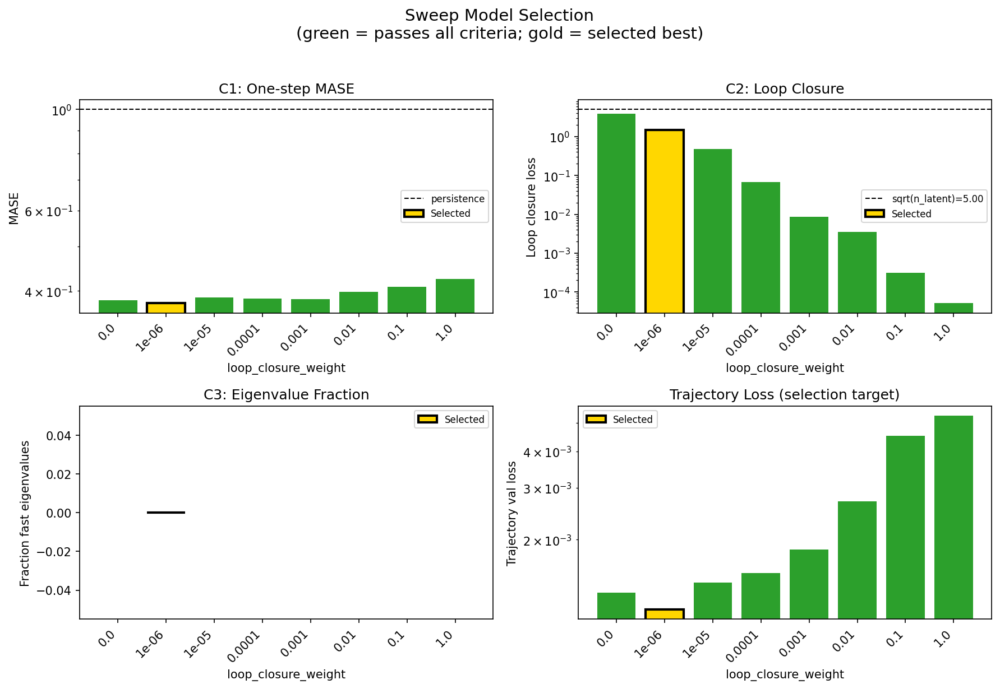

### sweep_pareto

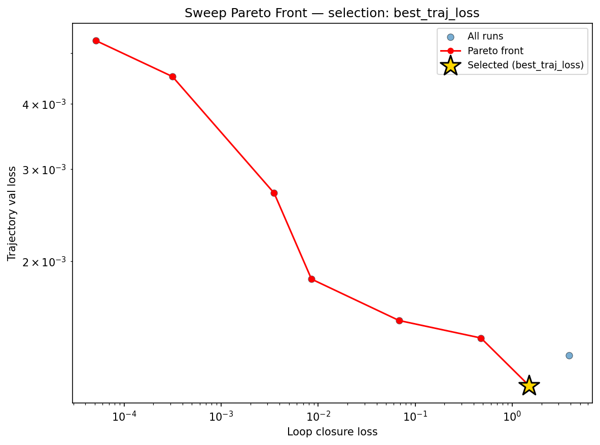

### reconstruction

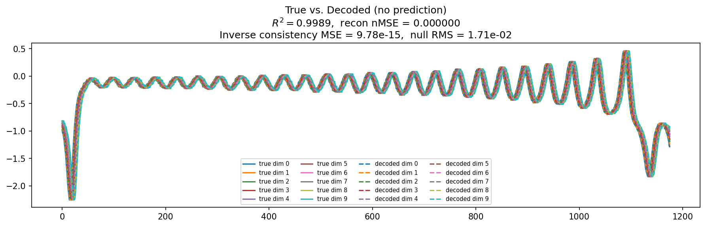

### prediction_windows

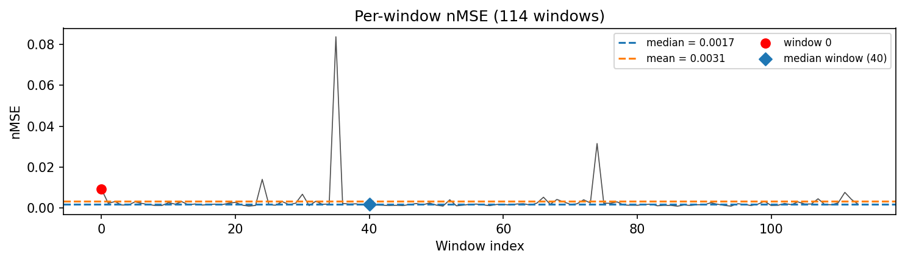

### long_trajectory

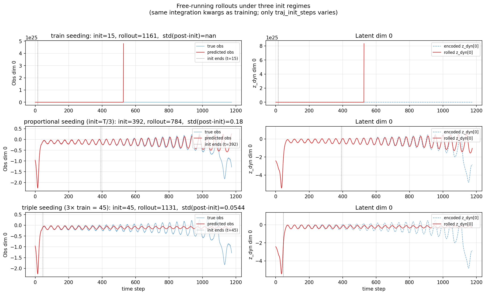

### mase

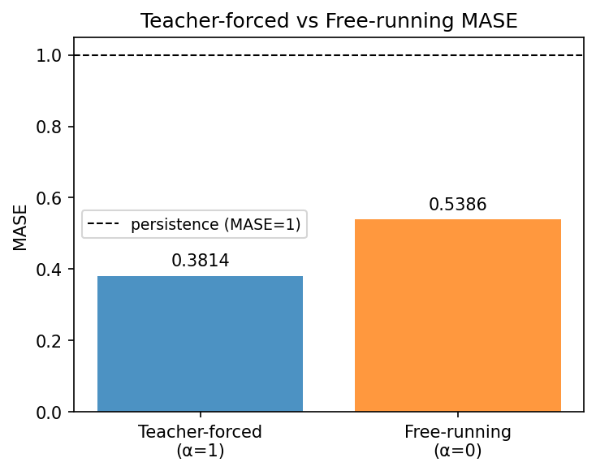

### latent_utilization

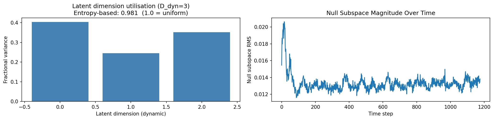

### lyapunov

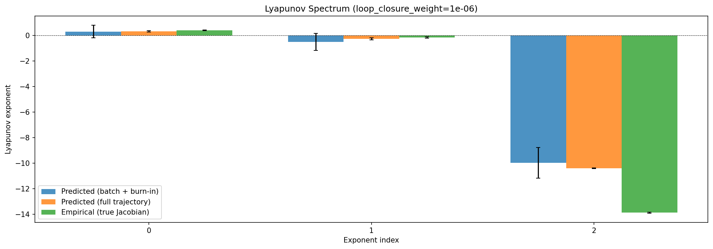

### kaplan_yorke

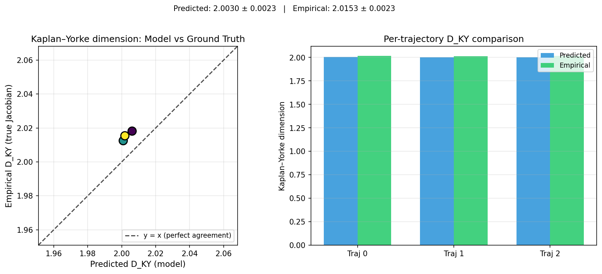

### per_run_lyapunov

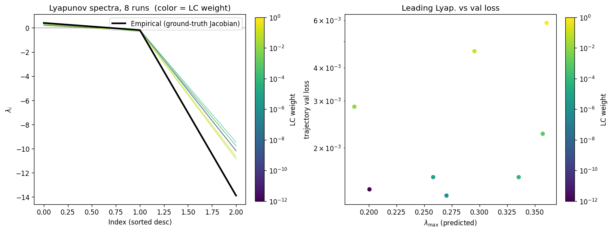

### per_run_lyapunov_vs_true

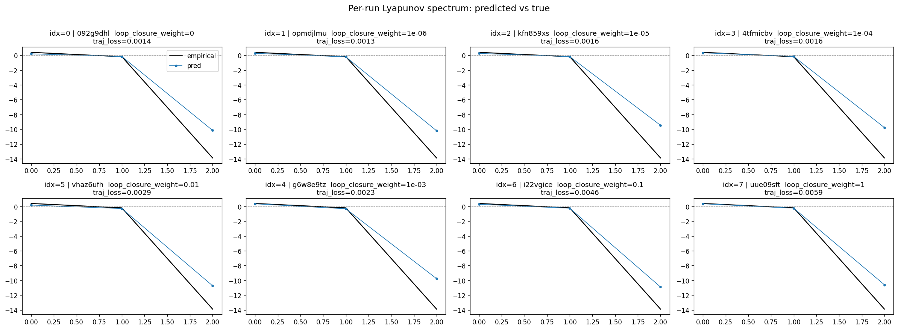

### per_run_lyapunov_relerr

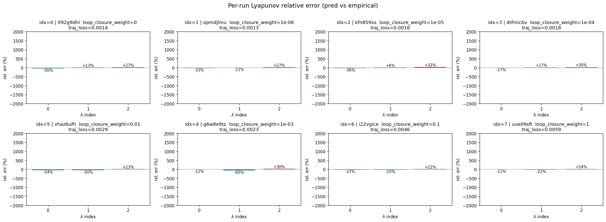

### encoder_decoder_jacobians

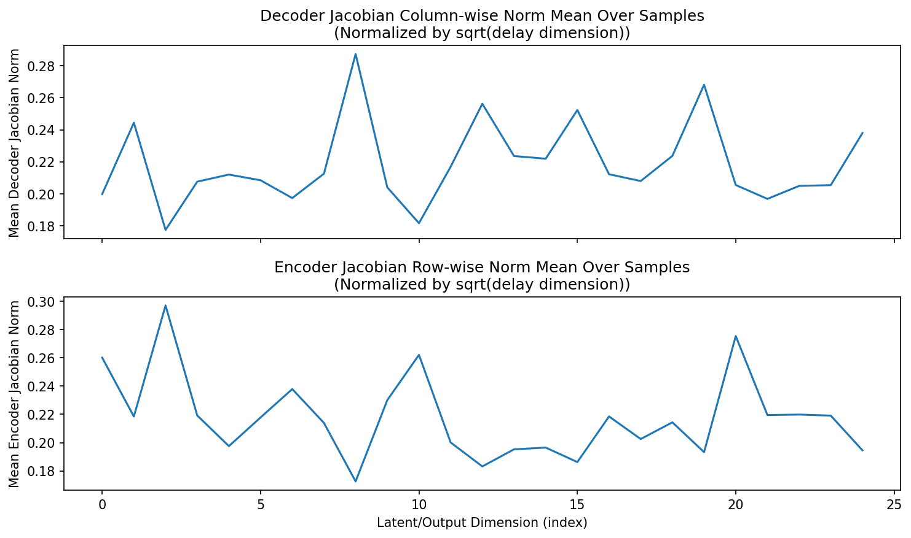

### amplification

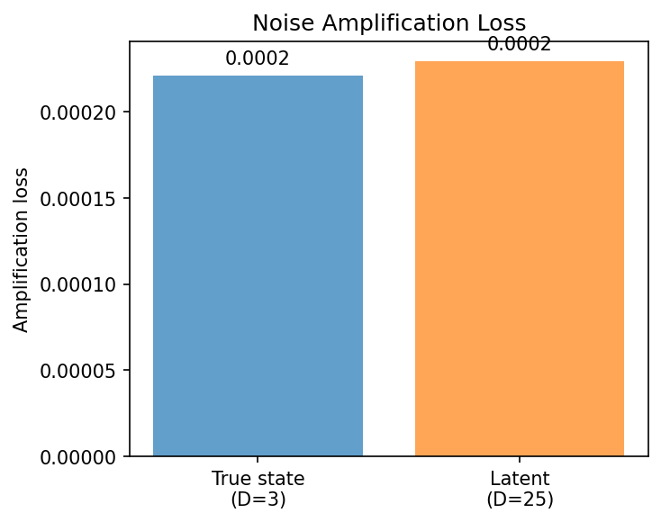

### kaplan_yorke_pca

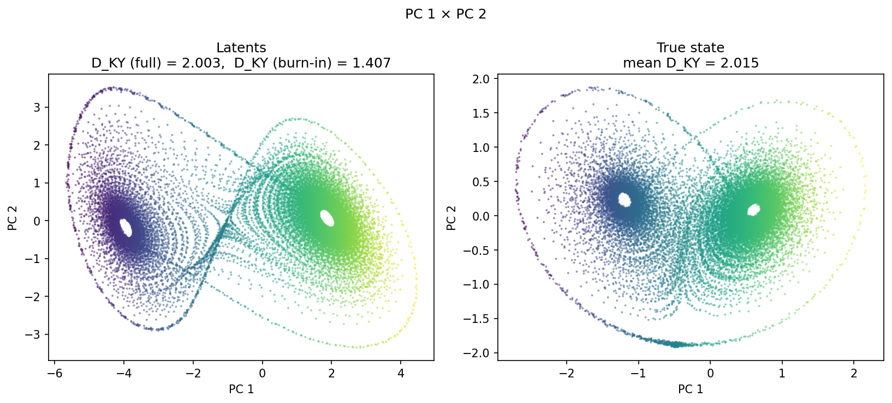

### prediction_detail_latent

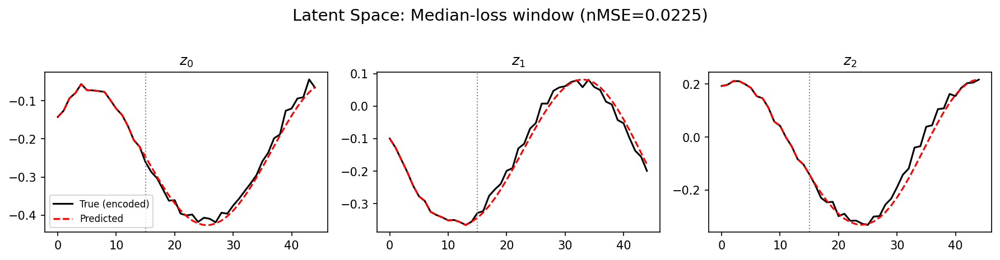

### prediction_detail_obs

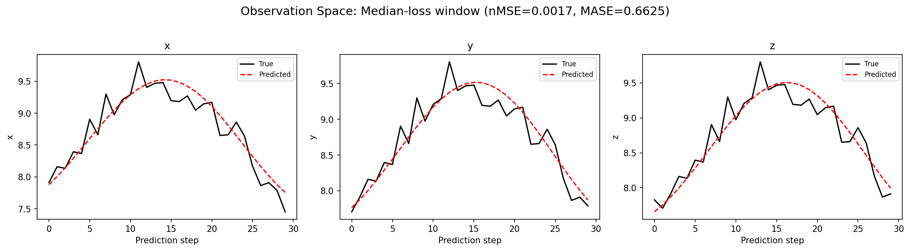

## Discussion

<!--
This section is intentionally left as a placeholder. A human reviewer
or Claude Code agent should fill it in based on the tables and figures
above, explicitly addressing each success criterion and comparing the
outcome to the stated hypothesis. Write the Discussion to
`discussion.md` in this directory and re-run `render_report`.
-->

_(to be written)_

## `run_analytics` stdout

<details><summary>Click to expand — full diagnostic output from <code>run_analytics</code></summary>

```
No run_id provided — selecting best run from group 'lorenz_partial_25d_additive_mse_uniform_p30_obsnoise001__nolpl_lc_sweep' ...
Found 8 total runs in JacobianODE/Lorenz_INDpartial_N25_D1_NormTrue_T3__JacobianODE (group=lorenz_partial_25d_additive_mse_uniform_p30_obsnoise001__nolpl_lc_sweep)
All runs (state, loop_closure_weight, tangent_entropy_weight, kl_dyn_weight):
  092g9dhl: state=finished, lc=0.0, te=0.0, kl_dyn=0.0
  opmdjlmu: state=finished, lc=1e-06, te=0.0, kl_dyn=0.0
  kfn859xs: state=finished, lc=1e-05, te=0.0, kl_dyn=0.0
  4tfmicbv: state=finished, lc=0.0001, te=0.0, kl_dyn=0.0
  vhaz6ufh: state=finished, lc=0.01, te=0.0, kl_dyn=0.0
  g6w8e9tz: state=finished, lc=0.001, te=0.0, kl_dyn=0.0
  i22vgice: state=finished, lc=0.1, te=0.0, kl_dyn=0.0
  uue09sft: state=finished, lc=1.0, te=0.0, kl_dyn=0.0

slurm_timeout_min not found in any run config — falling back to 180 min
  Including 092g9dhl (lc=0.0): use_all_runs=True (state=finished)
  Including opmdjlmu (lc=1e-06): use_all_runs=True (state=finished)
  Including kfn859xs (lc=1e-05): use_all_runs=True (state=finished)
  Including 4tfmicbv (lc=0.0001): use_all_runs=True (state=finished)
  Including vhaz6ufh (lc=0.01): use_all_runs=True (state=finished)
  Including g6w8e9tz (lc=0.001): use_all_runs=True (state=finished)
  Including i22vgice (lc=0.1): use_all_runs=True (state=finished)
  Including uue09sft (lc=1.0): use_all_runs=True (state=finished)
Found 8 effectively-done sweep runs:
  loop_closure_weight=0.0, tangent_entropy_weight=0.0, kl_dyn_weight=0.0 -> run_id=092g9dhl
  loop_closure_weight=1e-06, tangent_entropy_weight=0.0, kl_dyn_weight=0.0 -> run_id=opmdjlmu
  loop_closure_weight=1e-05, tangent_entropy_weight=0.0, kl_dyn_weight=0.0 -> run_id=kfn859xs
  loop_closure_weight=0.0001, tangent_entropy_weight=0.0, kl_dyn_weight=0.0 -> run_id=4tfmicbv
  loop_closure_weight=0.001, tangent_entropy_weight=0.0, kl_dyn_weight=0.0 -> run_id=g6w8e9tz
  loop_closure_weight=0.01, tangent_entropy_weight=0.0, kl_dyn_weight=0.0 -> run_id=vhaz6ufh
  loop_closure_weight=0.1, tangent_entropy_weight=0.0, kl_dyn_weight=0.0 -> run_id=i22vgice
  loop_closure_weight=1.0, tangent_entropy_weight=0.0, kl_dyn_weight=0.0 -> run_id=uue09sft
n_dims=25, n_latent=25, n_dyn=3, dt=0.0150
  run=092g9dhl: DiagnosticMetrics(one_step_mase=0.38112178444862366, loop_closure_loss=3.8279452323913574, fast_eigenvalue_fraction=0.0, trajectory_val_loss=0.001321429735980928) (from cache, n_batches=100)
  run=opmdjlmu: DiagnosticMetrics(one_step_mase=0.3756863474845886, loop_closure_loss=1.4935657978057861, fast_eigenvalue_fraction=0.0, trajectory_val_loss=0.001155607053078711) (from cache, n_batches=100)
  run=kfn859xs: DiagnosticMetrics(one_step_mase=0.38685932755470276, loop_closure_loss=0.47550055384635925, fast_eigenvalue_fraction=0.0, trajectory_val_loss=0.0014258477604016662) (from cache, n_batches=100)
  run=4tfmicbv: DiagnosticMetrics(one_step_mase=0.38457468152046204, loop_closure_loss=0.06815202534198761, fast_eigenvalue_fraction=0.0, trajectory_val_loss=0.0015400759875774384) (from cache, n_batches=100)
  run=g6w8e9tz: DiagnosticMetrics(one_step_mase=0.3833397924900055, loop_closure_loss=0.008531534112989902, fast_eigenvalue_fraction=0.0, trajectory_val_loss=0.0018485391046851873) (from cache, n_batches=100)
  run=vhaz6ufh: DiagnosticMetrics(one_step_mase=0.39798006415367126, loop_closure_loss=0.003517073579132557, fast_eigenvalue_fraction=0.0, trajectory_val_loss=0.0027007204480469227) (from cache, n_batches=100)
  run=i22vgice: DiagnosticMetrics(one_step_mase=0.40811842679977417, loop_closure_loss=0.0003155436716042459, fast_eigenvalue_fraction=0.0, trajectory_val_loss=0.004512681160122156) (from cache, n_batches=100)
  run=uue09sft: DiagnosticMetrics(one_step_mase=0.4241741895675659, loop_closure_loss=5.130571298650466e-05, fast_eigenvalue_fraction=0.0, trajectory_val_loss=0.005287426523864269) (from cache, n_batches=100)

Ranking method:           best_traj_loss
Best run ID:              opmdjlmu
Best loop_closure_weight: 1e-06
Best tangent_entropy_weight: 0.0
Best kl_dyn_weight:       0.0
Best traj loss:           0.001156
Criteria applied: ['C1', 'C2', 'C3']
Surviving: 8 / 8
Auto-selected run_id: opmdjlmu

======================================================================
PARETO FRONTIER RUNS (7 runs)
======================================================================
  Run ID               LC Loss   Traj Val Loss
  ------------  --------------  --------------
  uue09sft            0.000051        0.005287
  i22vgice            0.000316        0.004513
  vhaz6ufh            0.003517        0.002701
  g6w8e9tz            0.008532        0.001849
  4tfmicbv            0.068152        0.001540
  kfn859xs            0.475501        0.001426
  opmdjlmu            1.493566        0.001156 <-- selected

======================================================================
RANKING METHOD COMPARISON (over 8 survivors)
======================================================================
  Method                  Run ID               LC Loss   Traj Val Loss
  ----------------------  ------------  --------------  --------------
  best_traj_loss          opmdjlmu            1.493566        0.001156 <-- active
  pareto_knee             g6w8e9tz            0.008532        0.001849
  geo_rank                opmdjlmu            1.493566        0.001156
  minimax_rank            4tfmicbv            0.068152        0.001540
  geo_log_score           opmdjlmu            1.493566        0.001156
  minimax_log_score       g6w8e9tz            0.008532        0.001849
======================================================================

Loading run opmdjlmu from JacobianODE/Lorenz_INDpartial_N25_D1_NormTrue_T3__JacobianODE ...
Train dataset shape: torch.Size([24882, 45, 25])
Validation dataset shape: torch.Size([7917, 45, 25])
Test dataset shape: torch.Size([3393, 45, 25])
Train trajectories dataset shape: torch.Size([22, 1176, 25])
Validation trajectories dataset shape: torch.Size([7, 1176, 25])
Test trajectories dataset shape: torch.Size([3, 1176, 25])
Loading checkpoint epoch=145-step=29200.ckpt...
Computing reconstruction ...
Computing MASE ...
Teacher-forced MASE: 0.3814
Free-running MASE:   0.5386
Computing latent utilization ...
Entropy-based utilization: 0.981
Null subspace mean RMS: 1.333765e-02
Computing Lyapunov exponents ...
  Computing full-trajectory Lyapunov (3 test trajs, T=1176) ...
Predicted Lyapunov exponents (batch+burn-in, 128 windowed trajs):
  λ_1 = +0.2900 ± 0.4959
  λ_2 = -0.5224 ± 0.6637
  λ_3 = -9.9784 ± 1.2028
Predicted Lyapunov exponents (full-length, 3 test trajs):
  λ_1 = +0.3077 ± 0.0505
  λ_2 = -0.2769 ± 0.0706
  λ_3 = -10.4187 ± 0.0270
Empirical Lyapunov exponents (mean ± std):
  λ_1 = +0.3846 ± 0.0251
  λ_2 = -0.1716 ± 0.0444
  λ_3 = -13.8799 ± 0.0398
Mean KY dim (predicted): 2.003 ± 0.002
Mean KY dim (empirical): 2.015 ± 0.002
Mean KY dim (burn-in):   1.407 ± 0.640
Computing prediction windows ...
Windows: 114 — nMSE min=0.0008, median=0.0017, mean=0.0031, max=0.0838
Computing long-trajectory free-running rollouts ...
Computing encoder/decoder Jacobians ...
encoder_jacobian: (128, 25, 25)
decoder_jacobian: (128, 25, 25)
Computing amplification loss ...
Amplification loss — True state: 0.000221
Amplification loss — Latent:     0.000229
```

</details>
