# Sweep Analysis: `lorenz_partial_25d_additive_mse_uniform_p30_obsnoise001__vae_kl_lc_sweep`

**Project**: [Lorenz_INDpartial_N25_D1_NormTrue_T3__JacobianODE](https://wandb.ai/JacobianODE/Lorenz_INDpartial_N25_D1_NormTrue_T3__JacobianODE/groups/lorenz_partial_25d_additive_mse_uniform_p30_obsnoise001__vae_kl_lc_sweep)  
**Launched**: 2026-04-17T21:06:15Z  
**Completed**: 2026-04-18T18:30:25Z  
**Outcome**: `complete_clean`  
**Git**: `latent-JacobianODE` @ `5051646`  
**Expected runs**: 64

## Experiment Context

### `lorenz_partial_25d_additive_mse_uniform_p30_obsnoise001__vae_kl_lc_sweep`

**Description**

Same base as lorenz_partial_25d_additive_mse_uniform_p30 with
obs_noise=0.01 and model.use_vae=true. Sweeps kl_dyn_weight over
{1e-4, 1e-3, 1e-2, 1e-1} × kl_null_weight over {null (= coupled to
dyn), 0} × the standard 9-value loop_closure_weight grid (3-D
sweep, 72 runs).

**Hypothesis**

Open question whether adding VAE-style stochasticity to the dyn
latent (regularized by kl_dyn_weight) improves Lyapunov-spectrum
estimation — in particular, whether posterior noise on z_dyn acts
as a helpful implicit ensemble average that stabilizes stable-
direction contraction rate estimates, or instead destabilizes
training through interaction with LPL (known LPL × LC sensitivity
from prior runs) and loop closure.
The null toggle (kl_null=coupled vs 0) separately tests whether
pulling z_null toward zero adds signal on top of dyn regularization
or is redundant once the dyn posterior is constrained.

**Success criteria**

- At some kl_dyn setting, λ_min accuracy improves vs the kl_dyn → 0 limit (or equivalently the existing obsnoise001 baseline)
- Trajectory loss and loop closure don't catastrophically diverge at any kl_dyn × LC cell (beyond the already-known LC=1,10 explosion)
- Detectable, interpretable difference between kl_null=coupled and kl_null=0 (e.g., in null-space RMS or in λ accuracy)

## Results

**Swept axes** (156): `data.data_type`, `data.flow._target_`, `data.flow.random_state`, `data.postprocessing.filter_data`, `data.postprocessing.generalized_variance`, `data.postprocessing.low_pass`, `data.postprocessing.mu`, `data.postprocessing.noise_scale_factor`, `data.postprocessing.normalize`, `data.postprocessing.obs_noise`, `data.postprocessing.sigma`, `data.train_test_params.delay_embedding_params.delay_spacing`, `data.train_test_params.delay_embedding_params.n_delays`, `data.train_test_params.delay_embedding_params.observed_indices`, `data.train_test_params.dtype`, `data.train_test_params.seq_length`, `data.train_test_params.seq_spacing`, `data.train_test_params.split_by`, `data.train_test_params.test_percent`, `data.train_test_params.train_percent`, `data.train_test_params.verbose`, `data.trajectory_params.method`, `data.trajectory_params.n_periods`, `data.trajectory_params.new_ic_mode`, `data.trajectory_params.noise`, `data.trajectory_params.num_ics`, `data.trajectory_params.pts_per_period`, `data.trajectory_params.resample`, `data.trajectory_params.return_times`, `data.trajectory_params.standardize`, `data.trajectory_params.traj_offset_sd`, `data.trajectory_params.verbose`, `logger`, `metadata.description`, `metadata.hypothesis`, `metadata.success_criteria`, `model.decode_only_recent`, `model.dynamics_warmup_epochs`, `model.encoder._target_`, `model.encoder.coupling_type`, `model.encoder.hidden_dim`, `model.encoder.loft_tau`, `model.encoder.n_coupling_layers`, `model.encoder.n_hidden_layers`, `model.encoder.n_input`, `model.encoder.permutation_seed`, `model.encoder.use_actnorm`, `model.encoder.use_loft`, `model.encoder.zero_init`, `model.encoder_warmup_epochs`, `model.geometric_noise.enabled`, `model.geometric_noise.hidden_dim`, `model.geometric_noise.n_coupling_layers`, `model.geometric_noise.n_hidden_layers`, `model.geometric_noise.permutation_seed`, `model.jacobian_noise.enabled`, `model.jacobian_noise.orthogonalize`, `model.kl_dyn_weight`, `model.kl_null_weight`, `model.kl_warmup_epochs`, `model.n_recent_dims`, `model.n_target_dims`, `model.params._target_`, `model.params.activation`, `model.params.dropout`, `model.params.hidden_dim`, `model.params.input_dim`, `model.params.num_layers`, `model.params.output_dim`, `model.params.residuals`, `model.prediction_steps`, `model.use_vae`, `model.vae_sample_all_losses`, `sweep_grid.model.kl_dyn_weight`, `sweep_grid.model.kl_null_weight`, `sweep_grid.training.lightning.loop_closure_weight`, `training.batch_size`, `training.early_stopping.early_stopping_mode`, `training.early_stopping.early_stopping_patience`, `training.early_stopping.min_epochs`, `training.early_stopping.mode`, `training.early_stopping.monitor`, `training.early_stopping.percent_thresh`, `training.lightning._target_`, `training.lightning.alpha_teacher_forcing`, `training.lightning.alpha_validation`, `training.lightning.data_type`, `training.lightning.diffeomorphism_weight`, `training.lightning.direct`, `training.lightning.fnn_elementwise_regularization`, `training.lightning.fnn_n_samples`, `training.lightning.fnn_normalize`, `training.lightning.fnn_use_pca`, `training.lightning.fnn_weight`, `training.lightning.gamma_teacher_forcing`, `training.lightning.gradient_clip_algorithm`, `training.lightning.gradient_clip_val`, `training.lightning.jac_consistency_weight`, `training.lightning.jac_norm_ord`, `training.lightning.jac_penalty`, `training.lightning.jacobianODEint_kwargs.inner_N`, `training.lightning.jacobianODEint_kwargs.inner_path`, `training.lightning.jacobianODEint_kwargs.interp_pts`, `training.lightning.jacobianODEint_kwargs.traj_init_steps`, `training.lightning.k_scale`, `training.lightning.kl_dyn_weight`, `training.lightning.latent_noise_per_step`, `training.lightning.latent_noise_scale`, `training.lightning.latent_prediction_loss_weight`, `training.lightning.learn_fnn_weight`, `training.lightning.learn_jac_cons_weight`, `training.lightning.learn_jac_norm_weight`, `training.lightning.learn_loop_closure_weight`, `training.lightning.learn_r2_weight`, `training.lightning.log_interval`, `training.lightning.log_var_init`, `training.lightning.loop_closure_int_method`, `training.lightning.loop_closure_interp_pts`, `training.lightning.loop_closure_training`, `training.lightning.loop_closure_weight`, `training.lightning.loss_func`, `training.lightning.min_alpha_teacher_forcing`, `training.lightning.min_lr`, `training.lightning.mix_trajectories`, `training.lightning.n_eigval_jacobians`, `training.lightning.n_loop_pts`, `training.lightning.obs_noise_scale`, `training.lightning.optimizer`, `training.lightning.optimizer_kwargs.lr`, `training.lightning.optimizer_kwargs.weight_decay`, `training.lightning.precompute_latent_noise_factor`, `training.lightning.profile_steps`, `training.lightning.reconstruction_loss_weight`, `training.lightning.reconstruction_mode`, `training.lightning.scheduler_type`, `training.lightning.tangent_entropy_mode`, `training.lightning.tangent_entropy_n_samples`, `training.lightning.tangent_entropy_weight`, `training.lightning.teacher_forcing_annealing`, `training.lightning.teacher_forcing_steps`, `training.lightning.teacher_forcing_update_interval`, `training.lightning.trajectory_training`, `training.lightning.use_base_deriv_pt`, `training.lightning.use_scheduler`, `training.logger._target_`, `training.logger.log_model`, `training.model_checkpoint.mode`, `training.model_checkpoint.monitor`, `training.model_checkpoint.save_top_k`, `training.optuna_prune_min_completed`, `training.optuna_prune_quantile`, `training.run_number`, `training.trainer_params.accumulate_grad_batches`, `training.trainer_params.limit_train_batches`, `training.trainer_params.limit_val_batches`, `training.trainer_params.max_epochs`

**Chosen run** (by `best_traj_loss`): `woyar9p7` — traj_loss=0.00092, MASE=0.6699, R²=0.9975, LC loss=1.290, epoch=136.0

Swept-axis values at chosen run: `data.data_type`=dysts · `data.flow._target_`=JacobianODE.dysts_sim.flows.Lorenz · `data.flow.random_state`=42 · `data.postprocessing.filter_data`=False · `data.postprocessing.generalized_variance`=0.355953 · `data.postprocessing.low_pass`=10 · `data.postprocessing.mu`=10.0544 · `data.postprocessing.noise_scale_factor`=16.1713 · `data.postprocessing.normalize`=True · `data.postprocessing.obs_noise`=0.01 · `data.postprocessing.sigma`=13.269 · `data.train_test_params.delay_embedding_params.delay_spacing`=1 · `data.train_test_params.delay_embedding_params.n_delays`=25 · `data.train_test_params.delay_embedding_params.observed_indices`=[0] · `data.train_test_params.dtype`=torch.FloatTensor · `data.train_test_params.seq_length`=45 · `data.train_test_params.seq_spacing`=1 · `data.train_test_params.split_by`=trajectory · `data.train_test_params.test_percent`=0.1 · `data.train_test_params.train_percent`=0.7 · `data.train_test_params.verbose`=False · `data.trajectory_params.method`=Radau · `data.trajectory_params.n_periods`=12 · `data.trajectory_params.new_ic_mode`=random · `data.trajectory_params.noise`=0 · `data.trajectory_params.num_ics`=32 · `data.trajectory_params.pts_per_period`=100 · `data.trajectory_params.resample`=True · `data.trajectory_params.return_times`=True · `data.trajectory_params.standardize`=False · `data.trajectory_params.traj_offset_sd`=0.2 · `data.trajectory_params.verbose`=True · `logger`=wandb · `metadata.description`=Same base as lorenz_partial_25d_additive_mse_uniform_p30 with
obs_noise=0.01 and model.use_vae=true. Sweeps kl_dyn_weight over
{1e-4, 1e-3, 1e-2, 1e-1} × kl_null_weight over {null (= coupled to
dyn), 0} × the standard 9-value loop_closure_weight grid (3-D
sweep, 72 runs).
 · `metadata.hypothesis`=Open question whether adding VAE-style stochasticity to the dyn
latent (regularized by kl_dyn_weight) improves Lyapunov-spectrum
estimation — in particular, whether posterior noise on z_dyn acts
as a helpful implicit ensemble average that stabilizes stable-
direction contraction rate estimates, or instead destabilizes
training through interaction with LPL (known LPL × LC sensitivity
from prior runs) and loop closure.
The null toggle (kl_null=coupled vs 0) separately tests whether
pulling z_null toward zero adds signal on top of dyn regularization
or is redundant once the dyn posterior is constrained.
 · `metadata.success_criteria`=['At some kl_dyn setting, λ_min accuracy improves vs the kl_dyn → 0 limit (or equivalently the existing obsnoise001 baseline)', "Trajectory loss and loop closure don't catastrophically diverge at any kl_dyn × LC cell (beyond the already-known LC=1,10 explosion)", 'Detectable, interpretable difference between kl_null=coupled and kl_null=0 (e.g., in null-space RMS or in λ accuracy)'] · `model.decode_only_recent`=False · `model.dynamics_warmup_epochs`=0 · `model.encoder._target_`=JacobianODE.fnn.coupling_flows.CouplingEncoder · `model.encoder.coupling_type`=additive · `model.encoder.hidden_dim`=128 · `model.encoder.loft_tau`=100 · `model.encoder.n_coupling_layers`=8 · `model.encoder.n_hidden_layers`=2 · `model.encoder.n_input`=25 · `model.encoder.permutation_seed`=42 · `model.encoder.use_actnorm`=False · `model.encoder.use_loft`=False · `model.encoder.zero_init`=True · `model.encoder_warmup_epochs`=0 · `model.geometric_noise.enabled`=False · `model.geometric_noise.hidden_dim`=128 · `model.geometric_noise.n_coupling_layers`=6 · `model.geometric_noise.n_hidden_layers`=2 · `model.geometric_noise.permutation_seed`=0 · `model.jacobian_noise.enabled`=False · `model.jacobian_noise.orthogonalize`=True · `model.kl_dyn_weight`=0.1 · `model.kl_null_weight`=0 · `model.kl_warmup_epochs`=0 · `model.n_recent_dims`=1 · `model.n_target_dims`=3 · `model.params._target_`=JacobianODE.models.mlp.MLP · `model.params.activation`=silu · `model.params.dropout`=0 · `model.params.hidden_dim`=[256, 1024, 2048, 2048] · `model.params.input_dim`=3 · `model.params.num_layers`=4 · `model.params.output_dim`=9 · `model.params.residuals`=False · `model.prediction_steps`=30 · `model.use_vae`=True · `model.vae_sample_all_losses`=False · `sweep_grid.model.kl_dyn_weight`=1e-4,1e-3,1e-2,1e-1 · `sweep_grid.model.kl_null_weight`=null,0 · `sweep_grid.training.lightning.loop_closure_weight`=0,1e-6,1e-5,1e-4,1e-3,1e-2,1e-1,1,10 · `training.batch_size`=32 · `training.early_stopping.early_stopping_mode`=percent_thresh · `training.early_stopping.early_stopping_patience`=5 · `training.early_stopping.min_epochs`=20 · `training.early_stopping.mode`=min · `training.early_stopping.monitor`=mean val loss · `training.early_stopping.percent_thresh`=0.01 · `training.lightning._target_`=JacobianODE.models.latent_jacobian.LitLatentJacobianODE · `training.lightning.alpha_teacher_forcing`=1 · `training.lightning.alpha_validation`=0 · `training.lightning.data_type`=dysts · `training.lightning.diffeomorphism_weight`=0 · `training.lightning.direct`=True · `training.lightning.fnn_elementwise_regularization`=True · `training.lightning.fnn_n_samples`=1024 · `training.lightning.fnn_normalize`=True · `training.lightning.fnn_use_pca`=True · `training.lightning.fnn_weight`=0 · `training.lightning.gamma_teacher_forcing`=0.999 · `training.lightning.gradient_clip_algorithm`=norm · `training.lightning.gradient_clip_val`=1 · `training.lightning.jac_consistency_weight`=0 · `training.lightning.jac_norm_ord`=fro · `training.lightning.jac_penalty`=0 · `training.lightning.jacobianODEint_kwargs.inner_N`=20 · `training.lightning.jacobianODEint_kwargs.inner_path`=line · `training.lightning.jacobianODEint_kwargs.interp_pts`=4 · `training.lightning.jacobianODEint_kwargs.traj_init_steps`=15 · `training.lightning.k_scale`=1 · `training.lightning.kl_dyn_weight`=0 · `training.lightning.latent_noise_per_step`=False · `training.lightning.latent_noise_scale`=0 · `training.lightning.latent_prediction_loss_weight`=1 · `training.lightning.learn_fnn_weight`=False · `training.lightning.learn_jac_cons_weight`=False · `training.lightning.learn_jac_norm_weight`=False · `training.lightning.learn_loop_closure_weight`=False · `training.lightning.learn_r2_weight`=False · `training.lightning.log_interval`=100 · `training.lightning.log_var_init`=auto · `training.lightning.loop_closure_int_method`=Trapezoid · `training.lightning.loop_closure_interp_pts`=20 · `training.lightning.loop_closure_training`=True · `training.lightning.loop_closure_weight`=0 · `training.lightning.loss_func`=mse · `training.lightning.min_alpha_teacher_forcing`=0 · `training.lightning.min_lr`=1.0e-06 · `training.lightning.mix_trajectories`=True · `training.lightning.n_eigval_jacobians`=8 · `training.lightning.n_loop_pts`=20 · `training.lightning.obs_noise_scale`=0 · `training.lightning.optimizer`=AdamW · `training.lightning.optimizer_kwargs.lr`=1.0e-04 · `training.lightning.optimizer_kwargs.weight_decay`=1.0e-04 · `training.lightning.precompute_latent_noise_factor`=True · `training.lightning.profile_steps`=1 · `training.lightning.reconstruction_loss_weight`=1 · `training.lightning.reconstruction_mode`=uniform · `training.lightning.scheduler_type`=cosine · `training.lightning.tangent_entropy_mode`=quadratic · `training.lightning.tangent_entropy_n_samples`=256 · `training.lightning.tangent_entropy_weight`=0 · `training.lightning.teacher_forcing_annealing`=True · `training.lightning.teacher_forcing_steps`=1 · `training.lightning.teacher_forcing_update_interval`=5 · `training.lightning.trajectory_training`=True · `training.lightning.use_base_deriv_pt`=False · `training.lightning.use_scheduler`=True · `training.logger._target_`=pytorch_lightning.loggers.WandbLogger · `training.logger.log_model`=False · `training.model_checkpoint.mode`=min · `training.model_checkpoint.monitor`=mean val loss · `training.model_checkpoint.save_top_k`=1 · `training.optuna_prune_min_completed`=5 · `training.optuna_prune_quantile`=0.5 · `training.run_number`=0 · `training.trainer_params.accumulate_grad_batches`=1 · `training.trainer_params.limit_train_batches`=200 · `training.trainer_params.limit_val_batches`=50 · `training.trainer_params.max_epochs`=200

**Runs analyzed**: 63

### Per-run results

| run_id | `data.data_type` | `data.flow._target_` | `data.flow.random_state` | `data.postprocessing.filter_data` | `data.postprocessing.generalized_variance` | `data.postprocessing.low_pass` | `data.postprocessing.mu` | `data.postprocessing.noise_scale_factor` | `data.postprocessing.normalize` | `data.postprocessing.obs_noise` | `data.postprocessing.sigma` | `data.train_test_params.delay_embedding_params.delay_spacing` | `data.train_test_params.delay_embedding_params.n_delays` | `data.train_test_params.delay_embedding_params.observed_indices` | `data.train_test_params.dtype` | `data.train_test_params.seq_length` | `data.train_test_params.seq_spacing` | `data.train_test_params.split_by` | `data.train_test_params.test_percent` | `data.train_test_params.train_percent` | `data.train_test_params.verbose` | `data.trajectory_params.method` | `data.trajectory_params.n_periods` | `data.trajectory_params.new_ic_mode` | `data.trajectory_params.noise` | `data.trajectory_params.num_ics` | `data.trajectory_params.pts_per_period` | `data.trajectory_params.resample` | `data.trajectory_params.return_times` | `data.trajectory_params.standardize` | `data.trajectory_params.traj_offset_sd` | `data.trajectory_params.verbose` | `logger` | `metadata.description` | `metadata.hypothesis` | `metadata.success_criteria` | `model.decode_only_recent` | `model.dynamics_warmup_epochs` | `model.encoder._target_` | `model.encoder.coupling_type` | `model.encoder.hidden_dim` | `model.encoder.loft_tau` | `model.encoder.n_coupling_layers` | `model.encoder.n_hidden_layers` | `model.encoder.n_input` | `model.encoder.permutation_seed` | `model.encoder.use_actnorm` | `model.encoder.use_loft` | `model.encoder.zero_init` | `model.encoder_warmup_epochs` | `model.geometric_noise.enabled` | `model.geometric_noise.hidden_dim` | `model.geometric_noise.n_coupling_layers` | `model.geometric_noise.n_hidden_layers` | `model.geometric_noise.permutation_seed` | `model.jacobian_noise.enabled` | `model.jacobian_noise.orthogonalize` | `model.kl_dyn_weight` | `model.kl_null_weight` | `model.kl_warmup_epochs` | `model.n_recent_dims` | `model.n_target_dims` | `model.params._target_` | `model.params.activation` | `model.params.dropout` | `model.params.hidden_dim` | `model.params.input_dim` | `model.params.num_layers` | `model.params.output_dim` | `model.params.residuals` | `model.prediction_steps` | `model.use_vae` | `model.vae_sample_all_losses` | `sweep_grid.model.kl_dyn_weight` | `sweep_grid.model.kl_null_weight` | `sweep_grid.training.lightning.loop_closure_weight` | `training.batch_size` | `training.early_stopping.early_stopping_mode` | `training.early_stopping.early_stopping_patience` | `training.early_stopping.min_epochs` | `training.early_stopping.mode` | `training.early_stopping.monitor` | `training.early_stopping.percent_thresh` | `training.lightning._target_` | `training.lightning.alpha_teacher_forcing` | `training.lightning.alpha_validation` | `training.lightning.data_type` | `training.lightning.diffeomorphism_weight` | `training.lightning.direct` | `training.lightning.fnn_elementwise_regularization` | `training.lightning.fnn_n_samples` | `training.lightning.fnn_normalize` | `training.lightning.fnn_use_pca` | `training.lightning.fnn_weight` | `training.lightning.gamma_teacher_forcing` | `training.lightning.gradient_clip_algorithm` | `training.lightning.gradient_clip_val` | `training.lightning.jac_consistency_weight` | `training.lightning.jac_norm_ord` | `training.lightning.jac_penalty` | `training.lightning.jacobianODEint_kwargs.inner_N` | `training.lightning.jacobianODEint_kwargs.inner_path` | `training.lightning.jacobianODEint_kwargs.interp_pts` | `training.lightning.jacobianODEint_kwargs.traj_init_steps` | `training.lightning.k_scale` | `training.lightning.kl_dyn_weight` | `training.lightning.latent_noise_per_step` | `training.lightning.latent_noise_scale` | `training.lightning.latent_prediction_loss_weight` | `training.lightning.learn_fnn_weight` | `training.lightning.learn_jac_cons_weight` | `training.lightning.learn_jac_norm_weight` | `training.lightning.learn_loop_closure_weight` | `training.lightning.learn_r2_weight` | `training.lightning.log_interval` | `training.lightning.log_var_init` | `training.lightning.loop_closure_int_method` | `training.lightning.loop_closure_interp_pts` | `training.lightning.loop_closure_training` | `training.lightning.loop_closure_weight` | `training.lightning.loss_func` | `training.lightning.min_alpha_teacher_forcing` | `training.lightning.min_lr` | `training.lightning.mix_trajectories` | `training.lightning.n_eigval_jacobians` | `training.lightning.n_loop_pts` | `training.lightning.obs_noise_scale` | `training.lightning.optimizer` | `training.lightning.optimizer_kwargs.lr` | `training.lightning.optimizer_kwargs.weight_decay` | `training.lightning.precompute_latent_noise_factor` | `training.lightning.profile_steps` | `training.lightning.reconstruction_loss_weight` | `training.lightning.reconstruction_mode` | `training.lightning.scheduler_type` | `training.lightning.tangent_entropy_mode` | `training.lightning.tangent_entropy_n_samples` | `training.lightning.tangent_entropy_weight` | `training.lightning.teacher_forcing_annealing` | `training.lightning.teacher_forcing_steps` | `training.lightning.teacher_forcing_update_interval` | `training.lightning.trajectory_training` | `training.lightning.use_base_deriv_pt` | `training.lightning.use_scheduler` | `training.logger._target_` | `training.logger.log_model` | `training.model_checkpoint.mode` | `training.model_checkpoint.monitor` | `training.model_checkpoint.save_top_k` | `training.optuna_prune_min_completed` | `training.optuna_prune_quantile` | `training.run_number` | `training.trainer_params.accumulate_grad_batches` | `training.trainer_params.limit_train_batches` | `training.trainer_params.limit_val_batches` | `training.trainer_params.max_epochs` | best_traj_loss | best_MASE | R² | LC loss | epoch |
|---|---|---|---|---|---|---|---|---|---|---|---|---|---|---|---|---|---|---|---|---|---|---|---|---|---|---|---|---|---|---|---|---|---|---|---|---|---|---|---|---|---|---|---|---|---|---|---|---|---|---|---|---|---|---|---|---|---|---|---|---|---|---|---|---|---|---|---|---|---|---|---|---|---|---|---|---|---|---|---|---|---|---|---|---|---|---|---|---|---|---|---|---|---|---|---|---|---|---|---|---|---|---|---|---|---|---|---|---|---|---|---|---|---|---|---|---|---|---|---|---|---|---|---|---|---|---|---|---|---|---|---|---|---|---|---|---|---|---|---|---|---|---|---|---|---|---|---|---|---|---|---|---|---|---|---|---|---|---|---|---|---|
| `woyar9p7` | dysts | JacobianODE.dysts_sim.flows.Lorenz | 42 | False | 0.355953 | 10 | 10.0544 | 16.1713 | True | 0.01 | 13.269 | 1 | 25 | [0] | torch.FloatTensor | 45 | 1 | trajectory | 0.1 | 0.7 | False | Radau | 12 | random | 0 | 32 | 100 | True | True | False | 0.2 | True | wandb | Same base as lorenz_partial_25d_additive_mse_uniform_p30 with
obs_noise=0.01 and model.use_vae=true. Sweeps kl_dyn_weight over
{1e-4, 1e-3, 1e-2, 1e-1} × kl_null_weight over {null (= coupled to
dyn), 0} × the standard 9-value loop_closure_weight grid (3-D
sweep, 72 runs).
 | Open question whether adding VAE-style stochasticity to the dyn
latent (regularized by kl_dyn_weight) improves Lyapunov-spectrum
estimation — in particular, whether posterior noise on z_dyn acts
as a helpful implicit ensemble average that stabilizes stable-
direction contraction rate estimates, or instead destabilizes
training through interaction with LPL (known LPL × LC sensitivity
from prior runs) and loop closure.
The null toggle (kl_null=coupled vs 0) separately tests whether
pulling z_null toward zero adds signal on top of dyn regularization
or is redundant once the dyn posterior is constrained.
 | ['At some kl_dyn setting, λ_min accuracy improves vs the kl_dyn → 0 limit (or equivalently the existing obsnoise001 baseline)', "Trajectory loss and loop closure don't catastrophically diverge at any kl_dyn × LC cell (beyond the already-known LC=1,10 explosion)", 'Detectable, interpretable difference between kl_null=coupled and kl_null=0 (e.g., in null-space RMS or in λ accuracy)'] | False | 0 | JacobianODE.fnn.coupling_flows.CouplingEncoder | additive | 128 | 100 | 8 | 2 | 25 | 42 | False | False | True | 0 | False | 128 | 6 | 2 | 0 | False | True | 0.1 | 0 | 0 | 1 | 3 | JacobianODE.models.mlp.MLP | silu | 0 | [256, 1024, 2048, 2048] | 3 | 4 | 9 | False | 30 | True | False | 1e-4,1e-3,1e-2,1e-1 | null,0 | 0,1e-6,1e-5,1e-4,1e-3,1e-2,1e-1,1,10 | 32 | percent_thresh | 5 | 20 | min | mean val loss | 0.01 | JacobianODE.models.latent_jacobian.LitLatentJacobianODE | 1 | 0 | dysts | 0 | True | True | 1024 | True | True | 0 | 0.999 | norm | 1 | 0 | fro | 0 | 20 | line | 4 | 15 | 1 | 0 | False | 0 | 1 | False | False | False | False | False | 100 | auto | Trapezoid | 20 | True | 0 | mse | 0 | 1.0e-06 | True | 8 | 20 | 0 | AdamW | 1.0e-04 | 1.0e-04 | True | 1 | 1 | uniform | cosine | quadratic | 256 | 0 | True | 1 | 5 | True | False | True | pytorch_lightning.loggers.WandbLogger | False | min | mean val loss | 1 | 5 | 0.5 | 0 | 1 | 200 | 50 | 200 | 0.00092 | 0.6699 | 0.9975 | 1.290 | 136.0 |
| `p38fmyvc` | dysts | JacobianODE.dysts_sim.flows.Lorenz | 42 | False | 0.355953 | 10 | 10.0544 | 16.1713 | True | 0.01 | 13.269 | 1 | 25 | [0] | torch.FloatTensor | 45 | 1 | trajectory | 0.1 | 0.7 | False | Radau | 12 | random | 0 | 32 | 100 | True | True | False | 0.2 | True | wandb | Same base as lorenz_partial_25d_additive_mse_uniform_p30 with
obs_noise=0.01 and model.use_vae=true. Sweeps kl_dyn_weight over
{1e-4, 1e-3, 1e-2, 1e-1} × kl_null_weight over {null (= coupled to
dyn), 0} × the standard 9-value loop_closure_weight grid (3-D
sweep, 72 runs).
 | Open question whether adding VAE-style stochasticity to the dyn
latent (regularized by kl_dyn_weight) improves Lyapunov-spectrum
estimation — in particular, whether posterior noise on z_dyn acts
as a helpful implicit ensemble average that stabilizes stable-
direction contraction rate estimates, or instead destabilizes
training through interaction with LPL (known LPL × LC sensitivity
from prior runs) and loop closure.
The null toggle (kl_null=coupled vs 0) separately tests whether
pulling z_null toward zero adds signal on top of dyn regularization
or is redundant once the dyn posterior is constrained.
 | ['At some kl_dyn setting, λ_min accuracy improves vs the kl_dyn → 0 limit (or equivalently the existing obsnoise001 baseline)', "Trajectory loss and loop closure don't catastrophically diverge at any kl_dyn × LC cell (beyond the already-known LC=1,10 explosion)", 'Detectable, interpretable difference between kl_null=coupled and kl_null=0 (e.g., in null-space RMS or in λ accuracy)'] | False | 0 | JacobianODE.fnn.coupling_flows.CouplingEncoder | additive | 128 | 100 | 8 | 2 | 25 | 42 | False | False | True | 0 | False | 128 | 6 | 2 | 0 | False | True | 1.0e-04 | None | 0 | 1 | 3 | JacobianODE.models.mlp.MLP | silu | 0 | [256, 1024, 2048, 2048] | 3 | 4 | 9 | False | 30 | True | False | 1e-4,1e-3,1e-2,1e-1 | null,0 | 0,1e-6,1e-5,1e-4,1e-3,1e-2,1e-1,1,10 | 32 | percent_thresh | 5 | 20 | min | mean val loss | 0.01 | JacobianODE.models.latent_jacobian.LitLatentJacobianODE | 1 | 0 | dysts | 0 | True | True | 1024 | True | True | 0 | 0.999 | norm | 1 | 0 | fro | 0 | 20 | line | 4 | 15 | 1 | 0 | False | 0 | 1 | False | False | False | False | False | 100 | auto | Trapezoid | 20 | True | 1.0e-05 | mse | 0 | 1.0e-06 | True | 8 | 20 | 0 | AdamW | 1.0e-04 | 1.0e-04 | True | 1 | 1 | uniform | cosine | quadratic | 256 | 0 | True | 1 | 5 | True | False | True | pytorch_lightning.loggers.WandbLogger | False | min | mean val loss | 1 | 5 | 0.5 | 0 | 1 | 200 | 50 | 200 | 0.00097 | 0.6715 | 0.9974 | 0.658 | 136.0 |
| `484c0z3q` | dysts | JacobianODE.dysts_sim.flows.Lorenz | 42 | False | 0.355953 | 10 | 10.0544 | 16.1713 | True | 0.01 | 13.269 | 1 | 25 | [0] | torch.FloatTensor | 45 | 1 | trajectory | 0.1 | 0.7 | False | Radau | 12 | random | 0 | 32 | 100 | True | True | False | 0.2 | True | wandb | Same base as lorenz_partial_25d_additive_mse_uniform_p30 with
obs_noise=0.01 and model.use_vae=true. Sweeps kl_dyn_weight over
{1e-4, 1e-3, 1e-2, 1e-1} × kl_null_weight over {null (= coupled to
dyn), 0} × the standard 9-value loop_closure_weight grid (3-D
sweep, 72 runs).
 | Open question whether adding VAE-style stochasticity to the dyn
latent (regularized by kl_dyn_weight) improves Lyapunov-spectrum
estimation — in particular, whether posterior noise on z_dyn acts
as a helpful implicit ensemble average that stabilizes stable-
direction contraction rate estimates, or instead destabilizes
training through interaction with LPL (known LPL × LC sensitivity
from prior runs) and loop closure.
The null toggle (kl_null=coupled vs 0) separately tests whether
pulling z_null toward zero adds signal on top of dyn regularization
or is redundant once the dyn posterior is constrained.
 | ['At some kl_dyn setting, λ_min accuracy improves vs the kl_dyn → 0 limit (or equivalently the existing obsnoise001 baseline)', "Trajectory loss and loop closure don't catastrophically diverge at any kl_dyn × LC cell (beyond the already-known LC=1,10 explosion)", 'Detectable, interpretable difference between kl_null=coupled and kl_null=0 (e.g., in null-space RMS or in λ accuracy)'] | False | 0 | JacobianODE.fnn.coupling_flows.CouplingEncoder | additive | 128 | 100 | 8 | 2 | 25 | 42 | False | False | True | 0 | False | 128 | 6 | 2 | 0 | False | True | 0.001 | None | 0 | 1 | 3 | JacobianODE.models.mlp.MLP | silu | 0 | [256, 1024, 2048, 2048] | 3 | 4 | 9 | False | 30 | True | False | 1e-4,1e-3,1e-2,1e-1 | null,0 | 0,1e-6,1e-5,1e-4,1e-3,1e-2,1e-1,1,10 | 32 | percent_thresh | 5 | 20 | min | mean val loss | 0.01 | JacobianODE.models.latent_jacobian.LitLatentJacobianODE | 1 | 0 | dysts | 0 | True | True | 1024 | True | True | 0 | 0.999 | norm | 1 | 0 | fro | 0 | 20 | line | 4 | 15 | 1 | 0 | False | 0 | 1 | False | False | False | False | False | 100 | auto | Trapezoid | 20 | True | 1.0e-04 | mse | 0 | 1.0e-06 | True | 8 | 20 | 0 | AdamW | 1.0e-04 | 1.0e-04 | True | 1 | 1 | uniform | cosine | quadratic | 256 | 0 | True | 1 | 5 | True | False | True | pytorch_lightning.loggers.WandbLogger | False | min | mean val loss | 1 | 5 | 0.5 | 0 | 1 | 200 | 50 | 200 | 0.00105 | 0.6802 | 0.9972 | 0.135 | 157.0 |
| `pbwuap66` | dysts | JacobianODE.dysts_sim.flows.Lorenz | 42 | False | 0.355953 | 10 | 10.0544 | 16.1713 | True | 0.01 | 13.269 | 1 | 25 | [0] | torch.FloatTensor | 45 | 1 | trajectory | 0.1 | 0.7 | False | Radau | 12 | random | 0 | 32 | 100 | True | True | False | 0.2 | True | wandb | Same base as lorenz_partial_25d_additive_mse_uniform_p30 with
obs_noise=0.01 and model.use_vae=true. Sweeps kl_dyn_weight over
{1e-4, 1e-3, 1e-2, 1e-1} × kl_null_weight over {null (= coupled to
dyn), 0} × the standard 9-value loop_closure_weight grid (3-D
sweep, 72 runs).
 | Open question whether adding VAE-style stochasticity to the dyn
latent (regularized by kl_dyn_weight) improves Lyapunov-spectrum
estimation — in particular, whether posterior noise on z_dyn acts
as a helpful implicit ensemble average that stabilizes stable-
direction contraction rate estimates, or instead destabilizes
training through interaction with LPL (known LPL × LC sensitivity
from prior runs) and loop closure.
The null toggle (kl_null=coupled vs 0) separately tests whether
pulling z_null toward zero adds signal on top of dyn regularization
or is redundant once the dyn posterior is constrained.
 | ['At some kl_dyn setting, λ_min accuracy improves vs the kl_dyn → 0 limit (or equivalently the existing obsnoise001 baseline)', "Trajectory loss and loop closure don't catastrophically diverge at any kl_dyn × LC cell (beyond the already-known LC=1,10 explosion)", 'Detectable, interpretable difference between kl_null=coupled and kl_null=0 (e.g., in null-space RMS or in λ accuracy)'] | False | 0 | JacobianODE.fnn.coupling_flows.CouplingEncoder | additive | 128 | 100 | 8 | 2 | 25 | 42 | False | False | True | 0 | False | 128 | 6 | 2 | 0 | False | True | 0.01 | 0 | 0 | 1 | 3 | JacobianODE.models.mlp.MLP | silu | 0 | [256, 1024, 2048, 2048] | 3 | 4 | 9 | False | 30 | True | False | 1e-4,1e-3,1e-2,1e-1 | null,0 | 0,1e-6,1e-5,1e-4,1e-3,1e-2,1e-1,1,10 | 32 | percent_thresh | 5 | 20 | min | mean val loss | 0.01 | JacobianODE.models.latent_jacobian.LitLatentJacobianODE | 1 | 0 | dysts | 0 | True | True | 1024 | True | True | 0 | 0.999 | norm | 1 | 0 | fro | 0 | 20 | line | 4 | 15 | 1 | 0 | False | 0 | 1 | False | False | False | False | False | 100 | auto | Trapezoid | 20 | True | 1.0e-04 | mse | 0 | 1.0e-06 | True | 8 | 20 | 0 | AdamW | 1.0e-04 | 1.0e-04 | True | 1 | 1 | uniform | cosine | quadratic | 256 | 0 | True | 1 | 5 | True | False | True | pytorch_lightning.loggers.WandbLogger | False | min | mean val loss | 1 | 5 | 0.5 | 0 | 1 | 200 | 50 | 200 | 0.00105 | 0.6790 | 0.9972 | 0.135 | 157.0 |
| `k2fep9bj` | dysts | JacobianODE.dysts_sim.flows.Lorenz | 42 | False | 0.355953 | 10 | 10.0544 | 16.1713 | True | 0.01 | 13.269 | 1 | 25 | [0] | torch.FloatTensor | 45 | 1 | trajectory | 0.1 | 0.7 | False | Radau | 12 | random | 0 | 32 | 100 | True | True | False | 0.2 | True | wandb | Same base as lorenz_partial_25d_additive_mse_uniform_p30 with
obs_noise=0.01 and model.use_vae=true. Sweeps kl_dyn_weight over
{1e-4, 1e-3, 1e-2, 1e-1} × kl_null_weight over {null (= coupled to
dyn), 0} × the standard 9-value loop_closure_weight grid (3-D
sweep, 72 runs).
 | Open question whether adding VAE-style stochasticity to the dyn
latent (regularized by kl_dyn_weight) improves Lyapunov-spectrum
estimation — in particular, whether posterior noise on z_dyn acts
as a helpful implicit ensemble average that stabilizes stable-
direction contraction rate estimates, or instead destabilizes
training through interaction with LPL (known LPL × LC sensitivity
from prior runs) and loop closure.
The null toggle (kl_null=coupled vs 0) separately tests whether
pulling z_null toward zero adds signal on top of dyn regularization
or is redundant once the dyn posterior is constrained.
 | ['At some kl_dyn setting, λ_min accuracy improves vs the kl_dyn → 0 limit (or equivalently the existing obsnoise001 baseline)', "Trajectory loss and loop closure don't catastrophically diverge at any kl_dyn × LC cell (beyond the already-known LC=1,10 explosion)", 'Detectable, interpretable difference between kl_null=coupled and kl_null=0 (e.g., in null-space RMS or in λ accuracy)'] | False | 0 | JacobianODE.fnn.coupling_flows.CouplingEncoder | additive | 128 | 100 | 8 | 2 | 25 | 42 | False | False | True | 0 | False | 128 | 6 | 2 | 0 | False | True | 1.0e-04 | 0 | 0 | 1 | 3 | JacobianODE.models.mlp.MLP | silu | 0 | [256, 1024, 2048, 2048] | 3 | 4 | 9 | False | 30 | True | False | 1e-4,1e-3,1e-2,1e-1 | null,0 | 0,1e-6,1e-5,1e-4,1e-3,1e-2,1e-1,1,10 | 32 | percent_thresh | 5 | 20 | min | mean val loss | 0.01 | JacobianODE.models.latent_jacobian.LitLatentJacobianODE | 1 | 0 | dysts | 0 | True | True | 1024 | True | True | 0 | 0.999 | norm | 1 | 0 | fro | 0 | 20 | line | 4 | 15 | 1 | 0 | False | 0 | 1 | False | False | False | False | False | 100 | auto | Trapezoid | 20 | True | 1.0e-04 | mse | 0 | 1.0e-06 | True | 8 | 20 | 0 | AdamW | 1.0e-04 | 1.0e-04 | True | 1 | 1 | uniform | cosine | quadratic | 256 | 0 | True | 1 | 5 | True | False | True | pytorch_lightning.loggers.WandbLogger | False | min | mean val loss | 1 | 5 | 0.5 | 0 | 1 | 200 | 50 | 200 | 0.00111 | 0.6872 | 0.9970 | 0.166 | 136.0 |
| `9zlv6c8f` | dysts | JacobianODE.dysts_sim.flows.Lorenz | 42 | False | 0.355953 | 10 | 10.0544 | 16.1713 | True | 0.01 | 13.269 | 1 | 25 | [0] | torch.FloatTensor | 45 | 1 | trajectory | 0.1 | 0.7 | False | Radau | 12 | random | 0 | 32 | 100 | True | True | False | 0.2 | True | wandb | Same base as lorenz_partial_25d_additive_mse_uniform_p30 with
obs_noise=0.01 and model.use_vae=true. Sweeps kl_dyn_weight over
{1e-4, 1e-3, 1e-2, 1e-1} × kl_null_weight over {null (= coupled to
dyn), 0} × the standard 9-value loop_closure_weight grid (3-D
sweep, 72 runs).
 | Open question whether adding VAE-style stochasticity to the dyn
latent (regularized by kl_dyn_weight) improves Lyapunov-spectrum
estimation — in particular, whether posterior noise on z_dyn acts
as a helpful implicit ensemble average that stabilizes stable-
direction contraction rate estimates, or instead destabilizes
training through interaction with LPL (known LPL × LC sensitivity
from prior runs) and loop closure.
The null toggle (kl_null=coupled vs 0) separately tests whether
pulling z_null toward zero adds signal on top of dyn regularization
or is redundant once the dyn posterior is constrained.
 | ['At some kl_dyn setting, λ_min accuracy improves vs the kl_dyn → 0 limit (or equivalently the existing obsnoise001 baseline)', "Trajectory loss and loop closure don't catastrophically diverge at any kl_dyn × LC cell (beyond the already-known LC=1,10 explosion)", 'Detectable, interpretable difference between kl_null=coupled and kl_null=0 (e.g., in null-space RMS or in λ accuracy)'] | False | 0 | JacobianODE.fnn.coupling_flows.CouplingEncoder | additive | 128 | 100 | 8 | 2 | 25 | 42 | False | False | True | 0 | False | 128 | 6 | 2 | 0 | False | True | 0.001 | None | 0 | 1 | 3 | JacobianODE.models.mlp.MLP | silu | 0 | [256, 1024, 2048, 2048] | 3 | 4 | 9 | False | 30 | True | False | 1e-4,1e-3,1e-2,1e-1 | null,0 | 0,1e-6,1e-5,1e-4,1e-3,1e-2,1e-1,1,10 | 32 | percent_thresh | 5 | 20 | min | mean val loss | 0.01 | JacobianODE.models.latent_jacobian.LitLatentJacobianODE | 1 | 0 | dysts | 0 | True | True | 1024 | True | True | 0 | 0.999 | norm | 1 | 0 | fro | 0 | 20 | line | 4 | 15 | 1 | 0 | False | 0 | 1 | False | False | False | False | False | 100 | auto | Trapezoid | 20 | True | 1.0e-06 | mse | 0 | 1.0e-06 | True | 8 | 20 | 0 | AdamW | 1.0e-04 | 1.0e-04 | True | 1 | 1 | uniform | cosine | quadratic | 256 | 0 | True | 1 | 5 | True | False | True | pytorch_lightning.loggers.WandbLogger | False | min | mean val loss | 1 | 5 | 0.5 | 0 | 1 | 200 | 50 | 200 | 0.00133 | 0.7237 | 0.9965 | 1.086 | 111.0 |
| `vp290wvr` | dysts | JacobianODE.dysts_sim.flows.Lorenz | 42 | False | 0.355953 | 10 | 10.0544 | 16.1713 | True | 0.01 | 13.269 | 1 | 25 | [0] | torch.FloatTensor | 45 | 1 | trajectory | 0.1 | 0.7 | False | Radau | 12 | random | 0 | 32 | 100 | True | True | False | 0.2 | True | wandb | Same base as lorenz_partial_25d_additive_mse_uniform_p30 with
obs_noise=0.01 and model.use_vae=true. Sweeps kl_dyn_weight over
{1e-4, 1e-3, 1e-2, 1e-1} × kl_null_weight over {null (= coupled to
dyn), 0} × the standard 9-value loop_closure_weight grid (3-D
sweep, 72 runs).
 | Open question whether adding VAE-style stochasticity to the dyn
latent (regularized by kl_dyn_weight) improves Lyapunov-spectrum
estimation — in particular, whether posterior noise on z_dyn acts
as a helpful implicit ensemble average that stabilizes stable-
direction contraction rate estimates, or instead destabilizes
training through interaction with LPL (known LPL × LC sensitivity
from prior runs) and loop closure.
The null toggle (kl_null=coupled vs 0) separately tests whether
pulling z_null toward zero adds signal on top of dyn regularization
or is redundant once the dyn posterior is constrained.
 | ['At some kl_dyn setting, λ_min accuracy improves vs the kl_dyn → 0 limit (or equivalently the existing obsnoise001 baseline)', "Trajectory loss and loop closure don't catastrophically diverge at any kl_dyn × LC cell (beyond the already-known LC=1,10 explosion)", 'Detectable, interpretable difference between kl_null=coupled and kl_null=0 (e.g., in null-space RMS or in λ accuracy)'] | False | 0 | JacobianODE.fnn.coupling_flows.CouplingEncoder | additive | 128 | 100 | 8 | 2 | 25 | 42 | False | False | True | 0 | False | 128 | 6 | 2 | 0 | False | True | 1.0e-04 | 0 | 0 | 1 | 3 | JacobianODE.models.mlp.MLP | silu | 0 | [256, 1024, 2048, 2048] | 3 | 4 | 9 | False | 30 | True | False | 1e-4,1e-3,1e-2,1e-1 | null,0 | 0,1e-6,1e-5,1e-4,1e-3,1e-2,1e-1,1,10 | 32 | percent_thresh | 5 | 20 | min | mean val loss | 0.01 | JacobianODE.models.latent_jacobian.LitLatentJacobianODE | 1 | 0 | dysts | 0 | True | True | 1024 | True | True | 0 | 0.999 | norm | 1 | 0 | fro | 0 | 20 | line | 4 | 15 | 1 | 0 | False | 0 | 1 | False | False | False | False | False | 100 | auto | Trapezoid | 20 | True | 1.0e-06 | mse | 0 | 1.0e-06 | True | 8 | 20 | 0 | AdamW | 1.0e-04 | 1.0e-04 | True | 1 | 1 | uniform | cosine | quadratic | 256 | 0 | True | 1 | 5 | True | False | True | pytorch_lightning.loggers.WandbLogger | False | min | mean val loss | 1 | 5 | 0.5 | 0 | 1 | 200 | 50 | 200 | 0.00133 | 0.7237 | 0.9965 | 1.086 | 111.0 |
| `3va9k281` | dysts | JacobianODE.dysts_sim.flows.Lorenz | 42 | False | 0.355953 | 10 | 10.0544 | 16.1713 | True | 0.01 | 13.269 | 1 | 25 | [0] | torch.FloatTensor | 45 | 1 | trajectory | 0.1 | 0.7 | False | Radau | 12 | random | 0 | 32 | 100 | True | True | False | 0.2 | True | wandb | Same base as lorenz_partial_25d_additive_mse_uniform_p30 with
obs_noise=0.01 and model.use_vae=true. Sweeps kl_dyn_weight over
{1e-4, 1e-3, 1e-2, 1e-1} × kl_null_weight over {null (= coupled to
dyn), 0} × the standard 9-value loop_closure_weight grid (3-D
sweep, 72 runs).
 | Open question whether adding VAE-style stochasticity to the dyn
latent (regularized by kl_dyn_weight) improves Lyapunov-spectrum
estimation — in particular, whether posterior noise on z_dyn acts
as a helpful implicit ensemble average that stabilizes stable-
direction contraction rate estimates, or instead destabilizes
training through interaction with LPL (known LPL × LC sensitivity
from prior runs) and loop closure.
The null toggle (kl_null=coupled vs 0) separately tests whether
pulling z_null toward zero adds signal on top of dyn regularization
or is redundant once the dyn posterior is constrained.
 | ['At some kl_dyn setting, λ_min accuracy improves vs the kl_dyn → 0 limit (or equivalently the existing obsnoise001 baseline)', "Trajectory loss and loop closure don't catastrophically diverge at any kl_dyn × LC cell (beyond the already-known LC=1,10 explosion)", 'Detectable, interpretable difference between kl_null=coupled and kl_null=0 (e.g., in null-space RMS or in λ accuracy)'] | False | 0 | JacobianODE.fnn.coupling_flows.CouplingEncoder | additive | 128 | 100 | 8 | 2 | 25 | 42 | False | False | True | 0 | False | 128 | 6 | 2 | 0 | False | True | 0.1 | None | 0 | 1 | 3 | JacobianODE.models.mlp.MLP | silu | 0 | [256, 1024, 2048, 2048] | 3 | 4 | 9 | False | 30 | True | False | 1e-4,1e-3,1e-2,1e-1 | null,0 | 0,1e-6,1e-5,1e-4,1e-3,1e-2,1e-1,1,10 | 32 | percent_thresh | 5 | 20 | min | mean val loss | 0.01 | JacobianODE.models.latent_jacobian.LitLatentJacobianODE | 1 | 0 | dysts | 0 | True | True | 1024 | True | True | 0 | 0.999 | norm | 1 | 0 | fro | 0 | 20 | line | 4 | 15 | 1 | 0 | False | 0 | 1 | False | False | False | False | False | 100 | auto | Trapezoid | 20 | True | 1.0e-06 | mse | 0 | 1.0e-06 | True | 8 | 20 | 0 | AdamW | 1.0e-04 | 1.0e-04 | True | 1 | 1 | uniform | cosine | quadratic | 256 | 0 | True | 1 | 5 | True | False | True | pytorch_lightning.loggers.WandbLogger | False | min | mean val loss | 1 | 5 | 0.5 | 0 | 1 | 200 | 50 | 200 | 0.00133 | 0.7237 | 0.9965 | 1.086 | 111.0 |
| `eva1dhi2` | dysts | JacobianODE.dysts_sim.flows.Lorenz | 42 | False | 0.355953 | 10 | 10.0544 | 16.1713 | True | 0.01 | 13.269 | 1 | 25 | [0] | torch.FloatTensor | 45 | 1 | trajectory | 0.1 | 0.7 | False | Radau | 12 | random | 0 | 32 | 100 | True | True | False | 0.2 | True | wandb | Same base as lorenz_partial_25d_additive_mse_uniform_p30 with
obs_noise=0.01 and model.use_vae=true. Sweeps kl_dyn_weight over
{1e-4, 1e-3, 1e-2, 1e-1} × kl_null_weight over {null (= coupled to
dyn), 0} × the standard 9-value loop_closure_weight grid (3-D
sweep, 72 runs).
 | Open question whether adding VAE-style stochasticity to the dyn
latent (regularized by kl_dyn_weight) improves Lyapunov-spectrum
estimation — in particular, whether posterior noise on z_dyn acts
as a helpful implicit ensemble average that stabilizes stable-
direction contraction rate estimates, or instead destabilizes
training through interaction with LPL (known LPL × LC sensitivity
from prior runs) and loop closure.
The null toggle (kl_null=coupled vs 0) separately tests whether
pulling z_null toward zero adds signal on top of dyn regularization
or is redundant once the dyn posterior is constrained.
 | ['At some kl_dyn setting, λ_min accuracy improves vs the kl_dyn → 0 limit (or equivalently the existing obsnoise001 baseline)', "Trajectory loss and loop closure don't catastrophically diverge at any kl_dyn × LC cell (beyond the already-known LC=1,10 explosion)", 'Detectable, interpretable difference between kl_null=coupled and kl_null=0 (e.g., in null-space RMS or in λ accuracy)'] | False | 0 | JacobianODE.fnn.coupling_flows.CouplingEncoder | additive | 128 | 100 | 8 | 2 | 25 | 42 | False | False | True | 0 | False | 128 | 6 | 2 | 0 | False | True | 0.01 | None | 0 | 1 | 3 | JacobianODE.models.mlp.MLP | silu | 0 | [256, 1024, 2048, 2048] | 3 | 4 | 9 | False | 30 | True | False | 1e-4,1e-3,1e-2,1e-1 | null,0 | 0,1e-6,1e-5,1e-4,1e-3,1e-2,1e-1,1,10 | 32 | percent_thresh | 5 | 20 | min | mean val loss | 0.01 | JacobianODE.models.latent_jacobian.LitLatentJacobianODE | 1 | 0 | dysts | 0 | True | True | 1024 | True | True | 0 | 0.999 | norm | 1 | 0 | fro | 0 | 20 | line | 4 | 15 | 1 | 0 | False | 0 | 1 | False | False | False | False | False | 100 | auto | Trapezoid | 20 | True | 0 | mse | 0 | 1.0e-06 | True | 8 | 20 | 0 | AdamW | 1.0e-04 | 1.0e-04 | True | 1 | 1 | uniform | cosine | quadratic | 256 | 0 | True | 1 | 5 | True | False | True | pytorch_lightning.loggers.WandbLogger | False | min | mean val loss | 1 | 5 | 0.5 | 0 | 1 | 200 | 50 | 200 | 0.00134 | 0.7218 | 0.9964 | 1.217 | 111.0 |
| `oekgahlb` | dysts | JacobianODE.dysts_sim.flows.Lorenz | 42 | False | 0.355953 | 10 | 10.0544 | 16.1713 | True | 0.01 | 13.269 | 1 | 25 | [0] | torch.FloatTensor | 45 | 1 | trajectory | 0.1 | 0.7 | False | Radau | 12 | random | 0 | 32 | 100 | True | True | False | 0.2 | True | wandb | Same base as lorenz_partial_25d_additive_mse_uniform_p30 with
obs_noise=0.01 and model.use_vae=true. Sweeps kl_dyn_weight over
{1e-4, 1e-3, 1e-2, 1e-1} × kl_null_weight over {null (= coupled to
dyn), 0} × the standard 9-value loop_closure_weight grid (3-D
sweep, 72 runs).
 | Open question whether adding VAE-style stochasticity to the dyn
latent (regularized by kl_dyn_weight) improves Lyapunov-spectrum
estimation — in particular, whether posterior noise on z_dyn acts
as a helpful implicit ensemble average that stabilizes stable-
direction contraction rate estimates, or instead destabilizes
training through interaction with LPL (known LPL × LC sensitivity
from prior runs) and loop closure.
The null toggle (kl_null=coupled vs 0) separately tests whether
pulling z_null toward zero adds signal on top of dyn regularization
or is redundant once the dyn posterior is constrained.
 | ['At some kl_dyn setting, λ_min accuracy improves vs the kl_dyn → 0 limit (or equivalently the existing obsnoise001 baseline)', "Trajectory loss and loop closure don't catastrophically diverge at any kl_dyn × LC cell (beyond the already-known LC=1,10 explosion)", 'Detectable, interpretable difference between kl_null=coupled and kl_null=0 (e.g., in null-space RMS or in λ accuracy)'] | False | 0 | JacobianODE.fnn.coupling_flows.CouplingEncoder | additive | 128 | 100 | 8 | 2 | 25 | 42 | False | False | True | 0 | False | 128 | 6 | 2 | 0 | False | True | 0.01 | 0 | 0 | 1 | 3 | JacobianODE.models.mlp.MLP | silu | 0 | [256, 1024, 2048, 2048] | 3 | 4 | 9 | False | 30 | True | False | 1e-4,1e-3,1e-2,1e-1 | null,0 | 0,1e-6,1e-5,1e-4,1e-3,1e-2,1e-1,1,10 | 32 | percent_thresh | 5 | 20 | min | mean val loss | 0.01 | JacobianODE.models.latent_jacobian.LitLatentJacobianODE | 1 | 0 | dysts | 0 | True | True | 1024 | True | True | 0 | 0.999 | norm | 1 | 0 | fro | 0 | 20 | line | 4 | 15 | 1 | 0 | False | 0 | 1 | False | False | False | False | False | 100 | auto | Trapezoid | 20 | True | 1.0e-06 | mse | 0 | 1.0e-06 | True | 8 | 20 | 0 | AdamW | 1.0e-04 | 1.0e-04 | True | 1 | 1 | uniform | cosine | quadratic | 256 | 0 | True | 1 | 5 | True | False | True | pytorch_lightning.loggers.WandbLogger | False | min | mean val loss | 1 | 5 | 0.5 | 0 | 1 | 200 | 50 | 200 | 0.00138 | 0.7227 | 0.9963 | 1.056 | 112.0 |
| `yqpugnso` | dysts | JacobianODE.dysts_sim.flows.Lorenz | 42 | False | 0.355953 | 10 | 10.0544 | 16.1713 | True | 0.01 | 13.269 | 1 | 25 | [0] | torch.FloatTensor | 45 | 1 | trajectory | 0.1 | 0.7 | False | Radau | 12 | random | 0 | 32 | 100 | True | True | False | 0.2 | True | wandb | Same base as lorenz_partial_25d_additive_mse_uniform_p30 with
obs_noise=0.01 and model.use_vae=true. Sweeps kl_dyn_weight over
{1e-4, 1e-3, 1e-2, 1e-1} × kl_null_weight over {null (= coupled to
dyn), 0} × the standard 9-value loop_closure_weight grid (3-D
sweep, 72 runs).
 | Open question whether adding VAE-style stochasticity to the dyn
latent (regularized by kl_dyn_weight) improves Lyapunov-spectrum
estimation — in particular, whether posterior noise on z_dyn acts
as a helpful implicit ensemble average that stabilizes stable-
direction contraction rate estimates, or instead destabilizes
training through interaction with LPL (known LPL × LC sensitivity
from prior runs) and loop closure.
The null toggle (kl_null=coupled vs 0) separately tests whether
pulling z_null toward zero adds signal on top of dyn regularization
or is redundant once the dyn posterior is constrained.
 | ['At some kl_dyn setting, λ_min accuracy improves vs the kl_dyn → 0 limit (or equivalently the existing obsnoise001 baseline)', "Trajectory loss and loop closure don't catastrophically diverge at any kl_dyn × LC cell (beyond the already-known LC=1,10 explosion)", 'Detectable, interpretable difference between kl_null=coupled and kl_null=0 (e.g., in null-space RMS or in λ accuracy)'] | False | 0 | JacobianODE.fnn.coupling_flows.CouplingEncoder | additive | 128 | 100 | 8 | 2 | 25 | 42 | False | False | True | 0 | False | 128 | 6 | 2 | 0 | False | True | 1.0e-04 | None | 0 | 1 | 3 | JacobianODE.models.mlp.MLP | silu | 0 | [256, 1024, 2048, 2048] | 3 | 4 | 9 | False | 30 | True | False | 1e-4,1e-3,1e-2,1e-1 | null,0 | 0,1e-6,1e-5,1e-4,1e-3,1e-2,1e-1,1,10 | 32 | percent_thresh | 5 | 20 | min | mean val loss | 0.01 | JacobianODE.models.latent_jacobian.LitLatentJacobianODE | 1 | 0 | dysts | 0 | True | True | 1024 | True | True | 0 | 0.999 | norm | 1 | 0 | fro | 0 | 20 | line | 4 | 15 | 1 | 0 | False | 0 | 1 | False | False | False | False | False | 100 | auto | Trapezoid | 20 | True | 1.0e-06 | mse | 0 | 1.0e-06 | True | 8 | 20 | 0 | AdamW | 1.0e-04 | 1.0e-04 | True | 1 | 1 | uniform | cosine | quadratic | 256 | 0 | True | 1 | 5 | True | False | True | pytorch_lightning.loggers.WandbLogger | False | min | mean val loss | 1 | 5 | 0.5 | 0 | 1 | 200 | 50 | 200 | 0.00140 | 0.7237 | 0.9962 | 1.082 | 109.0 |
| `aoip40y6` | dysts | JacobianODE.dysts_sim.flows.Lorenz | 42 | False | 0.355953 | 10 | 10.0544 | 16.1713 | True | 0.01 | 13.269 | 1 | 25 | [0] | torch.FloatTensor | 45 | 1 | trajectory | 0.1 | 0.7 | False | Radau | 12 | random | 0 | 32 | 100 | True | True | False | 0.2 | True | wandb | Same base as lorenz_partial_25d_additive_mse_uniform_p30 with
obs_noise=0.01 and model.use_vae=true. Sweeps kl_dyn_weight over
{1e-4, 1e-3, 1e-2, 1e-1} × kl_null_weight over {null (= coupled to
dyn), 0} × the standard 9-value loop_closure_weight grid (3-D
sweep, 72 runs).
 | Open question whether adding VAE-style stochasticity to the dyn
latent (regularized by kl_dyn_weight) improves Lyapunov-spectrum
estimation — in particular, whether posterior noise on z_dyn acts
as a helpful implicit ensemble average that stabilizes stable-
direction contraction rate estimates, or instead destabilizes
training through interaction with LPL (known LPL × LC sensitivity
from prior runs) and loop closure.
The null toggle (kl_null=coupled vs 0) separately tests whether
pulling z_null toward zero adds signal on top of dyn regularization
or is redundant once the dyn posterior is constrained.
 | ['At some kl_dyn setting, λ_min accuracy improves vs the kl_dyn → 0 limit (or equivalently the existing obsnoise001 baseline)', "Trajectory loss and loop closure don't catastrophically diverge at any kl_dyn × LC cell (beyond the already-known LC=1,10 explosion)", 'Detectable, interpretable difference between kl_null=coupled and kl_null=0 (e.g., in null-space RMS or in λ accuracy)'] | False | 0 | JacobianODE.fnn.coupling_flows.CouplingEncoder | additive | 128 | 100 | 8 | 2 | 25 | 42 | False | False | True | 0 | False | 128 | 6 | 2 | 0 | False | True | 0.1 | None | 0 | 1 | 3 | JacobianODE.models.mlp.MLP | silu | 0 | [256, 1024, 2048, 2048] | 3 | 4 | 9 | False | 30 | True | False | 1e-4,1e-3,1e-2,1e-1 | null,0 | 0,1e-6,1e-5,1e-4,1e-3,1e-2,1e-1,1,10 | 32 | percent_thresh | 5 | 20 | min | mean val loss | 0.01 | JacobianODE.models.latent_jacobian.LitLatentJacobianODE | 1 | 0 | dysts | 0 | True | True | 1024 | True | True | 0 | 0.999 | norm | 1 | 0 | fro | 0 | 20 | line | 4 | 15 | 1 | 0 | False | 0 | 1 | False | False | False | False | False | 100 | auto | Trapezoid | 20 | True | 1.0e-05 | mse | 0 | 1.0e-06 | True | 8 | 20 | 0 | AdamW | 1.0e-04 | 1.0e-04 | True | 1 | 1 | uniform | cosine | quadratic | 256 | 0 | True | 1 | 5 | True | False | True | pytorch_lightning.loggers.WandbLogger | False | min | mean val loss | 1 | 5 | 0.5 | 0 | 1 | 200 | 50 | 200 | 0.00141 | 0.7264 | 0.9962 | 0.695 | 114.0 |
| `7fbysy29` | dysts | JacobianODE.dysts_sim.flows.Lorenz | 42 | False | 0.355953 | 10 | 10.0544 | 16.1713 | True | 0.01 | 13.269 | 1 | 25 | [0] | torch.FloatTensor | 45 | 1 | trajectory | 0.1 | 0.7 | False | Radau | 12 | random | 0 | 32 | 100 | True | True | False | 0.2 | True | wandb | Same base as lorenz_partial_25d_additive_mse_uniform_p30 with
obs_noise=0.01 and model.use_vae=true. Sweeps kl_dyn_weight over
{1e-4, 1e-3, 1e-2, 1e-1} × kl_null_weight over {null (= coupled to
dyn), 0} × the standard 9-value loop_closure_weight grid (3-D
sweep, 72 runs).
 | Open question whether adding VAE-style stochasticity to the dyn
latent (regularized by kl_dyn_weight) improves Lyapunov-spectrum
estimation — in particular, whether posterior noise on z_dyn acts
as a helpful implicit ensemble average that stabilizes stable-
direction contraction rate estimates, or instead destabilizes
training through interaction with LPL (known LPL × LC sensitivity
from prior runs) and loop closure.
The null toggle (kl_null=coupled vs 0) separately tests whether
pulling z_null toward zero adds signal on top of dyn regularization
or is redundant once the dyn posterior is constrained.
 | ['At some kl_dyn setting, λ_min accuracy improves vs the kl_dyn → 0 limit (or equivalently the existing obsnoise001 baseline)', "Trajectory loss and loop closure don't catastrophically diverge at any kl_dyn × LC cell (beyond the already-known LC=1,10 explosion)", 'Detectable, interpretable difference between kl_null=coupled and kl_null=0 (e.g., in null-space RMS or in λ accuracy)'] | False | 0 | JacobianODE.fnn.coupling_flows.CouplingEncoder | additive | 128 | 100 | 8 | 2 | 25 | 42 | False | False | True | 0 | False | 128 | 6 | 2 | 0 | False | True | 1.0e-04 | None | 0 | 1 | 3 | JacobianODE.models.mlp.MLP | silu | 0 | [256, 1024, 2048, 2048] | 3 | 4 | 9 | False | 30 | True | False | 1e-4,1e-3,1e-2,1e-1 | null,0 | 0,1e-6,1e-5,1e-4,1e-3,1e-2,1e-1,1,10 | 32 | percent_thresh | 5 | 20 | min | mean val loss | 0.01 | JacobianODE.models.latent_jacobian.LitLatentJacobianODE | 1 | 0 | dysts | 0 | True | True | 1024 | True | True | 0 | 0.999 | norm | 1 | 0 | fro | 0 | 20 | line | 4 | 15 | 1 | 0 | False | 0 | 1 | False | False | False | False | False | 100 | auto | Trapezoid | 20 | True | 0 | mse | 0 | 1.0e-06 | True | 8 | 20 | 0 | AdamW | 1.0e-04 | 1.0e-04 | True | 1 | 1 | uniform | cosine | quadratic | 256 | 0 | True | 1 | 5 | True | False | True | pytorch_lightning.loggers.WandbLogger | False | min | mean val loss | 1 | 5 | 0.5 | 0 | 1 | 200 | 50 | 200 | 0.00144 | 0.7381 | 0.9961 | 1.048 | 104.0 |
| `g8o7na1y` | dysts | JacobianODE.dysts_sim.flows.Lorenz | 42 | False | 0.355953 | 10 | 10.0544 | 16.1713 | True | 0.01 | 13.269 | 1 | 25 | [0] | torch.FloatTensor | 45 | 1 | trajectory | 0.1 | 0.7 | False | Radau | 12 | random | 0 | 32 | 100 | True | True | False | 0.2 | True | wandb | Same base as lorenz_partial_25d_additive_mse_uniform_p30 with
obs_noise=0.01 and model.use_vae=true. Sweeps kl_dyn_weight over
{1e-4, 1e-3, 1e-2, 1e-1} × kl_null_weight over {null (= coupled to
dyn), 0} × the standard 9-value loop_closure_weight grid (3-D
sweep, 72 runs).
 | Open question whether adding VAE-style stochasticity to the dyn
latent (regularized by kl_dyn_weight) improves Lyapunov-spectrum
estimation — in particular, whether posterior noise on z_dyn acts
as a helpful implicit ensemble average that stabilizes stable-
direction contraction rate estimates, or instead destabilizes
training through interaction with LPL (known LPL × LC sensitivity
from prior runs) and loop closure.
The null toggle (kl_null=coupled vs 0) separately tests whether
pulling z_null toward zero adds signal on top of dyn regularization
or is redundant once the dyn posterior is constrained.
 | ['At some kl_dyn setting, λ_min accuracy improves vs the kl_dyn → 0 limit (or equivalently the existing obsnoise001 baseline)', "Trajectory loss and loop closure don't catastrophically diverge at any kl_dyn × LC cell (beyond the already-known LC=1,10 explosion)", 'Detectable, interpretable difference between kl_null=coupled and kl_null=0 (e.g., in null-space RMS or in λ accuracy)'] | False | 0 | JacobianODE.fnn.coupling_flows.CouplingEncoder | additive | 128 | 100 | 8 | 2 | 25 | 42 | False | False | True | 0 | False | 128 | 6 | 2 | 0 | False | True | 1.0e-04 | 0 | 0 | 1 | 3 | JacobianODE.models.mlp.MLP | silu | 0 | [256, 1024, 2048, 2048] | 3 | 4 | 9 | False | 30 | True | False | 1e-4,1e-3,1e-2,1e-1 | null,0 | 0,1e-6,1e-5,1e-4,1e-3,1e-2,1e-1,1,10 | 32 | percent_thresh | 5 | 20 | min | mean val loss | 0.01 | JacobianODE.models.latent_jacobian.LitLatentJacobianODE | 1 | 0 | dysts | 0 | True | True | 1024 | True | True | 0 | 0.999 | norm | 1 | 0 | fro | 0 | 20 | line | 4 | 15 | 1 | 0 | False | 0 | 1 | False | False | False | False | False | 100 | auto | Trapezoid | 20 | True | 0 | mse | 0 | 1.0e-06 | True | 8 | 20 | 0 | AdamW | 1.0e-04 | 1.0e-04 | True | 1 | 1 | uniform | cosine | quadratic | 256 | 0 | True | 1 | 5 | True | False | True | pytorch_lightning.loggers.WandbLogger | False | min | mean val loss | 1 | 5 | 0.5 | 0 | 1 | 200 | 50 | 200 | 0.00144 | 0.7381 | 0.9961 | 1.048 | 104.0 |
| `rdj1b28f` | dysts | JacobianODE.dysts_sim.flows.Lorenz | 42 | False | 0.355953 | 10 | 10.0544 | 16.1713 | True | 0.01 | 13.269 | 1 | 25 | [0] | torch.FloatTensor | 45 | 1 | trajectory | 0.1 | 0.7 | False | Radau | 12 | random | 0 | 32 | 100 | True | True | False | 0.2 | True | wandb | Same base as lorenz_partial_25d_additive_mse_uniform_p30 with
obs_noise=0.01 and model.use_vae=true. Sweeps kl_dyn_weight over
{1e-4, 1e-3, 1e-2, 1e-1} × kl_null_weight over {null (= coupled to
dyn), 0} × the standard 9-value loop_closure_weight grid (3-D
sweep, 72 runs).
 | Open question whether adding VAE-style stochasticity to the dyn
latent (regularized by kl_dyn_weight) improves Lyapunov-spectrum
estimation — in particular, whether posterior noise on z_dyn acts
as a helpful implicit ensemble average that stabilizes stable-
direction contraction rate estimates, or instead destabilizes
training through interaction with LPL (known LPL × LC sensitivity
from prior runs) and loop closure.
The null toggle (kl_null=coupled vs 0) separately tests whether
pulling z_null toward zero adds signal on top of dyn regularization
or is redundant once the dyn posterior is constrained.
 | ['At some kl_dyn setting, λ_min accuracy improves vs the kl_dyn → 0 limit (or equivalently the existing obsnoise001 baseline)', "Trajectory loss and loop closure don't catastrophically diverge at any kl_dyn × LC cell (beyond the already-known LC=1,10 explosion)", 'Detectable, interpretable difference between kl_null=coupled and kl_null=0 (e.g., in null-space RMS or in λ accuracy)'] | False | 0 | JacobianODE.fnn.coupling_flows.CouplingEncoder | additive | 128 | 100 | 8 | 2 | 25 | 42 | False | False | True | 0 | False | 128 | 6 | 2 | 0 | False | True | 0.001 | None | 0 | 1 | 3 | JacobianODE.models.mlp.MLP | silu | 0 | [256, 1024, 2048, 2048] | 3 | 4 | 9 | False | 30 | True | False | 1e-4,1e-3,1e-2,1e-1 | null,0 | 0,1e-6,1e-5,1e-4,1e-3,1e-2,1e-1,1,10 | 32 | percent_thresh | 5 | 20 | min | mean val loss | 0.01 | JacobianODE.models.latent_jacobian.LitLatentJacobianODE | 1 | 0 | dysts | 0 | True | True | 1024 | True | True | 0 | 0.999 | norm | 1 | 0 | fro | 0 | 20 | line | 4 | 15 | 1 | 0 | False | 0 | 1 | False | False | False | False | False | 100 | auto | Trapezoid | 20 | True | 0 | mse | 0 | 1.0e-06 | True | 8 | 20 | 0 | AdamW | 1.0e-04 | 1.0e-04 | True | 1 | 1 | uniform | cosine | quadratic | 256 | 0 | True | 1 | 5 | True | False | True | pytorch_lightning.loggers.WandbLogger | False | min | mean val loss | 1 | 5 | 0.5 | 0 | 1 | 200 | 50 | 200 | 0.00146 | 0.7449 | 0.9961 | 1.227 | 101.0 |
| `yxtj4hcl` | dysts | JacobianODE.dysts_sim.flows.Lorenz | 42 | False | 0.355953 | 10 | 10.0544 | 16.1713 | True | 0.01 | 13.269 | 1 | 25 | [0] | torch.FloatTensor | 45 | 1 | trajectory | 0.1 | 0.7 | False | Radau | 12 | random | 0 | 32 | 100 | True | True | False | 0.2 | True | wandb | Same base as lorenz_partial_25d_additive_mse_uniform_p30 with
obs_noise=0.01 and model.use_vae=true. Sweeps kl_dyn_weight over
{1e-4, 1e-3, 1e-2, 1e-1} × kl_null_weight over {null (= coupled to
dyn), 0} × the standard 9-value loop_closure_weight grid (3-D
sweep, 72 runs).
 | Open question whether adding VAE-style stochasticity to the dyn
latent (regularized by kl_dyn_weight) improves Lyapunov-spectrum
estimation — in particular, whether posterior noise on z_dyn acts
as a helpful implicit ensemble average that stabilizes stable-
direction contraction rate estimates, or instead destabilizes
training through interaction with LPL (known LPL × LC sensitivity
from prior runs) and loop closure.
The null toggle (kl_null=coupled vs 0) separately tests whether
pulling z_null toward zero adds signal on top of dyn regularization
or is redundant once the dyn posterior is constrained.
 | ['At some kl_dyn setting, λ_min accuracy improves vs the kl_dyn → 0 limit (or equivalently the existing obsnoise001 baseline)', "Trajectory loss and loop closure don't catastrophically diverge at any kl_dyn × LC cell (beyond the already-known LC=1,10 explosion)", 'Detectable, interpretable difference between kl_null=coupled and kl_null=0 (e.g., in null-space RMS or in λ accuracy)'] | False | 0 | JacobianODE.fnn.coupling_flows.CouplingEncoder | additive | 128 | 100 | 8 | 2 | 25 | 42 | False | False | True | 0 | False | 128 | 6 | 2 | 0 | False | True | 0.01 | None | 0 | 1 | 3 | JacobianODE.models.mlp.MLP | silu | 0 | [256, 1024, 2048, 2048] | 3 | 4 | 9 | False | 30 | True | False | 1e-4,1e-3,1e-2,1e-1 | null,0 | 0,1e-6,1e-5,1e-4,1e-3,1e-2,1e-1,1,10 | 32 | percent_thresh | 5 | 20 | min | mean val loss | 0.01 | JacobianODE.models.latent_jacobian.LitLatentJacobianODE | 1 | 0 | dysts | 0 | True | True | 1024 | True | True | 0 | 0.999 | norm | 1 | 0 | fro | 0 | 20 | line | 4 | 15 | 1 | 0 | False | 0 | 1 | False | False | False | False | False | 100 | auto | Trapezoid | 20 | True | 1.0e-06 | mse | 0 | 1.0e-06 | True | 8 | 20 | 0 | AdamW | 1.0e-04 | 1.0e-04 | True | 1 | 1 | uniform | cosine | quadratic | 256 | 0 | True | 1 | 5 | True | False | True | pytorch_lightning.loggers.WandbLogger | False | min | mean val loss | 1 | 5 | 0.5 | 0 | 1 | 200 | 50 | 200 | 0.00147 | 0.7445 | 0.9961 | 1.058 | 93.0 |
| `3arrmkzt` | dysts | JacobianODE.dysts_sim.flows.Lorenz | 42 | False | 0.355953 | 10 | 10.0544 | 16.1713 | True | 0.01 | 13.269 | 1 | 25 | [0] | torch.FloatTensor | 45 | 1 | trajectory | 0.1 | 0.7 | False | Radau | 12 | random | 0 | 32 | 100 | True | True | False | 0.2 | True | wandb | Same base as lorenz_partial_25d_additive_mse_uniform_p30 with
obs_noise=0.01 and model.use_vae=true. Sweeps kl_dyn_weight over
{1e-4, 1e-3, 1e-2, 1e-1} × kl_null_weight over {null (= coupled to
dyn), 0} × the standard 9-value loop_closure_weight grid (3-D
sweep, 72 runs).
 | Open question whether adding VAE-style stochasticity to the dyn
latent (regularized by kl_dyn_weight) improves Lyapunov-spectrum
estimation — in particular, whether posterior noise on z_dyn acts
as a helpful implicit ensemble average that stabilizes stable-
direction contraction rate estimates, or instead destabilizes
training through interaction with LPL (known LPL × LC sensitivity
from prior runs) and loop closure.
The null toggle (kl_null=coupled vs 0) separately tests whether
pulling z_null toward zero adds signal on top of dyn regularization
or is redundant once the dyn posterior is constrained.
 | ['At some kl_dyn setting, λ_min accuracy improves vs the kl_dyn → 0 limit (or equivalently the existing obsnoise001 baseline)', "Trajectory loss and loop closure don't catastrophically diverge at any kl_dyn × LC cell (beyond the already-known LC=1,10 explosion)", 'Detectable, interpretable difference between kl_null=coupled and kl_null=0 (e.g., in null-space RMS or in λ accuracy)'] | False | 0 | JacobianODE.fnn.coupling_flows.CouplingEncoder | additive | 128 | 100 | 8 | 2 | 25 | 42 | False | False | True | 0 | False | 128 | 6 | 2 | 0 | False | True | 0.001 | 0 | 0 | 1 | 3 | JacobianODE.models.mlp.MLP | silu | 0 | [256, 1024, 2048, 2048] | 3 | 4 | 9 | False | 30 | True | False | 1e-4,1e-3,1e-2,1e-1 | null,0 | 0,1e-6,1e-5,1e-4,1e-3,1e-2,1e-1,1,10 | 32 | percent_thresh | 5 | 20 | min | mean val loss | 0.01 | JacobianODE.models.latent_jacobian.LitLatentJacobianODE | 1 | 0 | dysts | 0 | True | True | 1024 | True | True | 0 | 0.999 | norm | 1 | 0 | fro | 0 | 20 | line | 4 | 15 | 1 | 0 | False | 0 | 1 | False | False | False | False | False | 100 | auto | Trapezoid | 20 | True | 1.0e-06 | mse | 0 | 1.0e-06 | True | 8 | 20 | 0 | AdamW | 1.0e-04 | 1.0e-04 | True | 1 | 1 | uniform | cosine | quadratic | 256 | 0 | True | 1 | 5 | True | False | True | pytorch_lightning.loggers.WandbLogger | False | min | mean val loss | 1 | 5 | 0.5 | 0 | 1 | 200 | 50 | 200 | 0.00147 | 0.7460 | 0.9961 | 1.064 | 92.0 |
| `exgytghz` | dysts | JacobianODE.dysts_sim.flows.Lorenz | 42 | False | 0.355953 | 10 | 10.0544 | 16.1713 | True | 0.01 | 13.269 | 1 | 25 | [0] | torch.FloatTensor | 45 | 1 | trajectory | 0.1 | 0.7 | False | Radau | 12 | random | 0 | 32 | 100 | True | True | False | 0.2 | True | wandb | Same base as lorenz_partial_25d_additive_mse_uniform_p30 with
obs_noise=0.01 and model.use_vae=true. Sweeps kl_dyn_weight over
{1e-4, 1e-3, 1e-2, 1e-1} × kl_null_weight over {null (= coupled to
dyn), 0} × the standard 9-value loop_closure_weight grid (3-D
sweep, 72 runs).
 | Open question whether adding VAE-style stochasticity to the dyn
latent (regularized by kl_dyn_weight) improves Lyapunov-spectrum
estimation — in particular, whether posterior noise on z_dyn acts
as a helpful implicit ensemble average that stabilizes stable-
direction contraction rate estimates, or instead destabilizes
training through interaction with LPL (known LPL × LC sensitivity
from prior runs) and loop closure.
The null toggle (kl_null=coupled vs 0) separately tests whether
pulling z_null toward zero adds signal on top of dyn regularization
or is redundant once the dyn posterior is constrained.
 | ['At some kl_dyn setting, λ_min accuracy improves vs the kl_dyn → 0 limit (or equivalently the existing obsnoise001 baseline)', "Trajectory loss and loop closure don't catastrophically diverge at any kl_dyn × LC cell (beyond the already-known LC=1,10 explosion)", 'Detectable, interpretable difference between kl_null=coupled and kl_null=0 (e.g., in null-space RMS or in λ accuracy)'] | False | 0 | JacobianODE.fnn.coupling_flows.CouplingEncoder | additive | 128 | 100 | 8 | 2 | 25 | 42 | False | False | True | 0 | False | 128 | 6 | 2 | 0 | False | True | 1.0e-04 | 0 | 0 | 1 | 3 | JacobianODE.models.mlp.MLP | silu | 0 | [256, 1024, 2048, 2048] | 3 | 4 | 9 | False | 30 | True | False | 1e-4,1e-3,1e-2,1e-1 | null,0 | 0,1e-6,1e-5,1e-4,1e-3,1e-2,1e-1,1,10 | 32 | percent_thresh | 5 | 20 | min | mean val loss | 0.01 | JacobianODE.models.latent_jacobian.LitLatentJacobianODE | 1 | 0 | dysts | 0 | True | True | 1024 | True | True | 0 | 0.999 | norm | 1 | 0 | fro | 0 | 20 | line | 4 | 15 | 1 | 0 | False | 0 | 1 | False | False | False | False | False | 100 | auto | Trapezoid | 20 | True | 1.0e-05 | mse | 0 | 1.0e-06 | True | 8 | 20 | 0 | AdamW | 1.0e-04 | 1.0e-04 | True | 1 | 1 | uniform | cosine | quadratic | 256 | 0 | True | 1 | 5 | True | False | True | pytorch_lightning.loggers.WandbLogger | False | min | mean val loss | 1 | 5 | 0.5 | 0 | 1 | 200 | 50 | 200 | 0.00150 | 0.7511 | 0.9960 | 0.623 | 92.0 |
| `uj209cig` | dysts | JacobianODE.dysts_sim.flows.Lorenz | 42 | False | 0.355953 | 10 | 10.0544 | 16.1713 | True | 0.01 | 13.269 | 1 | 25 | [0] | torch.FloatTensor | 45 | 1 | trajectory | 0.1 | 0.7 | False | Radau | 12 | random | 0 | 32 | 100 | True | True | False | 0.2 | True | wandb | Same base as lorenz_partial_25d_additive_mse_uniform_p30 with
obs_noise=0.01 and model.use_vae=true. Sweeps kl_dyn_weight over
{1e-4, 1e-3, 1e-2, 1e-1} × kl_null_weight over {null (= coupled to
dyn), 0} × the standard 9-value loop_closure_weight grid (3-D
sweep, 72 runs).
 | Open question whether adding VAE-style stochasticity to the dyn
latent (regularized by kl_dyn_weight) improves Lyapunov-spectrum
estimation — in particular, whether posterior noise on z_dyn acts
as a helpful implicit ensemble average that stabilizes stable-
direction contraction rate estimates, or instead destabilizes
training through interaction with LPL (known LPL × LC sensitivity
from prior runs) and loop closure.
The null toggle (kl_null=coupled vs 0) separately tests whether
pulling z_null toward zero adds signal on top of dyn regularization
or is redundant once the dyn posterior is constrained.
 | ['At some kl_dyn setting, λ_min accuracy improves vs the kl_dyn → 0 limit (or equivalently the existing obsnoise001 baseline)', "Trajectory loss and loop closure don't catastrophically diverge at any kl_dyn × LC cell (beyond the already-known LC=1,10 explosion)", 'Detectable, interpretable difference between kl_null=coupled and kl_null=0 (e.g., in null-space RMS or in λ accuracy)'] | False | 0 | JacobianODE.fnn.coupling_flows.CouplingEncoder | additive | 128 | 100 | 8 | 2 | 25 | 42 | False | False | True | 0 | False | 128 | 6 | 2 | 0 | False | True | 0.1 | 0 | 0 | 1 | 3 | JacobianODE.models.mlp.MLP | silu | 0 | [256, 1024, 2048, 2048] | 3 | 4 | 9 | False | 30 | True | False | 1e-4,1e-3,1e-2,1e-1 | null,0 | 0,1e-6,1e-5,1e-4,1e-3,1e-2,1e-1,1,10 | 32 | percent_thresh | 5 | 20 | min | mean val loss | 0.01 | JacobianODE.models.latent_jacobian.LitLatentJacobianODE | 1 | 0 | dysts | 0 | True | True | 1024 | True | True | 0 | 0.999 | norm | 1 | 0 | fro | 0 | 20 | line | 4 | 15 | 1 | 0 | False | 0 | 1 | False | False | False | False | False | 100 | auto | Trapezoid | 20 | True | 1.0e-05 | mse | 0 | 1.0e-06 | True | 8 | 20 | 0 | AdamW | 1.0e-04 | 1.0e-04 | True | 1 | 1 | uniform | cosine | quadratic | 256 | 0 | True | 1 | 5 | True | False | True | pytorch_lightning.loggers.WandbLogger | False | min | mean val loss | 1 | 5 | 0.5 | 0 | 1 | 200 | 50 | 200 | 0.00150 | 0.7511 | 0.9960 | 0.623 | 92.0 |
| `0vkz7g4e` | dysts | JacobianODE.dysts_sim.flows.Lorenz | 42 | False | 0.355953 | 10 | 10.0544 | 16.1713 | True | 0.01 | 13.269 | 1 | 25 | [0] | torch.FloatTensor | 45 | 1 | trajectory | 0.1 | 0.7 | False | Radau | 12 | random | 0 | 32 | 100 | True | True | False | 0.2 | True | wandb | Same base as lorenz_partial_25d_additive_mse_uniform_p30 with
obs_noise=0.01 and model.use_vae=true. Sweeps kl_dyn_weight over
{1e-4, 1e-3, 1e-2, 1e-1} × kl_null_weight over {null (= coupled to
dyn), 0} × the standard 9-value loop_closure_weight grid (3-D
sweep, 72 runs).
 | Open question whether adding VAE-style stochasticity to the dyn
latent (regularized by kl_dyn_weight) improves Lyapunov-spectrum
estimation — in particular, whether posterior noise on z_dyn acts
as a helpful implicit ensemble average that stabilizes stable-
direction contraction rate estimates, or instead destabilizes
training through interaction with LPL (known LPL × LC sensitivity
from prior runs) and loop closure.
The null toggle (kl_null=coupled vs 0) separately tests whether
pulling z_null toward zero adds signal on top of dyn regularization
or is redundant once the dyn posterior is constrained.
 | ['At some kl_dyn setting, λ_min accuracy improves vs the kl_dyn → 0 limit (or equivalently the existing obsnoise001 baseline)', "Trajectory loss and loop closure don't catastrophically diverge at any kl_dyn × LC cell (beyond the already-known LC=1,10 explosion)", 'Detectable, interpretable difference between kl_null=coupled and kl_null=0 (e.g., in null-space RMS or in λ accuracy)'] | False | 0 | JacobianODE.fnn.coupling_flows.CouplingEncoder | additive | 128 | 100 | 8 | 2 | 25 | 42 | False | False | True | 0 | False | 128 | 6 | 2 | 0 | False | True | 0.01 | 0 | 0 | 1 | 3 | JacobianODE.models.mlp.MLP | silu | 0 | [256, 1024, 2048, 2048] | 3 | 4 | 9 | False | 30 | True | False | 1e-4,1e-3,1e-2,1e-1 | null,0 | 0,1e-6,1e-5,1e-4,1e-3,1e-2,1e-1,1,10 | 32 | percent_thresh | 5 | 20 | min | mean val loss | 0.01 | JacobianODE.models.latent_jacobian.LitLatentJacobianODE | 1 | 0 | dysts | 0 | True | True | 1024 | True | True | 0 | 0.999 | norm | 1 | 0 | fro | 0 | 20 | line | 4 | 15 | 1 | 0 | False | 0 | 1 | False | False | False | False | False | 100 | auto | Trapezoid | 20 | True | 0.001 | mse | 0 | 1.0e-06 | True | 8 | 20 | 0 | AdamW | 1.0e-04 | 1.0e-04 | True | 1 | 1 | uniform | cosine | quadratic | 256 | 0 | True | 1 | 5 | True | False | True | pytorch_lightning.loggers.WandbLogger | False | min | mean val loss | 1 | 5 | 0.5 | 0 | 1 | 200 | 50 | 200 | 0.00196 | 0.8182 | 0.9947 | 0.024 | 109.0 |
| `tojbiomf` | dysts | JacobianODE.dysts_sim.flows.Lorenz | 42 | False | 0.355953 | 10 | 10.0544 | 16.1713 | True | 0.01 | 13.269 | 1 | 25 | [0] | torch.FloatTensor | 45 | 1 | trajectory | 0.1 | 0.7 | False | Radau | 12 | random | 0 | 32 | 100 | True | True | False | 0.2 | True | wandb | Same base as lorenz_partial_25d_additive_mse_uniform_p30 with
obs_noise=0.01 and model.use_vae=true. Sweeps kl_dyn_weight over
{1e-4, 1e-3, 1e-2, 1e-1} × kl_null_weight over {null (= coupled to
dyn), 0} × the standard 9-value loop_closure_weight grid (3-D
sweep, 72 runs).
 | Open question whether adding VAE-style stochasticity to the dyn
latent (regularized by kl_dyn_weight) improves Lyapunov-spectrum
estimation — in particular, whether posterior noise on z_dyn acts
as a helpful implicit ensemble average that stabilizes stable-
direction contraction rate estimates, or instead destabilizes
training through interaction with LPL (known LPL × LC sensitivity
from prior runs) and loop closure.
The null toggle (kl_null=coupled vs 0) separately tests whether
pulling z_null toward zero adds signal on top of dyn regularization
or is redundant once the dyn posterior is constrained.
 | ['At some kl_dyn setting, λ_min accuracy improves vs the kl_dyn → 0 limit (or equivalently the existing obsnoise001 baseline)', "Trajectory loss and loop closure don't catastrophically diverge at any kl_dyn × LC cell (beyond the already-known LC=1,10 explosion)", 'Detectable, interpretable difference between kl_null=coupled and kl_null=0 (e.g., in null-space RMS or in λ accuracy)'] | False | 0 | JacobianODE.fnn.coupling_flows.CouplingEncoder | additive | 128 | 100 | 8 | 2 | 25 | 42 | False | False | True | 0 | False | 128 | 6 | 2 | 0 | False | True | 0.1 | None | 0 | 1 | 3 | JacobianODE.models.mlp.MLP | silu | 0 | [256, 1024, 2048, 2048] | 3 | 4 | 9 | False | 30 | True | False | 1e-4,1e-3,1e-2,1e-1 | null,0 | 0,1e-6,1e-5,1e-4,1e-3,1e-2,1e-1,1,10 | 32 | percent_thresh | 5 | 20 | min | mean val loss | 0.01 | JacobianODE.models.latent_jacobian.LitLatentJacobianODE | 1 | 0 | dysts | 0 | True | True | 1024 | True | True | 0 | 0.999 | norm | 1 | 0 | fro | 0 | 20 | line | 4 | 15 | 1 | 0 | False | 0 | 1 | False | False | False | False | False | 100 | auto | Trapezoid | 20 | True | 0.001 | mse | 0 | 1.0e-06 | True | 8 | 20 | 0 | AdamW | 1.0e-04 | 1.0e-04 | True | 1 | 1 | uniform | cosine | quadratic | 256 | 0 | True | 1 | 5 | True | False | True | pytorch_lightning.loggers.WandbLogger | False | min | mean val loss | 1 | 5 | 0.5 | 0 | 1 | 200 | 50 | 200 | 0.00196 | 0.8182 | 0.9947 | 0.024 | 109.0 |
| `uatzu31i` | dysts | JacobianODE.dysts_sim.flows.Lorenz | 42 | False | 0.355953 | 10 | 10.0544 | 16.1713 | True | 0.01 | 13.269 | 1 | 25 | [0] | torch.FloatTensor | 45 | 1 | trajectory | 0.1 | 0.7 | False | Radau | 12 | random | 0 | 32 | 100 | True | True | False | 0.2 | True | wandb | Same base as lorenz_partial_25d_additive_mse_uniform_p30 with
obs_noise=0.01 and model.use_vae=true. Sweeps kl_dyn_weight over
{1e-4, 1e-3, 1e-2, 1e-1} × kl_null_weight over {null (= coupled to
dyn), 0} × the standard 9-value loop_closure_weight grid (3-D
sweep, 72 runs).
 | Open question whether adding VAE-style stochasticity to the dyn
latent (regularized by kl_dyn_weight) improves Lyapunov-spectrum
estimation — in particular, whether posterior noise on z_dyn acts
as a helpful implicit ensemble average that stabilizes stable-
direction contraction rate estimates, or instead destabilizes
training through interaction with LPL (known LPL × LC sensitivity
from prior runs) and loop closure.
The null toggle (kl_null=coupled vs 0) separately tests whether
pulling z_null toward zero adds signal on top of dyn regularization
or is redundant once the dyn posterior is constrained.
 | ['At some kl_dyn setting, λ_min accuracy improves vs the kl_dyn → 0 limit (or equivalently the existing obsnoise001 baseline)', "Trajectory loss and loop closure don't catastrophically diverge at any kl_dyn × LC cell (beyond the already-known LC=1,10 explosion)", 'Detectable, interpretable difference between kl_null=coupled and kl_null=0 (e.g., in null-space RMS or in λ accuracy)'] | False | 0 | JacobianODE.fnn.coupling_flows.CouplingEncoder | additive | 128 | 100 | 8 | 2 | 25 | 42 | False | False | True | 0 | False | 128 | 6 | 2 | 0 | False | True | 1.0e-04 | None | 0 | 1 | 3 | JacobianODE.models.mlp.MLP | silu | 0 | [256, 1024, 2048, 2048] | 3 | 4 | 9 | False | 30 | True | False | 1e-4,1e-3,1e-2,1e-1 | null,0 | 0,1e-6,1e-5,1e-4,1e-3,1e-2,1e-1,1,10 | 32 | percent_thresh | 5 | 20 | min | mean val loss | 0.01 | JacobianODE.models.latent_jacobian.LitLatentJacobianODE | 1 | 0 | dysts | 0 | True | True | 1024 | True | True | 0 | 0.999 | norm | 1 | 0 | fro | 0 | 20 | line | 4 | 15 | 1 | 0 | False | 0 | 1 | False | False | False | False | False | 100 | auto | Trapezoid | 20 | True | 0.01 | mse | 0 | 1.0e-06 | True | 8 | 20 | 0 | AdamW | 1.0e-04 | 1.0e-04 | True | 1 | 1 | uniform | cosine | quadratic | 256 | 0 | True | 1 | 5 | True | False | True | pytorch_lightning.loggers.WandbLogger | False | min | mean val loss | 1 | 5 | 0.5 | 0 | 1 | 200 | 50 | 200 | 0.00198 | 0.8396 | 0.9947 | 0.003 | 162.0 |
| `r621iqtc` | dysts | JacobianODE.dysts_sim.flows.Lorenz | 42 | False | 0.355953 | 10 | 10.0544 | 16.1713 | True | 0.01 | 13.269 | 1 | 25 | [0] | torch.FloatTensor | 45 | 1 | trajectory | 0.1 | 0.7 | False | Radau | 12 | random | 0 | 32 | 100 | True | True | False | 0.2 | True | wandb | Same base as lorenz_partial_25d_additive_mse_uniform_p30 with
obs_noise=0.01 and model.use_vae=true. Sweeps kl_dyn_weight over
{1e-4, 1e-3, 1e-2, 1e-1} × kl_null_weight over {null (= coupled to
dyn), 0} × the standard 9-value loop_closure_weight grid (3-D
sweep, 72 runs).
 | Open question whether adding VAE-style stochasticity to the dyn
latent (regularized by kl_dyn_weight) improves Lyapunov-spectrum
estimation — in particular, whether posterior noise on z_dyn acts
as a helpful implicit ensemble average that stabilizes stable-
direction contraction rate estimates, or instead destabilizes
training through interaction with LPL (known LPL × LC sensitivity
from prior runs) and loop closure.
The null toggle (kl_null=coupled vs 0) separately tests whether
pulling z_null toward zero adds signal on top of dyn regularization
or is redundant once the dyn posterior is constrained.
 | ['At some kl_dyn setting, λ_min accuracy improves vs the kl_dyn → 0 limit (or equivalently the existing obsnoise001 baseline)', "Trajectory loss and loop closure don't catastrophically diverge at any kl_dyn × LC cell (beyond the already-known LC=1,10 explosion)", 'Detectable, interpretable difference between kl_null=coupled and kl_null=0 (e.g., in null-space RMS or in λ accuracy)'] | False | 0 | JacobianODE.fnn.coupling_flows.CouplingEncoder | additive | 128 | 100 | 8 | 2 | 25 | 42 | False | False | True | 0 | False | 128 | 6 | 2 | 0 | False | True | 0.001 | None | 0 | 1 | 3 | JacobianODE.models.mlp.MLP | silu | 0 | [256, 1024, 2048, 2048] | 3 | 4 | 9 | False | 30 | True | False | 1e-4,1e-3,1e-2,1e-1 | null,0 | 0,1e-6,1e-5,1e-4,1e-3,1e-2,1e-1,1,10 | 32 | percent_thresh | 5 | 20 | min | mean val loss | 0.01 | JacobianODE.models.latent_jacobian.LitLatentJacobianODE | 1 | 0 | dysts | 0 | True | True | 1024 | True | True | 0 | 0.999 | norm | 1 | 0 | fro | 0 | 20 | line | 4 | 15 | 1 | 0 | False | 0 | 1 | False | False | False | False | False | 100 | auto | Trapezoid | 20 | True | 0.01 | mse | 0 | 1.0e-06 | True | 8 | 20 | 0 | AdamW | 1.0e-04 | 1.0e-04 | True | 1 | 1 | uniform | cosine | quadratic | 256 | 0 | True | 1 | 5 | True | False | True | pytorch_lightning.loggers.WandbLogger | False | min | mean val loss | 1 | 5 | 0.5 | 0 | 1 | 200 | 50 | 200 | 0.00198 | 0.8396 | 0.9947 | 0.003 | 162.0 |
| `7e3r2zyx` | dysts | JacobianODE.dysts_sim.flows.Lorenz | 42 | False | 0.355953 | 10 | 10.0544 | 16.1713 | True | 0.01 | 13.269 | 1 | 25 | [0] | torch.FloatTensor | 45 | 1 | trajectory | 0.1 | 0.7 | False | Radau | 12 | random | 0 | 32 | 100 | True | True | False | 0.2 | True | wandb | Same base as lorenz_partial_25d_additive_mse_uniform_p30 with
obs_noise=0.01 and model.use_vae=true. Sweeps kl_dyn_weight over
{1e-4, 1e-3, 1e-2, 1e-1} × kl_null_weight over {null (= coupled to
dyn), 0} × the standard 9-value loop_closure_weight grid (3-D
sweep, 72 runs).
 | Open question whether adding VAE-style stochasticity to the dyn
latent (regularized by kl_dyn_weight) improves Lyapunov-spectrum
estimation — in particular, whether posterior noise on z_dyn acts
as a helpful implicit ensemble average that stabilizes stable-
direction contraction rate estimates, or instead destabilizes
training through interaction with LPL (known LPL × LC sensitivity
from prior runs) and loop closure.
The null toggle (kl_null=coupled vs 0) separately tests whether
pulling z_null toward zero adds signal on top of dyn regularization
or is redundant once the dyn posterior is constrained.
 | ['At some kl_dyn setting, λ_min accuracy improves vs the kl_dyn → 0 limit (or equivalently the existing obsnoise001 baseline)', "Trajectory loss and loop closure don't catastrophically diverge at any kl_dyn × LC cell (beyond the already-known LC=1,10 explosion)", 'Detectable, interpretable difference between kl_null=coupled and kl_null=0 (e.g., in null-space RMS or in λ accuracy)'] | False | 0 | JacobianODE.fnn.coupling_flows.CouplingEncoder | additive | 128 | 100 | 8 | 2 | 25 | 42 | False | False | True | 0 | False | 128 | 6 | 2 | 0 | False | True | 1.0e-04 | None | 0 | 1 | 3 | JacobianODE.models.mlp.MLP | silu | 0 | [256, 1024, 2048, 2048] | 3 | 4 | 9 | False | 30 | True | False | 1e-4,1e-3,1e-2,1e-1 | null,0 | 0,1e-6,1e-5,1e-4,1e-3,1e-2,1e-1,1,10 | 32 | percent_thresh | 5 | 20 | min | mean val loss | 0.01 | JacobianODE.models.latent_jacobian.LitLatentJacobianODE | 1 | 0 | dysts | 0 | True | True | 1024 | True | True | 0 | 0.999 | norm | 1 | 0 | fro | 0 | 20 | line | 4 | 15 | 1 | 0 | False | 0 | 1 | False | False | False | False | False | 100 | auto | Trapezoid | 20 | True | 0.001 | mse | 0 | 1.0e-06 | True | 8 | 20 | 0 | AdamW | 1.0e-04 | 1.0e-04 | True | 1 | 1 | uniform | cosine | quadratic | 256 | 0 | True | 1 | 5 | True | False | True | pytorch_lightning.loggers.WandbLogger | False | min | mean val loss | 1 | 5 | 0.5 | 0 | 1 | 200 | 50 | 200 | 0.00205 | 0.8317 | 0.9945 | 0.020 | 104.0 |
| `cu0sl2nd` | dysts | JacobianODE.dysts_sim.flows.Lorenz | 42 | False | 0.355953 | 10 | 10.0544 | 16.1713 | True | 0.01 | 13.269 | 1 | 25 | [0] | torch.FloatTensor | 45 | 1 | trajectory | 0.1 | 0.7 | False | Radau | 12 | random | 0 | 32 | 100 | True | True | False | 0.2 | True | wandb | Same base as lorenz_partial_25d_additive_mse_uniform_p30 with
obs_noise=0.01 and model.use_vae=true. Sweeps kl_dyn_weight over
{1e-4, 1e-3, 1e-2, 1e-1} × kl_null_weight over {null (= coupled to
dyn), 0} × the standard 9-value loop_closure_weight grid (3-D
sweep, 72 runs).
 | Open question whether adding VAE-style stochasticity to the dyn
latent (regularized by kl_dyn_weight) improves Lyapunov-spectrum
estimation — in particular, whether posterior noise on z_dyn acts
as a helpful implicit ensemble average that stabilizes stable-
direction contraction rate estimates, or instead destabilizes
training through interaction with LPL (known LPL × LC sensitivity
from prior runs) and loop closure.
The null toggle (kl_null=coupled vs 0) separately tests whether
pulling z_null toward zero adds signal on top of dyn regularization
or is redundant once the dyn posterior is constrained.
 | ['At some kl_dyn setting, λ_min accuracy improves vs the kl_dyn → 0 limit (or equivalently the existing obsnoise001 baseline)', "Trajectory loss and loop closure don't catastrophically diverge at any kl_dyn × LC cell (beyond the already-known LC=1,10 explosion)", 'Detectable, interpretable difference between kl_null=coupled and kl_null=0 (e.g., in null-space RMS or in λ accuracy)'] | False | 0 | JacobianODE.fnn.coupling_flows.CouplingEncoder | additive | 128 | 100 | 8 | 2 | 25 | 42 | False | False | True | 0 | False | 128 | 6 | 2 | 0 | False | True | 1.0e-04 | 0 | 0 | 1 | 3 | JacobianODE.models.mlp.MLP | silu | 0 | [256, 1024, 2048, 2048] | 3 | 4 | 9 | False | 30 | True | False | 1e-4,1e-3,1e-2,1e-1 | null,0 | 0,1e-6,1e-5,1e-4,1e-3,1e-2,1e-1,1,10 | 32 | percent_thresh | 5 | 20 | min | mean val loss | 0.01 | JacobianODE.models.latent_jacobian.LitLatentJacobianODE | 1 | 0 | dysts | 0 | True | True | 1024 | True | True | 0 | 0.999 | norm | 1 | 0 | fro | 0 | 20 | line | 4 | 15 | 1 | 0 | False | 0 | 1 | False | False | False | False | False | 100 | auto | Trapezoid | 20 | True | 0.001 | mse | 0 | 1.0e-06 | True | 8 | 20 | 0 | AdamW | 1.0e-04 | 1.0e-04 | True | 1 | 1 | uniform | cosine | quadratic | 256 | 0 | True | 1 | 5 | True | False | True | pytorch_lightning.loggers.WandbLogger | False | min | mean val loss | 1 | 5 | 0.5 | 0 | 1 | 200 | 50 | 200 | 0.00205 | 0.8317 | 0.9945 | 0.020 | 104.0 |
| `8ivnt3l7` | dysts | JacobianODE.dysts_sim.flows.Lorenz | 42 | False | 0.355953 | 10 | 10.0544 | 16.1713 | True | 0.01 | 13.269 | 1 | 25 | [0] | torch.FloatTensor | 45 | 1 | trajectory | 0.1 | 0.7 | False | Radau | 12 | random | 0 | 32 | 100 | True | True | False | 0.2 | True | wandb | Same base as lorenz_partial_25d_additive_mse_uniform_p30 with
obs_noise=0.01 and model.use_vae=true. Sweeps kl_dyn_weight over
{1e-4, 1e-3, 1e-2, 1e-1} × kl_null_weight over {null (= coupled to
dyn), 0} × the standard 9-value loop_closure_weight grid (3-D
sweep, 72 runs).
 | Open question whether adding VAE-style stochasticity to the dyn
latent (regularized by kl_dyn_weight) improves Lyapunov-spectrum
estimation — in particular, whether posterior noise on z_dyn acts
as a helpful implicit ensemble average that stabilizes stable-
direction contraction rate estimates, or instead destabilizes
training through interaction with LPL (known LPL × LC sensitivity
from prior runs) and loop closure.
The null toggle (kl_null=coupled vs 0) separately tests whether
pulling z_null toward zero adds signal on top of dyn regularization
or is redundant once the dyn posterior is constrained.
 | ['At some kl_dyn setting, λ_min accuracy improves vs the kl_dyn → 0 limit (or equivalently the existing obsnoise001 baseline)', "Trajectory loss and loop closure don't catastrophically diverge at any kl_dyn × LC cell (beyond the already-known LC=1,10 explosion)", 'Detectable, interpretable difference between kl_null=coupled and kl_null=0 (e.g., in null-space RMS or in λ accuracy)'] | False | 0 | JacobianODE.fnn.coupling_flows.CouplingEncoder | additive | 128 | 100 | 8 | 2 | 25 | 42 | False | False | True | 0 | False | 128 | 6 | 2 | 0 | False | True | 0.01 | None | 0 | 1 | 3 | JacobianODE.models.mlp.MLP | silu | 0 | [256, 1024, 2048, 2048] | 3 | 4 | 9 | False | 30 | True | False | 1e-4,1e-3,1e-2,1e-1 | null,0 | 0,1e-6,1e-5,1e-4,1e-3,1e-2,1e-1,1,10 | 32 | percent_thresh | 5 | 20 | min | mean val loss | 0.01 | JacobianODE.models.latent_jacobian.LitLatentJacobianODE | 1 | 0 | dysts | 0 | True | True | 1024 | True | True | 0 | 0.999 | norm | 1 | 0 | fro | 0 | 20 | line | 4 | 15 | 1 | 0 | False | 0 | 1 | False | False | False | False | False | 100 | auto | Trapezoid | 20 | True | 0.001 | mse | 0 | 1.0e-06 | True | 8 | 20 | 0 | AdamW | 1.0e-04 | 1.0e-04 | True | 1 | 1 | uniform | cosine | quadratic | 256 | 0 | True | 1 | 5 | True | False | True | pytorch_lightning.loggers.WandbLogger | False | min | mean val loss | 1 | 5 | 0.5 | 0 | 1 | 200 | 50 | 200 | 0.00205 | 0.8317 | 0.9945 | 0.020 | 104.0 |
| `97ivioxy` | dysts | JacobianODE.dysts_sim.flows.Lorenz | 42 | False | 0.355953 | 10 | 10.0544 | 16.1713 | True | 0.01 | 13.269 | 1 | 25 | [0] | torch.FloatTensor | 45 | 1 | trajectory | 0.1 | 0.7 | False | Radau | 12 | random | 0 | 32 | 100 | True | True | False | 0.2 | True | wandb | Same base as lorenz_partial_25d_additive_mse_uniform_p30 with
obs_noise=0.01 and model.use_vae=true. Sweeps kl_dyn_weight over
{1e-4, 1e-3, 1e-2, 1e-1} × kl_null_weight over {null (= coupled to
dyn), 0} × the standard 9-value loop_closure_weight grid (3-D
sweep, 72 runs).
 | Open question whether adding VAE-style stochasticity to the dyn
latent (regularized by kl_dyn_weight) improves Lyapunov-spectrum
estimation — in particular, whether posterior noise on z_dyn acts
as a helpful implicit ensemble average that stabilizes stable-
direction contraction rate estimates, or instead destabilizes
training through interaction with LPL (known LPL × LC sensitivity
from prior runs) and loop closure.
The null toggle (kl_null=coupled vs 0) separately tests whether
pulling z_null toward zero adds signal on top of dyn regularization
or is redundant once the dyn posterior is constrained.
 | ['At some kl_dyn setting, λ_min accuracy improves vs the kl_dyn → 0 limit (or equivalently the existing obsnoise001 baseline)', "Trajectory loss and loop closure don't catastrophically diverge at any kl_dyn × LC cell (beyond the already-known LC=1,10 explosion)", 'Detectable, interpretable difference between kl_null=coupled and kl_null=0 (e.g., in null-space RMS or in λ accuracy)'] | False | 0 | JacobianODE.fnn.coupling_flows.CouplingEncoder | additive | 128 | 100 | 8 | 2 | 25 | 42 | False | False | True | 0 | False | 128 | 6 | 2 | 0 | False | True | 0.001 | 0 | 0 | 1 | 3 | JacobianODE.models.mlp.MLP | silu | 0 | [256, 1024, 2048, 2048] | 3 | 4 | 9 | False | 30 | True | False | 1e-4,1e-3,1e-2,1e-1 | null,0 | 0,1e-6,1e-5,1e-4,1e-3,1e-2,1e-1,1,10 | 32 | percent_thresh | 5 | 20 | min | mean val loss | 0.01 | JacobianODE.models.latent_jacobian.LitLatentJacobianODE | 1 | 0 | dysts | 0 | True | True | 1024 | True | True | 0 | 0.999 | norm | 1 | 0 | fro | 0 | 20 | line | 4 | 15 | 1 | 0 | False | 0 | 1 | False | False | False | False | False | 100 | auto | Trapezoid | 20 | True | 0.001 | mse | 0 | 1.0e-06 | True | 8 | 20 | 0 | AdamW | 1.0e-04 | 1.0e-04 | True | 1 | 1 | uniform | cosine | quadratic | 256 | 0 | True | 1 | 5 | True | False | True | pytorch_lightning.loggers.WandbLogger | False | min | mean val loss | 1 | 5 | 0.5 | 0 | 1 | 200 | 50 | 200 | 0.00205 | 0.8317 | 0.9945 | 0.020 | 104.0 |
| `6wzv3u23` | dysts | JacobianODE.dysts_sim.flows.Lorenz | 42 | False | 0.355953 | 10 | 10.0544 | 16.1713 | True | 0.01 | 13.269 | 1 | 25 | [0] | torch.FloatTensor | 45 | 1 | trajectory | 0.1 | 0.7 | False | Radau | 12 | random | 0 | 32 | 100 | True | True | False | 0.2 | True | wandb | Same base as lorenz_partial_25d_additive_mse_uniform_p30 with
obs_noise=0.01 and model.use_vae=true. Sweeps kl_dyn_weight over
{1e-4, 1e-3, 1e-2, 1e-1} × kl_null_weight over {null (= coupled to
dyn), 0} × the standard 9-value loop_closure_weight grid (3-D
sweep, 72 runs).
 | Open question whether adding VAE-style stochasticity to the dyn
latent (regularized by kl_dyn_weight) improves Lyapunov-spectrum
estimation — in particular, whether posterior noise on z_dyn acts
as a helpful implicit ensemble average that stabilizes stable-
direction contraction rate estimates, or instead destabilizes
training through interaction with LPL (known LPL × LC sensitivity
from prior runs) and loop closure.
The null toggle (kl_null=coupled vs 0) separately tests whether
pulling z_null toward zero adds signal on top of dyn regularization
or is redundant once the dyn posterior is constrained.
 | ['At some kl_dyn setting, λ_min accuracy improves vs the kl_dyn → 0 limit (or equivalently the existing obsnoise001 baseline)', "Trajectory loss and loop closure don't catastrophically diverge at any kl_dyn × LC cell (beyond the already-known LC=1,10 explosion)", 'Detectable, interpretable difference between kl_null=coupled and kl_null=0 (e.g., in null-space RMS or in λ accuracy)'] | False | 0 | JacobianODE.fnn.coupling_flows.CouplingEncoder | additive | 128 | 100 | 8 | 2 | 25 | 42 | False | False | True | 0 | False | 128 | 6 | 2 | 0 | False | True | 0.001 | None | 0 | 1 | 3 | JacobianODE.models.mlp.MLP | silu | 0 | [256, 1024, 2048, 2048] | 3 | 4 | 9 | False | 30 | True | False | 1e-4,1e-3,1e-2,1e-1 | null,0 | 0,1e-6,1e-5,1e-4,1e-3,1e-2,1e-1,1,10 | 32 | percent_thresh | 5 | 20 | min | mean val loss | 0.01 | JacobianODE.models.latent_jacobian.LitLatentJacobianODE | 1 | 0 | dysts | 0 | True | True | 1024 | True | True | 0 | 0.999 | norm | 1 | 0 | fro | 0 | 20 | line | 4 | 15 | 1 | 0 | False | 0 | 1 | False | False | False | False | False | 100 | auto | Trapezoid | 20 | True | 0.001 | mse | 0 | 1.0e-06 | True | 8 | 20 | 0 | AdamW | 1.0e-04 | 1.0e-04 | True | 1 | 1 | uniform | cosine | quadratic | 256 | 0 | True | 1 | 5 | True | False | True | pytorch_lightning.loggers.WandbLogger | False | min | mean val loss | 1 | 5 | 0.5 | 0 | 1 | 200 | 50 | 200 | 0.00206 | 0.8401 | 0.9944 | 0.022 | 96.0 |
| `0kvw66hh` | dysts | JacobianODE.dysts_sim.flows.Lorenz | 42 | False | 0.355953 | 10 | 10.0544 | 16.1713 | True | 0.01 | 13.269 | 1 | 25 | [0] | torch.FloatTensor | 45 | 1 | trajectory | 0.1 | 0.7 | False | Radau | 12 | random | 0 | 32 | 100 | True | True | False | 0.2 | True | wandb | Same base as lorenz_partial_25d_additive_mse_uniform_p30 with
obs_noise=0.01 and model.use_vae=true. Sweeps kl_dyn_weight over
{1e-4, 1e-3, 1e-2, 1e-1} × kl_null_weight over {null (= coupled to
dyn), 0} × the standard 9-value loop_closure_weight grid (3-D
sweep, 72 runs).
 | Open question whether adding VAE-style stochasticity to the dyn
latent (regularized by kl_dyn_weight) improves Lyapunov-spectrum
estimation — in particular, whether posterior noise on z_dyn acts
as a helpful implicit ensemble average that stabilizes stable-
direction contraction rate estimates, or instead destabilizes
training through interaction with LPL (known LPL × LC sensitivity
from prior runs) and loop closure.
The null toggle (kl_null=coupled vs 0) separately tests whether
pulling z_null toward zero adds signal on top of dyn regularization
or is redundant once the dyn posterior is constrained.
 | ['At some kl_dyn setting, λ_min accuracy improves vs the kl_dyn → 0 limit (or equivalently the existing obsnoise001 baseline)', "Trajectory loss and loop closure don't catastrophically diverge at any kl_dyn × LC cell (beyond the already-known LC=1,10 explosion)", 'Detectable, interpretable difference between kl_null=coupled and kl_null=0 (e.g., in null-space RMS or in λ accuracy)'] | False | 0 | JacobianODE.fnn.coupling_flows.CouplingEncoder | additive | 128 | 100 | 8 | 2 | 25 | 42 | False | False | True | 0 | False | 128 | 6 | 2 | 0 | False | True | 1.0e-04 | 0 | 0 | 1 | 3 | JacobianODE.models.mlp.MLP | silu | 0 | [256, 1024, 2048, 2048] | 3 | 4 | 9 | False | 30 | True | False | 1e-4,1e-3,1e-2,1e-1 | null,0 | 0,1e-6,1e-5,1e-4,1e-3,1e-2,1e-1,1,10 | 32 | percent_thresh | 5 | 20 | min | mean val loss | 0.01 | JacobianODE.models.latent_jacobian.LitLatentJacobianODE | 1 | 0 | dysts | 0 | True | True | 1024 | True | True | 0 | 0.999 | norm | 1 | 0 | fro | 0 | 20 | line | 4 | 15 | 1 | 0 | False | 0 | 1 | False | False | False | False | False | 100 | auto | Trapezoid | 20 | True | 0.01 | mse | 0 | 1.0e-06 | True | 8 | 20 | 0 | AdamW | 1.0e-04 | 1.0e-04 | True | 1 | 1 | uniform | cosine | quadratic | 256 | 0 | True | 1 | 5 | True | False | True | pytorch_lightning.loggers.WandbLogger | False | min | mean val loss | 1 | 5 | 0.5 | 0 | 1 | 200 | 50 | 200 | 0.00264 | 0.9388 | 0.9929 | 0.003 | 114.0 |
| `gxdxg4k6` | dysts | JacobianODE.dysts_sim.flows.Lorenz | 42 | False | 0.355953 | 10 | 10.0544 | 16.1713 | True | 0.01 | 13.269 | 1 | 25 | [0] | torch.FloatTensor | 45 | 1 | trajectory | 0.1 | 0.7 | False | Radau | 12 | random | 0 | 32 | 100 | True | True | False | 0.2 | True | wandb | Same base as lorenz_partial_25d_additive_mse_uniform_p30 with
obs_noise=0.01 and model.use_vae=true. Sweeps kl_dyn_weight over
{1e-4, 1e-3, 1e-2, 1e-1} × kl_null_weight over {null (= coupled to
dyn), 0} × the standard 9-value loop_closure_weight grid (3-D
sweep, 72 runs).
 | Open question whether adding VAE-style stochasticity to the dyn
latent (regularized by kl_dyn_weight) improves Lyapunov-spectrum
estimation — in particular, whether posterior noise on z_dyn acts
as a helpful implicit ensemble average that stabilizes stable-
direction contraction rate estimates, or instead destabilizes
training through interaction with LPL (known LPL × LC sensitivity
from prior runs) and loop closure.
The null toggle (kl_null=coupled vs 0) separately tests whether
pulling z_null toward zero adds signal on top of dyn regularization
or is redundant once the dyn posterior is constrained.
 | ['At some kl_dyn setting, λ_min accuracy improves vs the kl_dyn → 0 limit (or equivalently the existing obsnoise001 baseline)', "Trajectory loss and loop closure don't catastrophically diverge at any kl_dyn × LC cell (beyond the already-known LC=1,10 explosion)", 'Detectable, interpretable difference between kl_null=coupled and kl_null=0 (e.g., in null-space RMS or in λ accuracy)'] | False | 0 | JacobianODE.fnn.coupling_flows.CouplingEncoder | additive | 128 | 100 | 8 | 2 | 25 | 42 | False | False | True | 0 | False | 128 | 6 | 2 | 0 | False | True | 0.01 | 0 | 0 | 1 | 3 | JacobianODE.models.mlp.MLP | silu | 0 | [256, 1024, 2048, 2048] | 3 | 4 | 9 | False | 30 | True | False | 1e-4,1e-3,1e-2,1e-1 | null,0 | 0,1e-6,1e-5,1e-4,1e-3,1e-2,1e-1,1,10 | 32 | percent_thresh | 5 | 20 | min | mean val loss | 0.01 | JacobianODE.models.latent_jacobian.LitLatentJacobianODE | 1 | 0 | dysts | 0 | True | True | 1024 | True | True | 0 | 0.999 | norm | 1 | 0 | fro | 0 | 20 | line | 4 | 15 | 1 | 0 | False | 0 | 1 | False | False | False | False | False | 100 | auto | Trapezoid | 20 | True | 0.01 | mse | 0 | 1.0e-06 | True | 8 | 20 | 0 | AdamW | 1.0e-04 | 1.0e-04 | True | 1 | 1 | uniform | cosine | quadratic | 256 | 0 | True | 1 | 5 | True | False | True | pytorch_lightning.loggers.WandbLogger | False | min | mean val loss | 1 | 5 | 0.5 | 0 | 1 | 200 | 50 | 200 | 0.00264 | 0.9388 | 0.9929 | 0.003 | 114.0 |
| `pkxb1ppj` | dysts | JacobianODE.dysts_sim.flows.Lorenz | 42 | False | 0.355953 | 10 | 10.0544 | 16.1713 | True | 0.01 | 13.269 | 1 | 25 | [0] | torch.FloatTensor | 45 | 1 | trajectory | 0.1 | 0.7 | False | Radau | 12 | random | 0 | 32 | 100 | True | True | False | 0.2 | True | wandb | Same base as lorenz_partial_25d_additive_mse_uniform_p30 with
obs_noise=0.01 and model.use_vae=true. Sweeps kl_dyn_weight over
{1e-4, 1e-3, 1e-2, 1e-1} × kl_null_weight over {null (= coupled to
dyn), 0} × the standard 9-value loop_closure_weight grid (3-D
sweep, 72 runs).
 | Open question whether adding VAE-style stochasticity to the dyn
latent (regularized by kl_dyn_weight) improves Lyapunov-spectrum
estimation — in particular, whether posterior noise on z_dyn acts
as a helpful implicit ensemble average that stabilizes stable-
direction contraction rate estimates, or instead destabilizes
training through interaction with LPL (known LPL × LC sensitivity
from prior runs) and loop closure.
The null toggle (kl_null=coupled vs 0) separately tests whether
pulling z_null toward zero adds signal on top of dyn regularization
or is redundant once the dyn posterior is constrained.
 | ['At some kl_dyn setting, λ_min accuracy improves vs the kl_dyn → 0 limit (or equivalently the existing obsnoise001 baseline)', "Trajectory loss and loop closure don't catastrophically diverge at any kl_dyn × LC cell (beyond the already-known LC=1,10 explosion)", 'Detectable, interpretable difference between kl_null=coupled and kl_null=0 (e.g., in null-space RMS or in λ accuracy)'] | False | 0 | JacobianODE.fnn.coupling_flows.CouplingEncoder | additive | 128 | 100 | 8 | 2 | 25 | 42 | False | False | True | 0 | False | 128 | 6 | 2 | 0 | False | True | 0.01 | None | 0 | 1 | 3 | JacobianODE.models.mlp.MLP | silu | 0 | [256, 1024, 2048, 2048] | 3 | 4 | 9 | False | 30 | True | False | 1e-4,1e-3,1e-2,1e-1 | null,0 | 0,1e-6,1e-5,1e-4,1e-3,1e-2,1e-1,1,10 | 32 | percent_thresh | 5 | 20 | min | mean val loss | 0.01 | JacobianODE.models.latent_jacobian.LitLatentJacobianODE | 1 | 0 | dysts | 0 | True | True | 1024 | True | True | 0 | 0.999 | norm | 1 | 0 | fro | 0 | 20 | line | 4 | 15 | 1 | 0 | False | 0 | 1 | False | False | False | False | False | 100 | auto | Trapezoid | 20 | True | 0.01 | mse | 0 | 1.0e-06 | True | 8 | 20 | 0 | AdamW | 1.0e-04 | 1.0e-04 | True | 1 | 1 | uniform | cosine | quadratic | 256 | 0 | True | 1 | 5 | True | False | True | pytorch_lightning.loggers.WandbLogger | False | min | mean val loss | 1 | 5 | 0.5 | 0 | 1 | 200 | 50 | 200 | 0.00268 | 0.9388 | 0.9928 | 0.003 | 108.0 |
| `sahk6vlc` | dysts | JacobianODE.dysts_sim.flows.Lorenz | 42 | False | 0.355953 | 10 | 10.0544 | 16.1713 | True | 0.01 | 13.269 | 1 | 25 | [0] | torch.FloatTensor | 45 | 1 | trajectory | 0.1 | 0.7 | False | Radau | 12 | random | 0 | 32 | 100 | True | True | False | 0.2 | True | wandb | Same base as lorenz_partial_25d_additive_mse_uniform_p30 with
obs_noise=0.01 and model.use_vae=true. Sweeps kl_dyn_weight over
{1e-4, 1e-3, 1e-2, 1e-1} × kl_null_weight over {null (= coupled to
dyn), 0} × the standard 9-value loop_closure_weight grid (3-D
sweep, 72 runs).
 | Open question whether adding VAE-style stochasticity to the dyn
latent (regularized by kl_dyn_weight) improves Lyapunov-spectrum
estimation — in particular, whether posterior noise on z_dyn acts
as a helpful implicit ensemble average that stabilizes stable-
direction contraction rate estimates, or instead destabilizes
training through interaction with LPL (known LPL × LC sensitivity
from prior runs) and loop closure.
The null toggle (kl_null=coupled vs 0) separately tests whether
pulling z_null toward zero adds signal on top of dyn regularization
or is redundant once the dyn posterior is constrained.
 | ['At some kl_dyn setting, λ_min accuracy improves vs the kl_dyn → 0 limit (or equivalently the existing obsnoise001 baseline)', "Trajectory loss and loop closure don't catastrophically diverge at any kl_dyn × LC cell (beyond the already-known LC=1,10 explosion)", 'Detectable, interpretable difference between kl_null=coupled and kl_null=0 (e.g., in null-space RMS or in λ accuracy)'] | False | 0 | JacobianODE.fnn.coupling_flows.CouplingEncoder | additive | 128 | 100 | 8 | 2 | 25 | 42 | False | False | True | 0 | False | 128 | 6 | 2 | 0 | False | True | 0.1 | None | 0 | 1 | 3 | JacobianODE.models.mlp.MLP | silu | 0 | [256, 1024, 2048, 2048] | 3 | 4 | 9 | False | 30 | True | False | 1e-4,1e-3,1e-2,1e-1 | null,0 | 0,1e-6,1e-5,1e-4,1e-3,1e-2,1e-1,1,10 | 32 | percent_thresh | 5 | 20 | min | mean val loss | 0.01 | JacobianODE.models.latent_jacobian.LitLatentJacobianODE | 1 | 0 | dysts | 0 | True | True | 1024 | True | True | 0 | 0.999 | norm | 1 | 0 | fro | 0 | 20 | line | 4 | 15 | 1 | 0 | False | 0 | 1 | False | False | False | False | False | 100 | auto | Trapezoid | 20 | True | 0.01 | mse | 0 | 1.0e-06 | True | 8 | 20 | 0 | AdamW | 1.0e-04 | 1.0e-04 | True | 1 | 1 | uniform | cosine | quadratic | 256 | 0 | True | 1 | 5 | True | False | True | pytorch_lightning.loggers.WandbLogger | False | min | mean val loss | 1 | 5 | 0.5 | 0 | 1 | 200 | 50 | 200 | 0.00268 | 0.9388 | 0.9928 | 0.003 | 108.0 |
| `w4a489s1` | dysts | JacobianODE.dysts_sim.flows.Lorenz | 42 | False | 0.355953 | 10 | 10.0544 | 16.1713 | True | 0.01 | 13.269 | 1 | 25 | [0] | torch.FloatTensor | 45 | 1 | trajectory | 0.1 | 0.7 | False | Radau | 12 | random | 0 | 32 | 100 | True | True | False | 0.2 | True | wandb | Same base as lorenz_partial_25d_additive_mse_uniform_p30 with
obs_noise=0.01 and model.use_vae=true. Sweeps kl_dyn_weight over
{1e-4, 1e-3, 1e-2, 1e-1} × kl_null_weight over {null (= coupled to
dyn), 0} × the standard 9-value loop_closure_weight grid (3-D
sweep, 72 runs).
 | Open question whether adding VAE-style stochasticity to the dyn
latent (regularized by kl_dyn_weight) improves Lyapunov-spectrum
estimation — in particular, whether posterior noise on z_dyn acts
as a helpful implicit ensemble average that stabilizes stable-
direction contraction rate estimates, or instead destabilizes
training through interaction with LPL (known LPL × LC sensitivity
from prior runs) and loop closure.
The null toggle (kl_null=coupled vs 0) separately tests whether
pulling z_null toward zero adds signal on top of dyn regularization
or is redundant once the dyn posterior is constrained.
 | ['At some kl_dyn setting, λ_min accuracy improves vs the kl_dyn → 0 limit (or equivalently the existing obsnoise001 baseline)', "Trajectory loss and loop closure don't catastrophically diverge at any kl_dyn × LC cell (beyond the already-known LC=1,10 explosion)", 'Detectable, interpretable difference between kl_null=coupled and kl_null=0 (e.g., in null-space RMS or in λ accuracy)'] | False | 0 | JacobianODE.fnn.coupling_flows.CouplingEncoder | additive | 128 | 100 | 8 | 2 | 25 | 42 | False | False | True | 0 | False | 128 | 6 | 2 | 0 | False | True | 0.001 | 0 | 0 | 1 | 3 | JacobianODE.models.mlp.MLP | silu | 0 | [256, 1024, 2048, 2048] | 3 | 4 | 9 | False | 30 | True | False | 1e-4,1e-3,1e-2,1e-1 | null,0 | 0,1e-6,1e-5,1e-4,1e-3,1e-2,1e-1,1,10 | 32 | percent_thresh | 5 | 20 | min | mean val loss | 0.01 | JacobianODE.models.latent_jacobian.LitLatentJacobianODE | 1 | 0 | dysts | 0 | True | True | 1024 | True | True | 0 | 0.999 | norm | 1 | 0 | fro | 0 | 20 | line | 4 | 15 | 1 | 0 | False | 0 | 1 | False | False | False | False | False | 100 | auto | Trapezoid | 20 | True | 0.01 | mse | 0 | 1.0e-06 | True | 8 | 20 | 0 | AdamW | 1.0e-04 | 1.0e-04 | True | 1 | 1 | uniform | cosine | quadratic | 256 | 0 | True | 1 | 5 | True | False | True | pytorch_lightning.loggers.WandbLogger | False | min | mean val loss | 1 | 5 | 0.5 | 0 | 1 | 200 | 50 | 200 | 0.00268 | 0.9583 | 0.9928 | 0.003 | 101.0 |
| `271p1dpn` | dysts | JacobianODE.dysts_sim.flows.Lorenz | 42 | False | 0.355953 | 10 | 10.0544 | 16.1713 | True | 0.01 | 13.269 | 1 | 25 | [0] | torch.FloatTensor | 45 | 1 | trajectory | 0.1 | 0.7 | False | Radau | 12 | random | 0 | 32 | 100 | True | True | False | 0.2 | True | wandb | Same base as lorenz_partial_25d_additive_mse_uniform_p30 with
obs_noise=0.01 and model.use_vae=true. Sweeps kl_dyn_weight over
{1e-4, 1e-3, 1e-2, 1e-1} × kl_null_weight over {null (= coupled to
dyn), 0} × the standard 9-value loop_closure_weight grid (3-D
sweep, 72 runs).
 | Open question whether adding VAE-style stochasticity to the dyn
latent (regularized by kl_dyn_weight) improves Lyapunov-spectrum
estimation — in particular, whether posterior noise on z_dyn acts
as a helpful implicit ensemble average that stabilizes stable-
direction contraction rate estimates, or instead destabilizes
training through interaction with LPL (known LPL × LC sensitivity
from prior runs) and loop closure.
The null toggle (kl_null=coupled vs 0) separately tests whether
pulling z_null toward zero adds signal on top of dyn regularization
or is redundant once the dyn posterior is constrained.
 | ['At some kl_dyn setting, λ_min accuracy improves vs the kl_dyn → 0 limit (or equivalently the existing obsnoise001 baseline)', "Trajectory loss and loop closure don't catastrophically diverge at any kl_dyn × LC cell (beyond the already-known LC=1,10 explosion)", 'Detectable, interpretable difference between kl_null=coupled and kl_null=0 (e.g., in null-space RMS or in λ accuracy)'] | False | 0 | JacobianODE.fnn.coupling_flows.CouplingEncoder | additive | 128 | 100 | 8 | 2 | 25 | 42 | False | False | True | 0 | False | 128 | 6 | 2 | 0 | False | True | 0.1 | 0 | 0 | 1 | 3 | JacobianODE.models.mlp.MLP | silu | 0 | [256, 1024, 2048, 2048] | 3 | 4 | 9 | False | 30 | True | False | 1e-4,1e-3,1e-2,1e-1 | null,0 | 0,1e-6,1e-5,1e-4,1e-3,1e-2,1e-1,1,10 | 32 | percent_thresh | 5 | 20 | min | mean val loss | 0.01 | JacobianODE.models.latent_jacobian.LitLatentJacobianODE | 1 | 0 | dysts | 0 | True | True | 1024 | True | True | 0 | 0.999 | norm | 1 | 0 | fro | 0 | 20 | line | 4 | 15 | 1 | 0 | False | 0 | 1 | False | False | False | False | False | 100 | auto | Trapezoid | 20 | True | 0.01 | mse | 0 | 1.0e-06 | True | 8 | 20 | 0 | AdamW | 1.0e-04 | 1.0e-04 | True | 1 | 1 | uniform | cosine | quadratic | 256 | 0 | True | 1 | 5 | True | False | True | pytorch_lightning.loggers.WandbLogger | False | min | mean val loss | 1 | 5 | 0.5 | 0 | 1 | 200 | 50 | 200 | 0.00268 | 0.9583 | 0.9928 | 0.003 | 101.0 |
| `rgf08xme` | dysts | JacobianODE.dysts_sim.flows.Lorenz | 42 | False | 0.355953 | 10 | 10.0544 | 16.1713 | True | 0.01 | 13.269 | 1 | 25 | [0] | torch.FloatTensor | 45 | 1 | trajectory | 0.1 | 0.7 | False | Radau | 12 | random | 0 | 32 | 100 | True | True | False | 0.2 | True | wandb | Same base as lorenz_partial_25d_additive_mse_uniform_p30 with
obs_noise=0.01 and model.use_vae=true. Sweeps kl_dyn_weight over
{1e-4, 1e-3, 1e-2, 1e-1} × kl_null_weight over {null (= coupled to
dyn), 0} × the standard 9-value loop_closure_weight grid (3-D
sweep, 72 runs).
 | Open question whether adding VAE-style stochasticity to the dyn
latent (regularized by kl_dyn_weight) improves Lyapunov-spectrum
estimation — in particular, whether posterior noise on z_dyn acts
as a helpful implicit ensemble average that stabilizes stable-
direction contraction rate estimates, or instead destabilizes
training through interaction with LPL (known LPL × LC sensitivity
from prior runs) and loop closure.
The null toggle (kl_null=coupled vs 0) separately tests whether
pulling z_null toward zero adds signal on top of dyn regularization
or is redundant once the dyn posterior is constrained.
 | ['At some kl_dyn setting, λ_min accuracy improves vs the kl_dyn → 0 limit (or equivalently the existing obsnoise001 baseline)', "Trajectory loss and loop closure don't catastrophically diverge at any kl_dyn × LC cell (beyond the already-known LC=1,10 explosion)", 'Detectable, interpretable difference between kl_null=coupled and kl_null=0 (e.g., in null-space RMS or in λ accuracy)'] | False | 0 | JacobianODE.fnn.coupling_flows.CouplingEncoder | additive | 128 | 100 | 8 | 2 | 25 | 42 | False | False | True | 0 | False | 128 | 6 | 2 | 0 | False | True | 0.1 | None | 0 | 1 | 3 | JacobianODE.models.mlp.MLP | silu | 0 | [256, 1024, 2048, 2048] | 3 | 4 | 9 | False | 30 | True | False | 1e-4,1e-3,1e-2,1e-1 | null,0 | 0,1e-6,1e-5,1e-4,1e-3,1e-2,1e-1,1,10 | 32 | percent_thresh | 5 | 20 | min | mean val loss | 0.01 | JacobianODE.models.latent_jacobian.LitLatentJacobianODE | 1 | 0 | dysts | 0 | True | True | 1024 | True | True | 0 | 0.999 | norm | 1 | 0 | fro | 0 | 20 | line | 4 | 15 | 1 | 0 | False | 0 | 1 | False | False | False | False | False | 100 | auto | Trapezoid | 20 | True | 0 | mse | 0 | 1.0e-06 | True | 8 | 20 | 0 | AdamW | 1.0e-04 | 1.0e-04 | True | 1 | 1 | uniform | cosine | quadratic | 256 | 0 | True | 1 | 5 | True | False | True | pytorch_lightning.loggers.WandbLogger | False | min | mean val loss | 1 | 5 | 0.5 | 0 | 1 | 200 | 50 | 200 | 0.00278 | 0.9736 | 0.9925 | 0.822 | 42.0 |
| `i9qkmp7i` | dysts | JacobianODE.dysts_sim.flows.Lorenz | 42 | False | 0.355953 | 10 | 10.0544 | 16.1713 | True | 0.01 | 13.269 | 1 | 25 | [0] | torch.FloatTensor | 45 | 1 | trajectory | 0.1 | 0.7 | False | Radau | 12 | random | 0 | 32 | 100 | True | True | False | 0.2 | True | wandb | Same base as lorenz_partial_25d_additive_mse_uniform_p30 with
obs_noise=0.01 and model.use_vae=true. Sweeps kl_dyn_weight over
{1e-4, 1e-3, 1e-2, 1e-1} × kl_null_weight over {null (= coupled to
dyn), 0} × the standard 9-value loop_closure_weight grid (3-D
sweep, 72 runs).
 | Open question whether adding VAE-style stochasticity to the dyn
latent (regularized by kl_dyn_weight) improves Lyapunov-spectrum
estimation — in particular, whether posterior noise on z_dyn acts
as a helpful implicit ensemble average that stabilizes stable-
direction contraction rate estimates, or instead destabilizes
training through interaction with LPL (known LPL × LC sensitivity
from prior runs) and loop closure.
The null toggle (kl_null=coupled vs 0) separately tests whether
pulling z_null toward zero adds signal on top of dyn regularization
or is redundant once the dyn posterior is constrained.
 | ['At some kl_dyn setting, λ_min accuracy improves vs the kl_dyn → 0 limit (or equivalently the existing obsnoise001 baseline)', "Trajectory loss and loop closure don't catastrophically diverge at any kl_dyn × LC cell (beyond the already-known LC=1,10 explosion)", 'Detectable, interpretable difference between kl_null=coupled and kl_null=0 (e.g., in null-space RMS or in λ accuracy)'] | False | 0 | JacobianODE.fnn.coupling_flows.CouplingEncoder | additive | 128 | 100 | 8 | 2 | 25 | 42 | False | False | True | 0 | False | 128 | 6 | 2 | 0 | False | True | 0.1 | 0 | 0 | 1 | 3 | JacobianODE.models.mlp.MLP | silu | 0 | [256, 1024, 2048, 2048] | 3 | 4 | 9 | False | 30 | True | False | 1e-4,1e-3,1e-2,1e-1 | null,0 | 0,1e-6,1e-5,1e-4,1e-3,1e-2,1e-1,1,10 | 32 | percent_thresh | 5 | 20 | min | mean val loss | 0.01 | JacobianODE.models.latent_jacobian.LitLatentJacobianODE | 1 | 0 | dysts | 0 | True | True | 1024 | True | True | 0 | 0.999 | norm | 1 | 0 | fro | 0 | 20 | line | 4 | 15 | 1 | 0 | False | 0 | 1 | False | False | False | False | False | 100 | auto | Trapezoid | 20 | True | 0.001 | mse | 0 | 1.0e-06 | True | 8 | 20 | 0 | AdamW | 1.0e-04 | 1.0e-04 | True | 1 | 1 | uniform | cosine | quadratic | 256 | 0 | True | 1 | 5 | True | False | True | pytorch_lightning.loggers.WandbLogger | False | min | mean val loss | 1 | 5 | 0.5 | 0 | 1 | 200 | 50 | 200 | 0.00280 | 0.9394 | 0.9925 | 0.018 | 66.0 |
| `ersc8ygg` | dysts | JacobianODE.dysts_sim.flows.Lorenz | 42 | False | 0.355953 | 10 | 10.0544 | 16.1713 | True | 0.01 | 13.269 | 1 | 25 | [0] | torch.FloatTensor | 45 | 1 | trajectory | 0.1 | 0.7 | False | Radau | 12 | random | 0 | 32 | 100 | True | True | False | 0.2 | True | wandb | Same base as lorenz_partial_25d_additive_mse_uniform_p30 with
obs_noise=0.01 and model.use_vae=true. Sweeps kl_dyn_weight over
{1e-4, 1e-3, 1e-2, 1e-1} × kl_null_weight over {null (= coupled to
dyn), 0} × the standard 9-value loop_closure_weight grid (3-D
sweep, 72 runs).
 | Open question whether adding VAE-style stochasticity to the dyn
latent (regularized by kl_dyn_weight) improves Lyapunov-spectrum
estimation — in particular, whether posterior noise on z_dyn acts
as a helpful implicit ensemble average that stabilizes stable-
direction contraction rate estimates, or instead destabilizes
training through interaction with LPL (known LPL × LC sensitivity
from prior runs) and loop closure.
The null toggle (kl_null=coupled vs 0) separately tests whether
pulling z_null toward zero adds signal on top of dyn regularization
or is redundant once the dyn posterior is constrained.
 | ['At some kl_dyn setting, λ_min accuracy improves vs the kl_dyn → 0 limit (or equivalently the existing obsnoise001 baseline)', "Trajectory loss and loop closure don't catastrophically diverge at any kl_dyn × LC cell (beyond the already-known LC=1,10 explosion)", 'Detectable, interpretable difference between kl_null=coupled and kl_null=0 (e.g., in null-space RMS or in λ accuracy)'] | False | 0 | JacobianODE.fnn.coupling_flows.CouplingEncoder | additive | 128 | 100 | 8 | 2 | 25 | 42 | False | False | True | 0 | False | 128 | 6 | 2 | 0 | False | True | 0.001 | 0 | 0 | 1 | 3 | JacobianODE.models.mlp.MLP | silu | 0 | [256, 1024, 2048, 2048] | 3 | 4 | 9 | False | 30 | True | False | 1e-4,1e-3,1e-2,1e-1 | null,0 | 0,1e-6,1e-5,1e-4,1e-3,1e-2,1e-1,1,10 | 32 | percent_thresh | 5 | 20 | min | mean val loss | 0.01 | JacobianODE.models.latent_jacobian.LitLatentJacobianODE | 1 | 0 | dysts | 0 | True | True | 1024 | True | True | 0 | 0.999 | norm | 1 | 0 | fro | 0 | 20 | line | 4 | 15 | 1 | 0 | False | 0 | 1 | False | False | False | False | False | 100 | auto | Trapezoid | 20 | True | 1.0e-04 | mse | 0 | 1.0e-06 | True | 8 | 20 | 0 | AdamW | 1.0e-04 | 1.0e-04 | True | 1 | 1 | uniform | cosine | quadratic | 256 | 0 | True | 1 | 5 | True | False | True | pytorch_lightning.loggers.WandbLogger | False | min | mean val loss | 1 | 5 | 0.5 | 0 | 1 | 200 | 50 | 200 | 0.00314 | 0.9646 | 0.9916 | 0.085 | 48.0 |
| `2x7ekkqi` | dysts | JacobianODE.dysts_sim.flows.Lorenz | 42 | False | 0.355953 | 10 | 10.0544 | 16.1713 | True | 0.01 | 13.269 | 1 | 25 | [0] | torch.FloatTensor | 45 | 1 | trajectory | 0.1 | 0.7 | False | Radau | 12 | random | 0 | 32 | 100 | True | True | False | 0.2 | True | wandb | Same base as lorenz_partial_25d_additive_mse_uniform_p30 with
obs_noise=0.01 and model.use_vae=true. Sweeps kl_dyn_weight over
{1e-4, 1e-3, 1e-2, 1e-1} × kl_null_weight over {null (= coupled to
dyn), 0} × the standard 9-value loop_closure_weight grid (3-D
sweep, 72 runs).
 | Open question whether adding VAE-style stochasticity to the dyn
latent (regularized by kl_dyn_weight) improves Lyapunov-spectrum
estimation — in particular, whether posterior noise on z_dyn acts
as a helpful implicit ensemble average that stabilizes stable-
direction contraction rate estimates, or instead destabilizes
training through interaction with LPL (known LPL × LC sensitivity
from prior runs) and loop closure.
The null toggle (kl_null=coupled vs 0) separately tests whether
pulling z_null toward zero adds signal on top of dyn regularization
or is redundant once the dyn posterior is constrained.
 | ['At some kl_dyn setting, λ_min accuracy improves vs the kl_dyn → 0 limit (or equivalently the existing obsnoise001 baseline)', "Trajectory loss and loop closure don't catastrophically diverge at any kl_dyn × LC cell (beyond the already-known LC=1,10 explosion)", 'Detectable, interpretable difference between kl_null=coupled and kl_null=0 (e.g., in null-space RMS or in λ accuracy)'] | False | 0 | JacobianODE.fnn.coupling_flows.CouplingEncoder | additive | 128 | 100 | 8 | 2 | 25 | 42 | False | False | True | 0 | False | 128 | 6 | 2 | 0 | False | True | 0.01 | None | 0 | 1 | 3 | JacobianODE.models.mlp.MLP | silu | 0 | [256, 1024, 2048, 2048] | 3 | 4 | 9 | False | 30 | True | False | 1e-4,1e-3,1e-2,1e-1 | null,0 | 0,1e-6,1e-5,1e-4,1e-3,1e-2,1e-1,1,10 | 32 | percent_thresh | 5 | 20 | min | mean val loss | 0.01 | JacobianODE.models.latent_jacobian.LitLatentJacobianODE | 1 | 0 | dysts | 0 | True | True | 1024 | True | True | 0 | 0.999 | norm | 1 | 0 | fro | 0 | 20 | line | 4 | 15 | 1 | 0 | False | 0 | 1 | False | False | False | False | False | 100 | auto | Trapezoid | 20 | True | 1.0e-04 | mse | 0 | 1.0e-06 | True | 8 | 20 | 0 | AdamW | 1.0e-04 | 1.0e-04 | True | 1 | 1 | uniform | cosine | quadratic | 256 | 0 | True | 1 | 5 | True | False | True | pytorch_lightning.loggers.WandbLogger | False | min | mean val loss | 1 | 5 | 0.5 | 0 | 1 | 200 | 50 | 200 | 0.00314 | 0.9646 | 0.9916 | 0.085 | 48.0 |
| `cmwt2hyw` | dysts | JacobianODE.dysts_sim.flows.Lorenz | 42 | False | 0.355953 | 10 | 10.0544 | 16.1713 | True | 0.01 | 13.269 | 1 | 25 | [0] | torch.FloatTensor | 45 | 1 | trajectory | 0.1 | 0.7 | False | Radau | 12 | random | 0 | 32 | 100 | True | True | False | 0.2 | True | wandb | Same base as lorenz_partial_25d_additive_mse_uniform_p30 with
obs_noise=0.01 and model.use_vae=true. Sweeps kl_dyn_weight over
{1e-4, 1e-3, 1e-2, 1e-1} × kl_null_weight over {null (= coupled to
dyn), 0} × the standard 9-value loop_closure_weight grid (3-D
sweep, 72 runs).
 | Open question whether adding VAE-style stochasticity to the dyn
latent (regularized by kl_dyn_weight) improves Lyapunov-spectrum
estimation — in particular, whether posterior noise on z_dyn acts
as a helpful implicit ensemble average that stabilizes stable-
direction contraction rate estimates, or instead destabilizes
training through interaction with LPL (known LPL × LC sensitivity
from prior runs) and loop closure.
The null toggle (kl_null=coupled vs 0) separately tests whether
pulling z_null toward zero adds signal on top of dyn regularization
or is redundant once the dyn posterior is constrained.
 | ['At some kl_dyn setting, λ_min accuracy improves vs the kl_dyn → 0 limit (or equivalently the existing obsnoise001 baseline)', "Trajectory loss and loop closure don't catastrophically diverge at any kl_dyn × LC cell (beyond the already-known LC=1,10 explosion)", 'Detectable, interpretable difference between kl_null=coupled and kl_null=0 (e.g., in null-space RMS or in λ accuracy)'] | False | 0 | JacobianODE.fnn.coupling_flows.CouplingEncoder | additive | 128 | 100 | 8 | 2 | 25 | 42 | False | False | True | 0 | False | 128 | 6 | 2 | 0 | False | True | 0.1 | 0 | 0 | 1 | 3 | JacobianODE.models.mlp.MLP | silu | 0 | [256, 1024, 2048, 2048] | 3 | 4 | 9 | False | 30 | True | False | 1e-4,1e-3,1e-2,1e-1 | null,0 | 0,1e-6,1e-5,1e-4,1e-3,1e-2,1e-1,1,10 | 32 | percent_thresh | 5 | 20 | min | mean val loss | 0.01 | JacobianODE.models.latent_jacobian.LitLatentJacobianODE | 1 | 0 | dysts | 0 | True | True | 1024 | True | True | 0 | 0.999 | norm | 1 | 0 | fro | 0 | 20 | line | 4 | 15 | 1 | 0 | False | 0 | 1 | False | False | False | False | False | 100 | auto | Trapezoid | 20 | True | 1.0e-04 | mse | 0 | 1.0e-06 | True | 8 | 20 | 0 | AdamW | 1.0e-04 | 1.0e-04 | True | 1 | 1 | uniform | cosine | quadratic | 256 | 0 | True | 1 | 5 | True | False | True | pytorch_lightning.loggers.WandbLogger | False | min | mean val loss | 1 | 5 | 0.5 | 0 | 1 | 200 | 50 | 200 | 0.00314 | 0.9646 | 0.9916 | 0.085 | 48.0 |
| `6qm1u6g4` | dysts | JacobianODE.dysts_sim.flows.Lorenz | 42 | False | 0.355953 | 10 | 10.0544 | 16.1713 | True | 0.01 | 13.269 | 1 | 25 | [0] | torch.FloatTensor | 45 | 1 | trajectory | 0.1 | 0.7 | False | Radau | 12 | random | 0 | 32 | 100 | True | True | False | 0.2 | True | wandb | Same base as lorenz_partial_25d_additive_mse_uniform_p30 with
obs_noise=0.01 and model.use_vae=true. Sweeps kl_dyn_weight over
{1e-4, 1e-3, 1e-2, 1e-1} × kl_null_weight over {null (= coupled to
dyn), 0} × the standard 9-value loop_closure_weight grid (3-D
sweep, 72 runs).
 | Open question whether adding VAE-style stochasticity to the dyn
latent (regularized by kl_dyn_weight) improves Lyapunov-spectrum
estimation — in particular, whether posterior noise on z_dyn acts
as a helpful implicit ensemble average that stabilizes stable-
direction contraction rate estimates, or instead destabilizes
training through interaction with LPL (known LPL × LC sensitivity
from prior runs) and loop closure.
The null toggle (kl_null=coupled vs 0) separately tests whether
pulling z_null toward zero adds signal on top of dyn regularization
or is redundant once the dyn posterior is constrained.
 | ['At some kl_dyn setting, λ_min accuracy improves vs the kl_dyn → 0 limit (or equivalently the existing obsnoise001 baseline)', "Trajectory loss and loop closure don't catastrophically diverge at any kl_dyn × LC cell (beyond the already-known LC=1,10 explosion)", 'Detectable, interpretable difference between kl_null=coupled and kl_null=0 (e.g., in null-space RMS or in λ accuracy)'] | False | 0 | JacobianODE.fnn.coupling_flows.CouplingEncoder | additive | 128 | 100 | 8 | 2 | 25 | 42 | False | False | True | 0 | False | 128 | 6 | 2 | 0 | False | True | 0.001 | None | 0 | 1 | 3 | JacobianODE.models.mlp.MLP | silu | 0 | [256, 1024, 2048, 2048] | 3 | 4 | 9 | False | 30 | True | False | 1e-4,1e-3,1e-2,1e-1 | null,0 | 0,1e-6,1e-5,1e-4,1e-3,1e-2,1e-1,1,10 | 32 | percent_thresh | 5 | 20 | min | mean val loss | 0.01 | JacobianODE.models.latent_jacobian.LitLatentJacobianODE | 1 | 0 | dysts | 0 | True | True | 1024 | True | True | 0 | 0.999 | norm | 1 | 0 | fro | 0 | 20 | line | 4 | 15 | 1 | 0 | False | 0 | 1 | False | False | False | False | False | 100 | auto | Trapezoid | 20 | True | 0.1 | mse | 0 | 1.0e-06 | True | 8 | 20 | 0 | AdamW | 1.0e-04 | 1.0e-04 | True | 1 | 1 | uniform | cosine | quadratic | 256 | 0 | True | 1 | 5 | True | False | True | pytorch_lightning.loggers.WandbLogger | False | min | mean val loss | 1 | 5 | 0.5 | 0 | 1 | 200 | 50 | 200 | 0.00329 | 1.0512 | 0.9912 | 0.000 | 166.0 |
| `9pl0onpl` | dysts | JacobianODE.dysts_sim.flows.Lorenz | 42 | False | 0.355953 | 10 | 10.0544 | 16.1713 | True | 0.01 | 13.269 | 1 | 25 | [0] | torch.FloatTensor | 45 | 1 | trajectory | 0.1 | 0.7 | False | Radau | 12 | random | 0 | 32 | 100 | True | True | False | 0.2 | True | wandb | Same base as lorenz_partial_25d_additive_mse_uniform_p30 with
obs_noise=0.01 and model.use_vae=true. Sweeps kl_dyn_weight over
{1e-4, 1e-3, 1e-2, 1e-1} × kl_null_weight over {null (= coupled to
dyn), 0} × the standard 9-value loop_closure_weight grid (3-D
sweep, 72 runs).
 | Open question whether adding VAE-style stochasticity to the dyn
latent (regularized by kl_dyn_weight) improves Lyapunov-spectrum
estimation — in particular, whether posterior noise on z_dyn acts
as a helpful implicit ensemble average that stabilizes stable-
direction contraction rate estimates, or instead destabilizes
training through interaction with LPL (known LPL × LC sensitivity
from prior runs) and loop closure.
The null toggle (kl_null=coupled vs 0) separately tests whether
pulling z_null toward zero adds signal on top of dyn regularization
or is redundant once the dyn posterior is constrained.
 | ['At some kl_dyn setting, λ_min accuracy improves vs the kl_dyn → 0 limit (or equivalently the existing obsnoise001 baseline)', "Trajectory loss and loop closure don't catastrophically diverge at any kl_dyn × LC cell (beyond the already-known LC=1,10 explosion)", 'Detectable, interpretable difference between kl_null=coupled and kl_null=0 (e.g., in null-space RMS or in λ accuracy)'] | False | 0 | JacobianODE.fnn.coupling_flows.CouplingEncoder | additive | 128 | 100 | 8 | 2 | 25 | 42 | False | False | True | 0 | False | 128 | 6 | 2 | 0 | False | True | 1.0e-04 | 0 | 0 | 1 | 3 | JacobianODE.models.mlp.MLP | silu | 0 | [256, 1024, 2048, 2048] | 3 | 4 | 9 | False | 30 | True | False | 1e-4,1e-3,1e-2,1e-1 | null,0 | 0,1e-6,1e-5,1e-4,1e-3,1e-2,1e-1,1,10 | 32 | percent_thresh | 5 | 20 | min | mean val loss | 0.01 | JacobianODE.models.latent_jacobian.LitLatentJacobianODE | 1 | 0 | dysts | 0 | True | True | 1024 | True | True | 0 | 0.999 | norm | 1 | 0 | fro | 0 | 20 | line | 4 | 15 | 1 | 0 | False | 0 | 1 | False | False | False | False | False | 100 | auto | Trapezoid | 20 | True | 0.1 | mse | 0 | 1.0e-06 | True | 8 | 20 | 0 | AdamW | 1.0e-04 | 1.0e-04 | True | 1 | 1 | uniform | cosine | quadratic | 256 | 0 | True | 1 | 5 | True | False | True | pytorch_lightning.loggers.WandbLogger | False | min | mean val loss | 1 | 5 | 0.5 | 0 | 1 | 200 | 50 | 200 | 0.00388 | 1.1493 | 0.9896 | 0.001 | 124.0 |
| `z15ffzqn` | dysts | JacobianODE.dysts_sim.flows.Lorenz | 42 | False | 0.355953 | 10 | 10.0544 | 16.1713 | True | 0.01 | 13.269 | 1 | 25 | [0] | torch.FloatTensor | 45 | 1 | trajectory | 0.1 | 0.7 | False | Radau | 12 | random | 0 | 32 | 100 | True | True | False | 0.2 | True | wandb | Same base as lorenz_partial_25d_additive_mse_uniform_p30 with
obs_noise=0.01 and model.use_vae=true. Sweeps kl_dyn_weight over
{1e-4, 1e-3, 1e-2, 1e-1} × kl_null_weight over {null (= coupled to
dyn), 0} × the standard 9-value loop_closure_weight grid (3-D
sweep, 72 runs).
 | Open question whether adding VAE-style stochasticity to the dyn
latent (regularized by kl_dyn_weight) improves Lyapunov-spectrum
estimation — in particular, whether posterior noise on z_dyn acts
as a helpful implicit ensemble average that stabilizes stable-
direction contraction rate estimates, or instead destabilizes
training through interaction with LPL (known LPL × LC sensitivity
from prior runs) and loop closure.
The null toggle (kl_null=coupled vs 0) separately tests whether
pulling z_null toward zero adds signal on top of dyn regularization
or is redundant once the dyn posterior is constrained.
 | ['At some kl_dyn setting, λ_min accuracy improves vs the kl_dyn → 0 limit (or equivalently the existing obsnoise001 baseline)', "Trajectory loss and loop closure don't catastrophically diverge at any kl_dyn × LC cell (beyond the already-known LC=1,10 explosion)", 'Detectable, interpretable difference between kl_null=coupled and kl_null=0 (e.g., in null-space RMS or in λ accuracy)'] | False | 0 | JacobianODE.fnn.coupling_flows.CouplingEncoder | additive | 128 | 100 | 8 | 2 | 25 | 42 | False | False | True | 0 | False | 128 | 6 | 2 | 0 | False | True | 0.01 | 0 | 0 | 1 | 3 | JacobianODE.models.mlp.MLP | silu | 0 | [256, 1024, 2048, 2048] | 3 | 4 | 9 | False | 30 | True | False | 1e-4,1e-3,1e-2,1e-1 | null,0 | 0,1e-6,1e-5,1e-4,1e-3,1e-2,1e-1,1,10 | 32 | percent_thresh | 5 | 20 | min | mean val loss | 0.01 | JacobianODE.models.latent_jacobian.LitLatentJacobianODE | 1 | 0 | dysts | 0 | True | True | 1024 | True | True | 0 | 0.999 | norm | 1 | 0 | fro | 0 | 20 | line | 4 | 15 | 1 | 0 | False | 0 | 1 | False | False | False | False | False | 100 | auto | Trapezoid | 20 | True | 0.1 | mse | 0 | 1.0e-06 | True | 8 | 20 | 0 | AdamW | 1.0e-04 | 1.0e-04 | True | 1 | 1 | uniform | cosine | quadratic | 256 | 0 | True | 1 | 5 | True | False | True | pytorch_lightning.loggers.WandbLogger | False | min | mean val loss | 1 | 5 | 0.5 | 0 | 1 | 200 | 50 | 200 | 0.00396 | 1.1534 | 0.9894 | 0.000 | 130.0 |
| `yhgos07q` | dysts | JacobianODE.dysts_sim.flows.Lorenz | 42 | False | 0.355953 | 10 | 10.0544 | 16.1713 | True | 0.01 | 13.269 | 1 | 25 | [0] | torch.FloatTensor | 45 | 1 | trajectory | 0.1 | 0.7 | False | Radau | 12 | random | 0 | 32 | 100 | True | True | False | 0.2 | True | wandb | Same base as lorenz_partial_25d_additive_mse_uniform_p30 with
obs_noise=0.01 and model.use_vae=true. Sweeps kl_dyn_weight over
{1e-4, 1e-3, 1e-2, 1e-1} × kl_null_weight over {null (= coupled to
dyn), 0} × the standard 9-value loop_closure_weight grid (3-D
sweep, 72 runs).
 | Open question whether adding VAE-style stochasticity to the dyn
latent (regularized by kl_dyn_weight) improves Lyapunov-spectrum
estimation — in particular, whether posterior noise on z_dyn acts
as a helpful implicit ensemble average that stabilizes stable-
direction contraction rate estimates, or instead destabilizes
training through interaction with LPL (known LPL × LC sensitivity
from prior runs) and loop closure.
The null toggle (kl_null=coupled vs 0) separately tests whether
pulling z_null toward zero adds signal on top of dyn regularization
or is redundant once the dyn posterior is constrained.
 | ['At some kl_dyn setting, λ_min accuracy improves vs the kl_dyn → 0 limit (or equivalently the existing obsnoise001 baseline)', "Trajectory loss and loop closure don't catastrophically diverge at any kl_dyn × LC cell (beyond the already-known LC=1,10 explosion)", 'Detectable, interpretable difference between kl_null=coupled and kl_null=0 (e.g., in null-space RMS or in λ accuracy)'] | False | 0 | JacobianODE.fnn.coupling_flows.CouplingEncoder | additive | 128 | 100 | 8 | 2 | 25 | 42 | False | False | True | 0 | False | 128 | 6 | 2 | 0 | False | True | 0.001 | 0 | 0 | 1 | 3 | JacobianODE.models.mlp.MLP | silu | 0 | [256, 1024, 2048, 2048] | 3 | 4 | 9 | False | 30 | True | False | 1e-4,1e-3,1e-2,1e-1 | null,0 | 0,1e-6,1e-5,1e-4,1e-3,1e-2,1e-1,1,10 | 32 | percent_thresh | 5 | 20 | min | mean val loss | 0.01 | JacobianODE.models.latent_jacobian.LitLatentJacobianODE | 1 | 0 | dysts | 0 | True | True | 1024 | True | True | 0 | 0.999 | norm | 1 | 0 | fro | 0 | 20 | line | 4 | 15 | 1 | 0 | False | 0 | 1 | False | False | False | False | False | 100 | auto | Trapezoid | 20 | True | 0.1 | mse | 0 | 1.0e-06 | True | 8 | 20 | 0 | AdamW | 1.0e-04 | 1.0e-04 | True | 1 | 1 | uniform | cosine | quadratic | 256 | 0 | True | 1 | 5 | True | False | True | pytorch_lightning.loggers.WandbLogger | False | min | mean val loss | 1 | 5 | 0.5 | 0 | 1 | 200 | 50 | 200 | 0.00406 | 1.1742 | 0.9891 | 0.001 | 106.0 |
| `msjbff6m` | dysts | JacobianODE.dysts_sim.flows.Lorenz | 42 | False | 0.355953 | 10 | 10.0544 | 16.1713 | True | 0.01 | 13.269 | 1 | 25 | [0] | torch.FloatTensor | 45 | 1 | trajectory | 0.1 | 0.7 | False | Radau | 12 | random | 0 | 32 | 100 | True | True | False | 0.2 | True | wandb | Same base as lorenz_partial_25d_additive_mse_uniform_p30 with
obs_noise=0.01 and model.use_vae=true. Sweeps kl_dyn_weight over
{1e-4, 1e-3, 1e-2, 1e-1} × kl_null_weight over {null (= coupled to
dyn), 0} × the standard 9-value loop_closure_weight grid (3-D
sweep, 72 runs).
 | Open question whether adding VAE-style stochasticity to the dyn
latent (regularized by kl_dyn_weight) improves Lyapunov-spectrum
estimation — in particular, whether posterior noise on z_dyn acts
as a helpful implicit ensemble average that stabilizes stable-
direction contraction rate estimates, or instead destabilizes
training through interaction with LPL (known LPL × LC sensitivity
from prior runs) and loop closure.
The null toggle (kl_null=coupled vs 0) separately tests whether
pulling z_null toward zero adds signal on top of dyn regularization
or is redundant once the dyn posterior is constrained.
 | ['At some kl_dyn setting, λ_min accuracy improves vs the kl_dyn → 0 limit (or equivalently the existing obsnoise001 baseline)', "Trajectory loss and loop closure don't catastrophically diverge at any kl_dyn × LC cell (beyond the already-known LC=1,10 explosion)", 'Detectable, interpretable difference between kl_null=coupled and kl_null=0 (e.g., in null-space RMS or in λ accuracy)'] | False | 0 | JacobianODE.fnn.coupling_flows.CouplingEncoder | additive | 128 | 100 | 8 | 2 | 25 | 42 | False | False | True | 0 | False | 128 | 6 | 2 | 0 | False | True | 0.001 | None | 0 | 1 | 3 | JacobianODE.models.mlp.MLP | silu | 0 | [256, 1024, 2048, 2048] | 3 | 4 | 9 | False | 30 | True | False | 1e-4,1e-3,1e-2,1e-1 | null,0 | 0,1e-6,1e-5,1e-4,1e-3,1e-2,1e-1,1,10 | 32 | percent_thresh | 5 | 20 | min | mean val loss | 0.01 | JacobianODE.models.latent_jacobian.LitLatentJacobianODE | 1 | 0 | dysts | 0 | True | True | 1024 | True | True | 0 | 0.999 | norm | 1 | 0 | fro | 0 | 20 | line | 4 | 15 | 1 | 0 | False | 0 | 1 | False | False | False | False | False | 100 | auto | Trapezoid | 20 | True | 1.0e-05 | mse | 0 | 1.0e-06 | True | 8 | 20 | 0 | AdamW | 1.0e-04 | 1.0e-04 | True | 1 | 1 | uniform | cosine | quadratic | 256 | 0 | True | 1 | 5 | True | False | True | pytorch_lightning.loggers.WandbLogger | False | min | mean val loss | 1 | 5 | 0.5 | 0 | 1 | 200 | 50 | 200 | 0.00412 | 1.1911 | 0.9889 | 0.351 | 23.0 |
| `vks3fqi1` | dysts | JacobianODE.dysts_sim.flows.Lorenz | 42 | False | 0.355953 | 10 | 10.0544 | 16.1713 | True | 0.01 | 13.269 | 1 | 25 | [0] | torch.FloatTensor | 45 | 1 | trajectory | 0.1 | 0.7 | False | Radau | 12 | random | 0 | 32 | 100 | True | True | False | 0.2 | True | wandb | Same base as lorenz_partial_25d_additive_mse_uniform_p30 with
obs_noise=0.01 and model.use_vae=true. Sweeps kl_dyn_weight over
{1e-4, 1e-3, 1e-2, 1e-1} × kl_null_weight over {null (= coupled to
dyn), 0} × the standard 9-value loop_closure_weight grid (3-D
sweep, 72 runs).
 | Open question whether adding VAE-style stochasticity to the dyn
latent (regularized by kl_dyn_weight) improves Lyapunov-spectrum
estimation — in particular, whether posterior noise on z_dyn acts
as a helpful implicit ensemble average that stabilizes stable-
direction contraction rate estimates, or instead destabilizes
training through interaction with LPL (known LPL × LC sensitivity
from prior runs) and loop closure.
The null toggle (kl_null=coupled vs 0) separately tests whether
pulling z_null toward zero adds signal on top of dyn regularization
or is redundant once the dyn posterior is constrained.
 | ['At some kl_dyn setting, λ_min accuracy improves vs the kl_dyn → 0 limit (or equivalently the existing obsnoise001 baseline)', "Trajectory loss and loop closure don't catastrophically diverge at any kl_dyn × LC cell (beyond the already-known LC=1,10 explosion)", 'Detectable, interpretable difference between kl_null=coupled and kl_null=0 (e.g., in null-space RMS or in λ accuracy)'] | False | 0 | JacobianODE.fnn.coupling_flows.CouplingEncoder | additive | 128 | 100 | 8 | 2 | 25 | 42 | False | False | True | 0 | False | 128 | 6 | 2 | 0 | False | True | 0.001 | 0 | 0 | 1 | 3 | JacobianODE.models.mlp.MLP | silu | 0 | [256, 1024, 2048, 2048] | 3 | 4 | 9 | False | 30 | True | False | 1e-4,1e-3,1e-2,1e-1 | null,0 | 0,1e-6,1e-5,1e-4,1e-3,1e-2,1e-1,1,10 | 32 | percent_thresh | 5 | 20 | min | mean val loss | 0.01 | JacobianODE.models.latent_jacobian.LitLatentJacobianODE | 1 | 0 | dysts | 0 | True | True | 1024 | True | True | 0 | 0.999 | norm | 1 | 0 | fro | 0 | 20 | line | 4 | 15 | 1 | 0 | False | 0 | 1 | False | False | False | False | False | 100 | auto | Trapezoid | 20 | True | 1.0e-05 | mse | 0 | 1.0e-06 | True | 8 | 20 | 0 | AdamW | 1.0e-04 | 1.0e-04 | True | 1 | 1 | uniform | cosine | quadratic | 256 | 0 | True | 1 | 5 | True | False | True | pytorch_lightning.loggers.WandbLogger | False | min | mean val loss | 1 | 5 | 0.5 | 0 | 1 | 200 | 50 | 200 | 0.00412 | 1.2027 | 0.9889 | 0.351 | 23.0 |
| `brw8gnww` | dysts | JacobianODE.dysts_sim.flows.Lorenz | 42 | False | 0.355953 | 10 | 10.0544 | 16.1713 | True | 0.01 | 13.269 | 1 | 25 | [0] | torch.FloatTensor | 45 | 1 | trajectory | 0.1 | 0.7 | False | Radau | 12 | random | 0 | 32 | 100 | True | True | False | 0.2 | True | wandb | Same base as lorenz_partial_25d_additive_mse_uniform_p30 with
obs_noise=0.01 and model.use_vae=true. Sweeps kl_dyn_weight over
{1e-4, 1e-3, 1e-2, 1e-1} × kl_null_weight over {null (= coupled to
dyn), 0} × the standard 9-value loop_closure_weight grid (3-D
sweep, 72 runs).
 | Open question whether adding VAE-style stochasticity to the dyn
latent (regularized by kl_dyn_weight) improves Lyapunov-spectrum
estimation — in particular, whether posterior noise on z_dyn acts
as a helpful implicit ensemble average that stabilizes stable-
direction contraction rate estimates, or instead destabilizes
training through interaction with LPL (known LPL × LC sensitivity
from prior runs) and loop closure.
The null toggle (kl_null=coupled vs 0) separately tests whether
pulling z_null toward zero adds signal on top of dyn regularization
or is redundant once the dyn posterior is constrained.
 | ['At some kl_dyn setting, λ_min accuracy improves vs the kl_dyn → 0 limit (or equivalently the existing obsnoise001 baseline)', "Trajectory loss and loop closure don't catastrophically diverge at any kl_dyn × LC cell (beyond the already-known LC=1,10 explosion)", 'Detectable, interpretable difference between kl_null=coupled and kl_null=0 (e.g., in null-space RMS or in λ accuracy)'] | False | 0 | JacobianODE.fnn.coupling_flows.CouplingEncoder | additive | 128 | 100 | 8 | 2 | 25 | 42 | False | False | True | 0 | False | 128 | 6 | 2 | 0 | False | True | 0.01 | 0 | 0 | 1 | 3 | JacobianODE.models.mlp.MLP | silu | 0 | [256, 1024, 2048, 2048] | 3 | 4 | 9 | False | 30 | True | False | 1e-4,1e-3,1e-2,1e-1 | null,0 | 0,1e-6,1e-5,1e-4,1e-3,1e-2,1e-1,1,10 | 32 | percent_thresh | 5 | 20 | min | mean val loss | 0.01 | JacobianODE.models.latent_jacobian.LitLatentJacobianODE | 1 | 0 | dysts | 0 | True | True | 1024 | True | True | 0 | 0.999 | norm | 1 | 0 | fro | 0 | 20 | line | 4 | 15 | 1 | 0 | False | 0 | 1 | False | False | False | False | False | 100 | auto | Trapezoid | 20 | True | 1.0e-05 | mse | 0 | 1.0e-06 | True | 8 | 20 | 0 | AdamW | 1.0e-04 | 1.0e-04 | True | 1 | 1 | uniform | cosine | quadratic | 256 | 0 | True | 1 | 5 | True | False | True | pytorch_lightning.loggers.WandbLogger | False | min | mean val loss | 1 | 5 | 0.5 | 0 | 1 | 200 | 50 | 200 | 0.00412 | 1.2027 | 0.9889 | 0.351 | 23.0 |
| `ttfix0ds` | dysts | JacobianODE.dysts_sim.flows.Lorenz | 42 | False | 0.355953 | 10 | 10.0544 | 16.1713 | True | 0.01 | 13.269 | 1 | 25 | [0] | torch.FloatTensor | 45 | 1 | trajectory | 0.1 | 0.7 | False | Radau | 12 | random | 0 | 32 | 100 | True | True | False | 0.2 | True | wandb | Same base as lorenz_partial_25d_additive_mse_uniform_p30 with
obs_noise=0.01 and model.use_vae=true. Sweeps kl_dyn_weight over
{1e-4, 1e-3, 1e-2, 1e-1} × kl_null_weight over {null (= coupled to
dyn), 0} × the standard 9-value loop_closure_weight grid (3-D
sweep, 72 runs).
 | Open question whether adding VAE-style stochasticity to the dyn
latent (regularized by kl_dyn_weight) improves Lyapunov-spectrum
estimation — in particular, whether posterior noise on z_dyn acts
as a helpful implicit ensemble average that stabilizes stable-
direction contraction rate estimates, or instead destabilizes
training through interaction with LPL (known LPL × LC sensitivity
from prior runs) and loop closure.
The null toggle (kl_null=coupled vs 0) separately tests whether
pulling z_null toward zero adds signal on top of dyn regularization
or is redundant once the dyn posterior is constrained.
 | ['At some kl_dyn setting, λ_min accuracy improves vs the kl_dyn → 0 limit (or equivalently the existing obsnoise001 baseline)', "Trajectory loss and loop closure don't catastrophically diverge at any kl_dyn × LC cell (beyond the already-known LC=1,10 explosion)", 'Detectable, interpretable difference between kl_null=coupled and kl_null=0 (e.g., in null-space RMS or in λ accuracy)'] | False | 0 | JacobianODE.fnn.coupling_flows.CouplingEncoder | additive | 128 | 100 | 8 | 2 | 25 | 42 | False | False | True | 0 | False | 128 | 6 | 2 | 0 | False | True | 0.01 | None | 0 | 1 | 3 | JacobianODE.models.mlp.MLP | silu | 0 | [256, 1024, 2048, 2048] | 3 | 4 | 9 | False | 30 | True | False | 1e-4,1e-3,1e-2,1e-1 | null,0 | 0,1e-6,1e-5,1e-4,1e-3,1e-2,1e-1,1,10 | 32 | percent_thresh | 5 | 20 | min | mean val loss | 0.01 | JacobianODE.models.latent_jacobian.LitLatentJacobianODE | 1 | 0 | dysts | 0 | True | True | 1024 | True | True | 0 | 0.999 | norm | 1 | 0 | fro | 0 | 20 | line | 4 | 15 | 1 | 0 | False | 0 | 1 | False | False | False | False | False | 100 | auto | Trapezoid | 20 | True | 1.0e-05 | mse | 0 | 1.0e-06 | True | 8 | 20 | 0 | AdamW | 1.0e-04 | 1.0e-04 | True | 1 | 1 | uniform | cosine | quadratic | 256 | 0 | True | 1 | 5 | True | False | True | pytorch_lightning.loggers.WandbLogger | False | min | mean val loss | 1 | 5 | 0.5 | 0 | 1 | 200 | 50 | 200 | 0.00412 | 1.2027 | 0.9889 | 0.351 | 23.0 |
| `u9ycjqgr` | dysts | JacobianODE.dysts_sim.flows.Lorenz | 42 | False | 0.355953 | 10 | 10.0544 | 16.1713 | True | 0.01 | 13.269 | 1 | 25 | [0] | torch.FloatTensor | 45 | 1 | trajectory | 0.1 | 0.7 | False | Radau | 12 | random | 0 | 32 | 100 | True | True | False | 0.2 | True | wandb | Same base as lorenz_partial_25d_additive_mse_uniform_p30 with
obs_noise=0.01 and model.use_vae=true. Sweeps kl_dyn_weight over
{1e-4, 1e-3, 1e-2, 1e-1} × kl_null_weight over {null (= coupled to
dyn), 0} × the standard 9-value loop_closure_weight grid (3-D
sweep, 72 runs).
 | Open question whether adding VAE-style stochasticity to the dyn
latent (regularized by kl_dyn_weight) improves Lyapunov-spectrum
estimation — in particular, whether posterior noise on z_dyn acts
as a helpful implicit ensemble average that stabilizes stable-
direction contraction rate estimates, or instead destabilizes
training through interaction with LPL (known LPL × LC sensitivity
from prior runs) and loop closure.
The null toggle (kl_null=coupled vs 0) separately tests whether
pulling z_null toward zero adds signal on top of dyn regularization
or is redundant once the dyn posterior is constrained.
 | ['At some kl_dyn setting, λ_min accuracy improves vs the kl_dyn → 0 limit (or equivalently the existing obsnoise001 baseline)', "Trajectory loss and loop closure don't catastrophically diverge at any kl_dyn × LC cell (beyond the already-known LC=1,10 explosion)", 'Detectable, interpretable difference between kl_null=coupled and kl_null=0 (e.g., in null-space RMS or in λ accuracy)'] | False | 0 | JacobianODE.fnn.coupling_flows.CouplingEncoder | additive | 128 | 100 | 8 | 2 | 25 | 42 | False | False | True | 0 | False | 128 | 6 | 2 | 0 | False | True | 0.01 | 0 | 0 | 1 | 3 | JacobianODE.models.mlp.MLP | silu | 0 | [256, 1024, 2048, 2048] | 3 | 4 | 9 | False | 30 | True | False | 1e-4,1e-3,1e-2,1e-1 | null,0 | 0,1e-6,1e-5,1e-4,1e-3,1e-2,1e-1,1,10 | 32 | percent_thresh | 5 | 20 | min | mean val loss | 0.01 | JacobianODE.models.latent_jacobian.LitLatentJacobianODE | 1 | 0 | dysts | 0 | True | True | 1024 | True | True | 0 | 0.999 | norm | 1 | 0 | fro | 0 | 20 | line | 4 | 15 | 1 | 0 | False | 0 | 1 | False | False | False | False | False | 100 | auto | Trapezoid | 20 | True | 0 | mse | 0 | 1.0e-06 | True | 8 | 20 | 0 | AdamW | 1.0e-04 | 1.0e-04 | True | 1 | 1 | uniform | cosine | quadratic | 256 | 0 | True | 1 | 5 | True | False | True | pytorch_lightning.loggers.WandbLogger | False | min | mean val loss | 1 | 5 | 0.5 | 0 | 1 | 200 | 50 | 200 | 0.00427 | 1.2419 | 0.9885 | 1.015 | 23.0 |
| `jm2usilb` | dysts | JacobianODE.dysts_sim.flows.Lorenz | 42 | False | 0.355953 | 10 | 10.0544 | 16.1713 | True | 0.01 | 13.269 | 1 | 25 | [0] | torch.FloatTensor | 45 | 1 | trajectory | 0.1 | 0.7 | False | Radau | 12 | random | 0 | 32 | 100 | True | True | False | 0.2 | True | wandb | Same base as lorenz_partial_25d_additive_mse_uniform_p30 with
obs_noise=0.01 and model.use_vae=true. Sweeps kl_dyn_weight over
{1e-4, 1e-3, 1e-2, 1e-1} × kl_null_weight over {null (= coupled to
dyn), 0} × the standard 9-value loop_closure_weight grid (3-D
sweep, 72 runs).
 | Open question whether adding VAE-style stochasticity to the dyn
latent (regularized by kl_dyn_weight) improves Lyapunov-spectrum
estimation — in particular, whether posterior noise on z_dyn acts
as a helpful implicit ensemble average that stabilizes stable-
direction contraction rate estimates, or instead destabilizes
training through interaction with LPL (known LPL × LC sensitivity
from prior runs) and loop closure.
The null toggle (kl_null=coupled vs 0) separately tests whether
pulling z_null toward zero adds signal on top of dyn regularization
or is redundant once the dyn posterior is constrained.
 | ['At some kl_dyn setting, λ_min accuracy improves vs the kl_dyn → 0 limit (or equivalently the existing obsnoise001 baseline)', "Trajectory loss and loop closure don't catastrophically diverge at any kl_dyn × LC cell (beyond the already-known LC=1,10 explosion)", 'Detectable, interpretable difference between kl_null=coupled and kl_null=0 (e.g., in null-space RMS or in λ accuracy)'] | False | 0 | JacobianODE.fnn.coupling_flows.CouplingEncoder | additive | 128 | 100 | 8 | 2 | 25 | 42 | False | False | True | 0 | False | 128 | 6 | 2 | 0 | False | True | 0.01 | None | 0 | 1 | 3 | JacobianODE.models.mlp.MLP | silu | 0 | [256, 1024, 2048, 2048] | 3 | 4 | 9 | False | 30 | True | False | 1e-4,1e-3,1e-2,1e-1 | null,0 | 0,1e-6,1e-5,1e-4,1e-3,1e-2,1e-1,1,10 | 32 | percent_thresh | 5 | 20 | min | mean val loss | 0.01 | JacobianODE.models.latent_jacobian.LitLatentJacobianODE | 1 | 0 | dysts | 0 | True | True | 1024 | True | True | 0 | 0.999 | norm | 1 | 0 | fro | 0 | 20 | line | 4 | 15 | 1 | 0 | False | 0 | 1 | False | False | False | False | False | 100 | auto | Trapezoid | 20 | True | 1 | mse | 0 | 1.0e-06 | True | 8 | 20 | 0 | AdamW | 1.0e-04 | 1.0e-04 | True | 1 | 1 | uniform | cosine | quadratic | 256 | 0 | True | 1 | 5 | True | False | True | pytorch_lightning.loggers.WandbLogger | False | min | mean val loss | 1 | 5 | 0.5 | 0 | 1 | 200 | 50 | 200 | 0.00442 | 1.2667 | 0.9881 | 0.000 | 157.0 |
| `6mn0rfx4` | dysts | JacobianODE.dysts_sim.flows.Lorenz | 42 | False | 0.355953 | 10 | 10.0544 | 16.1713 | True | 0.01 | 13.269 | 1 | 25 | [0] | torch.FloatTensor | 45 | 1 | trajectory | 0.1 | 0.7 | False | Radau | 12 | random | 0 | 32 | 100 | True | True | False | 0.2 | True | wandb | Same base as lorenz_partial_25d_additive_mse_uniform_p30 with
obs_noise=0.01 and model.use_vae=true. Sweeps kl_dyn_weight over
{1e-4, 1e-3, 1e-2, 1e-1} × kl_null_weight over {null (= coupled to
dyn), 0} × the standard 9-value loop_closure_weight grid (3-D
sweep, 72 runs).
 | Open question whether adding VAE-style stochasticity to the dyn
latent (regularized by kl_dyn_weight) improves Lyapunov-spectrum
estimation — in particular, whether posterior noise on z_dyn acts
as a helpful implicit ensemble average that stabilizes stable-
direction contraction rate estimates, or instead destabilizes
training through interaction with LPL (known LPL × LC sensitivity
from prior runs) and loop closure.
The null toggle (kl_null=coupled vs 0) separately tests whether
pulling z_null toward zero adds signal on top of dyn regularization
or is redundant once the dyn posterior is constrained.
 | ['At some kl_dyn setting, λ_min accuracy improves vs the kl_dyn → 0 limit (or equivalently the existing obsnoise001 baseline)', "Trajectory loss and loop closure don't catastrophically diverge at any kl_dyn × LC cell (beyond the already-known LC=1,10 explosion)", 'Detectable, interpretable difference between kl_null=coupled and kl_null=0 (e.g., in null-space RMS or in λ accuracy)'] | False | 0 | JacobianODE.fnn.coupling_flows.CouplingEncoder | additive | 128 | 100 | 8 | 2 | 25 | 42 | False | False | True | 0 | False | 128 | 6 | 2 | 0 | False | True | 0.01 | 0 | 0 | 1 | 3 | JacobianODE.models.mlp.MLP | silu | 0 | [256, 1024, 2048, 2048] | 3 | 4 | 9 | False | 30 | True | False | 1e-4,1e-3,1e-2,1e-1 | null,0 | 0,1e-6,1e-5,1e-4,1e-3,1e-2,1e-1,1,10 | 32 | percent_thresh | 5 | 20 | min | mean val loss | 0.01 | JacobianODE.models.latent_jacobian.LitLatentJacobianODE | 1 | 0 | dysts | 0 | True | True | 1024 | True | True | 0 | 0.999 | norm | 1 | 0 | fro | 0 | 20 | line | 4 | 15 | 1 | 0 | False | 0 | 1 | False | False | False | False | False | 100 | auto | Trapezoid | 20 | True | 1 | mse | 0 | 1.0e-06 | True | 8 | 20 | 0 | AdamW | 1.0e-04 | 1.0e-04 | True | 1 | 1 | uniform | cosine | quadratic | 256 | 0 | True | 1 | 5 | True | False | True | pytorch_lightning.loggers.WandbLogger | False | min | mean val loss | 1 | 5 | 0.5 | 0 | 1 | 200 | 50 | 200 | 0.00442 | 1.2667 | 0.9881 | 0.000 | 157.0 |
| `4d9c1nnz` | dysts | JacobianODE.dysts_sim.flows.Lorenz | 42 | False | 0.355953 | 10 | 10.0544 | 16.1713 | True | 0.01 | 13.269 | 1 | 25 | [0] | torch.FloatTensor | 45 | 1 | trajectory | 0.1 | 0.7 | False | Radau | 12 | random | 0 | 32 | 100 | True | True | False | 0.2 | True | wandb | Same base as lorenz_partial_25d_additive_mse_uniform_p30 with
obs_noise=0.01 and model.use_vae=true. Sweeps kl_dyn_weight over
{1e-4, 1e-3, 1e-2, 1e-1} × kl_null_weight over {null (= coupled to
dyn), 0} × the standard 9-value loop_closure_weight grid (3-D
sweep, 72 runs).
 | Open question whether adding VAE-style stochasticity to the dyn
latent (regularized by kl_dyn_weight) improves Lyapunov-spectrum
estimation — in particular, whether posterior noise on z_dyn acts
as a helpful implicit ensemble average that stabilizes stable-
direction contraction rate estimates, or instead destabilizes
training through interaction with LPL (known LPL × LC sensitivity
from prior runs) and loop closure.
The null toggle (kl_null=coupled vs 0) separately tests whether
pulling z_null toward zero adds signal on top of dyn regularization
or is redundant once the dyn posterior is constrained.
 | ['At some kl_dyn setting, λ_min accuracy improves vs the kl_dyn → 0 limit (or equivalently the existing obsnoise001 baseline)', "Trajectory loss and loop closure don't catastrophically diverge at any kl_dyn × LC cell (beyond the already-known LC=1,10 explosion)", 'Detectable, interpretable difference between kl_null=coupled and kl_null=0 (e.g., in null-space RMS or in λ accuracy)'] | False | 0 | JacobianODE.fnn.coupling_flows.CouplingEncoder | additive | 128 | 100 | 8 | 2 | 25 | 42 | False | False | True | 0 | False | 128 | 6 | 2 | 0 | False | True | 1.0e-04 | None | 0 | 1 | 3 | JacobianODE.models.mlp.MLP | silu | 0 | [256, 1024, 2048, 2048] | 3 | 4 | 9 | False | 30 | True | False | 1e-4,1e-3,1e-2,1e-1 | null,0 | 0,1e-6,1e-5,1e-4,1e-3,1e-2,1e-1,1,10 | 32 | percent_thresh | 5 | 20 | min | mean val loss | 0.01 | JacobianODE.models.latent_jacobian.LitLatentJacobianODE | 1 | 0 | dysts | 0 | True | True | 1024 | True | True | 0 | 0.999 | norm | 1 | 0 | fro | 0 | 20 | line | 4 | 15 | 1 | 0 | False | 0 | 1 | False | False | False | False | False | 100 | auto | Trapezoid | 20 | True | 0.1 | mse | 0 | 1.0e-06 | True | 8 | 20 | 0 | AdamW | 1.0e-04 | 1.0e-04 | True | 1 | 1 | uniform | cosine | quadratic | 256 | 0 | True | 1 | 5 | True | False | True | pytorch_lightning.loggers.WandbLogger | False | min | mean val loss | 1 | 5 | 0.5 | 0 | 1 | 200 | 50 | 200 | 0.00454 | 1.2369 | 0.9878 | 0.000 | 102.0 |
| `59yp2sbp` | dysts | JacobianODE.dysts_sim.flows.Lorenz | 42 | False | 0.355953 | 10 | 10.0544 | 16.1713 | True | 0.01 | 13.269 | 1 | 25 | [0] | torch.FloatTensor | 45 | 1 | trajectory | 0.1 | 0.7 | False | Radau | 12 | random | 0 | 32 | 100 | True | True | False | 0.2 | True | wandb | Same base as lorenz_partial_25d_additive_mse_uniform_p30 with
obs_noise=0.01 and model.use_vae=true. Sweeps kl_dyn_weight over
{1e-4, 1e-3, 1e-2, 1e-1} × kl_null_weight over {null (= coupled to
dyn), 0} × the standard 9-value loop_closure_weight grid (3-D
sweep, 72 runs).
 | Open question whether adding VAE-style stochasticity to the dyn
latent (regularized by kl_dyn_weight) improves Lyapunov-spectrum
estimation — in particular, whether posterior noise on z_dyn acts
as a helpful implicit ensemble average that stabilizes stable-
direction contraction rate estimates, or instead destabilizes
training through interaction with LPL (known LPL × LC sensitivity
from prior runs) and loop closure.
The null toggle (kl_null=coupled vs 0) separately tests whether
pulling z_null toward zero adds signal on top of dyn regularization
or is redundant once the dyn posterior is constrained.
 | ['At some kl_dyn setting, λ_min accuracy improves vs the kl_dyn → 0 limit (or equivalently the existing obsnoise001 baseline)', "Trajectory loss and loop closure don't catastrophically diverge at any kl_dyn × LC cell (beyond the already-known LC=1,10 explosion)", 'Detectable, interpretable difference between kl_null=coupled and kl_null=0 (e.g., in null-space RMS or in λ accuracy)'] | False | 0 | JacobianODE.fnn.coupling_flows.CouplingEncoder | additive | 128 | 100 | 8 | 2 | 25 | 42 | False | False | True | 0 | False | 128 | 6 | 2 | 0 | False | True | 0.1 | 0 | 0 | 1 | 3 | JacobianODE.models.mlp.MLP | silu | 0 | [256, 1024, 2048, 2048] | 3 | 4 | 9 | False | 30 | True | False | 1e-4,1e-3,1e-2,1e-1 | null,0 | 0,1e-6,1e-5,1e-4,1e-3,1e-2,1e-1,1,10 | 32 | percent_thresh | 5 | 20 | min | mean val loss | 0.01 | JacobianODE.models.latent_jacobian.LitLatentJacobianODE | 1 | 0 | dysts | 0 | True | True | 1024 | True | True | 0 | 0.999 | norm | 1 | 0 | fro | 0 | 20 | line | 4 | 15 | 1 | 0 | False | 0 | 1 | False | False | False | False | False | 100 | auto | Trapezoid | 20 | True | 0.1 | mse | 0 | 1.0e-06 | True | 8 | 20 | 0 | AdamW | 1.0e-04 | 1.0e-04 | True | 1 | 1 | uniform | cosine | quadratic | 256 | 0 | True | 1 | 5 | True | False | True | pytorch_lightning.loggers.WandbLogger | False | min | mean val loss | 1 | 5 | 0.5 | 0 | 1 | 200 | 50 | 200 | 0.00470 | 1.2386 | 0.9874 | 0.000 | 96.0 |
| `8o59e2de` | dysts | JacobianODE.dysts_sim.flows.Lorenz | 42 | False | 0.355953 | 10 | 10.0544 | 16.1713 | True | 0.01 | 13.269 | 1 | 25 | [0] | torch.FloatTensor | 45 | 1 | trajectory | 0.1 | 0.7 | False | Radau | 12 | random | 0 | 32 | 100 | True | True | False | 0.2 | True | wandb | Same base as lorenz_partial_25d_additive_mse_uniform_p30 with
obs_noise=0.01 and model.use_vae=true. Sweeps kl_dyn_weight over
{1e-4, 1e-3, 1e-2, 1e-1} × kl_null_weight over {null (= coupled to
dyn), 0} × the standard 9-value loop_closure_weight grid (3-D
sweep, 72 runs).
 | Open question whether adding VAE-style stochasticity to the dyn
latent (regularized by kl_dyn_weight) improves Lyapunov-spectrum
estimation — in particular, whether posterior noise on z_dyn acts
as a helpful implicit ensemble average that stabilizes stable-
direction contraction rate estimates, or instead destabilizes
training through interaction with LPL (known LPL × LC sensitivity
from prior runs) and loop closure.
The null toggle (kl_null=coupled vs 0) separately tests whether
pulling z_null toward zero adds signal on top of dyn regularization
or is redundant once the dyn posterior is constrained.
 | ['At some kl_dyn setting, λ_min accuracy improves vs the kl_dyn → 0 limit (or equivalently the existing obsnoise001 baseline)', "Trajectory loss and loop closure don't catastrophically diverge at any kl_dyn × LC cell (beyond the already-known LC=1,10 explosion)", 'Detectable, interpretable difference between kl_null=coupled and kl_null=0 (e.g., in null-space RMS or in λ accuracy)'] | False | 0 | JacobianODE.fnn.coupling_flows.CouplingEncoder | additive | 128 | 100 | 8 | 2 | 25 | 42 | False | False | True | 0 | False | 128 | 6 | 2 | 0 | False | True | 0.001 | None | 0 | 1 | 3 | JacobianODE.models.mlp.MLP | silu | 0 | [256, 1024, 2048, 2048] | 3 | 4 | 9 | False | 30 | True | False | 1e-4,1e-3,1e-2,1e-1 | null,0 | 0,1e-6,1e-5,1e-4,1e-3,1e-2,1e-1,1,10 | 32 | percent_thresh | 5 | 20 | min | mean val loss | 0.01 | JacobianODE.models.latent_jacobian.LitLatentJacobianODE | 1 | 0 | dysts | 0 | True | True | 1024 | True | True | 0 | 0.999 | norm | 1 | 0 | fro | 0 | 20 | line | 4 | 15 | 1 | 0 | False | 0 | 1 | False | False | False | False | False | 100 | auto | Trapezoid | 20 | True | 1 | mse | 0 | 1.0e-06 | True | 8 | 20 | 0 | AdamW | 1.0e-04 | 1.0e-04 | True | 1 | 1 | uniform | cosine | quadratic | 256 | 0 | True | 1 | 5 | True | False | True | pytorch_lightning.loggers.WandbLogger | False | min | mean val loss | 1 | 5 | 0.5 | 0 | 1 | 200 | 50 | 200 | 0.00502 | 1.3605 | 0.9865 | 0.000 | 119.0 |
| `zshabt0n` | dysts | JacobianODE.dysts_sim.flows.Lorenz | 42 | False | 0.355953 | 10 | 10.0544 | 16.1713 | True | 0.01 | 13.269 | 1 | 25 | [0] | torch.FloatTensor | 45 | 1 | trajectory | 0.1 | 0.7 | False | Radau | 12 | random | 0 | 32 | 100 | True | True | False | 0.2 | True | wandb | Same base as lorenz_partial_25d_additive_mse_uniform_p30 with
obs_noise=0.01 and model.use_vae=true. Sweeps kl_dyn_weight over
{1e-4, 1e-3, 1e-2, 1e-1} × kl_null_weight over {null (= coupled to
dyn), 0} × the standard 9-value loop_closure_weight grid (3-D
sweep, 72 runs).
 | Open question whether adding VAE-style stochasticity to the dyn
latent (regularized by kl_dyn_weight) improves Lyapunov-spectrum
estimation — in particular, whether posterior noise on z_dyn acts
as a helpful implicit ensemble average that stabilizes stable-
direction contraction rate estimates, or instead destabilizes
training through interaction with LPL (known LPL × LC sensitivity
from prior runs) and loop closure.
The null toggle (kl_null=coupled vs 0) separately tests whether
pulling z_null toward zero adds signal on top of dyn regularization
or is redundant once the dyn posterior is constrained.
 | ['At some kl_dyn setting, λ_min accuracy improves vs the kl_dyn → 0 limit (or equivalently the existing obsnoise001 baseline)', "Trajectory loss and loop closure don't catastrophically diverge at any kl_dyn × LC cell (beyond the already-known LC=1,10 explosion)", 'Detectable, interpretable difference between kl_null=coupled and kl_null=0 (e.g., in null-space RMS or in λ accuracy)'] | False | 0 | JacobianODE.fnn.coupling_flows.CouplingEncoder | additive | 128 | 100 | 8 | 2 | 25 | 42 | False | False | True | 0 | False | 128 | 6 | 2 | 0 | False | True | 1.0e-04 | None | 0 | 1 | 3 | JacobianODE.models.mlp.MLP | silu | 0 | [256, 1024, 2048, 2048] | 3 | 4 | 9 | False | 30 | True | False | 1e-4,1e-3,1e-2,1e-1 | null,0 | 0,1e-6,1e-5,1e-4,1e-3,1e-2,1e-1,1,10 | 32 | percent_thresh | 5 | 20 | min | mean val loss | 0.01 | JacobianODE.models.latent_jacobian.LitLatentJacobianODE | 1 | 0 | dysts | 0 | True | True | 1024 | True | True | 0 | 0.999 | norm | 1 | 0 | fro | 0 | 20 | line | 4 | 15 | 1 | 0 | False | 0 | 1 | False | False | False | False | False | 100 | auto | Trapezoid | 20 | True | 1.0e-04 | mse | 0 | 1.0e-06 | True | 8 | 20 | 0 | AdamW | 1.0e-04 | 1.0e-04 | True | 1 | 1 | uniform | cosine | quadratic | 256 | 0 | True | 1 | 5 | True | False | True | pytorch_lightning.loggers.WandbLogger | False | min | mean val loss | 1 | 5 | 0.5 | 0 | 1 | 200 | 50 | 200 | 0.00506 | 1.3188 | 0.9864 | 0.076 | 23.0 |
| `1bnoisgr` | dysts | JacobianODE.dysts_sim.flows.Lorenz | 42 | False | 0.355953 | 10 | 10.0544 | 16.1713 | True | 0.01 | 13.269 | 1 | 25 | [0] | torch.FloatTensor | 45 | 1 | trajectory | 0.1 | 0.7 | False | Radau | 12 | random | 0 | 32 | 100 | True | True | False | 0.2 | True | wandb | Same base as lorenz_partial_25d_additive_mse_uniform_p30 with
obs_noise=0.01 and model.use_vae=true. Sweeps kl_dyn_weight over
{1e-4, 1e-3, 1e-2, 1e-1} × kl_null_weight over {null (= coupled to
dyn), 0} × the standard 9-value loop_closure_weight grid (3-D
sweep, 72 runs).
 | Open question whether adding VAE-style stochasticity to the dyn
latent (regularized by kl_dyn_weight) improves Lyapunov-spectrum
estimation — in particular, whether posterior noise on z_dyn acts
as a helpful implicit ensemble average that stabilizes stable-
direction contraction rate estimates, or instead destabilizes
training through interaction with LPL (known LPL × LC sensitivity
from prior runs) and loop closure.
The null toggle (kl_null=coupled vs 0) separately tests whether
pulling z_null toward zero adds signal on top of dyn regularization
or is redundant once the dyn posterior is constrained.
 | ['At some kl_dyn setting, λ_min accuracy improves vs the kl_dyn → 0 limit (or equivalently the existing obsnoise001 baseline)', "Trajectory loss and loop closure don't catastrophically diverge at any kl_dyn × LC cell (beyond the already-known LC=1,10 explosion)", 'Detectable, interpretable difference between kl_null=coupled and kl_null=0 (e.g., in null-space RMS or in λ accuracy)'] | False | 0 | JacobianODE.fnn.coupling_flows.CouplingEncoder | additive | 128 | 100 | 8 | 2 | 25 | 42 | False | False | True | 0 | False | 128 | 6 | 2 | 0 | False | True | 0.01 | None | 0 | 1 | 3 | JacobianODE.models.mlp.MLP | silu | 0 | [256, 1024, 2048, 2048] | 3 | 4 | 9 | False | 30 | True | False | 1e-4,1e-3,1e-2,1e-1 | null,0 | 0,1e-6,1e-5,1e-4,1e-3,1e-2,1e-1,1,10 | 32 | percent_thresh | 5 | 20 | min | mean val loss | 0.01 | JacobianODE.models.latent_jacobian.LitLatentJacobianODE | 1 | 0 | dysts | 0 | True | True | 1024 | True | True | 0 | 0.999 | norm | 1 | 0 | fro | 0 | 20 | line | 4 | 15 | 1 | 0 | False | 0 | 1 | False | False | False | False | False | 100 | auto | Trapezoid | 20 | True | 0.1 | mse | 0 | 1.0e-06 | True | 8 | 20 | 0 | AdamW | 1.0e-04 | 1.0e-04 | True | 1 | 1 | uniform | cosine | quadratic | 256 | 0 | True | 1 | 5 | True | False | True | pytorch_lightning.loggers.WandbLogger | False | min | mean val loss | 1 | 5 | 0.5 | 0 | 1 | 200 | 50 | 200 | 0.00539 | 1.3810 | 0.9856 | 0.001 | 70.0 |
| `nye1x9uz` | dysts | JacobianODE.dysts_sim.flows.Lorenz | 42 | False | 0.355953 | 10 | 10.0544 | 16.1713 | True | 0.01 | 13.269 | 1 | 25 | [0] | torch.FloatTensor | 45 | 1 | trajectory | 0.1 | 0.7 | False | Radau | 12 | random | 0 | 32 | 100 | True | True | False | 0.2 | True | wandb | Same base as lorenz_partial_25d_additive_mse_uniform_p30 with
obs_noise=0.01 and model.use_vae=true. Sweeps kl_dyn_weight over
{1e-4, 1e-3, 1e-2, 1e-1} × kl_null_weight over {null (= coupled to
dyn), 0} × the standard 9-value loop_closure_weight grid (3-D
sweep, 72 runs).
 | Open question whether adding VAE-style stochasticity to the dyn
latent (regularized by kl_dyn_weight) improves Lyapunov-spectrum
estimation — in particular, whether posterior noise on z_dyn acts
as a helpful implicit ensemble average that stabilizes stable-
direction contraction rate estimates, or instead destabilizes
training through interaction with LPL (known LPL × LC sensitivity
from prior runs) and loop closure.
The null toggle (kl_null=coupled vs 0) separately tests whether
pulling z_null toward zero adds signal on top of dyn regularization
or is redundant once the dyn posterior is constrained.
 | ['At some kl_dyn setting, λ_min accuracy improves vs the kl_dyn → 0 limit (or equivalently the existing obsnoise001 baseline)', "Trajectory loss and loop closure don't catastrophically diverge at any kl_dyn × LC cell (beyond the already-known LC=1,10 explosion)", 'Detectable, interpretable difference between kl_null=coupled and kl_null=0 (e.g., in null-space RMS or in λ accuracy)'] | False | 0 | JacobianODE.fnn.coupling_flows.CouplingEncoder | additive | 128 | 100 | 8 | 2 | 25 | 42 | False | False | True | 0 | False | 128 | 6 | 2 | 0 | False | True | 0.1 | None | 0 | 1 | 3 | JacobianODE.models.mlp.MLP | silu | 0 | [256, 1024, 2048, 2048] | 3 | 4 | 9 | False | 30 | True | False | 1e-4,1e-3,1e-2,1e-1 | null,0 | 0,1e-6,1e-5,1e-4,1e-3,1e-2,1e-1,1,10 | 32 | percent_thresh | 5 | 20 | min | mean val loss | 0.01 | JacobianODE.models.latent_jacobian.LitLatentJacobianODE | 1 | 0 | dysts | 0 | True | True | 1024 | True | True | 0 | 0.999 | norm | 1 | 0 | fro | 0 | 20 | line | 4 | 15 | 1 | 0 | False | 0 | 1 | False | False | False | False | False | 100 | auto | Trapezoid | 20 | True | 1 | mse | 0 | 1.0e-06 | True | 8 | 20 | 0 | AdamW | 1.0e-04 | 1.0e-04 | True | 1 | 1 | uniform | cosine | quadratic | 256 | 0 | True | 1 | 5 | True | False | True | pytorch_lightning.loggers.WandbLogger | False | min | mean val loss | 1 | 5 | 0.5 | 0 | 1 | 200 | 50 | 200 | 0.00652 | 1.5714 | 0.9825 | 0.000 | 80.0 |
| `17c3f7rc` | dysts | JacobianODE.dysts_sim.flows.Lorenz | 42 | False | 0.355953 | 10 | 10.0544 | 16.1713 | True | 0.01 | 13.269 | 1 | 25 | [0] | torch.FloatTensor | 45 | 1 | trajectory | 0.1 | 0.7 | False | Radau | 12 | random | 0 | 32 | 100 | True | True | False | 0.2 | True | wandb | Same base as lorenz_partial_25d_additive_mse_uniform_p30 with
obs_noise=0.01 and model.use_vae=true. Sweeps kl_dyn_weight over
{1e-4, 1e-3, 1e-2, 1e-1} × kl_null_weight over {null (= coupled to
dyn), 0} × the standard 9-value loop_closure_weight grid (3-D
sweep, 72 runs).
 | Open question whether adding VAE-style stochasticity to the dyn
latent (regularized by kl_dyn_weight) improves Lyapunov-spectrum
estimation — in particular, whether posterior noise on z_dyn acts
as a helpful implicit ensemble average that stabilizes stable-
direction contraction rate estimates, or instead destabilizes
training through interaction with LPL (known LPL × LC sensitivity
from prior runs) and loop closure.
The null toggle (kl_null=coupled vs 0) separately tests whether
pulling z_null toward zero adds signal on top of dyn regularization
or is redundant once the dyn posterior is constrained.
 | ['At some kl_dyn setting, λ_min accuracy improves vs the kl_dyn → 0 limit (or equivalently the existing obsnoise001 baseline)', "Trajectory loss and loop closure don't catastrophically diverge at any kl_dyn × LC cell (beyond the already-known LC=1,10 explosion)", 'Detectable, interpretable difference between kl_null=coupled and kl_null=0 (e.g., in null-space RMS or in λ accuracy)'] | False | 0 | JacobianODE.fnn.coupling_flows.CouplingEncoder | additive | 128 | 100 | 8 | 2 | 25 | 42 | False | False | True | 0 | False | 128 | 6 | 2 | 0 | False | True | 1.0e-04 | None | 0 | 1 | 3 | JacobianODE.models.mlp.MLP | silu | 0 | [256, 1024, 2048, 2048] | 3 | 4 | 9 | False | 30 | True | False | 1e-4,1e-3,1e-2,1e-1 | null,0 | 0,1e-6,1e-5,1e-4,1e-3,1e-2,1e-1,1,10 | 32 | percent_thresh | 5 | 20 | min | mean val loss | 0.01 | JacobianODE.models.latent_jacobian.LitLatentJacobianODE | 1 | 0 | dysts | 0 | True | True | 1024 | True | True | 0 | 0.999 | norm | 1 | 0 | fro | 0 | 20 | line | 4 | 15 | 1 | 0 | False | 0 | 1 | False | False | False | False | False | 100 | auto | Trapezoid | 20 | True | 1 | mse | 0 | 1.0e-06 | True | 8 | 20 | 0 | AdamW | 1.0e-04 | 1.0e-04 | True | 1 | 1 | uniform | cosine | quadratic | 256 | 0 | True | 1 | 5 | True | False | True | pytorch_lightning.loggers.WandbLogger | False | min | mean val loss | 1 | 5 | 0.5 | 0 | 1 | 200 | 50 | 200 | 0.00864 | 1.8520 | 0.9769 | 0.000 | 62.0 |
| `hc4garym` | dysts | JacobianODE.dysts_sim.flows.Lorenz | 42 | False | 0.355953 | 10 | 10.0544 | 16.1713 | True | 0.01 | 13.269 | 1 | 25 | [0] | torch.FloatTensor | 45 | 1 | trajectory | 0.1 | 0.7 | False | Radau | 12 | random | 0 | 32 | 100 | True | True | False | 0.2 | True | wandb | Same base as lorenz_partial_25d_additive_mse_uniform_p30 with
obs_noise=0.01 and model.use_vae=true. Sweeps kl_dyn_weight over
{1e-4, 1e-3, 1e-2, 1e-1} × kl_null_weight over {null (= coupled to
dyn), 0} × the standard 9-value loop_closure_weight grid (3-D
sweep, 72 runs).
 | Open question whether adding VAE-style stochasticity to the dyn
latent (regularized by kl_dyn_weight) improves Lyapunov-spectrum
estimation — in particular, whether posterior noise on z_dyn acts
as a helpful implicit ensemble average that stabilizes stable-
direction contraction rate estimates, or instead destabilizes
training through interaction with LPL (known LPL × LC sensitivity
from prior runs) and loop closure.
The null toggle (kl_null=coupled vs 0) separately tests whether
pulling z_null toward zero adds signal on top of dyn regularization
or is redundant once the dyn posterior is constrained.
 | ['At some kl_dyn setting, λ_min accuracy improves vs the kl_dyn → 0 limit (or equivalently the existing obsnoise001 baseline)', "Trajectory loss and loop closure don't catastrophically diverge at any kl_dyn × LC cell (beyond the already-known LC=1,10 explosion)", 'Detectable, interpretable difference between kl_null=coupled and kl_null=0 (e.g., in null-space RMS or in λ accuracy)'] | False | 0 | JacobianODE.fnn.coupling_flows.CouplingEncoder | additive | 128 | 100 | 8 | 2 | 25 | 42 | False | False | True | 0 | False | 128 | 6 | 2 | 0 | False | True | 0.001 | 0 | 0 | 1 | 3 | JacobianODE.models.mlp.MLP | silu | 0 | [256, 1024, 2048, 2048] | 3 | 4 | 9 | False | 30 | True | False | 1e-4,1e-3,1e-2,1e-1 | null,0 | 0,1e-6,1e-5,1e-4,1e-3,1e-2,1e-1,1,10 | 32 | percent_thresh | 5 | 20 | min | mean val loss | 0.01 | JacobianODE.models.latent_jacobian.LitLatentJacobianODE | 1 | 0 | dysts | 0 | True | True | 1024 | True | True | 0 | 0.999 | norm | 1 | 0 | fro | 0 | 20 | line | 4 | 15 | 1 | 0 | False | 0 | 1 | False | False | False | False | False | 100 | auto | Trapezoid | 20 | True | 0 | mse | 0 | 1.0e-06 | True | 8 | 20 | 0 | AdamW | 1.0e-04 | 1.0e-04 | True | 1 | 1 | uniform | cosine | quadratic | 256 | 0 | True | 1 | 5 | True | False | True | pytorch_lightning.loggers.WandbLogger | False | min | mean val loss | 1 | 5 | 0.5 | 0 | 1 | 200 | 50 | 200 | 0.01080 | 1.8858 | 0.9712 | 2.381 | 12.0 |
| `464l19pi` | dysts | JacobianODE.dysts_sim.flows.Lorenz | 42 | False | 0.355953 | 10 | 10.0544 | 16.1713 | True | 0.01 | 13.269 | 1 | 25 | [0] | torch.FloatTensor | 45 | 1 | trajectory | 0.1 | 0.7 | False | Radau | 12 | random | 0 | 32 | 100 | True | True | False | 0.2 | True | wandb | Same base as lorenz_partial_25d_additive_mse_uniform_p30 with
obs_noise=0.01 and model.use_vae=true. Sweeps kl_dyn_weight over
{1e-4, 1e-3, 1e-2, 1e-1} × kl_null_weight over {null (= coupled to
dyn), 0} × the standard 9-value loop_closure_weight grid (3-D
sweep, 72 runs).
 | Open question whether adding VAE-style stochasticity to the dyn
latent (regularized by kl_dyn_weight) improves Lyapunov-spectrum
estimation — in particular, whether posterior noise on z_dyn acts
as a helpful implicit ensemble average that stabilizes stable-
direction contraction rate estimates, or instead destabilizes
training through interaction with LPL (known LPL × LC sensitivity
from prior runs) and loop closure.
The null toggle (kl_null=coupled vs 0) separately tests whether
pulling z_null toward zero adds signal on top of dyn regularization
or is redundant once the dyn posterior is constrained.
 | ['At some kl_dyn setting, λ_min accuracy improves vs the kl_dyn → 0 limit (or equivalently the existing obsnoise001 baseline)', "Trajectory loss and loop closure don't catastrophically diverge at any kl_dyn × LC cell (beyond the already-known LC=1,10 explosion)", 'Detectable, interpretable difference between kl_null=coupled and kl_null=0 (e.g., in null-space RMS or in λ accuracy)'] | False | 0 | JacobianODE.fnn.coupling_flows.CouplingEncoder | additive | 128 | 100 | 8 | 2 | 25 | 42 | False | False | True | 0 | False | 128 | 6 | 2 | 0 | False | True | 0.1 | 0 | 0 | 1 | 3 | JacobianODE.models.mlp.MLP | silu | 0 | [256, 1024, 2048, 2048] | 3 | 4 | 9 | False | 30 | True | False | 1e-4,1e-3,1e-2,1e-1 | null,0 | 0,1e-6,1e-5,1e-4,1e-3,1e-2,1e-1,1,10 | 32 | percent_thresh | 5 | 20 | min | mean val loss | 0.01 | JacobianODE.models.latent_jacobian.LitLatentJacobianODE | 1 | 0 | dysts | 0 | True | True | 1024 | True | True | 0 | 0.999 | norm | 1 | 0 | fro | 0 | 20 | line | 4 | 15 | 1 | 0 | False | 0 | 1 | False | False | False | False | False | 100 | auto | Trapezoid | 20 | True | 1 | mse | 0 | 1.0e-06 | True | 8 | 20 | 0 | AdamW | 1.0e-04 | 1.0e-04 | True | 1 | 1 | uniform | cosine | quadratic | 256 | 0 | True | 1 | 5 | True | False | True | pytorch_lightning.loggers.WandbLogger | False | min | mean val loss | 1 | 5 | 0.5 | 0 | 1 | 200 | 50 | 200 | 0.01341 | 2.1859 | 0.9642 | 0.000 | 41.0 |
| `ttg3nq3e` | dysts | JacobianODE.dysts_sim.flows.Lorenz | 42 | False | 0.355953 | 10 | 10.0544 | 16.1713 | True | 0.01 | 13.269 | 1 | 25 | [0] | torch.FloatTensor | 45 | 1 | trajectory | 0.1 | 0.7 | False | Radau | 12 | random | 0 | 32 | 100 | True | True | False | 0.2 | True | wandb | Same base as lorenz_partial_25d_additive_mse_uniform_p30 with
obs_noise=0.01 and model.use_vae=true. Sweeps kl_dyn_weight over
{1e-4, 1e-3, 1e-2, 1e-1} × kl_null_weight over {null (= coupled to
dyn), 0} × the standard 9-value loop_closure_weight grid (3-D
sweep, 72 runs).
 | Open question whether adding VAE-style stochasticity to the dyn
latent (regularized by kl_dyn_weight) improves Lyapunov-spectrum
estimation — in particular, whether posterior noise on z_dyn acts
as a helpful implicit ensemble average that stabilizes stable-
direction contraction rate estimates, or instead destabilizes
training through interaction with LPL (known LPL × LC sensitivity
from prior runs) and loop closure.
The null toggle (kl_null=coupled vs 0) separately tests whether
pulling z_null toward zero adds signal on top of dyn regularization
or is redundant once the dyn posterior is constrained.
 | ['At some kl_dyn setting, λ_min accuracy improves vs the kl_dyn → 0 limit (or equivalently the existing obsnoise001 baseline)', "Trajectory loss and loop closure don't catastrophically diverge at any kl_dyn × LC cell (beyond the already-known LC=1,10 explosion)", 'Detectable, interpretable difference between kl_null=coupled and kl_null=0 (e.g., in null-space RMS or in λ accuracy)'] | False | 0 | JacobianODE.fnn.coupling_flows.CouplingEncoder | additive | 128 | 100 | 8 | 2 | 25 | 42 | False | False | True | 0 | False | 128 | 6 | 2 | 0 | False | True | 0.1 | None | 0 | 1 | 3 | JacobianODE.models.mlp.MLP | silu | 0 | [256, 1024, 2048, 2048] | 3 | 4 | 9 | False | 30 | True | False | 1e-4,1e-3,1e-2,1e-1 | null,0 | 0,1e-6,1e-5,1e-4,1e-3,1e-2,1e-1,1,10 | 32 | percent_thresh | 5 | 20 | min | mean val loss | 0.01 | JacobianODE.models.latent_jacobian.LitLatentJacobianODE | 1 | 0 | dysts | 0 | True | True | 1024 | True | True | 0 | 0.999 | norm | 1 | 0 | fro | 0 | 20 | line | 4 | 15 | 1 | 0 | False | 0 | 1 | False | False | False | False | False | 100 | auto | Trapezoid | 20 | True | 1.0e-04 | mse | 0 | 1.0e-06 | True | 8 | 20 | 0 | AdamW | 1.0e-04 | 1.0e-04 | True | 1 | 1 | uniform | cosine | quadratic | 256 | 0 | True | 1 | 5 | True | False | True | pytorch_lightning.loggers.WandbLogger | False | min | mean val loss | 1 | 5 | 0.5 | 0 | 1 | 200 | 50 | 200 | 0.02243 | 2.5872 | 0.9400 | 0.256 | 7.0 |
| `f9192hgz` | dysts | JacobianODE.dysts_sim.flows.Lorenz | 42 | False | 0.355953 | 10 | 10.0544 | 16.1713 | True | 0.01 | 13.269 | 1 | 25 | [0] | torch.FloatTensor | 45 | 1 | trajectory | 0.1 | 0.7 | False | Radau | 12 | random | 0 | 32 | 100 | True | True | False | 0.2 | True | wandb | Same base as lorenz_partial_25d_additive_mse_uniform_p30 with
obs_noise=0.01 and model.use_vae=true. Sweeps kl_dyn_weight over
{1e-4, 1e-3, 1e-2, 1e-1} × kl_null_weight over {null (= coupled to
dyn), 0} × the standard 9-value loop_closure_weight grid (3-D
sweep, 72 runs).
 | Open question whether adding VAE-style stochasticity to the dyn
latent (regularized by kl_dyn_weight) improves Lyapunov-spectrum
estimation — in particular, whether posterior noise on z_dyn acts
as a helpful implicit ensemble average that stabilizes stable-
direction contraction rate estimates, or instead destabilizes
training through interaction with LPL (known LPL × LC sensitivity
from prior runs) and loop closure.
The null toggle (kl_null=coupled vs 0) separately tests whether
pulling z_null toward zero adds signal on top of dyn regularization
or is redundant once the dyn posterior is constrained.
 | ['At some kl_dyn setting, λ_min accuracy improves vs the kl_dyn → 0 limit (or equivalently the existing obsnoise001 baseline)', "Trajectory loss and loop closure don't catastrophically diverge at any kl_dyn × LC cell (beyond the already-known LC=1,10 explosion)", 'Detectable, interpretable difference between kl_null=coupled and kl_null=0 (e.g., in null-space RMS or in λ accuracy)'] | False | 0 | JacobianODE.fnn.coupling_flows.CouplingEncoder | additive | 128 | 100 | 8 | 2 | 25 | 42 | False | False | True | 0 | False | 128 | 6 | 2 | 0 | False | True | 0.001 | 0 | 0 | 1 | 3 | JacobianODE.models.mlp.MLP | silu | 0 | [256, 1024, 2048, 2048] | 3 | 4 | 9 | False | 30 | True | False | 1e-4,1e-3,1e-2,1e-1 | null,0 | 0,1e-6,1e-5,1e-4,1e-3,1e-2,1e-1,1,10 | 32 | percent_thresh | 5 | 20 | min | mean val loss | 0.01 | JacobianODE.models.latent_jacobian.LitLatentJacobianODE | 1 | 0 | dysts | 0 | True | True | 1024 | True | True | 0 | 0.999 | norm | 1 | 0 | fro | 0 | 20 | line | 4 | 15 | 1 | 0 | False | 0 | 1 | False | False | False | False | False | 100 | auto | Trapezoid | 20 | True | 1 | mse | 0 | 1.0e-06 | True | 8 | 20 | 0 | AdamW | 1.0e-04 | 1.0e-04 | True | 1 | 1 | uniform | cosine | quadratic | 256 | 0 | True | 1 | 5 | True | False | True | pytorch_lightning.loggers.WandbLogger | False | min | mean val loss | 1 | 5 | 0.5 | 0 | 1 | 200 | 50 | 200 | 0.08500 | 5.5989 | 0.7739 | 0.000 | 14.0 |
| `1sz19nh6` | dysts | JacobianODE.dysts_sim.flows.Lorenz | 42 | False | 0.355953 | 10 | 10.0544 | 16.1713 | True | 0.01 | 13.269 | 1 | 25 | [0] | torch.FloatTensor | 45 | 1 | trajectory | 0.1 | 0.7 | False | Radau | 12 | random | 0 | 32 | 100 | True | True | False | 0.2 | True | wandb | Same base as lorenz_partial_25d_additive_mse_uniform_p30 with
obs_noise=0.01 and model.use_vae=true. Sweeps kl_dyn_weight over
{1e-4, 1e-3, 1e-2, 1e-1} × kl_null_weight over {null (= coupled to
dyn), 0} × the standard 9-value loop_closure_weight grid (3-D
sweep, 72 runs).
 | Open question whether adding VAE-style stochasticity to the dyn
latent (regularized by kl_dyn_weight) improves Lyapunov-spectrum
estimation — in particular, whether posterior noise on z_dyn acts
as a helpful implicit ensemble average that stabilizes stable-
direction contraction rate estimates, or instead destabilizes
training through interaction with LPL (known LPL × LC sensitivity
from prior runs) and loop closure.
The null toggle (kl_null=coupled vs 0) separately tests whether
pulling z_null toward zero adds signal on top of dyn regularization
or is redundant once the dyn posterior is constrained.
 | ['At some kl_dyn setting, λ_min accuracy improves vs the kl_dyn → 0 limit (or equivalently the existing obsnoise001 baseline)', "Trajectory loss and loop closure don't catastrophically diverge at any kl_dyn × LC cell (beyond the already-known LC=1,10 explosion)", 'Detectable, interpretable difference between kl_null=coupled and kl_null=0 (e.g., in null-space RMS or in λ accuracy)'] | False | 0 | JacobianODE.fnn.coupling_flows.CouplingEncoder | additive | 128 | 100 | 8 | 2 | 25 | 42 | False | False | True | 0 | False | 128 | 6 | 2 | 0 | False | True | 1.0e-04 | 0 | 0 | 1 | 3 | JacobianODE.models.mlp.MLP | silu | 0 | [256, 1024, 2048, 2048] | 3 | 4 | 9 | False | 30 | True | False | 1e-4,1e-3,1e-2,1e-1 | null,0 | 0,1e-6,1e-5,1e-4,1e-3,1e-2,1e-1,1,10 | 32 | percent_thresh | 5 | 20 | min | mean val loss | 0.01 | JacobianODE.models.latent_jacobian.LitLatentJacobianODE | 1 | 0 | dysts | 0 | True | True | 1024 | True | True | 0 | 0.999 | norm | 1 | 0 | fro | 0 | 20 | line | 4 | 15 | 1 | 0 | False | 0 | 1 | False | False | False | False | False | 100 | auto | Trapezoid | 20 | True | 1 | mse | 0 | 1.0e-06 | True | 8 | 20 | 0 | AdamW | 1.0e-04 | 1.0e-04 | True | 1 | 1 | uniform | cosine | quadratic | 256 | 0 | True | 1 | 5 | True | False | True | pytorch_lightning.loggers.WandbLogger | False | min | mean val loss | 1 | 5 | 0.5 | 0 | 1 | 200 | 50 | 200 | 0.08887 | 5.8889 | 0.7635 | 0.000 | 10.0 |
| `qxievp33` | dysts | JacobianODE.dysts_sim.flows.Lorenz | 42 | False | 0.355953 | 10 | 10.0544 | 16.1713 | True | 0.01 | 13.269 | 1 | 25 | [0] | torch.FloatTensor | 45 | 1 | trajectory | 0.1 | 0.7 | False | Radau | 12 | random | 0 | 32 | 100 | True | True | False | 0.2 | True | wandb | Same base as lorenz_partial_25d_additive_mse_uniform_p30 with
obs_noise=0.01 and model.use_vae=true. Sweeps kl_dyn_weight over
{1e-4, 1e-3, 1e-2, 1e-1} × kl_null_weight over {null (= coupled to
dyn), 0} × the standard 9-value loop_closure_weight grid (3-D
sweep, 72 runs).
 | Open question whether adding VAE-style stochasticity to the dyn
latent (regularized by kl_dyn_weight) improves Lyapunov-spectrum
estimation — in particular, whether posterior noise on z_dyn acts
as a helpful implicit ensemble average that stabilizes stable-
direction contraction rate estimates, or instead destabilizes
training through interaction with LPL (known LPL × LC sensitivity
from prior runs) and loop closure.
The null toggle (kl_null=coupled vs 0) separately tests whether
pulling z_null toward zero adds signal on top of dyn regularization
or is redundant once the dyn posterior is constrained.
 | ['At some kl_dyn setting, λ_min accuracy improves vs the kl_dyn → 0 limit (or equivalently the existing obsnoise001 baseline)', "Trajectory loss and loop closure don't catastrophically diverge at any kl_dyn × LC cell (beyond the already-known LC=1,10 explosion)", 'Detectable, interpretable difference between kl_null=coupled and kl_null=0 (e.g., in null-space RMS or in λ accuracy)'] | False | 0 | JacobianODE.fnn.coupling_flows.CouplingEncoder | additive | 128 | 100 | 8 | 2 | 25 | 42 | False | False | True | 0 | False | 128 | 6 | 2 | 0 | False | True | 0.1 | None | 0 | 1 | 3 | JacobianODE.models.mlp.MLP | silu | 0 | [256, 1024, 2048, 2048] | 3 | 4 | 9 | False | 30 | True | False | 1e-4,1e-3,1e-2,1e-1 | null,0 | 0,1e-6,1e-5,1e-4,1e-3,1e-2,1e-1,1,10 | 32 | percent_thresh | 5 | 20 | min | mean val loss | 0.01 | JacobianODE.models.latent_jacobian.LitLatentJacobianODE | 1 | 0 | dysts | 0 | True | True | 1024 | True | True | 0 | 0.999 | norm | 1 | 0 | fro | 0 | 20 | line | 4 | 15 | 1 | 0 | False | 0 | 1 | False | False | False | False | False | 100 | auto | Trapezoid | 20 | True | 0.1 | mse | 0 | 1.0e-06 | True | 8 | 20 | 0 | AdamW | 1.0e-04 | 1.0e-04 | True | 1 | 1 | uniform | cosine | quadratic | 256 | 0 | True | 1 | 5 | True | False | True | pytorch_lightning.loggers.WandbLogger | False | min | mean val loss | 1 | 5 | 0.5 | 0 | 1 | 200 | 50 | 200 | 0.15758 | 10.7542 | 0.5803 | 0.000 | — |

## Success-criteria verdicts (automated)

| Criterion | Verdict | Note |
|---|---|---|
| At some kl_dyn setting, λ_min accuracy improves vs the kl_dyn → 0 limit (or equivalently the existing obsnoise001 baseline) | **Unknown** |  |
| Trajectory loss and loop closure don't catastrophically diverge at any kl_dyn × LC cell (beyond the already-known LC=1,10 explosion) | **Pass** | Worst LC loss at best_tl = 2.381 |
| Detectable, interpretable difference between kl_null=coupled and kl_null=0 (e.g., in null-space RMS or in λ accuracy) | **Unknown** |  |

_Automated verdicts use simple numeric-threshold parsing and may mis-classify qualitative criteria. The Discussion section below takes precedence._

## Figures

### sweep_overview

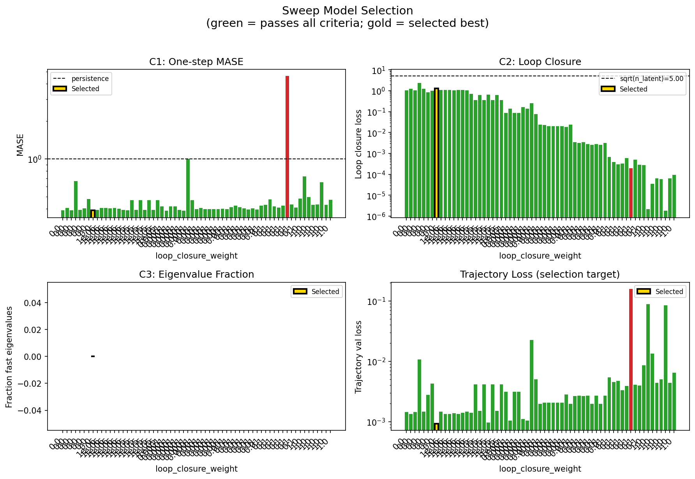

### sweep_pareto

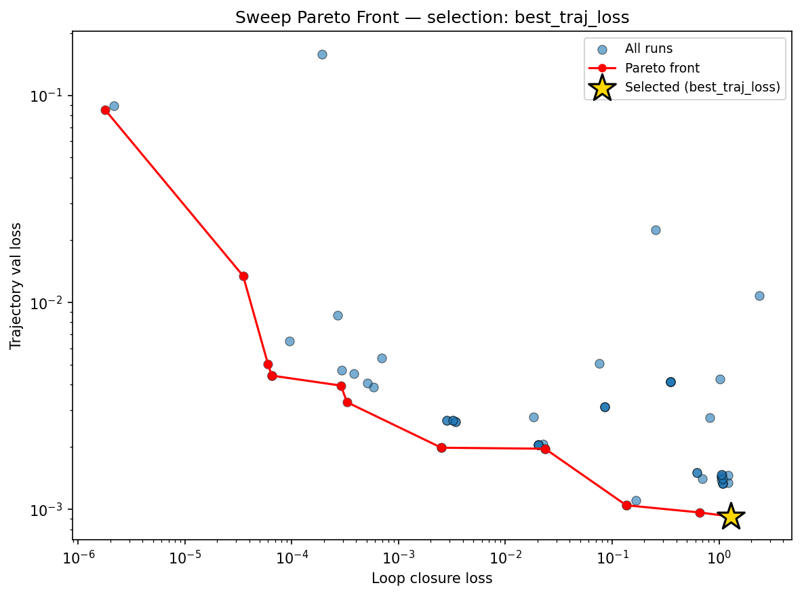

### reconstruction

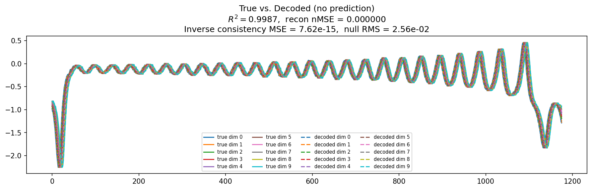

### prediction_windows

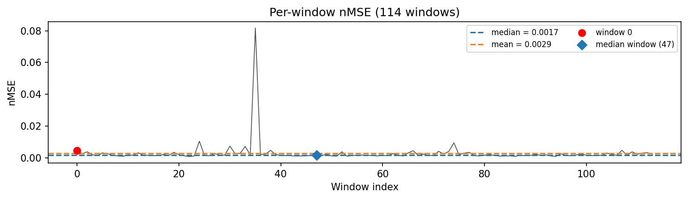

### long_trajectory

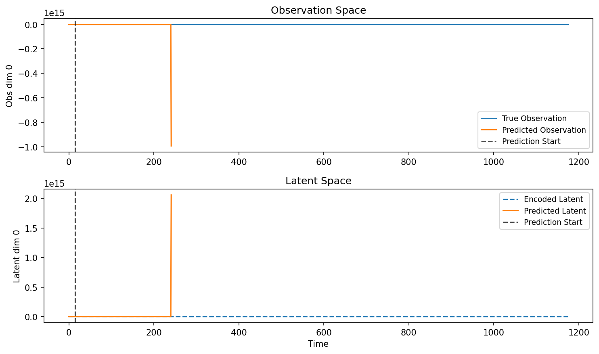

### mase

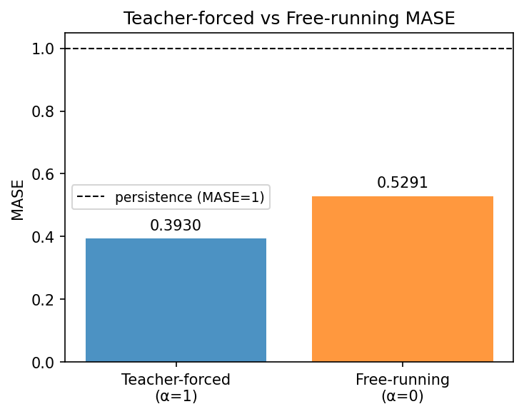

### latent_utilization

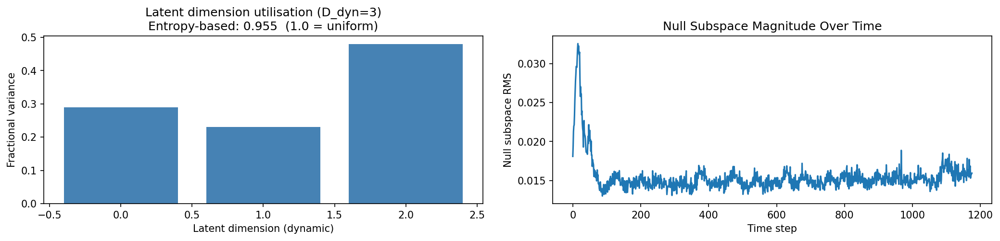

### lyapunov

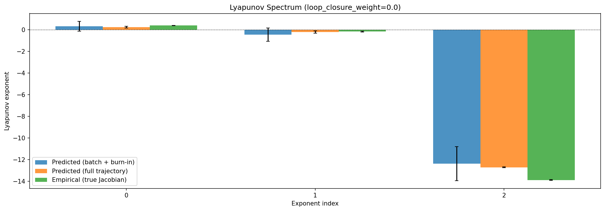

### kaplan_yorke

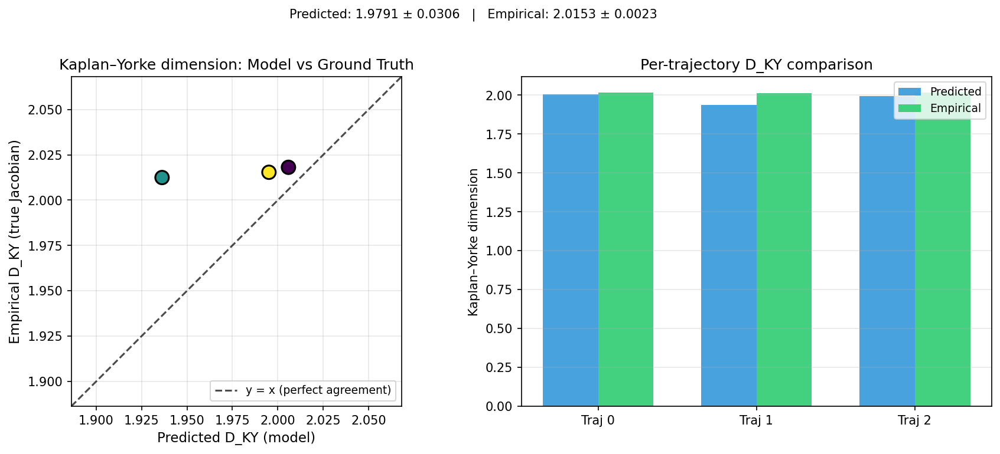

### per_run_lyapunov

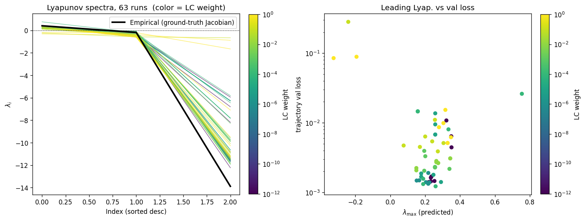

### per_run_lyapunov_vs_true

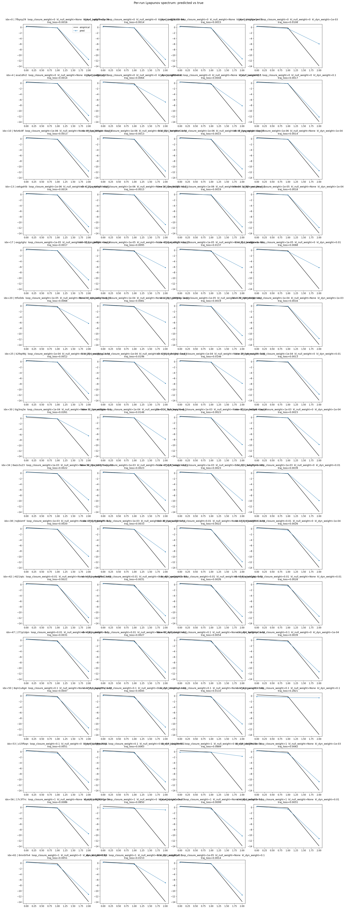

### per_run_lyapunov_relerr

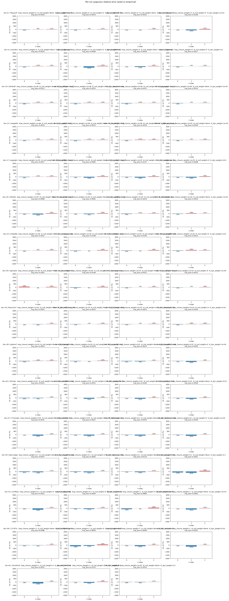

### encoder_decoder_jacobians

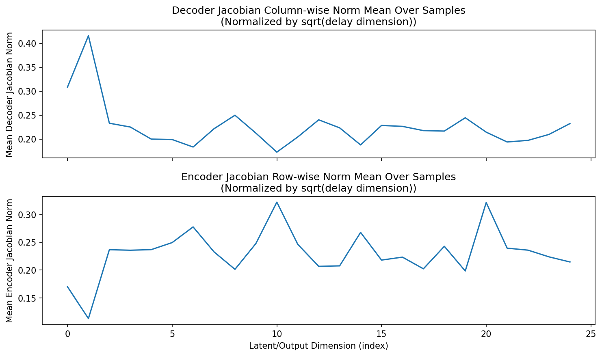

### amplification

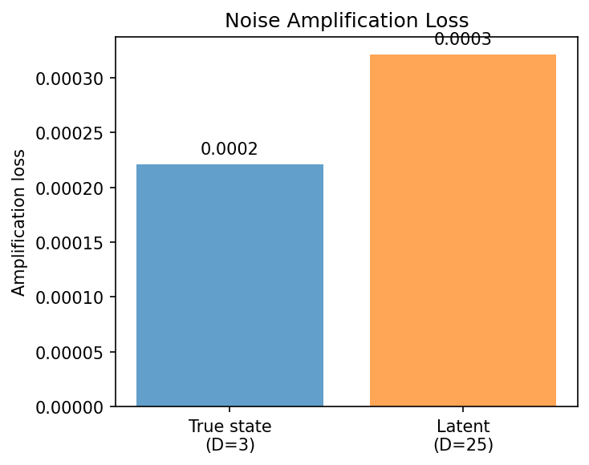

### kaplan_yorke_pca

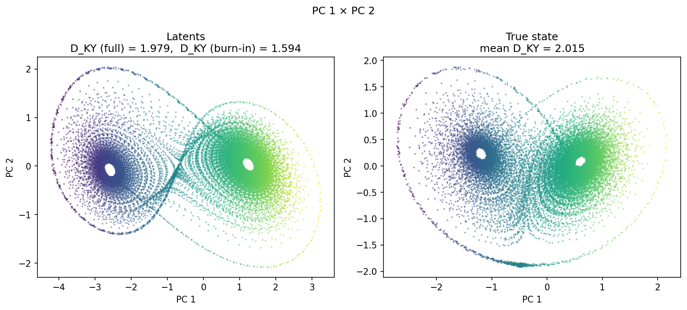

### prediction_detail_latent

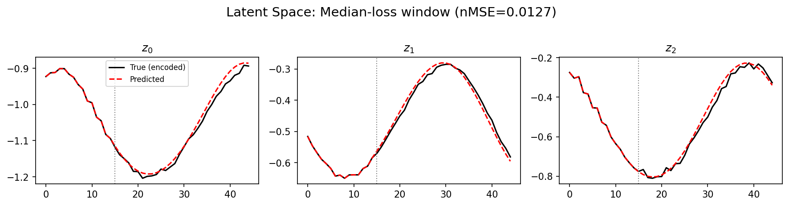

### prediction_detail_obs

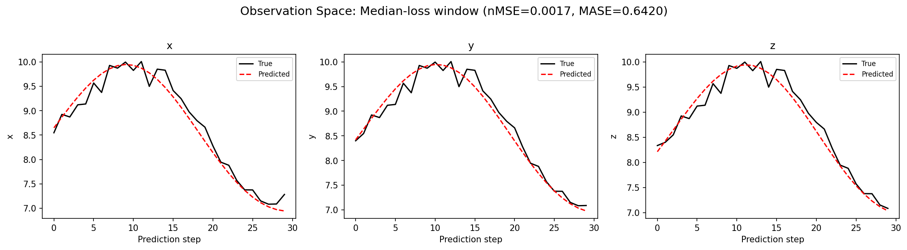

## Discussion

<!--
This section is intentionally left as a placeholder. A human reviewer
or Claude Code agent should fill it in based on the tables and figures
above, explicitly addressing each success criterion and comparing the
outcome to the stated hypothesis. Write the Discussion to
`discussion.md` in this directory and re-run `render_report`.
-->

_(to be written)_

## `run_analytics` stdout

<details><summary>Click to expand — full diagnostic output from <code>run_analytics</code></summary>

```
No run_id provided — selecting best run from group 'lorenz_partial_25d_additive_mse_uniform_p30_obsnoise001__vae_kl_lc_sweep' ...
Found 66 total runs in JacobianODE/Lorenz_INDpartial_N25_D1_NormTrue_T3__JacobianODE (group=lorenz_partial_25d_additive_mse_uniform_p30_obsnoise001__vae_kl_lc_sweep)
All runs (state, loop_closure_weight, tangent_entropy_weight, kl_dyn_weight):
  7fbysy29: state=finished, lc=0.0, te=0.0, kl_dyn=0.0
  g8o7na1y: state=finished, lc=0.0, te=0.0, kl_dyn=0.0
  rdj1b28f: state=finished, lc=0.0, te=0.0, kl_dyn=0.0
  hc4garym: state=finished, lc=0.0, te=0.0, kl_dyn=0.0
  eva1dhi2: state=finished, lc=0.0, te=0.0, kl_dyn=0.0
  u9ycjqgr: state=finished, lc=0.0, te=0.0, kl_dyn=0.0
  rgf08xme: state=finished, lc=0.0, te=0.0, kl_dyn=0.0
  woyar9p7: state=finished, lc=0.0, te=0.0, kl_dyn=0.0
  9zlv6c8f: state=finished, lc=1e-06, te=0.0, kl_dyn=0.0
  vp290wvr: state=finished, lc=1e-06, te=0.0, kl_dyn=0.0
  3arrmkzt: state=finished, lc=1e-06, te=0.0, kl_dyn=0.0
  yqpugnso: state=finished, lc=1e-06, te=0.0, kl_dyn=0.0
  oekgahlb: state=finished, lc=1e-06, te=0.0, kl_dyn=0.0
  yxtj4hcl: state=finished, lc=1e-06, te=0.0, kl_dyn=0.0
  3va9k281: state=finished, lc=1e-06, te=0.0, kl_dyn=0.0
  25ngyuvz: state=finished, lc=1e-06, te=0.0, kl_dyn=0.0
  p38fmyvc: state=finished, lc=1e-05, te=0.0, kl_dyn=0.0
  exgytghz: state=finished, lc=1e-05, te=0.0, kl_dyn=0.0
  msjbff6m: state=finished, lc=1e-05, te=0.0, kl_dyn=0.0
  vks3fqi1: state=finished, lc=1e-05, te=0.0, kl_dyn=0.0
  brw8gnww: state=finished, lc=1e-05, te=0.0, kl_dyn=0.0
  ttfix0ds: state=finished, lc=1e-05, te=0.0, kl_dyn=0.0
  d57wm3ru: state=crashed, lc=1e-05, te=0.0, kl_dyn=0.0
  zshabt0n: state=finished, lc=0.0001, te=0.0, kl_dyn=0.0
  uj209cig: state=crashed, lc=1e-05, te=0.0, kl_dyn=0.0
  484c0z3q: state=finished, lc=0.0001, te=0.0, kl_dyn=0.0
  k2fep9bj: state=finished, lc=0.0001, te=0.0, kl_dyn=0.0
  ersc8ygg: state=finished, lc=0.0001, te=0.0, kl_dyn=0.0
  2x7ekkqi: state=finished, lc=0.0001, te=0.0, kl_dyn=0.0
  pbwuap66: state=finished, lc=0.0001, te=0.0, kl_dyn=0.0
  ttg3nq3e: state=finished, lc=0.0001, te=0.0, kl_dyn=0.0
  cmwt2hyw: state=finished, lc=0.0001, te=0.0, kl_dyn=0.0
  7e3r2zyx: state=finished, lc=0.001, te=0.0, kl_dyn=0.0
  cu0sl2nd: state=finished, lc=0.001, te=0.0, kl_dyn=0.0
  6wzv3u23: state=finished, lc=0.001, te=0.0, kl_dyn=0.0
  8ivnt3l7: state=finished, lc=0.001, te=0.0, kl_dyn=0.0
  97ivioxy: state=finished, lc=0.001, te=0.0, kl_dyn=0.0
  0vkz7g4e: state=finished, lc=0.001, te=0.0, kl_dyn=0.0
  tojbiomf: state=finished, lc=0.001, te=0.0, kl_dyn=0.0
  i9qkmp7i: state=finished, lc=0.001, te=0.0, kl_dyn=0.0
  uatzu31i: state=crashed, lc=0.01, te=0.0, kl_dyn=0.0
  0kvw66hh: state=finished, lc=0.01, te=0.0, kl_dyn=0.0
  r621iqtc: state=finished, lc=0.01, te=0.0, kl_dyn=0.0
  w4a489s1: state=finished, lc=0.01, te=0.0, kl_dyn=0.0
  gxdxg4k6: state=finished, lc=0.01, te=0.0, kl_dyn=0.0
  pkxb1ppj: state=finished, lc=0.01, te=0.0, kl_dyn=0.0
  271p1dpn: state=finished, lc=0.01, te=0.0, kl_dyn=0.0
  sahk6vlc: state=crashed, lc=0.01, te=0.0, kl_dyn=0.0
  4d9c1nnz: state=finished, lc=0.1, te=0.0, kl_dyn=0.0
  9pl0onpl: state=finished, lc=0.1, te=0.0, kl_dyn=0.0
  6qm1u6g4: state=finished, lc=0.1, te=0.0, kl_dyn=0.0
  yhgos07q: state=finished, lc=0.1, te=0.0, kl_dyn=0.0
  1bnoisgr: state=finished, lc=0.1, te=0.0, kl_dyn=0.0
  qxievp33: state=finished, lc=0.1, te=0.0, kl_dyn=0.0
  z15ffzqn: state=finished, lc=0.1, te=0.0, kl_dyn=0.0
  59yp2sbp: state=finished, lc=0.1, te=0.0, kl_dyn=0.0
  1sz19nh6: state=finished, lc=1.0, te=0.0, kl_dyn=0.0
  8o59e2de: state=finished, lc=1.0, te=0.0, kl_dyn=0.0
  17c3f7rc: state=finished, lc=1.0, te=0.0, kl_dyn=0.0
  f9192hgz: state=finished, lc=1.0, te=0.0, kl_dyn=0.0
  nye1x9uz: state=finished, lc=1.0, te=0.0, kl_dyn=0.0
  jm2usilb: state=finished, lc=1.0, te=0.0, kl_dyn=0.0
  6mn0rfx4: state=finished, lc=1.0, te=0.0, kl_dyn=0.0
  464l19pi: state=finished, lc=1.0, te=0.0, kl_dyn=0.0
  jnhnek0y: state=crashed, lc=None, te=0.0, kl_dyn=0.0
  aoip40y6: state=running, lc=1e-05, te=0.0, kl_dyn=0.0

slurm_timeout_min not found in any run config — falling back to 180 min
  Including 7fbysy29 (lc=0.0): use_all_runs=True (state=finished)
  Including g8o7na1y (lc=0.0): use_all_runs=True (state=finished)
  Including rdj1b28f (lc=0.0): use_all_runs=True (state=finished)
  Including hc4garym (lc=0.0): use_all_runs=True (state=finished)
  Including eva1dhi2 (lc=0.0): use_all_runs=True (state=finished)
  Including u9ycjqgr (lc=0.0): use_all_runs=True (state=finished)
  Including rgf08xme (lc=0.0): use_all_runs=True (state=finished)
  Including woyar9p7 (lc=0.0): use_all_runs=True (state=finished)
  Including 9zlv6c8f (lc=1e-06): use_all_runs=True (state=finished)
  Including vp290wvr (lc=1e-06): use_all_runs=True (state=finished)
  Including 3arrmkzt (lc=1e-06): use_all_runs=True (state=finished)
  Including yqpugnso (lc=1e-06): use_all_runs=True (state=finished)
  Including oekgahlb (lc=1e-06): use_all_runs=True (state=finished)
  Including yxtj4hcl (lc=1e-06): use_all_runs=True (state=finished)
  Including 3va9k281 (lc=1e-06): use_all_runs=True (state=finished)
  Including 25ngyuvz (lc=1e-06): use_all_runs=True (state=finished)
  Including p38fmyvc (lc=1e-05): use_all_runs=True (state=finished)
  Including exgytghz (lc=1e-05): use_all_runs=True (state=finished)
  Including msjbff6m (lc=1e-05): use_all_runs=True (state=finished)
  Including vks3fqi1 (lc=1e-05): use_all_runs=True (state=finished)
  Including brw8gnww (lc=1e-05): use_all_runs=True (state=finished)
  Including ttfix0ds (lc=1e-05): use_all_runs=True (state=finished)
  Including d57wm3ru (lc=1e-05): use_all_runs=True (state=crashed)
  Including zshabt0n (lc=0.0001): use_all_runs=True (state=finished)
  Including uj209cig (lc=1e-05): use_all_runs=True (state=crashed)
  Including 484c0z3q (lc=0.0001): use_all_runs=True (state=finished)
  Including k2fep9bj (lc=0.0001): use_all_runs=True (state=finished)
  Including ersc8ygg (lc=0.0001): use_all_runs=True (state=finished)
  Including 2x7ekkqi (lc=0.0001): use_all_runs=True (state=finished)
  Including pbwuap66 (lc=0.0001): use_all_runs=True (state=finished)
  Including ttg3nq3e (lc=0.0001): use_all_runs=True (state=finished)
  Including cmwt2hyw (lc=0.0001): use_all_runs=True (state=finished)
  Including 7e3r2zyx (lc=0.001): use_all_runs=True (state=finished)
  Including cu0sl2nd (lc=0.001): use_all_runs=True (state=finished)
  Including 6wzv3u23 (lc=0.001): use_all_runs=True (state=finished)
  Including 8ivnt3l7 (lc=0.001): use_all_runs=True (state=finished)
  Including 97ivioxy (lc=0.001): use_all_runs=True (state=finished)
  Including 0vkz7g4e (lc=0.001): use_all_runs=True (state=finished)
  Including tojbiomf (lc=0.001): use_all_runs=True (state=finished)
  Including i9qkmp7i (lc=0.001): use_all_runs=True (state=finished)
  Including uatzu31i (lc=0.01): use_all_runs=True (state=crashed)
  Including 0kvw66hh (lc=0.01): use_all_runs=True (state=finished)
  Including r621iqtc (lc=0.01): use_all_runs=True (state=finished)
  Including w4a489s1 (lc=0.01): use_all_runs=True (state=finished)
  Including gxdxg4k6 (lc=0.01): use_all_runs=True (state=finished)
  Including pkxb1ppj (lc=0.01): use_all_runs=True (state=finished)
  Including 271p1dpn (lc=0.01): use_all_runs=True (state=finished)
  Including sahk6vlc (lc=0.01): use_all_runs=True (state=crashed)
  Including 4d9c1nnz (lc=0.1): use_all_runs=True (state=finished)
  Including 9pl0onpl (lc=0.1): use_all_runs=True (state=finished)
  Including 6qm1u6g4 (lc=0.1): use_all_runs=True (state=finished)
  Including yhgos07q (lc=0.1): use_all_runs=True (state=finished)
  Including 1bnoisgr (lc=0.1): use_all_runs=True (state=finished)
  Including qxievp33 (lc=0.1): use_all_runs=True (state=finished)
  Including z15ffzqn (lc=0.1): use_all_runs=True (state=finished)
  Including 59yp2sbp (lc=0.1): use_all_runs=True (state=finished)
  Including 1sz19nh6 (lc=1.0): use_all_runs=True (state=finished)
  Including 8o59e2de (lc=1.0): use_all_runs=True (state=finished)
  Including 17c3f7rc (lc=1.0): use_all_runs=True (state=finished)
  Including f9192hgz (lc=1.0): use_all_runs=True (state=finished)
  Including nye1x9uz (lc=1.0): use_all_runs=True (state=finished)
  Including jm2usilb (lc=1.0): use_all_runs=True (state=finished)
  Including 6mn0rfx4 (lc=1.0): use_all_runs=True (state=finished)
  Including 464l19pi (lc=1.0): use_all_runs=True (state=finished)
  Including aoip40y6 (lc=1e-05): use_all_runs=True (state=running)
Found 65 effectively-done sweep runs:
  loop_closure_weight=0.0, tangent_entropy_weight=0.0, kl_dyn_weight=0.0 -> run_id=7fbysy29
  loop_closure_weight=0.0, tangent_entropy_weight=0.0, kl_dyn_weight=0.0 -> run_id=eva1dhi2
  loop_closure_weight=0.0, tangent_entropy_weight=0.0, kl_dyn_weight=0.0 -> run_id=g8o7na1y
  loop_closure_weight=0.0, tangent_entropy_weight=0.0, kl_dyn_weight=0.0 -> run_id=hc4garym
  loop_closure_weight=0.0, tangent_entropy_weight=0.0, kl_dyn_weight=0.0 -> run_id=rdj1b28f
  loop_closure_weight=0.0, tangent_entropy_weight=0.0, kl_dyn_weight=0.0 -> run_id=rgf08xme
  loop_closure_weight=0.0, tangent_entropy_weight=0.0, kl_dyn_weight=0.0 -> run_id=u9ycjqgr
  loop_closure_weight=0.0, tangent_entropy_weight=0.0, kl_dyn_weight=0.0 -> run_id=woyar9p7
  loop_closure_weight=1e-06, tangent_entropy_weight=0.0, kl_dyn_weight=0.0 -> run_id=25ngyuvz
  loop_closure_weight=1e-06, tangent_entropy_weight=0.0, kl_dyn_weight=0.0 -> run_id=3arrmkzt
  loop_closure_weight=1e-06, tangent_entropy_weight=0.0, kl_dyn_weight=0.0 -> run_id=3va9k281
  loop_closure_weight=1e-06, tangent_entropy_weight=0.0, kl_dyn_weight=0.0 -> run_id=9zlv6c8f
  loop_closure_weight=1e-06, tangent_entropy_weight=0.0, kl_dyn_weight=0.0 -> run_id=oekgahlb
  loop_closure_weight=1e-06, tangent_entropy_weight=0.0, kl_dyn_weight=0.0 -> run_id=vp290wvr
  loop_closure_weight=1e-06, tangent_entropy_weight=0.0, kl_dyn_weight=0.0 -> run_id=yqpugnso
  loop_closure_weight=1e-06, tangent_entropy_weight=0.0, kl_dyn_weight=0.0 -> run_id=yxtj4hcl
  loop_closure_weight=1e-05, tangent_entropy_weight=0.0, kl_dyn_weight=0.0 -> run_id=aoip40y6
  loop_closure_weight=1e-05, tangent_entropy_weight=0.0, kl_dyn_weight=0.0 -> run_id=brw8gnww
  loop_closure_weight=1e-05, tangent_entropy_weight=0.0, kl_dyn_weight=0.0 -> run_id=d57wm3ru
  loop_closure_weight=1e-05, tangent_entropy_weight=0.0, kl_dyn_weight=0.0 -> run_id=exgytghz
  loop_closure_weight=1e-05, tangent_entropy_weight=0.0, kl_dyn_weight=0.0 -> run_id=msjbff6m
  loop_closure_weight=1e-05, tangent_entropy_weight=0.0, kl_dyn_weight=0.0 -> run_id=p38fmyvc
  loop_closure_weight=1e-05, tangent_entropy_weight=0.0, kl_dyn_weight=0.0 -> run_id=ttfix0ds
  loop_closure_weight=1e-05, tangent_entropy_weight=0.0, kl_dyn_weight=0.0 -> run_id=uj209cig
  loop_closure_weight=1e-05, tangent_entropy_weight=0.0, kl_dyn_weight=0.0 -> run_id=vks3fqi1
  loop_closure_weight=0.0001, tangent_entropy_weight=0.0, kl_dyn_weight=0.0 -> run_id=2x7ekkqi
  loop_closure_weight=0.0001, tangent_entropy_weight=0.0, kl_dyn_weight=0.0 -> run_id=484c0z3q
  loop_closure_weight=0.0001, tangent_entropy_weight=0.0, kl_dyn_weight=0.0 -> run_id=cmwt2hyw
  loop_closure_weight=0.0001, tangent_entropy_weight=0.0, kl_dyn_weight=0.0 -> run_id=ersc8ygg
  loop_closure_weight=0.0001, tangent_entropy_weight=0.0, kl_dyn_weight=0.0 -> run_id=k2fep9bj
  loop_closure_weight=0.0001, tangent_entropy_weight=0.0, kl_dyn_weight=0.0 -> run_id=pbwuap66
  loop_closure_weight=0.0001, tangent_entropy_weight=0.0, kl_dyn_weight=0.0 -> run_id=ttg3nq3e
  loop_closure_weight=0.0001, tangent_entropy_weight=0.0, kl_dyn_weight=0.0 -> run_id=zshabt0n
  loop_closure_weight=0.001, tangent_entropy_weight=0.0, kl_dyn_weight=0.0 -> run_id=0vkz7g4e
  loop_closure_weight=0.001, tangent_entropy_weight=0.0, kl_dyn_weight=0.0 -> run_id=6wzv3u23
  loop_closure_weight=0.001, tangent_entropy_weight=0.0, kl_dyn_weight=0.0 -> run_id=7e3r2zyx
  loop_closure_weight=0.001, tangent_entropy_weight=0.0, kl_dyn_weight=0.0 -> run_id=8ivnt3l7
  loop_closure_weight=0.001, tangent_entropy_weight=0.0, kl_dyn_weight=0.0 -> run_id=97ivioxy
  loop_closure_weight=0.001, tangent_entropy_weight=0.0, kl_dyn_weight=0.0 -> run_id=cu0sl2nd
  loop_closure_weight=0.001, tangent_entropy_weight=0.0, kl_dyn_weight=0.0 -> run_id=i9qkmp7i
  loop_closure_weight=0.001, tangent_entropy_weight=0.0, kl_dyn_weight=0.0 -> run_id=tojbiomf
  loop_closure_weight=0.01, tangent_entropy_weight=0.0, kl_dyn_weight=0.0 -> run_id=0kvw66hh
  loop_closure_weight=0.01, tangent_entropy_weight=0.0, kl_dyn_weight=0.0 -> run_id=271p1dpn
  loop_closure_weight=0.01, tangent_entropy_weight=0.0, kl_dyn_weight=0.0 -> run_id=gxdxg4k6
  loop_closure_weight=0.01, tangent_entropy_weight=0.0, kl_dyn_weight=0.0 -> run_id=pkxb1ppj
  loop_closure_weight=0.01, tangent_entropy_weight=0.0, kl_dyn_weight=0.0 -> run_id=r621iqtc
  loop_closure_weight=0.01, tangent_entropy_weight=0.0, kl_dyn_weight=0.0 -> run_id=sahk6vlc
  loop_closure_weight=0.01, tangent_entropy_weight=0.0, kl_dyn_weight=0.0 -> run_id=uatzu31i
  loop_closure_weight=0.01, tangent_entropy_weight=0.0, kl_dyn_weight=0.0 -> run_id=w4a489s1
  loop_closure_weight=0.1, tangent_entropy_weight=0.0, kl_dyn_weight=0.0 -> run_id=1bnoisgr
  loop_closure_weight=0.1, tangent_entropy_weight=0.0, kl_dyn_weight=0.0 -> run_id=4d9c1nnz
  loop_closure_weight=0.1, tangent_entropy_weight=0.0, kl_dyn_weight=0.0 -> run_id=59yp2sbp
  loop_closure_weight=0.1, tangent_entropy_weight=0.0, kl_dyn_weight=0.0 -> run_id=6qm1u6g4
  loop_closure_weight=0.1, tangent_entropy_weight=0.0, kl_dyn_weight=0.0 -> run_id=9pl0onpl
  loop_closure_weight=0.1, tangent_entropy_weight=0.0, kl_dyn_weight=0.0 -> run_id=qxievp33
  loop_closure_weight=0.1, tangent_entropy_weight=0.0, kl_dyn_weight=0.0 -> run_id=yhgos07q
  loop_closure_weight=0.1, tangent_entropy_weight=0.0, kl_dyn_weight=0.0 -> run_id=z15ffzqn
  loop_closure_weight=1.0, tangent_entropy_weight=0.0, kl_dyn_weight=0.0 -> run_id=17c3f7rc
  loop_closure_weight=1.0, tangent_entropy_weight=0.0, kl_dyn_weight=0.0 -> run_id=1sz19nh6
  loop_closure_weight=1.0, tangent_entropy_weight=0.0, kl_dyn_weight=0.0 -> run_id=464l19pi
  loop_closure_weight=1.0, tangent_entropy_weight=0.0, kl_dyn_weight=0.0 -> run_id=6mn0rfx4
  loop_closure_weight=1.0, tangent_entropy_weight=0.0, kl_dyn_weight=0.0 -> run_id=8o59e2de
  loop_closure_weight=1.0, tangent_entropy_weight=0.0, kl_dyn_weight=0.0 -> run_id=f9192hgz
  loop_closure_weight=1.0, tangent_entropy_weight=0.0, kl_dyn_weight=0.0 -> run_id=jm2usilb
  loop_closure_weight=1.0, tangent_entropy_weight=0.0, kl_dyn_weight=0.0 -> run_id=nye1x9uz
  Dropping 2 run(s) with no checkpoint dir: ['25ngyuvz', 'd57wm3ru']
n_dims=25, n_latent=25, n_dyn=3, dt=0.0150
  run=7fbysy29: DiagnosticMetrics(one_step_mase=0.3869808316230774, loop_closure_loss=1.048264503479004, fast_eigenvalue_fraction=0.0, trajectory_val_loss=0.0014373239828273654) (from W&B history)
  run=eva1dhi2: DiagnosticMetrics(one_step_mase=0.4039267301559448, loop_closure_loss=1.2166098356246948, fast_eigenvalue_fraction=0.0, trajectory_val_loss=0.001338681555353105) (from W&B history)
  run=g8o7na1y: DiagnosticMetrics(one_step_mase=0.3869808316230774, loop_closure_loss=1.048264503479004, fast_eigenvalue_fraction=0.0, trajectory_val_loss=0.0014373239828273654) (from W&B history)
  run=hc4garym: DiagnosticMetrics(one_step_mase=0.6619769334793091, loop_closure_loss=2.3806772232055664, fast_eigenvalue_fraction=0.0, trajectory_val_loss=0.010799749754369259) (from W&B history)
  run=rdj1b28f: DiagnosticMetrics(one_step_mase=0.39119601249694824, loop_closure_loss=1.227062702178955, fast_eigenvalue_fraction=0.0, trajectory_val_loss=0.0014568982878699899) (from W&B history)
  run=rgf08xme: DiagnosticMetrics(one_step_mase=0.4025774598121643, loop_closure_loss=0.822045087814331, fast_eigenvalue_fraction=0.0, trajectory_val_loss=0.0027783019468188286) (from W&B history)
  run=u9ycjqgr: DiagnosticMetrics(one_step_mase=0.47561559081077576, loop_closure_loss=1.015472412109375, fast_eigenvalue_fraction=0.0, trajectory_val_loss=0.0042665861546993256) (from W&B history)
  run=woyar9p7: DiagnosticMetrics(one_step_mase=0.38817936182022095, loop_closure_loss=1.2898691892623901, fast_eigenvalue_fraction=0.0, trajectory_val_loss=0.0009220679639838636) (from W&B history)
  run=3arrmkzt: DiagnosticMetrics(one_step_mase=0.3903183341026306, loop_closure_loss=1.0639581680297852, fast_eigenvalue_fraction=0.0, trajectory_val_loss=0.0014690797543153167) (from W&B history)
  run=3va9k281: DiagnosticMetrics(one_step_mase=0.4051494002342224, loop_closure_loss=1.0861575603485107, fast_eigenvalue_fraction=0.0, trajectory_val_loss=0.0013331950176507235) (from W&B history)
  run=9zlv6c8f: DiagnosticMetrics(one_step_mase=0.4051494002342224, loop_closure_loss=1.0861575603485107, fast_eigenvalue_fraction=0.0, trajectory_val_loss=0.0013331950176507235) (from W&B history)
  run=oekgahlb: DiagnosticMetrics(one_step_mase=0.40156251192092896, loop_closure_loss=1.0557167530059814, fast_eigenvalue_fraction=0.0, trajectory_val_loss=0.0013816597638651729) (from W&B history)
  run=vp290wvr: DiagnosticMetrics(one_step_mase=0.4051494002342224, loop_closure_loss=1.0861575603485107, fast_eigenvalue_fraction=0.0, trajectory_val_loss=0.0013331950176507235) (from W&B history)
  run=yqpugnso: DiagnosticMetrics(one_step_mase=0.39890238642692566, loop_closure_loss=1.0820763111114502, fast_eigenvalue_fraction=0.0, trajectory_val_loss=0.0014020070666447282) (from W&B history)
  run=yxtj4hcl: DiagnosticMetrics(one_step_mase=0.3901089131832123, loop_closure_loss=1.0575110912322998, fast_eigenvalue_fraction=0.0, trajectory_val_loss=0.0014653484104201198) (from W&B history)
  run=aoip40y6: DiagnosticMetrics(one_step_mase=0.388451486825943, loop_closure_loss=0.6953887939453125, fast_eigenvalue_fraction=0.0, trajectory_val_loss=0.001407712115906179) (from W&B history)
  run=brw8gnww: DiagnosticMetrics(one_step_mase=0.4685956537723541, loop_closure_loss=0.35088062286376953, fast_eigenvalue_fraction=0.0, trajectory_val_loss=0.004123499151319265) (from W&B history)
  run=exgytghz: DiagnosticMetrics(one_step_mase=0.39065977931022644, loop_closure_loss=0.6232660412788391, fast_eigenvalue_fraction=0.0, trajectory_val_loss=0.001500411075539887) (from W&B history)
  run=msjbff6m: DiagnosticMetrics(one_step_mase=0.4685956537723541, loop_closure_loss=0.35088062286376953, fast_eigenvalue_fraction=0.0, trajectory_val_loss=0.004123499151319265) (from W&B history)
  run=p38fmyvc: DiagnosticMetrics(one_step_mase=0.38911598920822144, loop_closure_loss=0.658134937286377, fast_eigenvalue_fraction=0.0, trajectory_val_loss=0.0009650313877500594) (from W&B history)
  run=ttfix0ds: DiagnosticMetrics(one_step_mase=0.4685956537723541, loop_closure_loss=0.35088062286376953, fast_eigenvalue_fraction=0.0, trajectory_val_loss=0.004123499151319265) (from W&B history)
  run=uj209cig: DiagnosticMetrics(one_step_mase=0.39065977931022644, loop_closure_loss=0.6232660412788391, fast_eigenvalue_fraction=0.0, trajectory_val_loss=0.001500411075539887) (from W&B history)
  run=vks3fqi1: DiagnosticMetrics(one_step_mase=0.4685956537723541, loop_closure_loss=0.35088062286376953, fast_eigenvalue_fraction=0.0, trajectory_val_loss=0.004123499151319265) (from W&B history)
  run=2x7ekkqi: DiagnosticMetrics(one_step_mase=0.41675394773483276, loop_closure_loss=0.08489125967025757, fast_eigenvalue_fraction=0.0, trajectory_val_loss=0.0031365836039185524) (from W&B history)
  run=484c0z3q: DiagnosticMetrics(one_step_mase=0.38378655910491943, loop_closure_loss=0.13548998534679413, fast_eigenvalue_fraction=0.0, trajectory_val_loss=0.0010451687267050147) (from W&B history)
  run=cmwt2hyw: DiagnosticMetrics(one_step_mase=0.41675394773483276, loop_closure_loss=0.08489125967025757, fast_eigenvalue_fraction=0.0, trajectory_val_loss=0.0031365836039185524) (from W&B history)
  run=ersc8ygg: DiagnosticMetrics(one_step_mase=0.41675394773483276, loop_closure_loss=0.08489125967025757, fast_eigenvalue_fraction=0.0, trajectory_val_loss=0.0031365836039185524) (from W&B history)
  run=k2fep9bj: DiagnosticMetrics(one_step_mase=0.3904956579208374, loop_closure_loss=0.16606086492538452, fast_eigenvalue_fraction=0.0, trajectory_val_loss=0.0011060986435040832) (from W&B history)
  run=pbwuap66: DiagnosticMetrics(one_step_mase=0.38378655910491943, loop_closure_loss=0.13548998534679413, fast_eigenvalue_fraction=0.0, trajectory_val_loss=0.0010451687267050147) (from W&B history)
  run=ttg3nq3e: DiagnosticMetrics(one_step_mase=0.999679684638977, loop_closure_loss=0.255731999874115, fast_eigenvalue_fraction=0.0, trajectory_val_loss=0.022427380084991455) (from W&B history)
  run=zshabt0n: DiagnosticMetrics(one_step_mase=0.46656540036201477, loop_closure_loss=0.07624845206737518, fast_eigenvalue_fraction=0.0, trajectory_val_loss=0.005060472525656223) (from W&B history)
  run=0vkz7g4e: DiagnosticMetrics(one_step_mase=0.3970675468444824, loop_closure_loss=0.02352321147918701, fast_eigenvalue_fraction=0.0, trajectory_val_loss=0.0019610796589404345) (from W&B history)
  run=6wzv3u23: DiagnosticMetrics(one_step_mase=0.4034833610057831, loop_closure_loss=0.022446054965257645, fast_eigenvalue_fraction=0.0, trajectory_val_loss=0.0020628052297979593) (from W&B history)
  run=7e3r2zyx: DiagnosticMetrics(one_step_mase=0.3971720337867737, loop_closure_loss=0.02042379416525364, fast_eigenvalue_fraction=0.0, trajectory_val_loss=0.0020534340292215347) (from W&B history)
  run=8ivnt3l7: DiagnosticMetrics(one_step_mase=0.3971720337867737, loop_closure_loss=0.02042379416525364, fast_eigenvalue_fraction=0.0, trajectory_val_loss=0.0020534340292215347) (from W&B history)
  run=97ivioxy: DiagnosticMetrics(one_step_mase=0.3971720337867737, loop_closure_loss=0.02042379416525364, fast_eigenvalue_fraction=0.0, trajectory_val_loss=0.0020534340292215347) (from W&B history)
  run=cu0sl2nd: DiagnosticMetrics(one_step_mase=0.3971720337867737, loop_closure_loss=0.02042379416525364, fast_eigenvalue_fraction=0.0, trajectory_val_loss=0.0020534340292215347) (from W&B history)
  run=i9qkmp7i: DiagnosticMetrics(one_step_mase=0.399803102016449, loop_closure_loss=0.01845659874379635, fast_eigenvalue_fraction=0.0, trajectory_val_loss=0.002796090906485915) (from W&B history)
  run=tojbiomf: DiagnosticMetrics(one_step_mase=0.3970675468444824, loop_closure_loss=0.02352321147918701, fast_eigenvalue_fraction=0.0, trajectory_val_loss=0.0019610796589404345) (from W&B history)
  run=0kvw66hh: DiagnosticMetrics(one_step_mase=0.41049808263778687, loop_closure_loss=0.003413381287828088, fast_eigenvalue_fraction=0.0, trajectory_val_loss=0.0026409064885228872) (from W&B history)
  run=271p1dpn: DiagnosticMetrics(one_step_mase=0.42168691754341125, loop_closure_loss=0.0032091005705296993, fast_eigenvalue_fraction=0.0, trajectory_val_loss=0.0026790655683726072) (from W&B history)
  run=gxdxg4k6: DiagnosticMetrics(one_step_mase=0.41049808263778687, loop_closure_loss=0.003413381287828088, fast_eigenvalue_fraction=0.0, trajectory_val_loss=0.0026409064885228872) (from W&B history)
  run=pkxb1ppj: DiagnosticMetrics(one_step_mase=0.40122172236442566, loop_closure_loss=0.0028395431581884623, fast_eigenvalue_fraction=0.0, trajectory_val_loss=0.002677427139133215) (from W&B history)
  run=r621iqtc: DiagnosticMetrics(one_step_mase=0.39307647943496704, loop_closure_loss=0.0025188936851918697, fast_eigenvalue_fraction=0.0, trajectory_val_loss=0.001982414862141013) (from W&B history)
  run=sahk6vlc: DiagnosticMetrics(one_step_mase=0.40122172236442566, loop_closure_loss=0.0028395431581884623, fast_eigenvalue_fraction=0.0, trajectory_val_loss=0.002677427139133215) (from W&B history)
  run=uatzu31i: DiagnosticMetrics(one_step_mase=0.39307647943496704, loop_closure_loss=0.0025188936851918697, fast_eigenvalue_fraction=0.0, trajectory_val_loss=0.001982414862141013) (from W&B history)
  run=w4a489s1: DiagnosticMetrics(one_step_mase=0.42168691754341125, loop_closure_loss=0.0032091005705296993, fast_eigenvalue_fraction=0.0, trajectory_val_loss=0.0026790655683726072) (from W&B history)
  run=1bnoisgr: DiagnosticMetrics(one_step_mase=0.4300001561641693, loop_closure_loss=0.0006902347668074071, fast_eigenvalue_fraction=0.0, trajectory_val_loss=0.0053939963690936565) (from W&B history)
  run=4d9c1nnz: DiagnosticMetrics(one_step_mase=0.47221583127975464, loop_closure_loss=0.0003819532284978777, fast_eigenvalue_fraction=0.0, trajectory_val_loss=0.0045369272120296955) (from W&B history)
  run=59yp2sbp: DiagnosticMetrics(one_step_mase=0.4172241985797882, loop_closure_loss=0.0002944920852314681, fast_eigenvalue_fraction=0.0, trajectory_val_loss=0.004700945224612951) (from W&B history)
  run=6qm1u6g4: DiagnosticMetrics(one_step_mase=0.4083031713962555, loop_closure_loss=0.00032821594504639506, fast_eigenvalue_fraction=0.0, trajectory_val_loss=0.0032906504347920418) (from W&B history)
  run=9pl0onpl: DiagnosticMetrics(one_step_mase=0.42354482412338257, loop_closure_loss=0.0005852364702150226, fast_eigenvalue_fraction=0.0, trajectory_val_loss=0.003881216747686267) (from W&B history)
  run=qxievp33: DiagnosticMetrics(one_step_mase=4.602756023406982, loop_closure_loss=0.0001914576132548973, fast_eigenvalue_fraction=0.0, trajectory_val_loss=0.15758392214775085) (from W&B history)
  run=yhgos07q: DiagnosticMetrics(one_step_mase=0.43008196353912354, loop_closure_loss=0.000507631222717464, fast_eigenvalue_fraction=0.0, trajectory_val_loss=0.004056598991155624) (from W&B history)
  run=z15ffzqn: DiagnosticMetrics(one_step_mase=0.40854960680007935, loop_closure_loss=0.00028863464831374586, fast_eigenvalue_fraction=0.0, trajectory_val_loss=0.003957892768085003) (from W&B history)
  run=17c3f7rc: DiagnosticMetrics(one_step_mase=0.47996047139167786, loop_closure_loss=0.00026949585299007595, fast_eigenvalue_fraction=0.0, trajectory_val_loss=0.008635932579636574) (from W&B history)
  run=1sz19nh6: DiagnosticMetrics(one_step_mase=0.7231795191764832, loop_closure_loss=2.150908130715834e-06, fast_eigenvalue_fraction=0.0, trajectory_val_loss=0.08887294679880142) (from W&B history)
  run=464l19pi: DiagnosticMetrics(one_step_mase=0.49543794989585876, loop_closure_loss=3.500767343211919e-05, fast_eigenvalue_fraction=0.0, trajectory_val_loss=0.013408510945737362) (from W&B history)
  run=6mn0rfx4: DiagnosticMetrics(one_step_mase=0.4279318153858185, loop_closure_loss=6.48333880235441e-05, fast_eigenvalue_fraction=0.0, trajectory_val_loss=0.004423497244715691) (from W&B history)
  run=8o59e2de: DiagnosticMetrics(one_step_mase=0.4330974817276001, loop_closure_loss=5.992245496599935e-05, fast_eigenvalue_fraction=0.0, trajectory_val_loss=0.005015549249947071) (from W&B history)
  run=f9192hgz: DiagnosticMetrics(one_step_mase=0.6519649028778076, loop_closure_loss=1.7884171938931104e-06, fast_eigenvalue_fraction=0.0, trajectory_val_loss=0.08500079065561295) (from W&B history)
  run=jm2usilb: DiagnosticMetrics(one_step_mase=0.4279318153858185, loop_closure_loss=6.48333880235441e-05, fast_eigenvalue_fraction=0.0, trajectory_val_loss=0.004423497244715691) (from W&B history)
  run=nye1x9uz: DiagnosticMetrics(one_step_mase=0.47074559330940247, loop_closure_loss=9.489760850556195e-05, fast_eigenvalue_fraction=0.0, trajectory_val_loss=0.006516226101666689) (from W&B history)

Ranking method:           best_traj_loss
Best run ID:              woyar9p7
Best loop_closure_weight: 0.0
Best tangent_entropy_weight: 0.0
Best kl_dyn_weight:       0.0
Best traj loss:           0.000922
Criteria applied: ['C1', 'C2', 'C3']
Surviving: 62 / 63
Auto-selected run_id: woyar9p7

======================================================================
PARETO FRONTIER RUNS (15 runs)
======================================================================
  Run ID               LC Loss   Traj Val Loss
  ------------  --------------  --------------
  f9192hgz            0.000002        0.085001
  464l19pi            0.000035        0.013409
  8o59e2de            0.000060        0.005016
  6mn0rfx4            0.000065        0.004423
  jm2usilb            0.000065        0.004423
  z15ffzqn            0.000289        0.003958
  6qm1u6g4            0.000328        0.003291
  r621iqtc            0.002519        0.001982
  uatzu31i            0.002519        0.001982
  0vkz7g4e            0.023523        0.001961
  tojbiomf            0.023523        0.001961
  484c0z3q            0.135490        0.001045
  pbwuap66            0.135490        0.001045
  p38fmyvc            0.658135        0.000965
  woyar9p7            1.289869        0.000922 <-- selected

======================================================================
RANKING METHOD COMPARISON (over 62 survivors)
======================================================================
  Method                  Run ID               LC Loss   Traj Val Loss
  ----------------------  ------------  --------------  --------------
  best_traj_loss          woyar9p7            1.289869        0.000922 <-- active
  pareto_knee             z15ffzqn            0.000289        0.003958
  geo_rank                woyar9p7            1.289869        0.000922
  minimax_rank            r621iqtc            0.002519        0.001982
  geo_log_score           woyar9p7            1.289869        0.000922
  minimax_log_score       6mn0rfx4            0.000065        0.004423
======================================================================

Loading run woyar9p7 from JacobianODE/Lorenz_INDpartial_N25_D1_NormTrue_T3__JacobianODE ...
Train dataset shape: torch.Size([24882, 45, 25])
Validation dataset shape: torch.Size([7917, 45, 25])
Test dataset shape: torch.Size([3393, 45, 25])
Train trajectories dataset shape: torch.Size([22, 1176, 25])
Validation trajectories dataset shape: torch.Size([7, 1176, 25])
Test trajectories dataset shape: torch.Size([3, 1176, 25])
Loading checkpoint epoch=136-step=27400.ckpt...
Computing reconstruction ...
Computing MASE ...
Teacher-forced MASE: 0.3930
Free-running MASE:   0.5291
Computing latent utilization ...
Entropy-based utilization: 0.955
Null subspace mean RMS: 1.560927e-02
Computing Lyapunov exponents ...
  Computing full-trajectory Lyapunov (3 test trajs, T=1176) ...
Predicted Lyapunov exponents (batch+burn-in, 128 windowed trajs):
  λ_1 = +0.3180 ± 0.4503
  λ_2 = -0.4482 ± 0.6187
  λ_3 = -12.3565 ± 1.5677
Predicted Lyapunov exponents (full-length, 3 test trajs):
  λ_1 = +0.2363 ± 0.0747
  λ_2 = -0.2168 ± 0.1113
  λ_3 = -12.7030 ± 0.0421
Empirical Lyapunov exponents (mean ± std):
  λ_1 = +0.3846 ± 0.0251
  λ_2 = -0.1716 ± 0.0444
  λ_3 = -13.8799 ± 0.0398
Mean KY dim (predicted): 1.979 ± 0.031
Mean KY dim (empirical): 2.015 ± 0.002
Mean KY dim (burn-in):   1.594 ± 0.459
Computing prediction windows ...
Windows: 114 — nMSE min=0.0008, median=0.0017, mean=0.0029, max=0.0818
Computing long trajectory prediction ...
Computing encoder/decoder Jacobians ...
encoder_jacobian: (128, 25, 25)
decoder_jacobian: (128, 25, 25)
Computing amplification loss ...
Amplification loss — True state: 0.000221
Amplification loss — Latent:     0.000321
```

</details>
