# Sweep Analysis: `lorenz_partial_25d_additive_mse_uniform_p30_obsnoise005__lc_sweep`

**Project**: [Lorenz_INDpartial_N25_D1_NormTrue_T3__JacobianODE](https://wandb.ai/JacobianODE/Lorenz_INDpartial_N25_D1_NormTrue_T3__JacobianODE/groups/lorenz_partial_25d_additive_mse_uniform_p30_obsnoise005__lc_sweep)  
**Launched**: 2026-04-18T18:35:11Z  
**Completed**: 2026-04-19T00:25:13Z  
**Outcome**: `complete_clean`  
**Git**: `latent-JacobianODE` @ `f8e8560`  
**Expected runs**: 9

## Experiment Context

### `lorenz_partial_25d_additive_mse_uniform_p30_obsnoise005__lc_sweep`

**Description**

Same base as lorenz_partial_25d_additive_mse_uniform_p30 with
obs_noise=0.05. 9-run LC sweep (same axis as the obsnoise001
companion sweep); mirrors the obsnoise001__lc_sweep layout so
results are directly comparable at a higher noise level.

**Hypothesis**

Bumping obs_noise from 0.01 to 0.05 makes the delay-embedded
partial observation substantially harder to invert into a clean
3-D attractor chart: the directions the encoder contracts into
z_dyn (top-3 obs PCs by variance, per earlier Jacobian analysis)
now carry 25× more variance in latent-space noise. Expect
val/trajectory_loss at the best LC to be higher than the
obsnoise001 baseline, and λ_min to be less negative (strong-
contraction direction harder to identify under denser noise).
Whether the best LC weight shifts materially vs obsnoise001 is
the main scientific question.

**Success criteria**

- Best val traj_loss finite and within ~5× of the obsnoise001__lc_sweep baseline
- λ_min at best LC still meaningfully negative (< -5)
- No loop-closure explosion (max LC loss at best_tl < 10 across the sweep)

## Results

**Swept axes** (1): `training.lightning.loop_closure_weight`

**Chosen run** (by `best_traj_loss`): `y7938e7x` — traj_loss=0.00944, MASE=0.8888, R²=0.9749, LC loss=0.040, epoch=156.0

Swept-axis values at chosen run: `training.lightning.loop_closure_weight`=0.001

**Runs analyzed**: 9 (expected 9)

### Per-run results

| run_idx | run_id | `training.lightning.loop_closure_weight` | best_traj_loss | best_MASE | R² | LC loss | epoch |
|---|---|---|---|---|---|---|---|
| 4 | `y7938e7x` | 0.001 | 0.00944 | 0.8888 | 0.9749 | 0.040 | 156.0 |
| 3 | `bxuw994m` | 1.0e-04 | 0.01118 | 0.9439 | 0.9704 | 0.255 | 65.0 |
| 0 | `cuscq7w2` | 0 | 0.01185 | 0.9654 | 0.9687 | 2.500 | 110.0 |
| 5 | `f91ecsag` | 0.01 | 0.01302 | 0.9982 | 0.9653 | 0.006 | 75.0 |
| 6 | `8jqwi5gc` | 0.1 | 0.01397 | 1.0264 | 0.9628 | 0.000 | 144.0 |
| 7 | `qt8nlbvw` | 1 | 0.01510 | 1.1085 | 0.9599 | 0.000 | 98.0 |
| 2 | `cxkzlvxb` | 1.0e-05 | 0.01566 | 1.0301 | 0.9585 | 0.869 | 40.0 |
| 1 | `dgh2ncgu` | 1.0e-06 | 0.01860 | 1.0958 | 0.9507 | 1.976 | 28.0 |
| 8 | `n5m6h4g9` | 10 | 0.02149 | 1.2698 | 0.9428 | 0.000 | 71.0 |

## Success-criteria verdicts (automated)

| Criterion | Verdict | Note |
|---|---|---|
| Best val traj_loss finite and within ~5× of the obsnoise001__lc_sweep baseline | **Unknown** |  |
| λ_min at best LC still meaningfully negative (< -5) | **Unknown** |  |
| No loop-closure explosion (max LC loss at best_tl < 10 across the sweep) | **Unknown** |  |

_Automated verdicts use simple numeric-threshold parsing and may mis-classify qualitative criteria. The Discussion section below takes precedence._

## Figures

### sweep_overview

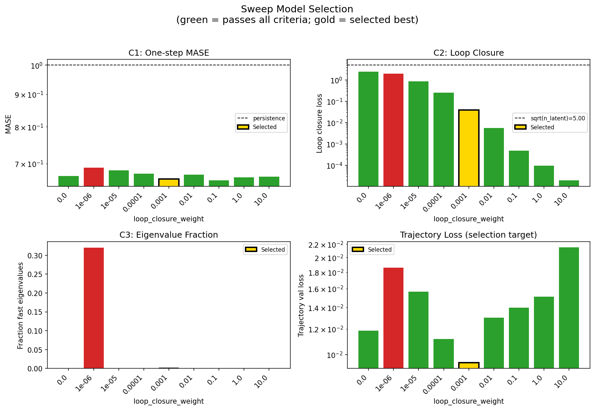

### sweep_pareto

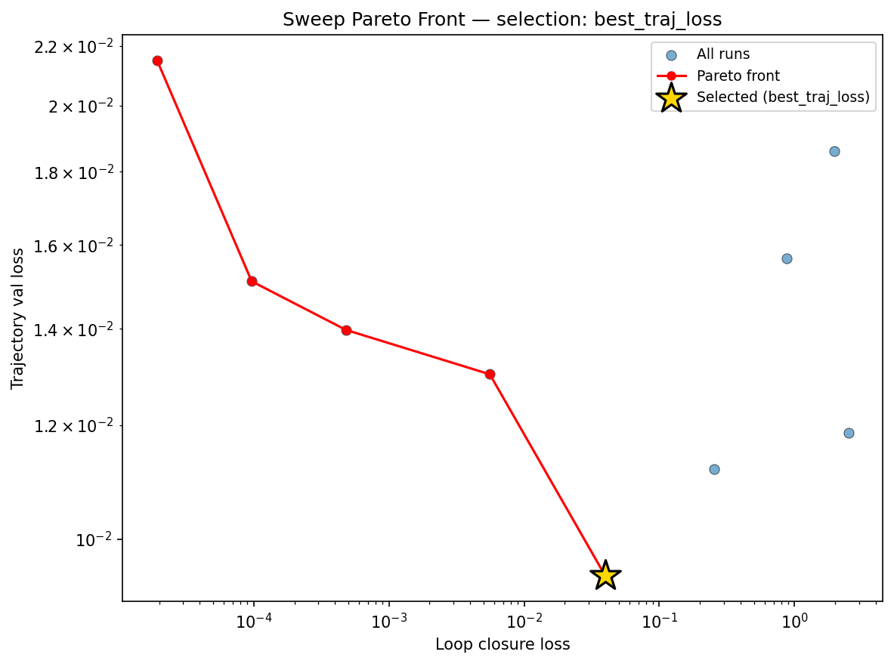

### reconstruction

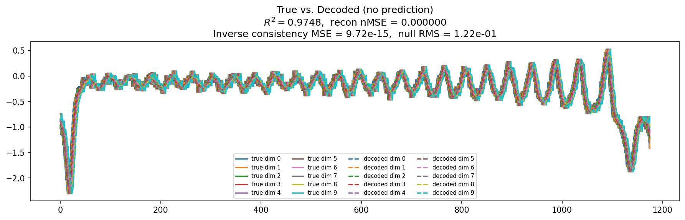

### prediction_windows

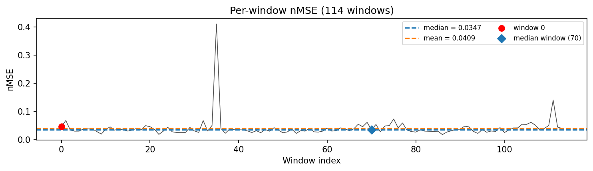

### long_trajectory

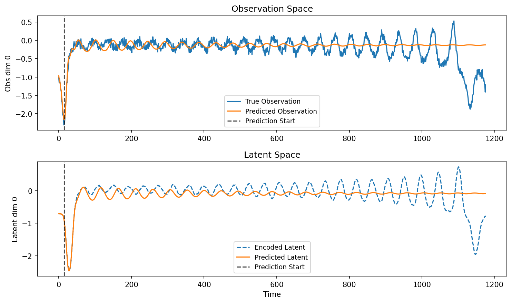

### mase

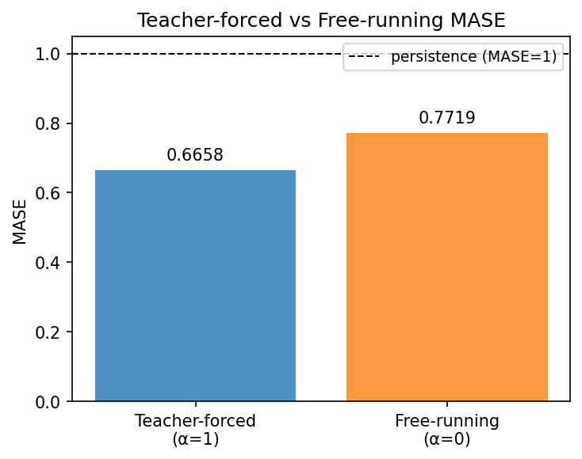

### latent_utilization

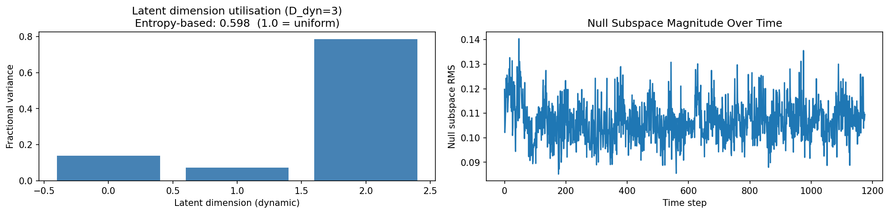

### lyapunov

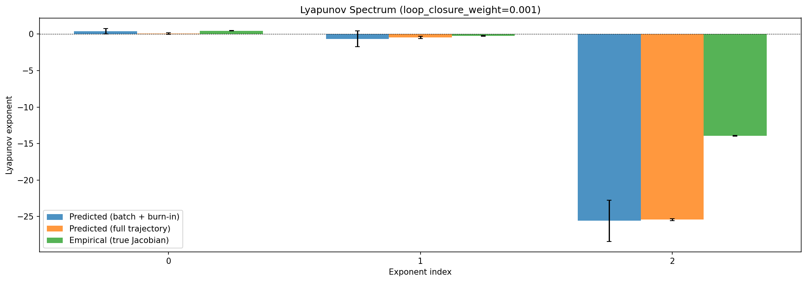

### kaplan_yorke

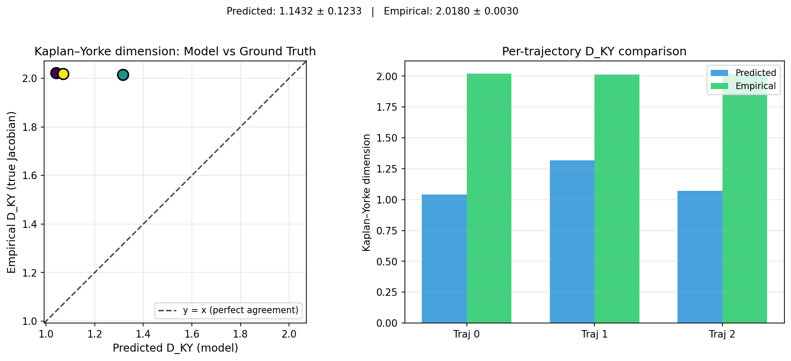

### per_run_lyapunov

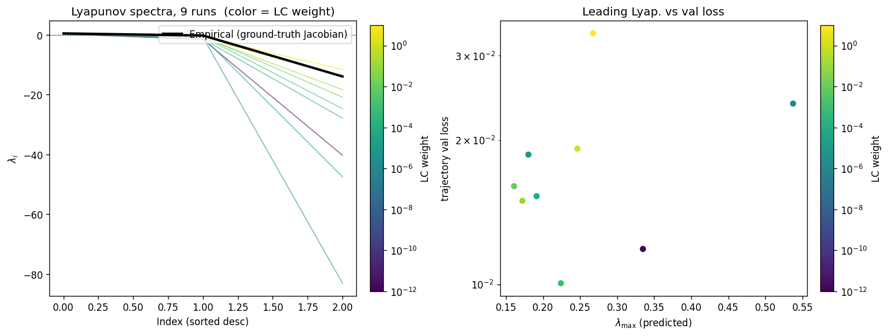

### per_run_lyapunov_vs_true

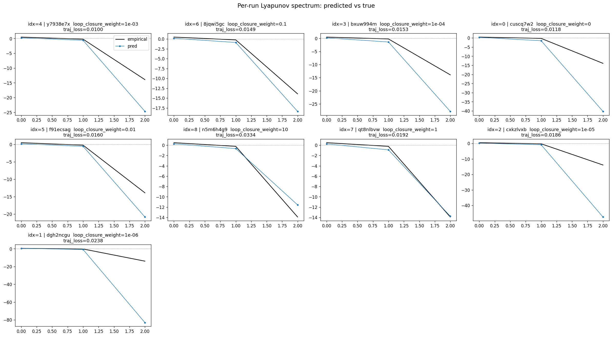

### per_run_lyapunov_relerr

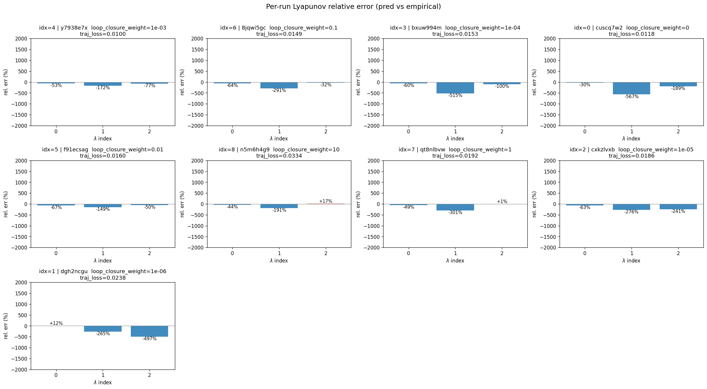

### encoder_decoder_jacobians

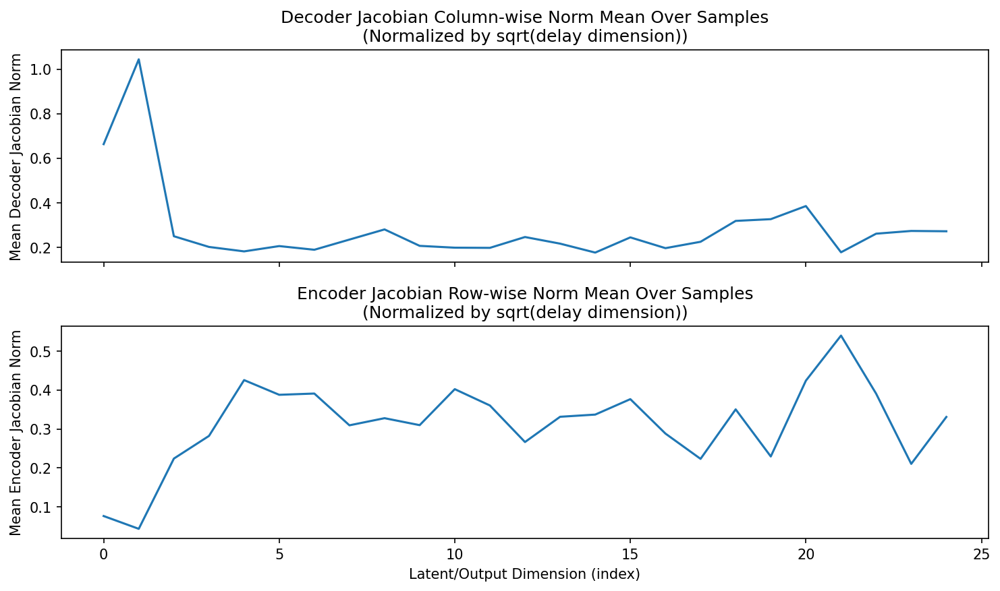

### amplification

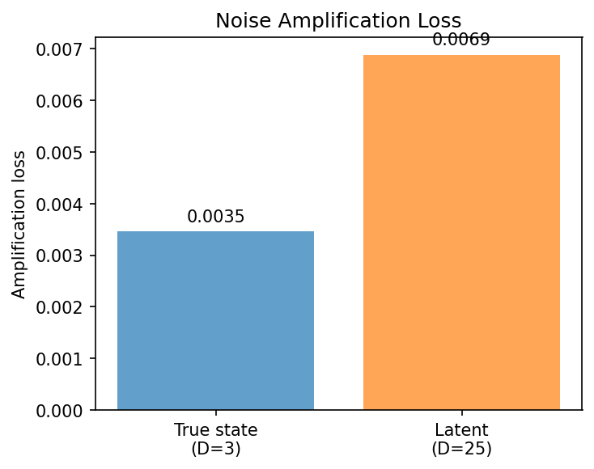

### kaplan_yorke_pca

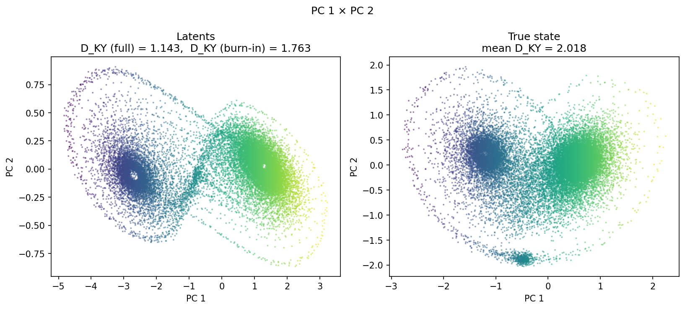

### prediction_detail_latent

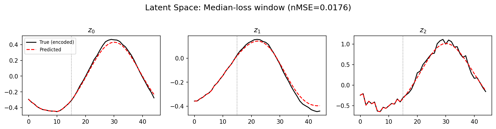

### prediction_detail_obs

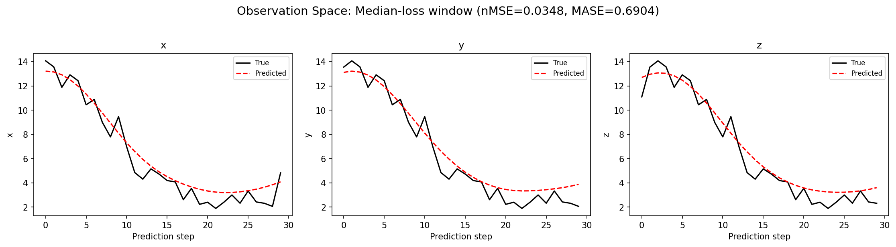

## Discussion

<!--
This section is intentionally left as a placeholder. A human reviewer
or Claude Code agent should fill it in based on the tables and figures
above, explicitly addressing each success criterion and comparing the
outcome to the stated hypothesis. Write the Discussion to
`discussion.md` in this directory and re-run `render_report`.
-->

_(to be written)_

## `run_analytics` stdout

<details><summary>Click to expand — full diagnostic output from <code>run_analytics</code></summary>

```
No run_id provided — selecting best run from group 'lorenz_partial_25d_additive_mse_uniform_p30_obsnoise005__lc_sweep' ...
Found 9 total runs in JacobianODE/Lorenz_INDpartial_N25_D1_NormTrue_T3__JacobianODE (group=lorenz_partial_25d_additive_mse_uniform_p30_obsnoise005__lc_sweep)
All runs (state, loop_closure_weight, tangent_entropy_weight, kl_dyn_weight):
  y7938e7x: state=finished, lc=0.001, te=0.0, kl_dyn=0.0
  8jqwi5gc: state=finished, lc=0.1, te=0.0, kl_dyn=0.0
  bxuw994m: state=finished, lc=0.0001, te=0.0, kl_dyn=0.0
  cuscq7w2: state=finished, lc=0.0, te=0.0, kl_dyn=0.0
  f91ecsag: state=finished, lc=0.01, te=0.0, kl_dyn=0.0
  n5m6h4g9: state=finished, lc=10.0, te=0.0, kl_dyn=0.0
  qt8nlbvw: state=finished, lc=1.0, te=0.0, kl_dyn=0.0
  cxkzlvxb: state=finished, lc=1e-05, te=0.0, kl_dyn=0.0
  dgh2ncgu: state=finished, lc=1e-06, te=0.0, kl_dyn=0.0

slurm_timeout_min not found in any run config — falling back to 180 min
  Including y7938e7x (lc=0.001): use_all_runs=True (state=finished)
  Including 8jqwi5gc (lc=0.1): use_all_runs=True (state=finished)
  Including bxuw994m (lc=0.0001): use_all_runs=True (state=finished)
  Including cuscq7w2 (lc=0.0): use_all_runs=True (state=finished)
  Including f91ecsag (lc=0.01): use_all_runs=True (state=finished)
  Including n5m6h4g9 (lc=10.0): use_all_runs=True (state=finished)
  Including qt8nlbvw (lc=1.0): use_all_runs=True (state=finished)
  Including cxkzlvxb (lc=1e-05): use_all_runs=True (state=finished)
  Including dgh2ncgu (lc=1e-06): use_all_runs=True (state=finished)
Found 9 effectively-done sweep runs:
  loop_closure_weight=0.0, tangent_entropy_weight=0.0, kl_dyn_weight=0.0 -> run_id=cuscq7w2
  loop_closure_weight=1e-06, tangent_entropy_weight=0.0, kl_dyn_weight=0.0 -> run_id=dgh2ncgu
  loop_closure_weight=1e-05, tangent_entropy_weight=0.0, kl_dyn_weight=0.0 -> run_id=cxkzlvxb
  loop_closure_weight=0.0001, tangent_entropy_weight=0.0, kl_dyn_weight=0.0 -> run_id=bxuw994m
  loop_closure_weight=0.001, tangent_entropy_weight=0.0, kl_dyn_weight=0.0 -> run_id=y7938e7x
  loop_closure_weight=0.01, tangent_entropy_weight=0.0, kl_dyn_weight=0.0 -> run_id=f91ecsag
  loop_closure_weight=0.1, tangent_entropy_weight=0.0, kl_dyn_weight=0.0 -> run_id=8jqwi5gc
  loop_closure_weight=1.0, tangent_entropy_weight=0.0, kl_dyn_weight=0.0 -> run_id=qt8nlbvw
  loop_closure_weight=10.0, tangent_entropy_weight=0.0, kl_dyn_weight=0.0 -> run_id=n5m6h4g9
n_dims=25, n_latent=25, n_dyn=3, dt=0.0150
  run=cuscq7w2: DiagnosticMetrics(one_step_mase=0.6690186858177185, loop_closure_loss=2.5000617504119873, fast_eigenvalue_fraction=0.0, trajectory_val_loss=0.011846988461911678) (from W&B history)
  run=dgh2ncgu: DiagnosticMetrics(one_step_mase=0.6897918581962585, loop_closure_loss=1.9762285947799683, fast_eigenvalue_fraction=0.3199999928474426, trajectory_val_loss=0.018603092059493065) (from W&B history)
  run=cxkzlvxb: DiagnosticMetrics(one_step_mase=0.6836985945701599, loop_closure_loss=0.8694607615470886, fast_eigenvalue_fraction=0.0, trajectory_val_loss=0.015656791627407074) (from W&B history)
  run=bxuw994m: DiagnosticMetrics(one_step_mase=0.6750456690788269, loop_closure_loss=0.2545514404773712, fast_eigenvalue_fraction=0.0, trajectory_val_loss=0.011179681867361069) (from W&B history)
  run=y7938e7x: DiagnosticMetrics(one_step_mase=0.6625606417655945, loop_closure_loss=0.03966875374317169, fast_eigenvalue_fraction=0.0, trajectory_val_loss=0.009436698630452156) (from W&B history)
  run=f91ecsag: DiagnosticMetrics(one_step_mase=0.6726009845733643, loop_closure_loss=0.005578300449997187, fast_eigenvalue_fraction=0.0, trajectory_val_loss=0.01301533356308937) (from W&B history)
  run=8jqwi5gc: DiagnosticMetrics(one_step_mase=0.6587134599685669, loop_closure_loss=0.000482161674881354, fast_eigenvalue_fraction=0.0, trajectory_val_loss=0.013971555978059769) (from W&B history)
  run=qt8nlbvw: DiagnosticMetrics(one_step_mase=0.6658934354782104, loop_closure_loss=9.67189043876715e-05, fast_eigenvalue_fraction=0.0, trajectory_val_loss=0.015100440010428429) (from W&B history)
  run=n5m6h4g9: DiagnosticMetrics(one_step_mase=0.6679693460464478, loop_closure_loss=1.9354698451934382e-05, fast_eigenvalue_fraction=0.0, trajectory_val_loss=0.021486254408955574) (from W&B history)

Ranking method:           best_traj_loss
Best run ID:              y7938e7x
Best loop_closure_weight: 0.001
Best tangent_entropy_weight: 0.0
Best kl_dyn_weight:       0.0
Best traj loss:           0.009437
Criteria applied: ['C1', 'C2', 'C3']
Surviving: 8 / 9
Auto-selected run_id: y7938e7x

======================================================================
PARETO FRONTIER RUNS (5 runs)
======================================================================
  Run ID               LC Loss   Traj Val Loss
  ------------  --------------  --------------
  n5m6h4g9            0.000019        0.021486
  qt8nlbvw            0.000097        0.015100
  8jqwi5gc            0.000482        0.013972
  f91ecsag            0.005578        0.013015
  y7938e7x            0.039669        0.009437 <-- selected

======================================================================
RANKING METHOD COMPARISON (over 8 survivors)
======================================================================
  Method                  Run ID               LC Loss   Traj Val Loss
  ----------------------  ------------  --------------  --------------
  best_traj_loss          y7938e7x            0.039669        0.009437 <-- active
  pareto_knee             f91ecsag            0.005578        0.013015
  geo_rank                y7938e7x            0.039669        0.009437
  minimax_rank            f91ecsag            0.005578        0.013015
  geo_log_score           y7938e7x            0.039669        0.009437
  minimax_log_score       8jqwi5gc            0.000482        0.013972
======================================================================

Loading run y7938e7x from JacobianODE/Lorenz_INDpartial_N25_D1_NormTrue_T3__JacobianODE ...
Train dataset shape: torch.Size([24882, 45, 25])
Validation dataset shape: torch.Size([7917, 45, 25])
Test dataset shape: torch.Size([3393, 45, 25])
Train trajectories dataset shape: torch.Size([22, 1176, 25])
Validation trajectories dataset shape: torch.Size([7, 1176, 25])
Test trajectories dataset shape: torch.Size([3, 1176, 25])
Loading checkpoint epoch=156-step=31400.ckpt...
Computing reconstruction ...
Computing MASE ...
Teacher-forced MASE: 0.6658
Free-running MASE:   0.7719
Computing latent utilization ...
Entropy-based utilization: 0.598
Null subspace mean RMS: 1.071286e-01
Computing Lyapunov exponents ...
  Computing full-trajectory Lyapunov (3 test trajs, T=1176) ...
Predicted Lyapunov exponents (batch+burn-in, 128 windowed trajs):
  λ_1 = +0.3892 ± 0.3699
  λ_2 = -0.6446 ± 1.0843
  λ_3 = -25.5664 ± 2.8187
Predicted Lyapunov exponents (full-length, 3 test trajs):
  λ_1 = +0.0736 ± 0.0896
  λ_2 = -0.4662 ± 0.1485
  λ_3 = -25.4183 ± 0.1366
Empirical Lyapunov exponents (mean ± std):
  λ_1 = +0.4677 ± 0.0259
  λ_2 = -0.2173 ± 0.0549
  λ_3 = -13.9174 ± 0.0513
Mean KY dim (predicted): 1.143 ± 0.123
Mean KY dim (empirical): 2.018 ± 0.003
Mean KY dim (burn-in):   1.763 ± 0.486
Computing prediction windows ...
Windows: 114 — nMSE min=0.0181, median=0.0347, mean=0.0409, max=0.4100
Computing long trajectory prediction ...
Computing encoder/decoder Jacobians ...
encoder_jacobian: (128, 25, 25)
decoder_jacobian: (128, 25, 25)
Computing amplification loss ...
Amplification loss — True state: 0.003459
Amplification loss — Latent:     0.006880
```

</details>
