# Sweep Analysis: `lorenz_partial_25d_additive_mse_uniform_p50_obsnoise001__lc_sweep`

**Project**: [Lorenz_INDpartial_N25_D1_NormTrue_T3__JacobianODE](https://wandb.ai/JacobianODE/Lorenz_INDpartial_N25_D1_NormTrue_T3__JacobianODE/groups/lorenz_partial_25d_additive_mse_uniform_p50_obsnoise001__lc_sweep)  
**Launched**: 2026-04-19T22:25:09Z  
**Completed**: 2026-04-20T06:45:13Z  
**Outcome**: `complete_clean`  
**Git**: `latent-JacobianODE` @ `477d6a0`  
**Expected runs**: 9

## Experiment Context

### `lorenz_partial_25d_additive_mse_uniform_p50_obsnoise001__lc_sweep`

**Description**

Lorenz partial-25 additive coupling, uniform reconstruction loss,
obs_noise=0.01, prediction_steps=50 (seq_length=65). 9-run LC
sweep. Sibling of the p10 / p30 obsnoise001 sweeps for a
prediction-horizon comparison.

**Hypothesis**

The p30 obsnoise001 sweep produced cleaner Lyapunov recovery than
the p10 obsnoise001 sweep. Testing whether pushing the rollout
horizon further (p50) continues to help, or whether returns
diminish / reverse (e.g., by making the training signal too noisy
over 50 steps or saturating GPU memory).

**Success criteria**

- Best val traj_loss finite and no worse than 1.5× the p30 obsnoise001 baseline
- λ_min at best LC negative (< -5); ideally closer to Lorenz -14.57 than p30 achieved
- No loop-closure explosion at any LC (max LC loss at best_tl < 10)

## Results

**Swept axes** (1): `training.lightning.loop_closure_weight`

**Chosen run** (by `best_traj_loss`): `sdle8h4s` — traj_loss=0.00228, MASE=0.8281, R²=0.9933, LC loss=0.306, epoch=146.0

Swept-axis values at chosen run: `training.lightning.loop_closure_weight`=1.0e-06

**Runs analyzed**: 9 (expected 9)

### Per-run results

| run_idx | run_id | `training.lightning.loop_closure_weight` | best_traj_loss | best_MASE | R² | LC loss | epoch |
|---|---|---|---|---|---|---|---|
| 1 | `sdle8h4s` | 1.0e-06 | 0.00228 | 0.8281 | 0.9933 | 0.306 | 146.0 |
| 2 | `rinyf9yt` | 1.0e-05 | 0.00295 | 0.8481 | 0.9915 | 0.052 | 148.0 |
| 3 | `esmjapp2` | 1.0e-04 | 0.00356 | 1.0462 | 0.9901 | 0.133 | 72.0 |
| 4 | `qu2ht627` | 0.001 | 0.00574 | 1.1039 | 0.9836 | 0.027 | 72.0 |
| 0 | `2yko9o74` | 0 | 0.00623 | 1.0972 | 0.9829 | 0.056 | 71.0 |
| 5 | `mrm84y0j` | 0.01 | 0.00690 | 1.2948 | 0.9809 | 0.003 | 72.0 |
| 6 | `b62aoy0x` | 0.1 | 0.01581 | 1.8515 | 0.9567 | 0.000 | 69.0 |
| 7 | `ndvi92wv` | 1 | 0.01997 | 2.3083 | 0.9451 | 0.000 | 69.0 |
| 8 | `pgnllqmq` | 10 | 0.02760 | 2.6780 | 0.9237 | 0.000 | 79.0 |

## Success-criteria verdicts (automated)

| Criterion | Verdict | Note |
|---|---|---|
| Best val traj_loss finite and no worse than 1.5× the p30 obsnoise001 baseline | **Unknown** |  |
| λ_min at best LC negative (< -5); ideally closer to Lorenz -14.57 than p30 achieved | **Unknown** |  |
| No loop-closure explosion at any LC (max LC loss at best_tl < 10) | **Unknown** |  |

_Automated verdicts use simple numeric-threshold parsing and may mis-classify qualitative criteria. The Discussion section below takes precedence._

## Figures

### sweep_overview

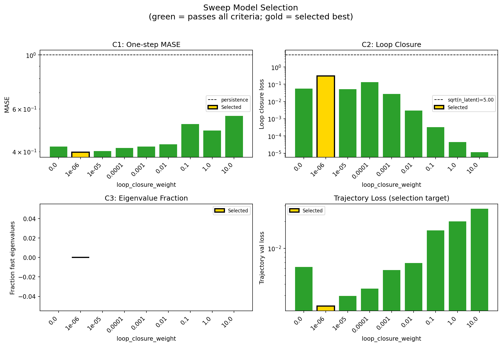

### sweep_pareto

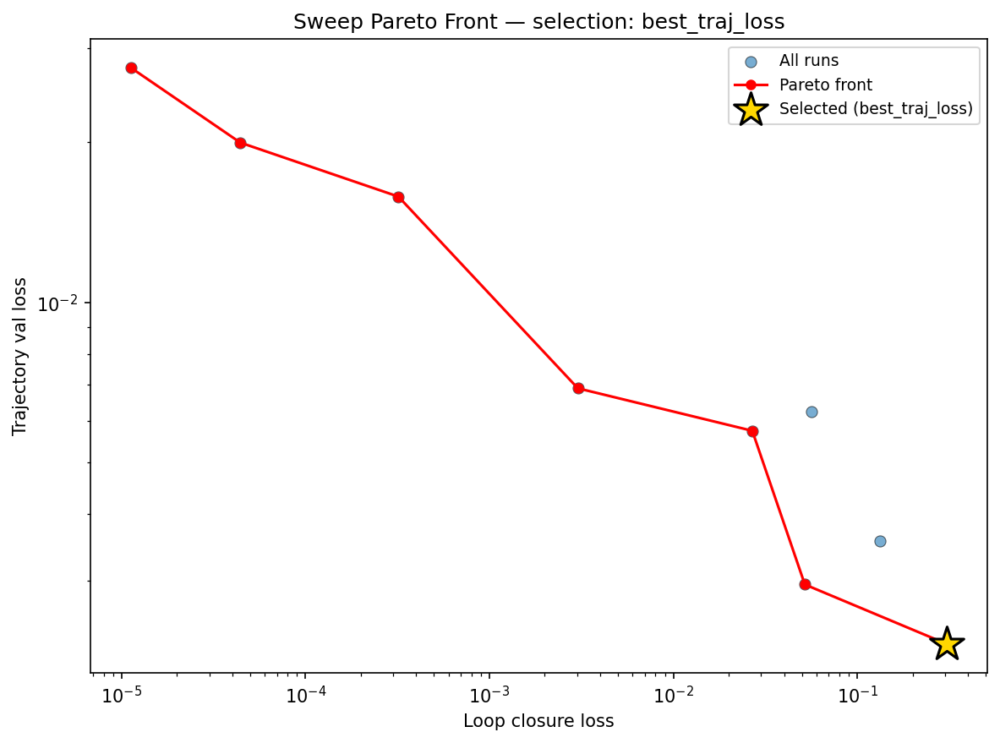

### reconstruction

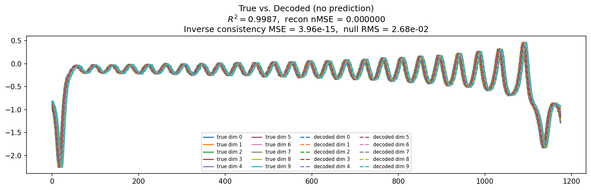

### prediction_windows

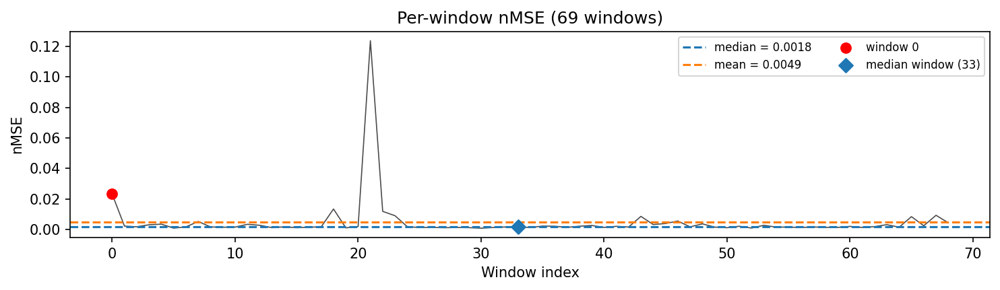

### long_trajectory

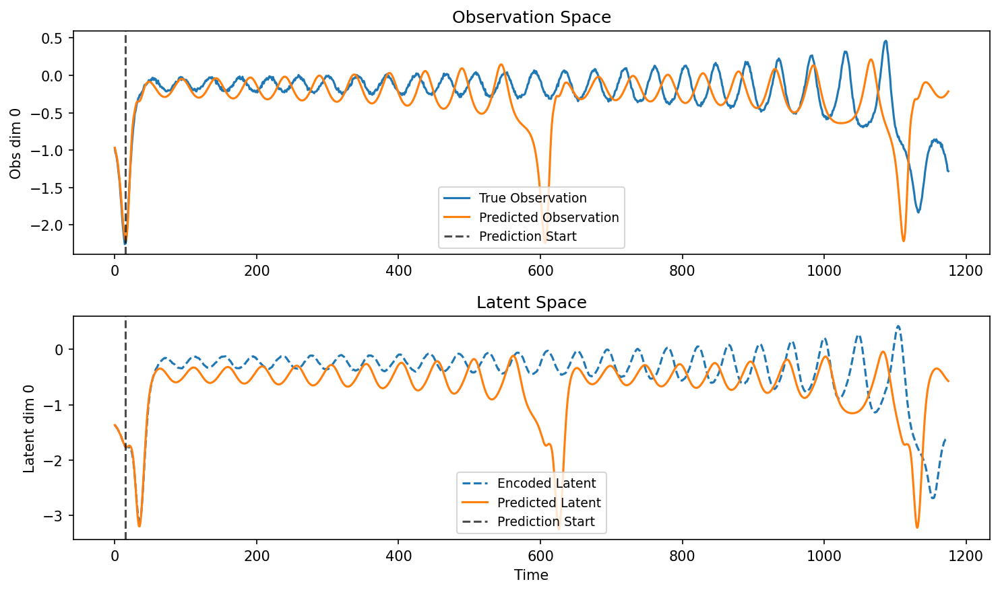

### mase

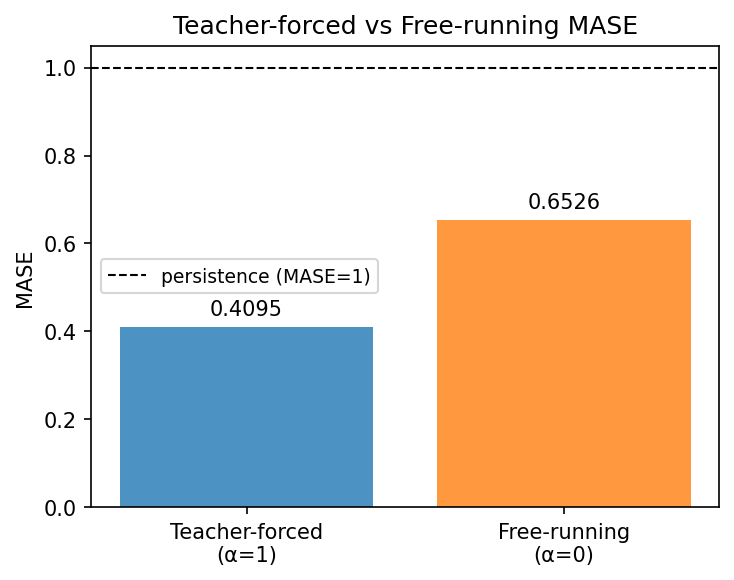

### latent_utilization

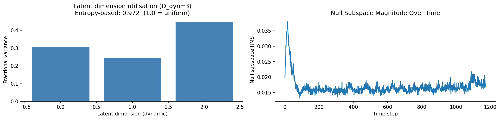

### lyapunov

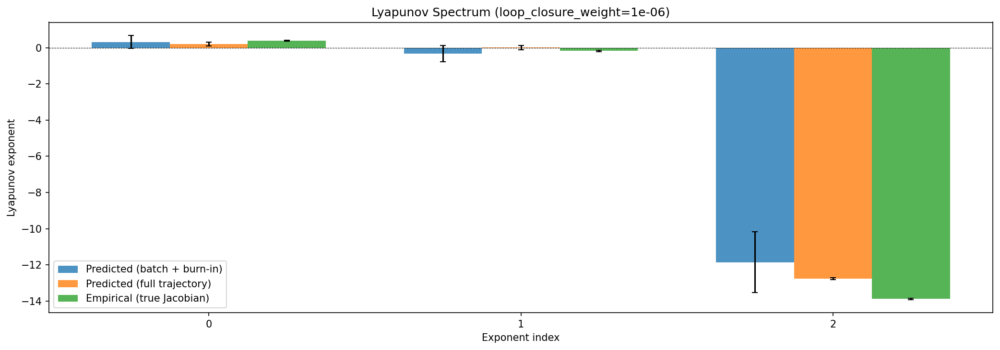

### kaplan_yorke

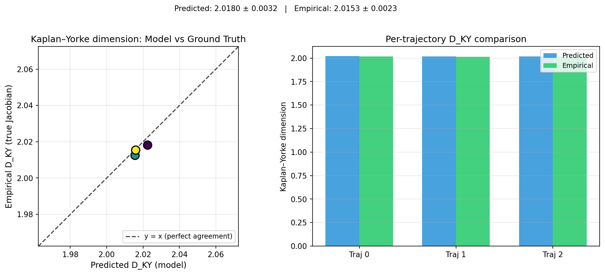

### per_run_lyapunov

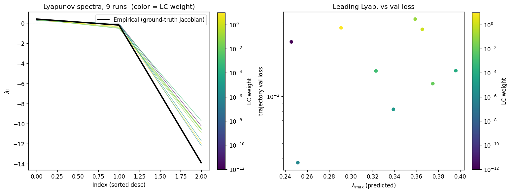

### per_run_lyapunov_vs_true

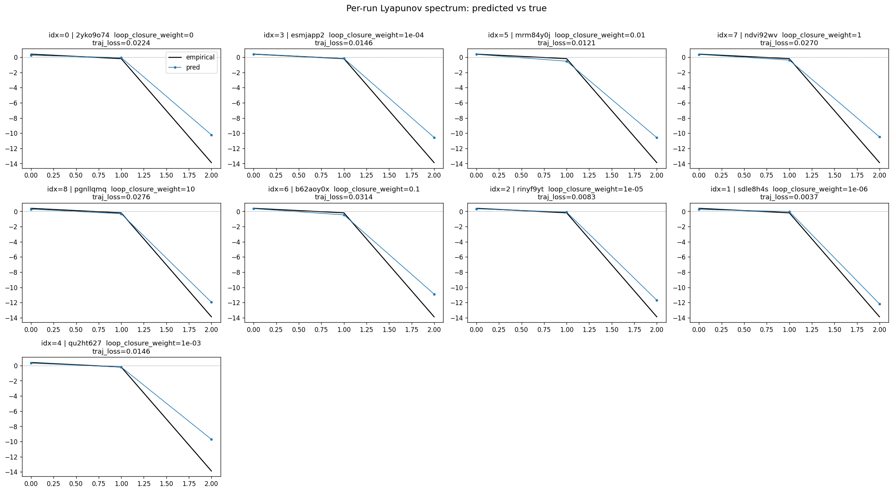

### per_run_lyapunov_relerr

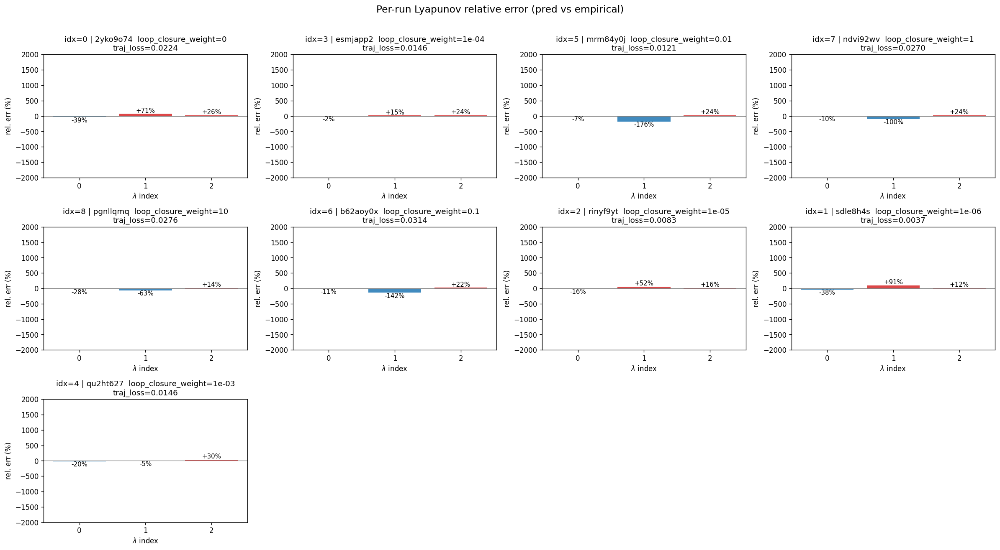

### encoder_decoder_jacobians

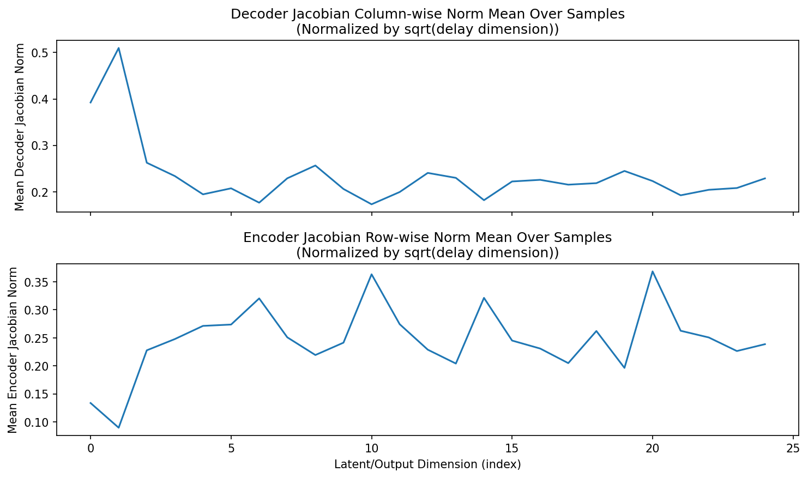

### amplification

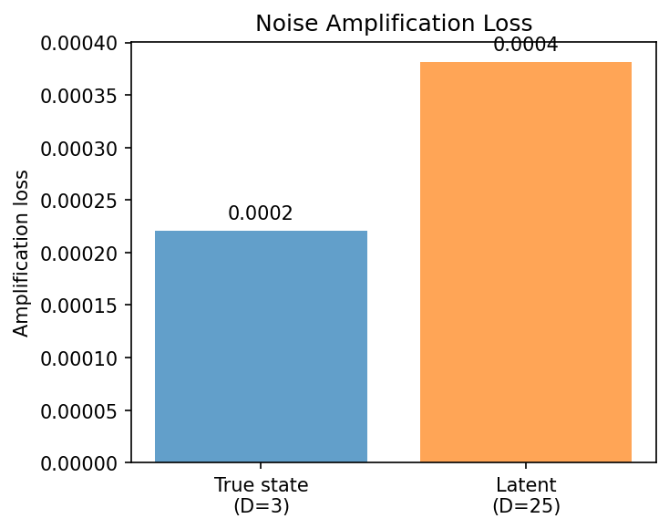

### kaplan_yorke_pca

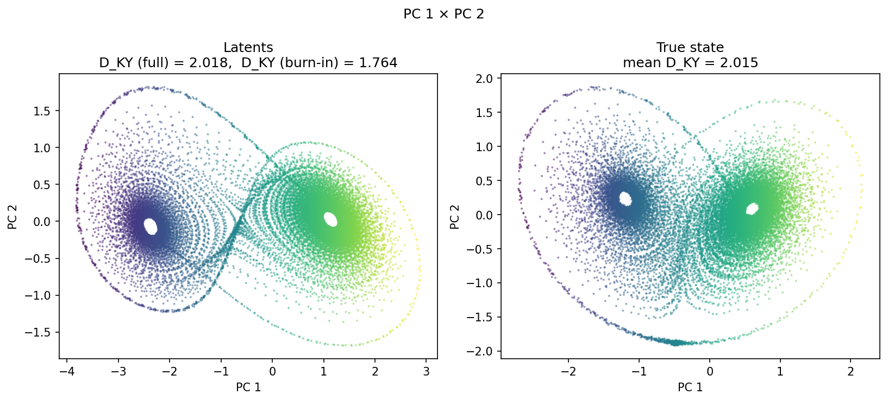

### prediction_detail_latent

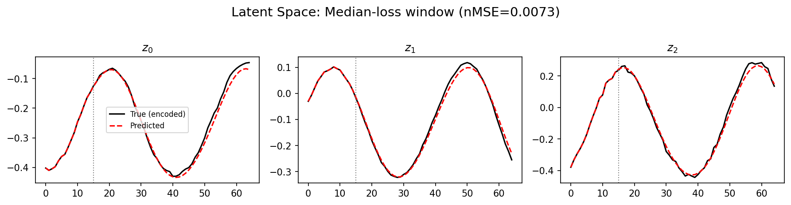

### prediction_detail_obs

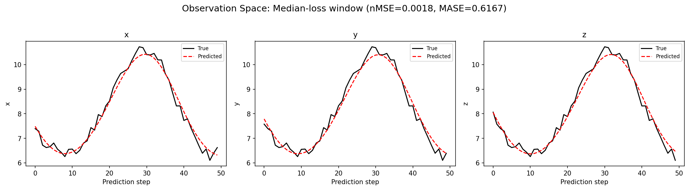

## Discussion

<!--
This section is intentionally left as a placeholder. A human reviewer
or Claude Code agent should fill it in based on the tables and figures
above, explicitly addressing each success criterion and comparing the
outcome to the stated hypothesis. Write the Discussion to
`discussion.md` in this directory and re-run `render_report`.
-->

_(to be written)_

## `run_analytics` stdout

<details><summary>Click to expand — full diagnostic output from <code>run_analytics</code></summary>

```
No run_id provided — selecting best run from group 'lorenz_partial_25d_additive_mse_uniform_p50_obsnoise001__lc_sweep' ...
Found 9 total runs in JacobianODE/Lorenz_INDpartial_N25_D1_NormTrue_T3__JacobianODE (group=lorenz_partial_25d_additive_mse_uniform_p50_obsnoise001__lc_sweep)
All runs (state, loop_closure_weight, tangent_entropy_weight, kl_dyn_weight):
  2yko9o74: state=finished, lc=0.0, te=0.0, kl_dyn=0.0
  esmjapp2: state=finished, lc=0.0001, te=0.0, kl_dyn=0.0
  mrm84y0j: state=finished, lc=0.01, te=0.0, kl_dyn=0.0
  ndvi92wv: state=finished, lc=1.0, te=0.0, kl_dyn=0.0
  pgnllqmq: state=finished, lc=10.0, te=0.0, kl_dyn=0.0
  b62aoy0x: state=finished, lc=0.1, te=0.0, kl_dyn=0.0
  rinyf9yt: state=finished, lc=1e-05, te=0.0, kl_dyn=0.0
  sdle8h4s: state=finished, lc=1e-06, te=0.0, kl_dyn=0.0
  qu2ht627: state=finished, lc=0.001, te=0.0, kl_dyn=0.0

slurm_timeout_min not found in any run config — falling back to 180 min
  Including 2yko9o74 (lc=0.0): use_all_runs=True (state=finished)
  Including esmjapp2 (lc=0.0001): use_all_runs=True (state=finished)
  Including mrm84y0j (lc=0.01): use_all_runs=True (state=finished)
  Including ndvi92wv (lc=1.0): use_all_runs=True (state=finished)
  Including pgnllqmq (lc=10.0): use_all_runs=True (state=finished)
  Including b62aoy0x (lc=0.1): use_all_runs=True (state=finished)
  Including rinyf9yt (lc=1e-05): use_all_runs=True (state=finished)
  Including sdle8h4s (lc=1e-06): use_all_runs=True (state=finished)
  Including qu2ht627 (lc=0.001): use_all_runs=True (state=finished)
Found 9 effectively-done sweep runs:
  loop_closure_weight=0.0, tangent_entropy_weight=0.0, kl_dyn_weight=0.0 -> run_id=2yko9o74
  loop_closure_weight=1e-06, tangent_entropy_weight=0.0, kl_dyn_weight=0.0 -> run_id=sdle8h4s
  loop_closure_weight=1e-05, tangent_entropy_weight=0.0, kl_dyn_weight=0.0 -> run_id=rinyf9yt
  loop_closure_weight=0.0001, tangent_entropy_weight=0.0, kl_dyn_weight=0.0 -> run_id=esmjapp2
  loop_closure_weight=0.001, tangent_entropy_weight=0.0, kl_dyn_weight=0.0 -> run_id=qu2ht627
  loop_closure_weight=0.01, tangent_entropy_weight=0.0, kl_dyn_weight=0.0 -> run_id=mrm84y0j
  loop_closure_weight=0.1, tangent_entropy_weight=0.0, kl_dyn_weight=0.0 -> run_id=b62aoy0x
  loop_closure_weight=1.0, tangent_entropy_weight=0.0, kl_dyn_weight=0.0 -> run_id=ndvi92wv
  loop_closure_weight=10.0, tangent_entropy_weight=0.0, kl_dyn_weight=0.0 -> run_id=pgnllqmq
n_dims=25, n_latent=25, n_dyn=3, dt=0.0150
  run=2yko9o74: DiagnosticMetrics(one_step_mase=0.41966408491134644, loop_closure_loss=0.056269191205501556, fast_eigenvalue_fraction=0.0, trajectory_val_loss=0.0062315575778484344) (from W&B history)
  run=sdle8h4s: DiagnosticMetrics(one_step_mase=0.39701828360557556, loop_closure_loss=0.3059949576854706, fast_eigenvalue_fraction=0.0, trajectory_val_loss=0.002283151261508465) (from W&B history)
  run=rinyf9yt: DiagnosticMetrics(one_step_mase=0.40121379494667053, loop_closure_loss=0.05184609815478325, fast_eigenvalue_fraction=0.0, trajectory_val_loss=0.00295262667350471) (from W&B history)
  run=esmjapp2: DiagnosticMetrics(one_step_mase=0.4133065938949585, loop_closure_loss=0.1331740915775299, fast_eigenvalue_fraction=0.0, trajectory_val_loss=0.003561542835086584) (from W&B history)
  run=qu2ht627: DiagnosticMetrics(one_step_mase=0.41893425583839417, loop_closure_loss=0.02685912884771824, fast_eigenvalue_fraction=0.0, trajectory_val_loss=0.005741240922361612) (from W&B history)
  run=mrm84y0j: DiagnosticMetrics(one_step_mase=0.42870235443115234, loop_closure_loss=0.0030276314355432987, fast_eigenvalue_fraction=0.0, trajectory_val_loss=0.006899154279381037) (from W&B history)
  run=b62aoy0x: DiagnosticMetrics(one_step_mase=0.5188819766044617, loop_closure_loss=0.0003201020008418709, fast_eigenvalue_fraction=0.0, trajectory_val_loss=0.01581365056335926) (from W&B history)
  run=ndvi92wv: DiagnosticMetrics(one_step_mase=0.48773711919784546, loop_closure_loss=4.427452222444117e-05, fast_eigenvalue_fraction=0.0, trajectory_val_loss=0.0199715755879879) (from W&B history)
  run=pgnllqmq: DiagnosticMetrics(one_step_mase=0.5603161454200745, loop_closure_loss=1.128054009313928e-05, fast_eigenvalue_fraction=0.0, trajectory_val_loss=0.027598319575190544) (from W&B history)

Ranking method:           best_traj_loss
Best run ID:              sdle8h4s
Best loop_closure_weight: 1e-06
Best tangent_entropy_weight: 0.0
Best kl_dyn_weight:       0.0
Best traj loss:           0.002283
Criteria applied: ['C1', 'C2', 'C3']
Surviving: 9 / 9
Auto-selected run_id: sdle8h4s

======================================================================
PARETO FRONTIER RUNS (7 runs)
======================================================================
  Run ID               LC Loss   Traj Val Loss
  ------------  --------------  --------------
  pgnllqmq            0.000011        0.027598
  ndvi92wv            0.000044        0.019972
  b62aoy0x            0.000320        0.015814
  mrm84y0j            0.003028        0.006899
  qu2ht627            0.026859        0.005741
  rinyf9yt            0.051846        0.002953
  sdle8h4s            0.305995        0.002283 <-- selected

======================================================================
RANKING METHOD COMPARISON (over 9 survivors)
======================================================================
  Method                  Run ID               LC Loss   Traj Val Loss
  ----------------------  ------------  --------------  --------------
  best_traj_loss          sdle8h4s            0.305995        0.002283 <-- active
  pareto_knee             qu2ht627            0.026859        0.005741
  geo_rank                sdle8h4s            0.305995        0.002283
  minimax_rank            qu2ht627            0.026859        0.005741
  geo_log_score           sdle8h4s            0.305995        0.002283
  minimax_log_score       mrm84y0j            0.003028        0.006899
======================================================================

Loading run sdle8h4s from JacobianODE/Lorenz_INDpartial_N25_D1_NormTrue_T3__JacobianODE ...
Train dataset shape: torch.Size([24442, 65, 25])
Validation dataset shape: torch.Size([7777, 65, 25])
Test dataset shape: torch.Size([3333, 65, 25])
Train trajectories dataset shape: torch.Size([22, 1176, 25])
Validation trajectories dataset shape: torch.Size([7, 1176, 25])
Test trajectories dataset shape: torch.Size([3, 1176, 25])
Loading checkpoint epoch=146-step=29400.ckpt...
Computing reconstruction ...
Computing MASE ...
Teacher-forced MASE: 0.4095
Free-running MASE:   0.6526
Computing latent utilization ...
Entropy-based utilization: 0.972
Null subspace mean RMS: 1.707343e-02
Computing Lyapunov exponents ...
  Computing full-trajectory Lyapunov (3 test trajs, T=1176) ...
Predicted Lyapunov exponents (batch+burn-in, 128 windowed trajs):
  λ_1 = +0.3283 ± 0.3558
  λ_2 = -0.3236 ± 0.4538
  λ_3 = -11.8612 ± 1.6829
Predicted Lyapunov exponents (full-length, 3 test trajs):
  λ_1 = +0.2158 ± 0.1104
  λ_2 = +0.0143 ± 0.1256
  λ_3 = -12.7700 ± 0.0432
Empirical Lyapunov exponents (mean ± std):
  λ_1 = +0.3846 ± 0.0251
  λ_2 = -0.1716 ± 0.0444
  λ_3 = -13.8799 ± 0.0398
Mean KY dim (predicted): 2.018 ± 0.003
Mean KY dim (empirical): 2.015 ± 0.002
Mean KY dim (burn-in):   1.764 ± 0.435
Computing prediction windows ...
Windows: 69 — nMSE min=0.0009, median=0.0018, mean=0.0049, max=0.1237
Computing long trajectory prediction ...
Computing encoder/decoder Jacobians ...
encoder_jacobian: (128, 25, 25)
decoder_jacobian: (128, 25, 25)
Computing amplification loss ...
Amplification loss — True state: 0.000221
Amplification loss — Latent:     0.000382
```

</details>
