# Sweep Analysis: `lorenz_partial_25d_additive_mse_uniform_p50_obsnoise005__lc_sweep`

**Project**: [Lorenz_INDpartial_N25_D1_NormTrue_T3__JacobianODE](https://wandb.ai/JacobianODE/Lorenz_INDpartial_N25_D1_NormTrue_T3__JacobianODE/groups/lorenz_partial_25d_additive_mse_uniform_p50_obsnoise005__lc_sweep)  
**Launched**: 2026-04-19T22:25:33Z  
**Completed**: 2026-04-20T06:30:16Z  
**Outcome**: `complete_clean`  
**Git**: `latent-JacobianODE` @ `477d6a0`  
**Expected runs**: 9

## Experiment Context

### `lorenz_partial_25d_additive_mse_uniform_p50_obsnoise005__lc_sweep`

**Description**

Lorenz partial-25 additive coupling, uniform reconstruction loss,
obs_noise=0.05, prediction_steps=50 (seq_length=65). 9-run LC
sweep. Sibling of the p10 / p30 obsnoise005 sweeps for a
prediction-horizon comparison at the harder noise level.

**Hypothesis**

The p30 obsnoise005 sweep overestimated |λ_min| (obs-space spectrum
for run y7938e7x hit -24.6 vs Lorenz -14.57, though λ1 ~= +1.03 vs
+0.91 was reasonable). p50 may either (a) help further by giving
the rollout more chances to see off-attractor contraction, or
(b) make the 25-delay embedding even less favourable by accumulating
more observation noise over each 50-step rollout. The companion
n_delays sweep at obs_noise=0.05 tests the other side of the same
question (whether more delays — not longer rollouts — is the lever).

**Success criteria**

- Best val traj_loss finite and within ~5× of the p30 obsnoise005 baseline
- λ_min at best LC closer to -14.57 than p30 achieved (currently ~-24.6 at y7938e7x)
- No loop-closure explosion (max LC loss at best_tl < 10)

## Results

**Swept axes** (1): `training.lightning.loop_closure_weight`

**Chosen run** (by `best_traj_loss`): `hjklti5a` — traj_loss=0.01703, MASE=1.0248, R²=0.9539, LC loss=0.124, epoch=102.0

Swept-axis values at chosen run: `training.lightning.loop_closure_weight`=1.0e-04

**Runs analyzed**: 9 (expected 9)

### Per-run results

| run_idx | run_id | `training.lightning.loop_closure_weight` | best_traj_loss | best_MASE | R² | LC loss | epoch |
|---|---|---|---|---|---|---|---|
| 3 | `hjklti5a` | 1.0e-04 | 0.01703 | 1.0248 | 0.9539 | 0.124 | 102.0 |
| 1 | `vk4vbhca` | 1.0e-06 | 0.01830 | 1.0393 | 0.9498 | 0.439 | 113.0 |
| 2 | `kp6412b4` | 1.0e-05 | 0.01860 | 1.0335 | 0.9494 | 0.297 | 95.0 |
| 0 | `pkbe7md6` | 0 | 0.01942 | 1.0606 | 0.9479 | 0.649 | 77.0 |
| 5 | `43tbffy8` | 0.01 | 0.02256 | 1.1422 | 0.9383 | 0.004 | 159.0 |
| 4 | `znnf3h0u` | 0.001 | 0.02359 | 1.1615 | 0.9364 | 0.017 | 134.0 |
| 6 | `2fetlgun` | 0.1 | 0.03200 | 1.2628 | 0.9127 | 0.000 | 96.0 |
| 7 | `4u7pc8ba` | 1 | 0.05489 | 1.6302 | 0.8502 | 0.000 | 30.0 |
| 8 | `ubbybv4p` | 10 | 0.06665 | 1.9212 | 0.8175 | 0.000 | 47.0 |

## Success-criteria verdicts (automated)

| Criterion | Verdict | Note |
|---|---|---|
| Best val traj_loss finite and within ~5× of the p30 obsnoise005 baseline | **Unknown** |  |
| λ_min at best LC closer to -14.57 than p30 achieved (currently ~-24.6 at y7938e7x) | **Unknown** |  |
| No loop-closure explosion (max LC loss at best_tl < 10) | **Unknown** |  |

_Automated verdicts use simple numeric-threshold parsing and may mis-classify qualitative criteria. The Discussion section below takes precedence._

## Figures

### sweep_overview

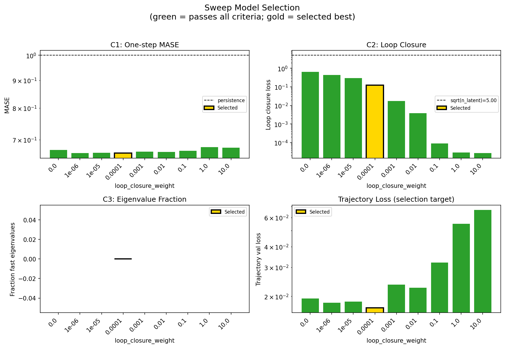

### sweep_pareto

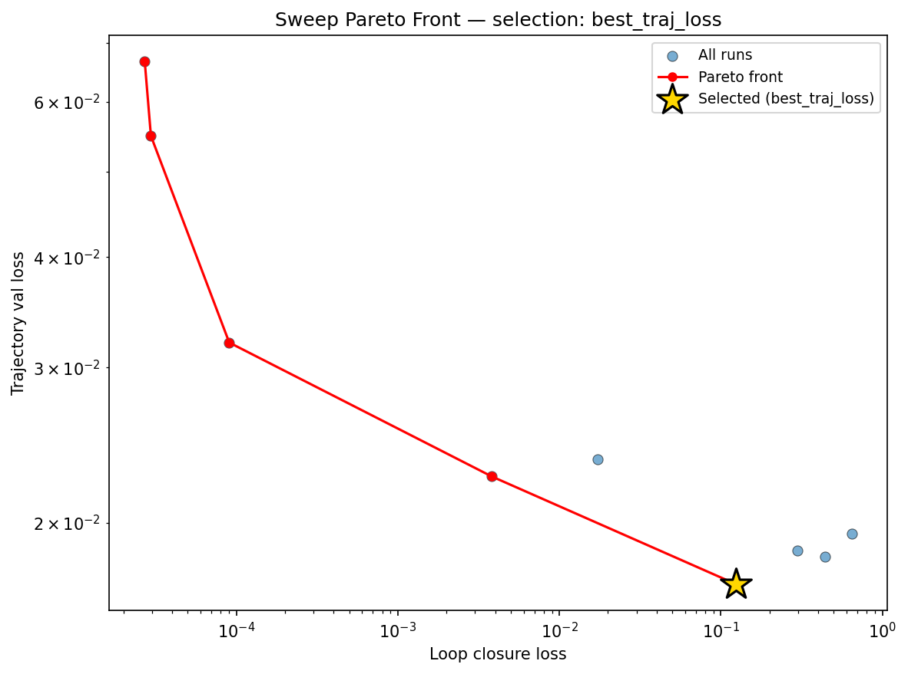

### reconstruction

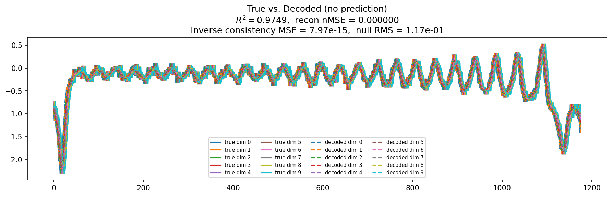

### prediction_windows

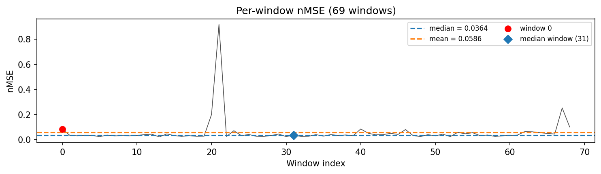

### long_trajectory

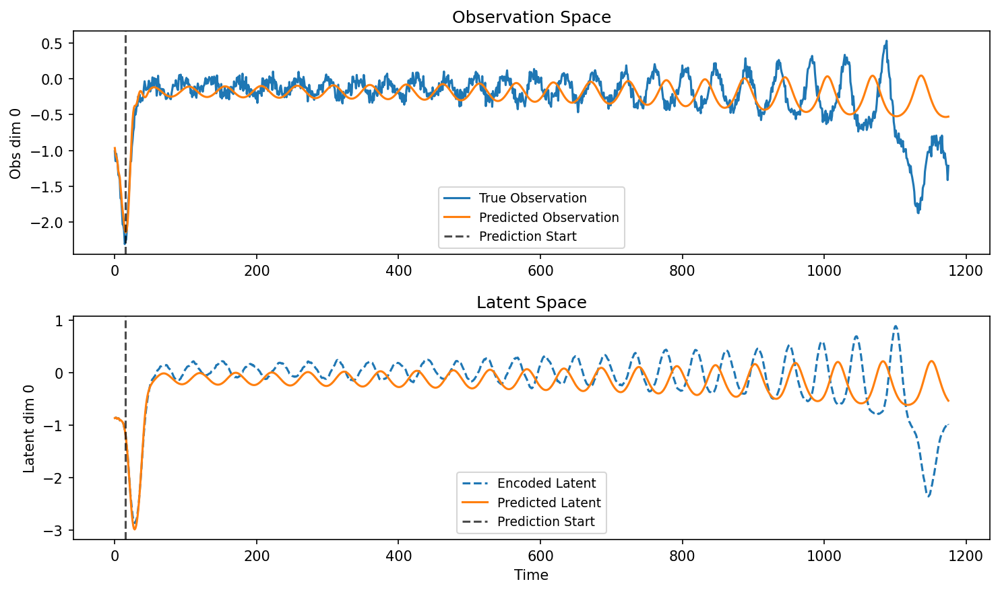

### mase

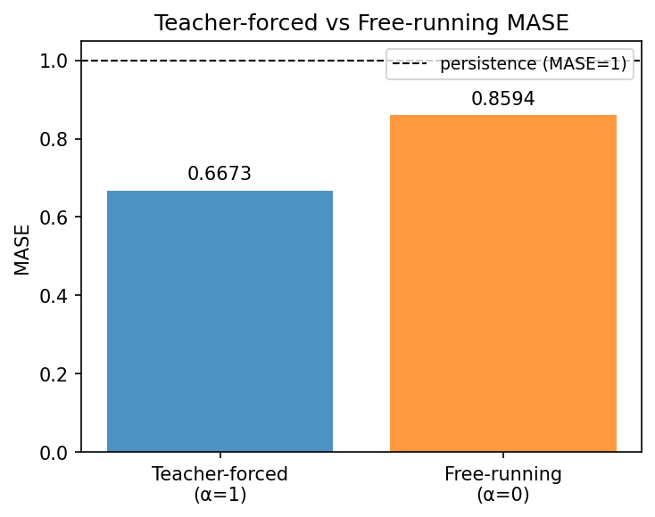

### latent_utilization

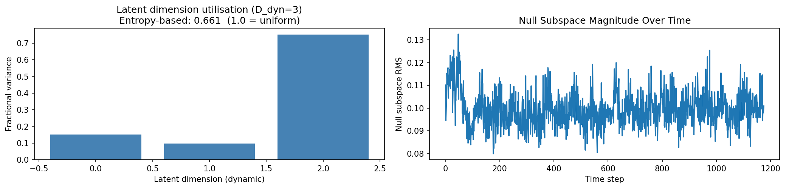

### lyapunov

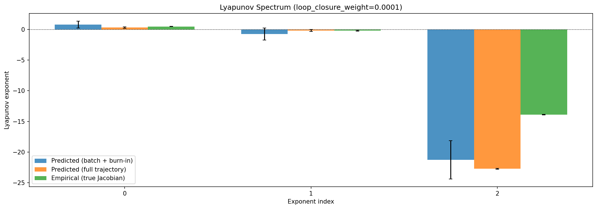

### kaplan_yorke

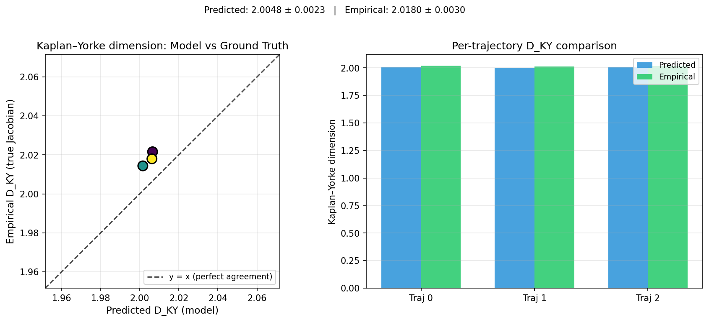

### per_run_lyapunov

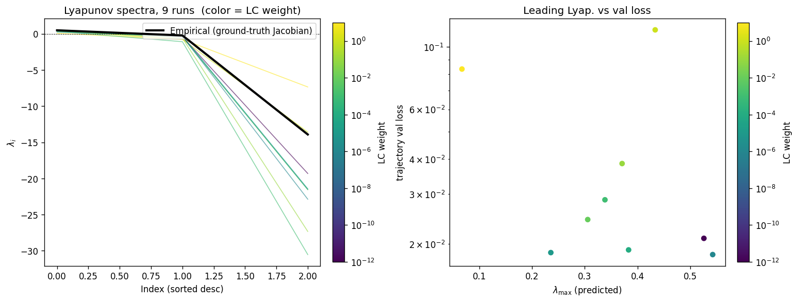

### per_run_lyapunov_vs_true

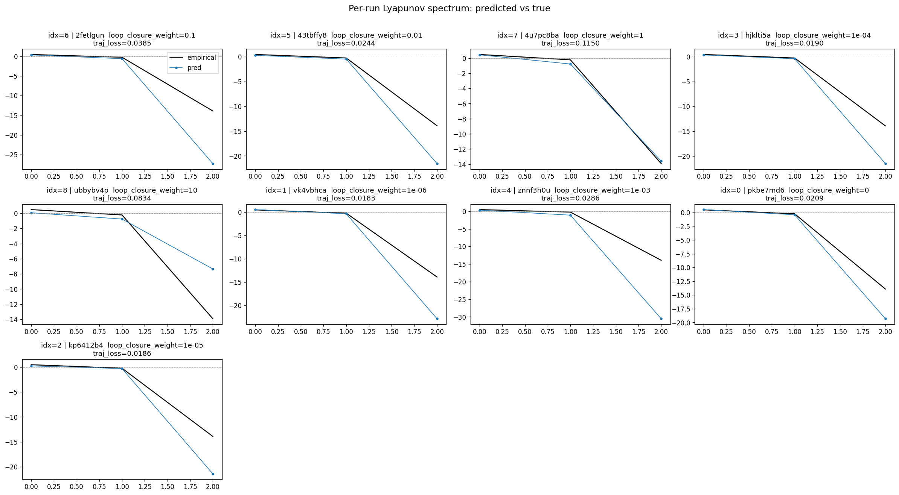

### per_run_lyapunov_relerr

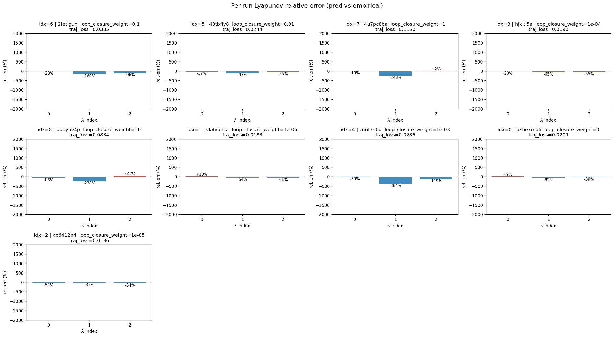

### encoder_decoder_jacobians

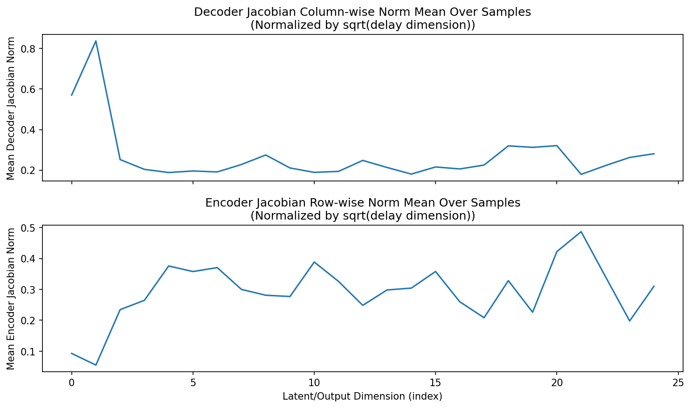

### amplification

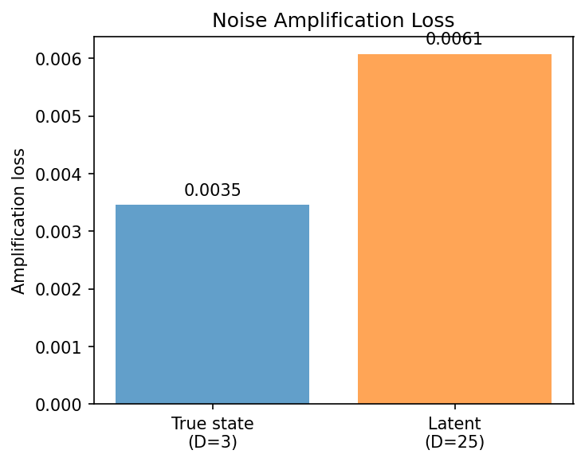

### kaplan_yorke_pca

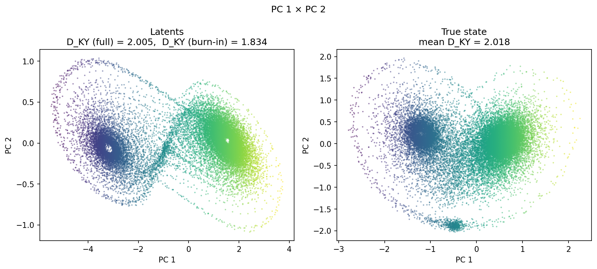

### prediction_detail_latent

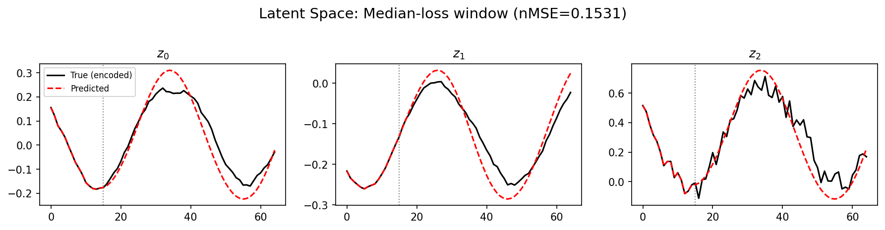

### prediction_detail_obs

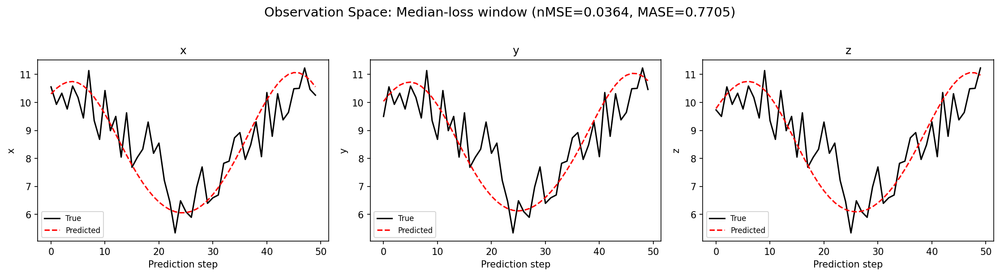

## Discussion

<!--
This section is intentionally left as a placeholder. A human reviewer
or Claude Code agent should fill it in based on the tables and figures
above, explicitly addressing each success criterion and comparing the
outcome to the stated hypothesis. Write the Discussion to
`discussion.md` in this directory and re-run `render_report`.
-->

_(to be written)_

## `run_analytics` stdout

<details><summary>Click to expand — full diagnostic output from <code>run_analytics</code></summary>

```
No run_id provided — selecting best run from group 'lorenz_partial_25d_additive_mse_uniform_p50_obsnoise005__lc_sweep' ...
Found 9 total runs in JacobianODE/Lorenz_INDpartial_N25_D1_NormTrue_T3__JacobianODE (group=lorenz_partial_25d_additive_mse_uniform_p50_obsnoise005__lc_sweep)
All runs (state, loop_closure_weight, tangent_entropy_weight, kl_dyn_weight):
  2fetlgun: state=finished, lc=0.1, te=0.0, kl_dyn=0.0
  43tbffy8: state=finished, lc=0.01, te=0.0, kl_dyn=0.0
  4u7pc8ba: state=finished, lc=1.0, te=0.0, kl_dyn=0.0
  hjklti5a: state=finished, lc=0.0001, te=0.0, kl_dyn=0.0
  ubbybv4p: state=finished, lc=10.0, te=0.0, kl_dyn=0.0
  vk4vbhca: state=finished, lc=1e-06, te=0.0, kl_dyn=0.0
  znnf3h0u: state=finished, lc=0.001, te=0.0, kl_dyn=0.0
  pkbe7md6: state=finished, lc=0.0, te=0.0, kl_dyn=0.0
  kp6412b4: state=finished, lc=1e-05, te=0.0, kl_dyn=0.0

slurm_timeout_min not found in any run config — falling back to 180 min
  Including 2fetlgun (lc=0.1): use_all_runs=True (state=finished)
  Including 43tbffy8 (lc=0.01): use_all_runs=True (state=finished)
  Including 4u7pc8ba (lc=1.0): use_all_runs=True (state=finished)
  Including hjklti5a (lc=0.0001): use_all_runs=True (state=finished)
  Including ubbybv4p (lc=10.0): use_all_runs=True (state=finished)
  Including vk4vbhca (lc=1e-06): use_all_runs=True (state=finished)
  Including znnf3h0u (lc=0.001): use_all_runs=True (state=finished)
  Including pkbe7md6 (lc=0.0): use_all_runs=True (state=finished)
  Including kp6412b4 (lc=1e-05): use_all_runs=True (state=finished)
Found 9 effectively-done sweep runs:
  loop_closure_weight=0.0, tangent_entropy_weight=0.0, kl_dyn_weight=0.0 -> run_id=pkbe7md6
  loop_closure_weight=1e-06, tangent_entropy_weight=0.0, kl_dyn_weight=0.0 -> run_id=vk4vbhca
  loop_closure_weight=1e-05, tangent_entropy_weight=0.0, kl_dyn_weight=0.0 -> run_id=kp6412b4
  loop_closure_weight=0.0001, tangent_entropy_weight=0.0, kl_dyn_weight=0.0 -> run_id=hjklti5a
  loop_closure_weight=0.001, tangent_entropy_weight=0.0, kl_dyn_weight=0.0 -> run_id=znnf3h0u
  loop_closure_weight=0.01, tangent_entropy_weight=0.0, kl_dyn_weight=0.0 -> run_id=43tbffy8
  loop_closure_weight=0.1, tangent_entropy_weight=0.0, kl_dyn_weight=0.0 -> run_id=2fetlgun
  loop_closure_weight=1.0, tangent_entropy_weight=0.0, kl_dyn_weight=0.0 -> run_id=4u7pc8ba
  loop_closure_weight=10.0, tangent_entropy_weight=0.0, kl_dyn_weight=0.0 -> run_id=ubbybv4p
n_dims=25, n_latent=25, n_dyn=3, dt=0.0150
  run=pkbe7md6: DiagnosticMetrics(one_step_mase=0.67001873254776, loop_closure_loss=0.6491894721984863, fast_eigenvalue_fraction=0.0, trajectory_val_loss=0.01941641978919506) (from W&B history)
  run=vk4vbhca: DiagnosticMetrics(one_step_mase=0.6612750887870789, loop_closure_loss=0.43891623616218567, fast_eigenvalue_fraction=0.0, trajectory_val_loss=0.018302256241440773) (from W&B history)
  run=kp6412b4: DiagnosticMetrics(one_step_mase=0.6620973944664001, loop_closure_loss=0.296695739030838, fast_eigenvalue_fraction=0.0, trajectory_val_loss=0.01860118843615055) (from W&B history)
  run=hjklti5a: DiagnosticMetrics(one_step_mase=0.6617680191993713, loop_closure_loss=0.12390018254518509, fast_eigenvalue_fraction=0.0, trajectory_val_loss=0.017032260075211525) (from W&B history)
  run=znnf3h0u: DiagnosticMetrics(one_step_mase=0.6654314994812012, loop_closure_loss=0.017304345965385437, fast_eigenvalue_fraction=0.0, trajectory_val_loss=0.023588651791214943) (from W&B history)
  run=43tbffy8: DiagnosticMetrics(one_step_mase=0.6650176048278809, loop_closure_loss=0.0038200928829610348, fast_eigenvalue_fraction=0.0, trajectory_val_loss=0.022557280957698822) (from W&B history)
  run=2fetlgun: DiagnosticMetrics(one_step_mase=0.6681577563285828, loop_closure_loss=9.042214514920488e-05, fast_eigenvalue_fraction=0.0, trajectory_val_loss=0.03200012817978859) (from W&B history)
  run=4u7pc8ba: DiagnosticMetrics(one_step_mase=0.6780920624732971, loop_closure_loss=2.9607088436023332e-05, fast_eigenvalue_fraction=0.0, trajectory_val_loss=0.054885026067495346) (from W&B history)
  run=ubbybv4p: DiagnosticMetrics(one_step_mase=0.6769421100616455, loop_closure_loss=2.7110832888865843e-05, fast_eigenvalue_fraction=0.0, trajectory_val_loss=0.06664606928825378) (from W&B history)

Ranking method:           best_traj_loss
Best run ID:              hjklti5a
Best loop_closure_weight: 0.0001
Best tangent_entropy_weight: 0.0
Best kl_dyn_weight:       0.0
Best traj loss:           0.017032
Criteria applied: ['C1', 'C2', 'C3']
Surviving: 9 / 9
Auto-selected run_id: hjklti5a

======================================================================
PARETO FRONTIER RUNS (5 runs)
======================================================================
  Run ID               LC Loss   Traj Val Loss
  ------------  --------------  --------------
  ubbybv4p            0.000027        0.066646
  4u7pc8ba            0.000030        0.054885
  2fetlgun            0.000090        0.032000
  43tbffy8            0.003820        0.022557
  hjklti5a            0.123900        0.017032 <-- selected

======================================================================
RANKING METHOD COMPARISON (over 9 survivors)
======================================================================
  Method                  Run ID               LC Loss   Traj Val Loss
  ----------------------  ------------  --------------  --------------
  best_traj_loss          hjklti5a            0.123900        0.017032 <-- active
  pareto_knee             2fetlgun            0.000090        0.032000
  geo_rank                hjklti5a            0.123900        0.017032
  minimax_rank            43tbffy8            0.003820        0.022557
  geo_log_score           hjklti5a            0.123900        0.017032
  minimax_log_score       2fetlgun            0.000090        0.032000
======================================================================

Loading run hjklti5a from JacobianODE/Lorenz_INDpartial_N25_D1_NormTrue_T3__JacobianODE ...
Train dataset shape: torch.Size([24442, 65, 25])
Validation dataset shape: torch.Size([7777, 65, 25])
Test dataset shape: torch.Size([3333, 65, 25])
Train trajectories dataset shape: torch.Size([22, 1176, 25])
Validation trajectories dataset shape: torch.Size([7, 1176, 25])
Test trajectories dataset shape: torch.Size([3, 1176, 25])
Loading checkpoint epoch=102-step=20600.ckpt...
Computing reconstruction ...
Computing MASE ...
Teacher-forced MASE: 0.6673
Free-running MASE:   0.8594
Computing latent utilization ...
Entropy-based utilization: 0.661
Null subspace mean RMS: 9.956779e-02
Computing Lyapunov exponents ...
  Computing full-trajectory Lyapunov (3 test trajs, T=1176) ...
Predicted Lyapunov exponents (batch+burn-in, 128 windowed trajs):
  λ_1 = +0.7730 ± 0.5632
  λ_2 = -0.7545 ± 0.9662
  λ_3 = -21.2642 ± 3.0998
Predicted Lyapunov exponents (full-length, 3 test trajs):
  λ_1 = +0.2979 ± 0.1150
  λ_2 = -0.1888 ± 0.1682
  λ_3 = -22.7142 ± 0.0708
Empirical Lyapunov exponents (mean ± std):
  λ_1 = +0.4677 ± 0.0259
  λ_2 = -0.2173 ± 0.0549
  λ_3 = -13.9174 ± 0.0513
Mean KY dim (predicted): 2.005 ± 0.002
Mean KY dim (empirical): 2.018 ± 0.003
Mean KY dim (burn-in):   1.834 ± 0.358
Computing prediction windows ...
Windows: 69 — nMSE min=0.0222, median=0.0364, mean=0.0586, max=0.9187
Computing long trajectory prediction ...
Computing encoder/decoder Jacobians ...
encoder_jacobian: (128, 25, 25)
decoder_jacobian: (128, 25, 25)
Computing amplification loss ...
Amplification loss — True state: 0.003459
Amplification loss — Latent:     0.006079
```

</details>
