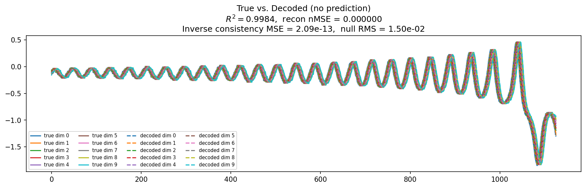
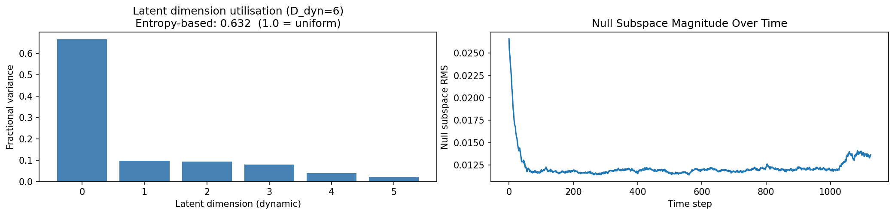
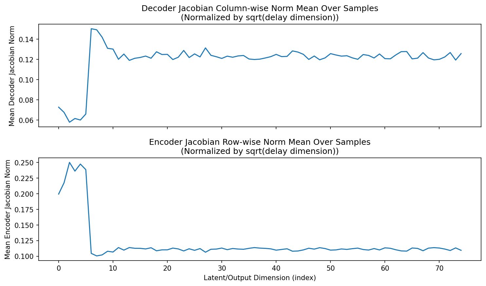
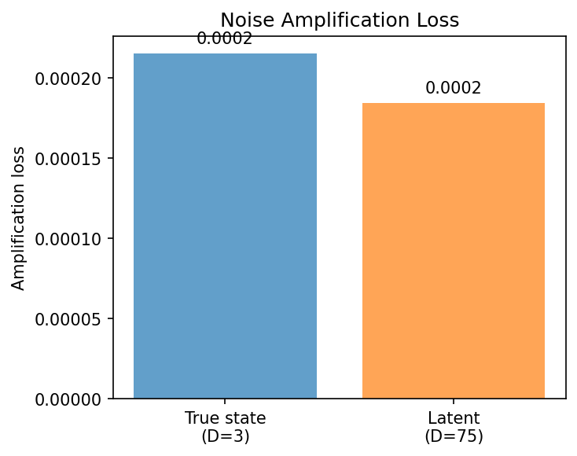
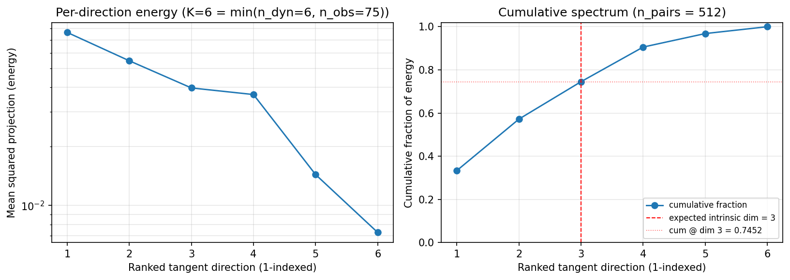
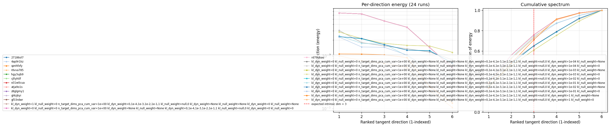

# Sweep Analysis: `lorenz_partial_additive_encoderonly_nd75_init15_pcainit_autodim__kl_sweep_obsnoise001`

**Project**: [Lorenz_INDpartial_NDInitSweep_autodim_D1_NormTrue__JacobianODE](https://wandb.ai/JacobianODE/Lorenz_INDpartial_NDInitSweep_autodim_D1_NormTrue__JacobianODE/groups/lorenz_partial_additive_encoderonly_nd75_init15_pcainit_autodim__kl_sweep_obsnoise001)  
**Launched**: 2026-04-22T19:50:11Z  
**Completed**: 2026-04-22T20:15:18Z  
**Outcome**: `complete_clean`  
**Git**: `latent-JacobianODE` @ `f909fc3`  
**Expected runs**: 12

## Experiment Context

### `lorenz_partial_additive_encoderonly_nd75_init15_pcainit_autodim__kl_sweep_obsnoise001`

**Description**

Lorenz partial additive coupling, obs_noise=0.01, n_delays=75,
traj_init_steps=15 (only governs dataloader seq_length, not training).
encoder_only_mode=true → training + validation skip all dynamics work
and use only recon + KL losses. init_pca_basis=true → encoder starts
as the PCA rotation V. use_vae=true so kl_dyn_weight has teeth.
12-run sweep: 6 kl_dyn_weight × 2 kl_null_weight.
Analytics includes the new tangent_spectrum section: per-point latent
tangents (z_{t+1} - z_t) projected onto encoder Jacobian columns,
ranked by magnitude, averaged over val set. For the true 3-dim Lorenz
attractor, we expect the top 3 components to carry most of the energy.

**Hypothesis**

With PCA-basis init the encoder already reconstructs cleanly. The KL
regularizers shape the latent geometry: kl_null pushes z_null → 0,
concentrating representation on z_dyn; kl_dyn (VAE Gaussian KL on
z_dyn) encourages smooth/Gaussian latent codes. Too much kl_dyn will
collapse the latent entirely; too little gives no shaping benefit.
Prior: best val/recon_loss at small-to-mid kl_dyn (~1e-4 to 1e-2),
kl_null=0 (let z_null stay untouched since PCA already picked the
right subspace). The tangent_spectrum should concentrate on the top
3 directions at every KL weight, since Lorenz is intrinsically 3-dim
— this is a check on the encoder, not on the KL choice.

**Success criteria**

- All 12 runs train without divergence (val/recon_loss finite throughout)
- Best val/recon_loss achieved at some kl_dyn in {1e-4, 1e-3, 1e-2}
- Top 3 components of the tangent spectrum at the best run carry >= 95% of energy
- Cumulative tangent energy at dim 3 is higher than at the worst run

## Results

**Swept axes** (9): `model.kl_dyn_weight`, `model.kl_null_weight`, `model.n_target_dims_pca_cum_var`, `sweep_grid.model.kl_dyn_weight`, `sweep_grid.model.kl_null_weight`, `sweep_grid.training.lightning.kl_dyn_weight`, `sweep_grid.training.lightning.kl_null_weight`, `training.lightning.kl_dyn_weight`, `training.lightning.kl_null_weight`

**Chosen run** (by `best_traj_loss`): `8zj4cex3` — traj_loss=0.00015, MASE=—, R²=—, LC loss=—, epoch=27.0

Swept-axis values at chosen run: `model.kl_dyn_weight`=1 · `model.kl_null_weight`=0 · `model.n_target_dims_pca_cum_var`=0.993244 · `sweep_grid.model.kl_dyn_weight`=0,1e-4,1e-3,1e-2,1e-1,1 · `sweep_grid.model.kl_null_weight`=null,0 · `sweep_grid.training.lightning.kl_dyn_weight`=None · `sweep_grid.training.lightning.kl_null_weight`=None · `training.lightning.kl_dyn_weight`=0 · `training.lightning.kl_null_weight`=None

### Integrity checks

⚠️ **1 run_idx slot(s) had multiple matching wandb runs** — the best by `best_traj_loss` was kept; the others are listed below for audit:
  - run_idx=**0**: chose `8zj4cex3`, dropped `27186ol7`, `4ap9r1kz`, `qznhfxfy`, `r8vva785`, `hgy3ujb9`, `cjfiyh0f`, `e31w0cua`, `atja9o1s`, `z8glgmy1`, `gl4zjkyi`, `gf33rdwr`, `rd79ubau`

**Runs analyzed**: 12 (expected 12)

### Per-run results

| run_idx | run_id | `model.kl_dyn_weight` | `model.kl_null_weight` | `model.n_target_dims_pca_cum_var` | `sweep_grid.model.kl_dyn_weight` | `sweep_grid.model.kl_null_weight` | `sweep_grid.training.lightning.kl_dyn_weight` | `sweep_grid.training.lightning.kl_null_weight` | `training.lightning.kl_dyn_weight` | `training.lightning.kl_null_weight` | best_traj_loss | best_MASE | R² | LC loss | epoch |
|---|---|---|---|---|---|---|---|---|---|---|---|---|---|---|---|
| 0 | `8zj4cex3` | 1 | 0 | 0.993244 | 0,1e-4,1e-3,1e-2,1e-1,1 | null,0 | None | None | 0 | None | 0.00015 | — | — | — | 27.0 |
| 1 | `4bxmlexd` | 0 | 0 | 0.993244 | None | None | 0,1e-4,1e-3,1e-2,1e-1,1 | null,0 | 0 | 0 | 0.00015 | — | — | — | 27.0 |
| 3 | `pjofmq14` | 0 | 0 | 0.993244 | None | None | 0,1e-4,1e-3,1e-2,1e-1,1 | null,0 | 1.0e-04 | 0 | 0.00053 | — | — | — | 25.0 |
| 2 | `5xvgafig` | 0 | 0 | 0.993244 | None | None | 0,1e-4,1e-3,1e-2,1e-1,1 | null,0 | 1.0e-04 | None | 0.00053 | — | — | — | 25.0 |
| 4 | `n3hdxweu` | 0 | 0 | 0.993244 | None | None | 0,1e-4,1e-3,1e-2,1e-1,1 | null,0 | 0.001 | None | 0.00206 | — | — | — | 81.0 |
| 5 | `dvurm0a3` | 0 | 0 | 0.993244 | None | None | 0,1e-4,1e-3,1e-2,1e-1,1 | null,0 | 0.001 | 0 | 0.00206 | — | — | — | 81.0 |
| 7 | `k08enmzr` | 0 | 0 | 0.993244 | None | None | 0,1e-4,1e-3,1e-2,1e-1,1 | null,0 | 0.01 | 0 | 0.01126 | — | — | — | 134.0 |
| 6 | `sumx80s7` | 0 | 0 | 0.993244 | None | None | 0,1e-4,1e-3,1e-2,1e-1,1 | null,0 | 0.01 | None | 0.01127 | — | — | — | 134.0 |
| 8 | `m9fg93nr` | 0 | 0 | 0.993244 | None | None | 0,1e-4,1e-3,1e-2,1e-1,1 | null,0 | 0.1 | None | 0.06320 | — | — | — | 133.0 |
| 9 | `eex1qkao` | 0 | 0 | 0.993244 | None | None | 0,1e-4,1e-3,1e-2,1e-1,1 | null,0 | 0.1 | 0 | 0.06750 | — | — | — | 100.0 |
| 11 | `4m066r9j` | 0 | 0 | 0.993244 | None | None | 0,1e-4,1e-3,1e-2,1e-1,1 | null,0 | 1 | 0 | 0.32450 | — | — | — | 126.0 |
| 10 | `d7fb7pd9` | 0 | 0 | 0.993244 | None | None | 0,1e-4,1e-3,1e-2,1e-1,1 | null,0 | 1 | None | 0.32520 | — | — | — | 125.0 |

## Success-criteria verdicts (automated)

| Criterion | Verdict | Note |
|---|---|---|
| All 12 runs train without divergence (val/recon_loss finite throughout) | **Unknown** |  |
| Best val/recon_loss achieved at some kl_dyn in {1e-4, 1e-3, 1e-2} | **Unknown** |  |
| Top 3 components of the tangent spectrum at the best run carry >= 95% of energy | **Unknown** |  |
| Cumulative tangent energy at dim 3 is higher than at the worst run | **Unknown** |  |

_Automated verdicts use simple numeric-threshold parsing and may mis-classify qualitative criteria. The Discussion section below takes precedence._

## Figures

### reconstruction



### latent_utilization



### encoder_decoder_jacobians



### amplification



### tangent_spectrum



### per_run_tangent_spectrum



## Discussion

<!--
This section is intentionally left as a placeholder. A human reviewer
or Claude Code agent should fill it in based on the tables and figures
above, explicitly addressing each success criterion and comparing the
outcome to the stated hypothesis. Write the Discussion to
`discussion.md` in this directory and re-run `render_report`.
-->

_(to be written)_

## `run_analytics` stdout

<details><summary>Click to expand — full diagnostic output from <code>run_analytics</code></summary>

```
No run_id provided — selecting best run from group 'lorenz_partial_additive_encoderonly_nd75_init15_pcainit_autodim__kl_sweep_obsnoise001' ...
Found 24 total runs in JacobianODE/Lorenz_INDpartial_NDInitSweep_autodim_D1_NormTrue__JacobianODE (group=lorenz_partial_additive_encoderonly_nd75_init15_pcainit_autodim__kl_sweep_obsnoise001)
All runs (state, loop_closure_weight, tangent_entropy_weight, kl_dyn_weight):
  27186ol7: state=finished, lc=0.0, te=0.0, kl_dyn=0.0
  4ap9r1kz: state=finished, lc=0.0, te=0.0, kl_dyn=0.0
  qznhfxfy: state=finished, lc=0.0, te=0.0, kl_dyn=0.0
  r8vva785: state=finished, lc=0.0, te=0.0, kl_dyn=0.0
  hgy3ujb9: state=finished, lc=0.0, te=0.0, kl_dyn=0.0
  cjfiyh0f: state=finished, lc=0.0, te=0.0, kl_dyn=0.0
  e31w0cua: state=finished, lc=0.0, te=0.0, kl_dyn=0.0
  atja9o1s: state=finished, lc=0.0, te=0.0, kl_dyn=0.0
  z8glgmy1: state=finished, lc=0.0, te=0.0, kl_dyn=0.0
  gl4zjkyi: state=finished, lc=0.0, te=0.0, kl_dyn=0.0
  gf33rdwr: state=finished, lc=0.0, te=0.0, kl_dyn=0.0
  8zj4cex3: state=finished, lc=0.0, te=0.0, kl_dyn=0.0
  4bxmlexd: state=finished, lc=0.0, te=0.0, kl_dyn=0.0
  rd79ubau: state=finished, lc=0.0, te=0.0, kl_dyn=0.0
  5xvgafig: state=finished, lc=0.0, te=0.0, kl_dyn=0.0001
  pjofmq14: state=finished, lc=0.0, te=0.0, kl_dyn=0.0001
  n3hdxweu: state=finished, lc=0.0, te=0.0, kl_dyn=0.001
  dvurm0a3: state=finished, lc=0.0, te=0.0, kl_dyn=0.001
  k08enmzr: state=finished, lc=0.0, te=0.0, kl_dyn=0.01
  m9fg93nr: state=finished, lc=0.0, te=0.0, kl_dyn=0.1
  sumx80s7: state=finished, lc=0.0, te=0.0, kl_dyn=0.01
  eex1qkao: state=finished, lc=0.0, te=0.0, kl_dyn=0.1
  d7fb7pd9: state=finished, lc=0.0, te=0.0, kl_dyn=1.0
  4m066r9j: state=finished, lc=0.0, te=0.0, kl_dyn=1.0

slurm_timeout_min not found in any run config — falling back to 180 min
  Including 27186ol7 (lc=0.0): use_all_runs=True (state=finished)
  Including 4ap9r1kz (lc=0.0): use_all_runs=True (state=finished)
  Including qznhfxfy (lc=0.0): use_all_runs=True (state=finished)
  Including r8vva785 (lc=0.0): use_all_runs=True (state=finished)
  Including hgy3ujb9 (lc=0.0): use_all_runs=True (state=finished)
  Including cjfiyh0f (lc=0.0): use_all_runs=True (state=finished)
  Including e31w0cua (lc=0.0): use_all_runs=True (state=finished)
  Including atja9o1s (lc=0.0): use_all_runs=True (state=finished)
  Including z8glgmy1 (lc=0.0): use_all_runs=True (state=finished)
  Including gl4zjkyi (lc=0.0): use_all_runs=True (state=finished)
  Including gf33rdwr (lc=0.0): use_all_runs=True (state=finished)
  Including 8zj4cex3 (lc=0.0): use_all_runs=True (state=finished)
  Including 4bxmlexd (lc=0.0): use_all_runs=True (state=finished)
  Including rd79ubau (lc=0.0): use_all_runs=True (state=finished)
  Including 5xvgafig (lc=0.0): use_all_runs=True (state=finished)
  Including pjofmq14 (lc=0.0): use_all_runs=True (state=finished)
  Including n3hdxweu (lc=0.0): use_all_runs=True (state=finished)
  Including dvurm0a3 (lc=0.0): use_all_runs=True (state=finished)
  Including k08enmzr (lc=0.0): use_all_runs=True (state=finished)
  Including m9fg93nr (lc=0.0): use_all_runs=True (state=finished)
  Including sumx80s7 (lc=0.0): use_all_runs=True (state=finished)
  Including eex1qkao (lc=0.0): use_all_runs=True (state=finished)
  Including d7fb7pd9 (lc=0.0): use_all_runs=True (state=finished)
  Including 4m066r9j (lc=0.0): use_all_runs=True (state=finished)
Found 24 effectively-done sweep runs:
  loop_closure_weight=0.0, tangent_entropy_weight=0.0, kl_dyn_weight=0.0 -> run_id=27186ol7
  loop_closure_weight=0.0, tangent_entropy_weight=0.0, kl_dyn_weight=0.0 -> run_id=4ap9r1kz
  loop_closure_weight=0.0, tangent_entropy_weight=0.0, kl_dyn_weight=0.0 -> run_id=4bxmlexd
  loop_closure_weight=0.0, tangent_entropy_weight=0.0, kl_dyn_weight=0.0 -> run_id=8zj4cex3
  loop_closure_weight=0.0, tangent_entropy_weight=0.0, kl_dyn_weight=0.0 -> run_id=atja9o1s
  loop_closure_weight=0.0, tangent_entropy_weight=0.0, kl_dyn_weight=0.0 -> run_id=cjfiyh0f
  loop_closure_weight=0.0, tangent_entropy_weight=0.0, kl_dyn_weight=0.0 -> run_id=e31w0cua
  loop_closure_weight=0.0, tangent_entropy_weight=0.0, kl_dyn_weight=0.0 -> run_id=gf33rdwr
  loop_closure_weight=0.0, tangent_entropy_weight=0.0, kl_dyn_weight=0.0 -> run_id=gl4zjkyi
  loop_closure_weight=0.0, tangent_entropy_weight=0.0, kl_dyn_weight=0.0 -> run_id=hgy3ujb9
  loop_closure_weight=0.0, tangent_entropy_weight=0.0, kl_dyn_weight=0.0 -> run_id=qznhfxfy
  loop_closure_weight=0.0, tangent_entropy_weight=0.0, kl_dyn_weight=0.0 -> run_id=r8vva785
  loop_closure_weight=0.0, tangent_entropy_weight=0.0, kl_dyn_weight=0.0 -> run_id=rd79ubau
  loop_closure_weight=0.0, tangent_entropy_weight=0.0, kl_dyn_weight=0.0 -> run_id=z8glgmy1
  loop_closure_weight=0.0, tangent_entropy_weight=0.0, kl_dyn_weight=0.0001 -> run_id=5xvgafig
  loop_closure_weight=0.0, tangent_entropy_weight=0.0, kl_dyn_weight=0.0001 -> run_id=pjofmq14
  loop_closure_weight=0.0, tangent_entropy_weight=0.0, kl_dyn_weight=0.001 -> run_id=dvurm0a3
  loop_closure_weight=0.0, tangent_entropy_weight=0.0, kl_dyn_weight=0.001 -> run_id=n3hdxweu
  loop_closure_weight=0.0, tangent_entropy_weight=0.0, kl_dyn_weight=0.01 -> run_id=k08enmzr
  loop_closure_weight=0.0, tangent_entropy_weight=0.0, kl_dyn_weight=0.01 -> run_id=sumx80s7
  loop_closure_weight=0.0, tangent_entropy_weight=0.0, kl_dyn_weight=0.1 -> run_id=eex1qkao
  loop_closure_weight=0.0, tangent_entropy_weight=0.0, kl_dyn_weight=0.1 -> run_id=m9fg93nr
  loop_closure_weight=0.0, tangent_entropy_weight=0.0, kl_dyn_weight=1.0 -> run_id=4m066r9j
  loop_closure_weight=0.0, tangent_entropy_weight=0.0, kl_dyn_weight=1.0 -> run_id=d7fb7pd9
n_dims=75, n_latent=75, n_dyn=6, dt=0.0150
  run=27186ol7: DiagnosticMetrics(one_step_mase=0.0, loop_closure_loss=None, fast_eigenvalue_fraction=0.0, trajectory_val_loss=0.00015343824634328485) (from W&B history)
  run=4ap9r1kz: DiagnosticMetrics(one_step_mase=0.0, loop_closure_loss=None, fast_eigenvalue_fraction=0.0, trajectory_val_loss=0.00015343824634328485) (from W&B history)
  run=4bxmlexd: DiagnosticMetrics(one_step_mase=0.0, loop_closure_loss=None, fast_eigenvalue_fraction=0.0, trajectory_val_loss=0.00015343824634328485) (from W&B history)
  run=8zj4cex3: DiagnosticMetrics(one_step_mase=0.0, loop_closure_loss=None, fast_eigenvalue_fraction=0.0, trajectory_val_loss=0.00015293722390197217) (from W&B history)
  run=atja9o1s: DiagnosticMetrics(one_step_mase=0.0, loop_closure_loss=None, fast_eigenvalue_fraction=0.0, trajectory_val_loss=0.00015343824634328485) (from W&B history)
  run=cjfiyh0f: DiagnosticMetrics(one_step_mase=0.0, loop_closure_loss=None, fast_eigenvalue_fraction=0.0, trajectory_val_loss=0.00015343824634328485) (from W&B history)
  run=e31w0cua: DiagnosticMetrics(one_step_mase=0.0, loop_closure_loss=None, fast_eigenvalue_fraction=0.0, trajectory_val_loss=0.00015343824634328485) (from W&B history)
  run=gf33rdwr: DiagnosticMetrics(one_step_mase=0.0, loop_closure_loss=None, fast_eigenvalue_fraction=0.0, trajectory_val_loss=0.00015343824634328485) (from W&B history)
  run=gl4zjkyi: DiagnosticMetrics(one_step_mase=0.0, loop_closure_loss=None, fast_eigenvalue_fraction=0.0, trajectory_val_loss=0.00015343824634328485) (from W&B history)
  run=hgy3ujb9: DiagnosticMetrics(one_step_mase=0.0, loop_closure_loss=None, fast_eigenvalue_fraction=0.0, trajectory_val_loss=0.00015343824634328485) (from W&B history)
  run=qznhfxfy: DiagnosticMetrics(one_step_mase=0.0, loop_closure_loss=None, fast_eigenvalue_fraction=0.0, trajectory_val_loss=0.00015343824634328485) (from W&B history)
  run=r8vva785: DiagnosticMetrics(one_step_mase=0.0, loop_closure_loss=None, fast_eigenvalue_fraction=0.0, trajectory_val_loss=0.00015343824634328485) (from W&B history)
  run=rd79ubau: DiagnosticMetrics(one_step_mase=0.0, loop_closure_loss=None, fast_eigenvalue_fraction=0.0, trajectory_val_loss=0.00015343824634328485) (from W&B history)
  run=z8glgmy1: DiagnosticMetrics(one_step_mase=0.0, loop_closure_loss=None, fast_eigenvalue_fraction=0.0, trajectory_val_loss=0.00015343824634328485) (from W&B history)
  run=5xvgafig: DiagnosticMetrics(one_step_mase=0.0, loop_closure_loss=None, fast_eigenvalue_fraction=0.0, trajectory_val_loss=0.0001555817580083385) (from W&B history)
  run=pjofmq14: DiagnosticMetrics(one_step_mase=0.0, loop_closure_loss=None, fast_eigenvalue_fraction=0.0, trajectory_val_loss=0.00015557317237835377) (from W&B history)
  run=dvurm0a3: DiagnosticMetrics(one_step_mase=0.0, loop_closure_loss=None, fast_eigenvalue_fraction=0.0, trajectory_val_loss=0.00018123922927770764) (from W&B history)
  run=n3hdxweu: DiagnosticMetrics(one_step_mase=0.0, loop_closure_loss=None, fast_eigenvalue_fraction=0.0, trajectory_val_loss=0.00018133275443688035) (from W&B history)
  run=k08enmzr: DiagnosticMetrics(one_step_mase=0.0, loop_closure_loss=None, fast_eigenvalue_fraction=0.0, trajectory_val_loss=0.00037603743840008974) (from W&B history)
  run=sumx80s7: DiagnosticMetrics(one_step_mase=0.0, loop_closure_loss=None, fast_eigenvalue_fraction=0.0, trajectory_val_loss=0.00037508353125303984) (from W&B history)
  run=eex1qkao: DiagnosticMetrics(one_step_mase=0.0, loop_closure_loss=None, fast_eigenvalue_fraction=0.0, trajectory_val_loss=0.002109712455421686) (from W&B history)
  run=m9fg93nr: DiagnosticMetrics(one_step_mase=0.0, loop_closure_loss=None, fast_eigenvalue_fraction=0.0, trajectory_val_loss=0.002018133644014597) (from W&B history)
  run=4m066r9j: DiagnosticMetrics(one_step_mase=0.0, loop_closure_loss=None, fast_eigenvalue_fraction=0.0, trajectory_val_loss=0.007696689572185278) (from W&B history)
  run=d7fb7pd9: DiagnosticMetrics(one_step_mase=0.0, loop_closure_loss=None, fast_eigenvalue_fraction=0.0, trajectory_val_loss=0.005285168997943401) (from W&B history)

Ranking method:           best_traj_loss
Best run ID:              8zj4cex3
Best loop_closure_weight: 0.0
Best tangent_entropy_weight: 0.0
Best kl_dyn_weight:       0.0
Best traj loss:           0.000153
Criteria applied: ['C1', 'C2', 'C3']
Surviving: 24 / 24
Auto-selected run_id: 8zj4cex3

======================================================================
PARETO FRONTIER RUNS (0 runs)
======================================================================
  Run ID               LC Loss   Traj Val Loss
  ------------  --------------  --------------

======================================================================
RANKING METHOD COMPARISON (over 24 survivors)
======================================================================
  Method                  Run ID               LC Loss   Traj Val Loss
  ----------------------  ------------  --------------  --------------
  best_traj_loss          8zj4cex3                 nan        0.000153 <-- active
  pareto_knee             8zj4cex3                 nan        0.000153
  geo_rank                8zj4cex3                 nan        0.000153
  minimax_rank            8zj4cex3                 nan        0.000153
  geo_log_score           8zj4cex3                 nan        0.000153
  minimax_log_score       8zj4cex3                 nan        0.000153
======================================================================

Loading run 8zj4cex3 from JacobianODE/Lorenz_INDpartial_NDInitSweep_autodim_D1_NormTrue__JacobianODE ...
Train dataset shape: torch.Size([23782, 45, 75])
Validation dataset shape: torch.Size([7567, 45, 75])
Test dataset shape: torch.Size([3243, 45, 75])
Train trajectories dataset shape: torch.Size([22, 1126, 75])
Validation trajectories dataset shape: torch.Size([7, 1126, 75])
Test trajectories dataset shape: torch.Size([3, 1126, 75])
Loading checkpoint epoch=27-step=5600.ckpt...
encoder_only_mode=True → skipping dynamics-only sections: ['kaplan_yorke', 'long_trajectory', 'lyapunov', 'mase', 'prediction_detail', 'prediction_windows', 'sweep_overview']
Computing reconstruction ...
Computing latent utilization ...
Entropy-based utilization: 0.632
Null subspace mean RMS: 1.232347e-02
Computing encoder/decoder Jacobians ...
encoder_jacobian: (128, 75, 75)
decoder_jacobian: (128, 75, 75)
Computing amplification loss ...
Amplification loss — True state: 0.000216
Amplification loss — Latent:     0.000185
Computing tangent space spectrum ...
```

</details>
