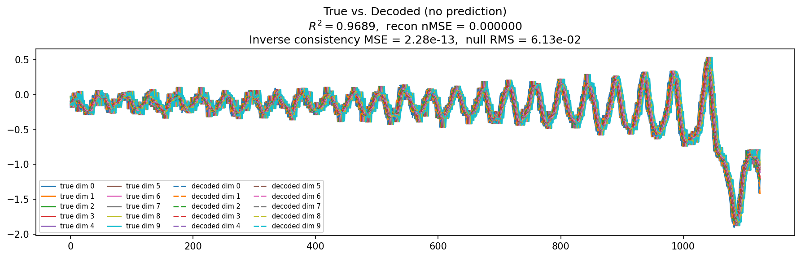
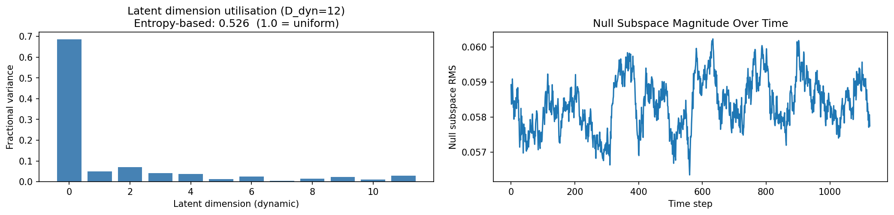
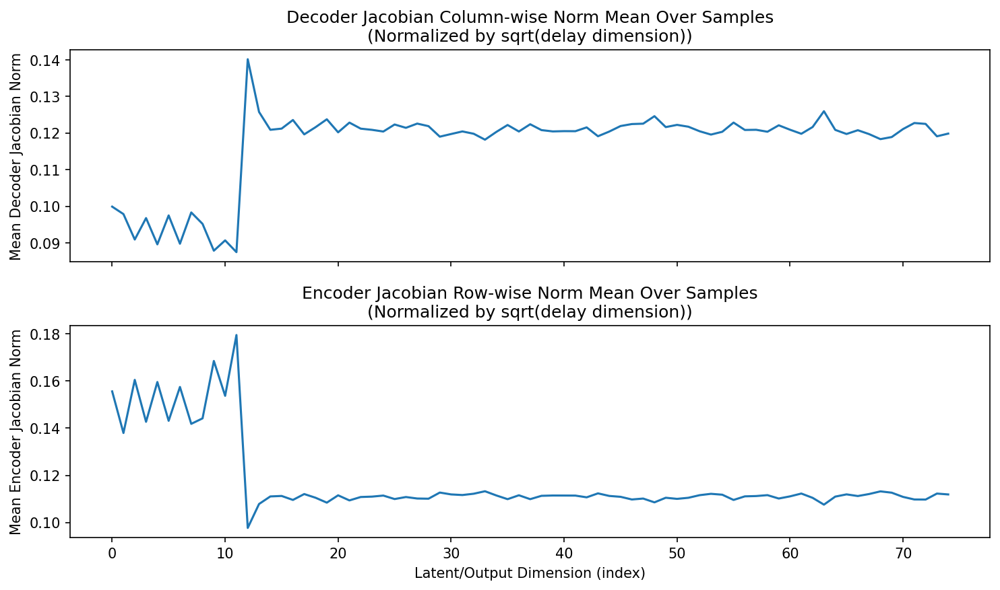
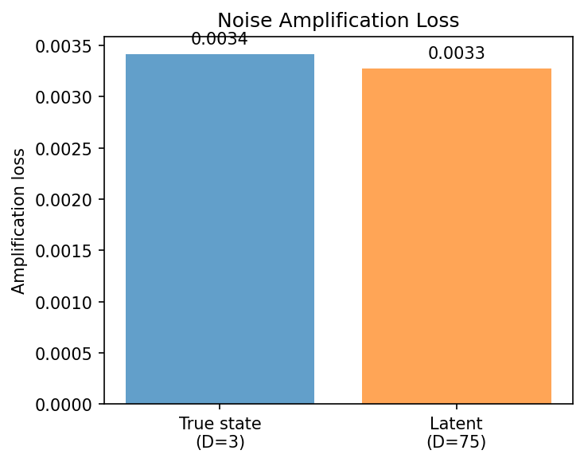
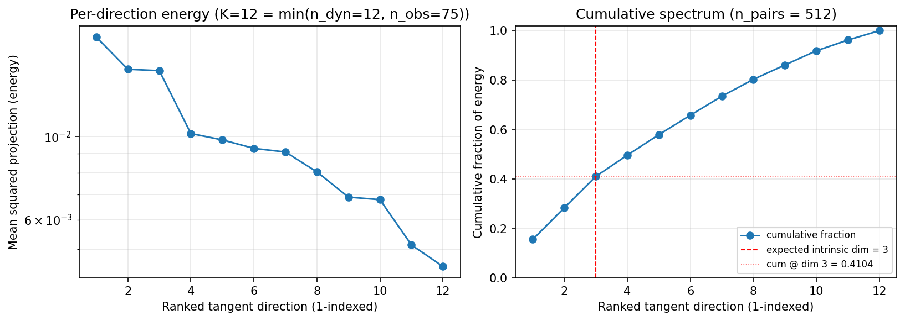
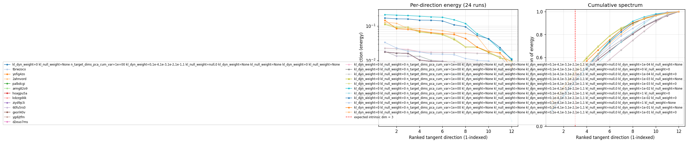

# Sweep Analysis: `lorenz_partial_additive_encoderonly_nd75_init15_pcainit_autodim__kl_sweep_obsnoise005`

**Project**: [Lorenz_INDpartial_NDInitSweep_autodim_D1_NormTrue__JacobianODE](https://wandb.ai/JacobianODE/Lorenz_INDpartial_NDInitSweep_autodim_D1_NormTrue__JacobianODE/groups/lorenz_partial_additive_encoderonly_nd75_init15_pcainit_autodim__kl_sweep_obsnoise005)  
**Launched**: 2026-04-22T19:50:43Z  
**Completed**: 2026-04-22T20:20:16Z  
**Outcome**: `complete_clean`  
**Git**: `latent-JacobianODE` @ `f909fc3`  
**Expected runs**: 12

## Experiment Context

### `lorenz_partial_additive_encoderonly_nd75_init15_pcainit_autodim__kl_sweep_obsnoise005`

**Description**

Lorenz partial additive coupling, obs_noise=0.05, n_delays=75.
encoder_only_mode=true, init_pca_basis=true, use_vae=true.
12-run sweep: 6 kl_dyn_weight × 2 kl_null_weight. Best by
val/recon_loss. Tangent-spectrum diagnostic post-training.

**Hypothesis**

At obs_noise=0.05 the encoder has to learn to denoise as well as
reconstruct. KL shaping may matter more here than at noise=0.01:
a mild kl_dyn should smooth the latent while kl_null suppresses the
noise-dominated off-manifold variance. Expect best val/recon_loss at
kl_dyn slightly higher than the obsnoise001 companion. Tangent spectrum
should still concentrate on top 3 components — Lorenz intrinsic dim
doesn't depend on noise level, only on the attractor.

**Success criteria**

- All 12 runs train without divergence
- Best val/recon_loss at some kl_dyn > 0 with clear margin over kl_dyn=0
- Top 3 components of tangent spectrum at best run carry >= 90% of energy
- Best kl_dyn at noise=0.05 is >= best kl_dyn at noise=0.01 (more regularization helps at higher noise)

## Results

**Swept axes** (9): `model.kl_dyn_weight`, `model.kl_null_weight`, `model.n_target_dims_pca_cum_var`, `sweep_grid.model.kl_dyn_weight`, `sweep_grid.model.kl_null_weight`, `sweep_grid.training.lightning.kl_dyn_weight`, `sweep_grid.training.lightning.kl_null_weight`, `training.lightning.kl_dyn_weight`, `training.lightning.kl_null_weight`

**Chosen run** (by `best_traj_loss`): `a0o5cslr` — traj_loss=0.00314, MASE=—, R²=—, LC loss=—, epoch=24.0

Swept-axis values at chosen run: `model.kl_dyn_weight`=0 · `model.kl_null_weight`=None · `model.n_target_dims_pca_cum_var`=0.990036 · `sweep_grid.model.kl_dyn_weight`=0,1e-4,1e-3,1e-2,1e-1,1 · `sweep_grid.model.kl_null_weight`=null,0 · `sweep_grid.training.lightning.kl_dyn_weight`=None · `sweep_grid.training.lightning.kl_null_weight`=None · `training.lightning.kl_dyn_weight`=0 · `training.lightning.kl_null_weight`=None

### Integrity checks

⚠️ **1 run_idx slot(s) had multiple matching wandb runs** — the best by `best_traj_loss` was kept; the others are listed below for audit:
  - run_idx=**0**: chose `a0o5cslr`, dropped `tbrwzoco`, `yofig4zo`, `2ahnvord`, `palbdcgi`, `armg82o9`, `hoagpu5a`, `kdzzgd4k`, `ziyd9p3i`, `60fu5rs0`, `gxorl40v`, `ygdijtfm`, `d2euo7ms`

**Runs analyzed**: 12 (expected 12)

### Per-run results

| run_idx | run_id | `model.kl_dyn_weight` | `model.kl_null_weight` | `model.n_target_dims_pca_cum_var` | `sweep_grid.model.kl_dyn_weight` | `sweep_grid.model.kl_null_weight` | `sweep_grid.training.lightning.kl_dyn_weight` | `sweep_grid.training.lightning.kl_null_weight` | `training.lightning.kl_dyn_weight` | `training.lightning.kl_null_weight` | best_traj_loss | best_MASE | R² | LC loss | epoch |
|---|---|---|---|---|---|---|---|---|---|---|---|---|---|---|---|
| 0 | `a0o5cslr` | 0 | None | 0.990036 | 0,1e-4,1e-3,1e-2,1e-1,1 | null,0 | None | None | 0 | None | 0.00314 | — | — | — | 24.0 |
| 1 | `tmazrdv9` | 0 | 0 | 0.990036 | None | None | 0,1e-4,1e-3,1e-2,1e-1,1 | null,0 | 0 | 0 | 0.00314 | — | — | — | 24.0 |
| 2 | `q0yn9a8w` | 0 | 0 | 0.990036 | None | None | 0,1e-4,1e-3,1e-2,1e-1,1 | null,0 | 1.0e-04 | None | 0.00350 | — | — | — | 25.0 |
| 3 | `68qk05q7` | 0 | 0 | 0.990036 | None | None | 0,1e-4,1e-3,1e-2,1e-1,1 | null,0 | 1.0e-04 | 0 | 0.00351 | — | — | — | 24.0 |
| 5 | `c1xrrj3c` | 0 | 0 | 0.990036 | None | None | 0,1e-4,1e-3,1e-2,1e-1,1 | null,0 | 0.001 | 0 | 0.00519 | — | — | — | 25.0 |
| 4 | `bdjktejl` | 0 | 0 | 0.990036 | None | None | 0,1e-4,1e-3,1e-2,1e-1,1 | null,0 | 0.001 | None | 0.00522 | — | — | — | 24.0 |
| 6 | `6bmck00v` | 0 | 0 | 0.990036 | None | None | 0,1e-4,1e-3,1e-2,1e-1,1 | null,0 | 0.01 | None | 0.01188 | — | — | — | 89.0 |
| 7 | `0fu8zdax` | 0 | 0 | 0.990036 | None | None | 0,1e-4,1e-3,1e-2,1e-1,1 | null,0 | 0.01 | 0 | 0.01317 | — | — | — | 47.0 |
| 8 | `c1qytci3` | 0 | 0 | 0.990036 | None | None | 0,1e-4,1e-3,1e-2,1e-1,1 | null,0 | 0.1 | None | 0.05187 | — | — | — | 71.0 |
| 9 | `v6qepwrd` | 0 | 0 | 0.990036 | None | None | 0,1e-4,1e-3,1e-2,1e-1,1 | null,0 | 0.1 | 0 | 0.05486 | — | — | — | 56.0 |
| 11 | `ari6sskn` | 0 | 0 | 0.990036 | None | None | 0,1e-4,1e-3,1e-2,1e-1,1 | null,0 | 1 | 0 | 0.19973 | — | — | — | 114.0 |
| 10 | `6w5v9nyb` | 0 | 0 | 0.990036 | None | None | 0,1e-4,1e-3,1e-2,1e-1,1 | null,0 | 1 | None | 0.21264 | — | — | — | 113.0 |

## Success-criteria verdicts (automated)

| Criterion | Verdict | Note |
|---|---|---|
| All 12 runs train without divergence | **Unknown** |  |
| Best val/recon_loss at some kl_dyn > 0 with clear margin over kl_dyn=0 | **Unknown** |  |
| Top 3 components of tangent spectrum at best run carry >= 90% of energy | **Unknown** |  |
| Best kl_dyn at noise=0.05 is >= best kl_dyn at noise=0.01 (more regularization helps at higher noise) | **Unknown** |  |

_Automated verdicts use simple numeric-threshold parsing and may mis-classify qualitative criteria. The Discussion section below takes precedence._

## Figures

### reconstruction



### latent_utilization



### encoder_decoder_jacobians



### amplification



### tangent_spectrum



### per_run_tangent_spectrum



## Discussion

<!--
This section is intentionally left as a placeholder. A human reviewer
or Claude Code agent should fill it in based on the tables and figures
above, explicitly addressing each success criterion and comparing the
outcome to the stated hypothesis. Write the Discussion to
`discussion.md` in this directory and re-run `render_report`.
-->

_(to be written)_

## `run_analytics` stdout

<details><summary>Click to expand — full diagnostic output from <code>run_analytics</code></summary>

```
No run_id provided — selecting best run from group 'lorenz_partial_additive_encoderonly_nd75_init15_pcainit_autodim__kl_sweep_obsnoise005' ...
Found 24 total runs in JacobianODE/Lorenz_INDpartial_NDInitSweep_autodim_D1_NormTrue__JacobianODE (group=lorenz_partial_additive_encoderonly_nd75_init15_pcainit_autodim__kl_sweep_obsnoise005)
All runs (state, loop_closure_weight, tangent_entropy_weight, kl_dyn_weight):
  a0o5cslr: state=finished, lc=0.0, te=0.0, kl_dyn=0.0
  tbrwzoco: state=finished, lc=0.0, te=0.0, kl_dyn=0.0
  yofig4zo: state=finished, lc=0.0, te=0.0, kl_dyn=0.0
  2ahnvord: state=finished, lc=0.0, te=0.0, kl_dyn=0.0
  palbdcgi: state=finished, lc=0.0, te=0.0, kl_dyn=0.0
  armg82o9: state=finished, lc=0.0, te=0.0, kl_dyn=0.0
  hoagpu5a: state=finished, lc=0.0, te=0.0, kl_dyn=0.0
  kdzzgd4k: state=finished, lc=0.0, te=0.0, kl_dyn=0.0
  ziyd9p3i: state=finished, lc=0.0, te=0.0, kl_dyn=0.0
  60fu5rs0: state=finished, lc=0.0, te=0.0, kl_dyn=0.0
  gxorl40v: state=finished, lc=0.0, te=0.0, kl_dyn=0.0
  ygdijtfm: state=finished, lc=0.0, te=0.0, kl_dyn=0.0
  d2euo7ms: state=finished, lc=0.0, te=0.0, kl_dyn=0.0
  q0yn9a8w: state=finished, lc=0.0, te=0.0, kl_dyn=0.0001
  tmazrdv9: state=finished, lc=0.0, te=0.0, kl_dyn=0.0
  68qk05q7: state=finished, lc=0.0, te=0.0, kl_dyn=0.0001
  bdjktejl: state=finished, lc=0.0, te=0.0, kl_dyn=0.001
  c1xrrj3c: state=finished, lc=0.0, te=0.0, kl_dyn=0.001
  6bmck00v: state=finished, lc=0.0, te=0.0, kl_dyn=0.01
  ari6sskn: state=finished, lc=0.0, te=0.0, kl_dyn=1.0
  0fu8zdax: state=finished, lc=0.0, te=0.0, kl_dyn=0.01
  6w5v9nyb: state=finished, lc=0.0, te=0.0, kl_dyn=1.0
  c1qytci3: state=finished, lc=0.0, te=0.0, kl_dyn=0.1
  v6qepwrd: state=finished, lc=0.0, te=0.0, kl_dyn=0.1

slurm_timeout_min not found in any run config — falling back to 180 min
  Including a0o5cslr (lc=0.0): use_all_runs=True (state=finished)
  Including tbrwzoco (lc=0.0): use_all_runs=True (state=finished)
  Including yofig4zo (lc=0.0): use_all_runs=True (state=finished)
  Including 2ahnvord (lc=0.0): use_all_runs=True (state=finished)
  Including palbdcgi (lc=0.0): use_all_runs=True (state=finished)
  Including armg82o9 (lc=0.0): use_all_runs=True (state=finished)
  Including hoagpu5a (lc=0.0): use_all_runs=True (state=finished)
  Including kdzzgd4k (lc=0.0): use_all_runs=True (state=finished)
  Including ziyd9p3i (lc=0.0): use_all_runs=True (state=finished)
  Including 60fu5rs0 (lc=0.0): use_all_runs=True (state=finished)
  Including gxorl40v (lc=0.0): use_all_runs=True (state=finished)
  Including ygdijtfm (lc=0.0): use_all_runs=True (state=finished)
  Including d2euo7ms (lc=0.0): use_all_runs=True (state=finished)
  Including q0yn9a8w (lc=0.0): use_all_runs=True (state=finished)
  Including tmazrdv9 (lc=0.0): use_all_runs=True (state=finished)
  Including 68qk05q7 (lc=0.0): use_all_runs=True (state=finished)
  Including bdjktejl (lc=0.0): use_all_runs=True (state=finished)
  Including c1xrrj3c (lc=0.0): use_all_runs=True (state=finished)
  Including 6bmck00v (lc=0.0): use_all_runs=True (state=finished)
  Including ari6sskn (lc=0.0): use_all_runs=True (state=finished)
  Including 0fu8zdax (lc=0.0): use_all_runs=True (state=finished)
  Including 6w5v9nyb (lc=0.0): use_all_runs=True (state=finished)
  Including c1qytci3 (lc=0.0): use_all_runs=True (state=finished)
  Including v6qepwrd (lc=0.0): use_all_runs=True (state=finished)
Found 24 effectively-done sweep runs:
  loop_closure_weight=0.0, tangent_entropy_weight=0.0, kl_dyn_weight=0.0 -> run_id=2ahnvord
  loop_closure_weight=0.0, tangent_entropy_weight=0.0, kl_dyn_weight=0.0 -> run_id=60fu5rs0
  loop_closure_weight=0.0, tangent_entropy_weight=0.0, kl_dyn_weight=0.0 -> run_id=a0o5cslr
  loop_closure_weight=0.0, tangent_entropy_weight=0.0, kl_dyn_weight=0.0 -> run_id=armg82o9
  loop_closure_weight=0.0, tangent_entropy_weight=0.0, kl_dyn_weight=0.0 -> run_id=d2euo7ms
  loop_closure_weight=0.0, tangent_entropy_weight=0.0, kl_dyn_weight=0.0 -> run_id=gxorl40v
  loop_closure_weight=0.0, tangent_entropy_weight=0.0, kl_dyn_weight=0.0 -> run_id=hoagpu5a
  loop_closure_weight=0.0, tangent_entropy_weight=0.0, kl_dyn_weight=0.0 -> run_id=kdzzgd4k
  loop_closure_weight=0.0, tangent_entropy_weight=0.0, kl_dyn_weight=0.0 -> run_id=palbdcgi
  loop_closure_weight=0.0, tangent_entropy_weight=0.0, kl_dyn_weight=0.0 -> run_id=tbrwzoco
  loop_closure_weight=0.0, tangent_entropy_weight=0.0, kl_dyn_weight=0.0 -> run_id=tmazrdv9
  loop_closure_weight=0.0, tangent_entropy_weight=0.0, kl_dyn_weight=0.0 -> run_id=ygdijtfm
  loop_closure_weight=0.0, tangent_entropy_weight=0.0, kl_dyn_weight=0.0 -> run_id=yofig4zo
  loop_closure_weight=0.0, tangent_entropy_weight=0.0, kl_dyn_weight=0.0 -> run_id=ziyd9p3i
  loop_closure_weight=0.0, tangent_entropy_weight=0.0, kl_dyn_weight=0.0001 -> run_id=68qk05q7
  loop_closure_weight=0.0, tangent_entropy_weight=0.0, kl_dyn_weight=0.0001 -> run_id=q0yn9a8w
  loop_closure_weight=0.0, tangent_entropy_weight=0.0, kl_dyn_weight=0.001 -> run_id=bdjktejl
  loop_closure_weight=0.0, tangent_entropy_weight=0.0, kl_dyn_weight=0.001 -> run_id=c1xrrj3c
  loop_closure_weight=0.0, tangent_entropy_weight=0.0, kl_dyn_weight=0.01 -> run_id=0fu8zdax
  loop_closure_weight=0.0, tangent_entropy_weight=0.0, kl_dyn_weight=0.01 -> run_id=6bmck00v
  loop_closure_weight=0.0, tangent_entropy_weight=0.0, kl_dyn_weight=0.1 -> run_id=c1qytci3
  loop_closure_weight=0.0, tangent_entropy_weight=0.0, kl_dyn_weight=0.1 -> run_id=v6qepwrd
  loop_closure_weight=0.0, tangent_entropy_weight=0.0, kl_dyn_weight=1.0 -> run_id=6w5v9nyb
  loop_closure_weight=0.0, tangent_entropy_weight=0.0, kl_dyn_weight=1.0 -> run_id=ari6sskn
n_dims=75, n_latent=75, n_dyn=12, dt=0.0150
  run=2ahnvord: DiagnosticMetrics(one_step_mase=0.0, loop_closure_loss=None, fast_eigenvalue_fraction=0.0, trajectory_val_loss=0.0031446570064872503) (from W&B history)
  run=60fu5rs0: DiagnosticMetrics(one_step_mase=0.0, loop_closure_loss=None, fast_eigenvalue_fraction=0.0, trajectory_val_loss=0.003145044669508934) (from W&B history)
  run=a0o5cslr: DiagnosticMetrics(one_step_mase=0.0, loop_closure_loss=None, fast_eigenvalue_fraction=0.0, trajectory_val_loss=0.0031446570064872503) (from W&B history)
  run=armg82o9: DiagnosticMetrics(one_step_mase=0.0, loop_closure_loss=None, fast_eigenvalue_fraction=0.0, trajectory_val_loss=0.003145035821944475) (from W&B history)
  run=d2euo7ms: DiagnosticMetrics(one_step_mase=0.0, loop_closure_loss=None, fast_eigenvalue_fraction=0.0, trajectory_val_loss=0.0031446570064872503) (from W&B history)
  run=gxorl40v: DiagnosticMetrics(one_step_mase=0.0, loop_closure_loss=None, fast_eigenvalue_fraction=0.0, trajectory_val_loss=0.0031446570064872503) (from W&B history)
  run=hoagpu5a: DiagnosticMetrics(one_step_mase=0.0, loop_closure_loss=None, fast_eigenvalue_fraction=0.0, trajectory_val_loss=0.0031446570064872503) (from W&B history)
  run=kdzzgd4k: DiagnosticMetrics(one_step_mase=0.0, loop_closure_loss=None, fast_eigenvalue_fraction=0.0, trajectory_val_loss=0.0031446570064872503) (from W&B history)
  run=palbdcgi: DiagnosticMetrics(one_step_mase=0.0, loop_closure_loss=None, fast_eigenvalue_fraction=0.0, trajectory_val_loss=0.0031446570064872503) (from W&B history)
  run=tbrwzoco: DiagnosticMetrics(one_step_mase=0.0, loop_closure_loss=None, fast_eigenvalue_fraction=0.0, trajectory_val_loss=0.0031446570064872503) (from W&B history)
  run=tmazrdv9: DiagnosticMetrics(one_step_mase=0.0, loop_closure_loss=None, fast_eigenvalue_fraction=0.0, trajectory_val_loss=0.0031446570064872503) (from W&B history)
  run=ygdijtfm: DiagnosticMetrics(one_step_mase=0.0, loop_closure_loss=None, fast_eigenvalue_fraction=0.0, trajectory_val_loss=0.0031446570064872503) (from W&B history)
  run=yofig4zo: DiagnosticMetrics(one_step_mase=0.0, loop_closure_loss=None, fast_eigenvalue_fraction=0.0, trajectory_val_loss=0.0031446570064872503) (from W&B history)
  run=ziyd9p3i: DiagnosticMetrics(one_step_mase=0.0, loop_closure_loss=None, fast_eigenvalue_fraction=0.0, trajectory_val_loss=0.0031446570064872503) (from W&B history)
  run=68qk05q7: DiagnosticMetrics(one_step_mase=0.0, loop_closure_loss=None, fast_eigenvalue_fraction=0.0, trajectory_val_loss=0.0031486516818404198) (from W&B history)
  run=q0yn9a8w: DiagnosticMetrics(one_step_mase=0.0, loop_closure_loss=None, fast_eigenvalue_fraction=0.0, trajectory_val_loss=0.0031483739148825407) (from W&B history)
  run=bdjktejl: DiagnosticMetrics(one_step_mase=0.0, loop_closure_loss=None, fast_eigenvalue_fraction=0.0, trajectory_val_loss=0.0031568617559969425) (from W&B history)
  run=c1xrrj3c: DiagnosticMetrics(one_step_mase=0.0, loop_closure_loss=None, fast_eigenvalue_fraction=0.0, trajectory_val_loss=0.0031568706035614014) (from W&B history)
  run=0fu8zdax: DiagnosticMetrics(one_step_mase=0.0, loop_closure_loss=None, fast_eigenvalue_fraction=0.0, trajectory_val_loss=0.003220092039555311) (from W&B history)
  run=6bmck00v: DiagnosticMetrics(one_step_mase=0.0, loop_closure_loss=None, fast_eigenvalue_fraction=0.0, trajectory_val_loss=0.0032195395324379206) (from W&B history)
  run=c1qytci3: DiagnosticMetrics(one_step_mase=0.0, loop_closure_loss=None, fast_eigenvalue_fraction=0.0, trajectory_val_loss=0.0035596778616309166) (from W&B history)
  run=v6qepwrd: DiagnosticMetrics(one_step_mase=0.0, loop_closure_loss=None, fast_eigenvalue_fraction=0.0, trajectory_val_loss=0.0036005189176648855) (from W&B history)
  run=6w5v9nyb: DiagnosticMetrics(one_step_mase=0.0, loop_closure_loss=None, fast_eigenvalue_fraction=0.0, trajectory_val_loss=0.0059670694172382355) (from W&B history)
  run=ari6sskn: DiagnosticMetrics(one_step_mase=0.0, loop_closure_loss=None, fast_eigenvalue_fraction=0.0, trajectory_val_loss=0.008531007915735245) (from W&B history)

Ranking method:           best_traj_loss
Best run ID:              2ahnvord
Best loop_closure_weight: 0.0
Best tangent_entropy_weight: 0.0
Best kl_dyn_weight:       0.0
Best traj loss:           0.003145
Criteria applied: ['C1', 'C2', 'C3']
Surviving: 24 / 24
Auto-selected run_id: 2ahnvord

======================================================================
PARETO FRONTIER RUNS (0 runs)
======================================================================
  Run ID               LC Loss   Traj Val Loss
  ------------  --------------  --------------

======================================================================
RANKING METHOD COMPARISON (over 24 survivors)
======================================================================
  Method                  Run ID               LC Loss   Traj Val Loss
  ----------------------  ------------  --------------  --------------
  best_traj_loss          2ahnvord                 nan        0.003145 <-- active
  pareto_knee             2ahnvord                 nan        0.003145
  geo_rank                2ahnvord                 nan        0.003145
  minimax_rank            2ahnvord                 nan        0.003145
  geo_log_score           2ahnvord                 nan        0.003145
  minimax_log_score       2ahnvord                 nan        0.003145
======================================================================

Loading run 2ahnvord from JacobianODE/Lorenz_INDpartial_NDInitSweep_autodim_D1_NormTrue__JacobianODE ...
Train dataset shape: torch.Size([23782, 45, 75])
Validation dataset shape: torch.Size([7567, 45, 75])
Test dataset shape: torch.Size([3243, 45, 75])
Train trajectories dataset shape: torch.Size([22, 1126, 75])
Validation trajectories dataset shape: torch.Size([7, 1126, 75])
Test trajectories dataset shape: torch.Size([3, 1126, 75])
Loading checkpoint epoch=24-step=5000.ckpt...
encoder_only_mode=True → skipping dynamics-only sections: ['kaplan_yorke', 'long_trajectory', 'lyapunov', 'mase', 'prediction_detail', 'prediction_windows', 'sweep_overview']
Computing reconstruction ...
Computing latent utilization ...
Entropy-based utilization: 0.526
Null subspace mean RMS: 5.838130e-02
Computing encoder/decoder Jacobians ...
encoder_jacobian: (128, 75, 75)
decoder_jacobian: (128, 75, 75)
Computing amplification loss ...
Amplification loss — True state: 0.003419
Amplification loss — Latent:     0.003278
Computing tangent space spectrum ...
```

</details>
