# Sweep Analysis: `lorenz_partial_additive_mse_mostrecent_p30_obsnoise001_init15_autodim__ndelays_sweep`

**Project**: [Lorenz_INDpartial_NDInitSweep_autodim_D1_NormTrue__JacobianODE](https://wandb.ai/JacobianODE/Lorenz_INDpartial_NDInitSweep_autodim_D1_NormTrue__JacobianODE/groups/lorenz_partial_additive_mse_mostrecent_p30_obsnoise001_init15_autodim__ndelays_sweep)  
**Launched**: 2026-04-21T22:35:12Z  
**Completed**: 2026-04-22T14:05:19Z  
**Outcome**: `complete_clean`  
**Git**: `latent-JacobianODE` @ `0d588c2`  
**Expected runs**: 20

## Experiment Context

### `lorenz_partial_additive_mse_mostrecent_p30_obsnoise001_init15_autodim__ndelays_sweep`

**Description**

Lorenz partial additive coupling, obs_noise=0.01, prediction_steps=30,
traj_init_steps=15, loop_closure_weight=0. Sweeps n_delays over
[5, 10, ..., 100] (20 runs). Training reconstruction_mode set to
'most_recent' (was 'uniform' in the sibling autodim sweep); encoder
final_perm_identity disabled (default permutation_seed=42 routing).
n_target_dims auto-picked via PCA (threshold=0.99) per n_delays.

**Hypothesis**

Two hypotheses coupled in one sweep:
  (a) Uniform-vs-most_recent training mismatch: switching training
      loss to most_recent (same as val) should improve val traj_loss
      at each n_delays, especially at high n_delays where most_recent
      was previously receiving only 1/n_delays of the gradient.
  (b) Encoder routing: does the stuck-training failure at n_delays=30
      seed=42 (decoded[0] independent of z_dyn at init) persist under
      most_recent training? Arguably it should be WORSE — most_recent
      loss only flows gradient through decoded[0], so if decoded[0]
      starts disconnected from z_dyn the dynamics MLP gets zero
      gradient from the reconstruction term. A non-stuck n_delays=30
      here would be surprising. A stuck one would confirm that
      routing, not the loss mode, is the main driver of that bug.

**Success criteria**

- All 20 runs train without NaNs
- At least at best n_delays, val traj_loss is lower (or R² higher) than the uniform-trained autodim sibling
- n_delays=30 under most_recent either reproduces the stuck-training pattern or converges cleanly — either outcome is diagnostic
- The best n_delays per this sweep matches or differs from the autodim sibling's (55-70) in an interpretable way

## Results

**Swept axes** (9): `data.train_test_params.delay_embedding_params.n_delays`, `model.encoder.init_pca_basis`, `model.encoder.n_input`, `model.encoder_only_mode`, `model.n_target_dims`, `model.n_target_dims_pca_auto`, `model.n_target_dims_pca_cum_var`, `model.params.input_dim`, `model.params.output_dim`

**Chosen run** (by `best_traj_loss`): `po6s8431` — traj_loss=0.00079, MASE=0.7128, R²=0.9979, LC loss=4.683, epoch=114.0

Swept-axis values at chosen run: `data.train_test_params.delay_embedding_params.n_delays`=70 · `model.encoder.init_pca_basis`=None · `model.encoder.n_input`=70 · `model.encoder_only_mode`=None · `model.n_target_dims`=6 · `model.n_target_dims_pca_auto`=6 · `model.n_target_dims_pca_cum_var`=0.994529 · `model.params.input_dim`=6 · `model.params.output_dim`=36

**Runs analyzed**: 20 (expected 20)

### Per-run results

| run_idx | run_id | `data.train_test_params.delay_embedding_params.n_delays` | `model.encoder.init_pca_basis` | `model.encoder.n_input` | `model.encoder_only_mode` | `model.n_target_dims` | `model.n_target_dims_pca_auto` | `model.n_target_dims_pca_cum_var` | `model.params.input_dim` | `model.params.output_dim` | best_traj_loss | best_MASE | R² | LC loss | epoch |
|---|---|---|---|---|---|---|---|---|---|---|---|---|---|---|---|
| 7 | `stn87km8` | 40 | None | 40 | None | 4 | 4 | 0.995447 | 4 | 16 | 0.00188 | 0.8278 | 0.9949 | 1.122 | 94.0 |
| 3 | `a34dwxnq` | 20 | False | 20 | False | 3 | 3 | 0.998615 | 3 | 9 | 0.00202 | 0.9223 | 0.9945 | 0.724 | 112.0 |
| 0 | `w2y8e32c` | 5 | False | 5 | False | 1 | 1 | 0.993092 | 1 | 1 | 0.06676 | 6.8358 | 0.8229 | 0.000 | 175.0 |
| 1 | `g1aadwyo` | 10 | False | 10 | False | 2 | 2 | 0.998549 | 2 | 4 | nan | nan | nan | 4.067 | — |
| 13 | `po6s8431` | 70 | None | 70 | None | 6 | 6 | 0.994529 | 6 | 36 | 0.00079 | 0.7128 | 0.9979 | 4.683 | 114.0 |
| 16 | `0zfx9b3t` | 85 | None | 85 | None | 6 | 6 | 0.990619 | 6 | 36 | 0.00082 | 0.6347 | 0.9978 | 1.694 | 151.0 |
| 12 | `f2n9l6b2` | 65 | None | 65 | None | 5 | 5 | 0.991353 | 5 | 25 | 0.00088 | 0.7407 | 0.9976 | 3.133 | 109.0 |
| 15 | `bnlke2kz` | 80 | False | 80 | False | 6 | 6 | 0.991932 | 6 | 36 | 0.00093 | 0.6750 | 0.9975 | 3.221 | 189.0 |
| 19 | `i8tynojj` | 100 | False | 100 | None | 7 | 7 | 0.991454 | 7 | 49 | 0.00108 | 0.7774 | 0.9970 | 2.284 | 65.0 |
| 4 | `ksmx64u6` | 25 | None | 25 | None | 3 | 3 | 0.997001 | 3 | 9 | 0.00402 | 1.2571 | 0.9892 | 0.659 | 48.0 |
| 2 | `9j7mtd3g` | 15 | None | 15 | None | 2 | 2 | 0.995018 | 2 | 4 | 0.00550 | 1.2164 | 0.9857 | 0.214 | 107.0 |
| 5 | `y6duoowr` | 30 | False | 30 | False | 3 | 3 | 0.994315 | 3 | 9 | 1.09857 | 34.4996 | -1.9571 | 0.001 | — |
| 6 | `joypdpu0` | 35 | None | 35 | None | 3 | 3 | 0.990505 | 3 | 9 | nan | nan | nan | 11.134 | — |
| 8 | `d3ps1lwi` | 45 | None | 45 | None | 4 | 4 | 0.993267 | 4 | 16 | nan | nan | nan | 25.675 | — |
| 9 | `t7d1s7gh` | 50 | False | 50 | False | 4 | 4 | 0.990769 | 4 | 16 | 0.01331 | 1.3964 | 0.9637 | 2.256 | 15.0 |
| 10 | `zjz4ku38` | 55 | False | 55 | False | 5 | 5 | 0.994855 | 5 | 25 | nan | nan | nan | 36.772 | — |
| 11 | `arzktxki` | 60 | None | 60 | None | 5 | 5 | 0.993171 | 5 | 25 | nan | nan | nan | 61.081 | — |
| 14 | `i6oh943r` | 75 | None | 75 | None | 6 | 6 | 0.993244 | 6 | 36 | nan | nan | nan | 7.297 | — |
| 17 | `ivxoqrho` | 90 | False | 90 | False | 7 | 7 | 0.993494 | 7 | 49 | nan | nan | nan | 3.260 | — |
| 18 | `arjmvu4r` | 95 | False | 95 | None | 7 | 7 | 0.992462 | 7 | 49 | nan | nan | nan | 23.253 | — |

## Success-criteria verdicts (automated)

| Criterion | Verdict | Note |
|---|---|---|
| All 20 runs train without NaNs | **Unknown** |  |
| At least at best n_delays, val traj_loss is lower (or R² higher) than the uniform-trained autodim sibling | **Unknown** |  |
| n_delays=30 under most_recent either reproduces the stuck-training pattern or converges cleanly — either outcome is diagnostic | **Unknown** |  |
| The best n_delays per this sweep matches or differs from the autodim sibling's (55-70) in an interpretable way | **Unknown** |  |

_Automated verdicts use simple numeric-threshold parsing and may mis-classify qualitative criteria. The Discussion section below takes precedence._

## Figures

### sweep_overview

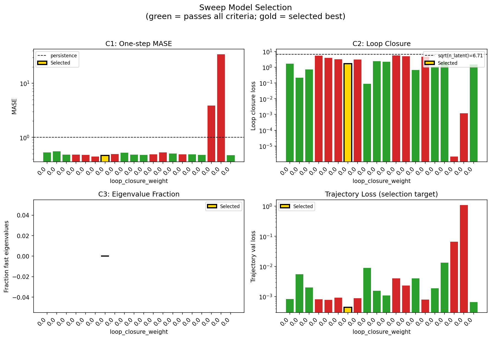

### sweep_pareto

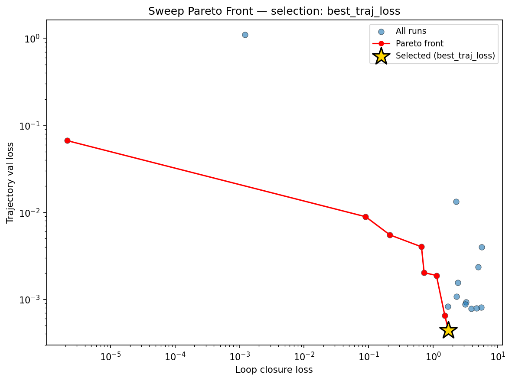

### reconstruction

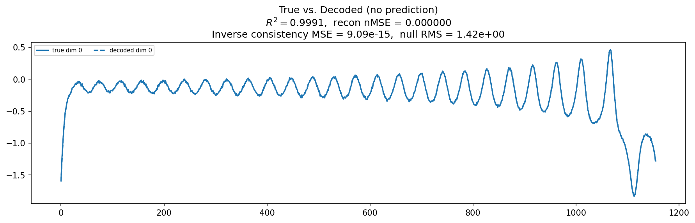

### prediction_windows

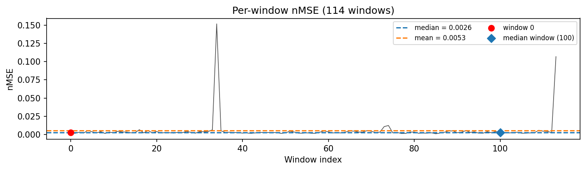

### long_trajectory

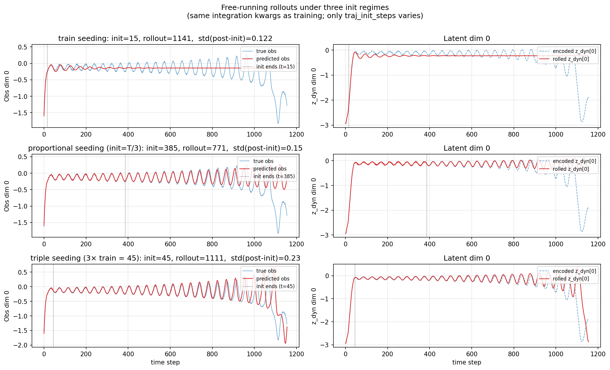

### mase

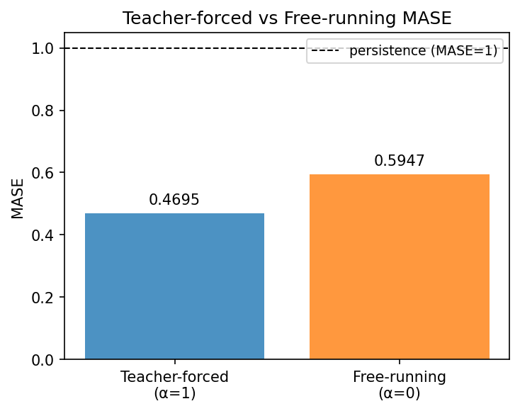

### latent_utilization

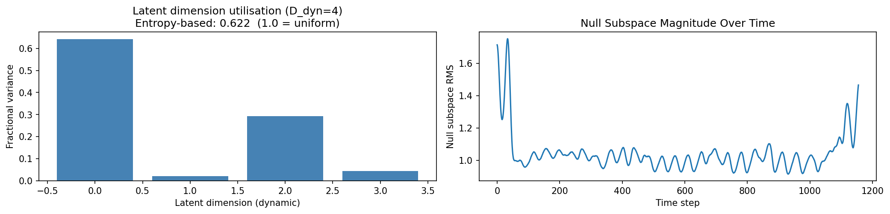

### lyapunov

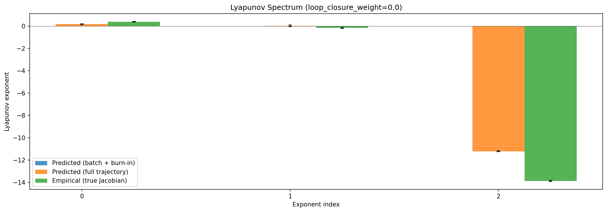

### kaplan_yorke

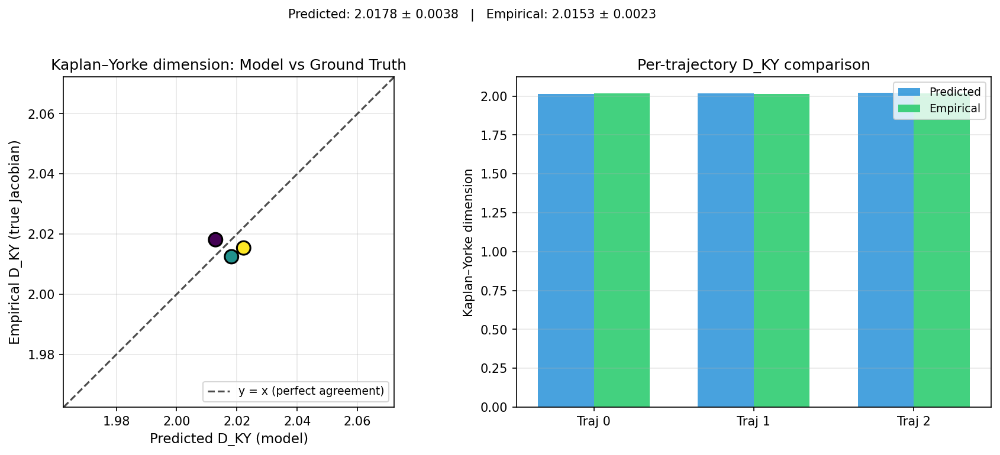

### per_run_lyapunov

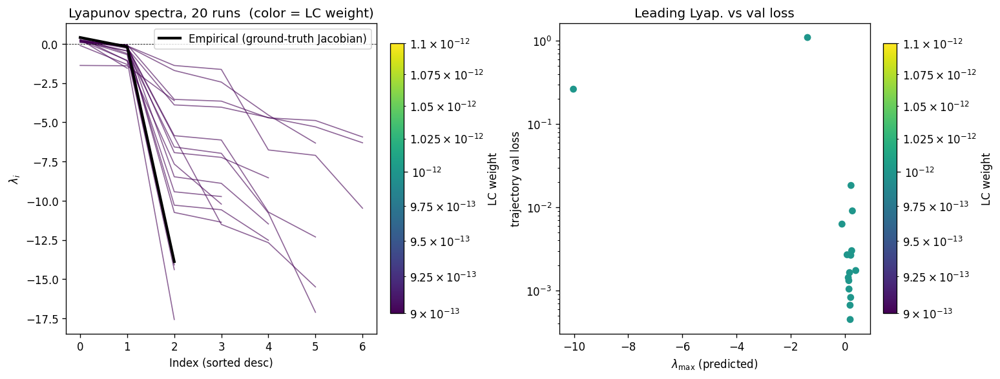

### per_run_lyapunov_vs_true

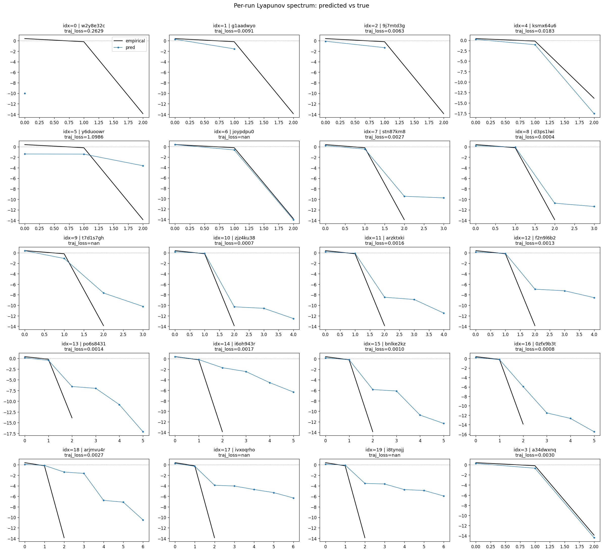

### per_run_lyapunov_relerr

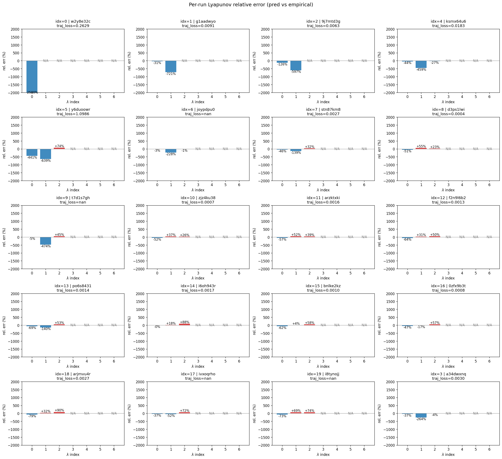

### encoder_decoder_jacobians

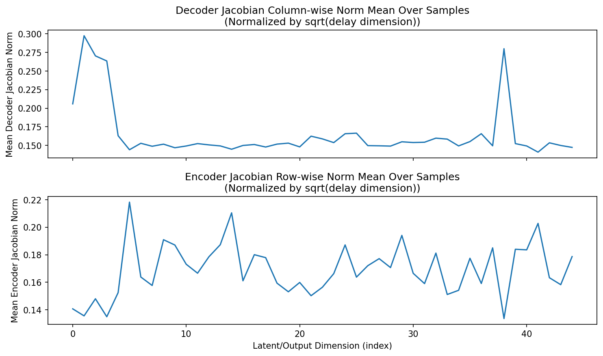

### amplification

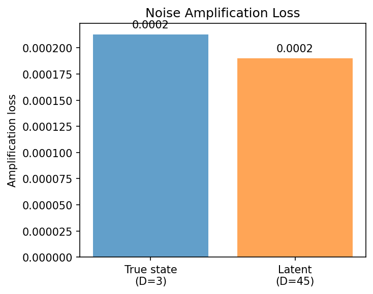

### kaplan_yorke_pca

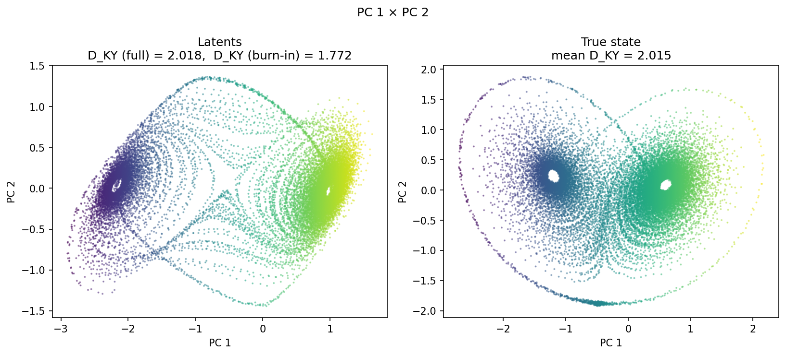

### prediction_detail_latent

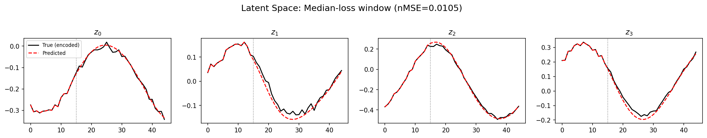

### prediction_detail_obs

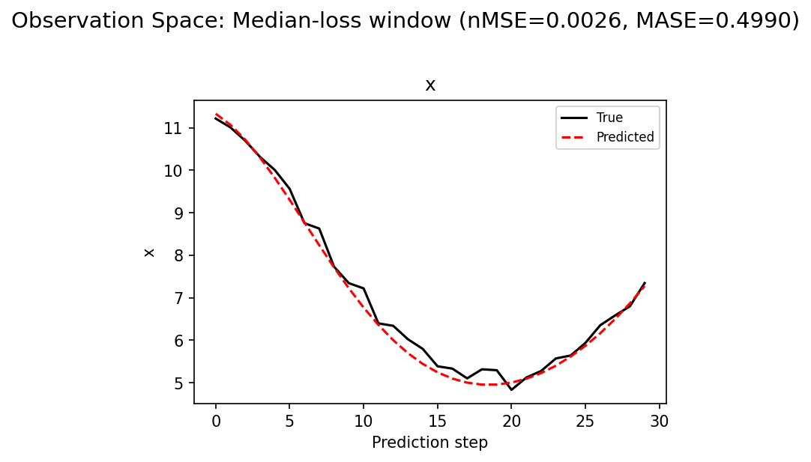

### tangent_spectrum

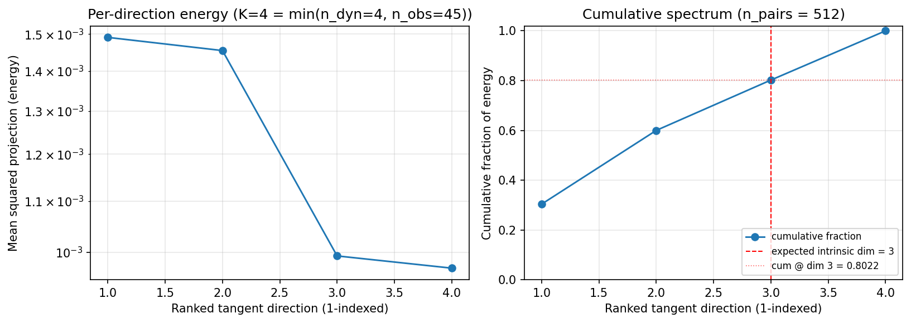

### per_run_tangent_spectrum

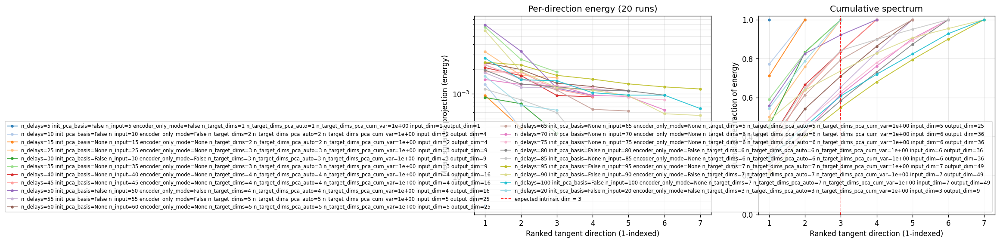

## Discussion

<!--
This section is intentionally left as a placeholder. A human reviewer
or Claude Code agent should fill it in based on the tables and figures
above, explicitly addressing each success criterion and comparing the
outcome to the stated hypothesis. Write the Discussion to
`discussion.md` in this directory and re-run `render_report`.
-->

_(to be written)_

## `run_analytics` stdout

<details><summary>Click to expand — full diagnostic output from <code>run_analytics</code></summary>

```
No run_id provided — selecting best run from group 'lorenz_partial_additive_mse_mostrecent_p30_obsnoise001_init15_autodim__ndelays_sweep' ...
Found 21 total runs in JacobianODE/Lorenz_INDpartial_NDInitSweep_autodim_D1_NormTrue__JacobianODE (group=lorenz_partial_additive_mse_mostrecent_p30_obsnoise001_init15_autodim__ndelays_sweep)
All runs (state, loop_closure_weight, tangent_entropy_weight, kl_dyn_weight):
  w2y8e32c: state=finished, lc=0.0, te=0.0, kl_dyn=0.0
  g1aadwyo: state=finished, lc=0.0, te=0.0, kl_dyn=0.0
  9j7mtd3g: state=finished, lc=0.0, te=0.0, kl_dyn=0.0
  3seql3o0: state=finished, lc=0.0, te=0.0, kl_dyn=0.0
  ksmx64u6: state=finished, lc=0.0, te=0.0, kl_dyn=0.0
  y6duoowr: state=finished, lc=0.0, te=0.0, kl_dyn=0.0
  joypdpu0: state=finished, lc=0.0, te=0.0, kl_dyn=0.0
  stn87km8: state=finished, lc=0.0, te=0.0, kl_dyn=0.0
  d3ps1lwi: state=finished, lc=0.0, te=0.0, kl_dyn=0.0
  t7d1s7gh: state=finished, lc=0.0, te=0.0, kl_dyn=0.0
  zjz4ku38: state=finished, lc=0.0, te=0.0, kl_dyn=0.0
  arzktxki: state=finished, lc=0.0, te=0.0, kl_dyn=0.0
  f2n9l6b2: state=finished, lc=0.0, te=0.0, kl_dyn=0.0
  po6s8431: state=finished, lc=0.0, te=0.0, kl_dyn=0.0
  i6oh943r: state=crashed, lc=0.0, te=0.0, kl_dyn=0.0
  bnlke2kz: state=finished, lc=0.0, te=0.0, kl_dyn=0.0
  0zfx9b3t: state=crashed, lc=0.0, te=0.0, kl_dyn=0.0
  arjmvu4r: state=crashed, lc=0.0, te=0.0, kl_dyn=0.0
  ivxoqrho: state=finished, lc=0.0, te=0.0, kl_dyn=0.0
  i8tynojj: state=finished, lc=0.0, te=0.0, kl_dyn=0.0
  a34dwxnq: state=finished, lc=0.0, te=0.0, kl_dyn=0.0

slurm_timeout_min not found in any run config — falling back to 180 min
  Including w2y8e32c (lc=0.0): use_all_runs=True (state=finished)
  Including g1aadwyo (lc=0.0): use_all_runs=True (state=finished)
  Including 9j7mtd3g (lc=0.0): use_all_runs=True (state=finished)
  Including 3seql3o0 (lc=0.0): use_all_runs=True (state=finished)
  Including ksmx64u6 (lc=0.0): use_all_runs=True (state=finished)
  Including y6duoowr (lc=0.0): use_all_runs=True (state=finished)
  Including joypdpu0 (lc=0.0): use_all_runs=True (state=finished)
  Including stn87km8 (lc=0.0): use_all_runs=True (state=finished)
  Including d3ps1lwi (lc=0.0): use_all_runs=True (state=finished)
  Including t7d1s7gh (lc=0.0): use_all_runs=True (state=finished)
  Including zjz4ku38 (lc=0.0): use_all_runs=True (state=finished)
  Including arzktxki (lc=0.0): use_all_runs=True (state=finished)
  Including f2n9l6b2 (lc=0.0): use_all_runs=True (state=finished)
  Including po6s8431 (lc=0.0): use_all_runs=True (state=finished)
  Including i6oh943r (lc=0.0): use_all_runs=True (state=crashed)
  Including bnlke2kz (lc=0.0): use_all_runs=True (state=finished)
  Including 0zfx9b3t (lc=0.0): use_all_runs=True (state=crashed)
  Including arjmvu4r (lc=0.0): use_all_runs=True (state=crashed)
  Including ivxoqrho (lc=0.0): use_all_runs=True (state=finished)
  Including i8tynojj (lc=0.0): use_all_runs=True (state=finished)
  Including a34dwxnq (lc=0.0): use_all_runs=True (state=finished)
Found 21 effectively-done sweep runs:
  loop_closure_weight=0.0, tangent_entropy_weight=0.0, kl_dyn_weight=0.0 -> run_id=0zfx9b3t
  loop_closure_weight=0.0, tangent_entropy_weight=0.0, kl_dyn_weight=0.0 -> run_id=3seql3o0
  loop_closure_weight=0.0, tangent_entropy_weight=0.0, kl_dyn_weight=0.0 -> run_id=9j7mtd3g
  loop_closure_weight=0.0, tangent_entropy_weight=0.0, kl_dyn_weight=0.0 -> run_id=a34dwxnq
  loop_closure_weight=0.0, tangent_entropy_weight=0.0, kl_dyn_weight=0.0 -> run_id=arjmvu4r
  loop_closure_weight=0.0, tangent_entropy_weight=0.0, kl_dyn_weight=0.0 -> run_id=arzktxki
  loop_closure_weight=0.0, tangent_entropy_weight=0.0, kl_dyn_weight=0.0 -> run_id=bnlke2kz
  loop_closure_weight=0.0, tangent_entropy_weight=0.0, kl_dyn_weight=0.0 -> run_id=d3ps1lwi
  loop_closure_weight=0.0, tangent_entropy_weight=0.0, kl_dyn_weight=0.0 -> run_id=f2n9l6b2
  loop_closure_weight=0.0, tangent_entropy_weight=0.0, kl_dyn_weight=0.0 -> run_id=g1aadwyo
  loop_closure_weight=0.0, tangent_entropy_weight=0.0, kl_dyn_weight=0.0 -> run_id=i6oh943r
  loop_closure_weight=0.0, tangent_entropy_weight=0.0, kl_dyn_weight=0.0 -> run_id=i8tynojj
  loop_closure_weight=0.0, tangent_entropy_weight=0.0, kl_dyn_weight=0.0 -> run_id=ivxoqrho
  loop_closure_weight=0.0, tangent_entropy_weight=0.0, kl_dyn_weight=0.0 -> run_id=joypdpu0
  loop_closure_weight=0.0, tangent_entropy_weight=0.0, kl_dyn_weight=0.0 -> run_id=ksmx64u6
  loop_closure_weight=0.0, tangent_entropy_weight=0.0, kl_dyn_weight=0.0 -> run_id=po6s8431
  loop_closure_weight=0.0, tangent_entropy_weight=0.0, kl_dyn_weight=0.0 -> run_id=stn87km8
  loop_closure_weight=0.0, tangent_entropy_weight=0.0, kl_dyn_weight=0.0 -> run_id=t7d1s7gh
  loop_closure_weight=0.0, tangent_entropy_weight=0.0, kl_dyn_weight=0.0 -> run_id=w2y8e32c
  loop_closure_weight=0.0, tangent_entropy_weight=0.0, kl_dyn_weight=0.0 -> run_id=y6duoowr
  loop_closure_weight=0.0, tangent_entropy_weight=0.0, kl_dyn_weight=0.0 -> run_id=zjz4ku38
  Dropping 1 run(s) with no checkpoint dir: ['3seql3o0']
n_dims=85, n_latent=85, n_dyn=6, dt=0.0150
  run=0zfx9b3t: DiagnosticMetrics(one_step_mase=0.5283381342887878, loop_closure_loss=1.693570852279663, fast_eigenvalue_fraction=0.0, trajectory_val_loss=0.0008239136659540236) (from W&B history)
  run=9j7mtd3g: DiagnosticMetrics(one_step_mase=0.5508890151977539, loop_closure_loss=0.21350474655628204, fast_eigenvalue_fraction=0.0, trajectory_val_loss=0.0055006034672260284) (from W&B history)
  run=a34dwxnq: DiagnosticMetrics(one_step_mase=0.4810470640659332, loop_closure_loss=0.7241966724395752, fast_eigenvalue_fraction=0.0, trajectory_val_loss=0.0020247555803507566) (from W&B history)
  run=arjmvu4r: DiagnosticMetrics(one_step_mase=0.4803175926208496, loop_closure_loss=5.527017593383789, fast_eigenvalue_fraction=0.0, trajectory_val_loss=0.0008119009435176849) (from W&B history)
  run=arzktxki: DiagnosticMetrics(one_step_mase=0.4733150601387024, loop_closure_loss=3.9098424911499023, fast_eigenvalue_fraction=0.0, trajectory_val_loss=0.0007852786220610142) (from W&B history)
  run=bnlke2kz: DiagnosticMetrics(one_step_mase=0.4412899613380432, loop_closure_loss=3.2213733196258545, fast_eigenvalue_fraction=0.0, trajectory_val_loss=0.0009293089970014989) (from W&B history)
  run=d3ps1lwi: DiagnosticMetrics(one_step_mase=0.4643539488315582, loop_closure_loss=1.721946358680725, fast_eigenvalue_fraction=0.0, trajectory_val_loss=0.00044178252574056387) (from W&B history)
  run=f2n9l6b2: DiagnosticMetrics(one_step_mase=0.49131083488464355, loop_closure_loss=3.132566213607788, fast_eigenvalue_fraction=0.0, trajectory_val_loss=0.0008752223802730441) (from W&B history)
  run=g1aadwyo: DiagnosticMetrics(one_step_mase=0.5211939215660095, loop_closure_loss=0.09001751244068146, fast_eigenvalue_fraction=0.0, trajectory_val_loss=0.008903604932129383) (from W&B history)
  run=i6oh943r: DiagnosticMetrics(one_step_mase=0.48158013820648193, loop_closure_loss=2.4047398567199707, fast_eigenvalue_fraction=0.0, trajectory_val_loss=0.0015659504570066929) (from W&B history)
  run=i8tynojj: DiagnosticMetrics(one_step_mase=0.47509074211120605, loop_closure_loss=2.2841503620147705, fast_eigenvalue_fraction=0.0, trajectory_val_loss=0.0010818451410159469) (from W&B history)
  run=ivxoqrho: DiagnosticMetrics(one_step_mase=0.4863307476043701, loop_closure_loss=5.634922027587891, fast_eigenvalue_fraction=0.0, trajectory_val_loss=0.003983493894338608) (from W&B history)
  run=joypdpu0: DiagnosticMetrics(one_step_mase=0.5261607766151428, loop_closure_loss=4.956460475921631, fast_eigenvalue_fraction=0.0, trajectory_val_loss=0.002340638544410467) (from W&B history)
  run=ksmx64u6: DiagnosticMetrics(one_step_mase=0.502865195274353, loop_closure_loss=0.6588351726531982, fast_eigenvalue_fraction=0.0, trajectory_val_loss=0.004016640596091747) (from W&B history)
  run=po6s8431: DiagnosticMetrics(one_step_mase=0.4852477014064789, loop_closure_loss=4.683459281921387, fast_eigenvalue_fraction=0.0, trajectory_val_loss=0.0007877791649661958) (from W&B history)
  run=stn87km8: DiagnosticMetrics(one_step_mase=0.4874505400657654, loop_closure_loss=1.122267246246338, fast_eigenvalue_fraction=0.0, trajectory_val_loss=0.001881297561340034) (from W&B history)
  run=t7d1s7gh: DiagnosticMetrics(one_step_mase=0.47719937562942505, loop_closure_loss=2.2563648223876953, fast_eigenvalue_fraction=0.0, trajectory_val_loss=0.013305213302373886) (from W&B history)
  run=w2y8e32c: DiagnosticMetrics(one_step_mase=3.854644298553467, loop_closure_loss=2.128328787875944e-06, fast_eigenvalue_fraction=0.0, trajectory_val_loss=0.06675933301448822) (from W&B history)
  run=y6duoowr: DiagnosticMetrics(one_step_mase=34.35683059692383, loop_closure_loss=0.001217939192429185, fast_eigenvalue_fraction=0.0, trajectory_val_loss=1.0985738039016724) (from W&B history)
  run=zjz4ku38: DiagnosticMetrics(one_step_mase=0.46935245394706726, loop_closure_loss=1.514388918876648, fast_eigenvalue_fraction=0.0, trajectory_val_loss=0.0006527548539452255) (from W&B history)

Ranking method:           best_traj_loss
Best run ID:              d3ps1lwi
Best loop_closure_weight: 0.0
Best tangent_entropy_weight: 0.0
Best kl_dyn_weight:       0.0
Best traj loss:           0.000442
Criteria applied: ['C1', 'C2', 'C3']
Surviving: 11 / 20
Auto-selected run_id: d3ps1lwi

======================================================================
PARETO FRONTIER RUNS (8 runs)
======================================================================
  Run ID               LC Loss   Traj Val Loss
  ------------  --------------  --------------
  w2y8e32c            0.000002        0.066759
  g1aadwyo            0.090018        0.008904
  9j7mtd3g            0.213505        0.005501
  ksmx64u6            0.658835        0.004017
  a34dwxnq            0.724197        0.002025
  stn87km8            1.122267        0.001881
  zjz4ku38            1.514389        0.000653
  d3ps1lwi            1.721946        0.000442 <-- selected

======================================================================
RANKING METHOD COMPARISON (over 11 survivors)
======================================================================
  Method                  Run ID               LC Loss   Traj Val Loss
  ----------------------  ------------  --------------  --------------
  best_traj_loss          d3ps1lwi            1.721946        0.000442 <-- active
  pareto_knee             a34dwxnq            0.724197        0.002025
  geo_rank                d3ps1lwi            1.721946        0.000442
  minimax_rank            stn87km8            1.122267        0.001881
  geo_log_score           d3ps1lwi            1.721946        0.000442
  minimax_log_score       a34dwxnq            0.724197        0.002025
======================================================================

Loading run d3ps1lwi from JacobianODE/Lorenz_INDpartial_NDInitSweep_autodim_D1_NormTrue__JacobianODE ...
Train dataset shape: torch.Size([24442, 45, 45])
Validation dataset shape: torch.Size([7777, 45, 45])
Test dataset shape: torch.Size([3333, 45, 45])
Train trajectories dataset shape: torch.Size([22, 1156, 45])
Validation trajectories dataset shape: torch.Size([7, 1156, 45])
Test trajectories dataset shape: torch.Size([3, 1156, 45])
Loading checkpoint epoch=176-step=35400.ckpt...
Computing reconstruction ...
Computing MASE ...
Teacher-forced MASE: 0.4695
Free-running MASE:   0.5947
Computing latent utilization ...
Entropy-based utilization: 0.622
Null subspace mean RMS: 1.046999e+00
Computing Lyapunov exponents ...
  Computing full-trajectory Lyapunov (3 test trajs, T=1156) ...
Predicted Lyapunov exponents (batch+burn-in, 128 windowed trajs):
  λ_1 = +nan ± nan
  λ_2 = +nan ± nan
  λ_3 = +nan ± nan
  λ_4 = +nan ± nan
Predicted Lyapunov exponents (full-length, 3 test trajs):
  λ_1 = +0.1691 ± 0.0361
  λ_2 = +0.0306 ± 0.0777
  λ_3 = -11.2178 ± 0.0377
  λ_4 = -11.8187 ± 0.0102
Empirical Lyapunov exponents (mean ± std):
  λ_1 = +0.3846 ± 0.0251
  λ_2 = -0.1716 ± 0.0444
  λ_3 = -13.8799 ± 0.0398
Mean KY dim (predicted): 2.018 ± 0.004
Mean KY dim (empirical): 2.015 ± 0.002
Mean KY dim (burn-in):   1.772 ± 0.529
Computing prediction windows ...
Windows: 114 — nMSE min=0.0009, median=0.0026, mean=0.0053, max=0.1520
Computing long-trajectory free-running rollouts ...
Computing encoder/decoder Jacobians ...
encoder_jacobian: (128, 45, 45)
decoder_jacobian: (128, 45, 45)
Computing amplification loss ...
Amplification loss — True state: 0.000213
Amplification loss — Latent:     0.000190
Computing tangent space spectrum ...
```

</details>
