# Sweep Analysis: `lorenz_partial_additive_mse_uniform_p30_obsnoise001__ndelays_initsteps_autodim`

**Project**: [Lorenz_INDpartial_NDInitSweep_autodim_D1_NormTrue__JacobianODE](https://wandb.ai/JacobianODE/Lorenz_INDpartial_NDInitSweep_autodim_D1_NormTrue__JacobianODE/groups/lorenz_partial_additive_mse_uniform_p30_obsnoise001__ndelays_initsteps_autodim)  
**Launched**: 2026-04-20T19:55:11Z  
**Completed**: 2026-04-21T04:00:20Z  
**Outcome**: `complete_clean`  
**Git**: `latent-JacobianODE` @ `6f807fc`  
**Expected runs**: 40

## Experiment Context

### `lorenz_partial_additive_mse_uniform_p30_obsnoise001__ndelays_initsteps_autodim`

**Description**

Lorenz partial additive coupling, uniform reconstruction loss,
obs_noise=0.01, prediction_steps=30, loop_closure_weight=0.
Sweeps delay_embedding_params.n_delays over
[5, 10, 15, ..., 100] (step 5, 20 values)
× jacobianODEint_kwargs.traj_init_steps over [15, 30]
= 40 runs.
n_target_dims is picked at data-load time as the smallest k such
that the first k PCs of the noisy training delay embeddings explain
≥ model.n_target_var_threshold of the total variance.
final_perm_identity=true on the encoder guarantees that at init
z[..., :n_target_dims] == x[..., :n_target_dims] — the first
n_target_dims most-recent observations flow into z_dyn without
depending on permutation_seed.

**Hypothesis**

At a given obs_noise level, both n_delays and traj_init_steps
change how much state information is accumulated before the
dynamics model is asked to predict. The PCA-auto dim lets each
n_delays pick its own latent dimensionality, so that comparing
across n_delays is a fair comparison of "how much useful rank
is present" rather than "how well 3 fixed dims capture different
embeddings." With routing fixed, no n_delays will fail the
decoded[0]-disconnected-from-z_dyn failure mode we saw at seed=42
n_delays=30. We expect: (i) at higher traj_init_steps, every
n_delays achieves a better val_loss since the encoder has more
history to work with; (ii) a soft optimum in n_delays tracking
the point where PCA-auto n_target_dims stops growing.

**Success criteria**

- All 40 runs train without divergence (routing fix holds)
- PCA-chosen n_target_dims grows with n_delays then saturates
- Val traj_loss improves with traj_init_steps=30 over traj_init_steps=15 at most n_delays
- Best val traj_loss per (noise, init) has a non-monotonic optimum in n_delays

## Results

**Swept axes** (9): `data.train_test_params.delay_embedding_params.n_delays`, `data.train_test_params.seq_length`, `model.encoder.n_input`, `model.n_target_dims`, `model.n_target_dims_pca_auto`, `model.n_target_dims_pca_cum_var`, `model.params.input_dim`, `model.params.output_dim`, `training.lightning.jacobianODEint_kwargs.traj_init_steps`

**Chosen run** (by `best_traj_loss`): `mwd5kgho` — traj_loss=0.00063, MASE=0.6510, R²=0.9983, LC loss=0.479, epoch=165.0

Swept-axis values at chosen run: `data.train_test_params.delay_embedding_params.n_delays`=40 · `data.train_test_params.seq_length`=60 · `model.encoder.n_input`=40 · `model.n_target_dims`=4 · `model.n_target_dims_pca_auto`=4 · `model.n_target_dims_pca_cum_var`=0.995447 · `model.params.input_dim`=4 · `model.params.output_dim`=16 · `training.lightning.jacobianODEint_kwargs.traj_init_steps`=30

**Runs analyzed**: 40 (expected 40)

### Per-run results

| run_idx | run_id | `data.train_test_params.delay_embedding_params.n_delays` | `data.train_test_params.seq_length` | `model.encoder.n_input` | `model.n_target_dims` | `model.n_target_dims_pca_auto` | `model.n_target_dims_pca_cum_var` | `model.params.input_dim` | `model.params.output_dim` | `training.lightning.jacobianODEint_kwargs.traj_init_steps` | best_traj_loss | best_MASE | R² | LC loss | epoch |
|---|---|---|---|---|---|---|---|---|---|---|---|---|---|---|---|
| 15 | `mwd5kgho` | 40 | 60 | 40 | 4 | 4 | 0.995447 | 4 | 16 | 30 | 0.00063 | 0.6510 | 0.9983 | 0.479 | 165.0 |
| 22 | `2mukzabp` | 60 | 45 | 60 | 5 | 5 | 0.993171 | 5 | 25 | 15 | 0.00090 | 0.7218 | 0.9976 | 3.934 | 100.0 |
| 7 | `9ku1zcbn` | 20 | 60 | 20 | 3 | 3 | 0.998615 | 3 | 9 | 30 | 0.00115 | 0.7377 | 0.9969 | 0.159 | 100.0 |
| 27 | `2wrj3chp` | 70 | 60 | 70 | 6 | 6 | 0.994529 | 6 | 36 | 30 | 0.00116 | 0.8191 | 0.9969 | 2.158 | 115.0 |
| 20 | `d0dd2rwn` | 55 | 45 | 55 | 5 | 5 | 0.994855 | 5 | 25 | 15 | 0.00117 | 0.7347 | 0.9969 | 0.906 | 115.0 |
| 37 | `qanhc2n6` | 95 | 60 | 95 | 7 | 7 | 0.992462 | 7 | 49 | 30 | 0.00122 | 0.8130 | 0.9967 | 4.509 | 114.0 |
| 21 | `ujup82ac` | 55 | 60 | 55 | 5 | 5 | 0.994855 | 5 | 25 | 30 | 0.00128 | 0.7850 | 0.9966 | 0.768 | 89.0 |
| 26 | `naxyvm25` | 70 | 45 | 70 | 6 | 6 | 0.994529 | 6 | 36 | 15 | 0.00133 | 0.8662 | 0.9965 | 2.609 | 115.0 |
| 19 | `tbc0sn6k` | 50 | 60 | 50 | 4 | 4 | 0.990769 | 4 | 16 | 30 | 0.00137 | 0.8659 | 0.9964 | 0.545 | 123.0 |
| 9 | `uh2gim40` | 25 | 60 | 25 | 3 | 3 | 0.997001 | 3 | 9 | 30 | 0.00143 | 0.7691 | 0.9961 | 0.307 | 103.0 |
| 36 | `s6py0jgm` | 95 | 45 | 95 | 7 | 7 | 0.992462 | 7 | 49 | 15 | 0.00144 | 0.8495 | 0.9961 | 8.124 | 117.0 |
| 17 | `19bk9bgk` | 45 | 60 | 45 | 4 | 4 | 0.993267 | 4 | 16 | 30 | 0.00144 | 0.8824 | 0.9961 | 0.501 | 117.0 |
| 18 | `fesvj9gx` | 50 | 45 | 50 | 4 | 4 | 0.990769 | 4 | 16 | 15 | 0.00145 | 0.8473 | 0.9961 | 0.833 | 115.0 |
| 8 | `8hntsv8t` | 25 | 45 | 25 | 3 | 3 | 0.997001 | 3 | 9 | 15 | 0.00147 | 0.7837 | 0.9961 | 0.415 | 125.0 |
| 16 | `3bhm9cwb` | 45 | 45 | 45 | 4 | 4 | 0.993267 | 4 | 16 | 15 | 0.00154 | 0.9538 | 0.9957 | 0.644 | 93.0 |
| 14 | `lmfnwfju` | 40 | 45 | 40 | 4 | 4 | 0.995447 | 4 | 16 | 15 | 0.00155 | 0.8199 | 0.9958 | 0.777 | 51.0 |
| 32 | `ub83b692` | 85 | 45 | 85 | 6 | 6 | 0.990619 | 6 | 36 | 15 | 0.00156 | 0.9354 | 0.9959 | 4.314 | 108.0 |
| 25 | `ctm835as` | 65 | 60 | 65 | 5 | 5 | 0.991353 | 5 | 25 | 30 | 0.00156 | 0.8399 | 0.9958 | 0.851 | 101.0 |
| 6 | `7yi2s4lj` | 20 | 45 | 20 | 3 | 3 | 0.998615 | 3 | 9 | 15 | 0.00161 | 0.7683 | 0.9956 | 0.132 | 179.0 |
| 31 | `ww7xn01z` | 80 | 60 | 80 | 6 | 6 | 0.991932 | 6 | 36 | 30 | 0.00163 | 0.8997 | 0.9956 | 1.279 | 106.0 |
| 24 | `9s2b04k4` | 65 | 45 | 65 | 5 | 5 | 0.991353 | 5 | 25 | 15 | 0.00174 | 0.8635 | 0.9954 | 1.822 | 118.0 |
| 33 | `u7z0l6t9` | 85 | 60 | 85 | 6 | 6 | 0.990619 | 6 | 36 | 30 | 0.00175 | 0.9634 | 0.9953 | 1.994 | 108.0 |
| 10 | `cteqr957` | 30 | 45 | 30 | 3 | 3 | 0.994315 | 3 | 9 | 15 | 0.00182 | 0.8434 | 0.9951 | 0.903 | 162.0 |
| 13 | `bcmi4sfg` | 35 | 60 | 35 | 3 | 3 | 0.990505 | 3 | 9 | 30 | 0.00196 | 1.0474 | 0.9948 | 0.847 | 121.0 |
| 30 | `xfx1bpzk` | 80 | 45 | 80 | 6 | 6 | 0.991932 | 6 | 36 | 15 | 0.00216 | 0.9811 | 0.9942 | 2.520 | 69.0 |
| 35 | `da4mcx9g` | 90 | 60 | 90 | 7 | 7 | 0.993494 | 7 | 49 | 30 | 0.00219 | 0.9754 | 0.9942 | 3.584 | 114.0 |
| 28 | `unoug06z` | 75 | 45 | 75 | 6 | 6 | 0.993244 | 6 | 36 | 15 | 0.00219 | 1.0552 | 0.9941 | 2.746 | 155.0 |
| 12 | `ifm65vdy` | 35 | 45 | 35 | 3 | 3 | 0.990505 | 3 | 9 | 15 | 0.00221 | 1.1297 | 0.9942 | 1.293 | 103.0 |
| 39 | `ls3lu1o8` | 100 | 60 | 100 | 7 | 7 | 0.991454 | 7 | 49 | 30 | 0.00231 | 0.9989 | 0.9938 | 1.907 | 95.0 |
| 38 | `t61g53wz` | 100 | 45 | 100 | 7 | 7 | 0.991454 | 7 | 49 | 15 | 0.00245 | 1.0361 | 0.9934 | 3.260 | 81.0 |
| 5 | `xr9flz8e` | 15 | 60 | 15 | 2 | 2 | 0.995018 | 2 | 4 | 30 | 0.00250 | 0.9717 | 0.9933 | 0.200 | 90.0 |
| 34 | `gu634bsb` | 90 | 45 | 90 | 7 | 7 | 0.993494 | 7 | 49 | 15 | 0.00288 | 1.1246 | 0.9922 | 4.210 | 94.0 |
| 23 | `f7mxpwk4` | 60 | 60 | 60 | 5 | 5 | 0.993171 | 5 | 25 | 30 | 0.00291 | 1.1178 | 0.9921 | 4.230 | 46.0 |
| 29 | `1zx69knt` | 75 | 60 | 75 | 6 | 6 | 0.993244 | 6 | 36 | 30 | 0.00296 | 1.2479 | 0.9921 | 1.429 | 108.0 |
| 4 | `vblk9kz9` | 15 | 45 | 15 | 2 | 2 | 0.995018 | 2 | 4 | 15 | 0.00361 | 0.9913 | 0.9906 | 0.511 | 176.0 |
| 11 | `28anfd5u` | 30 | 60 | 30 | 3 | 3 | 0.994315 | 3 | 9 | 30 | 0.00435 | 1.2723 | 0.9877 | 0.150 | 35.0 |
| 2 | `fhrst1rb` | 10 | 45 | 10 | 2 | 2 | 0.998549 | 2 | 4 | 15 | 0.00542 | 1.2260 | 0.9854 | 0.105 | 151.0 |
| 0 | `vum47n54` | 5 | 45 | 5 | 1 | 1 | 0.993092 | 1 | 1 | 15 | 0.07173 | 6.8762 | 0.8097 | 0.000 | 126.0 |
| 1 | `9u7h6zjy` | 5 | 60 | 5 | 1 | 1 | 0.993092 | 1 | 1 | 30 | 0.07484 | 6.9776 | 0.7998 | 0.000 | 83.0 |
| 3 | `f93huri8` | 10 | 60 | 10 | 2 | 2 | 0.998549 | 2 | 4 | 30 | nan | nan | nan | 0.010 | — |

## Success-criteria verdicts (automated)

| Criterion | Verdict | Note |
|---|---|---|
| All 40 runs train without divergence (routing fix holds) | **Unknown** |  |
| PCA-chosen n_target_dims grows with n_delays then saturates | **Unknown** |  |
| Val traj_loss improves with traj_init_steps=30 over traj_init_steps=15 at most n_delays | **Unknown** |  |
| Best val traj_loss per (noise, init) has a non-monotonic optimum in n_delays | **Unknown** |  |

_Automated verdicts use simple numeric-threshold parsing and may mis-classify qualitative criteria. The Discussion section below takes precedence._

## Figures

### sweep_overview

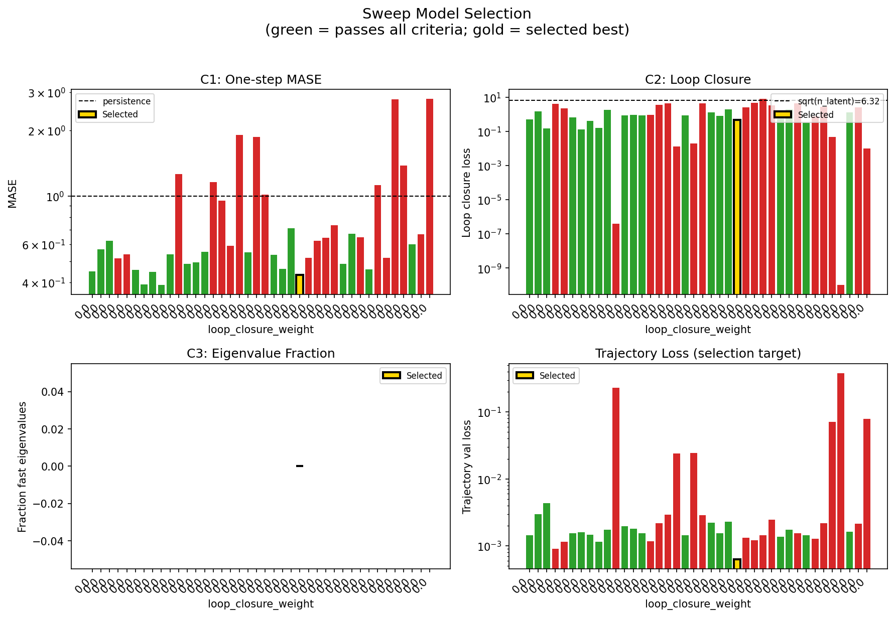

### sweep_pareto

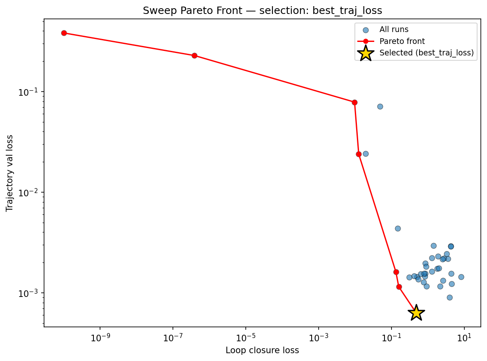

### reconstruction

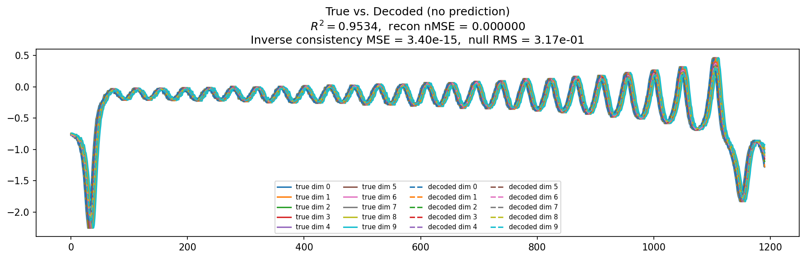

### prediction_windows

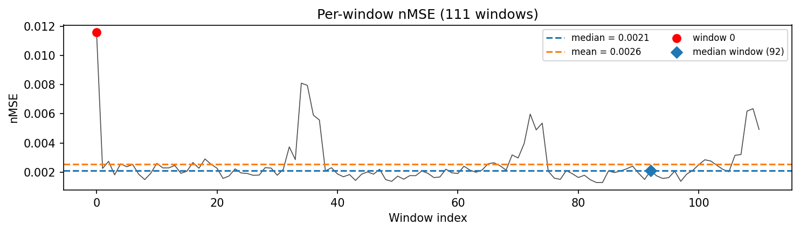

### long_trajectory

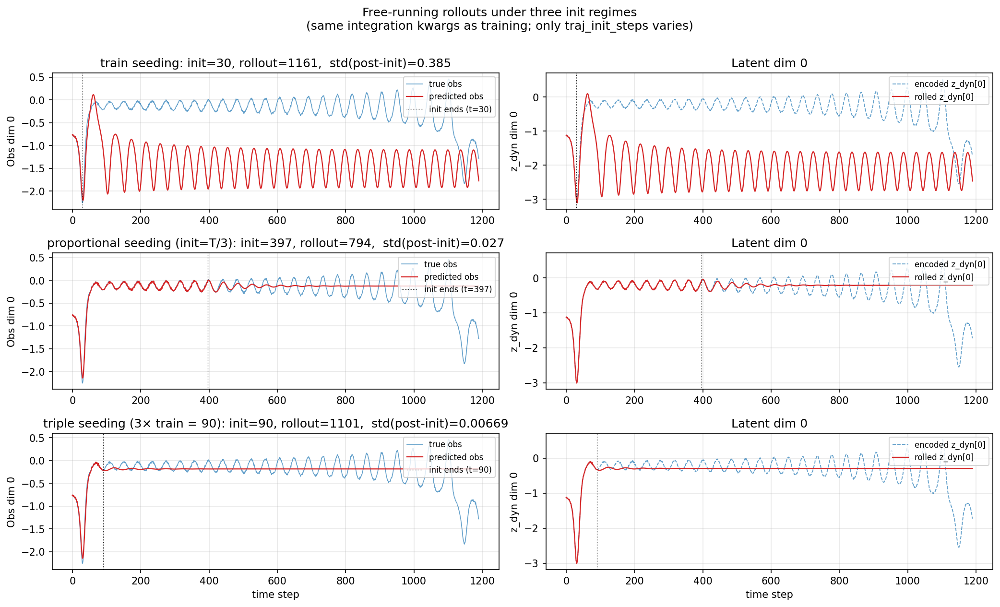

### mase

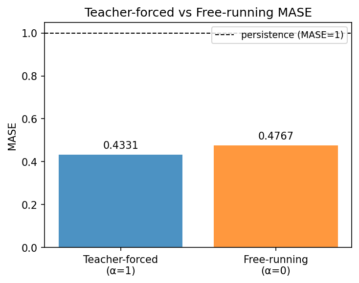

### latent_utilization

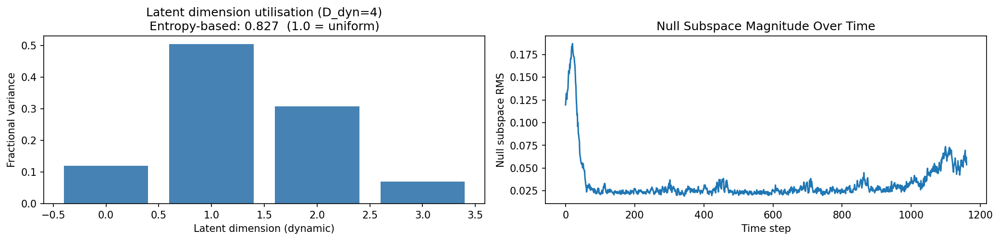

### lyapunov

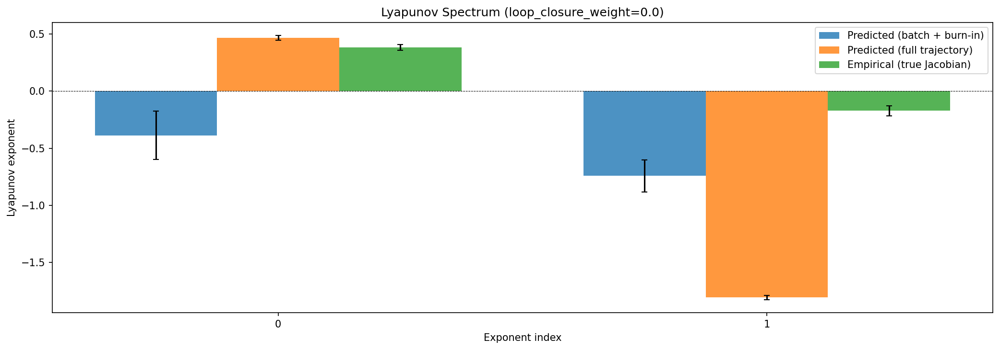

### kaplan_yorke

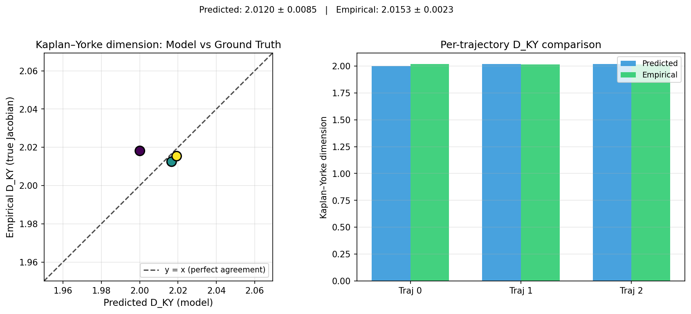

### per_run_lyapunov

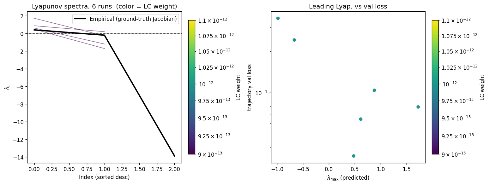

### per_run_lyapunov_vs_true

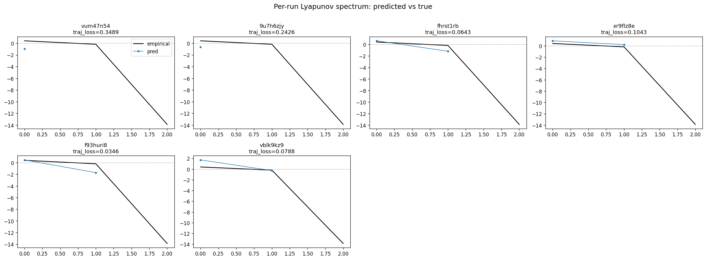

### per_run_lyapunov_relerr

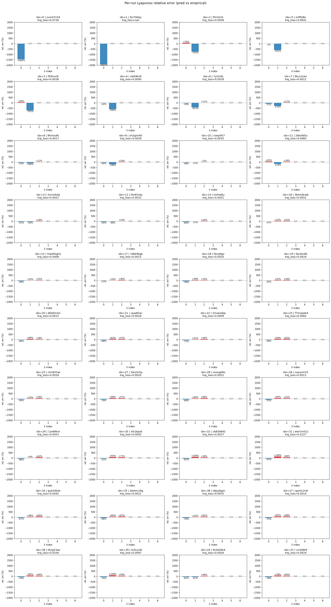

### encoder_decoder_jacobians

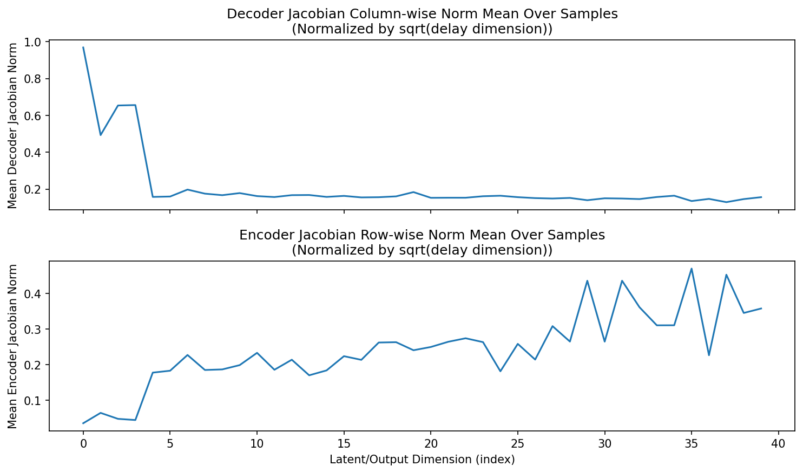

### amplification

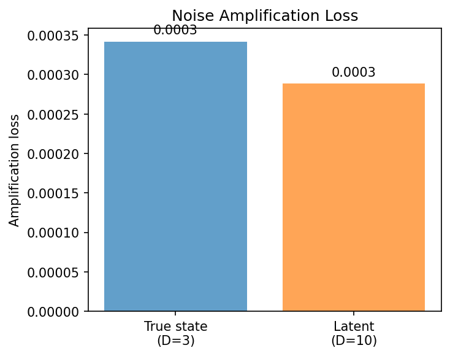

### kaplan_yorke_pca

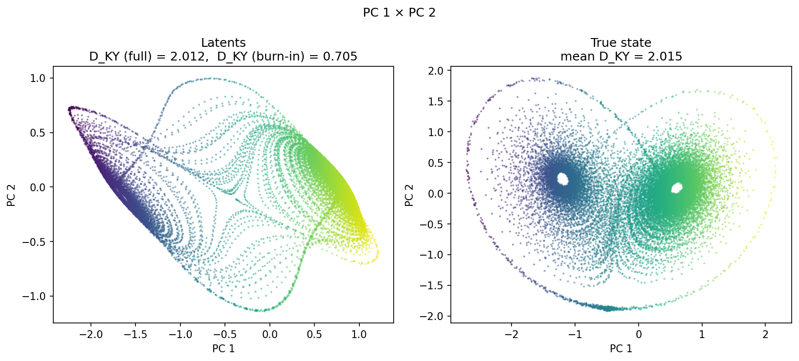

### prediction_detail_latent

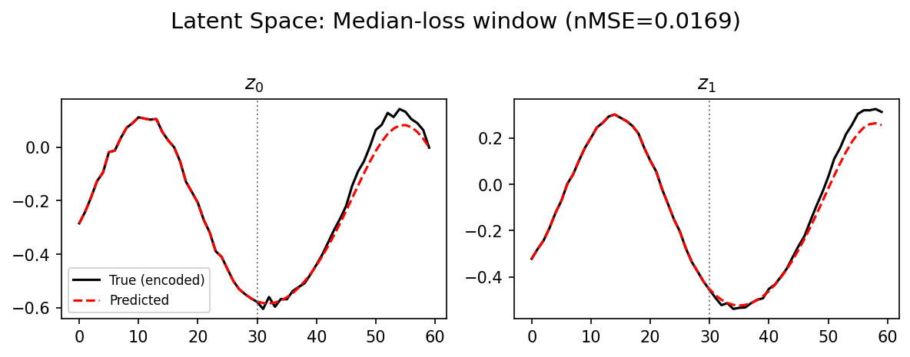

### prediction_detail_obs

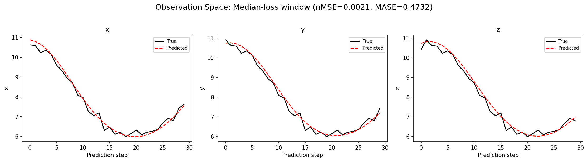

## Discussion

<!--
This section is intentionally left as a placeholder. A human reviewer
or Claude Code agent should fill it in based on the tables and figures
above, explicitly addressing each success criterion and comparing the
outcome to the stated hypothesis. Write the Discussion to
`discussion.md` in this directory and re-run `render_report`.
-->

_(to be written)_

## `run_analytics` stdout

<details><summary>Click to expand — full diagnostic output from <code>run_analytics</code></summary>

```
No run_id provided — selecting best run from group 'lorenz_partial_additive_mse_uniform_p30_obsnoise001__ndelays_initsteps_autodim' ...
Found 42 total runs in JacobianODE/Lorenz_INDpartial_NDInitSweep_autodim_D1_NormTrue__JacobianODE (group=lorenz_partial_additive_mse_uniform_p30_obsnoise001__ndelays_initsteps_autodim)
All runs (state, loop_closure_weight, tangent_entropy_weight, kl_dyn_weight):
  vum47n54: state=finished, lc=0.0, te=0.0, kl_dyn=0.0
  9u7h6zjy: state=finished, lc=0.0, te=0.0, kl_dyn=0.0
  fhrst1rb: state=finished, lc=0.0, te=0.0, kl_dyn=0.0
  xr9flz8e: state=finished, lc=0.0, te=0.0, kl_dyn=0.0
  f93huri8: state=finished, lc=0.0, te=0.0, kl_dyn=0.0
  vblk9kz9: state=finished, lc=0.0, te=0.0, kl_dyn=0.0
  7yi2s4lj: state=finished, lc=0.0, te=0.0, kl_dyn=0.0
  9ku1zcbn: state=finished, lc=0.0, te=0.0, kl_dyn=0.0
  8hntsv8t: state=finished, lc=0.0, te=0.0, kl_dyn=0.0
  uh2gim40: state=finished, lc=0.0, te=0.0, kl_dyn=0.0
  cteqr957: state=finished, lc=0.0, te=0.0, kl_dyn=0.0
  28anfd5u: state=finished, lc=0.0, te=0.0, kl_dyn=0.0
  bcmi4sfg: state=finished, lc=0.0, te=0.0, kl_dyn=0.0
  ifm65vdy: state=finished, lc=0.0, te=0.0, kl_dyn=0.0
  lmfnwfju: state=finished, lc=0.0, te=0.0, kl_dyn=0.0
  3bhm9cwb: state=finished, lc=0.0, te=0.0, kl_dyn=0.0
  mwd5kgho: state=finished, lc=0.0, te=0.0, kl_dyn=0.0
  19bk9bgk: state=finished, lc=0.0, te=0.0, kl_dyn=0.0
  fesvj9gx: state=finished, lc=0.0, te=0.0, kl_dyn=0.0
  tbc0sn6k: state=finished, lc=0.0, te=0.0, kl_dyn=0.0
  d0dd2rwn: state=finished, lc=0.0, te=0.0, kl_dyn=0.0
  ujup82ac: state=finished, lc=0.0, te=0.0, kl_dyn=0.0
  2mukzabp: state=finished, lc=0.0, te=0.0, kl_dyn=0.0
  db2jesdp: state=finished, lc=0.0, te=0.0, kl_dyn=0.0
  f7mxpwk4: state=finished, lc=0.0, te=0.0, kl_dyn=0.0
  ctm835as: state=finished, lc=0.0, te=0.0, kl_dyn=0.0
  2wrj3chp: state=finished, lc=0.0, te=0.0, kl_dyn=0.0
  unoug06z: state=finished, lc=0.0, te=0.0, kl_dyn=0.0
  naxyvm25: state=finished, lc=0.0, te=0.0, kl_dyn=0.0
  1zx69knt: state=finished, lc=0.0, te=0.0, kl_dyn=0.0
  xfx1bpzk: state=finished, lc=0.0, te=0.0, kl_dyn=0.0
  ub83b692: state=finished, lc=0.0, te=0.0, kl_dyn=0.0
  ww7xn01z: state=finished, lc=0.0, te=0.0, kl_dyn=0.0
  1kcizs0m: state=finished, lc=0.0, te=0.0, kl_dyn=0.0
  gu634bsb: state=finished, lc=0.0, te=0.0, kl_dyn=0.0
  da4mcx9g: state=finished, lc=0.0, te=0.0, kl_dyn=0.0
  s6py0jgm: state=finished, lc=0.0, te=0.0, kl_dyn=0.0
  qanhc2n6: state=finished, lc=0.0, te=0.0, kl_dyn=0.0
  t61g53wz: state=finished, lc=0.0, te=0.0, kl_dyn=0.0
  ls3lu1o8: state=finished, lc=0.0, te=0.0, kl_dyn=0.0
  9s2b04k4: state=finished, lc=0.0, te=0.0, kl_dyn=0.0
  u7z0l6t9: state=finished, lc=0.0, te=0.0, kl_dyn=0.0

slurm_timeout_min not found in any run config — falling back to 180 min
  Including vum47n54 (lc=0.0): use_all_runs=True (state=finished)
  Including 9u7h6zjy (lc=0.0): use_all_runs=True (state=finished)
  Including fhrst1rb (lc=0.0): use_all_runs=True (state=finished)
  Including xr9flz8e (lc=0.0): use_all_runs=True (state=finished)
  Including f93huri8 (lc=0.0): use_all_runs=True (state=finished)
  Including vblk9kz9 (lc=0.0): use_all_runs=True (state=finished)
  Including 7yi2s4lj (lc=0.0): use_all_runs=True (state=finished)
  Including 9ku1zcbn (lc=0.0): use_all_runs=True (state=finished)
  Including 8hntsv8t (lc=0.0): use_all_runs=True (state=finished)
  Including uh2gim40 (lc=0.0): use_all_runs=True (state=finished)
  Including cteqr957 (lc=0.0): use_all_runs=True (state=finished)
  Including 28anfd5u (lc=0.0): use_all_runs=True (state=finished)
  Including bcmi4sfg (lc=0.0): use_all_runs=True (state=finished)
  Including ifm65vdy (lc=0.0): use_all_runs=True (state=finished)
  Including lmfnwfju (lc=0.0): use_all_runs=True (state=finished)
  Including 3bhm9cwb (lc=0.0): use_all_runs=True (state=finished)
  Including mwd5kgho (lc=0.0): use_all_runs=True (state=finished)
  Including 19bk9bgk (lc=0.0): use_all_runs=True (state=finished)
  Including fesvj9gx (lc=0.0): use_all_runs=True (state=finished)
  Including tbc0sn6k (lc=0.0): use_all_runs=True (state=finished)
  Including d0dd2rwn (lc=0.0): use_all_runs=True (state=finished)
  Including ujup82ac (lc=0.0): use_all_runs=True (state=finished)
  Including 2mukzabp (lc=0.0): use_all_runs=True (state=finished)
  Including db2jesdp (lc=0.0): use_all_runs=True (state=finished)
  Including f7mxpwk4 (lc=0.0): use_all_runs=True (state=finished)
  Including ctm835as (lc=0.0): use_all_runs=True (state=finished)
  Including 2wrj3chp (lc=0.0): use_all_runs=True (state=finished)
  Including unoug06z (lc=0.0): use_all_runs=True (state=finished)
  Including naxyvm25 (lc=0.0): use_all_runs=True (state=finished)
  Including 1zx69knt (lc=0.0): use_all_runs=True (state=finished)
  Including xfx1bpzk (lc=0.0): use_all_runs=True (state=finished)
  Including ub83b692 (lc=0.0): use_all_runs=True (state=finished)
  Including ww7xn01z (lc=0.0): use_all_runs=True (state=finished)
  Including 1kcizs0m (lc=0.0): use_all_runs=True (state=finished)
  Including gu634bsb (lc=0.0): use_all_runs=True (state=finished)
  Including da4mcx9g (lc=0.0): use_all_runs=True (state=finished)
  Including s6py0jgm (lc=0.0): use_all_runs=True (state=finished)
  Including qanhc2n6 (lc=0.0): use_all_runs=True (state=finished)
  Including t61g53wz (lc=0.0): use_all_runs=True (state=finished)
  Including ls3lu1o8 (lc=0.0): use_all_runs=True (state=finished)
  Including 9s2b04k4 (lc=0.0): use_all_runs=True (state=finished)
  Including u7z0l6t9 (lc=0.0): use_all_runs=True (state=finished)
Found 42 effectively-done sweep runs:
  loop_closure_weight=0.0, tangent_entropy_weight=0.0, kl_dyn_weight=0.0 -> run_id=19bk9bgk
  loop_closure_weight=0.0, tangent_entropy_weight=0.0, kl_dyn_weight=0.0 -> run_id=1kcizs0m
  loop_closure_weight=0.0, tangent_entropy_weight=0.0, kl_dyn_weight=0.0 -> run_id=1zx69knt
  loop_closure_weight=0.0, tangent_entropy_weight=0.0, kl_dyn_weight=0.0 -> run_id=28anfd5u
  loop_closure_weight=0.0, tangent_entropy_weight=0.0, kl_dyn_weight=0.0 -> run_id=2mukzabp
  loop_closure_weight=0.0, tangent_entropy_weight=0.0, kl_dyn_weight=0.0 -> run_id=2wrj3chp
  loop_closure_weight=0.0, tangent_entropy_weight=0.0, kl_dyn_weight=0.0 -> run_id=3bhm9cwb
  loop_closure_weight=0.0, tangent_entropy_weight=0.0, kl_dyn_weight=0.0 -> run_id=7yi2s4lj
  loop_closure_weight=0.0, tangent_entropy_weight=0.0, kl_dyn_weight=0.0 -> run_id=8hntsv8t
  loop_closure_weight=0.0, tangent_entropy_weight=0.0, kl_dyn_weight=0.0 -> run_id=9ku1zcbn
  loop_closure_weight=0.0, tangent_entropy_weight=0.0, kl_dyn_weight=0.0 -> run_id=9s2b04k4
  loop_closure_weight=0.0, tangent_entropy_weight=0.0, kl_dyn_weight=0.0 -> run_id=9u7h6zjy
  loop_closure_weight=0.0, tangent_entropy_weight=0.0, kl_dyn_weight=0.0 -> run_id=bcmi4sfg
  loop_closure_weight=0.0, tangent_entropy_weight=0.0, kl_dyn_weight=0.0 -> run_id=cteqr957
  loop_closure_weight=0.0, tangent_entropy_weight=0.0, kl_dyn_weight=0.0 -> run_id=ctm835as
  loop_closure_weight=0.0, tangent_entropy_weight=0.0, kl_dyn_weight=0.0 -> run_id=d0dd2rwn
  loop_closure_weight=0.0, tangent_entropy_weight=0.0, kl_dyn_weight=0.0 -> run_id=da4mcx9g
  loop_closure_weight=0.0, tangent_entropy_weight=0.0, kl_dyn_weight=0.0 -> run_id=db2jesdp
  loop_closure_weight=0.0, tangent_entropy_weight=0.0, kl_dyn_weight=0.0 -> run_id=f7mxpwk4
  loop_closure_weight=0.0, tangent_entropy_weight=0.0, kl_dyn_weight=0.0 -> run_id=f93huri8
  loop_closure_weight=0.0, tangent_entropy_weight=0.0, kl_dyn_weight=0.0 -> run_id=fesvj9gx
  loop_closure_weight=0.0, tangent_entropy_weight=0.0, kl_dyn_weight=0.0 -> run_id=fhrst1rb
  loop_closure_weight=0.0, tangent_entropy_weight=0.0, kl_dyn_weight=0.0 -> run_id=gu634bsb
  loop_closure_weight=0.0, tangent_entropy_weight=0.0, kl_dyn_weight=0.0 -> run_id=ifm65vdy
  loop_closure_weight=0.0, tangent_entropy_weight=0.0, kl_dyn_weight=0.0 -> run_id=lmfnwfju
  loop_closure_weight=0.0, tangent_entropy_weight=0.0, kl_dyn_weight=0.0 -> run_id=ls3lu1o8
  loop_closure_weight=0.0, tangent_entropy_weight=0.0, kl_dyn_weight=0.0 -> run_id=mwd5kgho
  loop_closure_weight=0.0, tangent_entropy_weight=0.0, kl_dyn_weight=0.0 -> run_id=naxyvm25
  loop_closure_weight=0.0, tangent_entropy_weight=0.0, kl_dyn_weight=0.0 -> run_id=qanhc2n6
  loop_closure_weight=0.0, tangent_entropy_weight=0.0, kl_dyn_weight=0.0 -> run_id=s6py0jgm
  loop_closure_weight=0.0, tangent_entropy_weight=0.0, kl_dyn_weight=0.0 -> run_id=t61g53wz
  loop_closure_weight=0.0, tangent_entropy_weight=0.0, kl_dyn_weight=0.0 -> run_id=tbc0sn6k
  loop_closure_weight=0.0, tangent_entropy_weight=0.0, kl_dyn_weight=0.0 -> run_id=u7z0l6t9
  loop_closure_weight=0.0, tangent_entropy_weight=0.0, kl_dyn_weight=0.0 -> run_id=ub83b692
  loop_closure_weight=0.0, tangent_entropy_weight=0.0, kl_dyn_weight=0.0 -> run_id=uh2gim40
  loop_closure_weight=0.0, tangent_entropy_weight=0.0, kl_dyn_weight=0.0 -> run_id=ujup82ac
  loop_closure_weight=0.0, tangent_entropy_weight=0.0, kl_dyn_weight=0.0 -> run_id=unoug06z
  loop_closure_weight=0.0, tangent_entropy_weight=0.0, kl_dyn_weight=0.0 -> run_id=vblk9kz9
  loop_closure_weight=0.0, tangent_entropy_weight=0.0, kl_dyn_weight=0.0 -> run_id=vum47n54
  loop_closure_weight=0.0, tangent_entropy_weight=0.0, kl_dyn_weight=0.0 -> run_id=ww7xn01z
  loop_closure_weight=0.0, tangent_entropy_weight=0.0, kl_dyn_weight=0.0 -> run_id=xfx1bpzk
  loop_closure_weight=0.0, tangent_entropy_weight=0.0, kl_dyn_weight=0.0 -> run_id=xr9flz8e
  Dropping 2 run(s) with no checkpoint dir: ['1kcizs0m', 'db2jesdp']
n_dims=45, n_latent=45, n_dyn=4, dt=0.0150
  run=19bk9bgk: DiagnosticMetrics(one_step_mase=0.45049813389778137, loop_closure_loss=0.500860333442688, fast_eigenvalue_fraction=0.0, trajectory_val_loss=0.001443450921215117) (from cache, n_batches=100)
  run=1zx69knt: DiagnosticMetrics(one_step_mase=0.5688852667808533, loop_closure_loss=1.428652048110962, fast_eigenvalue_fraction=0.0, trajectory_val_loss=0.0029551475308835506) (from cache, n_batches=100)
  run=28anfd5u: DiagnosticMetrics(one_step_mase=0.6225888133049011, loop_closure_loss=0.1501152366399765, fast_eigenvalue_fraction=0.0, trajectory_val_loss=0.004348913673311472) (from cache, n_batches=100)
  run=2mukzabp: DiagnosticMetrics(one_step_mase=0.5155223608016968, loop_closure_loss=3.9342236518859863, fast_eigenvalue_fraction=0.0, trajectory_val_loss=0.0008993926458060741) (from cache, n_batches=100)
  run=2wrj3chp: DiagnosticMetrics(one_step_mase=0.5398163795471191, loop_closure_loss=2.158484697341919, fast_eigenvalue_fraction=0.0, trajectory_val_loss=0.0011577341938391328) (from cache, n_batches=100)
  run=3bhm9cwb: DiagnosticMetrics(one_step_mase=0.4573795795440674, loop_closure_loss=0.6444074511528015, fast_eigenvalue_fraction=0.0, trajectory_val_loss=0.0015387774910777807) (from cache, n_batches=100)
  run=7yi2s4lj: DiagnosticMetrics(one_step_mase=0.39183130860328674, loop_closure_loss=0.13248783349990845, fast_eigenvalue_fraction=0.0, trajectory_val_loss=0.001612941618077457) (from cache, n_batches=100)
  run=8hntsv8t: DiagnosticMetrics(one_step_mase=0.44732266664505005, loop_closure_loss=0.4154837131500244, fast_eigenvalue_fraction=0.0, trajectory_val_loss=0.0014671949902549386) (from cache, n_batches=100)
  run=9ku1zcbn: DiagnosticMetrics(one_step_mase=0.38968488574028015, loop_closure_loss=0.15855036675930023, fast_eigenvalue_fraction=0.0, trajectory_val_loss=0.001148528652265668) (from cache, n_batches=100)
  run=9s2b04k4: DiagnosticMetrics(one_step_mase=0.5400614738464355, loop_closure_loss=1.8215380907058716, fast_eigenvalue_fraction=0.0, trajectory_val_loss=0.0017378047341480851) (from cache, n_batches=100)
  run=9u7h6zjy: DiagnosticMetrics(one_step_mase=1.2581123113632202, loop_closure_loss=3.9132567053457024e-07, fast_eigenvalue_fraction=0.0, trajectory_val_loss=0.22783158719539642) (from cache, n_batches=100)
  run=bcmi4sfg: DiagnosticMetrics(one_step_mase=0.48876404762268066, loop_closure_loss=0.8471764326095581, fast_eigenvalue_fraction=0.0, trajectory_val_loss=0.001959516666829586) (from cache, n_batches=100)
  run=cteqr957: DiagnosticMetrics(one_step_mase=0.4954272508621216, loop_closure_loss=0.9030600786209106, fast_eigenvalue_fraction=0.0, trajectory_val_loss=0.001819030032493174) (from cache, n_batches=100)
  run=ctm835as: DiagnosticMetrics(one_step_mase=0.5541290044784546, loop_closure_loss=0.8512558937072754, fast_eigenvalue_fraction=0.0, trajectory_val_loss=0.0015556997386738658) (from cache, n_batches=100)
  run=d0dd2rwn: DiagnosticMetrics(one_step_mase=1.157900333404541, loop_closure_loss=0.9055870175361633, fast_eigenvalue_fraction=0.0, trajectory_val_loss=0.001165163703262806) (from cache, n_batches=100)
  run=da4mcx9g: DiagnosticMetrics(one_step_mase=0.9530088305473328, loop_closure_loss=3.584273099899292, fast_eigenvalue_fraction=0.0, trajectory_val_loss=0.0021893219090998173) (from cache, n_batches=100)
  run=f7mxpwk4: DiagnosticMetrics(one_step_mase=0.5914601683616638, loop_closure_loss=4.230276584625244, fast_eigenvalue_fraction=0.0, trajectory_val_loss=0.002912758616730571) (from cache, n_batches=100)
  run=f93huri8: DiagnosticMetrics(one_step_mase=1.9041943550109863, loop_closure_loss=0.012637934647500515, fast_eigenvalue_fraction=0.0, trajectory_val_loss=0.02388305589556694) (from cache, n_batches=100)
  run=fesvj9gx: DiagnosticMetrics(one_step_mase=0.5516402125358582, loop_closure_loss=0.8331121206283569, fast_eigenvalue_fraction=0.0, trajectory_val_loss=0.0014535405207425356) (from cache, n_batches=100)
  run=fhrst1rb: DiagnosticMetrics(one_step_mase=1.8668575286865234, loop_closure_loss=0.019352059811353683, fast_eigenvalue_fraction=0.0, trajectory_val_loss=0.024262426421046257) (from cache, n_batches=100)
  run=gu634bsb: DiagnosticMetrics(one_step_mase=1.016064167022705, loop_closure_loss=4.210305690765381, fast_eigenvalue_fraction=0.0, trajectory_val_loss=0.0028843434993177652) (from cache, n_batches=100)
  run=ifm65vdy: DiagnosticMetrics(one_step_mase=0.5349423885345459, loop_closure_loss=1.2933228015899658, fast_eigenvalue_fraction=0.0, trajectory_val_loss=0.0022114207968115807) (from cache, n_batches=100)
  run=lmfnwfju: DiagnosticMetrics(one_step_mase=0.46289074420928955, loop_closure_loss=0.7771902680397034, fast_eigenvalue_fraction=0.0, trajectory_val_loss=0.001549824490211904) (from cache, n_batches=100)
  run=ls3lu1o8: DiagnosticMetrics(one_step_mase=0.7110051512718201, loop_closure_loss=1.9073632955551147, fast_eigenvalue_fraction=0.0, trajectory_val_loss=0.002314868615940213) (from cache, n_batches=100)
  run=mwd5kgho: DiagnosticMetrics(one_step_mase=0.43435487151145935, loop_closure_loss=0.47887882590293884, fast_eigenvalue_fraction=0.0, trajectory_val_loss=0.0006314231432043016) (from cache, n_batches=100)
  run=naxyvm25: DiagnosticMetrics(one_step_mase=0.5187263488769531, loop_closure_loss=2.6093761920928955, fast_eigenvalue_fraction=0.0, trajectory_val_loss=0.0013251893687993288) (from cache, n_batches=100)
  run=qanhc2n6: DiagnosticMetrics(one_step_mase=0.6229138970375061, loop_closure_loss=4.508563041687012, fast_eigenvalue_fraction=0.0, trajectory_val_loss=0.0012236930197104812) (from cache, n_batches=100)
  run=s6py0jgm: DiagnosticMetrics(one_step_mase=0.64365553855896, loop_closure_loss=8.123761177062988, fast_eigenvalue_fraction=0.0, trajectory_val_loss=0.0014419842045754194) (from cache, n_batches=100)
  run=t61g53wz: DiagnosticMetrics(one_step_mase=0.7339745759963989, loop_closure_loss=3.259683847427368, fast_eigenvalue_fraction=0.0, trajectory_val_loss=0.002445017220452428) (from cache, n_batches=100)
  run=tbc0sn6k: DiagnosticMetrics(one_step_mase=0.4870520830154419, loop_closure_loss=0.5453914403915405, fast_eigenvalue_fraction=0.0, trajectory_val_loss=0.001365299103781581) (from cache, n_batches=100)
  run=u7z0l6t9: DiagnosticMetrics(one_step_mase=0.6686484813690186, loop_closure_loss=1.9942762851715088, fast_eigenvalue_fraction=0.0, trajectory_val_loss=0.0017507827142253518) (from cache, n_batches=100)
  run=ub83b692: DiagnosticMetrics(one_step_mase=0.6460710763931274, loop_closure_loss=4.313647270202637, fast_eigenvalue_fraction=0.0, trajectory_val_loss=0.0015551038086414337) (from cache, n_batches=100)
  run=uh2gim40: DiagnosticMetrics(one_step_mase=0.46096792817115784, loop_closure_loss=0.30656537413597107, fast_eigenvalue_fraction=0.0, trajectory_val_loss=0.0014330625999718904) (from cache, n_batches=100)
  run=ujup82ac: DiagnosticMetrics(one_step_mase=1.1193588972091675, loop_closure_loss=0.7681381702423096, fast_eigenvalue_fraction=0.0, trajectory_val_loss=0.001275933813303709) (from cache, n_batches=100)
  run=unoug06z: DiagnosticMetrics(one_step_mase=0.5201263427734375, loop_closure_loss=2.7462873458862305, fast_eigenvalue_fraction=0.0, trajectory_val_loss=0.0021947945933789015) (from cache, n_batches=100)
  run=vblk9kz9: DiagnosticMetrics(one_step_mase=2.775660514831543, loop_closure_loss=0.047992728650569916, fast_eigenvalue_fraction=0.0, trajectory_val_loss=0.07126376032829285) (from cache, n_batches=100)
  run=vum47n54: DiagnosticMetrics(one_step_mase=1.3777366876602173, loop_closure_loss=1.0135444566961027e-10, fast_eigenvalue_fraction=0.0, trajectory_val_loss=0.38192814588546753) (from cache, n_batches=100)
  run=ww7xn01z: DiagnosticMetrics(one_step_mase=0.5987681150436401, loop_closure_loss=1.2793498039245605, fast_eigenvalue_fraction=0.0, trajectory_val_loss=0.0016272536013275385) (from cache, n_batches=100)
  run=xfx1bpzk: DiagnosticMetrics(one_step_mase=0.6671359539031982, loop_closure_loss=2.5201685428619385, fast_eigenvalue_fraction=0.0, trajectory_val_loss=0.0021609135437756777) (from cache, n_batches=100)
  run=xr9flz8e: DiagnosticMetrics(one_step_mase=2.7965402603149414, loop_closure_loss=0.009711168706417084, fast_eigenvalue_fraction=0.0, trajectory_val_loss=0.07851911336183548) (from cache, n_batches=100)

Ranking method:           best_traj_loss
Best run ID:              mwd5kgho
Best loop_closure_weight: 0.0
Best tangent_entropy_weight: 0.0
Best kl_dyn_weight:       0.0
Best traj loss:           0.000631
Criteria applied: ['C1', 'C2', 'C3']
Surviving: 20 / 40
Auto-selected run_id: mwd5kgho

======================================================================
PARETO FRONTIER RUNS (7 runs)
======================================================================
  Run ID               LC Loss   Traj Val Loss
  ------------  --------------  --------------
  vum47n54            0.000000        0.381928
  9u7h6zjy            0.000000        0.227832
  xr9flz8e            0.009711        0.078519
  f93huri8            0.012638        0.023883
  7yi2s4lj            0.132488        0.001613
  9ku1zcbn            0.158550        0.001149
  mwd5kgho            0.478879        0.000631 <-- selected

======================================================================
RANKING METHOD COMPARISON (over 20 survivors)
======================================================================
  Method                  Run ID               LC Loss   Traj Val Loss
  ----------------------  ------------  --------------  --------------
  best_traj_loss          mwd5kgho            0.478879        0.000631 <-- active
  pareto_knee             9ku1zcbn            0.158550        0.001149
  geo_rank                9ku1zcbn            0.158550        0.001149
  minimax_rank            9ku1zcbn            0.158550        0.001149
  geo_log_score           7yi2s4lj            0.132488        0.001613
  minimax_log_score       9ku1zcbn            0.158550        0.001149
======================================================================

Loading run mwd5kgho from JacobianODE/Lorenz_INDpartial_NDInitSweep_autodim_D1_NormTrue__JacobianODE ...
Train dataset shape: torch.Size([24222, 60, 40])
Validation dataset shape: torch.Size([7707, 60, 40])
Test dataset shape: torch.Size([3303, 60, 40])
Train trajectories dataset shape: torch.Size([22, 1161, 40])
Validation trajectories dataset shape: torch.Size([7, 1161, 40])
Test trajectories dataset shape: torch.Size([3, 1161, 40])
Loading checkpoint epoch=165-step=33200.ckpt...
Computing reconstruction ...
Computing MASE ...
Teacher-forced MASE: 0.4331
Free-running MASE:   0.4767
Computing latent utilization ...
Entropy-based utilization: 0.827
Null subspace mean RMS: 4.127183e-02
Computing Lyapunov exponents ...
  Computing full-trajectory Lyapunov (3 test trajs, T=1161) ...
Predicted Lyapunov exponents (batch+burn-in, 128 windowed trajs):
  λ_1 = +0.0973 ± 0.3705
  λ_2 = -0.4449 ± 0.3380
  λ_3 = -10.1039 ± 1.4395
  λ_4 = -10.7352 ± 1.3873
Predicted Lyapunov exponents (full-length, 3 test trajs):
  λ_1 = +0.2100 ± 0.0806
  λ_2 = -0.0800 ± 0.0319
  λ_3 = -10.7356 ± 0.1418
  λ_4 = -11.4897 ± 0.0324
Empirical Lyapunov exponents (mean ± std):
  λ_1 = +0.3846 ± 0.0251
  λ_2 = -0.1716 ± 0.0444
  λ_3 = -13.8799 ± 0.0398
Mean KY dim (predicted): 2.012 ± 0.008
Mean KY dim (empirical): 2.015 ± 0.002
Mean KY dim (burn-in):   0.705 ± 0.782
Computing prediction windows ...
Windows: 111 — nMSE min=0.0013, median=0.0021, mean=0.0026, max=0.0116
Computing long-trajectory free-running rollouts ...
Computing encoder/decoder Jacobians ...
encoder_jacobian: (128, 40, 40)
decoder_jacobian: (128, 40, 40)
Computing amplification loss ...
Amplification loss — True state: 0.000213
Amplification loss — Latent:     0.000857
```

</details>
