# Sweep Analysis: `lorenz_partial_additive_mse_uniform_p30_obsnoise001_top3nd_init15_autodim__lc_sweep`

**Project**: [Lorenz_INDpartial_NDInitSweep_autodim_D1_NormTrue__JacobianODE](https://wandb.ai/JacobianODE/Lorenz_INDpartial_NDInitSweep_autodim_D1_NormTrue__JacobianODE/groups/lorenz_partial_additive_mse_uniform_p30_obsnoise001_top3nd_init15_autodim__lc_sweep)  
**Launched**: 2026-04-21T22:10:13Z  
**Completed**: 2026-04-22T12:30:31Z  
**Outcome**: `complete_clean`  
**Git**: `latent-JacobianODE` @ `3094575`  
**Expected runs**: 27

## Experiment Context

### `lorenz_partial_additive_mse_uniform_p30_obsnoise001_top3nd_init15_autodim__lc_sweep`

**Description**

Lorenz partial additive coupling, uniform reconstruction loss,
obs_noise=0.01, prediction_steps=30, traj_init_steps=15.
27-run sweep: 3 n_delays {55, 60, 70} × 9 LC weights
{0, 1e-6, 1e-5, 1e-4, 1e-3, 1e-2, 1e-1, 1, 10}. n_target_dims
picked by PCA-auto (threshold=0.99) per n_delays.
Goal: test whether the optimum n_delays is stable across LC
weight, or whether LC shifts the optimum — a direct check on
the two-stage-sweep assumption (best n_delays at LC=0 may not
be best n_delays at LC>0, see earlier discussion).

**Hypothesis**

If the optimum n_delays migrates as LC grows, the two-stage
sweep protocol (pick n_delays at LC=0 then sweep LC) is
unreliable and we'd need full joint sweeps in future. If the
optimum is stable, the two-stage protocol is efficient and we
can continue to use it. Separately: at this low-noise setting,
expect a soft LC optimum around 1e-4..1e-2 based on prior LC
sweeps at n_delays=25 at the same noise level.

**Success criteria**

- All 27 runs train without divergence
- Best (val traj_loss) over the grid is achieved at one (n_delays, LC) cell — optimum is identified unambiguously
- Optimum n_delays is stable across LC (same n_delays wins at its best LC as at LC=0), OR shifts in an interpretable way
- Best-LC run at the winning n_delays has lc_loss_at_best_tl < 1 (loop closes)

## Results

**Swept axes** (11): `data.train_test_params.delay_embedding_params.n_delays`, `model.encoder.init_pca_basis`, `model.encoder.n_input`, `model.encoder_only_mode`, `model.n_target_dims`, `model.n_target_dims_pca_auto`, `model.n_target_dims_pca_cum_var`, `model.params.input_dim`, `model.params.output_dim`, `model.trajectory_loss_most_recent`, `training.lightning.loop_closure_weight`

**Chosen run** (by `best_traj_loss`): `l6f9rzk6` — traj_loss=0.00038, MASE=0.5308, R²=0.9990, LC loss=1.037, epoch=197.0

Swept-axis values at chosen run: `data.train_test_params.delay_embedding_params.n_delays`=55 · `model.encoder.init_pca_basis`=False · `model.encoder.n_input`=55 · `model.encoder_only_mode`=None · `model.n_target_dims`=5 · `model.n_target_dims_pca_auto`=5 · `model.n_target_dims_pca_cum_var`=0.994855 · `model.params.input_dim`=5 · `model.params.output_dim`=25 · `model.trajectory_loss_most_recent`=True · `training.lightning.loop_closure_weight`=0

**Runs analyzed**: 27 (expected 27)

### Per-run results

| run_idx | run_id | `data.train_test_params.delay_embedding_params.n_delays` | `model.encoder.init_pca_basis` | `model.encoder.n_input` | `model.encoder_only_mode` | `model.n_target_dims` | `model.n_target_dims_pca_auto` | `model.n_target_dims_pca_cum_var` | `model.params.input_dim` | `model.params.output_dim` | `model.trajectory_loss_most_recent` | `training.lightning.loop_closure_weight` | best_traj_loss | best_MASE | R² | LC loss | epoch |
|---|---|---|---|---|---|---|---|---|---|---|---|---|---|---|---|---|---|
| 0 | `l6f9rzk6` | 55 | False | 55 | None | 5 | 5 | 0.994855 | 5 | 25 | True | 0 | 0.00038 | 0.5308 | 0.9990 | 1.037 | 197.0 |
| 12 | `ccvot8j5` | 60 | False | 60 | False | 5 | 5 | 0.993171 | 5 | 25 | True | 1.0e-04 | 0.00040 | 0.5325 | 0.9989 | 0.089 | 144.0 |
| 2 | `eyur9uex` | 55 | False | 55 | False | 5 | 5 | 0.994855 | 5 | 25 | True | 1.0e-05 | 0.00040 | 0.5457 | 0.9989 | 0.290 | 126.0 |
| 10 | `kgfm0hy6` | 60 | False | 60 | None | 5 | 5 | 0.993171 | 5 | 25 | True | 1.0e-06 | 0.00044 | 0.5473 | 0.9988 | 1.910 | 133.0 |
| 4 | `yrypeeyh` | 55 | False | 55 | False | 5 | 5 | 0.994855 | 5 | 25 | True | 0.001 | 0.00048 | 0.5648 | 0.9987 | 0.011 | 198.0 |
| 13 | `sgl4a6p9` | 60 | False | 60 | None | 5 | 5 | 0.993171 | 5 | 25 | True | 0.001 | 0.00056 | 0.6024 | 0.9984 | 0.031 | 127.0 |
| 18 | `7k1kdgp0` | 70 | False | 70 | False | 6 | 6 | 0.994529 | 6 | 36 | True | 0 | 0.00067 | 0.5907 | 0.9982 | 2.073 | 146.0 |
| 5 | `x62j5byr` | 55 | False | 55 | None | 5 | 5 | 0.994855 | 5 | 25 | True | 0.01 | 0.00077 | 0.6461 | 0.9979 | 0.002 | 166.0 |
| 9 | `g6ig1rsm` | 60 | None | 60 | None | 5 | 5 | 0.993171 | 5 | 25 | None | 0 | 0.00085 | 0.7177 | 0.9977 | 3.969 | 116.0 |
| 19 | `xlnxldo0` | 70 | False | 70 | None | 6 | 6 | 0.994529 | 6 | 36 | True | 1.0e-06 | 0.00088 | 0.6689 | 0.9976 | 1.633 | 95.0 |
| 14 | `76gyhpe1` | 60 | False | 60 | False | 5 | 5 | 0.993171 | 5 | 25 | True | 0.01 | 0.00090 | 0.6764 | 0.9975 | 0.004 | 113.0 |
| 11 | `vl219t40` | 60 | None | 60 | None | 5 | 5 | 0.993171 | 5 | 25 | None | 1.0e-05 | 0.00093 | 0.7164 | 0.9975 | 0.421 | 100.0 |
| 22 | `2w94ck0e` | 70 | False | 70 | False | 6 | 6 | 0.994529 | 6 | 36 | True | 0.001 | 0.00096 | 0.6753 | 0.9974 | 0.032 | 111.0 |
| 21 | `knza6xc2` | 70 | None | 70 | None | 6 | 6 | 0.994529 | 6 | 36 | None | 1.0e-04 | 0.00106 | 0.8099 | 0.9972 | 0.066 | 168.0 |
| 23 | `bwfhf7lf` | 70 | False | 70 | False | 6 | 6 | 0.994529 | 6 | 36 | True | 0.01 | 0.00128 | 0.7548 | 0.9966 | 0.005 | 101.0 |
| 20 | `rifvxbay` | 70 | None | 70 | None | 6 | 6 | 0.994529 | 6 | 36 | None | 1.0e-05 | 0.00136 | 0.8919 | 0.9964 | 0.487 | 105.0 |
| 3 | `229ofgpv` | 55 | None | 55 | None | 5 | 5 | 0.994855 | 5 | 25 | None | 1.0e-04 | 0.00152 | 0.8438 | 0.9959 | 0.058 | 107.0 |
| 6 | `yk2sxjx6` | 55 | None | 55 | None | 5 | 5 | 0.994855 | 5 | 25 | None | 0.1 | 0.00190 | 0.8954 | 0.9949 | 0.000 | 167.0 |
| 1 | `qyfxzazt` | 55 | None | 55 | None | 5 | 5 | 0.994855 | 5 | 25 | None | 1.0e-06 | 0.00205 | 0.9902 | 0.9945 | 0.788 | 63.0 |
| 15 | `sro2qdq3` | 60 | None | 60 | None | 5 | 5 | 0.993171 | 5 | 25 | None | 0.1 | 0.00216 | 0.9497 | 0.9942 | 0.000 | 158.0 |
| 24 | `t07oybw5` | 70 | False | 70 | None | 6 | 6 | 0.994529 | 6 | 36 | True | 0.1 | 0.00239 | 0.9594 | 0.9936 | 0.001 | 107.0 |
| 7 | `yjz42phd` | 55 | False | 55 | False | 5 | 5 | 0.994855 | 5 | 25 | True | 1 | 0.00240 | 0.9286 | 0.9935 | 0.000 | 196.0 |
| 8 | `lrtjbb8d` | 55 | False | 55 | None | 5 | 5 | 0.994855 | 5 | 25 | True | 10 | 0.00358 | 1.1440 | 0.9903 | 0.000 | 119.0 |
| 16 | `1zjwpxqk` | 60 | False | 60 | None | 5 | 5 | 0.993171 | 5 | 25 | True | 1 | 0.00377 | 1.0945 | 0.9899 | 0.000 | 116.0 |
| 17 | `9082oh08` | 60 | False | 60 | False | 5 | 5 | 0.993171 | 5 | 25 | True | 10 | 0.00557 | 1.3671 | 0.9852 | 0.000 | 123.0 |
| 25 | `hz822v1x` | 70 | False | 70 | False | 6 | 6 | 0.994529 | 6 | 36 | True | 1 | 0.00727 | 1.5368 | 0.9807 | 0.000 | 117.0 |
| 26 | `xlsa41f4` | 70 | None | 70 | None | 6 | 6 | 0.994529 | 6 | 36 | None | 10 | 0.01473 | 2.5076 | 0.9610 | 0.000 | 114.0 |

## Success-criteria verdicts (automated)

| Criterion | Verdict | Note |
|---|---|---|
| All 27 runs train without divergence | **Unknown** |  |
| Best (val traj_loss) over the grid is achieved at one (n_delays, LC) cell — optimum is identified unambiguously | **Unknown** |  |
| Optimum n_delays is stable across LC (same n_delays wins at its best LC as at LC=0), OR shifts in an interpretable way | **Unknown** |  |
| Best-LC run at the winning n_delays has lc_loss_at_best_tl < 1 (loop closes) | **Unknown** |  |

_Automated verdicts use simple numeric-threshold parsing and may mis-classify qualitative criteria. The Discussion section below takes precedence._

## Figures

### sweep_overview

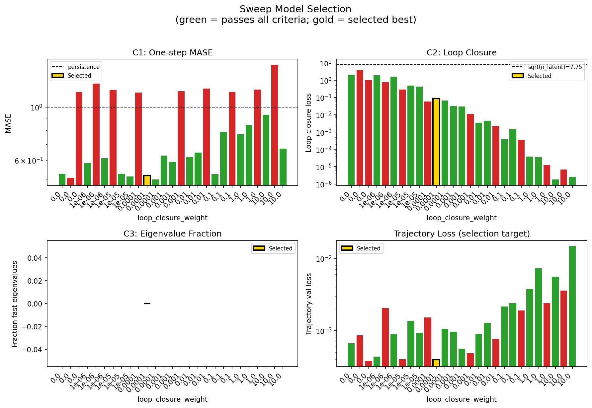

### sweep_pareto

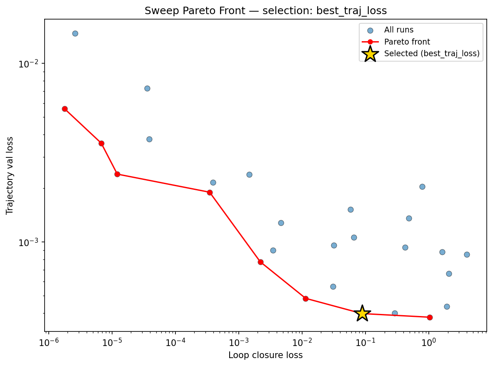

### reconstruction

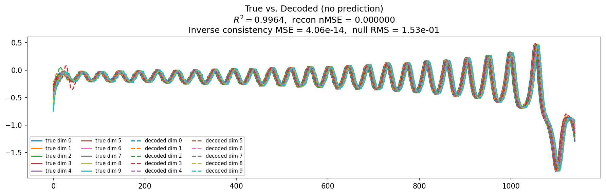

### prediction_windows

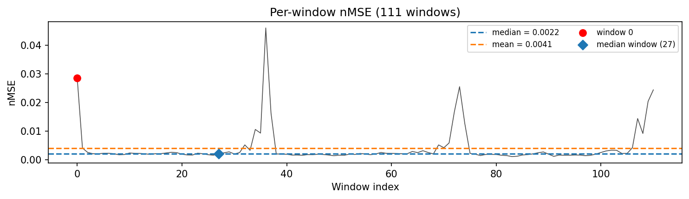

### long_trajectory

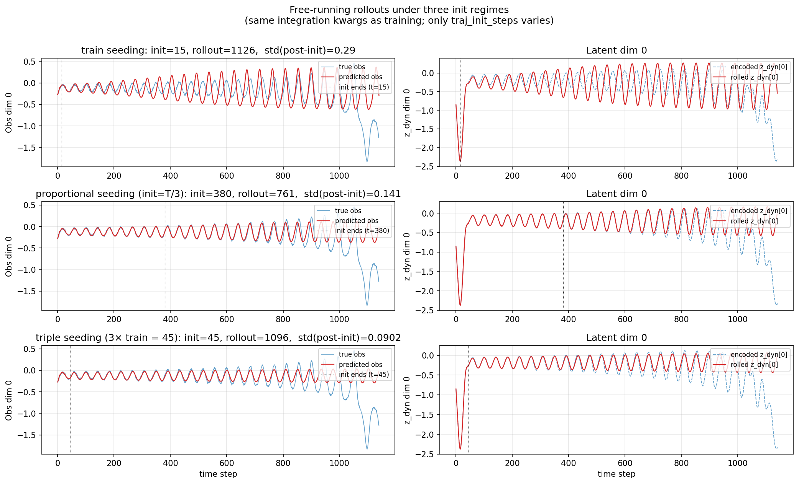

### mase

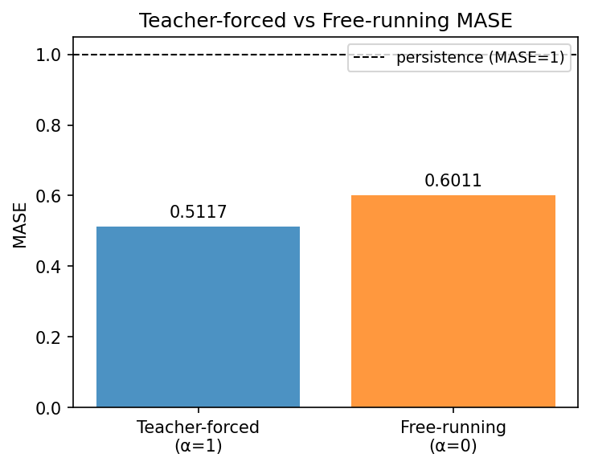

### latent_utilization

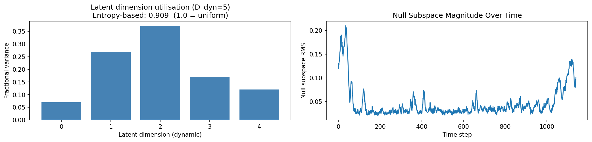

### lyapunov

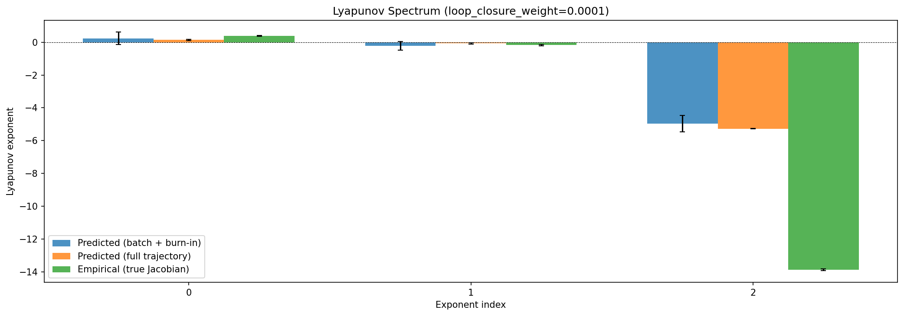

### kaplan_yorke

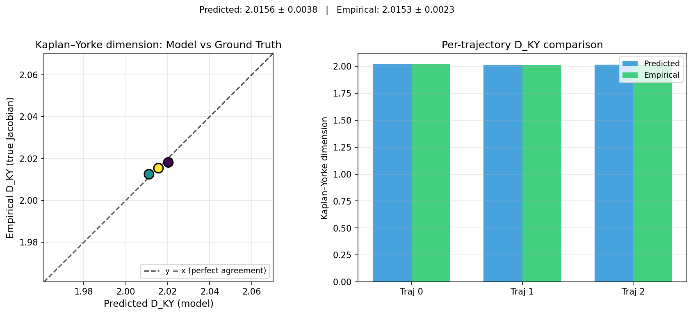

### per_run_lyapunov

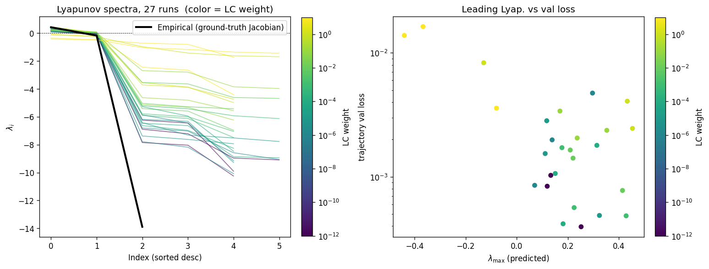

### per_run_lyapunov_vs_true

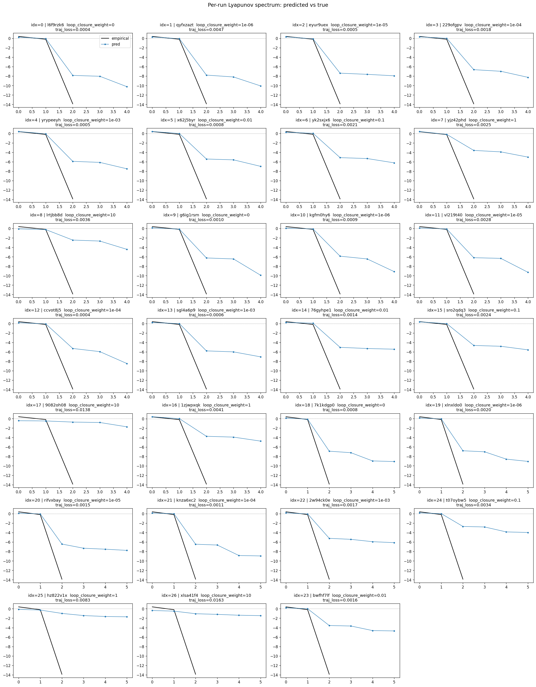

### per_run_lyapunov_relerr

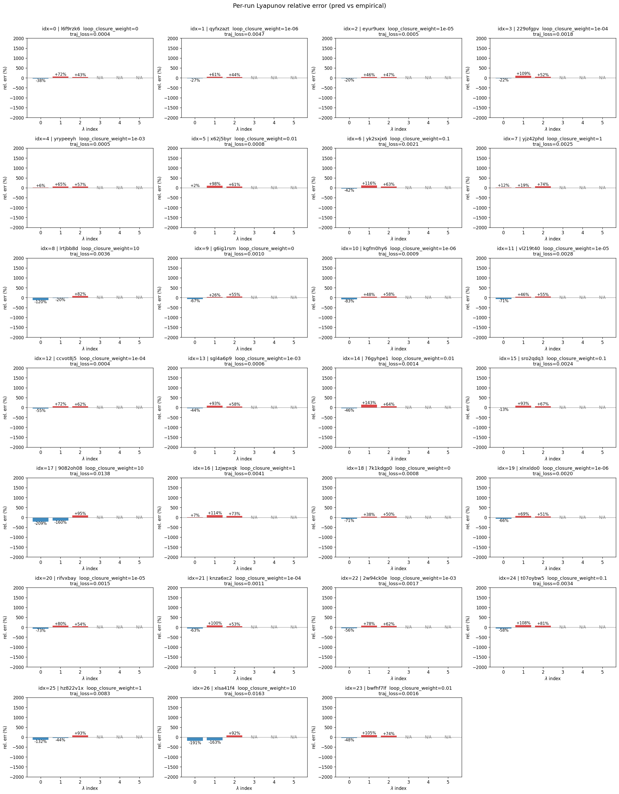

### encoder_decoder_jacobians

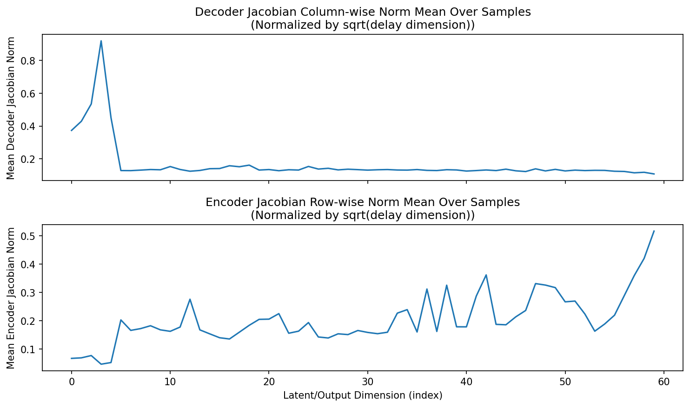

### amplification

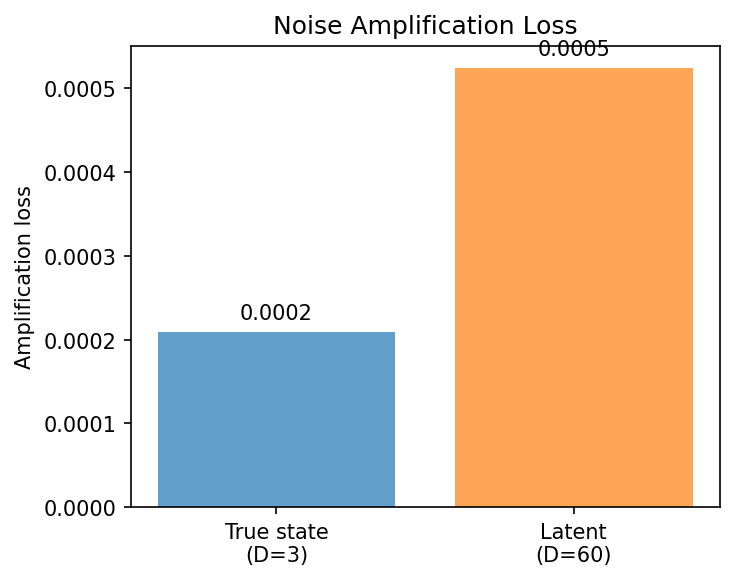

### kaplan_yorke_pca

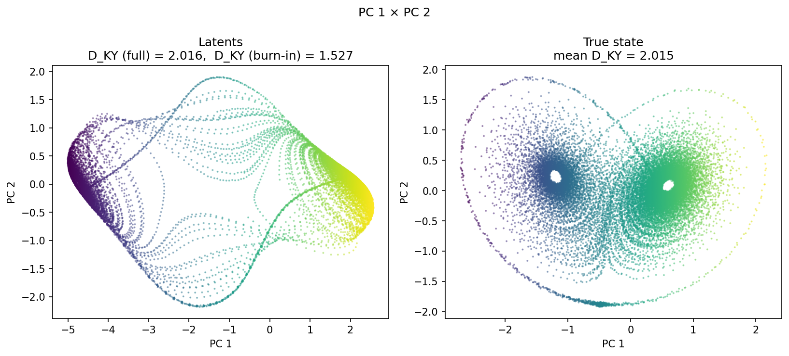

### prediction_detail_latent

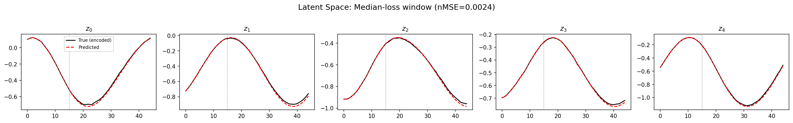

### prediction_detail_obs

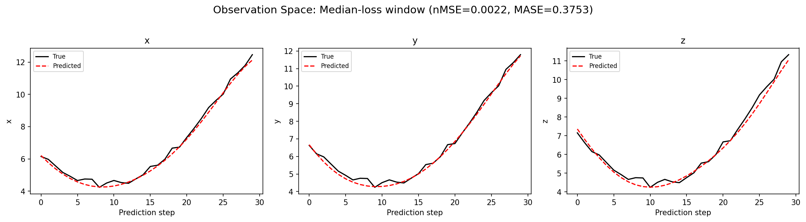

### tangent_spectrum

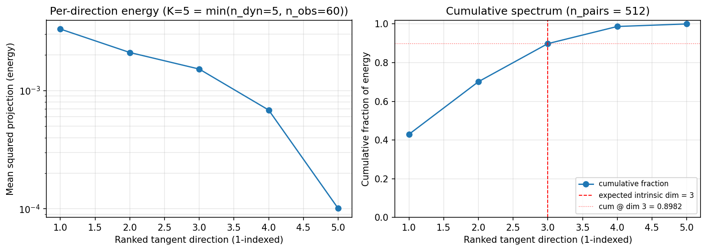

### per_run_tangent_spectrum

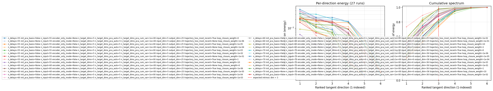

## Discussion

<!--
This section is intentionally left as a placeholder. A human reviewer
or Claude Code agent should fill it in based on the tables and figures
above, explicitly addressing each success criterion and comparing the
outcome to the stated hypothesis. Write the Discussion to
`discussion.md` in this directory and re-run `render_report`.
-->

_(to be written)_

## `run_analytics` stdout

<details><summary>Click to expand — full diagnostic output from <code>run_analytics</code></summary>

```
No run_id provided — selecting best run from group 'lorenz_partial_additive_mse_uniform_p30_obsnoise001_top3nd_init15_autodim__lc_sweep' ...
Found 29 total runs in JacobianODE/Lorenz_INDpartial_NDInitSweep_autodim_D1_NormTrue__JacobianODE (group=lorenz_partial_additive_mse_uniform_p30_obsnoise001_top3nd_init15_autodim__lc_sweep)
All runs (state, loop_closure_weight, tangent_entropy_weight, kl_dyn_weight):
  l6f9rzk6: state=finished, lc=0.0, te=0.0, kl_dyn=0.0
  qyfxzazt: state=finished, lc=1e-06, te=0.0, kl_dyn=0.0
  eyur9uex: state=finished, lc=1e-05, te=0.0, kl_dyn=0.0
  229ofgpv: state=finished, lc=0.0001, te=0.0, kl_dyn=0.0
  yrypeeyh: state=finished, lc=0.001, te=0.0, kl_dyn=0.0
  x62j5byr: state=crashed, lc=0.01, te=0.0, kl_dyn=0.0
  yk2sxjx6: state=finished, lc=0.1, te=0.0, kl_dyn=0.0
  yjz42phd: state=finished, lc=1.0, te=0.0, kl_dyn=0.0
  lrtjbb8d: state=finished, lc=10.0, te=0.0, kl_dyn=0.0
  g6ig1rsm: state=finished, lc=0.0, te=0.0, kl_dyn=0.0
  kgfm0hy6: state=finished, lc=1e-06, te=0.0, kl_dyn=0.0
  vl219t40: state=finished, lc=1e-05, te=0.0, kl_dyn=0.0
  ccvot8j5: state=finished, lc=0.0001, te=0.0, kl_dyn=0.0
  sgl4a6p9: state=finished, lc=0.001, te=0.0, kl_dyn=0.0
  76gyhpe1: state=finished, lc=0.01, te=0.0, kl_dyn=0.0
  sro2qdq3: state=finished, lc=0.1, te=0.0, kl_dyn=0.0
  9082oh08: state=finished, lc=10.0, te=0.0, kl_dyn=0.0
  1zjwpxqk: state=finished, lc=1.0, te=0.0, kl_dyn=0.0
  7k1kdgp0: state=finished, lc=0.0, te=0.0, kl_dyn=0.0
  xlnxldo0: state=finished, lc=1e-06, te=0.0, kl_dyn=0.0
  rifvxbay: state=finished, lc=1e-05, te=0.0, kl_dyn=0.0
  knza6xc2: state=finished, lc=0.0001, te=0.0, kl_dyn=0.0
  2w94ck0e: state=finished, lc=0.001, te=0.0, kl_dyn=0.0
  d67vr9o2: state=finished, lc=0.01, te=0.0, kl_dyn=0.0
  t07oybw5: state=finished, lc=0.1, te=0.0, kl_dyn=0.0
  hz822v1x: state=finished, lc=1.0, te=0.0, kl_dyn=0.0
  xlsa41f4: state=finished, lc=10.0, te=0.0, kl_dyn=0.0
  iswiqlny: state=finished, lc=0.01, te=0.0, kl_dyn=0.0
  bwfhf7lf: state=finished, lc=0.01, te=0.0, kl_dyn=0.0

slurm_timeout_min not found in any run config — falling back to 180 min
  Including l6f9rzk6 (lc=0.0): use_all_runs=True (state=finished)
  Including qyfxzazt (lc=1e-06): use_all_runs=True (state=finished)
  Including eyur9uex (lc=1e-05): use_all_runs=True (state=finished)
  Including 229ofgpv (lc=0.0001): use_all_runs=True (state=finished)
  Including yrypeeyh (lc=0.001): use_all_runs=True (state=finished)
  Including x62j5byr (lc=0.01): use_all_runs=True (state=crashed)
  Including yk2sxjx6 (lc=0.1): use_all_runs=True (state=finished)
  Including yjz42phd (lc=1.0): use_all_runs=True (state=finished)
  Including lrtjbb8d (lc=10.0): use_all_runs=True (state=finished)
  Including g6ig1rsm (lc=0.0): use_all_runs=True (state=finished)
  Including kgfm0hy6 (lc=1e-06): use_all_runs=True (state=finished)
  Including vl219t40 (lc=1e-05): use_all_runs=True (state=finished)
  Including ccvot8j5 (lc=0.0001): use_all_runs=True (state=finished)
  Including sgl4a6p9 (lc=0.001): use_all_runs=True (state=finished)
  Including 76gyhpe1 (lc=0.01): use_all_runs=True (state=finished)
  Including sro2qdq3 (lc=0.1): use_all_runs=True (state=finished)
  Including 9082oh08 (lc=10.0): use_all_runs=True (state=finished)
  Including 1zjwpxqk (lc=1.0): use_all_runs=True (state=finished)
  Including 7k1kdgp0 (lc=0.0): use_all_runs=True (state=finished)
  Including xlnxldo0 (lc=1e-06): use_all_runs=True (state=finished)
  Including rifvxbay (lc=1e-05): use_all_runs=True (state=finished)
  Including knza6xc2 (lc=0.0001): use_all_runs=True (state=finished)
  Including 2w94ck0e (lc=0.001): use_all_runs=True (state=finished)
  Including d67vr9o2 (lc=0.01): use_all_runs=True (state=finished)
  Including t07oybw5 (lc=0.1): use_all_runs=True (state=finished)
  Including hz822v1x (lc=1.0): use_all_runs=True (state=finished)
  Including xlsa41f4 (lc=10.0): use_all_runs=True (state=finished)
  Including iswiqlny (lc=0.01): use_all_runs=True (state=finished)
  Including bwfhf7lf (lc=0.01): use_all_runs=True (state=finished)
Found 29 effectively-done sweep runs:
  loop_closure_weight=0.0, tangent_entropy_weight=0.0, kl_dyn_weight=0.0 -> run_id=7k1kdgp0
  loop_closure_weight=0.0, tangent_entropy_weight=0.0, kl_dyn_weight=0.0 -> run_id=g6ig1rsm
  loop_closure_weight=0.0, tangent_entropy_weight=0.0, kl_dyn_weight=0.0 -> run_id=l6f9rzk6
  loop_closure_weight=1e-06, tangent_entropy_weight=0.0, kl_dyn_weight=0.0 -> run_id=kgfm0hy6
  loop_closure_weight=1e-06, tangent_entropy_weight=0.0, kl_dyn_weight=0.0 -> run_id=qyfxzazt
  loop_closure_weight=1e-06, tangent_entropy_weight=0.0, kl_dyn_weight=0.0 -> run_id=xlnxldo0
  loop_closure_weight=1e-05, tangent_entropy_weight=0.0, kl_dyn_weight=0.0 -> run_id=eyur9uex
  loop_closure_weight=1e-05, tangent_entropy_weight=0.0, kl_dyn_weight=0.0 -> run_id=rifvxbay
  loop_closure_weight=1e-05, tangent_entropy_weight=0.0, kl_dyn_weight=0.0 -> run_id=vl219t40
  loop_closure_weight=0.0001, tangent_entropy_weight=0.0, kl_dyn_weight=0.0 -> run_id=229ofgpv
  loop_closure_weight=0.0001, tangent_entropy_weight=0.0, kl_dyn_weight=0.0 -> run_id=ccvot8j5
  loop_closure_weight=0.0001, tangent_entropy_weight=0.0, kl_dyn_weight=0.0 -> run_id=knza6xc2
  loop_closure_weight=0.001, tangent_entropy_weight=0.0, kl_dyn_weight=0.0 -> run_id=2w94ck0e
  loop_closure_weight=0.001, tangent_entropy_weight=0.0, kl_dyn_weight=0.0 -> run_id=sgl4a6p9
  loop_closure_weight=0.001, tangent_entropy_weight=0.0, kl_dyn_weight=0.0 -> run_id=yrypeeyh
  loop_closure_weight=0.01, tangent_entropy_weight=0.0, kl_dyn_weight=0.0 -> run_id=76gyhpe1
  loop_closure_weight=0.01, tangent_entropy_weight=0.0, kl_dyn_weight=0.0 -> run_id=bwfhf7lf
  loop_closure_weight=0.01, tangent_entropy_weight=0.0, kl_dyn_weight=0.0 -> run_id=d67vr9o2
  loop_closure_weight=0.01, tangent_entropy_weight=0.0, kl_dyn_weight=0.0 -> run_id=iswiqlny
  loop_closure_weight=0.01, tangent_entropy_weight=0.0, kl_dyn_weight=0.0 -> run_id=x62j5byr
  loop_closure_weight=0.1, tangent_entropy_weight=0.0, kl_dyn_weight=0.0 -> run_id=sro2qdq3
  loop_closure_weight=0.1, tangent_entropy_weight=0.0, kl_dyn_weight=0.0 -> run_id=t07oybw5
  loop_closure_weight=0.1, tangent_entropy_weight=0.0, kl_dyn_weight=0.0 -> run_id=yk2sxjx6
  loop_closure_weight=1.0, tangent_entropy_weight=0.0, kl_dyn_weight=0.0 -> run_id=1zjwpxqk
  loop_closure_weight=1.0, tangent_entropy_weight=0.0, kl_dyn_weight=0.0 -> run_id=hz822v1x
  loop_closure_weight=1.0, tangent_entropy_weight=0.0, kl_dyn_weight=0.0 -> run_id=yjz42phd
  loop_closure_weight=10.0, tangent_entropy_weight=0.0, kl_dyn_weight=0.0 -> run_id=9082oh08
  loop_closure_weight=10.0, tangent_entropy_weight=0.0, kl_dyn_weight=0.0 -> run_id=lrtjbb8d
  loop_closure_weight=10.0, tangent_entropy_weight=0.0, kl_dyn_weight=0.0 -> run_id=xlsa41f4
  Dropping 2 run(s) with no checkpoint dir: ['d67vr9o2', 'iswiqlny']
n_dims=70, n_latent=70, n_dyn=6, dt=0.0150
  run=7k1kdgp0: DiagnosticMetrics(one_step_mase=0.5272175073623657, loop_closure_loss=2.073434352874756, fast_eigenvalue_fraction=0.0, trajectory_val_loss=0.0006651878356933594) (from W&B history)
  run=g6ig1rsm: DiagnosticMetrics(one_step_mase=0.5068936944007874, loop_closure_loss=3.9691355228424072, fast_eigenvalue_fraction=0.0, trajectory_val_loss=0.0008542881696484983) (from W&B history)
  run=l6f9rzk6: DiagnosticMetrics(one_step_mase=1.153707504272461, loop_closure_loss=1.03719961643219, fast_eigenvalue_fraction=0.0, trajectory_val_loss=0.00037939244066365063) (from W&B history)
  run=kgfm0hy6: DiagnosticMetrics(one_step_mase=0.5835298299789429, loop_closure_loss=1.9103918075561523, fast_eigenvalue_fraction=0.0, trajectory_val_loss=0.0004368698282632977) (from W&B history)
  run=qyfxzazt: DiagnosticMetrics(one_step_mase=1.2526730298995972, loop_closure_loss=0.7882382869720459, fast_eigenvalue_fraction=0.0, trajectory_val_loss=0.002047427464276552) (from W&B history)
  run=xlnxldo0: DiagnosticMetrics(one_step_mase=0.6119195818901062, loop_closure_loss=1.6326769590377808, fast_eigenvalue_fraction=0.0, trajectory_val_loss=0.0008808749844320118) (from W&B history)
  run=eyur9uex: DiagnosticMetrics(one_step_mase=1.1789470911026, loop_closure_loss=0.2904985547065735, fast_eigenvalue_fraction=0.0, trajectory_val_loss=0.0004004664078820497) (from W&B history)
  run=rifvxbay: DiagnosticMetrics(one_step_mase=0.5269691348075867, loop_closure_loss=0.48743245005607605, fast_eigenvalue_fraction=0.0, trajectory_val_loss=0.0013604818377643824) (from W&B history)
  run=vl219t40: DiagnosticMetrics(one_step_mase=0.512972354888916, loop_closure_loss=0.42069023847579956, fast_eigenvalue_fraction=0.0, trajectory_val_loss=0.0009331138571724296) (from W&B history)
  run=229ofgpv: DiagnosticMetrics(one_step_mase=1.1494345664978027, loop_closure_loss=0.05774739384651184, fast_eigenvalue_fraction=0.0, trajectory_val_loss=0.0015212014550343156) (from W&B history)
  run=ccvot8j5: DiagnosticMetrics(one_step_mase=0.5188680291175842, loop_closure_loss=0.08863265067338943, fast_eigenvalue_fraction=0.0, trajectory_val_loss=0.00039758862112648785) (from W&B history)
  run=knza6xc2: DiagnosticMetrics(one_step_mase=0.49802762269973755, loop_closure_loss=0.06562000513076782, fast_eigenvalue_fraction=0.0, trajectory_val_loss=0.0010626022703945637) (from W&B history)
  run=2w94ck0e: DiagnosticMetrics(one_step_mase=0.627334713935852, loop_closure_loss=0.03179620951414108, fast_eigenvalue_fraction=0.0, trajectory_val_loss=0.0009586970554664731) (from W&B history)
  run=sgl4a6p9: DiagnosticMetrics(one_step_mase=0.5898917317390442, loop_closure_loss=0.030728256329894066, fast_eigenvalue_fraction=0.0, trajectory_val_loss=0.0005636319401673973) (from W&B history)
  run=yrypeeyh: DiagnosticMetrics(one_step_mase=1.1645361185073853, loop_closure_loss=0.011410634964704514, fast_eigenvalue_fraction=0.0, trajectory_val_loss=0.0004837898595724255) (from W&B history)
  run=76gyhpe1: DiagnosticMetrics(one_step_mase=0.6193928718566895, loop_closure_loss=0.0035017402842640877, fast_eigenvalue_fraction=0.0, trajectory_val_loss=0.0008976683020591736) (from W&B history)
  run=bwfhf7lf: DiagnosticMetrics(one_step_mase=0.6447139382362366, loop_closure_loss=0.004609482828527689, fast_eigenvalue_fraction=0.0, trajectory_val_loss=0.0012828323524445295) (from W&B history)
  run=x62j5byr: DiagnosticMetrics(one_step_mase=1.1944445371627808, loop_closure_loss=0.002192852785810828, fast_eigenvalue_fraction=0.0, trajectory_val_loss=0.0007749188225716352) (from W&B history)
  run=sro2qdq3: DiagnosticMetrics(one_step_mase=0.5254005193710327, loop_closure_loss=0.0003926653880625963, fast_eigenvalue_fraction=0.0, trajectory_val_loss=0.002162870019674301) (from W&B history)
  run=t07oybw5: DiagnosticMetrics(one_step_mase=0.7859870791435242, loop_closure_loss=0.0014693167759105563, fast_eigenvalue_fraction=0.0, trajectory_val_loss=0.002387994434684515) (from W&B history)
  run=yk2sxjx6: DiagnosticMetrics(one_step_mase=1.1547685861587524, loop_closure_loss=0.00034821100416593254, fast_eigenvalue_fraction=0.0, trajectory_val_loss=0.0019012041157111526) (from W&B history)
  run=1zjwpxqk: DiagnosticMetrics(one_step_mase=0.769800066947937, loop_closure_loss=3.8680402212776244e-05, fast_eigenvalue_fraction=0.0, trajectory_val_loss=0.0037716550286859274) (from W&B history)
  run=hz822v1x: DiagnosticMetrics(one_step_mase=0.8422066569328308, loop_closure_loss=3.570048284018412e-05, fast_eigenvalue_fraction=0.0, trajectory_val_loss=0.007267741020768881) (from W&B history)
  run=yjz42phd: DiagnosticMetrics(one_step_mase=1.185123324394226, loop_closure_loss=1.2144014363002498e-05, fast_eigenvalue_fraction=0.0, trajectory_val_loss=0.0024006839375942945) (from W&B history)
  run=9082oh08: DiagnosticMetrics(one_step_mase=0.930195689201355, loop_closure_loss=1.7958481066671084e-06, fast_eigenvalue_fraction=0.0, trajectory_val_loss=0.005566663108766079) (from W&B history)
  run=lrtjbb8d: DiagnosticMetrics(one_step_mase=1.5020159482955933, loop_closure_loss=6.777521775802597e-06, fast_eigenvalue_fraction=0.0, trajectory_val_loss=0.003579792333766818) (from W&B history)
  run=xlsa41f4: DiagnosticMetrics(one_step_mase=0.6718382239341736, loop_closure_loss=2.624330818434828e-06, fast_eigenvalue_fraction=0.0, trajectory_val_loss=0.014725501649081707) (from W&B history)

Ranking method:           best_traj_loss
Best run ID:              ccvot8j5
Best loop_closure_weight: 0.0001
Best tangent_entropy_weight: 0.0
Best kl_dyn_weight:       0.0
Best traj loss:           0.000398
Criteria applied: ['C1', 'C2', 'C3']
Surviving: 17 / 27
Auto-selected run_id: ccvot8j5

======================================================================
PARETO FRONTIER RUNS (8 runs)
======================================================================
  Run ID               LC Loss   Traj Val Loss
  ------------  --------------  --------------
  9082oh08            0.000002        0.005567
  lrtjbb8d            0.000007        0.003580
  yjz42phd            0.000012        0.002401
  yk2sxjx6            0.000348        0.001901
  x62j5byr            0.002193        0.000775
  yrypeeyh            0.011411        0.000484
  ccvot8j5            0.088633        0.000398 <-- selected
  l6f9rzk6            1.037200        0.000379

======================================================================
RANKING METHOD COMPARISON (over 17 survivors)
======================================================================
  Method                  Run ID               LC Loss   Traj Val Loss
  ----------------------  ------------  --------------  --------------
  best_traj_loss          ccvot8j5            0.088633        0.000398 <-- active
  pareto_knee             76gyhpe1            0.003502        0.000898
  geo_rank                ccvot8j5            0.088633        0.000398
  minimax_rank            76gyhpe1            0.003502        0.000898
  geo_log_score           ccvot8j5            0.088633        0.000398
  minimax_log_score       sro2qdq3            0.000393        0.002163
======================================================================

Loading run ccvot8j5 from JacobianODE/Lorenz_INDpartial_NDInitSweep_autodim_D1_NormTrue__JacobianODE ...
Train dataset shape: torch.Size([24112, 45, 60])
Validation dataset shape: torch.Size([7672, 45, 60])
Test dataset shape: torch.Size([3288, 45, 60])
Train trajectories dataset shape: torch.Size([22, 1141, 60])
Validation trajectories dataset shape: torch.Size([7, 1141, 60])
Test trajectories dataset shape: torch.Size([3, 1141, 60])
Loading checkpoint epoch=144-step=29000.ckpt...
Computing reconstruction ...
Computing MASE ...
Teacher-forced MASE: 0.5117
Free-running MASE:   0.6011
Computing latent utilization ...
Entropy-based utilization: 0.909
Null subspace mean RMS: 5.686168e-02
Computing Lyapunov exponents ...
  Computing full-trajectory Lyapunov (3 test trajs, T=1141) ...
Predicted Lyapunov exponents (batch+burn-in, 128 windowed trajs):
  λ_1 = +0.2421 ± 0.3857
  λ_2 = -0.2117 ± 0.2570
  λ_3 = -4.9525 ± 0.5028
  λ_4 = -5.7110 ± 0.8659
  λ_5 = -8.4681 ± 2.1470
Predicted Lyapunov exponents (full-length, 3 test trajs):
  λ_1 = +0.1474 ± 0.0364
  λ_2 = -0.0649 ± 0.0430
  λ_3 = -5.2711 ± 0.0159
  λ_4 = -6.0808 ± 0.0996
  λ_5 = -8.9178 ± 0.0696
Empirical Lyapunov exponents (mean ± std):
  λ_1 = +0.3846 ± 0.0251
  λ_2 = -0.1716 ± 0.0444
  λ_3 = -13.8799 ± 0.0398
Mean KY dim (predicted): 2.016 ± 0.004
Mean KY dim (empirical): 2.015 ± 0.002
Mean KY dim (burn-in):   1.527 ± 0.732
Computing prediction windows ...
Windows: 111 — nMSE min=0.0012, median=0.0022, mean=0.0041, max=0.0461
Computing long-trajectory free-running rollouts ...
Computing encoder/decoder Jacobians ...
encoder_jacobian: (128, 60, 60)
decoder_jacobian: (128, 60, 60)
Computing amplification loss ...
Amplification loss — True state: 0.000210
Amplification loss — Latent:     0.000525
Computing tangent space spectrum ...
```

</details>
