# Sweep Analysis: `lorenz_partial_additive_mse_uniform_p30_obsnoise005__ndelays_initsteps_autodim`

**Project**: [Lorenz_INDpartial_NDInitSweep_autodim_D1_NormTrue__JacobianODE](https://wandb.ai/JacobianODE/Lorenz_INDpartial_NDInitSweep_autodim_D1_NormTrue__JacobianODE/groups/lorenz_partial_additive_mse_uniform_p30_obsnoise005__ndelays_initsteps_autodim)  
**Launched**: 2026-04-20T19:55:41Z  
**Completed**: 2026-04-21T04:00:30Z  
**Outcome**: `complete_clean`  
**Git**: `latent-JacobianODE` @ `6f807fc`  
**Expected runs**: 40

## Experiment Context

### `lorenz_partial_additive_mse_uniform_p30_obsnoise005__ndelays_initsteps_autodim`

**Description**

Lorenz partial additive coupling, uniform reconstruction loss,
obs_noise=0.05, prediction_steps=30, loop_closure_weight=0.
Sweeps delay_embedding_params.n_delays over
[5, 10, 15, ..., 100] (step 5, 20 values)
× jacobianODEint_kwargs.traj_init_steps over [15, 30]
= 40 runs.
n_target_dims is picked at data-load time as the smallest k such
that the first k PCs of the noisy training delay embeddings
explain ≥ model.n_target_var_threshold of the total variance.
final_perm_identity=true on the encoder guarantees that at init
z[..., :n_target_dims] == x[..., :n_target_dims] — independent of
permutation_seed.

**Hypothesis**

At obs_noise=0.05, small n_delays are noise-dominated in neighbor
scatter (per the amplification diagnostic), so PCA-auto should
pick a small n_target_dims there. As n_delays grows, more PCs
clear the threshold, and the encoder has enough input dims to
unfold the attractor. With traj_init_steps=30 (vs 15), the
encoder sees twice as much history at init, which should help
more at the high-noise setting than the low-noise one.

**Success criteria**

- All 40 runs train without divergence
- PCA-chosen n_target_dims grows with n_delays then saturates, with saturation value ≥ 3
- traj_init_steps=30 gives a larger val_loss improvement over 15 than at obs_noise=0.01 (noise-robustness)
- Best val traj_loss non-monotonic in n_delays with a clear optimum

## Results

**Swept axes** (9): `data.train_test_params.delay_embedding_params.n_delays`, `data.train_test_params.seq_length`, `model.encoder.n_input`, `model.n_target_dims`, `model.n_target_dims_pca_auto`, `model.n_target_dims_pca_cum_var`, `model.params.input_dim`, `model.params.output_dim`, `training.lightning.jacobianODEint_kwargs.traj_init_steps`

**Chosen run** (by `best_traj_loss`): `0mjak7ms` — traj_loss=0.00523, MASE=0.7825, R²=0.9856, LC loss=3.946, epoch=152.0

Swept-axis values at chosen run: `data.train_test_params.delay_embedding_params.n_delays`=45 · `data.train_test_params.seq_length`=45 · `model.encoder.n_input`=45 · `model.n_target_dims`=7 · `model.n_target_dims_pca_auto`=7 · `model.n_target_dims_pca_cum_var`=0.990085 · `model.params.input_dim`=7 · `model.params.output_dim`=49 · `training.lightning.jacobianODEint_kwargs.traj_init_steps`=15

**Runs analyzed**: 40 (expected 40)

### Per-run results

| run_idx | run_id | `data.train_test_params.delay_embedding_params.n_delays` | `data.train_test_params.seq_length` | `model.encoder.n_input` | `model.n_target_dims` | `model.n_target_dims_pca_auto` | `model.n_target_dims_pca_cum_var` | `model.params.input_dim` | `model.params.output_dim` | `training.lightning.jacobianODEint_kwargs.traj_init_steps` | best_traj_loss | best_MASE | R² | LC loss | epoch |
|---|---|---|---|---|---|---|---|---|---|---|---|---|---|---|---|
| 16 | `0mjak7ms` | 45 | 45 | 45 | 7 | 7 | 0.990085 | 7 | 49 | 15 | 0.00523 | 0.7825 | 0.9856 | 3.946 | 152.0 |
| 15 | `5v9i6q23` | 40 | 60 | 40 | 7 | 7 | 0.990472 | 7 | 49 | 30 | 0.00552 | 0.8038 | 0.9853 | 4.001 | 126.0 |
| 27 | `k8rmk1zv` | 70 | 60 | 70 | 11 | 11 | 0.990007 | 11 | 121 | 30 | 0.00580 | 0.8063 | 0.9848 | 18.023 | 60.0 |
| 30 | `eav4ihmf` | 80 | 45 | 80 | 13 | 13 | 0.990058 | 13 | 169 | 15 | 0.00585 | 0.8062 | 0.9844 | 5.650 | 158.0 |
| 32 | `yb09b19p` | 85 | 45 | 85 | 14 | 14 | 0.990074 | 14 | 196 | 15 | 0.00591 | 0.8218 | 0.9845 | 57.041 | 103.0 |
| 21 | `eg3lkacf` | 55 | 60 | 55 | 9 | 9 | 0.990192 | 9 | 81 | 30 | 0.00602 | 0.8008 | 0.9841 | 8.097 | 137.0 |
| 19 | `wzugs4fw` | 50 | 60 | 50 | 8 | 8 | 0.990154 | 8 | 64 | 30 | 0.00610 | 0.8055 | 0.9838 | 8.165 | 115.0 |
| 29 | `ig9dt81j` | 75 | 60 | 75 | 12 | 12 | 0.990036 | 12 | 144 | 30 | 0.00612 | 0.8111 | 0.9837 | 26.472 | 157.0 |
| 17 | `xuaha797` | 45 | 60 | 45 | 7 | 7 | 0.990085 | 7 | 49 | 30 | 0.00621 | 0.8295 | 0.9833 | 9.171 | 90.0 |
| 11 | `d2lge3mo` | 30 | 60 | 30 | 5 | 5 | 0.990271 | 5 | 25 | 30 | 0.00623 | 0.8251 | 0.9827 | 2.812 | 104.0 |
| 39 | `wetuozcn` | 100 | 60 | 100 | 17 | 17 | 0.990106 | 17 | 289 | 30 | 0.00632 | 0.7980 | 0.9833 | 8.438 | 142.0 |
| 13 | `dker8liz` | 35 | 60 | 35 | 6 | 6 | 0.990408 | 6 | 36 | 30 | 0.00640 | 0.8299 | 0.9828 | 0.447 | 171.0 |
| 10 | `pkvfywg7` | 30 | 45 | 30 | 5 | 5 | 0.990271 | 5 | 25 | 15 | 0.00659 | 0.8250 | 0.9825 | 7.643 | 99.0 |
| 14 | `83orklvd` | 40 | 45 | 40 | 7 | 7 | 0.990472 | 7 | 49 | 15 | 0.00666 | 0.8325 | 0.9822 | 3.836 | 84.0 |
| 24 | `0a09lst3` | 65 | 45 | 65 | 11 | 11 | 0.990219 | 11 | 121 | 15 | 0.00680 | 0.8276 | 0.9819 | 8.941 | 112.0 |
| 28 | `4txbacgu` | 75 | 45 | 75 | 12 | 12 | 0.990036 | 12 | 144 | 15 | 0.00683 | 0.8520 | 0.9815 | 24.404 | 99.0 |
| 25 | `a1zj5wu5` | 65 | 60 | 65 | 11 | 11 | 0.990219 | 11 | 121 | 30 | 0.00684 | 0.8386 | 0.9817 | 7.341 | 80.0 |
| 33 | `wr926lfr` | 85 | 60 | 85 | 14 | 14 | 0.990074 | 14 | 196 | 30 | 0.00692 | 0.8524 | 0.9813 | 41.526 | 60.0 |
| 20 | `u4w79mcv` | 55 | 45 | 55 | 9 | 9 | 0.990192 | 9 | 81 | 15 | 0.00706 | 0.8511 | 0.9812 | 4.979 | 68.0 |
| 18 | `p39d9tv2` | 50 | 45 | 50 | 8 | 8 | 0.990154 | 8 | 64 | 15 | 0.00718 | 0.8309 | 0.9805 | 8.439 | 93.0 |
| 9 | `jrl0ag78` | 25 | 60 | 25 | 5 | 5 | 0.990796 | 5 | 25 | 30 | 0.00723 | 0.8428 | 0.9806 | 0.158 | 144.0 |
| 34 | `xxxpg7ig` | 90 | 45 | 90 | 15 | 15 | 0.990087 | 15 | 225 | 15 | 0.00740 | 0.8709 | 0.9803 | 74.194 | 99.0 |
| 38 | `2u7zk7zi` | 100 | 45 | 100 | 17 | 17 | 0.990106 | 17 | 289 | 15 | 0.00746 | 0.8694 | 0.9801 | 49.833 | 110.0 |
| 7 | `nk3skmmt` | 20 | 60 | 20 | 4 | 4 | 0.990715 | 4 | 16 | 30 | 0.00797 | 0.8833 | 0.9790 | 1.006 | 108.0 |
| 12 | `xtnby7wy` | 35 | 45 | 35 | 6 | 6 | 0.990408 | 6 | 36 | 15 | 0.00826 | 0.8797 | 0.9782 | 4.256 | 114.0 |
| 36 | `yqvtgzvo` | 95 | 45 | 95 | 16 | 16 | 0.990098 | 16 | 256 | 15 | 0.00839 | 0.9018 | 0.9775 | 117.170 | 104.0 |
| 8 | `2j7828zs` | 25 | 45 | 25 | 5 | 5 | 0.990796 | 5 | 25 | 15 | 0.00995 | 0.9090 | 0.9737 | 0.411 | 109.0 |
| 26 | `wtc9e67p` | 70 | 45 | 70 | 11 | 11 | 0.990007 | 11 | 121 | 15 | 0.01008 | 0.9165 | 0.9732 | 10.228 | 53.0 |
| 6 | `hfdqbrv7` | 20 | 45 | 20 | 4 | 4 | 0.990715 | 4 | 16 | 15 | 0.01140 | 0.9438 | 0.9693 | 1.300 | 151.0 |
| 5 | `f28hxmys` | 15 | 60 | 15 | 3 | 3 | 0.990585 | 3 | 9 | 30 | 0.01274 | 1.0518 | 0.9661 | 0.112 | 113.0 |
| 31 | `w9fvt1b0` | 80 | 60 | 80 | 13 | 13 | 0.990058 | 13 | 169 | 30 | 0.01576 | 1.0390 | 0.9573 | 50.454 | 21.0 |
| 37 | `0lo9zq7p` | 95 | 60 | 95 | 16 | 16 | 0.990098 | 16 | 256 | 30 | 0.01628 | 1.1081 | 0.9567 | 113.399 | 37.0 |
| 3 | `l42rqc1g` | 10 | 60 | 10 | 3 | 3 | 0.991956 | 3 | 9 | 30 | 0.01756 | 1.2246 | 0.9531 | 0.068 | 109.0 |
| 4 | `rgca51q1` | 15 | 45 | 15 | 3 | 3 | 0.990585 | 3 | 9 | 15 | 0.02146 | 1.1613 | 0.9436 | 0.187 | 108.0 |
| 35 | `e184khr0` | 90 | 60 | 90 | 15 | 15 | 0.990087 | 15 | 225 | 30 | 0.02283 | 1.2297 | 0.9396 | 131.022 | 20.0 |
| 2 | `hic5ynzw` | 10 | 45 | 10 | 3 | 3 | 0.991956 | 3 | 9 | 15 | 0.02551 | 1.3526 | 0.9322 | 0.117 | 106.0 |
| 1 | `eyfqgemc` | 5 | 60 | 5 | 2 | 2 | 0.993071 | 2 | 4 | 30 | 0.03422 | 1.7602 | 0.9089 | 0.025 | 110.0 |
| 0 | `rozlkci9` | 5 | 45 | 5 | 2 | 2 | 0.993071 | 2 | 4 | 15 | 0.04686 | 2.0058 | 0.8771 | 0.272 | 113.0 |
| 22 | `7zq2aqdi` | 60 | 45 | 60 | 10 | 10 | 0.990208 | 10 | 100 | 15 | nan | nan | nan | 2.409 | — |
| 23 | `sf1xnomu` | 60 | 60 | 60 | 10 | 10 | 0.990208 | 10 | 100 | 30 | nan | nan | nan | 3.621 | — |

## Success-criteria verdicts (automated)

| Criterion | Verdict | Note |
|---|---|---|
| All 40 runs train without divergence | **Unknown** |  |
| PCA-chosen n_target_dims grows with n_delays then saturates, with saturation value ≥ 3 | **Unknown** |  |
| traj_init_steps=30 gives a larger val_loss improvement over 15 than at obs_noise=0.01 (noise-robustness) | **Unknown** |  |
| Best val traj_loss non-monotonic in n_delays with a clear optimum | **Unknown** |  |

_Automated verdicts use simple numeric-threshold parsing and may mis-classify qualitative criteria. The Discussion section below takes precedence._

## Figures

### sweep_overview

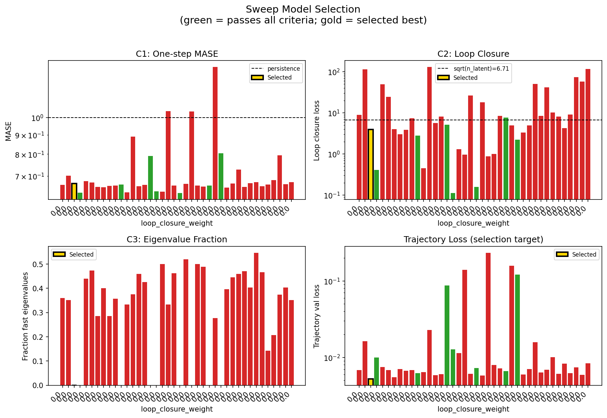

### sweep_pareto

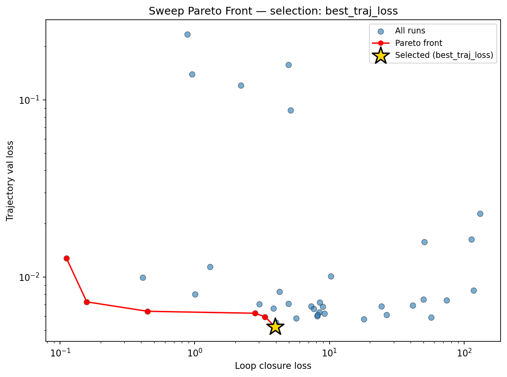

### reconstruction

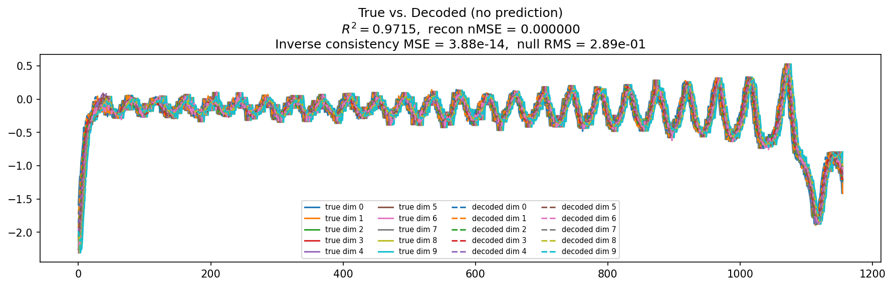

### prediction_windows

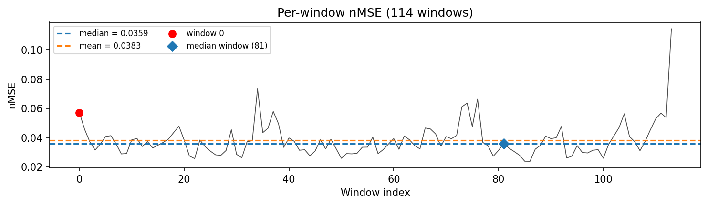

### long_trajectory

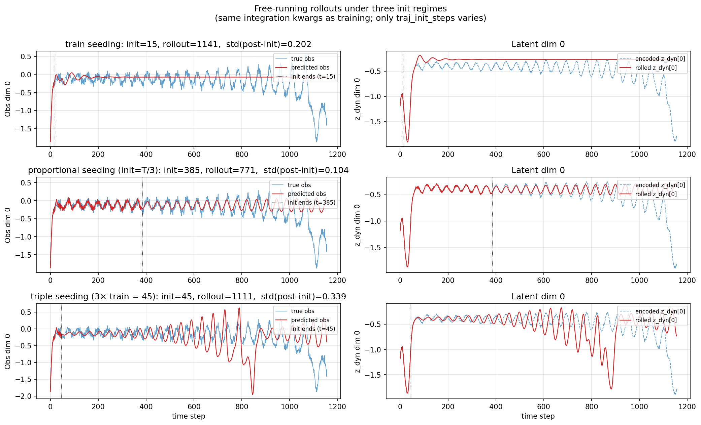

### mase

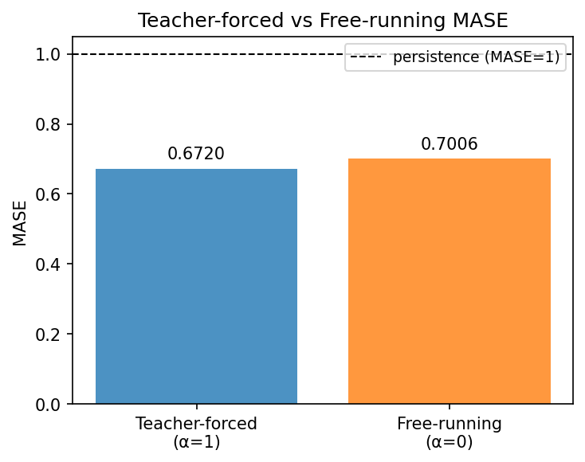

### latent_utilization

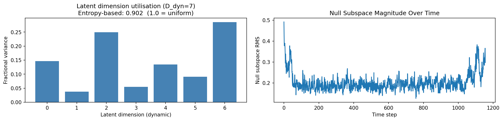

### lyapunov

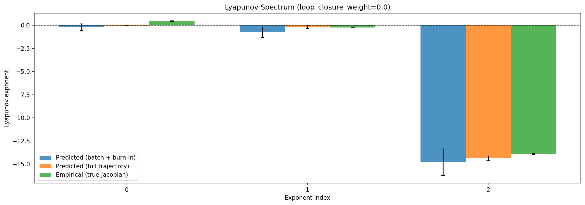

### kaplan_yorke

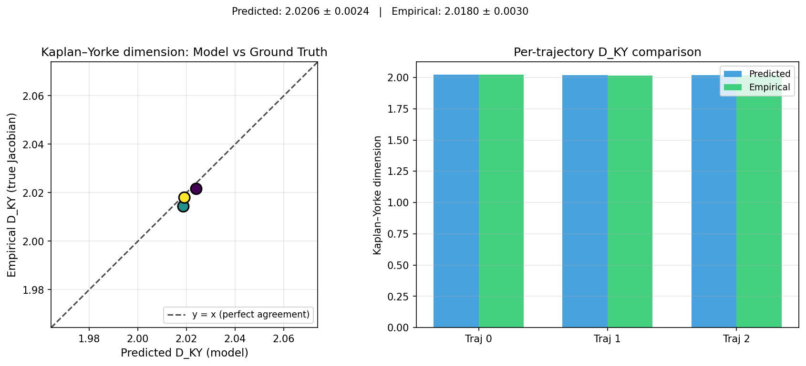

### per_run_lyapunov

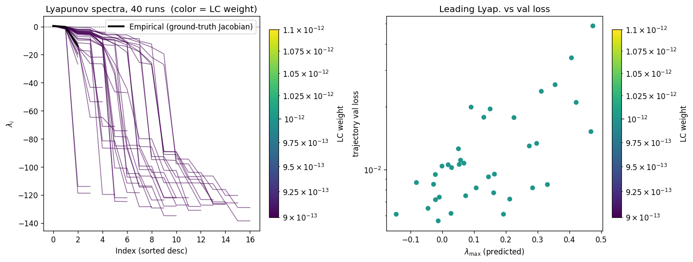

### per_run_lyapunov_vs_true

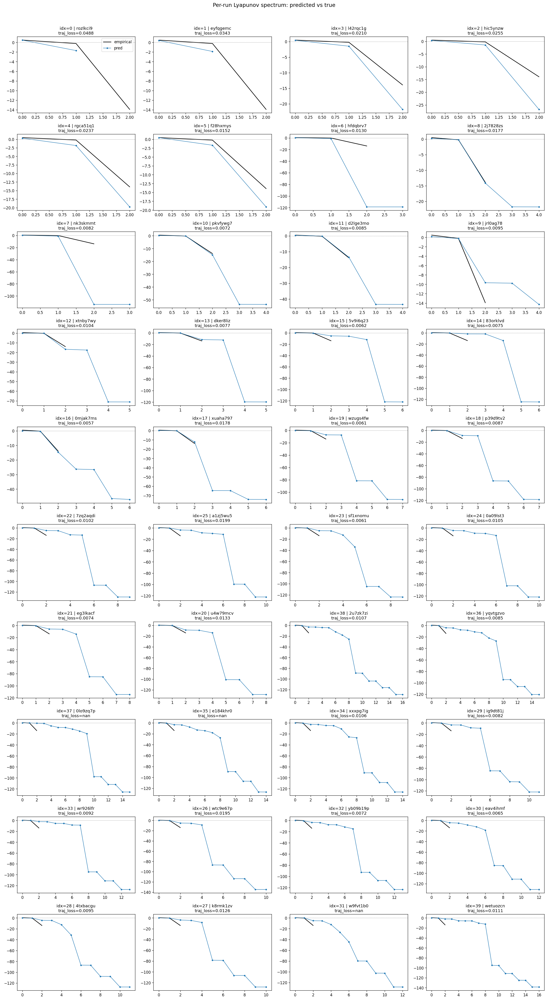

### per_run_lyapunov_relerr

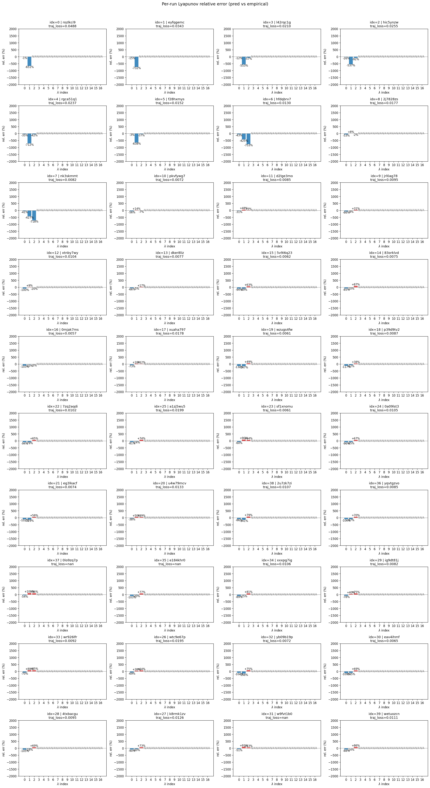

### encoder_decoder_jacobians

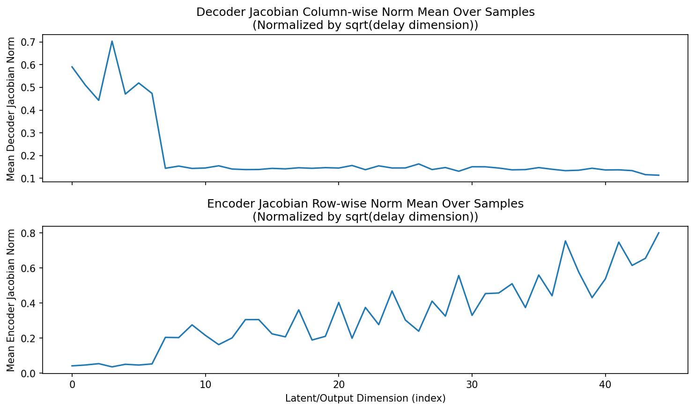

### amplification

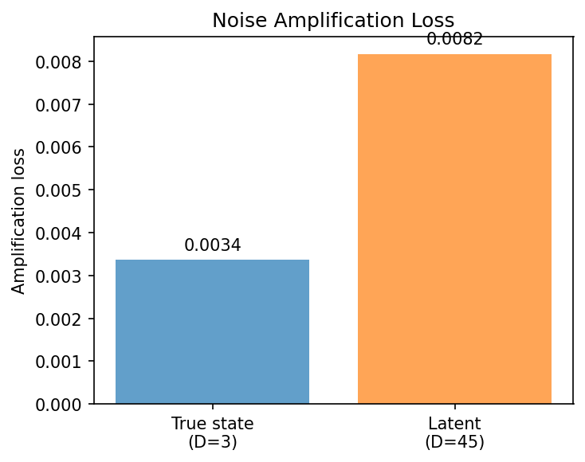

### kaplan_yorke_pca

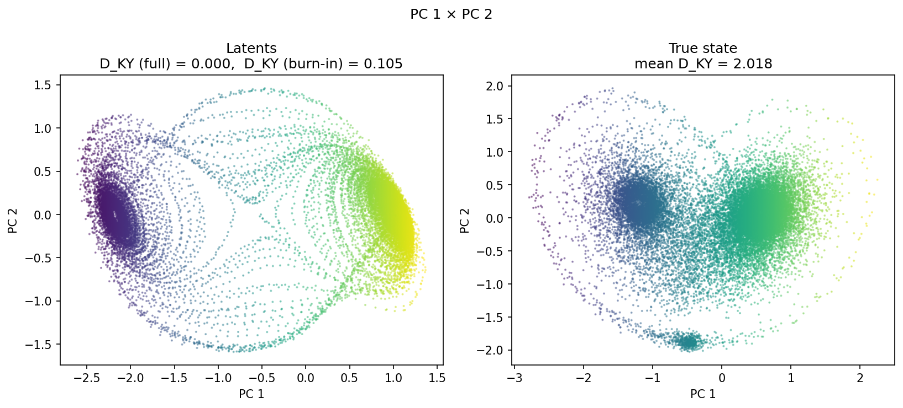

### prediction_detail_latent

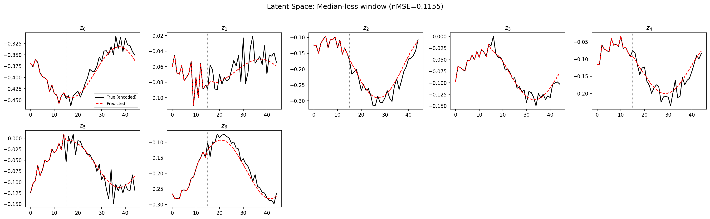

### prediction_detail_obs

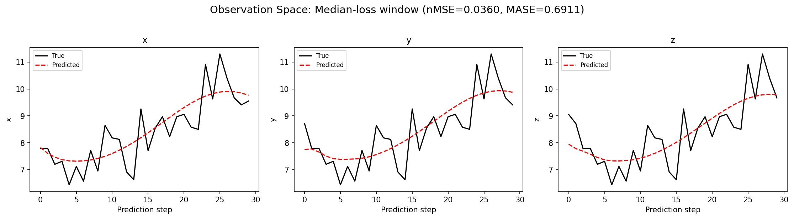

## Discussion

<!--
This section is intentionally left as a placeholder. A human reviewer
or Claude Code agent should fill it in based on the tables and figures
above, explicitly addressing each success criterion and comparing the
outcome to the stated hypothesis. Write the Discussion to
`discussion.md` in this directory and re-run `render_report`.
-->

_(to be written)_

## `run_analytics` stdout

<details><summary>Click to expand — full diagnostic output from <code>run_analytics</code></summary>

```
No run_id provided — selecting best run from group 'lorenz_partial_additive_mse_uniform_p30_obsnoise005__ndelays_initsteps_autodim' ...
Found 40 total runs in JacobianODE/Lorenz_INDpartial_NDInitSweep_autodim_D1_NormTrue__JacobianODE (group=lorenz_partial_additive_mse_uniform_p30_obsnoise005__ndelays_initsteps_autodim)
All runs (state, loop_closure_weight, tangent_entropy_weight, kl_dyn_weight):
  rozlkci9: state=finished, lc=0.0, te=0.0, kl_dyn=0.0
  eyfqgemc: state=finished, lc=0.0, te=0.0, kl_dyn=0.0
  l42rqc1g: state=finished, lc=0.0, te=0.0, kl_dyn=0.0
  hic5ynzw: state=finished, lc=0.0, te=0.0, kl_dyn=0.0
  rgca51q1: state=finished, lc=0.0, te=0.0, kl_dyn=0.0
  f28hxmys: state=finished, lc=0.0, te=0.0, kl_dyn=0.0
  hfdqbrv7: state=finished, lc=0.0, te=0.0, kl_dyn=0.0
  2j7828zs: state=finished, lc=0.0, te=0.0, kl_dyn=0.0
  nk3skmmt: state=finished, lc=0.0, te=0.0, kl_dyn=0.0
  pkvfywg7: state=finished, lc=0.0, te=0.0, kl_dyn=0.0
  d2lge3mo: state=finished, lc=0.0, te=0.0, kl_dyn=0.0
  jrl0ag78: state=finished, lc=0.0, te=0.0, kl_dyn=0.0
  xtnby7wy: state=finished, lc=0.0, te=0.0, kl_dyn=0.0
  dker8liz: state=finished, lc=0.0, te=0.0, kl_dyn=0.0
  5v9i6q23: state=finished, lc=0.0, te=0.0, kl_dyn=0.0
  83orklvd: state=finished, lc=0.0, te=0.0, kl_dyn=0.0
  0mjak7ms: state=finished, lc=0.0, te=0.0, kl_dyn=0.0
  xuaha797: state=finished, lc=0.0, te=0.0, kl_dyn=0.0
  wzugs4fw: state=finished, lc=0.0, te=0.0, kl_dyn=0.0
  p39d9tv2: state=finished, lc=0.0, te=0.0, kl_dyn=0.0
  7zq2aqdi: state=finished, lc=0.0, te=0.0, kl_dyn=0.0
  a1zj5wu5: state=finished, lc=0.0, te=0.0, kl_dyn=0.0
  sf1xnomu: state=finished, lc=0.0, te=0.0, kl_dyn=0.0
  0a09lst3: state=finished, lc=0.0, te=0.0, kl_dyn=0.0
  eg3lkacf: state=finished, lc=0.0, te=0.0, kl_dyn=0.0
  u4w79mcv: state=finished, lc=0.0, te=0.0, kl_dyn=0.0
  2u7zk7zi: state=finished, lc=0.0, te=0.0, kl_dyn=0.0
  yqvtgzvo: state=finished, lc=0.0, te=0.0, kl_dyn=0.0
  0lo9zq7p: state=finished, lc=0.0, te=0.0, kl_dyn=0.0
  e184khr0: state=finished, lc=0.0, te=0.0, kl_dyn=0.0
  xxxpg7ig: state=finished, lc=0.0, te=0.0, kl_dyn=0.0
  ig9dt81j: state=finished, lc=0.0, te=0.0, kl_dyn=0.0
  wr926lfr: state=finished, lc=0.0, te=0.0, kl_dyn=0.0
  wtc9e67p: state=finished, lc=0.0, te=0.0, kl_dyn=0.0
  yb09b19p: state=finished, lc=0.0, te=0.0, kl_dyn=0.0
  eav4ihmf: state=finished, lc=0.0, te=0.0, kl_dyn=0.0
  4txbacgu: state=finished, lc=0.0, te=0.0, kl_dyn=0.0
  k8rmk1zv: state=finished, lc=0.0, te=0.0, kl_dyn=0.0
  w9fvt1b0: state=finished, lc=0.0, te=0.0, kl_dyn=0.0
  wetuozcn: state=finished, lc=0.0, te=0.0, kl_dyn=0.0

slurm_timeout_min not found in any run config — falling back to 180 min
  Including rozlkci9 (lc=0.0): use_all_runs=True (state=finished)
  Including eyfqgemc (lc=0.0): use_all_runs=True (state=finished)
  Including l42rqc1g (lc=0.0): use_all_runs=True (state=finished)
  Including hic5ynzw (lc=0.0): use_all_runs=True (state=finished)
  Including rgca51q1 (lc=0.0): use_all_runs=True (state=finished)
  Including f28hxmys (lc=0.0): use_all_runs=True (state=finished)
  Including hfdqbrv7 (lc=0.0): use_all_runs=True (state=finished)
  Including 2j7828zs (lc=0.0): use_all_runs=True (state=finished)
  Including nk3skmmt (lc=0.0): use_all_runs=True (state=finished)
  Including pkvfywg7 (lc=0.0): use_all_runs=True (state=finished)
  Including d2lge3mo (lc=0.0): use_all_runs=True (state=finished)
  Including jrl0ag78 (lc=0.0): use_all_runs=True (state=finished)
  Including xtnby7wy (lc=0.0): use_all_runs=True (state=finished)
  Including dker8liz (lc=0.0): use_all_runs=True (state=finished)
  Including 5v9i6q23 (lc=0.0): use_all_runs=True (state=finished)
  Including 83orklvd (lc=0.0): use_all_runs=True (state=finished)
  Including 0mjak7ms (lc=0.0): use_all_runs=True (state=finished)
  Including xuaha797 (lc=0.0): use_all_runs=True (state=finished)
  Including wzugs4fw (lc=0.0): use_all_runs=True (state=finished)
  Including p39d9tv2 (lc=0.0): use_all_runs=True (state=finished)
  Including 7zq2aqdi (lc=0.0): use_all_runs=True (state=finished)
  Including a1zj5wu5 (lc=0.0): use_all_runs=True (state=finished)
  Including sf1xnomu (lc=0.0): use_all_runs=True (state=finished)
  Including 0a09lst3 (lc=0.0): use_all_runs=True (state=finished)
  Including eg3lkacf (lc=0.0): use_all_runs=True (state=finished)
  Including u4w79mcv (lc=0.0): use_all_runs=True (state=finished)
  Including 2u7zk7zi (lc=0.0): use_all_runs=True (state=finished)
  Including yqvtgzvo (lc=0.0): use_all_runs=True (state=finished)
  Including 0lo9zq7p (lc=0.0): use_all_runs=True (state=finished)
  Including e184khr0 (lc=0.0): use_all_runs=True (state=finished)
  Including xxxpg7ig (lc=0.0): use_all_runs=True (state=finished)
  Including ig9dt81j (lc=0.0): use_all_runs=True (state=finished)
  Including wr926lfr (lc=0.0): use_all_runs=True (state=finished)
  Including wtc9e67p (lc=0.0): use_all_runs=True (state=finished)
  Including yb09b19p (lc=0.0): use_all_runs=True (state=finished)
  Including eav4ihmf (lc=0.0): use_all_runs=True (state=finished)
  Including 4txbacgu (lc=0.0): use_all_runs=True (state=finished)
  Including k8rmk1zv (lc=0.0): use_all_runs=True (state=finished)
  Including w9fvt1b0 (lc=0.0): use_all_runs=True (state=finished)
  Including wetuozcn (lc=0.0): use_all_runs=True (state=finished)
Found 40 effectively-done sweep runs:
  loop_closure_weight=0.0, tangent_entropy_weight=0.0, kl_dyn_weight=0.0 -> run_id=0a09lst3
  loop_closure_weight=0.0, tangent_entropy_weight=0.0, kl_dyn_weight=0.0 -> run_id=0lo9zq7p
  loop_closure_weight=0.0, tangent_entropy_weight=0.0, kl_dyn_weight=0.0 -> run_id=0mjak7ms
  loop_closure_weight=0.0, tangent_entropy_weight=0.0, kl_dyn_weight=0.0 -> run_id=2j7828zs
  loop_closure_weight=0.0, tangent_entropy_weight=0.0, kl_dyn_weight=0.0 -> run_id=2u7zk7zi
  loop_closure_weight=0.0, tangent_entropy_weight=0.0, kl_dyn_weight=0.0 -> run_id=4txbacgu
  loop_closure_weight=0.0, tangent_entropy_weight=0.0, kl_dyn_weight=0.0 -> run_id=5v9i6q23
  loop_closure_weight=0.0, tangent_entropy_weight=0.0, kl_dyn_weight=0.0 -> run_id=7zq2aqdi
  loop_closure_weight=0.0, tangent_entropy_weight=0.0, kl_dyn_weight=0.0 -> run_id=83orklvd
  loop_closure_weight=0.0, tangent_entropy_weight=0.0, kl_dyn_weight=0.0 -> run_id=a1zj5wu5
  loop_closure_weight=0.0, tangent_entropy_weight=0.0, kl_dyn_weight=0.0 -> run_id=d2lge3mo
  loop_closure_weight=0.0, tangent_entropy_weight=0.0, kl_dyn_weight=0.0 -> run_id=dker8liz
  loop_closure_weight=0.0, tangent_entropy_weight=0.0, kl_dyn_weight=0.0 -> run_id=e184khr0
  loop_closure_weight=0.0, tangent_entropy_weight=0.0, kl_dyn_weight=0.0 -> run_id=eav4ihmf
  loop_closure_weight=0.0, tangent_entropy_weight=0.0, kl_dyn_weight=0.0 -> run_id=eg3lkacf
  loop_closure_weight=0.0, tangent_entropy_weight=0.0, kl_dyn_weight=0.0 -> run_id=eyfqgemc
  loop_closure_weight=0.0, tangent_entropy_weight=0.0, kl_dyn_weight=0.0 -> run_id=f28hxmys
  loop_closure_weight=0.0, tangent_entropy_weight=0.0, kl_dyn_weight=0.0 -> run_id=hfdqbrv7
  loop_closure_weight=0.0, tangent_entropy_weight=0.0, kl_dyn_weight=0.0 -> run_id=hic5ynzw
  loop_closure_weight=0.0, tangent_entropy_weight=0.0, kl_dyn_weight=0.0 -> run_id=ig9dt81j
  loop_closure_weight=0.0, tangent_entropy_weight=0.0, kl_dyn_weight=0.0 -> run_id=jrl0ag78
  loop_closure_weight=0.0, tangent_entropy_weight=0.0, kl_dyn_weight=0.0 -> run_id=k8rmk1zv
  loop_closure_weight=0.0, tangent_entropy_weight=0.0, kl_dyn_weight=0.0 -> run_id=l42rqc1g
  loop_closure_weight=0.0, tangent_entropy_weight=0.0, kl_dyn_weight=0.0 -> run_id=nk3skmmt
  loop_closure_weight=0.0, tangent_entropy_weight=0.0, kl_dyn_weight=0.0 -> run_id=p39d9tv2
  loop_closure_weight=0.0, tangent_entropy_weight=0.0, kl_dyn_weight=0.0 -> run_id=pkvfywg7
  loop_closure_weight=0.0, tangent_entropy_weight=0.0, kl_dyn_weight=0.0 -> run_id=rgca51q1
  loop_closure_weight=0.0, tangent_entropy_weight=0.0, kl_dyn_weight=0.0 -> run_id=rozlkci9
  loop_closure_weight=0.0, tangent_entropy_weight=0.0, kl_dyn_weight=0.0 -> run_id=sf1xnomu
  loop_closure_weight=0.0, tangent_entropy_weight=0.0, kl_dyn_weight=0.0 -> run_id=u4w79mcv
  loop_closure_weight=0.0, tangent_entropy_weight=0.0, kl_dyn_weight=0.0 -> run_id=w9fvt1b0
  loop_closure_weight=0.0, tangent_entropy_weight=0.0, kl_dyn_weight=0.0 -> run_id=wetuozcn
  loop_closure_weight=0.0, tangent_entropy_weight=0.0, kl_dyn_weight=0.0 -> run_id=wr926lfr
  loop_closure_weight=0.0, tangent_entropy_weight=0.0, kl_dyn_weight=0.0 -> run_id=wtc9e67p
  loop_closure_weight=0.0, tangent_entropy_weight=0.0, kl_dyn_weight=0.0 -> run_id=wzugs4fw
  loop_closure_weight=0.0, tangent_entropy_weight=0.0, kl_dyn_weight=0.0 -> run_id=xtnby7wy
  loop_closure_weight=0.0, tangent_entropy_weight=0.0, kl_dyn_weight=0.0 -> run_id=xuaha797
  loop_closure_weight=0.0, tangent_entropy_weight=0.0, kl_dyn_weight=0.0 -> run_id=xxxpg7ig
  loop_closure_weight=0.0, tangent_entropy_weight=0.0, kl_dyn_weight=0.0 -> run_id=yb09b19p
  loop_closure_weight=0.0, tangent_entropy_weight=0.0, kl_dyn_weight=0.0 -> run_id=yqvtgzvo
n_dims=65, n_latent=65, n_dyn=11, dt=0.0150
  run=0a09lst3: DiagnosticMetrics(one_step_mase=0.6632716059684753, loop_closure_loss=8.940694808959961, fast_eigenvalue_fraction=0.3590908944606781, trajectory_val_loss=0.006803846452385187) (from W&B history)
  run=0lo9zq7p: DiagnosticMetrics(one_step_mase=0.701469361782074, loop_closure_loss=113.39947509765625, fast_eigenvalue_fraction=0.3515625, trajectory_val_loss=0.016283756121993065) (from W&B history)
  run=0mjak7ms: DiagnosticMetrics(one_step_mase=0.6686431765556335, loop_closure_loss=3.9462268352508545, fast_eigenvalue_fraction=0.0, trajectory_val_loss=0.005233293399214745) (from W&B history)
  run=2j7828zs: DiagnosticMetrics(one_step_mase=0.6311016082763672, loop_closure_loss=0.41077128052711487, fast_eigenvalue_fraction=0.0, trajectory_val_loss=0.009950894862413406) (from W&B history)
  run=2u7zk7zi: DiagnosticMetrics(one_step_mase=0.6781697273254395, loop_closure_loss=49.83299255371094, fast_eigenvalue_fraction=0.4394117593765259, trajectory_val_loss=0.007462161593139172) (from W&B history)
  run=4txbacgu: DiagnosticMetrics(one_step_mase=0.6721568703651428, loop_closure_loss=24.404052734375, fast_eigenvalue_fraction=0.4737499952316284, trajectory_val_loss=0.006834620609879494) (from W&B history)
  run=5v9i6q23: DiagnosticMetrics(one_step_mase=0.6550254225730896, loop_closure_loss=4.001349925994873, fast_eigenvalue_fraction=0.2857142984867096, trajectory_val_loss=0.00552090210840106) (from W&B history)
  run=7zq2aqdi: DiagnosticMetrics(one_step_mase=0.6530018448829651, loop_closure_loss=3.0140292644500732, fast_eigenvalue_fraction=0.4000000059604645, trajectory_val_loss=0.007025620434433222) (from W&B history)
  run=83orklvd: DiagnosticMetrics(one_step_mase=0.6578584909439087, loop_closure_loss=3.8364126682281494, fast_eigenvalue_fraction=0.2857142984867096, trajectory_val_loss=0.006659208331257105) (from W&B history)
  run=a1zj5wu5: DiagnosticMetrics(one_step_mase=0.6603388786315918, loop_closure_loss=7.3412275314331055, fast_eigenvalue_fraction=0.35681816935539246, trajectory_val_loss=0.00683616753667593) (from W&B history)
  run=d2lge3mo: DiagnosticMetrics(one_step_mase=0.6636115312576294, loop_closure_loss=2.8115551471710205, fast_eigenvalue_fraction=0.0, trajectory_val_loss=0.006234963424503803) (from W&B history)
  run=dker8liz: DiagnosticMetrics(one_step_mase=0.6329793930053711, loop_closure_loss=0.4466928541660309, fast_eigenvalue_fraction=0.3333333432674408, trajectory_val_loss=0.006396517623215914) (from W&B history)
  run=e184khr0: DiagnosticMetrics(one_step_mase=0.8905954360961914, loop_closure_loss=131.02194213867188, fast_eigenvalue_fraction=0.37533333897590637, trajectory_val_loss=0.02283286117017269) (from W&B history)
  run=eav4ihmf: DiagnosticMetrics(one_step_mase=0.6565994024276733, loop_closure_loss=5.649764537811279, fast_eigenvalue_fraction=0.45884615182876587, trajectory_val_loss=0.005848906468600035) (from W&B history)
  run=eg3lkacf: DiagnosticMetrics(one_step_mase=0.6622716188430786, loop_closure_loss=8.09695053100586, fast_eigenvalue_fraction=0.426111102104187, trajectory_val_loss=0.006018174812197685) (from W&B history)
  run=eyfqgemc: DiagnosticMetrics(one_step_mase=0.7904332280158997, loop_closure_loss=5.152933120727539, fast_eigenvalue_fraction=0.0, trajectory_val_loss=0.08754920959472656) (from cache, n_batches=100)
  run=f28hxmys: DiagnosticMetrics(one_step_mase=0.637054979801178, loop_closure_loss=0.11162088066339493, fast_eigenvalue_fraction=0.0, trajectory_val_loss=0.012742096558213234) (from W&B history)
  run=hfdqbrv7: DiagnosticMetrics(one_step_mase=0.6354407668113708, loop_closure_loss=1.2997634410858154, fast_eigenvalue_fraction=0.5, trajectory_val_loss=0.011395318433642387) (from W&B history)
  run=hic5ynzw: DiagnosticMetrics(one_step_mase=1.0403393507003784, loop_closure_loss=0.9549960494041443, fast_eigenvalue_fraction=0.3333333432674408, trajectory_val_loss=0.1392793208360672) (from cache, n_batches=100)
  run=ig9dt81j: DiagnosticMetrics(one_step_mase=0.6593676805496216, loop_closure_loss=26.471942901611328, fast_eigenvalue_fraction=0.4612500071525574, trajectory_val_loss=0.00611862912774086) (from W&B history)
  run=jrl0ag78: DiagnosticMetrics(one_step_mase=0.6300713419914246, loop_closure_loss=0.15801428258419037, fast_eigenvalue_fraction=0.0, trajectory_val_loss=0.007230171002447605) (from W&B history)
  run=k8rmk1zv: DiagnosticMetrics(one_step_mase=0.6671136021614075, loop_closure_loss=18.022789001464844, fast_eigenvalue_fraction=0.5199999809265137, trajectory_val_loss=0.005795257166028023) (from W&B history)
  run=l42rqc1g: DiagnosticMetrics(one_step_mase=1.0393056869506836, loop_closure_loss=0.8822500705718994, fast_eigenvalue_fraction=0.0, trajectory_val_loss=0.2338985800743103) (from cache, n_batches=100)
  run=nk3skmmt: DiagnosticMetrics(one_step_mase=0.6604945063591003, loop_closure_loss=1.005651831626892, fast_eigenvalue_fraction=0.5, trajectory_val_loss=0.007970093749463558) (from W&B history)
  run=p39d9tv2: DiagnosticMetrics(one_step_mase=0.6554281115531921, loop_closure_loss=8.439270973205566, fast_eigenvalue_fraction=0.48875001072883606, trajectory_val_loss=0.007179839536547661) (from W&B history)
  run=pkvfywg7: DiagnosticMetrics(one_step_mase=0.6597757935523987, loop_closure_loss=7.643290996551514, fast_eigenvalue_fraction=0.0, trajectory_val_loss=0.00659464905038476) (from W&B history)
  run=rgca51q1: DiagnosticMetrics(one_step_mase=1.364698052406311, loop_closure_loss=4.962955474853516, fast_eigenvalue_fraction=0.2775000035762787, trajectory_val_loss=0.1578359156847) (from cache, n_batches=100)
  run=rozlkci9: DiagnosticMetrics(one_step_mase=0.8035351037979126, loop_closure_loss=2.2053279876708984, fast_eigenvalue_fraction=0.0, trajectory_val_loss=0.12071456760168076) (from cache, n_batches=100)
  run=sf1xnomu: DiagnosticMetrics(one_step_mase=0.6514770984649658, loop_closure_loss=3.3254430294036865, fast_eigenvalue_fraction=0.3955000042915344, trajectory_val_loss=0.005956427659839392) (from W&B history)
  run=u4w79mcv: DiagnosticMetrics(one_step_mase=0.6675496101379395, loop_closure_loss=4.979036808013916, fast_eigenvalue_fraction=0.4444444477558136, trajectory_val_loss=0.00705954572185874) (from W&B history)
  run=w9fvt1b0: DiagnosticMetrics(one_step_mase=0.7279269099235535, loop_closure_loss=50.45429229736328, fast_eigenvalue_fraction=0.4596153795719147, trajectory_val_loss=0.015756847336888313) (from W&B history)
  run=wetuozcn: DiagnosticMetrics(one_step_mase=0.6544393301010132, loop_closure_loss=8.43765640258789, fast_eigenvalue_fraction=0.47058823704719543, trajectory_val_loss=0.00632119458168745) (from W&B history)
  run=wr926lfr: DiagnosticMetrics(one_step_mase=0.669662356376648, loop_closure_loss=41.5259895324707, fast_eigenvalue_fraction=0.4032142758369446, trajectory_val_loss=0.006917516700923443) (from W&B history)
  run=wtc9e67p: DiagnosticMetrics(one_step_mase=0.6741722822189331, loop_closure_loss=10.227995872497559, fast_eigenvalue_fraction=0.5454545617103577, trajectory_val_loss=0.01007596030831337) (from W&B history)
  run=wzugs4fw: DiagnosticMetrics(one_step_mase=0.6574952006340027, loop_closure_loss=8.164962768554688, fast_eigenvalue_fraction=0.4662500023841858, trajectory_val_loss=0.0060982177965343) (from W&B history)
  run=xtnby7wy: DiagnosticMetrics(one_step_mase=0.6645694971084595, loop_closure_loss=4.25631046295166, fast_eigenvalue_fraction=0.14166666567325592, trajectory_val_loss=0.008257216773927212) (from W&B history)
  run=xuaha797: DiagnosticMetrics(one_step_mase=0.6823915839195251, loop_closure_loss=9.171093940734863, fast_eigenvalue_fraction=0.20642857253551483, trajectory_val_loss=0.006212009582668543) (from W&B history)
  run=xxxpg7ig: DiagnosticMetrics(one_step_mase=0.7937853336334229, loop_closure_loss=74.19416809082031, fast_eigenvalue_fraction=0.3736666738986969, trajectory_val_loss=0.007398287765681744) (from W&B history)
  run=yb09b19p: DiagnosticMetrics(one_step_mase=0.6659087538719177, loop_closure_loss=57.04132843017578, fast_eigenvalue_fraction=0.4032142758369446, trajectory_val_loss=0.0059127602726221085) (from W&B history)
  run=yqvtgzvo: DiagnosticMetrics(one_step_mase=0.6741759777069092, loop_closure_loss=117.17025756835938, fast_eigenvalue_fraction=0.3515625, trajectory_val_loss=0.00838957168161869) (from W&B history)

Ranking method:           best_traj_loss
Best run ID:              0mjak7ms
Best loop_closure_weight: 0.0
Best tangent_entropy_weight: 0.0
Best kl_dyn_weight:       0.0
Best traj loss:           0.005233
Criteria applied: ['C1', 'C2', 'C3']
Surviving: 8 / 40
Auto-selected run_id: 0mjak7ms

======================================================================
PARETO FRONTIER RUNS (6 runs)
======================================================================
  Run ID               LC Loss   Traj Val Loss
  ------------  --------------  --------------
  f28hxmys            0.111621        0.012742
  jrl0ag78            0.158014        0.007230
  dker8liz            0.446693        0.006397
  d2lge3mo            2.811555        0.006235
  sf1xnomu            3.325443        0.005956
  0mjak7ms            3.946227        0.005233 <-- selected

======================================================================
RANKING METHOD COMPARISON (over 8 survivors)
======================================================================
  Method                  Run ID               LC Loss   Traj Val Loss
  ----------------------  ------------  --------------  --------------
  best_traj_loss          0mjak7ms            3.946227        0.005233 <-- active
  pareto_knee             jrl0ag78            0.158014        0.007230
  geo_rank                0mjak7ms            3.946227        0.005233
  minimax_rank            jrl0ag78            0.158014        0.007230
  geo_log_score           0mjak7ms            3.946227        0.005233
  minimax_log_score       jrl0ag78            0.158014        0.007230
======================================================================

Loading run 0mjak7ms from JacobianODE/Lorenz_INDpartial_NDInitSweep_autodim_D1_NormTrue__JacobianODE ...
Train dataset shape: torch.Size([24442, 45, 45])
Validation dataset shape: torch.Size([7777, 45, 45])
Test dataset shape: torch.Size([3333, 45, 45])
Train trajectories dataset shape: torch.Size([22, 1156, 45])
Validation trajectories dataset shape: torch.Size([7, 1156, 45])
Test trajectories dataset shape: torch.Size([3, 1156, 45])
Loading checkpoint epoch=152-step=30600.ckpt...
Computing reconstruction ...
Computing MASE ...
Teacher-forced MASE: 0.6720
Free-running MASE:   0.7006
Computing latent utilization ...
Entropy-based utilization: 0.902
Null subspace mean RMS: 2.065247e-01
Computing Lyapunov exponents ...
  Computing full-trajectory Lyapunov (3 test trajs, T=1156) ...
Predicted Lyapunov exponents (batch+burn-in, 128 windowed trajs):
  λ_1 = -0.2119 ± 0.3639
  λ_2 = -0.7462 ± 0.5760
  λ_3 = -14.7999 ± 1.4259
  λ_4 = -26.9858 ± 2.9573
  λ_5 = -27.3015 ± 2.8531
  λ_6 = -52.2258 ± 12.9025
  λ_7 = -52.6187 ± 12.3459
Predicted Lyapunov exponents (full-length, 3 test trajs):
  λ_1 = -0.0621 ± 0.0093
  λ_2 = -0.2071 ± 0.1600
  λ_3 = -14.3679 ± 0.2524
  λ_4 = -27.2393 ± 0.0750
  λ_5 = -27.3655 ± 0.0596
  λ_6 = -53.2434 ± 0.0825
  λ_7 = -53.5610 ± 0.0993
Empirical Lyapunov exponents (mean ± std):
  λ_1 = +0.4677 ± 0.0259
  λ_2 = -0.2173 ± 0.0549
  λ_3 = -13.9174 ± 0.0513
Mean KY dim (predicted): 0.000 ± 0.000
Mean KY dim (empirical): 2.018 ± 0.003
Mean KY dim (burn-in):   0.105 ± 0.363
Computing prediction windows ...
Windows: 114 — nMSE min=0.0238, median=0.0359, mean=0.0383, max=0.1147
Computing long-trajectory free-running rollouts ...
Computing encoder/decoder Jacobians ...
encoder_jacobian: (128, 45, 45)
decoder_jacobian: (128, 45, 45)
Computing amplification loss ...
Amplification loss — True state: 0.003366
Amplification loss — Latent:     0.008172
```

</details>
