# Sweep Analysis: `lorenz_partial_additive_mse_uniform_p30_obsnoise005_top3nd_init15_autodim__lc_sweep`

**Project**: [Lorenz_INDpartial_NDInitSweep_autodim_D1_NormTrue__JacobianODE](https://wandb.ai/JacobianODE/Lorenz_INDpartial_NDInitSweep_autodim_D1_NormTrue__JacobianODE/groups/lorenz_partial_additive_mse_uniform_p30_obsnoise005_top3nd_init15_autodim__lc_sweep)  
**Launched**: 2026-04-21T22:10:42Z  
**Completed**: 2026-04-22T14:15:24Z  
**Outcome**: `complete_clean`  
**Git**: `latent-JacobianODE` @ `3094575`  
**Expected runs**: 27

## Experiment Context

### `lorenz_partial_additive_mse_uniform_p30_obsnoise005_top3nd_init15_autodim__lc_sweep`

**Description**

Lorenz partial additive coupling, uniform reconstruction loss,
obs_noise=0.05, prediction_steps=30, traj_init_steps=15.
27-run sweep: 3 n_delays {45, 80, 85} × 9 LC weights
{0, 1e-6, 1e-5, 1e-4, 1e-3, 1e-2, 1e-1, 1, 10}. n_target_dims
picked by PCA-auto (threshold=0.99) per n_delays — with more
delays and higher noise, the PCA threshold should select a
larger n_target_dims (7 at n_d=45 → 13-14 at n_d=80-85 per the
earlier sweep).
Goal: same two-stage-stability check as the obsnoise001
companion sweep, but at higher noise where the n_delays
surface was nearly flat and LC may cleanly break the tie.

**Hypothesis**

Because the LC=0 n_delays surface was flat at obs_noise=0.05
(top 3 within ~15% of each other), LC is likely what picks a
winner here. LC's role is partially a denoising regularizer, so
at higher noise we'd expect the best LC weight to be larger than
at obsnoise001. High n_delays + high LC may win if the extra
latent-space redundancy gives LC more room to find a clean chart
— but it may also hurt if PCA-auto inflates n_target_dims and
the dynamics MLP overfits.

**Success criteria**

- All 27 runs train without divergence
- Best val traj_loss achieved at LC > 0 with a clear margin over LC=0
- PCA-auto n_target_dims at each n_delays matches what the earlier LC=0 sweep recorded (sanity: data-driven pick is deterministic)
- Optimum (n_delays, LC) is interpretable — e.g., low n_delays favours small LC, high n_delays favours larger LC, or a single cell dominates

## Results

**Swept axes** (11): `data.train_test_params.delay_embedding_params.n_delays`, `model.encoder.init_pca_basis`, `model.encoder.n_input`, `model.encoder_only_mode`, `model.n_target_dims`, `model.n_target_dims_pca_auto`, `model.n_target_dims_pca_cum_var`, `model.params.input_dim`, `model.params.output_dim`, `model.trajectory_loss_most_recent`, `training.lightning.loop_closure_weight`

**Chosen run** (by `best_traj_loss`): `84t4ol8o` — traj_loss=0.00508, MASE=0.7485, R²=0.9867, LC loss=0.523, epoch=146.0

Swept-axis values at chosen run: `data.train_test_params.delay_embedding_params.n_delays`=85 · `model.encoder.init_pca_basis`=False · `model.encoder.n_input`=85 · `model.encoder_only_mode`=False · `model.n_target_dims`=14 · `model.n_target_dims_pca_auto`=14 · `model.n_target_dims_pca_cum_var`=0.990074 · `model.params.input_dim`=14 · `model.params.output_dim`=196 · `model.trajectory_loss_most_recent`=True · `training.lightning.loop_closure_weight`=1.0e-04

### Integrity checks

⚠️ **1 run_idx slot(s) had multiple matching wandb runs** — the best by `best_traj_loss` was kept; the others are listed below for audit:
  - run_idx=**22**: chose `1w0hev9p`, dropped `le0dzlw2`

**Runs analyzed**: 27 (expected 27)

### Per-run results

| run_idx | run_id | `data.train_test_params.delay_embedding_params.n_delays` | `model.encoder.init_pca_basis` | `model.encoder.n_input` | `model.encoder_only_mode` | `model.n_target_dims` | `model.n_target_dims_pca_auto` | `model.n_target_dims_pca_cum_var` | `model.params.input_dim` | `model.params.output_dim` | `model.trajectory_loss_most_recent` | `training.lightning.loop_closure_weight` | best_traj_loss | best_MASE | R² | LC loss | epoch |
|---|---|---|---|---|---|---|---|---|---|---|---|---|---|---|---|---|---|
| 21 | `84t4ol8o` | 85 | False | 85 | False | 14 | 14 | 0.990074 | 14 | 196 | True | 1.0e-04 | 0.00508 | 0.7485 | 0.9867 | 0.523 | 146.0 |
| 19 | `m9skdt8y` | 85 | None | 85 | None | 14 | 14 | 0.990074 | 14 | 196 | True | 1.0e-06 | 0.00509 | 0.7637 | 0.9867 | 17.559 | 116.0 |
| 20 | `gxopqt8v` | 85 | False | 85 | False | 14 | 14 | 0.990074 | 14 | 196 | True | 1.0e-05 | 0.00519 | 0.7489 | 0.9864 | 3.729 | 116.0 |
| 18 | `gb7trawk` | 85 | False | 85 | False | 14 | 14 | 0.990074 | 14 | 196 | True | 0 | 0.00543 | 0.7773 | 0.9857 | 18.889 | 106.0 |
| 3 | `ad08hyqh` | 45 | False | 45 | False | 7 | 7 | 0.990085 | 7 | 49 | True | 1.0e-04 | 0.00550 | 0.7777 | 0.9847 | 0.258 | 113.0 |
| 0 | `t87xx2sr` | 45 | False | 45 | False | 7 | 7 | 0.990085 | 7 | 49 | True | 0 | 0.00550 | 0.7760 | 0.9847 | 4.089 | 112.0 |
| 4 | `46oagxgj` | 45 | False | 45 | False | 7 | 7 | 0.990085 | 7 | 49 | True | 0.001 | 0.00564 | 0.7899 | 0.9843 | 0.067 | 117.0 |
| 2 | `mdbm4iv8` | 45 | False | 45 | False | 7 | 7 | 0.990085 | 7 | 49 | True | 1.0e-05 | 0.00573 | 0.7847 | 0.9840 | 1.128 | 107.0 |
| 9 | `5wjm0dt2` | 80 | False | 80 | False | 13 | 13 | 0.990058 | 13 | 169 | True | 0 | 0.00575 | 0.7672 | 0.9846 | 64.182 | 123.0 |
| 10 | `13jereo7` | 80 | False | 80 | False | 13 | 13 | 0.990058 | 13 | 169 | True | 1.0e-06 | 0.00577 | 0.7841 | 0.9845 | 11.236 | 108.0 |
| 22 | `1w0hev9p` | 85 | False | 85 | False | 14 | 14 | 0.990074 | 14 | 196 | True | 0.001 | 0.00578 | 0.7933 | 0.9848 | 0.020 | 143.0 |
| 5 | `wl8syanc` | 45 | False | 45 | False | 7 | 7 | 0.990085 | 7 | 49 | True | 0.01 | 0.00609 | 0.8073 | 0.9830 | 0.007 | 103.0 |
| 11 | `e7bohmr1` | 80 | False | 80 | False | 13 | 13 | 0.990058 | 13 | 169 | True | 1.0e-05 | 0.00627 | 0.7974 | 0.9832 | 3.151 | 100.0 |
| 12 | `ai2sfauw` | 80 | False | 80 | False | 13 | 13 | 0.990058 | 13 | 169 | True | 1.0e-04 | 0.00648 | 0.8077 | 0.9827 | 0.528 | 99.0 |
| 23 | `tctx8b3w` | 85 | None | 85 | None | 14 | 14 | 0.990074 | 14 | 196 | True | 0.01 | 0.00687 | 0.8369 | 0.9820 | 0.014 | 111.0 |
| 6 | `f6eje9cx` | 45 | False | 45 | False | 7 | 7 | 0.990085 | 7 | 49 | True | 0.1 | 0.00724 | 0.8503 | 0.9798 | 0.001 | 116.0 |
| 13 | `vmstp6i6` | 80 | False | 80 | False | 13 | 13 | 0.990058 | 13 | 169 | True | 0.001 | 0.00727 | 0.8302 | 0.9805 | 0.098 | 106.0 |
| 24 | `iwiemice` | 85 | None | 85 | None | 14 | 14 | 0.990074 | 14 | 196 | True | 0.1 | 0.00754 | 0.8429 | 0.9802 | 0.001 | 103.0 |
| 7 | `x81qzt3n` | 45 | False | 45 | False | 7 | 7 | 0.990085 | 7 | 49 | True | 1 | 0.00785 | 0.8737 | 0.9781 | 0.000 | 111.0 |
| 1 | `wl3z5zyo` | 45 | False | 45 | False | 7 | 7 | 0.990085 | 7 | 49 | True | 1.0e-06 | 0.00856 | 0.8818 | 0.9759 | 7.702 | 37.0 |
| 8 | `09bi41oi` | 45 | None | 45 | None | 7 | 7 | 0.990085 | 7 | 49 | True | 10 | 0.00878 | 0.9115 | 0.9755 | 0.000 | 163.0 |
| 25 | `cvtyt6b1` | 85 | False | 85 | False | 14 | 14 | 0.990074 | 14 | 196 | True | 1 | 0.00920 | 0.9053 | 0.9759 | 0.000 | 91.0 |
| 15 | `xwldenkt` | 80 | False | 80 | False | 13 | 13 | 0.990058 | 13 | 169 | True | 0.1 | 0.00975 | 0.8819 | 0.9737 | 0.000 | 181.0 |
| 26 | `gs2fqny2` | 85 | False | 85 | False | 14 | 14 | 0.990074 | 14 | 196 | True | 10 | 0.01010 | 0.9314 | 0.9736 | 0.000 | 109.0 |
| 14 | `f0iiwn33` | 80 | False | 80 | False | 13 | 13 | 0.990058 | 13 | 169 | True | 0.01 | 0.01016 | 0.9057 | 0.9725 | 0.008 | 88.0 |
| 16 | `n7agfcmi` | 80 | False | 80 | False | 13 | 13 | 0.990058 | 13 | 169 | True | 1 | 0.01041 | 0.9073 | 0.9721 | 0.000 | 114.0 |
| 17 | `73nfr1ti` | 80 | False | 80 | False | 13 | 13 | 0.990058 | 13 | 169 | True | 10 | 0.01358 | 0.9978 | 0.9639 | 0.000 | 115.0 |

## Success-criteria verdicts (automated)

| Criterion | Verdict | Note |
|---|---|---|
| All 27 runs train without divergence | **Unknown** |  |
| Best val traj_loss achieved at LC > 0 with a clear margin over LC=0 | **Unknown** |  |
| PCA-auto n_target_dims at each n_delays matches what the earlier LC=0 sweep recorded (sanity: data-driven pick is deterministic) | **Unknown** |  |
| Optimum (n_delays, LC) is interpretable — e.g., low n_delays favours small LC, high n_delays favours larger LC, or a single cell dominates | **Unknown** |  |

_Automated verdicts use simple numeric-threshold parsing and may mis-classify qualitative criteria. The Discussion section below takes precedence._

## Figures

### sweep_overview

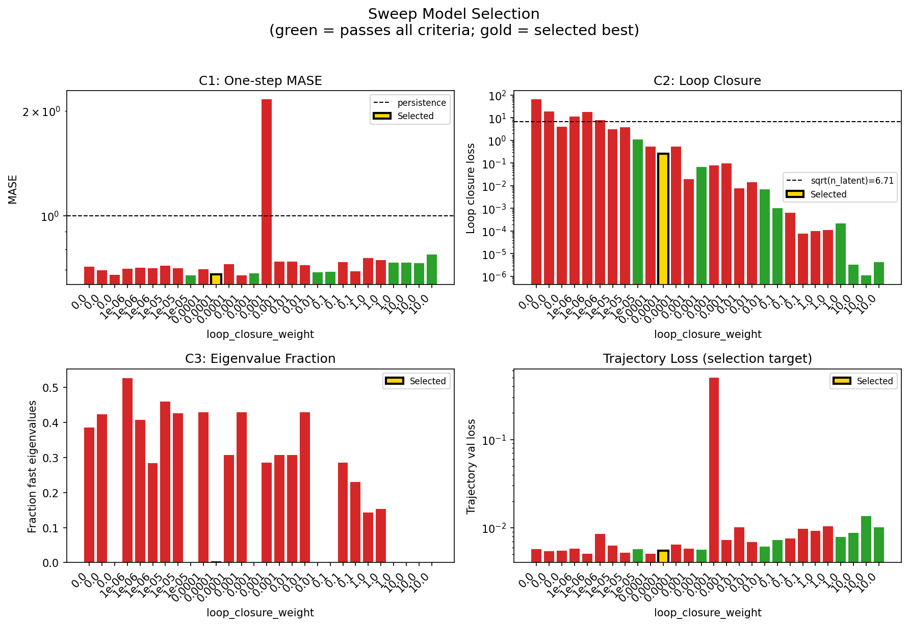

### sweep_pareto

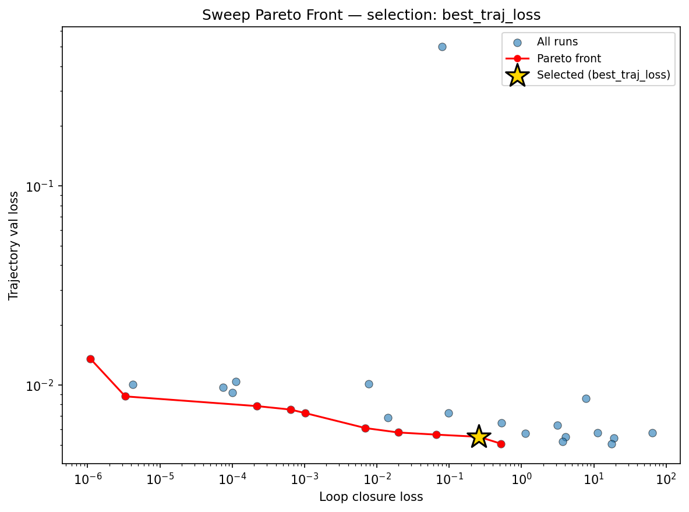

### reconstruction

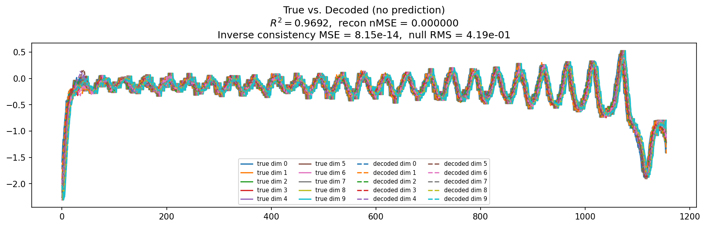

### prediction_windows

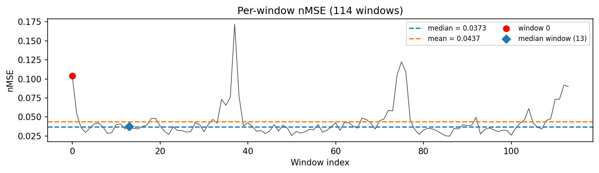

### long_trajectory

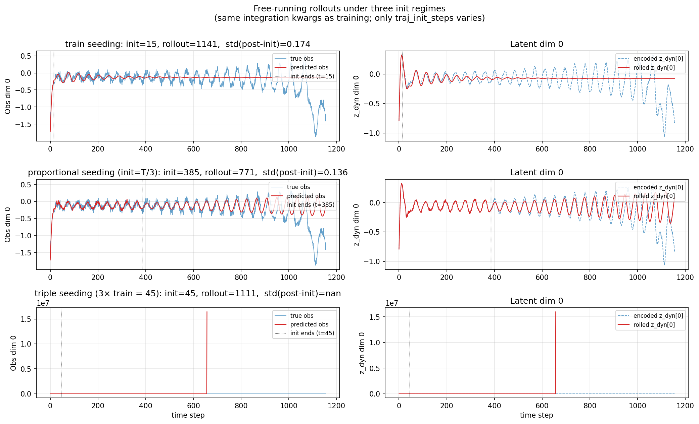

### mase

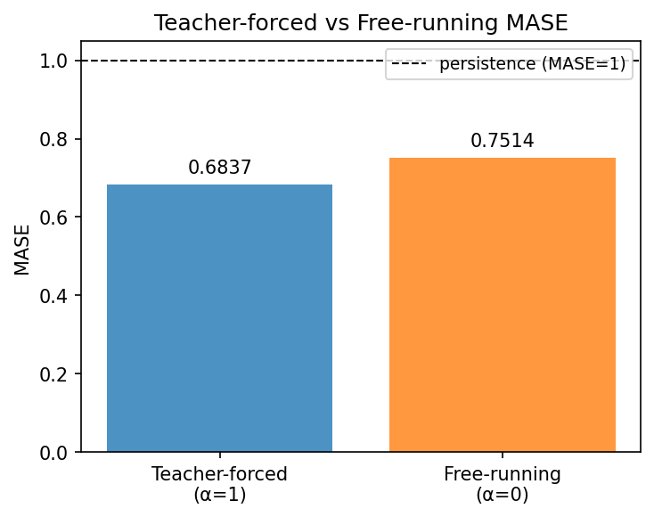

### latent_utilization

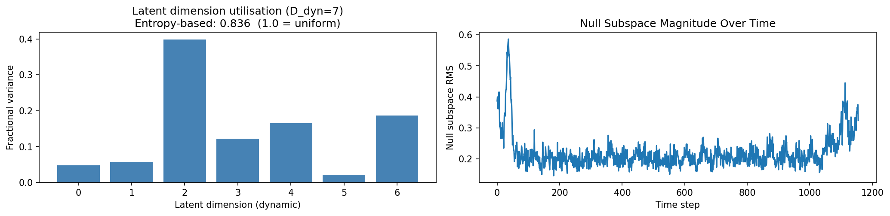

### lyapunov

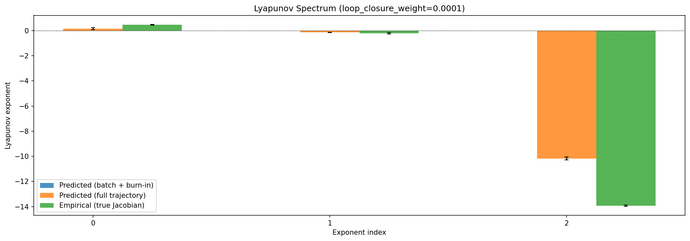

### kaplan_yorke

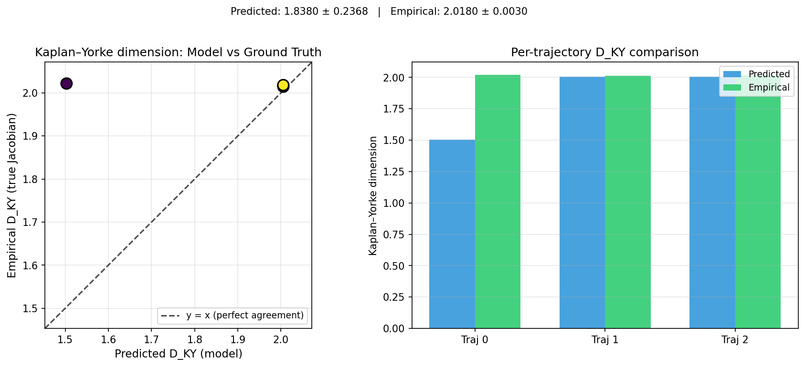

### per_run_lyapunov

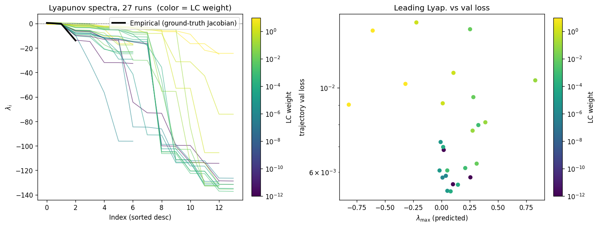

### per_run_lyapunov_vs_true

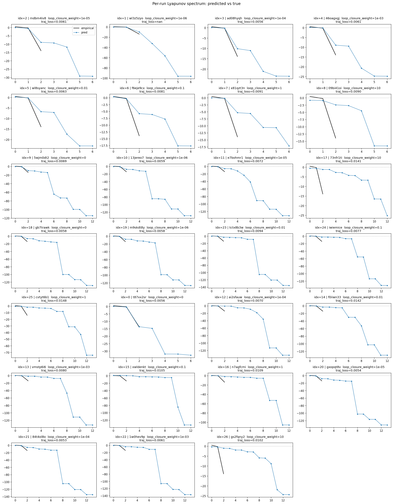

### per_run_lyapunov_relerr

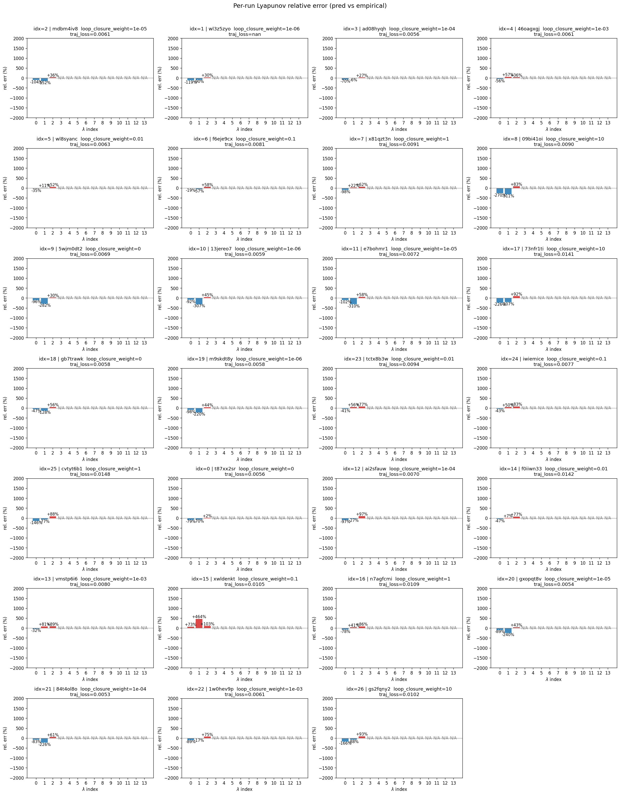

### encoder_decoder_jacobians

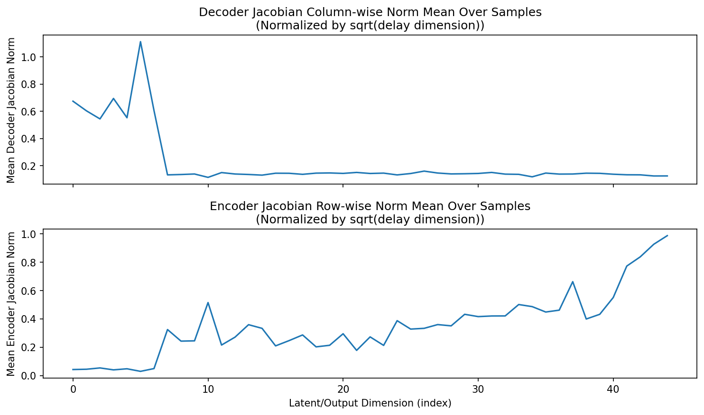

### amplification

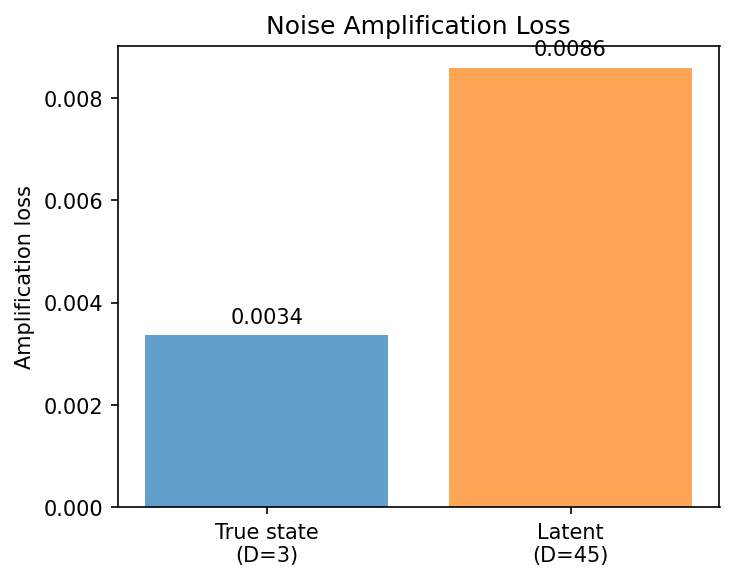

### kaplan_yorke_pca

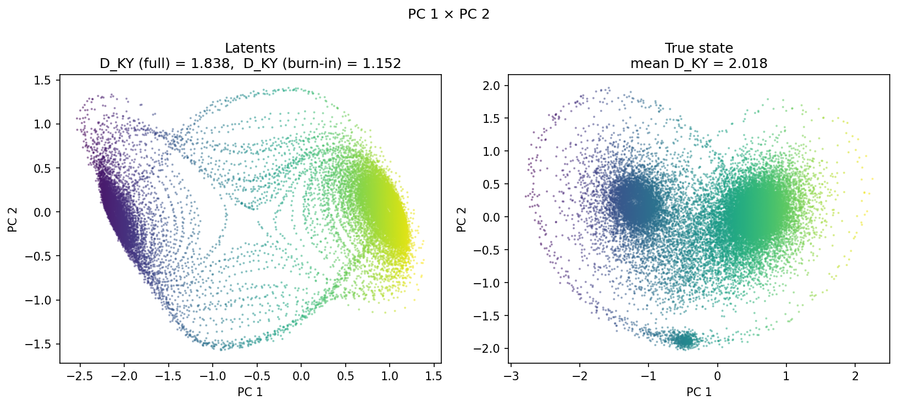

### prediction_detail_latent

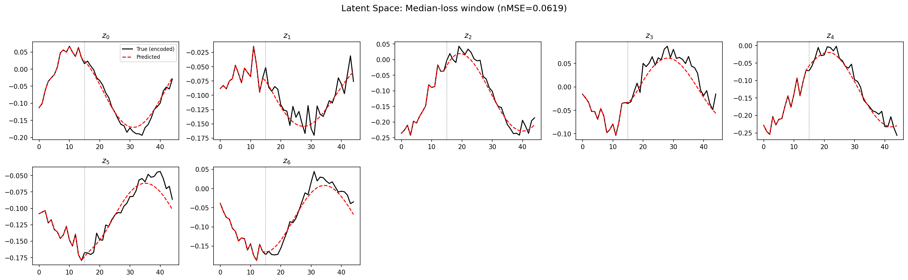

### prediction_detail_obs

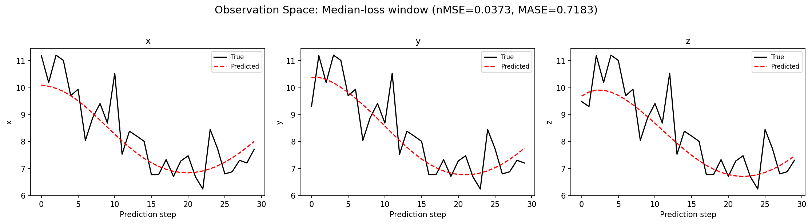

### tangent_spectrum

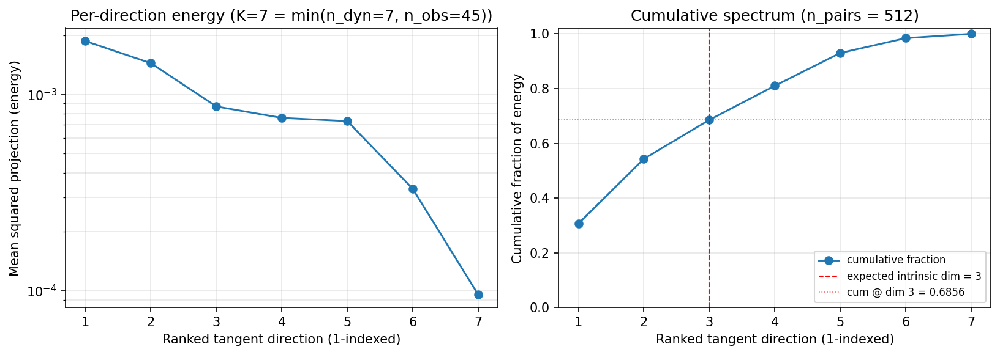

### per_run_tangent_spectrum

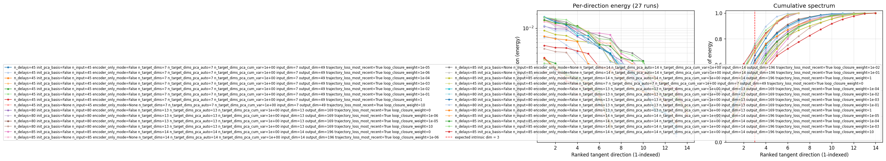

## Discussion

<!--
This section is intentionally left as a placeholder. A human reviewer
or Claude Code agent should fill it in based on the tables and figures
above, explicitly addressing each success criterion and comparing the
outcome to the stated hypothesis. Write the Discussion to
`discussion.md` in this directory and re-run `render_report`.
-->

_(to be written)_

## `run_analytics` stdout

<details><summary>Click to expand — full diagnostic output from <code>run_analytics</code></summary>

```
No run_id provided — selecting best run from group 'lorenz_partial_additive_mse_uniform_p30_obsnoise005_top3nd_init15_autodim__lc_sweep' ...
Found 36 total runs in JacobianODE/Lorenz_INDpartial_NDInitSweep_autodim_D1_NormTrue__JacobianODE (group=lorenz_partial_additive_mse_uniform_p30_obsnoise005_top3nd_init15_autodim__lc_sweep)
All runs (state, loop_closure_weight, tangent_entropy_weight, kl_dyn_weight):
  fr3dvu76: state=finished, lc=0.0, te=0.0, kl_dyn=0.0
  mdbm4iv8: state=finished, lc=1e-05, te=0.0, kl_dyn=0.0
  wl3z5zyo: state=finished, lc=1e-06, te=0.0, kl_dyn=0.0
  ad08hyqh: state=finished, lc=0.0001, te=0.0, kl_dyn=0.0
  46oagxgj: state=finished, lc=0.001, te=0.0, kl_dyn=0.0
  wl8syanc: state=finished, lc=0.01, te=0.0, kl_dyn=0.0
  f6eje9cx: state=finished, lc=0.1, te=0.0, kl_dyn=0.0
  x81qzt3n: state=finished, lc=1.0, te=0.0, kl_dyn=0.0
  09bi41oi: state=finished, lc=10.0, te=0.0, kl_dyn=0.0
  5wjm0dt2: state=finished, lc=0.0, te=0.0, kl_dyn=0.0
  13jereo7: state=finished, lc=1e-06, te=0.0, kl_dyn=0.0
  e7bohmr1: state=finished, lc=1e-05, te=0.0, kl_dyn=0.0
  sslzhp4w: state=finished, lc=0.0001, te=0.0, kl_dyn=0.0
  73nfr1ti: state=finished, lc=10.0, te=0.0, kl_dyn=0.0
  gb7trawk: state=finished, lc=0.0, te=0.0, kl_dyn=0.0
  mpep9pgd: state=finished, lc=0.01, te=0.0, kl_dyn=0.0
  7iwcr06x: state=finished, lc=1.0, te=0.0, kl_dyn=0.0
  gafrpwvm: state=finished, lc=0.1, te=0.0, kl_dyn=0.0
  v2ttbdij: state=crashed, lc=0.001, te=0.0, kl_dyn=0.0
  m9skdt8y: state=finished, lc=1e-06, te=0.0, kl_dyn=0.0
  le0dzlw2: state=crashed, lc=0.001, te=0.0, kl_dyn=0.0
  x0dhsm7j: state=finished, lc=1e-05, te=0.0, kl_dyn=0.0
  mqwp7k5w: state=finished, lc=0.0001, te=0.0, kl_dyn=0.0
  tctx8b3w: state=finished, lc=0.01, te=0.0, kl_dyn=0.0
  iwiemice: state=finished, lc=0.1, te=0.0, kl_dyn=0.0
  cvtyt6b1: state=finished, lc=1.0, te=0.0, kl_dyn=0.0
  t87xx2sr: state=finished, lc=0.0, te=0.0, kl_dyn=0.0
  ai2sfauw: state=finished, lc=0.0001, te=0.0, kl_dyn=0.0
  f0iiwn33: state=finished, lc=0.01, te=0.0, kl_dyn=0.0
  vmstp6i6: state=finished, lc=0.001, te=0.0, kl_dyn=0.0
  xwldenkt: state=finished, lc=0.1, te=0.0, kl_dyn=0.0
  n7agfcmi: state=finished, lc=1.0, te=0.0, kl_dyn=0.0
  gxopqt8v: state=finished, lc=1e-05, te=0.0, kl_dyn=0.0
  84t4ol8o: state=finished, lc=0.0001, te=0.0, kl_dyn=0.0
  1w0hev9p: state=finished, lc=0.001, te=0.0, kl_dyn=0.0
  gs2fqny2: state=finished, lc=10.0, te=0.0, kl_dyn=0.0

slurm_timeout_min not found in any run config — falling back to 180 min
  Including fr3dvu76 (lc=0.0): use_all_runs=True (state=finished)
  Including mdbm4iv8 (lc=1e-05): use_all_runs=True (state=finished)
  Including wl3z5zyo (lc=1e-06): use_all_runs=True (state=finished)
  Including ad08hyqh (lc=0.0001): use_all_runs=True (state=finished)
  Including 46oagxgj (lc=0.001): use_all_runs=True (state=finished)
  Including wl8syanc (lc=0.01): use_all_runs=True (state=finished)
  Including f6eje9cx (lc=0.1): use_all_runs=True (state=finished)
  Including x81qzt3n (lc=1.0): use_all_runs=True (state=finished)
  Including 09bi41oi (lc=10.0): use_all_runs=True (state=finished)
  Including 5wjm0dt2 (lc=0.0): use_all_runs=True (state=finished)
  Including 13jereo7 (lc=1e-06): use_all_runs=True (state=finished)
  Including e7bohmr1 (lc=1e-05): use_all_runs=True (state=finished)
  Including sslzhp4w (lc=0.0001): use_all_runs=True (state=finished)
  Including 73nfr1ti (lc=10.0): use_all_runs=True (state=finished)
  Including gb7trawk (lc=0.0): use_all_runs=True (state=finished)
  Including mpep9pgd (lc=0.01): use_all_runs=True (state=finished)
  Including 7iwcr06x (lc=1.0): use_all_runs=True (state=finished)
  Including gafrpwvm (lc=0.1): use_all_runs=True (state=finished)
  Including v2ttbdij (lc=0.001): use_all_runs=True (state=crashed)
  Including m9skdt8y (lc=1e-06): use_all_runs=True (state=finished)
  Including le0dzlw2 (lc=0.001): use_all_runs=True (state=crashed)
  Including x0dhsm7j (lc=1e-05): use_all_runs=True (state=finished)
  Including mqwp7k5w (lc=0.0001): use_all_runs=True (state=finished)
  Including tctx8b3w (lc=0.01): use_all_runs=True (state=finished)
  Including iwiemice (lc=0.1): use_all_runs=True (state=finished)
  Including cvtyt6b1 (lc=1.0): use_all_runs=True (state=finished)
  Including t87xx2sr (lc=0.0): use_all_runs=True (state=finished)
  Including ai2sfauw (lc=0.0001): use_all_runs=True (state=finished)
  Including f0iiwn33 (lc=0.01): use_all_runs=True (state=finished)
  Including vmstp6i6 (lc=0.001): use_all_runs=True (state=finished)
  Including xwldenkt (lc=0.1): use_all_runs=True (state=finished)
  Including n7agfcmi (lc=1.0): use_all_runs=True (state=finished)
  Including gxopqt8v (lc=1e-05): use_all_runs=True (state=finished)
  Including 84t4ol8o (lc=0.0001): use_all_runs=True (state=finished)
  Including 1w0hev9p (lc=0.001): use_all_runs=True (state=finished)
  Including gs2fqny2 (lc=10.0): use_all_runs=True (state=finished)
Found 36 effectively-done sweep runs:
  loop_closure_weight=0.0, tangent_entropy_weight=0.0, kl_dyn_weight=0.0 -> run_id=5wjm0dt2
  loop_closure_weight=0.0, tangent_entropy_weight=0.0, kl_dyn_weight=0.0 -> run_id=fr3dvu76
  loop_closure_weight=0.0, tangent_entropy_weight=0.0, kl_dyn_weight=0.0 -> run_id=gb7trawk
  loop_closure_weight=0.0, tangent_entropy_weight=0.0, kl_dyn_weight=0.0 -> run_id=t87xx2sr
  loop_closure_weight=1e-06, tangent_entropy_weight=0.0, kl_dyn_weight=0.0 -> run_id=13jereo7
  loop_closure_weight=1e-06, tangent_entropy_weight=0.0, kl_dyn_weight=0.0 -> run_id=m9skdt8y
  loop_closure_weight=1e-06, tangent_entropy_weight=0.0, kl_dyn_weight=0.0 -> run_id=wl3z5zyo
  loop_closure_weight=1e-05, tangent_entropy_weight=0.0, kl_dyn_weight=0.0 -> run_id=e7bohmr1
  loop_closure_weight=1e-05, tangent_entropy_weight=0.0, kl_dyn_weight=0.0 -> run_id=gxopqt8v
  loop_closure_weight=1e-05, tangent_entropy_weight=0.0, kl_dyn_weight=0.0 -> run_id=mdbm4iv8
  loop_closure_weight=1e-05, tangent_entropy_weight=0.0, kl_dyn_weight=0.0 -> run_id=x0dhsm7j
  loop_closure_weight=0.0001, tangent_entropy_weight=0.0, kl_dyn_weight=0.0 -> run_id=84t4ol8o
  loop_closure_weight=0.0001, tangent_entropy_weight=0.0, kl_dyn_weight=0.0 -> run_id=ad08hyqh
  loop_closure_weight=0.0001, tangent_entropy_weight=0.0, kl_dyn_weight=0.0 -> run_id=ai2sfauw
  loop_closure_weight=0.0001, tangent_entropy_weight=0.0, kl_dyn_weight=0.0 -> run_id=mqwp7k5w
  loop_closure_weight=0.0001, tangent_entropy_weight=0.0, kl_dyn_weight=0.0 -> run_id=sslzhp4w
  loop_closure_weight=0.001, tangent_entropy_weight=0.0, kl_dyn_weight=0.0 -> run_id=1w0hev9p
  loop_closure_weight=0.001, tangent_entropy_weight=0.0, kl_dyn_weight=0.0 -> run_id=46oagxgj
  loop_closure_weight=0.001, tangent_entropy_weight=0.0, kl_dyn_weight=0.0 -> run_id=le0dzlw2
  loop_closure_weight=0.001, tangent_entropy_weight=0.0, kl_dyn_weight=0.0 -> run_id=v2ttbdij
  loop_closure_weight=0.001, tangent_entropy_weight=0.0, kl_dyn_weight=0.0 -> run_id=vmstp6i6
  loop_closure_weight=0.01, tangent_entropy_weight=0.0, kl_dyn_weight=0.0 -> run_id=f0iiwn33
  loop_closure_weight=0.01, tangent_entropy_weight=0.0, kl_dyn_weight=0.0 -> run_id=mpep9pgd
  loop_closure_weight=0.01, tangent_entropy_weight=0.0, kl_dyn_weight=0.0 -> run_id=tctx8b3w
  loop_closure_weight=0.01, tangent_entropy_weight=0.0, kl_dyn_weight=0.0 -> run_id=wl8syanc
  loop_closure_weight=0.1, tangent_entropy_weight=0.0, kl_dyn_weight=0.0 -> run_id=f6eje9cx
  loop_closure_weight=0.1, tangent_entropy_weight=0.0, kl_dyn_weight=0.0 -> run_id=gafrpwvm
  loop_closure_weight=0.1, tangent_entropy_weight=0.0, kl_dyn_weight=0.0 -> run_id=iwiemice
  loop_closure_weight=0.1, tangent_entropy_weight=0.0, kl_dyn_weight=0.0 -> run_id=xwldenkt
  loop_closure_weight=1.0, tangent_entropy_weight=0.0, kl_dyn_weight=0.0 -> run_id=7iwcr06x
  loop_closure_weight=1.0, tangent_entropy_weight=0.0, kl_dyn_weight=0.0 -> run_id=cvtyt6b1
  loop_closure_weight=1.0, tangent_entropy_weight=0.0, kl_dyn_weight=0.0 -> run_id=n7agfcmi
  loop_closure_weight=1.0, tangent_entropy_weight=0.0, kl_dyn_weight=0.0 -> run_id=x81qzt3n
  loop_closure_weight=10.0, tangent_entropy_weight=0.0, kl_dyn_weight=0.0 -> run_id=09bi41oi
  loop_closure_weight=10.0, tangent_entropy_weight=0.0, kl_dyn_weight=0.0 -> run_id=73nfr1ti
  loop_closure_weight=10.0, tangent_entropy_weight=0.0, kl_dyn_weight=0.0 -> run_id=gs2fqny2
  Dropping 8 run(s) with no checkpoint dir: ['fr3dvu76', 'x0dhsm7j', 'mqwp7k5w', 'sslzhp4w', 'v2ttbdij', 'mpep9pgd', 'gafrpwvm', '7iwcr06x']
n_dims=80, n_latent=80, n_dyn=13, dt=0.0150
  run=5wjm0dt2: DiagnosticMetrics(one_step_mase=0.7136844992637634, loop_closure_loss=64.18236541748047, fast_eigenvalue_fraction=0.38538461923599243, trajectory_val_loss=0.005748343653976917) (from W&B history)
  run=gb7trawk: DiagnosticMetrics(one_step_mase=0.6977875828742981, loop_closure_loss=18.88886833190918, fast_eigenvalue_fraction=0.4235714375972748, trajectory_val_loss=0.005434954073280096) (from W&B history)
  run=t87xx2sr: DiagnosticMetrics(one_step_mase=0.6771277189254761, loop_closure_loss=4.0888590812683105, fast_eigenvalue_fraction=0.0, trajectory_val_loss=0.005500848405063152) (from W&B history)
  run=13jereo7: DiagnosticMetrics(one_step_mase=0.7037107944488525, loop_closure_loss=11.235709190368652, fast_eigenvalue_fraction=0.5265384912490845, trajectory_val_loss=0.005770507268607616) (from W&B history)
  run=m9skdt8y: DiagnosticMetrics(one_step_mase=0.7100340127944946, loop_closure_loss=17.558826446533203, fast_eigenvalue_fraction=0.4067857265472412, trajectory_val_loss=0.005086647812277079) (from W&B history)
  run=wl3z5zyo: DiagnosticMetrics(one_step_mase=0.7075402736663818, loop_closure_loss=7.7024431228637695, fast_eigenvalue_fraction=0.2842857241630554, trajectory_val_loss=0.00855868961662054) (from W&B history)
  run=e7bohmr1: DiagnosticMetrics(one_step_mase=0.7192264199256897, loop_closure_loss=3.1508431434631348, fast_eigenvalue_fraction=0.46000000834465027, trajectory_val_loss=0.0062708258628845215) (from W&B history)
  run=gxopqt8v: DiagnosticMetrics(one_step_mase=0.70595782995224, loop_closure_loss=3.728877544403076, fast_eigenvalue_fraction=0.42571428418159485, trajectory_val_loss=0.005191677715629339) (from W&B history)
  run=mdbm4iv8: DiagnosticMetrics(one_step_mase=0.6742345690727234, loop_closure_loss=1.1282624006271362, fast_eigenvalue_fraction=0.0, trajectory_val_loss=0.005725488532334566) (from W&B history)
  run=84t4ol8o: DiagnosticMetrics(one_step_mase=0.701894223690033, loop_closure_loss=0.5226759910583496, fast_eigenvalue_fraction=0.4285714328289032, trajectory_val_loss=0.005077174864709377) (from W&B history)
  run=ad08hyqh: DiagnosticMetrics(one_step_mase=0.6796920895576477, loop_closure_loss=0.25840210914611816, fast_eigenvalue_fraction=0.0, trajectory_val_loss=0.0054999589920043945) (from W&B history)
  run=ai2sfauw: DiagnosticMetrics(one_step_mase=0.7251628637313843, loop_closure_loss=0.5279591083526611, fast_eigenvalue_fraction=0.3076923191547394, trajectory_val_loss=0.006482718512415886) (from W&B history)
  run=1w0hev9p: DiagnosticMetrics(one_step_mase=0.6736676692962646, loop_closure_loss=0.019810019060969353, fast_eigenvalue_fraction=0.4285714328289032, trajectory_val_loss=0.005783000495284796) (from W&B history)
  run=46oagxgj: DiagnosticMetrics(one_step_mase=0.6843873262405396, loop_closure_loss=0.06650350242853165, fast_eigenvalue_fraction=0.0, trajectory_val_loss=0.005641073454171419) (from W&B history)
  run=le0dzlw2: DiagnosticMetrics(one_step_mase=2.155113697052002, loop_closure_loss=0.08006851375102997, fast_eigenvalue_fraction=0.2857142984867096, trajectory_val_loss=0.5006764531135559) (from W&B history)
  run=vmstp6i6: DiagnosticMetrics(one_step_mase=0.7389737963676453, loop_closure_loss=0.09823773056268692, fast_eigenvalue_fraction=0.3076923191547394, trajectory_val_loss=0.00727051543071866) (from W&B history)
  run=f0iiwn33: DiagnosticMetrics(one_step_mase=0.7390971779823303, loop_closure_loss=0.0076867518946528435, fast_eigenvalue_fraction=0.3076923191547394, trajectory_val_loss=0.010159263387322426) (from W&B history)
  run=tctx8b3w: DiagnosticMetrics(one_step_mase=0.7216696739196777, loop_closure_loss=0.01429005153477192, fast_eigenvalue_fraction=0.4285714328289032, trajectory_val_loss=0.006873263046145439) (from W&B history)
  run=wl8syanc: DiagnosticMetrics(one_step_mase=0.6883136034011841, loop_closure_loss=0.006936926394701004, fast_eigenvalue_fraction=0.0, trajectory_val_loss=0.006086151581257582) (from W&B history)
  run=f6eje9cx: DiagnosticMetrics(one_step_mase=0.6904960870742798, loop_closure_loss=0.00101792614441365, fast_eigenvalue_fraction=0.0, trajectory_val_loss=0.007239524275064468) (from W&B history)
  run=iwiemice: DiagnosticMetrics(one_step_mase=0.7363907694816589, loop_closure_loss=0.0006363973952829838, fast_eigenvalue_fraction=0.2857142984867096, trajectory_val_loss=0.00754039641469717) (from W&B history)
  run=xwldenkt: DiagnosticMetrics(one_step_mase=0.6927754282951355, loop_closure_loss=7.533898315159604e-05, fast_eigenvalue_fraction=0.23076923191547394, trajectory_val_loss=0.009746870025992393) (from W&B history)
  run=cvtyt6b1: DiagnosticMetrics(one_step_mase=0.7558563947677612, loop_closure_loss=0.0001003972502076067, fast_eigenvalue_fraction=0.1428571492433548, trajectory_val_loss=0.009198070503771305) (from W&B history)
  run=n7agfcmi: DiagnosticMetrics(one_step_mase=0.7451316714286804, loop_closure_loss=0.00011249169619986787, fast_eigenvalue_fraction=0.1538461595773697, trajectory_val_loss=0.010410863906145096) (from W&B history)
  run=x81qzt3n: DiagnosticMetrics(one_step_mase=0.7324872612953186, loop_closure_loss=0.0002189130464103073, fast_eigenvalue_fraction=0.0, trajectory_val_loss=0.007847564294934273) (from W&B history)
  run=09bi41oi: DiagnosticMetrics(one_step_mase=0.7343286275863647, loop_closure_loss=3.3152919058920816e-06, fast_eigenvalue_fraction=0.0, trajectory_val_loss=0.008780893869698048) (from W&B history)
  run=73nfr1ti: DiagnosticMetrics(one_step_mase=0.7318208813667297, loop_closure_loss=1.0894430033658864e-06, fast_eigenvalue_fraction=0.0, trajectory_val_loss=0.013580323196947575) (from W&B history)
  run=gs2fqny2: DiagnosticMetrics(one_step_mase=0.7739458084106445, loop_closure_loss=4.198372153041419e-06, fast_eigenvalue_fraction=0.0, trajectory_val_loss=0.01010216400027275) (from W&B history)

Ranking method:           best_traj_loss
Best run ID:              ad08hyqh
Best loop_closure_weight: 0.0001
Best tangent_entropy_weight: 0.0
Best kl_dyn_weight:       0.0
Best traj loss:           0.005500
Criteria applied: ['C1', 'C2', 'C3']
Surviving: 9 / 28
Auto-selected run_id: ad08hyqh

======================================================================
PARETO FRONTIER RUNS (10 runs)
======================================================================
  Run ID               LC Loss   Traj Val Loss
  ------------  --------------  --------------
  73nfr1ti            0.000001        0.013580
  09bi41oi            0.000003        0.008781
  x81qzt3n            0.000219        0.007848
  iwiemice            0.000636        0.007540
  f6eje9cx            0.001018        0.007240
  wl8syanc            0.006937        0.006086
  1w0hev9p            0.019810        0.005783
  46oagxgj            0.066504        0.005641
  ad08hyqh            0.258402        0.005500 <-- selected
  84t4ol8o            0.522676        0.005077

======================================================================
RANKING METHOD COMPARISON (over 9 survivors)
======================================================================
  Method                  Run ID               LC Loss   Traj Val Loss
  ----------------------  ------------  --------------  --------------
  best_traj_loss          ad08hyqh            0.258402        0.005500 <-- active
  pareto_knee             09bi41oi            0.000003        0.008781
  geo_rank                ad08hyqh            0.258402        0.005500
  minimax_rank            f6eje9cx            0.001018        0.007240
  geo_log_score           ad08hyqh            0.258402        0.005500
  minimax_log_score       x81qzt3n            0.000219        0.007848
======================================================================

Loading run ad08hyqh from JacobianODE/Lorenz_INDpartial_NDInitSweep_autodim_D1_NormTrue__JacobianODE ...
Train dataset shape: torch.Size([24442, 45, 45])
Validation dataset shape: torch.Size([7777, 45, 45])
Test dataset shape: torch.Size([3333, 45, 45])
Train trajectories dataset shape: torch.Size([22, 1156, 45])
Validation trajectories dataset shape: torch.Size([7, 1156, 45])
Test trajectories dataset shape: torch.Size([3, 1156, 45])
Loading checkpoint epoch=113-step=22800.ckpt...
Computing reconstruction ...
Computing MASE ...
Teacher-forced MASE: 0.6837
Free-running MASE:   0.7514
Computing latent utilization ...
Entropy-based utilization: 0.836
Null subspace mean RMS: 2.259378e-01
Computing Lyapunov exponents ...
  Computing full-trajectory Lyapunov (3 test trajs, T=1156) ...
Predicted Lyapunov exponents (batch+burn-in, 128 windowed trajs):
  λ_1 = +nan ± nan
  λ_2 = +nan ± nan
  λ_3 = +nan ± nan
  λ_4 = +nan ± nan
  λ_5 = +nan ± nan
  λ_6 = +nan ± nan
  λ_7 = +nan ± nan
Predicted Lyapunov exponents (full-length, 3 test trajs):
  λ_1 = +0.1584 ± 0.0745
  λ_2 = -0.1459 ± 0.0111
  λ_3 = -10.1726 ± 0.1192
  λ_4 = -11.0615 ± 0.1383
  λ_5 = -21.6369 ± 0.0490
  λ_6 = -23.4921 ± 0.0318
  λ_7 = -23.5190 ± 0.0192
Empirical Lyapunov exponents (mean ± std):
  λ_1 = +0.4677 ± 0.0259
  λ_2 = -0.2173 ± 0.0549
  λ_3 = -13.9174 ± 0.0513
Mean KY dim (predicted): 1.838 ± 0.237
Mean KY dim (empirical): 2.018 ± 0.003
Mean KY dim (burn-in):   1.152 ± 0.715
Computing prediction windows ...
Windows: 114 — nMSE min=0.0248, median=0.0373, mean=0.0437, max=0.1719
Computing long-trajectory free-running rollouts ...
Computing encoder/decoder Jacobians ...
encoder_jacobian: (128, 45, 45)
decoder_jacobian: (128, 45, 45)
Computing amplification loss ...
Amplification loss — True state: 0.003366
Amplification loss — Latent:     0.008593
Computing tangent space spectrum ...
```

</details>
