# Sweep Analysis: `lorenz_partial_additive_splitmode_p30_obsnoise001_nd75_init15_autodim__lc_sweep`

**Project**: [Lorenz_INDpartial_NDInitSweep_autodim_D1_NormTrue__JacobianODE](https://wandb.ai/JacobianODE/Lorenz_INDpartial_NDInitSweep_autodim_D1_NormTrue__JacobianODE/groups/lorenz_partial_additive_splitmode_p30_obsnoise001_nd75_init15_autodim__lc_sweep)  
**Launched**: 2026-04-22T00:20:09Z  
**Completed**: 2026-04-22T03:55:40Z  
**Outcome**: `complete_clean`  
**Git**: `latent-JacobianODE` @ `28c8380`  
**Expected runs**: 5

## Experiment Context

### `lorenz_partial_additive_splitmode_p30_obsnoise001_nd75_init15_autodim__lc_sweep`

**Description**

Lorenz partial additive coupling, obs_noise=0.01, n_delays=75,
prediction_steps=30, traj_init_steps=15. Training uses split
reconstruction mode: uniform for encoder-decoder round-trip loss,
most_recent for the rollout trajectory loss (matches val). 5-run LC
sweep: loop_closure_weight in {0, 1e-6, 1e-5, 1e-4, 1e-3}.
n_target_dims picked by PCA-auto (threshold=0.99).
final_perm_identity=true (encoder identity at init).

**Hypothesis**

With trajectory loss now most_recent at both train and val, and with
n_delays=75 chosen from the wider autodim sweep as an informative
point in the best-performing region, the train/val mismatch that
partially confounded the earlier uniform-mode LC sweep is gone. LC
weight's effect should now be cleanly readable from val traj loss.
Prior: best LC is somewhere in 1e-4..1e-3; LC=0 should be close but
with slightly worse Lyapunov structure; LC=1e-3 is where over-
regularization starts to hurt trajectory fidelity.

**Success criteria**

- All 5 runs train without divergence
- Best val trajectory_loss achieved at some LC > 0 with a clear margin over LC=0
- lc_loss_at_best_tl bounded across the grid
- λ_max of the best-LC run is finite positive and consistent with empirical Lorenz

## Results

**Swept axes** (1): `training.lightning.loop_closure_weight`

**Chosen run** (by `best_traj_loss`): `k3axirk1` — traj_loss=0.00063, MASE=0.6447, R²=0.9983, LC loss=0.148, epoch=102.0

Swept-axis values at chosen run: `training.lightning.loop_closure_weight`=1.0e-04

**Runs analyzed**: 5 (expected 5)

### Per-run results

| run_idx | run_id | `training.lightning.loop_closure_weight` | best_traj_loss | best_MASE | R² | LC loss | epoch |
|---|---|---|---|---|---|---|---|
| 3 | `k3axirk1` | 1.0e-04 | 0.00063 | 0.6447 | 0.9983 | 0.148 | 102.0 |
| 2 | `t7uxxd9h` | 1.0e-05 | 0.00075 | 0.6306 | 0.9980 | 0.787 | 112.0 |
| 0 | `h5uv4jeq` | 0 | 0.00079 | 0.6467 | 0.9979 | 4.802 | 103.0 |
| 1 | `yfbnmzzh` | 1.0e-06 | 0.00080 | 0.6561 | 0.9978 | 2.265 | 80.0 |
| 4 | `ng29960w` | 0.001 | 0.00093 | 0.6617 | 0.9975 | 0.028 | 102.0 |

## Success-criteria verdicts (automated)

| Criterion | Verdict | Note |
|---|---|---|
| All 5 runs train without divergence | **Unknown** |  |
| Best val trajectory_loss achieved at some LC > 0 with a clear margin over LC=0 | **Unknown** |  |
| lc_loss_at_best_tl bounded across the grid | **Unknown** |  |
| λ_max of the best-LC run is finite positive and consistent with empirical Lorenz | **Unknown** |  |

_Automated verdicts use simple numeric-threshold parsing and may mis-classify qualitative criteria. The Discussion section below takes precedence._

## Figures

### sweep_overview

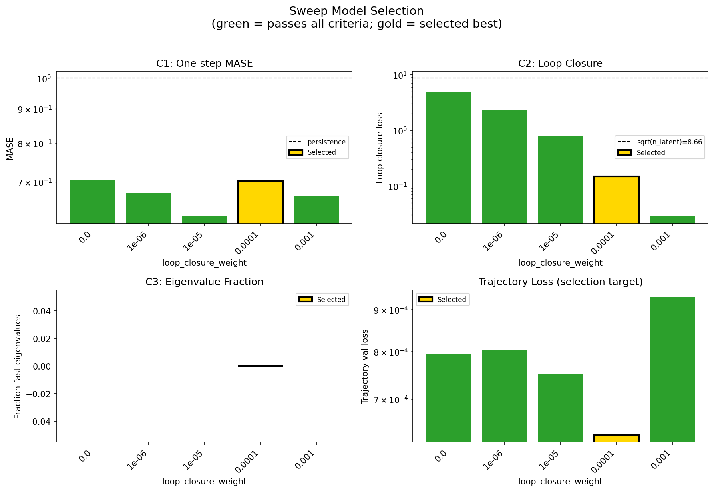

### sweep_pareto

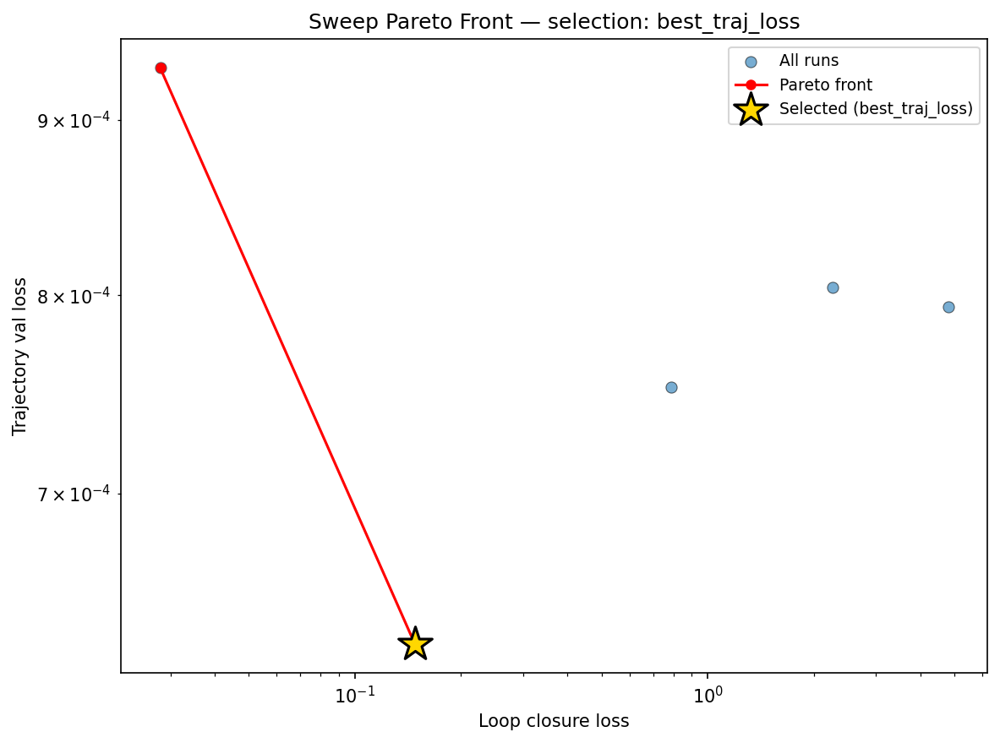

### reconstruction

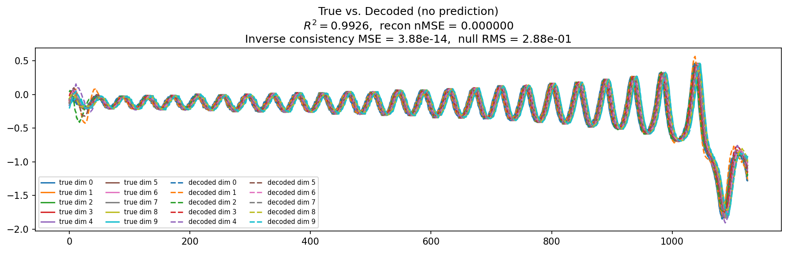

### prediction_windows

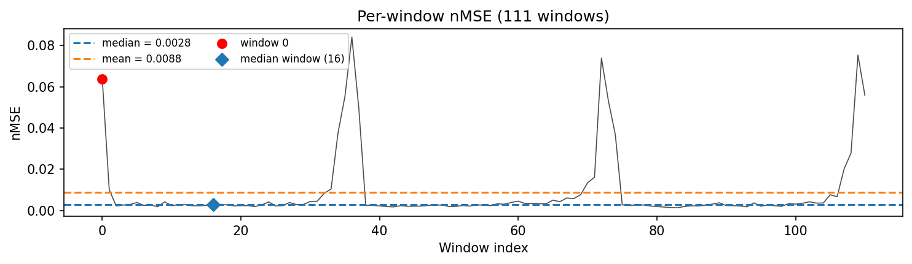

### long_trajectory

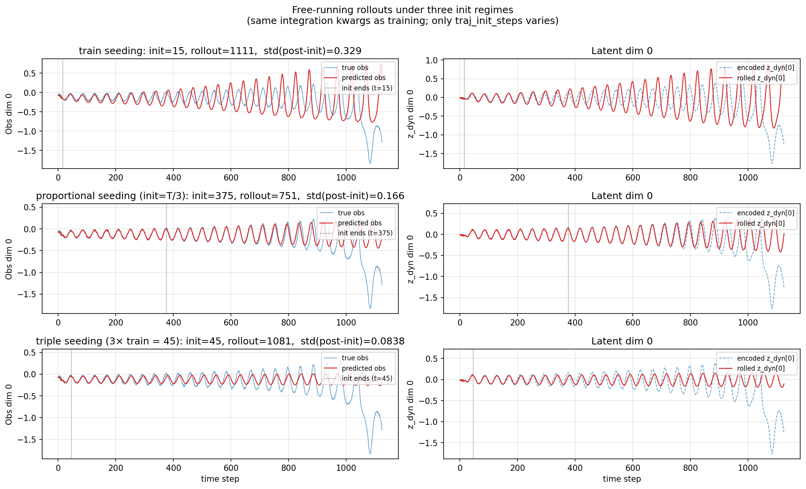

### mase

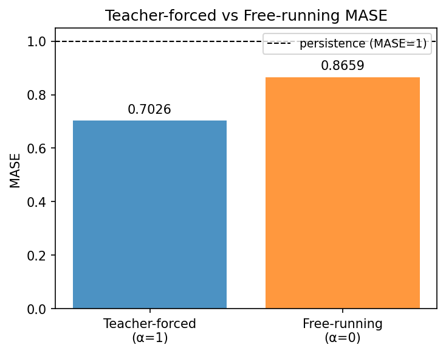

### latent_utilization

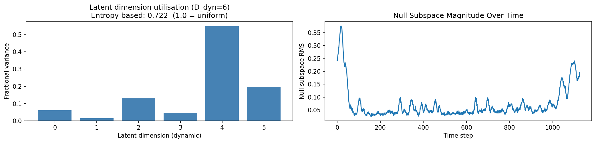

### lyapunov

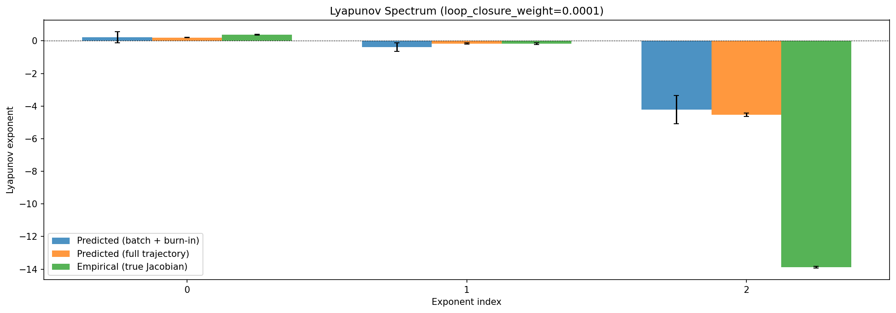

### kaplan_yorke

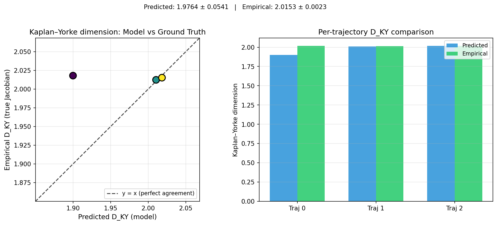

### per_run_lyapunov

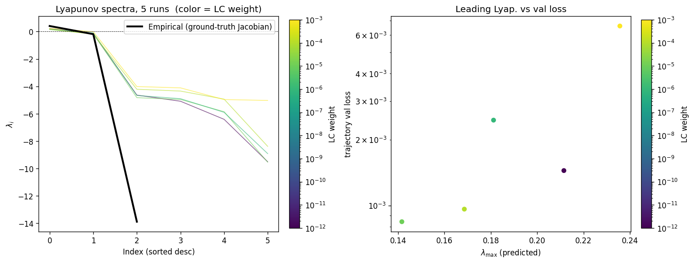

### per_run_lyapunov_vs_true

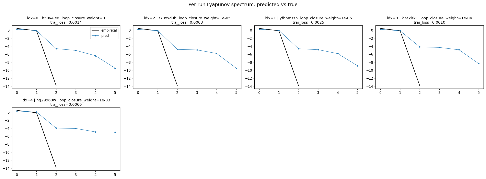

### per_run_lyapunov_relerr

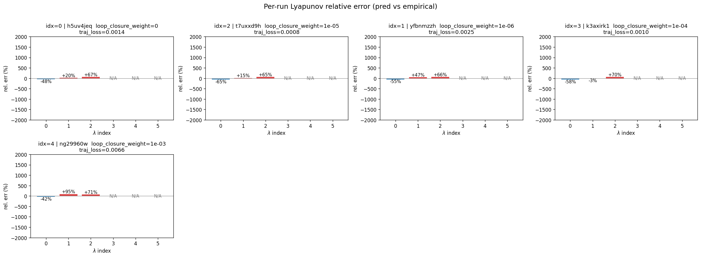

### encoder_decoder_jacobians

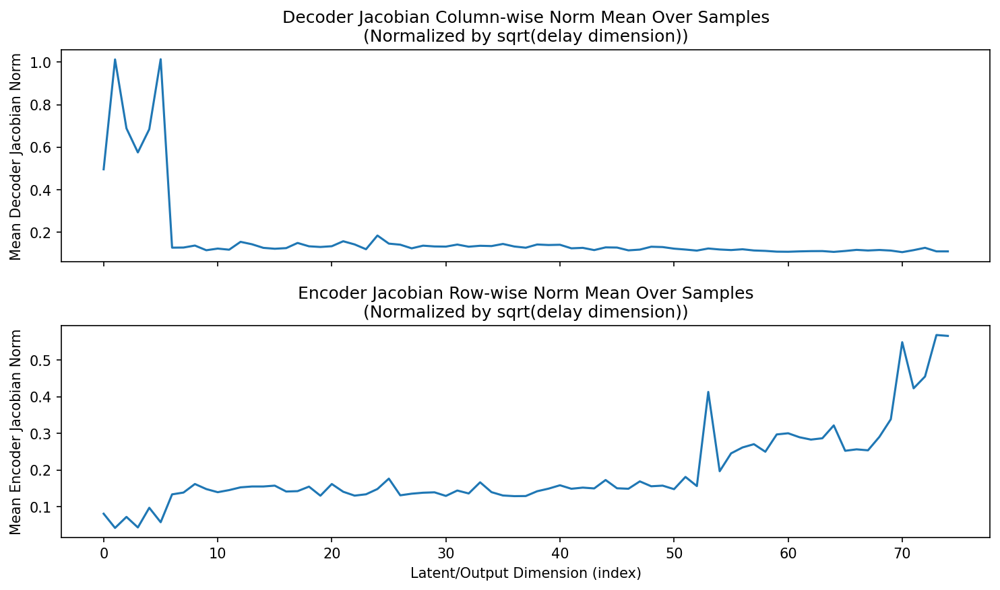

### amplification

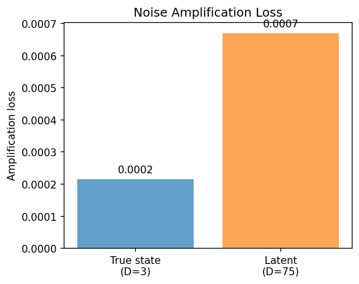

### kaplan_yorke_pca

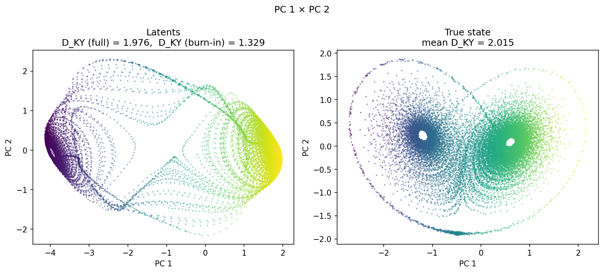

### prediction_detail_latent

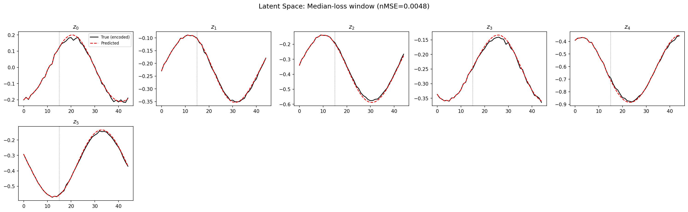

### prediction_detail_obs

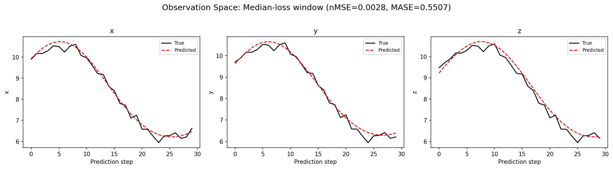

## Discussion

<!--
This section is intentionally left as a placeholder. A human reviewer
or Claude Code agent should fill it in based on the tables and figures
above, explicitly addressing each success criterion and comparing the
outcome to the stated hypothesis. Write the Discussion to
`discussion.md` in this directory and re-run `render_report`.
-->

_(to be written)_

## `run_analytics` stdout

<details><summary>Click to expand — full diagnostic output from <code>run_analytics</code></summary>

```
No run_id provided — selecting best run from group 'lorenz_partial_additive_splitmode_p30_obsnoise001_nd75_init15_autodim__lc_sweep' ...
Found 5 total runs in JacobianODE/Lorenz_INDpartial_NDInitSweep_autodim_D1_NormTrue__JacobianODE (group=lorenz_partial_additive_splitmode_p30_obsnoise001_nd75_init15_autodim__lc_sweep)
All runs (state, loop_closure_weight, tangent_entropy_weight, kl_dyn_weight):
  h5uv4jeq: state=finished, lc=0.0, te=0.0, kl_dyn=0.0
  t7uxxd9h: state=finished, lc=1e-05, te=0.0, kl_dyn=0.0
  yfbnmzzh: state=finished, lc=1e-06, te=0.0, kl_dyn=0.0
  k3axirk1: state=finished, lc=0.0001, te=0.0, kl_dyn=0.0
  ng29960w: state=finished, lc=0.001, te=0.0, kl_dyn=0.0

slurm_timeout_min not found in any run config — falling back to 180 min
  Including h5uv4jeq (lc=0.0): use_all_runs=True (state=finished)
  Including t7uxxd9h (lc=1e-05): use_all_runs=True (state=finished)
  Including yfbnmzzh (lc=1e-06): use_all_runs=True (state=finished)
  Including k3axirk1 (lc=0.0001): use_all_runs=True (state=finished)
  Including ng29960w (lc=0.001): use_all_runs=True (state=finished)
Found 5 effectively-done sweep runs:
  loop_closure_weight=0.0, tangent_entropy_weight=0.0, kl_dyn_weight=0.0 -> run_id=h5uv4jeq
  loop_closure_weight=1e-06, tangent_entropy_weight=0.0, kl_dyn_weight=0.0 -> run_id=yfbnmzzh
  loop_closure_weight=1e-05, tangent_entropy_weight=0.0, kl_dyn_weight=0.0 -> run_id=t7uxxd9h
  loop_closure_weight=0.0001, tangent_entropy_weight=0.0, kl_dyn_weight=0.0 -> run_id=k3axirk1
  loop_closure_weight=0.001, tangent_entropy_weight=0.0, kl_dyn_weight=0.0 -> run_id=ng29960w
n_dims=75, n_latent=75, n_dyn=6, dt=0.0150
  run=h5uv4jeq: DiagnosticMetrics(one_step_mase=0.7051078081130981, loop_closure_loss=4.8020830154418945, fast_eigenvalue_fraction=0.0, trajectory_val_loss=0.0007934003951959312) (from W&B history)
  run=yfbnmzzh: DiagnosticMetrics(one_step_mase=0.6745500564575195, loop_closure_loss=2.265191078186035, fast_eigenvalue_fraction=0.0, trajectory_val_loss=0.0008038212545216084) (from W&B history)
  run=t7uxxd9h: DiagnosticMetrics(one_step_mase=0.6214777231216431, loop_closure_loss=0.7874701619148254, fast_eigenvalue_fraction=0.0, trajectory_val_loss=0.000751942687202245) (from W&B history)
  run=k3axirk1: DiagnosticMetrics(one_step_mase=0.7030951976776123, loop_closure_loss=0.14789293706417084, fast_eigenvalue_fraction=0.0, trajectory_val_loss=0.0006325357244350016) (from W&B history)
  run=ng29960w: DiagnosticMetrics(one_step_mase=0.6657422184944153, loop_closure_loss=0.02807716652750969, fast_eigenvalue_fraction=0.0, trajectory_val_loss=0.0009320250246673822) (from W&B history)

Ranking method:           best_traj_loss
Best run ID:              k3axirk1
Best loop_closure_weight: 0.0001
Best tangent_entropy_weight: 0.0
Best kl_dyn_weight:       0.0
Best traj loss:           0.000633
Criteria applied: ['C1', 'C2', 'C3']
Surviving: 5 / 5
Auto-selected run_id: k3axirk1

======================================================================
PARETO FRONTIER RUNS (2 runs)
======================================================================
  Run ID               LC Loss   Traj Val Loss
  ------------  --------------  --------------
  ng29960w            0.028077        0.000932
  k3axirk1            0.147893        0.000633 <-- selected

======================================================================
RANKING METHOD COMPARISON (over 5 survivors)
======================================================================
  Method                  Run ID               LC Loss   Traj Val Loss
  ----------------------  ------------  --------------  --------------
  best_traj_loss          k3axirk1            0.147893        0.000633 <-- active
  pareto_knee             ng29960w            0.028077        0.000932
  geo_rank                k3axirk1            0.147893        0.000633
  minimax_rank            k3axirk1            0.147893        0.000633
  geo_log_score           k3axirk1            0.147893        0.000633
  minimax_log_score       k3axirk1            0.147893        0.000633
======================================================================

Loading run k3axirk1 from JacobianODE/Lorenz_INDpartial_NDInitSweep_autodim_D1_NormTrue__JacobianODE ...
Train dataset shape: torch.Size([23782, 45, 75])
Validation dataset shape: torch.Size([7567, 45, 75])
Test dataset shape: torch.Size([3243, 45, 75])
Train trajectories dataset shape: torch.Size([22, 1126, 75])
Validation trajectories dataset shape: torch.Size([7, 1126, 75])
Test trajectories dataset shape: torch.Size([3, 1126, 75])
Loading checkpoint epoch=102-step=20600.ckpt...
Computing reconstruction ...
Computing MASE ...
Teacher-forced MASE: 0.7026
Free-running MASE:   0.8659
Computing latent utilization ...
Entropy-based utilization: 0.722
Null subspace mean RMS: 9.294574e-02
Computing Lyapunov exponents ...
  Computing full-trajectory Lyapunov (3 test trajs, T=1126) ...
Predicted Lyapunov exponents (batch+burn-in, 128 windowed trajs):
  λ_1 = +0.2199 ± 0.3389
  λ_2 = -0.3831 ± 0.2736
  λ_3 = -4.2233 ± 0.8614
  λ_4 = -4.5872 ± 0.8044
  λ_5 = -4.9738 ± 0.6340
  λ_6 = -8.9562 ± 3.1557
Predicted Lyapunov exponents (full-length, 3 test trajs):
  λ_1 = +0.2045 ± 0.0235
  λ_2 = -0.1666 ± 0.0414
  λ_3 = -4.5432 ± 0.1078
  λ_4 = -4.6188 ± 0.0589
  λ_5 = -4.9053 ± 0.0798
  λ_6 = -9.4683 ± 0.0128
Empirical Lyapunov exponents (mean ± std):
  λ_1 = +0.3846 ± 0.0251
  λ_2 = -0.1716 ± 0.0444
  λ_3 = -13.8799 ± 0.0398
Mean KY dim (predicted): 1.976 ± 0.054
Mean KY dim (empirical): 2.015 ± 0.002
Mean KY dim (burn-in):   1.329 ± 0.546
Computing prediction windows ...
Windows: 111 — nMSE min=0.0014, median=0.0028, mean=0.0088, max=0.0841
Computing long-trajectory free-running rollouts ...
Computing encoder/decoder Jacobians ...
encoder_jacobian: (128, 75, 75)
decoder_jacobian: (128, 75, 75)
Computing amplification loss ...
Amplification loss — True state: 0.000216
Amplification loss — Latent:     0.000670
```

</details>
