# Sweep Analysis: `lorenz_partial_additive_splitmode_p30_obsnoise001_top3nd_init15_autodim__lc_obsnoisescale_sweep`

**Project**: [Lorenz_INDpartial_NDInitSweep_autodim_D1_NormTrue__JacobianODE](https://wandb.ai/JacobianODE/Lorenz_INDpartial_NDInitSweep_autodim_D1_NormTrue__JacobianODE/groups/lorenz_partial_additive_splitmode_p30_obsnoise001_top3nd_init15_autodim__lc_obsnoisescale_sweep)  
**Launched**: 2026-04-23T04:55:10Z  
**Completed**: 2026-04-23T18:45:21Z  
**Outcome**: `complete_with_failures`  
**Git**: `latent-JacobianODE` @ `162549a`  
**Expected runs**: 108

## Experiment Context

### `lorenz_partial_additive_splitmode_p30_obsnoise001_top3nd_init15_autodim__lc_obsnoisescale_sweep`

**Description**

Lorenz partial additive coupling, obs_noise=0.01, prediction_steps=30,
traj_init_steps=15. Split-mode loss (reconstruction_mode='uniform' for
encoder-decoder round-trip; trajectory rollout uses 'most_recent' at
train and val via trajectory_loss_most_recent=true). 108-run sweep:
3 n_delays {55, 60, 70} × 9 LC weights × 4 obs_noise_scale values.
n_target_dims picked by PCA-auto (threshold=0.99) per n_delays.

**Hypothesis**

Trained models on this benchmark systematically undershoot the
contracting Lyapunov exponent λ₃ ≈ -14 to ~ -5..-7. Adding training-
time observation noise (obs_noise_scale > 0) injects perturbations
that are routed through the encoder Jacobian into the latent space
*anisotropically*, biasing the dynamics MLP toward learning the
correct contracting directions. Unlike kl_dyn_weight (isotropic
latent noise), obs_noise_scale matches the geometry of how real
sensor noise enters the system. Expect:
  - At small obs_noise_scale (~ data noise / 10 to data noise), some
    runs achieve better λ₃ accuracy than the obs_noise_scale=0 baseline.
  - Trade-off with val/trajectory_loss: too much noise hurts
    reconstruction; sweet spot is in the bottom of the log range.
  - Effect should be visible across multiple n_delays, not a one-cell
    artifact.

**Success criteria**

- All 108 runs train without divergence
- obs_noise_scale=0 baseline cells reproduce the prior LC sweep's val/trajectory_loss within noise
- Best per-cell λ₃ accuracy (vs empirical Lorenz) at some obs_noise_scale > 0 with margin over the obs_noise_scale=0 baseline at the same (n_delays, LC) cell
- λ₁ remains positive and within ~30% of empirical at the cell with best λ₃
- Spectrum-L2 error to empirical Lorenz at the best obs_noise_scale > 0 cell strictly improves over the best obs_noise_scale=0 cell

## Results

**Swept axes** (9): `data.train_test_params.delay_embedding_params.n_delays`, `model.encoder.n_input`, `model.n_target_dims`, `model.n_target_dims_pca_auto`, `model.n_target_dims_pca_cum_var`, `model.params.input_dim`, `model.params.output_dim`, `training.lightning.loop_closure_weight`, `training.lightning.obs_noise_scale`

**Chosen run** (by `best_traj_loss`): `04fujcu6` — traj_loss=0.00130, MASE=0.8127, R²=0.9965, LC loss=1.006, epoch=42.0

Swept-axis values at chosen run: `data.train_test_params.delay_embedding_params.n_delays`=55 · `model.encoder.n_input`=55 · `model.n_target_dims`=5 · `model.n_target_dims_pca_auto`=5 · `model.n_target_dims_pca_cum_var`=0.994855 · `model.params.input_dim`=5 · `model.params.output_dim`=25 · `training.lightning.loop_closure_weight`=0 · `training.lightning.obs_noise_scale`=0

### Integrity checks

⚠️ **Matched-run count mismatch**: expected 108 run_idx slots per the sentinel, matched 40 in wandb. The sweep may still be in progress, or some slots failed without producing wandb evidence.

**Runs analyzed**: 40 (expected 108)

### Per-run results

| run_idx | run_id | `data.train_test_params.delay_embedding_params.n_delays` | `model.encoder.n_input` | `model.n_target_dims` | `model.n_target_dims_pca_auto` | `model.n_target_dims_pca_cum_var` | `model.params.input_dim` | `model.params.output_dim` | `training.lightning.loop_closure_weight` | `training.lightning.obs_noise_scale` | best_traj_loss | best_MASE | R² | LC loss | epoch |
|---|---|---|---|---|---|---|---|---|---|---|---|---|---|---|---|
| 0 | `04fujcu6` | 55 | 55 | 5 | 5 | 0.994855 | 5 | 25 | 0 | 0 | 0.00130 | 0.8127 | 0.9965 | 1.006 | 42.0 |
| 88 | `8dau5ocg` | 70 | 70 | 6 | 6 | 0.994529 | 6 | 36 | 0.001 | 0 | 0.00151 | 0.7943 | 0.9959 | 0.026 | 64.0 |
| 92 | `gk0xbvmb` | 70 | 70 | 6 | 6 | 0.994529 | 6 | 36 | 0.01 | 0 | 0.00482 | 1.2830 | 0.9870 | 0.002 | 46.0 |
| 17 | `cqxxqgze` | 55 | 55 | 5 | 5 | 0.994855 | 5 | 25 | 0.001 | 0.003 | 0.00484 | 1.2842 | 0.9869 | 0.038 | 27.0 |
| 53 | `zmvakkhq` | 60 | 60 | 5 | 5 | 0.993171 | 5 | 25 | 0.001 | 0.003 | 0.00616 | 1.4044 | 0.9834 | 0.094 | 17.0 |
| 1 | `g8nklmx9` | 55 | 55 | 5 | 5 | 0.994855 | 5 | 25 | 0 | 0.003 | 0.00672 | 1.6068 | 0.9820 | 8.968 | 17.0 |
| 89 | `daxnfznq` | 70 | 70 | 6 | 6 | 0.994529 | 6 | 36 | 0.001 | 0.003 | 0.01309 | 1.8067 | 0.9650 | 0.066 | 11.0 |
| 21 | `uztqglce` | 55 | 55 | 5 | 5 | 0.994855 | 5 | 25 | 0.01 | 0.003 | 0.01332 | 1.7327 | 0.9644 | 0.014 | 23.0 |
| 20 | `prztxrbh` | 55 | 55 | 5 | 5 | 0.994855 | 5 | 25 | 0.01 | 0 | 0.01929 | 2.4217 | 0.9482 | 0.001 | 12.0 |
| 4 | `znd19rfc` | 55 | 55 | 5 | 5 | 0.994855 | 5 | 25 | 1.0e-06 | 0 | 0.02438 | 2.7914 | 0.9342 | 3.160 | 7.0 |
| 93 | `src1yh14` | 70 | 70 | 6 | 6 | 0.994529 | 6 | 36 | 0.01 | 0.003 | 0.02490 | 2.5204 | 0.9334 | 0.015 | 9.0 |
| 16 | `ydzz0lwa` | 55 | 55 | 5 | 5 | 0.994855 | 5 | 25 | 0.001 | 0 | 0.03890 | 3.6131 | 0.8954 | 0.027 | 5.0 |
| 5 | `ca36j7l5` | 55 | 55 | 5 | 5 | 0.994855 | 5 | 25 | 1.0e-06 | 0.003 | 0.04076 | 3.5985 | 0.8898 | 19.425 | 3.0 |
| 18 | `mpakreoy` | 55 | 55 | 5 | 5 | 0.994855 | 5 | 25 | 0.001 | 0.01 | 0.04170 | 4.3707 | 0.8878 | 0.208 | 10.0 |
| 24 | `5azkj8ol` | 55 | 55 | 5 | 5 | 0.994855 | 5 | 25 | 0.1 | 0 | 0.04560 | 3.7311 | 0.8774 | 0.000 | 23.0 |
| 25 | `3rhv6xl5` | 55 | 55 | 5 | 5 | 0.994855 | 5 | 25 | 0.1 | 0.003 | 0.05908 | 4.6828 | 0.8410 | 0.000 | 3.0 |
| 57 | `x98ld2u3` | 60 | 60 | 5 | 5 | 0.993171 | 5 | 25 | 0.01 | 0.003 | 0.05978 | 5.7577 | 0.8386 | 0.002 | 3.0 |
| 97 | `oesh7buf` | 70 | 70 | 6 | 6 | 0.994529 | 6 | 36 | 0.1 | 0.003 | 0.06929 | 5.9580 | 0.8157 | 0.001 | 3.0 |
| 90 | `buydxn0k` | 70 | 70 | 6 | 6 | 0.994529 | 6 | 36 | 0.001 | 0.01 | 0.07136 | 5.0435 | 0.8101 | 0.205 | 6.0 |
| 94 | `vsah9kr6` | 70 | 70 | 6 | 6 | 0.994529 | 6 | 36 | 0.01 | 0.01 | 0.07608 | 6.9848 | 0.7970 | 0.024 | 6.0 |
| 62 | `7xy7ymd4` | 60 | 60 | 5 | 5 | 0.993171 | 5 | 25 | 0.1 | 0.01 | 0.08222 | 6.9101 | 0.7787 | 0.005 | 8.0 |
| 56 | `yqdka237` | 60 | 60 | 5 | 5 | 0.993171 | 5 | 25 | 0.01 | 0 | 0.08434 | 6.0133 | 0.7740 | 0.005 | 3.0 |
| 2 | `ldkemh7t` | 55 | 55 | 5 | 5 | 0.994855 | 5 | 25 | 0 | 0.01 | 0.08543 | 7.2276 | 0.7705 | 2.171 | 4.0 |
| 99 | `qn2m9l0g` | 70 | 70 | 6 | 6 | 0.994529 | 6 | 36 | 0.1 | 0.03 | 0.08622 | 8.3269 | 0.7706 | 0.001 | 1.0 |
| 95 | `16iuc0c5` | 70 | 70 | 6 | 6 | 0.994529 | 6 | 36 | 0.01 | 0.03 | 0.08727 | 8.3898 | 0.7678 | 0.002 | 1.0 |
| 91 | `uydcva48` | 70 | 70 | 6 | 6 | 0.994529 | 6 | 36 | 0.001 | 0.03 | 0.08743 | 8.4002 | 0.7673 | 0.008 | 1.0 |
| 26 | `s22bk06g` | 55 | 55 | 5 | 5 | 0.994855 | 5 | 25 | 0.1 | 0.01 | 0.08834 | 8.2364 | 0.7620 | 0.000 | 8.0 |
| 59 | `u29op882` | 60 | 60 | 5 | 5 | 0.993171 | 5 | 25 | 0.01 | 0.03 | 0.08958 | 8.5299 | 0.7591 | 0.003 | — |
| 63 | `jj5keln8` | 60 | 60 | 5 | 5 | 0.993171 | 5 | 25 | 0.1 | 0.03 | 0.08989 | 8.2649 | 0.7583 | 0.004 | — |
| 96 | `tfwiqjap` | 70 | 70 | 6 | 6 | 0.994529 | 6 | 36 | 0.1 | 0 | 0.09109 | 7.1459 | 0.7585 | 0.000 | 1.0 |
| 23 | `5657iqyz` | 55 | 55 | 5 | 5 | 0.994855 | 5 | 25 | 0.01 | 0.03 | 0.09234 | 8.6106 | 0.7521 | 0.004 | 1.0 |
| 27 | `4fnyvi6c` | 55 | 55 | 5 | 5 | 0.994855 | 5 | 25 | 0.1 | 0.03 | 0.09245 | 8.6104 | 0.7518 | 0.002 | 1.0 |
| 19 | `0jav9636` | 55 | 55 | 5 | 5 | 0.994855 | 5 | 25 | 0.001 | 0.03 | 0.09260 | 8.6832 | 0.7514 | 0.014 | 1.0 |
| 3 | `ccdfqors` | 55 | 55 | 5 | 5 | 0.994855 | 5 | 25 | 0 | 0.03 | 0.09336 | 8.7273 | 0.7494 | 0.026 | 1.0 |
| 52 | `oqmx6fhr` | 60 | 60 | 5 | 5 | 0.993171 | 5 | 25 | 0.001 | 0 | 0.10111 | 7.2734 | 0.7265 | 0.023 | — |
| 98 | `afynbf71` | 70 | 70 | 6 | 6 | 0.994529 | 6 | 36 | 0.1 | 0.01 | 0.10684 | 9.4356 | 0.7149 | 0.000 | 6.0 |
| 58 | `3nosywtn` | 60 | 60 | 5 | 5 | 0.993171 | 5 | 25 | 0.01 | 0.01 | 0.10716 | 7.6507 | 0.7095 | 0.025 | 6.0 |
| 60 | `0uznc6pm` | 60 | 60 | 5 | 5 | 0.993171 | 5 | 25 | 0.1 | 0 | 0.11424 | 8.5382 | 0.6912 | 0.000 | 1.0 |
| 22 | `wdeh215t` | 55 | 55 | 5 | 5 | 0.994855 | 5 | 25 | 0.01 | 0.01 | 0.14942 | 11.1125 | 0.5994 | 0.004 | — |
| 61 | `6aac4hxr` | 60 | 60 | 5 | 5 | 0.993171 | 5 | 25 | 0.1 | 0.003 | 0.16102 | 11.0455 | 0.5628 | 0.000 | 1.0 |

### Best run per `obs_noise_scale`

| obs_noise_scale | Best LC weight | Best traj loss | MASE at best | R² | LC loss | epoch |
|---|---|---|---|---|---|---|
| 0.0 | 0.0e+00 | 0.00130 | 0.8127 | 0.9965 | 1.006 | 42.0 |
| 0.003 | 1.0e-03 | 0.00484 | 1.2842 | 0.9869 | 0.038 | 27.0 |
| 0.01 | 1.0e-03 | 0.04170 | 4.3707 | 0.8878 | 0.208 | 10.0 |
| 0.03 | 1.0e-01 | 0.08622 | 8.3269 | 0.7706 | 0.001 | 1.0 |

## Success-criteria verdicts (automated)

| Criterion | Verdict | Note |
|---|---|---|
| All 108 runs train without divergence | **Unknown** |  |
| obs_noise_scale=0 baseline cells reproduce the prior LC sweep's val/trajectory_loss within noise | **Unknown** |  |
| Best per-cell λ₃ accuracy (vs empirical Lorenz) at some obs_noise_scale > 0 with margin over the obs_noise_scale=0 baseline at the same (n_delays, LC) cell | **Unknown** |  |
| λ₁ remains positive and within ~30% of empirical at the cell with best λ₃ | **Unknown** |  |
| Spectrum-L2 error to empirical Lorenz at the best obs_noise_scale > 0 cell strictly improves over the best obs_noise_scale=0 cell | **Unknown** |  |

_Automated verdicts use simple numeric-threshold parsing and may mis-classify qualitative criteria. The Discussion section below takes precedence._

## Figures

### sweep_overview

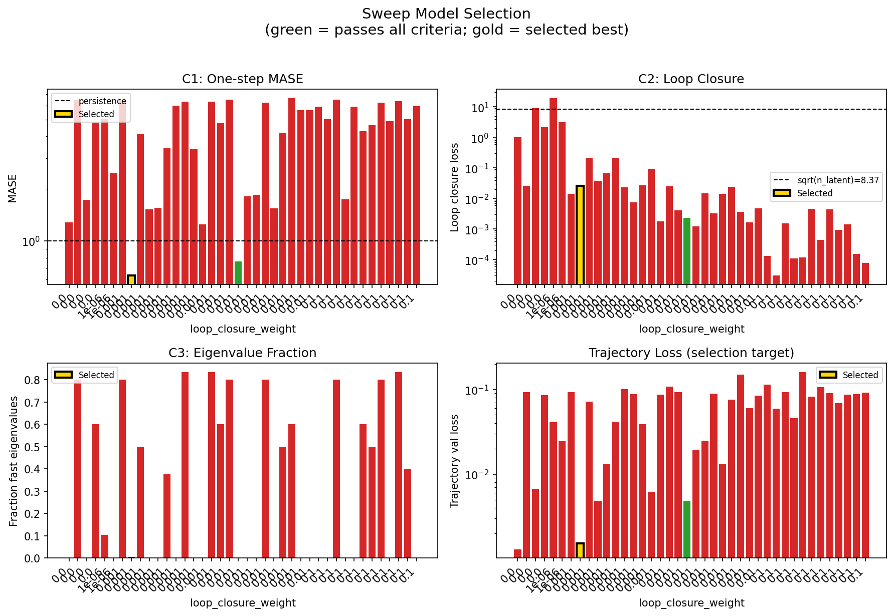

### sweep_pareto

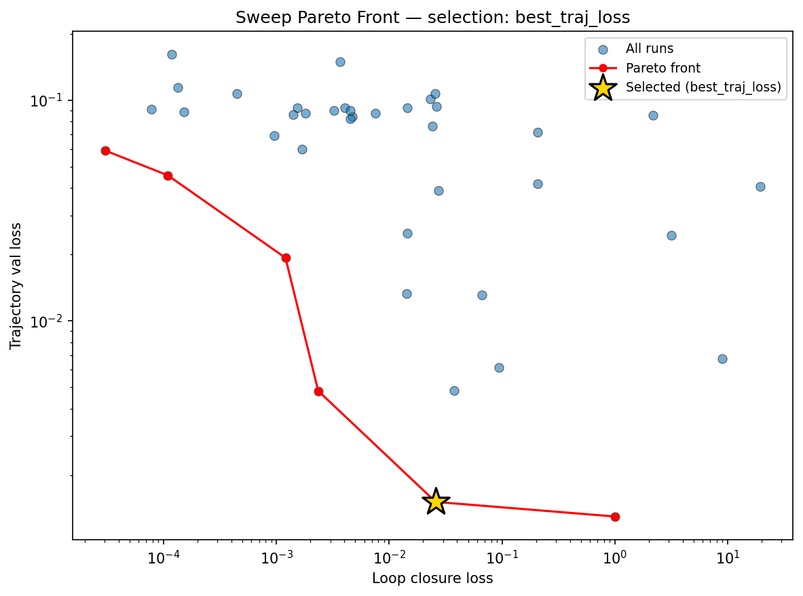

### reconstruction

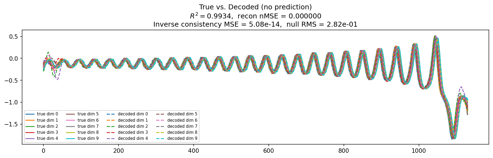

### prediction_windows

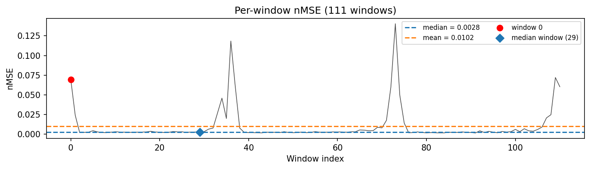

### long_trajectory

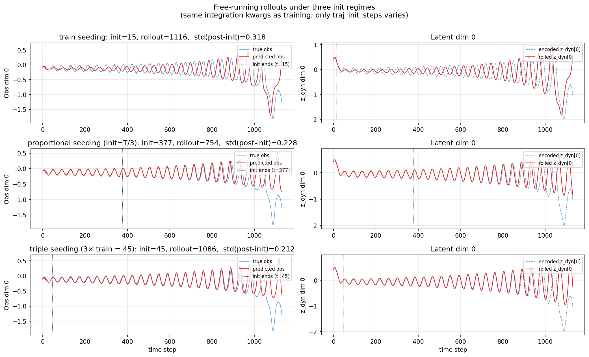

### mase

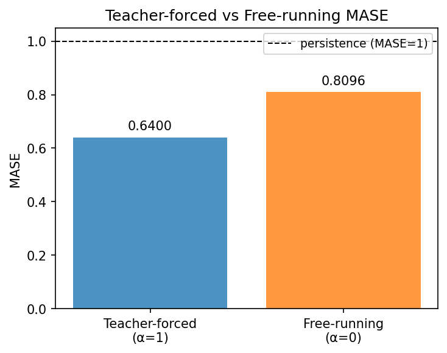

### latent_utilization

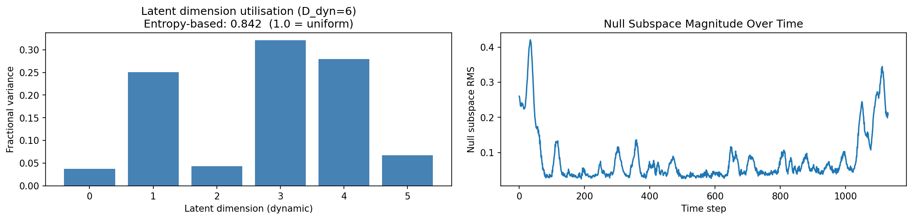

### lyapunov

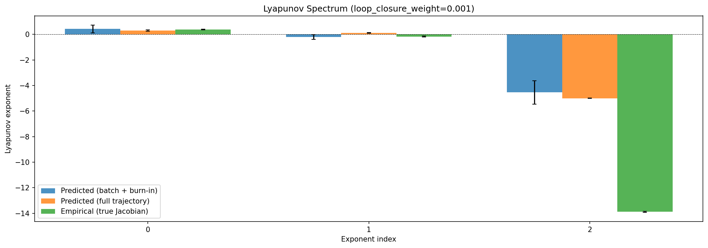

### kaplan_yorke

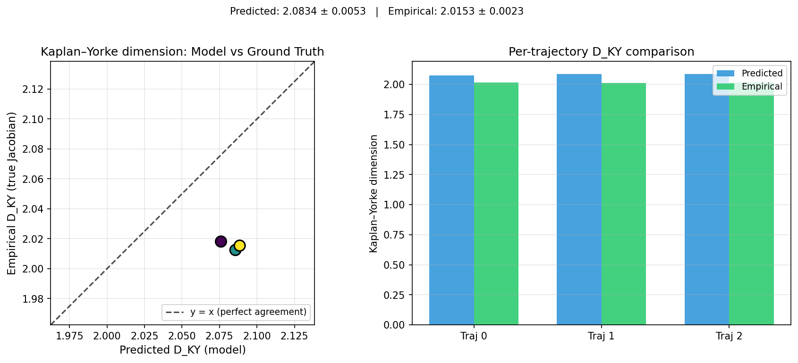

### per_run_lyapunov

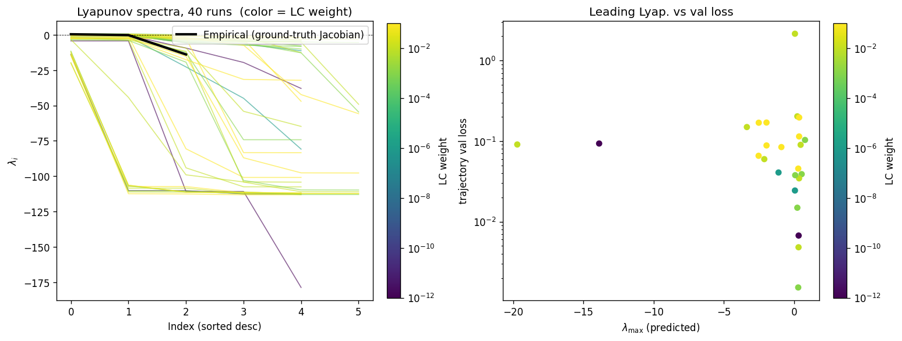

### per_run_lyapunov_vs_true

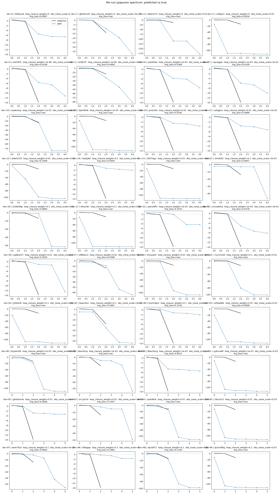

### per_run_lyapunov_relerr

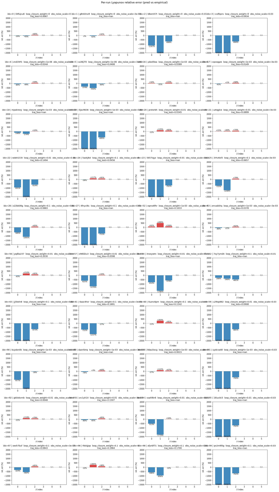

### encoder_decoder_jacobians

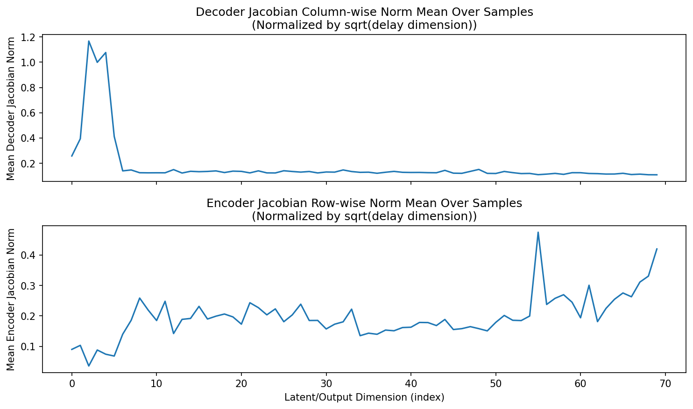

### amplification

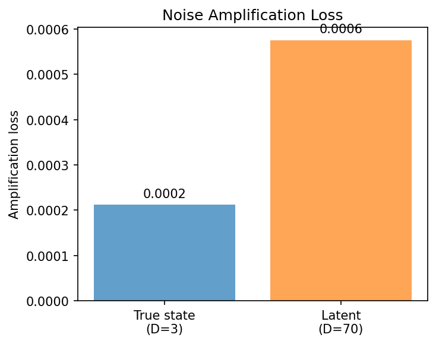

### kaplan_yorke_pca

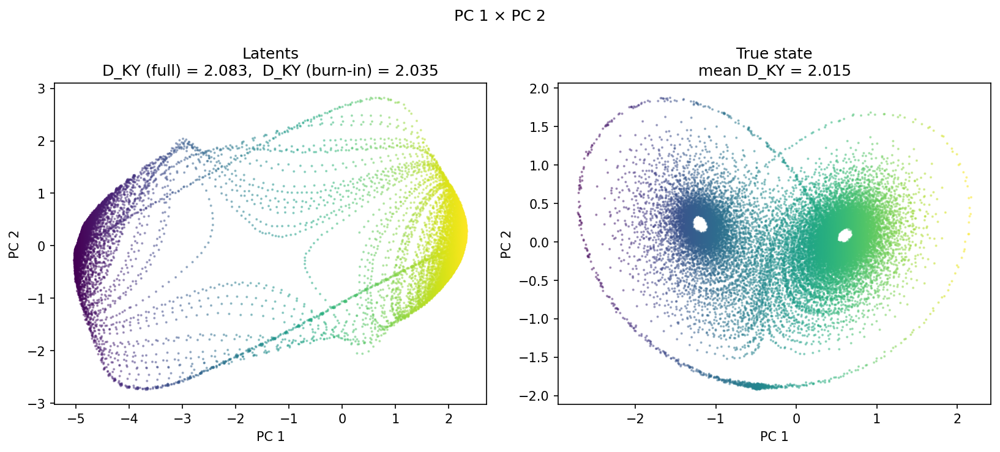

### prediction_detail_latent

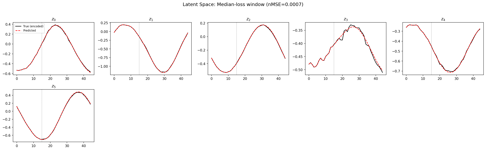

### prediction_detail_obs

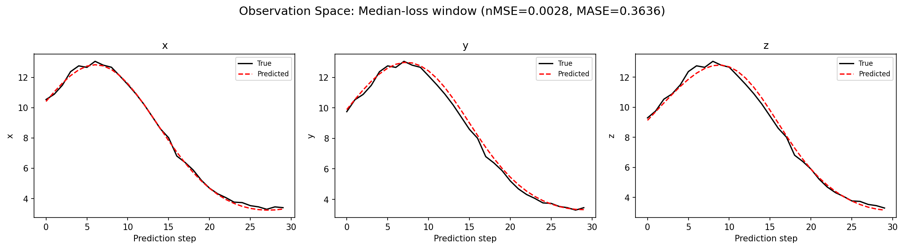

### tangent_spectrum

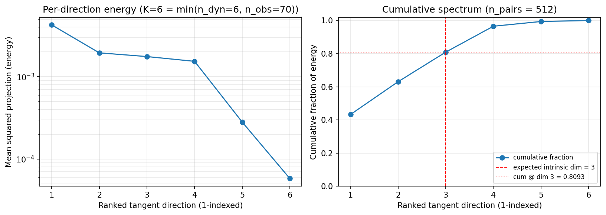

### per_run_tangent_spectrum

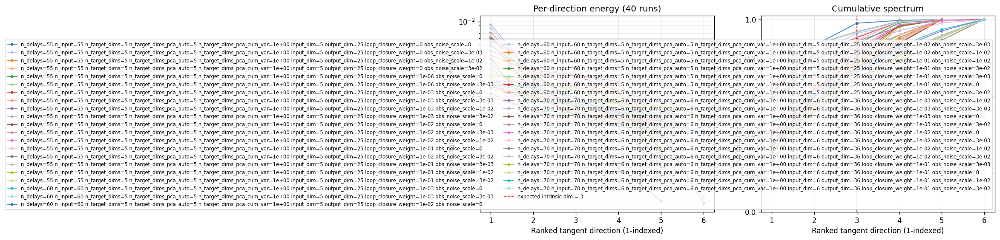

## Discussion

<!--
This section is intentionally left as a placeholder. A human reviewer
or Claude Code agent should fill it in based on the tables and figures
above, explicitly addressing each success criterion and comparing the
outcome to the stated hypothesis. Write the Discussion to
`discussion.md` in this directory and re-run `render_report`.
-->

_(to be written)_

## `run_analytics` stdout

<details><summary>Click to expand — full diagnostic output from <code>run_analytics</code></summary>

```
No run_id provided — selecting best run from group 'lorenz_partial_additive_splitmode_p30_obsnoise001_top3nd_init15_autodim__lc_obsnoisescale_sweep' ...
Found 40 total runs in JacobianODE/Lorenz_INDpartial_NDInitSweep_autodim_D1_NormTrue__JacobianODE (group=lorenz_partial_additive_splitmode_p30_obsnoise001_top3nd_init15_autodim__lc_obsnoisescale_sweep)
All runs (state, loop_closure_weight, tangent_entropy_weight, kl_dyn_weight):
  04fujcu6: state=finished, lc=0.0, te=0.0, kl_dyn=0.0
  g8nklmx9: state=finished, lc=0.0, te=0.0, kl_dyn=0.0
  ldkemh7t: state=finished, lc=0.0, te=0.0, kl_dyn=0.0
  ccdfqors: state=finished, lc=0.0, te=0.0, kl_dyn=0.0
  znd19rfc: state=finished, lc=1e-06, te=0.0, kl_dyn=0.0
  ca36j7l5: state=finished, lc=1e-06, te=0.0, kl_dyn=0.0
  ydzz0lwa: state=finished, lc=0.001, te=0.0, kl_dyn=0.0
  cqxxqgze: state=finished, lc=0.001, te=0.0, kl_dyn=0.0
  mpakreoy: state=finished, lc=0.001, te=0.0, kl_dyn=0.0
  0jav9636: state=finished, lc=0.001, te=0.0, kl_dyn=0.0
  prztxrbh: state=finished, lc=0.01, te=0.0, kl_dyn=0.0
  uztqglce: state=finished, lc=0.01, te=0.0, kl_dyn=0.0
  wdeh215t: state=finished, lc=0.01, te=0.0, kl_dyn=0.0
  5azkj8ol: state=finished, lc=0.1, te=0.0, kl_dyn=0.0
  5657iqyz: state=finished, lc=0.01, te=0.0, kl_dyn=0.0
  3rhv6xl5: state=finished, lc=0.1, te=0.0, kl_dyn=0.0
  s22bk06g: state=finished, lc=0.1, te=0.0, kl_dyn=0.0
  4fnyvi6c: state=finished, lc=0.1, te=0.0, kl_dyn=0.0
  oqmx6fhr: state=finished, lc=0.001, te=0.0, kl_dyn=0.0
  zmvakkhq: state=finished, lc=0.001, te=0.0, kl_dyn=0.0
  yqdka237: state=finished, lc=0.01, te=0.0, kl_dyn=0.0
  x98ld2u3: state=finished, lc=0.01, te=0.0, kl_dyn=0.0
  3nosywtn: state=finished, lc=0.01, te=0.0, kl_dyn=0.0
  7xy7ymd4: state=finished, lc=0.1, te=0.0, kl_dyn=0.0
  jj5keln8: state=finished, lc=0.1, te=0.0, kl_dyn=0.0
  6aac4hxr: state=finished, lc=0.1, te=0.0, kl_dyn=0.0
  0uznc6pm: state=finished, lc=0.1, te=0.0, kl_dyn=0.0
  u29op882: state=finished, lc=0.01, te=0.0, kl_dyn=0.0
  buydxn0k: state=finished, lc=0.001, te=0.0, kl_dyn=0.0
  daxnfznq: state=finished, lc=0.001, te=0.0, kl_dyn=0.0
  8dau5ocg: state=finished, lc=0.001, te=0.0, kl_dyn=0.0
  uydcva48: state=finished, lc=0.001, te=0.0, kl_dyn=0.0
  gk0xbvmb: state=finished, lc=0.01, te=0.0, kl_dyn=0.0
  src1yh14: state=finished, lc=0.01, te=0.0, kl_dyn=0.0
  vsah9kr6: state=finished, lc=0.01, te=0.0, kl_dyn=0.0
  16iuc0c5: state=finished, lc=0.01, te=0.0, kl_dyn=0.0
  oesh7buf: state=finished, lc=0.1, te=0.0, kl_dyn=0.0
  tfwiqjap: state=finished, lc=0.1, te=0.0, kl_dyn=0.0
  afynbf71: state=finished, lc=0.1, te=0.0, kl_dyn=0.0
  qn2m9l0g: state=finished, lc=0.1, te=0.0, kl_dyn=0.0

slurm_timeout_min not found in any run config — falling back to 180 min
  Including 04fujcu6 (lc=0.0): use_all_runs=True (state=finished)
  Including g8nklmx9 (lc=0.0): use_all_runs=True (state=finished)
  Including ldkemh7t (lc=0.0): use_all_runs=True (state=finished)
  Including ccdfqors (lc=0.0): use_all_runs=True (state=finished)
  Including znd19rfc (lc=1e-06): use_all_runs=True (state=finished)
  Including ca36j7l5 (lc=1e-06): use_all_runs=True (state=finished)
  Including ydzz0lwa (lc=0.001): use_all_runs=True (state=finished)
  Including cqxxqgze (lc=0.001): use_all_runs=True (state=finished)
  Including mpakreoy (lc=0.001): use_all_runs=True (state=finished)
  Including 0jav9636 (lc=0.001): use_all_runs=True (state=finished)
  Including prztxrbh (lc=0.01): use_all_runs=True (state=finished)
  Including uztqglce (lc=0.01): use_all_runs=True (state=finished)
  Including wdeh215t (lc=0.01): use_all_runs=True (state=finished)
  Including 5azkj8ol (lc=0.1): use_all_runs=True (state=finished)
  Including 5657iqyz (lc=0.01): use_all_runs=True (state=finished)
  Including 3rhv6xl5 (lc=0.1): use_all_runs=True (state=finished)
  Including s22bk06g (lc=0.1): use_all_runs=True (state=finished)
  Including 4fnyvi6c (lc=0.1): use_all_runs=True (state=finished)
  Including oqmx6fhr (lc=0.001): use_all_runs=True (state=finished)
  Including zmvakkhq (lc=0.001): use_all_runs=True (state=finished)
  Including yqdka237 (lc=0.01): use_all_runs=True (state=finished)
  Including x98ld2u3 (lc=0.01): use_all_runs=True (state=finished)
  Including 3nosywtn (lc=0.01): use_all_runs=True (state=finished)
  Including 7xy7ymd4 (lc=0.1): use_all_runs=True (state=finished)
  Including jj5keln8 (lc=0.1): use_all_runs=True (state=finished)
  Including 6aac4hxr (lc=0.1): use_all_runs=True (state=finished)
  Including 0uznc6pm (lc=0.1): use_all_runs=True (state=finished)
  Including u29op882 (lc=0.01): use_all_runs=True (state=finished)
  Including buydxn0k (lc=0.001): use_all_runs=True (state=finished)
  Including daxnfznq (lc=0.001): use_all_runs=True (state=finished)
  Including 8dau5ocg (lc=0.001): use_all_runs=True (state=finished)
  Including uydcva48 (lc=0.001): use_all_runs=True (state=finished)
  Including gk0xbvmb (lc=0.01): use_all_runs=True (state=finished)
  Including src1yh14 (lc=0.01): use_all_runs=True (state=finished)
  Including vsah9kr6 (lc=0.01): use_all_runs=True (state=finished)
  Including 16iuc0c5 (lc=0.01): use_all_runs=True (state=finished)
  Including oesh7buf (lc=0.1): use_all_runs=True (state=finished)
  Including tfwiqjap (lc=0.1): use_all_runs=True (state=finished)
  Including afynbf71 (lc=0.1): use_all_runs=True (state=finished)
  Including qn2m9l0g (lc=0.1): use_all_runs=True (state=finished)
Found 40 effectively-done sweep runs:
  loop_closure_weight=0.0, tangent_entropy_weight=0.0, kl_dyn_weight=0.0 -> run_id=04fujcu6
  loop_closure_weight=0.0, tangent_entropy_weight=0.0, kl_dyn_weight=0.0 -> run_id=ccdfqors
  loop_closure_weight=0.0, tangent_entropy_weight=0.0, kl_dyn_weight=0.0 -> run_id=g8nklmx9
  loop_closure_weight=0.0, tangent_entropy_weight=0.0, kl_dyn_weight=0.0 -> run_id=ldkemh7t
  loop_closure_weight=1e-06, tangent_entropy_weight=0.0, kl_dyn_weight=0.0 -> run_id=ca36j7l5
  loop_closure_weight=1e-06, tangent_entropy_weight=0.0, kl_dyn_weight=0.0 -> run_id=znd19rfc
  loop_closure_weight=0.001, tangent_entropy_weight=0.0, kl_dyn_weight=0.0 -> run_id=0jav9636
  loop_closure_weight=0.001, tangent_entropy_weight=0.0, kl_dyn_weight=0.0 -> run_id=8dau5ocg
  loop_closure_weight=0.001, tangent_entropy_weight=0.0, kl_dyn_weight=0.0 -> run_id=buydxn0k
  loop_closure_weight=0.001, tangent_entropy_weight=0.0, kl_dyn_weight=0.0 -> run_id=cqxxqgze
  loop_closure_weight=0.001, tangent_entropy_weight=0.0, kl_dyn_weight=0.0 -> run_id=daxnfznq
  loop_closure_weight=0.001, tangent_entropy_weight=0.0, kl_dyn_weight=0.0 -> run_id=mpakreoy
  loop_closure_weight=0.001, tangent_entropy_weight=0.0, kl_dyn_weight=0.0 -> run_id=oqmx6fhr
  loop_closure_weight=0.001, tangent_entropy_weight=0.0, kl_dyn_weight=0.0 -> run_id=uydcva48
  loop_closure_weight=0.001, tangent_entropy_weight=0.0, kl_dyn_weight=0.0 -> run_id=ydzz0lwa
  loop_closure_weight=0.001, tangent_entropy_weight=0.0, kl_dyn_weight=0.0 -> run_id=zmvakkhq
  loop_closure_weight=0.01, tangent_entropy_weight=0.0, kl_dyn_weight=0.0 -> run_id=16iuc0c5
  loop_closure_weight=0.01, tangent_entropy_weight=0.0, kl_dyn_weight=0.0 -> run_id=3nosywtn
  loop_closure_weight=0.01, tangent_entropy_weight=0.0, kl_dyn_weight=0.0 -> run_id=5657iqyz
  loop_closure_weight=0.01, tangent_entropy_weight=0.0, kl_dyn_weight=0.0 -> run_id=gk0xbvmb
  loop_closure_weight=0.01, tangent_entropy_weight=0.0, kl_dyn_weight=0.0 -> run_id=prztxrbh
  loop_closure_weight=0.01, tangent_entropy_weight=0.0, kl_dyn_weight=0.0 -> run_id=src1yh14
  loop_closure_weight=0.01, tangent_entropy_weight=0.0, kl_dyn_weight=0.0 -> run_id=u29op882
  loop_closure_weight=0.01, tangent_entropy_weight=0.0, kl_dyn_weight=0.0 -> run_id=uztqglce
  loop_closure_weight=0.01, tangent_entropy_weight=0.0, kl_dyn_weight=0.0 -> run_id=vsah9kr6
  loop_closure_weight=0.01, tangent_entropy_weight=0.0, kl_dyn_weight=0.0 -> run_id=wdeh215t
  loop_closure_weight=0.01, tangent_entropy_weight=0.0, kl_dyn_weight=0.0 -> run_id=x98ld2u3
  loop_closure_weight=0.01, tangent_entropy_weight=0.0, kl_dyn_weight=0.0 -> run_id=yqdka237
  loop_closure_weight=0.1, tangent_entropy_weight=0.0, kl_dyn_weight=0.0 -> run_id=0uznc6pm
  loop_closure_weight=0.1, tangent_entropy_weight=0.0, kl_dyn_weight=0.0 -> run_id=3rhv6xl5
  loop_closure_weight=0.1, tangent_entropy_weight=0.0, kl_dyn_weight=0.0 -> run_id=4fnyvi6c
  loop_closure_weight=0.1, tangent_entropy_weight=0.0, kl_dyn_weight=0.0 -> run_id=5azkj8ol
  loop_closure_weight=0.1, tangent_entropy_weight=0.0, kl_dyn_weight=0.0 -> run_id=6aac4hxr
  loop_closure_weight=0.1, tangent_entropy_weight=0.0, kl_dyn_weight=0.0 -> run_id=7xy7ymd4
  loop_closure_weight=0.1, tangent_entropy_weight=0.0, kl_dyn_weight=0.0 -> run_id=afynbf71
  loop_closure_weight=0.1, tangent_entropy_weight=0.0, kl_dyn_weight=0.0 -> run_id=jj5keln8
  loop_closure_weight=0.1, tangent_entropy_weight=0.0, kl_dyn_weight=0.0 -> run_id=oesh7buf
  loop_closure_weight=0.1, tangent_entropy_weight=0.0, kl_dyn_weight=0.0 -> run_id=qn2m9l0g
  loop_closure_weight=0.1, tangent_entropy_weight=0.0, kl_dyn_weight=0.0 -> run_id=s22bk06g
  loop_closure_weight=0.1, tangent_entropy_weight=0.0, kl_dyn_weight=0.0 -> run_id=tfwiqjap
n_dims=55, n_latent=55, n_dyn=5, dt=0.0150
  run=04fujcu6: DiagnosticMetrics(one_step_mase=1.2813475131988525, loop_closure_loss=1.0058362483978271, fast_eigenvalue_fraction=0.0, trajectory_val_loss=0.0012993683340027928) (from W&B history)
  run=ccdfqors: DiagnosticMetrics(one_step_mase=6.524741172790527, loop_closure_loss=0.026195133104920387, fast_eigenvalue_fraction=0.800000011920929, trajectory_val_loss=0.09335947781801224) (from W&B history)
  run=g8nklmx9: DiagnosticMetrics(one_step_mase=1.7265584468841553, loop_closure_loss=8.968255996704102, fast_eigenvalue_fraction=0.0, trajectory_val_loss=0.006720829755067825) (from W&B history)
  run=ldkemh7t: DiagnosticMetrics(one_step_mase=4.796350955963135, loop_closure_loss=2.171123504638672, fast_eigenvalue_fraction=0.6000000238418579, trajectory_val_loss=0.08542829751968384) (from W&B history)
  run=ca36j7l5: DiagnosticMetrics(one_step_mase=5.038619041442871, loop_closure_loss=19.425119400024414, fast_eigenvalue_fraction=0.10400000214576721, trajectory_val_loss=0.04076318442821503) (from W&B history)
  run=znd19rfc: DiagnosticMetrics(one_step_mase=2.4764528274536133, loop_closure_loss=3.1595659255981445, fast_eigenvalue_fraction=0.0, trajectory_val_loss=0.02437620796263218) (from W&B history)
  run=0jav9636: DiagnosticMetrics(one_step_mase=6.5261077880859375, loop_closure_loss=0.014374255202710629, fast_eigenvalue_fraction=0.800000011920929, trajectory_val_loss=0.09260010719299316) (from W&B history)
  run=8dau5ocg: DiagnosticMetrics(one_step_mase=0.6324470043182373, loop_closure_loss=0.025805748999118805, fast_eigenvalue_fraction=0.0, trajectory_val_loss=0.001513456692919135) (from W&B history)
  run=buydxn0k: DiagnosticMetrics(one_step_mase=4.142026424407959, loop_closure_loss=0.20525671541690826, fast_eigenvalue_fraction=0.5, trajectory_val_loss=0.07136120647192001) (from W&B history)
  run=cqxxqgze: DiagnosticMetrics(one_step_mase=1.5156773328781128, loop_closure_loss=0.03779539465904236, fast_eigenvalue_fraction=0.0, trajectory_val_loss=0.004843705799430609) (from W&B history)
  run=daxnfznq: DiagnosticMetrics(one_step_mase=1.5530072450637817, loop_closure_loss=0.06639079004526138, fast_eigenvalue_fraction=0.0, trajectory_val_loss=0.013094364665448666) (from W&B history)
  run=mpakreoy: DiagnosticMetrics(one_step_mase=3.4289040565490723, loop_closure_loss=0.20790870487689972, fast_eigenvalue_fraction=0.37700000405311584, trajectory_val_loss=0.041700925678014755) (from W&B history)
  run=oqmx6fhr: DiagnosticMetrics(one_step_mase=6.007996082305908, loop_closure_loss=0.023141250014305115, fast_eigenvalue_fraction=0.0, trajectory_val_loss=0.10111255943775177) (from W&B history)
  run=uydcva48: DiagnosticMetrics(one_step_mase=6.351836204528809, loop_closure_loss=0.007582964841276407, fast_eigenvalue_fraction=0.8333333134651184, trajectory_val_loss=0.08743000775575638) (from W&B history)
  run=ydzz0lwa: DiagnosticMetrics(one_step_mase=3.3681774139404297, loop_closure_loss=0.027452360838651657, fast_eigenvalue_fraction=0.0, trajectory_val_loss=0.03890116512775421) (from W&B history)
  run=zmvakkhq: DiagnosticMetrics(one_step_mase=1.2416776418685913, loop_closure_loss=0.09433568269014359, fast_eigenvalue_fraction=0.0, trajectory_val_loss=0.006155155133455992) (from W&B history)
  run=16iuc0c5: DiagnosticMetrics(one_step_mase=6.349637985229492, loop_closure_loss=0.0018095438135787845, fast_eigenvalue_fraction=0.8333333134651184, trajectory_val_loss=0.08726885169744492) (from W&B history)
  run=3nosywtn: DiagnosticMetrics(one_step_mase=4.77309513092041, loop_closure_loss=0.02543240785598755, fast_eigenvalue_fraction=0.6000000238418579, trajectory_val_loss=0.10715625435113907) (from W&B history)
  run=5657iqyz: DiagnosticMetrics(one_step_mase=6.5276265144348145, loop_closure_loss=0.0040204827673733234, fast_eigenvalue_fraction=0.800000011920929, trajectory_val_loss=0.09234458208084106) (from W&B history)
  run=gk0xbvmb: DiagnosticMetrics(one_step_mase=0.7632865905761719, loop_closure_loss=0.002346318680793047, fast_eigenvalue_fraction=0.0, trajectory_val_loss=0.004816981963813305) (from W&B history)
  run=prztxrbh: DiagnosticMetrics(one_step_mase=1.8012614250183105, loop_closure_loss=0.0012029423378407955, fast_eigenvalue_fraction=0.0, trajectory_val_loss=0.019294850528240204) (from W&B history)
  run=src1yh14: DiagnosticMetrics(one_step_mase=1.837437629699707, loop_closure_loss=0.014524141326546669, fast_eigenvalue_fraction=0.0, trajectory_val_loss=0.02490363083779812) (from W&B history)
  run=u29op882: DiagnosticMetrics(one_step_mase=6.259762763977051, loop_closure_loss=0.0032221931032836437, fast_eigenvalue_fraction=0.800000011920929, trajectory_val_loss=0.08958449959754944) (from W&B history)
  run=uztqglce: DiagnosticMetrics(one_step_mase=1.5404243469238281, loop_closure_loss=0.014335793443024158, fast_eigenvalue_fraction=0.0, trajectory_val_loss=0.013315550051629543) (from W&B history)
  run=vsah9kr6: DiagnosticMetrics(one_step_mase=4.205093860626221, loop_closure_loss=0.024000532925128937, fast_eigenvalue_fraction=0.5, trajectory_val_loss=0.0760834664106369) (from W&B history)
  run=wdeh215t: DiagnosticMetrics(one_step_mase=6.654203414916992, loop_closure_loss=0.0036581598687916994, fast_eigenvalue_fraction=0.6000000238418579, trajectory_val_loss=0.14941734075546265) (from W&B history)
  run=x98ld2u3: DiagnosticMetrics(one_step_mase=5.661190509796143, loop_closure_loss=0.00167664245236665, fast_eigenvalue_fraction=0.0, trajectory_val_loss=0.05977966636419296) (from W&B history)
  run=yqdka237: DiagnosticMetrics(one_step_mase=5.653428077697754, loop_closure_loss=0.00471970159560442, fast_eigenvalue_fraction=0.0, trajectory_val_loss=0.08434343338012695) (from W&B history)
  run=0uznc6pm: DiagnosticMetrics(one_step_mase=5.948256492614746, loop_closure_loss=0.00013407885853666812, fast_eigenvalue_fraction=0.0, trajectory_val_loss=0.11423677206039429) (from W&B history)
  run=3rhv6xl5: DiagnosticMetrics(one_step_mase=5.01781702041626, loop_closure_loss=3.0349821827257983e-05, fast_eigenvalue_fraction=0.0, trajectory_val_loss=0.059079259634017944) (from W&B history)
  run=4fnyvi6c: DiagnosticMetrics(one_step_mase=6.53120231628418, loop_closure_loss=0.0015290731098502874, fast_eigenvalue_fraction=0.800000011920929, trajectory_val_loss=0.09245116263628006) (from W&B history)
  run=5azkj8ol: DiagnosticMetrics(one_step_mase=1.7377065420150757, loop_closure_loss=0.00010907267278525978, fast_eigenvalue_fraction=0.0, trajectory_val_loss=0.045601435005664825) (from W&B history)
  run=6aac4hxr: DiagnosticMetrics(one_step_mase=5.93113374710083, loop_closure_loss=0.00011760569759644568, fast_eigenvalue_fraction=0.0, trajectory_val_loss=0.16102071106433868) (from W&B history)
  run=7xy7ymd4: DiagnosticMetrics(one_step_mase=4.296416759490967, loop_closure_loss=0.004535811021924019, fast_eigenvalue_fraction=0.6000000238418579, trajectory_val_loss=0.08222471177577972) (from W&B history)
  run=afynbf71: DiagnosticMetrics(one_step_mase=4.629033088684082, loop_closure_loss=0.00044502646778710186, fast_eigenvalue_fraction=0.5, trajectory_val_loss=0.10684191435575485) (from W&B history)
  run=jj5keln8: DiagnosticMetrics(one_step_mase=6.262394905090332, loop_closure_loss=0.00449797697365284, fast_eigenvalue_fraction=0.800000011920929, trajectory_val_loss=0.0898948386311531) (from W&B history)
  run=oesh7buf: DiagnosticMetrics(one_step_mase=4.900812149047852, loop_closure_loss=0.0009557268931530416, fast_eigenvalue_fraction=0.0, trajectory_val_loss=0.06929350644350052) (from W&B history)
  run=qn2m9l0g: DiagnosticMetrics(one_step_mase=6.3650336265563965, loop_closure_loss=0.0014130589552223682, fast_eigenvalue_fraction=0.8333333134651184, trajectory_val_loss=0.08621865510940552) (from W&B history)
  run=s22bk06g: DiagnosticMetrics(one_step_mase=5.032097339630127, loop_closure_loss=0.00015142455231398344, fast_eigenvalue_fraction=0.4000000059604645, trajectory_val_loss=0.08834338188171387) (from W&B history)
  run=tfwiqjap: DiagnosticMetrics(one_step_mase=5.966620445251465, loop_closure_loss=7.827110675862059e-05, fast_eigenvalue_fraction=0.0, trajectory_val_loss=0.09109309315681458) (from W&B history)

Ranking method:           best_traj_loss
Best run ID:              8dau5ocg
Best loop_closure_weight: 0.001
Best tangent_entropy_weight: 0.0
Best kl_dyn_weight:       0.0
Best traj loss:           0.001513
Criteria applied: ['C1', 'C2', 'C3']
Surviving: 2 / 40
Auto-selected run_id: 8dau5ocg

======================================================================
PARETO FRONTIER RUNS (6 runs)
======================================================================
  Run ID               LC Loss   Traj Val Loss
  ------------  --------------  --------------
  3rhv6xl5            0.000030        0.059079
  5azkj8ol            0.000109        0.045601
  prztxrbh            0.001203        0.019295
  gk0xbvmb            0.002346        0.004817
  8dau5ocg            0.025806        0.001513 <-- selected
  04fujcu6            1.005836        0.001299

======================================================================
RANKING METHOD COMPARISON (over 2 survivors)
======================================================================
  Method                  Run ID               LC Loss   Traj Val Loss
  ----------------------  ------------  --------------  --------------
  best_traj_loss          8dau5ocg            0.025806        0.001513 <-- active
  pareto_knee             gk0xbvmb            0.002346        0.004817
  geo_rank                8dau5ocg            0.025806        0.001513
  minimax_rank            8dau5ocg            0.025806        0.001513
  geo_log_score           8dau5ocg            0.025806        0.001513
  minimax_log_score       gk0xbvmb            0.002346        0.004817
======================================================================

Loading run 8dau5ocg from JacobianODE/Lorenz_INDpartial_NDInitSweep_autodim_D1_NormTrue__JacobianODE ...
Train dataset shape: torch.Size([23892, 45, 70])
Validation dataset shape: torch.Size([7602, 45, 70])
Test dataset shape: torch.Size([3258, 45, 70])
Train trajectories dataset shape: torch.Size([22, 1131, 70])
Validation trajectories dataset shape: torch.Size([7, 1131, 70])
Test trajectories dataset shape: torch.Size([3, 1131, 70])
Loading checkpoint epoch=64-step=13000.ckpt...
Computing reconstruction ...
Computing MASE ...
Teacher-forced MASE: 0.6400
Free-running MASE:   0.8096
Computing latent utilization ...
Entropy-based utilization: 0.842
Null subspace mean RMS: 1.063904e-01
Computing Lyapunov exponents ...
  Computing full-trajectory Lyapunov (3 test trajs, T=1131) ...
Predicted Lyapunov exponents (batch+burn-in, 128 windowed trajs):
  λ_1 = +0.4217 ± 0.2984
  λ_2 = -0.1954 ± 0.1860
  λ_3 = -4.5460 ± 0.9149
  λ_4 = -4.8500 ± 0.8118
  λ_5 = -5.0241 ± 0.7127
  λ_6 = -5.3933 ± 0.6297
Predicted Lyapunov exponents (full-length, 3 test trajs):
  λ_1 = +0.3030 ± 0.0584
  λ_2 = +0.1141 ± 0.0304
  λ_3 = -5.0029 ± 0.0134
  λ_4 = -5.1655 ± 0.0147
  λ_5 = -5.2238 ± 0.0150
  λ_6 = -5.7430 ± 0.0165
Empirical Lyapunov exponents (mean ± std):
  λ_1 = +0.3846 ± 0.0251
  λ_2 = -0.1716 ± 0.0444
  λ_3 = -13.8799 ± 0.0398
Mean KY dim (predicted): 2.083 ± 0.005
Mean KY dim (empirical): 2.015 ± 0.002
Mean KY dim (burn-in):   2.035 ± 0.136
Computing prediction windows ...
Windows: 111 — nMSE min=0.0016, median=0.0028, mean=0.0102, max=0.1404
Computing long-trajectory free-running rollouts ...
Computing encoder/decoder Jacobians ...
encoder_jacobian: (128, 70, 70)
decoder_jacobian: (128, 70, 70)
Computing amplification loss ...
Amplification loss — True state: 0.000212
Amplification loss — Latent:     0.000576
Computing tangent space spectrum ...
```

</details>
