# Sweep Analysis: `lorenz_partial_additive_splitmode_p30_obsnoise005_nd75_init15_autodim__lc_sweep`

**Project**: [Lorenz_INDpartial_NDInitSweep_autodim_D1_NormTrue__JacobianODE](https://wandb.ai/JacobianODE/Lorenz_INDpartial_NDInitSweep_autodim_D1_NormTrue__JacobianODE/groups/lorenz_partial_additive_splitmode_p30_obsnoise005_nd75_init15_autodim__lc_sweep)  
**Launched**: 2026-04-22T00:20:37Z  
**Completed**: 2026-04-22T04:20:42Z  
**Outcome**: `complete_clean`  
**Git**: `latent-JacobianODE` @ `28c8380`  
**Expected runs**: 5

## Experiment Context

### `lorenz_partial_additive_splitmode_p30_obsnoise005_nd75_init15_autodim__lc_sweep`

**Description**

Lorenz partial additive coupling, obs_noise=0.05, n_delays=75,
prediction_steps=30, traj_init_steps=15. Split reconstruction mode:
uniform for encoder-decoder round-trip, most_recent for rollout
trajectory (matches val). 5-run LC sweep over
{0, 1e-6, 1e-5, 1e-4, 1e-3}. n_target_dims picked by PCA-auto
(threshold=0.99). final_perm_identity=true.

**Hypothesis**

At obs_noise=0.05 the encoder has a harder denoising job. LC should
help more at this noise level than at 0.01 because it's a
self-consistency regularizer that compensates for noise-driven
encoder instability. Expect best LC shifted toward larger values
relative to the obsnoise001 companion sweep.

**Success criteria**

- All 5 runs train without divergence
- Best val traj_loss at LC > 0 shows a larger fractional improvement over LC=0 than the obsnoise001 companion
- lc_loss_at_best_tl bounded
- λ_max of best-LC run is positive and closer to empirical Lorenz than LC=0's value

## Results

**Swept axes** (2): `model.n_target_dims_pca_cum_var`, `training.lightning.loop_closure_weight`

**Chosen run** (by `best_traj_loss`): `nw8qqxad` — traj_loss=0.00520, MASE=0.7584, R²=0.9861, LC loss=116.087, epoch=156.0

Swept-axis values at chosen run: `model.n_target_dims_pca_cum_var`=0.990036 · `training.lightning.loop_closure_weight`=0

**Runs analyzed**: 5 (expected 5)

### Per-run results

| run_idx | run_id | `model.n_target_dims_pca_cum_var` | `training.lightning.loop_closure_weight` | best_traj_loss | best_MASE | R² | LC loss | epoch |
|---|---|---|---|---|---|---|---|---|
| 0 | `nw8qqxad` | 0.990036 | 0 | 0.00520 | 0.7584 | 0.9861 | 116.087 | 156.0 |
| 1 | `h2ytbitb` | 0.990036 | 1.0e-06 | 0.00607 | 0.7906 | 0.9838 | 30.546 | 111.0 |
| 3 | `726vvxyq` | 0.990036 | 1.0e-04 | 0.00630 | 0.8121 | 0.9831 | 0.765 | 82.0 |
| 4 | `c86yvz74` | 0.990036 | 0.001 | 0.00637 | 0.8050 | 0.9830 | 0.160 | 95.0 |
| 2 | `1kizyazt` | 0.990036 | 1.0e-05 | 0.00647 | 0.8050 | 0.9827 | 5.454 | 76.0 |

## Success-criteria verdicts (automated)

| Criterion | Verdict | Note |
|---|---|---|
| All 5 runs train without divergence | **Unknown** |  |
| Best val traj_loss at LC > 0 shows a larger fractional improvement over LC=0 than the obsnoise001 companion | **Unknown** |  |
| lc_loss_at_best_tl bounded | **Unknown** |  |
| λ_max of best-LC run is positive and closer to empirical Lorenz than LC=0's value | **Unknown** |  |

_Automated verdicts use simple numeric-threshold parsing and may mis-classify qualitative criteria. The Discussion section below takes precedence._

## Figures

### sweep_overview

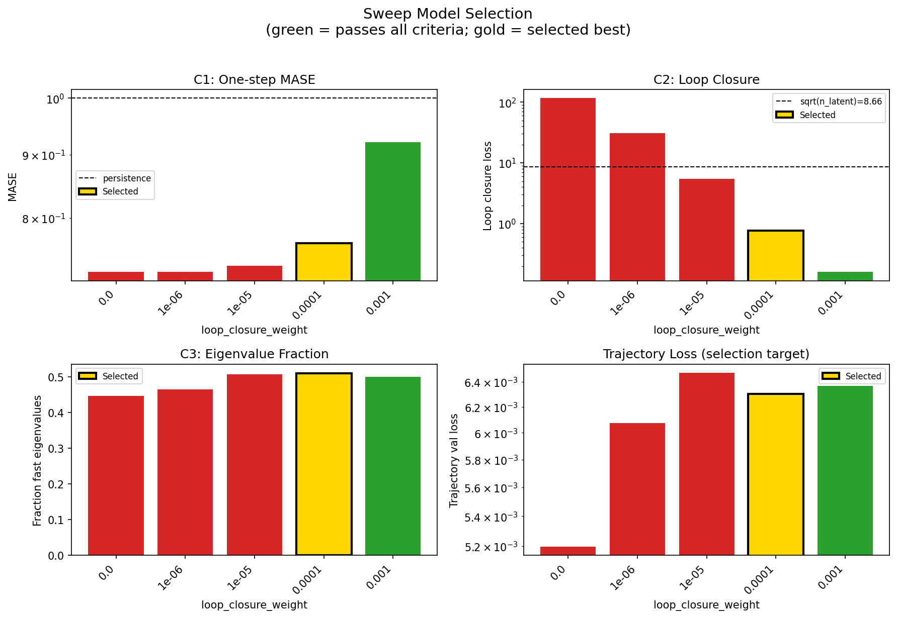

### sweep_pareto

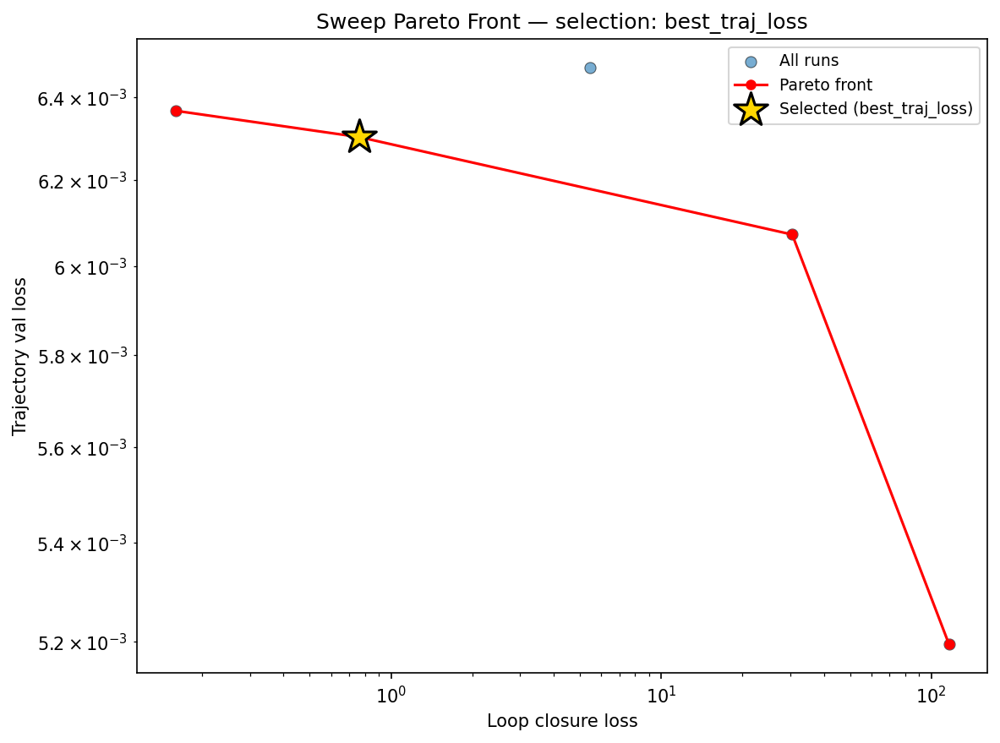

### reconstruction

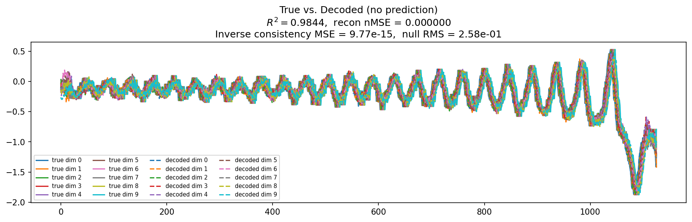

### prediction_windows

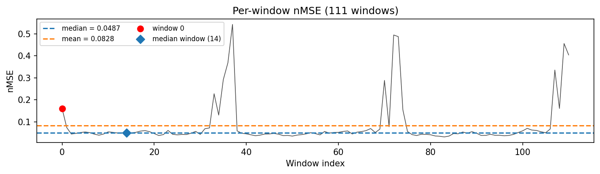

### long_trajectory

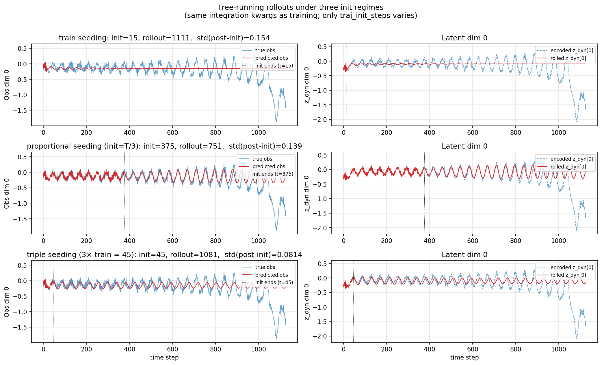

### mase

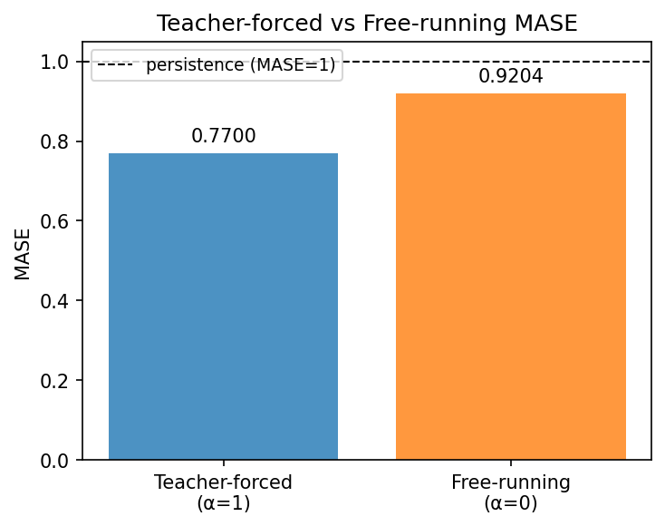

### latent_utilization

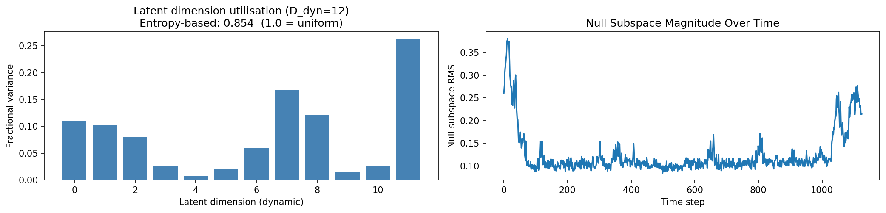

### lyapunov

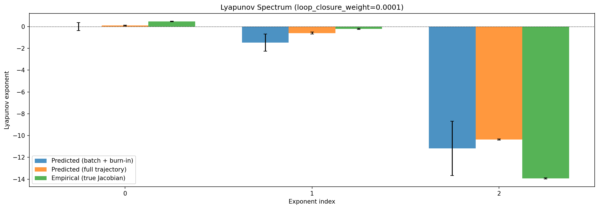

### kaplan_yorke

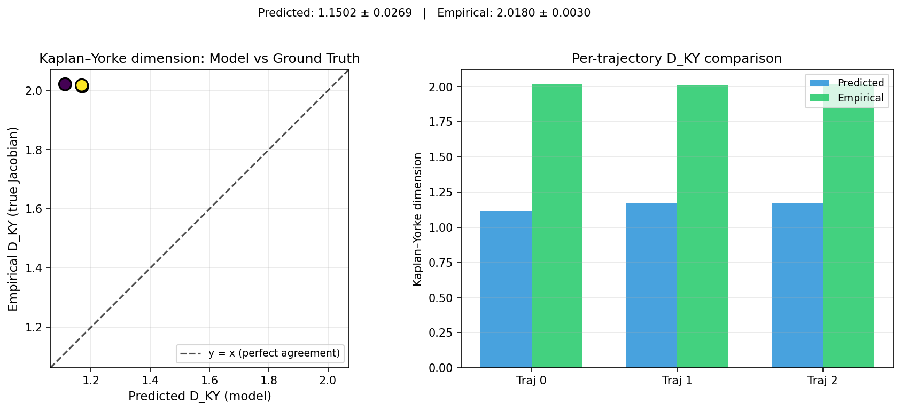

### per_run_lyapunov

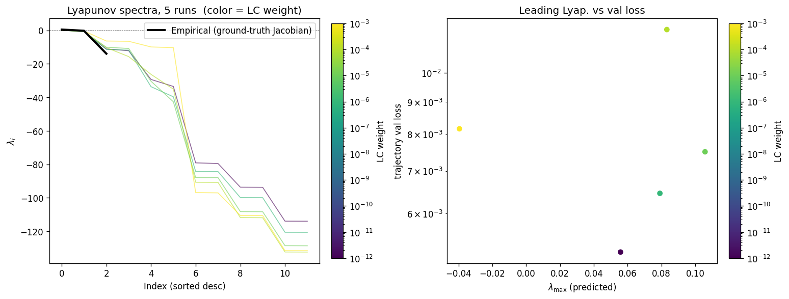

### per_run_lyapunov_vs_true

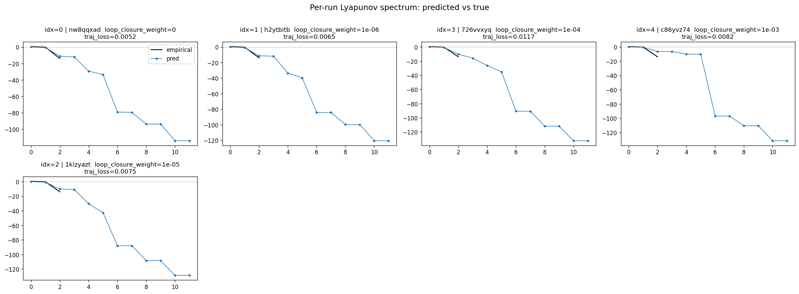

### per_run_lyapunov_relerr

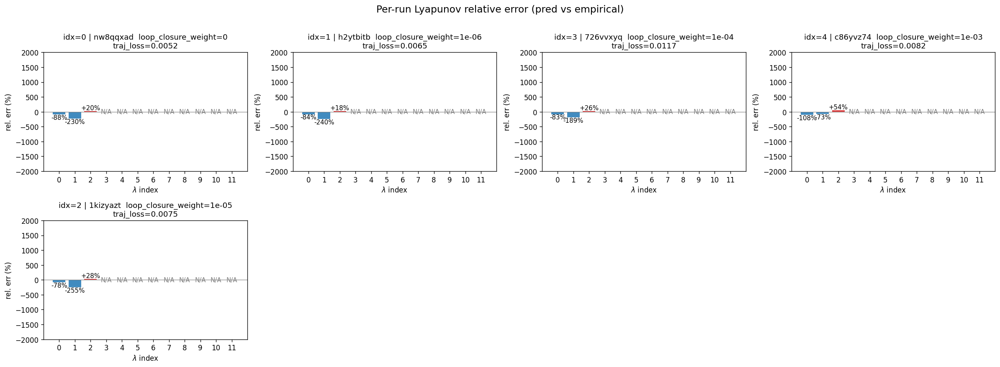

### encoder_decoder_jacobians

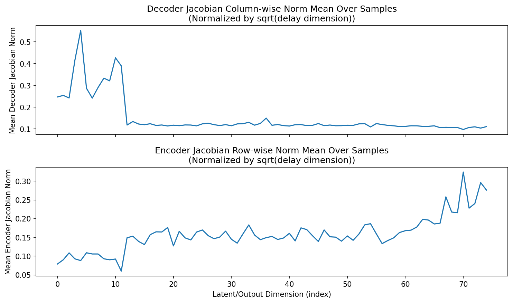

### amplification

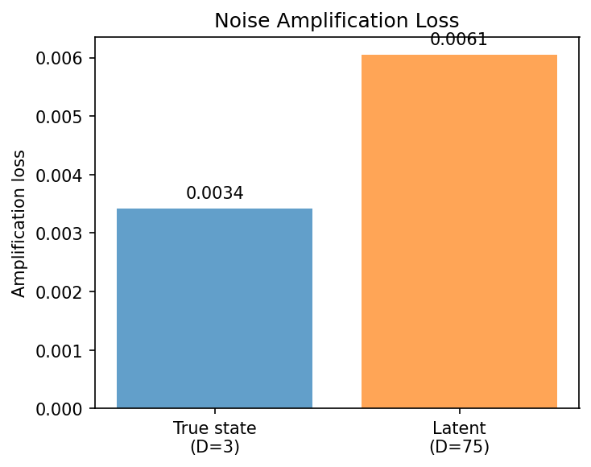

### kaplan_yorke_pca

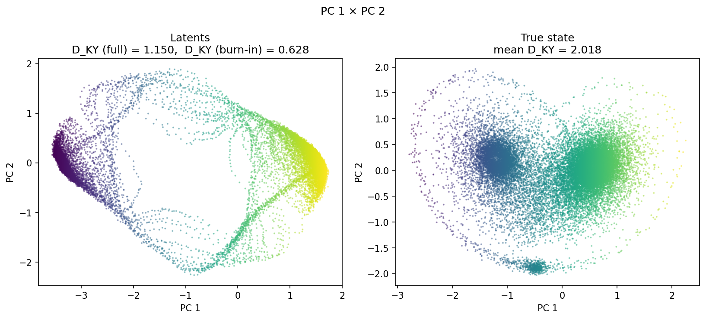

### prediction_detail_latent

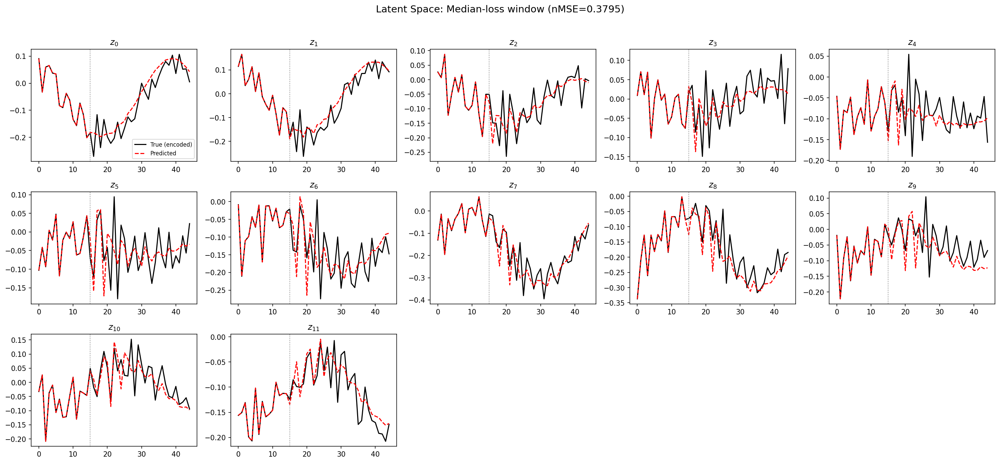

### prediction_detail_obs

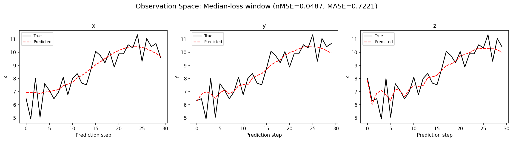

## Discussion

<!--
This section is intentionally left as a placeholder. A human reviewer
or Claude Code agent should fill it in based on the tables and figures
above, explicitly addressing each success criterion and comparing the
outcome to the stated hypothesis. Write the Discussion to
`discussion.md` in this directory and re-run `render_report`.
-->

_(to be written)_

## `run_analytics` stdout

<details><summary>Click to expand — full diagnostic output from <code>run_analytics</code></summary>

```
No run_id provided — selecting best run from group 'lorenz_partial_additive_splitmode_p30_obsnoise005_nd75_init15_autodim__lc_sweep' ...
Found 5 total runs in JacobianODE/Lorenz_INDpartial_NDInitSweep_autodim_D1_NormTrue__JacobianODE (group=lorenz_partial_additive_splitmode_p30_obsnoise005_nd75_init15_autodim__lc_sweep)
All runs (state, loop_closure_weight, tangent_entropy_weight, kl_dyn_weight):
  nw8qqxad: state=finished, lc=0.0, te=0.0, kl_dyn=0.0
  h2ytbitb: state=finished, lc=1e-06, te=0.0, kl_dyn=0.0
  726vvxyq: state=finished, lc=0.0001, te=0.0, kl_dyn=0.0
  c86yvz74: state=finished, lc=0.001, te=0.0, kl_dyn=0.0
  1kizyazt: state=finished, lc=1e-05, te=0.0, kl_dyn=0.0

slurm_timeout_min not found in any run config — falling back to 180 min
  Including nw8qqxad (lc=0.0): use_all_runs=True (state=finished)
  Including h2ytbitb (lc=1e-06): use_all_runs=True (state=finished)
  Including 726vvxyq (lc=0.0001): use_all_runs=True (state=finished)
  Including c86yvz74 (lc=0.001): use_all_runs=True (state=finished)
  Including 1kizyazt (lc=1e-05): use_all_runs=True (state=finished)
Found 5 effectively-done sweep runs:
  loop_closure_weight=0.0, tangent_entropy_weight=0.0, kl_dyn_weight=0.0 -> run_id=nw8qqxad
  loop_closure_weight=1e-06, tangent_entropy_weight=0.0, kl_dyn_weight=0.0 -> run_id=h2ytbitb
  loop_closure_weight=1e-05, tangent_entropy_weight=0.0, kl_dyn_weight=0.0 -> run_id=1kizyazt
  loop_closure_weight=0.0001, tangent_entropy_weight=0.0, kl_dyn_weight=0.0 -> run_id=726vvxyq
  loop_closure_weight=0.001, tangent_entropy_weight=0.0, kl_dyn_weight=0.0 -> run_id=c86yvz74
n_dims=75, n_latent=75, n_dyn=12, dt=0.0150
  run=nw8qqxad: DiagnosticMetrics(one_step_mase=0.7234463095664978, loop_closure_loss=116.08728790283203, fast_eigenvalue_fraction=0.44708332419395447, trajectory_val_loss=0.005195337347686291) (from cache, n_batches=100)
  run=h2ytbitb: DiagnosticMetrics(one_step_mase=0.7240275144577026, loop_closure_loss=30.545995712280273, fast_eigenvalue_fraction=0.4647916555404663, trajectory_val_loss=0.006073218770325184) (from cache, n_batches=100)
  run=1kizyazt: DiagnosticMetrics(one_step_mase=0.7321481108665466, loop_closure_loss=5.454060077667236, fast_eigenvalue_fraction=0.5077083110809326, trajectory_val_loss=0.006471812725067139) (from cache, n_batches=100)
  run=726vvxyq: DiagnosticMetrics(one_step_mase=0.7634537220001221, loop_closure_loss=0.764617919921875, fast_eigenvalue_fraction=0.5099999904632568, trajectory_val_loss=0.006303063128143549) (from cache, n_batches=100)
  run=c86yvz74: DiagnosticMetrics(one_step_mase=0.9208614230155945, loop_closure_loss=0.15986305475234985, fast_eigenvalue_fraction=0.5, trajectory_val_loss=0.006366642192006111) (from cache, n_batches=100)

Ranking method:           best_traj_loss
Best run ID:              726vvxyq
Best loop_closure_weight: 0.0001
Best tangent_entropy_weight: 0.0
Best kl_dyn_weight:       0.0
Best traj loss:           0.006303
Criteria applied: ['C2']
Surviving: 2 / 5
Auto-selected run_id: 726vvxyq

======================================================================
PARETO FRONTIER RUNS (4 runs)
======================================================================
  Run ID               LC Loss   Traj Val Loss
  ------------  --------------  --------------
  c86yvz74            0.159863        0.006367
  726vvxyq            0.764618        0.006303 <-- selected
  h2ytbitb           30.545996        0.006073
  nw8qqxad          116.087288        0.005195

======================================================================
RANKING METHOD COMPARISON (over 2 survivors)
======================================================================
  Method                  Run ID               LC Loss   Traj Val Loss
  ----------------------  ------------  --------------  --------------
  best_traj_loss          726vvxyq            0.764618        0.006303 <-- active
  pareto_knee             c86yvz74            0.159863        0.006367
  geo_rank                726vvxyq            0.764618        0.006303
  minimax_rank            726vvxyq            0.764618        0.006303
  geo_log_score           726vvxyq            0.764618        0.006303
  minimax_log_score       c86yvz74            0.159863        0.006367
======================================================================

Loading run 726vvxyq from JacobianODE/Lorenz_INDpartial_NDInitSweep_autodim_D1_NormTrue__JacobianODE ...
Train dataset shape: torch.Size([23782, 45, 75])
Validation dataset shape: torch.Size([7567, 45, 75])
Test dataset shape: torch.Size([3243, 45, 75])
Train trajectories dataset shape: torch.Size([22, 1126, 75])
Validation trajectories dataset shape: torch.Size([7, 1126, 75])
Test trajectories dataset shape: torch.Size([3, 1126, 75])
Loading checkpoint epoch=82-step=16600.ckpt...
Computing reconstruction ...
Computing MASE ...
Teacher-forced MASE: 0.7700
Free-running MASE:   0.9204
Computing latent utilization ...
Entropy-based utilization: 0.854
Null subspace mean RMS: 1.339957e-01
Computing Lyapunov exponents ...
  Computing full-trajectory Lyapunov (3 test trajs, T=1126) ...
Predicted Lyapunov exponents (batch+burn-in, 128 windowed trajs):
  λ_1 = -0.0040 ± 0.3663
  λ_2 = -1.4736 ± 0.7973
  λ_3 = -11.1667 ± 2.4879
  λ_4 = -16.5415 ± 2.7371
  λ_5 = -23.5414 ± 5.5899
  λ_6 = -31.2520 ± 17.0694
  λ_7 = -90.6263 ± 2.6387
  λ_8 = -91.0955 ± 2.7232
  λ_9 = -111.8267 ± 2.7667
  λ_10 = -112.1337 ± 2.7575
  λ_11 = -132.5880 ± 2.2013
  λ_12 = -132.6481 ± 2.1930
Predicted Lyapunov exponents (full-length, 3 test trajs):
  λ_1 = +0.0901 ± 0.0275
  λ_2 = -0.5935 ± 0.0801
  λ_3 = -10.3563 ± 0.0588
  λ_4 = -16.8752 ± 0.0049
  λ_5 = -24.0989 ± 0.2977
  λ_6 = -30.1871 ± 0.1865
  λ_7 = -91.7900 ± 0.0688
  λ_8 = -91.8382 ± 0.0520
  λ_9 = -112.7821 ± 0.0748
  λ_10 = -112.8863 ± 0.0775
  λ_11 = -133.2016 ± 0.0691
  λ_12 = -133.2456 ± 0.0707
Empirical Lyapunov exponents (mean ± std):
  λ_1 = +0.4677 ± 0.0259
  λ_2 = -0.2173 ± 0.0549
  λ_3 = -13.9174 ± 0.0513
Mean KY dim (predicted): 1.150 ± 0.027
Mean KY dim (empirical): 2.018 ± 0.003
Mean KY dim (burn-in):   0.628 ± 0.544
Computing prediction windows ...
Windows: 111 — nMSE min=0.0308, median=0.0487, mean=0.0828, max=0.5435
Computing long-trajectory free-running rollouts ...
Computing encoder/decoder Jacobians ...
encoder_jacobian: (128, 75, 75)
decoder_jacobian: (128, 75, 75)
Computing amplification loss ...
Amplification loss — True state: 0.003419
Amplification loss — Latent:     0.006054
```

</details>
