# Sweep Analysis: `lorenz_partial_additive_splitmode_p30_obsnoise005_top3nd_init15_autodim__lc_obsnoisescale_sweep`

**Project**: [Lorenz_INDpartial_NDInitSweep_autodim_D1_NormTrue__JacobianODE](https://wandb.ai/JacobianODE/Lorenz_INDpartial_NDInitSweep_autodim_D1_NormTrue__JacobianODE/groups/lorenz_partial_additive_splitmode_p30_obsnoise005_top3nd_init15_autodim__lc_obsnoisescale_sweep)  
**Launched**: 2026-04-23T05:00:12Z  
**Completed**: 2026-04-24T23:50:19Z  
**Outcome**: `complete_with_failures`  
**Git**: `latent-JacobianODE` @ `162549a`  
**Expected runs**: 108

## Experiment Context

### `lorenz_partial_additive_splitmode_p30_obsnoise005_top3nd_init15_autodim__lc_obsnoisescale_sweep`

**Description**

Lorenz partial additive coupling, obs_noise=0.05, prediction_steps=30,
traj_init_steps=15. Split-mode loss (reconstruction_mode='uniform' for
encoder-decoder round-trip; trajectory rollout uses 'most_recent' at
train and val via trajectory_loss_most_recent=true). 108-run sweep:
3 n_delays {45, 80, 85} × 9 LC weights × 4 obs_noise_scale values.
n_target_dims picked by PCA-auto (threshold=0.99) per n_delays.

**Hypothesis**

Same noise-injection hypothesis as the obsnoise001 companion: at the
higher data noise (obs_noise=0.05), the data-noise budget is already
larger, so the effective sweet spot for obs_noise_scale should sit
relatively lower as a fraction of data noise (since the latent is
already seeing substantial perturbations from the data side). At
obs_noise_scale=0.03 the total noise variance is ~0.058 — comparable
to the data noise itself; at 0.003 it's ~0.0501 — barely incremental.
Expect:
  - Improvement vs obs_noise_scale=0 baseline on λ₃ accuracy is
    smaller in absolute magnitude than at noise=0.01 (the high-data-
    noise runs already had larger best-spectrum errors), but should
    still be detectable in the same direction.
  - Best obs_noise_scale at noise=0.05 ≤ best obs_noise_scale at
    noise=0.01 (relative to the noise level).
  - Trade-off with val/trajectory_loss is steeper here.

**Success criteria**

- All 108 runs train without divergence
- obs_noise_scale=0 baseline cells reproduce the prior LC sweep's val/trajectory_loss within noise
- Best per-cell λ₃ accuracy (vs empirical Lorenz) at some obs_noise_scale > 0 with margin over the obs_noise_scale=0 baseline at the same (n_delays, LC) cell
- λ₁ remains positive and within ~30% of empirical at the cell with best λ₃
- Spectrum-L2 error to empirical Lorenz at the best obs_noise_scale > 0 cell strictly improves over the best obs_noise_scale=0 cell

## Results

**Swept axes** (9): `data.train_test_params.delay_embedding_params.n_delays`, `model.encoder.n_input`, `model.n_target_dims`, `model.n_target_dims_pca_auto`, `model.n_target_dims_pca_cum_var`, `model.params.input_dim`, `model.params.output_dim`, `training.lightning.loop_closure_weight`, `training.lightning.obs_noise_scale`

**Chosen run** (by `best_traj_loss`): `fm7rmgzm` — traj_loss=0.00575, MASE=0.7909, R²=0.9849, LC loss=0.094, epoch=112.0

Swept-axis values at chosen run: `data.train_test_params.delay_embedding_params.n_delays`=85 · `model.encoder.n_input`=85 · `model.n_target_dims`=14 · `model.n_target_dims_pca_auto`=14 · `model.n_target_dims_pca_cum_var`=0.990074 · `model.params.input_dim`=14 · `model.params.output_dim`=196 · `training.lightning.loop_closure_weight`=0.001 · `training.lightning.obs_noise_scale`=0

### Integrity checks

⚠️ **Matched-run count mismatch**: expected 108 run_idx slots per the sentinel, matched 13 in wandb. The sweep may still be in progress, or some slots failed without producing wandb evidence.

**Runs analyzed**: 13 (expected 108)

### Per-run results

| run_idx | run_id | `data.train_test_params.delay_embedding_params.n_delays` | `model.encoder.n_input` | `model.n_target_dims` | `model.n_target_dims_pca_auto` | `model.n_target_dims_pca_cum_var` | `model.params.input_dim` | `model.params.output_dim` | `training.lightning.loop_closure_weight` | `training.lightning.obs_noise_scale` | best_traj_loss | best_MASE | R² | LC loss | epoch |
|---|---|---|---|---|---|---|---|---|---|---|---|---|---|---|---|
| 88 | `fm7rmgzm` | 85 | 85 | 14 | 14 | 0.990074 | 14 | 196 | 0.001 | 0 | 0.00575 | 0.7909 | 0.9849 | 0.094 | 112.0 |
| 92 | `gi6e8ylf` | 85 | 85 | 14 | 14 | 0.990074 | 14 | 196 | 0.01 | 0 | 0.00960 | 0.9063 | 0.9747 | 0.002 | 115.0 |
| 17 | `3pu1rcje` | 45 | 45 | 7 | 7 | 0.990085 | 7 | 49 | 0.001 | 0.003 | 0.01267 | 1.0443 | 0.9648 | 0.260 | 27.0 |
| 61 | `xzk42i22` | 80 | 80 | 13 | 13 | 0.990058 | 13 | 169 | 0.1 | 0.003 | 0.01336 | 0.9668 | 0.9639 | 0.008 | 88.0 |
| 89 | `3erdr6ob` | 85 | 85 | 14 | 14 | 0.990074 | 14 | 196 | 0.001 | 0.003 | 0.01596 | 1.0520 | 0.9578 | 0.145 | 28.0 |
| 93 | `nxx7jf6y` | 85 | 85 | 14 | 14 | 0.990074 | 14 | 196 | 0.01 | 0.003 | 0.02259 | 1.1974 | 0.9402 | 0.008 | 48.0 |
| 90 | `x4drkb9y` | 85 | 85 | 14 | 14 | 0.990074 | 14 | 196 | 0.001 | 0.01 | 0.04105 | 1.5919 | 0.8920 | 0.172 | 6.0 |
| 18 | `lyak3kp6` | 45 | 45 | 7 | 7 | 0.990085 | 7 | 49 | 0.001 | 0.01 | 0.04704 | 1.4698 | 0.8703 | 0.173 | 6.0 |
| 62 | `l5frb6o5` | 80 | 80 | 13 | 13 | 0.990058 | 13 | 169 | 0.1 | 0.01 | 0.04741 | 1.5178 | 0.8747 | 0.006 | 11.0 |
| 94 | `rfpfqyw0` | 85 | 85 | 14 | 14 | 0.990074 | 14 | 196 | 0.01 | 0.01 | 0.05319 | 1.8789 | 0.8597 | 0.036 | 6.0 |
| 91 | `4s70fwi7` | 85 | 85 | 14 | 14 | 0.990074 | 14 | 196 | 0.001 | 0.03 | 0.09863 | 3.2232 | 0.7410 | 8.160 | 8.0 |
| 63 | `lcgeroxh` | 80 | 80 | 13 | 13 | 0.990058 | 13 | 169 | 0.1 | 0.03 | 0.10370 | 3.2186 | 0.7237 | 0.002 | 1.0 |
| 16 | `2qkuiwzz` | 45 | 45 | 7 | 7 | 0.990085 | 7 | 49 | 0.001 | 0 | 0.16122 | 3.8267 | 0.5560 | 0.021 | — |

### Best run per `obs_noise_scale`

| obs_noise_scale | Best LC weight | Best traj loss | MASE at best | R² | LC loss | epoch |
|---|---|---|---|---|---|---|
| 0.0 | 1.0e-03 | 0.00575 | 0.7909 | 0.9849 | 0.094 | 112.0 |
| 0.003 | 1.0e-03 | 0.01267 | 1.0443 | 0.9648 | 0.260 | 27.0 |
| 0.01 | 1.0e-03 | 0.04105 | 1.5919 | 0.8920 | 0.172 | 6.0 |
| 0.03 | 1.0e-03 | 0.09863 | 3.2232 | 0.7410 | 8.160 | 8.0 |

## Success-criteria verdicts (automated)

| Criterion | Verdict | Note |
|---|---|---|
| All 108 runs train without divergence | **Unknown** |  |
| obs_noise_scale=0 baseline cells reproduce the prior LC sweep's val/trajectory_loss within noise | **Unknown** |  |
| Best per-cell λ₃ accuracy (vs empirical Lorenz) at some obs_noise_scale > 0 with margin over the obs_noise_scale=0 baseline at the same (n_delays, LC) cell | **Unknown** |  |
| λ₁ remains positive and within ~30% of empirical at the cell with best λ₃ | **Unknown** |  |
| Spectrum-L2 error to empirical Lorenz at the best obs_noise_scale > 0 cell strictly improves over the best obs_noise_scale=0 cell | **Unknown** |  |

_Automated verdicts use simple numeric-threshold parsing and may mis-classify qualitative criteria. The Discussion section below takes precedence._

## Figures

### sweep_overview

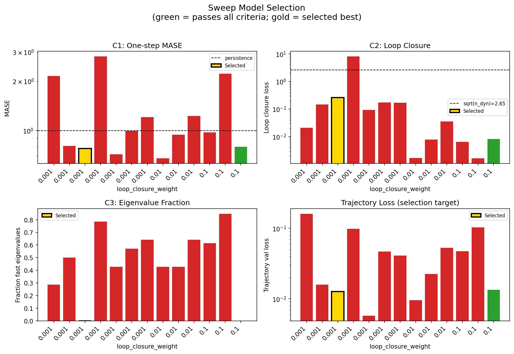

### sweep_pareto

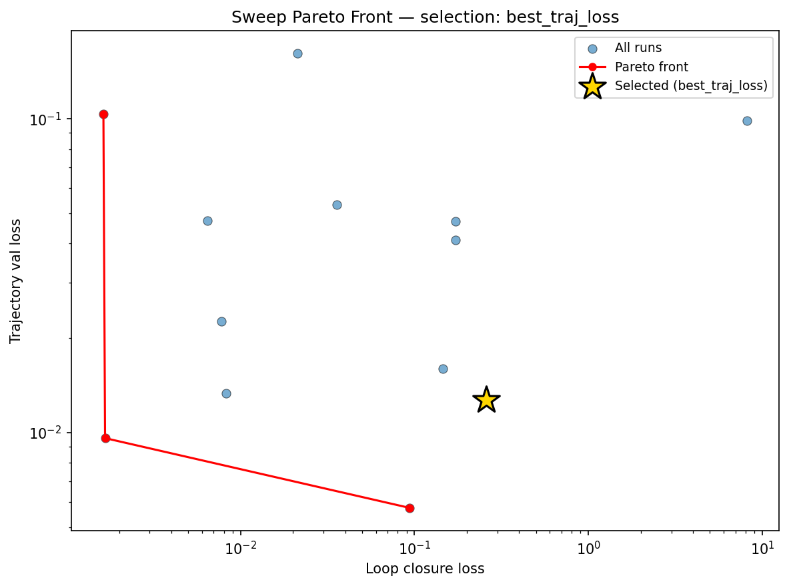

### reconstruction

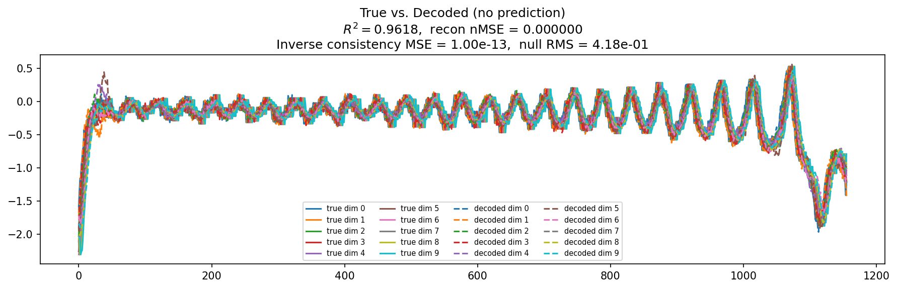

### prediction_windows

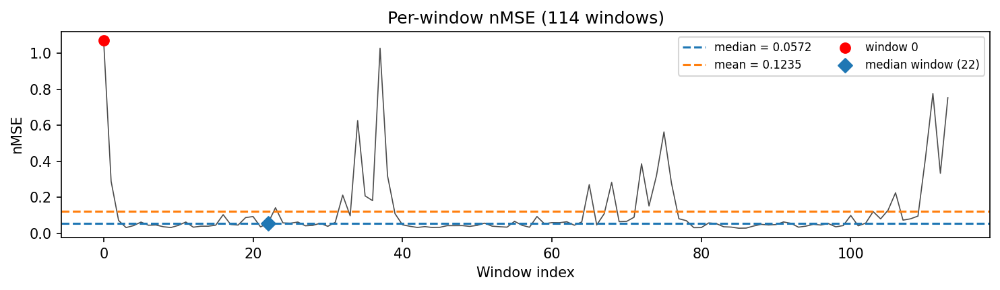

### long_trajectory

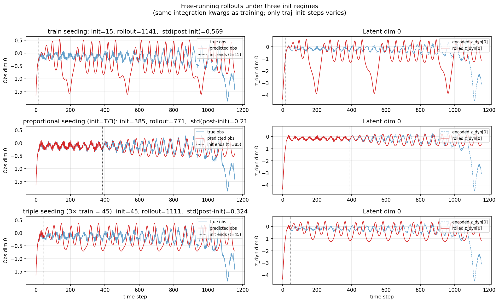

### mase

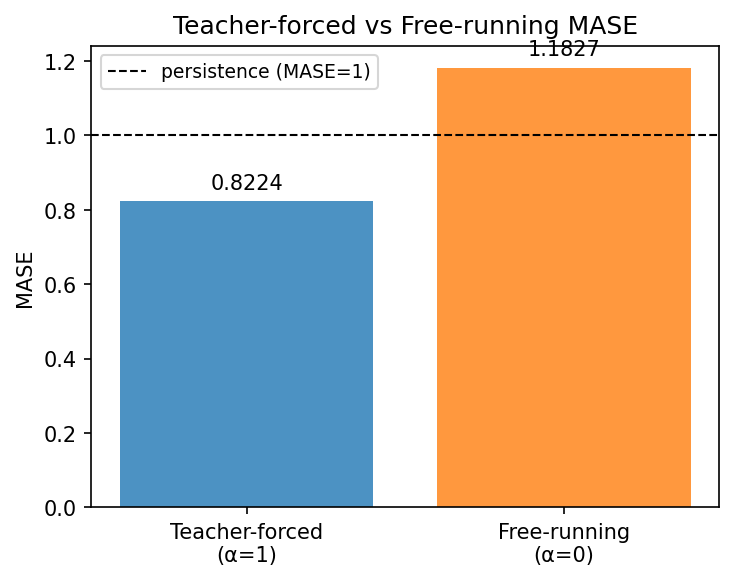

### latent_utilization

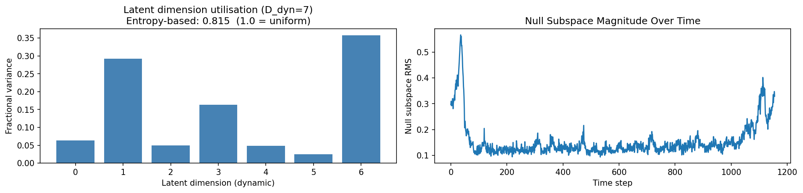

### lyapunov

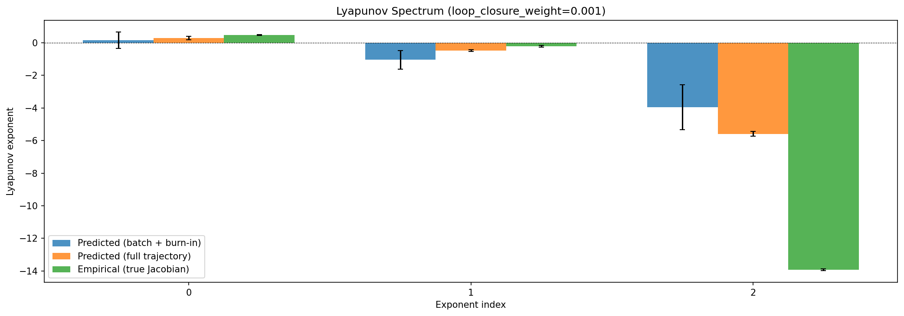

### kaplan_yorke

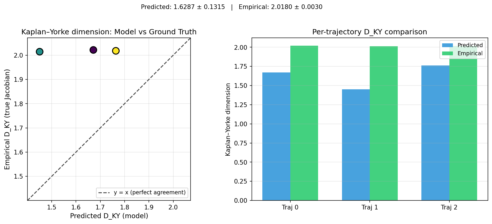

### per_run_lyapunov

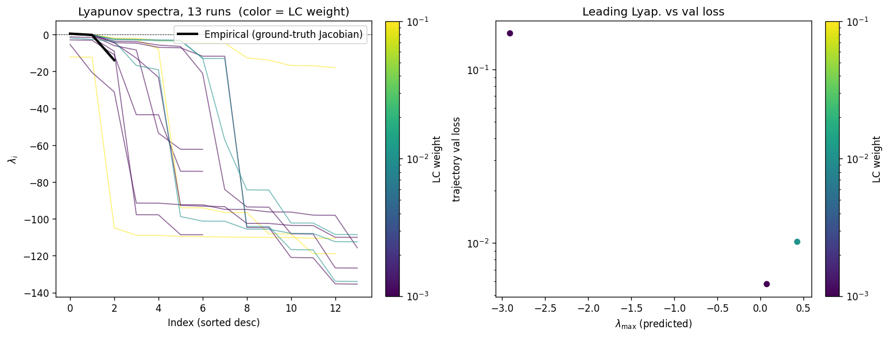

### per_run_lyapunov_vs_true

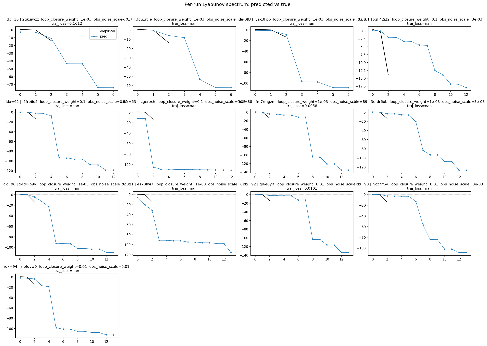

### per_run_lyapunov_relerr

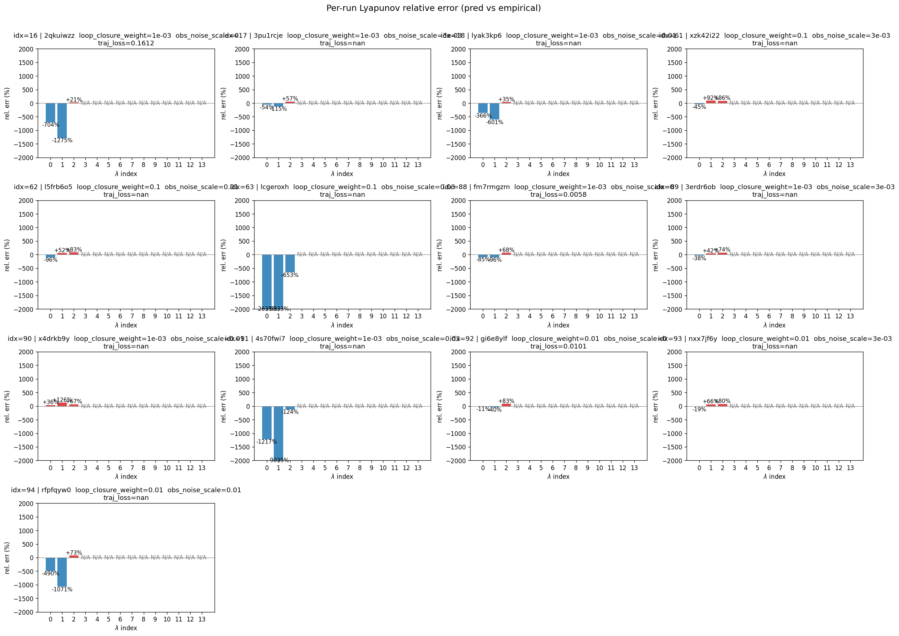

### encoder_decoder_jacobians

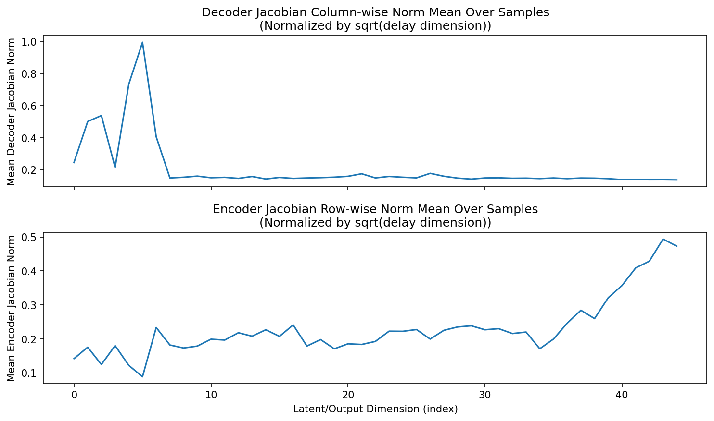

### amplification

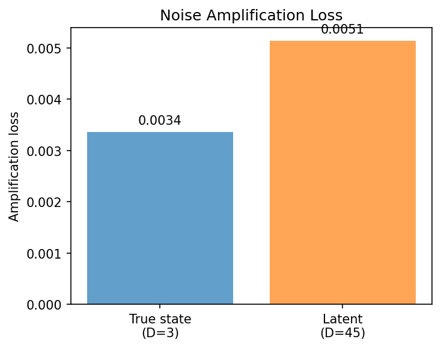

### kaplan_yorke_pca

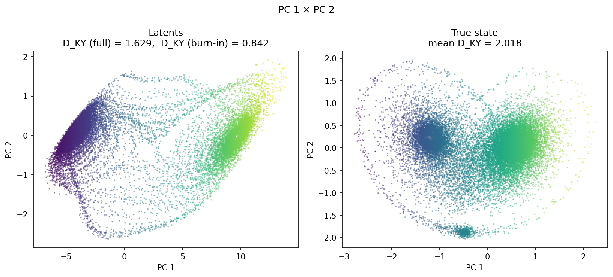

### prediction_detail_latent

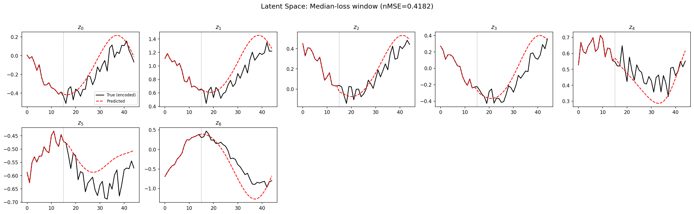

### prediction_detail_obs

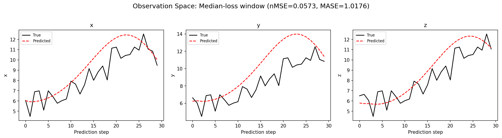

### tangent_spectrum

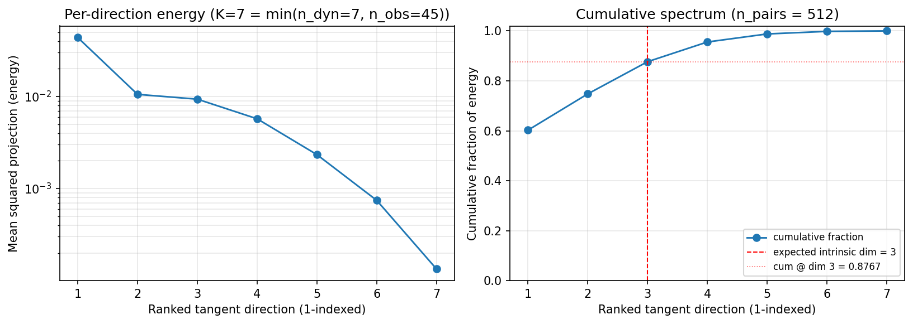

### per_run_tangent_spectrum

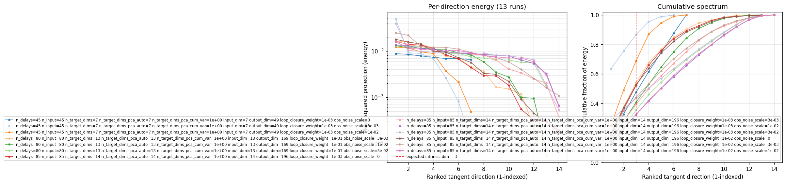

## Discussion

<!--
This section is intentionally left as a placeholder. A human reviewer
or Claude Code agent should fill it in based on the tables and figures
above, explicitly addressing each success criterion and comparing the
outcome to the stated hypothesis. Write the Discussion to
`discussion.md` in this directory and re-run `render_report`.
-->

_(to be written)_

## `run_analytics` stdout

<details><summary>Click to expand — full diagnostic output from <code>run_analytics</code></summary>

```
No run_id provided — selecting best run from group 'lorenz_partial_additive_splitmode_p30_obsnoise005_top3nd_init15_autodim__lc_obsnoisescale_sweep' ...
Found 36 total runs in JacobianODE/Lorenz_INDpartial_NDInitSweep_autodim_D1_NormTrue__JacobianODE (group=lorenz_partial_additive_splitmode_p30_obsnoise005_top3nd_init15_autodim__lc_obsnoisescale_sweep)
All runs (state, loop_closure_weight, tangent_entropy_weight, kl_dyn_weight):
  2qkuiwzz: state=finished, lc=0.001, te=0.0, kl_dyn=0.0
  3pu1rcje: state=finished, lc=0.001, te=0.0, kl_dyn=0.0
  lyak3kp6: state=finished, lc=0.001, te=0.0, kl_dyn=0.0
  2dfc6t2j: state=finished, lc=0.001, te=0.0, kl_dyn=0.0
  w2ty2awy: state=finished, lc=0.01, te=0.0, kl_dyn=0.0
  5lt08xi2: state=finished, lc=0.01, te=0.0, kl_dyn=0.0
  0qxo6b8q: state=finished, lc=0.01, te=0.0, kl_dyn=0.0
  1t5g2ozb: state=finished, lc=0.01, te=0.0, kl_dyn=0.0
  8suojnth: state=finished, lc=0.1, te=0.0, kl_dyn=0.0
  ojcef707: state=finished, lc=0.1, te=0.0, kl_dyn=0.0
  15wd5p3x: state=finished, lc=0.1, te=0.0, kl_dyn=0.0
  860ah6q7: state=finished, lc=0.1, te=0.0, kl_dyn=0.0
  kurg9rr9: state=finished, lc=0.001, te=0.0, kl_dyn=0.0
  1u6w8zhg: state=finished, lc=0.001, te=0.0, kl_dyn=0.0
  xh2fnuyo: state=finished, lc=0.001, te=0.0, kl_dyn=0.0
  60ge77ex: state=finished, lc=0.001, te=0.0, kl_dyn=0.0
  8ev8hgnw: state=finished, lc=0.01, te=0.0, kl_dyn=0.0
  8dfwr394: state=finished, lc=0.01, te=0.0, kl_dyn=0.0
  l7h04pw2: state=finished, lc=0.01, te=0.0, kl_dyn=0.0
  5duhutn3: state=finished, lc=0.01, te=0.0, kl_dyn=0.0
  frdtzzjw: state=finished, lc=0.1, te=0.0, kl_dyn=0.0
  xzk42i22: state=finished, lc=0.1, te=0.0, kl_dyn=0.0
  l5frb6o5: state=finished, lc=0.1, te=0.0, kl_dyn=0.0
  lcgeroxh: state=finished, lc=0.1, te=0.0, kl_dyn=0.0
  fm7rmgzm: state=finished, lc=0.001, te=0.0, kl_dyn=0.0
  3erdr6ob: state=finished, lc=0.001, te=0.0, kl_dyn=0.0
  x4drkb9y: state=finished, lc=0.001, te=0.0, kl_dyn=0.0
  4s70fwi7: state=finished, lc=0.001, te=0.0, kl_dyn=0.0
  gi6e8ylf: state=finished, lc=0.01, te=0.0, kl_dyn=0.0
  nxx7jf6y: state=finished, lc=0.01, te=0.0, kl_dyn=0.0
  rfpfqyw0: state=finished, lc=0.01, te=0.0, kl_dyn=0.0
  jg8uqzwd: state=finished, lc=0.01, te=0.0, kl_dyn=0.0
  e2fx6i33: state=finished, lc=0.1, te=0.0, kl_dyn=0.0
  s8qexngw: state=finished, lc=0.1, te=0.0, kl_dyn=0.0
  6zol08r1: state=finished, lc=0.1, te=0.0, kl_dyn=0.0
  p4e2v9ac: state=finished, lc=0.1, te=0.0, kl_dyn=0.0

slurm_timeout_min not found in any run config — falling back to 180 min
  Including 2qkuiwzz (lc=0.001): use_all_runs=True (state=finished)
  Including 3pu1rcje (lc=0.001): use_all_runs=True (state=finished)
  Including lyak3kp6 (lc=0.001): use_all_runs=True (state=finished)
  Including 2dfc6t2j (lc=0.001): use_all_runs=True (state=finished)
  Including w2ty2awy (lc=0.01): use_all_runs=True (state=finished)
  Including 5lt08xi2 (lc=0.01): use_all_runs=True (state=finished)
  Including 0qxo6b8q (lc=0.01): use_all_runs=True (state=finished)
  Including 1t5g2ozb (lc=0.01): use_all_runs=True (state=finished)
  Including 8suojnth (lc=0.1): use_all_runs=True (state=finished)
  Including ojcef707 (lc=0.1): use_all_runs=True (state=finished)
  Including 15wd5p3x (lc=0.1): use_all_runs=True (state=finished)
  Including 860ah6q7 (lc=0.1): use_all_runs=True (state=finished)
  Including kurg9rr9 (lc=0.001): use_all_runs=True (state=finished)
  Including 1u6w8zhg (lc=0.001): use_all_runs=True (state=finished)
  Including xh2fnuyo (lc=0.001): use_all_runs=True (state=finished)
  Including 60ge77ex (lc=0.001): use_all_runs=True (state=finished)
  Including 8ev8hgnw (lc=0.01): use_all_runs=True (state=finished)
  Including 8dfwr394 (lc=0.01): use_all_runs=True (state=finished)
  Including l7h04pw2 (lc=0.01): use_all_runs=True (state=finished)
  Including 5duhutn3 (lc=0.01): use_all_runs=True (state=finished)
  Including frdtzzjw (lc=0.1): use_all_runs=True (state=finished)
  Including xzk42i22 (lc=0.1): use_all_runs=True (state=finished)
  Including l5frb6o5 (lc=0.1): use_all_runs=True (state=finished)
  Including lcgeroxh (lc=0.1): use_all_runs=True (state=finished)
  Including fm7rmgzm (lc=0.001): use_all_runs=True (state=finished)
  Including 3erdr6ob (lc=0.001): use_all_runs=True (state=finished)
  Including x4drkb9y (lc=0.001): use_all_runs=True (state=finished)
  Including 4s70fwi7 (lc=0.001): use_all_runs=True (state=finished)
  Including gi6e8ylf (lc=0.01): use_all_runs=True (state=finished)
  Including nxx7jf6y (lc=0.01): use_all_runs=True (state=finished)
  Including rfpfqyw0 (lc=0.01): use_all_runs=True (state=finished)
  Including jg8uqzwd (lc=0.01): use_all_runs=True (state=finished)
  Including e2fx6i33 (lc=0.1): use_all_runs=True (state=finished)
  Including s8qexngw (lc=0.1): use_all_runs=True (state=finished)
  Including 6zol08r1 (lc=0.1): use_all_runs=True (state=finished)
  Including p4e2v9ac (lc=0.1): use_all_runs=True (state=finished)
Found 36 effectively-done sweep runs:
  loop_closure_weight=0.001, tangent_entropy_weight=0.0, kl_dyn_weight=0.0 -> run_id=1u6w8zhg
  loop_closure_weight=0.001, tangent_entropy_weight=0.0, kl_dyn_weight=0.0 -> run_id=2dfc6t2j
  loop_closure_weight=0.001, tangent_entropy_weight=0.0, kl_dyn_weight=0.0 -> run_id=2qkuiwzz
  loop_closure_weight=0.001, tangent_entropy_weight=0.0, kl_dyn_weight=0.0 -> run_id=3erdr6ob
  loop_closure_weight=0.001, tangent_entropy_weight=0.0, kl_dyn_weight=0.0 -> run_id=3pu1rcje
  loop_closure_weight=0.001, tangent_entropy_weight=0.0, kl_dyn_weight=0.0 -> run_id=4s70fwi7
  loop_closure_weight=0.001, tangent_entropy_weight=0.0, kl_dyn_weight=0.0 -> run_id=60ge77ex
  loop_closure_weight=0.001, tangent_entropy_weight=0.0, kl_dyn_weight=0.0 -> run_id=fm7rmgzm
  loop_closure_weight=0.001, tangent_entropy_weight=0.0, kl_dyn_weight=0.0 -> run_id=kurg9rr9
  loop_closure_weight=0.001, tangent_entropy_weight=0.0, kl_dyn_weight=0.0 -> run_id=lyak3kp6
  loop_closure_weight=0.001, tangent_entropy_weight=0.0, kl_dyn_weight=0.0 -> run_id=x4drkb9y
  loop_closure_weight=0.001, tangent_entropy_weight=0.0, kl_dyn_weight=0.0 -> run_id=xh2fnuyo
  loop_closure_weight=0.01, tangent_entropy_weight=0.0, kl_dyn_weight=0.0 -> run_id=0qxo6b8q
  loop_closure_weight=0.01, tangent_entropy_weight=0.0, kl_dyn_weight=0.0 -> run_id=1t5g2ozb
  loop_closure_weight=0.01, tangent_entropy_weight=0.0, kl_dyn_weight=0.0 -> run_id=5duhutn3
  loop_closure_weight=0.01, tangent_entropy_weight=0.0, kl_dyn_weight=0.0 -> run_id=5lt08xi2
  loop_closure_weight=0.01, tangent_entropy_weight=0.0, kl_dyn_weight=0.0 -> run_id=8dfwr394
  loop_closure_weight=0.01, tangent_entropy_weight=0.0, kl_dyn_weight=0.0 -> run_id=8ev8hgnw
  loop_closure_weight=0.01, tangent_entropy_weight=0.0, kl_dyn_weight=0.0 -> run_id=gi6e8ylf
  loop_closure_weight=0.01, tangent_entropy_weight=0.0, kl_dyn_weight=0.0 -> run_id=jg8uqzwd
  loop_closure_weight=0.01, tangent_entropy_weight=0.0, kl_dyn_weight=0.0 -> run_id=l7h04pw2
  loop_closure_weight=0.01, tangent_entropy_weight=0.0, kl_dyn_weight=0.0 -> run_id=nxx7jf6y
  loop_closure_weight=0.01, tangent_entropy_weight=0.0, kl_dyn_weight=0.0 -> run_id=rfpfqyw0
  loop_closure_weight=0.01, tangent_entropy_weight=0.0, kl_dyn_weight=0.0 -> run_id=w2ty2awy
  loop_closure_weight=0.1, tangent_entropy_weight=0.0, kl_dyn_weight=0.0 -> run_id=15wd5p3x
  loop_closure_weight=0.1, tangent_entropy_weight=0.0, kl_dyn_weight=0.0 -> run_id=6zol08r1
  loop_closure_weight=0.1, tangent_entropy_weight=0.0, kl_dyn_weight=0.0 -> run_id=860ah6q7
  loop_closure_weight=0.1, tangent_entropy_weight=0.0, kl_dyn_weight=0.0 -> run_id=8suojnth
  loop_closure_weight=0.1, tangent_entropy_weight=0.0, kl_dyn_weight=0.0 -> run_id=e2fx6i33
  loop_closure_weight=0.1, tangent_entropy_weight=0.0, kl_dyn_weight=0.0 -> run_id=frdtzzjw
  loop_closure_weight=0.1, tangent_entropy_weight=0.0, kl_dyn_weight=0.0 -> run_id=l5frb6o5
  loop_closure_weight=0.1, tangent_entropy_weight=0.0, kl_dyn_weight=0.0 -> run_id=lcgeroxh
  loop_closure_weight=0.1, tangent_entropy_weight=0.0, kl_dyn_weight=0.0 -> run_id=ojcef707
  loop_closure_weight=0.1, tangent_entropy_weight=0.0, kl_dyn_weight=0.0 -> run_id=p4e2v9ac
  loop_closure_weight=0.1, tangent_entropy_weight=0.0, kl_dyn_weight=0.0 -> run_id=s8qexngw
  loop_closure_weight=0.1, tangent_entropy_weight=0.0, kl_dyn_weight=0.0 -> run_id=xzk42i22
  Dropping 23 run(s) with no checkpoint dir: ['1u6w8zhg', '2dfc6t2j', '60ge77ex', 'kurg9rr9', 'xh2fnuyo', '0qxo6b8q', '1t5g2ozb', '5duhutn3', '5lt08xi2', '8dfwr394', '8ev8hgnw', 'jg8uqzwd', 'l7h04pw2', 'w2ty2awy', '15wd5p3x', '6zol08r1', '860ah6q7', '8suojnth', 'e2fx6i33', 'frdtzzjw', 'ojcef707', 'p4e2v9ac', 's8qexngw']
n_dims=45, n_latent=45, n_dyn=7, dt=0.0150
  run=2qkuiwzz: DiagnosticMetrics(one_step_mase=2.1492412090301514, loop_closure_loss=0.021185364574193954, fast_eigenvalue_fraction=0.2857142984867096, trajectory_val_loss=0.16122040152549744) (from W&B history)
  run=3erdr6ob: DiagnosticMetrics(one_step_mase=0.8073654770851135, loop_closure_loss=0.14517994225025177, fast_eigenvalue_fraction=0.5, trajectory_val_loss=0.01596161350607872) (from W&B history)
  run=3pu1rcje: DiagnosticMetrics(one_step_mase=0.7808202505111694, loop_closure_loss=0.2595497965812683, fast_eigenvalue_fraction=0.0, trajectory_val_loss=0.012666149996221066) (from W&B history)
  run=4s70fwi7: DiagnosticMetrics(one_step_mase=2.824467182159424, loop_closure_loss=8.160231590270996, fast_eigenvalue_fraction=0.7857142686843872, trajectory_val_loss=0.09862762689590454) (from W&B history)
  run=fm7rmgzm: DiagnosticMetrics(one_step_mase=0.7192159295082092, loop_closure_loss=0.09367725253105164, fast_eigenvalue_fraction=0.4285714328289032, trajectory_val_loss=0.005753418896347284) (from W&B history)
  run=lyak3kp6: DiagnosticMetrics(one_step_mase=0.9946412444114685, loop_closure_loss=0.17275884747505188, fast_eigenvalue_fraction=0.5714285969734192, trajectory_val_loss=0.047042910009622574) (from W&B history)
  run=x4drkb9y: DiagnosticMetrics(one_step_mase=1.2071521282196045, loop_closure_loss=0.17152734100818634, fast_eigenvalue_fraction=0.6428571343421936, trajectory_val_loss=0.041054617613554) (from W&B history)
  run=gi6e8ylf: DiagnosticMetrics(one_step_mase=0.6793082356452942, loop_closure_loss=0.0016605791170150042, fast_eigenvalue_fraction=0.4285714328289032, trajectory_val_loss=0.009597032330930233) (from W&B history)
  run=nxx7jf6y: DiagnosticMetrics(one_step_mase=0.9454768896102905, loop_closure_loss=0.007754601072520018, fast_eigenvalue_fraction=0.4285714328289032, trajectory_val_loss=0.022590655833482742) (from W&B history)
  run=rfpfqyw0: DiagnosticMetrics(one_step_mase=1.2270336151123047, loop_closure_loss=0.03579332306981087, fast_eigenvalue_fraction=0.6428571343421936, trajectory_val_loss=0.053192321211099625) (from W&B history)
  run=l5frb6o5: DiagnosticMetrics(one_step_mase=0.9752206802368164, loop_closure_loss=0.006465144921094179, fast_eigenvalue_fraction=0.6153846383094788, trajectory_val_loss=0.04741484299302101) (from W&B history)
  run=lcgeroxh: DiagnosticMetrics(one_step_mase=2.2175209522247314, loop_closure_loss=0.0016246660379692912, fast_eigenvalue_fraction=0.8461538553237915, trajectory_val_loss=0.10370142012834549) (from W&B history)
  run=xzk42i22: DiagnosticMetrics(one_step_mase=0.7985732555389404, loop_closure_loss=0.008254220709204674, fast_eigenvalue_fraction=0.0, trajectory_val_loss=0.013356281444430351) (from W&B history)

Ranking method:           best_traj_loss
Best run ID:              3pu1rcje
Best loop_closure_weight: 0.001
Best tangent_entropy_weight: 0.0
Best kl_dyn_weight:       0.0
Best traj loss:           0.012666
Criteria applied: ['C1', 'C2', 'C3']
Surviving: 2 / 13
Auto-selected run_id: 3pu1rcje

======================================================================
PARETO FRONTIER RUNS (3 runs)
======================================================================
  Run ID               LC Loss   Traj Val Loss
  ------------  --------------  --------------
  lcgeroxh            0.001625        0.103701
  gi6e8ylf            0.001661        0.009597
  fm7rmgzm            0.093677        0.005753

======================================================================
RANKING METHOD COMPARISON (over 2 survivors)
======================================================================
  Method                  Run ID               LC Loss   Traj Val Loss
  ----------------------  ------------  --------------  --------------
  best_traj_loss          3pu1rcje            0.259550        0.012666 <-- active
  pareto_knee             xzk42i22            0.008254        0.013356
  geo_rank                3pu1rcje            0.259550        0.012666
  minimax_rank            3pu1rcje            0.259550        0.012666
  geo_log_score           3pu1rcje            0.259550        0.012666
  minimax_log_score       xzk42i22            0.008254        0.013356
======================================================================

Loading run 3pu1rcje from JacobianODE/Lorenz_INDpartial_NDInitSweep_autodim_D1_NormTrue__JacobianODE ...
Loading checkpoint epoch=27-step=5600.ckpt...
Train dataset shape: torch.Size([24442, 45, 45])
Validation dataset shape: torch.Size([7777, 45, 45])
Test dataset shape: torch.Size([3333, 45, 45])
Train trajectories dataset shape: torch.Size([22, 1156, 45])
Validation trajectories dataset shape: torch.Size([7, 1156, 45])
Test trajectories dataset shape: torch.Size([3, 1156, 45])
Loading checkpoint epoch=27-step=5600.ckpt...
Computing reconstruction ...
Computing MASE ...
Teacher-forced MASE: 0.8224
Free-running MASE:   1.1827
Computing latent utilization ...
Entropy-based utilization: 0.815
Null subspace mean RMS: 1.695595e-01
Computing Lyapunov exponents ...
  Computing full-trajectory Lyapunov (3 test trajs, T=1156) ...
Predicted Lyapunov exponents (batch+burn-in, 128 windowed trajs):
  λ_1 = +0.1650 ± 0.4991
  λ_2 = -1.0384 ± 0.5662
  λ_3 = -3.9498 ± 1.3714
  λ_4 = -8.8084 ± 0.5839
  λ_5 = -53.6610 ± 0.4722
  λ_6 = -62.0935 ± 0.1007
  λ_7 = -62.2810 ± 0.1008
Predicted Lyapunov exponents (full-length, 3 test trajs):
  λ_1 = +0.3043 ± 0.1069
  λ_2 = -0.4757 ± 0.0522
  λ_3 = -5.5843 ± 0.1442
  λ_4 = -8.3004 ± 0.0827
  λ_5 = -53.5436 ± 0.0467
  λ_6 = -62.2714 ± 0.0087
  λ_7 = -62.3277 ± 0.0169
Empirical Lyapunov exponents (mean ± std):
  λ_1 = +0.4677 ± 0.0259
  λ_2 = -0.2173 ± 0.0549
  λ_3 = -13.9174 ± 0.0513
Mean KY dim (predicted): 1.629 ± 0.132
Mean KY dim (empirical): 2.018 ± 0.003
Mean KY dim (burn-in):   0.842 ± 0.716
Computing prediction windows ...
Windows: 114 — nMSE min=0.0297, median=0.0572, mean=0.1235, max=1.0692
Computing long-trajectory free-running rollouts ...
Computing encoder/decoder Jacobians ...
encoder_jacobian: (128, 45, 45)
decoder_jacobian: (128, 45, 45)
Computing amplification loss ...
Amplification loss — True state: 0.003366
Amplification loss — Latent:     0.005144
Computing tangent space spectrum ...
```

</details>
