# Sweep Analysis: `lorenz_partial_additive_splitmode_p30_obsnoise005_top3nd_init15_autodim__lc_sweep`

**Project**: [Lorenz_INDpartial_NDInitSweep_autodim_D1_NormTrue__JacobianODE](https://wandb.ai/JacobianODE/Lorenz_INDpartial_NDInitSweep_autodim_D1_NormTrue__JacobianODE/groups/lorenz_partial_additive_splitmode_p30_obsnoise005_top3nd_init15_autodim__lc_sweep)  
**Launched**: 2026-04-23T15:40:38Z  
**Completed**: 2026-04-24T06:00:21Z  
**Outcome**: `complete_clean`  
**Git**: `latent-JacobianODE` @ `ba8843f`  
**Expected runs**: 21

## Experiment Context

### `lorenz_partial_additive_splitmode_p30_obsnoise005_top3nd_init15_autodim__lc_sweep`

**Description**

Lorenz partial additive coupling, obs_noise=0.05, top-3 n_delays
{45, 80, 85}, traj_init_steps=15, prediction_steps=30, splitmode
(reconstruction_mode=uniform + trajectory_loss_most_recent=true,
both explicit). 21-run sweep over 7 LC weights {0, 1e-6, 1e-5,
1e-4, 1e-3, 1e-2, 1e-1}. n_target_dims auto via PCA (threshold=0.99),
final_perm_identity=true, init_pca_basis=false. Submitted to
ou_bcs_normal for fast turnaround.

**Hypothesis**

Reproduce the original top3nd LC sweep cleanly under explicit split
mode. Best val traj should match the original sweep's best (~5.5e-3
at LC=1e-4, n_delays=45). At this noise level LC=0 and LC=1e-6 never
passed C1+C2+C3 in the original — we keep them in the grid as
explicit baselines showing what "no loop closure" looks like at
high noise. LC=1 and LC=10 were dropped (best_traj noticeably worse
than the optimum).

**Success criteria**

- All 21 runs train without divergence
- Best val traj_loss within 2x of the original sweep's 5.50e-3 winner
- LC=0 and LC=1e-6 cells fail C2 at all 3 n_delays (reproduces original)
- Best cell (expected LC ∈ {1e-4, 1e-3}) passes C1+C2+C3

## Results

**Swept axes** (8): `data.train_test_params.delay_embedding_params.n_delays`, `model.encoder.n_input`, `model.n_target_dims`, `model.n_target_dims_pca_auto`, `model.n_target_dims_pca_cum_var`, `model.params.input_dim`, `model.params.output_dim`, `training.lightning.loop_closure_weight`

**Chosen run** (by `best_traj_loss`): `o3ntglqe` — traj_loss=0.00517, MASE=0.7720, R²=0.9864, LC loss=79.487, epoch=103.0

Swept-axis values at chosen run: `data.train_test_params.delay_embedding_params.n_delays`=85 · `model.encoder.n_input`=85 · `model.n_target_dims`=14 · `model.n_target_dims_pca_auto`=14 · `model.n_target_dims_pca_cum_var`=0.990074 · `model.params.input_dim`=14 · `model.params.output_dim`=196 · `training.lightning.loop_closure_weight`=0

**Runs analyzed**: 21 (expected 21)

### Per-run results

| run_idx | run_id | `data.train_test_params.delay_embedding_params.n_delays` | `model.encoder.n_input` | `model.n_target_dims` | `model.n_target_dims_pca_auto` | `model.n_target_dims_pca_cum_var` | `model.params.input_dim` | `model.params.output_dim` | `training.lightning.loop_closure_weight` | best_traj_loss | best_MASE | R² | LC loss | epoch |
|---|---|---|---|---|---|---|---|---|---|---|---|---|---|---|
| 14 | `o3ntglqe` | 85 | 85 | 14 | 14 | 0.990074 | 14 | 196 | 0 | 0.00517 | 0.7720 | 0.9864 | 79.487 | 103.0 |
| 15 | `6iru8a54` | 85 | 85 | 14 | 14 | 0.990074 | 14 | 196 | 1.0e-06 | 0.00535 | 0.7762 | 0.9859 | 17.810 | 103.0 |
| 1 | `6qmfcfgz` | 45 | 45 | 7 | 7 | 0.990085 | 7 | 49 | 1.0e-06 | 0.00550 | 0.7759 | 0.9847 | 2.350 | 112.0 |
| 17 | `une3usxv` | 85 | 85 | 14 | 14 | 0.990074 | 14 | 196 | 1.0e-04 | 0.00553 | 0.7900 | 0.9855 | 0.654 | 97.0 |
| 2 | `162o9jhn` | 45 | 45 | 7 | 7 | 0.990085 | 7 | 49 | 1.0e-05 | 0.00557 | 0.7871 | 0.9845 | 0.966 | 102.0 |
| 4 | `mf9iub3g` | 45 | 45 | 7 | 7 | 0.990085 | 7 | 49 | 0.001 | 0.00562 | 0.7905 | 0.9844 | 0.052 | 114.0 |
| 16 | `sh2ww8vl` | 85 | 85 | 14 | 14 | 0.990074 | 14 | 196 | 1.0e-05 | 0.00562 | 0.7824 | 0.9853 | 3.697 | 94.0 |
| 0 | `aetnua64` | 45 | 45 | 7 | 7 | 0.990085 | 7 | 49 | 0 | 0.00565 | 0.7879 | 0.9843 | 4.200 | 102.0 |
| 18 | `thvxa37g` | 85 | 85 | 14 | 14 | 0.990074 | 14 | 196 | 0.001 | 0.00596 | 0.8090 | 0.9844 | 0.090 | 85.0 |
| 8 | `vlq2dc6z` | 80 | 80 | 13 | 13 | 0.990058 | 13 | 169 | 1.0e-06 | 0.00602 | 0.7905 | 0.9839 | 15.110 | 99.0 |
| 5 | `hb1x9ww9` | 45 | 45 | 7 | 7 | 0.990085 | 7 | 49 | 0.01 | 0.00609 | 0.8048 | 0.9829 | 0.007 | 102.0 |
| 9 | `duyakwxg` | 80 | 80 | 13 | 13 | 0.990058 | 13 | 169 | 1.0e-05 | 0.00618 | 0.7978 | 0.9836 | 3.599 | 112.0 |
| 7 | `4vxtpkv8` | 80 | 80 | 13 | 13 | 0.990058 | 13 | 169 | 0 | 0.00622 | 0.7940 | 0.9835 | 64.934 | 95.0 |
| 10 | `rjitbsp3` | 80 | 80 | 13 | 13 | 0.990058 | 13 | 169 | 1.0e-04 | 0.00648 | 0.8077 | 0.9827 | 0.528 | 99.0 |
| 11 | `opy2khrt` | 80 | 80 | 13 | 13 | 0.990058 | 13 | 169 | 0.001 | 0.00727 | 0.8302 | 0.9805 | 0.098 | 106.0 |
| 3 | `kubg9nfz` | 45 | 45 | 7 | 7 | 0.990085 | 7 | 49 | 1.0e-04 | 0.00745 | 0.8423 | 0.9791 | 0.243 | 55.0 |
| 20 | `451l25zs` | 85 | 85 | 14 | 14 | 0.990074 | 14 | 196 | 0.1 | 0.00754 | 0.8429 | 0.9802 | 0.001 | 103.0 |
| 6 | `t7o9xise` | 45 | 45 | 7 | 7 | 0.990085 | 7 | 49 | 0.1 | 0.00755 | 0.8630 | 0.9790 | 0.001 | 102.0 |
| 19 | `rghd28hc` | 85 | 85 | 14 | 14 | 0.990074 | 14 | 196 | 0.01 | 0.00782 | 0.8637 | 0.9794 | 0.021 | 95.0 |
| 13 | `gjp24vat` | 80 | 80 | 13 | 13 | 0.990058 | 13 | 169 | 0.1 | 0.00950 | 0.8823 | 0.9745 | 0.001 | 106.0 |
| 12 | `wor1xddq` | 80 | 80 | 13 | 13 | 0.990058 | 13 | 169 | 0.01 | 0.01016 | 0.9057 | 0.9725 | 0.008 | 88.0 |

## Success-criteria verdicts (automated)

| Criterion | Verdict | Note |
|---|---|---|
| All 21 runs train without divergence | **Unknown** |  |
| Best val traj_loss within 2x of the original sweep's 5.50e-3 winner | **Unknown** |  |
| LC=0 and LC=1e-6 cells fail C2 at all 3 n_delays (reproduces original) | **Unknown** |  |
| Best cell (expected LC ∈ {1e-4, 1e-3}) passes C1+C2+C3 | **Unknown** |  |

_Automated verdicts use simple numeric-threshold parsing and may mis-classify qualitative criteria. The Discussion section below takes precedence._

## Figures

### sweep_overview

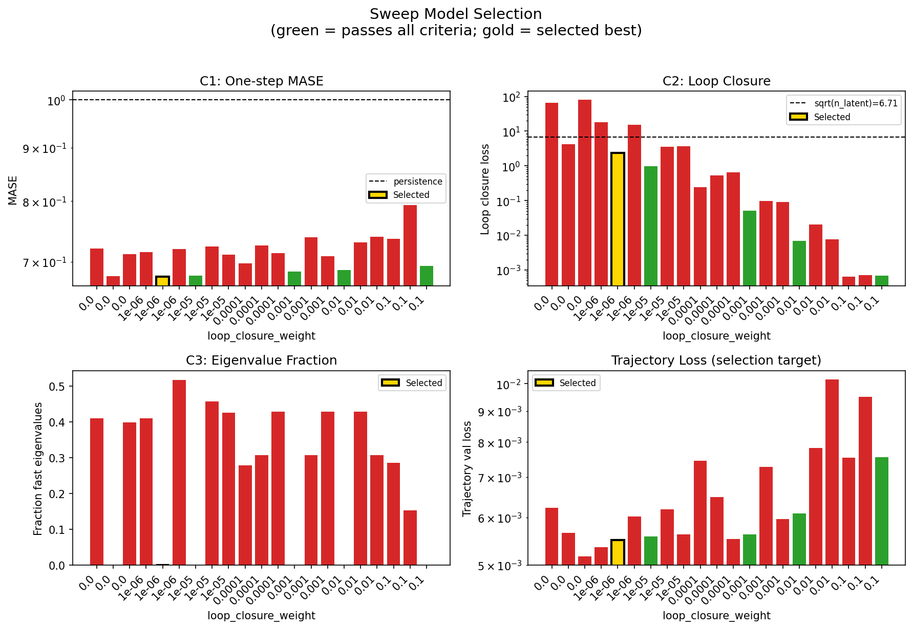

### sweep_pareto

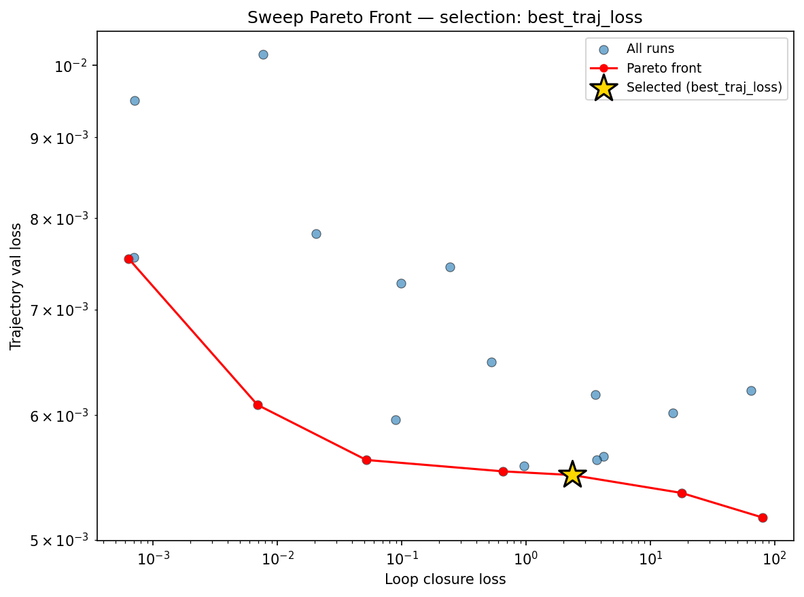

### reconstruction

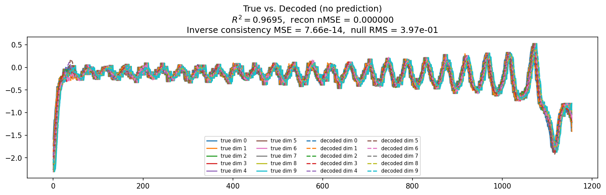

### prediction_windows

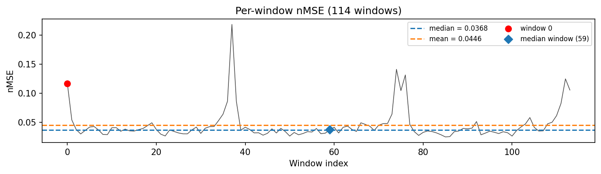

### long_trajectory

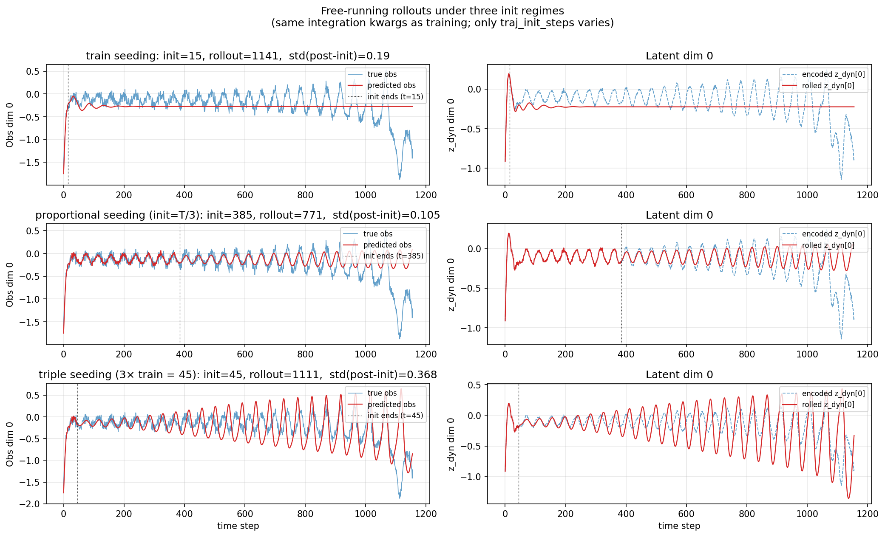

### mase

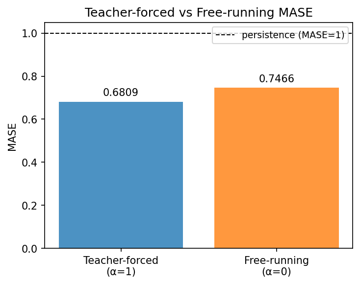

### latent_utilization

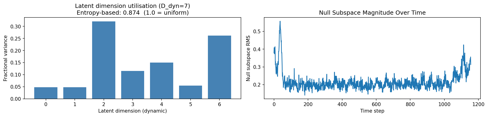

### lyapunov

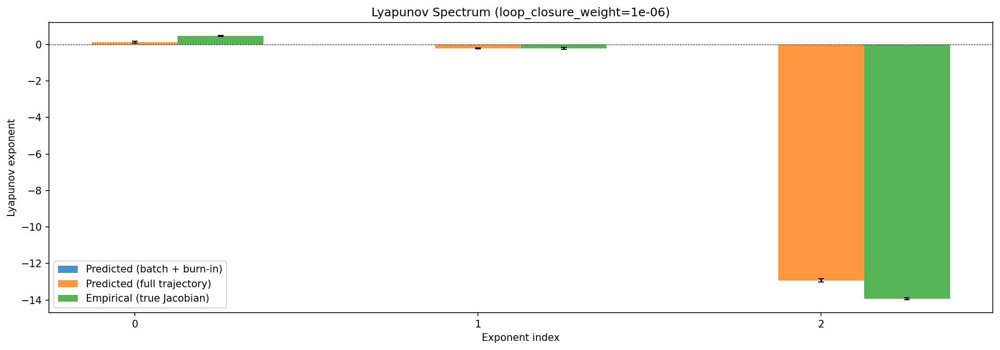

### kaplan_yorke

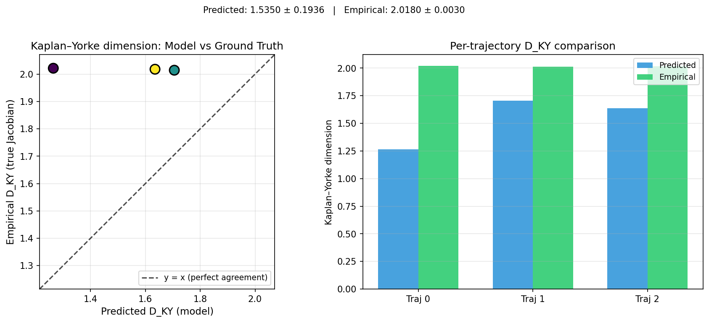

### per_run_lyapunov

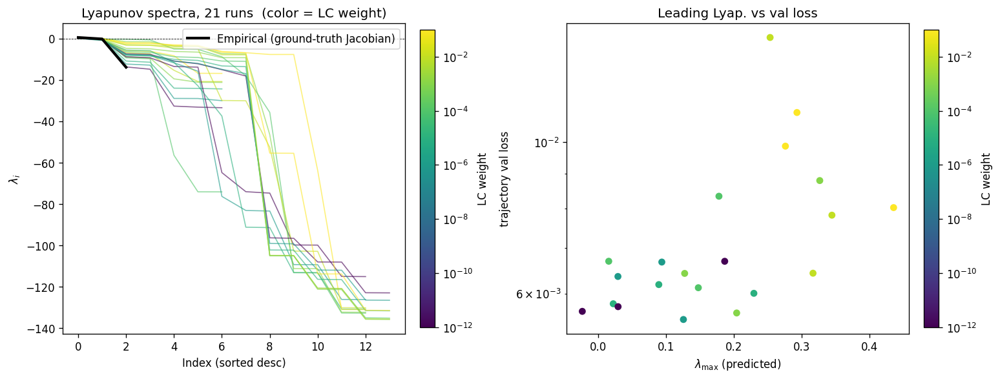

### per_run_lyapunov_vs_true

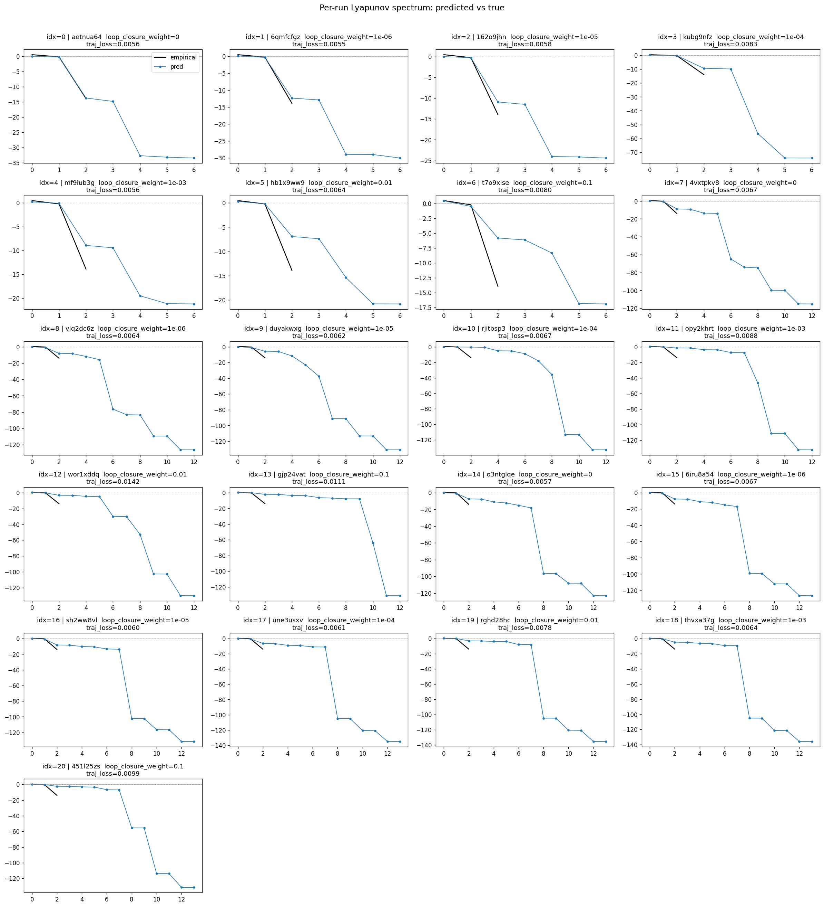

### per_run_lyapunov_relerr

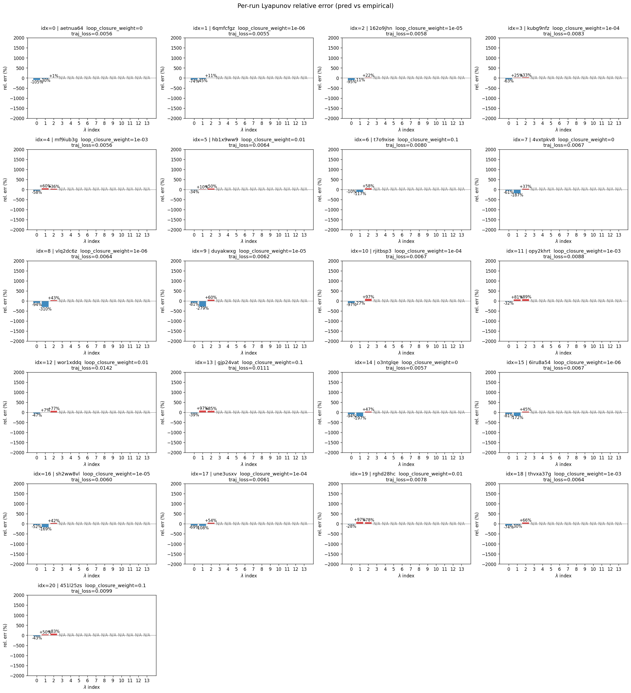

### encoder_decoder_jacobians

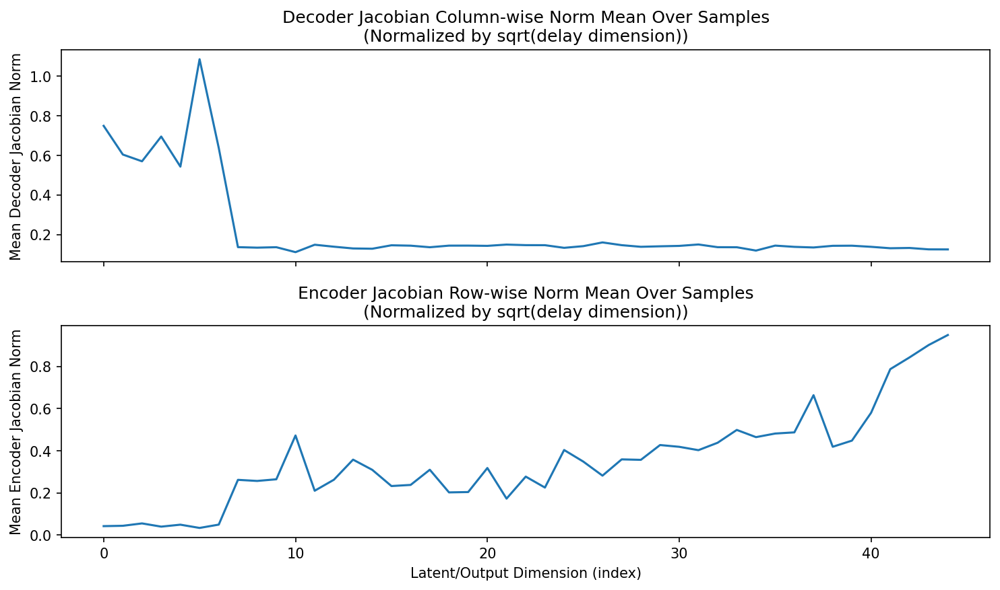

### amplification

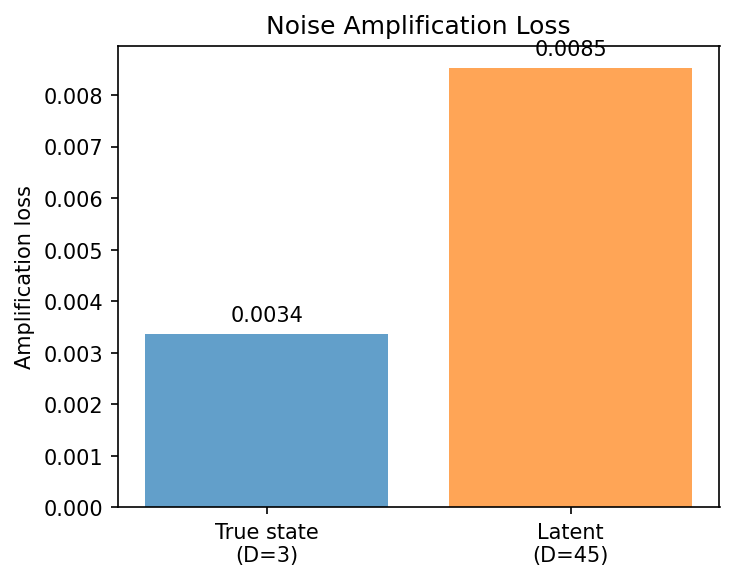

### kaplan_yorke_pca

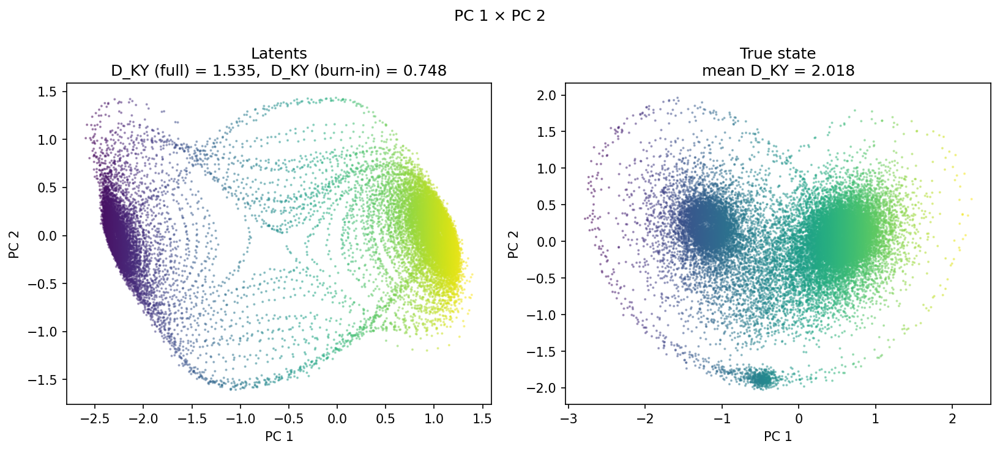

### prediction_detail_latent

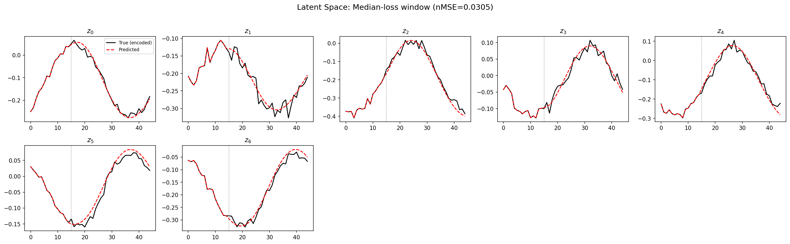

### prediction_detail_obs

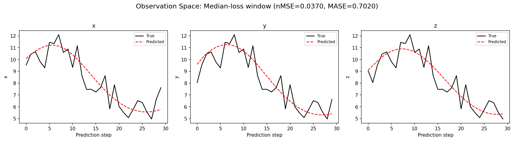

### tangent_spectrum

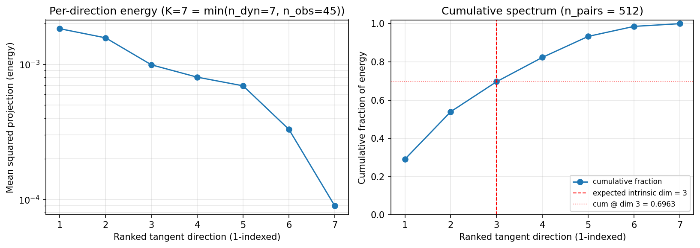

### per_run_tangent_spectrum

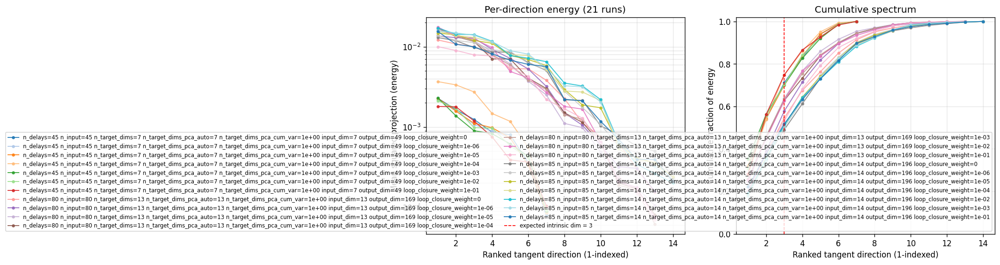

## Discussion

<!--
This section is intentionally left as a placeholder. A human reviewer
or Claude Code agent should fill it in based on the tables and figures
above, explicitly addressing each success criterion and comparing the
outcome to the stated hypothesis. Write the Discussion to
`discussion.md` in this directory and re-run `render_report`.
-->

_(to be written)_

## `run_analytics` stdout

<details><summary>Click to expand — full diagnostic output from <code>run_analytics</code></summary>

```
No run_id provided — selecting best run from group 'lorenz_partial_additive_splitmode_p30_obsnoise005_top3nd_init15_autodim__lc_sweep' ...
Found 21 total runs in JacobianODE/Lorenz_INDpartial_NDInitSweep_autodim_D1_NormTrue__JacobianODE (group=lorenz_partial_additive_splitmode_p30_obsnoise005_top3nd_init15_autodim__lc_sweep)
All runs (state, loop_closure_weight, tangent_entropy_weight, kl_dyn_weight):
  aetnua64: state=finished, lc=0.0, te=0.0, kl_dyn=0.0
  6qmfcfgz: state=finished, lc=1e-06, te=0.0, kl_dyn=0.0
  162o9jhn: state=finished, lc=1e-05, te=0.0, kl_dyn=0.0
  kubg9nfz: state=finished, lc=0.0001, te=0.0, kl_dyn=0.0
  mf9iub3g: state=finished, lc=0.001, te=0.0, kl_dyn=0.0
  hb1x9ww9: state=finished, lc=0.01, te=0.0, kl_dyn=0.0
  t7o9xise: state=finished, lc=0.1, te=0.0, kl_dyn=0.0
  4vxtpkv8: state=finished, lc=0.0, te=0.0, kl_dyn=0.0
  vlq2dc6z: state=finished, lc=1e-06, te=0.0, kl_dyn=0.0
  duyakwxg: state=finished, lc=1e-05, te=0.0, kl_dyn=0.0
  rjitbsp3: state=finished, lc=0.0001, te=0.0, kl_dyn=0.0
  opy2khrt: state=finished, lc=0.001, te=0.0, kl_dyn=0.0
  wor1xddq: state=finished, lc=0.01, te=0.0, kl_dyn=0.0
  gjp24vat: state=finished, lc=0.1, te=0.0, kl_dyn=0.0
  o3ntglqe: state=finished, lc=0.0, te=0.0, kl_dyn=0.0
  6iru8a54: state=finished, lc=1e-06, te=0.0, kl_dyn=0.0
  sh2ww8vl: state=finished, lc=1e-05, te=0.0, kl_dyn=0.0
  une3usxv: state=finished, lc=0.0001, te=0.0, kl_dyn=0.0
  rghd28hc: state=finished, lc=0.01, te=0.0, kl_dyn=0.0
  thvxa37g: state=finished, lc=0.001, te=0.0, kl_dyn=0.0
  451l25zs: state=finished, lc=0.1, te=0.0, kl_dyn=0.0

slurm_timeout_min not found in any run config — falling back to 180 min
  Including aetnua64 (lc=0.0): use_all_runs=True (state=finished)
  Including 6qmfcfgz (lc=1e-06): use_all_runs=True (state=finished)
  Including 162o9jhn (lc=1e-05): use_all_runs=True (state=finished)
  Including kubg9nfz (lc=0.0001): use_all_runs=True (state=finished)
  Including mf9iub3g (lc=0.001): use_all_runs=True (state=finished)
  Including hb1x9ww9 (lc=0.01): use_all_runs=True (state=finished)
  Including t7o9xise (lc=0.1): use_all_runs=True (state=finished)
  Including 4vxtpkv8 (lc=0.0): use_all_runs=True (state=finished)
  Including vlq2dc6z (lc=1e-06): use_all_runs=True (state=finished)
  Including duyakwxg (lc=1e-05): use_all_runs=True (state=finished)
  Including rjitbsp3 (lc=0.0001): use_all_runs=True (state=finished)
  Including opy2khrt (lc=0.001): use_all_runs=True (state=finished)
  Including wor1xddq (lc=0.01): use_all_runs=True (state=finished)
  Including gjp24vat (lc=0.1): use_all_runs=True (state=finished)
  Including o3ntglqe (lc=0.0): use_all_runs=True (state=finished)
  Including 6iru8a54 (lc=1e-06): use_all_runs=True (state=finished)
  Including sh2ww8vl (lc=1e-05): use_all_runs=True (state=finished)
  Including une3usxv (lc=0.0001): use_all_runs=True (state=finished)
  Including rghd28hc (lc=0.01): use_all_runs=True (state=finished)
  Including thvxa37g (lc=0.001): use_all_runs=True (state=finished)
  Including 451l25zs (lc=0.1): use_all_runs=True (state=finished)
Found 21 effectively-done sweep runs:
  loop_closure_weight=0.0, tangent_entropy_weight=0.0, kl_dyn_weight=0.0 -> run_id=4vxtpkv8
  loop_closure_weight=0.0, tangent_entropy_weight=0.0, kl_dyn_weight=0.0 -> run_id=aetnua64
  loop_closure_weight=0.0, tangent_entropy_weight=0.0, kl_dyn_weight=0.0 -> run_id=o3ntglqe
  loop_closure_weight=1e-06, tangent_entropy_weight=0.0, kl_dyn_weight=0.0 -> run_id=6iru8a54
  loop_closure_weight=1e-06, tangent_entropy_weight=0.0, kl_dyn_weight=0.0 -> run_id=6qmfcfgz
  loop_closure_weight=1e-06, tangent_entropy_weight=0.0, kl_dyn_weight=0.0 -> run_id=vlq2dc6z
  loop_closure_weight=1e-05, tangent_entropy_weight=0.0, kl_dyn_weight=0.0 -> run_id=162o9jhn
  loop_closure_weight=1e-05, tangent_entropy_weight=0.0, kl_dyn_weight=0.0 -> run_id=duyakwxg
  loop_closure_weight=1e-05, tangent_entropy_weight=0.0, kl_dyn_weight=0.0 -> run_id=sh2ww8vl
  loop_closure_weight=0.0001, tangent_entropy_weight=0.0, kl_dyn_weight=0.0 -> run_id=kubg9nfz
  loop_closure_weight=0.0001, tangent_entropy_weight=0.0, kl_dyn_weight=0.0 -> run_id=rjitbsp3
  loop_closure_weight=0.0001, tangent_entropy_weight=0.0, kl_dyn_weight=0.0 -> run_id=une3usxv
  loop_closure_weight=0.001, tangent_entropy_weight=0.0, kl_dyn_weight=0.0 -> run_id=mf9iub3g
  loop_closure_weight=0.001, tangent_entropy_weight=0.0, kl_dyn_weight=0.0 -> run_id=opy2khrt
  loop_closure_weight=0.001, tangent_entropy_weight=0.0, kl_dyn_weight=0.0 -> run_id=thvxa37g
  loop_closure_weight=0.01, tangent_entropy_weight=0.0, kl_dyn_weight=0.0 -> run_id=hb1x9ww9
  loop_closure_weight=0.01, tangent_entropy_weight=0.0, kl_dyn_weight=0.0 -> run_id=rghd28hc
  loop_closure_weight=0.01, tangent_entropy_weight=0.0, kl_dyn_weight=0.0 -> run_id=wor1xddq
  loop_closure_weight=0.1, tangent_entropy_weight=0.0, kl_dyn_weight=0.0 -> run_id=451l25zs
  loop_closure_weight=0.1, tangent_entropy_weight=0.0, kl_dyn_weight=0.0 -> run_id=gjp24vat
  loop_closure_weight=0.1, tangent_entropy_weight=0.0, kl_dyn_weight=0.0 -> run_id=t7o9xise
n_dims=80, n_latent=80, n_dyn=13, dt=0.0150
  run=4vxtpkv8: DiagnosticMetrics(one_step_mase=0.720434844493866, loop_closure_loss=64.93416595458984, fast_eigenvalue_fraction=0.4105769097805023, trajectory_val_loss=0.006216591689735651) (from W&B history)
  run=aetnua64: DiagnosticMetrics(one_step_mase=0.6776918172836304, loop_closure_loss=4.200197219848633, fast_eigenvalue_fraction=0.0, trajectory_val_loss=0.005649094004184008) (from W&B history)
  run=o3ntglqe: DiagnosticMetrics(one_step_mase=0.7117806673049927, loop_closure_loss=79.48748016357422, fast_eigenvalue_fraction=0.39964285492897034, trajectory_val_loss=0.005165980663150549) (from W&B history)
  run=6iru8a54: DiagnosticMetrics(one_step_mase=0.7151942849159241, loop_closure_loss=17.810413360595703, fast_eigenvalue_fraction=0.4107142984867096, trajectory_val_loss=0.00535417627543211) (from W&B history)
  run=6qmfcfgz: DiagnosticMetrics(one_step_mase=0.6769357919692993, loop_closure_loss=2.3496384620666504, fast_eigenvalue_fraction=0.0, trajectory_val_loss=0.005495918449014425) (from W&B history)
  run=vlq2dc6z: DiagnosticMetrics(one_step_mase=0.7196230292320251, loop_closure_loss=15.110177993774414, fast_eigenvalue_fraction=0.5178846120834351, trajectory_val_loss=0.006015999708324671) (from W&B history)
  run=162o9jhn: DiagnosticMetrics(one_step_mase=0.6786338090896606, loop_closure_loss=0.9662990570068359, fast_eigenvalue_fraction=0.0, trajectory_val_loss=0.005572308786213398) (from W&B history)
  run=duyakwxg: DiagnosticMetrics(one_step_mase=0.7236517667770386, loop_closure_loss=3.5993785858154297, fast_eigenvalue_fraction=0.45730769634246826, trajectory_val_loss=0.006183509714901447) (from W&B history)
  run=sh2ww8vl: DiagnosticMetrics(one_step_mase=0.7106341123580933, loop_closure_loss=3.697136878967285, fast_eigenvalue_fraction=0.426071435213089, trajectory_val_loss=0.00561951519921422) (from W&B history)
  run=kubg9nfz: DiagnosticMetrics(one_step_mase=0.6976839303970337, loop_closure_loss=0.24313640594482422, fast_eigenvalue_fraction=0.279285728931427, trajectory_val_loss=0.007446702569723129) (from W&B history)
  run=rjitbsp3: DiagnosticMetrics(one_step_mase=0.7251628637313843, loop_closure_loss=0.5279591083526611, fast_eigenvalue_fraction=0.3076923191547394, trajectory_val_loss=0.006482718512415886) (from W&B history)
  run=une3usxv: DiagnosticMetrics(one_step_mase=0.7130308151245117, loop_closure_loss=0.6536874175071716, fast_eigenvalue_fraction=0.4285714328289032, trajectory_val_loss=0.005525527521967888) (from W&B history)
  run=mf9iub3g: DiagnosticMetrics(one_step_mase=0.6850469708442688, loop_closure_loss=0.051991406828165054, fast_eigenvalue_fraction=0.0, trajectory_val_loss=0.005618350580334663) (from W&B history)
  run=opy2khrt: DiagnosticMetrics(one_step_mase=0.7389737963676453, loop_closure_loss=0.09823773056268692, fast_eigenvalue_fraction=0.3076923191547394, trajectory_val_loss=0.00727051543071866) (from W&B history)
  run=thvxa37g: DiagnosticMetrics(one_step_mase=0.708062469959259, loop_closure_loss=0.08982289582490921, fast_eigenvalue_fraction=0.4285714328289032, trajectory_val_loss=0.0059610940515995026) (from W&B history)
  run=hb1x9ww9: DiagnosticMetrics(one_step_mase=0.6874358654022217, loop_closure_loss=0.00692901574075222, fast_eigenvalue_fraction=0.0, trajectory_val_loss=0.006088986527174711) (from W&B history)
  run=rghd28hc: DiagnosticMetrics(one_step_mase=0.7300407886505127, loop_closure_loss=0.02057151310145855, fast_eigenvalue_fraction=0.4285714328289032, trajectory_val_loss=0.007816847413778305) (from W&B history)
  run=wor1xddq: DiagnosticMetrics(one_step_mase=0.7390971779823303, loop_closure_loss=0.0076867518946528435, fast_eigenvalue_fraction=0.3076923191547394, trajectory_val_loss=0.010159263387322426) (from W&B history)
  run=451l25zs: DiagnosticMetrics(one_step_mase=0.7363907694816589, loop_closure_loss=0.0006363973952829838, fast_eigenvalue_fraction=0.2857142984867096, trajectory_val_loss=0.00754039641469717) (from W&B history)
  run=gjp24vat: DiagnosticMetrics(one_step_mase=0.7928690314292908, loop_closure_loss=0.0007145681302063167, fast_eigenvalue_fraction=0.1538461595773697, trajectory_val_loss=0.009499672800302505) (from W&B history)
  run=t7o9xise: DiagnosticMetrics(one_step_mase=0.6932587623596191, loop_closure_loss=0.0007011864217929542, fast_eigenvalue_fraction=0.0, trajectory_val_loss=0.007549745962023735) (from W&B history)

Ranking method:           best_traj_loss
Best run ID:              6qmfcfgz
Best loop_closure_weight: 1e-06
Best tangent_entropy_weight: 0.0
Best kl_dyn_weight:       0.0
Best traj loss:           0.005496
Criteria applied: ['C1', 'C2', 'C3']
Surviving: 5 / 21
Auto-selected run_id: 6qmfcfgz

======================================================================
PARETO FRONTIER RUNS (7 runs)
======================================================================
  Run ID               LC Loss   Traj Val Loss
  ------------  --------------  --------------
  451l25zs            0.000636        0.007540
  hb1x9ww9            0.006929        0.006089
  mf9iub3g            0.051991        0.005618
  une3usxv            0.653687        0.005526
  6qmfcfgz            2.349638        0.005496 <-- selected
  6iru8a54           17.810413        0.005354
  o3ntglqe           79.487480        0.005166

======================================================================
RANKING METHOD COMPARISON (over 5 survivors)
======================================================================
  Method                  Run ID               LC Loss   Traj Val Loss
  ----------------------  ------------  --------------  --------------
  best_traj_loss          6qmfcfgz            2.349638        0.005496 <-- active
  pareto_knee             mf9iub3g            0.051991        0.005618
  geo_rank                6qmfcfgz            2.349638        0.005496
  minimax_rank            mf9iub3g            0.051991        0.005618
  geo_log_score           6qmfcfgz            2.349638        0.005496
  minimax_log_score       hb1x9ww9            0.006929        0.006089
======================================================================

Loading run 6qmfcfgz from JacobianODE/Lorenz_INDpartial_NDInitSweep_autodim_D1_NormTrue__JacobianODE ...
Loading checkpoint epoch=112-step=22600.ckpt...
Train dataset shape: torch.Size([24442, 45, 45])
Validation dataset shape: torch.Size([7777, 45, 45])
Test dataset shape: torch.Size([3333, 45, 45])
Train trajectories dataset shape: torch.Size([22, 1156, 45])
Validation trajectories dataset shape: torch.Size([7, 1156, 45])
Test trajectories dataset shape: torch.Size([3, 1156, 45])
Loading checkpoint epoch=112-step=22600.ckpt...
Computing reconstruction ...
Computing MASE ...
Teacher-forced MASE: 0.6809
Free-running MASE:   0.7466
Computing latent utilization ...
Entropy-based utilization: 0.874
Null subspace mean RMS: 2.223971e-01
Computing Lyapunov exponents ...
  Computing full-trajectory Lyapunov (3 test trajs, T=1156) ...
Predicted Lyapunov exponents (batch+burn-in, 128 windowed trajs):
  λ_1 = +nan ± nan
  λ_2 = +nan ± nan
  λ_3 = +nan ± nan
  λ_4 = +nan ± nan
  λ_5 = +nan ± nan
  λ_6 = +nan ± nan
  λ_7 = +nan ± nan
Predicted Lyapunov exponents (full-length, 3 test trajs):
  λ_1 = +0.1180 ± 0.0552
  λ_2 = -0.2212 ± 0.0237
  λ_3 = -12.9249 ± 0.0858
  λ_4 = -13.2560 ± 0.1221
  λ_5 = -29.6512 ± 0.1078
  λ_6 = -29.6694 ± 0.1035
  λ_7 = -30.7473 ± 0.1083
Empirical Lyapunov exponents (mean ± std):
  λ_1 = +0.4677 ± 0.0259
  λ_2 = -0.2173 ± 0.0549
  λ_3 = -13.9174 ± 0.0513
Mean KY dim (predicted): 1.535 ± 0.194
Mean KY dim (empirical): 2.018 ± 0.003
Mean KY dim (burn-in):   0.748 ± 0.613
Computing prediction windows ...
Windows: 114 — nMSE min=0.0246, median=0.0368, mean=0.0446, max=0.2183
Computing long-trajectory free-running rollouts ...
Computing encoder/decoder Jacobians ...
encoder_jacobian: (128, 45, 45)
decoder_jacobian: (128, 45, 45)
Computing amplification loss ...
Amplification loss — True state: 0.003366
Amplification loss — Latent:     0.008533
Computing tangent space spectrum ...
```

</details>
