# Sweep Analysis: `lorenz_partial_additive_splitmode_p30_obsnoise005_top3nd_init15_autodim__lc_sweep__step1_int1_maxep80`

**Project**: [Lorenz_INDpartial_NDInitSweep_autodim_D1_NormTrue__JacobianODE](https://wandb.ai/JacobianODE/Lorenz_INDpartial_NDInitSweep_autodim_D1_NormTrue__JacobianODE/groups/lorenz_partial_additive_splitmode_p30_obsnoise005_top3nd_init15_autodim__lc_sweep__step1_int1_maxep80)  
**Launched**: 2026-04-27T05:35:10Z  
**Completed**: 2026-04-27T10:50:14Z  
**Outcome**: `complete_clean`  
**Git**: `latent-JacobianODE` @ `b5cc868`  
**Expected runs**: 21

## Experiment Context

### `lorenz_partial_additive_splitmode_p30_obsnoise005_top3nd_init15_autodim__lc_sweep`

**Description**

Lorenz partial additive coupling, obs_noise=0.05, top-3 n_delays
{45, 80, 85}, traj_init_steps=15, prediction_steps=30, splitmode
(reconstruction_mode=uniform + trajectory_loss_most_recent=true,
both explicit). 21-run sweep over 7 LC weights {0, 1e-6, 1e-5,
1e-4, 1e-3, 1e-2, 1e-1}. n_target_dims auto via PCA (threshold=0.99),
final_perm_identity=true, init_pca_basis=false. Submitted to
ou_bcs_normal for fast turnaround.

**Hypothesis**

Reproduce the original top3nd LC sweep cleanly under explicit split
mode. Best val traj should match the original sweep's best (~5.5e-3
at LC=1e-4, n_delays=45). At this noise level LC=0 and LC=1e-6 never
passed C1+C2+C3 in the original — we keep them in the grid as
explicit baselines showing what "no loop closure" looks like at
high noise. LC=1 and LC=10 were dropped (best_traj noticeably worse
than the optimum).

**Success criteria**

- All 21 runs train without divergence
- Best val traj_loss within 2x of the original sweep's 5.50e-3 winner
- LC=0 and LC=1e-6 cells fail C2 at all 3 n_delays (reproduces original)
- Best cell (expected LC ∈ {1e-4, 1e-3}) passes C1+C2+C3

## Results

**Swept axes** (8): `data.train_test_params.delay_embedding_params.n_delays`, `model.encoder.n_input`, `model.n_target_dims`, `model.n_target_dims_pca_auto`, `model.n_target_dims_pca_cum_var`, `model.params.input_dim`, `model.params.output_dim`, `training.lightning.loop_closure_weight`

**Chosen run** (by `best_traj_loss`): `t6ojwcm3` — traj_loss=0.00538, MASE=0.7829, R²=0.9859, LC loss=1.322, epoch=78.0

Swept-axis values at chosen run: `data.train_test_params.delay_embedding_params.n_delays`=85 · `model.encoder.n_input`=85 · `model.n_target_dims`=14 · `model.n_target_dims_pca_auto`=14 · `model.n_target_dims_pca_cum_var`=0.990074 · `model.params.input_dim`=14 · `model.params.output_dim`=196 · `training.lightning.loop_closure_weight`=1.0e-04

**Runs analyzed**: 21 (expected 21)

### Per-run results

| run_idx | run_id | `data.train_test_params.delay_embedding_params.n_delays` | `model.encoder.n_input` | `model.n_target_dims` | `model.n_target_dims_pca_auto` | `model.n_target_dims_pca_cum_var` | `model.params.input_dim` | `model.params.output_dim` | `training.lightning.loop_closure_weight` | best_traj_loss | best_MASE | R² | LC loss | epoch |
|---|---|---|---|---|---|---|---|---|---|---|---|---|---|---|
| 17 | `t6ojwcm3` | 85 | 85 | 14 | 14 | 0.990074 | 14 | 196 | 1.0e-04 | 0.00538 | 0.7829 | 0.9859 | 1.322 | 78.0 |
| 0 | `kl677d48` | 45 | 45 | 7 | 7 | 0.990085 | 7 | 49 | 0 | 0.00548 | 0.7877 | 0.9848 | 9.159 | 72.0 |
| 1 | `xdt60d9y` | 45 | 45 | 7 | 7 | 0.990085 | 7 | 49 | 1.0e-06 | 0.00552 | 0.7887 | 0.9847 | 5.987 | 72.0 |
| 18 | `e41qcmeo` | 85 | 85 | 14 | 14 | 0.990074 | 14 | 196 | 0.001 | 0.00555 | 0.7909 | 0.9855 | 0.186 | 78.0 |
| 16 | `nklxnk93` | 85 | 85 | 14 | 14 | 0.990074 | 14 | 196 | 1.0e-05 | 0.00557 | 0.7854 | 0.9854 | 7.595 | 66.0 |
| 2 | `1uxec95i` | 45 | 45 | 7 | 7 | 0.990085 | 7 | 49 | 1.0e-05 | 0.00563 | 0.7906 | 0.9843 | 2.533 | 72.0 |
| 3 | `cbh58x37` | 45 | 45 | 7 | 7 | 0.990085 | 7 | 49 | 1.0e-04 | 0.00580 | 0.7931 | 0.9838 | 0.773 | 72.0 |
| 19 | `vbapp1cx` | 85 | 85 | 14 | 14 | 0.990074 | 14 | 196 | 0.01 | 0.00613 | 0.8158 | 0.9839 | 0.020 | 78.0 |
| 4 | `58m3rqkx` | 45 | 45 | 7 | 7 | 0.990085 | 7 | 49 | 0.001 | 0.00628 | 0.8067 | 0.9824 | 0.115 | 71.0 |
| 9 | `zkemzldj` | 80 | 80 | 13 | 13 | 0.990058 | 13 | 169 | 1.0e-05 | 0.00703 | 0.8183 | 0.9809 | 5.777 | 64.0 |
| 14 | `ufi4qo9d` | 85 | 85 | 14 | 14 | 0.990074 | 14 | 196 | 0 | 0.00720 | 0.8605 | 0.9811 | 76.572 | 29.0 |
| 10 | `7gdjrxui` | 80 | 80 | 13 | 13 | 0.990058 | 13 | 169 | 1.0e-04 | 0.00723 | 0.8238 | 0.9804 | 1.288 | 64.0 |
| 8 | `sveyqwr2` | 80 | 80 | 13 | 13 | 0.990058 | 13 | 169 | 1.0e-06 | 0.00741 | 0.8155 | 0.9799 | 10.842 | 64.0 |
| 5 | `nmu9v71h` | 45 | 45 | 7 | 7 | 0.990085 | 7 | 49 | 0.01 | 0.00741 | 0.8437 | 0.9792 | 0.016 | 71.0 |
| 15 | `e0i0068o` | 85 | 85 | 14 | 14 | 0.990074 | 14 | 196 | 1.0e-06 | 0.00751 | 0.8598 | 0.9803 | 29.876 | 28.0 |
| 11 | `5km87pcj` | 80 | 80 | 13 | 13 | 0.990058 | 13 | 169 | 0.001 | 0.00780 | 0.8419 | 0.9789 | 0.211 | 64.0 |
| 20 | `59iao9yu` | 85 | 85 | 14 | 14 | 0.990074 | 14 | 196 | 0.1 | 0.00845 | 0.8812 | 0.9777 | 0.002 | 78.0 |
| 13 | `ue26akdl` | 80 | 80 | 13 | 13 | 0.990058 | 13 | 169 | 0.1 | 0.01080 | 0.9106 | 0.9709 | 0.002 | 64.0 |
| 6 | `iy9omiuu` | 45 | 45 | 7 | 7 | 0.990085 | 7 | 49 | 0.1 | 0.01175 | 0.9776 | 0.9675 | 0.002 | 68.0 |
| 12 | `mtkk8u4s` | 80 | 80 | 13 | 13 | 0.990058 | 13 | 169 | 0.01 | 0.01223 | 0.9625 | 0.9672 | 0.035 | 39.0 |
| 7 | `8ey2yggj` | 80 | 80 | 13 | 13 | 0.990058 | 13 | 169 | 0 | 0.04316 | 1.5920 | 0.8857 | 114.853 | 5.0 |

## Success-criteria verdicts (automated)

| Criterion | Verdict | Note |
|---|---|---|
| All 21 runs train without divergence | **Unknown** |  |
| Best val traj_loss within 2x of the original sweep's 5.50e-3 winner | **Unknown** |  |
| LC=0 and LC=1e-6 cells fail C2 at all 3 n_delays (reproduces original) | **Unknown** |  |
| Best cell (expected LC ∈ {1e-4, 1e-3}) passes C1+C2+C3 | **Unknown** |  |

_Automated verdicts use simple numeric-threshold parsing and may mis-classify qualitative criteria. The Discussion section below takes precedence._

## Figures

### sweep_overview

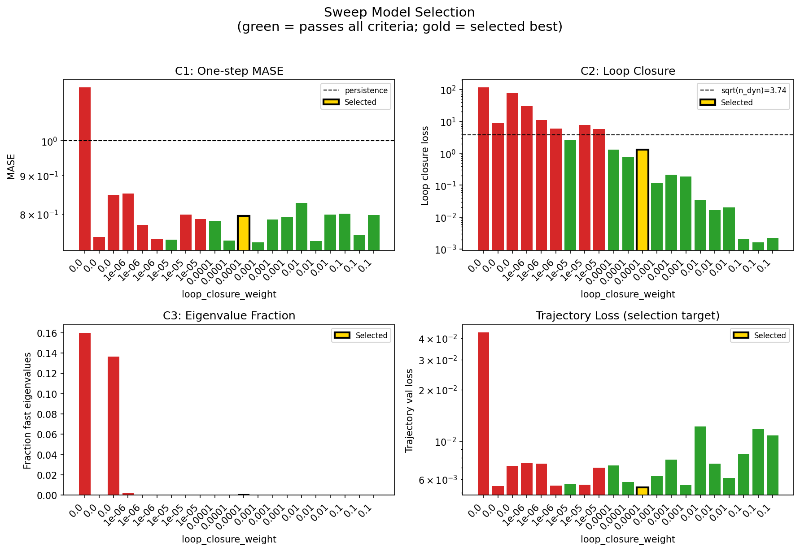

### sweep_pareto

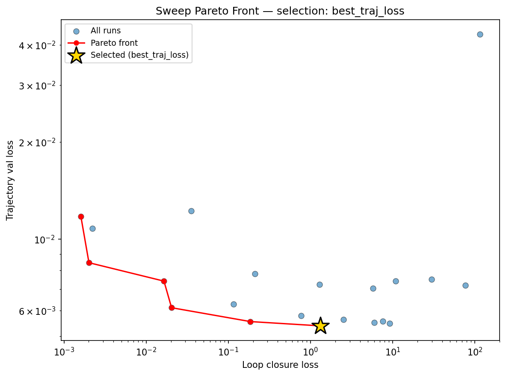

### reconstruction

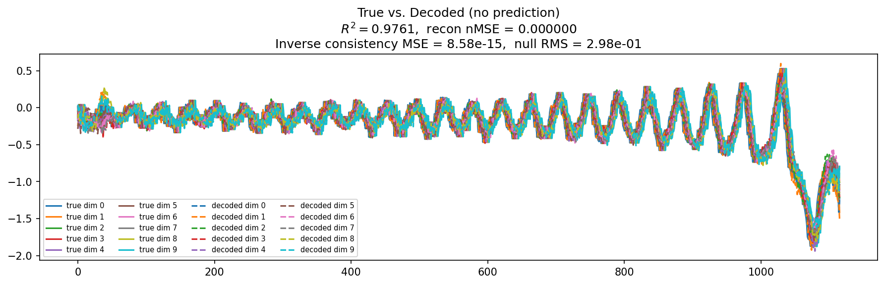

### prediction_windows

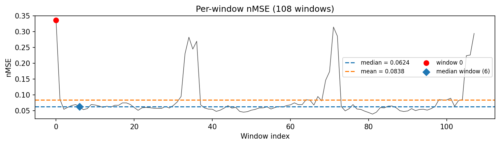

### long_trajectory

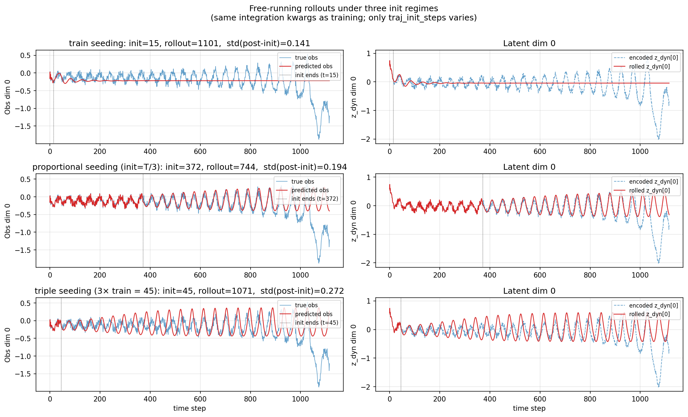

### mase

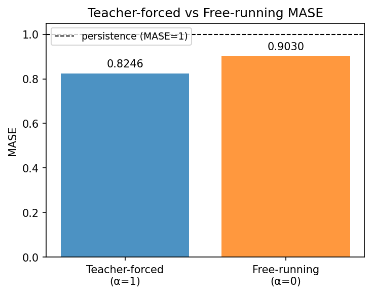

### latent_utilization

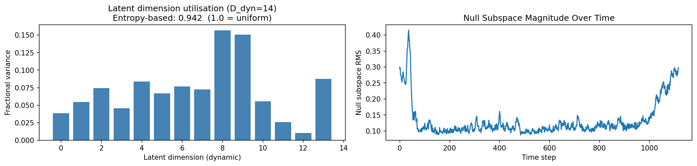

### lyapunov

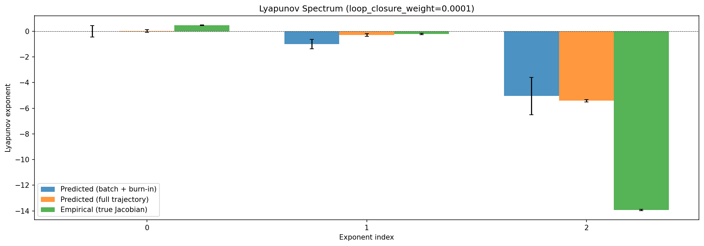

### kaplan_yorke

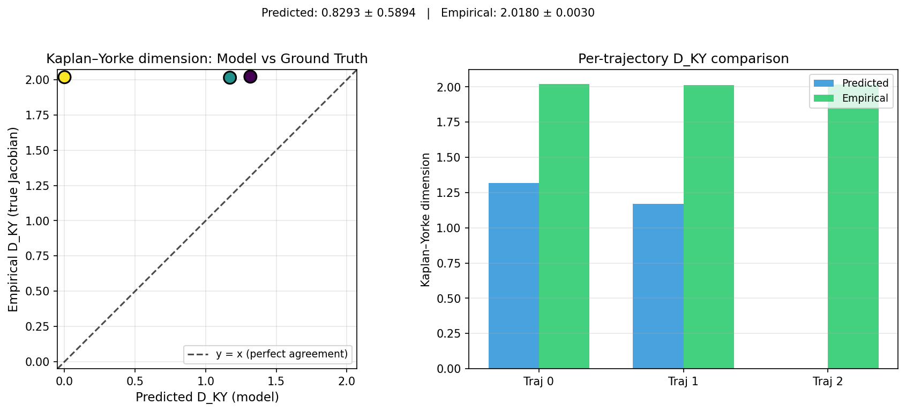

### per_run_lyapunov

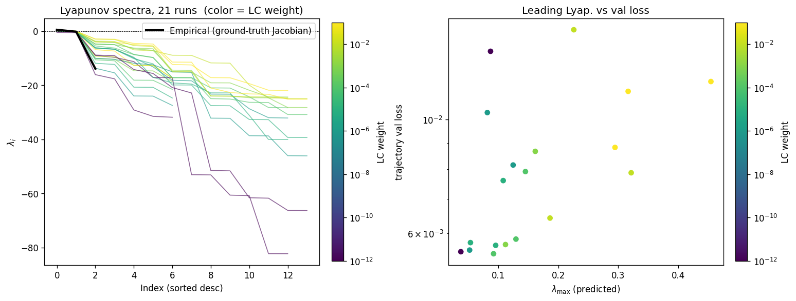

### per_run_lyapunov_vs_true

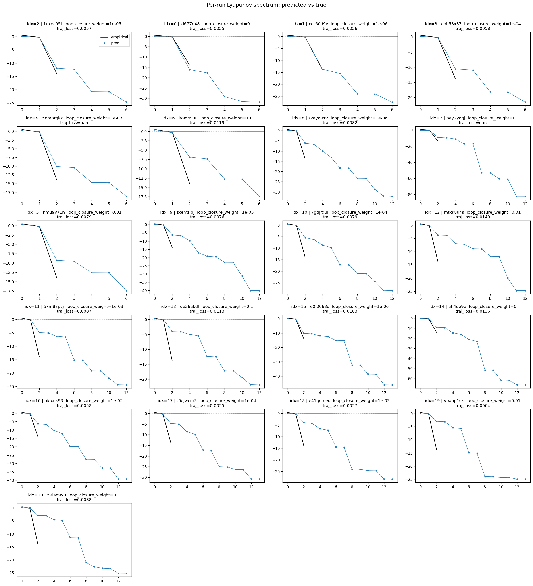

### per_run_lyapunov_relerr

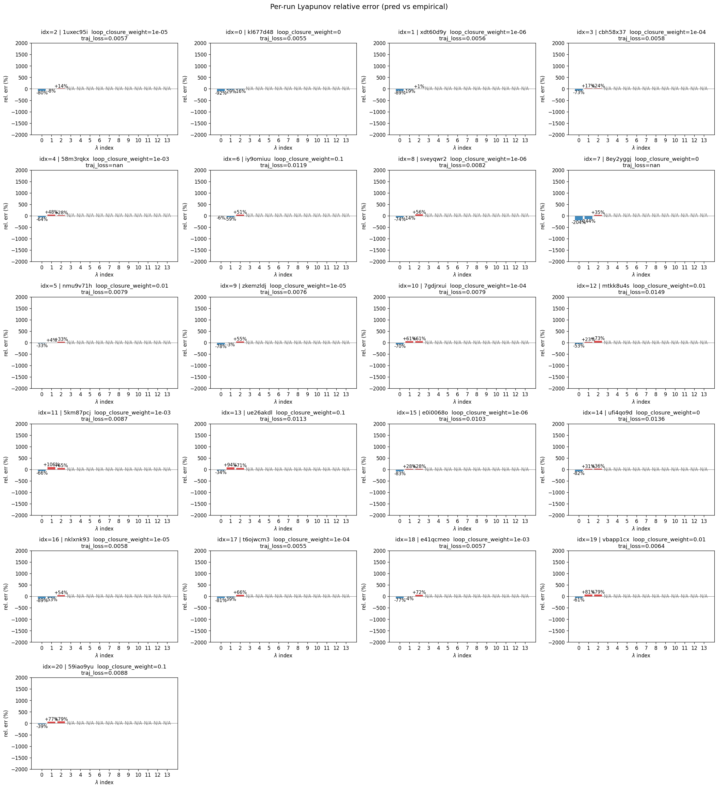

### encoder_decoder_jacobians

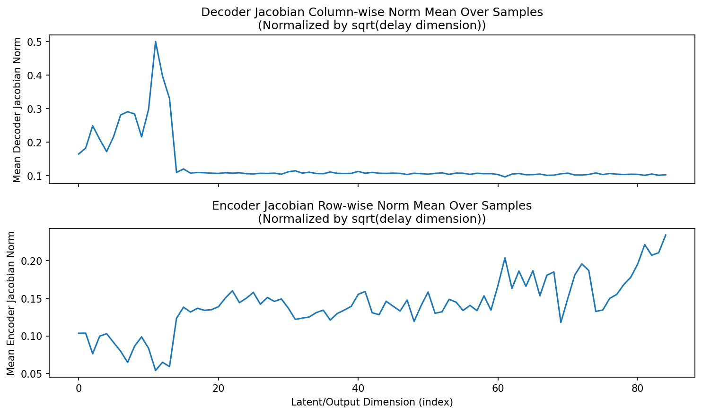

### amplification

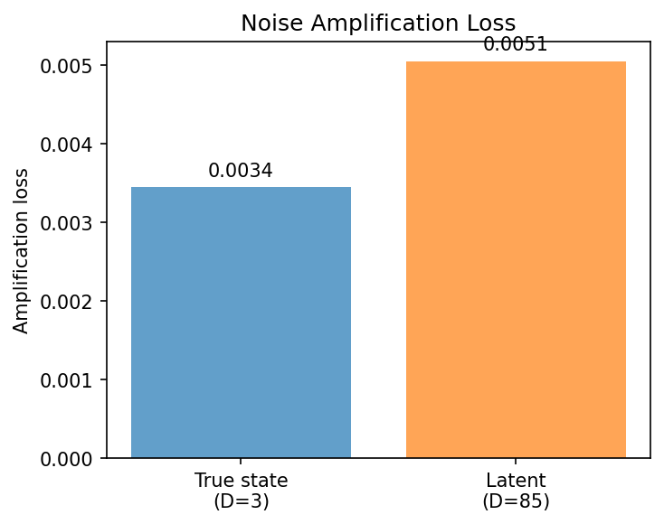

### kaplan_yorke_pca

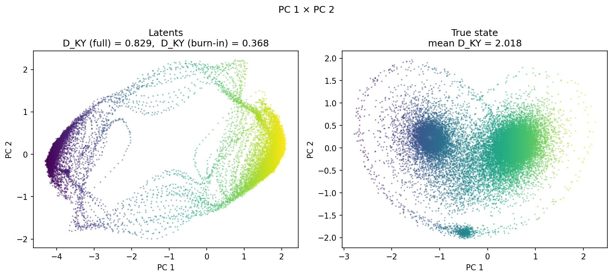

### prediction_detail_latent

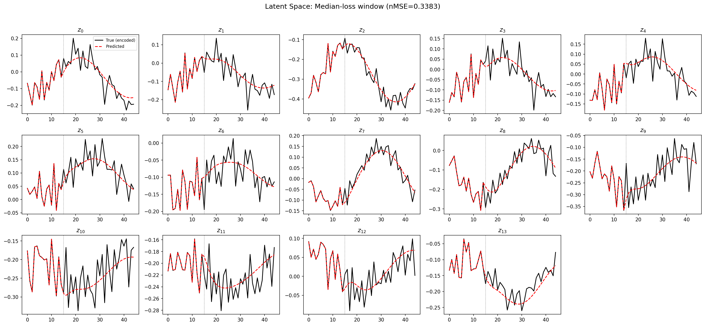

### prediction_detail_obs

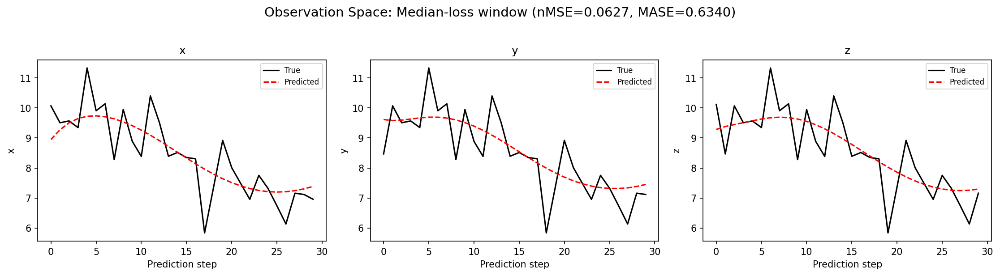

### tangent_spectrum

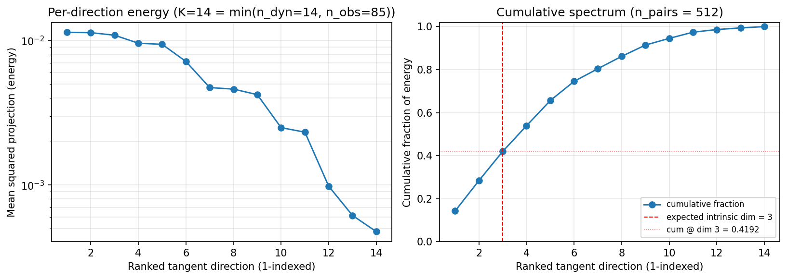

### per_run_tangent_spectrum

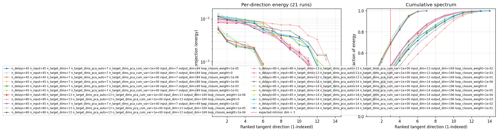

## Discussion

<!--
This section is intentionally left as a placeholder. A human reviewer
or Claude Code agent should fill it in based on the tables and figures
above, explicitly addressing each success criterion and comparing the
outcome to the stated hypothesis. Write the Discussion to
`discussion.md` in this directory and re-run `render_report`.
-->

_(to be written)_

## `run_analytics` stdout

<details><summary>Click to expand — full diagnostic output from <code>run_analytics</code></summary>

```
No run_id provided — selecting best run from group 'lorenz_partial_additive_splitmode_p30_obsnoise005_top3nd_init15_autodim__lc_sweep__step1_int1_maxep80' ...
Found 21 total runs in JacobianODE/Lorenz_INDpartial_NDInitSweep_autodim_D1_NormTrue__JacobianODE (group=lorenz_partial_additive_splitmode_p30_obsnoise005_top3nd_init15_autodim__lc_sweep__step1_int1_maxep80)
All runs (state, loop_closure_weight, tangent_entropy_weight, kl_dyn_weight):
  1uxec95i: state=finished, lc=1e-05, te=0.0, kl_dyn=0.0
  kl677d48: state=finished, lc=0.0, te=0.0, kl_dyn=0.0
  xdt60d9y: state=finished, lc=1e-06, te=0.0, kl_dyn=0.0
  cbh58x37: state=finished, lc=0.0001, te=0.0, kl_dyn=0.0
  58m3rqkx: state=finished, lc=0.001, te=0.0, kl_dyn=0.0
  iy9omiuu: state=finished, lc=0.1, te=0.0, kl_dyn=0.0
  sveyqwr2: state=finished, lc=1e-06, te=0.0, kl_dyn=0.0
  8ey2yggj: state=finished, lc=0.0, te=0.0, kl_dyn=0.0
  nmu9v71h: state=finished, lc=0.01, te=0.0, kl_dyn=0.0
  zkemzldj: state=finished, lc=1e-05, te=0.0, kl_dyn=0.0
  7gdjrxui: state=finished, lc=0.0001, te=0.0, kl_dyn=0.0
  mtkk8u4s: state=finished, lc=0.01, te=0.0, kl_dyn=0.0
  5km87pcj: state=finished, lc=0.001, te=0.0, kl_dyn=0.0
  ue26akdl: state=finished, lc=0.1, te=0.0, kl_dyn=0.0
  e0i0068o: state=finished, lc=1e-06, te=0.0, kl_dyn=0.0
  ufi4qo9d: state=finished, lc=0.0, te=0.0, kl_dyn=0.0
  nklxnk93: state=finished, lc=1e-05, te=0.0, kl_dyn=0.0
  t6ojwcm3: state=finished, lc=0.0001, te=0.0, kl_dyn=0.0
  e41qcmeo: state=finished, lc=0.001, te=0.0, kl_dyn=0.0
  vbapp1cx: state=finished, lc=0.01, te=0.0, kl_dyn=0.0
  59iao9yu: state=finished, lc=0.1, te=0.0, kl_dyn=0.0

slurm_timeout_min not found in any run config — falling back to 180 min
  Including 1uxec95i (lc=1e-05): use_all_runs=True (state=finished)
  Including kl677d48 (lc=0.0): use_all_runs=True (state=finished)
  Including xdt60d9y (lc=1e-06): use_all_runs=True (state=finished)
  Including cbh58x37 (lc=0.0001): use_all_runs=True (state=finished)
  Including 58m3rqkx (lc=0.001): use_all_runs=True (state=finished)
  Including iy9omiuu (lc=0.1): use_all_runs=True (state=finished)
  Including sveyqwr2 (lc=1e-06): use_all_runs=True (state=finished)
  Including 8ey2yggj (lc=0.0): use_all_runs=True (state=finished)
  Including nmu9v71h (lc=0.01): use_all_runs=True (state=finished)
  Including zkemzldj (lc=1e-05): use_all_runs=True (state=finished)
  Including 7gdjrxui (lc=0.0001): use_all_runs=True (state=finished)
  Including mtkk8u4s (lc=0.01): use_all_runs=True (state=finished)
  Including 5km87pcj (lc=0.001): use_all_runs=True (state=finished)
  Including ue26akdl (lc=0.1): use_all_runs=True (state=finished)
  Including e0i0068o (lc=1e-06): use_all_runs=True (state=finished)
  Including ufi4qo9d (lc=0.0): use_all_runs=True (state=finished)
  Including nklxnk93 (lc=1e-05): use_all_runs=True (state=finished)
  Including t6ojwcm3 (lc=0.0001): use_all_runs=True (state=finished)
  Including e41qcmeo (lc=0.001): use_all_runs=True (state=finished)
  Including vbapp1cx (lc=0.01): use_all_runs=True (state=finished)
  Including 59iao9yu (lc=0.1): use_all_runs=True (state=finished)
Found 21 effectively-done sweep runs:
  loop_closure_weight=0.0, tangent_entropy_weight=0.0, kl_dyn_weight=0.0 -> run_id=8ey2yggj
  loop_closure_weight=0.0, tangent_entropy_weight=0.0, kl_dyn_weight=0.0 -> run_id=kl677d48
  loop_closure_weight=0.0, tangent_entropy_weight=0.0, kl_dyn_weight=0.0 -> run_id=ufi4qo9d
  loop_closure_weight=1e-06, tangent_entropy_weight=0.0, kl_dyn_weight=0.0 -> run_id=e0i0068o
  loop_closure_weight=1e-06, tangent_entropy_weight=0.0, kl_dyn_weight=0.0 -> run_id=sveyqwr2
  loop_closure_weight=1e-06, tangent_entropy_weight=0.0, kl_dyn_weight=0.0 -> run_id=xdt60d9y
  loop_closure_weight=1e-05, tangent_entropy_weight=0.0, kl_dyn_weight=0.0 -> run_id=1uxec95i
  loop_closure_weight=1e-05, tangent_entropy_weight=0.0, kl_dyn_weight=0.0 -> run_id=nklxnk93
  loop_closure_weight=1e-05, tangent_entropy_weight=0.0, kl_dyn_weight=0.0 -> run_id=zkemzldj
  loop_closure_weight=0.0001, tangent_entropy_weight=0.0, kl_dyn_weight=0.0 -> run_id=7gdjrxui
  loop_closure_weight=0.0001, tangent_entropy_weight=0.0, kl_dyn_weight=0.0 -> run_id=cbh58x37
  loop_closure_weight=0.0001, tangent_entropy_weight=0.0, kl_dyn_weight=0.0 -> run_id=t6ojwcm3
  loop_closure_weight=0.001, tangent_entropy_weight=0.0, kl_dyn_weight=0.0 -> run_id=58m3rqkx
  loop_closure_weight=0.001, tangent_entropy_weight=0.0, kl_dyn_weight=0.0 -> run_id=5km87pcj
  loop_closure_weight=0.001, tangent_entropy_weight=0.0, kl_dyn_weight=0.0 -> run_id=e41qcmeo
  loop_closure_weight=0.01, tangent_entropy_weight=0.0, kl_dyn_weight=0.0 -> run_id=mtkk8u4s
  loop_closure_weight=0.01, tangent_entropy_weight=0.0, kl_dyn_weight=0.0 -> run_id=nmu9v71h
  loop_closure_weight=0.01, tangent_entropy_weight=0.0, kl_dyn_weight=0.0 -> run_id=vbapp1cx
  loop_closure_weight=0.1, tangent_entropy_weight=0.0, kl_dyn_weight=0.0 -> run_id=59iao9yu
  loop_closure_weight=0.1, tangent_entropy_weight=0.0, kl_dyn_weight=0.0 -> run_id=iy9omiuu
  loop_closure_weight=0.1, tangent_entropy_weight=0.0, kl_dyn_weight=0.0 -> run_id=ue26akdl
n_dims=80, n_latent=80, n_dyn=13, dt=0.0150
  run=8ey2yggj: DiagnosticMetrics(one_step_mase=1.1760138273239136, loop_closure_loss=114.85285949707031, fast_eigenvalue_fraction=0.1599999964237213, trajectory_val_loss=0.04316197708249092) (from W&B history)
  run=kl677d48: DiagnosticMetrics(one_step_mase=0.7458581328392029, loop_closure_loss=9.159311294555664, fast_eigenvalue_fraction=0.0, trajectory_val_loss=0.00548354908823967) (from W&B history)
  run=ufi4qo9d: DiagnosticMetrics(one_step_mase=0.8486980199813843, loop_closure_loss=76.57162475585938, fast_eigenvalue_fraction=0.136428564786911, trajectory_val_loss=0.007198604289442301) (from W&B history)
  run=e0i0068o: DiagnosticMetrics(one_step_mase=0.8518094420433044, loop_closure_loss=29.876296997070312, fast_eigenvalue_fraction=0.002142857061699033, trajectory_val_loss=0.007505582179874182) (from W&B history)
  run=sveyqwr2: DiagnosticMetrics(one_step_mase=0.7743359208106995, loop_closure_loss=10.841922760009766, fast_eigenvalue_fraction=0.0, trajectory_val_loss=0.00740537466481328) (from W&B history)
  run=xdt60d9y: DiagnosticMetrics(one_step_mase=0.7410888671875, loop_closure_loss=5.987114906311035, fast_eigenvalue_fraction=0.0, trajectory_val_loss=0.005518102552741766) (from W&B history)
  run=1uxec95i: DiagnosticMetrics(one_step_mase=0.7401926517486572, loop_closure_loss=2.5333330631256104, fast_eigenvalue_fraction=0.0, trajectory_val_loss=0.005629631690680981) (from W&B history)
  run=nklxnk93: DiagnosticMetrics(one_step_mase=0.7990938425064087, loop_closure_loss=7.5953779220581055, fast_eigenvalue_fraction=0.0, trajectory_val_loss=0.005570418667048216) (from W&B history)
  run=zkemzldj: DiagnosticMetrics(one_step_mase=0.7877763509750366, loop_closure_loss=5.7772932052612305, fast_eigenvalue_fraction=0.0, trajectory_val_loss=0.007030485663563013) (from W&B history)
  run=7gdjrxui: DiagnosticMetrics(one_step_mase=0.7840129137039185, loop_closure_loss=1.2880041599273682, fast_eigenvalue_fraction=0.0, trajectory_val_loss=0.007233723998069763) (from W&B history)
  run=cbh58x37: DiagnosticMetrics(one_step_mase=0.7383485436439514, loop_closure_loss=0.7728196978569031, fast_eigenvalue_fraction=0.0, trajectory_val_loss=0.005796636454761028) (from W&B history)
  run=t6ojwcm3: DiagnosticMetrics(one_step_mase=0.7952678799629211, loop_closure_loss=1.3219488859176636, fast_eigenvalue_fraction=0.0, trajectory_val_loss=0.005382574629038572) (from W&B history)
  run=58m3rqkx: DiagnosticMetrics(one_step_mase=0.7336225509643555, loop_closure_loss=0.11537840217351913, fast_eigenvalue_fraction=0.0, trajectory_val_loss=0.00628487067297101) (from W&B history)
  run=5km87pcj: DiagnosticMetrics(one_step_mase=0.7872591018676758, loop_closure_loss=0.21067243814468384, fast_eigenvalue_fraction=0.0, trajectory_val_loss=0.007800977677106857) (from W&B history)
  run=e41qcmeo: DiagnosticMetrics(one_step_mase=0.7931081652641296, loop_closure_loss=0.18561454117298126, fast_eigenvalue_fraction=0.0, trajectory_val_loss=0.005550103727728128) (from W&B history)
  run=mtkk8u4s: DiagnosticMetrics(one_step_mase=0.8273574709892273, loop_closure_loss=0.03547442704439163, fast_eigenvalue_fraction=0.0, trajectory_val_loss=0.012232600711286068) (from W&B history)
  run=nmu9v71h: DiagnosticMetrics(one_step_mase=0.7369770407676697, loop_closure_loss=0.016471894457936287, fast_eigenvalue_fraction=0.0, trajectory_val_loss=0.0074092852883040905) (from W&B history)
  run=vbapp1cx: DiagnosticMetrics(one_step_mase=0.7985788583755493, loop_closure_loss=0.02038237266242504, fast_eigenvalue_fraction=0.0, trajectory_val_loss=0.006127685774117708) (from W&B history)
  run=59iao9yu: DiagnosticMetrics(one_step_mase=0.8011139035224915, loop_closure_loss=0.0020117645617574453, fast_eigenvalue_fraction=0.0, trajectory_val_loss=0.00845099613070488) (from W&B history)
  run=iy9omiuu: DiagnosticMetrics(one_step_mase=0.750921905040741, loop_closure_loss=0.0016055176965892315, fast_eigenvalue_fraction=0.0, trajectory_val_loss=0.011749627999961376) (from W&B history)
  run=ue26akdl: DiagnosticMetrics(one_step_mase=0.7976939678192139, loop_closure_loss=0.00222789472900331, fast_eigenvalue_fraction=0.0, trajectory_val_loss=0.010797224938869476) (from W&B history)

Ranking method:           best_traj_loss
Best run ID:              t6ojwcm3
Best loop_closure_weight: 0.0001
Best tangent_entropy_weight: 0.0
Best kl_dyn_weight:       0.0
Best traj loss:           0.005383
Criteria applied: ['C1', 'C2', 'C3']
Surviving: 13 / 21
Auto-selected run_id: t6ojwcm3

======================================================================
PARETO FRONTIER RUNS (6 runs)
======================================================================
  Run ID               LC Loss   Traj Val Loss
  ------------  --------------  --------------
  iy9omiuu            0.001606        0.011750
  59iao9yu            0.002012        0.008451
  nmu9v71h            0.016472        0.007409
  vbapp1cx            0.020382        0.006128
  e41qcmeo            0.185615        0.005550
  t6ojwcm3            1.321949        0.005383 <-- selected

======================================================================
RANKING METHOD COMPARISON (over 13 survivors)
======================================================================
  Method                  Run ID               LC Loss   Traj Val Loss
  ----------------------  ------------  --------------  --------------
  best_traj_loss          t6ojwcm3            1.321949        0.005383 <-- active
  pareto_knee             vbapp1cx            0.020382        0.006128
  geo_rank                t6ojwcm3            1.321949        0.005383
  minimax_rank            vbapp1cx            0.020382        0.006128
  geo_log_score           t6ojwcm3            1.321949        0.005383
  minimax_log_score       vbapp1cx            0.020382        0.006128
======================================================================

Loading run t6ojwcm3 from JacobianODE/Lorenz_INDpartial_NDInitSweep_autodim_D1_NormTrue__JacobianODE ...
Loading checkpoint epoch=78-step=15800.ckpt...
Train dataset shape: torch.Size([23562, 45, 85])
Validation dataset shape: torch.Size([7497, 45, 85])
Test dataset shape: torch.Size([3213, 45, 85])
Train trajectories dataset shape: torch.Size([22, 1116, 85])
Validation trajectories dataset shape: torch.Size([7, 1116, 85])
Test trajectories dataset shape: torch.Size([3, 1116, 85])
Loading checkpoint epoch=78-step=15800.ckpt...
Computing reconstruction ...
Computing MASE ...
Teacher-forced MASE: 0.8246
Free-running MASE:   0.9030
Computing latent utilization ...
Entropy-based utilization: 0.942
Null subspace mean RMS: 1.425208e-01
Computing Lyapunov exponents ...
  Computing full-trajectory Lyapunov (3 test trajs, T=1116) ...
Predicted Lyapunov exponents (batch+burn-in, 128 windowed trajs):
  λ_1 = +0.0006 ± 0.4436
  λ_2 = -0.9953 ± 0.3728
  λ_3 = -5.0425 ± 1.4588
  λ_4 = -6.2008 ± 1.4946
  λ_5 = -9.4081 ± 1.9551
  λ_6 = -10.2024 ± 1.2271
  λ_7 = -17.3310 ± 2.2321
  λ_8 = -17.4790 ± 2.1450
  λ_9 = -24.6929 ± 2.1957
  λ_10 = -24.9632 ± 2.2386
  λ_11 = -26.5658 ± 2.6580
  λ_12 = -26.6393 ± 2.6406
  λ_13 = -30.5648 ± 2.4523
  λ_14 = -30.5988 ± 2.4451
Predicted Lyapunov exponents (full-length, 3 test trajs):
  λ_1 = +0.0303 ± 0.1048
  λ_2 = -0.2850 ± 0.1071
  λ_3 = -5.4114 ± 0.0947
  λ_4 = -5.6706 ± 0.1233
  λ_5 = -9.5868 ± 0.0835
  λ_6 = -10.0501 ± 0.0765
  λ_7 = -17.7297 ± 0.0514
  λ_8 = -17.7474 ± 0.0414
  λ_9 = -25.0602 ± 0.0435
  λ_10 = -25.3353 ± 0.0775
  λ_11 = -26.6458 ± 0.1030
  λ_12 = -26.7785 ± 0.0774
  λ_13 = -30.9407 ± 0.0761
  λ_14 = -30.9585 ± 0.0733
Empirical Lyapunov exponents (mean ± std):
  λ_1 = +0.4677 ± 0.0259
  λ_2 = -0.2173 ± 0.0549
  λ_3 = -13.9174 ± 0.0513
Mean KY dim (predicted): 0.829 ± 0.589
Mean KY dim (empirical): 2.018 ± 0.003
Mean KY dim (burn-in):   0.368 ± 0.709
Computing prediction windows ...
Windows: 108 — nMSE min=0.0393, median=0.0624, mean=0.0838, max=0.3361
Computing long-trajectory free-running rollouts ...
Computing encoder/decoder Jacobians ...
encoder_jacobian: (128, 85, 85)
decoder_jacobian: (128, 85, 85)
Computing amplification loss ...
Amplification loss — True state: 0.003446
Amplification loss — Latent:     0.005050
Computing tangent space spectrum ...
```

</details>
