# Sweep Analysis: `lorenz_partial_additive_uniformLC_p30_obsnoise001_nd60_init15_autodim_lc1em4__validation_3x3x3_sweep`

**Project**: [Lorenz_INDpartial_NDInitSweep_autodim_D1_NormTrue__JacobianODE](https://wandb.ai/JacobianODE/Lorenz_INDpartial_NDInitSweep_autodim_D1_NormTrue__JacobianODE/groups/lorenz_partial_additive_uniformLC_p30_obsnoise001_nd60_init15_autodim_lc1em4__validation_3x3x3_sweep)  
**Launched**: 2026-04-23T06:45:10Z  
**Completed**: 2026-04-23T11:00:20Z  
**Outcome**: `complete_clean`  
**Git**: `latent-JacobianODE` @ `0e2315c`  
**Expected runs**: 27

## Experiment Context

### `lorenz_partial_additive_uniformLC_p30_obsnoise001_nd60_init15_autodim_lc1em4__validation_3x3x3_sweep`

**Description**

Lorenz partial additive coupling, obs_noise=0.01, n_delays=60,
prediction_steps=30, traj_init_steps=15, splitmode (most_recent traj
+ uniform recon), final_perm_identity=true, init_pca_basis=false,
fixed LC=1e-4 (winner from prior LC sweep). 27-run validation grid:
3 obs_noise_scale × 3 recon_w × 3 lpl_w.

**Hypothesis**

Three orthogonal axes around the proven-good config:
  - obs_noise_scale {0, 3e-3, 3e-2}: validate the in-flight 4-value
    sweep's expected signal at the winning cell.
  - reconstruction_loss_weight {0.3, 1, 3}: split-mode trajectory
    loss (most_recent) is typically larger than uniform recon —
    scaling recon up rebalances. Expect best at recon_w >= 1.
  - latent_prediction_loss_weight {0, 0.1, 1}: tests whether LPL is
    actively helping at this jointly-trained config. Memory says
    LPL=1 destroys loop closure for fixed-encoder; less clear for
    joint training. lpl_w=0 isolates the trajectory + recon + LC
    signal cleanly.

**Success criteria**

- All 27 runs train without divergence
- Best val traj_loss is at most 2x worse than the winner's 3.98e-4
- Identifies which axis matters most: obs_noise_scale, recon_w, or lpl_w
- Best cell has selection_LC <= sqrt(n_target_dims) (passes C2)

## Results

**Swept axes** (4): `model.n_target_dims_pca_cum_var`, `training.lightning.latent_prediction_loss_weight`, `training.lightning.obs_noise_scale`, `training.lightning.reconstruction_loss_weight`

**Chosen run** (by `best_traj_loss`): `74c0xzf7` — traj_loss=0.00047, MASE=0.5614, R²=0.9987, LC loss=0.187, epoch=116.0

Swept-axis values at chosen run: `model.n_target_dims_pca_cum_var`=0.993171 · `training.lightning.latent_prediction_loss_weight`=1 · `training.lightning.obs_noise_scale`=0 · `training.lightning.reconstruction_loss_weight`=3

**Runs analyzed**: 27 (expected 27)

### Per-run results

| run_idx | run_id | `model.n_target_dims_pca_cum_var` | `training.lightning.latent_prediction_loss_weight` | `training.lightning.obs_noise_scale` | `training.lightning.reconstruction_loss_weight` | best_traj_loss | best_MASE | R² | LC loss | epoch |
|---|---|---|---|---|---|---|---|---|---|---|
| 8 | `74c0xzf7` | 0.993171 | 1 | 0 | 3 | 0.00047 | 0.5614 | 0.9987 | 0.187 | 116.0 |
| 7 | `nojtah7j` | 0.993171 | 0.1 | 0 | 3 | 0.00048 | 0.5491 | 0.9987 | 0.151 | 158.0 |
| 2 | `jkzb2ikp` | 0.993171 | 1 | 0 | 0.3 | 0.00053 | 0.5693 | 0.9985 | 0.115 | 159.0 |
| 5 | `vmz2hdtn` | 0.993171 | 1 | 0 | 1 | 0.00058 | 0.5942 | 0.9984 | 0.161 | 116.0 |
| 13 | `s1v0ehap` | 0.993171 | 0.1 | 0.003 | 1 | 0.00065 | 0.6606 | 0.9982 | 0.487 | 100.0 |
| 1 | `j5dzkckn` | 0.993171 | 0.1 | 0 | 0.3 | 0.00069 | 0.5947 | 0.9980 | 0.151 | 140.0 |
| 4 | `0scgxs7o` | 0.993171 | 0.1 | 0 | 1 | 0.00069 | 0.6215 | 0.9980 | 0.166 | 100.0 |
| 16 | `1v0ucgvg` | 0.993171 | 0.1 | 0.003 | 3 | 0.00143 | 0.7876 | 0.9960 | 0.537 | 97.0 |
| 11 | `hz3vypjh` | 0.993171 | 1 | 0.003 | 0.3 | 0.00791 | 1.6450 | 0.9789 | 0.442 | 23.0 |
| 10 | `0gnyd1id` | 0.993171 | 0.1 | 0.003 | 0.3 | 0.00868 | 1.6657 | 0.9761 | 0.438 | 18.0 |
| 14 | `atnlnb9g` | 0.993171 | 1 | 0.003 | 1 | 0.00995 | 1.8676 | 0.9727 | 0.525 | 11.0 |
| 9 | `i7gihgjd` | 0.993171 | 0 | 0.003 | 0.3 | 0.01166 | 1.6024 | 0.9687 | 0.490 | 57.0 |
| 0 | `7a4n6gqg` | 0.993171 | 0 | 0 | 0.3 | 0.02921 | 3.2009 | 0.9207 | 0.080 | 49.0 |
| 17 | `xs1h31i3` | 0.993171 | 1 | 0.003 | 3 | 0.04130 | 3.5781 | 0.8886 | 1.946 | 4.0 |
| 3 | `jgfik12w` | 0.993171 | 0 | 0 | 1 | 0.04182 | 3.4718 | 0.8874 | 0.275 | 37.0 |
| 6 | `42gc2703` | 0.993171 | 0 | 0 | 3 | nan | nan | nan | 0.080 | — |
| 25 | `374mgxz9` | 0.993171 | 0.1 | 0.03 | 3 | 0.08524 | 8.3108 | 0.7707 | 0.515 | 2.0 |
| 26 | `u9ztrnn6` | 0.993171 | 1 | 0.03 | 3 | 0.08698 | 8.1785 | 0.7644 | 2.456 | 10.0 |
| 20 | `2n38p014` | 0.993171 | 1 | 0.03 | 0.3 | 0.09039 | 8.5742 | 0.7563 | 0.002 | 1.0 |
| 23 | `00cx66oo` | 0.993171 | 1 | 0.03 | 1 | 0.09108 | 8.6170 | 0.7551 | 0.005 | — |
| 22 | `cz3frtd8` | 0.993171 | 0.1 | 0.03 | 1 | 0.09143 | 8.6460 | 0.7542 | 0.046 | — |
| 19 | `yplnffa6` | 0.993171 | 0.1 | 0.03 | 0.3 | 0.09230 | 8.6837 | 0.7517 | 0.035 | — |
| 24 | `h0oqrnra` | 0.993171 | 0 | 0.03 | 3 | 0.09329 | 8.7673 | 0.7491 | 0.428 | — |
| 21 | `semlzcnd` | 0.993171 | 0 | 0.03 | 1 | 0.10869 | 9.5152 | 0.7072 | 0.233 | — |
| 18 | `sed3nwvt` | 0.993171 | 0 | 0.03 | 0.3 | 0.12927 | 10.1891 | 0.6512 | 0.124 | — |
| 12 | `q6qozbt8` | 0.993171 | 0 | 0.003 | 1 | 0.31320 | 12.6050 | 0.1512 | 0.046 | — |
| 15 | `f4meg5oy` | 0.993171 | 0 | 0.003 | 3 | 7.91853 | 47.3983 | -20.5079 | 0.133 | — |

### Best run per `obs_noise_scale`

| obs_noise_scale | Best LC weight | Best traj loss | MASE at best | R² | LC loss | epoch |
|---|---|---|---|---|---|---|
| 0.0 | 1.0e-04 | 0.00047 | 0.5614 | 0.9987 | 0.187 | 116.0 |
| 0.003 | 1.0e-04 | 0.00065 | 0.6606 | 0.9982 | 0.487 | 100.0 |
| 0.03 | 1.0e-04 | 0.08524 | 8.3108 | 0.7707 | 0.515 | 2.0 |

## Success-criteria verdicts (automated)

| Criterion | Verdict | Note |
|---|---|---|
| All 27 runs train without divergence | **Unknown** |  |
| Best val traj_loss is at most 2x worse than the winner's 3.98e-4 | **Unknown** |  |
| Identifies which axis matters most: obs_noise_scale, recon_w, or lpl_w | **Unknown** |  |
| Best cell has selection_LC <= sqrt(n_target_dims) (passes C2) | **Unknown** |  |

_Automated verdicts use simple numeric-threshold parsing and may mis-classify qualitative criteria. The Discussion section below takes precedence._

## Figures

### sweep_overview

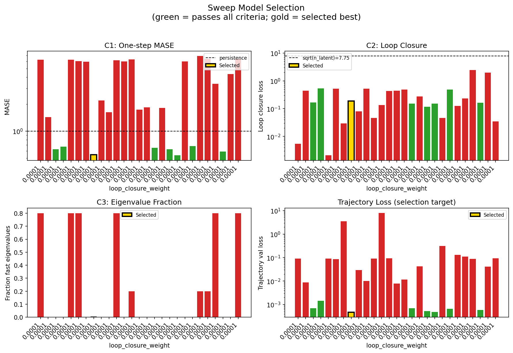

### sweep_pareto

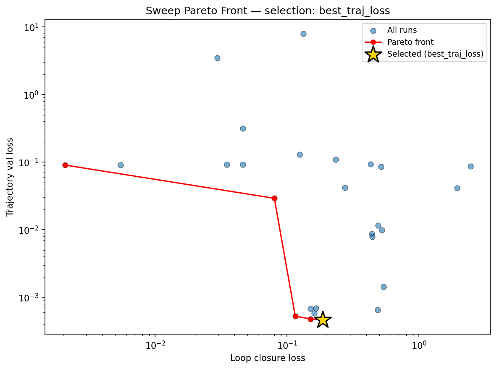

### reconstruction

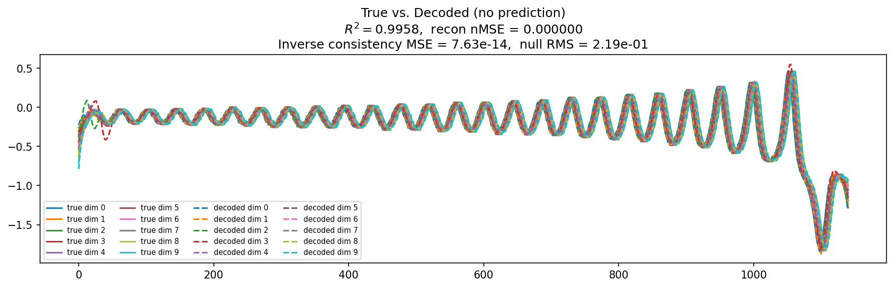

### prediction_windows

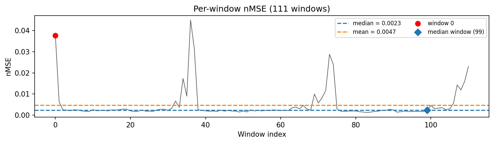

### long_trajectory

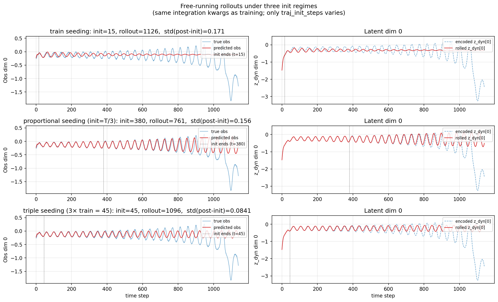

### mase

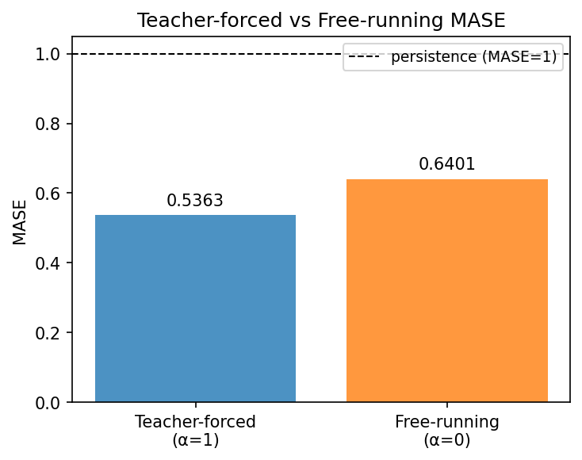

### latent_utilization

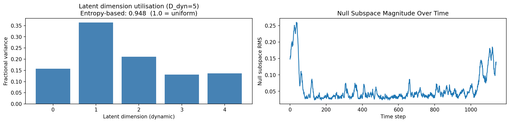

### lyapunov

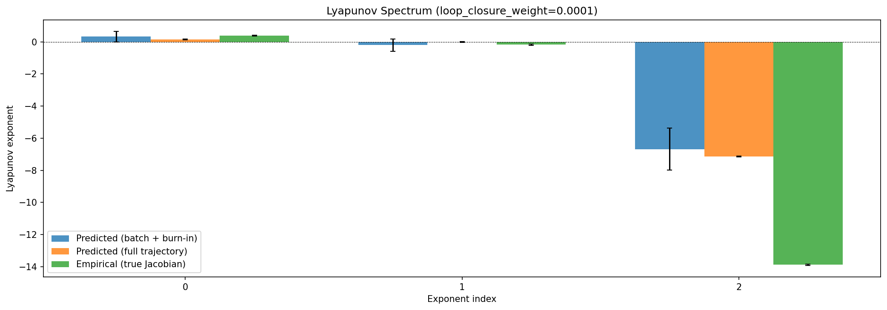

### kaplan_yorke

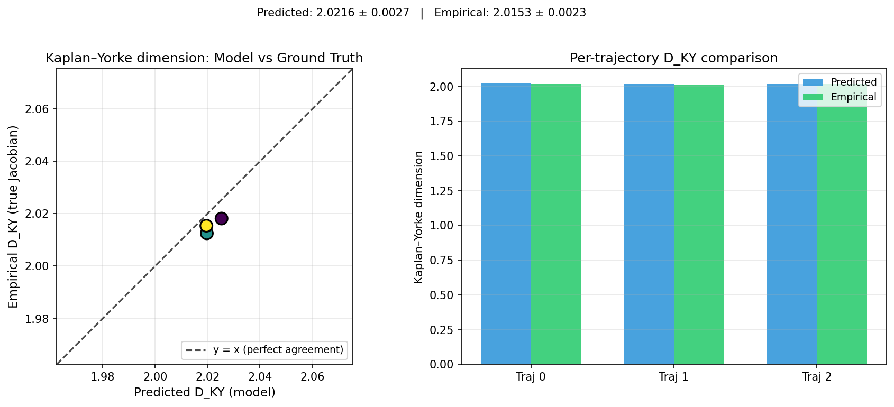

### per_run_lyapunov

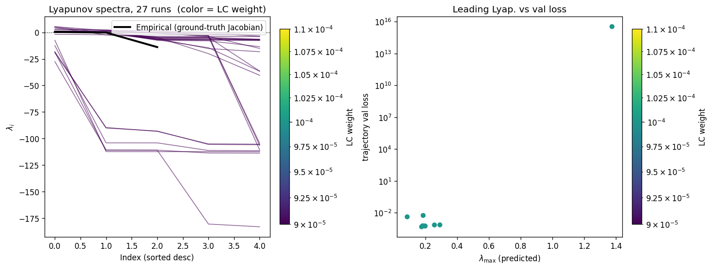

### per_run_lyapunov_vs_true

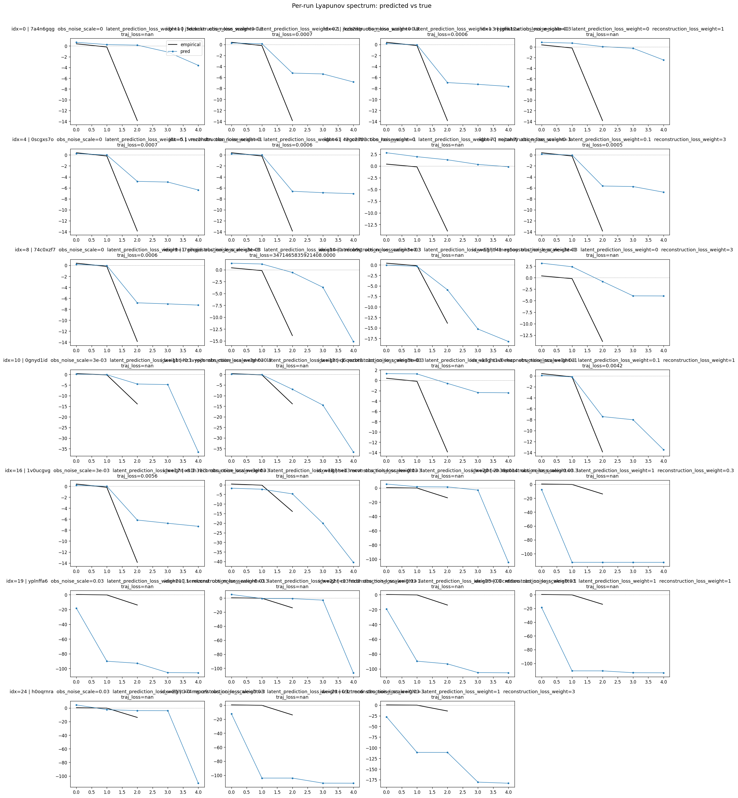

### per_run_lyapunov_relerr

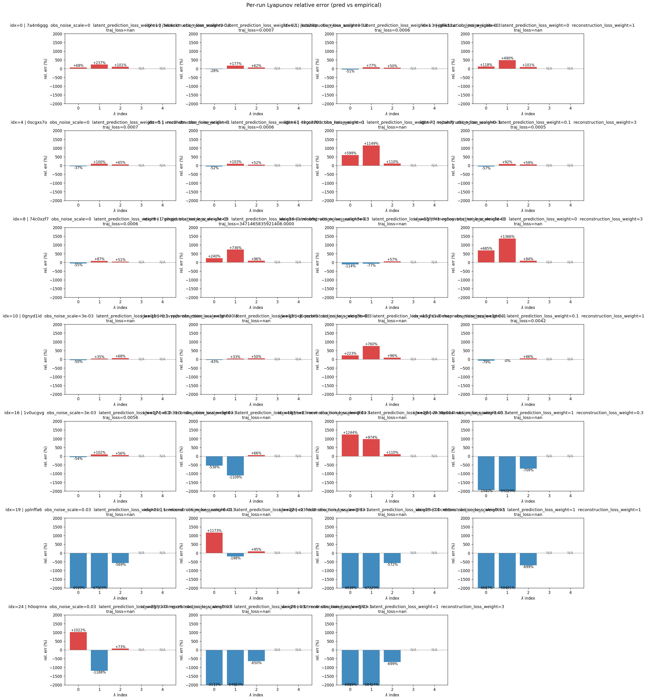

### encoder_decoder_jacobians

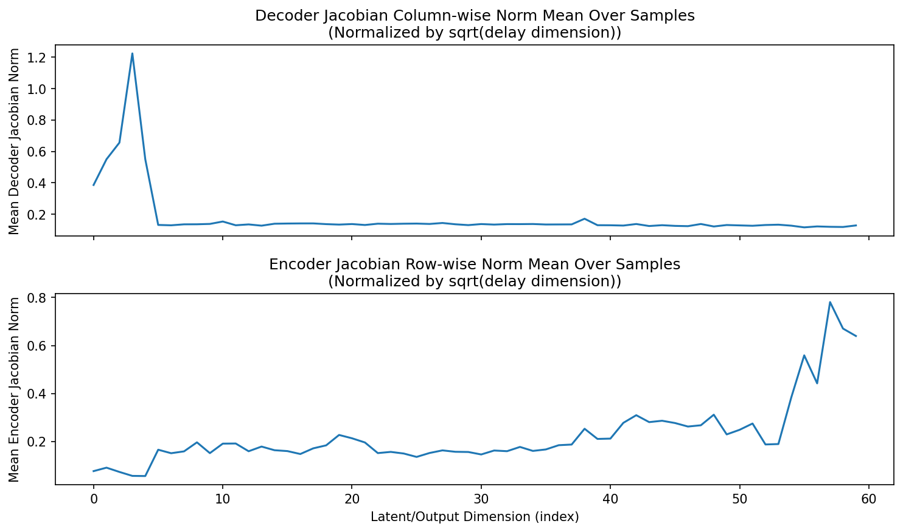

### amplification

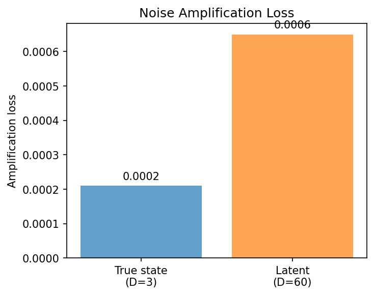

### kaplan_yorke_pca

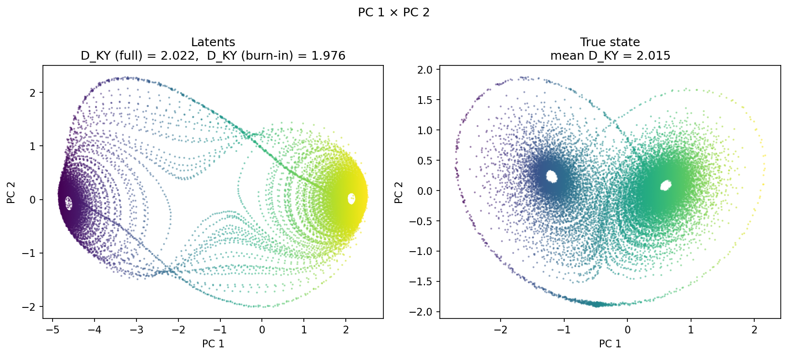

### prediction_detail_latent

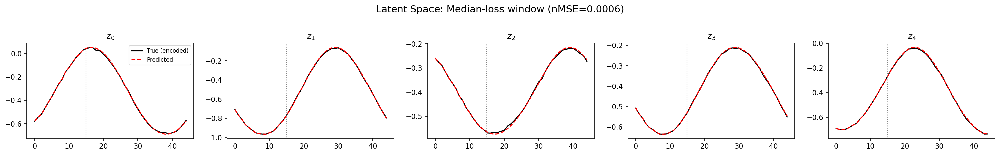

### prediction_detail_obs

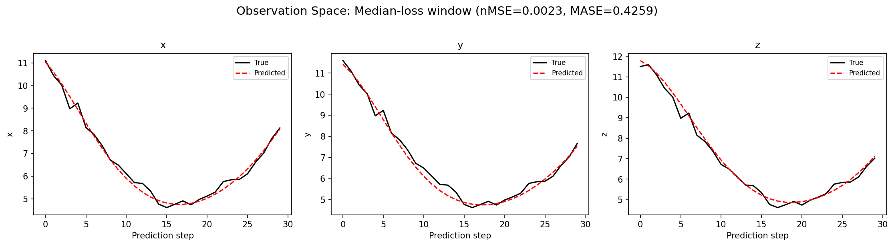

### tangent_spectrum

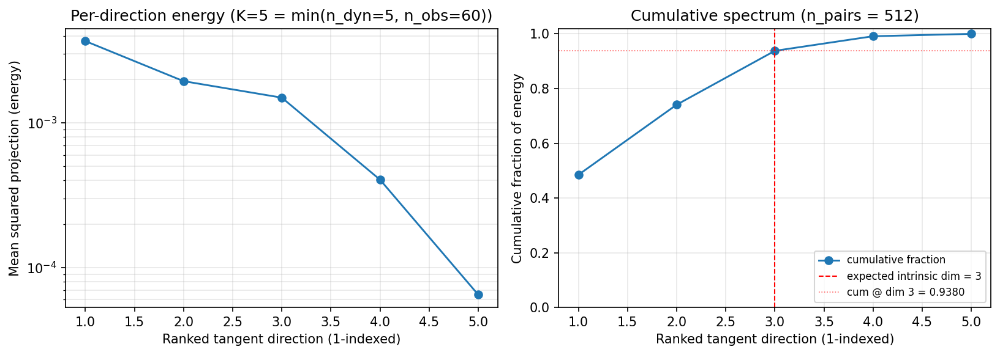

### per_run_tangent_spectrum

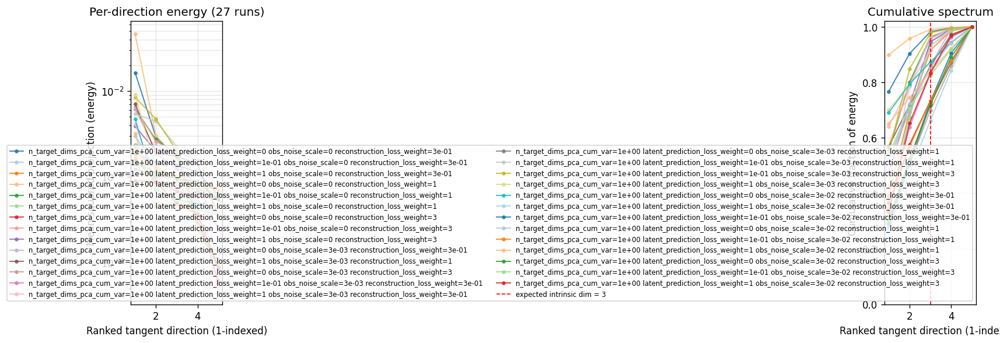

## Discussion

<!--
This section is intentionally left as a placeholder. A human reviewer
or Claude Code agent should fill it in based on the tables and figures
above, explicitly addressing each success criterion and comparing the
outcome to the stated hypothesis. Write the Discussion to
`discussion.md` in this directory and re-run `render_report`.
-->

_(to be written)_

## `run_analytics` stdout

<details><summary>Click to expand — full diagnostic output from <code>run_analytics</code></summary>

```
No run_id provided — selecting best run from group 'lorenz_partial_additive_uniformLC_p30_obsnoise001_nd60_init15_autodim_lc1em4__validation_3x3x3_sweep' ...
Found 27 total runs in JacobianODE/Lorenz_INDpartial_NDInitSweep_autodim_D1_NormTrue__JacobianODE (group=lorenz_partial_additive_uniformLC_p30_obsnoise001_nd60_init15_autodim_lc1em4__validation_3x3x3_sweep)
All runs (state, loop_closure_weight, tangent_entropy_weight, kl_dyn_weight):
  7a4n6gqg: state=finished, lc=0.0001, te=0.0, kl_dyn=0.0
  j5dzkckn: state=finished, lc=0.0001, te=0.0, kl_dyn=0.0
  jkzb2ikp: state=finished, lc=0.0001, te=0.0, kl_dyn=0.0
  jgfik12w: state=finished, lc=0.0001, te=0.0, kl_dyn=0.0
  0scgxs7o: state=finished, lc=0.0001, te=0.0, kl_dyn=0.0
  vmz2hdtn: state=finished, lc=0.0001, te=0.0, kl_dyn=0.0
  42gc2703: state=finished, lc=0.0001, te=0.0, kl_dyn=0.0
  nojtah7j: state=finished, lc=0.0001, te=0.0, kl_dyn=0.0
  74c0xzf7: state=finished, lc=0.0001, te=0.0, kl_dyn=0.0
  i7gihgjd: state=finished, lc=0.0001, te=0.0, kl_dyn=0.0
  atnlnb9g: state=finished, lc=0.0001, te=0.0, kl_dyn=0.0
  f4meg5oy: state=finished, lc=0.0001, te=0.0, kl_dyn=0.0
  0gnyd1id: state=finished, lc=0.0001, te=0.0, kl_dyn=0.0
  hz3vypjh: state=finished, lc=0.0001, te=0.0, kl_dyn=0.0
  q6qozbt8: state=finished, lc=0.0001, te=0.0, kl_dyn=0.0
  s1v0ehap: state=finished, lc=0.0001, te=0.0, kl_dyn=0.0
  1v0ucgvg: state=finished, lc=0.0001, te=0.0, kl_dyn=0.0
  xs1h31i3: state=finished, lc=0.0001, te=0.0, kl_dyn=0.0
  sed3nwvt: state=finished, lc=0.0001, te=0.0, kl_dyn=0.0
  2n38p014: state=finished, lc=0.0001, te=0.0, kl_dyn=0.0
  yplnffa6: state=finished, lc=0.0001, te=0.0, kl_dyn=0.0
  semlzcnd: state=finished, lc=0.0001, te=0.0, kl_dyn=0.0
  cz3frtd8: state=finished, lc=0.0001, te=0.0, kl_dyn=0.0
  00cx66oo: state=finished, lc=0.0001, te=0.0, kl_dyn=0.0
  h0oqrnra: state=finished, lc=0.0001, te=0.0, kl_dyn=0.0
  374mgxz9: state=finished, lc=0.0001, te=0.0, kl_dyn=0.0
  u9ztrnn6: state=finished, lc=0.0001, te=0.0, kl_dyn=0.0

slurm_timeout_min not found in any run config — falling back to 180 min
  Including 7a4n6gqg (lc=0.0001): use_all_runs=True (state=finished)
  Including j5dzkckn (lc=0.0001): use_all_runs=True (state=finished)
  Including jkzb2ikp (lc=0.0001): use_all_runs=True (state=finished)
  Including jgfik12w (lc=0.0001): use_all_runs=True (state=finished)
  Including 0scgxs7o (lc=0.0001): use_all_runs=True (state=finished)
  Including vmz2hdtn (lc=0.0001): use_all_runs=True (state=finished)
  Including 42gc2703 (lc=0.0001): use_all_runs=True (state=finished)
  Including nojtah7j (lc=0.0001): use_all_runs=True (state=finished)
  Including 74c0xzf7 (lc=0.0001): use_all_runs=True (state=finished)
  Including i7gihgjd (lc=0.0001): use_all_runs=True (state=finished)
  Including atnlnb9g (lc=0.0001): use_all_runs=True (state=finished)
  Including f4meg5oy (lc=0.0001): use_all_runs=True (state=finished)
  Including 0gnyd1id (lc=0.0001): use_all_runs=True (state=finished)
  Including hz3vypjh (lc=0.0001): use_all_runs=True (state=finished)
  Including q6qozbt8 (lc=0.0001): use_all_runs=True (state=finished)
  Including s1v0ehap (lc=0.0001): use_all_runs=True (state=finished)
  Including 1v0ucgvg (lc=0.0001): use_all_runs=True (state=finished)
  Including xs1h31i3 (lc=0.0001): use_all_runs=True (state=finished)
  Including sed3nwvt (lc=0.0001): use_all_runs=True (state=finished)
  Including 2n38p014 (lc=0.0001): use_all_runs=True (state=finished)
  Including yplnffa6 (lc=0.0001): use_all_runs=True (state=finished)
  Including semlzcnd (lc=0.0001): use_all_runs=True (state=finished)
  Including cz3frtd8 (lc=0.0001): use_all_runs=True (state=finished)
  Including 00cx66oo (lc=0.0001): use_all_runs=True (state=finished)
  Including h0oqrnra (lc=0.0001): use_all_runs=True (state=finished)
  Including 374mgxz9 (lc=0.0001): use_all_runs=True (state=finished)
  Including u9ztrnn6 (lc=0.0001): use_all_runs=True (state=finished)
Found 27 effectively-done sweep runs:
  loop_closure_weight=0.0001, tangent_entropy_weight=0.0, kl_dyn_weight=0.0 -> run_id=00cx66oo
  loop_closure_weight=0.0001, tangent_entropy_weight=0.0, kl_dyn_weight=0.0 -> run_id=0gnyd1id
  loop_closure_weight=0.0001, tangent_entropy_weight=0.0, kl_dyn_weight=0.0 -> run_id=0scgxs7o
  loop_closure_weight=0.0001, tangent_entropy_weight=0.0, kl_dyn_weight=0.0 -> run_id=1v0ucgvg
  loop_closure_weight=0.0001, tangent_entropy_weight=0.0, kl_dyn_weight=0.0 -> run_id=2n38p014
  loop_closure_weight=0.0001, tangent_entropy_weight=0.0, kl_dyn_weight=0.0 -> run_id=374mgxz9
  loop_closure_weight=0.0001, tangent_entropy_weight=0.0, kl_dyn_weight=0.0 -> run_id=42gc2703
  loop_closure_weight=0.0001, tangent_entropy_weight=0.0, kl_dyn_weight=0.0 -> run_id=74c0xzf7
  loop_closure_weight=0.0001, tangent_entropy_weight=0.0, kl_dyn_weight=0.0 -> run_id=7a4n6gqg
  loop_closure_weight=0.0001, tangent_entropy_weight=0.0, kl_dyn_weight=0.0 -> run_id=atnlnb9g
  loop_closure_weight=0.0001, tangent_entropy_weight=0.0, kl_dyn_weight=0.0 -> run_id=cz3frtd8
  loop_closure_weight=0.0001, tangent_entropy_weight=0.0, kl_dyn_weight=0.0 -> run_id=f4meg5oy
  loop_closure_weight=0.0001, tangent_entropy_weight=0.0, kl_dyn_weight=0.0 -> run_id=h0oqrnra
  loop_closure_weight=0.0001, tangent_entropy_weight=0.0, kl_dyn_weight=0.0 -> run_id=hz3vypjh
  loop_closure_weight=0.0001, tangent_entropy_weight=0.0, kl_dyn_weight=0.0 -> run_id=i7gihgjd
  loop_closure_weight=0.0001, tangent_entropy_weight=0.0, kl_dyn_weight=0.0 -> run_id=j5dzkckn
  loop_closure_weight=0.0001, tangent_entropy_weight=0.0, kl_dyn_weight=0.0 -> run_id=jgfik12w
  loop_closure_weight=0.0001, tangent_entropy_weight=0.0, kl_dyn_weight=0.0 -> run_id=jkzb2ikp
  loop_closure_weight=0.0001, tangent_entropy_weight=0.0, kl_dyn_weight=0.0 -> run_id=nojtah7j
  loop_closure_weight=0.0001, tangent_entropy_weight=0.0, kl_dyn_weight=0.0 -> run_id=q6qozbt8
  loop_closure_weight=0.0001, tangent_entropy_weight=0.0, kl_dyn_weight=0.0 -> run_id=s1v0ehap
  loop_closure_weight=0.0001, tangent_entropy_weight=0.0, kl_dyn_weight=0.0 -> run_id=sed3nwvt
  loop_closure_weight=0.0001, tangent_entropy_weight=0.0, kl_dyn_weight=0.0 -> run_id=semlzcnd
  loop_closure_weight=0.0001, tangent_entropy_weight=0.0, kl_dyn_weight=0.0 -> run_id=u9ztrnn6
  loop_closure_weight=0.0001, tangent_entropy_weight=0.0, kl_dyn_weight=0.0 -> run_id=vmz2hdtn
  loop_closure_weight=0.0001, tangent_entropy_weight=0.0, kl_dyn_weight=0.0 -> run_id=xs1h31i3
  loop_closure_weight=0.0001, tangent_entropy_weight=0.0, kl_dyn_weight=0.0 -> run_id=yplnffa6
n_dims=60, n_latent=60, n_dyn=5, dt=0.0150
  run=00cx66oo: DiagnosticMetrics(one_step_mase=6.256218910217285, loop_closure_loss=0.005482424050569534, fast_eigenvalue_fraction=0.800000011920929, trajectory_val_loss=0.09108421206474304) (from W&B history)
  run=0gnyd1id: DiagnosticMetrics(one_step_mase=1.43284010887146, loop_closure_loss=0.4384380280971527, fast_eigenvalue_fraction=0.0, trajectory_val_loss=0.008683844469487667) (from W&B history)
  run=0scgxs7o: DiagnosticMetrics(one_step_mase=0.6257921457290649, loop_closure_loss=0.1660224348306656, fast_eigenvalue_fraction=0.0, trajectory_val_loss=0.0006913045071996748) (from W&B history)
  run=1v0ucgvg: DiagnosticMetrics(one_step_mase=0.6691833138465881, loop_closure_loss=0.5372636318206787, fast_eigenvalue_fraction=0.0, trajectory_val_loss=0.0014305236982181668) (from W&B history)
  run=2n38p014: DiagnosticMetrics(one_step_mase=6.261649131774902, loop_closure_loss=0.0020803813822567463, fast_eigenvalue_fraction=0.800000011920929, trajectory_val_loss=0.09038642048835754) (from W&B history)
  run=374mgxz9: DiagnosticMetrics(one_step_mase=6.020106315612793, loop_closure_loss=0.514611542224884, fast_eigenvalue_fraction=0.800000011920929, trajectory_val_loss=0.08523919433355331) (from W&B history)
  run=42gc2703: DiagnosticMetrics(one_step_mase=5.959017276763916, loop_closure_loss=0.029621947556734085, fast_eigenvalue_fraction=0.0, trajectory_val_loss=3.4790449142456055) (from W&B history)
  run=74c0xzf7: DiagnosticMetrics(one_step_mase=0.5448904037475586, loop_closure_loss=0.1866375207901001, fast_eigenvalue_fraction=0.0, trajectory_val_loss=0.0004662402207031846) (from W&B history)
  run=7a4n6gqg: DiagnosticMetrics(one_step_mase=2.1912646293640137, loop_closure_loss=0.08006828278303146, fast_eigenvalue_fraction=0.0, trajectory_val_loss=0.02920607291162014) (from W&B history)
  run=atnlnb9g: DiagnosticMetrics(one_step_mase=1.6272836923599243, loop_closure_loss=0.5249913930892944, fast_eigenvalue_fraction=0.0, trajectory_val_loss=0.009946111589670181) (from W&B history)
  run=cz3frtd8: DiagnosticMetrics(one_step_mase=6.15846061706543, loop_closure_loss=0.046090345829725266, fast_eigenvalue_fraction=0.800000011920929, trajectory_val_loss=0.09142646938562393) (from W&B history)
  run=f4meg5oy: DiagnosticMetrics(one_step_mase=6.011078357696533, loop_closure_loss=0.13304120302200317, fast_eigenvalue_fraction=0.0, trajectory_val_loss=7.918525218963623) (from W&B history)
  run=h0oqrnra: DiagnosticMetrics(one_step_mase=6.296809673309326, loop_closure_loss=0.4281613826751709, fast_eigenvalue_fraction=0.20000000298023224, trajectory_val_loss=0.09329237788915634) (from W&B history)
  run=hz3vypjh: DiagnosticMetrics(one_step_mase=1.7285279035568237, loop_closure_loss=0.44220104813575745, fast_eigenvalue_fraction=0.0, trajectory_val_loss=0.007914843037724495) (from W&B history)
  run=i7gihgjd: DiagnosticMetrics(one_step_mase=1.841811180114746, loop_closure_loss=0.48970291018486023, fast_eigenvalue_fraction=0.0, trajectory_val_loss=0.011664340272545815) (from W&B history)
  run=j5dzkckn: DiagnosticMetrics(one_step_mase=0.6484943628311157, loop_closure_loss=0.15062889456748962, fast_eigenvalue_fraction=0.0, trajectory_val_loss=0.0006866564508527517) (from W&B history)
  run=jgfik12w: DiagnosticMetrics(one_step_mase=1.8171162605285645, loop_closure_loss=0.2751888632774353, fast_eigenvalue_fraction=0.0, trajectory_val_loss=0.04182140901684761) (from W&B history)
  run=jkzb2ikp: DiagnosticMetrics(one_step_mase=0.6277046799659729, loop_closure_loss=0.11539290100336075, fast_eigenvalue_fraction=0.0, trajectory_val_loss=0.0005272146081551909) (from W&B history)
  run=nojtah7j: DiagnosticMetrics(one_step_mase=0.5349944829940796, loop_closure_loss=0.15085172653198242, fast_eigenvalue_fraction=0.0, trajectory_val_loss=0.00048034294741228223) (from W&B history)
  run=q6qozbt8: DiagnosticMetrics(one_step_mase=5.998361587524414, loop_closure_loss=0.046220120042562485, fast_eigenvalue_fraction=0.0, trajectory_val_loss=0.3132022023200989) (from W&B history)
  run=s1v0ehap: DiagnosticMetrics(one_step_mase=0.6774917840957642, loop_closure_loss=0.4865623116493225, fast_eigenvalue_fraction=0.0, trajectory_val_loss=0.0006520866882055998) (from W&B history)
  run=sed3nwvt: DiagnosticMetrics(one_step_mase=6.875199794769287, loop_closure_loss=0.12395723164081573, fast_eigenvalue_fraction=0.20000000298023224, trajectory_val_loss=0.12926781177520752) (from W&B history)
  run=semlzcnd: DiagnosticMetrics(one_step_mase=6.397987365722656, loop_closure_loss=0.23277951776981354, fast_eigenvalue_fraction=0.20000000298023224, trajectory_val_loss=0.10868995636701584) (from W&B history)
  run=u9ztrnn6: DiagnosticMetrics(one_step_mase=3.371138095855713, loop_closure_loss=2.455885887145996, fast_eigenvalue_fraction=0.800000011920929, trajectory_val_loss=0.08698488026857376) (from W&B history)
  run=vmz2hdtn: DiagnosticMetrics(one_step_mase=0.5898659825325012, loop_closure_loss=0.16086150705814362, fast_eigenvalue_fraction=0.0, trajectory_val_loss=0.0005827464046888053) (from W&B history)
  run=xs1h31i3: DiagnosticMetrics(one_step_mase=4.339137077331543, loop_closure_loss=1.946221947669983, fast_eigenvalue_fraction=0.0, trajectory_val_loss=0.04130418598651886) (from W&B history)
  run=yplnffa6: DiagnosticMetrics(one_step_mase=6.3901519775390625, loop_closure_loss=0.03484601899981499, fast_eigenvalue_fraction=0.800000011920929, trajectory_val_loss=0.09230495244264603) (from W&B history)

Ranking method:           best_traj_loss
Best run ID:              74c0xzf7
Best loop_closure_weight: 0.0001
Best tangent_entropy_weight: 0.0
Best kl_dyn_weight:       0.0
Best traj loss:           0.000466
Criteria applied: ['C1', 'C2', 'C3']
Surviving: 8 / 27
Auto-selected run_id: 74c0xzf7

======================================================================
PARETO FRONTIER RUNS (5 runs)
======================================================================
  Run ID               LC Loss   Traj Val Loss
  ------------  --------------  --------------
  2n38p014            0.002080        0.090386
  7a4n6gqg            0.080068        0.029206
  jkzb2ikp            0.115393        0.000527
  nojtah7j            0.150852        0.000480
  74c0xzf7            0.186638        0.000466 <-- selected

======================================================================
RANKING METHOD COMPARISON (over 8 survivors)
======================================================================
  Method                  Run ID               LC Loss   Traj Val Loss
  ----------------------  ------------  --------------  --------------
  best_traj_loss          74c0xzf7            0.186638        0.000466 <-- active
  pareto_knee             nojtah7j            0.150852        0.000480
  geo_rank                jkzb2ikp            0.115393        0.000527
  minimax_rank            jkzb2ikp            0.115393        0.000527
  geo_log_score           74c0xzf7            0.186638        0.000466
  minimax_log_score       jkzb2ikp            0.115393        0.000527
======================================================================

Loading run 74c0xzf7 from JacobianODE/Lorenz_INDpartial_NDInitSweep_autodim_D1_NormTrue__JacobianODE ...
Train dataset shape: torch.Size([24112, 45, 60])
Validation dataset shape: torch.Size([7672, 45, 60])
Test dataset shape: torch.Size([3288, 45, 60])
Train trajectories dataset shape: torch.Size([22, 1141, 60])
Validation trajectories dataset shape: torch.Size([7, 1141, 60])
Test trajectories dataset shape: torch.Size([3, 1141, 60])
Loading checkpoint epoch=116-step=23400.ckpt...
Computing reconstruction ...
Computing MASE ...
Teacher-forced MASE: 0.5363
Free-running MASE:   0.6401
Computing latent utilization ...
Entropy-based utilization: 0.948
Null subspace mean RMS: 7.120842e-02
Computing Lyapunov exponents ...
  Computing full-trajectory Lyapunov (3 test trajs, T=1141) ...
Predicted Lyapunov exponents (batch+burn-in, 128 windowed trajs):
  λ_1 = +0.3269 ± 0.3262
  λ_2 = -0.2009 ± 0.3861
  λ_3 = -6.6797 ± 1.3160
  λ_4 = -7.0109 ± 0.9659
  λ_5 = -7.2033 ± 0.8322
Predicted Lyapunov exponents (full-length, 3 test trajs):
  λ_1 = +0.1604 ± 0.0285
  λ_2 = -0.0066 ± 0.0239
  λ_3 = -7.1331 ± 0.0298
  λ_4 = -7.3092 ± 0.0054
  λ_5 = -7.3765 ± 0.0123
Empirical Lyapunov exponents (mean ± std):
  λ_1 = +0.3846 ± 0.0251
  λ_2 = -0.1716 ± 0.0444
  λ_3 = -13.8799 ± 0.0398
Mean KY dim (predicted): 2.022 ± 0.003
Mean KY dim (empirical): 2.015 ± 0.002
Mean KY dim (burn-in):   1.976 ± 0.226
Computing prediction windows ...
Windows: 111 — nMSE min=0.0012, median=0.0023, mean=0.0047, max=0.0450
Computing long-trajectory free-running rollouts ...
Computing encoder/decoder Jacobians ...
encoder_jacobian: (128, 60, 60)
decoder_jacobian: (128, 60, 60)
Computing amplification loss ...
Amplification loss — True state: 0.000210
Amplification loss — Latent:     0.000650
Computing tangent space spectrum ...
```

</details>
