# Sweep Analysis: `lorenz_partial_additive_uniformLC_p30_obsnoise005_nd45_init15_autodim_lc1em4__validation_3x3x3_sweep`

**Project**: [Lorenz_INDpartial_NDInitSweep_autodim_D1_NormTrue__JacobianODE](https://wandb.ai/JacobianODE/Lorenz_INDpartial_NDInitSweep_autodim_D1_NormTrue__JacobianODE/groups/lorenz_partial_additive_uniformLC_p30_obsnoise005_nd45_init15_autodim_lc1em4__validation_3x3x3_sweep)  
**Launched**: 2026-04-23T06:45:39Z  
**Completed**: 2026-04-23T12:50:25Z  
**Outcome**: `complete_clean`  
**Git**: `latent-JacobianODE` @ `0e2315c`  
**Expected runs**: 27

## Experiment Context

### `lorenz_partial_additive_uniformLC_p30_obsnoise005_nd45_init15_autodim_lc1em4__validation_3x3x3_sweep`

**Description**

Lorenz partial additive coupling, obs_noise=0.05, n_delays=45,
prediction_steps=30, traj_init_steps=15, splitmode (most_recent traj
+ uniform recon), final_perm_identity=true, init_pca_basis=false,
fixed LC=1e-4 (winner from prior LC sweep). 27-run validation grid:
3 obs_noise_scale × 3 recon_w × 3 lpl_w.

**Hypothesis**

Same hypotheses as obsnoise001 companion, at higher data noise. At
noise=0.05 the data noise budget is already large, so:
  - obs_noise_scale's relative magnitudes are smaller (0.03 ≈ 0.6×
    data noise here vs 3× at noise=0.01)
  - recon scale mismatch may be smaller too (uniform recon includes
    noisier early steps that look more like the most_recent traj)
  - lpl might matter more because the latent has more noise to suppress

**Success criteria**

- All 27 runs train without divergence
- Best val traj_loss is at most 2x worse than the winner's 5.50e-3
- Best cell has selection_LC <= sqrt(n_target_dims) (passes C2)
- Best cell's optimal recon_w / lpl_w consistent with obsnoise001 companion (or interpretable difference)

## Results

**Swept axes** (4): `model.n_target_dims_pca_cum_var`, `training.lightning.latent_prediction_loss_weight`, `training.lightning.obs_noise_scale`, `training.lightning.reconstruction_loss_weight`

**Chosen run** (by `best_traj_loss`): `qu4ds94e` — traj_loss=0.00546, MASE=0.7776, R²=0.9848, LC loss=0.336, epoch=102.0

Swept-axis values at chosen run: `model.n_target_dims_pca_cum_var`=0.990085 · `training.lightning.latent_prediction_loss_weight`=1 · `training.lightning.obs_noise_scale`=0 · `training.lightning.reconstruction_loss_weight`=3

**Runs analyzed**: 27 (expected 27)

### Per-run results

| run_idx | run_id | `model.n_target_dims_pca_cum_var` | `training.lightning.latent_prediction_loss_weight` | `training.lightning.obs_noise_scale` | `training.lightning.reconstruction_loss_weight` | best_traj_loss | best_MASE | R² | LC loss | epoch |
|---|---|---|---|---|---|---|---|---|---|---|
| 8 | `qu4ds94e` | 0.990085 | 1 | 0 | 3 | 0.00546 | 0.7776 | 0.9848 | 0.336 | 102.0 |
| 2 | `mr1gx45i` | 0.990085 | 1 | 0 | 0.3 | 0.00625 | 0.8169 | 0.9827 | 0.380 | 88.0 |
| 17 | `u0uaiuyi` | 0.990085 | 1 | 0.003 | 3 | 0.00709 | 0.8411 | 0.9800 | 0.801 | 43.0 |
| 5 | `ls7ye16c` | 0.990085 | 1 | 0 | 1 | 0.00745 | 0.8423 | 0.9791 | 0.243 | 55.0 |
| 16 | `cmobf47o` | 0.990085 | 0.1 | 0.003 | 3 | 0.01108 | 0.9456 | 0.9692 | 0.318 | 29.0 |
| 7 | `a8n8ep67` | 0.990085 | 0.1 | 0 | 3 | 0.01227 | 0.9615 | 0.9659 | 0.372 | 24.0 |
| 4 | `ch6g6vy8` | 0.990085 | 0.1 | 0 | 1 | 0.01269 | 1.0279 | 0.9644 | 0.331 | 24.0 |
| 13 | `8cvnlawz` | 0.990085 | 0.1 | 0.003 | 1 | 0.01389 | 1.0012 | 0.9609 | 0.331 | 33.0 |
| 10 | `i7i5mw7b` | 0.990085 | 0.1 | 0.003 | 0.3 | 0.01403 | 1.0212 | 0.9606 | 0.303 | 29.0 |
| 11 | `cqlq0f0j` | 0.990085 | 1 | 0.003 | 0.3 | 0.01667 | 1.1854 | 0.9540 | 0.846 | 16.0 |
| 1 | `rphrz03k` | 0.990085 | 0.1 | 0 | 0.3 | 0.01716 | 1.0934 | 0.9524 | 0.211 | 25.0 |
| 14 | `lt9qaamq` | 0.990085 | 1 | 0.003 | 1 | 0.01803 | 1.1303 | 0.9502 | 1.317 | 15.0 |
| 22 | `60gsmyhc` | 0.990085 | 0.1 | 0.03 | 1 | 0.04760 | 1.6542 | 0.8666 | 0.517 | 35.0 |
| 25 | `5mat0lf3` | 0.990085 | 0.1 | 0.03 | 3 | 0.09049 | 2.6021 | 0.7512 | 0.193 | — |
| 26 | `sauy8gi1` | 0.990085 | 1 | 0.03 | 3 | 0.09075 | 2.9744 | 0.7506 | 0.052 | — |
| 23 | `s9z8yda4` | 0.990085 | 1 | 0.03 | 1 | 0.09239 | 3.0031 | 0.7454 | 0.009 | 2.0 |
| 19 | `66bg8vvo` | 0.990085 | 0.1 | 0.03 | 0.3 | 0.09678 | 3.1270 | 0.7339 | 0.194 | — |
| 20 | `2zai4emo` | 0.990085 | 1 | 0.03 | 0.3 | 0.09873 | 3.1748 | 0.7286 | 0.013 | — |
| 0 | `nx0wivgq` | 0.990085 | 0 | 0 | 0.3 | 0.10286 | 3.2115 | 0.7170 | 0.378 | — |
| 24 | `mqofpwu5` | 0.990085 | 0 | 0.03 | 3 | 0.11594 | 3.3663 | 0.6812 | 0.552 | — |
| 3 | `e64oorx2` | 0.990085 | 0 | 0 | 1 | 0.17384 | 4.1892 | 0.5241 | 0.158 | — |
| 21 | `7exlk29d` | 0.990085 | 0 | 0.03 | 1 | 0.25139 | 4.6887 | 0.3102 | 0.556 | — |
| 6 | `iog032cq` | 0.990085 | 0 | 0 | 3 | 0.59359 | 7.2039 | -0.6285 | 0.096 | — |
| 9 | `mk3e9xtq` | 0.990085 | 0 | 0.003 | 0.3 | 0.96102 | 8.8910 | -1.6391 | 0.167 | — |
| 12 | `onkgihqh` | 0.990085 | 0 | 0.003 | 1 | 1.79777 | 11.9981 | -3.9414 | 0.062 | — |
| 18 | `bhdud5i4` | 0.990085 | 0 | 0.03 | 0.3 | 2.59525 | 11.7846 | -6.1236 | 0.467 | — |
| 15 | `iq4e1svv` | 0.990085 | 0 | 0.003 | 3 | 7.33744 | 22.5502 | -19.1931 | 0.155 | — |

### Best run per `obs_noise_scale`

| obs_noise_scale | Best LC weight | Best traj loss | MASE at best | R² | LC loss | epoch |
|---|---|---|---|---|---|---|
| 0.0 | 1.0e-04 | 0.00546 | 0.7776 | 0.9848 | 0.336 | 102.0 |
| 0.003 | 1.0e-04 | 0.00709 | 0.8411 | 0.9800 | 0.801 | 43.0 |
| 0.03 | 1.0e-04 | 0.04760 | 1.6542 | 0.8666 | 0.517 | 35.0 |

## Success-criteria verdicts (automated)

| Criterion | Verdict | Note |
|---|---|---|
| All 27 runs train without divergence | **Unknown** |  |
| Best val traj_loss is at most 2x worse than the winner's 5.50e-3 | **Unknown** |  |
| Best cell has selection_LC <= sqrt(n_target_dims) (passes C2) | **Unknown** |  |
| Best cell's optimal recon_w / lpl_w consistent with obsnoise001 companion (or interpretable difference) | **Unknown** |  |

_Automated verdicts use simple numeric-threshold parsing and may mis-classify qualitative criteria. The Discussion section below takes precedence._

## Figures

### sweep_overview

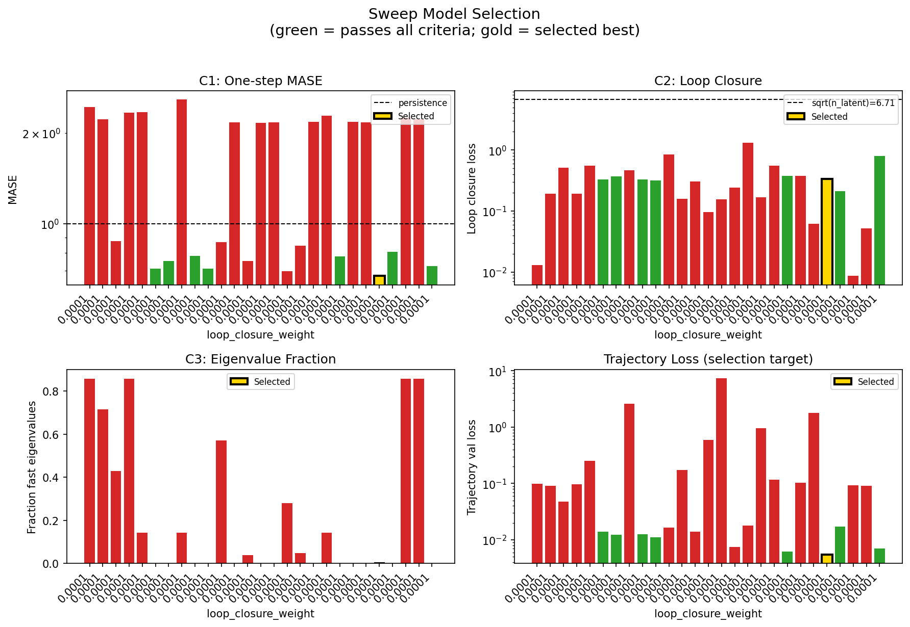

### sweep_pareto

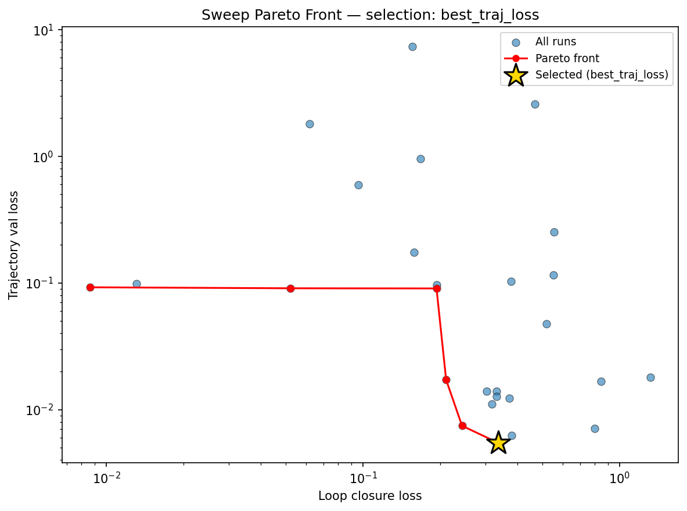

### reconstruction

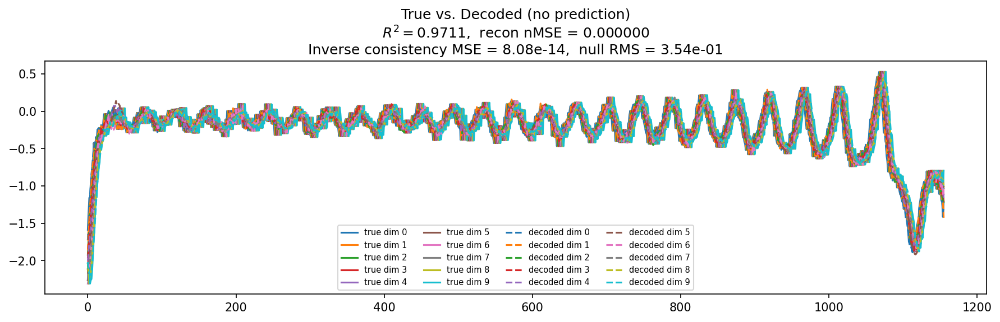

### prediction_windows

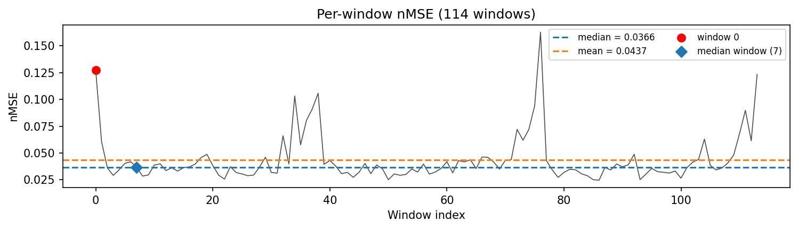

### long_trajectory

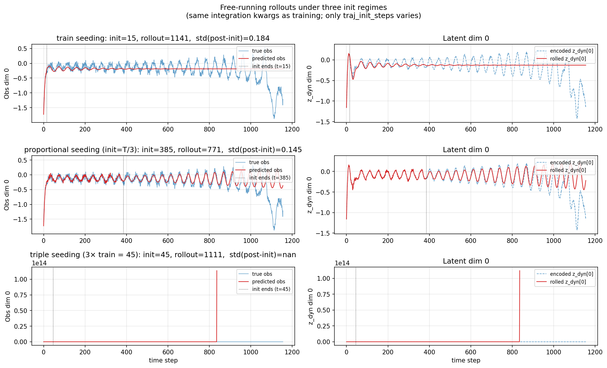

### mase

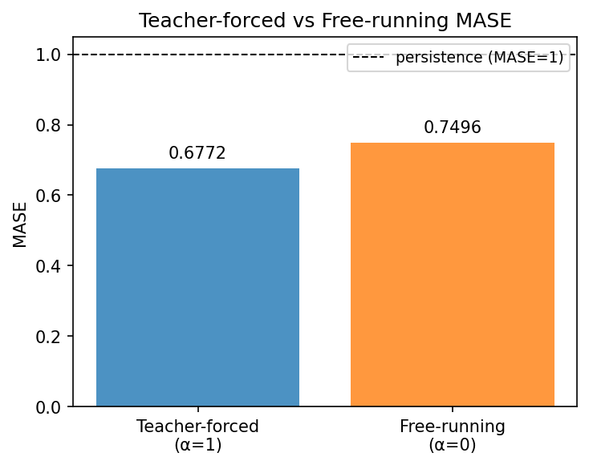

### latent_utilization

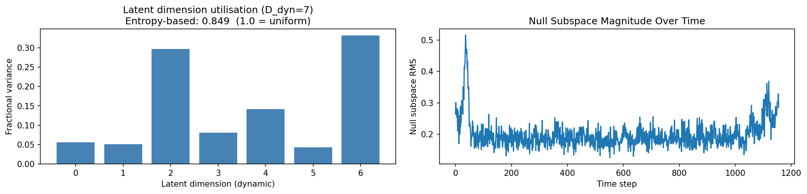

### lyapunov

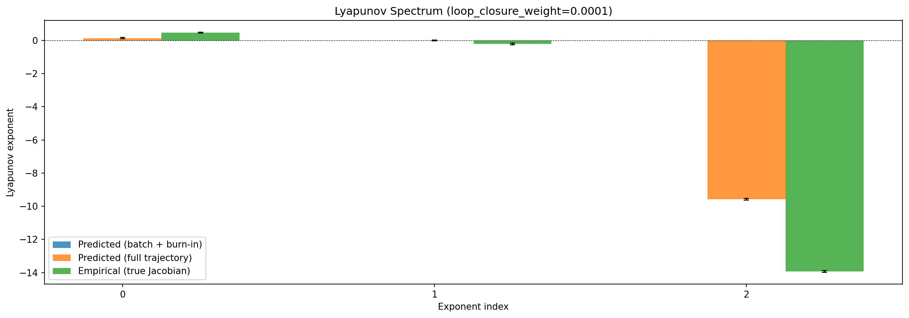

### kaplan_yorke

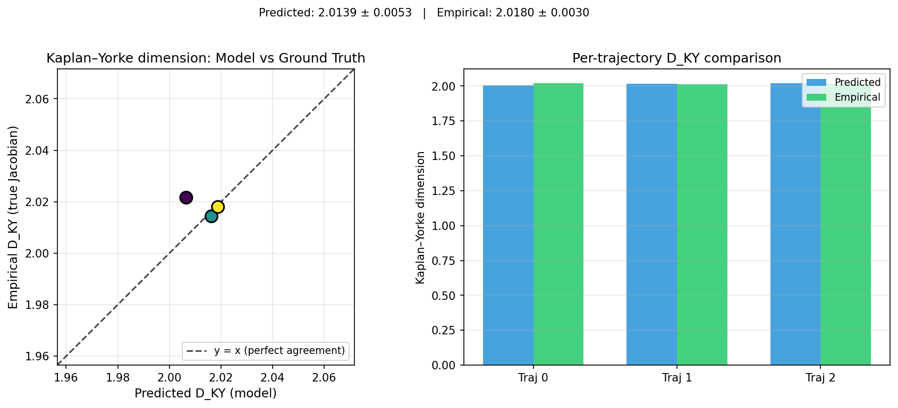

### per_run_lyapunov

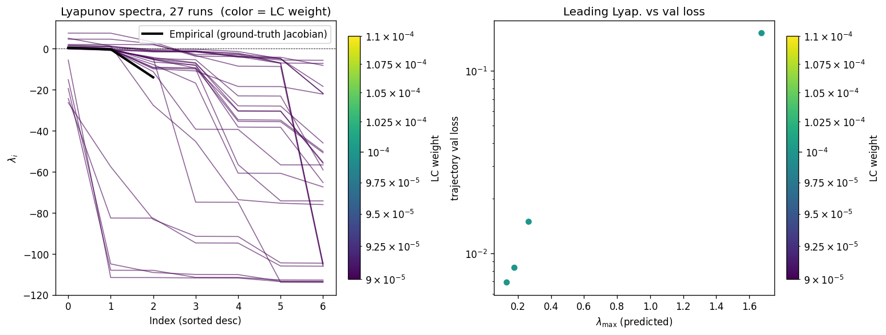

### per_run_lyapunov_vs_true

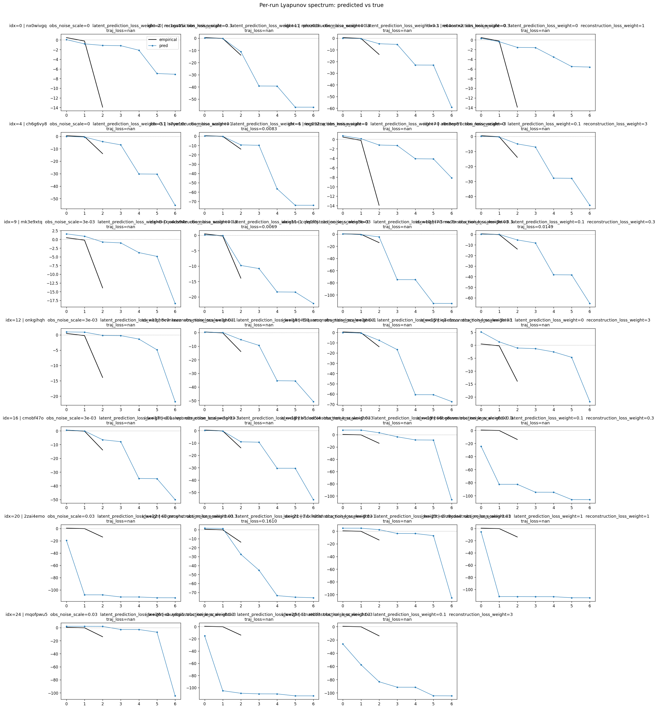

### per_run_lyapunov_relerr

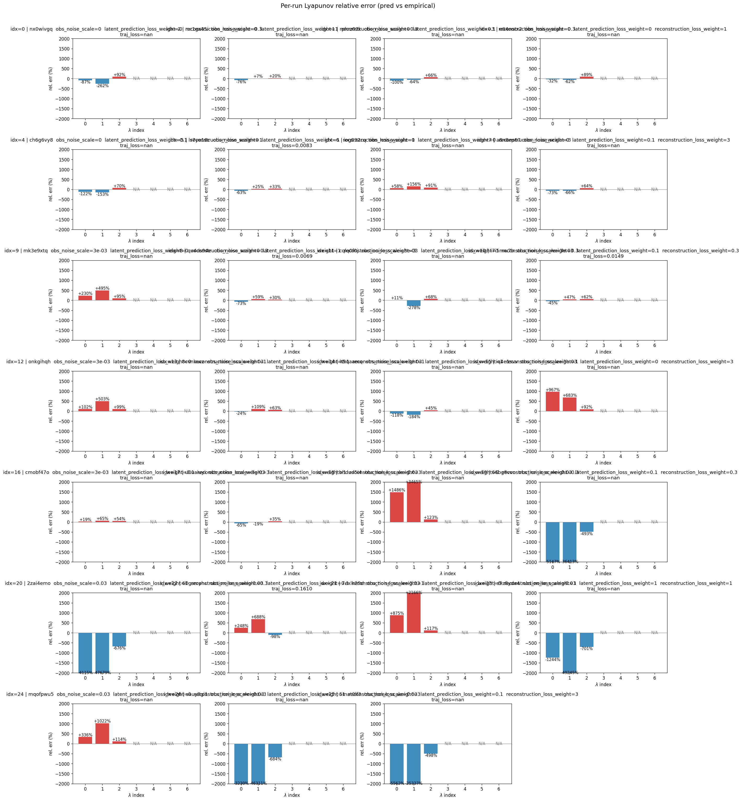

### encoder_decoder_jacobians

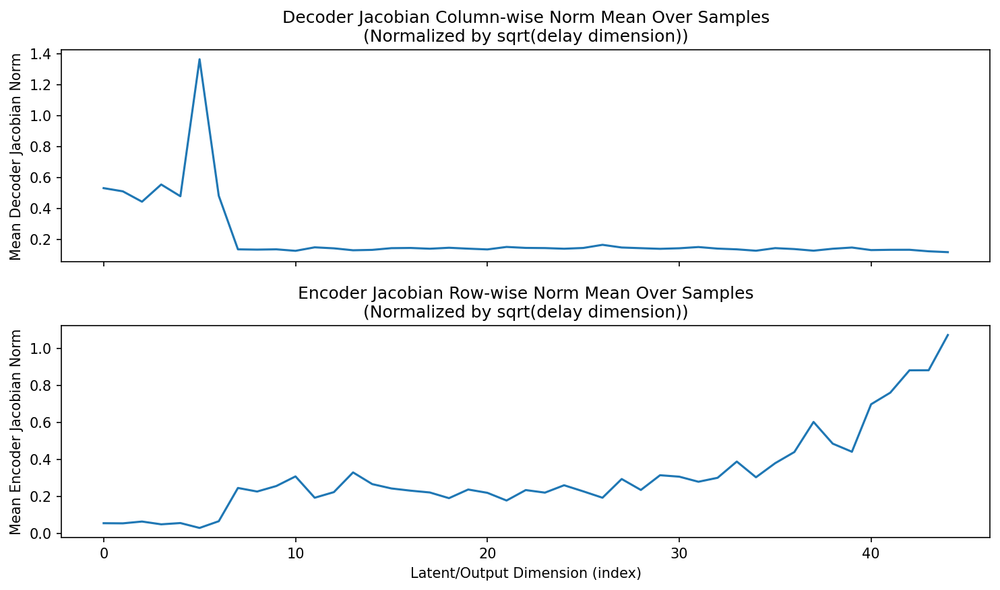

### amplification

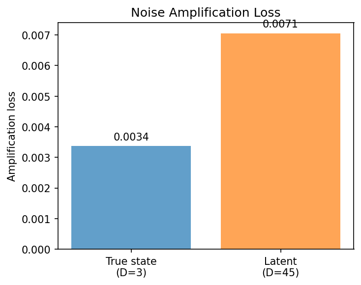

### kaplan_yorke_pca

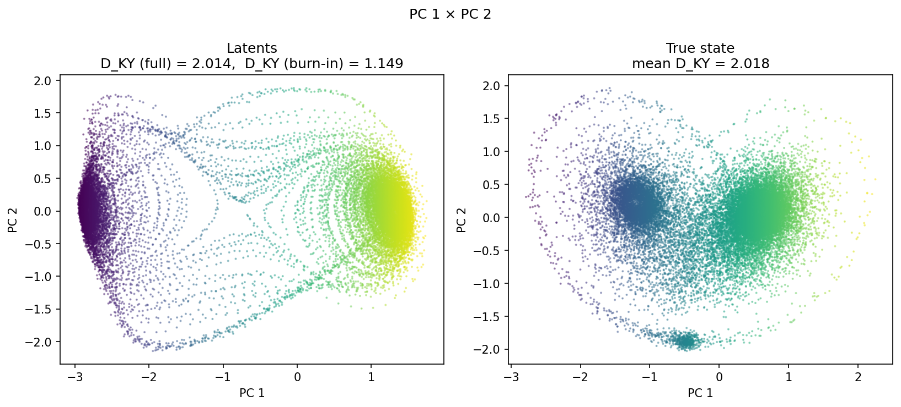

### prediction_detail_latent

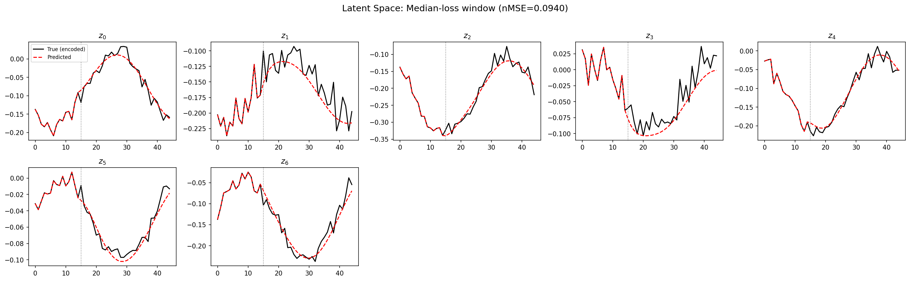

### prediction_detail_obs

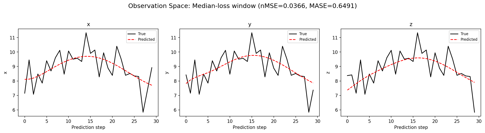

### tangent_spectrum

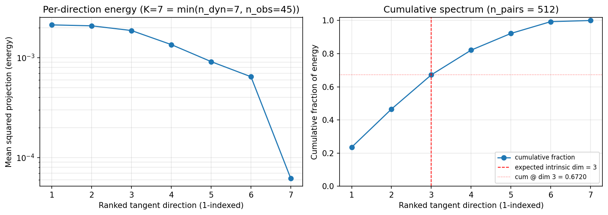

### per_run_tangent_spectrum

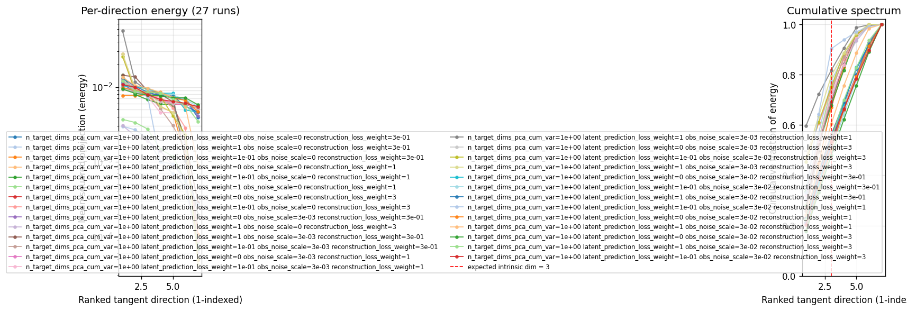

## Discussion

<!--
This section is intentionally left as a placeholder. A human reviewer
or Claude Code agent should fill it in based on the tables and figures
above, explicitly addressing each success criterion and comparing the
outcome to the stated hypothesis. Write the Discussion to
`discussion.md` in this directory and re-run `render_report`.
-->

_(to be written)_

## `run_analytics` stdout

<details><summary>Click to expand — full diagnostic output from <code>run_analytics</code></summary>

```
No run_id provided — selecting best run from group 'lorenz_partial_additive_uniformLC_p30_obsnoise005_nd45_init15_autodim_lc1em4__validation_3x3x3_sweep' ...
Found 27 total runs in JacobianODE/Lorenz_INDpartial_NDInitSweep_autodim_D1_NormTrue__JacobianODE (group=lorenz_partial_additive_uniformLC_p30_obsnoise005_nd45_init15_autodim_lc1em4__validation_3x3x3_sweep)
All runs (state, loop_closure_weight, tangent_entropy_weight, kl_dyn_weight):
  nx0wivgq: state=finished, lc=0.0001, te=0.0, kl_dyn=0.0
  mr1gx45i: state=finished, lc=0.0001, te=0.0, kl_dyn=0.0
  rphrz03k: state=finished, lc=0.0001, te=0.0, kl_dyn=0.0
  e64oorx2: state=finished, lc=0.0001, te=0.0, kl_dyn=0.0
  ch6g6vy8: state=finished, lc=0.0001, te=0.0, kl_dyn=0.0
  ls7ye16c: state=finished, lc=0.0001, te=0.0, kl_dyn=0.0
  iog032cq: state=finished, lc=0.0001, te=0.0, kl_dyn=0.0
  a8n8ep67: state=finished, lc=0.0001, te=0.0, kl_dyn=0.0
  mk3e9xtq: state=finished, lc=0.0001, te=0.0, kl_dyn=0.0
  qu4ds94e: state=finished, lc=0.0001, te=0.0, kl_dyn=0.0
  cqlq0f0j: state=finished, lc=0.0001, te=0.0, kl_dyn=0.0
  i7i5mw7b: state=finished, lc=0.0001, te=0.0, kl_dyn=0.0
  onkgihqh: state=finished, lc=0.0001, te=0.0, kl_dyn=0.0
  8cvnlawz: state=finished, lc=0.0001, te=0.0, kl_dyn=0.0
  lt9qaamq: state=finished, lc=0.0001, te=0.0, kl_dyn=0.0
  iq4e1svv: state=finished, lc=0.0001, te=0.0, kl_dyn=0.0
  cmobf47o: state=finished, lc=0.0001, te=0.0, kl_dyn=0.0
  u0uaiuyi: state=finished, lc=0.0001, te=0.0, kl_dyn=0.0
  bhdud5i4: state=finished, lc=0.0001, te=0.0, kl_dyn=0.0
  66bg8vvo: state=finished, lc=0.0001, te=0.0, kl_dyn=0.0
  2zai4emo: state=finished, lc=0.0001, te=0.0, kl_dyn=0.0
  60gsmyhc: state=finished, lc=0.0001, te=0.0, kl_dyn=0.0
  7exlk29d: state=finished, lc=0.0001, te=0.0, kl_dyn=0.0
  s9z8yda4: state=finished, lc=0.0001, te=0.0, kl_dyn=0.0
  mqofpwu5: state=finished, lc=0.0001, te=0.0, kl_dyn=0.0
  sauy8gi1: state=finished, lc=0.0001, te=0.0, kl_dyn=0.0
  5mat0lf3: state=finished, lc=0.0001, te=0.0, kl_dyn=0.0

slurm_timeout_min not found in any run config — falling back to 180 min
  Including nx0wivgq (lc=0.0001): use_all_runs=True (state=finished)
  Including mr1gx45i (lc=0.0001): use_all_runs=True (state=finished)
  Including rphrz03k (lc=0.0001): use_all_runs=True (state=finished)
  Including e64oorx2 (lc=0.0001): use_all_runs=True (state=finished)
  Including ch6g6vy8 (lc=0.0001): use_all_runs=True (state=finished)
  Including ls7ye16c (lc=0.0001): use_all_runs=True (state=finished)
  Including iog032cq (lc=0.0001): use_all_runs=True (state=finished)
  Including a8n8ep67 (lc=0.0001): use_all_runs=True (state=finished)
  Including mk3e9xtq (lc=0.0001): use_all_runs=True (state=finished)
  Including qu4ds94e (lc=0.0001): use_all_runs=True (state=finished)
  Including cqlq0f0j (lc=0.0001): use_all_runs=True (state=finished)
  Including i7i5mw7b (lc=0.0001): use_all_runs=True (state=finished)
  Including onkgihqh (lc=0.0001): use_all_runs=True (state=finished)
  Including 8cvnlawz (lc=0.0001): use_all_runs=True (state=finished)
  Including lt9qaamq (lc=0.0001): use_all_runs=True (state=finished)
  Including iq4e1svv (lc=0.0001): use_all_runs=True (state=finished)
  Including cmobf47o (lc=0.0001): use_all_runs=True (state=finished)
  Including u0uaiuyi (lc=0.0001): use_all_runs=True (state=finished)
  Including bhdud5i4 (lc=0.0001): use_all_runs=True (state=finished)
  Including 66bg8vvo (lc=0.0001): use_all_runs=True (state=finished)
  Including 2zai4emo (lc=0.0001): use_all_runs=True (state=finished)
  Including 60gsmyhc (lc=0.0001): use_all_runs=True (state=finished)
  Including 7exlk29d (lc=0.0001): use_all_runs=True (state=finished)
  Including s9z8yda4 (lc=0.0001): use_all_runs=True (state=finished)
  Including mqofpwu5 (lc=0.0001): use_all_runs=True (state=finished)
  Including sauy8gi1 (lc=0.0001): use_all_runs=True (state=finished)
  Including 5mat0lf3 (lc=0.0001): use_all_runs=True (state=finished)
Found 27 effectively-done sweep runs:
  loop_closure_weight=0.0001, tangent_entropy_weight=0.0, kl_dyn_weight=0.0 -> run_id=2zai4emo
  loop_closure_weight=0.0001, tangent_entropy_weight=0.0, kl_dyn_weight=0.0 -> run_id=5mat0lf3
  loop_closure_weight=0.0001, tangent_entropy_weight=0.0, kl_dyn_weight=0.0 -> run_id=60gsmyhc
  loop_closure_weight=0.0001, tangent_entropy_weight=0.0, kl_dyn_weight=0.0 -> run_id=66bg8vvo
  loop_closure_weight=0.0001, tangent_entropy_weight=0.0, kl_dyn_weight=0.0 -> run_id=7exlk29d
  loop_closure_weight=0.0001, tangent_entropy_weight=0.0, kl_dyn_weight=0.0 -> run_id=8cvnlawz
  loop_closure_weight=0.0001, tangent_entropy_weight=0.0, kl_dyn_weight=0.0 -> run_id=a8n8ep67
  loop_closure_weight=0.0001, tangent_entropy_weight=0.0, kl_dyn_weight=0.0 -> run_id=bhdud5i4
  loop_closure_weight=0.0001, tangent_entropy_weight=0.0, kl_dyn_weight=0.0 -> run_id=ch6g6vy8
  loop_closure_weight=0.0001, tangent_entropy_weight=0.0, kl_dyn_weight=0.0 -> run_id=cmobf47o
  loop_closure_weight=0.0001, tangent_entropy_weight=0.0, kl_dyn_weight=0.0 -> run_id=cqlq0f0j
  loop_closure_weight=0.0001, tangent_entropy_weight=0.0, kl_dyn_weight=0.0 -> run_id=e64oorx2
  loop_closure_weight=0.0001, tangent_entropy_weight=0.0, kl_dyn_weight=0.0 -> run_id=i7i5mw7b
  loop_closure_weight=0.0001, tangent_entropy_weight=0.0, kl_dyn_weight=0.0 -> run_id=iog032cq
  loop_closure_weight=0.0001, tangent_entropy_weight=0.0, kl_dyn_weight=0.0 -> run_id=iq4e1svv
  loop_closure_weight=0.0001, tangent_entropy_weight=0.0, kl_dyn_weight=0.0 -> run_id=ls7ye16c
  loop_closure_weight=0.0001, tangent_entropy_weight=0.0, kl_dyn_weight=0.0 -> run_id=lt9qaamq
  loop_closure_weight=0.0001, tangent_entropy_weight=0.0, kl_dyn_weight=0.0 -> run_id=mk3e9xtq
  loop_closure_weight=0.0001, tangent_entropy_weight=0.0, kl_dyn_weight=0.0 -> run_id=mqofpwu5
  loop_closure_weight=0.0001, tangent_entropy_weight=0.0, kl_dyn_weight=0.0 -> run_id=mr1gx45i
  loop_closure_weight=0.0001, tangent_entropy_weight=0.0, kl_dyn_weight=0.0 -> run_id=nx0wivgq
  loop_closure_weight=0.0001, tangent_entropy_weight=0.0, kl_dyn_weight=0.0 -> run_id=onkgihqh
  loop_closure_weight=0.0001, tangent_entropy_weight=0.0, kl_dyn_weight=0.0 -> run_id=qu4ds94e
  loop_closure_weight=0.0001, tangent_entropy_weight=0.0, kl_dyn_weight=0.0 -> run_id=rphrz03k
  loop_closure_weight=0.0001, tangent_entropy_weight=0.0, kl_dyn_weight=0.0 -> run_id=s9z8yda4
  loop_closure_weight=0.0001, tangent_entropy_weight=0.0, kl_dyn_weight=0.0 -> run_id=sauy8gi1
  loop_closure_weight=0.0001, tangent_entropy_weight=0.0, kl_dyn_weight=0.0 -> run_id=u0uaiuyi
n_dims=45, n_latent=45, n_dyn=7, dt=0.0150
  run=2zai4emo: DiagnosticMetrics(one_step_mase=2.4360949993133545, loop_closure_loss=0.013117926195263863, fast_eigenvalue_fraction=0.8571428656578064, trajectory_val_loss=0.09873409569263458) (from W&B history)
  run=5mat0lf3: DiagnosticMetrics(one_step_mase=2.219895601272583, loop_closure_loss=0.1933271437883377, fast_eigenvalue_fraction=0.7142857313156128, trajectory_val_loss=0.09048885107040405) (from W&B history)
  run=60gsmyhc: DiagnosticMetrics(one_step_mase=0.8754795789718628, loop_closure_loss=0.5172172784805298, fast_eigenvalue_fraction=0.4285714328289032, trajectory_val_loss=0.04759868234395981) (from W&B history)
  run=66bg8vvo: DiagnosticMetrics(one_step_mase=2.3345680236816406, loop_closure_loss=0.19352857768535614, fast_eigenvalue_fraction=0.8571428656578064, trajectory_val_loss=0.09678389877080917) (from W&B history)
  run=7exlk29d: DiagnosticMetrics(one_step_mase=2.338701009750366, loop_closure_loss=0.5559774041175842, fast_eigenvalue_fraction=0.1428571492433548, trajectory_val_loss=0.2513854205608368) (from W&B history)
  run=8cvnlawz: DiagnosticMetrics(one_step_mase=0.7091180086135864, loop_closure_loss=0.33120521903038025, fast_eigenvalue_fraction=0.0, trajectory_val_loss=0.013893118128180504) (from W&B history)
  run=a8n8ep67: DiagnosticMetrics(one_step_mase=0.7533082962036133, loop_closure_loss=0.3722366690635681, fast_eigenvalue_fraction=0.0, trajectory_val_loss=0.012269080616533756) (from W&B history)
  run=bhdud5i4: DiagnosticMetrics(one_step_mase=2.5762674808502197, loop_closure_loss=0.46685370802879333, fast_eigenvalue_fraction=0.1428571492433548, trajectory_val_loss=2.595248222351074) (from W&B history)
  run=ch6g6vy8: DiagnosticMetrics(one_step_mase=0.7837777733802795, loop_closure_loss=0.3305754065513611, fast_eigenvalue_fraction=0.0, trajectory_val_loss=0.012691613286733627) (from W&B history)
  run=cmobf47o: DiagnosticMetrics(one_step_mase=0.7109522819519043, loop_closure_loss=0.3180679380893707, fast_eigenvalue_fraction=0.0, trajectory_val_loss=0.011075166054069996) (from W&B history)
  run=cqlq0f0j: DiagnosticMetrics(one_step_mase=0.8696073293685913, loop_closure_loss=0.8461429476737976, fast_eigenvalue_fraction=0.5714285969734192, trajectory_val_loss=0.016667645424604416) (from W&B history)
  run=e64oorx2: DiagnosticMetrics(one_step_mase=2.1650121212005615, loop_closure_loss=0.1581691950559616, fast_eigenvalue_fraction=0.0, trajectory_val_loss=0.17383629083633423) (from W&B history)
  run=i7i5mw7b: DiagnosticMetrics(one_step_mase=0.7535693645477295, loop_closure_loss=0.30259373784065247, fast_eigenvalue_fraction=0.038928572088479996, trajectory_val_loss=0.014027570374310017) (from W&B history)
  run=iog032cq: DiagnosticMetrics(one_step_mase=2.1599626541137695, loop_closure_loss=0.09590677917003632, fast_eigenvalue_fraction=0.0, trajectory_val_loss=0.5935933589935303) (from W&B history)
  run=iq4e1svv: DiagnosticMetrics(one_step_mase=2.1646103858947754, loop_closure_loss=0.15538303554058075, fast_eigenvalue_fraction=0.0, trajectory_val_loss=7.337440013885498) (from W&B history)
  run=ls7ye16c: DiagnosticMetrics(one_step_mase=0.6976839303970337, loop_closure_loss=0.24313640594482422, fast_eigenvalue_fraction=0.279285728931427, trajectory_val_loss=0.007446702569723129) (from W&B history)
  run=lt9qaamq: DiagnosticMetrics(one_step_mase=0.8451600670814514, loop_closure_loss=1.3170346021652222, fast_eigenvalue_fraction=0.04821428656578064, trajectory_val_loss=0.018028603866696358) (from W&B history)
  run=mk3e9xtq: DiagnosticMetrics(one_step_mase=2.1761395931243896, loop_closure_loss=0.1674010455608368, fast_eigenvalue_fraction=0.0, trajectory_val_loss=0.9610229730606079) (from W&B history)
  run=mqofpwu5: DiagnosticMetrics(one_step_mase=2.2795989513397217, loop_closure_loss=0.5516365170478821, fast_eigenvalue_fraction=0.1428571492433548, trajectory_val_loss=0.115936279296875) (from W&B history)
  run=mr1gx45i: DiagnosticMetrics(one_step_mase=0.7808684706687927, loop_closure_loss=0.38030901551246643, fast_eigenvalue_fraction=0.0, trajectory_val_loss=0.006253487896174192) (from W&B history)
  run=nx0wivgq: DiagnosticMetrics(one_step_mase=2.1709353923797607, loop_closure_loss=0.3775634765625, fast_eigenvalue_fraction=0.0, trajectory_val_loss=0.10286027938127518) (from W&B history)
  run=onkgihqh: DiagnosticMetrics(one_step_mase=2.1679232120513916, loop_closure_loss=0.06197051703929901, fast_eigenvalue_fraction=0.0, trajectory_val_loss=1.797768235206604) (from W&B history)
  run=qu4ds94e: DiagnosticMetrics(one_step_mase=0.6717880964279175, loop_closure_loss=0.33629414439201355, fast_eigenvalue_fraction=0.0, trajectory_val_loss=0.005459796171635389) (from W&B history)
  run=rphrz03k: DiagnosticMetrics(one_step_mase=0.8077051043510437, loop_closure_loss=0.21078620851039886, fast_eigenvalue_fraction=0.0, trajectory_val_loss=0.01716083101928234) (from W&B history)
  run=s9z8yda4: DiagnosticMetrics(one_step_mase=2.2446839809417725, loop_closure_loss=0.008632775396108627, fast_eigenvalue_fraction=0.8571428656578064, trajectory_val_loss=0.0923885628581047) (from W&B history)
  run=sauy8gi1: DiagnosticMetrics(one_step_mase=2.2134625911712646, loop_closure_loss=0.05201994255185127, fast_eigenvalue_fraction=0.8571428656578064, trajectory_val_loss=0.09075377136468887) (from W&B history)
  run=u0uaiuyi: DiagnosticMetrics(one_step_mase=0.7233379483222961, loop_closure_loss=0.8008866906166077, fast_eigenvalue_fraction=0.0, trajectory_val_loss=0.007085119374096394) (from W&B history)

Ranking method:           best_traj_loss
Best run ID:              qu4ds94e
Best loop_closure_weight: 0.0001
Best tangent_entropy_weight: 0.0
Best kl_dyn_weight:       0.0
Best traj loss:           0.005460
Criteria applied: ['C1', 'C2', 'C3']
Surviving: 8 / 27
Auto-selected run_id: qu4ds94e

======================================================================
PARETO FRONTIER RUNS (6 runs)
======================================================================
  Run ID               LC Loss   Traj Val Loss
  ------------  --------------  --------------
  s9z8yda4            0.008633        0.092389
  sauy8gi1            0.052020        0.090754
  5mat0lf3            0.193327        0.090489
  rphrz03k            0.210786        0.017161
  ls7ye16c            0.243136        0.007447
  qu4ds94e            0.336294        0.005460 <-- selected

======================================================================
RANKING METHOD COMPARISON (over 8 survivors)
======================================================================
  Method                  Run ID               LC Loss   Traj Val Loss
  ----------------------  ------------  --------------  --------------
  best_traj_loss          qu4ds94e            0.336294        0.005460 <-- active
  pareto_knee             cmobf47o            0.318068        0.011075
  geo_rank                qu4ds94e            0.336294        0.005460
  minimax_rank            cmobf47o            0.318068        0.011075
  geo_log_score           qu4ds94e            0.336294        0.005460
  minimax_log_score       qu4ds94e            0.336294        0.005460
======================================================================

Loading run qu4ds94e from JacobianODE/Lorenz_INDpartial_NDInitSweep_autodim_D1_NormTrue__JacobianODE ...
Train dataset shape: torch.Size([24442, 45, 45])
Validation dataset shape: torch.Size([7777, 45, 45])
Test dataset shape: torch.Size([3333, 45, 45])
Train trajectories dataset shape: torch.Size([22, 1156, 45])
Validation trajectories dataset shape: torch.Size([7, 1156, 45])
Test trajectories dataset shape: torch.Size([3, 1156, 45])
Loading checkpoint epoch=102-step=20600.ckpt...
Computing reconstruction ...
Computing MASE ...
Teacher-forced MASE: 0.6772
Free-running MASE:   0.7496
Computing latent utilization ...
Entropy-based utilization: 0.849
Null subspace mean RMS: 2.037045e-01
Computing Lyapunov exponents ...
  Computing full-trajectory Lyapunov (3 test trajs, T=1156) ...
Predicted Lyapunov exponents (batch+burn-in, 128 windowed trajs):
  λ_1 = +nan ± nan
  λ_2 = +nan ± nan
  λ_3 = +nan ± nan
  λ_4 = +nan ± nan
  λ_5 = +nan ± nan
  λ_6 = +nan ± nan
  λ_7 = +nan ± nan
Predicted Lyapunov exponents (full-length, 3 test trajs):
  λ_1 = +0.1390 ± 0.0454
  λ_2 = -0.0056 ± 0.0195
  λ_3 = -9.5809 ± 0.0554
  λ_4 = -10.3499 ± 0.1011
  λ_5 = -19.0176 ± 0.0536
  λ_6 = -19.0573 ± 0.0282
  λ_7 = -22.6168 ± 0.0539
Empirical Lyapunov exponents (mean ± std):
  λ_1 = +0.4677 ± 0.0259
  λ_2 = -0.2173 ± 0.0549
  λ_3 = -13.9174 ± 0.0513
Mean KY dim (predicted): 2.014 ± 0.005
Mean KY dim (empirical): 2.018 ± 0.003
Mean KY dim (burn-in):   1.149 ± 0.722
Computing prediction windows ...
Windows: 114 — nMSE min=0.0247, median=0.0366, mean=0.0437, max=0.1627
Computing long-trajectory free-running rollouts ...
Computing encoder/decoder Jacobians ...
encoder_jacobian: (128, 45, 45)
decoder_jacobian: (128, 45, 45)
Computing amplification loss ...
Amplification loss — True state: 0.003366
Amplification loss — Latent:     0.007055
Computing tangent space spectrum ...
```

</details>
