# Sweep Analysis: `lorenz_partial_smoke_p30_nd30_fnnautodim`

**Project**: [Lorenz_INDpartial_NDInitSweep_autodim_D1_NormTrue__JacobianODE](https://wandb.ai/JacobianODE/Lorenz_INDpartial_NDInitSweep_autodim_D1_NormTrue__JacobianODE/groups/lorenz_partial_smoke_p30_nd30_fnnautodim)  
**Launched**: 2026-04-26T18:10:12Z  
**Completed**: 2026-04-26T18:52:41Z  
**Outcome**: `complete_clean`  
**Git**: `latent-JacobianODE` @ `758b604`  
**Expected runs**: 1

## Experiment Context

### `lorenz_partial_smoke_p30_nd30_fnnautodim`

**Description**

Lorenz partial-obs smoke for FNN autodim. n_delays=30, obs_noise=0.05,
additive coupling, split-mode loss. 5 epochs only — purpose is to
validate the FNN autodim code path, not to train a useful model.

**Hypothesis**

With model.n_target_dim_method='fnn' and n_delays=30 (where the
whitened-PCA-FNN k=1 stop-at-min diagnostic robustly returned dim=3
across all noise levels), the autodim path should pick
n_target_dims=3 and training should proceed without error.

**Success criteria**

- Autodim resolves to n_target_dims=3 (logged as n_target_dims_fnn_auto)
- Run completes 5 epochs without divergence

## Results

**Chosen run** (by `best_traj_loss`): `4qs9wmdf` — traj_loss=0.10308, MASE=3.1917, R²=0.7184, LC loss=0.275, epoch=3.0

**Runs analyzed**: 1 (expected 1)

### Per-run results

| run_idx | run_id | best_traj_loss | best_MASE | R² | LC loss | epoch |
|---|---|---|---|---|---|---|
| 0 | `4qs9wmdf` | 0.10308 | 3.1917 | 0.7184 | 0.275 | 3.0 |

## Success-criteria verdicts (automated)

| Criterion | Verdict | Note |
|---|---|---|
| Autodim resolves to n_target_dims=3 (logged as n_target_dims_fnn_auto) | **Unknown** |  |
| Run completes 5 epochs without divergence | **Unknown** |  |

_Automated verdicts use simple numeric-threshold parsing and may mis-classify qualitative criteria. The Discussion section below takes precedence._

## Figures

### sweep_overview

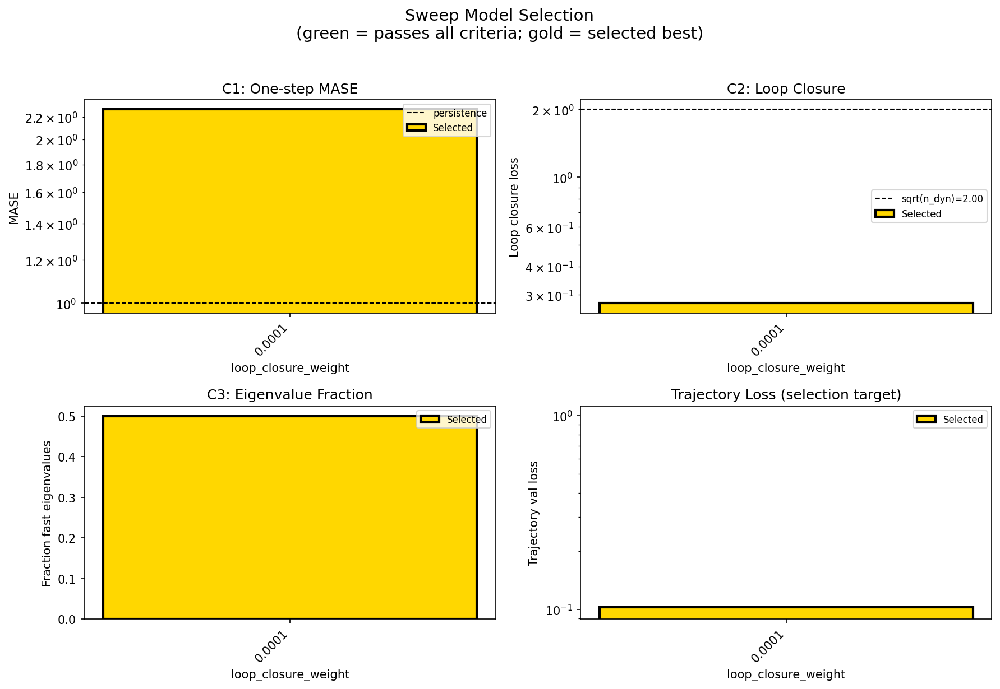

### sweep_pareto

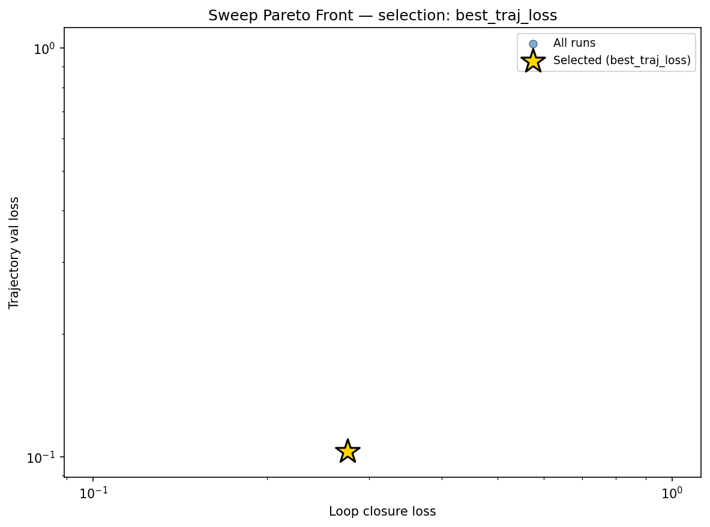

### reconstruction

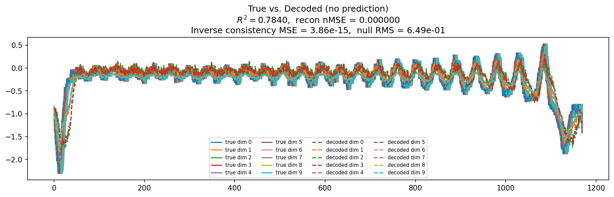

### prediction_windows

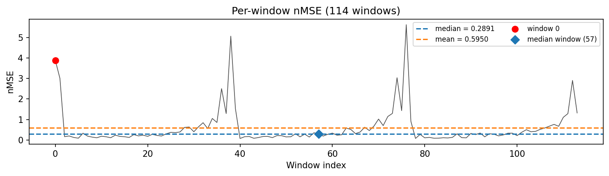

### long_trajectory

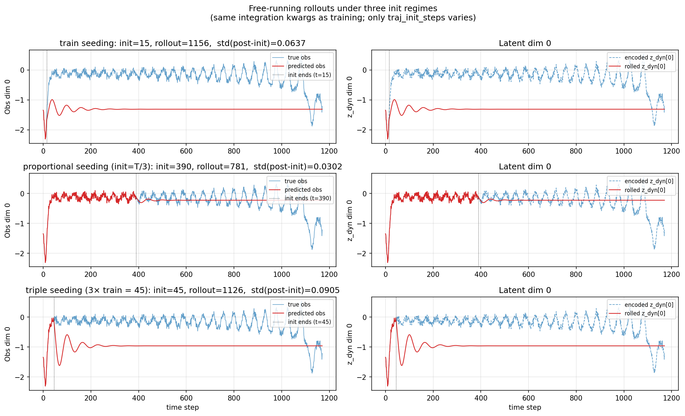

### mase

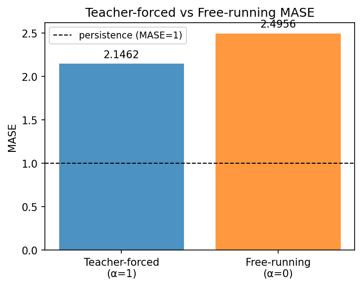

### latent_utilization

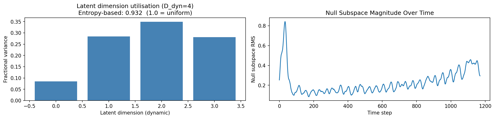

### lyapunov

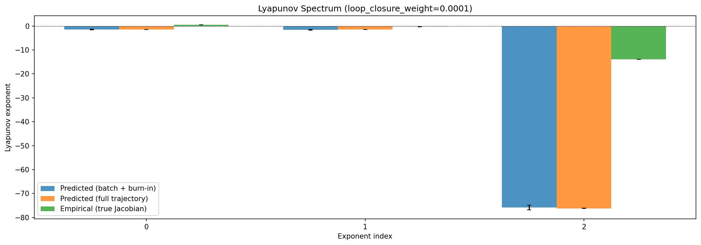

### kaplan_yorke


### per_run_lyapunov

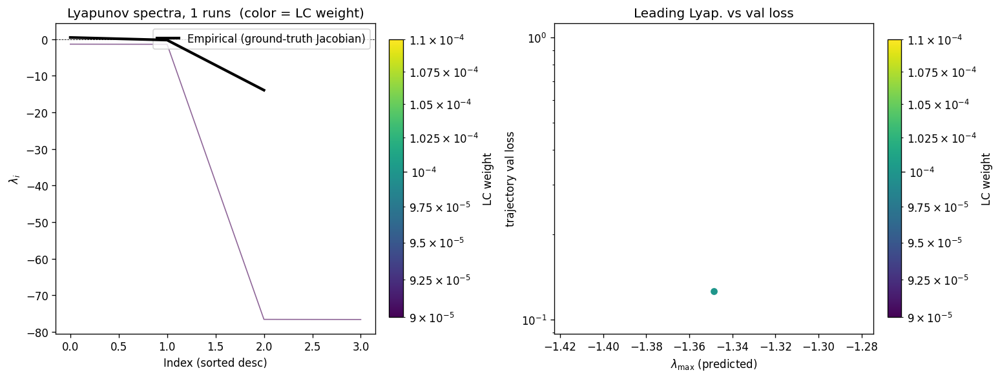

### per_run_lyapunov_vs_true

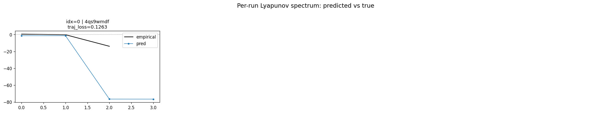

### per_run_lyapunov_relerr

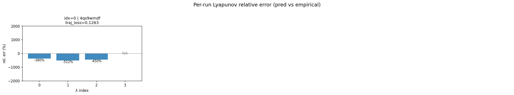

### encoder_decoder_jacobians

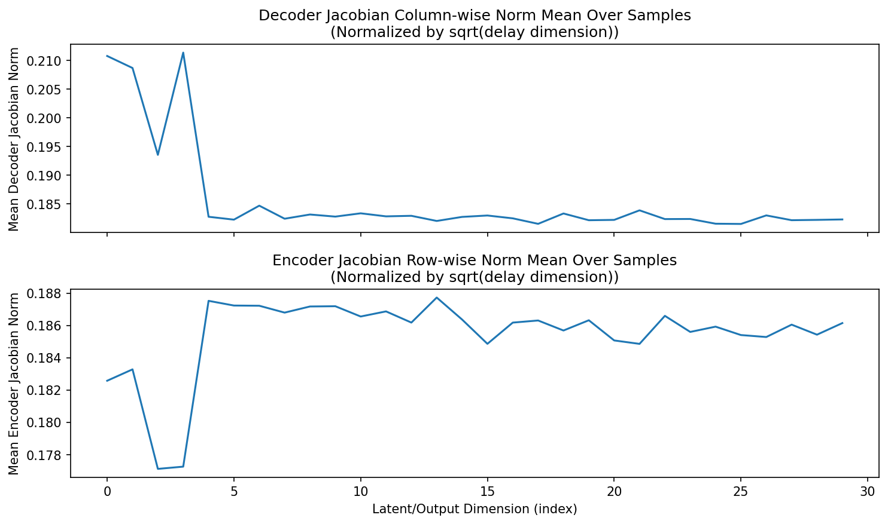

### amplification

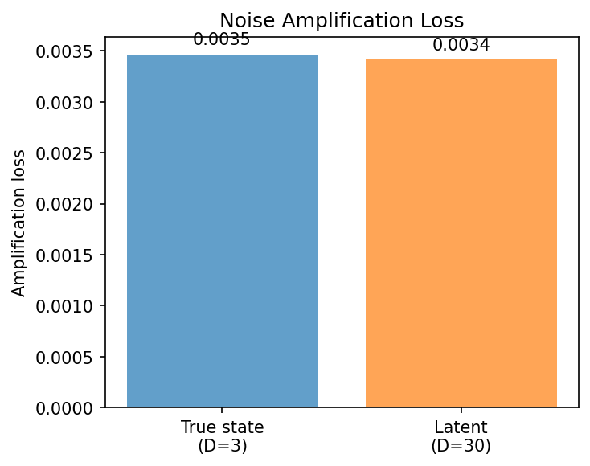

### kaplan_yorke_pca

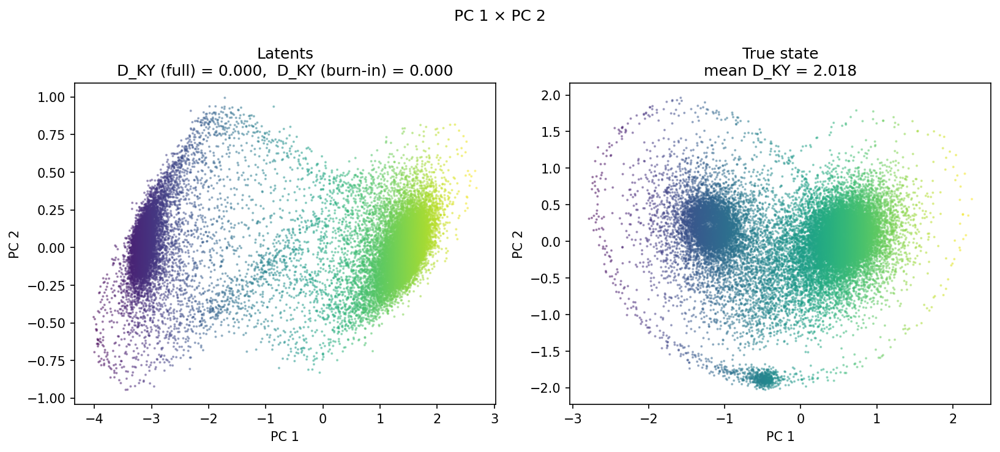

### prediction_detail_latent

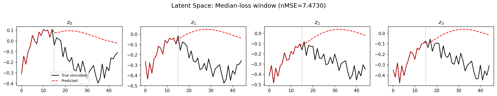

### prediction_detail_obs

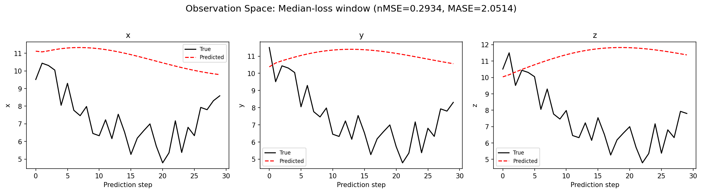

### tangent_spectrum

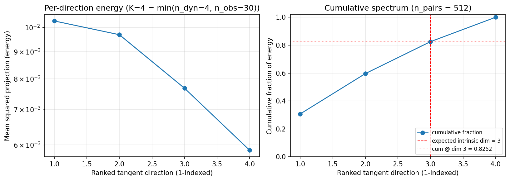

### per_run_tangent_spectrum

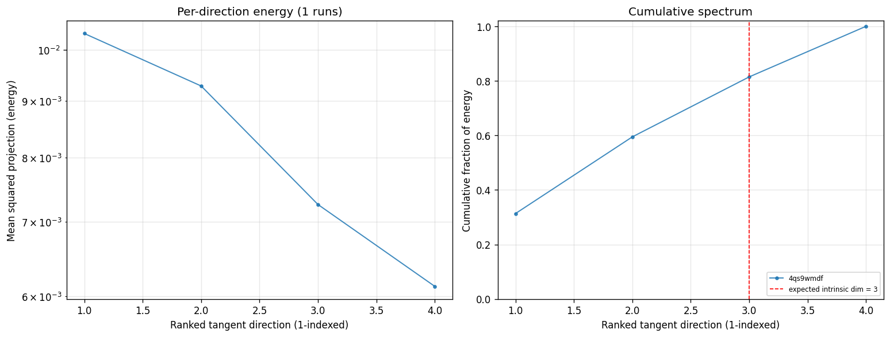

## Discussion

<!--
This section is intentionally left as a placeholder. A human reviewer
or Claude Code agent should fill it in based on the tables and figures
above, explicitly addressing each success criterion and comparing the
outcome to the stated hypothesis. Write the Discussion to
`discussion.md` in this directory and re-run `render_report`.
-->

_(to be written)_

## `run_analytics` stdout

<details><summary>Click to expand — full diagnostic output from <code>run_analytics</code></summary>

```
No run_id provided — selecting best run from group 'lorenz_partial_smoke_p30_nd30_fnnautodim' ...
Found 1 total runs in JacobianODE/Lorenz_INDpartial_NDInitSweep_autodim_D1_NormTrue__JacobianODE (group=lorenz_partial_smoke_p30_nd30_fnnautodim)
All runs (state, loop_closure_weight, tangent_entropy_weight, kl_dyn_weight):
  4qs9wmdf: state=finished, lc=0.0001, te=0.0, kl_dyn=0.0

slurm_timeout_min not found in any run config — falling back to 180 min
  Including 4qs9wmdf (lc=0.0001): use_all_runs=True (state=finished)
Found 1 effectively-done sweep runs:
  loop_closure_weight=0.0001, tangent_entropy_weight=0.0, kl_dyn_weight=0.0 -> run_id=4qs9wmdf
n_dims=30, n_latent=30, n_dyn=4, dt=0.0150
  run=4qs9wmdf: DiagnosticMetrics(one_step_mase=2.2717182636260986, loop_closure_loss=0.27524083852767944, fast_eigenvalue_fraction=0.5, trajectory_val_loss=0.10307984054088593) (from W&B history)

Ranking method:           best_traj_loss
Best run ID:              4qs9wmdf
Best loop_closure_weight: 0.0001
Best tangent_entropy_weight: 0.0
Best kl_dyn_weight:       0.0
Best traj loss:           0.103080
Criteria applied: []
Surviving: 1 / 1
Auto-selected run_id: 4qs9wmdf

======================================================================
PARETO FRONTIER RUNS (1 runs)
======================================================================
  Run ID               LC Loss   Traj Val Loss
  ------------  --------------  --------------
  4qs9wmdf            0.275241        0.103080 <-- selected

======================================================================
RANKING METHOD COMPARISON (over 1 survivors)
======================================================================
  Method                  Run ID               LC Loss   Traj Val Loss
  ----------------------  ------------  --------------  --------------
  best_traj_loss          4qs9wmdf            0.275241        0.103080 <-- active
  pareto_knee             4qs9wmdf            0.275241        0.103080
  geo_rank                4qs9wmdf            0.275241        0.103080
  minimax_rank            4qs9wmdf            0.275241        0.103080
  geo_log_score           4qs9wmdf            0.275241        0.103080
  minimax_log_score       4qs9wmdf            0.275241        0.103080
======================================================================

Loading run 4qs9wmdf from JacobianODE/Lorenz_INDpartial_NDInitSweep_autodim_D1_NormTrue__JacobianODE ...
Loading checkpoint epoch=3-step=200.ckpt...
Train dataset shape: torch.Size([24772, 45, 30])
Validation dataset shape: torch.Size([7882, 45, 30])
Test dataset shape: torch.Size([3378, 45, 30])
Train trajectories dataset shape: torch.Size([22, 1171, 30])
Validation trajectories dataset shape: torch.Size([7, 1171, 30])
Test trajectories dataset shape: torch.Size([3, 1171, 30])
Loading checkpoint epoch=3-step=200.ckpt...
Computing reconstruction ...
Computing MASE ...
Teacher-forced MASE: 2.1462
Free-running MASE:   2.4956
Computing latent utilization ...
Entropy-based utilization: 0.932
Null subspace mean RMS: 2.537502e-01
Computing Lyapunov exponents ...
  Computing full-trajectory Lyapunov (3 test trajs, T=1171) ...
Predicted Lyapunov exponents (batch+burn-in, 128 windowed trajs):
  λ_1 = -1.4347 ± 0.1352
  λ_2 = -1.5584 ± 0.1125
  λ_3 = -75.8424 ± 0.9143
  λ_4 = -75.9782 ± 0.8983
Predicted Lyapunov exponents (full-length, 3 test trajs):
  λ_1 = -1.4538 ± 0.0028
  λ_2 = -1.4815 ± 0.0034
  λ_3 = -76.2261 ± 0.0444
  λ_4 = -76.2559 ± 0.0380
Empirical Lyapunov exponents (mean ± std):
  λ_1 = +0.4677 ± 0.0259
  λ_2 = -0.2173 ± 0.0549
  λ_3 = -13.9174 ± 0.0513
Mean KY dim (predicted): 0.000 ± 0.000
Mean KY dim (empirical): 2.018 ± 0.003
Mean KY dim (burn-in):   0.000 ± 0.000
Computing prediction windows ...
Windows: 114 — nMSE min=0.0725, median=0.2891, mean=0.5950, max=5.6299
Computing long-trajectory free-running rollouts ...
Computing encoder/decoder Jacobians ...
encoder_jacobian: (128, 30, 30)
decoder_jacobian: (128, 30, 30)
Computing amplification loss ...
Amplification loss — True state: 0.003467
Amplification loss — Latent:     0.003415
Computing tangent space spectrum ...
```

</details>
